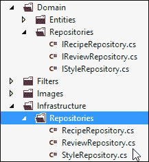

# 六、编写可维护的代码

意大利面代码。大泥球。如果你已经写了至少几年的代码，你很可能知道这些术语。你肯定已经看到或者可能促成了一个如此不可维护的项目，以至于你打赌它会在自己的重压下崩溃。然而，如果你退后一步，深入挖掘这个项目的历史，你可能会发现它是从高尚的意图开始的。

没有人开始写坏代码。没有人开始编写不可维护的代码。无论是项目按时完成的紧迫性、无法解释地投入生产的概念验证代码，还是其他一些业务外力，有时我们最终只是编写了无法维护的代码。

在这一章中，我们将讨论如何设计我们的类和构建我们的应用，以使其更易维护，并通过代理，通过探索类设计的固体原则使其更易测试。如果坚持这些原则，并不能保证我们不会创建下一代开发人员会抱怨的项目。然而，它们确实让事情变得更加困难。一旦我们研究了这些原则，我们将把它们应用于酿酒。

# 固体原理

固体原则是五个面向对象的类设计原则的集合。罗伯特·马丁在 **SOLID** 首字母缩略词中加入的原则本身是首字母缩略词: **SRP** 、 **OCP** 、 **LSP** 、 **ISP** 和 **DIP** 。我们将在课堂设计中充分利用这些原则。

## 单一责任原则

**单一责任原则** ( **SRP** ) 可以不严谨地翻译为“做一件事，把它做好。”如果你发现自己描述一个类或方法的功能时说它做了“A”和“B”，你很可能违反了这个原则。考虑我们的控制器。

有人可能会说我们的应用的`RecipeController`类违反了 SRP，因为它目前代表用户检索数据，将数据翻译成适合视图的格式，要么将请求的视图返回给用户，要么将它们重新路由到合适的视图。有很多工作要做。然而，如果我们声明我们应用的`RecipeController`类的意图是基于用户输入为视图检索数据，我们可能会丢失“和”，这听起来并不那么糟糕——毕竟，这是控制器应该做的。

也许更好的例子是考虑一个负责管理用户的类。这个假设的类只是创建、检索、修改和删除用户。

```cs
public class UserManager
{
    public void CreateUser(User user) { /* … */ }
    public void GetUser(UserId userId) { /* … */ }
    public void UpdateUser(User user) { /* … */ }
    public void DeleteUser(User user) { /* … */ }
}
```

用一个单一的类来管理用户将遵循 SRP。然而，如果有人决定用类的`create`方法构造电子邮件并发送给新用户，那么这个类现在就违反了 SRP。它现在负责维护用户并与他们交流。

因此，罗伯特·马丁更好地总结了这一点，他说，如果一个类改变的原因不止一个，它就违反了 SRP。

## 开启关闭原理

**开放封闭原则** ( **OCP** ) 规定软件组件“应该开放扩展，关闭修改。”简单地说，如果一个类需要改变它的行为，那么这个行为应该通过面向对象的设计技术来改变，比如继承或者合成。

假设您有一个名为`Transfer`的方法，该方法旨在两个独立账户之间转移资金。写这门课的时候，有关于在任何一天可以从一个账户转账多少钱的规定，金额取决于账户类型。

```cs
public void Transfer(Account fromAccount, Account toAccount)
{
  switch (fromAccount.Type)
  {
    case AccountType.Checking:
      if (fromAccount.DailyAmountTransferred < 500)
      {
        // Transfer funds.
      }
      break;
    case AccountType.Savings:
      if (fromAccount.DailyAmountTransferred < 300)
      {
        // Transfer funds.
      }
  }
  // Other logic.
}
```

如果增加`MoneyMarket`的新账户类型，或者简单地说，改变每日限额，会发生什么？随着代码的编写，这些变化中的任何一个都需要修改`Transfer`方法来支持扩展。如果`Transfer`方法不知道账户的类型和限额就更好了。

要让`Transfer`方法无知，我们需要让我们的`Account`类更聪明一点。如果我们将属性添加到`Account`类中，以向`Transfer`方法提供从账户转出的每日金额以及转账限额，`Transfer`方法可以支持现在或将来存在的任何账户类型。

```cs
public void Transfer(Account fromAccount, Account toAccount)
{
  if (fromAccount.DailyAmountTransferred < 
    fromAccount.DailyAmountAllowed)
  {
    // Transfer funds.
  }
}
```

这段代码将更易于维护，并且符合 OCP 的要求。转移对扩展开放，但对修改关闭。

### 注

严格遵守 OCP 通常意味着源代码和二进制输出都不允许修改。虽然这对于较大的企业应用来说是实用和理想的，但出于我们的目的，我们将仅将其应用于源代码。

## 利斯科夫替代原理

**利斯科夫替换原则** ( **LSP** ) 规定，如果两个对象 A 和 B 是对象 Z 的子类型，那么任何对类型 Z 的对象进行操作的方法或类都可以对类型 A 或类型 B 的对象进行操作，而不改变应用的行为。

假设类`Train`和`Motorcycle`都是类`Vehicle`的子类型。让我们假设我们还有一个名为`Navigate`的类，它对传递给它的`Vehicle`类进行操作。如果`Navigate`类的一个实例被发送一个类型为`Train`的实例，并且它指示类型为`Train`的实例向左转，会发生什么？这当然会改变应用的行为，我无法想象它会在火车上有好的结局。

## 界面分离原理

你有没有发现自己实现了一个`interface`或者`abstract`类，并且对大多数定义的方法抛出了`NotImplementedException`异常？很有可能你实现的接口违反了**接口隔离原则** ( **ISP** )。

ISP 规定接口——在这种情况下，任何实现都应该遵守的契约——应该小而具体。你可能还记得在[第 5 章](05.html "Chapter 5. The BrewHow Domain and Domain-driven Design")*中对 CQRS 的简短提及【酿酒领域和领域驱动设计】*。在 CQRS，针对数据存储的命令与旨在从同一数据存储中检索数据的查询是分开的。在 CQRS，由我们的存储库实现两个接口是完全合理和理想的:一个用于向数据存储提交数据，另一个用于检索数据。

如果你想要一个很多人认为明显违反这一原则的具体例子，你可能想看看老的 ASP.NET 成员资格 API。

```cs
public abstract class MembershipProvider : ProviderBase
{
  public abstract bool ChangePassword(/* ... */)
  public abstract bool 
    ChangePasswordQuestionAndAnswer(/* ... */)
  public abstract MembershipUser CreateUser(/* ... */)
  public abstract bool DeleteUser(/* ... */)
  public abstract MembershipUserCollection 
    FindUsersByEmail(/* ... */)
  public abstract MembershipUserCollection 
    FindUsersByName(/* ... */)
  public abstract MembershipUserCollection 
    GetAllUsers(/* ... */)
  public abstract int GetNumberOfUsersOnline();
  public abstract string GetPassword(/* ... */)
  public abstract MembershipUser GetUser(/* ... */)
  public abstract MembershipUser GetUser(/* ... */)
  public abstract string GetUserNameByEmail(/* ... */)
  public abstract string ResetPassword(/* ... */)
  public abstract bool UnlockUser(/* ... */)
  public abstract void UpdateUser(/* ... */)
  public abstract bool ValidateUser(/* ... */)

  public abstract string ApplicationName { get; set; }
  public abstract bool EnablePasswordReset { get; }
  public abstract bool EnablePasswordRetrieval { get; }
  public abstract int MaxInvalidPasswordAttempts { get; }
  public abstract int MinRequiredNonAlphanumericCharacters
    { get; }
  public abstract int MinRequiredPasswordLength { get; }
  public abstract int PasswordAttemptWindow { get; }
  public abstract MembershipPasswordFormat PasswordFormat
    { get; }
  public abstract string PasswordStrengthRegularExpression
    { get; }
  public abstract bool RequiresQuestionAndAnswer { get; }
  public abstract bool RequiresUniqueEmail { get; }
}
```

在试图描述这份合同时，谈论什么不包括在内与什么包括在内可能更简单。

## 依存倒置原则

**依赖反转原理** ( **DIP** )的形式定义假定应用中的高级逻辑不应该依赖于低级逻辑的特定实现。相反，高级逻辑在处理低级逻辑时应该只依赖抽象，反之亦然。

定义 DIP 的一个简单方法是说，您应该总是对接口进行编码，而不应该对接口的具体实现进行编码。

假设我们正在编写一个新闻阅读器应用，提供来自“乔的家庭新闻”的文章。我们可能在应用中有一个类似如下的方法:

```cs
public Article[] GetArticles()
{
  JoesHouseONewsService newsService = new JoesHouseONewsService();
  /* random service logic to filter the articles */
  return newsService.Articles;
}
```

这段代码没有什么明显的错误，除了我们假设乔的众议院新闻将在两周后开始运作。经过深思熟虑后，我们意识到机会对可怜的乔不利，于是决定改变我们的应用，从 Feedly 阅读列表中为我们的用户提供文章。这就需要我们破解打开`reader`类，将其改为从新的来源拉文章。

如果我们在我们的`GetArticles`方法中编码到一个`interface`而不是一个特定的新闻服务，我们就没有必要修改这个方法。当然，你不能实例化一个接口，所以我们也必须引入一个`Factory`，正如我们在[第 5 章](05.html "Chapter 5. The BrewHow Domain and Domain-driven Design")*中所讨论的，酿酒领域和领域驱动设计*:

```cs
public Article[] GetArticles()
{
  INewsService newsService = NewsServiceFactory.Create();
  /* Same random service logic. */
  return newsService.Articles;
}
```

每当我们对我们的新闻提供者进行更改时，我们的方法不再需要更改。我们甚至可以将该应用扩展到现在，支持多种来源的新闻消费。

# 凝固啤酒

让我们将我们现在所知道的关于固体类设计的知识应用到我们的应用中。鉴于抽象在 SOLID 设计中很重要，我们将从为我们的存储库添加抽象开始。

## 添加接口

英寸 NET 中，我们通过一个`interface`创建一个抽象，并通过一个`class`提供一个抽象的具体实现，所以我们的第一步应该是为我们的类提供接口。

打开 Visual Studio，在我们项目的`Repositories`文件夹中添加新的文件，即`IRecipeRepository`、`IStyleRepository`、`IReviewRepository`，以保存应用中每个存储库的界面。`IRecipeRepository`提取的界面如下:

```cs
public interface IRecipeRepository
{
    IQueryable<RecipeEntity> GetRecipes();

    IQueryable<RecipeEntity> 
        GetRecipesByStyle(string styleName);

    RecipeEntity GetRecipe(int recipeId);

    void Save(RecipeEntity recipe);
}
```

这些接口的范围很窄，并且遵守 ISP。虽然它们对于与 SOLID design 的其他租户保持一致也至关重要，但它们没有任何内在价值。它们必须首先有一个类形式的具体实现。

下一步是让存储库类实现接口。打开存储库类，并将适当的`interface`添加到`class`定义中。`Recipe`知识库声明如下:

```cs
    public class RecipeRepository : IRecipeRepository
```

`Style`存储库声明如下:

```cs
    public class StyleRepository : IStyleRepository
```

我们的类实现和接口抽象现在已经分离，但是我们需要更进一步，将实现和抽象放在单独的名称空间中。我们这样做是为了简化我们对 DIP 的遵守，因为任何特定实现的包含现在都必须通过将实现包含在`using`语句中来考虑。

抽象仍然是领域的一部分，但是这些领域级抽象的特定于实现的细节是我们的基础设施的一部分。

### 类型

**企业发展**

如果我们正在开发一个企业级的应用，我们不仅会将实现分成一个新的名称空间，还会分成一个新的程序集。这将允许我们在应用级别交换特定于技术的接口实现。我们将通过 IoC 容器来实现这一点，我们稍后会讨论。

### 基础设施

基础设施是指实际的类或特定的实现，应用和只有应用知道这些实现。我们需要在我们的项目中创建一个新的文件夹结构，我们将在其中放置我们的域级存储库的实现。

在 Visual Studio 中，在项目内创建一个名为`Infrastructure`的新文件夹。在新的`Infrastructure`文件夹中，创建另一个名为`Repositories`的文件夹，并将存储库接口的实现移动到这个文件夹中。确保您将每个存储库实现的名称空间从`BrewHow.Domain.Repositories`更改为`BrewHow.Infrastructure.Repositories`。



当我们移动实现并且现在需要引用抽象时，我们的控制器需要被修改，使得存储库成员变量被键入接口而不是存储库类。这将允许我们完成依赖反转。

在本章前面提供的 DIP 的定义中，我们使用工厂进行依赖反转。我们实现依赖反转的另一种方法是将依赖注入到类中。这种将依赖注入类的方法被恰当地命名为 **依赖注入** ( **DI** )。

## 依赖注入

依赖注入是一种模式，通过这种模式，一个类的依赖被提供给这个类，这个类不需要去识别它们。DI 最常见的形式是**构造函数注入** ( **CI** )。 CI 要求一个类声明它依赖的所有依赖项作为构造函数的参数。这种技术确保了类的实例不能被创建，除非它所依赖的所有依赖项在创建时都是可用的。

在 ASP.NET MVC 世界中，CI 是有问题的，因为在标准实现中，控制器需要有一个无参数的构造器。为了避开这个约束，一个常见的解决方案是重载构造函数，以提供一个配置项的构造函数和一个无参数的构造函数，该构造函数将这些依赖关系注入重载，如下所示:

```cs
private IRecipeRepository _recipeRepository = null;
private IStyleRepository _styleRepository = null;
public RecipeController()
    : this( new RecipeRepository()
    , new StyleRepository())
{
}

public RecipeController(
    IRecipeRepository recipeRepository,
    IStyleRepository styleRepository)
{
    this._recipeRepository = recipeRepository;
    this._styleRepository = styleRepository;
}
```

我们现在已经修改了我们的控制器来依赖抽象，并颠倒了我们的依赖关系。如果我们需要改变存储库类的实现来使用不同的技术，或者更有可能的是，提供返回模拟数据进行测试的实现，我们不再需要改变`RecipeController`类中的代码。如果存储库接口的所有实现不改变存储库的预期行为，这些抽象有助于我们遵守 LSP。

我们已经取得了很多成就，但我们的设计仍然存在一些问题。首先，我们还没有解决我们的控制器知道在哪里寻找它们的依赖的基本问题。这意味着，如果我们更改存储库的默认实现，我们必须打开在其无参数构造函数中创建类实例的每个控制器，并更改被实例化的类的类型。我们需要一些其他的方法来解决这些依赖关系，为此，我们将利用一个被称为**服务定位器**的模式。

### 注

服务定位器通常被认为是反模式的，因为它给代码库带来了一些非常独特的问题。虽然没有具体说明，但出现问题的场景通常与框架的开发有关，而与应用无关。话虽如此，如果您决定在未来的开发工作中使用服务定位器模式，我建议您首先进行研究。

## 服务定位器

一个服务定位器正是顾名思义。它为代码提供了一种方法，可以根据请求定位特定抽象的实现。调用代码不知道抽象是如何实现的，也不知道抽象的依赖关系是什么。它只知道请求一个抽象。

定位器本身通常在应用级别配置。配置可以是用代码表示的流畅配置，也可以从外部配置文件加载配置。我们将要创建的服务定位器将使用**托管可扩展性框架** ( **MEF** )来检查我们的程序集，定位特定的实现，并将它们导出以供服务定位器使用。

### 托管可扩展性框架

由于我们将使用 MEF，我们应该对此有所了解。MEF 旨在通过使用称为部分的组件为应用提供可扩展性——遵守契约的代码片段。这些零件在目录中注册。每个目录又被添加到一个或多个组合容器中，应用可以从这些容器中请求实现特定契约的部分。这些部分可以组合在一起形成其他部分，并且它们共享容器的生命周期——直到创建它的合成容器被处置，一个部分才被处置。

所有这些作品听起来都很熟悉。我们自己通过一系列依赖注入在我们的应用中组成类。我们当前的控制器负责处理注入其中的存储库。每个控制器及其存储库都是作为一个单一的单元存在的——一个由其他部分合成的部分。

随船运输。NET 框架 4.5 是 MEF 2.0。MEF 2.0 在初始版本的基础上提供了一些改进，包括复合和泛型类型支持的多个范围级别。然而，我们最感兴趣的是基于约定的配置能力。

### 注

微软在 2011 年开发了一个专门为在 MVC 中使用 MEF 而设计的 NuGet 包。然而，这个包是实验性的，在编写时只支持 MVC 中的对象组合。虽然这对于我们正在做的事情来说已经足够了，但 MEF 2.0 支持我们需要的一切，并附带。NET 4.5 框架。因此，它在这里被利用。

#### 基于约定的配置

在2.0 版本之前，MEF 要求代码修饰`Import`和`Export`属性。`Import`属性将定义特定代码段所需的依赖关系，而`Export`属性将定义特定代码段可以使用的零件类型。这种基于约定的配置集中在`RegistrationBuilder`类中，我们将围绕这个类构建我们的 MEF 服务定位器。

### MEF 服务定位器

在的`App_Start`文件夹中，创建一个名为`ServiceLocatorConfig`的新类，并在该类中放置以下代码:

```cs
public class ServiceLocatorConfig
{
  private static CompositionContainer _container = null ;

  public static void RegisterTypes()
    {
      RegistrationBuilder rb = new RegistrationBuilder ();

      rb
        .ForTypesDerivedFrom<IRecipeRepository >()
        .Export<IRecipeRepository>()
        .SetCreationPolicy(CreationPolicy.NonShared);

      rb
        .ForTypesDerivedFrom<IStyleRepository>()
        .Export<IStyleRepository >()
        .SetCreationPolicy(CreationPolicy.NonShared);

    ServiceLocatorConfig._container = 
      new CompositionContainer(
        new AssemblyCatalog(
                    Assembly.GetExecutingAssembly(),
                    rb
        )
      );
  }

  public static CompositionContainer Container
  {
    get { return ServiceLocatorConfig._container; }
  }
}
```

班级本身就相当稀疏。正如我所说的，我们在很大程度上利用了`RegistrationBuilder`类，正如你所看到的，我没有低估这一点。我们将继续利用这个类，让我们通过检查下面的代码来讨论它在做什么:

```cs
RegistrationBuilder rb = new RegistrationBuilder ();
rb
    .ForTypesDerivedFrom<IRecipeRepository >()
    .Export<IRecipeRepository>()
    .SetCreationPolicy(CreationPolicy.NonShared);
```

首先，我们构建一个`RegistrationBuilder`类的实例。然后，我们告诉`RegistrationBuilder`实例我们想要导出用于消费的类的类型，以及我们是否想要共享这些类。

代码的高亮部分告诉注册生成器为从`IRecipeRepository`派生的所有类型导出一个类型`IRecipeRepository`。请注意，我们没有使用`Export`方法导出一种类型的`RecipeRepository`。这种区别很重要。如果我们将导出从`Export<IRecipeRepository>()`更改为简单的`Export()`或等效的`Export<RecipeRepository>()`，我们将导出实现接口的实际类:`RecipeRepository`。然后，我们将需要从定位器请求实际的实现，并且不会将我们的实现从抽象中分离出来。

除了为实现它的所有部分导出`IRecipeRepository`接口之外，我们通过将创建策略设置为`NonShared`来为每个请求创建一个新实例。

### 注

我们在本章开头简要讨论了用于声明依赖关系的`Import`和`Export`属性，以及实现这些依赖关系的能力。MEF 允许部分指定它们是否可以共享，以满足其他类的依赖声明。同样，组件可以声明它们的依赖关系必须是共享的或者对它们是唯一的。除非部件与预期类型和支持的创建策略都匹配，否则 MEF 不会提供对部件的依赖。MEF 支持`NonShared`、`Shared`和`Any`的创作政策。

然后我们需要构建一个`CompositionContainer`并告诉它我们的出口在哪里。

```cs
ServiceLocatorConfig._container = 
  new CompositionContainer(
    new AssemblyCatalog(
              Assembly.GetExecutingAssembly(),
              rb
    )
  );
```

该代码创建一个新的`CompositionContainer`并将其分配给`_container`成员变量。`CompositionContainer`类是 MEF 中扩展`ExportProvider`类的几个类之一。这些类提供了一个接口，消费者可以通过该接口检索导出的类型。

为`CompositionContainer`类提供了一个`ComposablePartCatalog`的实例，在本例中是一个`AssemblyCatalog`的实例作为参数。当要求特定接口的实现时，`CompositionContainer`类将咨询任何注册的`ComposablePartCatalogs`以确定它们是否可以返回实现。目录本身知道搜索`RegistrationBuilder`任何允许出口的类型。我们的`AssemblyCatalog`将在当前执行的组件中搜索`RegistrationBuilder`中定义的类型，如果找到并声明要导出，则将导出它们。

### 注

MEF 支持从当前正在执行的程序集中导出类型。例如，您可以通过使用`DirectoryCatalog`而不是我们当前使用的`AssemblyCatalog`来导出目录中所有程序集的所有类型。

#### 使用 MEF 服务定位器

现在我们已经创建了我们的服务定位器，我们需要连接它。我们首先将高亮显示的代码添加到我们的`Global.asax.cs`文件中的`Application_Start`方法中:

```cs
protected void Application_Start()
{
 ServiceLocatorConfig.RegisterTypes();
   AreaRegistration.RegisterAllAreas();
   WebApiConfig.Register(GlobalConfiguration.Configuration);
   FilterConfig.RegisterGlobalFilters(GlobalFilters.Filters);
   RouteConfig.RegisterRoutes(RouteTable.Routes);
   BundleConfig.RegisterBundles(BundleTable.Bundles);
   AuthConfig.RegisterAuth();
}
```

最后，我们将调整控制器以使用新的服务定位器类。删除包含`Recipe`和`Style`存储库参数的`Recipe`控制器的构造函数，并用以下构造函数替换无参数构造函数:

```cs
public RecipeController()
{
   this._recipeRepository = ServiceLocatorConfig
   .Container
      .GetExportedValue<IRecipeRepository>();

   this._styleRepository = ServiceLocatorConfig
   .Container
      .GetExportedValue<IStyleRepository>();
}
```

新的`RecipeController`类现在不依赖于`Infrastructure`命名空间中的任何类。我们需要某种方式来进一步抽象这一点。理想情况下，我们希望返回到构造函数注入，这样我们的类就不能在没有解决所有依赖关系的情况下被构造，但是我们需要一种方法来克服控制器有一个无参数构造函数的要求。幸运的是，微软为我们提供了一种方法，即**依赖解析器**。

## 依赖关系解析器

ASP.NET MVC 框架通过`System.Web.Mvc.DependencyResolver`类为提供了一个依赖性解析的扩展点。这个类有一个静态方法`SetResolver`，接受`System.Web.Mvc.IDependencyResolver`的一个实例作为参数。

在内部，MVC 框架很大程度上利用了`DependencyResolver`类。我们特别感兴趣的是`IControllerFactory`和`DefaultControllerFactory`的默认实现 MVC 框架中负责实例化控制器的部分——使用`IDependencyResolver`的注册实现来尝试为特定控制器找到具体的实现。如果找到一个实现，`DefaultControllerFactory`将尝试使用`IDependencyResolver`的注册实现进一步满足控制器的依赖性。

这个功能允许我们在控制器中返回到我们首选的构造函数注入方法，前提是我们用`IDependencyResolver`的实现注册控制器类和控制器类所依赖的类，然后向框架提供解析器。

我们还可以更进一步，为我们的依赖关系定义依赖关系。例如，我们可以要求`RecipeRepository`已经向其中注入了一个实现某些`IDbContext`接口的类。这将允许我们在将实体转换成模型或从模型转换实体时，测试将在`RecipeRepository`中发生的逻辑，或者为部分集成测试的应用提供模拟数据。

### mefd dependency Resolver 类

`MefDependencyResolver`类实现`IDependencyResolver`接口，实现两种方法`GetService`和`GetServices`。这些方法允许请求者找到已经向解析器注册的特定类型的单个服务或多个服务。

```cs
public class MefDependencyResolver : IDependencyResolver
{
    private ExportProvider _parentContainer;
    private const string RequestContainerKey = "ServiceLocatorConfig.RequestContainer";

    public MefDependencyResolver(ExportProvider parentContainer)
    {
        this._parentContainer = parentContainer;
    }

    public object GetService(Type serviceType)
    {
        var export = this
            .RequestContainer
            .GetExports(serviceType, null, null)
            .SingleOrDefault();

        if (export != null)
        {
            return export.Value;
        }

        return null;
    }

    public IEnumerable<object> GetServices(Type serviceType)
    {
        var exports = this
            .RequestContainer
            .GetExports(serviceType, null, null);

        foreach (var export in exports)
        {
            yield return export.Value;
        }
    }
    public void Dispose()
    {
        using (RequestContainer as IDisposable) { }
    }

    ExportProvider RequestContainer
    {
        get
        {
            ExportProvider requestContainer = 
                HttpContext
                .Current
                .Items[RequestContainerKey] as ExportProvider;

            if (requestContainer == null)
            {
                requestContainer = 
                    new CompositionContainer(
                        this._parentContainer);
                HttpContext
                    .Current
                    .Items[RequestContainerKey] 
                = requestContainer;
            }

            return requestContainer;
        }
    }
}
```

我们的`MefDependencyResolver`接收到一个`ExportProvider`作为构造函数参数，允许我们将我们的`CompositionContainer`类传递给构造函数，但不禁止我们在将来更改`ExportProvider`的类型。

当 MEF 被引入的时候，我们讨论了一个部件将如何生存，直到组成它的容器被处理掉。由于对容器的每个请求都会创建一个新的合成容器——我们的部分有一个`NonShared`创建策略——这可能会有问题，因为对我们的应用的每个请求都会创建一个控制器和两个存储库。为了解决这个问题，我们需要将组合容器的范围扩展到当前的 HTTP 请求。我们的依赖解析器通过`RequestContainer`属性来实现这一点。

当被问及某个类型的具体实现时，`GetService`和`GetServices`的实现只是将请求转发给`RequestContainer`属性。此属性查看当前的 HTTP 请求缓存，以查看容器的实例是否已经存在。如果没有，则创建一个新的`CompositionContainer`类作为全局组合容器的子级，并将其添加到缓存中。然后，`GetService`和`GetServices`方法查看`RequestContainer`属性的出口以找到请求的部分。

放入 HTTP 请求缓存的子容器能够定位和创建部件，因为它继承了分配给其父容器的整个目录集合。当它被分配给请求缓存时，我们可以在请求完成时处置子目录，以处置它创建的任何部分。

```cs
protected void Application_EndRequest()
{
    using (DependencyResolver.Current as IDisposable) { }
}
```

## 完成转换

为了完成我们的到真正的 SOLID 代码库的转换，我们需要为我们的`DbContext`类提供抽象，在我们的类中声明依赖关系作为构造函数参数，向我们的解析器注册这些依赖关系，然后向框架注册我们的解析器。

### IBrewHowContext

那么，我们的第一步是为我们目前正在扩展的`DbContext`类提供一个接口。以下是我们对`IBrewHowContext`界面的定义:

```cs
    public interface IBrewHowContext
    {
        IDbSet<Recipe> Recipes { get; set; }
        IDbSet<Review> Reviews { get; set; }
        IDbSet<Style> Styles { get; set; }

        int SaveChanges();
    }
```

请注意，我们的界面已经将`Recipes`、`Reviews`和`Styles`属性的返回类型更改为`IDbSet<T>`集合，而不是`DbSet<T>`集合。因为`DbSet`类没有公开公共构造函数，如果我们选择向我们的存储库实现提供模拟数据，我们就不能返回`DbSet`集合。因此，我们不得不调整`IDbSet`的定义。

我们的`BrewHowContext`类的定义现在应该如下所示:

```cs
public class BrewHowContext : DbContext, IBrewHowContext
```

为了将实现从抽象中分离出来，我们现在需要将`BrewHowContext`类移动到我们项目中`Infrastructure`文件夹的`Repositories`文件夹中，并将命名空间调整为`BrewHow.Infrastructure.Repositories`。这一举动需要我们调整`BrewHowContext`的建造者。

```cs
public BrewHowContext()
     : base("BrewHow.Models.BrewHowContext")
{
}
```

按照惯例，实体框架使用上下文的完全限定名作为它所连接的数据库的名称。当我们通过更改名称空间来更改完全限定名时，如果我们想保留现有的样本数据，那么这个构造函数的修改是必要的。

### 储存库

存储库现在应该被修改，以便通过构造函数注入向它们提供上下文。这个变化对代码库的影响更大一点。以前，每种方法都在`using`语句中构造一个`BrewHowContext`。由于上下文将被提供给构造器，我们将需要接触每个方法并移除`BrewHowContext`的创建。`RecipeRepository`的代码说明了区别。

```cs
public class RecipeRepository 
    : RepositoryBase, IRecipeRepository
{
 private IBrewHowContext _context;

 public RecipeRepository(IBrewHowContext context)
 {
 this._context = context;
 }
  /* Other methods omitted for space */
}
```

### 注册依赖关系

我们已经创建了一套全新的依赖关系。首先，我们已经恢复到将依赖注入控制器的构造函数中。这些依赖关系，即存储库，现在以`IBrewHowContext`的形式将它们的依赖关系提供给它们的构造器。我们需要向我们的`MefDependencyResolver,`使用的`CompositionContainer`类注册这些依赖项，然后向 MVC 运行时注册我们的解析器。

我们新的`ServiceLocatorConfig`类如下:

```cs
public class ServiceLocatorConfig
{
    private static CompositionContainer _container = null;

    public static void RegisterTypes()
    {
        RegistrationBuilder rb = new RegistrationBuilder();

 RegisterDbContexts(rb);
 RegisterRepositories(rb);
 RegisterControllers(rb);

        ServiceLocatorConfig._container = new CompositionContainer(
            new AssemblyCatalog(
                Assembly.GetExecutingAssembly(),
                rb
            )
        );

 var resolver = new MefDependencyResolver(ServiceLocatorConfig._container);

 DependencyResolver.SetResolver(resolver);
    }

    private static void RegisterDbContexts(RegistrationBuilder rb)
    {
        rb.ForTypesDerivedFrom<IBrewHowContext>()
            .Export<IBrewHowContext>()
            .SetCreationPolicy(CreationPolicy.NonShared);
    }

    private static void RegisterRepositories(RegistrationBuilder rb)
    {
        rb.ForTypesDerivedFrom<IRecipeRepository>()
            .Export<IRecipeRepository>()
            .SetCreationPolicy(CreationPolicy.NonShared);

        rb.ForTypesDerivedFrom<IStyleRepository>()
            .Export<IStyleRepository>()
            .SetCreationPolicy(CreationPolicy.NonShared);
    }

    private static void RegisterControllers(RegistrationBuilder rb)
    {
        rb.ForTypesDerivedFrom<Controller>()
            .Export()
            .SetCreationPolicy(CreationPolicy.NonShared);
    }
}
```

### 注

静态方法，事实上，这个类的整个静态方法都是不必要的。它的位置与`App_Start`文件夹中的其他类一致。如果使用`static`关键字使您的眼睛抽搐，请随意将这些方法和类更改为基于实例的。

您可以看到我们的控制器、我们的存储库和我们的上下文现在都注册到了`RegistrationBuilder`实例。反过来，`RegistrationBuilder`实例通过`AssemblyCatalog`向`CompositionContainer`类提供出口。然后我们构建一个新的`MefDependencyResolver`，向构造器提供一个`CompositionContainer`的实例。最后，我们的`MefDependencyResolver`通过调用`DependencyResolver`类上的静态`SetResolver`方法注册到 ASP.NET MVC 运行时。

启动该应用，验证它仍然有效，宣布成功，然后去买一个自制程序。你学到了很多，是时候庆祝一下了。

# 总结

我们现在有了一个设计扎实的应用。我们的抽象的所有具体实现都是通过`DependencyResolver`在运行时提供给应用的，我们通过坚持类设计的 SOLID 原则在应用中获得的松散耦合现在使它更易于维护和测试。我们还学习了一些关于依赖注入和 MEF 的知识。

在下一章中，我们将考虑通过允许用户添加对我们的食谱的评论和按风格查看食谱来为我们的酿酒应用提供更多功能。这个新功能将要求我们查看 MVC 框架的路由机制和对区域的支持。