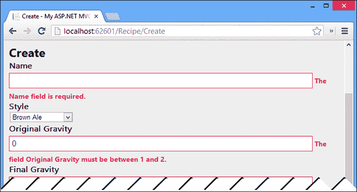
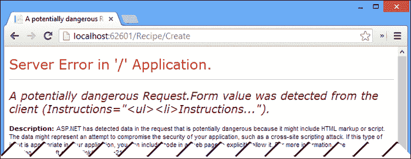
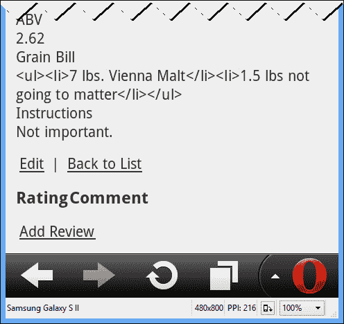

# 第八章。验证用户输入

永远不要相信外部来源提供给你的应用程序的数据。你听过多少次了？然而，我们一次又一次地了解到黑客渗透应用程序、操作系统甚至整个网络的令人兴奋的新方法。虽然大多数常见的语言确实可以保护您免受缓冲区溢出攻击之类的攻击，但新一代的互联网络应用程序也带来了一系列新的攻击。

在本章中，我们将了解如何使用在`System.ComponentModel.DataAnnotations`命名空间中找到的数据验证属性来验证提交给我们的应用程序的数据。接下来我们将看看 ASP.NET MVC 4 框架提供给我们的用于帮助防止**跨站点请求伪造** ( **CSRF** )和**跨站点脚本** ( **XSS** )攻击的工具。

在这一章的最后，你真的只需要记住一条规则——这条规则已经说过了，但需要重复，那就是永远、永远、永远不要相信外部来源提供给我们应用的数据。

# 数据验证

为什么我们可能想要验证我们的数据？首先，我们的应用程序可能需要根据需要向用户标识一些字段。我们可能还想通知用户，他们输入了一个无效的配方原始比重的数字，或者他们输入的是文本而不是数字。给用户的反馈不仅保护我们的应用程序不被捕获无效或恶意数据，还通过在尝试保存数据之前通知用户发生了错误来提供更好的用户体验。

我们的数据验证将通过利用数据注释属性来完成。

## 数据标注

在`System.ComponentModel.DataAnnotations`中定义的数据注释已经在视图模型的应用程序中得到一定程度的利用，为视图渲染器提供显示和格式提示。您可以在下面的代码中看到这一点:

```cs
[Display(Name = "Original Gravity")]
[DisplayFormat(DataFormatString = "{0:0.00##}")]
public float OriginalGravity { get; set; }
```

我们现在将研究使用数据注释验证属性来进一步定义我们的数据模型和视图模型。

这是我们建筑结构的第一个挑战。我们已经将我们的数据模型从我们的领域实体中分离出来。这些域实体从视图模型中分离出来。因为数据注释是属性，所以我们似乎需要将属性应用于数据模型、实体和视图模型，以确保它们保持同步。幸运的是，事实并非如此。

### 元数据类型属性

`MetadataType`属性本身是一个数据注释属性，它允许我们为外部类(有时也称为伙伴类)中的一个类的属性指定属性。这些伙伴类包含与它们将应用到的实际类(或多个类)中的属性具有相同名称和类型的属性。

这可能看起来有点混乱，所以让我们来看看我们的`BrewHow.Models.Recipe`类的一个版本，它使用`MetadataType`属性来标识一个伙伴类。

```cs
[MetadataType(typeof(RecipeValidationMetadata))]
public class Recipe
```

在`RecipeValidationMetadata`类中，我们定义了与`Recipe*ViewModel`类共享的`Recipe`类属性的所有限制、范围和要求:

```cs
public class RecipeValidationMetadata
{
  [Required]
  [StringLength(128)]
  public string Name { get; set; }
  [Required]
  [Range(1.0f, 2.0f)]
  public float OriginalGravity { get; set; }

  [Required]
  [Range(1.0f, 2.0f)]
  public float FinalGravity { get; set; }

  [Required]
  public string GrainBill { get; set; }

  [Required]
  public string Instructions { get; set; }
}
```

在我们的验证伙伴类中，我们已经根据需要标记了所有属性，并在适当的地方设置了范围和长度。这些属性共享在`Recipe`中定义的属性的名称和类型。这些验证也可以应用于我们的`RecipeEditViewModel`类，使用相同的`MetadataType`属性，如下所示:

```cs
[MetadataType(typeof(RecipeValidationMetadata))]
public class RecipeEditViewModel
```

### 更新数据库

实体框架将使用元数据值来更好地定义我们数据库中的字段。我们需要运行`Add-Migration`来生成迁移脚本，但是对于这个迁移，我们实际上需要编辑`Up`方法。作为元数据的一部分，我们制作了所需的`Instructions`和`GrainBill`属性。这将数据库中的相应字段设置为不允许空值。将以下代码放在`Up`方法的开头将确保数据库中已经存在的任何数据的迁移成功:

```cs
Sql("update dbo.Recipes set GrainBill = 'No grain bill.' where GrainBill is null");
Sql("update dbo.Recipes set Instructions = 'No instructions.' where Instructions is null");
```

我们配置的`Seed`方法也需要更新。请始终记住`Seed`方法在每次应用迁移后运行，除非我们另有指示。在`Seed`方法中的每个`Recipe`类中，确保添加`Instructions`和`GrainBill`属性的值。

我们现在可以运行`Update-Database`来应用我们的约束。EF 迁移过程将从应用于我们的迁移的`RecipeValidationMetadata`类中提取验证属性，并将它们应用于我们的数据库模式。

我们可以通过查看数据库中的表定义来验证这些更改，如下所示:


### 验证验证

如果我们在创建菜谱的时候启动 app 并尝试提交一些无效的数据，你会看到 MVC 框架足够善良，可以使用 JavaScript 和 jQuery 在浏览器中验证我们的数据，并将验证错误告知用户。如果我们选择更改呈现给用户的错误消息，我们可以修改数据注释属性以显示适当的错误消息。目前，默认消息是可以接受的。



要了解这是如何工作的，您可以查看 RecipeController 的`View`文件夹中的`Create.cshtml`视图。在视图的最底部，您会发现以下标记:

```cs
@section Scripts {
  @Scripts.Render("~/bundles/jqueryval")
}
```

这个包将 jQuery 不引人注目的验证库添加到页面中。当我们的页面被渲染时，我们放置在视图模型上的验证属性被`EditorFor` HTML 帮助器转换成 jQuery 验证标记。提交表单时，会根据这些属性验证字段。

请注意，发生的唯一验证是客户端。对于用户可能已经禁用了 JavaScript 或者有人试图通过绕过我们的视图来发现漏洞的情况，我们希望在服务器上收到数据后立即对其进行验证，如果存在验证错误，则将其发送回客户端。

#### 服务器验证

服务器上的验证相当简单。我们已经在使用 MVC 模型绑定器将 HTTP POST 的内容映射到我们的视图模型中。当模型绑定器这样做时，它会为它试图绑定的每个模型设置一个`ModelStateDictionary`对象，并将出现的任何错误记录到字典中。字典通过`ModelState`属性暴露给我们的控制器。

当我们的动作方法被调用并且我们想要验证动作方法的输入是否有效时，我们可以调用`ModelStateDictionary`上的`IsValid`属性来确定我们是否应该继续将数据交给域，或者我们是否应该将输入返回给用户以修复任何错误或遗漏:

```cs
public ActionResult Create(RecipeEditViewModel recipe)
{
  try
  {
 if (ModelState.IsValid)
    {
      this._recipeRepository.Save(
      ToEntity(recipe));

      return RedirectToAction("Index");
      }
    }
    catch
    {
    }

  return View(recipe);
}
```

### 注

我们当前的服务器端验证与控制器紧密相关。对于企业级验证场景，我们将抽象验证和用于转换到域实体和视图模型以及从域实体和视图模型转换的映射器，以更好地促进测试和代码重用。

我们现在受到保护，不会有错误的信息通过用户输入进入我们的系统，但我们仍然面临其他形式的恶意输入，我们必须保护我们的用户和我们自己。

# 跨站点请求伪造(CSRF)

跨站点请求伪造是一种攻击，在这种攻击中，用户的浏览器被秘密地指向在该用户不知情的情况下检索信息或在站点上执行操作。在这些类型的攻击中，用户被认为可以访问目标站点。也许用一个例子来解释更好。

让我们假设贝德福德瀑布当地银行和信托的一名成员刚刚在他们的浏览器中访问了该银行的网站。用户登录，执行一些操作，并且从未明确退出，将身份验证 cookie 留在其浏览器的缓存中。后来，在网上冲浪时，他们访问了一个信誉可疑的网站。

在这个网站上，有人放置了一个脚本文件，通过 AJAX 调用向贝德福德瀑布地方银行和信托公司网站提交资金转移请求。该脚本没有用户可以看到的可见操作。但是，从技术上讲，用户仍然登录到银行网站，并且该脚本成功地从用户的帐户执行了资金转移。就任何人而言，用户执行了这个操作，并且他们是从他们的家庭 IP 地址执行的。这次袭击留下的脚印很少，很可能会被忽视，直到为时已晚。

我们希望防止针对我们应用程序的此类攻击。并不是说我们有什么高价值的东西需要保护。然而，我们不想让我们的应用程序以任何影响我们用户的方式受到损害，无论是通过损害他们的数据，还是将损害或攻击归咎于他们。

再一次，ASP.NET MVC 框架带着另一个便利的属性来拯救。

## 验证机构凭证

`ValidateAntiForgeryToken`属性可以放在单个动作方法或整个控制器上:

```cs
[HttpPost]
[ValidateAntiForgeryToken]
public ActionResult Create(RecipeEditViewModel recipe)
```

该属性与`HtmlHelper.AntiForgeryToken()`方法协同工作:

```cs
@model BrewHow.ViewModels.RecipeEditViewModel

@{
  ViewBag.Title = "Create";
}

<h2>Create</h2>

@using (Html.BeginForm()) {
 @Html.AntiForgeryToken()
  @Html.ValidationSummary(true)
```

当一个响应被发布到一个用`ValidateAntiForgeryToken`修饰的动作方法时，该属性会查看发布的数据是否有有效的请求验证标记——由`AntiForgeryToken` HTML 帮助器添加到页面的标记。如果找不到有效的令牌，就像 CSRF 的情况一样，运行时会在调用 action 方法之前引发异常。


但是，如果找到了令牌，如下面的源代码所示，提交将会成功:

```cs
<form action="/Recipe/Create" method="post">
<input name="__RequestVerificationToken" type="hidden" value="31Kxb3eIeUEmZIfY5QwBj_kVGUgKsHxvLAkOjEtX7ZCPb6AJz9vUVD5M7DW6OedEUnlhqKlaP_k1_aGelGeoWDuzMJFvxKoUSCocittWPCo1" />
<fieldset> <!-- … --!>
```

这个令牌的放置对用户来说是透明的，但它确实保护他们免受劫持他们的应用程序身份验证票的天真尝试。

### 类型

**允许 AJAX**

包含防伪标记并不妨碍您使用 AJAX 功能提交表单来对抗需要防伪标记的操作。你仍然可以这样做。您只需将`RequestVerificationToken`键/值对添加到开机自检请求中。

# 跨站点脚本(XSS)

跨站点脚本是当用户将客户端脚本注入页面，试图收集信息或感染其他用户的计算机时可能发生的攻击。XSS 攻击可能导致的具体情况包括强制下载病毒和僵尸工具、窃取包含用户身份信息和/或登录凭据的 cookies，或者修改网站内容的能力。

当用户被允许将 HTML 内容作为表单提交的一部分提交到网站时，通常会发生 XSS 攻击。

假设我们想让用户在配方创建和编辑视图的`GrainBill`和`Instruction`字段中向我们的应用程序提交格式化的 HTML。如果我们不小心实现，用户可能会提交带有嵌入脚本的 HTML 内容，这些脚本可能会被用来劫持用户的会话。

即使我们只让受信任的用户提交 HTML 内容，我们仍然会暴露自己，因为没有什么能阻止我们受信任的用户的浏览器被另一个网站劫持，然后被指向我们的应用程序。

由于防止 XSS 攻击异常困难，默认情况下，ASP.NET MVC 框架只是阻止 HTML 的提交。

任何 HTML 提交都会导致类似于下面屏幕截图所示的响应:



如果我们决定用户有必要向我们的应用程序提交 HTML，我们可以采取几个步骤来启用该功能。启用 HTML 提交意味着我们仍然需要编写自己的 HTML 消毒剂，以确保没有恶意内容被上传到我们的网站。以下信息简单来说就是:信息。虽然我们将学习如何启用 HTML 提交，但我们不会在本章以外的应用程序中启用它。

### 类型

**不要做**

我不建议尝试实现你自己的 HTML 消毒剂。整个团队都在开发工具来适当地净化发布的 HTML 内容，以移除恶意内容。杀毒软件不仅要删除格式正确的 HTML，还需要删除格式不正确的 HTML。你可以感谢遗留浏览器的松散实现的渲染引擎。

## 验证属性

允许提交 HTML 的最简单的方法是使用`ValidateInput`属性。此属性可以在操作方法和控制器级别启用或禁用输入验证。我们可以修改我们的 RecipeController 的`Create`操作方法，以绕过输入验证:

```cs
[HttpPost]
[ValidateInput(false)]
[ValidateAntiForgeryToken]
public ActionResult Create(RecipeEditViewModel recipe)
```

现在，当我们像以前一样用 HTML 创建一个新的食谱时，提交是成功的。

使用`ValidateInput`属性应该是最后的手段。问题是通过使用 `ValidateInput`我们已经允许发送到动作的所有输入绕过输入验证。我们现在不仅要净化`GrainBill`和`Instruction`属性，还要净化`Title`领域。如果我们在以后的某个时候向视图和模型中添加一个新的字段，我们将不得不记住为它净化输入。

更好的方法是显式标记我们模型的属性，以允许输入 HTML。

## allowtml

可以将 `AllowHtml`属性添加到视图模型的属性中，以通知模型绑定器绕过该属性和该属性的输入验证。这个显式声明比`ValidateInput`方法更安全，应该在`ValidateInput`之前使用。

为了允许在我们的`GrainBill`和`Instructions`属性的值中使用 HTML，需要修改`RecipeEditViewModel`类以包含`AllowHtml`输入。确保您删除了我们几分钟前添加的`ValidateInput`属性:

```cs
[AllowHtml]
[Display(Name = "Grain Bill")]
[DataType(DataType.MultilineText)]
public string GrainBill { get; set; }

[AllowHtml]
[Display(Name = "Instructions")]
[DataType(DataType.MultilineText)]
public string Instructions { get; set; }
```

当我们在`GrainBill`和`Instructions`属性中提交包含格式化 HTML 的配方时，我们成功返回到我们的列表中(当我们尝试在`Name`属性中提交 HTML 时，我们会收到一个异常)。

如果我们通过点击列表视图中的名称来查看配方的详细信息，我们会看到我们确实提交并保存了 HTML，但是该 HTML 是显示的，而不是呈现的。



我们需要修改视图，以原始格式显示字段。

## 原始格式

如果你回想起前几章，我们讨论了剃刀引擎如何自动编码我们的属性。该编码将尖括号(< >)转换为`&lt`和`&gt`。这些代码随后在浏览器中分别呈现为<和>，并且不指示浏览器呈现预期的 HTML。我们需要修改视图以呈现属性的原始内容，并使用`HtmlHelper`类上的`Raw`方法绕过 HTML 编码。

在再循环控制器的`Details`视图中，我们需要修改`Instruction`和`GrainBill`属性的输出，以使用`Html.Raw`代替`Html.DisplayFor`:

```cs
<div class="display-label">
  @Html.DisplayNameFor(model => model.GrainBill)
</div>
<div class="display-field">
 @Html.Raw(Model.GrainBill)
</div>

<div class="display-label">
  @Html.DisplayNameFor(model => model.Instructions)
</div>
<div class="display-field">
 @Html.Raw(Model.Instructions)
</div>
```

现在当我们查看`Details`视图的输出时，我们的 HTML 提交被适当地渲染，如下图所示:


既然我们知道它有效，我们就可以撤销它。如果没有对输入进行适当的清理，我们不希望只允许提交任何 HTML 标记。

# 总结

在本章中，我们学习了如何验证我们的应用程序从用户那里接收到的输入。从这个意义上来说，验证不仅意味着确保数据的格式正确，还意味着它可以被认为是安全的或尽可能安全的，因为规则 1 同样是不信任用户提交的数据。

在下一章中，我们将了解我们的应用程序的授权和认证，包括对使用谷歌帐户进行认证的支持。我们将使用这些功能来防止匿名用户创建和编辑食谱，并防止用户编辑其他人的食谱。我们还将允许经过身份验证的用户创建一个食谱库，以便快速访问他们的收藏夹。