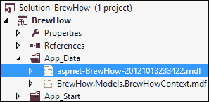
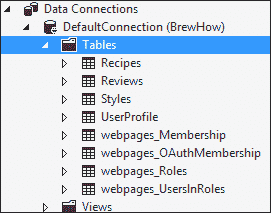
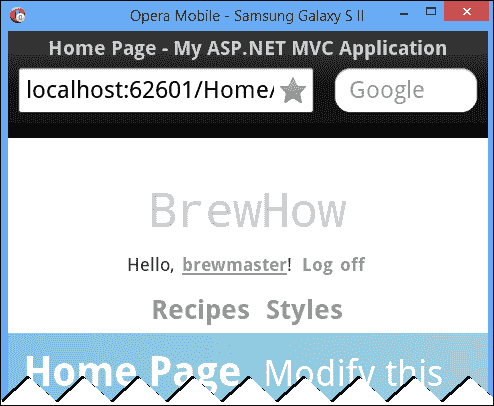
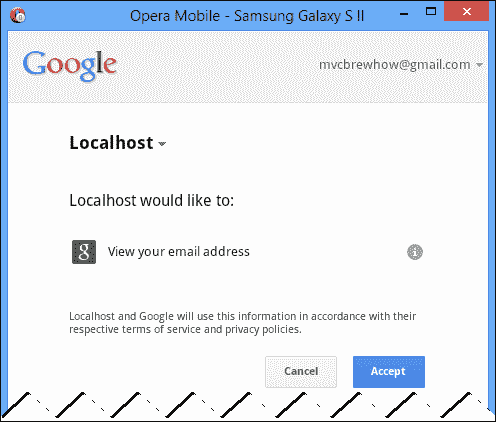
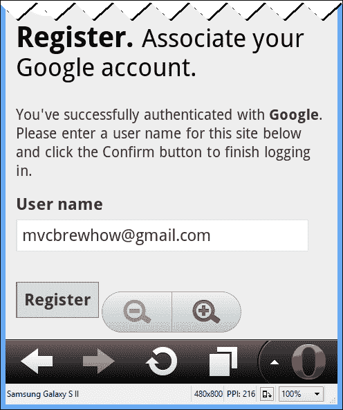
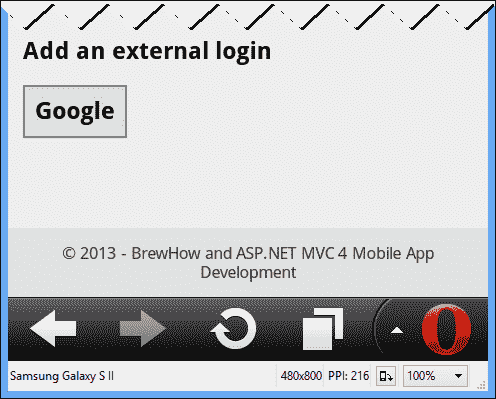
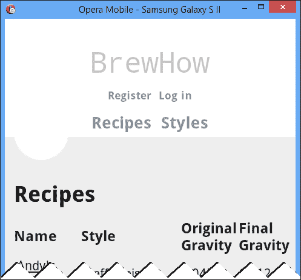
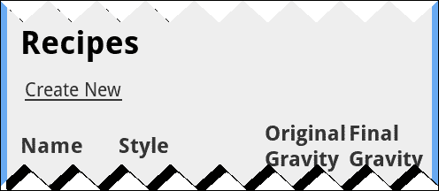
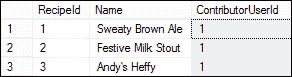
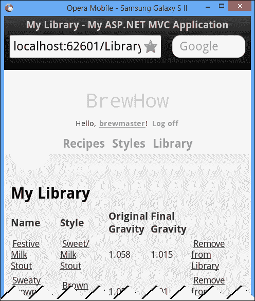

# 第九章。识别和授权用户

到目前为止，BrewHow 一直是一个完全匿名的应用。任何人都可以发布食谱与社区分享，任何人都可以查看这些食谱。如果这是我们希望向用户提供的唯一功能，但我们有更高的期望，那么这个模型就很好。我们希望我们的用户的贡献得到认可，并对他们的评论负责。我们可能还会添加要求应用程序知道他们是谁的功能。我们需要为用户提供一种使用我们的应用程序进行身份验证的方法。

在本章中，我们将探讨为我们的应用程序提供身份验证和授权的 ASP.NET 成员资格框架。我们将使用`SimpleMembership`会员提供商在我们的应用程序中创建新用户，并查看对外部认证提供商(如谷歌和脸书)的新支持。然后，我们将把应用程序的一部分限制为经过身份验证的用户。我们将把我们所学的一切结合起来，让用户创建一个食谱库来存储他们最喜欢的食谱，从而完成这一章。

# 用户认证

用户认证允许我们验证用户就是他们所说的。我们可以通过多种方式在应用程序中验证用户身份，但典型的情况(我们将重点关注的情况)是允许用户使用用户名和密码在应用程序中验证自己。

ASP.NET 支持两种现成的身份验证:Windows 身份验证和表单身份验证。

## Windows 身份验证

当使用 Windows 身份验证时，应用程序根据 Windows 域控制器验证用户的身份。在这种情况下，用户的 Windows 凭据被用于尝试向应用程序进行身份验证。这种类型的身份验证通常用于集中管理用户的内部网场景。

## 表单认证

表单身份验证是您最可能熟悉的身份验证类型。表单身份验证允许用户向系统提供他们选择的用户名和密码。成功认证后，用户将被分配一个 cookie，浏览器将在以后的任何验证用户身份的请求中提交该 cookie。

这种类型的身份验证主要用于为互联网设计的应用程序。鉴于我们的应用程序将从互联网访问，我们将使用表单身份验证。

# 验证酿酒用户

开箱即用，使用互联网应用程序模板构建的应用程序支持表单认证，并为用户登录和创建我们的应用程序帐户提供便利。我们可以通过查看`web.config`文件中的`authentication`节点来验证这一点:

```cs
<system.web>
  <!-- -->
  <authentication mode="Forms">
    <forms loginUrl="~/Account/Login" timeout="2880" />
  </authentication>
  <!-- -->
</system.web>
```

认证节点将认证模式设置为`Forms`认证，将我们 app 的登录 URL 设置为`~/Account/Login`。查看`AccountController`类的`Login`操作，我们看到该操作正在为用户调用`WebSecurity.Login`方法，并将他们重定向到登录成功后他们最初尝试访问的网址:

```cs
if (ModelState.IsValid && WebSecurity.Login(model.UserName, model.Password, persistCookie: model.RememberMe))
{
  return RedirectToLocal(returnUrl);
}
```

用于认证用户的`WebSecurity`类是`SimpleMembership`应用编程接口的一部分，该接口是从`WebMatrix`项目并入 ASP.NET MVC 4 的成员资格提供者。

## 简单会员资格

`SimpleMembership` 提供了一套更小、更好的工具来管理用户账户，比之前版本的 ASP.NET 提供的工具更好。与最初的 ASP.NET 成员资格提供者应用编程接口需要一个支持存储过程的 SQL Server 版本不同，`SimpleMembership`可以与 SQL Server、SQL CE、LocalDB 和任何其他具有实体框架提供者的数据库一起工作。

初始化`SimpleMembership`数据库就像调用`WebSecurity.InitializeDatabaseConnection`一样简单。在我们的应用程序中，这个调用目前发生在位于我们解决方案的`Filters`文件夹中的`InitializeSimpleMembershipAttribute`类中:

```cs
WebSecurity
 .InitializeDatabaseConnection(
 "DefaultConnection", 
 "UserProfile", 
    "UserId", 
 "UserName", 
 autoCreateTables: true
 );

```

`InitializeDatabaseConnection`方法定义如下:

```cs
public static void InitializeDatabaseConnection(
  string connectionStringName,
  string userTableName,
  string userIdColumn,
  string userNameColumn,
  bool autoCreateTables
)
```

在我们的`InitializeSimpleMembershipAttribute`中，我们告诉`SimpleMembership`提供者使用连接字符串`DefaultConnection`初始化数据库。用户档案信息将存储在`UserProfile`表的`UserId`和`UserName`字段中。我们还指示`SimpleMembership`通过将参数`autoCreateTables`设置为真来创建包含所有成员信息的表格。

当然，如果属性中的代码从不执行，所有这些设置都没有什么意义。为确保成员表在需要时存在，互联网应用模板将`InitializeSimpleMembershipAttribute`应用于`AccountController`:

```cs
[Authorize]
[InitializeSimpleMembership]
public class AccountController : Controller
```

通过将其应用于`AccountController`类，代码确保了当且仅当帐户控制器被调用时，成员资格表才被创建。这为我们的成员资格提供者提供了一种惰性初始化的形式。它还为我们提供了在不创建成员模式的情况下更改应用程序以使用 Windows 身份验证的机会。

### 注

成员资格表将在首次调用帐户控制器时创建。如果您希望使用 Windows 身份验证，请在启动应用程序之前更改`web.config`文件。

成员模式中的表通过`UsersContext`访问，这是在我们解决方案的`Models`文件夹中的`AccountModel.cs`文件中定义的辅助 EF 上下文:

```cs
public class UsersContext : DbContext
{
  /* ... */
  public DbSet<UserProfile> UserProfiles { get; set; }
}
```

在我们的测试中，这个上下文实际上已经被调用了几次，所以我们应该已经创建了我们的成员模式。点击**解决方案资源管理器**中的**显示所有文件**按钮，显示我们解决方案中的所有隐藏文件:


如果您现在展开`App_Data`文件夹，您应该会看到实际上有两个数据库，一个用于 BrewHow 上下文，另一个保存成员模式:



双击会员数据库，在**数据库浏览器**中打开。


您应该注意的第一件事是数据库包含在`UsersContext`上下文中定义的`UserProfile`表。我们还有另外四个由`SimpleMembership`提供者在调用`InitializeDatabaseConnection`时构建的表，因为我们在`autoCreateTables`参数中传递了一个值`true`。这些表存储了关于网站成员资格的信息，并支持应用程序中角色的管理和应用。

## 定制认证

在这个按需场景中，为我们的应用程序设置成员身份显然需要很多步骤。由于我们的应用程序只使用`SimpleMembership`提供者并实现表单身份验证，因此我们可以去掉支持这种按需场景的代码，并应用一些定制。

### 简单成员初始化

由于`InitializeSimpleMembershipAttribute`的存在只是为了提供惰性初始化，简化代码最简单的方法是移除属性并将`InitializeDatabaseConnection`方法移入`Global.asax`。

打开`Global.asax.cs`并在`Application_Start`方法顶部添加以下代码:

```cs
WebSecurity.InitializeDatabaseConnection(
  "DefaultConnection", 
  "UserProfile", 
  "UserId", 
  "UserName", 
  autoCreateTables: true);
```

由于我们在应用程序启动时初始化成员数据库，因此我们可以从`AccountController`定义中删除属性，并从我们的解决方案中删除`InitializeSimpleMembershipAttribute.cs`文件。

### 统一上下文

T2 没有理由让我们的应用程序有两个独立的数据库。我们应用程序的用户和他们创造的食谱是交织在一起的。我们可以统一数据库，这样做可以统一`BrewHowContext`和`UsersContext`——这两个上下文当前用于存储和检索数据库中的信息。

我们将从更改`web.config`文件中的`DefaultConnection`连接字符串开始。我们希望将数据库统一到一个名为`BrewHow.mdf`的新数据库文件中，目录名为`BrewHow`。下面的代码显示了新的连接字符串:

```cs
<connectionStrings>
  <add name="DefaultConnection" connectionString="Data Source=(LocalDb)\v11.0;Initial Catalog=BrewHow;Integrated Security=SSPI;AttachDBFilename=|DataDirectory|\BrewHow.mdf" providerName="System.Data.SqlClient" />
</connectionStrings>
```

我们修改了`DefaultConnection`连接字符串，因为它实际上是配置文件中唯一的连接字符串。成员资格功能已经在使用这个连接字符串，但是`BrewHowContext`类正在寻找一个名为`BrewHow.Models.BrewHowContext`的连接字符串。我们在[第 4 章](04.html "Chapter 4. Modeling BrewHow in EF5")、*在 EF5* 中建模酿酒。

为了告诉 BrewHow 上下文使用`DefaultConnection`连接字符串，我们需要修改`BrewHowContext`构造函数，如下代码所示:

```cs
public BrewHowContext()
 : base("DefaultConnection")
{
}
```

下一步是将`UserProfile`类添加到`BrewHowContext`中，该类代表我们对`InitializeDatabaseConnection`的调用中定义的应用程序的用户。该类目前在`AccountModels.cs`文件中定义。因为它实际上是我们数据模型的一部分，我们应该把它移到`Models`文件夹中自己的文件中。在我们的`Models`文件夹中创建一个名为`UserProfile.cs`的新文件，并将`AccountModels.cs`中定义的`UserProfile`类移动到该文件中:

```cs
[Table("UserProfile ")]
public class UserProfile
{
  [Key]           
  [DatabaseGeneratedAttribute
    (DatabaseGeneratedOption.Identity)]
  public int UserId { get; set; }
  public string UserName { get; set; }
}
```

为了完成上下文的合并，我们需要将`UserProfile`类移入`BrewHowContext`。这要求我们修改`BrewHowContext`类和`IBrewHowContext`界面:

```cs
public interface IBrewHowContext
{
  IDbSet<Models.Recipe> Recipes { get; set; }
  IDbSet<Models.Review> Reviews { get; set; }
  IDbSet<Models.Style> Styles { get; set; }

 IDbSet<Models.UserProfile> UserProfiles { get; set; }

  int SaveChanges();
}

public class BrewHowContext : DbContext, IBrewHowContext
{
  public IDbSet<Models.Recipe> Recipes { get; set; }
  public IDbSet<Models.Review> Reviews { get; set; }
  public IDbSet<Models.Style> Styles { get; set; }
 public IDbSet<Models.UserProfile> UserProfiles { get; set; }

  public BrewHowContext()
    : base("DefaultConnection")
  {
  }
  /* ... */
}
```

在所有的更改中，更改连接字符串实际上是最具破坏性的一个。我们对上下文做了一些更改，但是由连接字符串标识的数据库实际上并不存在。这意味着真的没有什么可迁移的。考虑到我们已经应用的迁移都是在我们的应用程序开发中逐步增加的，我们没有做任何可以回滚的事情；我们仍在探索酿酒的领域。是时候用一个新数据库重新开始了。

首先从`Migrations`文件夹中删除所有迁移文件。不要删除`Configuration.cs`文件，因为我们的`Seed`方法仍然有效。打开**包管理器控制台**，运行`Add-Migration`命令设置初始迁移。一旦命令完成并创建了初始迁移，运行`Update-Database`命令来创建我们统一的 BrewHow 数据库模式，并用我们的样本数据播种它。

### 用户档案库

为了与我们既定的设计模式保持一致，我们需要为`UserProfile`数据模型创建一个存储库。检查`AccountController`中的代码，我们看到我们的应用程序目前支持通过用户名创建和检索用户配置文件。该功能需要移动到存储库中。遵循我们项目中的其他模式，用户配置文件的存储库也需要支持我们的数据模型到我们的领域模型的编组。`IUserProfileRepository`的接口在下面的代码中定义。实现和其他存储库一样简单，可以在本书附带的代码中找到:

```cs
public interface IUserProfileRepository
{
  UserProfileEntity GetUser(string username);
  void Save(UserProfileEntity userProfileEntity);
}
```

`UserProfileEntity`类型是`UserProfile`模型的域实体，包含一组相同的字段:

```cs
public class UserProfileEntity
{
  public int UserId { get; set; }
  public string UserName { get; set; }
}
```

### 帐户控制器上下文

最后一步是修改我们的`AccountController`类，使用我们的`IUserProfileRepository`接口的注入实现。打开`AccountController`类，添加一个接受`IUserProfileRepository`参数的构造函数。确保将参数分配给类的成员变量:

```cs
private readonly IUserProfileRepository _userProfileRepository;

public AccountController(
  IUserProfileRepository userProfileRepository)
{
  this._userProfileRepository = userProfileRepository;
}
```

我们整个项目中唯一使用`UsersContext`的位置是在`AccountController`的`ExternalLoginConfirmation`方法中。它确定具有给定用户名的用户是否存在，然后创建该用户或返回一个错误，指示该用户已经存在于数据库中:

```cs
using (UsersContext db = new UsersContext())
{
  UserProfile user = db.UserProfiles.FirstOrDefault(u => u.UserName.ToLower() == model.UserName.ToLower());
  if (user == null)
  {
    // Create the new user.
  }
  else
  {
    // Return an error.
  }
```

需要调整该代码，以使用传递给控制器构造器的`IUserProfileRepository`的实现:

```cs
UserProfileEntity user = this
  ._userProfileRepository
  .GetUser(model.UserName.ToLower());
if (user == null)
{
  this._userProfileRepository.Save(
    new UserProfileEntity
    {
      UserName = model.UserName
    });
  // Do other stuff.
}
else
{
  // Return an error.
}
```

按下键盘上的 *Ctrl* + *F5* 或从 **DEBUG** 菜单中选择**开始不调试**来初始化成员表，打开浏览器中的应用程序。成功启动应用程序后，展开`App_Data`目录，您将看到我们新的统一数据库:


双击**酿酒**数据库，打开**数据库浏览器**。如果您展开**表**节点，您将看到我们的应用程序在单个数据库中运行所需的所有表:



## 注册并登录

现在成员表已经配置好了，我们应该可以注册一个账户并登录了。首先启动应用程序，点击页面顶部的**注册**链接:


在注册页面上，输入要创建的用户的凭据。完成后，点击**注册**按钮:


点击 **注册**按钮后，您将自动登录到该应用程序，并获得新用户名:



有效！不幸的是，你也被带到了旧的/ `Home/Index`动作——原来的主页我们换成了我们的`/Recipe/Index`动作。互联网应用程序模板中有几个我们需要替换的神奇字符串。在这个特定的场景中，我们需要在三个独立的动作方法中修改`AccountController`类:`LogOff`、`Register`和`RedirectToLocal`。

在所有这三种操作方法中，我们需要替换以下代码:

```cs
return RedirectToAction("Index", "Home");
```

前面的代码将被下面的代码替换:

```cs
return RedirectToAction("Index", "Recipe", new { area="" });
```

现在，所有注册、登录和注销操作都将用户重定向到`RecipeController's Index`操作，我们的`SimpleMembership`提供商现在成功地为我们的应用程序提供了身份验证服务。我们甚至可以在**数据库浏览器**中打开`UserProfile`表，看到我们刚刚创建的用户:


除了在我们的数据库中提供用户名和密码支持之外，`SimpleMembership`提供商还可以扩展到允许我们针对外部来源(如谷歌和脸书)进行身份验证。

## 外部认证

为我们的应用程序启用外部认证相当简单。如果我们打开`App_Start`文件夹中的`AuthConfig.cs`文件并查看`RegisterAuth`方法，我们将看到四个可用的外部提供程序:

```cs
public static void RegisterAuth()
{
  // To let users of this site log in using their accounts 
  // from other sites such as Microsoft, Facebook, and 
  // Twitter, you must update this site. For more information 
  // visit http://go.microsoft.com/fwlink/?LinkID=252166

  //OAuthWebSecurity.RegisterMicrosoftClient(
  //    clientId: "",
  //    clientSecret: "");

  //OAuthWebSecurity.RegisterTwitterClient(
  //    consumerKey: "",
  //    consumerSecret: "");

  //OAuthWebSecurity.RegisterFacebookClient(
  //    appId: "",
  //    appSecret: "");

  //OAuthWebSecurity.RegisterGoogleClient();
}
```

我们将为啤酒之路启用谷歌认证。

### 注册外部账户

要启用谷歌认证，我们需要取消`RegisterAuth`方法中`OAuthWebSecurity.RegisterGoogleClient();`行的注释，并重新编译应用程序。当我们启动应用程序并点击**登录**链接时，我们的对话框现在为我们提供了使用谷歌帐户登录的能力。


点击标签为**谷歌**的按钮，我们将进入谷歌**登录**页面:


在输入我们的帐户信息后，谷歌以典型的 OAuth 方式要求我们授予 BrewHow 应用程序某些权限。在这种情况下，它要求向酿酒公司提供我们的电子邮件地址:



点击**接受**将带我们回到我们的应用程序，在那里我们被要求提供用户名。我们链接帐户的默认用户名是我们的谷歌帐户地址:



接受默认值并点击**注册**按钮，我们将使用谷歌帐户登录到 BrewHow。


如果现有用户已经有了一个 BrewHow 帐户，并希望使用他们的谷歌帐户，我们还可以提供将外部帐户与其现有的 BrewHow 帐户相关联的功能。

### 关联外部账户

如果您当前使用谷歌帐户登录应用程序，请退出应用程序，并使用您创建的本地帐户登录。如果您继续关注，我们在本章前面创建的本地帐户的用户名为 **brewmaster** 。我们将转到我们的个人资料，将一个谷歌帐户与我们当地的酿酒公司帐户相关联。

要查看您的个人资料，请在问候语中单击您的用户名。在你的账户资料上，滚动到底部，你会看到一个标有**谷歌**的按钮。点击此按钮将允许您将您的谷歌帐户与您的本地帐户相关联:



我们现在可以成功地在 BrewHow 中验证用户。是时候批准他们的行动了。

# 授权

认证为我们提供了一种识别用户的手段，但是授权为我们提供了一种机制来启用或限制认证用户可能执行的操作。

## 限制访问

在 ASP.NET MVC 中，的访问是通过使用可放在控制器或动作上的`Authorize`属性来限制的。如果`Authorize`属性处于控制器级别，匿名用户可以通过`AllowAnonymous`关键字被授予特定操作的访问权限。

### 授权属性

如果你看一下`AccountController`类，你会看到用`Authorize`属性声明的类。但是，`Login`的动作是用`AllowAnonymous`属性修饰的:

```cs
[Authorize]
public class AccountController : Controller
{
 [AllowAnonymous]
  public ActionResult Login(string returnUrl)
  {
    ViewBag.ReturnUrl = returnUrl;
    return View();
  }
  /* ... */
}
```

`Authorize`属性的应用表明，只有经过身份验证的用户才能访问帐户控制器。`AllowAnonymous`属性用作`Authorize`属性的覆盖，并授予对`Login`动作的匿名访问权。

### 授权用户投稿

在 BrewHow 应用中，所有匿名用户都应该能够浏览网站，查看菜谱。然而，我们希望只有经过认证的用户才能够贡献食谱或提供评论。

在我们的解决方案的`Controllers`文件夹中打开`RecipeController`类，并对两个`Edit`动作和两个`Create`动作应用一个`Authorize`属性。这将使这些操作仅限于经过身份验证的用户。同样，在我们的解决方案的`Review`区域打开`RecipeController`类，并将`AuthorizeAttribute`应用于两个`Create`动作。以下是来自`Review`区域的`RecipeController`的部分副本，以说明`Authorize`属性的应用:

```cs
public class RecipeController : Controller
{
  [HttpGet]
 [Authorize]
  public ActionResult Create(int id)
  {
    return View();
  }

  [HttpPost]
 [Authorize]
  [ValidateAntiForgeryToken]
  public ActionResult Create(int id,ReviewEditViewModel reviewEditViewModel)
  {
    /* ... */
  }
  /* ... */
}
```

在浏览器中打开我们的应用，确保您当前没有登录。在主页上，点击标记为**新建**的链接，尝试创建一个食谱。系统将提示您登录。系统会提示您登录，因为该操作现在需要对用户进行身份验证。

当然，向用户展示他们不能执行的动作是不好的形式。我们需要清理视图，以隐藏匿名用户无法使用的任何活动。

### 注

`Authorize`属性还允许您通过指定允许的角色或用户组来进一步限制对控制器或操作的访问。只需将用户或角色作为`[Authorize(Users="andy, brewmaster")]`或`[Authorize(Roles="Administrators")]`传递给属性。BrewHow 应用将只限制认证用户访问，因此`[Authorize]`的使用足以满足我们的需求。

### 清理界面

打开查看`RecipeController`的`Index`动作方法，找到以下代码:

```cs
@Html.ActionLink("Create New", "Create")
```

这是在`RecipeController`的`Index`视图上显示**新建**链接的代码部分。要对未经身份验证的用户隐藏此链接，请将代码更改为以下内容:

```cs
@if (Request.IsAuthenticated) {
  @Html.ActionLink("Create New", "Create")
}

```

当我们在浏览器中打开应用程序时，假设我们没有登录，链接会消失:



我们可以通过登录并返回到我们的`Index`视图来验证代码是否有效:



确保将相同的逻辑应用于配方详细信息屏幕上的**编辑**链接和部分视图上的**添加审核**链接进行审核。

## 内容所有权

可以说酿酒应用已经被锁定了。我们只允许经过身份验证的用户创建和编辑食谱或提交评论。然而，缺乏任何所有权的概念；任何用户都可以编辑任何配方。我们的用户提交食谱是为了分享，而不是让其他用户修改。我们网站上的内容需要保护，只允许最初提交内容的用户编辑内容。我们需要引入所有权的概念。

### 注

虽然所有权确定可以用于启用或禁用大量功能，但我们的所有权实现只关心实体是否可以编辑。

### 实现所有权

为了让启用所有权，我们需要修改我们的模式，将`UserProfile`与`Recipes`和`Reviews`相关联。这将允许我们指定一个用户作为配方的贡献者或审阅者。

打开`Models`文件夹中的`Recipe`类，添加一个类型为`UserProfile`的`Contributor`属性。这将在配方和创建它的用户之间建立关系:

```cs
public UserProfile Contributor { get; set; }
```

我们还需要建立`Review`和`UserProfile`之间的关系，以确定提交评论的用户。向`Review`类添加以下属性可以实现这一点:

```cs
public UserProfile Reviewer { get; set; }
```

一旦创建，我们需要将`Recipe`和`Review`的`UserProfile`属性映射到`RecipeEntity`和`ReviewEntity`上的`UserProfileEntity`属性。该映射将发生在`ReviewRepository`和`RecipeRepository`内部。这种模型到实体的映射在本书附带的代码中介绍。

#### 用户配置文件模式映射

留给它自己的设备，实体框架将做足够的工作来创建`UserProfile`和现在引用它的其他模型之间的关系。然而，我们想对这个过程施加一点控制。我们需要修改`BrewHowContext`中的`OnModelCreating`方法来指定外键的名称。这些修改将确保`Recipe`和`Review`车型需要`UserProfile`:

```cs
modelBuilder.Entity<Recipe>()
  .HasRequired(s => s.Contributor)
  .WithMany()
  .Map(m => m.MapKey("ContributorUserId"));

modelBuilder.Entity<Review>()
  .HasRequired(r => r.Reviewer)
  .WithMany()
  .Map(m => m.MapKey("ReviewerUserId"));
```

并非所有事情都像添加新属性和映射值那样简单。`UserProfile`创建由`SimpleMembership`应用编程接口处理，前面的代码根据需要标记了`Recipe`或`Review`与`UserProfile`之间的关系。这意味着我们的数据库在`Seed`方法中的当前种子不会像它写的那样工作。需要对`Seed`方法进行调整，以支持与`UserProfile`模型的新的所需关系。

#### 播种用户

播种`SimpleMembership`表比调用 API 稍微复杂一点。如果我们简单地将以下内容添加到`Seed`方法中，调用**包管理器控制台**中的`Update-Database`命令会抛出一个错误:

```cs
WebSecurity.InitializeDatabaseConnection(
  "DefaultConnection",
  "UserProfile",
  "UserId",
  "UserName",
  autoCreateTables: true);

var membership = (SimpleMembershipProvider)
Membership.Provider;

if (membership.GetUser("brewmaster", false) == null)
{
  membership
    .CreateUserAndAccount(
    "brewmaster",
    "supersecret"
    );
}
```

出现这种情况是因为运行`Update-Database`命令的上下文没有选择默认的成员配置。通过在我们的`system.web`部分的`web.config`中明确声明会员提供商信息，我们可以解决这个问题:

```cs
<roleManager enabled="true" 
  defaultProvider="SimpleRoleProvider">
  <providers>
    <clear/>
    <add name="SimpleRoleProvider"type="WebMatrix.WebData.SimpleRoleProvider, WebMatrix.WebData"/>
  </providers>
</roleManager>
<membership defaultProvider="SimpleMembershipProvider">
  <providers>
    <clear/>
    <add name="SimpleMembershipProvider" type="WebMatrix.WebData.SimpleMembershipProvider, WebMatrix.WebData" />
  </providers>
</membership>
```

如果我们现在将本节开头的代码插入到我们的`Seed`方法中，我们可以使用`SimpleMembership` API 插入用户。然后，我们的`Recipe`的种子可以定位该用户，并将其分配给配方的`Contributor`属性:

```cs
var brewMaster = context.UserProfiles.First(u => u.UserName == "brewmaster");

/* ... */
context.Recipes.AddOrUpdate(
  recipe => recipe.Name,
  new Recipe 
  { 
    Name = "Sweaty Brown Ale", 
    Style = brownAle, 
    OriginalGravity = 1.05f, 
    FinalGravity = 1.01f, 
    Slug = "sweaty-brown-ale", 
    Instructions = "None", 
    GrainBill = "None", 
    Contributor = brewMaster  
  },
  /* ... */
);
```

#### 应用所有权迁移

配置好模型之间的关系后，我们准备创建一个迁移来表示所有权。通过在**包管理器控制台**窗口中运行`Add-Migration Ownership`来创建新的迁移。

一旦生成了迁移脚本，我们仍然没有准备好将其应用于我们的数据库。请记住，我们的新模型从`Recipe`和`Review`模型创建了与`UserProfile`的必要关系。我们的迁移目前将会失败，因为任何试图在引用`UserProfile`的列上添加外键约束的操作都将会失败以获取表中的现有行。它们目前在这些外键列中没有值，并且`null`的值是不可接受的:

```cs
AddColumn("dbo.Recipes", 
  "ContributorUserId", 
  c => c.Int(nullable: false));
AddColumn("dbo.Reviews", 
  "ReviewerUserId", 
  c => c.Int(nullable: false));
AddForeignKey(
  "dbo.Recipes", 
  "ContributorUserId", 
  "dbo.UserProfile", 
  "UserId", 
  cascadeDelete: true);
AddForeignKey(
  "dbo.Reviews", 
  "ReviewerUserId", 
  "dbo.UserProfile", 
  "UserId", 
  cascadeDelete: true);
CreateIndex("dbo.Recipes", "ContributorUserId");
CreateIndex("dbo.Reviews", "ReviewerUserId");
```

我们需要在外键约束被放在列上之前给它播种。如果我们在`AddColumn`和`AddForeignKey`语句之间放置以下代码，我们的问题应该会得到解决:

```cs
Sql(@"Update dbo.Recipes 
  Set ContributorUserId = (
    select UserId 
    from dbo.UserProfile 
    where username = 'brewmaster')");
Sql(@"Update dbo.Reviews 
  Set ReviewerUserId = (
    select UserId 
    from dbo.UserProfile 
    where username = 'brewmaster')");
```

我们现在可以运行`Update-Database`命令，一切都会正常。检查数据库，我们看到种子`UserProfile`确实与`Recipe`关联为`ContributorUserId`:



在`Seed`方法中处理所有权对于样本数据来说很棒，但是我们也需要处理 app 本身内部的内容所有权。

### 分配所有权

在应用中，所有权通过将`UserProfileEntity`转让给`RecipeEntity`的`Contributor`房产或`Review`的`Reviewer`房产来处理。为了构建一个`UserProfileEntity`，我们将创建一个名为`UserProfileEntityFactory`的工厂类。这个类首先检查以确保我们是在一个 HTTP 请求的上下文中操作的(如果我们不是，那么我们将不能构造实体)。如果我们不是，那么我们将无法构建实体。然后，它从本章开头提到的`WebSecurity`类中提取当前已认证用户的`UserId`和`UserName`:

```cs
public class UserProfileEntityFactory : IUserProfileEntityFactory
{
  public UserProfileEntity Create()
  {
    var context = HttpContext.Current;

    if (context == null)
    {
      throw new InvalidOperationException(
        "The request is not occurring within a valid HTTP context.");
    }

    if (!context.Request.IsAuthenticated)
    {
      return null;
    }

    return new UserProfileEntity
    {
      UserId = WebSecurity.CurrentUserId,
      UserName = WebSecurity.CurrentUserName
    };
  }
}
```

我们工厂的类定义实现了一个新的接口，`IUserProfileEntityFactory`。这个实现可以被注入到任何需要创建 `UserProfileEntity`作为`IUserProfileEntityFactory`抽象的地方。通过使用工厂，我们已经在我们的`UserProfileEntity`构建中封装了对`WebSecurity`的依赖。通过注入具体的实现作为接口，我们可以灵活地更改`IUserProfileEntityFactory`的实现，可能是给不同的安全提供商，而不会对应用产生影响。

并且拥有为用户创建新的`UserProfileEntity`的能力允许我们如下分配所有权:

```cs
recipeEntity.Contributor = 
  this._userProfileEntityFactory.Create();
```

一切都准备好了，我们可以在我们的应用程序中分配内容的所有权。我们现在需要执行这些任务。

### 强制执行所有权

对于我们来说，要启用所有权，我们需要确定访问内容的用户是否是最初提交内容的用户。这个决定很简单。我们只需要将认证用户的`UserId`与投稿人的`UserId`进行比较。如果它们匹配，则经过身份验证的用户是内容的贡献者。如果它们不匹配，用户就不是贡献者。

正如我们在本章前面所做的匿名用户不可用的操作一样，我们需要根据用户是否拥有呈现给他们的内容来限制用户的操作。由于这些操作在视图中呈现，我们需要通知视图用户是否可以执行某些操作。这是通过视图模型完成的。

#### 调整视图模型

食谱有一个`Contributor`属性，评论有一个`Reviewer`属性来定义所有权，但是我们的控制器目前允许任何认证的用户编辑内容，无论是他们的还是其他的。我们需要向视图传达用户可能采取的行动，并且我们需要在控制器本身内实施这些行动。

为了告知配方细节视图用户是否可以编辑配方，我们需要修改`RecipeDisplayViewModel`以包含`CanEdit`属性。当我们打开视图模型时，让我们继续添加一个`Contributor`属性来表示贡献者的用户名:

```cs
[Display(Name = "Contributor")]
public string ContributedBy { get; set; }

public bool CanEdit { get; set; }
```

使用`CanEdit`属性，我们可以调整视图以限制对`RecipeController`的`Display`视图上的**编辑**链接的访问:

```cs
@if (Model.CanEdit) {
  @Html.ActionLink("Edit", "Edit", new 
  { 
    id=Model.RecipeId, 
    slug = Model.Slug 
  }) 
  @:|
}
```

现在**编辑** 链接只有在`CanEdit`为真的情况下才能被用户访问，限制只有配方的所有者才能访问。

当然，这还不够。用户，尤其是恶意用户，会找到新的创造性方法来做你不想让他们做的事情。我们需要确保这些所有权规则在后端得到执行。

#### 确保所有权

当从视图模型构建新的`RecipeEntity`时，使用`IUserProfileEntityFactory`为`Contributor`属性分配一个`UserProfileEntity`实例。然后，配方和贡献者之间的这种关系被保存到数据库中，以便以后通过存储库进行检索。当请求查看配方的详细信息时，`Details`操作现在拥有设置视图模型的`CanEdit`属性所需的信息。只需要将`WebSecurity`的`CurrentUserId`属性与投稿人的`UserId`进行比较。如果它们匹配，则当前用户是配方的创建者，并且可以编辑它:

```cs
if (Request.IsAuthenticated)
{
  viewModel.CanEdit = WebSecurity.CurrentUserId == recipeEntity.Contributor.UserId;
}
```

很简单。在将`CanEdit`属性设置为真之前，这段小代码确保用户是内容的贡献者。当然，我们信任我们的用户，但是万一他们无意中试图提交对他们没有贡献的配方的更改，我们需要在将更改提交到存储库之前验证所有权。你知道…以防万一。

#### 验证所有权

验证所有权符合从不信任用户数据的口头禅。这意味着验证所有数据，而不仅仅是我们期望它们改变的数据。考虑用户请求编辑配方的场景。拥有人类可读的网址，或者任何模式很容易被猜到的网址的一个缺点是，用户能够非常容易地找出如何改变它们来找到他们可能感兴趣的信息。

如果您检查响应 HTTP GET 请求的`RecipeController`的`Edit`动作，您会注意到该动作采用单个参数:配方的`id`来检索进行编辑:

```cs
public ActionResult Edit(int id)
```

这很容易改变。任何半智能用户都会意识到，通过将`/Recipe/Edit/1`更改为`/Recipe/Edit/2`并将请求提交给服务器，他们可以获得不同的食谱。当操作被调用时，它的责任是验证用户是被请求的配方的所有者:

```cs
var recipeToEdit = 
  this
  ._recipeRepository
  .GetRecipe(id);

if (!CanEdit(recipeToEdit))
{
  // Simply return the user to the detail view.
  // Not too worried about the throw.
  return RedirectToAction("Details", new { id = id });
}

return View(ToEditModel(recipeToEdit));
```

在我们的`Edit`操作中，我们加载请求的配方，并尝试验证用户是所有者。如果我们确定用户是所有者，我们会将他们发送到编辑视图，并显示他们选择编辑的配方。如果他们不是所有者，我们只需将他们重定向回`Details`页面。我们可以抛出一个错误，记录一个安全违规，或者执行一整套其他操作，但是将它们发送回详细信息页面是非常良性的，并且不需要我们付出什么努力。

无论是为任何用户呈现还是持久化编辑，都应该从存储库中加载原始项目。应该根据加载的实体来确定所有权。这对于防止用户改变他们发送回服务器的信息的所有者是必要的。

## 食谱库

我们的应用即将完成功能。为了让应用程序为的初始启动做好准备，我们需要添加最后一个特性:配方库。用户可以使用配方库来存储他们在我们网站上找到的配方，以便快速访问。添加这个新特性将把本书到目前为止提供的几乎所有信息整合在一起。我们还将研究一些可以添加到工具带上的新技术。

为了实现这个特性，我们需要调整数据模型来加强用户和食谱之间的关系。然后，我们需要创建一个新的存储库来表示库，并创建一个控制器来根据用户的请求对域进行操作。将有一个视图向用户呈现用户库中的食谱，并允许他们从库中删除食谱。通过修改`RecipeController`的配方列表，将配方添加到库中。向库中添加和从库中移除配方将利用 jQuery 使这些操作异步。并且，给定一个库与一个用户相关联，与该库相关联的所有动作可能仅由经过身份验证的用户执行。

### 库数据模型

图书馆是一个抽象的概念。这只是用户和配方之间的关系。它没有名字也没有数据。我们将通过向`UserProfile`数据模型添加一个`Library`属性，使库中的食谱集合变得可访问:

```cs
public virtual ICollection<Recipe> Library { get; set; }
```

虽然这是一个抽象的概念，但我们仍然需要一个位置来存储这种关系。我们真正需要维护的关系是用户的 ID 和配方的 ID。该关系将被配置为在名为`UserRecipeLibrary`的表中存储用户的标识和配方的标识。像我们已经实现的其他映射一样，这个映射将在`BrewHowContext`类的`OnModelCreating`方法中设置:

```cs
modelBuilder.Entity<UserProfile>()
  .HasMany(r => r.Library)
  .WithMany()
  .Map(
  m =>
  {
    m.MapLeftKey("UserId");
    m.MapRightKey("RecipeId");
    m.ToTable("UserRecipeLibrary");
  });
```

这个映射告诉实体框架，用户配置文件通过库属性有许多与之相关联的配方。没有互补关系，我们不能得到一个用户的列表，他们的库中有食谱。使用`UserId`和`RecipeId`作为关系的键，将该关系映射到`UserRelationshipLibrary`表中。

要修改数据模型以反映这种关系，请使用您应该非常熟悉的`Add-Migration`和`Update-Database`命令。一旦完成，我们就可以开始编写代表这个域实体的存储库。

### 库存储库

库存储库需要提供一种向用户的库中添加和从用户的库中移除配方的方法，并从库中检索所有可用的配方。它的实现应该很简单，因为这是我们现在实现的第四个存储库。库存储库的界面定义如下:

```cs
public interface ILibraryRepository
{
  void AddRecipeToLibrary(int recipeId, int userId);
  IQueryable<RecipeEntity> GetRecipesInLibrary(int userId);
  void RemoveRecipeFromLibrary(int recipeId, int userId);
}
```

您可以看到没有正在返回的库类。正如我在本节开始时所说的，库是一个抽象的概念。如果我们要扩展这个概念，允许用户添加过滤器、更改名称或创建多个库，我们需要进行适当的模型调整。根据目前的定义，返回一个食谱列表就足以满足我们的需求。

### 库控制器

创建一个控制器现在应该对已经相当熟悉了。`LibraryController`需要支持从库中添加和移除配方的能力，以及向用户呈现包含在库中的配方列表。以下是`LibraryController`支持的三个动作的代码:

```cs
public ActionResult Index(int page = 0)
{
  var recipesInLibrary = this
    ._libraryRepository
    .GetRecipesInLibrary(WebSecurity.CurrentUserId);

  var viewModel = new PagedResult<RecipeEntity, RecipeDisplayViewModel>(
    recipesInLibrary,
    page,
    this._displayModelMapper.EntityToViewModel);

  return View(viewModel);
}

[HttpPost]
[ValidateAntiForgeryToken]
public ActionResult Create(int id)
{
  int userId = WebSecurity.CurrentUserId;

  this
    ._libraryRepository
    .AddRecipeToLibrary(id, userId);

  return Json(new { result = "ok" } );
}

[HttpPost]
[ValidateAntiForgeryToken]
public ActionResult Delete(int id)
{
  int userId = WebSecurity.CurrentUserId;

  this
    ._libraryRepository
    .RemoveRecipeFromLibrary(id, userId);

  return Json(new { result = "ok" });
}
```

如果您通读此文，您可能已经注意到与我们所写的其他控制器的一些小差异。首先，您可能会注意到`_displayModelMapper`成员变量。请记住，我们的控制器负责将域对象转换为可供查看的对象。碰巧我们的`RecipeController`和`LibraryController`在同一个视图模型上运行。因为除非万不得已，否则我们不应该复制代码，所以配方映射功能被从配方控制器转移到了映射类中。为了保持一致，对样式控制器及其映射进行了相同的更改。本章中完成的这个和其他重构工作的代码可以在本书附带的代码中找到。

您可能还会注意到`Create`和`Delete`动作正在通过`Controller`的`Json`方法返回一个`JsonResult`。用户库的整个管理将通过对库控制器的 AJAX 调用来完成。我们应该回到过去，为在某个时候禁用了 JavaScript 的用户提供支持，但是我们假设没有必要这样做来使库对我们的大多数用户可用。

JSON 返回值只是返回一个匿名类型，单个属性为`result`。我们将在视图中的 jQuery 代码中查找这个值为`ok`的属性。

### 图书馆视图

的视图我们的图书馆几乎是`RecipeController`的`Index`视图的直接副本。它在用户的库中显示食谱列表。它有一个额外的列，以前在食谱列表中是不可用的。此栏允许用户使用`ActionLink`超文本标记语言助手从他们的库中删除配方:

```cs
@Html.ActionLink(
  "Remove from Library", 
  "Delete", 
  "Library", 
  new { id = item.RecipeId }, 
  new { 
    @class = "remove-recipe", 
    data_id = @item.RecipeId 
  })
```

这个动作链接没有什么特别的。如果用户点击它，他们会收到一个 404 错误。`LibraryController`内没有响应 HTTP GET 的删除动作。但是，有一个响应 POST 的链接，我们的视图使用 jQuery 将该链接转换为 AJAX POST:

```cs
$(".remove-recipe").click(function(event) {
  event.preventDefault();
  $link = $(this);
  $.post($link.attr('href'),
  { __RequestVerificationToken: $("input[name=__RequestVerificationToken]").val() },
    function (response) {
      if (response.result == "ok") {
        $link.closest('tr').remove();
      }
    }
  );
});
```

关于 jQuery 的完整讨论超出了本书的范围，但是对代码的简要概述如下。jQuery 使用 jQuery 选择器将自己附加到页面上的所有元素，CSS 类为`remove-recipe`。这是当前分配给我们页面上所有移除链接的类。当用户点击链接时，通过调用`preventDefault`来阻止导航事件。取而代之的是，jQuery 对链接的 HREF 属性中指定的 URL 执行 POST，并向其添加`__RequestVerificationToken`输入的值。这是`AntiForgeryToken` HTML 帮助器放置在页面上的输入:

```cs
@Html.AntiForgeryToken()
```

我们的控制器的`Delete`动作通过一个 HTTP POST 调用，并按照动作上的`ValidateAntiForgeryToken`属性的要求接收防伪令牌。它从用户的库中移除配方并返回`ok`。jQuery 代码接收响应并检查`ok`。收到后，该行将从页面中删除。

类似的操作已经应用到`RecipeController`的`Index`视图，允许用户将食谱添加到他们的库中。此链接和我们应用程序主导航中的`Library`链接仅提供给经过身份验证的用户。`LibraryController`的`Index`视图如下图所示:



配方库现已完成。

# 总结

在本章中，我们学习了身份验证和授权。我们学习了如何创建用户，以及如何允许具有外部身份验证的用户注册我们的网站。我们还学习了如何保护我们应用程序的某些部分，以便只有经过身份验证的用户才能进行更改。

这一章以食谱库的创建而结束。这个图书馆代表了迄今为止我们收集的知识的总和。它也代表了我们应用程序功能需求的完成。在接下来的几章中，我们将从异步动作和捆绑包的讨论开始，研究提高应用程序性能和用户体验的方法。这本书的最后几章将集中讨论如何利用我们功能齐全的 MVC 4 应用程序，为我们的用户创造真正独特的移动体验。