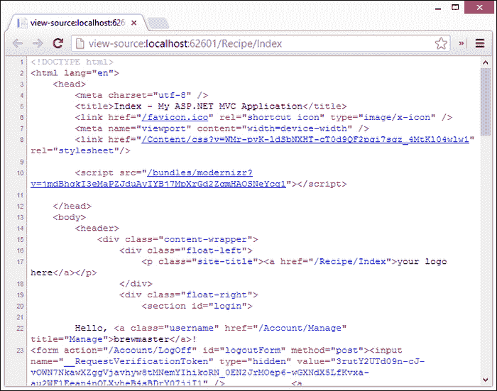
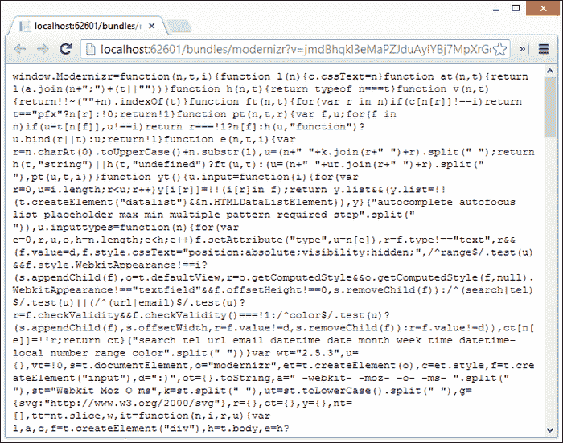

# 第十章。异步编程和捆绑包

在满足了我们对功能的最低要求后，我们的应用程序已经发布，并在互联网上提供。在我们有机会眨眼之前，BrewHow.com 正以我们几乎无法想象的速度被用户淹没。几周内，热门科技新闻媒体都在谈论我们将成为史上最大的 IPO。当我们突然醒来时，我们开始想我们将如何处理我们新发现的财富。

很难过这只是一个梦，我们开始想，如果我们有幸遇到一些最近的技术宠儿遇到的那种规模问题，我们会怎么做。我们决定需要了解更多关于构建响应性应用的知识。

在这一章中，我们将探讨如何通过提高服务器端的性能来使我们的应用程序更好地响应用户。这些改进将集中在我们的应用程序如何更有效地向用户提供信息，并减少等待时间。为此，我们将分别探讨异步编程和捆绑包。

# 异步编程

异步编程是一种我们可以用来执行计算量大或输入/输出量大的任务的技术，这些任务通常会阻塞我们的应用程序，例如请求网络服务或执行昂贵的文件输入/输出。这些任务可以被发送到独立的线程，直到它们完成。当这些昂贵的操作在后台执行时，应用程序可以着手满足用户的需求。

大多数框架都提供了一种机制，要么等待已经排队等待后台执行的某个任务完成，要么提供一个回调，以便在后台任务完成时调用。那个。NET 框架也没有什么不同，在 4.0 版本中，异步编程随着**任务并行库** ( **第三方语言**)的引入而大大简化。

## 任务并行库

第三方物流为中的低级线程机制提供了一个抽象。NET 框架，用于提供并行性和并发性。在`System.Threading`和`System.Threading.Tasks`中定义，这个库允许我们关注如何将我们的应用程序分解成异步任务，并将线程调度、分区和取消的担忧留给框架。

我们在应用程序中提供异步功能的大部分工作将涉及到`System.Threading.Tasks`中定义的第三方物流`Task`类的使用。

### 任务

`Task`类用于封装一个要异步执行或与其他任务并行执行的工作单元。如果我们认为工作需要很长时间才能完成，需要大量的输入/输出，或者会在不可接受的时间内阻止用户与我们的应用程序交互的执行，我们可能会选择在`Task`类中执行工作。

为了创建和管理任务，`Task`类为我们提供了一个流畅的应用编程接口，通过它我们可以创建、调度、执行和取消任务。

#### 创建任务

虽然有几种方法可以在第三方物流中创建和执行`Task`类，但最常用的方法是通过`Task`类的静态`Factory`属性:

```cs
var longTask = Task
  .Factory
  .StartNew(() => DoLongRunningTask());
```

上面的代码创建并启动了一个新的`Task`，在`DoLongRunningTask`方法中执行代码。在幕后，运行时创建一个新的线程，在其上执行`DoLongRunningTask`方法。正如所写的，这段代码没有提供任何方法让任务通知我们它的完成。

这种一劳永逸的方法可以用在需要执行后台任务但不太关心任务何时完成或任务的返回值是什么的应用程序中。

然而，我们正在编写一个移动网络应用程序，在一个运行在 IIS 启动线程上的网络应用程序中，不建议希望它们成功完成。事实上，如果 web 应用程序中发生的任何未处理的异常都与活动请求无关，那么它将导致进程停止。因为我们可能不想这样做，所以我们需要等待在请求的上下文中开始的任何任务的完成。

#### 等待完成

让我们通过检查以下代码来开始了解如何等待任务的完成:

```cs
Task<bool> ingredientCheck = Task
  .Factory
  .StartNew(() => 
  { 
    return IsIngredientInStock(ingredient); 
  });
```

这段代码构建了一个新的任务，在后台执行`IsIngredientInStock`方法，然后返回结果。这个假设的方法出去检查我们最喜欢的家酿供应店的成分。如果我们假设`IsIngredientInStock`方法的返回类型为`bool`，则分配给我们的新任务的`ingredientCheck`变量的类型为`Task<bool>`。返回类型实际上是从被调用的通用`StartNew`方法中推断出来的。

为了等待分配给我们的`ingredientCheck`变量的任务完成，我们简单地称其为`Wait`方法:

```cs
ingredientCheck.Wait();
var taskResult = ingredientCheck.Result;
```

该方法的返回值可通过`ingredientCheck`的`Result`属性获得。由于`ingredientCheck`变量为`Task<bool>`，因此`Result`属性为`bool`类型。

如果我们想检查多个商店，而不是检查我们最喜欢的自制商店的一种成分，会怎么样？第三方物流为我们提供了使用`Task`类的静态`WaitAll`方法等待多个任务完成的能力。

```cs
var task1 = Task
  .Factory
  .StartNew(() => { return CheckStore1(ingredient); });
var task2 = Task
  .Factory
  .StartNew(() => { return CheckStore2(ingredient); });

Task.WaitAll(new Task[] { task1, task2 });
// Nothing below this will execute until both tasks complete. 
```

对`Task`静态`WaitAll`方法的调用被阻塞。在`task1`和`task2`完成之前，它不会让任何进一步的代码在当前线程上执行。

等待*方法，如`Wait`、`WaitAll`和`WaitAny`被提供来允许我们让出执行，直到给定的任务或任务组已经完成。这些方法顾名思义就是这样做的；他们会等到一个任务或一组任务完成后再继续。

如果我们的应用程序的需求要求我们不要简单地等待任务的完成，而是希望在任务完成时得到通知，我们可以向任务注册一个回调。

#### 完成回调

回调在第三方物流中通过`Task`类的`ContinueWith`方法得到的支持。`ContinueWith`方法在`Task`类中定义如下:

```cs
public Task ContinueWith(Action<Task> continuationAction)
```

作为一个参数，`ContinueWith`方法期望一个`Action`，等待完成的`Task`类被作为一个参数传递给它。在前面的`Task`完成之前，`ContinueWith`的`Action`参数内的代码不会执行。除了处理任务完成，我们还可以使用这个功能来链接`Tasks`。

举例来说，如果我们只想在`DoLongRunningTask`方法完成时向控制台记录一条消息，我们可以编写如下代码:

```cs
var longTask = Task
  .Factory
  .StartNew(() => DoLongRunningTask())
  .ContinueWith((previousTask) =>
  {
    Console.WriteLine("Long Running Task Completed.");
  }
```

在`DoLongRunningTask`完成之前，`ContinueWith`方法中的代码不会被调用。

如您所见，第三方语言和我们使用它的流畅应用编程接口允许我们以更符合我们线性思维的方式编写多线程代码。它的介绍在。与涉及使用`AsyncCallback`、`IAsyncResult`等的传统异步编程方法相比，NET 4.0 是一个巨大的进步。

英寸 NET 4.5 中，框架引入了两个新的 C#关键词来进一步简化异步编程:`async`和`await`。

## 异步

`async` 关键词是修饰词，就像`static`或`const`一样。它用于将方法声明标记为异步。它的使用有几个限制。标有`async`修饰符的方法必须具有`Task`、`Task<TResult>`或`void`的返回类型，并且该方法不得采用任何`ref`或`out`参数。

要声明一个没有返回值的`async`方法，需要声明该方法的类型为`Task`:

```cs
async Task JustDoIt()
{
  // Do your thing
}
```

如果定义为`async`的方法需要返回值，则必须声明为`Task<TResult>`，其中`TResult`标识`Task`返回值的类型:

```cs
async Task<TResult> ReturnSomethingLater()
{
  TResult returnVal;
  // Do some operation.
  return returnVal;
}
```

当异步方法用于需要`void`类型的事件处理程序时，我们可以将异步方法声明为`void`类型:

```cs
async void ImRarelyUsed()
{
  // Do my job.
}
```

这些`void`方法的行为不同于那些返回`Task`或`Task<TResult>`的方法，不应该用于我们在这里介绍的常见异步任务。

正如你所看到的，使用`async`修改器有很多限制。还有一个限制值得一提。标有`async`修饰符的方法必须包含`await`运算符。

## 等待

`await` 运算符通常被视为`async`修饰符的伴词。它用于识别`async`方法中运行时暂停处理直到异步任务完成的点:

```cs
var asyncTask = DoBackgroundWork();

// Do some additional work while
// the background task completes.

await asyncTask;
```

在前面的示例代码中，方法`DoBackgroundWork`返回`Task`或`Task<TResult>`。方法被调用后，调用者在后台任务执行的同时着手完成其他工作。只有当`await`操作符被调用时，调用者才等待异步任务的完成。

`Await`其实有点用词不当。`await`的来电者只是被暂停；当前线程没有被阻塞。相反，`await`操作符之外的代码的剩余部分被注册为当前线程的延续，线程可以自由地进行其他工作。当与`await`操作符相关联的任务已经完成时，在本例中为`DoBackgroundWork`，它调用暂停线程的继续和超出`await`关键字的任何代码。

如果标记有`async`修饰符的方法中不存在`await`运算符，该方法将被视为同步的，编译器将生成警告。

异步编程是一个通常与桌面或后端服务器应用程序相关的话题。这是不幸的，因为我们可以使用新的`async`和`await`关键词将异步编程概念应用到我们的移动网络应用程序中。

## 异步控制器动作方法

在我们深入讨论异步控制器动作之前，了解框架和 IIS 如何处理传入控制器的请求可能会有所帮助。

当 IIS 收到对资源的请求时，它会将该请求交给该请求的处理程序——对于 ASP.NET MVC，该请求会交给 ASP.NET。ASP.NET 依次将请求传递给。NET 框架，专门处理网络请求。这个过程让 IIS 可以自由处理入站请求，因为它只是将请求委托给适当的处理程序。由于大多数 web 应用程序的请求处理只需要几秒钟就可以在框架内执行，所以这个线程切换过程几乎可以保证 IIS 能够处理所有入站 web 请求。

但是，如果大多数 web 请求最终都是长时间运行的请求、调用 web 服务的请求、对文件系统执行操作的请求等等，那么。NET 框架会变得疲惫不堪。发生这种情况时，IIS 将开始对请求进行排队。如果请求队列已满，IIS 将开始向客户端返回 HTTP 状态代码 503，表示服务器正忙。

异步控制器动作提供了将工作从请求线程卸载到工作线程的能力。当一个请求进入 web 服务器时，服务器从线程池中获取一个线程。线程池在看到可以执行异步操作时，调度异步操作，然后返回线程池。异步操作完成后，web 服务器会收到通知，并从池中检索另一个线程来完成请求并向客户端返回响应。

异步动作的完成时间与同步动作方法一样长。当我们需要完成可能是 CPU、网络或 I/O 绑定的操作(通常是响应 web 请求的长时间运行的操作)时，它们只是允许我们释放资源来处理额外的请求处理。

### 创建异步动作

在ASP.NET MVC 4 之前，异步动作方法只在扩展`AsyncController`基类的控制器中支持。每个异步动作都遵循基于事件的异步模式，其中初始方法有一个`Async`后缀，完成方法有一个`Completed`后缀:

```cs
public class HomeController :AsyncController
{
  public void IndexAsync()
  {
    AsyncManager.OutstandingOperations.Increment();
    Task.Factory.StartNew(() => ExecuteAsyncTask());
  }

  private void ExecuteAsyncTask()
  {
    // Do asynchronous work.
    AsyncManager.OutstandingOperations.Decrement();
  }

  public ActionResult IndexCompleted()
  {
    return View();
  }
}
```

随着`async`修饰符的引入。NET 4.5，异步动作的创建得到了极大的简化:

```cs
public class HomeController : Controller
{
  public async Task<ActionResult> IndexAsync()
  {
    var asyncTask = Task
    .Factory
    .StartNew(DoBackgroundWork());
    // Do some work.
    await asyncTask();
  }
}
```

事实上，异步动作的声明与用`async`修饰符标记的任何其他异步方法的声明没有什么不同。

### 注

`Async`后缀的使用不是强制性的，对运行时没有影响。然而，这是一个建议遵循的惯例。

### 异步配方控制器

让我们假设我们的应用程序给网络服务器带来了过度的压力，因为配方控制器花费了大部分时间从数据库中检索对象，并将它们转换为视图模型。这种压力导致我们的网络服务器向我们应用程序的一些用户返回 HTTP 状态代码 503。我们已经查看了我们的模式和数据库，并确定我们的模式已经被适当地索引和维护。我们没有建立网络农场的预算或资源。但是，我们知道，如果 web 服务器没有等待我们处理这些请求，我们的用户就不会收到这些断断续续的 503 条消息。看来是时候让`RecipeController`类常用的动作异步了。

以下是检索`RecipeController`的`Index`动作的异步动作:

```cs
public async Task<ActionResult> Index(int page = 0)
{
  var recipeListTask = Task.Factory.StartNew(() =>
  {
    var recipes = _recipeRepository.GetRecipes();

    var viewModel = new PagedResult<RecipeEntity, RecipeDisplayViewModel>(
      recipes,
      page,
      this._displayViewModelMapper.EntityToViewModel);

    return viewModel;
  });

  return View(await recipeListTask);
}
```

### 类型

**HttpContext 为空**

在处理异步任务时，有一条非常重要的信息需要记住。当前`HttpContext`没有分配给异步任务正在执行的线程。如果您需要访问它，您将需要找到一种方法将它或您需要的数据传递到任务中。这方面的一个例子可以在本书附带的代码中的`LibraryController`中找到。

在优化了`RecipeController`内的操作后，下一个选择是减少对我们的网络服务器的入站请求数量，但不减少访问者的数量，请注意，并减少网络服务器向我们的客户端发回响应的时间。我们可以使用捆绑包来做到这一点。

# 捆

在 ASP.NET MVC 4 中，术语包指的是一个或多个文件，通常是 JavaScript 或 CSS，在运行时注册为一个组。

当请求捆绑包时，组成捆绑包的文件在称为**捆绑**的过程中相互附加。捆绑的文件然后经历一个**缩小**过程，在这个过程中，文件被去掉注释和空白，局部变量的名称，如果有的话，被缩短。

通过使用捆绑包，客户端可以减少它必须向服务器发出的检索内容的请求的数量和大小。当应用于移动应用程序开发领域时，捆绑会对应用程序的感知性能产生重大影响。

### 类型

**CDN 支持**

虽然本章没有讨论，但是捆绑包也支持使用常见的内容交付网络，如微软和谷歌提供的网络。

## 创建包

我们的移动应用程序目前包含六个注册捆绑包。这些包在我们项目的`AppStart`文件夹中包含的`BundleConfig`类中注册。

```cs
public class BundleConfig
{
  public static void RegisterBundles(
    BundleCollection bundles)
  {
    bundles.Add(new ScriptBundle("~/bundles/jquery")
    Include("~/Scripts/jquery-{version}.js"));

    // Code removed for brevity.bundles.Add(new ScriptBundle("~/bundles/modernizr").Include("~/Scripts/modernizr-*"));

    bundles.Add(new StyleBundle("~/Content/css").Include("~/Content/site.css"));

    // More code removed for brevity...
  }
}
```

当应用程序启动时，从`Global.asax.cs`中调用`RegisterBundles`方法来注册我们的包定义。包定义包含包类型和要包含在包中的文件。捆绑包类型本身标识了可以请求捆绑包的位置。

### 注

虽然为了简洁起见，上面的代码中省略了三个包，但显示的三个包不是随机选择的。它们说明了不同捆绑包类型的使用以及在定义捆绑包时对通配符的支持。

### 束类型

在 `RegisterBundles`方法中，两种不同类型的包在运行时注册:`ScriptBundle` s 和T2。这些包包含您可能期望的内容:脚本(特别是 JavaScript)和样式(特别是 CSS)。

虽然这是仅有的两种开箱即用的支持捆绑包，但微软意识到您可能希望支持以其他语言编写的其他类型文件的捆绑包。为了支持这一点，框架有一个基本的`Bundle`类，您可以使用它来添加对其他类型的支持。

添加对新捆绑类型的支持不是一件小事，因为您必须编写自己的自定义转换来实现`IBundleTransform`接口。`StyleBundle`和`ScriptBundle`在引擎盖下使用一个叫做`WebGrease`的工具来执行的 JavaScript 和 CSS 的转换。通过 NuGet 提供的其他包支持 LESS 和 CoffeeScript 等语言。在你跑去写你自己的之前，我建议检查一下你的语言是否已经被支持了。

### 通配符支持

如果我们查看以下包定义，我们会注意到它们使用通配符机制将文件包含在包中:

```cs
bundles.Add(new ScriptBundle("~/bundles/jquery").Include("~/Scripts/jquery-{version}.js"));

bundles.Add(new ScriptBundle("~/bundles/modernizr").Include("~/Scripts/modernizr-*"));
```

对通配符的支持允许我们将相关文件包含在一起，而不必在包中的`Include`中枚举每个文件。这些包本身足够聪明，可以在发生冲突时对要包含的文件做出一些决定。如果您恰好有一个缩小版本的 jQuery、Visual Studio 调试版本的 jQuery 和标准版本的 jQuery 位于一个目录中，那么如果您的目标是发布版本，包中支持的通配符规则将包括文件的缩小版本，如果您不是，则包括标准的 jQuery 版本。

在通配符支持的土地上，一切都不是彩虹和独角兽。通配符包含将按字母顺序向包中添加文件。如果您不幸地以字母顺序不同于依赖顺序的方式编写脚本，您将需要创建多个包，创建一个实现`IBundleOrderer`接口的类来支持您的排序，或者使用`Include`方法按照文件必须执行的顺序将文件包含在包中。

应谨慎使用通配符支持。

## 消费捆绑包

现在我们知道了什么是捆绑包以及它们是如何创建的，让我们快速了解一下如何消费它们。

如果你打开布局页面，`_Layout.cshtml`，你会在顶部看到两行:

```cs
@Styles.Render("~/Content/css")
@Scripts.Render("~/bundles/modernizr")
```

这些行分别查询运行时的位置为`~/Content/css`和`~/bundles/modernizr`的样式包和脚本包。底部还有一行包含 jQuery 包的代码:

```cs
@Scripts.Render("~/bundles/jquery")
```

启动网站查看菜谱列表的源代码，我们可以看到顶部的两个包翻译成其中包含的实际文件:


如果我们在浏览器中查看`styles.css`和`modernizer.js`文件的内容，我们会发现它们与存储在磁盘上的版本完全相同。那么会有什么结果呢？使用捆绑包不是应该合并和缩小每个定义吗？答案是视情况而定。

捆绑过程的智能不仅限于通配符文件包含。如果我们检查`web.config`文件，我们会看到我们的应用程序目前是在调试模式下编译的。

```cs
<compilation debug="true" targetFramework="4.5" />
```

如果在站点当前处于调试模式时正在处理包，包过程只需将指向所有当前形式文件的链接添加到页面中。这其实是一种期望的行为；你不想尝试和调试迷你化的 JavaScript 或 CSS。

将`debug`属性设置为`false`将启用包过程，并将更改页面的输出，以实际引用包，而不是单个文件。

### 注

通过将`BundleTable`类的`EnableOptimizations`属性设置为`true`，也可以打开捆绑包的捆绑和缩小行为。如果这样做了，在`web.config`中将`compilation`节点的`debug`属性设置为`true`将不再对该过程产生影响，因为`EnableOptimizations`属性取代了任何其他配置。



您应该注意到源中每个捆绑链接后面的查询字符串。这些查询字符串是一个哈希，用于表示包的内容，并有助于打破浏览器中的缓存，该浏览器的实现保存脚本和 css 文件的时间比请求的时间长。当包中任何文件的内容发生变化时，会生成一个新的哈希，从而产生一个新的查询字符串，并因此产生一个新的链接。当浏览器遇到新链接时，它将无法在其缓存中找到该文件，并将再次从服务器检索该文件。

对文件内容的检查表明内容确实被缩小了。



这看起来不是一个大的变化，但是性能的提高是相当可观的，尤其是对于那些围绕着智能客户端设计的、脚本编写量很大的网站。即使在我们运行在 localhost 上的小应用程序上，性能也有了显著的提高。

打开 Chrome 的**开发者工具**窗口中的**网络**标签，我们可以看到我们的网站从本地主机加载花费了 405 毫秒，完成了 307 千字节的数据传输，没有缩小。


如果我们查看网站发布版本的完全相同的请求，我们会看到加载时间下降了到 322 毫秒。这不是一个巨大的下降，但是我们是从 localhost 加载的，所以我们不应该期望看到这么小的网站有大的数字。

更大的区别在于我们从服务器发送到客户端的数据量。我们从 307 千字节下降到 52.5 千字节，实际上数据量下降到原来的 1/6。


# 总结

在本章中，我们学习了多种方法来提高我们的应用程序的性能，从而改善我们的服务器和用户。我们学习了如何通过使用第三方语言同时执行多个任务，以及如何在异步控制器操作中执行长时间运行的过程时释放 IIS 来处理请求。

我们还了解了捆绑包，以及我们如何使用它们来缩小我们网站在带宽和请求聊天方面的占用空间。

在下一章中，我们将重点关注用户体验，探索 SignalR 以及它如何使我们能够与用户提供实时交互和反馈。