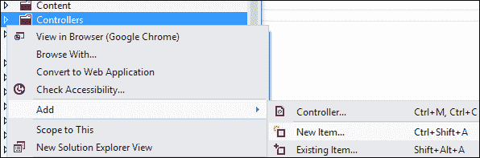
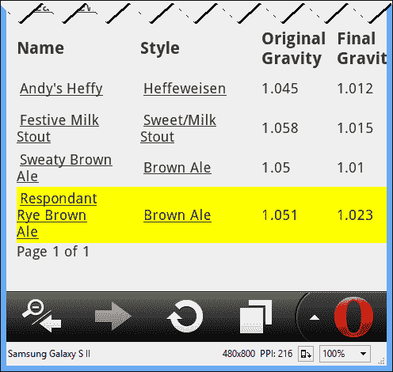

# 十一、实时网络编程

随着网络应用和传统桌面应用之间的界限变得模糊，我们的用户已经开始期待我们的网络应用中的实时行为，这是传统上桌面的领域。人们真的不能责怪他们。与数据、服务甚至其他用户的实时交互推动了互联革命，我们现在的互联方式比以往任何时候都多。无论这种时刻保持联系并立即获知事件的愿望多么合理，网络应用中的实时交互都存在固有的挑战。

第一个挑战是网络是无状态的。网络是建立在 HTTP 之上的，HTTP 是一种请求/响应协议；对于浏览器发出的每个请求，都有且只有一个响应。我们可以使用一些框架和技术来掩盖网络的无状态性，但是网络或 HTTP 中并没有真正的状态。

这就更加复杂了，因为网络是客户机/服务器。由于它是无状态的，服务器只知道在任何给定时刻连接的客户端，客户端只能根据与服务器的最后一次交互向用户显示数据。客户端和服务器唯一了解对方的时间是在活动请求/响应期间，此操作可能会改变客户端或服务器的状态。对服务器状态的任何更改都不会反映给其他客户端，直到它们用新请求连接到服务器。这有点像不确定性原理，因为一个人越是试图确定关系中的一个数据点，另一个人就变得越不确定。

所有的希望都没有失去。有几种技术可以用来实现 web 服务器和任何活动客户端之间的实时(或接近实时)数据交换。

# 模拟连接状态

在传统的网络开发中，还没有一种方法来保持客户端浏览器和网络服务器之间的持久连接。Web 开发人员已经竭尽全力，试图在 HTTP 的请求/响应世界中模拟一个互联的世界。

一些开发人员成功地利用创造性思维和标准本身的漏洞来开发诸如长轮询和永久框架等技术。现在，由于意识到需要这样一种技术，监督下一代网络标准的组织也开始关注服务器发送的事件和网络套接字。

## 长轮询

**长轮询** 是任何客户端和服务器内容交换的默认后备。除了 HTTP，它不依赖任何东西——不需要特殊的标准清单或其他狡辩。

长时间的投票就像得到伴侣的沉默对待。你问一个问题，无限期地等待答案。经过一段已知的时间和看似永恒的时间后，你终于得到了一个答案，或者请求最终超时了。这个过程一次又一次地重复，直到请求被完全满足或者关系终止。所以，是啊，这就像沉默治疗。

## 永远的框架

**永远框架**技术 依赖于 HTTP 1.1 标准和一个隐藏的`iframe`。当页面加载时，它包含(或构建)一个隐藏的`iframe`，用于向服务器发出请求。客户机和服务器之间的实际交换利用了 HTTP 1.1 的一个称为 **分块编码**的特性。分块编码由 HTTP `Transfer-Encoding`头中的值`chunked`标识。

这种数据传输方法旨在允许服务器在内容的整个长度已知之前开始向客户端发送部分数据。当模拟浏览器和网络服务器之间的实时连接时，服务器可以根据`iframe`的请求将消息作为单独的块发送给客户端。

## 服务器发送的事件

**服务器发送事件** ( **上交所** ) 为服务器提供了在客户端网页浏览器中引发 DOM 事件的机制。这意味着要使用 SSE，浏览器必须支持它。在撰写本文时，对 SSE 的支持很少，但它已经提交给 W3C，以纳入 HTML5 规范。

SSE 的使用从声明一个`EventSource`变量开始:

```cs
var source = new EventSource('/my-data-source');
```

如果您想监听任何和所有由源发送的消息，您只需将其视为一个 DOM 事件，并用 JavaScript 处理它。

```cs
source.onmessage = function(event) {
    // Process the event.
}
```

上交所支持特定事件和复杂事件消息的提出。消息格式是 JSON 的简单的基于文本的格式衍生。两个换行符分隔流中的每个消息，每个消息可能有一个`id`、`data`和`event`属性。上交所还支持在消息中使用`retry`关键字设置重试时间。

```cs
:comment

:simple message
data:"this string is my message"

:complex message targeting an event
event:thatjusthappened
data:{ "who":"Professor Plum", "where":"Library", "with":"candlestick" }
```

截至本文撰写之时，Internet Explorer 中不支持 SSE，并且在少数移动浏览器中部分实现了 SSE。

## 网络套接字

网络上实时通信的妙招是网络套接字。网络套接字支持网络浏览器和网络服务器之间的双向流，并且仅利用 HTTP 1.1 来请求连接升级。

一旦连接升级被批准，网络套接字通过 TCP 连接使用网络套接字协议进行全双工通信，实际上是在浏览器中创建一个可用于实时消息传递的客户端-服务器连接。

所有主要的桌面浏览器和几乎所有的移动浏览器都支持网络套接字。但是，网络套接字的使用需要网络服务器的支持，并且网络套接字连接在代理后面可能无法成功工作。

有了所有可用的工具和技术来实现我们的移动网络应用和网络服务器之间的实时连接，人们如何做出选择？我们可以编写代码来支持长轮询，但这显然会耗尽服务器上的资源，并要求我们在终端做一些相当广泛的管道工作。我们可以尝试使用网络套接字，但是对于缺乏支持的浏览器或代理背后的用户，我们可能会引入比我们能解决的更多的问题。如果有一个框架来为我们处理所有这些，请尝试可用的最佳选项，并在需要时降低到几乎保证的长轮询功能。

等等。有。叫做**信号员**。

# 信号

signor提供了一个框架，将之前提到的所有实时连接选项抽象为一个内聚的通信平台，支持 web 开发和传统桌面开发。

在客户端和服务器之间建立连接时，信号员将根据客户端和服务器的能力协商最佳连接技术。实际使用的传输隐藏在更高级别的通信框架之下，该框架公开了服务器上的端点，并允许客户端调用这些端点。反过来，客户端可以向服务器注册，并向其推送消息。

每个客户端通过一个连接标识对服务器进行唯一标识。此连接标识可用于向客户端或远离客户端发送消息。此外，SignalR 支持组的概念，每个组都是连接标识的集合。这些组，就像单独的连接一样，可以被明确地包括在通信交换中或从通信交换中排除。

SignalR 中的所有这些功能都是由两个客户端/服务器通信机制提供给我们的:**持久连接**和**集线器**。

## 持久连接

持久连接是 SignalR 的低级连接。这并不是说它们提供了对 SignalR 正在使用的实际通信技术的访问，而是为了说明它们作为客户端和服务器之间原始通信的主要用途。

持久连接的行为很像传统网络应用开发中的套接字。它们在较低层次的通信机制和协议之上提供了一个抽象，但提供的并不多。

当创建一个端点来处理 HTTP 上的持久连接请求时，处理连接请求的类必须位于`Controllers`文件夹(或任何其他包含控制器的文件夹)中，并扩展`PersistentConnection`类。

```cs
public class MyPersistentConnection: PersistentConnection
{
}
```

`PersistentConnection`类通过事件管理从客户端到服务器的连接。为了处理这些连接事件，任何从`PersistentConnection`派生的类都可以覆盖在`PersistentConnection`类中定义的方法。

客户端与服务器的交互会引发以下事件:

*   `OnConnected`:当与服务器建立新的连接时，框架会调用这个函数。
*   `OnReconnected`:当已经终止的客户端连接重新建立了与服务器的连接时，会调用该选项。
*   `OnRejoiningGroups`:当重新建立超时的客户端连接时调用此选项，以便该连接可以重新加入适当的组。
*   `OnReceived`:从客户端接收数据时，调用此方法。
*   `OnDisconnected`:当客户端和服务器之间的连接已经终止时调用。

通过`PersistentConnection`类的`Connection`属性与客户端进行交互。当事件被引发时，实现类可以确定它是否希望使用`Connection.Broadcast`广播消息，使用`Connection.Send`响应特定客户端，或者使用`Connection.Groups`将触发消息的客户端添加到组中。

## 枢纽

集线器通过屏蔽管理客户端和服务器之间的原始连接所涉及的一些开销，为我们提供了对`PersistentConnection`类的抽象。

类似于持久连接，集线器包含在项目的`Controllers`文件夹中，但是扩展了`Hub`基类。

```cs
public class MyHub : Hub
{
}
```

虽然集线器支持连接、重新连接和断开事件的通知能力，但与事件驱动的持久连接不同，集线器为我们处理事件调度。`Hub`类上任何公开可用的方法都被视为端点，任何客户端都可以通过名称寻址。

```cs
public class MyHub : Hub
{
    public void SendMeAMessage(string message)
    { /* ... */ }
}
```

集线器可以使用`Hub`基类的`Clients`属性与其任何客户端通信。这个属性支持方法，就像`PersistentConnection`的`Connection`属性一样，可以和特定的客户端、所有客户端或者客户端组进行通信。

我们将从一个例子中学习，而不是分解`Hub`类中所有可用的功能。

# 实时配方更新

在我们的酿酒之路移动应用中，当我们查看食谱列表时，它会很高兴收到新食谱添加的通知。为了实现这一点，我们将使用 SignalR 框架提供的`Hub`机制来实现对酿酒方法集合的添加的实时通知。

## 安装和配置信号装置

信号员，像一样最现代.NET 框架，作为一个 NuGet 包提供:`Microsoft.AspNet.SignalR`。我们可以通过在**软件包管理器**控制台中输入以下内容来安装软件包:

```cs
Install-Package Microsoft.AspNet.SignalR
```

除了对我们项目的几个程序集引用之外，SignalR 包还添加了一个新的 JavaScript 文件:`jquery.signalR-1.1.2.min.js`—您的版本可能会有所不同，这取决于您实际阅读该文件的时间。这个 JavaScript 文件包含了客户端网络浏览器与两种类型的信号端点通信所需的所有抽象:持久连接和集线器。

SignalR JavaScript 文件只是客户端难题的一部分。为了在我们的应用中启用 Signar 支持，我们需要添加对 SignalR JavaScript 库的引用，并调用处理程序`/signalr/hubs`，该处理程序用于为我们项目中的任何中枢创建 JavaScript 代理。这些参考将放在`_Layout.cshtml`中。

```cs
@Scripts.Render("~/bundles/jquery")
<script
 src="~/Scripts/jquery.signalR-1.1.2.min.js"
 type="text/javascript"></script>
<script
 src="~/signalr/hubs" 
 type="text/javascript"></script>
@RenderSection("scripts", required: false)
```

我们还必须向运行时注册`/signalr/hubs`路由。我们可以通过简单地调用路由集合的`MapHubs`扩展方法来做到这一点，在这里我们为我们的应用注册其他路由。

```cs
routes.IgnoreRoute("{resource}.axd/{*pathInfo}");
routes.MapHubs();
routes.MapRoute(
    name: "BeerByStyle",
```

请注意，中枢路由位于所有其他`MapRoute`呼叫或我们可能用于注册路由的其他方法之前。我们这样做是因为路由选择是在第一次匹配时进行的，我们不想无意中在路由表中的 SignalR 之前注册一些东西。

## 创建配方中心

我们需要提供一个中枢，客户端可以连接到该中枢来接收关于新配方添加的通知。

右键点击我们项目的`Controllers`文件夹，选择**添加** | **新项目……**。



在**添加新项目**对话框中，搜索信号员并选择**信号员中枢类**。命名类`RecipeHub.cs`点击**添加**。


我们需要修改 Visual Studio 生成的`RecipeHub`类。如前所述，客户端将接收关于新食谱的通知，但是没有客户端会直接发布到这个中心与服务器通信。因此，我们只需要创建一个空的中心。

```cs
namespace BrewHow.Controllers
{
    public class RecipeHub : Hub
    {
    }
}
```

乍一看，一个空类可能看起来毫无意义，但是如果没有类声明，SignalR 无法为客户端创建一个代理来与服务器交互。

## 修改配方列表视图

配方列表视图需要修改才能连接到配方中心。业务的第一个顺序是为配方列表提供一个标识。该标识将用于使用 jQuery 定位和修改列表。给配方列表分配一个`recipe-list`的标识。

```cs
<table id ="recipe-list">
```

我们现在可以添加一些连接到配方中心的 JavaScript，并在收到新配方的通知后，在表格底部添加背景颜色为黄色的新配方。

```cs
$(function () {
    $.connection.hub.start();
    var recipeHub = $.connection.recipeHub;
    recipeHub.client.recipeAdded = function (recipe) {
        var tr = $("#recipe-list").find('tbody')
            .append(
                $('<tr>').css('background-color', '#ff0')
                    .append($('<td>')
                        .append($('<a>')
                        .attr('href', '/Recipe/Details/'
                            + recipe.RecipeId
                            + "/" + recipe.Slug)
                        .text(recipe.Name))
                    )
                    .append($('<td>')
                        .append($('<a>')
                        .attr('href', '/Recipe/'
                            +recipe.StyleSlug)
                        .text(recipe.Style))
                    )
                    .append($('<td>'
                        + recipe
                            .OriginalGravity
                            .toFixed(3)
                        + '</td>'))
                    .append($('<td>'
                        + recipe
                            .FinalGravity
                            .toFixed(3)
                        + '</td>'))
@if (Request.IsAuthenticated) {
@:                        .append($('<td>'
@:                            + 'Add to Library'
@:                            + '</td>'))
}
            );
    }
});
```

JavaScript 代码包含在闭包中，确保它只被调用一次，不能被任何外部源调用。第一行代码在客户端启动集线器连接:

```cs
$.connection.hub.start();
```

`connection`对象是由 SignalR JavaScript 添加到 jQuery 的对象。连接对象的`hub`属性提供了对 SignalR 客户端库的中枢基础结构的引用。对`start`方法的调用初始化了 SignalR 客户端，并准备了由我们的`_Layout.cshtml`页面中的`/signalr/hubs`调用生成的代理代码，以接收来自服务器的通知。

接下来，JavaScript 建立了与我们的配方中心的连接:

```cs
var recipeHub = $.connection.recipeHub;
```

仔细检查这个代码，你会发现到我们`RecipeHub`类的连接在连接类中被标识为`recipeHub`。为我们的应用中的集线器生成代理类的`/signalr/hubs`调用使用集线器类名的驼色版本将它找到的每个集线器添加到`connection`对象中:`RecipeHub`变成`recipeHub`、`MyHub`变成`myHub`等等。

下一行代码在客户机上注册了一个方法，当添加新配方时，服务器将调用该方法。

```cs
recipeHub.client.recipeAdded = function (recipe) {
```

我们可以随心所欲地调用这个方法——除了与中心服务器端方法匹配的名称。正是在客户机上声明一个函数并将其分配给集线器的`client`属性的行为使得服务器可以使用该方法。

代码的其余部分只是获取它接收到的`RecipeDisplayViewModel`对象，并用黄色高亮显示将其附加到表格中。

## 发布事件通知

我们已经讨论了在基于`Hub`或`PersistentConnection`的课程中回应客户。然而，我们的`RecipeHub`班是空的，我们没有其他的枢纽。别担心。在配方保存到存储库中后，我们可以通过将代码放入`RecipeController`类的`Create`方法来通知我们应用的其他用户发生了此事件。

```cs
var context = Microsoft.AspNet.SignalR.
    GlobalHost
        .ConnectionManager
        .GetHubContext<RecipeHub>();
context
    .Clients
    .All
    .recipeAdded(
        _displayViewModelMapper
            .EntityToViewModel(recipeEntity)
    );
```

这段代码从检索我们的`RecipeHub`类的上下文开始。我们使用信号员`ConnectionManager`的`GetHubContext<T>()`方法来完成。然后，我们准备使用上下文的`Clients.All`属性向`RecipeHub`类的所有客户端进行广播。

阿瑟·克拉克爵士说:

> *“任何足够先进的技术都无法与魔法区分开来。”*

我会让你来判断它是否有魔力，但是要调用我们在 JavaScript 中定义并分配给`client`的`recipeAdded`方法，我们只需在这里调用它，传递我们希望返回的数据。运行时为我们处理事件调度，并通知`RecipeHub`类的所有客户端我们正在调用`recipeAdded`方法。如果客户端上有这样的方法，它将由 SignalR 客户端代码调用。

要使这项工作成功，还需要再做一次更改。当`recipeEntity`类被创建时，我们的存储库当前没有设置它的`RecipeId`属性。当我们使用配方的 ID 来提供列表中详细信息的链接时，我们需要确保广播发送到的所有客户端都可以使用它。这个变化相当简单。对实体框架上下文进行更改后，只需修改存储库以设置`RecipeId`。

```cs
recipeEntity.RecipeId = newRecipeModel.RecipeId;
```

现在一切都应该正常了。我们只需要同时连接两个客户端来测试它。


在谷歌浏览器中添加食谱后，它会神奇地出现在 Opera Mobile 的食谱列表中。



# 总结

在这一章中，我们看了信号。SignalR 框架为我们提供了对浏览器和网络服务器之间通信的前所未有的控制，实现了实时通信。这项技术可用于游戏、实时状态更新或模拟移动网络应用中的推送通信。

到目前为止，我们已经对 ASP.NET MVC 4 进行了广泛的研究，并提出了我们在构建移动网络应用时需要考虑的问题。在下一章中，我们将开始深入到移动 web，并查看最新版本的中可用的工具和技术.NET 框架。我们将从移动模板开始。