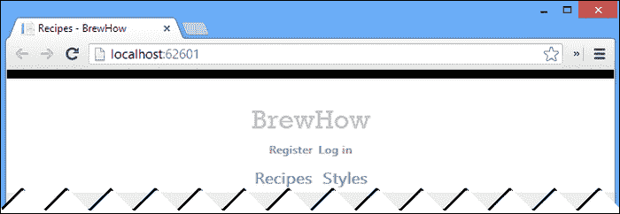
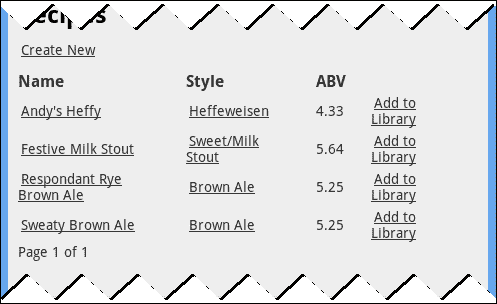
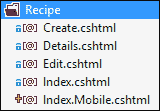
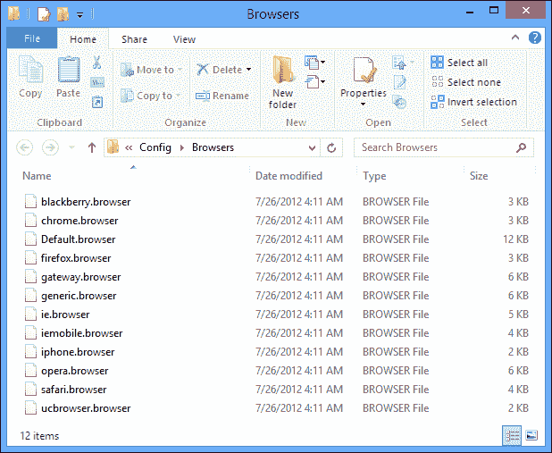
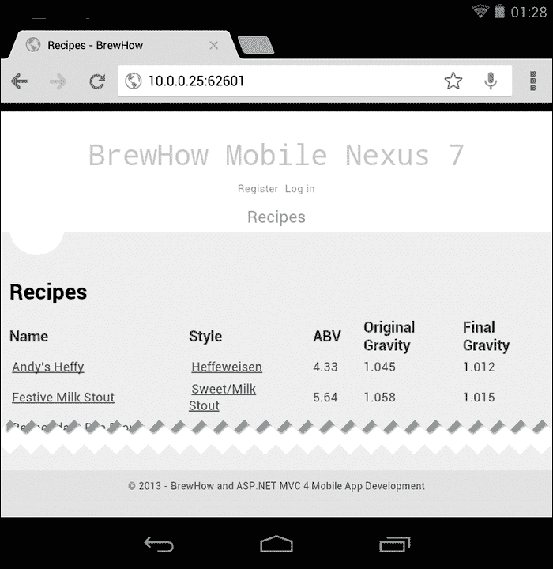

# 十三、扩展对移动网络的支持

在前一章中，我们学习了如何设计和设计我们的应用，使其在移动平台和桌面浏览器上的外观和功能大致相同。对于某些应用来说，响应设计方法可能很好，但是在做出允许客户端处理所有移动演示的最终决定之前，有一些事情需要考虑。

开发一个移动网络应用需要我们以尽可能少的开销快速、轻松地向用户呈现信息。虽然这些总体上是很好的设计目标，但是移动用户的使用模式决定了这些目标是我们设计工作的重点。移动用户希望启动我们的应用，获取他们需要的信息，然后离开。为了适应这种使用场景，我们可能会决定我们需要一种与通过响应设计、媒体查询和视口标签的客户端呈现决定所能实现的体验完全不同的体验。

客户端确定的替代方案当然是在数据发送到客户端之前在服务器上进行呈现确定。这种方法有其自身的一系列缺点。对于初学者来说，确定服务器上客户端的功能并不容易。即使你在应用发布时说明了每台设备，但具有新功能的新设备仍在不断发布。

您还面临着在特定于移动设备或移动设备系列的视图中复制服务器上大量代码的风险。理想的解决方案是通过结合客户端和服务器端的决定来做出呈现决策。

碰巧的是，ASP.NET MVC 4 提供了对服务器端表示的支持，我们可以将其与现有的客户端响应设计逻辑相结合。

# 移动视图

如果我们检查我们的布局页面`_Layout.cshtml`，我们会看到我们的应用的大部分演示布局都包含在这个文件中。因此，如果我们创建一个专门针对移动设备的布局页面，我们肯定会走上将一些呈现逻辑从客户端卸载到服务器的捷径，这似乎是合乎逻辑的。

正如我们已经看到的，约定多于配置在 ASP.NET MVC 4 框架中非常普遍。在我看来，最巧妙的扩展点之一是能够在视图、局部视图或布局的名称中使用`.Mobile`扩展来定位移动设备。我们将开始通过移动布局扩展对移动网络的支持。

## 一、移动布局

首先在`~/Views/Shared,`中创建`_Layout.cshtml`文件的副本，并将副本重命名为`_Layout.Mobile.cshtml`。`Shared`文件夹的内容如下图所示:


打开新的`_Layout.Mobile.cshtml`文件，找到用于显示应用标题的行。

```cs
<p class="site-title">@Html.ActionLink("BrewHow", "Index", "Recipe", new { area = "" }, null)</p>
```

将文字`BrewHow`替换为`BrewHow Mobile`。当移动设备发出请求时，我们将使用此文本来验证我们的新布局正在被使用。

```cs
<p class="site-title">@Html.ActionLink("BrewHow Mobile", "Index", "Recipe", new { area = "" }, null)</p>
```

我们现在已经创建了一个布局页面，所有来自移动浏览器的请求都将使用该页面。说真的，这就是我们要做的。如果我们在 Opera Mobile 模拟器中启动我们的应用，我们将看到运行时确实在使用新的移动布局页面，这从我们的标题更改中可以明显看出。


为了证明这不是一个骗局，以下是该页面在谷歌浏览器中的显示方式:



正如本节开头提到的，这种技术适用于所有视图，而不仅仅是布局。每当我们想要创建以移动设备为目标的视图和部分视图时，我们可以简单地将`.Mobile`附加到视图的名称上。

移动用户需要快速方便地获取信息。牢记这一点，我们应该修改我们的其余观点，以提供最低数量的必要信息的重要性顺序。是时候动员酿酒公司了。

## 动员酿酒

让我们检查一下我们的应用的主页——一个主要目的是向用户返回食谱列表的页面——如下图所示:


我们的食谱列表页面以一个标题开始，该标题用作返回主页的链接、一句问候和页面顶部的导航链接列表，允许用户访问**食谱**列表(主页)、一个**风格**列表以及它们的**库**页面。接下来是页面标题和链接来创建一个食谱。只有在完成了所有的页面填充之后，我们才能得到页面的内容，一份食谱列表，列出了每个食谱的名称、风格和酒精含量。如果用户登录，还有一个额外的链接可以将配方添加到用户的库中。我们还需要记住，我们在[第 12 章](12.html "Chapter 12. Designing Your App for Mobile Devices")、*为移动设备设计您的应用*中隐藏了一些基于我们的响应设计工作的内容。

如果我们对出现在 Opera Mobile 模拟器中的应用进行诚实的评估，我们很难真正看到内容。如果我们在走路、锻炼或做任何其他我们在使用移动设备时经常做的活动，我们肯定无法阅读它。我们需要解决这些缺点。

### 去除内容物

我们需要做的第一件事是从食谱列表中删除无关的内容。到目前为止，这是我们能对应用做出的最大改进。它不仅将相关内容带到最前沿，还将使我们能够更好地利用大多数移动设备固有的较小屏幕。

让我们从头开始。标题和问候语对用户很有用。虽然我们可以将它们设计得更小，但它们满足了一个需求:通知用户它们在哪里，并通知他们已经登录了应用。

关于导航链接，如果我们考虑用户将如何使用我们的应用，他们通常会登录，搜索食谱或在他们的库中找到一个，查看关于食谱的信息，然后离开。他们几乎不会点击样式链接。可以移除**样式**链接。

我们的食谱列表也需要一些关注，正如您在下面的截图中看到的:



酒精含量不会成为用户的主要搜索标准。我们可以删除这个列，以及原始和最终重力的两个隐藏列。这将为菜谱的名称和风格创造一点空间，这样我们的展示就不会那么局促了。

似乎对`_Layout.Mobile.cs`文件所做的唯一更改是删除**样式**链接。我们的大部分更改将发生在包含实际内容的页面上。从`_Layout.Mobile.cs`文件中删除**样式**链接。

对于内容页面，首先从复制我们的`Views\Recipe`文件夹中的`Index.cshtml`文件开始，并将复制的文件重命名为`Index.Mobile.cshtml`。`Recipe`文件夹的新内容如下图所示:



打开刚刚在 Visual Studio 中创建的移动视图，应用识别的编辑内容。文件中的列表应与以下代码匹配:

```cs
<table id ="recipe-list">
    <tr>
        <th>
            @Html.DisplayNameFor(model => model[0].Name)
        </th>
        <th>
            @Html.DisplayNameFor(model => model[0].Style)
        </th>
        <th>
@if(Request.IsAuthenticated) {
        <th>
        </th>
}
    </tr>
@foreach (var item in Model) {
    <tr>
        <td>
            @Html.ActionLink(
            item.Name, 
            "Details", 
            new { id=item.RecipeId, slug=item.Slug })
        </td>
        <td>
            @Html.ActionLink(
            Html.DisplayFor(modelItem => item.Style).ToHtmlString(), 
            "Style", 
            "Recipe", 
            new { style = item.StyleSlug }, 
            null)
        </td>
@if (Request.IsAuthenticated) {
        <td>
            @Html.ActionLink(
            "Add to Library", 
            "Create", 
            "Library", 
            new { id = item.RecipeId }, 
            new { @class = "add-recipe", data_id = @item.RecipeId })
        </td>
}
    </tr>
}
</table>
```

我们应该对图书馆的看法做出同样的改变。

至于显示配方细节的视图，有很多信息可以删除。创建一个`Details.Mobile.cshtml`文件，从新的移动视图中删除类别、原始重力、最终重力、酒精体积和贡献者。我们也可以从`Details`视图中删除`Name`字段，因为它出现在页面标题和页眉中。

我们现在向用户展示最基本的功能内容。我们现在需要做的就是优先考虑它呈现的顺序。

### 对内容进行优先排序

虽然我们应用的用户有可能会从他们的移动设备中添加新的啤酒配方——毕竟平板电脑是移动设备，但它的重要性肯定低于能够找到配方。通过将创建新食谱的链接放在我们列表的顶部，我们迫使用户向下滚动以获得他们正在寻找的内容。我们不想带走这种能力；我们只是想把它放在页面的底部。

在我们的`Index.Mobile.cshtml`视图中，将下面的代码移到分页控件下面的视图底部。请随意更改`Create Recipe`链接上的文字。

```cs
<p>
    @if (Request.IsAuthenticated) {
        @Html.ActionLink("Create New", "Create")
    }
</p>
```

如果我们在 Opera Mobile 模拟器中构建并启动该应用，我们应该会看到一个完全不同的、更加移动友好的用户体验在等着我们。


对移动模板的支持是微软非常强大的礼物。但是权力越大，责任越大。我们真的需要了解这是如何运作的。

## 它是如何工作的

你永远不会老得不相信魔法。不幸的是，魔法不是这个过程的根源。那个。NET Framework 维护一个“已知”浏览器及其功能的列表。当处理传入请求时，会查阅已知浏览器的列表，以确定客户端的用户代理是否与已知浏览器匹配。如果找到匹配项，并且该浏览器的功能将其识别为移动浏览器，将使用任何存在的`.Mobile`视图处理该请求。

的标准 64 位安装。NET 框架，浏览器列表位于`C:\Windows\Microsoft.NET\Framework64\v4.0.30319\Config\Browsers`处的文件系统上。该文件夹的内容如下图所示:



如果我们查看其中一个文件，我们会看到一个相当简单的 XML 文件。以下是浏览器定义文件`iphone.browser`的内容。该文件包含 iPhone、iPad 和 iPod 的识别信息和功能。

```cs
<browsers>
    <!-- Mozilla/5.0 (iPhone; U; CPU like Mac OS X; en) AppleWebKit/420+ (KHTML, like Gecko) Version/3.0 Mobile/1A543a Safari/419.3  -->
    <gateway id="IPhone" parentID="Safari">
        <identification>
 <userAgent match="iPhone" />
        </identification>

        <capabilities>
 <capability name="isMobileDevice" value="true" />
          <capability name="mobileDeviceManufacturer" value="Apple" />
          <capability name="mobileDeviceModel" value="IPhone" />
          <capability name="canInitiateVoiceCall" value="true" />
        </capabilities>
    </gateway>

    <!-- Mozilla/5.0 (iPod; U; CPU like Mac OS X; en) AppleWebKit/420.1 (KHTML, like Gecko) Version/3.0 Mobile/4A93 Safari/419.3  -->
    <gateway id="IPod" parentID="Safari">
        <identification>
 <userAgent match="iPod" />
        </identification>

        <capabilities>
 <capability name="isMobileDevice"           value="true" />
            <capability name="mobileDeviceManufacturer" value="Apple" />          
            <capability name="mobileDeviceModel"        value="IPod" />
        </capabilities>
    </gateway>

  <!-- Mozilla/5.0 (iPad; U; CPU OS 4_3 like Mac OS X; en-us) AppleWebKit/533.17.9 (KHTML, like Gecko) Version/5.0.2 Mobile/8F191 Safari/6533.18.5  -->
  <gateway id="IPad" parentID="Safari">
    <identification>
 <userAgent match="iPad" />
    </identification>

    <capabilities>
 <capability name="isMobileDevice" value="true" />
      <capability name="mobileDeviceManufacturer" value="Apple" />
      <capability name="mobileDeviceModel" value="IPad" />
    </capabilities>
  </gateway>
</browsers>
```

定义文件中的`gateway`节点用于标识特定的浏览器或浏览器族。在`iphone.browser`文件中，每个网关节点包含一个名为`parentID`的属性，每个属性的值为`Safari`。您看到的是浏览器定义继承。

对于为苹果每个移动设备品牌提供动力的 iOS 平台来说，浏览器是 Safari 的衍生产品。因此，`iphone.browser`定义文件中的每个浏览器定义都继承了带有 Safari 的`id`的`gateway`节点的用户代理匹配和功能。Safari 浏览器的功能在`safari.browser`文件中定义。

如果我们想增加对新的移动浏览器的支持，我们当然可以向这个集合中添加新的文件，但是这似乎有点乏味。有人可能会提出这样的论点:如果我们试图识别一个不属于用`.Mobile`扩展名捕获的设备的，我们可能会尝试做一些特定于设备的事情。ASP.NET MVC 4 框架为我们提供了一种比编辑浏览器定义文件(显示模式)更简单的方法来定位那些特定的设备。

### 类型

**严重检测**

如果您对服务器端的浏览器检测和能力测试很认真，有几种公共([http://wurfl.sourceforge.net/](http://wurfl.sourceforge.net/))和商业产品([http://51degrees.mobi/](http://51degrees.mobi/))可以用来代替这些方法。

# 显示模式

显示模式为 n ew 至 ASP.NET MVC 4。它们允许我们根据包含在`HttpContext`中的一些匹配标准来定位特定设备，通常是用户代理字符串。匹配后，显示模式会识别附加到设备特定视图的后缀。实际上，这是我们刚刚了解到的`.Mobile`后缀背后的技术。

显示模式由`System.Web.WebPages`中定义的`IDisplayMode`界面的实现来表示。在应用启动时，`IDisplayMode`的实现可以在当前的`DisplayModeProvider`中注册。

我们将为华硕 Nexus 7 创建并注册一个`IDisplayMode`实例。我们的新显示模式将对任何华硕 Nexus 7 特定视图使用`nexus7`后缀。这意味着布局文件`_Layout.nexus7.cshtml`将用于华硕 Nexus 7 对我们网站的任何请求。

## 支持华硕 Nexus 7

我们必须首先用设备浏览器的用户代理字符串识别来自华硕 Nexus 7 的请求，这样我们才能有效地锁定它。Nexus 7 附带谷歌安卓 Chrome 作为默认浏览器，该浏览器使用以下用户代理字符串标识自己(您的定义可能略有不同):

```cs
Mozilla/5.0 (Linux; Android 4.1.1; Nexus 7 Build/JRO03D) AppleWebKit/535.19 (KHTML, like Gecko) Chrome/18.0.1025.166 Safari/535.19
```

马上，我们就可以识别用户代理内的字符串`Nexus 7`。我们会用它来瞄准那个装置。

## 创建显示模式

为了瞄准 Nexus 7 的，我们需要创建一个实现`IDisplayMode`的类的实例。`IDisplayMode`的实现必须满足两个标准；它必须识别来自 Nexus 7 的请求，并且必须为特定于该设备的视图指定后缀。

那个。NET Framework 附带了名为`DefaultDisplayMode`的`IDisplayMode`的默认实现，足以满足我们的需求。`DefaultDisplayMode`类有一个构造函数，它采用一个参数来指定与显示模式相关的后缀。

```cs
var nexus7DisplayMode = new DefaultDisplayMode("nexus7");
```

`DefaultDisplayMode`类还有一个`ContextCondition`属性，定义如下:

```cs
public Func<HttpContextBase, bool> ContextCondition { get; set; }
```

我们可以使用这个 lambda 属性来询问传入请求的`HttpContext`，并查看用户代理字符串是否包含字符串`Nexus 7`，从而将请求识别为来自我们的目标设备。

我们完整的`DefaultDisplayMode`定义如下:

```cs
var nexus7DisplayMode = new DefaultDisplayMode("nexus7")
{
    ContextCondition = (context => 
        context
            .GetOverriddenUserAgent()
            .IndexOf(
                "Nexus 7", 
                 StringComparison.OrdinalIgnoreCase
            ) >= 0)
};
```

## 登记显示模式

显示模式需要在我们的应用启动时和处理任何入站请求之前向显示模式提供商注册。向显示模式提供商注册我们的显示模式非常简单，如下所示:

```cs
DisplayModeProvider
    .Instance
    .Modes
    .Insert(0, nexus7DisplayMode );
```

我们在位置`0`插入 Nexus 7 的显示模式，因为我们希望它取代任何其他可能与该设备匹配的显示模式。很像路由，找到的第一个匹配是要使用的。

为了与我们的其他代码保持一致，我们需要将这个代码放在我们项目的`App_Start`文件夹中，并从我们的`Global.asax.cs`文件中的`MvcApplication`类的`Application_Start`方法调用它。

右键点击`App_Start`文件夹，新建一个名为`DisplayModeConfig.cs`的类，内容如下:

```cs
public class DisplayModeConfig
{
    public static void RegisterDisplayModes()
    {
        DisplayModeProvider
            .Instance
            .Modes
            .Insert(0,
                new DefaultDisplayMode("nexus7")
                {
                    ContextCondition = (context =>
                        context
                            .GetOverriddenUserAgent()
                            .IndexOf(
                                "Nexus 7",
                                StringComparison
                                    .OrdinalIgnoreCase
                            ) >= 0)
                }
            );
    }
}
```

在`Global.asax.cs`中`MvcApplication`类的`Application_Start`方法中，添加以下代码行:

```cs
DisplayModeConfig.RegisterDisplayModes();
```

我们现在准备测试我们的工作。

## 使用 Nexus 7 进行测试

最后一步是看我们是否已经成功定义并注册了 Nexus 7 的显示模式。在`Views/Shared`文件夹中复制`_Layout.Mobile.cshtml`文件，并将其命名为`_Layout.Nexus7.cshtml`。重命名文件后，将其打开，并将标题从`BrewHow Mobile`更改为`BrewHow Mobile Nexus 7`。完成后，构建并启动网站。

如果你手边有一个 Nexus 7，导航到你的本地网络上的网站。您应该会看到我们的 Nexus 7 特定页面:



### 注

从本地网络访问 IIS Express 需要编辑位于`Documents`文件夹中的`IISExpress\config\applicationhost.config`文件中的地址绑定。您可能还需要以管理员身份启动 Visual Studio 2012。

请注意，我们的 Nexus 7 显示模式取代了任何其他匹配。如果显示模式匹配，将使用后缀，并且仅使用与显示模式相关联的后缀。正如你在前面的截图中看到的，我们在 Nexus 7 布局主文件中看到了标准列表，因为我们匹配了一个后缀`nexus7`。

# 总结

在本章中，我们学习了如何创建移动视图，以及如何使用定制内容定位特定设备。目标是快速准确地向用户交付内容。这些服务器端工具最好与一些客户端呈现决定结合使用。再加上我们在[第 12 章](12.html "Chapter 12. Designing Your App for Mobile Devices")、*为移动设备设计你的应用*中学习到的响应性设计技术，有可能构建出真正坚实的网络应用，在标准桌面和移动平台上都运行良好。

然而，如果我们想为用户创造真正的移动体验，我们必须将我们的移动应用提升到一个新的水平。在下一章中，我们将研究最流行的客户端演示工具包之一:jQuery mobile。借助 jQuery mobile，我们将修改 BrewHow，使其外观和感觉像一个原生的移动应用。