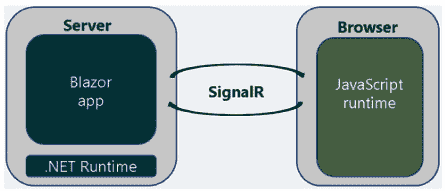
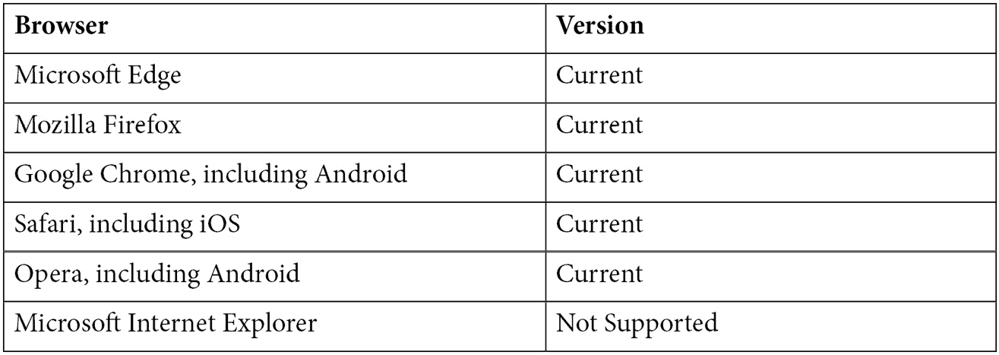
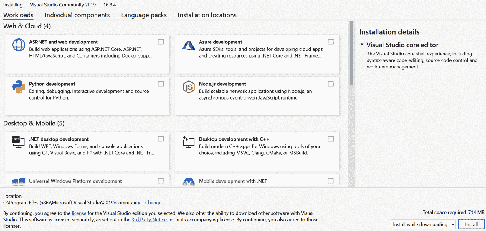
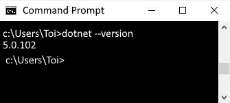
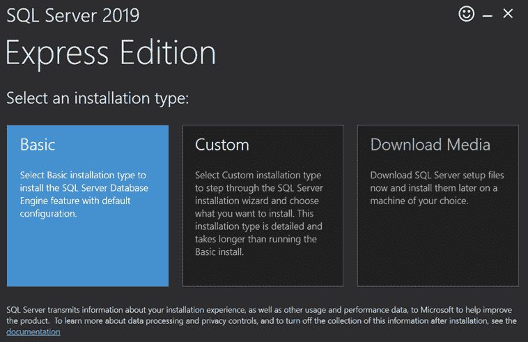

# *第一章*:介绍布拉佐网络组装

**Blazor WebAssembly** 是微软全新的**单页应用(SPA)** 框架，用于在**上构建 web 应用。NET 框架**。它使开发人员能够在客户端运行 C#代码。因此，我们现在可以在浏览器上使用 C#而不是被迫在浏览器上使用 **JavaScript** 。

在本章中，我们将为您准备使用 Blazor WebAssembly 开发 web 应用程序。我们将讨论两种不同的 Blazor 托管模型，并展示使用 Blazor WebAssembly 相对于 **Blazor Server** 的优势。最后，我们将指导您完成设置计算机的过程，以完成本书中的项目。

在本章中，我们将涵盖以下主题:

*   使用 Blazor 框架的好处
*   两种托管模式的区别
*   什么是 **WebAssembly** ？
*   设置您的电脑

# 使用 Blazor 框架的好处

使用 Blazor 框架有几个好处。首先，它是一个建立在微软强大基础上的自由开源框架。NET 框架。此外，它是一个 SPA 框架，使用 Razor 语法，可以使用微软的特殊工具进行开发。

## 。NET 框架

布拉佐建立在**之上。** NET 框架。因为**布拉佐**是建立在。NET 框架，任何熟悉的人。NET 框架可以使用 Blazor 框架快速变得高效。Blazor 框架利用了强大的生态系统。NET 库和 NuGet 包。NET 框架。此外，由于客户机和服务器代码都是用 C#编写的，它们可以共享代码和库，例如用于数据验证的应用程序逻辑。

Blazor 是开源的。由于 Blazor 是 ASP.NET 框架的一个特性，所以 Blazor 的所有源代码都可以在 GitHub 上作为 T2 拥有的存储库的一部分获得。网络基金会。。NET Foundation 是一个独立的非营利组织，旨在支持全球创新的、商业友好的开源生态系统。NET 平台。那个。NET 平台有一个强大的社区，有来自 3700 多家公司的 10 多万份投稿。

布拉佐是自由的。从。NET Framework 是免费的，这意味着 Blazor 也是免费的。使用 Blazor 没有任何费用或许可成本，包括商业用途。

## SPA 框架

**Blazor** 框架是一个 SPA 框架。顾名思义，SPA 是一个由单个页面组成的网络应用。应用程序动态重写单个页面，而不是加载一个全新的页面来响应每次用户界面更新。目标是更快的过渡，让网络应用感觉更像一个原生应用。

渲染页面时，Blazor 会创建一个渲染树，它是页面上组件的图形。它类似于浏览器创建的**文档对象模型** ( **DOM** )。然而，它是一个虚拟的 DOM。对用户界面的更新应用于虚拟 DOM，只有 DOM 和虚拟 DOM 之间的差异由浏览器更新。

## Razor 语法

Blazor 框架的名字有一个有趣的起源故事。术语*布拉佐*是单词*浏览器*和单词*剃刀*的组合。 **Razor** 是用来用 C#创建动态网页的**ASP.NET**视图引擎。Razor 是一种将 HTML 标记与 C#代码相结合的语法，旨在提高开发人员的工作效率。它允许开发人员在同一个文件中同时使用 HTML 标记和 C#。

Blazor 网络应用是使用**剃刀组件**构建的。Razor 组件是可重用的 UI 元素，包含 C#代码、标记和其他 Razor 组件。剃刀组件是 Blazor 框架的基本构件。有关剃须刀组件的更多信息，请参考 [*第 2 章*](02.html#_idTextAnchor045)*构建您的第一个 Blazor 网络组装应用程序*。

重要说明

剃刀页面和 MVC 也使用剃刀语法。与呈现整个页面的 Razor Pages 和 MVC 不同，Razor Components 只呈现 DOM 更改。一种容易区分它们的方法是 Razor 组件使用`RAZOR`文件扩展名，而 Razor Pages 使用`CSHTML`文件扩展名。

## 牛逼的工装

可以使用**微软 Visual Studio** 或者**微软 Visual Studio 代码**来开发 Blazor WebAssembly 应用程序。微软 Visual Studio 是一个**集成开发环境** ( **IDE** )，而微软 Visual Code 是一个轻量级但功能强大的编辑器。它们都是构建企业应用程序的不可思议的工具。此外，它们都是免费的，并且有在视窗、Linux 和苹果电脑上运行的版本。

使用 Blazor 框架开发网络应用有很多好处。既然是建立在成熟的基础上。NET 框架，它使开发人员能够使用他们已经掌握的技能，如 C#和工具，如 Visual Studio。此外，由于它是一个 SPA 框架，Blazor 网络应用感觉像本地应用。

# 托管模型

**Blazor** 有两种不同的托管模式。微软发布的第一个托管模型是 **Blazor Server** 模型。在这个托管模型中，web 应用程序在服务器上执行。微软发布的第二个托管模型，也是本书的主题，是 **Blazor WebAssembly** 模型。在这种托管模式下，web 应用程序在浏览器上执行。

每种托管模式都有自己的优缺点。然而，它们都使用相同的底层架构。因此，可以独立于宿主模型编写和测试代码。这两种托管模式的主要区别在于延迟、安全性、数据访问和离线支持。

## 布拉佐服务器

正如我们刚刚提到的，Blazor Server 托管模型是微软发布的第一个托管模型。它是作为。NET Core 3 于 2019 年 9 月发布。

下图说明了 Blazor 服务器托管模型:



图 1.1–Blazor 服务器

在这种托管模式下，web 应用程序在服务器上执行，只有对 UI 的更新才会发送到客户端的浏览器。浏览器被视为瘦客户端，所有处理都在服务器上进行。当使用 Blazor 服务器时，用户界面更新、事件处理和 JavaScript 调用都通过 ASP.NET 核心**信号器**连接来处理。

重要说明

**signal**是一个软件库，允许网络服务器向浏览器推送实时通知。Blazor 服务器使用它向浏览器发送用户界面更新。

### Blazor 服务器的优势

使用 **Blazor 服务器**与使用 **Blazor 网络组件**相比，有一些优势。然而，的关键优势是一切都发生在服务器上。由于 web 应用程序运行在服务器上，因此它可以访问服务器上的所有内容。因此，安全性和数据访问得到了简化。此外，由于一切都发生在服务器上，所以包含 web 应用程序代码的程序集(dll)仍保留在服务器上。

使用 Blazer Server 的另一个优点是，它可以在瘦客户端和不支持 WebAssembly 的旧浏览器(如 Internet Explorer)上运行。

最后，第一次使用使用 Blazor Server 的 web 应用程序的初始加载时间可能比使用 Blazor WebAssembly 的 web 应用程序要短得多，因为要下载的文件很少。

### Blazor 服务器的缺点

与 Blazor WebAssembly 相比，Blazor 服务器托管模型有许多缺点，因为浏览器必须保持与服务器的持续连接。由于没有离线支持，每个用户交互都需要网络往返。所有这些往返的结果是，Blazor Server 网络应用程序比 Blazor WebAssembly 网络应用程序具有更高的延迟，并且会感觉迟钝。

小费

延迟是用户界面操作和用户界面更新之间的时间。

使用 Blazor Sever 的另一个缺点是每次用户界面更新都依赖 SignalR。微软对 SignalR 的支持一直在改善，但扩展起来可能很有挑战性。

最后，一个 Blazor Server 网络应用程序必须由一个**ASP.NET 核心**服务器提供。

## Blazor WebAssembly

**Blazor WebAssembly** 托管模型是微软最近发布的托管模型，也是本书的主题。 **Blazor WebAssembly 3.2.0** 于 2020 年 5 月发布。 **Blazor WebAssembly in。NET 5** 作为**的一部分发布了。NET 5.0** 发布于 2020 年 11 月，不是**长期支持** ( **LTS** )发布。这本书将在中使用 Blazor WebAssembly。NET 5 为所有的项目。

小费

LTS 版本在首次发布后至少 3 年内受微软支持。WebAssembly 中的 Blazor。NET 5 不是 LTS 版本。如果你用 Blazor WebAssembly 开始一个新项目，你应该使用最新的版本..

下图说明了 Blazor WebAssembly 宿主模型:


图 1.2–Blazor 网络组件

在这种托管模式下，web 应用程序在浏览器上执行。为了让网络应用程序和。NET 运行时要在浏览器上运行，浏览器必须支持 **WebAssembly** 。WebAssembly 是所有现代浏览器都支持的 web 标准，包括移动浏览器。虽然 Blazor WebAssembly 本身不需要服务器，但 web 应用程序可能需要一个服务器来进行数据访问和身份验证。

过去，在浏览器上运行 C#代码的唯一方法是使用插件，比如 **Silverlight** 。Silverlight 是微软提供的一个免费浏览器插件。它非常流行，直到苹果决定不允许在 iOS 上使用浏览器插件。由于苹果的决定，Silverlight 被微软放弃了。Blazor 不依赖插件或者将代码重新编译成其他语言。取而代之的是，它基于开放的网络标准，并得到所有现代浏览器的支持，包括移动浏览器。

### Blazor 网络组装的优势

Blazor WebAssembly 有很多优点。首先，由于它运行在浏览器上，所以它依赖于客户端资源而不是服务器资源。因此，与 Blazor 服务器不同，由于每个用户界面交互都需要往返于服务器之间，因此没有延迟。

Blazor WebAssembly 可用于创建**进步 Web App** ( **PWA** )。PWA 是一个网络应用程序，看起来和感觉都像一个原生应用程序。它们提供离线功能、后台活动、本机 API 层和推送通知。它们甚至可以在各种应用商店中列出。通过将您的 Blazor WebAssembly 应用程序配置为 PWA，您的应用程序可以在任何地点、任何设备上通过单一代码库访问任何人。有关创建 PWA 的更多信息，请参考第 5 章[](05.html#_idTextAnchor129)**将天气应用构建为渐进式网络应用(PWA)* 。*

 *最后，一个 **Blazor WebAssembly** web app 不依赖于一个**ASP.NET 核心**服务器。事实上，在没有服务器的情况下部署一个**Blazor web assemblyly**web 应用是可能的。

### Blazor WebAssembly 的缺点

平心而论，使用 Blazor WebAssembly 有一些缺点需要考虑。首先，当使用 Blazor WebAssembly 时。NET 运行时，`dotnet.wasm`文件和您的程序集都需要下载到浏览器中，您的 web 应用程序才能工作。因此，Blazor WebAssembly 应用程序的初始加载时间通常比 Blazor Server 应用程序长。但是，有一些策略可以加快应用程序的加载时间，例如将某些程序集的加载推迟到需要的时候。

调试 Blazor 服务器应用程序时，可以使用标准。NET 调试器。但是，要调试 Blazor WebAssembly 应用程序，您需要使用浏览器的调试器。要启用浏览器的调试器，您需要在启用远程调试的情况下启动浏览器，然后使用 *Alt+Shift+D* 启动位于浏览器和编辑器之间的代理组件。不幸的是，由于在浏览器上调试的复杂性，有一些特定的场景，例如在调试代理运行之前遇到断点，以及在未处理的异常上中断，这些都是调试器当前无法处理的。微软正在积极改善调试体验。

Blazor WebAssembly web 应用程序的另一个缺点是，它们的功能只和它们运行的浏览器一样强大。因此，不支持瘦客户端。Blazor WebAssembly 只能在支持 WebAssembly 的浏览器上运行。幸运的是，由于**万维网联盟** ( **W3C** )和来自苹果、谷歌、微软和 Mozilla 的工程师之间的大量协调，所有现代浏览器都支持网络组装。

Blazor 框架提供了两种不同的托管模型，Blazor 服务器和 Blazor WebAssembly。一个 Blazor Server 网络应用运行在服务器上，并使用**信号**向浏览器提供 HTML。相反，Blazor WebAssembly web 应用程序直接在浏览器中运行。它们各有利弊。然而，如果你想创建一个可以离线工作的响应性的、类似于原生的网络应用程序，你需要使用 Blazor WebAssembly。

# 什么是 WebAssembly？

WebAssembly 是一种二进制指令格式，允许用 C#编写的代码以接近本机的速度在浏览器上运行。跑步。NET 二进制文件，它使用。NET 运行时，该运行时已编译为网络程序集。您可以将其视为在浏览器中执行本机编译的代码。

WebAssembly 是由 W3C 社区小组开发的开放标准。它最初是在 2015 年宣布的，第一个支持它的浏览器是在 2017 年发布的。

## 网络组装目标

最初开发网络组装时，项目有四个主要设计目标:

*   快速高效
*   安全的
*   打开
*   不要破坏网络

WebAssembly 快速高效。它旨在允许开发人员用任何语言编写代码，然后可以编译这些代码在浏览器中运行。由于代码是编译的，因此速度很快，并且以接近本机的速度运行。

WebAssembly 是安全的。它不允许与浏览器的 DOM 直接交互。相反，它在自己的内存安全的沙盒执行环境中运行。您必须使用 JavaScript 互操作来与 DOM 交互。 [*第四章*](04.html#_idTextAnchor107)*使用 JavaScript 互操作性(JS interop)* 构建本地存储服务的项目，将教你如何使用 JavaScript interop。

WebAssembly 已打开。虽然是低级汇编语言，但是可以手工编辑调试。

网络组装没有破坏网络。这是一个网络标准，旨在与其他网络技术协同工作。此外，网络组装模块可以访问相同的网络应用编程接口，这些接口可以从 JavaScript 中访问。

## 网络组装支持

如前所述，WebAssembly 运行在所有现代浏览器上，包括移动浏览器。从下表中可以看出，所有当前最流行的浏览器版本都与网络组件兼容:



图 1.3–网络组装浏览器兼容性

重要说明

Microsoft Internet Explorer 当前不支持网络程序集，并且永远不会支持网络程序集。所以，如果你的网络应用程序必须能够在微软浏览器上运行，不要使用 Blazor 网络组装。

WebAssembly 是一个 web 标准，允许开发人员在浏览器中运行任何语言编写的代码。所有现代浏览器都支持它。

# 设置您的电脑

对于本书中的项目，我们使用 Visual Studio 2019，。NET 5.0 和 SQL Server 2019。

所有项目都是使用 **Visual Studio 2019 社区版**16 . 9 . 5 版构建的，具有 ASP.NET 和 Web 开发工作负载。如果您需要安装 Visual Studio 2019，请遵循本章后面的*安装 Visual Studio 社区版*一节中的说明。

小费

虽然我们使用的是 Visual Studio 2019 社区版，但是任何版本的 Visual Studio 2019 都可以用来完成本书中的项目。**微软 Visual Studio 代码**也可以使用。

WebAssembly 中的 Blazor。NET 5 需要。NET 5.0。检查的版本。NET，打开命令提示符并输入以下命令:

```cs
dotnet –-version
```

如果您的计算机没有运行。NET 5.0，按照*中的说明进行安装。NET 5.0* 一节将在本章后面介绍。

本书最后两个项目使用 **SQL Server 2019 快速版**作为后端数据库。如果您需要安装 SQL Server 2019 快速版，请按照本章后面的*安装 SQL Server 快速版*一节中的说明进行操作。

小费

虽然我们使用的是 SQL Server 2019 速成版，但是任何一年或版本的 SQL Server 都可以用来完成本书的项目。

## 安装 Visual Studio 社区版

Visual Studio 社区版是 Visual Studio 的免费版。要安装 Visual Studio 社区版，请执行以下步骤:

1.  从[https://visualstudio.microsoft.com](https://visualstudio.microsoft.com)下载 **Visual Studio 安装程序**。
2.  下载完成后运行安装程序完成安装。安装过程的第一步是让 **Visual Studio 安装程序**检查系统中现有的 Visual Studio 版本。
3.  Once the installer has finished checking for installed versions, it will open the following installation dialog:

    

    图 1.4–Visual Studio 安装程序

4.  选择**ASP.NET 和 web 开发**工作量，点击**安装**按钮，完成安装。

## 安装。NET 5.0

安装**。NET 5.0** ，执行以下步骤:

1.  从[https://dotnet.microsoft.com/download/dotnet/5.0](https://dotnet.microsoft.com/download/dotnet/5.0)下载安装程序。
2.  下载完成后，运行安装程序以完成的安装。NET 5.0。
3.  打开命令提示符，输入以下命令以验证您的计算机是否正在运行。NET 5.0:

```cs
dotnet –-version
```

下面的截图来自一台正在运行的计算机。NET 5.0:



图 1.5–。NET 版本

## 安装 SQL Server Express

**SQL Server Express** 是 SQL Server 的免费版。要安装 **SQL Server Express** ，请执行以下操作:

1.  从[https://www . Microsoft . com/en-us/SQL-Server/SQL-Server-downloads](https://www.microsoft.com/en-us/sql-server/sql-server-downloads)下载SQL Server 安装程序。
2.  下载完成后，运行 SQL Server 安装程序。
3.  Select the **Basic** installation type:

    

    图 1.6–SQL Server 安装程序

4.  点击**接受**按钮接受微软 SQL Server 许可条款。
5.  点击**安装**按钮完成安装。

以下屏幕截图显示了成功安装 SQL Server Express 后出现的对话框:


图 1.7–SQL Server 快速版

要完成本书中的所有项目，您将需要一个代码编辑器，例如 Visual Studio 2019，。Net 5.0 或 SQL Server。在本章中，我们向您展示了如何安装 Visual Studio 2019 社区版。NET 5.0 和 SQL Server 2019 快速版。

# 总结

完成本章后，您应该了解使用 Blazor WebAssembly 相对于其他 web 开发框架的优势，并准备好完成本书中的项目。

在本章中，我们介绍了 **Blazor** 框架。Blazor 框架是建立在。NET 框架，并允许开发人员在 web 应用程序的前端和后端都使用 C#。

之后，我们比较了 Blazor 服务器和 Blazor WebAssembly。Blazor WebAssembly 比 Blazor Server 有很多优势，因为它运行在浏览器上，而 Blazor Server 运行在服务器上。Blazor WebAssembly web 应用程序可以脱机运行，感觉更像一个本地应用程序，因为所有代码都直接在浏览器上运行。最后，一个 Blazor WebAssembly 应用可以很容易地转换成一个 PWA。

在本章的最后一部分，我们解释了如何使用 Visual Studio 2019 社区版设置您的计算机。NET 5.0 和 SQL Server 2019 Express，所有这些都是完成本书中的项目所必需的。

现在，您的计算机已经设置好创建一个 Blazor WebAssembly web 应用程序，是时候开始了。在下一章中，您将创建第一个 Blazor WebAssembly web 应用程序。

# 问题

以下问题供您考虑:

1.  使用 Blazor WebAssembly 是否意味着您再也不需要编写 JavaScript 了？
2.  Blazor WebAssembly 是否要求在浏览器上安装任何插件？
3.  开始使用 Blazor WebAssembly 开发需要花费多少钱？

# 进一步阅读

以下资源提供了有关本章主题的更多信息:

*   关于 **Blazor** 的更多信息，请参考[https://blazor.net](https://blazor.net)。
*   欲了解更多关于**的信息。网络基础**，参考[https://dotnetfoundation.org](https://dotnetfoundation.org)。
*   有关 **GitHub** 上**ASP.NET**存储库的更多信息，请参考[https://github.com/dotnet/aspnetcore](https://github.com/dotnet/aspnetcore)。
*   更多关于**信号器**的信息，请参考[https://docs . Microsoft . com/en-us/aspnet/core/signor/introduction](https://docs.microsoft.com/en-us/aspnet/core/signalr/introduction)。
*   关于 **PWAs** 的更多信息，请参考[https://developer . Mozilla . org/en-US/docs/Web/Progressive _ Web _ apps](https://developer.mozilla.org/en-US/docs/Web/Progressive_web_apps)。
*   关于**网络组装**的一般信息，请参考[https://webassembly.org](https://webassembly.org)。
*   关于 **W3C 网络组件核心规范**的更多信息，请参考[https://www.w3.org/TR/wasm-core](https://www.w3.org/TR/wasm-core)。
*   有关浏览器与**网络组件**兼容性的更多信息，请参考[https://caniuse.com/?search=wasm.](https://caniuse.com/?search=wasm.)*