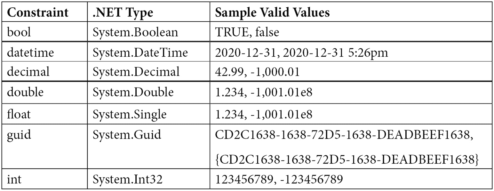
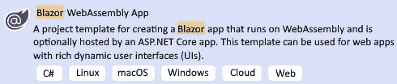
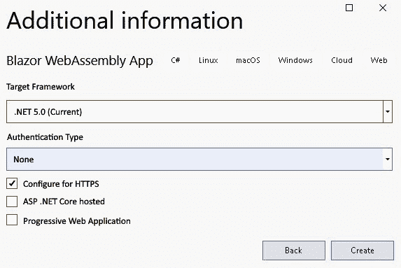
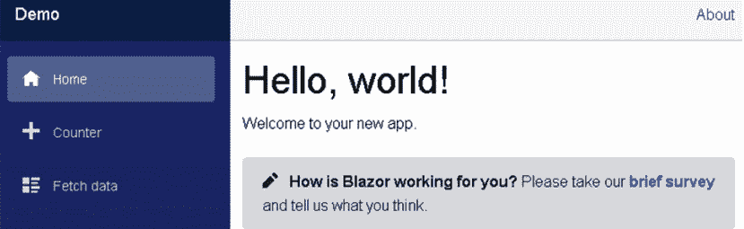
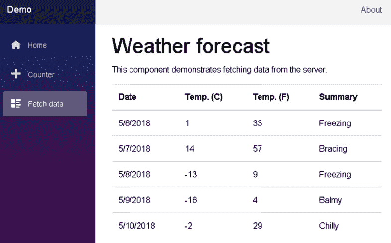
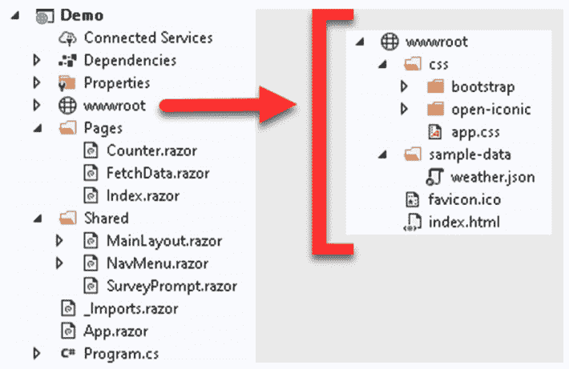
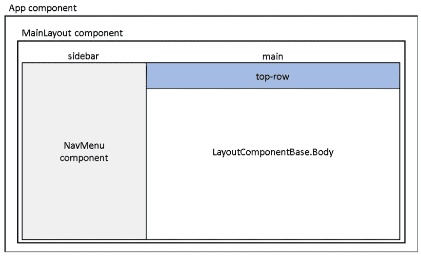
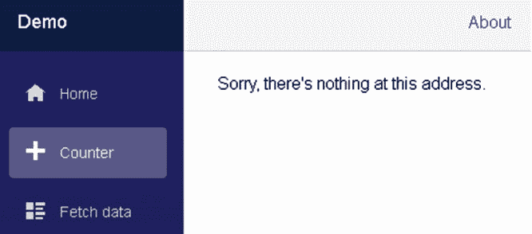
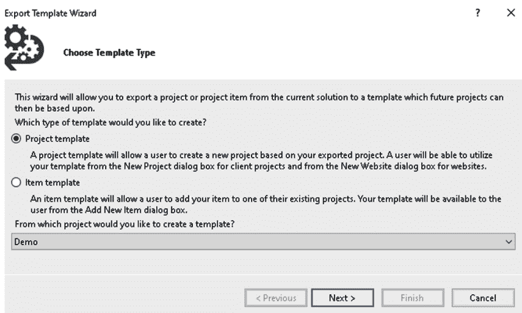
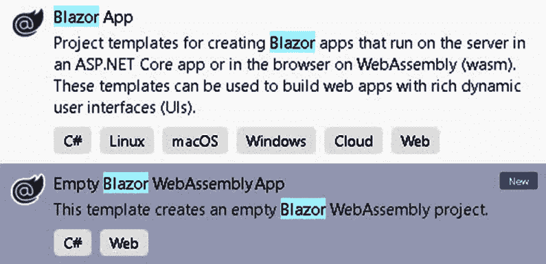

# 二、构建你的第一个 Blazor WebAssembly 应用

Razor 组件是 Blazor WebAssembly 应用的构建块。Razor 组件是可以共享、嵌套和重用的用户界面块。Razor 组件是普通的 C#类，可以放在项目中的任何地方。

在本章中，我们将了解 Razor 组件。我们将学习如何使用它们，如何应用参数，以及它们的生命周期和结构。我们将学习如何使用`@page`指令来定义路由。我们还将学习如何使用 Razor 语法将 C#代码与 HTML 标记相结合。

本章中的 Blazor WebAssembly 项目将使用微软提供的 **Blazor WebAssembly App** 项目模板创建。创建项目后，我们将对其进行检查，以进一步熟悉 Razor 组件。我们将学习如何使用组件，如何添加参数，如何应用路由，如何使用 Razor 语法，以及如何将 Razor 标记和代码分离到单独的文件中。最后，我们将配置自己的自定义项目模板，创建一个空的 Blazor WebAssembly 项目。

在本章中，我们将涵盖以下主题:

*   剃刀组件
*   选择途径
*   剃刀语法
*   使用 Blazor 应用项目模板
*   创建一个空的 Blazor WebAssembly 项目模板

# 技术要求

要完成此项目，您需要在电脑上安装 Visual Studio 2019。关于如何安装 Visual Studio 2019 免费社区版的说明，请参考 [*第 1 章*](01.html#_idTextAnchor018)*Blazor web assembly 简介*。

本章的源代码可在以下 GitHub 存储库中获得:[https://GitHub . com/PacktPublishing/Blazor-web assembly by Example/tree/main/chapter 02](https://github.com/PacktPublishing/Blazor-WebAssembly-by-Example/tree/main/Chapter02)。

行动中的代码视频可在此获得:[https://bit.ly/3bEZrrg](https://bit.ly/3bEZrrg)。

# 剃须刀组件

Blazor WebAssembly 是一个组件驱动的框架。Razor 组件是 Blazor WebAssembly 应用的基本构件。它们是使用 C#、HTML 和 Razor 标记的组合实现的类。当 web 应用加载时，类会像往常一样下载到浏览器中。. NET 程序集(dll)。

重要说明

在本书中，术语*剃刀组件*和*组件*可互换使用。

## 使用组件

HTML 元素语法用于将一个组件添加到另一个组件。标记看起来像一个 HTML 标记，其中标记的名称是组件类型。

我们将在本章中创建的`Demo`项目的`Pages\Index.razor`文件中的以下标记将呈现一个`SurveyPrompt`实例:

```cs
<SurveyPrompt Title="How is Blazor working for you?" />
```

前面的`SurveyPrompt`元素包含一个名为`Title`的属性参数。

## 参数

组件参数用于使组件动态化。参数是用`Parameter`属性或`CascadingParameter`属性修饰的组件的公共属性。参数可以是简单类型、复杂类型、函数、`RenderFragments`或事件回调。

以下名为`HelloWorld`的组件代码包含名为`Text`的参数:

地狱世界剃刀

```cs
<h1>Hello @Text!</h1>
@code {
    [Parameter] public string Text { get; set; }
}
```

要使用`HelloWorld`组件，请在另一个组件中包含以下 HTML 语法:

```cs
<HelloWorld Text="World" />
```

在上例中，`HelloWorld`组件的`Text`属性是`Text`参数的来源。此屏幕截图显示了使用组件的结果，如下所示:


图 2.1–hello world 组件

组件还可以从其路由或查询字符串中接收参数。在本章的后面，您将了解更多关于不同类型参数的信息。

## 命名组件

剃刀组件的名称必须在标题大小写中。因此，`helloWorld`不是 Razor 组件的有效名称，因为 *h* 没有大写。另外，Razor 组件使用的是`RAZOR`扩展，而不是 Razor Pages 使用的`CSHTML`扩展。

重要说明

剃须刀组件必须以大写字母开头。

## 组件生命周期

剃刀组件继承自`ComponentBase`类。`ComponentBase`类包括用于管理组件生命周期的异步和同步方法。在本书中，我们将使用方法的异步版本，因为它们在执行时不会阻塞其他操作。这是组件生命周期中方法的调用顺序:

1.  `SetParameterAsync`:该方法在渲染树中设置由组件的父组件提供的参数。
2.  `OnInitializedAsync`:首次渲染组件后调用此方法。
3.  `OnParametersSetAsync`:该方法在组件每次重新渲染初始化*和*后调用。
4.  `OnAfterRenderAsync`:组件渲染完毕后调用此方法。这个方法是针对使用 JavaScript 的的，因为 JavaScript 需要**文档对象模型** ( **DOM** )元素在它们可以做任何工作之前被渲染。

## 构件结构

下面的图显示了我们将在本章中创建的`Demo`项目的`Counter`组件的代码:


图 2.2–组件结构

前面示例中的代码分为三个部分:

*   **指令**
*   **标记**
*   **代码块**

每个部分都有不同的目的。

### 指令

指令用于添加特殊功能，如路由、布局和依赖注入。它们是在 Razor 中定义的，您不能定义自己的指令。

在前面的例子中，只使用了一个指令-`@page`指令。`@page`指令用于路由。在本例中，以下网址将用户路由到`Counter`组件:

`/counter`

一个典型的页面可以在页面顶部包含许多指令。而且，很多页面都有不止一个`@page`指令。

Razor 中的大部分指令都可以在 Blazor WebAssembly 应用中使用。以下是 Blazor 中使用的 Razor 指令，按字母顺序排列:

*   `@attribute`: This directive adds a class-level attribute to the component. The following example adds the `[Authorize]` attribute:

    `@attribute [Authorize]`

*   `@code`:该指令向组件中添加类成员。在示例中，它用于区分代码块。
*   `@implements`:这个指令实现了指定的类。
*   `@inherits`:这个指令提供了对视图继承的类的完全控制。
*   `@inject`: This directive is used for dependency injection. It enables the component to inject a service from the dependency injection container into the view. The following example injects `HttpClient` defined in the `Program.cs` file into the component:

    `@inject HttpClient Http`

*   `@layout`:该指令用于指定 Razor 组件的布局。
*   `@namespace`:这个指令设置组件的命名空间。如果不想使用组件的默认命名空间，只需使用该指令。默认命名空间基于组件的位置。
*   `@page`:本指令用于路由。
*   `@typeparam`:该指令为组件设置类型参数。
*   `@using`:本指令控制范围内的部件。

### 利润

这是带有 Razor 语法的 HTML。Razor 语法可用于呈现文本，并允许 C#用作标记的一部分。我们将在本章的后面介绍更多关于 Razor 语法的内容。

### 码组

代码块包含页面的逻辑。它始于`@code`指令。按照惯例，`@code`指令位于页面底部。它是唯一没有放在页面顶部的文件级指令。

代码块是我们向组件添加 C#字段、属性和方法的地方。在本章的后面，我们将把代码块移到一个单独的代码隐藏文件中。

Razor 组件是 Blazor WebAssembly 应用的构建块。它们很容易使用，因为它们只是 HTML 标记和 C#代码的组合。在下一节中，我们将看到如何使用路由在每个组件之间导航。

# Blazor 网络组件中的路由

在 Blazor WebAssembly 中，路由是在客户端处理的，而不是在服务器端。当您在浏览器中导航时，Blazor 拦截该导航，并使用匹配的路线渲染组件。

相对于`wwwroot/index.html`文件中指定的基本路径来解析 URL。使用以下语法在`head`元素中指定:

```cs
 <base href="/" />
```

与您可能使用过的其他框架不同，路径不是从其文件的位置推断出来的。例如，在`Demo`项目中，`Counter`组件位于`/Pages/Counter`文件夹中，但它使用以下路径:

```cs
@page "/counter"
```

## 路线参数

`Router`组件使用路线参数来填充相应组件的参数。组件和路由的参数必须具有相同的名称，但不区分大小写。

由于不支持可选路线参数，您可能需要向组件提供多个`@page`指令来模拟可选参数。以下示例显示了如何包含多个`@page`参数:

路线举例:剃刀

```cs
@page "/routing"
@page "/routing/{text}"
<h1>Blazor WebAssembly is @Text!</h1>
@code {
    [Parameter] public string Text { get; set; }
    protected override void OnInitialized()
    {
        Text = Text ?? "fantastic";
    }
}
```

在前面的代码中，第一个`@page`指令允许导航到没有参数的组件，第二个`@page`指令允许路线参数。如果提供了`text`的值，它将被分配给组件的`Text`属性。如果组件的`Text`属性为`null`，则设置为`fantastic`。

以下网址将用户路由到`RoutingExample`组件:

`/routing`

以下网址也将用户路由到`RoutingExample`组件，但这次`Text`参数将由路由设置:

`/routing/amazing`

此屏幕截图显示了使用指定路线的结果:


图 2.3–布线示例组件

重要说明

路由参数不区分大小写。

## 捕捉所有路线参数

捕捉所有路径参数用于捕捉跨越多个文件夹边界的路径。这种类型的路由参数是`string`类型，只能放在 URL 的末尾。

这是一个使用全面路线参数的示例组件:

剃刀

```cs
@page "/{*path}"
<h1>Catch All</h1>
Route: @Path
@code {
    [Parameter] public string Path { get; set; }
}
```

对于`/error/type/3` URL，前面的代码将`Path`参数的值设置为`error/type/3`:


图 2.4–全面路线参数示例

## 路线限制

路线约束用于实施路线参数的数据类型。若要定义约束，请在参数中添加一个冒号，后跟约束类型。在下面的示例中，路线需要名为`Increment`的路线参数，其类型为`int`:

```cs
@page "/counter/{increment:int}"
```

支持以下路线约束:



图 2.5–支持的路线限制

以下类型是当前不支持的约束:

*   正则表达式
*   枚举数
*   自定义约束

路由在客户端处理。我们可以使用路由参数和总括路由参数来启用路由。路由约束用于确保路由参数属于所需的数据类型。Razor 组件使用 Razor 语法将 HTML 与 C#代码无缝合并，这是我们将在下一节中看到的内容。

# Razor 语法

Razor 语法由 HTML、Razor 标记和 C#组成。从 Razor 组件呈现 HTML 与从 HTML 文件呈现 HTML 是一样的。Razor 组件中的 HTML 由服务器不变地呈现。Razor 语法同时使用内联表达式和控制结构。

## 内联表达式

内联表达式以`@`符号开始，后跟变量或函数名。这是一个内联表达式的示例:

```cs
<h1>Blazor is @Text!</h1>
```

## 控制结构

控制结构也以`@`符号开始。大括号内的内容将被评估并呈现到输出中。这是来自`Demo`项目中`FetchData`组件的`if`声明的示例:

```cs
@if (forecasts == null)
{
    <p><em>Loading...</em></p>
}
```

Razor 代码块中的每个代码语句都必须以分号结束。C#代码区分大小写，字符串必须用引号括起来。

### 条件式

以下类型的条件句包含在 Razor 语法中:

*   `if`陈述
*   `switch`陈述

这是一个`if`语句的例子:

```cs
@if (DateTime.Now.DayOfWeek.ToString() != "Friday")
{
    <p>Today is not Friday.</p>
}
else if (DateTime.Now.Day != 13)
{
    <p>Today is not the 13th.</p>
}
else
{
    <p>Today is Friday the 13th.</p>
}
```

上面的代码使用 if 语句来检查一周的当前日期是星期五和/或一个月的当前日期是 13 号。

这是`switch`语句的一个例子:

```cs
@switch (value)
{
    case 1:
        <p>The value is 1!</p>
        break;
    case 42:
        <p>Your number is 42!</p>
        break;
    default:
        <p>Your number was not 1 or 42.</p>
        break;
}
@code {
    private int value = 2;
}
```

前面的`switch`语句将`value`变量与`1`和`42`进行了比较。

### 环

以下类型的循环包含在 Razor 语法中:

*   `for`循环
*   `foreach`循环
*   `while`循环
*   `do while`循环

以下每个示例都使用了一个`WeatherForecast`类型的数组。`WeatherForecast`包括一个`Summary`物业，在`Demo`项目中定义。

这是一个`for`循环的例子:

```cs
@for (var i = 0; i < forecasts.Count(); i++)
{
   <div> forecasts[i].Summary</div>
};
@code {
    private WeatherForecast[] forecasts;
}
```

这是一个`foreach`循环的例子:

```cs
@foreach (var forecast in forecasts)
{
    <div>@forecast.Summary</div>
};
@code {
    private WeatherForecast[] forecasts;
}
```

这是一个`while`循环的例子:

```cs
@while (i < forecasts.Count())
{
    <div>@forecasts[i].Summary</div>
    i++;
};
@code {
    private WeatherForecast[] forecasts;
    private int i = 0;
}
```

这是一个循环的例子:

```cs
@do
{
    <div>@forecasts[i].Summary</div>
    i++;
} while (i < forecasts.Count());
@code {
    private WeatherForecast[] forecasts;
    private int i = 0;
}
```

如果你已经知道 C#的话，Razor 语法很容易学习。它包括内联表达式和控制结构，如条件和循环。

# 项目概述

我们将在本章中构建的 Blazor WebAssembly 应用是一个简单的三页应用。每一页都将用于演示 Razor 组件的一个或多个功能。

这是已完成的`Demo`项目截图:


图 2.6–演示项目的主页

等完成`Demo`项目后，我们将把它转换成一个空的 Blazor WebAssembly 项目。空的 Blazor WebAssembly 项目将用作自定义 Blazor WebAssembly 应用项目模板的基础。

# 创建演示 Blazor WebAssembly项目

我们正在创建的`Demo`项目是基于 **Blazor WebAssembly App** 项目模板提供的众多示例项目之一。在我们使用模板创建项目之后，我们将检查示例项目中的文件，并更新一些文件来演示如何使用 Razor 组件。最后，我们将其中一个组件的代码块分离到一个单独的文件中，以演示如何使用代码隐藏技术将标记与代码分离。

## 创建演示项目

Visual Studio 附带了相当多的项目模板。我们将使用 **Blazor WebAssembly应用**项目模板来创建我们的第一个 Blazor WebAssembly项目。由于此项目模板可用于创建许多不同类型的 Blazor 项目，因此仔细遵循说明非常重要:

1.  打开 **Visual Studio 2019** 。
2.  点击**新建项目**按钮。
3.  In the **Search for templates (***Alt***+***S***)** textbox, enter `Blazor` and hit the *Enter* key.

    下面的截图显示了我们将要使用的 **Blazor WebAssembly App** 项目模板:

    

    图 2.7–**Blazor web assembly App**项目模板

4.  选择 **Blazor WebAssembly App** 项目模板，点击**下一步**按钮。
5.  Enter `Demo` in the **Project name** textbox and click the **Next** button.

    这是用于配置我们新项目的对话框截图:

    

    图 2.8–配置您的新项目 ct 对话框

    小费

    在前面的例子中，我们将`Demo`项目放入`E:\Blazor`文件夹中。然而，这个项目的位置并不重要。

6.  Select **.NET 5.0** as the version of the .NET Framework to use.

    这是用于创建我们新的 Blazor WebAssembly 应用的对话框截图:

    

    图 2.9–Blazor WebAssembly应用对话框的附加信息

7.  点击**创建**按钮。

您已经创建了`Demo` Blazor WebAssembly 项目。

## 运行演示项目

一旦创建了项目，您需要运行它来了解它的功能。`Demo`项目包含三页:**首页****计数器****取数据**:

1.  From the **Debug** menu, select the **Start Without Debugging (***Ctrl***+***F5***)** option to run the `Demo` project.

    这是来自`Demo`项目的**主页**页面截图:

    

    图 2.10–主页

    **主页**页面分为两部分。导航菜单位于页面左侧，正文位于页面右侧。**主页**的正文由一些静态文本和一个调查链接组成。

2.  Click the **Counter** option on the navigation menu to navigate to the **Counter** page.

    这是`Demo`项目中**计数器**页面的截图:

    

    图 2.11–计数器页面

    **计数器**页面的主体包括一个计数器和一个**点击我**按钮。每次点击**计数器**页面上的按钮，计数器都会递增，而不会刷新页面。

    重要说明

    由于这是一个**单页应用** ( **SPA** )，所以只更新页面中需要更新的部分。

3.  Click the **Fetch data** option on the navigation menu to navigate to the **Fetch data** page.

    这是从`Demo`项目获取数据页面的截图:



图 2.12–提取数据页面

**获取数据**页面的正文包括一个显示 2018 年几天天气预报的表格。如您所见，表格中显示的数据是来自`wwwroot\sample-data\weather.json`文件的静态数据。

## 检查演示项目的结构

现在让我们返回 Visual Studio 到检查`Demo`项目中的文件。

下图显示了项目的结构:



图 2.13–项目结构

该项目包括相当多的文件，其中一些文件被分成自己的文件夹。让我们检查一下。

### wwwroot 文件夹

`wwwroot`文件夹是应用的网络根目录。只有该文件夹中的文件可以通过网络访问。`wwwroot`文件夹包含**层叠样式表** ( **CSS** )文件的集合、示例数据文件、图标文件和`index.html`。在本书的后面，除了这些类型的文件，我们还将把这个文件夹用于公共静态资源，如图像和 JavaScript 文件。

`index.html`文件是 web 应用的根页面。每当最初请求一个页面时，`index.html`页面的内容被呈现并在响应中返回。`index.html`文件的`head`元素包括到`css`文件夹中每个 CSS 文件的链接，并指定用于 web 应用的基本路径。`index.html`文件的`body`元素包括两个`div`元素和对`Blazor.webassembly.js`文件的引用。

这是`index.html`文件的`body`元素中的代码:

```cs
<body>
    <div id="app">Loading...</div>
    <div id="Blazor-error-ui">
        An unhandled error has occurred.
        <a href="" class="reload">Reload</a>
        <a class="dismiss">x</a>
    </div>
    <script 
      src="_framework/Blazor.webassembly.js"></script>
</body>
```

在前面的代码中高亮显示的`div`元素加载`App`组件。

`Blazor-error-ui` `div`元素用于显示未处理的异常。这个`div`元素的样式在`wwwroot\css\app.css`文件中。`Blazor.webassembly.js`文件是下载的脚本.NET 运行时、应用的程序集以及应用的依赖项。它还初始化运行时来运行 web 应用。

### 应用组件

`App`组件是在`App.razor`文件中定义的:

App .剃须刀

```cs
<Router AppAssembly="@typeof(Program).Assembly" 
        PreferExactMatches="@true">
    <Found Context="routeData">
        <RouteView RouteData="@routeData" 
                   DefaultLayout="@typeof(MainLayout)" />
    </Found>
    <NotFound>
        <LayoutView Layout="@typeof(MainLayout)">
            <p>Sorry, there's nothing at this address.</p>
        </LayoutView>
    </NotFound>
</Router>
```

`App`组件是Blazor web assembly 应用的根组件。它使用`Router`组件为网络应用设置路由。在前面的代码中，如果找到了路线，`RouteView`组件接收`RouteData`并使用指示的`DefaultLayout`渲染指定的组件。如果未找到路线，则使用`NotFound`模板，并使用指示的`Layout`渲染`LayoutView`。

如您所见，在`Demo`项目中，`Found`模板和`NotFound`模板使用相同的布局。他们都在使用`MainLayout`组件。但是，它们不需要使用相同的布局组件。

### 共享文件夹

`Demo`项目中的`Shared`文件夹包括共享用户界面 Razor 组件，包括`MainLayout`组件。这些组件中的每一个都可以被其他 Razor 组件使用一次或多次。

### 页面文件夹

`Pages`文件夹包括项目使用的可传递剃刀组件。可路由的组件有`Counter`、`FetchData`和`Index`。这些组件中的每一个都包含一个`@page`指令，用于将用户路由到页面。

### 导入文件

该文件包括 Razor 指令，例如名称空间的`@using`指令。您的项目可以包含多个`_Imports.razor`文件。每个文件都应用于其当前文件夹和子文件夹。`_Imports.razor`文件中的任何`@using`指令仅适用于 Razor ( `RAZOR`)文件。它们不适用于 C# ( `CS`)文件。当使用代码隐藏技术时，这种区别很重要。

### 程序文件

`Program.cs`文件是申请的入口点。

## 检查共享的剃须刀组件

共享剃刀组件在`Shared`文件夹中。`Demo`项目中有三个共享剃须刀组件:

*   `MainLayout`组件
*   `NavMenu`组件
*   `SurveyPrompt`组件

### 主布局组件

`MainLayout`组件用于定义网络应用的页面布局:

页面/主布局。剃刀

```cs
@inherits LayoutComponentBase
<div class="page">
    <div class="sidebar">
        <NavMenu />
    </div>
    <div class="main">
        <div class="top-row px-4">
            <a href="http://Blazor.net" 
               target="_blank" 
               class="ml-md-auto">About</a>
        </div>
        <div class="content px-4">
            @Body
        </div>
    </div>
</div>
```

`MainLayout`组件继承自`LayoutComponentBase`类。`LayoutComponentBase`代表一个布局，只有一个属性，就是`Body`属性。`Body`属性获取要在布局中呈现的内容。

下图说明了由`MainLayout`组件定义的页面布局:



图 2.14–屏幕布局

小费

**Blazor WebAssembly App** 项目模板使用 **Bootstrap 4** 来设计页面样式。如果您不熟悉 Bootstrap 4，您应该参考[https://getbootstrap.com](https://getbootstrap.com)来熟悉它的语法。

### 导航菜单组件

`NavMenu`组件为`Demo`项目定义导航菜单。它使用多个`NavLink`组件来定义各种菜单选项。这是`NavMenu`组件中引用用于项目导航的`NavLink`组件的部分:

```cs
<div class="@NavMenuCssClass" @onclick="ToggleNavMenu">
    <ul class="nav flex-column">
        <li class="nav-item px-3">
            <NavLink class="nav-link" href="" 
                     Match="NavLinkMatch.All">
                <span class="oi oi-home" 
                      aria-hidden="true"></span> Home
            </NavLink>
        </li>
        <li class="nav-item px-3">
            <NavLink class="nav-link" href="counter">
                <span class="oi oi-plus" 
                      aria-hidden="true"></span> Counter
            </NavLink>
        </li>
        <li class="nav-item px-3">
            <NavLink class="nav-link" href="fetchdata">
                <span class="oi oi-list-rich" 
                      aria-hidden="true"></span> Fetch data
            </NavLink>
        </li>
    </ul>
</div>
```

`NavLink`组件是在`Microsoft.AspNetCore.Components.Routing`命名空间中定义的。它的行为就像一个`a`元素，只是它增加了突出显示当前网址的功能。这是选择`Counter`组件时`NavLink`为`Counter`组件呈现的 HTML:

```cs
<a href="counter" class="nav-link active">
    <span class="oi oi-plus" aria-hidden="true"></span> 
    Counter
</a>
```

`nav-link`类使用的样式来自 Bootstrap。用于`active`类的样式是在`wwwroot\css\app.css`文件中定义的:

```cs
.sidebar .nav-item a.active {
    background-color: rgba(255,255,255,0.25);
    color: white;
}
```

### 调查提示组件

`SurveyPrompt`组件创建一个到 Blazor 上的简短调查的链接。

## 检查可布线剃刀组件

可传递剃刀组件在`Pages`文件夹中。在`Demo`项目中有三个可传递的剃刀组件:

*   `Index`组件
*   `Counter`组件
*   `FetchData`组件

### 索引组件

`Demo`项目的`Home`页面使用在`Pages\Index.razor`文件中定义的`Index`组件:

页面\索引.剃刀

```cs
@page "/"
<h1>Hello, world!</h1>
Welcome to your new app.
<SurveyPrompt Title="How is Blazor working for you?" />
```

前面的代码包括一个`@page`指令，该指令引用了 web 应用的根和一些标记。标记包括一个`SurveyPrompt`组件。

### 计数器组件

`Counter`组件比`Index`组件更复杂。类似于`Index`组件，它包含一个`@page`指令，用于路由和一些标记。但是，它还包含一个 C#代码块:

页面\计数器.剃刀

```cs
@page "/counter"
<h1>Counter</h1>
<p>Current count: @currentCount</p>
<button class="btn btn-primary" @onclick="IncrementCount">
    Click me
</button>
<a href="counter" class="nav-link active">
    <span class="oi oi-plus" aria-hidden="true"></span> 
    Counter
</a>
@code {
    private int currentCount = 0;
    private void IncrementCount()
    {
        currentCount++;
    }
}
```

在前面的代码块中，一个私有的`currentCount`变量用于保存点击次数。每次点击`Counter`按钮，就会调用`Counter`组件注册的`@onclick`处理程序。在这种情况下，就是`IncrementCount`法。

`IncrementCount`方法增加`currentCount`变量的值，`Counter`组件重新生成其渲染树。Blazor 将新的渲染树与前一个进行比较，并对浏览器的 DOM 进行修改。这将导致显示的计数被更新。

### FetchData 组件

`FetchData`组件是`Demo`项目中最复杂的组件。

这些是`Pages\FetchData.razor`文件中的指令:

```cs
@page "/fetchdata"
@inject HttpClient Http
```

`@page`指令用于路由，`@inject`指令用于依赖注入。在该组件中，在`Program.cs`文件中定义的`HttpClient`被注入到视图中。有关依赖注入的更多信息，请参考 [*第 6 章*](06.html#_idTextAnchor162) 、*使用应用状态构建购物车*。

下面的标记演示了一种非常重要的模式的使用，在开发 Blazor WebAssembly 应用时，您将经常使用这种模式。因为应用在浏览器上运行，所以所有数据访问都必须是异步的。这意味着当页面第一次加载时，数据将为空。因此，在尝试处理数据之前，您需要测试 null 情况。

这是`Pages\FetchData.razor`文件中的标记:

```cs
<h1>Weather forecast</h1>
<p>This component demonstrates fetching data from the server.</p>
@if (forecasts == null)
{
    <p><em>Loading...</em></p>
}
else
{
    <table class="table">
        <thead>
            <tr>
                <th>Date</th>
                <th>Temp. (C)</th>
                <th>Temp. (F)</th>
                <th>Summary</th>
            </tr>
        </thead>
        <tbody>
            @foreach (var forecast in forecasts)
            {
                <tr>
                   <td>@forecast.Date.ToShortDateString()
                      </td>
                   <td>@forecast.TemperatureC</td>
                   <td>@forecast.TemperatureF</td>
                   <td>@forecast.Summary</td>
                </tr>
            }
        </tbody>
    </table>
}
```

前面的标记包括一个`if`语句和一个`foreach`循环。当`forecasts`值为`null`时，显示**加载**信息。如果不处理`forecasts`值为`null`的情况，框架会抛出异常。一旦`forecasts`的值不再是`null`，数组中的所有项目都呈现在一个表中。

重要说明

`forecasts`的值将是第一次渲染页面时的`null`。

如前所述，Blazor 组件有一个定义明确的生命周期。渲染组件时调用`OnInitializedAsync`方法。`OnInitializedAsync`方法完成后，组件被重新渲染。

这是`Pages\FetchData.razor`文件中的代码块:

```cs
@code {
    private WeatherForecast[] forecasts;
    protected override async Task OnInitializedAsync()
    {
        forecasts = await 
            Http.GetFromJsonAsync<WeatherForecast[]>
            ("sample-data/weather.json");    
    }
    public class WeatherForecast
    {
        public DateTime Date { get; set; }
        public int TemperatureC { get; set; }
        public string Summary { get; set; }
        public int TemperatureF => 
            32 + (int)(TemperatureC / 0.5556);
    }
}
```

首先，前面的代码块声明了一个包含类型为`WeatherForecast`的数组的参数。接下来，它使用`OnInitializedAsync`异步方法填充数组。为了填充数组，使用了`HttpClient`服务的`GetFromJsonAsync`方法。有关`HttpClient`的更多信息，请参考 [*第 8 章*](08.html#_idTextAnchor204)*使用 ASP.NET 网络应用编程接口*构建任务管理器。

## 使用组件

剃刀组件通过包含在另一个组件的标记中来使用。我们将在`Home`页面添加一个`Counter`组件。我们按如下方式进行:

1.  返回到 Visual Studio。
2.  打开`Pages\Index.razor`文件。
3.  删除所有标记。确保您没有删除文件顶部的`@page`指令。
4.  在`@page`指令下添加以下标记:

    ```cs
    <Counter />
    ```

5.  从**构建**菜单中，选择**重建解决方案**选项。
6.  返回浏览器，导航至**主页**页面。如果`Demo`项目没有继续运行，从**调试**菜单中，选择**开始不调试(***Ctrl***+***F5***)**选项运行。
7.  Use *Ctrl* + *R* to refresh the browser.

    小费

    每当更新 C#代码时，都需要刷新浏览器，以便浏览器加载更新后的 DLL。

8.  点击**点击我**按钮测试`Counter`组件。

## 向组件添加参数

大多数组件需要参数。要向组件添加参数，请使用`Parameter`属性。我们将添加一个参数来指定`IncrementCount`方法使用的增量。我们按如下方式进行:

1.  返回到 Visual Studio。
2.  打开`Pages\Counter.razor`文件。
3.  在代码块顶部添加以下代码，定义新参数:

    ```cs
    [Parameter] public int? Increment { get; set; }
    private int increment = 1;
    ```

4.  将`IncrementCount`方法更新为如下:

    ```cs
    private void IncrementCount()
    {
        currentCount += increment;
    }
    ```

5.  添加以下`OnParametersSet`方法将`increment`的值设置为`Increment`参数的值:

    ```cs
    protected override void OnParametersSet()
    {
        if (Increment.HasValue)
            increment = Increment.Value;
    }
    ```

6.  将高亮显示的文本添加到**的标记中点击我**按钮，显示`increment`变量的当前值:

    ```cs
    <button class="btn btn-primary" 
            @onclick="IncrementCount">
        Click me (@increment)
    </button>
    ```

## 使用带有属性的参数

我们将向使用新参数的`Home`页面添加另一个`Counter`组件的实例。我们按如下方式进行:

1.  打开`Pages\Index.razor`文件。
2.  Add the following markup to the bottom of the `Index.razor` file:

    ```cs
    <Counter Increment="5"/>
    ```

    添加标记时，为新的`Increment`参数提供了**智能感知**:

    

    图 2.15–智能感知

3.  从**构建**菜单中，选择**构建解决方案**选项。
4.  返回浏览器。
5.  使用 *Ctrl* + *R* 刷新浏览器。
6.  Navigate to the **Home** page.

    **主页**页面现在包含两个`Counter`组件实例。如果点击第一个**点击我**按钮，第一个计数器将增加 1；如果点击第二个**点击我**按钮，第二个计数器将增加 5:

    

    图 2.16–主页

7.  单击每个**点击我**按钮以验证它们是否都按预期工作。

## 添加路线参数

组件可以有多个指令。我们将向使用参数的`Counter`组件添加一个`@page`指令。我们按如下方式进行:

1.  返回到 Visual Studio。
2.  打开`Pages/Counter.razor`文件。
3.  Add the following `@page` directive to the top of the file:

    ```cs
    @page "/counter/{increment:int}"
    ```

    `Counter`组件现在包括两个`@page`指令。

4.  从**构建**菜单中，选择**构建解决方案**选项。
5.  返回浏览器。
6.  导航至**计数器**页面。
7.  Update the URL to the following:

    ```cs
    /counter/4
    ```

    重要说明

    由于当您更改网址时，页面会自动重新加载，因此您不需要刷新浏览器来重新加载页面。

8.  Click the **Click me** button.

    计数器现在应该增加`4`。

9.  Update the URL to an invalid route:

    ```cs
    /counter/a
    ```

    由于这不是有效的路线，您将被引导至`App`组件中定义的`NotFound`内容:



图 2.17–找不到页面

小费

如果需要在代码中导航到某个 URL，应该使用`NavigationManager`。`NavigationManager`提供了一种`NavigateTo`方法，用于在不强制页面加载的情况下将用户导航到指定的 URI。

## 使用分部类从代码中分离标记

许多开发人员更喜欢将他们的标记与他们的 C#字段、属性和方法分开。因为 Razor 组件是常规的 C#类，所以它们支持分部类。`partial`关键字用于创建分部类。我们将使用分部类将代码块从`RAZOR`文件移动到`CS`文件。我们按如下方式进行:

1.  返回 **Visual Studio** 。
2.  右键单击**页面**文件夹，从菜单中选择**添加，类别**。
3.  命名新类`Counter.razor.cs`。
4.  使用`partial`关键字

    ```cs
    public partial class Counter{}
    ```

    将`Counter`类更新为分部类
5.  打开`Pages/Counter.razor`文件。
6.  将代码块中的所有代码复制到`Counter.razor.cs`文件中的部分`Counter`类。
7.  从`Counter.razor`文件中删除代码块。
8.  将以下`using`语句添加到`Counter.razor.cs`文件中:

    ```cs
    using Microsoft.AspNetCore.Components;
    ```

9.  从**构建**菜单中，选择**构建解决方案**选项。
10.  返回浏览器。
11.  使用 *Ctrl* + *R* 刷新浏览器。
12.  导航至**计数器**页面。
13.  点击**点击我**按钮，验证是否仍然有效。
14.  关闭浏览器。

使用部分类可以让您灵活地将代码块中的代码移动到单独的文件中，从而允许您使用代码隐藏技术。

我们使用微软提供的 **Blazor WebAssembly应用**项目模板创建了一个`Demo`项目。我们向`Counter`组件添加了一个参数，并将`Counter`组件的代码块中的代码移动到一个单独的文件中。

# 创建自定义 Blazor WebAssembly 项目模板

如您所见， **Blazor WebAssembly App** 项目模板创建的`Demo` Blazor WebAssembly 项目包含相当多的文件。在后面的章节中，我们将希望从一个空的 Blazor 项目开始。因此，我们将创建自己的项目模板，创建一个空的 Blazor WebAssembly 项目。

## 创建一个空的 Blazor 项目

我们需要创建一个空的 Blazor WebAssembly 项目来作为我们新项目模板的基础。我们按如下方式进行:

1.  返回到 Visual Studio。
2.  删除`wwwroot\sample-data`文件夹。
3.  删除`Pages`文件夹中的所有组件，除了`Index`组件。
4.  打开`Index.razor`文件。
5.  从`Index`组件中删除所有标记。确保您没有删除页面顶部的`@page`指令。
6.  删除`Shared\SurveyPrompt.razor`文件。
7.  打开`Shared\MainLayout.razor`文件。
8.  通过删除以下标记，从布局的第一行中删除`About`链接:

    ```cs
    <a href="http://Blazor.net" target="_blank"
       class="ml-md-auto">
            About
    </a>
    ```

9.  打开`Shared\NavMenu.razor`文件。
10.  删除`Counter`和`Fetch data`页面的`li`元素。
11.  从**构建**菜单中，选择**构建解决方案**选项。
12.  From the **Debug** menu, select the **Start Without Debugging (***Ctrl***+***F5***)** option to run the `Demo` project.

    `Demo`项目现在是空的。它只包含一个空白的`Home`页面。

## 创建项目模板

**导出模板向导**用于创建自定义项目模板。我们将使用我们刚刚创建的空项目作为自定义项目模板的基础。我们按如下方式进行:

1.  返回到 Visual Studio。
2.  从**项目**菜单中，选择**导出模板**选项，打开**导出模板向导窗口**。
3.  Select **Project template** on the **Choose Template Type** dialog and click the **Next** button:

    

    图 2.18–选择模板类型对话框

4.  如下图所示完成**选择模板选项**对话框，点击**完成**按钮:


图 2.19–选择模板选项对话框

单击**完成**按钮后，您的新项目模板将保存到**选择模板选项**对话框中**输出位置**字段指示的文件夹中，该文件夹将自动打开。组成新项目模板的文件被压缩成一个名为`EmptyBlazorProject.zip`的文件。

## 更新自定义项目模板

我们需要在自定义项目模板准备使用之前对其进行一些更新。首先，我们将为项目名称声明一个模板参数，然后我们将更新元数据。我们按如下方式进行:

1.  Extract all of the files from the `EmptyBlazorProject.zip` file.

    `EmptyBlazorProject.zip`文件包含空的`Demo`项目的所有文件以及包含项目模板的所有元数据的`MyTemplate.vstemplate`文件。

2.  Open the `Shared/NavMenu.razor` file and replace the word `Demo` with `$projectname$`:

    ```cs
    <a class="navbar-brand" href="">$projectname$</a>
    ```

    `$projectname$`参数将被用户在创建项目时提供的项目名称替换。

    打开`_Imports.razor`文件，将`Demo`替换为`$projectname$`:

    ```cs
    @using $projectname$
    @using $projectname$.Shared
    ```

3.  打开`MyTemplate.vstemplate`文件。
4.  将`Name`元素的值更新为`Empty Blazor WebAssembly App` :

    ```cs
    <Name>Empty Blazor WebAssembly App</Name>
    ```

5.  在`Description`元素后添加以下元素:

    ```cs
        <LanguageTag>C#</LanguageTag>
        <ProjectTypeTag>Web</ProjectTypeTag>
    ```

6.  将`Icon`元素替换为以下`Icon Package`元素:

    ```cs
    <Icon Package="{AAB75614-2F8F-4DA6-B0A6-763C6DBB2969}" ID="13"/>
    ```

7.  将`NavMenu.razor ProjectItem` :

    ```cs
    <ProjectItem ReplaceParameters="true" 
                 TargetFileName="NavMenu.razor">
        NavMenu.razor
    </ProjectItem>
    ```

    的`ReplaceParameters`属性更改为`true`
8.  将`_Imports.razor ProjectItem` :

    ```cs
    <ProjectItem ReplaceParameters="true" 
                 TargetFileName="_Imports.razor">
        _Imports.razor
    </ProjectItem>
    ```

    的`ReplaceParameters`属性更改为`true`
9.  保存所有更新文件。
10.  用更新后的文件更新`EmtpyBlazorProject.zip`文件。
11.  将`EmtpyBlazorProject.zip`从`Visual Studio` `2019\MyExportedTemplates`文件夹复制到`Visual Studio` `2019\Templates\ProjectTemplates`文件夹。

## 使用自定义项目模板

我们可以像使用任何内置项目模板一样使用自定义项目模板。我们按如下方式进行:

1.  从**文件**菜单中，选择**新建，项目**选项。
2.  Enter `Blazor` in the **Search for templates** textbox to locate your new template:

    

    图 2.20–空 Blazor WebAssembly应用模板

3.  选择**空 Blazor WebAssembly App** 模板，点击**下一步**按钮。
4.  将项目名称更新为`Sample`，点击**创建**按钮。
5.  从**构建**菜单中，选择**构建解决方案**选项。
6.  从**调试**菜单中，选择**开始不调试(***Ctrl***+***F5***)**。

我们使用自定义项目模板通过创建了一个新的`Sample`项目。`Sample`项目中唯一的页面是`Home`页面。

我们从上一节创建的`Demo`项目中删除了一些组件和代码，从而创建了一个空项目。然后，我们使用**导出模板向导**基于空项目创建自定义项目模板。在我们更新了自定义项目模板中的一些文件后，我们将它们复制到`ProjectTemplates`文件夹中。最后，我们使用自定义项目模板来创建`Sample`项目。

# 总结

现在，您应该能够创建一个 Blazor WebAssembly 应用了。

在本章中，我们介绍了 Razor 组件、路由和 Razor 语法。

之后，我们使用微软提供的 **Blazor WebAssembly App** 项目模板，创建了`Demo` Blazor WebAssembly 项目。我们向`Counter`组件添加了一个参数，并研究了路由是如何工作的。

在本章的最后一部分，我们创建了一个空的 Blazor WebAssembly 项目，我们自己的自定义项目模板就是基于这个项目。我们使用**导出模板向导**创建了一个自定义项目模板。完成自定义项目模板的配置后，我们使用它创建了一个空的 Blazor WebAssembly 项目。

我们将在本书的下一章中使用**空 Blazor WebAssembly App** 项目模板来创建项目。

# 问题

以下问题供您考虑:

1.  Razor 组件可以包含 JavaScript 吗？
2.  Razor 语法支持哪些类型的循环？
3.  Blazor 应用项目模板可以用来创建 Blazor WebAssembly 应用和 Blazor Server 应用吗？
4.  使用自定义项目模板有什么好处？
5.  您如何创建自己的自定义项模板来为每个新组件自动创建代码隐藏页？

# 进一步阅读

以下资源提供了有关本章主题的更多信息:

*   关于引导的更多信息，请参考[https://getbootstrap.com](https://getbootstrap.com)。
*   有关 Razor 语法的更多信息，请参考[https://docs . Microsoft . com/en-us/aspnet/core/MVC/view/Razor](https://docs.microsoft.com/en-us/aspnet/core/mvc/views/razor)。
*   有关创建自定义项目模板的更多信息，请参考[https://docs . Microsoft . com/en-us/visualstudio/ide/创建项目和项目模板](https://docs.microsoft.com/en-us/visualstudio/ide/creating-project-and-item-templates)。
*   有关模板参数的更多信息，请参考[https://docs . Microsoft . com/en-us/visualstudio/ide/template-parameters](https://docs.microsoft.com/en-us/visualstudio/ide/template-parameters)。s