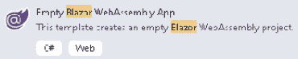
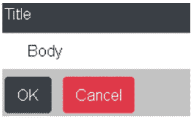
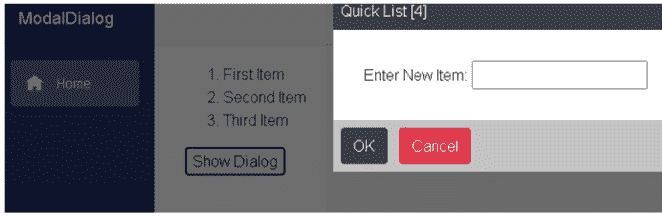
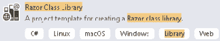
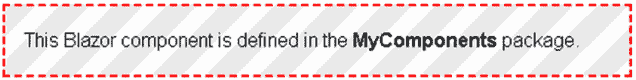

# 三、使用模板化组件构建模态对话框

模态对话框是出现在窗口中所有其他内容之上的对话框，需要用户交互才能关闭它。模板化组件是接受一个或多个用户界面模板作为参数的组件。用户界面模板可以包含任何 Razor 标记。

在本章中，我们将学习`RenderFragment`参数、`EventCallback`参数和 CSS 隔离。当父组件需要与子组件共享信息时，使用`RenderFragment`参数，反之，当子组件需要与其父组件共享信息时，使用`EventCallback`参数。我们还将学习如何通过使用 CSS 隔离将样式仅应用于单个组件。

在本章中，我们将创建一个模态对话框组件。该组件将是一个模板化组件，可以根据其参数的内容呈现不同的 HTML。它将使用事件回调将事件返回给调用组件。它将使用 CSS 隔离来添加格式，这将使它的行为像一个模态对话框。最后，我们将组件移动到一个 **Razor 类库**中，这样就可以和其他项目共享了。

在本章中，我们将涵盖以下主题:

*   `RenderFragment`参数
*   `EventCallback`参数
*   CSS 隔离
*   创建 Razor 类库
*   创建模态对话框项目

# 技术要求

要完成此项目，您需要在电脑上安装 Visual Studio 2019。关于如何安装 Visual Studio 2019 免费社区版的说明，请参考 [*第 1 章*](01.html#_idTextAnchor018) *、Blazor WebAssembly 简介*。您还需要我们在 [*第 2 章*](02.html#_idTextAnchor045) *中创建的**空 Blazor WebAssembly App 项目模板**，构建您的第一个 Blazor WebAssembly 应用*。

本章的源代码可在以下 GitHub 存储库中获得:[https://GitHub . com/PacktPublishing/Blazor-web assembly by Example/tree/main/chapter 03](https://github.com/PacktPublishing/Blazor-WebAssembly-by-Example/tree/main/Chapter03%20)。

行动中的代码视频可在此获得:[https://bit.ly/33X2Zkc](https://bit.ly/33X2Zkc)。

# 渲染片段参数

一个`RenderFragment`参数是一段 UI 内容。一个`RenderFragment`参数用于将用户界面内容从父母传递给孩子。用户界面内容可以包括纯文本、HTML 标记、Razor 标记或其他组件。

以下代码用于`Alert`组件。当`Show`属性的值为`true`时，显示`Alert`组件的用户界面内容:

警惕剃刀

```cs
@if (Show)
{
    <div class="dialog-container">
        <div class="dialog">
            <div>
                @ChildContent
            </div>
            <div>
                <button @onclick="OnOk">
                    OK
                </button>
            </div>
        </div>
    </div>
}
@code {
  [Parameter] public bool Show { get; set; }
  [Parameter] public EventCallback OnOk { get; set; }
  [Parameter] public RenderFragment ChildContent { get;
    set; } 
}
```

前面的代码针对`Alert`组件，包括三种不同类型的参数:布尔、`RenderFragment`和`EventCallback`:

*   第一个参数是`Show`属性。它是布尔类型，这是一个简单的类型。有关使用简单类型作为参数的更多信息，请参见第 2 章[](02.html#_idTextAnchor045)**，构建您的第一个 Blazor WebAssembly 应用*。*
**   第二个参数是`OnOk`属性。是`EventCallback`型。我们将在下一节中了解更多关于`EventCallback`参数的信息。*   最后一个参数是`ChildContent`属性。是`RenderFragment`型。*

 *当点击**显示提醒**按钮时，以下标记使用`Alert`组件在对话框中显示一周的当前日期。`Alert`元素的开始标记和结束标记之间的 Razor 标记绑定到`Alert`组件的`ChildContent`属性:

索引剃刀

```cs
@page "/"
<Alert Show="showAlert" OnOk="@(() => showAlert = false)">
    <h1>Alert</h1>
    <p>Today is @DateTime.Now.DayOfWeek.</p>
</Alert>
<button @onclick="@(() => showAlert = true)">
    Show Alert
</button>
@code {
    private bool showAlert = false;
}
```

以下截图显示了点击**显示提醒**按钮时显示的对话框:


图 3.1–示例警报

如果要在不明确指定参数名称的情况下使用元素内容，`RenderFragment`参数的名称必须为`ChildContent`。例如，以下标记产生的输出与前面没有明确指定`ChildContent`的标记相同:

```cs
<Alert Show="showAlert" OnOk="@(() => showAlert = false)">
    <ChildContent>
        <h1>Alert</h1>
        <p>Today is @DateTime.Now.DayOfWeek.</p>
    </ChildContent>
</Alert>
<button @onclick="@(() => showAlert = true)">
    Show Alert
</button>
@code {
    private bool showAlert = false;
}
```

在前面的标记中，`ChildContent`元素突出显示为。

重要说明

按照惯例，用于捕获父元素内容的`RenderFragment`参数的名称必须是`ChildContent`。

通过在标记中明确指定每个参数的名称，可以在组件中包含多个`RenderFragment`参数。我们将使用多个`RenderFragment`参数来完成本章中的项目。

`RenderFragment`参数使父组件能够传达其子组件要使用的用户界面内容，而`EventCallback`参数用于从子组件传达回父组件。在下一节中，我们将看到如何使用`EventCallback`参数。

# 事件回调参数

事件回调是您传递给另一个方法的方法，当特定事件发生时调用。例如，当点击`Alert`组件上的按钮时，`@onclick`事件使用`OnOk`参数来确定应该调用的方法。`OnOK`参数引用的方法在父组件中定义。

`EventCallback`参数用于从子组件向父组件共享信息。他们与他们的父母分享信息，并在发生事情时通知他们的父母，如按钮点击。父组件只是指定事件被触发时要调用的方法。

这是一个`EventCallback`参数的例子:

```cs
[Parameter] public EventCallback OnOk { get; set; }
```

以下示例使用**λ表达式**作为`OnOk`方法。调用`OnOk`方法时，`showAlert`属性的值设置为`false`:

```cs
<Alert Show="showAlert" OnOk="@(() => showAlert = false)">
        <h1>Alert</h1>
        <p>Today is @DateTime.Now.DayOfWeek.</p>
</Alert>
@code {
    private bool showAlert = false;
}
```

lambda 表达式允许您创建匿名函数。您不需要使用匿名函数。以下示例显示了如何为`OnOk`方法使用方法，而不是匿名函数:

```cs
<Alert Show="showAlert" OnOk="OkClickHandler)">
        <h1>Alert</h1>
        <p>Today is @DateTime.Now.DayOfWeek.</p>
</Alert>
@code {
    private bool showAlert = false;
    private void OkClickHandler()
    {
        showAlert = false;
    }
}
```

编写`Alert`组件时，您可能会尝试直接从组件上的`OnOk`事件更新`Show`参数。您不能这样做，因为如果您直接在组件中更新值，并且组件必须重新呈现，任何状态更改都将丢失。如果需要维护组件中的状态，应该向组件添加一个私有字段。

重要说明

组件永远不应该写入自己的参数。

`Alert`组件在页面上显示文本，但它还不像模态对话框那样工作。为了使它像模态对话框一样工作，我们需要更新组件使用的样式表。我们可以通过使用 CSS 隔离来做到这一点。在下一节中，我们将看到如何使用 CSS 隔离。

# CSS 隔离

用来为我们的 Blazor WebAssembly 应用设计风格的**级联样式表** ( **CSS** )的位置通常是`wwwroot`文件夹。通常，那些 CSS 文件中定义的样式会应用于网络应用中的所有组件。然而，有时您需要对应用于特定组件的样式进行更多控制。为了实现这一点，我们使用 CSS 隔离。使用 CSS 隔离，指定 CSS 文件中的样式将覆盖全局样式。

## 启用 CSS 隔离

为了给某个组件添加一个与隔离的`CSS`文件，在与该组件相同的文件夹中创建一个与该组件同名的`CSS`文件，但文件扩展名为`CSS`。例如，`Alert.razor`组件的`CSS`文件将被称为`Alert.razor.css`。

以下标记用于更新版本的`Alert`组件。在这个版本中，我们添加了两个突出显示的类:

警惕剃刀

```cs
@if (Show)
{
    <div class="dialog-container">
        <div class="dialog">
            <div>
                @ChildContent
            </div>
            <div>
                <button @onclick="OnOk">
                    OK
                </button>
            </div>
        </div>
    </div>
} 
@code {
  [Parameter] public bool Show { get; set; }
  [Parameter] public EventCallback OnOk { get; set; }
  [Parameter] public RenderFragment ChildContent { get;
    set; }
}
```

以下`CSS`文件定义了新类使用的样式:

Alert.razor.css

```cs
.dialog-container {
    position: absolute;
    top: 0;
    bottom: 0;
    left: 0;
    right: 0;
    background-color: rgba(0,0,0,0.6);
    z-index: 2000;
}
.dialog {
    background-color: white;
    margin: auto;
    width: 15rem;
    padding: .5rem
}
```

前面的`CSS`包括`dialog-container`类和`dialog`类的样式:

*   `dialog-container`:这个类将元素的背景颜色设置为 60%不透明度的黑色，并通过将其 z-index 设置为 2，000 将其放置在其他元素的顶部。
*   `dialog`:这个类将元素的背景颜色设置为白色，在父元素内水平居中，宽度设置为 15 雷姆。

下面的截图显示了使用前面的`CSS`文件的`Alert`组件:


图 3.2–警报组件

## 支持子组件

默认情况下，使用 CSS 隔离时，CSS 样式仅适用于当前组件。如果希望 CSS 样式应用于当前组件的子组件，则需要在样式中使用`::deep`组合子。这个组合器选择元素标识符的后代元素。

例如，以下样式将应用于具有当前组件的任何`H1`标题，以及当前组件的子组件中的任何`H1`标题:

```cs
::deep h1 { 
    color: red;
}
```

如果你不想让你的组件使用全局样式，或者你想通过一个 Razor 类库共享你的组件，并且你需要避免样式冲突，CSS 隔离是非常有用的。

# 项目概述

在本章中，我们将构建一个模态对话框组件。您将能够使用 Razor 标记自定义模态对话框的`Title`和`Body`。

这是模态对话框的截图:


图 3.3–模式对话框

最后，在我们完成模态对话框组件后，我们将把它移动到一个 Razor 类库中，这样它就可以与其他项目共享了。

该项目的构建时间约为 90 分钟。

# 创建模态对话框项目

将使用**空 Blazor WebAssembly App 项目模板**创建`ModalDialog`项目。我们将添加一个包含多个部分的`Dialog`组件，并使用 CSS 隔离来应用样式，使其表现得像一个模态对话框。单击按钮时，我们将使用`EventCallback`参数从组件返回到父组件。我们将使用`RenderFragment`参数来允许 Razor 标记从父组件传递到组件。最后，我们将创建一个 Razor 类库，并将我们的`Dialog`组件移动到其中，以便与其他项目共享。

## 开始项目

我们需要创建一个新的 Blazor WebAssembly 应用。我们按如下方式进行:

1.  打开 **Visual Studio 2019** 。
2.  点击**新建项目**按钮。
3.  In the **Search for templates** (*Alt* + *S*) textbox, enter `Blazor` and hit the *Enter* key.

    下面的截图展示了我们在 [*第二章*](02.html#_idTextAnchor045) *中创建的**空 Blazor WebAssembly App 项目模板**，构建你的第一个 Blazor WebAssembly 应用*:

    

    图 3.4–空 Blazor WebAssembly应用项目模板

4.  选择**空 Blazor WebAssembly App 项目模板**，点击**下一步**按钮。
5.  在**项目名称**文本框中输入`ModalDialog`，点击**创建**按钮:


图 3.5–配置您的新项目对话框

小费

在前面的例子中，我们将`ModalDialog`项目放入`E:/Blazor`文件夹中。然而，这个项目的位置并不重要。

我们已经创建了`ModalDialog` Blazor WebAssembly 项目。

## 添加对话框组件

`Dialog`组件将被共享。因此，我们将其添加到`Shared`文件夹中。我们按如下方式进行:

1.  右键单击`Shared`文件夹，从菜单中选择**添加，剃刀组件**。
2.  命名新组件`Dialog`。
3.  点击**添加**按钮。
4.  Replace the markup with the following markup:

    ```cs
    @if (Show)
    {
        <div class="dialog-container">
            <div class="dialog">
                <div class="dialog-title">Title</div>
                <div class="dialog-body">Body</div>
                <div class="dialog-buttons">
                    <button class="btn btn-dark mr-2">
                        OK
                    </button>
                    <button class="btn btn-danger">
                        Cancel
                    </button>
                </div>
            </div>
        </div>
    }
    @code {
        [Parameter] public bool Show { get; set; }
    }
    ```

    `Show`属性用于显示和隐藏组件的内容。我们已经添加了一个`Dialog`组件，但是在适当的样式被添加到项目中之前，它不会表现得像一个模态对话框。

## 添加 CSS

前面的标记包括五个类，我们将使用它们来设置`Dialog`组件的样式，使其表现得像一个模态对话框:

*   `dialog-container`:这个类用于将元素的背景颜色设置为黑色，不透明度为 60%，并通过将其 z-index 设置为 2，000 将其放置在其他元素之上。
*   `dialog`:此类用于将元素的背景颜色设置为白色，在其父元素内水平居中，宽度设置为 25 REM。
*   `dialog-title`:这个类用来将背景颜色设置为深灰色，将文字设置为白色，并添加一些填充。
*   `dialog-body`:这个类用来添加一些填充。
*   `dialog-buttons`: This class is used to set the background color to silver and add some padding.

    小费

    `Dialog`组件使用的其余类，如`btn`，在`wwwroot\css\bootstrap\bootstrap.min.css`文件中定义，该文件包含由 Bootstrap 框架提供的样式。

我们需要创建一个`CSS`文件来定义如何为每个类设置样式。我们按如下方式进行:

1.  右键单击`Shared`文件夹，从菜单中选择**添加，新项目**。
2.  在**搜索**框中输入`css`。
3.  选择**样式表**。
4.  命名样式表`Dialog.razor.css`。
5.  点击**添加**按钮。
6.  输入以下样式:

Dialog.razor.css

```cs
.dialog-container {
    position: absolute;
    top: 0;
    bottom: 0;
    left: 0;
    right: 0;
    background-color: rgba(0,0,0,0.6);
    z-index: 2000;
}
.dialog {
    background-color: white;
    margin: auto;
    width: 25rem;
}
.dialog-title {
    background-color: #343a40;
    color: white;
    padding: .5rem;
}
.dialog-body {
    padding: 2rem;
}
.dialog-buttons {
    background-color: silver;
    padding: .5rem;
}
```

由于 CSS 隔离，`Dialog.razor.cs`文件中的样式将仅由`Dialog`组件使用。

## 测试对话框组件

为了测试`Dialog`组件，我们需要将其添加到另一个组件中。我们将把它添加到用作应用的**主页**的`Index`组件中。我们按如下方式进行:

1.  打开`Pages\Index.razor`文件。
2.  Add the following markup to the `Index.razor` file:

    ```cs
    <Dialog Show="showDialog"></Dialog>
    <button @onclick="OpenDialog">Show Dialog</button>
    @code {
        private bool showDialog = false;
        private void OpenDialog()
        {
            showDialog = true;
        }
    }
    ```

    确保您没有删除文件顶部的`@page`指令。

3.  从**调试**菜单中，选择**开始不调试** ( *Ctrl* + *F5* )选项以运行项目。
4.  Click the **Show Dialog** button:

    

    图 3.6–简单模式对话框

5.  点击**确定**按钮。

当您单击**确定**按钮时，不会发生任何事情，因为我们尚未添加`@onclick`事件。

## 添加事件回调参数

我们需要为添加**确定**按钮和**取消**按钮。我们按如下方式进行:

1.  返回 **Visual Studio** 。
2.  打开`Shared\Dialog.razor`文件。
3.  将`@onclick`事件添加到每个按钮中:

    ```cs
    <button class="btn btn-dark mr-2" @onclick="OnOk">
        OK
    </button>
    <button class="btn btn-danger" @onclick="OnCancel">
        Cancel
    </button>
    ```

4.  Add the following parameters to the code block:

    ```cs
    [Parameter] 
    public EventCallback<MouseEventArgs> OnOk { get; set; }
    [Parameter] 
    public EventCallback<MouseEventArgs> OnCancel { get; set; }
    ```

    小费

    `Parameter`装饰器不需要与其应用的属性在同一行。

5.  打开`Pages\Index.razor`文件。
6.  通过添加突出显示的标记来更新`Dialog`元素的标记:

    ```cs
    <Dialog Show="showDialog" 
            OnCancel="DialogCancelHandler" 
            OnOk="DialogOkHandler">
    </Dialog>
    ```

7.  在代码块中添加以下方法:

    ```cs
    private void DialogCancelHandler(MouseEventArgs e)
    {
        showDialog = false;
    }
    private void DialogOkHandler(MouseEventArgs e)
    {
        showDialog = false;
    }
    ```

8.  从**构建**菜单中，选择**构建解决方案**选项。
9.  返回浏览器。
10.  使用 *Ctrl* + *R* 刷新浏览器。
11.  点击**显示对话框**按钮。
12.  点击**确定**按钮。

点击**确定**按钮，对话框关闭。现在让我们更新`Dialog`组件，允许我们自定义它创建的模态对话框的`Title`和`Body`属性。

## 添加渲染片段参数

我们将对`Dialog`组件的`Title`和`Body`属性使用`RenderFragment`参数。我们按如下方式进行:

1.  返回 **Visual Studio** 。
2.  打开`Shared\Dialog.razor`文件。
3.  将`dialog-title`的标记更新为如下:

    ```cs
    <div class="dialog-title">@Title</div>
    ```

4.  将`dialog-body`的标记更新为如下:

    ```cs
    <div class="dialog-body">@Body</div>
    ```

5.  向代码块添加以下参数:

    ```cs
    [Parameter]
    public RenderFragment Title { get; set; }
    [Parameter]
    public RenderFragment Body { get; set; }
    ```

6.  打开`Pages\Index.razor`文件。
7.  Update the markup for the `Dialog` element to the following:

    ```cs
    <Dialog Show="showDialog"
            OnCancel="DialogCancelHandler"
            OnOk="DialogOkHandler">
        <Title>Quick List [@(Items.Count + 1)]</Title>
        <Body>
            Enter New Item: <input @bind="NewItem" />
        </Body>
    </Dialog>
    ```

    前面的标记将对话框的标题改为`Quick List`，并为用户输入列表项目提供一个文本框。

8.  Add the following markup under the `Dialog` element:

    ```cs
    <ol>
        @foreach (var item in Items)
        {
            <li>@item</li>
        }
    </ol>
    ```

    前面的代码将以有序列表的形式显示`Items`列表中的项目。

9.  将以下变量添加到代码块的顶部:

    ```cs
    private string NewItem;
    private List<string> Items = new List<string>();
    ```

10.  Update `DialogCancelHandler` to the following:

    ```cs
    private void DialogCancelHandler(MouseEventArgs e)
    {
        NewItem = "";
        showDialog = false;
    }
    ```

    前面的代码将清除文本框并隐藏`Dialog`。

11.  Update `DialogOkHandler` to the following:

    ```cs
    private void DialogOkHandler(MouseEventArgs e)
    {
        if (!string.IsNullOrEmpty(NewItem))
        {
            Items.Add(NewItem);
            NewItem = "";
        };
        showDialog = false;
    }
    ```

    前面的代码将把`NewItem`添加到`Items`列表中，清除文本框，并隐藏`Dialog`。

12.  从**构建**菜单中，选择**构建解决方案**选项。
13.  返回浏览器。
14.  使用 *Ctrl* + *R* 刷新浏览器。
15.  点击**显示对话框**按钮。
16.  在**输入新项目**字段输入一些文本。
17.  点击**确定**按钮。
18.  Repeat.

    每次点击**确定**按钮时，**输入新项目**字段中的文本将被添加到列表中。下面的屏幕截图显示了一个列表，其中已经添加了三个项目，第四个项目将使用模态对话框添加:

    

    图 3.7–快速列表示例

19.  关闭浏览器。

为了与其他项目共享这个新组件，我们需要将其添加到一个 **Razor 类库**中。

## 创建 Razor 类库

我们可以通过使用 Razor 类库跨项目共享组件。为了创建一个 Razor 类库，我们将使用 **Razor 类库**项目模板。我们按如下方式进行:

1.  右键单击解决方案，并从菜单中选择**添加，新项目**选项。
2.  Enter `Razor Class Library` in the **Search for templates** textbox to locate the **Razor Class Library** project template:

    

    图 3.8–Razor 类库项目模板

3.  选择**剃刀类库**项目模板。
4.  点击**下一步**按钮。
5.  命名项目`MyComponents`并点击**创建**按钮。
6.  接受默认值，点击**创建**按钮。
7.  右键单击`ModalDialog`项目，从菜单中选择**添加，项目参考**选项。
8.  勾选`MyComponents`复选框，点击**确定**按钮。

我们已经创建了一个示例 Razor 类库。

## 测试 Razor 类库

我们刚刚创建的示例 Razor 类库包含一个名为`Component1`的组件。在我们继续之前，我们应该测试新的 Razor 类库是否正常工作。我们按如下方式进行:

1.  打开`ModalDialog\Pages\` `Index.razor`文件。
2.  Add the following `@using` statement right below the `@page` directive:

    ```cs
    @using MyComponents;
    ```

    小费

    如果您将在多个页面上使用该项目，您应该将`@using`语句直接添加到`ModalDialog\_Imports.razor`文件中。

3.  在`@using`语句下面添加以下标记:

    ```cs
    <Component1 />
    ```

4.  From the **Debug** menu, select the **Start Without Debugging** (*Ctrl* + *F5*) option to run the project.

    下面的截图显示了`Component1`组件应该如何渲染:

    

    图 3.9–组件 1

    重要说明

    如果`Component1`组件缺少样式，那是因为 CSS 文件被缓存了。使用以下组合键*Ctrl*+*Shift*+*R*，清空缓存并重新加载页面。

5.  返回 **Visual Studio** 。
6.  删除`Component1`元素。

我们已经完成了对示例 Razor 类库的测试。

## 向 Razor 类库添加组件

为了共享`Dialog`组件，我们需要将其移动到我们刚刚创建和测试的 Razor 类库中。我们按如下方式进行:

1.  右键单击`ModalDialog\Shared\Dialog.razor`文件，从菜单中选择**复制**选项。
2.  右键单击`MyComponents`项目，从菜单中选择**粘贴**选项。
3.  右键单击`MyComponents\Dialog.razor`文件，从菜单中选择**重命名**选项。
4.  Rename the file to `BweDialog.razor`.

    在这种情况下，`Bwe`代表**Blazor web assembly by Example**。

    小费

    在给 Razor 类库中的组件命名时，应该给它们唯一的名称，以避免不明确的引用错误。大多数组织都用相同的文本作为所有共享组件的前缀。以为例，一家名为**一站式设计** ( **OSD** )的公司可能会在所有共享组件前加上`Osd`。

5.  打开`ModalDialog\Pages\Index.razor`文件。
6.  将`Dialog`元素重命名为`BweDialog`。
7.  从**构建**菜单中，选择**构建解决方案**选项。
8.  返回浏览器。
9.  使用 *Ctrl* + *R* 刷新浏览器。
10.  点击**显示对话框**按钮。
11.  在**输入新项目**字段输入一些文本。
12.  点击**确定**按钮。
13.  重复一遍。

`BweDialog`组件现在正从`MyComponents`项目中使用。由于它现在包含在剃刀类库中，您可以很容易地与其他项目共享它。

# 总结

现在，您应该能够创建一个模态对话框，并通过使用 Razor 类库与多个项目共享它。

本章我们介绍了`RenderFragment`参数、`EventCallback`参数以及 CSS 隔离。

之后，我们使用**空 Blazor App** 项目模板创建了一个新项目。我们添加了一个`Dialog`组件，它就像一个模态对话框。`Dialog`组件使用`RenderFragment`参数和`EventCallback`参数在它和它的父组件之间共享信息。此外，它的样式使用了 CSS 隔离。

在本章的最后一部分，我们创建了一个 Razor 自定义库，并将`Dialog`组件移动到了新的库中。

到目前为止，在本书中，我们避免使用 JavaScript。不幸的是，仍然有一些功能我们只能用 JavaScript 来完成。我们将在本书的下一章看到如何在 Blazor WebAssembly 中使用 JavaScript 互操作来使用 JavaScript。

# 问题

以下问题供您考虑:

1.  如何用模板化组件替换表？
2.  如何为`Dialog`组件的`Title`属性和`Body`属性添加默认值？
3.  如果希望 Razor 类库中的所有组件都使用相同的 CSS 文件，可以将样式移动到共享的 CSS 文件中吗？
4.  你能使用 NuGet 包分发你的`Dialog`组件吗？

# 进一步阅读

以下资源提供了有关本章主题的更多信息:

*   关于 CSS 的更多信息，请参考[https://www.w3schools.com/css/default.asp](https://www.w3schools.com/css/default.asp)。
*   有关 lambda 表达式的更多信息，请参考[https://docs . Microsoft . com/en-us/dotnet/cs harp/language-reference/operators/lambda-expressions](https://docs.microsoft.com/en-us/dotnet/csharp/language-reference/operators/lambda-expressions)。
*   关于 ASP.NET Core Razor 组件类库的更多信息，请参考[https://docs . Microsoft . com/en-us/aspnet/Core/Blazor/components/类库](https://docs.microsoft.com/en-us/aspnet/core/Blazor/components/class-libraries)。
*   更多关于 NuGet 的信息，请参考[https://www.nuget.org](https://www.nuget.org)。*