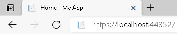
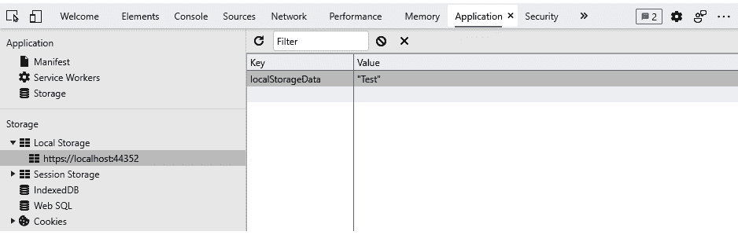

# 四、使用 JavaScript 互操作性构建本地存储服务

Blazor WebAssembly 框架让我们可以在浏览器上运行 C#代码。然而，有一些场景它无法处理，在这些情况下，我们需要使用 JavaScript 函数来填补空白。

在本章中，我们将学习如何将 JavaScript 与 Blazor WebAssembly 一起使用。我们将学习如何在有和没有返回值的情况下从 Blazor 调用一个 JavaScript 函数。相反，我们将学习如何调用。NET 方法。我们将通过使用 **JavaScript 互操作** ( **JS 互操作**)来完成这两个场景。最后，我们将学习如何使用**本地存储**在浏览器上存储数据。

我们将在本章中创建的项目将是一个本地存储服务，它将读写浏览器的本地存储。为了访问浏览器的本地存储，我们需要使用 JavaScript。JS 互操作用于从. NET 调用 JavaScript

在本章中，我们将涵盖以下主题:

*   为什么要用 JavaScript？
*   探索 JS 互操作
*   了解本地存储
*   从 Blazor 调用一个 JavaScript 函数
*   从 JavaScript 调用. NET 方法
*   创建本地存储服务

# 技术要求

要完成此项目，您需要在电脑上安装 Visual Studio 2019。关于如何安装 Visual Studio 2019 免费社区版的说明，请参考 [*第 1 章*](01.html#_idTextAnchor018) *、Blazor WebAssembly 简介*。您还需要我们在 [*第 2 章*](02.html#_idTextAnchor045) *中创建的**空 Blazor WebAssembly App** 项目模板，构建您的第一个 Blazor WebAssembly 应用*。

本章的源代码可在以下 GitHub 存储库中获得:[https://GitHub . com/PacktPublishing/Blazor-web assembly by Example/tree/main/chapter 04](https://github.com/PacktPublishing/Blazor-WebAssembly-by-Example/tree/main/Chapter04)。

行动中的代码视频可在此获得:[https://bit.ly/3tXVMeg](https://bit.ly/3tXVMeg)。

# 为什么要用 JavaScript？

有了 Blazor WebAssembly，你可以创建完整的应用，而无需直接使用 JavaScript。但是，您可能需要使用 JavaScript，因为有些场景没有它是无法完成的。没有 JavaScript，您就不能操纵 DOM 或调用我们在 web 开发中所依赖的任何 JavaScript APIs。

这是您不能直接从 Blazor WebAssembly 框架访问的内容的示例:

*   **DOM 操作**
*   **媒体捕获和流应用编程接口**
*   **网络图形接口**(网络的 2D 和 3D 图形)
*   **网络存储应用编程接口**(本地存储和会话存储)
*   **地理定位应用编程接口**
*   JavaScript 弹出框(*提醒*、*确认*、*提示*)
*   浏览器的在线状态
*   浏览器的历史
*   **Chart.js**
*   其他第三方 JavaScript 库

前面的列表一点也不全面，因为目前有数百个 JavaScript 库可用。但是，要记住的关键一点是，不使用 JavaScript 就无法操纵DOM。因此，我们可能总是需要在网络应用中使用一些 JavaScript。幸运的是，通过使用 JS 互操作，这很容易做到。

# 探索 JS 互操作

从调用一个 JavaScript 函数。NET，我们使用`IJSRuntime`抽象。这个抽象表示框架可以调用的 JavaScript 运行时的一个实例。要使用`IJSRuntime`，我们必须首先使用依赖注入将其注入到我们的组件中。有关依赖注入的更多信息，请参考 [*第 6 章*](06.html#_idTextAnchor162) *【使用应用状态构建购物车】*。

`@inject`指令用于向组件注入依赖关系。以下代码将`IJSRuntime`注入到当前组件中:

```cs
@inject IJSRuntime js
```

`IJSRuntime`抽象有两种方法可以用来调用 JavaScript 函数:

*   `InvokeVoidAsync`
*   `InvokeAsync`

这两种方法都是异步的。这两种方法的区别在于，其中一种方法返回值，而另一种方法不返回值。我们可以将`IJSRuntime`的一个实例降级为`IJSInProcessRuntime`的一个实例，同步运行该方法。最后，我们可以通过用`JsInvokable`修饰方法，从 JavaScript 中调用一个. NET 方法。

## InvokeVoidAsync

`InvokeVoidAsync`方法用于调用不返回值的 JavaScript 函数。它异步调用指定的 JavaScript 函数。

这是`IJsRuntime`的`InvokeVoidAsync`法:

```cs
InvokeVoidAsync(string identifier, params object[] args);
```

第一个参数是被调用的 JavaScript 方法的标识符，第二个参数是 JSON 可序列化参数的数组。第二个参数是可选的。

在 JavaScript 中，`Document`对象代表 HTML 文档的根节点。`Document`对象的`title`属性用于指定浏览器标题栏中显示的文本。假设我们想要在我们的 Blazor WebAssembly 应用中的组件之间导航时更新浏览器的标题。为此，我们需要使用 JavaScript 更新`title`属性。

下面的 JavaScript 代码定义了一个名为`setDocumentTitle`的方法，该方法将`Document`对象的`title`属性设置为`title`参数提供的值:

bweinterop . js

```cs
var bweInterop = {};
bweInterop.setDocumentTitle = function (title) {
    document.title = title;
}
```

小费

在本书中，我们将为我们的 JavaScript 代码使用`bweInterop`命名空间，以构建我们的代码并最小化命名冲突的风险。

在我们可以访问前面的 JavaScript 代码之前，我们需要从`wwwroot/index.html`文件中添加对它的引用。下面突出显示的代码是对 JavaScript 文件的引用。它假设它已经被放入名为`scripts`的文件夹中:

```cs
<script src="scripts/bweInterop.js"></script>
<script src="_framework/Blazor.webassembly.js"></script> 
```

新的脚本标签应该添加在引用`wwwroot/index.html`文件的`body`元素中的`_framework/Blazor.webassembly.js`文件的脚本标签之前。

以下`Document`组件使用`setDocumentTitle` JavaScript 函数更新浏览器的标题栏:

文档剃刀

```cs
@inject IJSRuntime js
@code {
    [Parameter] public string Title { get; set; }
    protected override async Task OnAfterRenderAsync(bool 
      firstRender)
    {
        if (firstRender)
        {
            await js.InvokeVoidAsync(
                "bweInterop.setDocumentTitle",
                Title);
        }
    }
} 
```

在前面的代码中，`IJSRuntime`被注入到组件中。然后，`OnAfterRenderAsync`方法使用`IJSRuntime`的`InvokeVoidAsync`方法在第一次渲染组件时调用`setDocumentTitle` JavaScript 函数。

以下标记使用`Document`组件将浏览器的标题栏更新为`Home – My App`:

```cs
<Document Title="Home - My App" />
```

以下截图显示了更新后的文档标题:



图 4.1–更新的文档标题

`InvokeVoidSync`方法用于调用不返回值的 JavaScript 函数。如果我们需要返回值，我们需要使用`InvokeAsync`方法来代替。

## 调用同步

当我们想要调用一个返回值的 JavaScript 函数时，使用`InvokeAsync`方法。它异步调用指定的 JavaScript 函数。

这是`IJSRuntime`的`InvokeAsync`法:

```cs
ValueTask<TValue> InvokeAsync<TValue>(string identifier, 
                                     params object[] args);
```

就像`InvokeVoidAsync`方法一样，第一个参数是 JavaScript 方法的标识符，第二个参数是 JSON 可序列化参数的数组。第二个参数是可选的。`InvokeAsync`方法返回一个`TValue`类型的`ValueTask`。`TValue`是 JavaScript 返回值的 JSON 反序列化实例。

在 JavaScript 中，`Window`对象代表浏览器的窗口。如果我们需要确定当前窗口的宽度和高度，我们可以使用`Window`对象的`innerWidth`和`innerHeight`属性。

下面的 JavaScript 代码定义了一个名为`getWindowSize`的方法，该方法返回`Window`对象的宽度和高度:

bweinterop . js

```cs
var bweInterop = {};
bweInterop.getWindowSize = function () {
    var size = {
        width: window.innerWidth,
        height: window.innerHeight
    }
    return size;
}
```

这是用于存储窗口大小的`WindowSize`类的定义。NET:

```cs
public class WindowSize
{
    public int? Width { get; set; }
    public int? Height { get; set; }
}
```

以下`Index`组件从`bweInterop.js`文件调用`GetWindowSize`方法:

索引剃刀

```cs
@page "/"
@inject IJSRuntime js
@if (windowSize.Width != null)
{
    <h2>
        Window Size: @windowSize.Width x @windowSize.Height
    </h2>
}
<button @onclick="GetWindowSize">Get Window Size</button>
@code{
    private WindowSize windowSize = new WindowSize();
    private async Task GetWindowSize()
    {
        windowSize = await js.InvokeAsync<WindowSize>(
            "bweInterop.getWindowSize");
    }
}
```

在前面的代码中，`IJSRuntime`被注入到组件中。点击**获取窗口大小**按钮后，`GetWindowSize`方法使用`IJSRuntime`的`InvokeAsync`方法调用`getWindowSize` JavaScript 函数。`GetWindowSize` JavaScript 函数将窗口的宽度和高度返回到`windowSize`属性。最后，组件重新生成其渲染树，并将任何更改应用于浏览器的 DOM。

这是点击**获取窗口大小**按钮后的页面截图:


图 4.2–窗口大小示例

## 从调用 JavaScript。NET 同步

到目前为止，在本章中，我们只关注异步调用 JavaScript 函数。但是我们也可以同步调用 JavaScript 函数。我们通过将`IJSRuntime`下调至`IJSInProcessRuntime`来实现。`IJSInProcessRuntime`表示 JavaScript 运行时的一个实例，调用可以被分派到该实例。

`IJSInProcessRuntime`允许我们的。NET 代码来同步调用 JS 互操作调用。这可能是有利的，因为这些调用比异步调用具有更少的开销。这些方法类似于异步方法:

*   `InvokeVoid`
*   `Invoke`

以下代码是本章前面`Document`组件的同步版本。它使用`IJSInProcessRuntime`同步调用 JavaScript 函数:

DocumentSync.razor

```cs
@inject IJSRuntime js
@code {
    [Parameter] public string Title { get; set; }
    protected override void OnAfterRender(bool firstRender)
    {
        if (firstRender)
        {
            ((IJSInProcessRuntime)js).InvokeVoid(
                "bweInterop.setDocumentTitle",
                Title);
        }
    }
}
```

在前面的代码中，`IJsRuntime`实例已经向下转换为`IJSInProcessRuntime`实例。`IJSInProcessRuntime`实例的`InvokeVoid`方法是用来调用`setDocumentTitle` JavaScript 方法的。

以下标记使用了`DocumentSync`组件:

```cs
<DocumentSync Title="Home - My App" />
```

## 调用。NET 从 JavaScript

我们可以调用一个公共。NET 方法，方法是用`JSInvokable`属性修饰该方法。

下面的方法用`JSInvokable`属性修饰，使其能够从 JavaScript 中调用:

```cs
[JSInvokable]
public void GetWindowSize(WindowSize newWindowSize)
{
    windowSize = newWindowSize;
    StateHasChanged();
}
```

在前面的代码中，`windowSize`属性在每次从 JavaScript 中调用`GetWindowSize`方法时都会更新。组件的`StateHasChanged`方法被调用来通知组件它的状态已经改变，组件应该被重新渲染。

小费

组件的`StateHasChanged`方法仅对`EventCallback`方法自动调用。在其他情况下，必须手动调用它来通知用户界面它可能需要重新呈现。

要从 JavaScript 调用. NET 方法，必须创建一个`DotNetObjectReferenece`类供 JavaScript 使用，以便定位。NET 方法。`DotNetObjectReferenece`类包装了一个 JS 互操作参数，指示值不应该序列化为 JSON，而应该作为引用传递。

重要说明

为了避免内存泄漏并允许在创建`DotNetObjectReference`类的组件上进行垃圾收集，我们必须努力处理`DotNetObjectReference`的每个实例。

下面的代码创建了一个包装`Resize`组件的`DotNetObjectReference`实例。然后，该引用被传递给 JavaScript 方法:

```cs
private DotNetObjectReference<Resize> objRef;
protected async override Task OnAfterRenderAsync(bool firstRender)
{
    if (firstRender)
    {
        objRef = DotNetObjectReference.Create(this);
        await js.InvokeVoidAsync(
            "bweInterop.registerResizeHandler",
             objRef);
    }
}
```

您可以使用对使用`DotNetObjectReference`创建的组件的引用，从 JavaScript 调用. NET 组件中的方法。在下面的 JavaScript 中，`registerResizeHandler`函数创建了`resizeHandler`，在初始化时和每次调整窗口大小时都会调用它。

您可以使用`invokeMethod`或`invokeMethodAsync`函数来调用。NET 实例方法来自 JavaScript。以下示例使用`invokeMethodAsync`函数调用用`JSInvokable`属性修饰的`GetWindowSize`方法:

bweinterop . js

```cs
bweInterop.registerResizeHandler = function (dotNetObjectRef) {
    function resizeHandler() {
        dotNetObjectRef.invokeMethodAsync('GetWindowSize',
            {
                width: window.innerWidth,
                height: window.innerHeight
            });
    };
    resizeHandler();
    window.addEventListener("resize", resizeHandler);
}
```

这就是的完整。`Resize`组件的净代码:

调整大小。剃刀

```cs
@page "/resize"
@inject IJSRuntime js
@implements IDisposable
@if (windowSize.Width != null)
{
    <h2>
        Window Size: @windowSize.Width x @windowSize.Height
    </h2>
}
@code {
    private DotNetObjectReference<Resize> objRef;
    private WindowSize windowSize = new WindowSize();
    protected async override Task OnAfterRenderAsync(bool 
      firstRender)
    {
        if (firstRender)
        {
            objRef = DotNetObjectReference.Create(this);
            await js.InvokeVoidAsync(
                "bweInterop.registerResizeHandler",
                    objRef);
        }
    }
    [JSInvokable]
    public void GetWindowSize(WindowSize newWindowSize)
    {
        windowSize = newWindowSize;
        StateHasChanged();
    }
    public void Dispose()
    {
        objRef?.Dispose();
    }
}
```

`Resize`组件的上述代码显示了浏览器的当前宽度和高度。调整浏览器大小时，显示的值会自动更新。此外，`DotNetObjectReference`对象在部件被处理时被处理掉。

`IJSRuntime`抽象为我们提供了一种从调用 JavaScript 函数的方法。NET 并调用。NET 方法。我们将使用 JavaScript 的**网络存储应用编程接口**来完成本章中的项目。但是在我们使用它之前，我们需要了解它是如何工作的。

# 了解本地存储

JavaScript 的 Web 存储 API 为浏览器提供了存储键/值对的机制。对于每个网络浏览器，可以存储在网络存储器中的数据大小至少为每个源 5 MB。本地存储是在 JavaScript 的网络存储应用编程接口中定义的。我们需要使用 JS 互操作来访问浏览器上的 localStorage。

浏览器的本地存储范围是特定的网址。如果用户重新加载页面或关闭并重新打开浏览器，本地存储的内容将被保留。如果用户打开多个选项卡，每个选项卡共享同一个本地存储。本地存储中的数据会一直保留到明确清除为止，因为它没有到期日期。

小费

当最后一个选项卡关闭时，使用 InPrivate 窗口或 Incognito 窗口创建的本地存储对象中的数据将被清除。

这些是本地存储的方法:

*   `key`:该方法根据指定键在 localStorage 中的位置返回指定键的名称。
*   `getItem`:该方法从 localStorage 返回指定键的值。
*   `setItem`:这个方法获取一个键值对，并将它们添加到 localStorage。
*   `removeItem`:此方法从 localStorage 中移除指示的键。
*   `clear`: This method clears localStorage.

    小费

    会话存储也是在网络存储应用编程接口中定义的。与在多个浏览器选项卡之间共享其值的本地存储不同，会话存储的范围仅限于单个浏览器选项卡。因此，如果用户重新加载页面，数据仍然存在，但是如果用户关闭选项卡(或浏览器)，数据将被清除。

要查看浏览器本地存储器的内容，打开**开发者工具(F12)** 并选择**应用**选项卡。在左侧菜单的**存储**部分查找**本地存储**。以下截图显示了**开发工具**对话框的**应用**选项卡:


图 4.3–本地存储

通过使用网络存储应用编程接口，可以很容易地在浏览器中存储数据并检索数据。现在，让我们快速了解一下我们将在本章中构建的项目。

# 项目概述

在本章中，我们将构建一个本地存储服务。该服务将写入和读取浏览器的本地存储。我们将使用 JS 互操作来实现这一点。最后，我们将创建一个组件来测试我们的服务:


图 4.4–本地存储服务测试页面

这个项目的构建时间大约为 60 分钟。

# 创建本地存储服务

将使用**空 Blazor WebAssembly应用**项目模板创建`LocalStorage`项目。首先，我们将添加一个带有 JavaScript 函数的 JavaScript 文件，我们的服务将需要使用这些函数来更新浏览器的 localStorage。接下来，我们将使用。NET 方法调用 JavaScript 函数。最后，我们将测试我们的服务。

## 创建本地存储服务项目

我们需要创建一个新的 Blazor WebAssembly 应用。我们按如下方式进行:

1.  打开 **Visual Studio 2019** 。
2.  点击**新建项目**按钮。
3.  In the **Search for templates (***Alt***+***S***)** textbox, enter `Blazor` and hit the *Enter* key.

    以下截图显示了我们在 [*第二章*](02.html#_idTextAnchor045) *中创建的**空 Blazor WebAssembly App** 项目模板，构建您的第一个 Blazor WebAssembly 应用*:

    

    图 4.5–空 Blazor WebAssembly应用项目模板

4.  选择**空 Blazor WebAssembly App** 项目模板，点击**下一步**按钮。
5.  在**项目名称**文本框中输入`LocalStorage`，然后点击**创建**按钮:


图 4.6–配置新项目对话框

小费

在前面的例子中，我们将`LocalStorage`项目放入`E:/Blazor`文件夹中。然而，这个项目的位置并不重要。

我们现在已经创建了 Blazor WebAssembly项目。

## 编写 JavaScript 访问本地存储

我们需要编写 JavaScript 函数，这些函数将读写浏览器的 localStorage。我们按如下方式进行:

1.  右键单击`wwwroot`文件夹，从菜单中选择**添加，新文件夹**选项。
2.  命名新文件夹`scripts`。
3.  右键单击`scripts`文件夹，从菜单中选择**添加，新项目**选项。
4.  在**搜索**框中输入`javascript`。
5.  选择 **JavaScript 文件**。
6.  命名文件`bweInterop.js`。
7.  点击**添加**按钮。
8.  输入以下 JavaScript:

    ```cs
    var bweInterop = {};
    bweInterop.setLocalStorage = function (key, data) {
        localStorage.setItem(key, data);
    }
    bweInterop.getLocalStorage = function (key) {
        return localStorage.getItem(key);
    }
    ```

9.  打开`wwwroot\index.html`文件。
10.  在`body`元素中添加以下引用:

    ```cs
    <script src="scripts/bweInterop.js"></script>
    ```

11.  请确保您将添加到引用`_framework/Blazor.webassembly.js`之前。

## 添加 ILocalStorageService 接口

我们需要为我们的服务创建一个接口。我们按如下方式进行:

1.  右键单击`LocalStorage`项目，从菜单中选择**添加，新文件夹**选项。
2.  命名新文件夹`Services`。
3.  右键单击`Services`文件夹，然后从菜单中选择**添加，新项目**选项。
4.  在**搜索**框中输入`interface`。
5.  选择**界面**。
6.  命名文件`ILocalStorageService`。
7.  点击**添加**按钮。
8.  用以下高亮显示的代码更新【T0:

    ```cs
    interface ILocalStorageService
    {
     Task SetItemAsync<T>(string key, T item);
     Task<T> GetItemAsync<T>(string key);
    }
    ```

## 创建本地存储服务类

我们需要基于我们刚刚创建的接口创建一个新的类。我们按如下方式进行:

1.  右键单击`Services`文件夹，从菜单中选择**添加，类别**选项。
2.  命名新类`LocalStorageService`。
3.  将代码更新到`LocalStorageService`类以从`ILocalStorageSerivce`继承:

    ```cs
    public class LocalStorageService : ILocalStorageService
    {
    }
    ```

4.  右键单击`ILocalStorageService`，从菜单中选择**执行界面**选项。
5.  Add the following code to the `LocalStorageService` class:

    ```cs
    private IJSRuntime js;
    public LocalStorageService(IJSRuntime JsRuntime)
    {
        js = JsRuntime;
    }
    ```

    前面的代码定义了`LocalStorageService`类的构造函数。

6.  增加以下`using`语句:

    ```cs
    using Microsoft.JSInterop;
    ```

7.  Update the `SetItemAsync` method to the following:

    ```cs
    public async Task SetItemAsync<T>(string key, T item)
    {
        await js.InvokeVoidAsync(
            "bweInterop.setLocalStorage",
            key,
            JsonSerializer.Serialize(item));
    }
    ```

    `SetItemAsync`方法调用`bweInterop.setLocalStorage` JavaScript 函数，该函数带有要存储在 localStorage 中的项的密钥和序列化版本。

8.  在`using`语句后添加:

    ```cs
    using System.Text.Json;
    ```

9.  Update the `GetItemAsync` method to the following:

    ```cs
    public async Task<T> GetItemAsync<T>(string key)
    {
        var json = await js.InvokeAsync<string>(
            "bweInterop.getLocalStorage",
            key);
        return string.IsNullOrEmpty(json)
                ? default
                : JsonSerializer.Deserialize<T>(json);
    }
    ```

    `GetItemAsync`方法用一个键调用`bweInterop.getLocalStorage` JavaScript 函数。如果`bweInterop.getLocalStorage`返回一个值，该值将被反序列化并返回。

我们已经完成了服务。现在我们需要测试一下。

## 写入本地存储

我们需要使用我们的本地存储服务测试写入浏览器的本地存储。我们按如下方式进行:

1.  打开`Pages\Index.razor`文件。
2.  Add the following markup:

    ```cs
    @using LocalStorage.Services
    @inject IJSRuntime js
    <h2>Local Storage Service</h2>
    <div>
        Data:
        <input type="text"
               @bind-value="data"
               size="50" />
    </div>
    <div class="pt-2">
        <button class="btn btn-primary"
                @onclick="SaveToLocalStorageAsync">
            Save to Local Storage
        </button>
    </div>
    @code {
    }
    ```

    前面的标记为要保存到浏览器的 localStorage 中的数据添加了一个文本框和一个用于调用`SaveToLocalStorageAsync`方法的按钮。

3.  Add the following code to the code block:

    ```cs
    private string data;
    private LocalStorageService localStorage;
    protected override void OnInitialized()
    {
        localStorage = new LocalStorageService(js);
    }
    async Task SaveToLocalStorageAsync()
    {
        await localStorage.SetItemAsync<string>(
            "localStorageData", 
            data);
    }
    ```

    前面的代码初始化了组件并定义了`SaveToLocalStorageAsync`方法。将数据保存到本地存储时，`SaveToLocalStorageAsync`方法使用`localStorageData`作为密钥。

    在**调试**菜单中，选择**不调试启动** ( *Ctrl* + *F5* )选项运行项目:

    

    图 4.7–本地存储服务测试页面

4.  在**数据**文本框中输入字`Test`。
5.  点击**保存到本地存储**按钮。
6.  点击 *F12* 打开开发工具。
7.  选择**应用**选项卡。
8.  打开**本地存储**。

以下截图显示了`localStorageData`的值:



图 4.8–本地存储

我们已经使用 **本地存储应用编程接口**将数据保存到浏览器的本地存储。接下来，我们需要学习如何读取浏览器的 localStorage。

## 从本地存储器读取

我们需要使用我们的本地存储服务测试从浏览器的本地存储读取。我们按如下方式进行:

1.  返回 **Visual Studio** 。
2.  打开`Pages\Index.razor`文件。
3.  Add the following button beneath the existing button:

    ```cs
    <button class="btn btn-primary"
            @onclick="ReadFromLocalStorageAsync">
        Read from Local Storage
    </button>
    ```

    前面的标记添加了一个用于调用`ReadFromLocalStorageAsync`方法的按钮。

4.  Add the following method to the code block:

    ```cs
    async Task ReadFromLocalStorageAsync()
    {
        data = await localStorage.GetItemAsync<string>(
            "localStorageData");
    }
    ```

    前面的代码定义了`ReadFromLocalStorageAsync`方法。`ReadFromLocalStorageAsync`在访问浏览器的本地存储时使用`localStorageData`键。

5.  从**构建**菜单中，选择**构建解决方案**选项。
6.  返回浏览器。
7.  使用 *Ctrl* + *R* 刷新浏览器。
8.  点击**从本地存储器读取**按钮。

我们现在已经完成了本地存储服务的测试。

# 总结

现在，您应该能够通过使用 JS 互操作从 Blazor WebAssembly 应用中调用 JavaScript 函数来创建本地存储服务。

在这一章中，我们解释了为什么您仍然需要使用 JavaScript，以及如何使用 **IJSRuntime** 抽象从调用 JavaScript 函数。NET，同步和异步。相反，我们解释了如何调用。NET 方法。最后，我们解释了如何使用 localStorage 在浏览器中存储数据。

之后，我们使用**空 Blazor App** 项目模板创建了一个新项目。我们添加了一些 JavaScript 函数来读写本地存储。然后，我们添加了一个类来调用这些 JavaScript 函数。

在本章的最后一部分，我们测试了本地存储服务。

使用 Blazor WebAssembly 的最大好处之一是所有代码都在浏览器上运行。这意味着使用 Blazor WebAssembly 构建的 web 应用可以脱机运行。在下一章中，我们将利用这一优势来创建一个进步的 web 应用。

# 问题

以下问题供您考虑:

1.  `IJSRuntime`可以用来渲染一个 UI 吗？
2.  您如何将我们的本地存储服务添加到 Razor 类库中？
3.  在哪些情况下，您会使用会话存储而不是本地存储？
4.  本地存储安全吗？
5.  如何验证浏览器支持 localStorage 并且可以使用？

# 进一步阅读

以下资源提供了有关本章所涵盖主题的更多信息:

*   关于使用 JavaScript 的更多信息，请参考[https://www.w3schools.com/js](https://www.w3schools.com/js)。
*   关于 JavaScript 的更多详细信息，请参考[https://developer.mozilla.org/en-US/docs/Web/javascript](https://developer.mozilla.org/en-US/docs/Web/javascript)。
*   关于 JavaScript 引用，请参考[https://developer . Mozilla . org/en-US/docs/Web/JavaScript/Reference](https://developer.mozilla.org/en-US/docs/Web/JavaScript/Reference)。
*   关于 localStorage 的更多信息，请参考[https://www . w3 . org/TR/web storage/# the-local storage-attribute](https://www.w3.org/TR/webstorage/#the-localstorage-attribute)。
*   关于**仓储生活标准**的更多信息，请参考[https://storage.spec.whatwg.org](https://storage.spec.whatwg.org)。
*   关于**微软 Edge(chrome)开发者工具**的更多信息，请参考[https://docs . Microsoft . com/en-us/Microsoft-Edge/devtools-guide-chrome](https://docs.microsoft.com/en-us/microsoft-edge/devtools-guide-chromium)。