# *第五章*:把天气应用做为一个进步的网络应用(PWA)

作为网络开发人员，我们开发各种令人惊叹的网络应用程序，但直到最近，网络应用程序能做什么和本地应用程序能做什么之间一直存在分歧。一种叫做**渐进式网络应用程序** ( **PWAs** )的新类别的应用程序正在通过在我们的网络应用程序中实现类似本机的功能、可靠性和可安装性来帮助弥合这一鸿沟。PWA 是一个网络应用程序，它利用了原生应用程序的功能，同时保留了网络应用程序的所有功能。

在本章中，我们将学习什么定义了 PWA，以及如何通过向现有 web 应用程序添加**清单文件**和**服务人员**来创建 PWA。

我们在本章中创建的项目将是一个本地 5 天天气预报应用程序，可以作为本机应用程序安装和运行在 Windows、MAC、iPhones、Android 手机等上，并可以通过各种应用商店分发。我们将使用 JavaScript 的**地理定位 API** 来获取设备的位置，并使用**开放天气一呼 API** 来获取该位置的天气预报。我们将通过添加一个清单文件和一个服务人员将应用程序转换成一个 PWA。服务人员将使用**缓存存储应用编程接口**来缓存信息，以便 PWA 可以脱机工作。

在本章中，我们将涵盖以下主题:

*   了解普华永道
*   使用清单文件
*   与服务人员一起工作
*   使用缓存存储 api
*   使用地理定位应用编程接口
*   使用开放天气一键呼叫应用编程接口
*   创建 PWA

# 技术要求

要完成这个项目，你需要在你的电脑上安装 **Visual Studio 2019** 。关于如何安装 Visual Studio 2019 免费社区版的说明，请参考 [*第 1 章*](01.html#_idTextAnchor018) *、Blazor WebAssembly 简介*。您还需要我们在 [*第 2 章*](02.html#_idTextAnchor045) *中创建的**空 Blazor WebAssembly App** 项目模板，构建您的第一个 Blazor WebAssembly 应用程序*。

我们将使用外部天气应用编程接口来访问我们项目的天气预报数据。我们将使用的应用编程接口是开放天气一键调用应用编程接口，用于获取当前、预测和历史天气数据。这是由**开放天气**([https://openweathermap.org](https://openweathermap.org)提供的免费 API。为了开始使用这个应用编程接口，您需要创建一个帐户并获取一个应用编程接口密钥。如果您不想创建帐户，可以使用我们在 GitHub 存储库中为本章提供的`weather.json`文件。

本章的源代码可在以下 GitHub 存储库中获得:[https://GitHub . com/PacktPublishing/Blazor-web assembly by Example/tree/main/chapter 05](https://github.com/PacktPublishing/Blazor-WebAssembly-by-Example/tree/main/Chapter05)。

行动中的代码视频可在此获得:[https://bit.ly/3u2CrbX](https://bit.ly/3u2CrbX)。

# 了解 PWAs

PWA 是一个网络应用程序，它使用现代网络功能向用户提供类似应用程序的体验。它们看起来和感觉上都像一个原生应用程序，因为它们运行在自己的应用程序窗口而不是浏览器窗口中，并且它们可以从**开始**菜单或任务栏启动。由于使用了缓存，pwa 提供了离线体验和即时加载。它们可以接收推送通知，并在后台自动更新。最后，尽管它们不需要在应用商店中列出才能分发，但它们可以通过应用商店分发。

许多大公司，如 Pinterest、星巴克、Trivago 和推特，都已经接受了 PWAs。公司被普华永道吸引是因为他们可以一次开发它们，并在任何地方使用它们。

由于技术的结合，PWA 感觉就像一个本地应用程序。为了将网络应用程序转换为 PWA，它必须使用**超文本传输协议安全** ( **HTTPS** )并包括清单文件和服务人员。

## HTTPS

要转换成 PWA，网络应用程序必须使用 HTTPS，并且必须通过安全的网络提供服务。这应该不是问题，因为大多数浏览器将不再通过 HTTP 提供页面。因此，即使您不打算将 Blazor WebAssembly 应用程序转换为 PWA，您也应该始终使用 HTTPS。

小费

启用 HTTPS 需要**安全套接字层** ( **SSL** )证书。免费 SSL 证书的一个很好的来源是**让我们加密**([https://letsencrypt.org](https://letsencrypt.org))。它是一个免费的、自动化的、开放的**证书颁发机构** ( **CA** )。

## 清单文件

清单文件是一个简单的 **JavaScript 对象符号** ( **JSON** )文档，它包含应用程序的名称、默认值和网络应用程序启动时的启动参数。它描述了应用程序的外观和感觉。

这是一个简单清单文件的示例:

```cs
{
  "name": "My Sample PWA",
  "display": "standalone",
  "background_color": "#ffffff",
  "theme_color": "#03173d",
  "icons": [
    {
      "src": "icon-512.png",
      "type": "img/png",
      "sizes": "512x512"
    }
  ]
}
```

清单文件必须包括应用程序的名称和至少一个图标。在下一节中，我们将更仔细地研究清单文件。

## 服务人员

服务人员是一个 JavaScript 文件，它定义了PWA 的离线体验。它拦截并控制网络浏览器如何处理其网络请求和资产缓存。

这是微软提供的 **Blazor WebAssembly PWA** 项目模板中包含的`service-worker.js`文件的内容:

```cs
self.addEventListener('fetch', () => { });
```

它只有一行代码，正如您所看到的，它实际上没有做任何事情，但它目前被视为一名服务人员，是将应用程序转换为 PWA 所需的全部技术。我们将在本章后面详细介绍更强大的服务人员。

PWA 是一个网络应用程序，可以像本地应用程序一样安装在设备上。如果一个网络应用程序使用 HTTPS，并包括一个清单文件和一个服务人员，它可以转换成一个 PWA。让我们仔细看看清单文件。

# 处理清单文件

清单文件以 JSON 格式提供关于应用程序的信息。它通常位于应用程序的根文件夹中。下面的代码片段显示了如何将名为`manifest.json`的清单文件添加到`index.html`文件中:

```cs
<link href="manifest.json" rel="manifest" />
```

下面是一个包含许多可能字段的示例清单文件:

```cs
{
  "dir": "ltr",
  "lang": "en",
  "name": " 5-Day Weather Forecast",
  "short_name": "Weather",
  "scope": "/",
  "display": "standalone",
  "start_url": "./",
  "background_color": "transparent",
  "theme_color": "transparent",
  "description": "This is a 5-day weather forecast.",
  "orientation": "any",
  "related_applications": [],
  "prefer_related_applications": false,
  "icons": [
    {
      "src": "icon-512.png",
      "type": "img/png",
      "sizes": "512x512"
    }
  ],
  "url": "https://bweweather.azurewebsites.net",
  "screenshots": []
}
```

如前所述，清单文件必须包括应用程序的名称和至少一个图标。除此之外，其他都是可选的，尽管强烈建议您至少包括`description`、`short_name`和`start_url`。

这些是`manifest.json`文件中的键:

*   `dir`:第`name`、`short_name`和`description`的基向。要么是`ltr`、`rtl`，要么是`auto`。
*   `lang`:第一语言`name`、`short_name,`和`description`。
*   `name`:应用的名称。最大长度为`45`个字符。
*   `short_name`:应用的简称。最大长度为`12`个字符。
*   `scope`:app 的导航范围。
*   `display`:app 的显示方式，设置为`fullscreen`、`standalone`、`minimal-UI`或`browser`。
*   `start_url`:应用的**统一资源定位器** ( **网址**)。
*   `background_color`:安装在闪屏时应用背景使用的颜色。
*   `theme_color`:默认主题颜色。
*   `description`:app 的简短描述。
*   `orientation`:默认屏幕方向，设置为`any`、`landscape`或`portrait`。
*   `related_applications`:开发者希望突出显示的任何相关应用。这些通常是原生应用。
*   `prefer_related_applications`:通知用户代理相关应用优于 web 应用的值。
*   `icons`:应用使用的一张或多张图片。
*   `url`:app 的地址。
*   `screenshots`:正在运行的应用程序的图像数组。

`manifest.json`文件最大的部分往往是图像列表。原因是许多设备更喜欢不同大小的图像。

小费

快速生成相同图像的许多不同大小的一个简单方法是使用 **PWABuilder** 网站上的**图像** **生成器**工具，该工具位于[https://www.pwabuilder.com/generate](https://www.pwabuilder.com/generate)。

清单文件控制 PWA 对用户的显示方式，并且是将网络应用程序转换为 PWA 所必需的。服务人员还需要将网络应用程序转换为 PWA。让我们仔细看看服务人员。

# 与服务人员一起工作

服务人员提供 PWAs 背后的魔力。它们用于缓存、后台同步和推送通知。服务工作者是一个 JavaScript 文件，它拦截并修改导航和资源请求。它让我们完全控制哪些资源被缓存，以及我们的 PWA 在不同情况下的行为。

服务人员只是浏览器在后台运行的一个脚本。它与应用程序分离，没有**文档对象模型** ( **DOM** )访问。它运行在一个不同的线程上，而不是主 JavaScript 所使用的线程上，主 JavaScript 为你的应用提供了动力，所以它不是阻塞的。它被设计成完全异步的。

## 服务人员生命周期

当与服务人员一起工作时，了解他们的生命周期非常重要，因为离线支持会给网络应用增加大量复杂性。服务人员的生命周期有三个步骤——*安装*、*激活*、*获取*，如下图所示:


图 5.1–服务人员生命周期

### 安装

在安装步骤中，服务人员通常会缓存网站的一些静态资产，例如**你离线了**闪屏。如果文件缓存成功，则安装服务工作器。但是，如果任何文件下载和缓存失败，服务人员将不会安装，也不会进入激活步骤。

如果服务人员没有成功安装，它将在下次运行 web 应用程序时尝试安装。因此，开发人员可以确信，如果服务工作人员已经成功安装，缓存将包含所有指定要缓存的静态资产。安装步骤成功完成后，启动激活步骤。

### 使活动

在激活步骤中，服务人员处理旧缓存的管理。由于之前的一次安装可能已经创建了一个缓存，这是我们删除它的机会。激活步骤成功完成后，服务工作人员准备开始处理提取事件。

### 取得

在获取步骤中，服务人员控制属于其范围内的所有页面。它将处理从 PWA 发出网络请求时发生的提取事件。服务工作器将继续提取，直到它被终止。

## 更新服务人员

为了更新为我们网站运行的服务人员，我们需要更新服务人员的`JavaScript`文件。每次用户导航到我们的站点，浏览器都会下载当前的服务人员，并将其与已安装的服务人员进行比较。如果他们不同，它将尝试替换旧的服务人员。

然而，这不会立即发生。新的服务工作人员必须等到旧的服务工作人员不再处于控制状态时才能被激活。在所有打开的页面关闭之前，旧的服务人员将保持控制。当新的服务人员取得控制权时，其激活事件将会触发。

在`activate`回调期间处理缓存管理。我们在`activate`回调期间管理缓存的原因是，如果您要在安装步骤中清除任何旧的缓存，旧的服务工作人员(控制所有当前页面)将突然停止从该缓存提供文件。

下面的截图显示的是一个正在**等待激活**的服务人员:

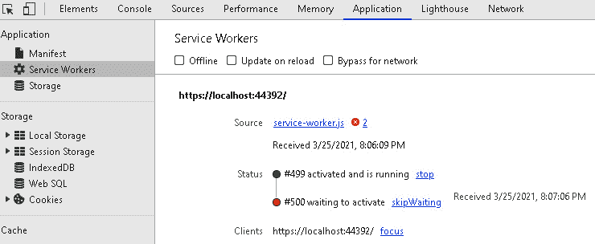

图 5.2–等待激活的服务人员

小费

在用户在所有选项卡中导航离开应用程序之前，服务人员不会被激活。重装标签是不够的。但是，您可以通过单击**技能等待**链接来激活等待激活的服务人员。

## 服务人员类型

有许多不同类型的服务工作者，从简单到复杂。下图显示了从简单到复杂排序的一些不同类型的服务人员:

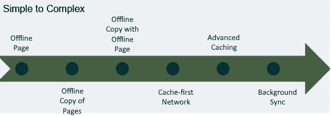

图 5.3–服务人员的类型

### 离线页面

这是创建的最简单类型的功能服务工作者。为了创建这种类型的服务人员，我们只需要一个指示应用程序离线的超文本标记语言(T2)页面。每当应用程序无法连接到网络时，我们只需显示该 HTML 页面。

### 页面的脱机副本

有了这种类型的服务人员，当我们的访问者查看页面时，我们会在缓存中存储每个页面的副本。当应用程序脱机时，它从缓存中提供页面。这种方法可能只适用于页面数量有限的应用程序，因为如果用户想要查看的页面尚未被该用户查看，则该页面将不会在缓存中，应用程序将会失败。

### 带有脱机页的脱机副本

这种类型的服务工作者是页面离线副本服务工作者的改进版本。它结合了前面两种类型的服务工作者。有了这种类型的服务人员，当我们的访问者查看它们时，我们会在缓存中存储每个页面的副本。当应用程序脱机时，它从缓存中提供页面。如果用户想要查看的页面不在缓存中，我们将显示指示应用程序脱机的 HTML 页面。

### 缓存优先网络

这种类型的服务工作者总是首先使用缓存。如果请求的页面在缓存中，它在向服务器请求页面之前服务于该页面，并用新页面更新缓存。使用这个服务工作器，我们总是在向服务器请求页面之前提供缓存中的页面版本，因此无论用户在线还是离线，都可以获得相同的数据。

小费

微软更喜欢缓存优先的网络服务工作者类型。

### 高级缓存

这种类型的服务人员是上述每种类型的组合。对于这种类型的服务工作者，我们使用不同的规则来指定要缓存的不同文件和路由。例如，一些数据，如股票价格，永远不应该被缓存，而其他不经常变化的数据应该被缓存。

### 背景同步

这是最复杂的服务工作者类型。它允许用户在脱机时继续使用应用程序添加和编辑数据。然后，当他们重新联机时，应用程序会将他们的数据与网络同步。

这不是所有可用的不同类型的服务人员的完整列表。但是，它应该让您了解服务人员的能力和灵活性以及缓存的重要性。我们列表中的所有服务人员都依赖缓存存储应用编程接口进行缓存。

# 使用缓存存储应用编程接口

**缓存存储 API** 用于缓存`request` / `response`对象对，其中`request`对象是键，`response`对象是值。它是为服务人员提供离线功能而设计的。一个`caches`对象是**缓存**的一个实例。它是位于`window`对象中的全局对象。

我们可以使用以下代码来测试它在浏览器上是否可用:

```cs
 const hasCaches = 'caches' in self;
```

一个`caches`对象用于维护一个特定网络应用的缓存列表。缓存不能与其他网络应用程序共享，并且与浏览器的 HTTP 缓存隔离。它们完全通过我们编写的 JavaScript 来管理。

以下是**缓存**的一些方法:

*   `delete(cacheName)`:此方法删除指示的缓存，返回`true`。如果没有找到指示的缓存，则返回`false`。
*   `has(cacheName)`:如果指示的缓存存在，则返回`true`，否则返回`false`。
*   `keys`:这个方法返回所有缓存名称的字符串数组。
*   `open(cacheName)`:此方法打开指示的缓存。如果它不存在，则创建它，然后打开它。

当我们打开**缓存**的实例时，会返回一个`Cache`对象。以下是`Cache`对象的一些方法:

*   `add(request)`:这个方法接受一个请求，并将结果响应添加到缓存中。
*   `addAll(requests)`:这个方法接受一个请求数组，并将所有得到的响应添加到缓存中。
*   `delete(request)`:如果能够找到并删除指示的请求，则返回`true`，否则返回`false`。
*   `keys()`:这个方法返回一个键数组。
*   `match(request)`:此方法返回与匹配请求相关联的响应。
*   `put(request, response)`: This method adds the request and response pair to the cache.

    小费

    除非我们明确要求更新，否则`Cache`对象不会更新。此外，这些对象不会过期。我们需要删除它们，因为它们已经过时了。

服务人员使用缓存存储应用编程接口来允许 PWA 在脱机时继续运行。接下来，我们将解释如何使用地理定位应用编程接口。

# 使用地理定位应用编程接口

JavaScript 的地理定位 API 为我们提供了一种获取用户位置的机制。使用地理定位应用编程接口，我们可以获得运行浏览器的设备的坐标。

地理定位应用编程接口通过`navigator.geolocation`对象访问。当我们调用`navigator.geolocation`对象时，用户的浏览器请求用户允许访问他们的位置。如果他们接受，浏览器会使用设备的定位硬件，例如智能手机上的**全球定位系统** ( **全球定位系统**)来确定其位置。

在我们尝试使用`navigator.geolocation`对象之前，我们应该验证浏览器是否支持它。以下代码测试浏览器是否支持地理定位:

```cs
if (navigator.geolocation) {
    var position = await getPositionAsync();  
} else {
    throw Error("Geolocation is not supported.");
};
```

对于本章中的项目，我们将使用`getCurrentPosition`方法来检索设备的位置。这个方法采用两个回调函数。`success`回调函数返回一个`GeolocationPosition`对象，而`error`回调函数返回一个`GeolocationPositionError`对象。如果用户拒绝我们访问他们的位置，将在`GeolocationPositionError`对象中报告。

这些是`GeolocationPosition`对象的属性:

*   `coords.latitude`:该属性返回一个双精度值，代表设备的纬度。
*   `coords.longitude`:该属性返回一个代表设备经度的双精度值。
*   `coords.accuracy`:该属性返回一个双精度值，表示纬度和经度的精度，单位为米。
*   `coords.altitude`:该属性返回一个双精度值，代表设备的高度。
*   `coords.altitudeAccuracy`:该属性返回一个双精度值，表示高度的精度，单位为米。
*   `coords.heading`:该属性返回一个 double，表示设备面对的方向，以度数表示。
*   `coords.speed`:该属性返回一个代表设备速度的 double 值，单位为米/秒。
*   `timestamp`:该属性返回响应的日期和时间。

`GeolocationPosition`对象总是返回`coords.latitude`、`coords.longitude`、`coords.accuracy`和`timestamp`属性。其他属性只有在可用时才会返回。

通过使用 JavaScript 的地理定位 API，我们可以确定设备的经纬度。我们需要这些信息，以便使用开放天气一次呼叫应用编程接口为我们的项目请求本地天气预报。

# 使用 OpenWeather 一次调用 API

本章项目的数据来源为**开放天气**提供的免费 API。它被称为开放天气一次呼叫应用编程接口([https://openweathermap.org/api/one-call-api](https://openweathermap.org/api/one-call-api))。该应用编程接口能够返回当前、预测和历史天气数据。我们将使用它来访问未来 5 天的本地预报。这是使用开放天气一次调用应用编程接口的应用编程接口调用格式:

```cs
https://api.openweathermap.org/data/2.5/onecall?lat={lat}&lon={lon}&appid={API key}
```

这些是开放天气一次呼叫应用编程接口的参数:

*   `lat`:纬度。此参数是必需的。
*   `lon`:经度。此参数是必需的。
*   `appid` : API 键。此参数是必需的。在**账户**页面的**应用编程接口键**标签下。
*   `units`:计量单位。这被设置为**标准**、**公制**或**英制**。
*   `exclude`:排除数据。这用于简化返回的数据。由于我们将只使用每日预测，我们将排除当前、分钟和小时数据，并为我们的项目发出警报。这是一个逗号分隔的列表。
*   `lang`:输出的语言。

这是来自 OpenWeather One Call API 的响应的片段:

weather.json 片段

```cs
{
  "dt": 1616436000,
  "sunrise": 1616416088,
  "sunset": 1616460020,
  "temp": {
    "day": 58.5,
    "min": 54.75,
    "max": 62.6,
    "night": 61.29,
    "eve": 61.25,
    "morn": 54.75
  },
  "feels_like": {
    "day": 49.69,
    "night": 51.91,
    "eve": 50.67,
    "morn": 47.03
  },
  "pressure": 1011,
  "humidity": 85,
  "dew_point": 54.01,
  "wind_speed": 17.83,
  "wind_deg": 168,
  "weather": [
    {
      "id": 502,
      "main": "Rain",
      "description": "heavy intensity rain",
      "icon": "10d"
    }
  ],
  "clouds": 98,
  "pop": 1,
  "rain": 27.91,
  "uvi": 2.34
},
```

在前面的【JSON 片段中，我们已经强调了我们在本章项目中使用的字段。

OpenWeather One Call API 是一个简单的 API，我们将使用它来获取给定位置的每日预报。现在，让我们快速了解一下我们将在本章中构建的项目。

# 项目概述

在本章中，我们将构建一个 Blazor WebAssembly 应用程序来显示当地的 5 天天气预报，然后将其转换为 PWA。

我们将构建的 web 应用程序使用 JavaScript 的地理定位 API 来确定设备的当前经纬度。它使用 OpenWeather One Call API 获取本地天气预报，并使用各种 Razor 组件向用户显示天气预报。在我们完成 web 应用程序后，我们将通过添加徽标、清单文件和服务人员将其转换为 PWA。最后，我们将安装、运行和卸载 PWA。

这是完整应用程序的屏幕截图:

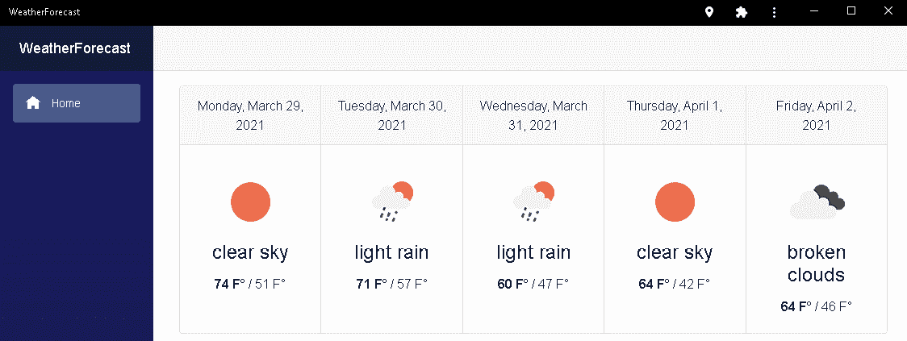

图 5.4–天气预报应用

这个项目的构建时间大约为 120 分钟。

# 创建 PWA

一个`WeatherForecast`项目将使用**空 Blazor 网络组装应用程序**项目模板创建。首先，我们将使用 JS 与地理定位 API 的互操作来获取设备的坐标。然后，我们将使用 OpenWeather One Call API 获取这些坐标的天气预报。接下来，我们将创建几个 Razor 组件来显示预测。

为了将 web 应用程序转换为 PWA，我们将添加一个徽标、一个清单文件和一个离线页面服务工作人员。在测试服务人员之后，我们将安装、运行和卸载 PWA。

## 开始项目

我们需要来创建一个新的 Blazor WebAssembly 应用程序。我们将通过以下步骤来做到这一点:

1.  打开 **Visual Studio 2019** 。
2.  点击**新建项目**按钮。
3.  In the **Search for templates** (*Alt* + *S*) textbox, enter `blazor` and hit the *Enter* key.

    以下截图显示了我们在 [*第二章*](02.html#_idTextAnchor045) *中创建的**空 Blazor WebAssembly App** 项目模板，构建您的第一个 Blazor WebAssembly 应用程序*:

    

    图 5.5–空 Blazor 网络组装应用程序项目模板

4.  选择**空 Blazor WebAssembly App** 项目模板，点击**下一步**按钮。
5.  在**项目名称**文本框中输入`WeatherForecast`，点击**创建**按钮，如下图所示:

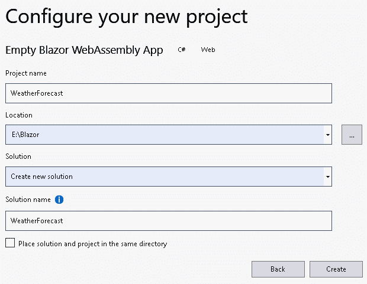

图 5.6–配置新项目对话框

小费

在前面的例子中，我们将`WeatherForecast`项目放入`E:/Blazor`文件夹中。然而，这个项目的位置并不重要。

我们现在已经创建了一个 Blazor 网络组装项目。

## 添加一个 JavaScript 函数

我们现在需要添加一个类来包含我们当前的经纬度。我们将通过以下步骤来做到这一点:

1.  右键单击`wwwroot`文件夹，从菜单中选择**添加，新文件夹**选项。
2.  命名新文件夹`scripts`。
3.  右键单击`scripts`文件夹，从菜单中选择**添加，新项目**选项。
4.  在**搜索**框中输入`javascript`。
5.  选择 **JavaScript 文件**。
6.  Name the file `bweInterop.js`.

    小费

    在本书中，我们将为我们的 JavaScript 代码使用`bweInterop`命名空间，以构建我们的代码并最小化命名冲突的风险。

7.  点击**添加**按钮。
8.  Enter the following JavaScript:

    ```cs
    var bweInterop = {};
    bweInterop.getPosition = async function () {
        function getPositionAsync() {
            return new Promise((success, error) => {
                navigator.geolocation.getCurrentPosition(success, error);
            });
        }
        if (navigator.geolocation) {
            var position = await getPositionAsync();  
            var coords = {
                latitude: position.coords.latitude,
                longitude: position.coords.longitude
            };
            return coords;
        } else {
            throw Error("Geolocation is not supported by
                         this browser.");
        };
    }
    ```

    前面的 JavaScript 代码使用地理定位应用编程接口返回设备的纬度和经度。如果不允许或不支持，则会引发错误。

9.  打开`wwwroot\index.html`文件。
10.  Add the following reference toward the bottom of the `body` element:

    ```cs
    <script src="scripts/bweInterop.js"></script>
    ```

    你应该在提到`_framework/blazor.webassembly.js`之前加上它。

我们已经创建了一个 JavaScript 函数，它使用地理定位 API 来返回我们当前的纬度和经度。接下来，我们需要从我们的 web 应用程序中调用它。

## 使用地理定位应用编程接口

我们需要从我们的网络应用程序中调用我们的`bweInterop.getPosition`功能。我们将通过以下步骤来做到这一点:

1.  右键单击`WeatherForecast`项目，从菜单中选择**添加，新文件夹**选项。
2.  命名新文件夹`Models`。
3.  右键单击`Models`文件夹，从菜单中选择**添加，类别**选项。
4.  命名新类`Position`。
5.  Add the following highlighted properties to the `Position` class:

    ```cs
    public class Position
    {
        public double Latitude { get; set; }
        public double Longitude { get; set; }
    }
    ```

    这是我们将用来存储坐标的类。

6.  打开`Pages\Index.razor`文件。
7.  Add the following markup:

    ```cs
    @using WeatherForecast.Models
    @inject IJSRuntime js
    @if (pos == null)
    {
        <p><em>@message</em></p>
    }
    else
    {
        <h2>Latitude: @pos.Latitude, Longitude: 
           @pos.Longitude </h2>
    }
    @code {
        string message = "Loading...";
        Position pos;
    }
    ```

    如果`pos`属性为`null`，则前面的标记会显示一条消息。否则，显示`pos`属性的经纬度。

8.  Add the following `OnInitializedAsync` method to the `@code` block:

    ```cs
    protected override async Task OnInitializedAsync()
    {
        try
        {
            await GetPosition();
        }
        catch (Exception)
        {
            message = "Geolocation is not supported.";
        };
    }
    ```

    前面的代码试图在页面初始化时获取我们的坐标。

9.  Add the following `GetPosition` method to the `@code` block:

    ```cs
    private async Task GetPosition()
    {
        pos = await js.InvokeAsync<Position>(
            "bweInterop.getPosition");
    }
    ```

    前面的代码使用 JS 互操作来调用我们编写的 JavaScript 函数，该函数使用地理定位 API 来返回我们的坐标。有关 JS 互操作的更多信息，请参考第 4 章 *【使用 JavaScript 互操作性构建本地存储服务】*。

10.  From the **Debug** menu, select the **Start Without Debugging** (*Ctrl* + *F5*) option to run the project.

    下面的截图是一个对话框的例子，该对话框将询问您是否允许访问您的位置:

    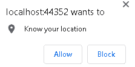

    图 5.7–地理定位权限对话框

11.  Click the **Allow** button to allow the app to have access to your location.

    以下截图为更新后的**首页**页面:

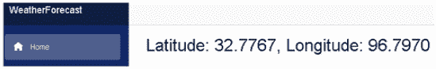

图 5.8–显示坐标的主页

您可以使用**允许的**位置访问对话框禁用应用程序访问您的位置的功能，如下图所示:

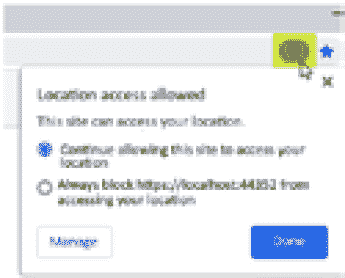

图 5.9–允许位置访问对话框

允许的**位置访问**对话框通过浏览器工具栏上突出显示的按钮进行访问。您可能想切换权限，看看这对应用程序有何影响。

小费

要更改网址访问您所在位置的权限，请从浏览器菜单中选择**设置**。然后，从**隐私和安全**区域选择**站点设置**。最后，搜索您正在使用的网址，选择它，并将**位置**字段的值更改为以下值之一:**询问**(默认)**允许**或**阻止**。

我们已经使用地理定位应用编程接口在**主页**页面上显示了我们的纬度和经度。接下来，我们需要将这些坐标提供给 OpenWeather One Call API。

## 添加预测类别

我们需要添加一个`Forecast`类来获取开放天气一呼应用编程接口的结果。我们将通过以下步骤来做到这一点:

1.  返回 **Visual Studio** 。
2.  右键单击`Models`文件夹，从菜单中选择**添加，类别**选项。
3.  命名新类`OpenWeather`。
4.  Add the following classes:

    ```cs
    public class OpenWeather
    {
        public Daily[] Daily { get; set; }
    }
    public class Daily
    {
        public long Dt { get; set; }
        public Temp Temp { get; set; }
        public Weather[] Weather { get; set; }
    }
    public class Temp
    {
        public double Min { get; set; }
        public double Max { get; set; }
    }
    public class Weather
    {
        public string Description { get; set; }
        public string Icon { get; set; }
    }
    ```

    前面的类将与开放天气一次调用应用编程接口一起使用。

## 添加每日预测组件

我们需要一个组件来显示每天的预报。我们将通过以下步骤来做到这一点:

1.  右键单击`Shared`文件夹，从菜单中选择**添加，剃刀组件**选项。
2.  命名新组件`DailyForecast`。
3.  Replace the existing markup with the following markup:

    ```cs
    <div class="card text-center">
        <div class="card-header">
            @Date
        </div>
        <div class="card-body">
            
            <h4 class="card-title">@Description</h4>
            <b>@((int)HighTemp) F&deg;</b> / 
            @((int)LowTemp) F&deg;
        </div>
    </div>
    @code {
    }
    ```

    该组件使用来自**引导**的`Card`组件显示每日预报。有关`Card`组件的更多信息，请参见[https://getbootstrap.com/docs/5.0/components/card](https://getbootstrap.com/docs/5.0/components/card)。

4.  Add the following code to the `@code` block:

    ```cs
    [Parameter] public long Seconds { get; set; }
    [Parameter] public double HighTemp { get; set; }
    [Parameter] public double LowTemp { get; set; }
    [Parameter] public string Description { get; set; }
    [Parameter] public string Icon { get; set; }
    private string Date;
    private string IconUrl;
    protected override void OnInitialized()
    {
        Date = DateTimeOffset
            .FromUnixTimeSeconds(Seconds)
            .LocalDateTime
            .ToLongDateString();
        IconUrl = String.Format(
            "https://openweathermap.org/img/wn/{0}@2x.png",
            Icon);
    }
    ```

    上述代码定义了用于显示每日天气预报的参数。`OnInitialized`方法用于格式化`Date`和`IconUrl`字段。

我们增加了一个`Razor`组件，使用 Bootstrap 的`Code`组件显示每天的天气预报。

## 使用 OpenWeather 一次调用 API

我们需要使用 OpenWeather 一键调用 API 获取天气预报。我们将通过以下步骤来做到这一点:

1.  打开`Pages\Index.razor`文件。
2.  增加以下`using`语句:

    ```cs
    @using System.Text
    ```

3.  增加以下`@inject`指令:

    ```cs
    @inject HttpClient Http
    ```

4.  将以下属性添加到`@code`块:

    ```cs
    OpenWeather forecast;
    ```

5.  Add the `GetForecast` method to the `@code` block, as follows:

    ```cs
    private async Task GetForecast()
    {
        string APIKey = "{Your_API_Key}";
        StringBuilder url = new StringBuilder();
        url.Append("https://api.openweathermap.org");
        url.Append("/data/2.5/onecall?");
        url.Append("lat=");
        url.Append(pos.Latitude);
        url.Append("&lon=");
        url.Append(pos.Longitude);
        url.Append("&exclude=");
        url.Append("current,minutely,hourly,alerts");
        url.Append("&units=imperial");
        url.Append("&appid=");
        url.Append(APIKey);
        forecast = await Http
            .GetFromJsonAsync<OpenWeather>
            (url.ToString());
    }
    ```

    前面的方法使用 OpenWeather One Call API，坐标通过`GetPosition`方法获得。

6.  Update the `OnInitializedAsync` method to call the `GetForecast` method and update the error message, like this:

    ```cs
    try
    {
        await GetPosition();
        await GetForecast();
    }
    catch (Exception)
    {
        message = "Error encountered";
    };
    ```

    前面的代码使用`GetForecast`方法填充`forecast`对象。

    重要说明

    您需要将`APIKey`字符串的值设置为从 **OpenWeather** 获得的 API 密钥。

我们已经填充了`forecast`对象。接下来，我们需要展示它。

## 显示预测

我们需要将每日预报集合添加到**主页**页面。我们将通过以下步骤来做到这一点:

1.  返回`Pages\Index.razor`文件。
2.  Replace the `@if` statement with the following markup:

    ```cs
    @if (forecast == null)
    {
        <p><em>@message</em></p>
    }
    else
    {
        <div class="card-group">
            @foreach (var item in forecast.Daily.Take(5))
            {
                <DailyForecast 
                   Seconds="@item.Dt"
                   LowTemp="@item.Temp.Min"
                   HighTemp="@item.Temp.Max"
                   Description="@item.Weather[0].Description"
                   Icon="@item.Weather[0].Icon" />
            }
        </div>
    }
    ```

    前面的标记在预测对象中循环五次。它使用`DailyForecast`组件显示每日预报。

3.  从**构建**菜单中，选择**构建解决方案**选项。
4.  返回浏览器。
5.  使用 *Ctrl* + *R* 刷新浏览器。
6.  关闭浏览器。

我们已经完成了`WeatherForecast`申请。现在，我们需要将其转换为 PWA。为此，我们需要添加一个徽标、一个清单文件和一个服务人员。

## 添加标识

我们需要添加一个图像作为应用的标志。我们将通过以下步骤来做到这一点:

1.  右键单击`wwwroot`文件夹，从菜单中选择**添加，新文件夹**选项。
2.  命名新文件夹`images`。
3.  将`Sun-512.png`图像从 GitHub 存储库复制到`images`文件夹。

清单文件中必须至少包含一个映像，才能安装 PWA。现在，我们可以添加一个清单文件。

## 添加清单文件

要将web 应用转换成 PWA，我们需要添加一个清单文件。我们将通过以下步骤来做到这一点:

1.  右键单击`wwwroot`文件夹，从菜单中选择**添加，新项目**选项。
2.  在**搜索**框中输入`json`。
3.  选择 **JSON 文件**。
4.  命名文件`manifest.json`。
5.  点击**添加**按钮。
6.  输入以下 JSON 代码:

    ```cs
    {
      "lang": "en",
      "name": "5-Day Weather Forecast",
      "short_name": "Weather",
      "display": "standalone",
      "start_url": "./",
      "background_color": "#ffa500",
      "theme_color": "transparent",
      "description": "This is a simple 5-day weather 
         forecast application.",
      "orientation": "any",
      "icons": [
        {
          "src": "img/Sun-512.png",
          "type": "img/png",
          "sizes": "512x512"
        }
      ]
    }
    ```

7.  打开`wwwroot\index.html`文件。
8.  在`head`元素的底部添加以下标记:

    ```cs
    <link href="manifest.json" rel="manifest" />
    ```

9.  Add the following markup below the preceding markup:

    ```cs
    <link rel="apple-touch-icon" 
          sizes="512x512" 
          href="Sun-512.png" />
    ```

    小费

    对于 iOS Safari 用户，您必须包含前面的链接标签，以指示它使用指示的图标，否则它将通过截图页面内容来生成图标。

我们在我们的网络应用程序中添加了一个清单文件，以控制它在安装时的外观和行为。接下来，我们需要添加一个服务人员。

## 添加简单的服务人员

要完成将 web 应用转换成 PWA，我们需要添加一个服务人员。我们将通过以下步骤来做到这一点:

1.  右键单击`wwwroot`文件夹，从菜单中选择**添加，新项目**选项。
2.  在**搜索**框中输入`html`。
3.  选择 **HTML 页面**。
4.  命名文件`offline.html`。
5.  点击**添加**按钮。
6.  向`body`元素添加以下标记:

    ```cs
    <h1>You are offline.</h1>
    ```

7.  右键单击`wwwroot`文件夹，从菜单中选择**添加，新项目**选项。
8.  在**搜索**框中输入`java`。
9.  选择 **JavaScript 文件**。
10.  命名文件`service-worker.js`。
11.  点击**添加**按钮。
12.  Add the following constants:

    ```cs
    const OFFLINE_VERSION = 1;
    const CACHE_PREFIX = 'offline';
    const CACHE_NAME = `${CACHE_PREFIX}${OFFLINE_VERSION}`;
    const OFFLINE_URL = 'offline.html';
    ```

    前面的代码设置了当前缓存的名称和我们将用来指示我们脱机的文件名。

13.  Add the following event listeners:

    ```cs
    self.addEventListener('install',
        event => event.waitUntil(onInstall(event)));
    self.addEventListener('activate',
        event => event.waitUntil(onActivate(event)));
    self.addEventListener('fetch',
        event => event.respondWith(onFetch(event)));
    ```

    前面的代码指定了用于以下每个步骤的函数:安装、激活和提取。

14.  Add the following `onInstall` function:

    ```cs
    async function onInstall(event) {
        console.info('Service worker: Install');
        const cache = await caches.open(CACHE_NAME);
        await cache.add(new Request(OFFLINE_URL));
    }
    ```

    前面的函数打开指定的缓存。如果缓存尚不存在，它会创建缓存，然后将其打开。缓存打开后，它会将指示的请求/响应对添加到缓存中。

15.  Add the following `onActivate` function:

    ```cs
    async function onActivate(event) {
        console.info('Service worker: Activate');
        const cacheKeys = await caches.keys();
        await Promise.all(cacheKeys
            .filter(key => key.startsWith(CACHE_PREFIX)
                && key !== CACHE_NAME)
            .map(key => caches.delete(key)));
    }
    ```

    前面的代码获取所有缓存的名称。所有与指定缓存名称不匹配的缓存都将被删除。

    小费

    清除过时的缓存是你的责任。每个浏览器对 web 应用程序可以使用的存储量都有限制。如果您违反了该限制，浏览器可能会删除您的所有缓存。

16.  Add the following `onFetch` function:

    ```cs
    async function onFetch(event) {
        if (event.request.method === 'GET') {
            try {
                return await fetch(event.request);
            } catch (error) {
                const cache = await 
                   caches.open(CACHE_NAME);
                return await cache.match(OFFLINE_URL);
            };
        };
    }
    ```

    在前面的代码中，如果提取失败，将打开缓存，并提供以前缓存的脱机页。

17.  打开`wwwroot\index.html`文件。
18.  在`body`元素的底部添加以下标记:

    ```cs
    <script>
       navigator.serviceWorker.register('service-worker.js');
    </script>
    ```

我们增加了一个离线页面服务人员，当 PWA 离线时将显示`offline.html`页面。

## 测试服务人员

我们需要来测试服务人员是否允许我们离线工作。我们将通过以下步骤来做到这一点:

1.  在**调试**菜单中，选择**不调试启动** ( *Ctrl* + *F5* )选项运行项目。
2.  点击 *F12* 打开**开发者工具**界面。
3.  选择**应用**选项卡。
4.  Select the **Manifest** option from the menu on the left to view the **App Manifest**.

    

    图 5.10–应用程序清单详细信息

5.  Select the **Service Workers** option from the menu on the left to view the service worker that is installed for the current client, as illustrated in the following screenshot:

    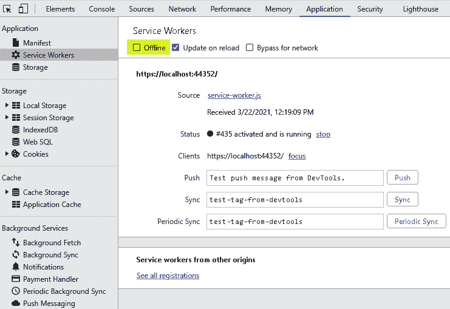

    图 5.11–服务人员对话框

    小费

    点击**查看所有注册**链接，查看安装在您设备上的所有服务人员。

6.  从左侧菜单中选择**缓存存储**选项，查看缓存。
7.  Click on the `offline1` cache to view its contents, as illustrated in the following screenshot:

    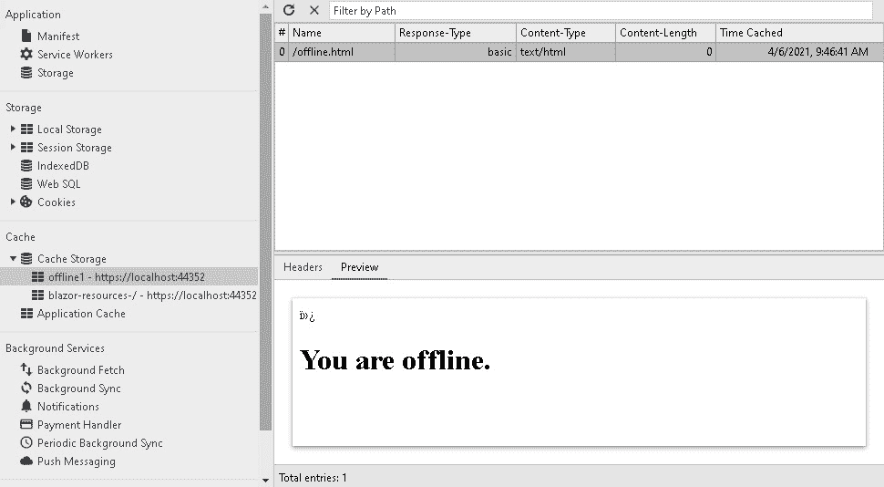

    图 5.12–缓存存储选项

8.  从左侧菜单中选择**服务人员**选项。
9.  选中**服务人员**对话框中的**离线**复选框。
10.  Refresh the browser, and you should see the following screen:

    

    图 5.13–离线页面

    显示的页面来自浏览器的缓存。

11.  取消选中**服务人员**对话框中的**离线**复选框。
12.  刷新浏览器。

我们已经测试了服务人员使我们的网络应用能够离线工作。现在，我们可以安装 PWA 了。

## 安装功率放大器

我们需要通过安装来测试 PWA。我们将通过以下步骤来做到这一点:

1.  Select the **Install 5-Day Weather Forecast** menu option from the browser's menu:

    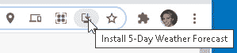

    图 5.14–安装 5 天天气预报选项

    小费

    在铬基浏览器上，**安装**按钮在网址栏上。但是，对于其他类型的浏览器，您需要从**菜单**按钮或**共享**按钮安装 PWA。

2.  Click the **Install** button on the dialog:

    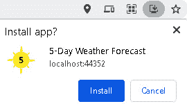

    图 5.15–安装 PWA 对话框

    安装后，PWA 会出现，但没有地址栏。它出现在我们的任务栏上，我们可以从**开始**菜单运行它。以下截图显示了安装后的 PWA:

    

    图 5.16–安装的功率放大器

3.  关闭浏览器。
4.  Click the *Windows* key and open the **5-Day Weather Forecast** app:

    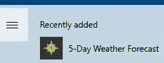

图 5.17–开始菜单上的 PWA

应用程序打开，它的图标出现在任务栏上。如果我们愿意，我们可以把它固定在任务栏上。

我们已经成功安装并运行了 PWA。卸载 PWA 和安装 PWA 一样简单。

## 卸载 PWA

我们需要卸载 PWA。我们将通过以下步骤来做到这一点:

1.  Select the **Customize and control 5-Day Weather Forecast** option from the PWA's menu:

    

    图 5.18–定制和控制 5 天天气预报选项

2.  Select the **Uninstall 5-Day Weather Forecast…** option:

    

    图 5.19–定制和控制 PWA 对话框

3.  点击**移除**按钮:


图 5.20–删除 PWA 对话框

我们已经卸载了 PWA。

# 总结

现在，您应该能够通过添加清单文件和服务人员，将 Blazor WebAssembly 应用程序转换为 PWA。

在本章中，我们介绍了 PWAs。我们解释了如何通过添加清单文件和服务人员将 web 应用程序转换为 PWA。我们解释了如何使用清单文件和服务人员。我们详细解释了不同类型的服务工作人员，并解释了如何使用缓存存储应用编程接口来缓存请求/响应对。最后，我们演示了如何使用地理定位应用编程接口和开放天气一键调用应用编程接口。

之后，我们使用**空 Blazor App** 项目模板创建了一个新项目。我们添加了一个 JavaScript 函数，它使用地理定位应用编程接口来获取我们的坐标。我们添加了一些模型来捕捉坐标，并使用 JS 互操作来调用 JavaScript 函数。我们使用 OpenWeather One Call API 来获取当地的 5 天天气预报，并创建了几个 Razor 组件来显示它。

在本章的最后一部分，我们通过添加一个图像、一个清单文件和一个离线页面服务工作器，将 Blazor WebAssembly 应用程序转换为 PWA。最后，我们安装、运行并卸载了 PWA。我们可以运用我们的新技能，将现有的网络应用程序转换为 pwa，将网络应用程序的优势与原生应用程序的外观和感觉结合起来。

在下一章中，我们将使用**依赖注入** ( **DI** )来构建购物车应用程序。

# 问题

以下问题供您考虑:

1.  服务工作者是异步的还是同步的？
2.  `localStorage`能否在服务人员内部使用，进行数据存储？
3.  服务人员可以操纵 DOM 吗？
4.  PWAs 安全吗？
5.  PWAs 是特定于平台的吗？
6.  PWA 和原生应用有什么区别？

# 进一步阅读

以下资源提供了有关本章主题的更多信息:

*   有关地理定位应用编程接口规范的更多信息，请参考[https://w3c.github.io/geolocation-api](https://w3c.github.io/geolocation-api)。
*   有关使用地理定位应用编程接口的更多信息，请参考[https://developer . Mozilla . org/en-US/docs/Web/API/Geolocation _ API](https://developer.mozilla.org/en-US/docs/Web/API/Geolocation_API)。
*   关于开放天气应用编程接口的更多信息，请参考[https://openweathermap.org/api](https://openweathermap.org/api)。
*   有关**网络应用清单**规范的更多信息，请参考[https://www.w3.org/TR/appmanifest/](https://www.w3.org/TR/appmanifest/)。
*   有关**服务人员**规格的更多信息，请参考[https://w3c.github.io/ServiceWorker](https://w3c.github.io/ServiceWorker)。
*   有关使用缓存应用编程接口**、**的更多信息，请参考[。](https://developer.mozilla.org/en-US/docs/Web/API/CacheStorage)
*   有关服务人员的更多示例，请参考位于[https://developers.google.com/web/tools/workbox](https://developers.google.com/web/tools/workbox)的*工作箱*网站。
*   关于微软 **PWABuilder** 的更多信息，请参考[https://www.pwabuilder.com](https://www.pwabuilder.com)。