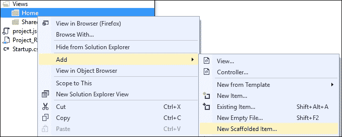
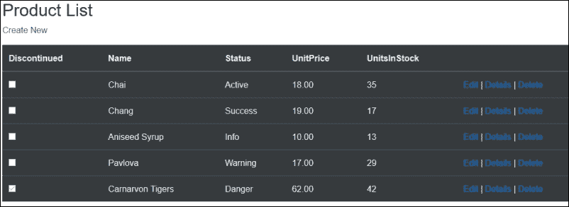
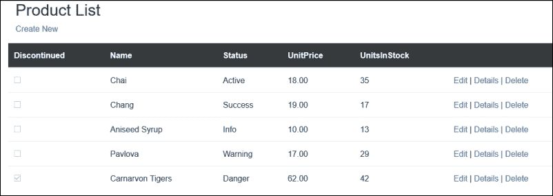
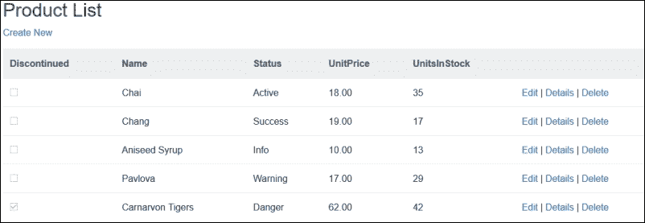
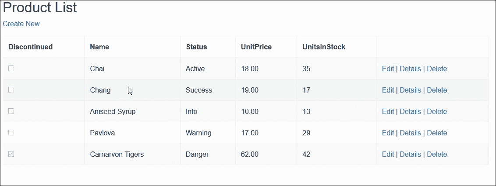
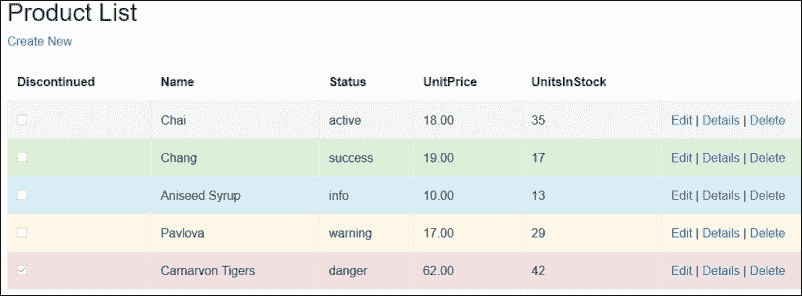
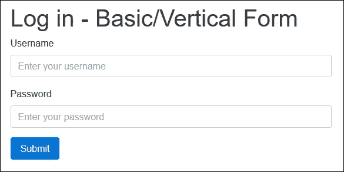
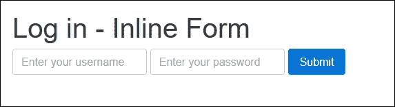
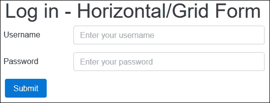

# 第二章。使用引导 CSS 和 HTML 元素

Bootstrap 提供了广泛的 HTML 元素和 CSS 类，以及一个高级网格系统来帮助布局您的网页设计。这些类和元素包括帮助排版、代码格式化、表格和表单布局的实用程序。

所有 CSS 类和 HTML 元素与移动优先的流体网格系统相结合，使开发人员能够快速轻松地构建直观的网络界面，而不必担心实现较小设备屏幕响应和用户界面元素样式的具体细节。

在本章中，我们将涵盖以下主题:

*   自举网格系统
*   引导表和按钮
*   布局不同的引导表
*   启用 ASP.NET MVC 脚手架模板
*   在引导中使用映像，并将映像配置为响应

# 自举网格系统

2015 年，谷歌表示“在包括美国和日本在内的 10 个国家中，在移动设备上进行的谷歌搜索比在计算机上进行的要多”。这意味着用移动设备浏览你网站的人可能比传统台式电脑多。

Bootstrap 网格系统是移动优先的，这意味着它被设计为针对具有较小显示器的设备，然后随着显示器尺寸的增加而增长。它使用 12 列布局，每个媒体查询范围有不同的层。

## 引导网格组件

将 Bootstrap 网格系统想象成类似于传统的 HTML 表。它主要由三个部分组成:

*   容器
*   行
*   列

### 容器

使用引导网格系统需要容器，容器用于包装和居中页面内容，并为布局指定适当的宽度。顾名思义，它充当网格行和列的容器，是一个标准的`<div>`元素，类名为`.container`，表示固定宽度，或者`.container-fluid`表示全宽度。例如:

```cs
<div class="container"></div> 

```

固定宽度`.container`类名将在每个响应断点处改变元素的**最大宽度**，而`.container-fluid`类名将始终将元素宽度设置为 100%。

### 行

考虑到 Bootstrap 网格系统，保持表的相似性，行类似于表中的行。每行最多可包含 12 列，并且只允许列包含内容。一行是一个简单的`<div>`元素，类名为`.row`，在一个`<div>`元素中有一个`.container`类名或`.container-fluid`。容器中一个简单行的示例如下所示:

```cs
<div class="container"> 
    <div class="row"> 
    </div> 
</div> 

```

### 列

引导网格中的列用于将一行划分为已定义的部分，一行不能超过 12 列。色谱柱尺寸有五层，用于根据设备的屏幕尺寸调整尺寸:

*   特大号
*   大型
*   中等
*   小的
*   特别小

这五层用于创建响应断点，该断点又用于指定不同设备大小的布局。下表解释了不同的层:

<colgroup><col> <col> <col></colgroup> 
| **类名** | **设备类型** | **最小宽度** |
| `col-xs-*` | 纵向电话 | < 34 em |
| `col-sm-*` | 风景中的手机 | 34 em |
| `col-md-*` | 药片 | 48 em |
| `Col-lg-*` | 桌面 | 62 em |
| `Col-xl-*` | 高分辨率桌面 | 75 em |

如前所述，Bootstrap 行可以分为 12 列。布局网页时，请记住所有列的总和应为 12。为了说明这一点，请考虑以下 HTML:

```cs
<div class="container"> 
    <div class="row"> 
    <div class="col-md-3" style="background-color:green;"> 
            <h3>green</h3> 
        </div> 
        <div class="col-md-6" style="background-color:red;"> 
            <h3>red</h3> 
        </div> 
        <div class="col-md-3" style="background-color:blue;"> 
            <h3>blue</h3> 
        </div> 
    </div> 
</div> 

```

在前面的代码中，我们有一个容器`<div>`元素和一个子行`<div>`元素。行 div 又有三列。您会注意到其中两列的类名为`.col-md-3`，一列的类名为`.col-md-6` **。**加起来就是 12。

前面的代码将在所有中型和更高的设备上运行良好。为了在分辨率较小的设备上保留前面的布局，您需要组合各种 CSS 网格类。例如，要让我们的布局在平板电脑、手机、中型和大型桌面显示器上工作，请将 HTML 更改为以下内容:

```cs
<div class="container"> 
    <div class="row"> 
    <div class="col-xs-3 col-sm-3 col-md-3 col-lg-3"    
     style="background-color:green;"> 
            <h3>green</h3> 
        </div> 
        <div class="col-xs-6 col-sm-6 col-md-6 col-lg-6"           
         style="background-color:red;"> 
            <h3>red</h3> 
        </div> 
        <div class="col-xs-3 col-sm-3 col-md-3 col-lg-3"           
         style="background-color:blue;"> 
            <h3>blue</h3> 
        </div> 
    </div> 
</div> 

```

通过在`div`元素中添加`.col-xs-*`和`.col-sm-*`类名，我们将确保我们的布局在各种设备分辨率下都是一样的。

# 引导 HTML 元素

Bootstrap 提供了一系列不同的 HTML 元素，这些元素已经设计好并可以使用。这些要素包括:

*   桌子
*   小跟班
*   形式
*   形象

## 引导表

Bootstrap 为 HTML 表格提供了默认样式，并提供了一些自定义其布局和行为的选项。当生成**列表**视图时，默认的 ASP.NET MVC 框架会自动将`.table`类名添加到表格元素中。

### 启用 MVC 框架

在前一章中，我们创建了一个空的 ASP.NET Core项目。为了启用内置的 Visual Studio 脚手架，因为新的 ASP。NET 的方法是只添加您需要的依赖项，我们必须通过完成以下任务手动将所需的依赖项添加到项目中:

1.  在 Visual Studio 中打开您在[第 1 章](01.html "Chapter 1. Getting Started with ASP.NET Core and Bootstrap 4")、*ASP.NET Core和引导 4* 中创建的项目。
2.  在项目的根文件夹中找到`project.json`文件，双击它进行编辑。
3.  将以下依赖项添加或更新到文件内部的依赖项数组中:

    ```cs
            "Microsoft.AspNetCore.Mvc": "1.0.0", 
            "Microsoft.AspNetCore.StaticFiles": "1.0.0", 
            "Microsoft.AspNetCore.Razor.Tools": { 
              "version": "1.0.0-preview2-final", 
              "type": "build" 
             }, 
            "Microsoft.VisualStudio.Web.CodeGeneration.Tools": { 
              "version": "1.0.0-preview2-final", 
              "type": "build" 
             }, 
            "Microsoft.VisualStudio.Web.CodeGenerators.Mvc": { 
             "version": "1.0.0-preview2-final", 
             "type": "build" 
             } 

    ```

4.  接下来，将以下内容添加到`project.json`文件中的工具阵列中:

    ```cs
             "Microsoft.VisualStudio.Web.CodeGeneration.Tools": { 
                "version": "1.0.0-preview2-final", 
                "imports": [ 
                 "portable-net45+win8" 
                  ] 
                } 

    ```

5.  The added dependencies and tools will enable the MVC-specific scaffolding templates to Visual Studio. If successful, you should see a **New Scaffolded Item...** entry in the **Add** context menu of the Visual Studio Solution Explorer. Here is a screenshot to illustrate the new menu item:

    

### 搭建 MVC 列表视图页面

要构建自动包含引导表的 MVC 视图，请执行以下步骤:

1.  在项目中创建新文件夹`Models`。
2.  在项目的`Models`文件夹中创建一个名为`ProductModel.cs`的新视图模型类。这个类将包含六个属性，其代码如下:

    ```cs
            public class ProductModel 
            {public int Id { get; set; } 
            public string Name { get; set; } 
            public decimal UnitPrice { get; set; } 
            public int UnitsInStock { get; set; } 
            public bool Discontinued { get; set; } 
            public string Status { get; set; } 
            } 

    ```

3.  接下来，添加一个新的空`ProductsController`，并且只给它添加一个动作结果，称为`Index`。控制器的文件名应该是`ProductsController.cs`，并且应该在`Controllers`文件夹中创建。该类的代码如下:

    ```cs
            public class ProductsController : Controller 
            { 
                public IActionResult Index() 
             { 
                 var model = new List<ProductModel>(); 
                 var product1 = new ProductModel { Name = "Chai", 
                 UnitPrice = 18, UnitsInStock = 35, Discontinued = false,
                 Id = 1, Status = "active" }; 
                 var product2 = new ProductModel { Name = "Chang",
                 UnitPrice =19, UnitsInStock = 17, Discontinued = false,
                 Id = 2, Status = "success" }; 
                 var product3 = new ProductModel { Name = "Aniseed Syrup", 
                 UnitPrice = 10, UnitsInStock = 13, Discontinued = false,
                 Id = 3, Status = "info" }; 
                 var product4 = new ProductModel { Name = "Pavlova",
                 UnitPrice =17, UnitsInStock = 29, Discontinued = false,
                 Id = 4, Status = "warning" }; 
                 var product5 = new ProductModel { Name = "Carnarvon Tigers",
                 UnitPrice = 62, UnitsInStock = 42, Discontinued = true,
                 Id = 5, Status = "danger" }; 
                 model.AddRange(new[] { product1, product2, product3, product4, 
                 product5 });  
                 return View(model); 
              } 
            } 

    ```

前面的代码初始化了一个新的**列表**对象，称为`model`，包含`ProductViewModel`类的集合。使用样本产品数据创建了五个新的`ProductViewModel`对象，然后将其添加到`model`列表中。`model`名单随后被传递给了视图。

### 类型

不要对为 MVC 启用脚手架所花费的工作量感到沮丧。这些步骤仅在创建空的 ASP.NET 项目时需要。默认的 MVC 项目模板将自动添加所有必需的代码配置和依赖项。但是，请记住，在编写本文时，默认的 MVC 项目仍然使用 Bootstrap 3。

要构建包含引导表的视图，引导表包含我们在`Index`操作中创建的产品列表，请完成以下步骤:

1.  在项目的`Views`文件夹中创建新的子文件夹`Products`。
2.  右键单击新添加的`Products`文件夹，选择**添加|查看...**。
3.  In the **Add** | **View...** dialog windows, set the following field values as shown in the following screenshot:

    

4.  单击**添加**按钮，Visual Studio 将构建一个包含引导表的视图，该引导表的列标题包含`ProductModel`类的属性名称。
5.  默认的 ASP.NET MVC 框架将生成一个基本的`<table>`元素，类名为`.table`。我们将通过添加**表格标题元素** ( `<thead>`)来更改默认生成的标记，该元素将用于定义表格的列标题。
6.  该元素后面将跟随一个**表体元素** ( `<tbody>`)。表体元素将包含实际的行数据。生成的标记如下所示:

    ```cs
            <table class="table"> 
                <thead> 
                    <tr> 
                      <th> 
                        @Html.DisplayNameFor(model => model.Discontinued) 
                      </th> 
                      <th> 
                        @Html.DisplayNameFor(model => model.Name) 
                      </th> 
                      <th> 
                        @Html.DisplayNameFor(model => model.Status) 
                      </th> 
                      <th> 
                        @Html.DisplayNameFor(model => model.UnitPrice) 
                      </th> 
                      <th> 
                        @Html.DisplayNameFor(model => model.UnitsInStock) 
                      </th> 
                      <th></th> 
                    </tr> 
                 </thead> 
                 <tbody> 
                    @foreach (var item in Model) 
                     { 
                      <tr> 
                       <td> 
                        @Html.DisplayFor(modelItem => item.Discontinued) 
                       </td> 
                        <td> 
                          @Html.DisplayFor(modelItem => item.Name) 
                        </td> 
                        <td> 
                          @Html.DisplayFor(modelItem => item.Status) 
                        </td> 
                        <td> 
                          @Html.DisplayFor(modelItem => item.UnitPrice) 
                        </td> 
                        <td> 
                          @Html.DisplayFor(modelItem => item.UnitsInStock) 
                        </td> 
                        <td> 
                      <a asp-action="Edit" asp-route-id="@item.Id">Edit</a> | 
                      <a asp-action="Details" asp-route-id="@item.Id">Details</a> | 
                      <a asp-action="Delete" asp-route-id="@item.Id">Delete</a> 
                        </td> 
                        </tr> 
                     } 
                </tbody> 
            </table> 

    ```

在前面的标记中，注意`<table>`元素的类名被设置为`table`。当您运行项目并导航到产品控制器时(例如，打开此视图)，您的表应该使用 Bootstrap 表样式进行样式设置，如下图所示:


### 设置引导表的样式

Bootstrap 提供了额外的类，通过这些类，您可以将表设置为所需的外观。要反转表格的颜色，只需将`<table>`元素的类名更改为`.table table-inverse`。例如，下面的表元素`<table class="table table-inverse">`，将产生下面的表:



您还可以选择将表格标题`<thead>`元素的外观更改为更亮或更暗的颜色。将`<thead>`元素的类别更改为`.thead-inverse`将导致标题使用当前 Bootstrap 主题的反色(在默认 Bootstrap 样式的情况下，颜色更深)。



要将 Bootstrap 主题的默认颜色用于表格标题，只需将`<thead>`元素的类名设置为`.thead-default`，这将导致表格的标题使用 Bootstrap 主题的默认颜色，在默认 Bootstrap 主题的情况下，该颜色为浅灰色，如下所示:



要创建带边框的表格，请将`.table-bordered`添加到其类名中，例如:

```cs
<table class="table table-bordered"> 

```

要创建一个表格，其中每一个奇数行用不同于基本颜色的另一种颜色突出显示，请将表格的类名更改为`.table table-striped`，如下所示:

```cs
<table class="table table-striped"> 

```

最后，引导还为您提供了在表上启用悬停状态的选项。这意味着用户将光标悬停在其上的行将被突出显示。为此，将表类更改为`.table table-hover`，例如:

```cs
<table class="table table-hover"> 

```

可以将所有不同的类名组合起来，创建一个带有悬停的斑马纹带边框的表，如以下标记所示:

```cs
<table class="table table-striped table-bordered table-hover"> 

```

在您的浏览器中，结果将类似于以下内容:



### 类型

您可以在[http://v4-alpha.getbootstrap.com/content/tables/](http://v4-alpha.getbootstrap.com/content/tables/)阅读更多关于 Bootstrap 表的信息。

### 引导上下文表类

Bootstrap 提供了额外的类，您可以使用这些类来设置表的行或单元格的样式。将下列类名之一添加到 HTML 表格的`<td>`或`<tr>`元素中，会以灰色、绿色、蓝色、橙色或红色突出显示它。这些颜色分别代表以下内容:

*   `.table-active`
*   `.table-success`
*   `.table-info`
*   `.table-warning`
*   `.table-danger`

当然，您也可以将这些样式动态地应用到您的 MVC 视图中。`ProductModel`类有一个`Status`属性，它可能是五个上下文引导类之一。通过将`<tr>`元素的类设置为该属性，可以根据行的数据动态更改表中行的颜色，如以下标记所示:

```cs
<tbody> 
    @foreach (var item in Model) 
    { 
        <tr class="table-@item.Status"> 
            <td> 
                @Html.DisplayFor(modelItem => item.Discontinued) 
            </td> 
            <td> 
                @Html.DisplayFor(modelItem => item.Name) 
            </td> 
            <td> 
                @Html.DisplayFor(modelItem => item.Status) 
            </td> 
            <td> 
                @Html.DisplayFor(modelItem => item.UnitPrice) 
            </td> 
            <td> 
                @Html.DisplayFor(modelItem => item.UnitsInStock) 
            </td> 
            <td> 
               <a asp-action="Edit" asp-route-id="@item.Id">Edit</a> | 
               <a asp-action="Details" asp-route-id="@item.Id">Details</a> | 
               <a asp-action="Delete" asp-route-id="@item.Id">Delete</a> 
            </td> 
        </tr> 
    } 
</tbody> 

```

在前面的代码中，您会注意到表行的类被设置为`table-@item.status`。这将根据我们为`status`属性指定的映射突出显示行，如下图所示:



### 反应灵敏且更小的桌子

要创建单元格填充减半的较小表格，请将`<table>`元素的类设置为`.table table-sm`，如以下代码片段所示:

```cs
<table class="table table-sm"> 

```

要将表格更改为在小型设备上水平滚动的响应表格，请将`<table>`元素的类别设置为`.table table-responsive`，例如:

```cs
<table class="table table-responsive"> 

```

这种变化仅在分辨率小于 768 像素的设备上可见，但在更大的显示器上看不到差异。

## 引导按钮

Bootstrap 提供了各种颜色和尺寸的按钮。核心按钮有五种颜色和四种尺寸可供选择。按钮的颜色和大小是使用其`class`属性应用的。以下是用于设置按钮大小的类别列表:

*   `btn btn-default btn-xs`
*   `btn btn-default btn-sm`
*   `btn btn-default`
*   `btn btn-default btn-lg`

要创建从极小到大的四个白色/默认按钮，您需要实现以下 HTML 标记:

```cs
<div class="row"> 
    <!-- Standard button --> 
    <button type="button" class="btn btn-default btn-xs">Default Extra Small</button> 
    <button type="button" class="btn btn-default btn-sm">Default Small</button> 
    <button type="button" class="btn btn-default">Default</button> 
    <button type="button" class="btn btn-default btn-lg">Default Large</button> 
</div> 

```

按钮颜色也由类名指定。以下是可用颜色类别名称的列表:

*   `btn-default`
*   `btn-primary`
*   `btn-success`
*   `btn-info`
*   `btn-warning`

按钮的范围如下图所示:


### 轮廓按钮

Bootstrap 4 引入了一种新的按钮样式，称为轮廓按钮。要将其应用于按钮，只需将`.btn-*-outline`类添加到`<button>`元素中。例如，下面的代码创建了一个主(蓝色)轮廓按钮:

```cs
<button type="button" class="btn btn-primary-outline">Primary</button> 

```

上述代码将生成以下引导按钮:


# 表单布局和元素

表单构成了大多数业务应用的一大部分，因此，对 web 应用中的所有表单应用统一的样式不仅在视觉上令人愉悦，而且还为用户提供了更友好的界面。Bootstrap 提供了一系列 CSS 样式，使您能够创建视觉上吸引人的表单。

## 垂直/基本形式

Bootstrap 中的基本表单总是以垂直方式显示其内容，这意味着表单`<input>`元素的标签显示在它们的上方。使用 Bootstrap 4，`<fieldset>`元素没有任何边框、填充或边距，通过将`<fieldset>`元素的类设置为，它们可以用于将输入分组。`form-group`。表单元素也可以通过将它们放在类别为`.form-group`的`<div>`元素中进行分组。

在接下来的 HTML 标记中，将使用新的 ASP.NET Core标签助手创建一个包含两个引导表单输入元素和一个提交按钮的 HTML 表单。请注意，创建了两个表单组，一个使用`<fieldset>`元素，另一个使用`<div>`元素:

```cs
<div class="container"> 

    <form asp-controller="Account" asp-action="Login" method="post"> 

        <fieldset class="form-group"> 
            <label asp-for="Username">Username</label> 
            <input asp-for="Username" class="form-control" placeholder=
             "Enter your username"/> 
        </fieldset> 

        <div class="form-group"> 
            <label asp-for="Password">Password</label> 
            <input asp-for="Password" class="form-control" placeholder=
             "Enter your password"/> 
        </div> 
        <button type="submit" class="btn btn-primary">Submit</button> 

    </form> 

</div> 

```

该表单在您的浏览器中看起来像下面的屏幕截图:



## 内嵌表单

内联窗体是其元素相互对齐的窗体。内联表单仅适用于视口宽度大于或等于 768 像素的设备。为了让屏幕阅读器能够阅读您的表单，最好总是包含表单元素的标签。

如果您希望隐藏表单元素的标签，请将其标签的类别设置为`.sr-only`。在下面的代码中，我们将使用登录表单并将其`<form>`元素的类设置为。`form-inline`。还要注意标签不可见，因为它们的`.sr-only class`名称:

```cs
<div class="container"> 

    <h1>Log in - Basic/Vertical Form</h1> 

    <form asp-controller="Account" asp-action="Login" method="post"> 

        <fieldset class="form-group"> 
            <label asp-for="Username">Username</label> 
            <input asp-for="Username" class="form-control" placeholder=
             "Enter your username"/> 
        </fieldset> 

        <div class="form-group"> 
            <label asp-for="Password">Password</label> 
            <input asp-for="Password" class="form-control" placeholder=
             "Enter your password"/> 
        </div> 
        <button type="submit" class="btn btn-primary">Submit</button> 

    </form> 

</div> 

```

这将在浏览器中呈现以下表单:



## 基于网格的表单

如果您需要对引导表单的布局进行更多控制，可以使用预定义的网格类。使用 Bootstrap 3，如果你想创建一个水平表单，你应该给`<form>`标记一个类名。形式-水平。为了创建一个水平的 Bootstrap 4 表单，您需要将`.row`类添加到`.form-group<div>` 或`<fieldset>`元素中，并使用`.col-*`类名来指定表单控件和标签大小。

若要垂直对齐表单组件的标签，请将标签的类别设置为`.form-control-label`。在下面的代码中，与之前相同的登录表单被创建为水平对齐的表单:

```cs
<div class="container"> 

    <h1>Log in - Horizontal/Grid Form</h1> 

    <form asp-controller="Account" asp-action="Login" method="post"> 

        <fieldset class="form-group row"> 
            <label asp-for="Username" class="col-sm-3 form-control-label">
             Username</label> 
            <div class="col-sm-9"> 
                <input asp-for="Username" class="form-control" 
                 placeholder="Enter your username" /> 
            </div> 
        </fieldset> 

        <div class="form-group row"> 
            <label asp-for="Password" class="col-sm-3 form-control-label">
             Password</label> 
            <div class="col-sm-9"> 
                <input asp-for="Password" class="form-control" 
                 placeholder="Enter your password" /> 
            </div> 
        </div> 
        <button type="submit" class="btn btn-primary">Submit</button> 

    </form> 

</div> 

```

生成的 HTML 表单看起来类似于下面的截图:



# 引导映像

通过将图像的类别属性设置为`.img-fluid`，可以使图像具有响应性。这将通过将图像的最大宽度设置为 100%并将高度设置为自动来相对于其父元素缩放图像。

您还可以选择用圆角、圆形或外边框来塑造图像。这是通过将``元素的类设置为以下 Bootstrap 类之一来实现的:

*   `img-rounded`
*   `img-circle`
*   `img-thumbnail`

在下图中，我们显示了员工列表及其图片。员工列表可以从数据库中检索并传递给视图:


实现上述结果的代码如下，可以在本章附带的示例项目中查看:

```cs
@model IEnumerable<Chapter2.Models.EmployeeViewModel> 
<div class="container"> 
    <h2>Employees</h2> 

    <div class="row"> 
        @foreach (var item in Model) 
        { 
            <div class="col-md-4"> 
                 
                <h3> 
                    @item.Name<small> @item.JobTitle</small> 
                </h3> 
                <p>@item.About</p> 
            </div> 
        } 
    </div> 

</div> 

```

在前面的代码中，我们遍历了模型中的每个雇员项，并使用`Id`属性作为文件名呈现了一个``元素。每个``元素的类属性被设置为。`img-circle`把图像画成圆形。

# 自举数字

如果需要显示带有标题的图像或内容，可以使用`<figure>`元素。`<figure>`元素是 HTML5 规范的一部分，并不特定于 Bootstrap 4。然而，Bootstrap 4 确实提供了一些帮助类来适当地设置`<figure>`元素的样式。

例如，下面的 HTML 标记将创建一个包含图像和标题的`<figure>`元素:

```cs
<div class="row"> 
    <div class="col-md-12"> 
        <figure class="figure"> 
             
            <figcaption class="figure-caption"> 
                This is a public domain image, available from 
            <code>http://publicdomainarchive.com</code> 
            </figcaption> 
        </figure> 
    </div> 
</div> 

```

浏览器中上述标记的结果将类似于下面的屏幕截图:


# 总结

在本章中，您已经探索了如何使用 Bootstrap 网格和表单类来布局各种元素。您还看到了如何启用 MVC 框架，以及如何在我们的项目中加入响应性的 Bootstrap 图像和图形。

在下一章中，您将发现各种 Bootstrap 组件，包括 Bootstrap 导航栏、输入组、进度条和警报，以及如何在您的 ASP.NET MVC 项目中实现它们。