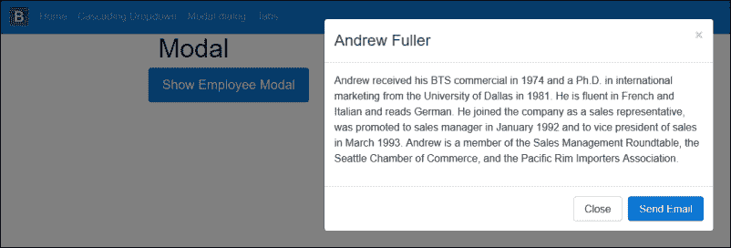
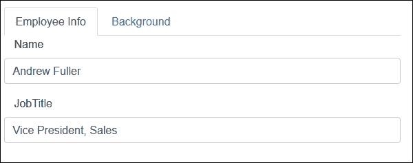
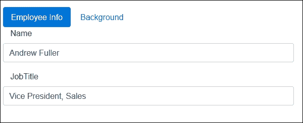
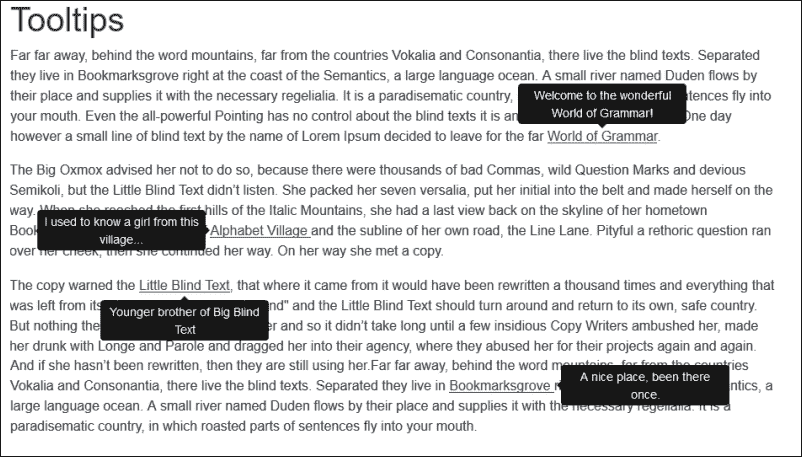
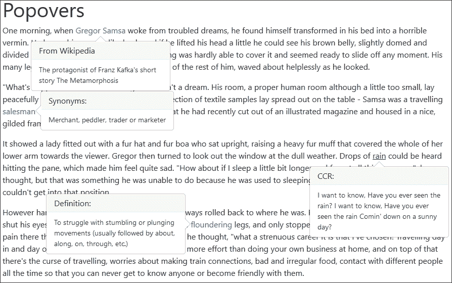
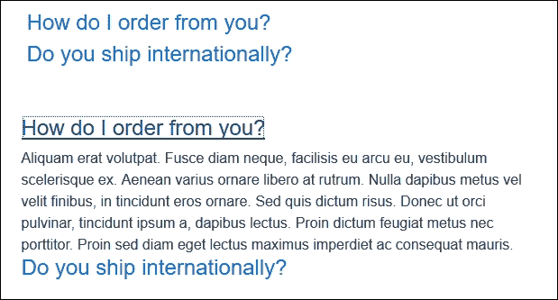

# 第四章。使用引导 JavaScript 组件

Bootstrap 的 JavaScript 特性都建立在 jQuery 库的基础上，要么提供全新的功能，要么扩展现有 Bootstrap 组件的功能。

插件可以通过简单地向页面元素添加数据属性来使用，但是如果需要，它们也可以提供丰富的编程 API。

在本章中，我们将涵盖以下主题:

*   使用下拉菜单并创建级联下拉菜单
*   如何使用模态对话框
*   用选项卡分隔视图中的内容
*   如何实现工具提示和弹出窗口
*   如何使用手风琴组件
*   使用旋转木马创建幻灯片

# 数据属性与编程应用编程接口

Bootstrap 提供了完全通过 HTML 标记使用插件的能力。这意味着为了使用大多数插件，您不需要编写一行 JavaScript。使用数据属性是推荐的方法，并且应该是使用引导插件时的首选。

例如，要让一个`alert`元素成为`dismissible`，您将向一个`button`或`anchor`元素添加`data-dismiss="alert"`属性，如以下代码所示:

```cs
<div class="alert alert-danger"> 
    <button data-dismiss="alert" class="close" type="button">×</button> 
    <strong>Warning</strong> Shuttle launch in t-minus 10 seconds. 
</div> 

```

您还可以选择通过 JavaScript 使用编程 API 执行相同的操作。以下代码使用 jQuery 在用户点击按钮时关闭特定的`alert`元素:

```cs
<button class="close" type="button" onclick="$('#myalert').alert('close')">×</button> 

```

### 类型

为了使用引导插件，您需要在项目中包含`bootstrap.js`或`bootstrap.min.js`文件。这个文件包含所有的引导插件，但是如果你不打算在你的项目中使用每个插件，你可以选择下载一个定制的版本。在撰写本文时，这些包括重新启动、仅网格和 Flexbox 构建。

# 级联下拉

您可以使用`dropdown`插件将`drop-down`菜单添加到几乎任何引导组件中。级联 `drop-down`菜单是一个`drop-down`菜单，根据在另一个`drop-down`菜单中选择的值更新其数据。要添加级联`drop-down`菜单，请执行以下步骤:

1.  在 Visual Studio 中，将名为`DropdownController.cs`的新控制器添加到您的`Controllers`文件夹中。
2.  在`Index`操作中，添加以下代码，该代码将创建一个经理列表，并加载所选经理的报告员工列表:

    ```cs
            public IActionResult Index(int id = 2) 
            { 
                var managers = new List<EmployeeModel>(); 
                var vicePresident = new EmployeeModel { Id = 2, Name = "Andrew 
                Fuller", JobTitle = "Vice President, Sales", ReportsTo = null }; 
                var salesManager = new EmployeeModel { Id = 5, Name = 
                "Steven Buchanan", JobTitle = "Sales Manager", ReportsTo = null }; 
                managers.Add(vicePresident); 
                managers.Add(salesManager); 

                ViewBag.Managers = managers; 
                var model = GetEmployees(id); 
                return View(model); 
            } 

    ```

3.  `GetEmployees`方法只返回一个`EmployeeModel`及其下属员工的子集合。方法代码如下:

    ```cs
            private EmployeeModel GetEmployees(int id = 2) 
            { 
                if (id == 2) 
                { 
                    var vicePresident = new EmployeeModel { Id = 2, Name = 
                    "Andrew Fuller", JobTitle = "Vice President, Sales", 
                    ReportsTo = null }; 
                    var vicePresidentEmployees = new List<EmployeeModel> 
                    { 
                        new EmployeeModel { Id = 1, Name = "Nancy Davolio",
                        JobTitle = "Sales Representative", ReportsTo = 2}, 
                        new EmployeeModel { Id = 3, Name = "Janet Leverling",                      JobTitle = "Sales Representative", ReportsTo = 2 }, 
                        new EmployeeModel { Id = 4, Name = "Laura Callahan",                      JobTitle = "Inside Sales Coordinator", ReportsTo = 2 } 
                    }; 
                    vicePresident.ReportingEmployees = vicePresidentEmployees; 
                    return vicePresident; 
                } 

                var salesManager = new EmployeeModel { Id = 5, Name =
                "Steven Buchanan", JobTitle = "Sales Manager", ReportsTo = null }; 
                var salesManagerEmployees = new List<EmployeeModel> 
                { 
                    new EmployeeModel { Id = 1, Name = "Michael Suyama",
                    JobTitle = "Sales Representative", ReportsTo = 5 }, 
                    new EmployeeModel { Id = 3, Name = "Robert King", 
                    JobTitle = "Sales Representative", ReportsTo = 5 },
                    new EmployeeModel { Id = 4, Name = "Anne Dodsworth", 
                    JobTitle = "Inside Sales Coordinator", ReportsTo = 5 } 
                }; 
                salesManager.ReportingEmployees = salesManagerEmployees; 

                return salesManager; 
            } 

    ```

4.  接下来，在`Views\Dropdown`文件夹中添加一个名为`Index.cshtml`的新视图。
5.  视图将只包含两个引导`drop-down`按钮。一个显示经理列表，另一个显示经理的下属员工列表。经理列表将通过`ViewBag`对象传递，员工列表将从传递到视图的模型中读取。视图的 HTML 标记如下:

    ```cs
            <div class="container"> 
              <h1 id="heading">Cascading dropdown</h1> 
                <form> 
                 <div class="form-group row"> 
                    <label class="col-sm-2 form-control-label">Manager</label> 
                      <div class="col-sm-10"> 
                        <div class="btn-group"> 
                          <button type="button" class="btn btn-danger"         
                           id="selectedManager">@Model.Name</button> 
                          <button type="button" class="btn btn-danger dropdown-                        toggle" data-toggle="dropdown" aria-haspopup="true" 
                           aria-expanded="false"> 
                            <span class="sr-only">Toggle Dropdown</span> 
                          </button> 
                          <div class="dropdown-menu" id="managerlist"> 
                            @foreach (var manager in ViewBag.Managers) 
                            { 
                                <a class="dropdown-item" href="#"         
                                data-id="@manager.Id">@manager.Name</a> 
                            } 
                        </div> 
                    </div> 
                </div> 
            </div> 
            <div class="form-group row"> 
                <label class="col-sm-2 form-control-label">Employee</label> 
                <div class="col-sm-10"> 
                    <div class="btn-group"> 
                        <button type="button" class="btn btn-primary">
                         Select Employee</button> 
                        <button type="button" class="btn btn-primary dropdown-                      toggle" data-toggle="dropdown" aria-haspopup="true"                       aria-expanded="false"> 
                            <span class="sr-only">Toggle Dropdown</span> 
                        </button> 
                        <div class="dropdown-menu" id="employees"> 
                            @foreach (var employee in Model.ReportingEmployees) 
                            { 
                                <a class="dropdown-item" href="#"
                                 data-id="@employee.Id">@employee.Name</a> 
                            } 
                        </div> 
                    </div> 
                </div> 
            </div> 
        </form> 
    </div> 

    ```

6.  为了用所选经理的报告员工列表更新员工的`dropdown`按钮，您需要在页面中添加以下 JavaScript:

    ```cs
            <script type="text/javascript"> 
                $('#managerlist a').on('click', function () { 
                    var $this = $(this); 
                    var managerId = $this.data('id'); 
                    $("#selectedManager").text($this.text()); 

                    $.ajax({ 
                        type: 'GET', 
                        dataType: 'html', 
                        url: '@Url.Action("GetReportingEmployees", "Dropdown")', 
                        data: { id: managerId } 
                    }).done(function (data) { 
                        $('#employees').replaceWith(data); 
                    }); 
                }); 
            </script> 

    ```

7.  前面的 JavaScript 将通过其`data-id`属性获取所选管理器的 ID 值。接下来，它将对`Dropdown`控制器中的`GetReportingEmployees`动作进行 AJAX 调用。
8.  The `GetReportingEmployees` method in the `Dropdown` controller will return a partial view result containing the list of reporting employees. The code for the method is as follows:

    ```cs
            public PartialViewResult GetReportingEmployees(int id) 
            { 
                var model = GetEmployees(id); 
                return PartialView("_employees", model.ReportingEmployees); 
            } 

    ```

    ### 注

    部分视图使您能够在另一个视图或父视图中呈现内容或子视图。

9.  您需要在名为`_employees.cshtml`的`Views\Dropdown`文件夹中添加一个新的局部视图，以使前面的代码生效。视图的 HTML 标记如下所示:

    ```cs
            @model IEnumerable<Chapter4.Models.EmployeeModel>
             <div class="dropdown-menu" id="employees">
             @foreach (var employee in Model)
             {
              <a class="dropdown-item" href="#"         
              data-id="@employee.Id">@employee.Name</a>
             }
             </div>
    ```

10.  前面的 HTML/Razor 标记在员工列表中循环，通过模型传入，并用数据创建一个新的`dropdown`按钮。

前面步骤的结果应该是类似于下面屏幕截图的视图:


# 模态对话框

模式用于提供弹出对话框样式元素，该元素可用于向用户提供信息，甚至允许用户在模式内完成表单。Bootstrap 模式本质上由三部分组成:页眉、正文和页脚。您可以将任何标准的 HTML 标记放在模态的`body`元素中，包括标准文本甚至是嵌入的 YouTube 视频。

一般来说，始终将模态标记放在视图内部的顶层位置，视图的顶部或底部是放置模态标记的最佳位置。

为了在点击按钮时显示模式，您可以设置引导按钮的`data-toggle`和`data-target`属性。例如，在下面的 HTML 标记中，按钮的`data-toggle`属性被设置为模式，其`data-target`属性被设置为`employeeModal`:

```cs
<div class="row"> 
    <button type="button" class="btn btn-primary btn-lg" data-toggle=
        "modal" data-target="#employeeModal"> 
        Show Employee Modal 
    </button> 
</div> 

```

`data-target`属性应该包含模态`<div>`元素的标识。包含模态的`<div>`元素应该有一个`modal`类名:

```cs
<div class="modal fade" id="employeeModal" tabindex="-1" role="dialog" aria-labelledby="Employee Information" aria-hidden="true"> 
    <div class="modal-dialog" role="document"> 
        <div class="modal-content"> 
            <div class="modal-header"> 
                <button type="button" class="close" data-dismiss=
                 "modal" aria-label="Close"> 
                    <span aria-hidden="true">&times;</span> 
                </button> 
                <h4 class="modal-title">Andrew Fuller</h4> 
            </div> 
            <div class="modal-body"> 
                <p> 
                    Andrew received his BTS commercial in 1974 and a Ph.D. in international marketing from the University of Dallas in 1981\. 
                    He is fluent in French and Italian and reads German. He joined the company as a sales representative, was promoted to sales 
                    manager in January 1992 and to vice president of sales in March 1993\. Andrew is a member of the Sales Management Roundtable, 
                    the Seattle Chamber of Commerce, and the Pacific Rim Importers Association. 
                </p> 
            </div> 
            <div class="modal-footer"> 
                <button type="button" class="btn btn-secondary" data-dismiss="modal">Close</button> 
                <button type="button" class="btn btn-primary">Send Email</button> 
            </div> 
        </div> 
    </div> 
</div> 

```

前面的 HTML 标记的结果应该类似于下面的截图:



## 模态大小和动画

引导模式有三种标准大小。如果您想要大模态或小模态，请将`.modal-lg`或`.modal-sm`类名添加到带有`.modal-dialog`类的`<div>`元素中，如下图所示:

```cs
<div class="modal-dialog modal-lg"> 
<div class="modal-dialog modal-sm"> 

```

默认情况下，模式在页面上显示时具有淡入过渡效果。这是通过将`.fade`类名添加到带有`.modal`类名的`<div>`元素中来实现的。这里有一个例子:

```cs
<div class="modal fade" role="dialog" > 

```

如果你想显示模态而不是淡入页面，只需删除`.fade`类名。

# 标签

选项卡提供了一个选项，可以将内容拆分为不同的页面。当您有一个特别大的表单想要拆分成一个逻辑分组时，这是一个理想的组件。例如，当您编辑员工的记录时，您可能希望从他们的背景历史中分离出他们的基本信息，如下图所示:



引导标签分为两部分。首先需要指定用户点击标签时要显示的标签名称和对应`<div>`元素的 ID。这是通过创建一个标准的无序列表`<ul>`元素来完成的，其中标签名作为子列表项`<li>`。`<ul>`元素的类必须设置为`nav nav-tabs`或`nav nav-pills`，如以下 HTML 标记所示:

```cs
<ul class="nav nav-tabs" role="tablist"> 
    <li class="nav-item"> 
        <a class="nav-link active" data-toggle="tab" href="#info" 
         role="tab">Employee Info</a> 
    </li> 
    <li class="nav-item"> 
        <a class="nav-link" data-toggle="tab" href="#background"
         role="tab">Background</a> 
    </li> 
</ul> 

```

您可以通过将`<li>`元素的`data-toggle`属性设置为`tab`或`pill`并将`<ul>`元素的类别设置为`nav-pills`来使用选项卡或药丸导航。这里有一个例子:

```cs
<ul class="nav nav-pills" role="tablist"> 

```

在您的浏览器中，结果将如下图所示:



要指定选项卡的内容，创建一个新的`<div>`元素，并将其类别设置为`.tab-content`。在父级`<div>`元素中为每个标签创建一个`<div>`元素，并将每个标签的`<div>`元素的类设置为。`tab-pane`如下:

```cs
<div class="tab-content"> 
    <div class="tab-pane active" id="info" role="tabpanel"> 
        <fieldset class="form-group"> 
            <label asp-for="Name" class="col-md-2 control-label"></label> 
            <input asp-for="Name" class="form-control" /> 
        </fieldset> 
        <fieldset class="form-group"> 
            <label asp-for="JobTitle" class="col-md-2 control-label"></label> 
            <input asp-for="JobTitle" class="form-control" /> 
        </fieldset> 
    </div> 
    <div class="tab-pane" id="background" role="tabpanel"> 
        <textarea asp-for="About" rows="3" class="form-control"></textarea> 
    </div> 
</div> 

```

在前面的标记中，我们创建了两个选项卡，并通过将其类设置为`.active`将`active`选项卡设置为`info`选项卡。

您也可以使用 jQuery 激活特定的页面。要在页面加载后立即激活`background`选项卡，请使用以下代码:

```cs
$(document).ready(function () { 
    $('.nav-tabs a[href="#background"]').tab('show'); 
}); 

```

# 工具提示

Bootstrap 的工具提示插件是 Jason Frame 的`jQuery.tipsy`插件的更新版本。工具提示可用于为用户提供关于页面上特定内容的附加信息标签，或者提供对表单元素中预期输入的洞察。

Bootstrap 4 使用第三方`tether`库进行定位。您必须包括系绳库，以便在引导程序 4 中使用工具提示。要安装和使用 Tether 库，请完成以下步骤:

1.  打开`bower.json`文件，该文件位于项目的根文件夹中。如果在 Visual Studio 解决方案资源管理器中没有看到该文件，请单击解决方案资源管理器工具栏上的**显示所有文件**按钮。
2.  在`bower.json`文件中，将以下内容添加到依赖项列表中:

    ```cs
            "tether": "1.1.1" 

    ```

3.  Visual Studio 应该开始将`tether`库下载到项目中的`wwwroot\lib\tether`文件夹。
4.  接下来，要在您的站点页面上包含`Tether`库，请打开项目的`_Layout.cshtml`文件，该文件位于`Views\Shared`文件夹中，并在包含`bootstrap.js`脚本的行之前添加以下突出显示的行:

    ```cs
            <script src="~/lib/jquery/dist/jquery.js"></script> 
            <script src="~/lib/tether/dist/js/tether.js"></script> 
            <script src="~/lib/bootstrap/dist/js/bootstrap.js"></script> 

    ```

5.  要在任何元素上使用`tooltip`，向其添加`data-toggle="tooltip"`属性。您可以通过将`data-placement`属性设置为以下值之一来指定`tooltip`的位置:`top`、`bottom`、`left`和`right`。
6.  最后，设置`data-original-title`属性的值，以指定应该在`tooltip`内部显示什么文本。
7.  `tooltips`的一个警告是，由于性能问题，`data-`应用编程接口是选择加入的，这意味着您必须手动初始化插件。为此，请将以下 JavaScript 添加到您的页面中:

    ```cs
            $(function () { 
                $('[data-toggle="tooltip"]').tooltip(); 
            }) 

    ```

8.  The preceding code finds all elements whose `data-toggle` attribute is set to `tooltip` and initializes the tooltip plugin for these elements. The result will look similar to the following screenshot in your browser:

    

# 波波弗斯

弹出窗口类似于工具提示，因为它们可以为用户提供关于元素的附加信息，但是它们旨在显示更多的内容，因为弹出窗口还允许您显示标题。

弹出窗口的定义方式类似于弹出窗口，通过向元素添加`data-toggle`、`data-placement`、`data-content`和`title`属性。当用户点击锚点`<a>`元素时，以下标记会显示一个弹出窗口:

```cs
<a data-content="The protagonist of Franz Kafka's short story The Metamorphosis" data-placement="bottom"  data-toggle="popover" href="#" >Gregor Samsa</a> 

```

将`data-toggle`属性设置为`popover`指定插件需要显示弹出窗口。`data-content`属性包含将在弹出窗口中显示的内容，`data-original-title`属性设置弹出窗口的标题。`data-placement`属性指示弹出窗口的位置，支持四个值，即`top`、`bottom`、`left`和`right`。

您也可以通过设置`data-trigger`属性的值来指定显示弹出窗口的触发器。当用户单击或悬停在元素上时，或者当元素有焦点时，可以触发弹出窗口。您还可以指定应该手动激活触发器。`data-trigger`属性的四个选项是`click`、`hover`、`focus`和`manual`。

和工具提示一样，`data-`应用编程接口是一个选择加入，所以你需要手动初始化 popover 插件。在下面的代码中，使用 jQuery，我们将在一个页面上找到所有属性设置为`popover`的元素，并为每个元素初始化 popover 插件:

```cs
$(function () { 
    $('[data-toggle="popover"]').popover(); 
}); 

```

popover 插件将在您的浏览器中显示类似于以下屏幕截图的内容:



# 手风琴/折叠组件

手风琴组件最出名的可能是常见问题页面，或者需要将大量内容分解成可管理部分的页面。手风琴由许多面板组组成。每个面板组又有一个标题和正文元素。

折叠效果是通过使用引导折叠插件创建的，该插件允许您使用 JavaScript 切换页面中的内容。

要在我们的项目中使用手风琴组件，请执行以下步骤:

1.  为了允许面板在用户点击标题时折叠，我们需要在面板标题元素内的锚点`<a>`元素中添加一个`data-toggle`属性，并将其值设置为折叠。
2.  我们还需要通过将`data-parent`属性的值设置为父面板组的 ID 来指定面板的父元素。接下来，将`anchor`元素的`href`属性设置为包含内容的`<div>`元素的标识。
3.  最后，我们还需要将面板主体元素的类设置为`.panel-collapse collapse`。在下面的代码中，我们将创建一个包含两个面板组的折叠组件。第一个面板组将在页面加载时自动可见，因为我们将它的类别设置为`.panel-collapse collapse in`，如下所示:

    ```cs
            <div class="row">         
             <div id="accordion" role="tablist" aria-multiselectable="true"> 
              <div class="panel panel-default"> 
               <div class="panel-heading" role="tab" id="headingOne"> 
                <h4 class="panel-title"> 
                 <a data-toggle="collapse" data-parent= "#accordion" 
                 href="#collapseOne" aria-expanded="true" 
                 aria-controls="collapseOne"> 
                  How do I order from you? 
                  </a> 
                  </h4> 
                  </div> 
                  <div id="collapseOne" class="panel-collapse collapse in"
                  role="tabpanel" aria-labelledby="headingOne"> 
                  Aliquam erat volutpat. Fusce diam neque, facilisis eu arcu               eu, vestibulum scelerisque ex. Aenean varius ornare libero at               rutrum. Nulla dapibus metus vel velit finibus, in tincidunt eros
                 ornare. Sed quis dictum risus. Donec ut orci pulvinar, tincidunt 
                 ipsum a, dapibus lectus. Proin dictum feugiat metus nec 
                 porttitor. Proin sed diam eget lectus maximus imperdiet ac 
                 consequat mauris.  
                  </div> 
                </div> 
                <div class="panel panel-default"> 
                  <div class="panel-heading" role="tab" id="headingTwo"> 
                    <h4 class="panel-title"> 
                      <a class="collapsed" data-toggle="collapse"                 
                       data-parent="#accordion" href="#collapseTwo"         
                       aria-expanded="false" aria-controls="collapseTwo"> 
                        Do you ship internationally? 
                      </a> 
                     </h4> 
                    </div> 
                 <div id="collapseTwo" class="panel-collapse collapse"
                  role="tabpanel" aria-labelledby="headingTwo"> 
                  Fusce tortor massa, ullamcorper sit amet ligula non, suscipit
                  eleifend nisi. Aenean dolor purus, rhoncus a ante nec, tempor                dapibus ex. Morbi nec pulvinar urna. Maecenas mollis consectetur 
                  leo, at ullamcorper elit fermentum vel. Donec arcu neque, varius 
                  quis nibh nec, aliquet elementum lacus. Interdum et malesuada 
                  fames ac ante ipsum primis in faucibus. Vestibulum et rhoncus
                  nisl. Mauris egestas posuere elit nec varius.  
                  </div> 
                 </div> 
              </div> 
            </div> 

    ```

手风琴看起来应该类似于以下图像，其中显示了折叠的手风琴和展开的手风琴:



# 转盘组件

转盘组件是一个用户界面元素，您将在许多网站上看到它。它本质上是一个循环播放不同元素的幻灯片，通常是图像。转盘组件应该包含在类名称为`carousel`的`<div>`元素和值为`carousel`的`data-ride`属性中。要在项目中使用转盘组件，请执行以下步骤:

1.  转盘组件由有序列表元素`<ol>`组成，该元素在浏览器中呈现为小圆圈，并指示当前活动的幻灯片。该元素的标记如下:

    ```cs
            <ol class="carousel-indicators"> 
                <li data-target="#carousel" data-slide-to="0" 
                class="active"></li> 
                <li data-target="#carousel" data-slide-to="1"></li> 
                <li data-target="#carousel" data-slide-to="2"></li> 
            </ol> 

    ```

2.  接下来，需要创建另一个类名为`carousel-inner`的`<div>`元素。该元素将包含实际的幻灯片及其内容。以下标记用一张幻灯片创建了这样一个元素:

    ```cs
            <div class="carousel-inner" role="listbox"> 
                <div class="carousel-item active"> 
                     
                </div> 
                <div class="carousel-item"> 
                     
                </div> 
                <div class="carousel-item"> 
                     
                </div> 
            </div> 

    ```

3.  最后，要在转盘的两侧添加箭头，以向用户指示他们可以导航到下一张幻灯片，请向父`<div>`元素添加以下标记:

    ```cs
            <a class="left carousel-control" href="#carousel" role="button"                 data-slide="prev"> 
                <span class="icon-prev" aria-hidden="true"></span> 
                <span class="sr-only">Previous</span> 
            </a> 
            <a class="right carousel-control" href="#carousel" role="button"           data-slide="next"> 
                <span class="icon-next" aria-hidden="true"></span> 
                <span class="sr-only">Next</span> 
            </a> 

    ```

4.  每张幻灯片应显示的持续时间可通过`data-interval`属性设置。在下面的标记中，我们将幻灯片之间的间隔设置为`10`秒:

    ```cs
            <div id="carousel" class="carousel slide" data-ride="carousel" 
            data-interval="10000"> 

    ```

5.  与所有其他插件一样，您也可以选择初始化插件并使用 JavaScript 设置其选项。在下面的代码中，我们将初始化转盘并将幻灯片之间的间隔设置为`10`秒:

    ```cs
            $(function () { 
                $('#carousel').carousel({ 
                    interval: 10000 
                }); 
            }); 

    ```

6.  You also have an option to add a caption to each slide in the carousel by adding a `<div>` element with a class name of `.carousel-caption` to the `.carousel-item` element, as illustrated in the following code:

    ```cs
            <div class="carousel-item"> 
                
                 <div class="carousel-caption"> 
                     <h3>A rainy day</h3> 
                       <p>Rain against a windscreen.</p> 
                  </div> 
             </div>
    ```

    请看下面的截图:

    

# 总结

在本章中，我们研究了各种 Bootstrap JavaScript 插件，如何初始化它们，以及如何使用`data-` API 或编程 JavaScript 方法设置它们的选项。

在下一章中，我们将探讨如何创建自己的 ASP.NET MVC 助手和标签助手，以减少创建大量引导元素和组件时必须编写的 HTML 标记的数量。