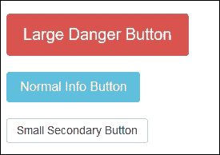
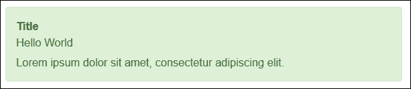

# 五、创建 MVC Bootstrap助手和标签助手

ASP.NET Core允许开发人员通过创建静态或扩展方法来创建他们自己的 HTML 助手方法。本质上，HTML 帮助器只是一个返回 HTML 字符串的方法。

HTML 助手使您能够在多个页面上使用相同的公共标记块，并使页面中的代码和标记更容易阅读和维护。这促进了可重用代码的使用，开发人员也可以对他们的助手方法进行单元测试。

ASP.NET Core还引入了一个新的概念，叫做**标签助手**，其目的类似于 **HTML 助手**。标签助手不是传统的 HTML 助手的替代品，而是为开发人员提供了一种生成更清晰的 HTML 标记的替代方法。

在本章中，我们将涵盖以下主题:

*   内置的 ASP.NET Core HTML 和标签助手概述
*   使用静态方法创建 HTML 助手
*   使用扩展方法创建 HTML 帮助器
*   创建自关闭助手
*   创建标签助手

# 内置 HTML 助手

`HtmlHelper`是一种在视图中呈现 HTML 内容的方法。它旨在允许开发人员跨多个页面重用一个公共的 HTML 标记块。

ASP.NET MVC 提供了一系列标准的、现成的 HTML 助手。例如，要为具有标识和名称属性`CustomerName`的文本框生成 HTML，请使用以下代码:

```cs
<input type="text" name="CustomerName" id="CustomerName"> 

```

您应该使用`TextBox`助手，如图所示:

```cs
@Html.TextBox("CustomerName") 

```

大多数内置的 HTML 助手都提供了几个重载版本。例如，要创建一个文本框并显式设置其名称和值属性，您应该使用以下重载的`TextBox`助手方法:

```cs
@Html.TextBox("CustomerName"","Northwind Traders") 

```

大多数内置助手还提供了为通过传入匿名类型生成的元素指定 HTML 属性的选项。在下面的示例中，我们将创建一个文本框，并使用重载方法之一设置其`style`属性:

```cs
@Html.TextBox("CustomerName","Northwind Traders", new { style="background-color:Blue;" }) 

```

### 类型

你可以从[http://bit.ly/MVCFormHelpers](http://bit.ly/MVCFormHelpers)阅读更多关于 ASP.NET MVC 中可用的标准 HTML 助手。

# 内置标签助手

标签助手是 ASP.NET MVC 核心引入的一个新特性；它们的目的类似于 HTML 助手，但它们提供了传统 HTML 助手的替代语法。目前，ASP.NET MVC 核心提供了一系列内置的标签助手；例如，对于一个标识为`CustomerName`且名称属性为`CustomerName`的文本框，请考虑以下 HTML:

```cs
<input type="text" name="CustomerName" id="CustomerName" class="form-control"> 

```

要使用标记帮助器和通过模型传递给视图的数据生成前面的 HTML 标记，可以使用以下内容:

```cs
<input asp-for="CustomerName" class="form-control" /> 

```

正如您所看到的，标记助手提供了更清晰的语法，也将使设计者更容易理解页面标记，而不必知道任何 Razor 语法。

### 类型

您可以在[http://bit.ly/TagHelpers](http://bit.ly/TagHelpers)了解更多关于标签助手的信息。

# 【HTML 帮助器和标签帮助器的区别

标签助手被附加到您的 Razor 视图中的 HTML 元素上，可以帮助您编写比传统的 HTML 助手更清晰、更容易阅读的标记。另一方面，HTML 助手是作为在 Razor 视图中与 HTML 混合的方法调用的。

Visual Studio 在编写 HTML 助手时还提供了最低限度的智能感知支持，因为 HTML 助手方法的参数都是字符串。例如，在下面的代码中，`LabelFor`和`TextBoxFor` HTML Helper 方法用于为模型属性创建标签和文本框:

```cs
<div class="form-group"> 
    @Html.LabelFor(m => m.Email, new { @class = "col-md-2 control-label" }) 
    <div class="col-md-10"> 
        @Html.TextBoxFor(m => m.Email, new { @class = "form-control" }) 
    </div> 
</div> 

```

因为类在 C#中是一个保留字，所以在前面的代码中您会注意到，为了给标签和文本框指定一个 CSS 类名，您必须追加`@`符号。对于熟悉 HTML、CSS 和 JavaScript，但不熟悉 C#或 Razor 的前端设计人员来说，代码将非常难以阅读和解释。

另一方面，Visual Studio 的智能感知为标记助手编写所有标记。例如，前面显示的相同代码可以使用标记助手以下列方式编写:

```cs
<div class="form-group"> 
    <label asp-for="Email" class="col-md-2 control-label"></label> 
    <div class="col-md-10"> 
        <input asp-for="Email" class="form-control" />         
    </div> 
</div> 

```

前面的标记很容易被前端设计者读取，因为它使用了一个标准的 HTML 元素，但是元素包含`asp-`属性。尽管`asp-`属性仍然使用字符串作为它们的值，但是 Visual Studio 使用智能感知来帮助编写标签助手的所有标记。

# 使用静态方法创建 HTML 助手

在 ASP.NET MVC 中创建一个助手最简单的方法是`@helper`指令。不幸的是，`@helper`指令从新的 ASP.NET MVC 核心中删除了，因为它对其他 Razor 特性施加了太多的限制。

幸运的是，通过完成以下步骤，我们仍然能够使用静态方法创建一个 HTML 帮助器:

1.  在项目的根文件夹中创建一个名为`Helpers`的新文件夹。
2.  在此文件夹中添加一个名为`Enums.cs`的新类。这个文件将包含我们项目的所有枚举器。
3.  将以下代码添加到`Enums.cs`文件中:

    ```cs
            public class Enums 
            { 
                public enum ButtonStyle 
                { 
                    Default, 
                    Primary, 
                    Secondary, 
                    Success, 
                    Info, 
                    Warning, 
                    Danger 
                } 

                public enum ButtonSize 
                { 
                    Large, 
                    Small, 
                    ExtraSmall, 
                    Normal 
                } 
            } 

    ```

4.  在`Helpers`文件夹中创建新的静态类`ButtonHelper.cs`。
5.  向`ButtonHelper`类添加一个名为`Button`的方法，并向其中添加以下代码:

    ```cs
            public static HtmlString Button(string caption, Enums.ButtonStyle 
            style, Enums.ButtonSize size) 
            { 
                if (size != Enums.ButtonSize.Normal) 
                { 
                    return new HtmlString( 
                        $"<button type="button" class=
                      "btn btn-{style.ToString().ToLower()} 
                       btn-{ToBootstrapSize(size)}">{caption}</button>"); 
                } 
                return new HtmlString( 
                    $"<button type="button" class="btn 
                    btn-{style.ToString().ToLower()}">{caption}</button>"); 
            }
    ```

6.  最后，添加另一个名为`ToBootstrapSize`的方法:

    ```cs
            private static string ToBootstrapSize(Enums.ButtonSize size) 
            { 
                string bootstrapSize = string.Empty; 
                switch (size) 
                { 
                    case Enums.ButtonSize.Large: 
                        bootstrapSize = "lg"; 
                        break; 

                    case Enums.ButtonSize.Small: 
                        bootstrapSize = "sm"; 
                        break; 

                    case Enums.ButtonSize.ExtraSmall: 
                        bootstrapSize = "xs"; 
                        break; 
                } 
                return bootstrapSize; 
            } 

    ```

我们之前创建的`Button`方法接受三个参数来设置按钮的标题、大小和样式。我们使用了在`Enums.cs`文件中声明的枚举值来列出按钮的可用大小和样式，这使得开发人员不必为每个按钮记住精确的Bootstrap类名。

`Button`方法返回一个`HtmlString`对象，表示一个 HTML 编码的字符串，不需要再次编码。如果我们简单地返回一个普通的字符串对象，实际的 HTML 将在视图中呈现，而不是按钮。

`ToBootstrapSize`方法基本上将`ButtonSize`值转换为代表按钮大小的有效 Bootstrap 类名。

## 在视图中使用静态方法助手

为了使用我们之前创建的静态方法帮助器，请打开您打算在其中使用它的视图，并向其中添加以下 Razor 标记:

```cs
<div class="row"> 
    @ButtonHelper.Button("Large Danger Button", Enums.ButtonStyle.Danger, Enums.ButtonSize.Large) 
</div> 
<div class="row"> 
    @ButtonHelper.Button("Normal Info Button", Enums.ButtonStyle.Info, Enums.ButtonSize.Normal) 
</div> 
<div class="row"> 
    @ButtonHelper.Button("Small Secondary Button", Enums.ButtonStyle.Secondary, Enums.ButtonSize.Small) 
</div> 

```

结果将类似于下面的截图:



# 使用扩展方法创建助手

如果我们希望我们的助手以类似于内置的 ASP.NET MVC HTML 助手的方式工作，我们需要创建一个扩展方法。扩展方法是一种用于向现有类添加新方法的技术。

### 注

扩展方法是向现有类添加附加功能的非常强大和直观的方法，可以在许多方面帮助您。您可以在[http://bit.ly/ExtMethods](http://bit.ly/ExtMethods)上阅读更多关于 MSDN 扩展方法的信息。

我们将通过完成以下步骤来创建`HtmlHelper`类的扩展方法，该类由视图的 HTML 属性表示:

1.  首先，在项目根目录的`Helpers`文件夹中添加一个名为`ButtonExtensions.cs`的新类文件。
2.  将类别类型更改为`static`。扩展方法需要在静态类中声明。
3.  向类中添加一个名为`BootstrapButton`的新方法。方法的第一个参数指示扩展扩展了哪个类，并且必须在前面加上`this`关键字。
4.  其余参数将用于指定按钮的标题、样式和大小。该方法的代码如下:

    ```cs
            public static IHtmlContent BootstrapButton(this IHtmlHelper helper, 
            string caption, Enums.ButtonStyle style, Enums.ButtonSize size) 
            { 
                if (size != Enums.ButtonSize.Normal) 
                { 
                    return new HtmlString(string.Format("<button type="button" 
                    class="btn btn-{0} btn-{1}">{2}</button>",         
                    style.ToString().ToLower(), ToBootstrapSize(size), caption)); 
                } 
                return new HtmlString(string.Format("<button type="button" 
                class="btn btn-{0}">{1}</button>", style.ToString().ToLower(), 
                caption)); 
             } 

    ```

`BootstrapButton`方法与我们之前创建的`ButtonHelper`类中的`Button`方法相同，除了它是`IHtmlHelper`接口的扩展。

## 在视图中使用扩展方法助手

由于`BootstrapButton`方法是一种扩展方法，使用它需要打开视图并向其中添加以下标记:

```cs
@using Chapter5.Helpers 
<div class="row"> 
    @Html.BootstrapButton("My Button", Enums.ButtonStyle.Info, Enums.ButtonSize.Normal) 
</div> 

```

请注意，我们正在使用标准的 HTML Helper 来调用`BootstrapButton`方法。

# 创建自关闭助手

自关闭助手是可以包含 HTML 和 Razor 标记的助手。内置的`@Html.BeginForm()`帮助器就是这种帮助器类型的一个例子。

为了创建这种类型的 HTML Helper，我们需要创建一个实现`IDisposable`接口的 Helper 类。使用`IDisposable`接口，我们可以在处置对象时编写元素的结束标记。

Bootstrap `Alert`组件是这种助手的一个很好的候选。要创建助手，我们必须完成以下步骤:

1.  在项目的`Helpers`文件夹中创建一个名为`Alerts`的新子文件夹。
2.  打开`Enums.cs`文件，添加一个名为`AlertStyle`的新项目:

    ```cs
            public enum AlertStyle 
            { 
                Default, 
                Primary, 
                Success, 
                Info, 
                Warning, 
                Danger 
            } 

    ```

3.  在`Alerts`文件夹中添加一个名为`Alert.cs`的新类文件。
4.  向名为`_writer` :

    ```cs
            private readonly TextWriter _writer; 

    ```

    的类中添加一个新的私有只读`TextWriter`对象字段
5.  为`Alert`类创建一个接受三个参数的构造函数。第一个是对`IHtmlHelper`界面的引用，第二个指定提醒的标题，第三个表示提醒的样式。
6.  将以下代码添加到`Alert`类的构造方法中:

    ```cs
            public Alert(IHtmlHelper helper, string title, 
            Enums.AlertStyle style = Enums.AlertStyle.Success) 
            { 
                _writer = helper.ViewContext.Writer; 
                var alertDiv = new TagBuilder("div"); 
                alertDiv.AddCssClass("alert"); 
                alertDiv.AddCssClass("alert-" + style.ToString().ToLower()); 
                alertDiv.Attributes.Add("role", "alert"); 
                alertDiv.TagRenderMode = TagRenderMode.StartTag; 
                var strong = new TagBuilder("strong"); 
                strong.InnerHtml.Append(title); 
                string html = ToString(alertDiv) + ToString(strong); 
                _writer.Write(html); 
            } 

    ```

在这段代码中，我们将`_writer`字段设置为`IHtmlHelper`界面的`ViewContext`属性的`Writer`属性。通过利用这个属性，我们将能够向当前视图写入 HTML。

然后，我们使用`TagBuilder`对象构建`alert`元素的 HTML 标记，最后，将结果发送到`_writer`对象进行输出。请注意，为了将`TagBuilder`输出到字符串，我们使用了一个名为`ToString`的方法。`ToString`方法的代码如下:

```cs
public static string ToString(Microsoft.AspNetCore.Html.IHtmlContent content) 
{ 
    var writer = new System.IO.StringWriter(); 
    content.WriteTo(writer, System.Text.Encodings.Web.HtmlEncoder.Default); 
    return writer.ToString(); 
} 

```

类名为`alert`的`<div>`元素将在`Alert`类的`Dispose`方法中关闭，该方法通过以下方式实现:

```cs
public void Dispose() 
{ 
    _writer.Write("</div>"); 
} 

```

接下来，在`Helpers\Alerts`文件夹中添加一个名为`AlertHelper.cs`的新文件。

```cs
Add the following code to the AlertHelper class: 
public static class AlertHelper 
{ 
    public static Alert Alert(this IHtmlHelper html, string title, Enums.AlertStyle style = Enums.AlertStyle.Success) 
    { 
        return new Alert(html, title, style); 
    } 
} 

```

## 在视图中使用自动关闭辅助工具

为了使用我们之前在视图中创建的助手，我们将使用 C# `using`关键字。`using`关键字限制了对象的范围，并且与`IDisposable`界面配合良好。本质上，一旦助手完成了它的 HTML 输出渲染，`Dispose`方法将被自动调用，从而关闭最后一个`<div>`元素标签。

要在视图中使用帮助器，请使用以下标记:

```cs
@using Chapter5.Helpers.Alerts 
<div class="row"> 
    @using (Html.Alert("Title", Enums.AlertStyle.Success)) 
    { 
        <p>Hello World</p> 
        <p>Lorem ipsum dolor sit amet, consectetur adipiscing elit.</p> 
    } 
</div> 

```

助手将生成所需的 HTML，以便在浏览器中显示以下面板:



# 创建Bootstrap按钮标签帮助器

标签助手是 ASP.NET MVC 核心的新成员，可以用来生成 HTML 标记。标记助手的语法类似于传统的 HTML 元素，但仍在服务器上处理。

虽然传统的 HTML 帮助器仍然可用，但是标记帮助器是一种替代语法，如果不是替代语法的话。

要创建将生成Bootstrap按钮的自定义标记助手，请完成以下步骤:

1.  将名为`TagHelpers`的新文件夹添加到您的项目中。
2.  在`TagHelpers`文件夹中创建新类`BootstrapButtonTagHelper`。
3.  将`BootstrapButtonTagHelper`改为从`TagHelper`类继承，该类是`Microsoft.AspNetCore.Razor.TagHelpers`包的内置类。
4.  为了使用`TagHelper`类，在`BootstrapButtonTagHelper`类的顶部添加以下内容:

    ```cs
            using Microsoft.AspNetCore.Razor.TagHelpers; 

    ```

5.  接下来，向类中添加两个名为`Color`和`Style`的属性。这两个属性的数据类型将被设置为两个名为`BootstrapColor`和`BootstrapStyle`的枚举。

    ```cs
            public string Color { get; set; } 
            public string Size { get; set; } 

    ```

6.  最后，覆盖`TagHelper`类的`Process`方法，并将其代码改为如下:

    ```cs
            public override void Process(TagHelperContext context, 
            TagHelperOutput output) 
            { 
                output.TagName = "button"; 
                output.Attributes.Clear(); 
                output.Attributes.Add("class", "btn btn-" + Color + " btn-"
                 + Size); 
            }  

    ```

`Process`方法的代码将把`output`对象的`TagName`属性设置为`button`，并根据在`Color`和`Size`属性中设置的值，向生成的`<button>`元素添加必要的Bootstrap按钮类。

您会注意到 `Attributes`集合中的`Add` 方法被用来将类名添加到元素中。

### 类型

自定义 MVC 标签助手的一个非常好的例子，它包含大量的代码示例(如果有点过时的话)，由 Daniel Kuon 创建，可在 GitHub 上的[https://github.com/daniel-kuon/TagHelperExtensions](https://github.com/daniel-kuon/TagHelperExtensions)获得。

## 使用Bootstrap按钮标签助手

完成创建标记帮助器的步骤后，可以通过以下步骤在视图中使用它:

1.  为了在所有视图中使用标签助手，您需要打开`Views`文件夹中的`_ViewImports.cshtml`文件。如果`Views`文件夹不包含`_ViewImports.cshtml`文件，则创建一个新文件。
2.  将以下内容添加到`_ViewImports.cshtml`文件中:

    ```cs
            @addTagHelper "*, Microsoft.AspNetCore.Mvc.TagHelpers" 
            @addTagHelper "*, Chapter5"  

    ```

`@addTagHelper`指令允许所有视图使用标签助手。前面代码的第一行将添加所有内置的 ASP.NET MVC 标签助手；第二个将包括所有在`Chapter5`项目中声明的 Tag Helpers。所有文件默认继承`_ViewImports.cshtml`，这将默认为所有视图启用文件中声明的标记助手。

要在视图中使用标记助手，请打开一个视图并向其中添加以下内容:

```cs
<bootstrap-button color=" danger" size="sm">My Button</bootstrap-button>   

```

通过指定颜色和大小属性，前面的语句将生成一个红色的Bootstrap小按钮。标签助手按照惯例工作，使用 ASP.NET 团队所说的烤肉串案例。例如，我们的助手被称为`BootstrapButtonTagHelper`，这意味着，要在您的视图中使用它，您只需删除文件的`Tag Helper`部分，并在每个大写字母之间添加一个减号，例如`bootstrap-button`。

同样的规则也适用于在标记帮助器中声明的属性，您还会注意到每个属性都是您可以在视图中设置的属性。

# 创建Bootstrap警报标签助手

要创建比前面的示例稍微高级一点的Bootstrap警报标签帮助器，请执行以下步骤:

1.  在`TagHelpers`文件夹中创建新类`BootstrapAlertTagHelper`。
2.  更改类以从`TagHelper`继承。
3.  将名为`Dismissable`的布尔属性和名为`Color`的`string`属性添加到类:

    ```cs
             public bool Dismissable { get; set; } 
            public string Color { get; set; } 

    ```

4.  接下来，覆盖`ProcessAsync`方法，如下图所示:

    ```cs
            public override async Task ProcessAsync(TagHelperContext context, 
           TagHelperOutput output) 
            { 
                output.TagName = "div"; 
                output.Attributes.Add("class","alert alert-" + Color); 
                output.Attributes.Add("role", "attribute"); 
                if (Dismissable) 
                    output.PostContent.SetHtmlContent( 
                $"<button type="button" class="close" data-dismiss="alert">
                <span aria-hidden="true">&times;</span></button>"); 

                var content = await output.GetChildContentAsync(true); 
            } 

    ```

根据在`Color`属性中设置的值，前面的代码将创建一个新的`<div>`元素，并将其类设置为`alert`和`alert-*`。它将检查`Dismissable`属性是否设置为`true`，如果是，则使用`PostContent.SetHtmlContent`方法调用一个`<button>`元素到内容的末尾。

## 使用Bootstrap报警标签助手

要在视图中使用Bootstrap警报标签帮助器，请使用以下命令:

```cs
<div class="row"> 
   <bootstrap-alert color=" danger" dismissable="true"> 
       <strong>An error occurred</strong> Dismiss me to continue. 
   </bootstrap-alert> 
</div> 

```

前面的助手代码将生成一个`red/danger`Bootstrap警告，该警告也是不可消除的。帮助器中指定的任何 HTML 内容都将在Bootstrap警报中呈现。

# 总结

在本章中，您探讨了如何使用 HTML 助手和标记助手来减少视图中的标记数量。您还学习了如何编写助手，使不熟悉 Bootstrap 框架的开发人员能够使用助手将样式化组件添加到他们的视图中。

在下一章中，您将深入研究如何使用 Bootstrap 4 样式和布局生成样式正确的脚手架视图。