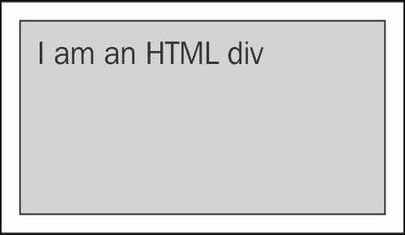
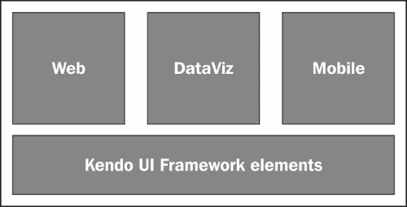

# 第一章。使用 HTML5 构建移动应用程序

世界正在走向移动化，每天都有数百万部智能手机被激活。因此，为消费者开发的移动应用越来越多，企业软件产品也在缓慢但稳步地加入这场革命。越来越多的企业确信，为了维持，他们需要在移动领域。你是一名网络开发人员，在一个晴朗的早晨，你的经理告诉你，“我们现在需要专注于移动平台。准备好！”或者你想开发一个需要部署到一个或多个移动应用商店的移动应用。在选择合适的移动开发平台时，有许多因素起作用，例如您的开发技能、原生功能、安全性、离线能力以及对多个平台的支持。在本章中，我们将看到开发移动应用程序的不同方法，并了解为什么 HTML5 是跨平台开发的流行选择。然后，我们将介绍剑道用户界面移动，并将讨论一些移动应用程序的设计原则。

在本章中，我们将介绍:

*   本地网站、混合网站和移动网站
*   HTML5 和 CSS3
*   剑道用户界面——轻松构建跨浏览器应用
*   剑道用户界面手机
*   HTML5 移动网络应用程序设计指南

# 本地对混合对移动网站

您可能已经知道，有三种方法可以开发与移动设备兼容的应用程序:本机、混合或移动网站。

**原生应用** 是用特定平台的编程语言编写的，即 iOS 的 Objective C、安卓的 Java 等等。本机应用程序运行更快，可以访问所有设备 API 和功能，并提供更好的用户体验。由于原生应用程序是为特定平台构建的，如果原生应用程序需要在另一个平台上运行，则需要重写整个应用程序。这将造成代码重复、维护难题、预算增加，以及需要多个开发团队(专门负责某个平台)处理相同的业务规则。通常，需要高性能的游戏和应用程序是作为纯本机应用程序开发的。

**混合应用程序** 是使用纯网络技术(如 CSS、HTML 和 JavaScript)编写的，它们使用设备的浏览器引擎在设备的本地容器中运行。混合应用程序通常使用 PhoneGap 等工具打包，这有助于应用程序访问特定于设备的应用程序接口和硬件功能。WebKit 渲染引擎用于 iOS、Android 和 Blackberry 等平台，渲染要在原生平台的 web 视图控件中显示的基于 web 的脚本/代码。由于混合应用程序是使用本机应用程序外壳创建的，因此它们也可以使用应用程序商店进行分发。Telerik 的 Icenium 是一个基于云的一体化开发环境，用于打包、测试和部署混合应用程序。PhoneGap 是另一个常用的工具，用于打包网络应用程序，以便在多个移动平台上部署。

**移动网站** 使用网址访问，并在移动设备的浏览器中运行。它们可以使用服务器端技术开发，例如 ASP.NET 和 PHP，并且可以在没有任何应用商店批准过程的情况下进行部署和更新。如果移动网站是使用纯 web 技术(HTML、CSS 和 JavaScript)编写的，或者使用基于这些技术的框架编写的，例如 jQuery、Kendo UI 和 jQuery Mobile，那么移动网站可以打包安装为混合应用程序，无需太多努力。移动网站的一个主要缺点是只能访问通过浏览器公开的设备功能，这使得移动网站适合基于内容的应用程序。没有一个单一的解决方案适合所有的场景。方法的选择将取决于许多因素，如您拥有的技能集、预算、时间表和更新频率。

剑道 UI Mobile 是开发混合应用和移动网站的理想平台。在本书的过程中，我们将使用剑道用户界面手机创建一个电影票应用程序，该应用程序最初将被视为一个移动网站，然后在本书的结尾，它将使用 PhoneGap 作为一个移动应用程序进行打包，并部署到安卓和 iOS 设备上。

# HTML5 和 CSS3

HTML5、jQuery 和 CSS3 是开发尖端 web 应用程序的新咒语。当我们说网络时，它包括标准网站/应用程序、移动网站/应用程序以及混合应用程序。即使这本书是关于剑道 UI Mobile 的，但了解一下剑道 UI Mobile 框架背后的底层技术也很重要，即 HTML5、CSS3 和 jQuery。在我们深入研究剑道 UI Mobile 之前，让我们先简要地从高层次上看一下 HTML5 和 CSS3 技术。因为我们希望这本书的读者对 jQuery 有所了解，所以我们不会在这里讨论 jQuery 的基础知识。

## html 5–史蒂夫·乔布斯让我出名

当史蒂夫·乔布斯在 iOS 设备上著名地宣布 Flash 的死亡并认可 HTML5 是未来时，HTML5 在互联网公众中一举成名，因为它有助于在不依赖第三方浏览器插件的情况下构建高级图形、排版、动画和过渡。

HTML5 是一种标记语言规范，由大量特性、技术和 API 组成，允许内容开发人员创建丰富的交互体验。HTML5 仍处于推荐阶段，但许多浏览器已经实现了规范的很大一部分。这对开发人员来说是一个挑战，因为他们需要在启动 HTML5 项目之前弄清楚哪些浏览器支持哪些功能。

## html 5 的主要特点

尽管【HTML5 的规范还没有完成，但是大量的特性已经被主流浏览器实现了。以下是 HTML5 目前的一些主要特性:

<colgroup><col style="text-align: left"> <col style="text-align: left"> <col style="text-align: left"></colgroup> 
| 

*   Application cache supports offline network applications.

 | *   geographical position | 

*   Events sent by the server

 |
| 

*   audio and video

 | 

*   Index database

 | 

*   Web page API

 |
| 

*   【画布应用编程接口】

 | 

*   【mathml】

 | 

*   Network storage

 |
| 

*   Cross-document message

 | 

*   Micro data

 | 

*   web workers

 |
| 

*   drag and drop

 | 

*   **Scalable vector graphics** ( **SVG** )

 | 

*   XMLHttpRequest 二级

 |

### 注

[谷歌的 http://html5rocks.com](http://html5rocks.com)是一个非常好的 HTML5 参考网站，有大量的教程、文章和其他资源。

## html 5 规范背后是谁？

HTML5 规范的开发背后有三个不同的组织: **W3C** ( **万维网联盟**)**WHATWG**(**网络超文本应用技术工作组**)和 **IETF** ( **互联网工程任务组**)。因此，W3C 和 WHATWG 维护的 HTML5 规范有两个版本，分别可以在[http://www.w3.org/TR/html5/](http://www.w3.org/TR/html5/)和[http://whatwg.org/html](http://whatwg.org/html)找到。 IETF 由负责 HTTP 等互联网协议的小组组成，处理 HTML5 的 WebSocket API 使用的 WebSocket 协议。

HTML5 的两个不同版本并不令人担忧，因为 WHATWG 版本被认为是一种生活标准(意味着将会不断发展，不再应用版本)，W3C 正计划创建一个单一的最终标准，WHATWG 称之为他们生活标准的快照。

WHATWG 的工作重点是开发 HTML 和相关技术的规范描述(意味着修复 bug、添加新特性和通常跟踪实现)，而 W3C 将继续 HTML5 规范的工作，专注于单一的权威标准。

## 【HTML5 页面示例

现在让我们把的手弄脏，看看一个简单的 HTML5 页面:

```cs
<!DOCTYPE HTML>
<html>
  <head>
    <meta charset="utf-8">    
    <title>Our first HTML5 page </title>
  </head>
  <body>
 <header>
      <h1>Sample HTML5 Structure</h1>
 <nav>
        <ul>
          <li><a href="#">Link1</a></li>
          <li><a href="#">Link2</a></li>
        </ul>
 </nav>
 </header>
 <section>
      <h1>Main Section</h1>
      <h2>This is a sample HTML5 Page</h2>
 <article>
        <p>Article 1 goes here</p>
 </article>
      <article>
        <p>Article 2 goes here</p>
      </article>
 </section>
 <footer>
      <p>Footer goes here</p>
 </footer>
  </body>
</html>
```

### 类型

**下载示例代码**

您可以从您在[http://www.packtpub.com](http://www.packtpub.com)的账户中下载您购买的所有 Packt 书籍的示例代码文件。如果您在其他地方购买了这本书，您可以访问[http://www.packtpub.com/support](http://www.packtpub.com/support)并注册，以便将文件直接通过电子邮件发送给您。

### DOCTYPE 和字符编码

HTML5 的`DOCTYPE`声明非常简单:`<!DOCTYPE HTML>`

这一行需要添加到我们创建的每个 HTML5 页面的顶部。新的`DOCTYPE`声明简单明了，不同于 HTML4 中冗长难记的声明，如下所示:

```cs
<!DOCTYPE HTML PUBLIC "-//W3C//DTD HTML 4.01//EN"
"http://www.w3.org/TR/html4/strict.dtd">
<!DOCTYPE HTML PUBLIC "-//W3C//DTD HTML 4.01 Frameset//EN"
"http://www.w3.org/TR/html4/frameset.dtd">
```

所有最新的浏览器都会查看新的`DOCTYPE`声明，并将内容切换到标准模式。

与`DOCTYPE`声明一样，字符集声明也在 HTML5 中进行了简化，如下所示:

```cs
<meta charset="UTF-8">
```

元元素中的`meta charset`属性被用来代替 HTML4 中的 pragma 指令。

这是 HTML4 中典型字符编码的外观:

```cs
<meta http-equiv="Content-type" content="text/html;charset=UTF-8">
```

### 一些新的 HTML5 标签

正如在前面的代码中所强调的，您可以看到一些新的 HTML5 标签，它们是语义标记。语义标记向浏览器和开发人员清楚地描述了它们的意义或目的。在 HTML4 中，我们使用`<div>`标签来定义页面中的划分，但它从未提供任何关于内容的细节，也没有特定的含义。为了有意义，开发人员通常会添加一个`id`属性，并提供一个有意义的标识，如`sectionHeader`、`footer`和`navLinks`，如下所示:

```cs
<div id="sectionHeader"> </div>
```

像`<header>`、`<footer>`、`<nav>`这样的语义元素被添加到 HTML5 中，作为挖掘数十亿个网页的结果，用于找出开发人员最常使用的常见 id 和 CSS 类名，并用于选择一个小子集添加到 HTML5 规范中。这非常有意义，因为这将有助于搜索引擎和辅助工具轻松抓取网页，开发人员可以处理整洁的 HTML 代码。

现在让我们检查一下我们在示例 HTML5 页面中使用的一些新的语义标记。

#### <表头>

`<header>`元素代表一组介绍性或导航辅助工具。通常`<header>`将是页面中的第一个元素。它通常包含该部分的标题(h1–h6 元素或 hgroup 元素)，但这不是必需的。header 元素还可以用于包装一个部分的目录、搜索表单或任何相关的徽标。

#### <导航>

`<nav>`元素代表一个部分，该部分包含指向其他页面或页面内部分的导航链接。该元素主要用于包含主要导航块的部分。通常页脚会有一个简短的链接列表，链接到网站的不同页面。在这种情况下，仅使用`<footer>`元素就足够了，而`<nav>`元素也可以使用，但通常是不必要的。

以下是您可以考虑添加`<nav>`元素的更多地方:

*   面包屑
*   目录
*   侧面导航

#### <段>

`<section>`元素代表文档或应用程序的通用部分。在这种情况下，一节是由以下内容组成的专题组:

*   回
*   选项卡式对话框中的各种选项卡页
*   论文的编号部分

一个网站的主页可以分为介绍、新闻和联系信息几个部分。它是您将考虑作为记录存储在数据库中的一段内容。

只有在文档大纲中明确列出内容时，`<section>`元素才是合适的。

#### <篇>

`<article>`元素代表独立的内容部分，如博客文章、评论和杂志文章。一篇文章应该是一个独立的实体，即使周围的内容被移除，也应该可以分发或重用它。

#### <页脚>

`<footer>`元素表示包含元素的信息，例如相关内容的链接或版权信息。即使这是通常的做法，也不需要在这一节的末尾添加页脚。

### 注

[http://html5test.com/](http://html5test.com/)是一个测试浏览器 HTML5 兼容性的好网站。

## CSS3

CSS3 是 CSS 的最新版本，与 CSS2 不同(CSS2 是 CSS 的单个大规格)被分成多个模块，这些模块被分别记录和处理。CSS3 规范的工作早在 1998 年 CSS2 的规范一完成就开始了，现在还在更新中。

CSS3 通过制作网页元素的动画、应用不同的效果(如渐变、阴影、多种背景和不透明度)等，帮助网页增添活力，而无需像以前版本的 CSS 那样使用图像或客户端代码。CSS3 有助于提高应用程序的性能，因为 CSS 文件缓存在客户端，并在支持的浏览器上使用硬件加速技术进行动画。

CSS3 有超过 50 个来自 CSS 工作组发布的模块，如媒体查询、名称空间、颜色、动画、背景和边框、选择器和 2D/三维转换。

让我们用一个快速的例子来看看，用 CSS3 对 HTML 元素应用圆形边框、变换和阴影是多么容易。

首先，让我们定义一个简单的`div`元素，并给它添加一些样式:

```cs
<!DOCTYPE HTML>
<html>
  <head>
    <style type="text/css">
    div#myDiv
 {
 width: 200px;
 height: 100px;
 background-color: #A3D1FF;
 border: 1px solid black;
 margin: 10px;
 padding: 5px;
 }
    </style>
  </head>
  <body>
    <div style="margin: 75px">
      <div id="myDiv">
 I am an HTML div
 </div>
 </div>
  </body>
</html>
```

HTML 的呈现如下图所示:



现在，我们需要将这个 div 旋转 40 度，给边框添加圆角，给框添加阴影。在 CSS3 中，使用几行代码就可以非常容易地达到这些要求。向我们的 HTML 文档的 CSS 定义中添加以下 CSS3 属性:

```cs
border-radius: 10px;
box-shadow: 8px 8px 1px gray;
transform: rotate(40deg);
-ms-transform: rotate(40deg); /* IE 9 */
-webkit-transform: rotate(40deg); /* Safari and Chrome */
```

在重新加载 HTML 页面时，我们可以看到我们的 div 已经转换为新的外观:


# 剑道 UI——轻松构建跨浏览器应用

现在我们已经有了足够的概述，让我们开始真正的东西:来自 Telerik 的**剑道用户界面框架**。Telerik 在为开发人员提供**快速应用程序开发** ( **RAD** )工具方面一直走在前列，Kendo UI 框架是 Telerik RAD 堆栈的最新成员，用于构建基于 HTML5、jQuery 和 CSS3 的跨浏览器应用程序。

使用剑道 UI 唯一的外部依赖是 jQuery。使用剑道用户界面开发应用程序很简单，设置只需要在您的 HTML 页面中引用 jQuery、剑道 JavaScript 和 CSS 文件。

### 注

剑道这个词的意思是“剑道”，这是日本传统的剑术。

剑道用户界面框架可以大致分为:

*   剑道用户界面小部件
*   剑道用户界面框架元素

剑道小部件使用 HTML5、CSS3 和 jQuery 来构建强大的网络应用程序，而不使用多个第三方框架和插件，就像其他一些 HTML5/jQuery 框架一样。

剑道 UI 小部件是应用程序开发后我们真正“看到”的 UI 元素，例如按钮、下拉列表和树形视图。框架元素是不可见的实体，如数据源、模板和 MVVM，这有助于将数据与小部件集成在一起。为了简单起见，如果我们考虑一个使用剑道用户界面构建的应用程序，用户界面小部件是砖块，而框架元素是帮助砖块粘在一起的水泥。

## 剑道 UI 小部件

剑道 UI 小部件可分为三组:

*   **剑道 UI Web** :这些是用于支持触控的桌面开发
*   **剑道 UI 数据可视化**:用于桌面和移动数据可视化
*   **Kendo UI Mobile**: These are used for mobile application development

    

## 剑道 UI 架构

尽管剑道 UI Web 和 DataViz 不在本书的讨论范围内，但是了解这两者也是一个好主意，因为所有三个小部件组无缝地相互操作，并且在一个大项目中很有可能需要使用多个小部件组。

### 剑道 UI 网

剑道 UI Web 小部件作为用于构建键盘/鼠标输入，以及基于触控的传统跨浏览器 Web 应用。截至今天，剑道 UI Web 小部件集合中有 22 个小部件可用。所有剑道用户界面网络部件都完全支持触摸屏设备，如 iPad、iPhone 和安卓，因此可以在各种输入选项不同的设备上访问网络应用程序。

尽管剑道 UI Web 框架使用了基于现代 HTML5 和 CSS3 的小部件，但它通过实现优雅的降级来支持 IE7 和 IE8 等较旧的浏览器。

### 注

更多关于剑道 UI 网的信息可以在[http://www.kendoui.com/web.aspx](http://www.kendoui.com/web.aspx)找到

### 剑道 UI DataViz

剑道 UI DataViz 小部件有助于使用 HTML5 构建尖端的、触摸感知图表和仪表盘。得益于内置的硬件加速，DataViz 小部件使用更少的 CPU 资源，从而为所有动画和渲染提供最大的性能。使用 SVG 在客户端呈现 DataViz 图形，对于传统浏览器，可以回退到 VML。

DataViz 支持以下图表和仪表小部件:

<colgroup><col style="text-align: left"> <col style="text-align: left"></colgroup> 
| 

图表类型

 | 

仪表类型

 |
| --- | --- |
| 面积 | 射线 |
| 酒吧 | 线性的 |
| 泡泡 |   |
| 线条 |   |
| 甜甜圈 |   |
| 馅饼 |   |
| 分散 |   |

### 注

就像网络小部件一样，DataViz 通过混合有限的 HTML5 支持(如果有的话)和适度的降级来支持 IE7 和 IE8 等旧浏览器。DataViz 完全支持最新的移动浏览器，因此它既可以用于桌面网络应用程序，也可以用于移动应用程序。更多关于剑道 UI DataViz 的信息可以在:[http://www.kendoui.com/dataviz.aspx](http://www.kendoui.com/dataviz.aspx)找到

### 剑道 UI 手机

剑道 UI Mobile 是剑道 UI widget 栈的第三组，帮助构建基于 HTML5 的移动网站以及混合移动应用。剑道用户界面移动版采用自适应渲染技术，帮助应用程序的外观和感觉适应查看它的平台。没有任何配置或额外的代码，一个建立在剑道 UI Mobile 上的应用程序看起来就像安卓设备上的安卓，iOS 设备上的 iOS，等等。在撰写本书时，剑道 UI Mobile 支持 iOS、安卓、黑莓和 Windows 8 平台。

现在，您可能会有这样一个问题:“如果我需要在查看应用程序的所有设备上有单一的外观和感觉，该怎么办？”最近，剑道发布了一个**通用移动主题** ，开发者可以使用它在不同的平台上创建一致的外观和感觉。如果你没有使用这个新的主题，那么在实例化移动应用的时候，一个单一的配置来强制一个特定的平台就可以了！一旦我们强制用户界面使用特定平台的外观进行渲染，然后进行修改，该平台的相应 CSS 文件将确保跨多个平台的相同外观。

### 注

剑道还提供了移动主题构建器来定制移动小部件的样式:[http://demos.kendoui.com/mobilethemebuilder/index.html](http://demos.kendoui.com/mobilethemebuilder/index.html)

## 服务器包装器

如果你是一个在 ASP.NET MVC、JSP 或 PHP 上工作的服务器端程序员，有一个好消息要告诉你:剑道 UI 有可用于 ASP.NET MVC、PHP 和 JSP 的服务器包装器，它会自动生成必要的 HTML 和 JavaScript 来配置、渲染和初始化你的剑道 UI 小部件(Web 和 Mobile)和图表(DataViz)。服务器包装器发出剑道用户界面 JavaScript，并提供对剑道用户界面客户端应用编程接口的完全访问，以便在呈现网页后也可以从客户端操作用户界面。

### 注

你可以在这里阅读更多关于服务器包装的信息:[http://www.kendoui.com/server-wrappers.aspx](http://www.kendoui.com/server-wrappers.aspx)

# HTML5 移动网页应用设计指南

为移动设备开发应用程序与为台式机和笔记本电脑开发网站截然不同。有各种不同屏幕尺寸和处理能力的移动设备可供选择。移动设备以不同的带宽接入互联网；他们可以连接到无线网络，并在瞬间进入慢速的 2G 网络。所有这些因素使得移动应用程序开发不同于传统的 web 应用程序开发。

以下是一些指导方针，它们将在构建移动网络应用程序时帮助开发人员:

*   **使用 CSS3 而不是 jQuery 的动画**:尽可能使用 CSS3 动画，因为它们是在浏览器中本地处理的，这样它可以利用硬件资源，从而提高性能。
*   **使用 CSS3 媒体查询的响应性设计**:如今的移动设备的屏幕大小各不相同，基本的预期是，移动网络应用将适合请求应用的设备的屏幕。使用 CSS3 媒体查询的响应设计有助于相同的代码库在各种设备上提供最佳的观看体验。
*   **使用 CSS3 渐变代替图片**:使用 CSS3，我们可以在你的网页中提供渐变，而不需要使用特别裁剪的图片。这有助于保留带宽，因为图像不会在网络上传播，并为页面设计提供了更大的灵活性。
*   **Go for SPA(单页应用)** : SPA(例如 Gmail)为用户提供了更快、更灵敏的导航体验。它们的特点是能够重新绘制用户界面的任何部分，而不需要服务器往返来检索页面。在构建移动应用程序时，如果 SPA 不会使您的开发过程变得复杂，请选择它。Kendo UI Mobile 是一个构建单页应用程序的优秀框架，您将在以后的章节中看到。
*   **充分利用离线模式和本地数据存储**:现在几乎所有的现代移动浏览器都支持相当多的 HTML5 规范，因为它们的更新频率与桌面同类相比非常高。虽然我们可以有把握地假设这些功能将在移动浏览器上可用，但最好使用简单的 JavaScript 条件语句检查这些功能是否在客户端浏览器上启用。

# 总结

在本章中，我们讨论了开发移动应用程序的不同方法，并介绍了 HTML5 和 CSS3。我们还通过在 HTML5 和 CSS3 中编写一些示例代码而弄脏了手。了解 HTML5 和 CSS3 结合的力量很重要，这将为下一代应用提供最强大的移动应用开发工具。然后，我们对剑道用户界面架构进行了高层次的研究，并完成了 HTML5 移动应用程序的一些设计指南。

在下一章中，我们将深入到剑道 UI Mobile，编写一些代码，并开发一个应用程序的几个屏幕，当我们阅读这本书时，该应用程序将被开发为一个功能齐全的网络应用程序。