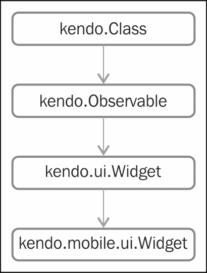
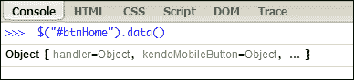
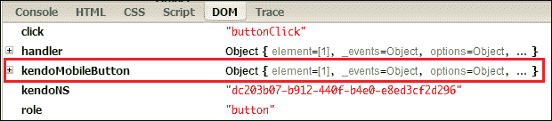
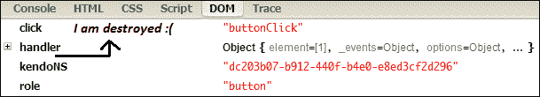
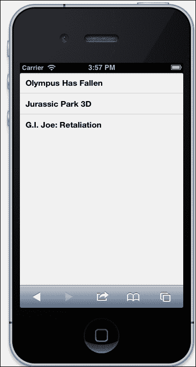
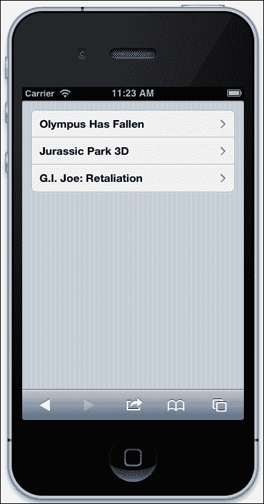
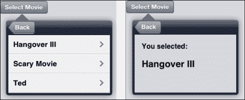

# 第五章。探索移动小部件

Kendo UI Mobile 允许程序员通过提供各种可主题化的小部件来快速开发移动应用。这些小部件是为基于触摸的移动设备量身定制的，并提供具有原生外观和感觉的平台特定渲染。在[第 2 章](2.html "Chapter 2. Building Your First Mobile Application")*构建你的第一个移动应用*中，我们了解了剑道移动应用的基本结构和一些小部件。在本章中，我们将从基础开始探索剑道手机小部件，并通过示例进行详细介绍。

在本章中，我们将介绍:

*   剑道手机小部件基础
*   移动用户界面小部件
*   列表视图
*   纽扣
*   按钮组
*   转换
*   窗格
*   酥脆饼

# 剑道手机小部件基础

所有剑道移动小部件继承自基类`kendo.mobile.ui.Widget`，基类继承自所有剑道小部件(网络和移动)的基类`kendo.ui.Widget`。下图显示了移动小部件类的完整继承链:



`kendo.Class`作为大多数剑道 UI 对象的基类，而`kendo.Observable`对象包含事件的方法。`kendo.data.ObservableObject`是剑道 MVVM 的基石，传承自`kendo.Observable`。

## 基于移动小部件的方法

从到继承链，所有剑道手机小部件都继承了一套常用的方法。在构建高性能、复杂的移动应用时，需要彻底了解这些方法。

### 注

Kendo UI Mobile 仅支持基于 WebKit 的浏览器，因此使用 Chrome 或 Safari 浏览器在桌面上运行演示代码非常重要。

### 绑定

在`kendo.Observable`类中定义的 `bind()`方法将处理程序附加到事件。使用这种方法，我们可以将自定义方法附加到任何移动小部件上。`bind()`方法采用以下两个输入参数:

*   `eventName`:事件的名称
*   `handler` : 事件引发时要触发的功能

以下示例显示了如何创建新的移动小部件并将自定义事件附加到该小部件:

```cs
//create a new mobile widget
var mobileWidget = new kendo.mobile.ui.Widget();

//attach a custom event
mobileWidget.bind("customEvent", function(e) {

  // mobileWidget object can be accessed inside this function as //'e.sender' and 'this'. 
  console.log('customEvent fired');  

});

```

事件数据在对象`e`中可用。引发事件的对象可以在函数中作为`e.sender`或使用`this`关键字访问。

### 触发

`trigger()`方法执行所有附加到触发事件的事件处理程序。该方法有两个输入参数:

*   `eventName` : 要触发的事件的名称
*   `eventData`(可选):要传递给事件处理程序的特定于事件的数据

让我们通过修改为 bind 提供的代码示例来看看触发器是如何工作的:

```cs
//create a mobile widget
var mobileWidget = new kendo.mobile.ui.Widget();

//attach a custom event
mobileWidget.bind("customEvent", function(e) {

  // mobileWidget object can be accessed 
  //inside this function as 
  //'e.sender' and 'this' . 
  console.log('customEvent fired');  

  //read event specific data if it exists
  if(e.eventData !== undefined){
    console.log('customEvent fired with data: '
    + e.eventData);  
  }    
});

//trigger the event with some data   mobileWidget.trigger("customEvent", { eventData:'Kendo UI is cool!' });

```

这里我们使用`bind()`方法触发附加的自定义事件，并发送一些数据。这些数据在事件内部读取并写入控制台。

运行这段代码时，我们可以在控制台中看到以下输出:

```cs
customEvent fired 
customEvent fired with data: Kendo UI is cool! 
```

### 类型

试试 js 提琴:[http://jsfiddle.net/kendomobile/9grnR/](http://jsfiddle.net/kendomobile/9grnR/)

### 解除绑定

`unbind()`方法将先前附加的事件处理程序从小部件中分离出来。它采用以下输入参数:

*   `eventName`:待拆事件的名称。如果未指定事件名称，则将分离所有事件的所有处理程序。
*   `handler` : 要分离的处理函数。如果未指定函数，则附加到该事件的所有函数都将被分离。

以下代码将事件附加到小部件，并在事件被触发时将其分离:

```cs
//create a mobile widget
var mobileWidget = new kendo.mobile.ui.Widget();

//attach a custom event
mobileWidget.bind("customEvent", function(e) {     

  console.log('customEvent fired');

  this.unbind("customEvent");

});

//trigger the event first time
mobileWidget.trigger("customEvent");

//trigger the event second time
mobileWidget.trigger("customEvent");
```

输出:

```cs
customEvent fired
```

从输出中可以看出，即使我们触发了两次事件，只有第一次调用了事件处理程序。

### 一

`one()`方法与`bind()`方法相同，只有一个例外；处理程序在第一次调用后被解除绑定。所以处理程序只会被触发一次。

为了查看这个方法的运行情况，让我们在现有的示例代码中添加一个 count 变量，并跟踪处理程序被调用的次数。为此，我们将使用`one()`绑定事件处理程序，然后触发事件两次，如以下代码所示:

```cs
//create a mobile widget
var mobileWidget = new kendo.mobile.ui.Widget();
var count = 0;
//attach a custom event
mobileWidget.one("customEvent", function(e) { 
 count++;
 console.log('customEvent fired. count: ' + count);

});

//trigger the event first time
mobileWidget.trigger("customEvent");

//trigger the event second time
mobileWidget.trigger("customEvent");
```

输出:

```cs
customEvent fired. count: 1
```

### 类型

试试 js 提琴:[http://jsfiddle.net/kendomobile/TnF3e/](http://jsfiddle.net/kendomobile/TnF3e/)

如果用`bind()`方法替换`one()`方法，可以看到处理程序将被调用两次。

### 类型

前面讨论的所有方法(`bind()`、`trigger()`、`unbind()`和`one()`)不仅限于小部件，还可用于任何源自`kendo.Observable`的剑道对象。

### 摧毁

`destroy()`方法继承自`kendo.ui.Widget`基础对象。`destroy()`方法删除所有事件处理程序附件，并删除`jquery.data()`属性中的小部件对象，这样小部件就可以安全地从 DOM 中删除，而不会出现内存泄漏。如果有可用的子部件，也将调用子部件的`destroy()`方法。

让我们看看`destroy()`方法如何使用剑道移动按钮小部件和浏览器的开发者工具控制台工作。创建一个 HTML 文件，在文件中添加以下代码以及 Kendo UI Mobile 文件引用，并在浏览器中打开它:

```cs
<div data-role="view" >    
  <a class="button" data-role="button" id="btnHome"  data-click="buttonClick">Home</a>    
</div>
<script>
  var app = new kendo.mobile.Application(document.body);

  function buttonClick(e){

    console.log('Inside button click event handler...');
 $("#btnHome").data().kendoMobileButton.destroy();

  }
</script>
```

在这个代码块中，我们创建了一个剑道按钮小部件，在点击事件中，我们调用了按钮的`destroy()`方法。


### 类型

网上试试:[http://kendomobilebook.com/chapter5/destroy.html](http://kendomobilebook.com/chapter5/destroy.html)

现在打开浏览器的开发者工具**控制台**窗口，输入`$("#btnHome").data()`并按*进入*。



现在，如果您点击前面截图中显示的**对象**链接，可以看到所有属性的详细视图:



现在在**控制台**中反复点击**剑道图标**，输入`$("#btnHome").data()`并点击*进入*。现在我们可以看到**kendomoliblebutton**对象从对象列表中移除:



即使数据对象消失了，按钮仍然留在 DOM 中，没有任何与之相关的数据或事件。

### 类型

如果你也想把按钮从 DOM 中移除，你可以调用`jQuery.remove()`方法，如图所示:

`$("#btnHome").remove();`

### 视图

`view()`方法特定于移动小部件，它返回加载小部件的视图对象。

在前面的例子中，我们可以给视图分配一个 ID`mainView`，然后使用`this.view().id`在按钮的点击事件中检索它，如下面的代码片段所示:

```cs
<div data-role="view" id="mainView" >    
  <a class="button" data-role="button" id="btnHome" data-click="buttonClick">Home</a>    
</div>
<script>
  var app = new kendo.mobile.Application(document.body);

  function buttonClick(e){

    console.log("View id: " + this.view().id);    
  }
</script>
```

输出:

```cs
View id: #mainView
```

### 类型

试试 js 提琴:[http://jsfiddle.net/kendomobile/xh4y7/](http://jsfiddle.net/kendomobile/xh4y7/)

`view()`方法有用的一个场景是小部件的事件。如果需要访问同一视图中的另一个元素/小部件，我们可以通过使用当前视图的 ID 缩小搜索范围来提高选择元素的性能。

假设在前面的例子中，我们在同一个视图中有一个 ID 为`htmlElement`的元素，我们可以使用`$(this.view().id).find("#htmlElement")`选择这个元素，如果 DOM 中加载了多个视图，那么这个元素的表现会比`$("#htmlElement")`更好，因为 jQuery 现在需要遍历的 HTML 元素更少了。

# 移动用户界面小部件

现在让我们进入正题，探索更多剑道 UI Mobile 小部件。我们已经在[第 2 章](2.html "Chapter 2. Building Your First Mobile Application")、*构建您的第一个移动应用*中使用了一些小部件，在本章中我们将详细了解更多小部件。

这些是剑道用户界面移动框架提供的小部件:

*   行动表
*   纽扣
*   按钮组
*   列表视图
*   modalview(模式检视)
*   纳巴尔
*   酥脆饼
*   背景常速滚动的电脑游戏
*   卷动检视
*   转换
*   选项卡条带
*   触控
*   抽屉(2013 年在 Q2 推出)

现在让我们浏览一下所有对您来说是新的小部件，研究它们是如何工作的，在这一章的最后，我们将把这些小部件集成到我们的电影票应用中。

### 注

本章的目的是让您开始使用剑道移动小部件，并解释一些重要的属性和方法、它们的用法以及一些重要的提示。我们没有提供所有小部件的所有属性和方法的完整文档，因为在每个季度发布的版本中，属性和方法都被添加/弃用，因此 Kendo 在[http://docs.kendoui.com/api/mobile](http://docs.kendoui.com/api/mobile)提供的 API 参考文档是您获得框架完整参考的最好朋友。

# 初始化并显示视图小部件的事件

剑道 UI 移动视图小部件暴露了两个重要事件:`init`和`show`。这些事件的事件处理程序可以使用数据属性进行连接，如图所示:

```cs
<div data-role="view" data-init="onInitialize" 
data-show="onShow">
</div>

<script>
  var app = new kendo.mobile.Application(document.body);

  function onInitialize(e) {
    alert('view initialized');
  }

  function onShow(e) {
    alert('view shown');
  }

</script>
```

### 类型

在 http://jsfiddle.net/kendomobile/vWC39/试试吧

在视图及其子部件初始化之后，`init`事件首先被触发，并且只触发一次。只要视图变得可见，就会触发`show`事件。`init`事件被设计用于在视图的生命周期中只应执行一次的操作，例如，使用 JavaScript 代码以编程方式创建一个小部件。这不能在`show`事件中完成，因为每当视图变得可见并导致意外结果时，代码都会尝试创建小部件。

`show`事件应该用于需要在视图显示时发生的动作的场景，例如，每当视图变得可见时，用来自服务器的最新数据更新小部件。

“视图”小部件还公开了三个事件:

*   `beforeShow`:该事件在视图可见之前触发
*   `afterShow`:该事件在视图可见后触发
*   `hide`:当视图隐藏时，触发此事件

# 列表视图小部件

在移动设备中，列表是使用最广泛的用户界面组件。列表以不同的方式进行样式化和修改，以便显示具有复杂结构的简单数据列表。剑道用户界面提供了一个非常强大的列表小部件，称为列表视图，可用于显示平面、分组或自定义模板列表。当`data-role="listview"`属性被添加到列表元素时，剑道会自动将任何 HTML 列表转换为移动优化列表视图小部件:

```cs
<ul data-role="listview">
  <li>Olympus Has Fallen</li>
  <li>Jurassic Park 3D</li>
  <li>G.I. Joe: Retaliation</li>
</ul>
```

与任何其他 Kendo 小部件一样，ListView 也可以通过编程方式初始化，使用 jQuery 插件语法，如以下代码片段所示:

```cs
<div data-role="view" data-init="initialize"> 
<ul id="myList"></ul>
</div>
<script>
function initialize(){

 $("#myList").kendoMobileListView({
     dataSource: ["Olympus Has Fallen", 
   "Jurassic Park 3D",
   "G.I. Joe: Retaliation"]
    });
}

</script>
```

### 类型

试试 js 提琴:[http://jsfiddle.net/kendomobile/72mKp/](http://jsfiddle.net/kendomobile/72mKp/)



## 嵌入样式

我们在前面部分看到的代码片段将显示一个占据整个屏幕宽度的列表。如果您对这种体验不满意，并且需要您的列表像 iOS 设备一样有边距和圆角，您可以将属性`data-style="inset"`添加到`<ul>`元素中。此设置不适用于安卓或黑莓设备:

```cs
<ul data-role="listview" data-style="inset">
  <li>Olympus Has Fallen</li>
  <li>Jurassic Park 3D</li>
  <li>G.I. Joe: Retaliation</li>
</ul>
```

### 类型

试试 js 提琴:[http://jsfiddle.net/kendomobile/g9GRs/](http://jsfiddle.net/kendomobile/g9GRs/)


上图显示了带有插图样式的列表。

## 链接

如果你的列表有锚点标签，Kendo ListView 会自动给列表添加右箭头指示，这样用户就可以直观的看到列表中的项目是可以点击的，可以进行详细查看或导航:

```cs
<ul data-role="listview" data-style="inset">
  <li><a>Olympus Has Fallen</a></li>
  <li><a>Jurassic Park 3D</a></li>
  <li><a>G.I. Joe: Retaliation</a></li>
</ul>
```



## 详细按钮和图标

详细按钮小部件是尺寸较小的按钮图标，通常用于在有限的空间内需要多个按钮时节省空间。默认支持的四种不同风格分别是:`contactadd`、`detaildisclose`、`rowinsert`、`rowdelete`:

```cs
<div data-role="view">
  <ul data-role="listview" data-style="inset">
    <li><a>Olympus Has Fallen </a></li>
    <li><a>Jurassic Park 3D</a></li>
    <li><a>G.I. Joe: Retaliation</a></li>
  </ul>

  <ul data-role="listview" data-style="inset">
    <li>Add Contact<a data-role="detailbutton" data-style="contactadd"></a></li>
    <li>More Details<a data-role="detailbutton" data-style="detaildisclose"></a></li>
    <li>Insert Movie<a data-role="detailbutton" data-style="rowinsert"></a></li>
    <li>Delete Movie<a data-role="detailbutton" data-style="rowdelete"></a></li>
  </ul>
</div>
```

### 类型

试试 js 提琴:[http://jsfiddle.net/kendomobile/vhXRZ/](http://jsfiddle.net/kendomobile/vhXRZ/)


也可以使用``元素或使用剑道提供的图标的`data-icon`属性将项目图标添加到详细按钮中。剑道对使用`data-icon`属性生成的图标使用字体图标。这些内置字体图标只能在锚点标签中使用。

剑道有以下内置字体图标:

<colgroup><col style="text-align: left"> <col style="text-align: left"> <col style="text-align: left"> <col style="text-align: left"> <col style="text-align: left"></colgroup> 
| 关于；在…各处 ；大约 | 行为 | 增加 | 电池 | 书签 |
| 照相机 | 手推车 | 构成 | 联系人 | 细节 |
| 下载 | 快进 | 收藏夹 | 作为特色的 | 顶级的 |
| 地球 | 历史 | 家 | 信息 | 更多 |
| 采样 | 最受关注 | 组织 | 中止 | 玩 |
| 最近的 | 恢复精神 | 回答 | 重绕 | 搜索 |
| 设置 | 分享 | 停止 | 废物 |   |

### 类型

也可以创建自定义图标用作按钮图标。由于细节不在本书的讨论范围内，我们建议您浏览以下网站上的剑道文档:[http://goo.gl/v3yLj](http://goo.gl/v3yLj)

## 分组和模板

剑道列表视图可以配置为将项目组织成组，每组有标题。这是通过将类型属性设置为`group`来完成的:

```cs
<div data-role="view"> 
  <ul data-role="listview" data-type="group">
    <li>
      Horror
      <ul>
        <li>Evil Dead</li>
        <li>Scream</li>
        <li>Dark Skies  </li>
      </ul>
    </li>
    <li>
      Sci-Fi
      <ul>
        <li>Prometheus</li>

      </ul>
    </li>
  </ul>
</div>
```

通过将`fixedHeaders`属性设置为`true`，可以固定标题。滚动时，固定标题保持其位置，直到其下的所有项目都向上滚动。

剑道模板可用于自定义列表项。在用列表视图实现模板时，请记住列表视图会自动将模板内容包装在一个`<li>`标签中。在模板定义中添加一个`<li>`标签会打乱你的列表视图，所以只有需要在`<li>` `</li>`里面的项目才应该在模板中。让我们看看创建一个模板化的列表视图有多容易，该列表视图具有固定的标题和从数据源绑定的数据:

```cs
<body>

  <div data-role="view" id="mainView" data-init="loadListView">
    <ul id="listView"></ul>
  </div>

 <script type="text/x-kendo-template" id="listviewTemplate"> 
 <a > <strong > #:movieName# </strong>
 <i>  #:dateTime#</i></a> 
 </script>

  <script>

    var app = new kendo.mobile.Application(document.body);

    //create datasource
    var movieDataSource = new kendo.data.DataSource({
      data:
      [
      {
        movieName: "Evil Dead",
        dateTime: "10/7/2013 7:30PM", genre: "Horror"
      },
      {
        movieName: "Scream",
        dateTime: "10/7/2013 8:30PM", genre: "Horror"
      },
      {
        movieName: "Hangover III",
        dateTime: "10/7/2013 9:00PM", genre: "Comedy"
      },
      {
        movieName: "Identity Thief ",
        dateTime: "10/7/2013 1:15PM", genre: "Comedy"
      },
      {
        movieName: "Seven Psychopaths",
        dateTime: "10/7/2013 4:00PM", genre: "Comedy"
      },
      {
        movieName: "Elysium",
        dateTime: "10/7/2013 7:00PM", genre: "Sci-Fi"
      },
      {
        movieName: "Prometheus",
        dateTime: "10/7/2013 12:45PM", genre: "Sci-Fi"
      }],
      group: "genre"
    });

    //instantiate the list view 
    function loadListView() {
      $("#listView").kendoMobileListView({
        dataSource: movieDataSource,
        template: $("#listviewTemplate").html(),
        headerTemplate: "#:value#",
        fixedHeaders: true,
        style: 'inset'
      });
    }
  </script>
</body>  
```

### 类型

试试 js 提琴:[http://jsfiddle.net/kendomobile/n96s2/](http://jsfiddle.net/kendomobile/n96s2/)

要查看 that 中的滚动操作，您可能必须减小浏览器的窗口大小，以便结果窗口中的列表元素可以滚动。

在这段代码片段中，我们使用本地数据创建了一个数据源对象`movieDataSource`，然后将其分配给列表视图的`dataSource`属性。然后，我们将已定义的带有标识`listviewTemplate`的模板分配给渲染项目列表。`headerTemplate`设置为`#:value#`，这意味着数据源的`group`属性中定义的属性值将显示为标题。我们也可以在标题模板中添加 HTML 元素，并像对待任何其他模板一样对待它。

标题设置为`fixed`，样式设置为`inset`。以下是滚动时列表的外观:


如您所见，当滚动时，静态标题将占用当前节的标题名称。

# 按钮部件

我们在[第 2 章](2.html "Chapter 2. Building Your First Mobile Application")、*构建您的第一个移动应用*中了解到剑道移动按钮小部件。在本章中，我们将了解更多关于这个小部件以及如何定制它。Button 是 Kendo UI Mobile 小部件堆栈中最简单的小部件之一，有几个方法，只有与之关联的点击事件。它用于导航到视图(本地或远程)或在触发 click 事件时调用 JavaScript 函数。


通过设置角色数据属性，可以使用锚点标签或 HTML5 `<button>`标签以声明方式初始化按钮:

```cs
<div data-role="view"> 
  <br/>
  <button data-role="button" data-click="buttonClick" > 
    My Kendo Button
  </button>
  <a data-role="button"  data-click="buttonClick" >
    My Kendo Anchor Button
  </a>
</div>  
```

按钮使用 jQuery 插件语法初始化，如图所示:

```cs
<a id="kendoButton" >
  Another Button
</a>
var button = $("#kendoButton").kendoMobileButton({
 click: buttonClick
});

```

### 类型

试试 js 提琴:[http://jsfiddle.net/kendomobile/vzsbF/](http://jsfiddle.net/kendomobile/vzsbF/)

## 图标

剑道提供的任何图标或您的自定义图标都可以设置为图标属性值:

```cs
var button = $("#kendoButton").kendoMobileButton({
  icon:"globe"
});
```

默认情况下，首先显示图标，然后显示按钮上的文本。如果需要在文本后显示按钮，可以添加以下 CSS:

```cs
#kendoButton .km-icon{
 float: right;
 padding-left: 10px; 
}

```


# 按钮组小部件

有时为了在视图内的部分之间导航，我们可能需要组合在一起的按钮。在这种情况下，按钮组小部件通过将一个 HTML 列表转换成一组按钮来提供帮助。也可以像按钮小部件一样为每个单独的按钮设置图标。


## 初始化

按钮组可以通过将`data-role="buttongroup"`设置为`<ul>` `</ul>`来初始化，如下代码片段所示:

```cs
<ul data-role="buttongroup" >
  <li> Button 1 </li>
  <li> Button 2 </li>
  <li> Button 3 </li>
</ul>   
```

按钮组也可以使用 jQuery 插件语法进行初始化，如下所示:

```cs
<div data-role="view" data-init="initialize">
  <ul id="listButtons" >
    <li> button 1 </li>
    <li> button 2 </li>
    <li> button 3 </li>
  </ul>   
</div>

<script>
  var app = new kendo.mobile.Application(document.body);
  function initialize(){
    var buttongroup = $("#listButtons").kendoMobileButtonGroup(); 
  }
</script>
```

## 造型

按钮组可以通过以下两种方式进行设置:

*   Adding your style definitions in the `<li>` element for each button:

    ```cs
    <ul id="listButtons" data-role="buttongroup" >
      <li style="background-color:green; 
        color:white;
        font-style:italic">
        button 1
      </li>
      <li> button 2 </li>
      <li style="background-color:orange;
     color:white;">
     button 3
     </li>
    </ul>
    ```

    

*   Overriding Kendo-generated CSS styles for iOS:

    ```cs
    .km-root .km-ios .km-buttongroup .km-button
    {
     background-color: red;
    }

    .km-root .km-ios .km-buttongroup .km-button .km-text
    {
     color: white;
    }

    ```

    ### 类型

    试试 js 提琴:[http://jsfiddle.net/kendomobile/XUke5/](http://jsfiddle.net/kendomobile/XUke5/)

    单独设置`<li>`元素的样式适合单独设置按钮的样式，当所有按钮的样式都不同于默认的剑道样式时，覆盖剑道样式效果最佳。

## 按钮组正在运行

现在，让我们编写一些代码，通过探索 ButtonGroup 小部件的属性、方法、和事件来看看它是如何工作的。我们的代码将创建一个具有四个按钮的按钮组，一旦选择了一个按钮，我们将向控制台写入按钮的文本和索引，并将按钮的文本更改为`I am clicked`。按钮将被配置为只有当我们释放按钮时才会选择按钮，这将确保在滚动时，触摸按钮组不会意外选择按钮。我们还将配置小部件，使按钮默认为`green`颜色，一旦选择了按钮，它会将其颜色更改为`maroon`:

```cs
<body>
  <div data-role="view" data-init="initialize">
    <div>
      <ul id="btnGroup">

        <li>button 1 </li>

        <li>button 2 </li>

        <li>button 3 </li>
      </ul>
    </div>
  </div>

  <script>

    var app = new kendo.mobile.Application(document.body);
    function initialize() {

      $("#btnGroup").kendoMobileButtonGroup({
 index: 1,
 selectOn: "up",
 select: onButtonSelect
 });
    }

    function onButtonSelect(e) {

      console.log('selected button text was : '+ this.current().text());
      console.log(" index:" + this.current().index());

      //Change the text on the selected button
      this.current().text('I am clicked');

    }
  </script>
</body>

<style>
  #btnGroup .km-button
  {
    background-color: green;
    color: white;
  }

  #btnGroup .km-state-active
  {
    background-color: maroon;   

  }

</style>
```

### 类型

试试 js 提琴:[http://jsfiddle.net/kendomobile/xJ8JB/](http://jsfiddle.net/kendomobile/xJ8JB/)

在初始化期间，我们使用了按钮组小部件的几个属性:

*   `index`:该属性从组中选择具有指定索引的按钮。
*   `selectOn`:利用这个属性，我们可以指定按钮是一按下就会被选中，还是用户松开按下的按钮就会被选中。允许值为`up`和`down`(默认)。将该属性的值设置为`up`将选择`touchend`、`mouseup`和`MSPointerUp`平台特定事件上的按钮选择，而`down`将选择`touchstart`、`mousedown`或`MSPointerDown`事件。

然后我们将选择事件连接到`onButtonSelect`功能。在该功能中，我们使用`this.current().text()`阅读按钮上的文本。`current()`方法将返回当前选中按钮的 jQuery 对象。同样，我们使用`this.current().index()`找到了当前所选按钮的索引。一旦使用 jQuery 的`text()`方法读取了当前按钮的数据，按钮的文本就会改变。

为了设置按钮的初始颜色，我们更新了`.km-button` CSS 类提供的样式。`.km-state-active`类为当前选择的按钮设置样式。通过在这个类中将背景颜色设置为`maroon`，我们改变了所选按钮的背景颜色。

我们也可以使用 ButtonGroup 的`select(index)`方法，以提供的索引作为输入选择一个按钮。

# 开关小部件

开关是移动设备上常用的 UI 元素，用于二进制开/关或真/假数据输入。可以点击或拖动开关小部件来切换其值。

剑道移动开关小部件是通过转换一个 HTML 复选框创建的。选中属性将获取或设置小部件的选中/未选中状态。选中状态的标签使用`onLabel`属性设置，而`offLabel`属性设置未选中状态的标签。

`check()`方法获取和设置小部件的选中状态，`toggle()`方法切换选中状态。当小部件的选中状态发生更改时，将触发更改事件。

## 初始化

现在让我们看看初始化 Switch 小部件的不同方式:

通过设置`data-role="switch"`进行数据属性初始化:

```cs
<input type="checkbox" id="chkSwitch1"data-role="switch" checked="checked"data-on-label="Pass"data-off-label="Fail" />

```

jQuery 插件语法:

```cs
<div data-role="view" data-init="init">
  <input type="checkbox" id="chkSwitch2"  />       
</div>

<script>
  var app = new kendo.mobile.Application(document.body);
  function init(){
    $('#chkSwitch2').kendoMobileSwitch({
 checked:false,
 onLabel:'Yes',
 offLabel:'No'
 });    
  }

</script>
```

### 类型

试试 js 提琴:[http://jsfiddle.net/kendomobile/vk5XW/](http://jsfiddle.net/kendomobile/vk5XW/)


# 窗格构件

窗格小部件用于在剑道移动应用的主视图中对多个视图进行分组。它通过允许导航到远程/本地视图、过渡效果、布局、设置默认视图、特定加载文本等，就像应用中的应用。窗格由窗口小部件(如 PopOver 和 SplitView)使用，以容纳其中的多个视图。

窗格小部件通过将角色数据属性设置为`pane`来初始化:

```cs
<div data-role="pane">
  <div data-role="view" id="view1">
    I am the 1st view
  </div>
  <div data-role="view" id="bar">
    I am the 2nd view
  </div>
</div>
```

## 方法

`hideLoading` 和`showLoading`方法隐藏和显示由窗格小部件的加载配置属性设置的加载动画。`view()`方法给出了对窗格上加载的当前视图的引用。

就像剑道应用对象一样，窗格小部件也有一个`navigate(url, transition)`方法，可以导航到窗格内外的视图。使用过渡输入配置可以提供不同的过渡效果。

默认情况下，窗格导航到当前窗格内的视图。要导航到其他窗格内的视图，目标数据属性在导航元素中设置为外部窗格的标识:

```cs
<a data-role="button" href="#outsideView"data-target="external-pane">External Pane</a>
```

要导航到应用内的其他视图(不在窗格内)，目标属性的值设置为`_top`:

```cs
<a data-role="button" href="#mobileView"data-target="_top">Mobile View</a>
```

## 事件

窗格小部件有两个事件:

*   `navigate(e)`:当导航到一个视图时，触发此事件。事件数据包含一个`url`属性(`e.url`，它有导航视图的网址。
*   `viewShow(e)`:当窗格小部件中显示视图时，触发此事件。事件数据包含一个`view`属性，该属性引用了加载的视图。

# PopOver 小部件

PopOver 小部件用于平板设备上的在应用窗口上方浮动的视觉层上显示内容。该小部件通常用于以下场景:

*   显示关于元素的一些信息
*   显示用于导航到其他视图的菜单
*   显示包含要执行的操作的上下文菜单
*   要显示过滤器列表

PopOver 小部件可以包含多个视图，并且它们可以在彼此之间导航。视图会自动添加到窗格小部件中。可以使用窗格配置选项来设置窗格小部件的属性。

## 初始化

通过设置`data-role="popover"`，小部件可以以声明方式进行初始化。可以通过`data-popup`属性设置其他弹出选项。

PopOver 小部件可以通过点击导航小部件来打开，方法是添加针对 PopOver ID 的`data-rel="popover"`属性和`href`属性，或者通过调用其`open()`方法以编程方式打开:

```cs
<a data-role="button" href="#popOverWidget"data-rel="popover">Filter</a>

<div id="popOverWidget" data-role="popover"data-popup="{'height':150}">

  <div data-role="view">
    <ul data-role="listview">
      <li>
        <a href="#">Comedy (9)</a>

      </li>
      <li>
        <a href="#">Action (10)</a>

      </li>
      <li>
        <a href="#">Romantic (5)</a>

      </li>
      <li>
        <a href="#">War (7)</a>

      </li>
    </ul>
  </div>
</div>
```

PopOver 小部件可以使用 jQuery 插件语法进行初始化，如以下代码片段所示:

```cs
<div data-role="view" data-init="init">
  <a data-role="button" href="#popOverWidget"data-rel="popover">Select Genre</a>
 <div id="popOverWidget" >
    <div data-role="view">
      <ul data-role="listview" >
        <li>
          <a href="#">Comedy (9)</a>
        </li>
        <li>
          <a href="#">Action (10)</a>
        </li>
        <li>
          <a href="#">Romantic (5)</a>
        </li>                    
      </ul>
    </div>
  </div>
</div>
<script>
  var app = new kendo.mobile.Application(document.body);

  function init(){
 $('#popOverWidget').kendoMobilePopOver({
 popup: { height: '130px' }
 });

  }
</script>
```

### 类型

试试 js 提琴:[http://jsfiddle.net/kendomobile/cDBur/](http://jsfiddle.net/kendomobile/cDBur/)


## 多视图弹出窗口

我们会遇到许多场景，在 PopOver 小部件中，我们需要显示多个视图，并根据某些条件相互导航。一个常见的例子是多视图菜单，其中整个视图被另一个级别的菜单替换。

让我们看看如何使用 PopOver 小部件从类型列表中选择一部电影，然后从电影列表中选择一部电影，如下面的代码片段所示:

```cs
<head>
  <style>
 .no-backbutton .km-back { 
 visibility: hidden; 
 } 
 </style>
</head>
<body>
  <div data-role="view" > 
    <a data-role="button" href="#popOverWidget" data-rel="popover">
      Select Movie
    </a>

 <div id="popOverWidget" data-role="popover" data-pane="{'transition':'zoom','layout':'popoverLayout'}"data-popup="{'height':170}">

      <!-- Layout -->
      <div data-role="layout" data-id="popoverLayout">
 <div data-role="header">
 <a data-role="backbutton" > Back </a>
 </div>
 <div data-role="footer"></div>
 </div>
      <!-- main menu view-->
      <div data-role="view" id="view-main"class="no-backbutton" >
        <ul data-role="listview" >
          <li><a href="#view-comedy">Comedy (3)</a></li>
          <li><a href="#view-action">Action (2)</a></li>                  
        </ul>
      </div>
      <!-- Comedy Menu View-->
      <div data-role="view" id="view-comedy">                
        <ul data-role="listview" >
          <li>
            <a href="#view-final?movie=Hangover III">
              Hangover III
            </a>
          </li>
          <li>
            <a href="#view-final?movie=Scary Movie">
              Scary Movie
            </a>
          </li>
          <li>
            <a href="#view-final?movie=Ted">Ted </a>
          </li>                    
        </ul>
      </div>
      <!-- Action Menu View-->
      <div data-role="view" id="view-action">                
        <ul data-role="listview" >
          <li>
            <a href="#view-final?movie=Iron Man 3">
              Iron Man 3
            </a>
          </li>
          <li>
            <a href="#view-final?movie=After Earth">
              After Earth
            </a>
          </li>                    
        </ul>
      </div>
      <!-- Final View-->
      <div data-role="view" id="view-final" data-show="finalViewShow">                  
        <div>                      
          <h3>You selected: </h3>
          <h2>
            <!-- Selected movie name will be displayed in this span --> 
            <span id="spanMovieName"> </span>

          </h2>
        </div>                  
      </div>            
    </div>
  </div>
  <script>
  var app = new kendo.mobile.Application(document.body);

  //Function to be called when the view is shown every time
 function finalViewShow(e) {

 //show the movie name in the view
 $('#spanMovieName').text(e.view.params.movie);
 }
  </script>
</body>
```

### 类型

试试 js 提琴:[http://jsfiddle.net/kendomobile/ffjVh/](http://jsfiddle.net/kendomobile/ffjVh/)

我们在 PopOver 小部件中添加了三个视图、两个菜单和一个最终视图，其中显示了选定的电影。菜单被分配了一个公共布局(popoverLayout)，其中包含一个带有剑道后退按钮部件的标题元素。使用下面的 CSS 类在第一个视图中隐藏后退按钮，就像我们在[第 2 章](2.html "Chapter 2. Building Your First Mobile Application")、*构建您的第一个移动应用*中所做的那样:

```cs
.no-backbutton .km-back { visibility: hidden; } 
```

对于所有其他视图，后退按钮是可见的，通过使用它，我们可以导航到上一个视图。

在 ID 为`view-main`的视图中，我们正在显示电影的流派，点击链接将带您进入相应的电影菜单视图，即`view-comedy`或`view-action`。在此菜单中，我们将电影显示为链接，电影名称作为查询字符串传递给 ID 为`view-final`的视图。一旦我们点击电影名称并导航到最终视图，功能`finalViewShow`被调用。该函数从查询字符串中读取电影名称，并将其显示在视图上。

### 类型

我们在`show`事件中调用`finalViewShow`函数，而不是在`init`事件中，因为我们需要在每次显示视图时调用该函数。当视图初始化时，`init`功能将只被调用一次。


我们创建的 PopOver 小部件的第二个和第三个视图如下所示:



### 注

Kendo 提供了一个拖放主题构建器，使用它可以对小部件进行主题化，以匹配应用的外观和感觉。可以使用以下网址访问移动主题构建器:[http://demos.kendoui.com/mobilethemebuilder/index.html](http://demos.kendoui.com/mobilethemebuilder/index.html)

# 总结

在本章中，我们探讨了剑道用户界面移动小部件的基础知识，并了解了常用的方法。然后，我们深入研究了诸如列表视图、按钮、按钮组、开关、窗格和弹出窗口之类的小部件，并看到了如何使用 jshut 上可用的示例来实例化它们并在多个场景中使用它们。还讨论了一些关于调整小部件的未记录提示。在下一章中，我们将探索更多的剑道用户界面移动小部件。