# 二、使用Cosmos DB的任务 Bug 记录 ASP.NET Core MVC 应用

在这一章中，我们将通过创建一个任务/错误日志应用来看看如何将Cosmos DB与 ASP.NET Core MVC 结合使用。个人任务管理器很有用，当你不能立即处理 bug 时，记录 bug 尤其方便。

我们将在本章中讨论以下主题:

*   在 Azure 上设置Cosmos DB实例
*   Cosmos DB的扩展和复制特性
*   创建 ASP.NET Core MVC 应用并集成Cosmos DB

Cosmos DB 是微软对名为 DocumentDB 的文档数据库的重塑。除了提供 NoSQL 数据库的功能外，它还提供了一个几乎不费吹灰之力的全球可扩展解决方案。

# 技术要求

本章的代码可以在 https://github.com/PacktPublishing/C-8-and-.的 GitHub 上找到 NET-Core-3-项目-使用-Azure-第二版。

# 使用Cosmos DB的好处

也许值得花些时间来探索为什么您会选择使用 Cosmos 而不是无数其他数据库引擎中的一个。这里有两个问题:为什么是云，为什么是宇宙？

# 为什么是云？扩大规模是微软的工作，而不是你的

因为 Cosmos DB 是微软管理的，过渡到它就意味着突然有一些事情你不用担心了。例如，您是否尝试过将 SQL Server 配置为故障转移，或者如果您位于美国，而您的客户在澳大利亚，该怎么办？Cosmos 通过现收现付的方式为您处理所有这些场景。显然，如果你想让你的数据在四大洲复制，并拥有巨大的吞吐量，那么你将付出更多。套用温斯顿·丘吉尔的话:

"Using <q>a</q> cloud solution is the most expensive thing you can do - except for all the others!"

如果你曾经参与过关于购买一台像样的服务器和管理故障转移的讨论，以及雇佣人员来安装和支持这些服务器的成本，你会意识到它毕竟没有那么贵。

# 为什么是宇宙？与行业领先的原料药和全球分销的兼容性

宇宙支持所谓的多模型应用编程接口。这意味着，例如，如果您有一个使用 DocumentDB 或 MongoDB 的现有应用，您可以简单地将其指向 Cosmos 实例，并告诉它您想要使用该特定的应用编程接口。您可以要求将数据复制到接近数据访问位置的区域，从而减少延迟。

# 设置蔚蓝Cosmos DB

在本书中，我们将使用 Azure 作为首选的云提供商。如果你想继续并且目前没有账户，那么你可以在[https://azure.microsoft.com/](https://azure.microsoft.com/)创建一个账户。在写这篇文章的时候，你可以免费注册，并在第一个月获得 150/$200 的学分。

注册后，请访问 https://portal.azure.com。在这里，您可以管理您的 Azure 资源并检查您的余额。

All cloud providers (at least at the time of writing) have a business model whereby you will get billed for your usage. The fact that you can walk away from your machine does not necessarily mean that any processes that you may have been running in the cloud will stop. This is a very different paradigm from the days when your machine being off meant that nothing was running. At the end of each chapter that uses cloud resources will be a *Clean up* section, which will talk you through the process of tearing down all the resources that you have created.

登录门户后，搜索Cosmos DB:

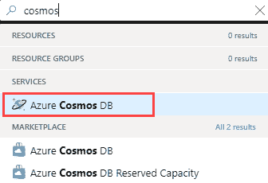

选择 Azure Cosmos DB后，您将获得Cosmos DB刀片:

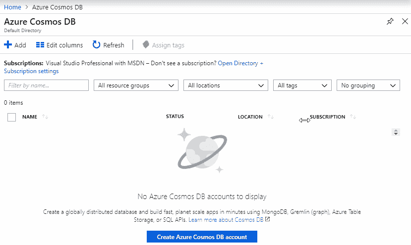

In this context, the term **blade** refers to the discrete sections of the portal.

If you click the little pin in the top right-hand corner, the blade will be added to your dashboard, making it easier to locate in the future.

正如您所看到的，我们还没有任何资源，所以让我们通过选择添加来创建一个新的数据库:

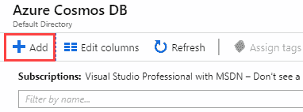

单击添加数据库的选项后，将出现一个新屏幕。这让您有机会配置数据库的名称和位置，以及您想要使用的应用编程接口类型。让我们从创建一个新的资源组开始。然后，我们可以将该组用于与本书相关的所有未来资源:

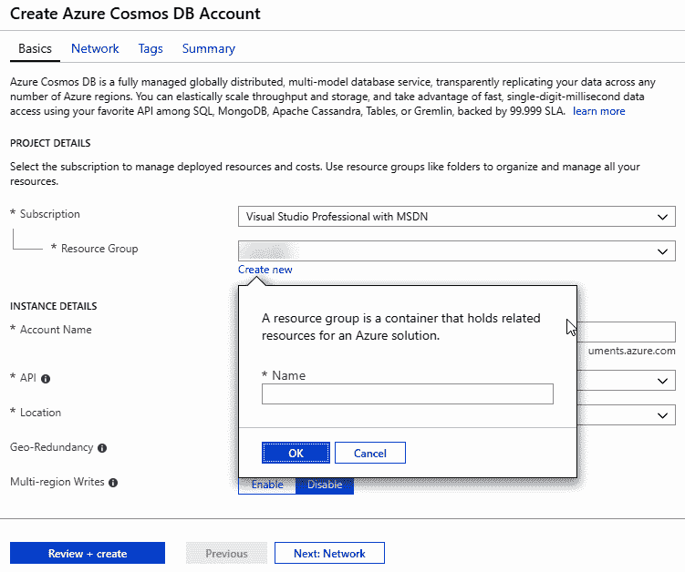

我完成的表单如下所示:


现在让我们更详细地讨论每个选项。

# 订阅/资源组

您的订阅很可能是由您的组织提供的(例如，MyCompanyLtd Dev)，或者您可能正在运行一个私有的 MSDN 订阅。根据您所在组织的规模和您正在开发的产品的规模，您可能会订阅您正在开发的产品，或者订阅整个公司，或者介于两者之间。如果您使用的是 MSDN 帐户，那么它也会出现在这里。

At the time of writing, having an MSDN subscription entitles you to a number of Azure credits each month; the exact number depends on the subscription type.

资源组就是:将资源组合在一起的一种方式。没有规则，但是将具有相似生命周期和目的的资源分组是有意义的。

此图说明了 Azure 中各种层次实体之间的关系:

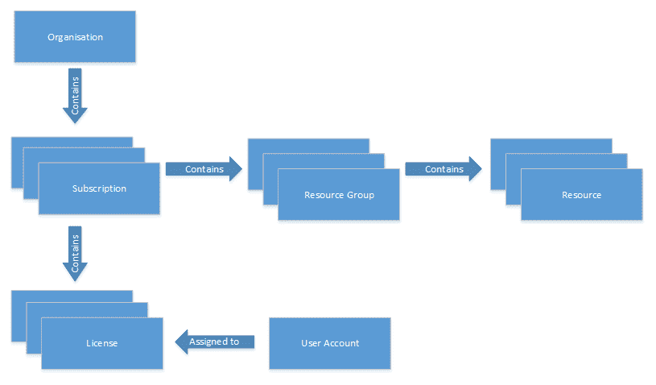

实际上，资源是任何你可以消费和付费的东西。在我们的例子中，我们的Cosmos DB实例是我们的资源；如您所见，这存在于资源组中，而这又存在于订阅中。

虽然对资源组及其管理的详细解释超出了本章(和本书)的范围，但只需将资源视为工具，并将资源组视为工具箱:您可以将管道作业所需的工具(扳手、钳子等)放入工具箱中...)整合到一个工具箱中，以及您可能需要的绘画工具(画笔、遮蔽胶带等)...)放入另一个盒子。资源组是相似的:数据库、使用该数据库的一个或多个应用、监控工具(Application Insights)等都将归入一个资源组。在一个真实的场景中，您可能还会按目的划分这些资源，因此您可能有开发、测试和实时资源组。

将工具箱类比扩展到资源的处理，如果你完成了一项特定类型的工作——例如，如果你不再画画了——你可以简单地将整个工具箱扔进垃圾箱。同样，简单地删除资源组将删除其中的任何资源。

您可能希望做的一件事是将您为这本书创建的所有资源保存在一个资源组中，而不是在最后遵循*清理*过程，只需删除资源组(要么在每章的末尾，要么在书的末尾)。

# 帐户名

帐户名是数据库实例将如何呈现给全世界；你会注意到，当你选择一个名字时，它会被加上`.documents.azure.com`。该名称必须是全局唯一的，也就是说，无论订阅是什么，它在整个 Azure 中都必须是唯一的。你会注意到，当你被要求在 Azure 中命名某个东西时，过一会儿，这个名字会被打上一个勾号(也就是说，你可以使用你选择的名字)或一个叉号(表示你不能这样做，通常是因为它被取了或者格式错误)。

# 应用接口

该应用编程接口允许您以不同的方式与实例交互——例如，我们在这里选择了 MongoDB，这意味着我们将能够像对待 MongoDB 实例一样对待 Cosmos DB 实例。

Setting the API does change the way that you interact with the database, but it does not change the underlying data. At the time of writing, it is not possible to change this selection once you have made it however; it would appear that the functionality to switch this API selection after creation is something that Microsoft would like to introduce in the future.

这是这本书的第二版，在第一版中，本章讨论了与 MongoDB 的接口。通过选择一个 MongoDB API，我们应该能够使用完全相同的代码并简单地切换数据库。

# 位置

位置是一个比我们这里所能涵盖的更大的话题；然而，本质上你是在选择资源的物理位置。因为信息以有限的速度传播，所以你应该仔细考虑这个选择；但是，Cosmos 确实允许有机会在其他物理位置复制数据。因此，如果像我一样，你位于英国，你可以在那里设置位置。但是，比方说，如果你的用户群有 30%位于澳大利亚，那么有了 Cosmos，你就可以在该地区复制你的数据，从而减少延迟。

# 地理冗余/多区域写入

地理冗余和多区域写入设置与 Cosmos 同时在多个物理位置存储数据的能力相关。这两个都是非常大的主题，但基本思想很简单:如果数据安全非常重要，就让数据地理冗余，如果您希望降低延迟时间并从全球多个物理位置进行访问，就启用多区域写入。

As is the case with all Azure services, these services have a cost associated with them. The billing model is relatively complex because the services are complex. If you are concerned about cost, Microsoft provides a calculator ([https://azure.microsoft.com/en-gb/pricing/calculator](https://azure.microsoft.com/en-gb/pricing/calculator)) that will give you an idea of how much any given service might cost.

完成所有这些设置后，选择查看+创建，然后单击创建。

Creating the resource can take a few minutes, so this may be a good time to get a coffee.

# 配置Cosmos DB实例

现在创建了资源，我们可以像对待 MongoDB 一样对待这个数据库实例。首先，我们需要启动数据资源管理器:


从这里，我们可以选择以下选项来创建新集合:


如您所见，我在这里保留了默认值。值得注意的是，固定(10 GB)不是推荐值，在生产级应用中，您很可能希望选择无限制。如果您这样做，那么您将需要提供一个分区密钥。我将吞吐量保留为默认的每秒 1000 **请求单位** ( **RU/s** ):这有效地允许您为所需的性能付费；越慢越便宜(反之亦然)！创建后，您应该能够看到您的新收藏:

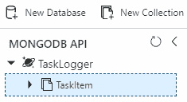

最后要做的是导航到连接字符串选项卡并复制主连接字符串:


现在我们的Cosmos DB实例已经配置好了，我们可以继续创建我们的网络应用并连接到它。

# 将您的 ASP.NET Core MVC 应用连接到Cosmos DB

当谈到在您的应用中使用Cosmos DB时，人们想知道将这一功能添加到一个新的 ASP.NET Core MVC 应用中会有多容易。这个过程真的很简单。首先，创建一个新项目:

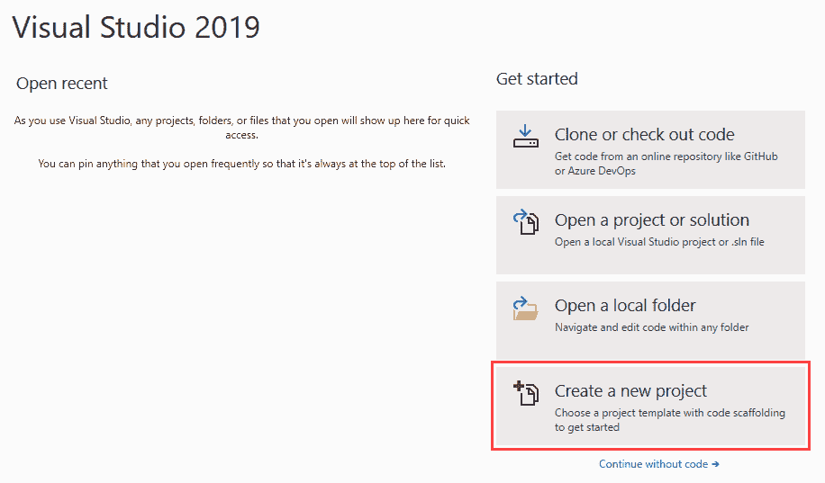

1.  项目名称`BugTracker`:

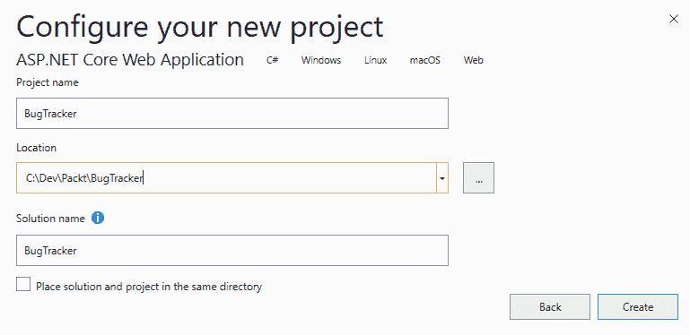

2.  选择创建 ASP.NET Core网络应用的选项:

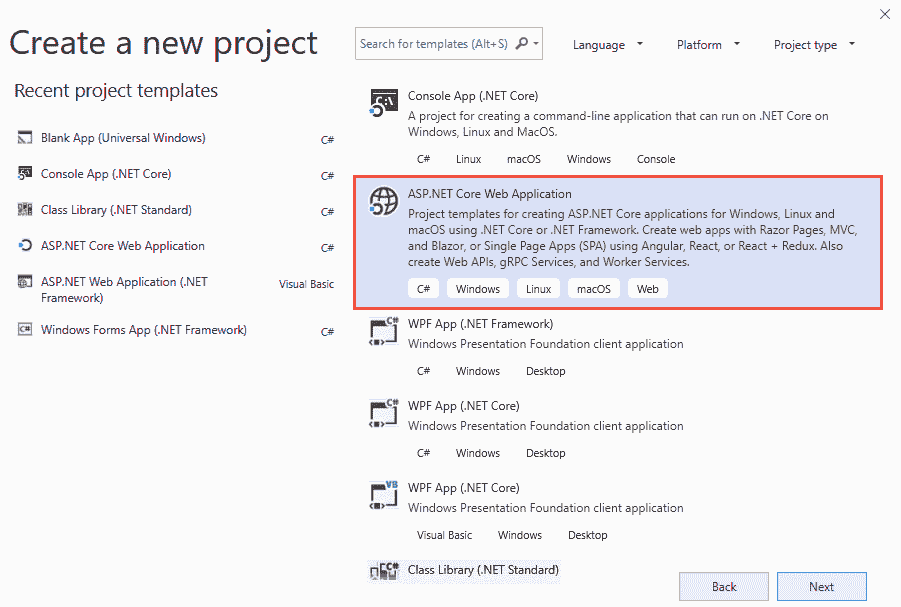

3.  在下一个屏幕上，选择以下选项(在下面的屏幕截图中引用):

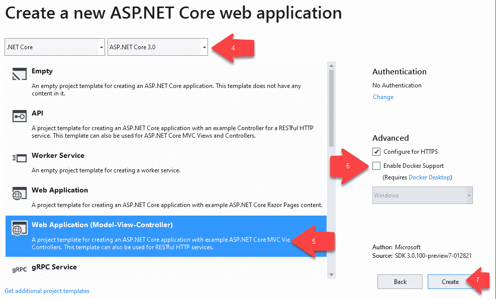

4.  从下拉列表中选择 ASP.NET Core 3.0。
5.  选择网络应用(模型-视图-控制器)。
6.  取消选中启用 Docker 支持选项。最后，点击确定按钮。
7.  单击创建，您的新 ASP.NET Core MVC 应用将被创建。

Enabling Docker support for your application can easily be done at creation time. You can also enable Docker support for existing applications.

我们将在后面的章节中了解 Docker 以及如何让您的应用与 Docker 一起工作。目前，我们的应用不需要 Docker 支持。不要选中它，像平常一样创建应用。

# 添加 NuGet 包

我们需要向我们的项目添加 MongoDB 客户端应用编程接口。最好的方法是添加 NuGet 包。我们可以这样做:

1.  右键单击您的项目，然后选择管理/获取包...从上下文菜单中，如下图所示:

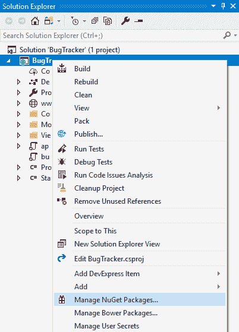

2.  在“获取”屏幕上，选择“浏览”选项卡，并输入`Mongodb.Driver`作为搜索词。
3.  选择 MongoDB。由 MongoDB 选项驱动。

4.  单击“安装”按钮将最新的稳定包添加到您的项目中。这显示在下面的截图中:


5.  您可以在 Visual Studio 的“输出”窗口中查看进度。

6.  将 MongoDB 添加到项目中后，您将看到 MongoDB。驱动程序(2.5.0)已添加到项目的 NuGet 依赖项下，如下图所示:


7.  展开`Controllers`文件夹。你会看到，默认情况下，Visual Studio 已经创建了一个`HomeController.cs`文件。该文件中的代码应该如下所示:

```cs
public class HomeController : Controller
{
    private readonly ILogger<HomeController> _logger;

    public HomeController(ILogger<HomeController> logger)
    {
        _logger = logger;
    }

    public IActionResult Index()
    {
        return View();
    }

    public IActionResult Privacy()
    {
        return View();
    }

    [ResponseCache(Duration = 0, Location = ResponseCacheLocation.None, NoStore = true)]
    public IActionResult Error()
    {
        return View(new ErrorViewModel { RequestId = Activity.Current?.Id ?? HttpContext.TraceIdentifier });
    }
}
```

我们希望能够从这里连接到Cosmos DB，所以让我们创建一些代码来连接到 Mongo 客户端。

You will need to add a `using` statement to your class as follows:

`using MongoDB.Driver;`

连接到 MongoDB 的步骤如下:

1.  通过键入代码片段短代码`ctor`并跳转两次，或者通过显式键入代码来创建构造函数。您的构造函数需要创建一个新的`MongoClient`实例。完成此操作后，您的代码应该如下所示:

```cs
public HomeController() 
{ 
    var mclient = new MongoClient(); 
} 
```

While this illustrates the usage of the `MongoClient`, instantiating a class inside a constructor like this is generally considered bad practice, as it makes it virtually impossible to unit test.

2.  为了让`MongoClient`工作，我们需要给它一个连接字符串到我们创建的 MongoDB 实例。在解决方案“Bug 跟踪器”窗格中打开`appsettings.json`文件，如下图所示:


3.  当您打开您的`appsettings.json`文件时，它应该如下所示:

```cs
{ 
  "Logging": { 
    "IncludeScopes": false, 
    "LogLevel": { 
      "Default": "Warning" 
    } 
  } 
} 
```

4.  这时您将需要之前复制的连接字符串。修改文件并添加 MongoDB 连接细节，如下所示(用您之前复制的值替换`[connectionstring]`):

```cs
{ 
  "MongoConnection": { 
    "ConnectionString": "[connectionstring]", 
    "Database": "TaskLogger" 
  }, 
  "Logging": { 
    "IncludeScopes": false, 
    "LogLevel": { 
      "Default": "Warning" 
    } 
  } 
}
```

5.  我们现在要在`Models`文件夹中创建一个`Settings.cs`文件，如下图截图所示:


6.  打开`Settings.cs`文件，并添加以下代码:

```cs
public class Settings 
{ 
    public string ConnectionString { get; set; } 
    public string Database { get; set; } 
} 
```

7.  我们现在需要打开`Startup.cs`文件，修改`ConfigureServices`方法如下，注册服务:

```cs
public void ConfigureServices(IServiceCollection services) 
{     
    services.AddControllersWithViews();
    services.AddRazorPages();

    services.Configure<Settings>(Options => { Options.ConnectionString = Configuration.GetSection
 ("MongoConnection:ConnectionString").Value; Options.Database = Configuration.GetSection
 ("MongoConnection:Database").Value; }); }
```

8.  返回`HomeController.cs`文件，修改构造函数，将连接字符串传递给`MongoClient`:

```cs
public HomeController(IOptions<Settings> settings) 
{             
    var mclient = new 
     MongoClient(settings.Value.ConnectionString);     
} 
```

9.  此时，我们希望测试我们的代码，看看它是否真的在访问我的 MongoDB 实例。为此，请修改代码以返回集群描述:

```cs
IMongoDatabase _database; 

public HomeController(IOptions<Settings> settings) 
{             
    var mclient = new 
     MongoClient(settings.Value.ConnectionString);             
      _database = mclient.GetDatabase(settings.Value.Database); 
} 

public IActionResult Index() 
{ 
    return Json(_database.Client.Cluster.Description); 
}
```

10.  运行您的 ASP.NET Core MVC 应用，并在浏览器中读取信息输出，如下图所示:

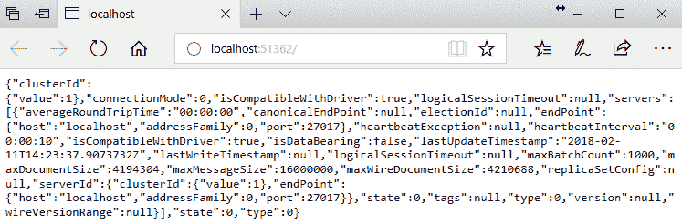

这一切都很好，但是让我们看看如何将添加数据库连接的逻辑分离到自己的类中。

# 创建 MongoDbRepository 类

要创建`MongoDbRepository`类，我们需要经过以下步骤:

1.  在解决方案中创建新文件夹`Data`。在该文件夹中，创建一个名为`MongoDBRepository`的新类:

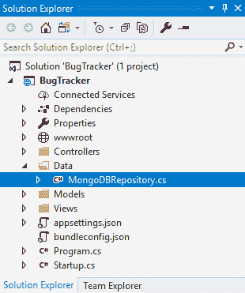

2.  在这个类中，添加以下代码:

```cs
public class MongoDBRepository 
{ 
    public readonly IMongoDatabase Database; 

    public MongoDBRepository(IOptions<Settings> settings) 
    { 
        try 
        { 
            var mclient = new 
             MongoClient(settings.Value.ConnectionString); 
            Database = 
             mclient.GetDatabase(settings.Value.Database); 
        } 
        catch (Exception ex) 
        { 
            throw new Exception("There was a problem connecting 
             to the MongoDB database", ex); 
        } 
    } 
} 
```

如果代码看起来很熟悉，那是因为它与我们在`HomeController.cs`类中编写的代码相同；然而，这一次，它有一点错误处理，并且在它自己的类中。这意味着我们还需要修改`HomeController`类。

3.  在`HomeController`的构造函数和`Index`动作中更改代码。您的代码需要如下所示:

```cs
public MongoDBRepository mongoDb; 

public HomeController(IOptions<Settings> settings) 
{             
    mongoDb =  new MongoDBRepository(settings); 
} 
public IActionResult Index() 
{ 
    return Json(mongoDb.Database.Client.Cluster.Description); 
} 
```

4.  再次运行您的应用，您将在浏览器中看到前面显示的相同信息，因此再次输出到浏览器窗口。

唯一的区别是代码现在被适当地分离了，并且易于重用。因此，如果进一步发生任何变化，它只会在这里更新。

现在我们已经创建了 web 应用，我们可以继续访问和更新数据库实例中的数据了。

# 向 MongoDB 读写数据

在本节中，我们将了解如何从 MongoDB 数据库中读取工作项列表，以及如何向数据库中插入新的工作项(我使用术语“工作项”来指代任务或 bug)。这可以通过执行以下步骤来完成:

1.  在`Models`文件夹中，新建一个名为`WorkItem`的类，如下图截图所示:


2.  将以下代码添加到`WorkItem`类。你会注意到`Id`属于`ObjectId `类型。这表示创建的 MongoDB 文档中的唯一标识符。

You need to ensure that you add the following `using` statement to your `WorkItem` class `using MongoDB.Bson;`.

看看下面的代码:

```cs
public class WorkItem 
{ 
    public ObjectId Id { get; set; } 
    public string Title { get; set; } 
    public string Description { get; set; } 
    public int Severity { get; set; } 
    public string WorkItemType { get; set; } 
    public string AssignedTo { get; set; } 
}
```

3.  接下来，打开`MongoDBRepository`类，并将以下属性添加到该类中:

```cs
public IMongoCollection<WorkItem> WorkItems 
{ 
    get 
    { 
        return Database.GetCollection<WorkItem>("workitem"); 
    } 
} 
```

4.  因为我们至少在使用 C# 6，所以我们可以通过将`WorkItem`属性更改为表达式体属性来进一步简化它。为此，请将代码更改如下:

```cs
public IMongoCollection<WorkItem> WorkItems => Database.GetCollection<WorkItem>("workitem"); 
```

5.  如果这看起来有点混乱，请看下面的截图:


大括号`get`和`return`语句被`=>`λ运算符替换。被返回的对象(在这种情况下，`WorkItem`对象的集合)在 lambda 操作符之后。这导致了表达式体属性。

# 创建接口和工作项服务

接下来，我们需要创建一个接口。为此，我们需要完成以下步骤:

1.  在您的解决方案中创建新的名为`Interfaces`的文件夹，并将名为`IWorkItemService`的界面添加到`Interfaces`文件夹中，如下图所示:

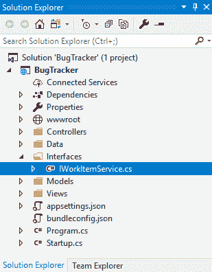

2.  在`IWorkItemService`界面添加以下代码:

```cs
public interface IWorkItemService 
{ 
    IEnumerable<WorkItem> GetAllWorkItems(); 
}
```

3.  在您的`Data`文件夹中，添加另一个名为`WorkItemService`的类，并使其实现`IWorkItemService`界面。

Be sure to add the `using` statement to reference your interface. In my example, this is the `using BugTracker.Interfaces;` statement.

4.  您会注意到 Visual Studio 会提示您实现该接口。为此，单击灯泡提示，然后从上下文菜单中单击实施界面，如下图所示:

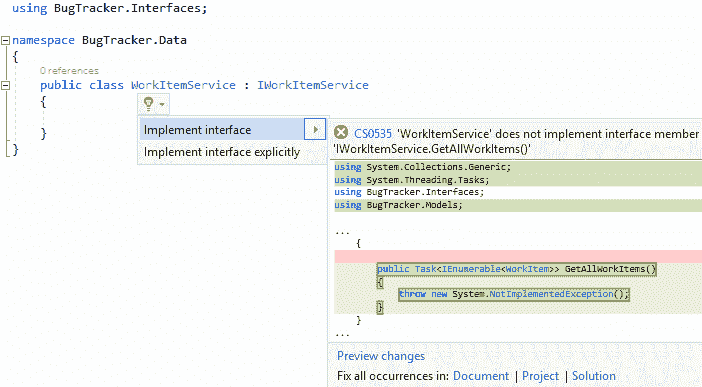

5.  完成此操作后，您的`WorkItemService`类将显示如下:

```cs
public class WorkItemService : IWorkItemService 
{ 
    public IEnumerable<WorkItem> GetAllWorkItems() 
    { 
        throw new System.NotImplementedException(); 
    } 
}
```

6.  接下来，添加一个构造函数并完成`GetAllWorkItems`方法，这样您的类就如下所示:

```cs
public class WorkItemService : IWorkItemService 
{ 
    private readonly MongoDBRepository repository; 

    public WorkItemService(IOptions<Settings> settings) 
    { 
        repository = new MongoDBRepository(settings); 
    } 

    public IEnumerable<WorkItem> GetAllWorkItems() 
    { 
        return repository.WorkItems.Find(x => true).ToList(); 
    } 
} 
```

7.  您现在需要打开您的`Startup.cs`文件并编辑`ConfigureServices`方法来添加以下代码行:

```cs
services.AddScoped<IWorkItemService, WorkItemService>(); 
```

8.  您的`ConfigureServices`方法现在将如下所示:

```cs
public void ConfigureServices(IServiceCollection services) 
{ 
    services.AddMvc(); 

    services.Configure<Settings>(Options => 
    { 
        Options.ConnectionString = Configuration.GetSection("MongoConnection:ConnectionString").Value; 
        Options.Database = Configuration.GetSection("MongoConnection:Database").Value; 
    }); 

    services.AddScoped<IWorkItemService, WorkItemService>(); 
} 
```

你所做的是注册`IWorkItemService`界面；这将类`WorkItemService`添加到依赖注入框架中。有关依赖注入的更多信息，请阅读以下文章[。](https://docs.microsoft.com/en-us/aspnet/core/fundamentals/dependency-injection)

# 创建视图

当我们启动应用时，我们希望看到一个工作项列表。因此，我们需要通过以下步骤为`HomeController`创建一个视图来显示工作项列表:

1.  在`Views`文件夹中，展开`Home`子文件夹并删除`Index.cshtml`文件(如果有)。
2.  然后，右键单击`Home`文件夹，从上下文菜单导航至添加|查看。将显示添加 MVC 视图窗口。
3.  命名视图`Index`，选择列表作为模板。从模型类的下拉列表中，选择工作项(错误跟踪程序。车型)。
4.  保持其余设置不变，然后单击添加按钮:

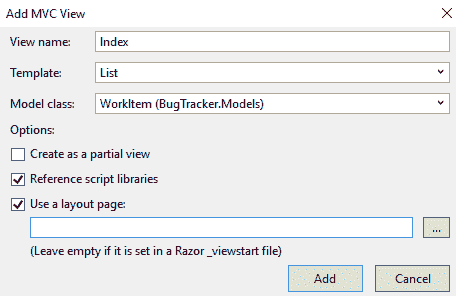

添加视图后，您的解决方案资源管理器将如下所示:

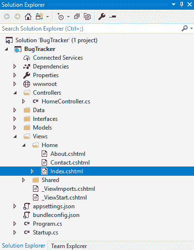

5.  仔细查看视图，您会注意到它使用`IEnumerable<BugTracker.Models.WorkItem>`作为模型:

```cs
@model IEnumerable<BugTracker.Models.WorkItem> 

@{ 
    ViewData["Title"] = "Work Item Listings"; 
} 
```

这允许我们迭代返回的`WorkItem`对象的集合，并在列表中输出它们。还要注意的是`ViewData["Title"]`已经从`Index`更新为`Work Item Listings`。

# 修改家庭控制器

在运行我们的应用之前，我们需要做的最后一件事是修改`HomeController`类以使用`IWorkItemService`。让我们通过以下步骤进行设置:

1.  如下修改构造函数和`Index`动作:

```cs
private readonly IWorkItemService _workItemService; 

public HomeController(IWorkItemService workItemService) 
{ 
    _workItemService = workItemService; 

} 

public IActionResult Index() 
{ 
    var workItems = _workItemService.GetAllWorkItems(); 
    return View(workItems); 
} 
```

通过这段代码，我们获得了 MongoDB 数据库中的所有工作项，并将它们传递给视图，以便模型使用。

2.  完成后，运行应用，如下图所示:

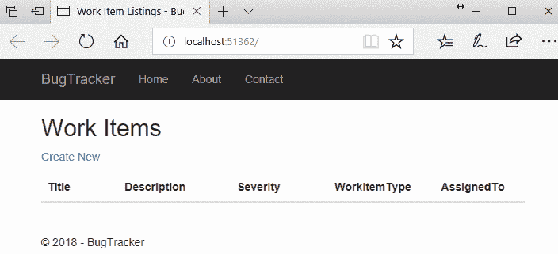

此时，数据库中没有工作项，因此我们在浏览器中看到了这个空列表。接下来，我们将添加代码，将工作项插入到我们的 MongoDB 数据库中。

# 添加工作项

让我们通过以下步骤来添加工作项:

1.  要添加工作项，让我们从添加一个名为`AddWorkItem`的类到我们的`Models`文件夹开始，如下图所示:

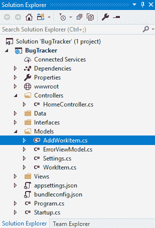

2.  修改类中的代码，使其本质上类似于`WorkItem`类:

```cs
public class AddWorkItem 
{ 
    public string Title { get; set; } 
    public string Description { get; set; } 
    public int Severity { get; set; } 
    public string WorkItemType { get; set; } 
    public string AssignedTo { get; set; } 
}
```

3.  接下来，在`Views`文件夹下创建一个名为`AddWorkItem`的新文件夹。右键单击`AddWorkItem`文件夹，选择添加，然后在上下文菜单中单击查看。
4.  将显示添加 MVC 视图窗口。调用视图`AddItem`并选择为模板创建。
5.  从模型类的下拉列表中，选择添加工作项(错误跟踪程序。车型)。
6.  保持其余设置不变，点击添加按钮，如下图所示:

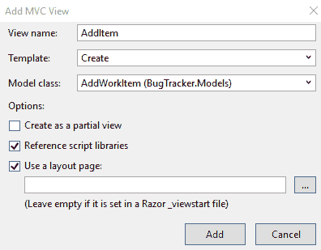

7.  打开`AddItem.cshtml`文件，看一下表单动作。确保设置为`CreateWorkItem`。下面的代码片段显示了代码应该是什么样子:

```cs
<div class="row"> 
  <div class="col-md-4"> 
     <form asp-action="CreateWorkItem"> 
         <div asp-validation-summary="ModelOnly" class="text-danger"></div> @*Rest of code omitted for brevity*@ 
```

您的`Views`文件夹现在应该如下所示:

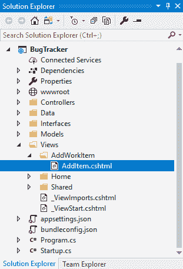

8.  现在，我们需要对我们的`IWorkItemService`界面做一个小小的改变。修改界面中的代码，如下所示:

```cs
public interface IWorkItemService 
{ 
    IEnumerable<WorkItem> GetAllWorkItems(); 
    void InsertWorkItem(WorkItem workItem); 
} 
```

我们刚刚指定了实现`IWorkItemService`接口的类必须有一个名为`InsertWorkItem`的方法，该方法采用`WorkItem`类型的参数。这意味着我们需要绕过`WorkItemService`并添加一个名为`InsertWorkItem`的方法。我们在`WorkItemService`界面的代码如下:

```cs
private readonly MongoDBRepository repository; 

public WorkItemService(IOptions<Settings> settings) 
{ 
    repository = new MongoDBRepository(settings); 
} 

public IEnumerable<WorkItem> GetAllWorkItems() 
{ 
    return repository.WorkItems.Find(x => true).ToList(); 
} 

public void InsertWorkItem(WorkItem workItem) 
{ 
    throw new System.NotImplementedException(); 
} 
```

9.  更改`InsertWorkItem`方法，将`WorkItem`类型的单个对象添加到我们的 MongoDB 数据库中。将代码更改如下:

```cs
public void InsertWorkItem(WorkItem workItem) 
{ 
    repository.WorkItems.InsertOne(workItem);
}
```

10.  现在，我们需要稍微修改一下我们的`WorkItem`类。向类中添加两个构造函数，一个以`AddWorkItem`对象为参数，另一个完全不取参数:

```cs
public class WorkItem 
{ 
    public ObjectId Id { get; set; } 
    public string Title { get; set; } 
    public string Description { get; set; } 
    public int Severity { get; set; } 
    public string WorkItemType { get; set; } 
    public string AssignedTo { get; set; } 

    public WorkItem() 
    { 

    } 

    public WorkItem(AddWorkItem addWorkItem) 
    { 
        Title = addWorkItem.Title; 
        Description = addWorkItem.Description; 
        Severity = addWorkItem.Severity; 
        WorkItemType = addWorkItem.WorkItemType; 
        AssignedTo = addWorkItem.AssignedTo; 
    } 
} 
```

我们添加第二个不带参数的构造函数的原因是为了让 MongoDB 能够反序列化`WorkItem`。

During deserialization, an instance of the object is created. As a result, a parameterless constructor is necessary; otherwise, the deserialization would be unable to create the object (as it has no way of determining the relevant parameters.) 

11.  我们现在需要向我们的项目添加另一个控制器。右键单击`Controllers`文件夹，添加一个名为`AddWorkItemController`的新控制器。请随意将此添加为空控制器。我们将在下面自己添加代码:

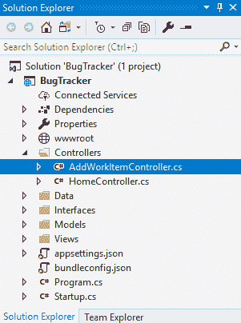

12.  在`AddWorkItemController`控制器中，添加以下代码:

```cs
private readonly IWorkItemService _workItemService; 

public AddWorkItemController(IWorkItemService workItemService) 
{ 
    _workItemService = workItemService; 
} 

public ActionResult AddItem() 
{ 
    return View(); 
} 

[HttpPost] 
public ActionResult CreateWorkItem(AddWorkItem addWorkItem) 
{ 
    var workItem = new WorkItem(addWorkItem); 
    _workItemService.InsertWorkItem(workItem); 
    return RedirectToAction("Index", "Home"); 
} 
```

你会注意到`HttpPost`动作被称为`CreateWorkItem`。这就是`AddItem.cshtml`文件有一个名为`CreateWorkItem`的表单动作的原因。它告诉视图在单击“创建”按钮时在控制器上调用什么操作。

# 重定向到工作项列表

另一个值得注意的有趣的事情是，在我们调用`WorkItemService`上的`InsertWorkItem`方法之后，我们将视图重定向到`HomeController`上的`Index`动作。正如我们已经知道的，这将把我们带到工作项目列表。让我们给`AddWorkItem`打个电话:

1.  修改`HomeController`代码，增加另一个叫做`AddWorkItem`的动作；这将调用`AddWorkItemController`类上的`AddItem`动作:

```cs
public ActionResult AddWorkItem() 
{ 
    return RedirectToAction("AddItem", "AddWorkItem"); 
} 
Your HomeController code will now look as follows: 
private readonly IWorkItemService _workItemService; 

public HomeController(IWorkItemService workItemService) 
{ 
    _workItemService = workItemService;             
} 

public IActionResult Index() 
{ 
    var workItems = _workItemService.GetAllWorkItems(); 
    return View(workItems); 
} 

public ActionResult AddWorkItem() 
{ 
    return RedirectToAction("AddItem", "AddWorkItem"); 
} 
```

2.  现在，让我们稍微修改一下`Index.cshtml`视图。为了使索引视图上的列表更加直观，修改`Index.cshtml`文件。

3.  添加一个`if`语句，如果列表为空，允许从列表中添加新的工作项。

4.  添加一个`ActionLink`在点击`AddWorkItemController`时调用`AddWorkItem`动作(注意我们提供了一个空白区域来强制该动作相对于根而不是`HomeController`):

```cs
@if (Model.Count() == 0)
{
    <tr>
        <td colspan="6">There are no Work Items in BugTracker. @Html.ActionLink(linkText: "Add your first Work Item", actionName: "AddItem", controllerName: "AddWorkItem") now.
        </td>
    </tr>
}
else
{
    @foreach (var item in Model)
    {
    <tr>
        <td>
            @Html.DisplayFor(modelItem => item.Title)
        </td>
        <td>
            @Html.DisplayFor(modelItem => item.Description)
        </td>
        <td>
            @Html.DisplayFor(modelItem => item.Severity)
        </td>
        <td>
            @Html.DisplayFor(modelItem => item.WorkItemType)
        </td>
        <td>
            @Html.DisplayFor(modelItem => item.AssignedTo)
        </td>
        <td>
            @Html.ActionLink("Edit", "Edit", new { /* 
             id=item.PrimaryKey */ }) |
            @Html.ActionLink("Details", "Details", new { /* 
             id=item.PrimaryKey */ }) |
            @Html.ActionLink("Delete", "Delete", new { /* 
             id=item.PrimaryKey */ })
        </td>
    </tr>
    }
}
```

5.  现在，将`Create New` `asp-action`包装在下面的`if`语句中:

```cs
@if (Model.Count() > 0) 
{ 
<p> 
    <a asp-action="Create">Create New</a> 
</p> 
} 
```

我们将在稍后讨论这个问题。现在来看一下应用的逻辑，我们可以看到`HomeControllerIndex`动作列出了工作项。当我们点击添加您的第一个工作项目链接时，我们在`HomeController`上调用`AddWorkItem`操作。

`AddWorkItemController`上的`AddWorkItem`动作反过来调用`AddWorkItemController`上的`AddItem`动作。这只是返回到`AddItem`视图，在这里我们输入工作项的详细信息并点击创建按钮。

“创建”按钮依次使用`HttpPost`，由于`AddItem`视图上的表单操作指向`AddWorkItemController`类上的`CreateWorkItem`操作，因此我们将工作项插入到 MongoDB 数据库中，并通过对`HomeController`上的`Index`操作执行`RedirectToAction`调用来重定向回工作项列表。

Now, at this point, if you are thinking that this is a long-winded way to redirect back to the `HomeController` just to redirect to the `AddItem` action on the `AddWorkItemController`, then you're 100% correct. I will show you a quick way to redirect straight to the `AddItem` action on the `AddWorkItemController` when the user clicks on the link to create a new work item. For now, just bear with me; I'm trying to show you how we can interact with controllers and actions.

现在，再次运行您的应用:


您将看到列表中的一个链接允许您添加第一个工作项。

这是重定向回`AddWorkItemController`上的`AddWorkItem`动作的链接。要运行它，请执行以下操作:

1.  点击链接，您将看到输出，如下图所示:


2.  这将带您进入添加新工作项的视图。在字段中输入一些信息，然后单击创建按钮:

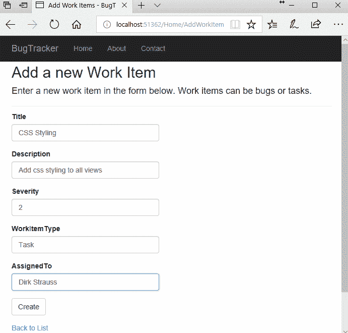

3.  创建按钮调用`AddWorkItemController`上的`CreateWorkItem`操作，并重定向回`HomeController`的`Index`操作上的工作项目列表:


4.  您可以看到“新建”链接现在显示在列表的顶部。让我们修改`Index.cshtml`视图，使该链接直接重定向到`AddWorkItemController`类上的`AddItem`动作。按照以下步骤更换剃须刀:

```cs
@if (Model.Count() > 0) 
{ 
<p> 
    @Html.ActionLink("Create New", "AddWorkItem/AddItem") 
</p> 
} 
```

您可以看到，我们可以指定应用必须采取的路由，以获得正确的操作。在这种情况下，我们说当点击创建新链接时，我们必须调用`AddWorkItemController`类上的`AddItem`动作。

再次运行您的应用，然后单击“新建”链接。您将看到您被重定向到我们之前添加了工作项的输入表单。

The default styling of the views doesn't look too shabby, but they are definitely not the most beautiful designs out there. This, at least, gives you, as a developer, the ability to go back and style the screens with CSS, to prettify them according to your needs. For now, the dull screens are 100% functional and good enough for our purposes.

打开 MongoDB Compass，您会看到其中有一个工作项文档。查看该文档，您将看到我们刚刚从 ASP.NET Core MVC 应用中添加的信息:


我们现在有了一个网站的工作实例。如果你计划扩展这个应用，那么这将是本章的结尾；否则，下一节将讨论如何分解您创建的资源。

# 清理资源

如前所述，微软根据您的使用情况从 Azure 赚钱。为了避免产生成本，您应该总是清理(即删除)不再需要的资源。如果像我一样，您命名了您的Cosmos DB实例错误跟踪器，那么您可以返回到Cosmos DB刀片(您以前可能已经将它固定在您的仪表板上；否则，您应该搜索这个)并选择实例。

然后只需选择删除帐户:

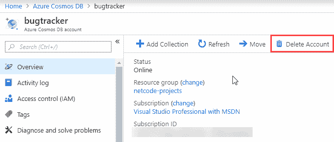

与许多 Azure 资源一样，您必须完成第二步来确认您确实想要删除资源:

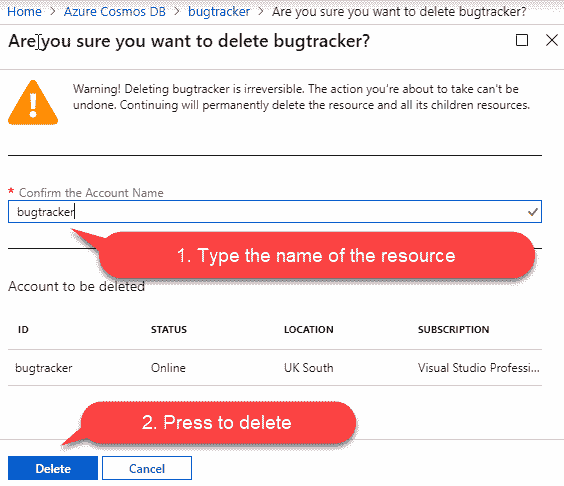

可能需要几秒钟才能完成，然后就完成了。

# 摘要

说到 Cosmos DB 和 ASP.NET Core MVC，还是有很多可以学习的。一章当然不足以涵盖全部。数据库位于强大、昂贵的服务器上的日子屈指可数了，这些服务器被放置在办公室的一个机架上，只有一个人有钥匙。这可以看做是好是坏:没有人会意外拔掉或重启服务器，本地停电也不会对其产生任何影响；然而，你(或你的雇主)现在用英镑和便士(或美元和美分)支付低效查询的费用。

在下一章中，我们将了解一下 Azure 上的 SignalR 以及如何创建实时聊天应用。