# 以实体框架为核心的网络研究工具

"The biggest lie I tell myself is that I don't need to write it down, I'll remember it."     – Unknown

所以，你有几分钟时间补上你的资料。当你滚动浏览时，你会看到一篇文章的链接，文章中有人分享了记忆吉他和弦的新方法。你很想看，但是你现在时间不够。*我以后再看，*你告诉自己，以后就成了永远。主要是因为你没有写下来。

有各种各样的应用程序可以满足您保存链接以备后用的需求。但我们是开发者。让我们尽情享受自己写作的乐趣吧！

在本章中，我们将研究以下主题:

*   **实体框架** ( **EF** )核心历史
*   代码优先对模型优先对数据库优先的方法
*   开发数据库设计
*   设置项目
*   安装英孚核心
    *   创建模型
    *   配置服务
    *   创建数据库
    *   用测试数据播种数据库
    *   创建控制器
    *   运行应用程序

*   测试应用程序
*   部署应用程序

说得很有道理，但别担心，我们会一步一步来。我们去散步吧。

# 实体框架核心历史

开发一个需要从某种数据库中读取数据和向某种数据库中写入数据的应用程序，最令人沮丧的部分之一是试图建立代码和数据库之间的通信层。

至少以前是这样，直到实体框架进入画面！

实体框架是一个**对象关系映射器** ( **ORM** )。它映射了你的。NET 代码对象到关系数据库实体。就这么简单。现在，您不必仅仅为了处理简单的 CRUD 操作而关注构建所需的数据访问代码。

当实体框架的第一个版本发布时。NET 3.5 SP1 在 2008 年 8 月，最初的反应并没有那么好——以至于一群开发人员签署了对框架的不信任投票。令人欣慰的是，提出的大多数问题都得到了解决，实体框架 4.0 的发布以及。NET 4.0，把很多关于框架稳定性的批评都抛到了脑后。

实体框架核心是一个完整的重写。微软表示，他们并没有试图在 EF6 和 EF Core 之间实现对等；虽然他们支持许多相同的功能，但英孚核心给了他们机会来解决一些可能不再有意义的原始决定。

# 代码优先对模型优先对数据库优先的方法

使用实体框架，您可以在三种实现方法之间进行选择。然而，在实体框架核心中，实际上只有一个:代码优先。虽然数据库优先的概念确实存在，但它是一张单程票:也就是说，您可以从数据库中逆向工程代码模式，但从那时起，您可以从代码中生成数据库模型。

# 开发数据库设计

只有知道自己在做什么，我们才能知道自己在做什么。在我们开始使用我们的数据库、模型和控制器创建解决方案之前，我们需要弄清楚我们想要如何设计数据库。

根据微软的 TechNet，我们可以遵循五个基本步骤来规划数据库:

1.  收集信息
2.  识别对象
3.  建模对象
4.  确定每个对象的信息类型
5.  识别对象之间的关系

我们的要求很简单。我们只需要保存一个 web 链接，以便以后导航，这样我们就不会有多个对象之间存在关系。

然而，我们确实需要澄清我们希望为我们的对象(网络链接)保存的信息类型。显然，我们需要网址，但我们还需要什么？确保您了解您的解决方案需要哪些信息以及如何使用这些信息。

用日常用语来思考这个问题——如果你写了一个朋友家的地址，你可能想要的不仅仅是一条街道；可能是你朋友的名字或者某种纸条。

在我们的解决方案中，我们想知道网址是什么，但我们也想知道我们何时保存了它，并有一个位置来捕获注释，以便我们可以为条目添加更多的个人详细信息。因此，我们的模型将包含以下内容:

*   `URL`
*   `DateSaved`
*   `Notes`

当我们开始创建我们的模型时，我们会更详细地讨论，但是我们不要操之过急。我们仍然需要创建我们的项目。

# 设置项目

使用 Visual Studio 2019，创建 ASP.NET 核心网络应用程序:

1.  创建新的 ASP.NET 核心网络应用程序:

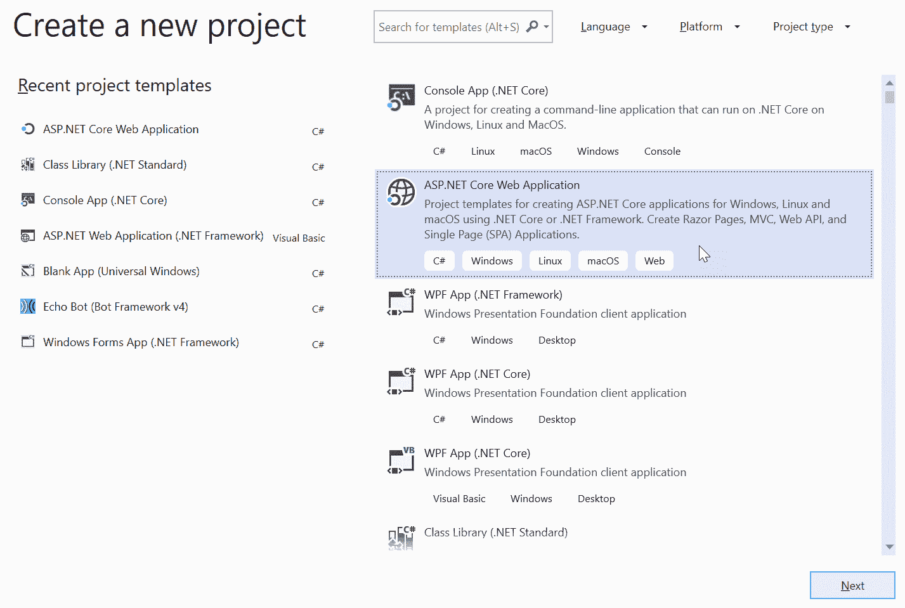

2.  我们把这个应用叫做`WebResearch`。这显示在下面的截图中:

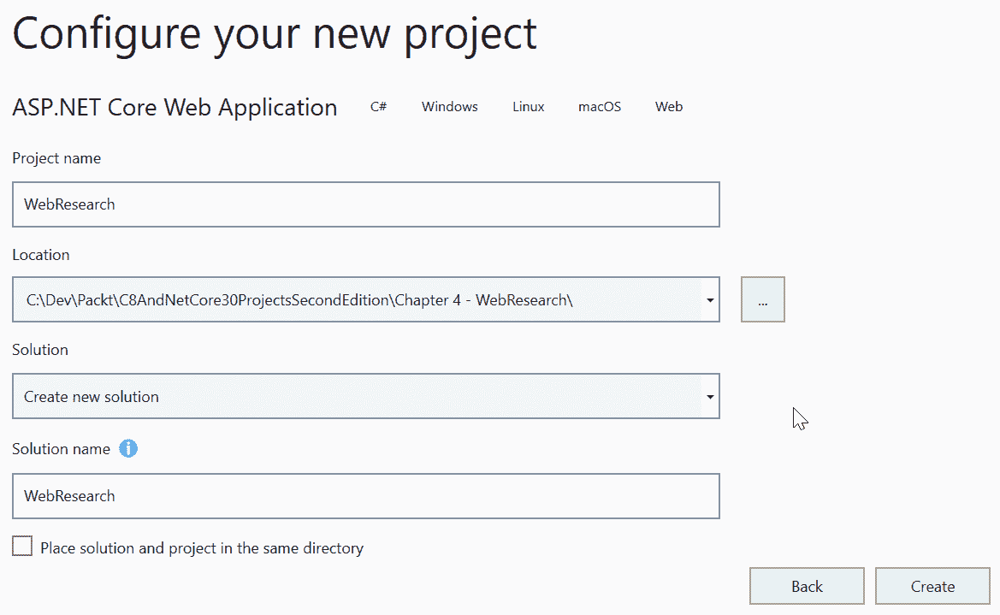

3.  在下一个屏幕上，选择网络应用程序(模型-视图-控制器)作为项目模板。为了简单起见，将身份验证保持为“无身份验证”。参考以下截图:

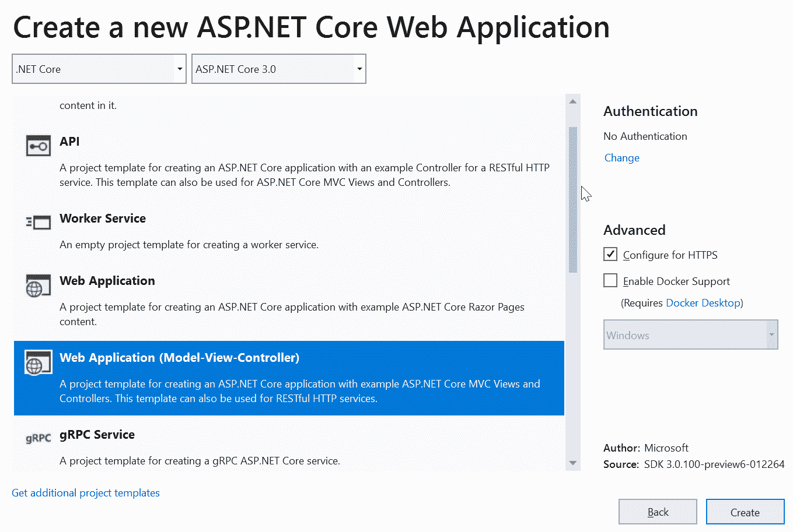

4.  创建的项目将如下所示:


现在我们已经设置了项目，让我们安装所需的包！

# 安装所需的软件包

我们需要为我们的解决方案安装三个 NuGet 包，这将有助于我们的探索。这是通过包管理器控制台完成的。

转到工具|否获取包管理器|包管理器控制台:

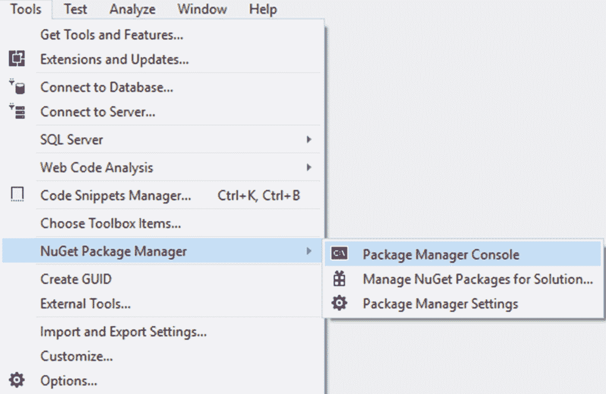

We saw the Package Manager Console previously; however, it's worth pointing out that this is more than it seems (or at least more than its name would suggest). The Package Manager Console is, effectively, a PowerShell console running in the context of your solution.

# 英孚核心 SQL 服务器

EF Core 提供各种数据库提供商，包括微软的 SQL Server、PostgreSQL、SQLite 和 MySQL。这里我们将使用 SQL Server 作为数据库提供程序。

For a full list of database providers, have a look at the official Microsoft documentation at [https://docs.microsoft.com/en-us/ef/core/providers/index](https://docs.microsoft.com/en-us/ef/core/providers/index).

在控制台窗口中，键入以下命令并点击 *Ente* *r* :

```cs
Install-Package Microsoft.EntityFrameworkCore.SqlServer  
```

您应该会看到一些响应行，显示成功安装的项目。

# 英孚核心工具

接下来，我们将安装一些英孚核心工具，帮助我们从模型中创建数据库。

在控制台窗口中，输入以下命令并点击*进入*:

```cs
Install-Package Microsoft.EntityFrameworkCore.Tools
```

同样，您应该会看到一些响应行，显示成功安装的项目。

# 代码生成设计

我们可以使用一些 ASP.NET 核心代码生成工具来帮助我们搭建脚手架，而不是自己编写所有的代码。

在控制台窗口中，输入以下命令并点击*进入*:

```cs
Install-Package Microsoft.VisualStudio.Web.CodeGeneration.Design
```

像往常一样，检查你是否拿到了`Successfully Installed`物品。

If you have problems installing any NuGet packages, this may be pointing to an access control issue. As a general rule, I set up my Visual Studio to run as administrator, which sorts out most of those sorts of problems.

安装后，我们的解决方案将在依赖项部分下反映添加的 NuGet 包，如下所示:

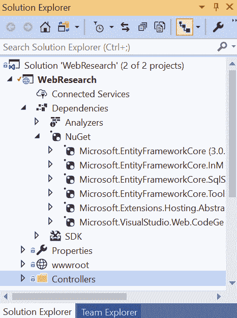

# 创建模型

右键单击项目中的模型文件夹，并添加一个名为`ResearchModel.cs`的类:


我们实际上需要两个类——一个`Research`类，它是我们的`entity`对象的表示，另一个,`ResearchContext`，它是`DbContext`的子类。为了简单起见，我们可以将这两个类都放在我们的`ResearchModel`文件中。下面是代码:

```cs
using Microsoft.EntityFrameworkCore; 
using System; 

namespace WebResearch.Models 
{ 
    public class Research 
    { 
        public int Id { get; set; } 
        public string Url { get; set; } 
        public DateTime DateSaved { get; set; } 
        public string Note { get; set; } 
    } 

    public class ResearchContext : DbContext 
    { 
        public ResearchContext(DbContextOptions<ResearchContext> 
        options) : base(options) 
        { 
        } 

        public DbSet<Research> ResearchLinks { get; set; } 
    } 
} 
```

让我们把它分解如下:

*   首先，我们有我们的`Research`类，这是我们的`entity`对象表示。正如我们在*开发数据库设计*部分提到的，对于每个链接，我们将保存网址、日期和注释。标识字段是保存信息的数据库表的标准做法。
*   我们的第二类`ResearchContext`，是`DbContext`的子类。这个类将有一个以`DbContextOptions`为参数的空构造函数和一个用于数据收集的`DbSet<TEntity>`属性。

我可以在这里给你一个关于`DbSet<Entity>`的简单概述，但是我更愿意让 Visual Studio 帮助我们。让我们看看下面的屏幕:

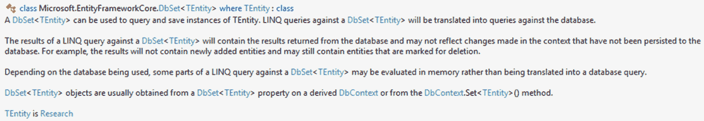

如果你悬停在`DbSet`上，你会得到一个信息弹出窗口，里面有你需要知道的一切！

# 配置服务

在`Startup.cs`类中，在`ConfigureServices`方法中，添加带有以下代码的`DbContext`服务:

```cs
string connection = Configuration.GetConnectionString("LocalDBConnection"); 
services.AddDbContext<ResearchContext>(options => options.UseSqlServer(connection)); 
```

如您所见，我们从配置中设置了一个连接字符串变量，然后将其作为`DbContext`的`options`参数传递给`SqlServer`。

但是坚持住。`LocalDBConnection`从何而来？我们的配置中没有设置任何内容。反正还没有。我们现在就去做吧。

在项目根目录下打开`appsettings.json`文件:

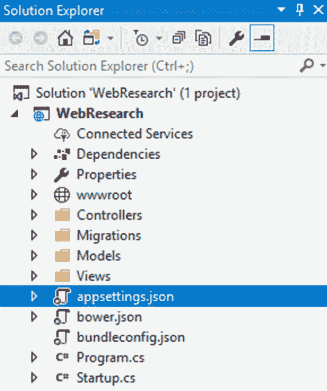

默认情况下，您应该会看到一个日志条目。在`Logging`部分后添加您的`ConnectionStrings`部分，并添加一个`LocalDBConnection`属性。

完整的文件应该如下所示:

```cs
{ 
  "Logging": { 
    "IncludeScopes": false, 
    "LogLevel": { 
      "Default": "Warning" 
    } 
  }, 

  "ConnectionStrings": { 
    "LocalDBConnection": "Server=(localdb)\mssqllocaldb; 
     Database=WebResearch;  
     Trusted_Connection=True" 
  } 
} 
```

稍后，我们将了解如何连接到现有数据库，但目前，我们只是连接到本地`db`文件。

# 创建数据库

在任何应用程序的开发阶段，您的数据模型很有可能会改变。当这种情况发生时，您的 EF 核心模型与数据库模式不同，您必须删除过时的数据库，并基于更新的模型创建一个新的数据库。

在您完成第一次实时实现并且您的应用程序在生产环境中运行之前，这都是有趣的游戏。您不能为了更改几列就删除数据库。当您进行任何更改时，您必须确保实时数据持续存在。

EF Core 迁移是一个漂亮的特性，它允许我们对数据库模式进行更改，而不是重新创建数据库和丢失生产数据。迁移有很多可能的功能和灵活性，这是一个非常值得花时间研究的话题，但我们现在只讨论一些基础知识。

我们可以使用包管理器控制台中的 EF 核心迁移命令来设置、创建和更新数据库(如果需要)。

在包管理器控制台中，我们将执行以下两个命令:

*   `Add-Migration InitialCreate`
*   `Update-Database`

第一个命令将在项目的`Migrations`文件夹中生成代码，用于创建数据库。这些文件的命名约定是`<timestamp>_InitialCreate.cs`。

第二个命令将创建数据库并运行`Migrations`:


`InitialCreate`类中`Note`有两种方法:`Up`和`Down`。简单来说，升级应用程序时执行`Up`方法代码，降级应用程序时运行`Down`方法代码。

假设我们想给我们的`Research`模型添加一个布尔属性，称为`Read`。为了保持这个值，我们显然还需要将该列添加到我们的表中，但是我们不想为了添加一个字段而删除该表。通过迁移，我们可以更新表，而不是重新创建表。

我们将从改变我们的模型开始。在`Research`类中，添加`Read`属性。我们的课将如下所示:

```cs
public class Research 
{ 
    public int Id { get; set; } 
    public string Url { get; set; } 
    public DateTime DateSaved { get; set; } 
    public string Note { get; set; } 
    public bool Read { get; set; } 
} 
```

接下来，我们将添加一个迁移。我们将使用迁移名称作为我们正在做什么的指示。在包管理器控制台中执行以下命令:

```cs
Add-Migration AddReseachRead
```

你会注意到我们的`Migrations`文件夹中有一个新的类:


让我们看看引擎盖下。你会看到我们的`Up`和`Down`方法并不像它们在`InitialCreate`类中那样空洞:


如前所述，`Up`方法在升级期间执行，`Down`方法在降级期间执行。现在我们可以看到代码了，这个概念清楚多了。在`Up`方法中，我们添加了`Read`列，在`Down`方法中，我们删除了该列。

如果需要，我们可以对这段代码进行修改。例如，我们可以通过更新代码来更改`Read`列的`nullable`属性，使其如下所示:

```cs
protected override void Up(MigrationBuilder migrationBuilder) 
{ 
    migrationBuilder.AddColumn<bool>( 
        name: "Read", 
        table: "ResearchLinks", 
        nullable: true, 
        defaultValue: false); 
} 
```

我们还可以添加一个自定义的 SQL 查询，将所有现有条目更新到`Read`:

```cs
migrationBuilder.Sql( 
    @" 
        UPDATE Research 
        SET Read = 'true'; 
    "); 
```

我知道这不是一个很好的例子，因为你不会希望每次更新数据库时所有的`Research`条目都被标记为`Read`，但希望你理解这个概念。

不过这段代码还没有被执行。因此，目前，我们的模型和数据库模式仍然不同步。

再次执行以下命令，我们将了解最新情况:

```cs
Update-Database
```

# 用测试数据播种数据库

现在我们有了一个空的数据库，让我们用一些测试数据来填充它。为此，我们需要创建一个在数据库创建后调用的方法:

1.  在项目中创建一个名为`Data`的文件夹。在这个文件夹中，添加一个名为`DbInitializer.cs`的类:

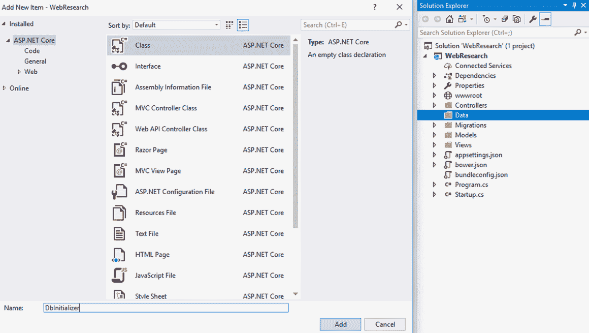

这个类有一个`Initialize`方法，以我们的`ResearchContext`为参数:

```cs
public static void Initialize(ResearchContext context) 
```

2.  在`Initialize`方法中，我们调用`Database.EnsureCreated`方法来确保数据库存在，如果不存在则创建数据库:

```cs
context.Database.EnsureCreated(); 
```

3.  接下来，我们做一个快速的`Linq`查询来检查`ResearchLinks`表是否有记录。论点是，如果表是空的，我们想添加一些测试数据:

```cs
if (!context.ResearchLinks.Any()) 
```

4.  然后，我们创建一个`Research`模型的数组，并添加一些测试条目。网址可以是你喜欢的任何东西。我只是去了几个最常见的网站:

```cs
var researchLinks = new Research[] 
{ 
 new Research{Url="www.google.com", DateSaved=DateTime.Now, 
  Note="Generated Data", Read=false}, 
       new Research{Url="www.twitter.com", DateSaved=DateTime.Now,  
  Note="Generated Data", Read=false}, 
       new Research{Url="www.facebook.com", DateSaved=DateTime.Now, 
  Note="Generated Data", Read=false}, 
       new Research{Url="www.packtpub.com", DateSaved=DateTime.Now, 
  Note="Generated Data", Read=false}, 
       new Research{Url="www.linkedin.com", DateSaved=DateTime.Now,  
  Note="Generated Data", Read=false}, 
}; 
```

5.  填充数组后，我们遍历数组，将条目添加到上下文中，并调用`SaveChanges`方法将数据保存到数据库中:

```cs
foreach (Research research in researchLinks) 
{ 
    context.ResearchLinks.Add(research); 
} 
context.SaveChanges();
```

6.  将它们放在一起看起来如下:

```cs
using System; 
using System.Linq; 
using WebResearch.Models; 

namespace WebResearch.Data 
{ 
    public static class DbInitializer 
    { 
        public static void Initialize(ResearchContext context) 
        { 
            context.Database.EnsureCreated(); 

            if (!context.ResearchLinks.Any()) 
            { 
                var researchLinks = new Research[] 
                { 
                    new Research{Url="www.google.com", 
                     DateSaved=DateTime.Now, Note="Generated Data", 
                      Read=false}, 
                    new Research{Url="www.twitter.com", 
                      DateSaved=DateTime.Now, Note="Generated
                      Data", 
                       Read=false}, 
                    new Research{Url="www.facebook.com", 
                     DateSaved=DateTime.Now, Note="Generated Data", 
                      Read=false}, 
                    new Research{Url="www.packtpub.com", 
                     DateSaved=DateTime.Now, Note="Generated Data", 
                      Read=false}, 
                    new Research{Url="www.linkedin.com", 
                     DateSaved=DateTime.Now, Note="Generated Data", 
                      Read=false}, 
                }; 
                foreach (Research research in researchLinks) 
                { 
                    context.ResearchLinks.Add(research); 
                } 
                context.SaveChanges(); 
            } 
        } 
    } 
} 
```

# 创建控制器

控制器是构建 ASP.NET 核心 MVC 应用程序的基本构件。控制器内部的方法被称为动作。因此，我们可以说控制器定义了一组动作。操作处理请求，这些请求通过路由映射到特定的操作。

To read more on the topic of controllers and actions, see the Microsoft documentation at [https://docs.microsoft.com/en-us/aspnet/core/mvc/controllers/actions](https://docs.microsoft.com/en-us/aspnet/core/mvc/controllers/actions). To read more on routing, see the Microsoft documentation at [https://docs.microsoft.com/en-us/aspnet/core/mvc/controllers/routing](https://docs.microsoft.com/en-us/aspnet/core/mvc/controllers/routing).

请遵循以下步骤:

1.  右键单击控制器文件夹，然后选择添加|控制器。
2.  在支架屏幕上，使用实体框架选择带视图的 MVC 控制器，然后单击添加:


3.  在下一个屏幕上，为模型类选择我们的研究模型，为数据上下文类选择研究上下文。您可以保持其余部分不变，除非您想要更改控制器名称:

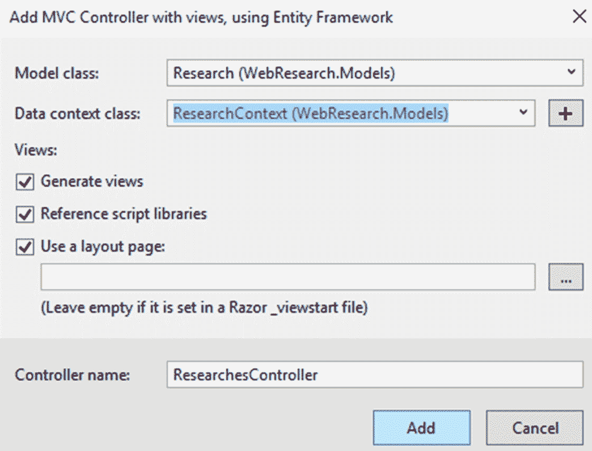

简单看一下创建的控制器，我们会发现我们现在已经有了基本的**创建、读取、更新和** **删除** ( **CRUD** )任务。现在，是主要活动的时间了。

# 运行应用程序

在我们进入并运行应用程序之前，让我们确保我们的新页面易于访问。最简单的方法是将其设置为默认主页:

1.  看看`Startup.cs`中的`Configure`法。您会注意到默认路线被指定为`Home`控制器。
2.  只需将控制器更改为您的`Research`控制器，如下所示:

```cs
app.UseEndpoints(endpoints =>
{
    endpoints.MapControllerRoute(
        name: "default",
        pattern: "{controller=Research}/{action=Index}/{id?}");
    endpoints.MapRazorPages();
});
```

如果你熟悉 ASP.NET 2 . x，你会期望在这里看到`UseMvc`。事实上，`UseMvc`已被弃用，支持手动构建您需要的 MVC 中间件。

3.  最后，确保你的`Main`方法如下:

```cs
public static void Main(string[] args)
{
  var host = BuildWebHost(args);
  using (var scope = host.Services.CreateScope())
  {
    var services = scope.ServiceProvider;
    try
    {
      var context = services.GetRequiredService<ResearchContext>();
      DbInitializer.Initialize(context);
    }
    catch (Exception ex)
    {
        var logger = services.GetRequiredService<ILogger<Program>>();
        logger.LogError(ex, "An error occurred while seeding the database.");
    }
  }
  host.Run();
}
```

4.  现在，点击 *Ctrl* + *F5* 运行应用程序，看看你的劳动成果:

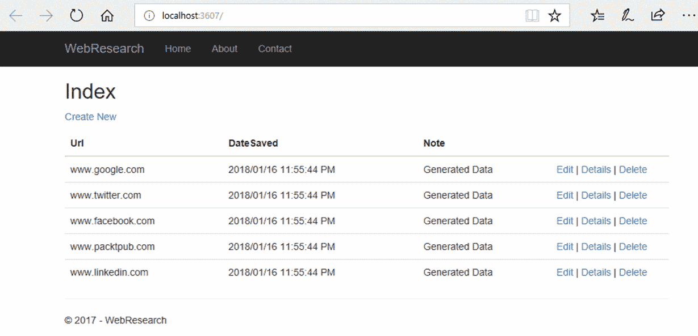

5.  如您所见，我们的测试条目可供我们使用。让我们快速了解一下可用的功能:
6.  单击新建查看我们链接的条目表单:

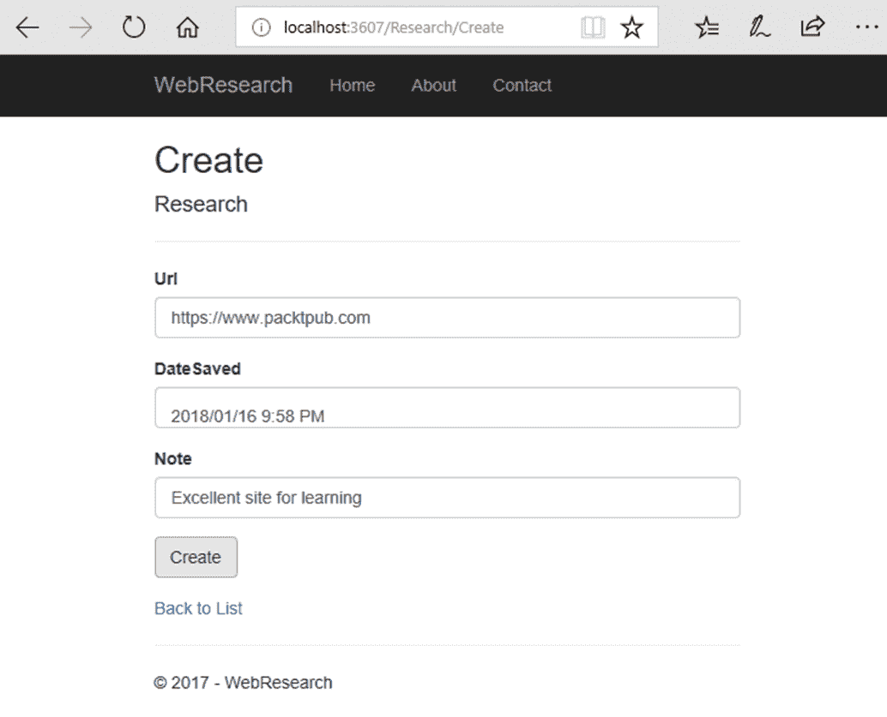

7.  输入一些有趣的数据，然后点击创建按钮。您将被重定向到列表视图，并看到我们的新条目已添加到列表底部:


在每个项目旁边，您可以选择编辑、查看详细信息或删除。继续玩这个功能。我们可以做很多事情来改善用户体验，比如自动填写日期字段。我会留给你自己的创造力来改善你认为合适的用户体验。

# 测试应用程序

如果您选择扩展这个项目的功能，您可能想添加的一件事是一些自动化测试。让我们避开一些术语:这一部分涉及自动化测试，但不是单元测试。关于测试到底是什么很容易引起争论和讨论，但是为了这一节的目的，我们增加了*自动化*测试。

由于这个应用程序是一个非常基本的数据访问应用程序，自动化测试经常被忽略。可以肯定地说，因为几乎没有逻辑，你在有效地测试英孚核心。不测试基本 CRUD 应用程序的另一个主要原因一直是它有多难。测试以数据库为中心的应用程序一直是一项困难、耗时且费力不讨好的任务。

首先，许多单元测试纯粹主义者会认为你不能在测试中包含数据访问，所以你应该模拟数据访问。这通常是通过创建一个存储库模式来抽象数据访问，甚至是通过多层抽象来实现的，但是一旦我们这样做了，我们必须模拟对数据库的调用将返回什么，虽然遵循了单元测试的原则，但这并不能为我们的应用程序工作提供太多保证。

其次，数据库操作通常不是幂等的；也就是说，一旦您在真实的数据库上运行了一个测试，再次运行它通常会有不同的结果，因为数据已经改变了。过去，人们通过每次重新创建数据库、编写脚本来恢复操作，或者在事务中运行测试然后回滚来避免这种情况。所有这些的一个共同点是它们都非常慢。

实体框架本身就是一种存储库模式，你当然可以抽象出`DbContext`；然而，有了 EF Core，你就有了一个叫做**内存数据库**的概念。已经有许多开源项目试图通过在字典或类似程序中维护数据变化来为 EF6 提供这一点。

让我们创建几个自动化测试(我不会称它们为单元测试，因为它们显然不测试单个功能单元):

1.  第一步是创建一个`Test`项目:

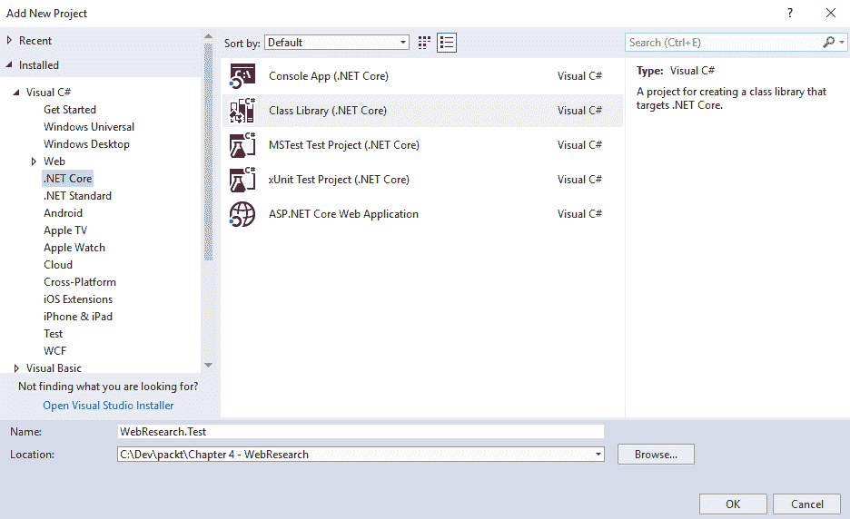

我们将把这个项目创建为一个类库。对于这个特定的测试，我们将使用`XUnit`，但是您应该能够毫无困难地用它来替代任何主要的测试库。

2.  创建项目后，我们可以使用包管理器控制台安装测试库(确保您选择了正确的`Test`项目):

```cs
Install-Package XUnit -ProjectName WebResearch.Test
```

我们需要更多的库:

```cs
Install-Package Microsoft.EntityFrameworkCore -ProjectName WebResearch.Test
Install-Package XUnit.Runner.VisualStudio -ProjectName WebResearch.Test
```

3.  接下来，我们需要添加对我们正在测试的项目的引用:

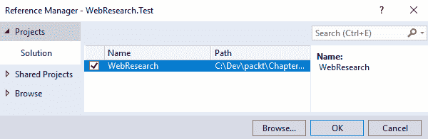

因为控制器是数据访问前面的逻辑，所以我们来测试一下`ResearchController`。在测试库中创建(或重命名)类为`ResearchControllerTests`:


4.  最后，我们需要向测试项目添加一个 NuGet 包，允许我们使用内存中的数据库:

```cs
Install-Package Microsoft.EntityFrameworkCore.InMemory
```

We'll come back to exactly what this is later in this chapter.

让我们看看测试的代码。然后，我们可以了解它在做什么:

```cs
[Fact]
public async Task RetrieveDetails_DetailsCorrect()
{
     // Arrange
     var testUrl = "www.pmichaels.net";
     var options = new DbContextOptionsBuilder<ResearchContext>()
         .UseInMemoryDatabase(Guid.NewGuid().ToString())
         .EnableSensitiveDataLogging()
         .Options;
     var researchContext = new ResearchContext(options);
     var researchController = new ResearchController(researchContext);
     var research = new Research()
     {
         Id = 1,
         DateSaved = new DateTime(2018, 10, 24),
         Note = "Useful site for programming and tech information",
         Read = false,
         Url = testUrl
     };

     var createResult = await researchController.Create(research);

     // Act
     var detailsResult = await researchController.Details(1);

     // Assert
     var viewResult = (ViewResult)detailsResult;
     var resultsModel = (Research)viewResult.Model;
     Assert.Equal(testUrl, resultsModel.Url);
}
```

5.  创建测试后，启动测试资源管理器:

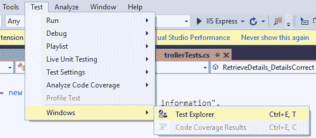

6.  一旦出现这种情况，运行所有(或者，此时，我们的单个)测试:


单元测试和`XUnit`的完整解释超出了本章和本书的范围；然而，为了完整起见，我将涵盖测试中一些更突出的点。

# 安排/行动/断言

单元测试显然不需要这些注释，但是我发现，当我使用它们时，我可以清楚地识别我在测试什么，并且我在测试单个动作。因为严格来说这不是一个单元测试，所以执行代码的语句不止一个；然而，只有一个正在测试中。这有助于您为测试命名，并识别测试中包含的内容。

# 内存数据库

下面的代码在`DbContext`选项中设置内存数据库，并使用这些选项创建一个新的上下文。这与程序使用真实数据运行时创建的`DbContext`完全相同，但存储在内存中:

```cs
var options = new DbContextOptionsBuilder<ResearchContext>()
         .UseInMemoryDatabase(Guid.NewGuid().ToString())
         .EnableSensitiveDataLogging()
         .Options;
var researchContext = new ResearchContext(options);
var researchController = new ResearchController(researchContext);
```

# 我们在测试什么？

这个问题总是值得问自己的。测试是代码，这意味着它们需要时间来编写和维护，所以要确保它们能赚到钱。这个测试是否能做到这一点，其实还有待商榷。我们正在做的是创建一个记录，然后检索该记录。这两个步骤之间有一定的逻辑，所以测试肯定是在测试什么。让我们添加第二个测试，以确保我们不会检索不存在的记录:

```cs
[Fact]
public async Task RetrieveInvalidRecord_DetailsCorrect()
{
    // Arrange
    var testUrl = "www.pmichaels.net";
    var options = new DbContextOptionsBuilder<ResearchContext>()
                .UseInMemoryDatabase(Guid.NewGuid().ToString())
                .EnableSensitiveDataLogging()
                .Options;
    var researchContext = new ResearchContext(options);
    var researchController = new ResearchController(researchContext);
    var research = new Research()
    {
        Id = 1,
        DateSaved = new DateTime(2018, 10, 24),
        Note = "Useful site for programming and tech information",
        Read = false,
        Url = testUrl
    };

    var createResult = await researchController.Create(research);

    // Act
    var detailsResult = await researchController.Details(2);

    // Assert
    Assert.IsType<NotFoundResult>(detailsResult);
}
```

如你所见，这和之前的测试完全一样，只是我们测试的是`2`的`Id`而不是`1`。然后，我们断言我们期望这不会被发现。

# 速度

我们在这里讨论的测试确实遵循了大多数 **FIRST** 测试原则(简称**快速**、**隔离**、**可重复**、**自验证**、**彻底**)；但是，它们不会像典型的单元测试那样快，所以它们应该位于测试金字塔的顶端:

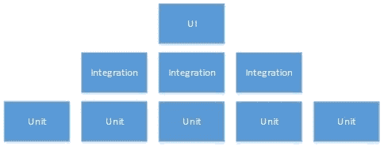

既然我们已经讨论了如何测试我们的应用程序，那么让我们继续讨论如何部署它。

# 部署应用程序

一旦您的应用程序准备好进行部署，您可以使用一些选项，包括:

*   微软 Azure 应用服务
*   自定义目标(IIS、FTP 等)
*   文件夹
*   导入配置文件

在 Visual Studio 的“生成”菜单项下，单击“发布网络研究”(或您决定命名的任何项目):


您应该会看到一个屏幕，显示可用的发布选项。让我们仔细看看。

# 微软 Azure 应用服务

Microsoft Azure 负责创建和维护 web 应用程序所需的所有基础架构需求。这意味着美国开发人员不需要担心服务器管理、负载平衡或安全性等问题。随着平台几乎每天都在改进和扩展，我们也可以相当有信心，我们将拥有最新和最棒的功能。

关于 Azure 应用程序服务，我们不会讲太多细节，因为整本书都可以写这方面的内容，但我们肯定可以看看将我们的 web 应用程序发布到这个云平台所需的步骤:

1.  选择 Microsoft Azure 应用程序服务作为您的发布目标。如果您有要发布到的现有网站，可以选择“选择现有”。现在，我假设您需要新建:


2.  点击“确定”按钮后，Visual Studio 将使用您登录的 Microsoft 帐户联系 Azure，后者将依次检查您是否有 Azure 帐户，并将返回可用的服务详细信息。我为此蓝图创建了一个试用帐户，事先没有设置具体的细节，从下面的截图中可以看到，Azure 将为您推荐一个可用的应用名称和应用服务计划。

3.  资源组是可选的，如果您没有指定任何内容，它将具有唯一的组名:


4.  您可以在“更改类型”选项下更改要发布的应用程序类型。在我们的例子中，我们显然会选择网络应用:


5.  单击左侧的服务，查看将随出版物设置的服务。第一个框显示了您的应用程序可能受益的任何推荐资源类型。在我们的例子中，推荐使用一个 SQL 数据库，我们确实需要它，所以我们只需点击添加按钮(+)来添加它:

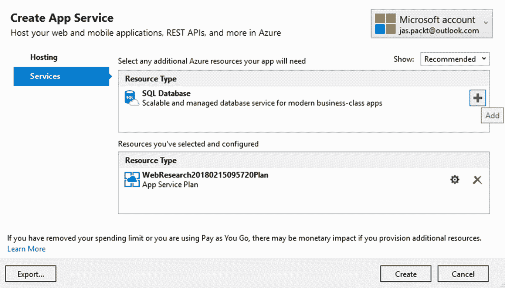

Azure 将负责 SQL 安装，但是我们需要给它所需的信息，例如如果您的配置文件中已经有一个服务器，应该使用哪个服务器，或者如果您还没有，应该创建一个新的服务器。

6.  在这种情况下，我们将配置一个新的 SQL Server。单击“SQL Server”下拉列表旁边的“新建”按钮，打开“配置 SQL Server”表单。Azure 将为服务器提供一个推荐的名称。虽然您可以提供自己的名称，但服务器名称很可能不可用，因此我建议您只使用他们推荐的名称。
7.  为服务器提供管理员用户名和管理员密码，然后点击确定:

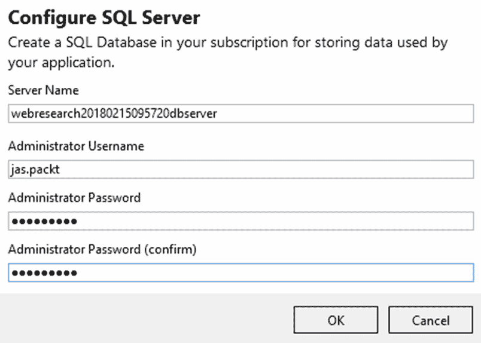

8.  这样做将使您返回到“配置 SQL 数据库”表单，在该表单中，您需要指定数据库名称以及连接字符串名称:

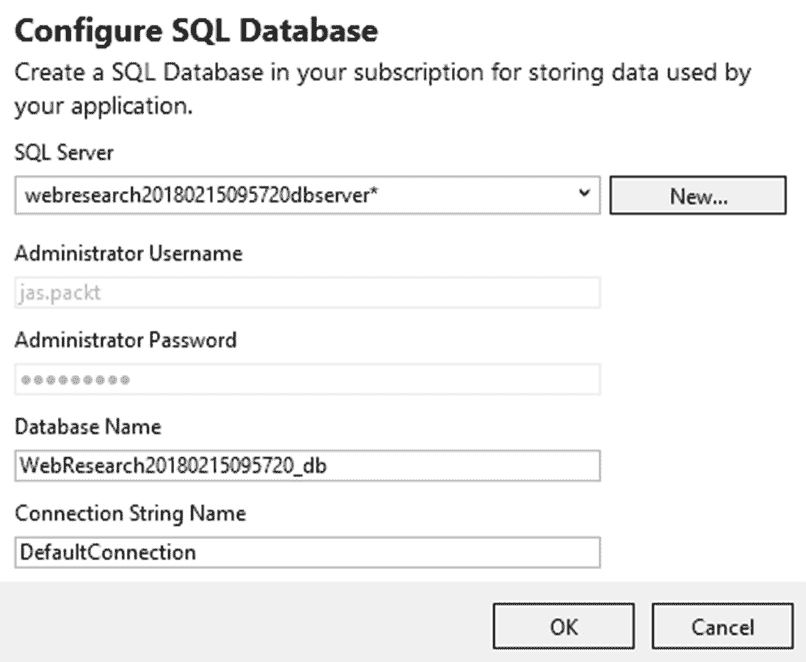

9.  再次查看“创建应用服务”表单。您会注意到 SQL 数据库已经添加到您选择和配置的资源部分:

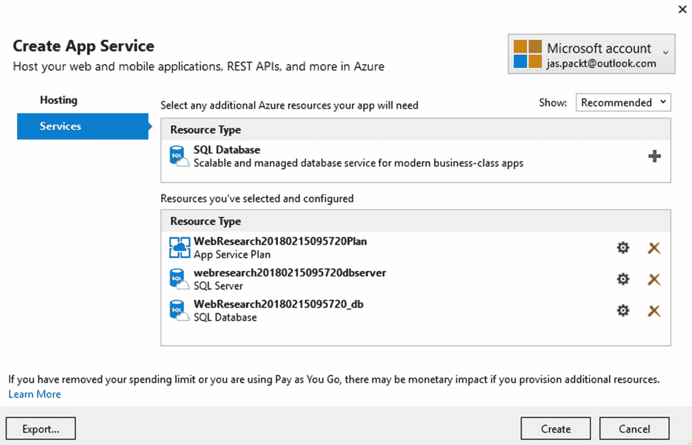

10.  现在，我们可以返回到主机选项卡，它将向您显示当您点击创建按钮时会发生什么的概述。

11.  如下图所示，将创建应用服务、应用服务计划和 SQL Server 资源:


12.  创建之后，我们可以通过点击发布按钮来发布我们新的 Azure 配置文件。
13.  您将在输出窗口中看到一些构建消息，最后应该会出现以下内容:

```cs
   Publish Succeeded.
   Web App was published successfully 
   http://webresearch20180215095720.azurewebsites.net/
   ========== Build: 1 succeeded, 0 failed, 0 up-to-date, 0 skipped 
   ==========
   ========== Publish: 1 succeeded, 0 failed, 0 skipped ==========
```

14.  您可以在 Azure 门户网站([portal.azure.com](http://portal.azure.com))上查看您的仪表板，它将向您显示由于我们的服务创建而在您的帐户上启用的资源:

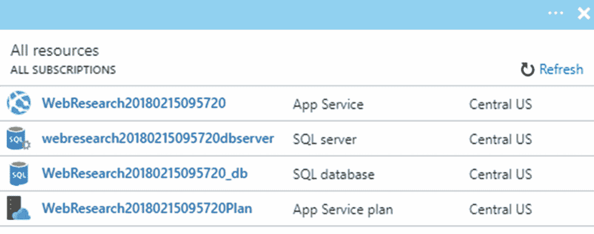

15.  发布的应用程序将在您的浏览器中打开，您很可能会看到一条错误消息。默认情况下，您不会看到关于错误的太多细节，但至少 Azure 为您提供了一些指针，以便您可以获得错误细节。您可以通过将`ASPNETCORE_ENVIRONMENT`环境变量设置为`Development`并重新启动应用程序来实现:


16.  当您登录到您的 Azure 门户网站时，您可以导航到您的应用服务，然后在应用程序设置中，用`Development`的值添加`ASPNETCORE_ENVIRONMENT`设置并重新启动您的应用:


17.  现在，我们可以刷新网站。我们应该看到更多关于潜在错误的细节:


18.  啊，是的！我们仍然指向我们的本地数据库，我们无法从发布环境中访问它。让我们更新我们的`appsettings.json`，使其指向我们的 Azure DB。
19.  从 Azure 仪表板导航到 SQL Server，然后导航到属性。在右侧窗格中，您应该会看到一个显示数据库连接字符串的选项:


20.  复制 ADO.NET 连接字符串，返回到您的代码，并更新`appsettings.json`文件中的连接字符串条目。
21.  重新发布应用，你应该可以走了！

# 自定义目标

下一个发布选项通常称为自定义目标。

这个选项基本上包括任何不是 Azure 或本地文件系统的东西。点击确定按钮后，您可以选择发布方法:

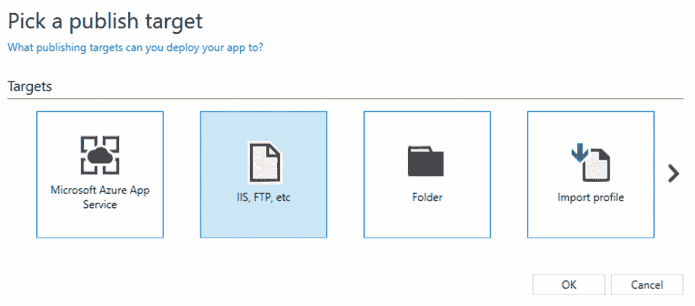

有四种可用的发布方法(或自定义目标)，每种方法都有自己的要求:

*   文件传送协议
*   网络部署
*   网络部署包
*   文件系统

我们还有一个设置选项卡，适用于所有四种方法。让我们快速了解一下我们有哪些选择:

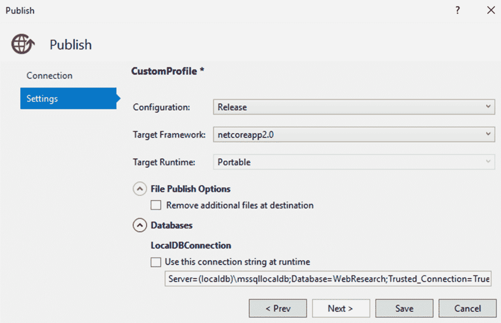

配置选项可以设置为调试或发布。

使用调试，您生成的文件是可调试的，这意味着可以命中指定的断点。但这也意味着性能下降。

使用 Release，您将无法动态调试，但是随着应用程序的完全优化，性能会有所提高。

在我们的例子中，唯一可用的目标框架是 netcoreapp2.0，但在标准版中。NET 应用程序，这是您可以设置目标的地方。NET 3.5 或更高版本。NET 4.5 或任何可用的版本。

您还可以指定目标运行时，选择让 Visual Studio 清理目标文件夹，并指定专门用于运行时的连接字符串。

正如我们之前提到的，这些设置适用于所有四种发布方法，我们现在来看一下。

# 文件传送协议

FTP 发布方法允许您发布到托管的 FTP 位置。对于此选项，您需要提供以下信息:

*   URL 服务器
*   站点路径
*   用户名
*   密码
*   目标网址

它还允许您根据输入的详细信息验证连接:


# 网络部署

看看网络部署和文件传输协议的形式，如果你相信它们是一样的，你会被原谅。两者的结果基本相同，都是直接发布到托管站点，但是使用 Web Deploy，您可以获得很多额外的好处，包括:

*   Web Deploy 将源与目标进行比较，并且只同步所需的更改，与 FTP 相比，这大大减少了发布时间。
*   尽管 FTP 也有它的安全表兄弟，SFTP 和 FTPS，Web Deploy 总是支持安全传输。
*   适当的数据库支持，允许您在同步过程中应用 SQL 脚本。

发布屏幕如下所示:


# 网络部署包

“网络部署包”选项用于创建一个部署包，您可以使用它在以后选择的任何位置安装应用程序。参考以下截图:

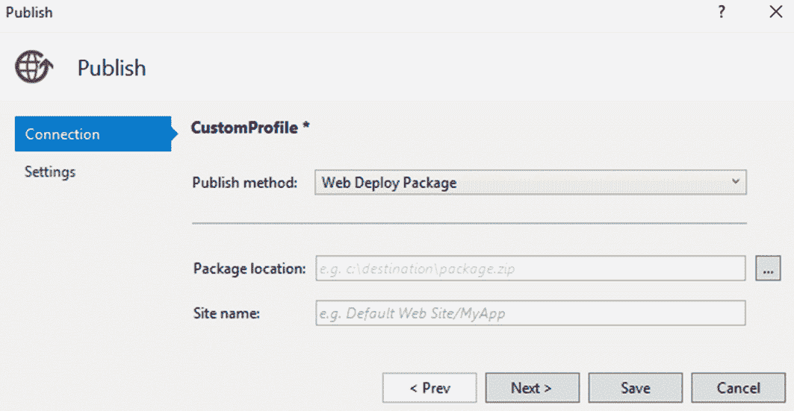

# 文件夹

世界各地的老派开发人员都在使用这个选项，主要是因为我们仍然不太信任一些可用的工具，这个选项允许您发布到您选择的文件夹位置，然后手动将其复制到发布环境中。

只需指定文件夹位置并点击确定:


# 导入配置文件

Import profile 方法不是一种实际的发布方法，而是一个简单的选项，可以从备份中导入以前保存的配置文件，也可以用于在开发团队之间共享发布配置文件:

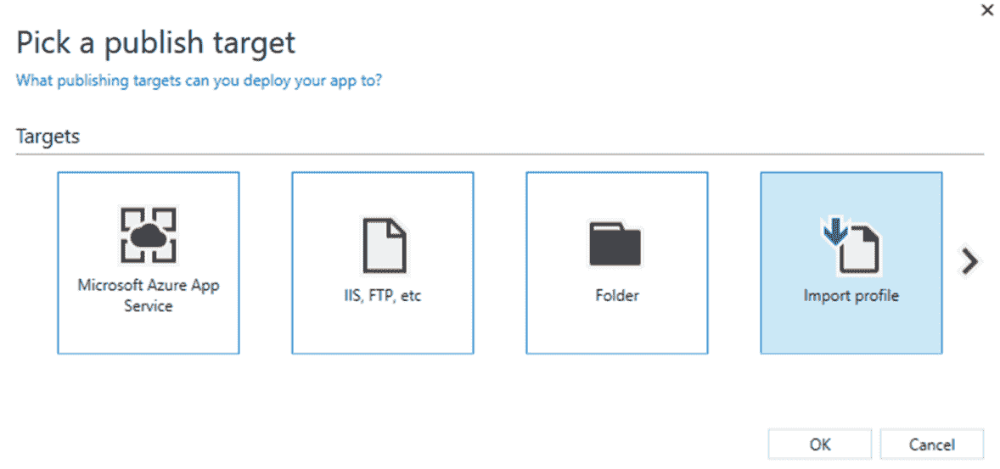

选择导入配置文件选项将提示您查找已保存的配置文件(`*.publishsettings`)。显然，当您创建一个以前的配置文件时，您可以保存它。有时，存储多个发布概要文件是有意义的:这通常是您在本地做的事情，因为在现代软件开发中，很难找到手动部署应用程序的人；相反，他们将设置一个 CI/CD 管道，这是直接从 GitHub 存储库签入触发的。

既然我们已经成功地发布了我们的应用程序，我们就到了这一章的结尾。让我们回顾一下我们所学的内容。

# 摘要

在这一章中，我们在英孚核心街区进行了一次小小的导游之旅。我们从博物馆开始，在参观学区之前查看了实体框架的历史，讨论了代码优先、模型优先和数据库优先实现方法之间的一些差异。TechNet 甚至进行了快速访问，他提供了一些关于设计数据库的想法。

之后，我们花了一些时间构建自己的 EF Core 解决方案，并研究了部署应用程序的各种方法。我们还查看了用一些测试数据填充我们的新建筑，看看一旦向公众开放，它将如何保持。

旅行结束时，我们参观了配送区，这样我们就可以大致了解可用的部署选项。

这次访问时间太短，无法涵盖实体框架核心世界中所有可用和可能的内容，因为它是一个拥有大型社区的框架，不断致力于改进和扩展其已经广泛的功能。

很高兴知道开发社区不满足于任何平庸，并不断努力改进和扩展功能，比如实体框架，它可能看起来已经相当成熟和广泛了。

在下一章中，我们将研究来自 Azure 的逻辑应用程序。本章将指导您创建一个逻辑应用程序，将该应用程序集成到推特上，并允许您将数据输入电子表格并自动发布到推特上。