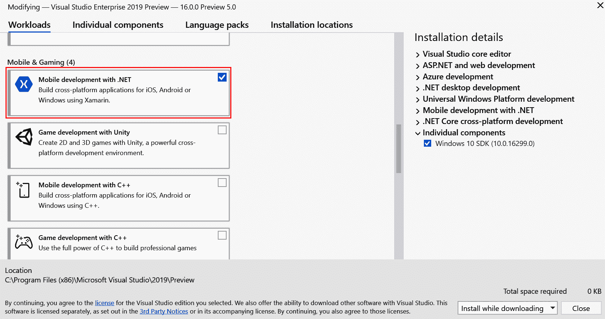
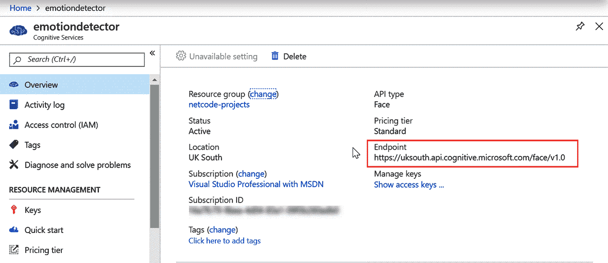
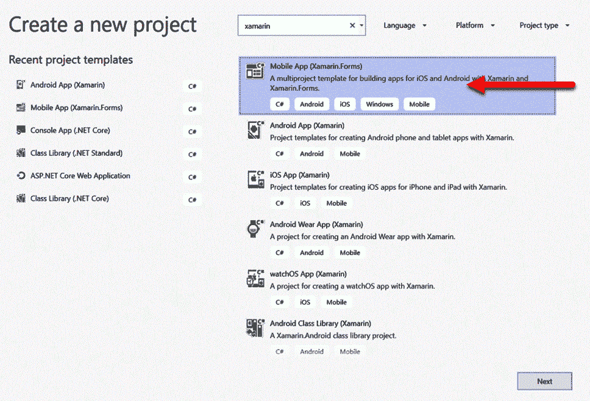
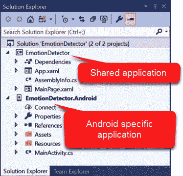
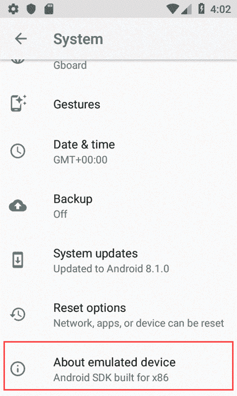
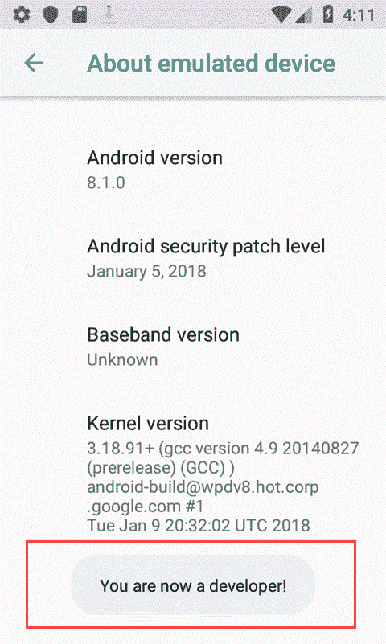

# 情感检测器移动应用——使用 Xamarin 表单和 Azure 认知服务

在这一章中，我们将结合过去几年中取得巨大进步的两项技术:移动开发和机器学习。

仅在几年前，机器学习还是极少数人的专属领域。它被用来预测天气和设计象棋计算机。对于那些特定专业领域之外的程序员来说，这是他们力所不及的。然而，最近，随着云的出现，以及前所未闻的大量数据，云提供商正在向普通程序员提供这种能力作为服务。我们将看到上传某人的面部照片，并让微软 Azure 发回对该面部的分析，以预测该人是否快乐、悲伤、愤怒等是多么容易。

我们将讨论的第二个主题是移动开发。Xamarin 使编写 C#应用程序、交叉编译它以及在安卓、iOS 和其他平台上运行它成为可能。微软收购 Xamarin，让这种跨平台的移动开发方式成为了大多数桌面开发者的默认选择。

本章将涵盖以下主题:

*   机器学习和 Azure 认知服务
*   跨平台开发:
    *   创建一个新的运行在安卓设备上的 Xamarin 应用程序
    *   设置 Azure 认知服务
    *   使用我们新应用的认知服务

# 技术要求

为了完成本章，您需要为 Visual Studio 安装 Xamarin 工作负载。您应该能够在 Visual Studio 安装程序中找到这一点:



与前几章一样，您还需要一个 Azure 帐户。由于设置这个的过程已经在[第 2 章](02.html)、*任务 Bug 日志 ASP.NET Core MVC 应用使用 Cosmos DB* 中介绍过了，这里就不再赘述了。

在测试阶段，我们将在物理设备上运行我们的应用程序；这意味着你将需要访问一个带有摄像头的安卓设备。如果没有这个，虽然您仍然可以继续，但是您将无法看到应用程序工作。

# 概念概述

在我们开始构建任何东西之前，让我们在高层次上简要讨论一下本章中的两个主要概念。

# 机器学习

这是一个巨大的话题，而且太大了，无法在一个章节中涵盖任何合理的深度。但是，简单来说，机器学习*是什么*，它*不是什么*，这是值得探讨的。

在本章中，我们将拍摄一张人脸图像，并将其上传到机器学习服务中。这项服务将提供关于它认为那张脸是快乐的、悲伤的、愤怒的还是其他什么的细节。重要的是尽量不要将这个过程拟人化。该算法将分析确定性的面部和回报百分比；然而，这是基于它看到很多很多类似的图像，并被告知它所识别的图像是否是，比如说，快乐的。这意味着如果我开始把悲伤的人的图像喂进去，但告诉机器学习算法这些是快乐的人，它会逐渐开始改变它的估计。这是现代版的古训**垃圾进，垃圾出** ( **GIGO** )。

可以创建自己的机器学习模型；事实上，所有大型云提供商都有围绕这一点的工具套件。不过，这里有一个权衡:创建自己的模型需要时间和数据科学方面的专业知识，但可以让你完全控制模型和你想要答案的问题。另一方面，使用预先构建的服务意味着您依赖于服务提供商来正确地训练模型，因此它不太可能适合特定的需求。

# 跨平台和移动开发

什么时候？NET 是 20 多年前首次发布的，它是一个 Windows 开发工具。事实上，在此之前，微软的开发工具一直是特定于 Windows 的，并以此为荣。微软过去的商业模式依赖于操作系统的销售；而且，很明显，如果你让程序员开发只能在你的操作系统上运行的软件，你就比竞争对手更有优势。

在苹果发布第一部 iPhone 之前，这种模式似乎运行良好。虽然 Windows 仍主导着商业市场，但人们逐渐开始转向手机，然后转向平板电脑休闲。微软在每个家庭和企业中拥有一台计算机的梦想来了又去，突然，程序员们看到了放弃的理由。NET 开发，转向 iOS 和安卓开发。

玩追赶，微软尝试发布自己的手机(也就是他们买了诺基亚)；他们还开始密切支持 Xamarin，以努力编写代码。NET 在安卓和 iOS 上运行。在撰写本文时，微软已经放弃了对命运多舛的 Windows 手机的支持，转而购买了 Xamarin。还有其他方法可以编写运行在 iOS 和安卓系统上的软件，但是据我所知，Xamarin 是唯一一个允许你用 C#编写并编译到原生平台的软件。

说了所有这些，就像本书展示的所有技术一样，你应该考虑是否可以使用更简单的选项；例如，一个简单的网站能满足你的需求吗？并非每个用例都需要智能手机的定制应用程序。

# 项目概述

我们在本章中的项目将是一个非常简单的应用程序。这将有一个按钮，可以拍照。然后，我们将该图像发送到 Azure 并显示一个结果，指示我们在该图像中检测到的情绪。

我们将使用 Xamarin Forms，这是一个简单的 UI 层，也是跨平台的:对于我们的需求，这是理想的，因为软件有一个非常小的 UI 组件。

我们也将只为安卓创建这个应用程序。这样做的主要原因是，为了创建一个 iOS 应用程序，你需要一个 Mac，我觉得这将排除很多读者(和作者)跟随！

# 配置 Azure 认知服务

在我们开始编写任何代码之前，我们需要配置我们的认知服务。为此，您需要一个 Azure 帐户；如果你还没有的话，请参考第二章(任务 Bug 记录 ASP.NET Core MVC 应用使用 Cosmos DB)。

让我们设置认知服务:

1.  我们将从导航到 Azure 门户中的认知服务刀片开始；您可以搜索它或从左侧的菜单中选择它。从此刀片添加新服务。一旦您这样做了，您将看到一个可能创建的认知服务列表:


2.  同样，您可以通过向下滚动面部应用编程接口或简单地在搜索框中键入`Face`来搜索该列表。这应该会打开面部应用编程接口，并允许您创建它:


3.  选择“创建”后，您将看到一个熟悉的选项列表:


除非您打算将其用于商业目的(例如，高吞吐量)，否则我建议您选择 F0 的定价计划，本质上是免费的。

4.  创建资源后，您需要两条信息。第一个是访问密钥:


5.  您需要的第二条信息是端点，可以在概述屏幕上找到:



就是这样！您现在已经配置了认知服务。快速入门页面有丰富的资源可供您使用；它也很可能有比你在这里找到的更多的最新信息。现在我们已经配置了 Azure 服务，我们可以创建我们的 Xamarin 应用程序了。

# 创建 Xamarin 应用程序

让我们创建我们的 Xamarin 应用程序。选择文件|新建|项目，您将看到以下屏幕:



一旦您选择了一个 Xamarin 应用程序，您将看到一个进一步的对话框:


1.  选择是为 iOS、安卓还是两者创建应用程序。我们将只创建一个安卓应用程序。
2.  选择一个空白模板，这样我们就可以确切地看到我们正在创建的内容。

现在我们已经配置了模板，我们可以创建我们的项目(通过选择创建)。

It's worth bearing in mind that there are some quite strict rules on what you can have in your path and how long that path can be. Avoid spaces, dashes, and full paths over 127 characters.

一旦创建，您的项目应该大致如下所示:



如果我们有一个 iOS 项目，就会有第三个项目，叫做`EmotionDetector.iOS`。如果你看一下`EmotionDetector.Android`中的参考文献，你会发现它指的是`EmotionDetector`。这里的想法是`EmotionDetector`代表共享的代码库；但是，每个平台都可以覆盖该功能。

在我们对项目做任何事情之前，让我们运行它，看看我们在模拟器中得到什么:


If the emulator is showing a blank screen, ensure that it's turned on. The emulator operates like a real phone, even down to being able to power up and down.

让我们添加一个按钮来拍摄我们的图片，并添加一个图像控件来显示该图片。在`MainPage.Xaml`中，用以下代码替换 XAML 代码:

```cs
<?xml version="1.0" encoding="utf-8" ?>
<ContentPage 
             xmlns:x="http://schemas.microsoft.com/winfx/2009/xaml"
             xmlns:local="clr-namespace:EmotionDetector"
             x:Class="EmotionDetector.MainPage">

    <AbsoluteLayout x:Name="Layout">

        <Image x:Name="DisplayedImage"
               VerticalOptions="Center"
               HorizontalOptions="Center" />

        <Button Text="Take Picture" 
           HorizontalOptions="Center"
           VerticalOptions="EndAndExpand"
           Clicked="Button_Clicked"
            AbsoluteLayout.LayoutBounds=".5, .1, .5, .1" AbsoluteLayout.LayoutFlags="All" />

    </AbsoluteLayout>
</ContentPage>
```

In the previous chapters, I spoke about using the MVVM pattern to abstract the UI layer from the logic of the application. This is possible in Xamarin Forms, too. However, I felt that creating an MVVM abstraction here would create an unnecessary additional distraction in the development.

If you do decide to extend this project, then creating (or using a third party) an MVVM infrastructure might be a good place to start.

前面的代码在`Layout`组件中有两个控件。`AbsoluteLayout`是一个容器，允许我们精确地指定控件的位置。在布局中，我们有一个单一的按钮，集中在屏幕顶部和一个图像附近。该代码要求在后面的代码中有一个事件处理程序。`MainPage.Xaml.cs`后面代码中的`Button_Clicked`事件现在可以为空:

```cs
[DesignTimeVisible(true)]
public partial class MainPage : ContentPage
{
    public MainPage()
    {
        InitializeComponent();
    }

    private void Button_Clicked(object sender, EventArgs e)
    {

    }
}
```

虽然这个事件处理程序目前什么都不做，但我们最终需要它做三件事:

*   照相
*   将图片上传到 Azure
*   显示结果

让我们在一些对存根方法的调用中概述一下。然后，我们可以依次关注每一个:

```cs
private void Button_Clicked(object sender, EventArgs e)
{
    var image = TakePicture();
    var emotionData = GetEmotionAnalysis(image);
    DisplayData(emotionData);
}

private void DisplayData(object emotionData)
{
    throw new NotImplementedException();
}

private object GetEmotionAnalysis()
{
    throw new NotImplementedException();
}

private object TakePicture()
{
    throw new NotImplementedException();
}
```

这些方法的签名会改变，但这描述了我们逻辑的基本流程；也就是说，在显示结果之前，我们拍摄一张照片，并将结果传递给调用 Azure 认知服务的方法。让我们逐一完成这些步骤，并一次填写一个。

# 拍照

在 Xamarin 中使用任何(或大多数)特定于平台的代码时，您往往会发现自己在使用插件。在我们继续之前，我们需要讨论一下 Xamarin p lugins。

# 洗发精外挂程式

Xamarin 背后的原理是你写的代码是交叉编译的。也就是说，当你为安卓编译时，你最终得到的是一个针对安卓平台的原生应用，当你为 iOS 编译时，你最终得到的是一个针对 iOS 的原生应用。然而，当一段代码是特定于平台的时，Xamarin 平台无法做到这一点。比方说，我想使用摄像头——这因平台而异。你不能简单地把为 iPhone 做这些的代码编译成安卓系统。那么，我们如何创建平台特定的代码呢？

答案是，每一段特定于平台的代码都需要为每个平台单独创建；Xamarin Forms 背后的原理是，您以多态的方式调用方法。让我们以相机为例(因为这是我们将要使用的)；在安卓系统上拍照的代码显然不同于 iOS 系统。当我们安装插件时，每个环境以特定于平台的方式实现该插件的代码。然而，从我们的角度来看，我们只需安装插件并调用几行代码，它就可以在任何地方工作。

# 媒体插件

安装插件本身实际上就像添加一个 NuGet 包一样简单:

```cs
Install-Package Xam.Plugin.Media -ProjectName EmotionDetector
```

It's worth bearing in mind that these plugins are constantly changing; while they are correct at the time of writing, you should follow the `readme.txt` file as a primary source.

完成后，插件会显示一个`readme.txt`文件，其中包含如何安装它的说明。请遵循这些说明，因为它们可能会在您阅读本文时发生变化。为了完整起见，我将在这里详细介绍安卓指令，因为有些指令可能不像它们可能的那样冗长。

先从`EmotionDetector.Android`中的`MainActivity.cs`说起。`OnRequestPermissionsResult`的方法应该是这样的:

```cs
public override void OnRequestPermissionsResult(int requestCode, string[] permissions, Android.Content.PM.Permission[] grantResults)
{
    Plugin.Permissions.PermissionsImplementation.Current.OnRequestPermissionsResult(
        requestCode, permissions, grantResults);
}
```

如今，你想在手机应用程序中做的任何事情都必须得到用户的批准；如果您需要访问用户的联系人、电话或相机，那么用户将看到一个对话框，指示您的应用程序需要这些权限。此方法中的代码在用户对此做出响应后被调用。

你必须声明你的应用程序需要哪些权限，这应该由插件自动添加。如果你看一下`EmotionDetector.Android.Properties.AssemblyInfo.cs`内部，你应该会看到以下内容:

```cs
// Add some common permissions, these can be removed if not needed
[assembly: UsesPermission(Android.Manifest.Permission.Internet)]
[assembly: UsesPermission(Android.Manifest.Permission.WriteExternalStorage)]

[assembly: UsesFeature("android.hardware.camera", Required = true)]
[assembly: UsesFeature("android.hardware.camera.autofocus", Required = false)]
```

如果还没有自动添加，现在就添加。

Note that we have slightly diverted from the instructions here, in that we have declared that the camera is required. In most applications, the functionality would still work fine without the camera, but in this case, we really do need to use it.

You should also consider whether your app can offer some degraded functionality, even if the user is unwilling to give access to requested resources. As we've mentioned previously, in this particular case, there's not too much we can do without the camera, but if you extended this application, maybe you would add the ability to upload existing pictures to the application – in which case, the app *would* still be usable *without* the camera.

文件应该是这样的:

```cs
<?xml version="1.0" encoding="utf-8"?>
<manifest xmlns:android="http://schemas.android.com/apk/res/android" android:versionCode="1" android:versionName="1.0" package="com.companyname" android:installLocation="auto">
    <uses-sdk android:minSdkVersion="21" android:targetSdkVersion="27" />
    <application android:label="EmotionDetector.Android">
        <provider android:name="android.support.v4.content.FileProvider"
                          android:authorities="${applicationId}.fileprovider"
                          android:exported="false"
                          android:grantUriPermissions="true">
          <meta-data android:name="android.support.FILE_PROVIDER_PATHS"
                          android:resource="@xml/file_paths"></meta-data>
        </provider>
  </application>
</manifest>
```

这用于支持媒体插件的子依赖性。如您所见，它引用了一个特定的资源目录，因此下一步是创建该目录。在安卓`Resources`文件夹中，新建一个`xml`文件夹:


在这个标有`file_paths.xml`的文件夹中创建一个文件，并添加以下代码:

```cs
<?xml version="1.0" encoding="utf-8"?>
<paths xmlns:android="http://schemas.android.com/apk/res/android">
    <external-files-path name="my_images" path="Pictures" />
    <external-files-path name="my_movies" path="Movies" />
</paths>
```

最后，`MainActivity.cs`模块需要在其`OnCreate`方法中增加一行:

```cs
protected override void OnCreate(Bundle savedInstanceState)
{
    TabLayoutResource = Resource.Layout.Tabbar;
    ToolbarResource = Resource.Layout.Toolbar;

    base.OnCreate(savedInstanceState);
    CrossCurrentActivity.Current.Init(this, savedInstanceState);

    Xamarin.Essentials.Platform.Init(this, savedInstanceState);
    global::Xamarin.Forms.Forms.Init(this, savedInstanceState);
    LoadApplication(new App());
}
```

`CrossCurrentActivity`插件是同一个生态系统中的另一个插件。它允许媒体插件访问`MainActivity`。

# TakePicture()

现在我们已经添加了插件，我们可以创建代码，这样我们就可以使用相机了。让我们快速了解一下这个方法:

```cs
private async Task<MediaFile> TakePicture()
{
    string fileName = $"FaceImg_{DateTime.Now.Ticks}";

    MediaFile photo = await Plugin.Media.CrossMedia.Current.TakePhotoAsync(new Plugin.Media.Abstractions.StoreCameraMediaOptions()
    {
        SaveToAlbum = true,
        Name = fileName
    });

    if (photo != null)
    {
        return photo;
    }

    return null;
}
```

这个方法没有什么特别之处，因为插件为我们做了大部分工作。我们传递的参数允许保存图像，并且我们为它声明了一个唯一的名称。

During testing, you may decide to switch off the save feature; otherwise, your phone will fill up with pictures of you pulling strange faces to try to look angry, sad, or happy!

如果拍摄成功，我们返回一张`MediaFile`；否则，我们退回`null`。

# GetEmotionAnalysis()

我们的下一个方法负责调用 Azure API 并获得响应。但是，这有一个客户端应用编程接口。写的时候还在预习，好像有各种问题。如果您希望使用这个来进行研究，那么一个好的起点是 NuGet 存储库:[https://www.nuget.org/packages/Microsoft.Azure.CognitiveServices.Vision.Face/](https://www.nuget.org/packages/Microsoft.Azure.CognitiveServices.Vision.Face/)。

但是，我们将只使用该软件包的一部分，所以现在让我们安装它:

```cs
Install-Package Microsoft.Azure.CognitiveServices.Vision.Face -Version 2.4.0-preview
```

在本节中，我们将手动建立对 API 的调用；下面是我们方法的代码:

```cs
private async Task<IList<DetectedFace>> GetEmotionAnalysis(Stream imageStream)
{
    var byteData = GetImageAsByteArray(imageStream);

    return await MakeAnalysisRequest(byteData,
        "https://uksouth.api.cognitive.microsoft.com/face/v1.0/detect",
        "4a9c2b7404fd45ed9aff787f158e24c7");
}
```

`MakeAnalysisRequest`接受三条信息(你马上就会看到)。第一个，`byteData`，是图像流的二进制表示(我们将很快回到`GetImageAsByteArray`方法)。第二个参数是您之前记录的端点；然后，我们将`detect`附加到网址上，表明我们希望采取的行动。结果如下:

```cs
$"{endpoint}/detect"
```

第三个参数是你之前记下的关键。

The preceding values were my values at the time of writing; by the time you read this, the resource they were generated for will have been removed. You will need to change these to match your own values.

在我们继续之前，让我们快速回顾一下`GetImageAsByteArray`方法:

```cs
private byte[] GetImageAsByteArray(Stream stream)
{
    using BinaryReader binaryReader = new BinaryReader(stream);
    return binaryReader.ReadBytes((int)stream.Length);

}
```

然而，大部分工作是通过`MakeAnalysisRequest`方法完成的。让我们看看那是什么样子:

```cs
public async Task<List<DetectedFace>> MakeAnalysisRequest(Byte[] byteData, string uriBase, string subscriptionKey)
{
    using HttpClient client = new HttpClient();
    client.DefaultRequestHeaders.Add("Ocp-Apim-Subscription-Key", subscriptionKey);

    string requestParameters = "returnFaceId=true&returnFaceLandmarks=false" +
"&returnFaceAttributes=emotion&recognitionModel=recognition_01&returnRecognitionModel=false";

    string uri = $"{uriBase}?{requestParameters}";
    HttpResponseMessage response;

    using (ByteArrayContent content = new ByteArrayContent(byteData))
    {
        content.Headers.ContentType = new MediaTypeHeaderValue("application/octet-stream");

        response = await client.PostAsync(uri, content);
        string contentString = await response.Content.ReadAsStringAsync();

        List<DetectedFace> faceDetails = JsonConvert.DeserializeObject<List<DetectedFace>>(contentString);
        if (faceDetails.Count != 0)
        {
            return faceDetails;
        }
    }
    return null;
}
```

这里发生了很多事情；然而，基础是我们正在进行一个 HTTP 调用，并将返回的结果序列化为一个`DetectedFace`列表。`DetectedFace`是一个可以在我们之前安装的 NuGet 包中找到的类。我们在请求的头部传递访问键，并在查询字符串中建立参数。

A link to the Face API documentation can be found in the Quick Start guide in the Azure portal. This will give you a comprehensive (and up to date) list of methods and parameters that are available to you.

下一步是打包并将图像发送到 Azure 进行分析。返回的是分析的 JSON 表示。

# 显示数据()

这是最后一种方法:我们现在已经使用相机拍摄了照片，并将该图像发送到 Azure 进行分析。我们的最终任务是向用户显示结果。在我们看代码之前，我们应该考虑我们在这里试图实现什么。

我们的特定应用程序旨在指示拍摄照片时某人的情绪状态。当我们把图像传递给 Azure 时，它不会返回一个声明说，*这个人是快乐的*；相反，它将返回一个可能检测到的面部列表和每个面部的可能情绪列表，以及一个值来指示它认为那个人表现出了多少情绪。比如，快速照照镜子:你看起来怎么样？你是高兴、生气、惊讶还是厌恶？也许你是其中两三个中的一个。因此，返回的 JSON 是每张脸和每种情绪的值列表。

显示数据时，我们需要做两件事:

1.  如果多于或少于一个面，则显示一个错误以表明这一点。
2.  如果只有一张脸，只显示最高级别的情感；例如，如果你感到愤怒和惊讶，我们需要采取分析认为更大的，并显示出来。

考虑到这一点，让我们来看看代码:

```cs
private void DisplayData(IList<DetectedFace> faces)
{
    // Remove and existing labels
    var labels = Layout.Children
        .Where(a => (a.AutomationId?.Contains("emotion-label") ?? false)
        || (a.AutomationId?.Contains("error") ?? false))
        .ToList();
    foreach (var label in labels)
    {
        Layout.Children.Remove(label);
    }

    if (faces == null)
    {
        CreateLabel("Unable to get data", "error");
        return;
    }

    if (faces.Count() > 1)
    {
        CreateLabel("Multiple faces not supported in this version", "error");
        return;
    }

    var face = faces.SingleOrDefault();
    if (face == null)
    {
        CreateLabel("No face found", "error");
        return;
    }

    CreateLabel(face.GetStrongestEmotion(), face.FaceId.ToString());
}
```

要开始分析这个，我们将从`CreateLabel`开始。

# CreateLabel()

我们将很快看到这个的代码，但是，现在，让我们接受它动态地创建一个标签，使用`AutomationId`作为唯一的引用。

`AutomationId` is really intended to provide an anchored reference to automated UI test frameworks. What we are doing here is potentially not in-keeping with that intent; in fact, there is no real reason that `AutomationId` couldn't be fixed at simply: "emotion-label", which would allow automated UI testing to work more easily with this application. The preceding code does provide slightly more information when debugging, so I would suggest this as a future enhancement, once the software is working.

如你所见，我们的第一个任务是寻找任何带有相关`AutomationId`的标签并移除它们。接下来是一系列门控检查，以确定是否返回了一张面孔；如果没有，我们将创建一个错误标签。

假设没有错误，将基于我们尚未看到的名为`face.GetStrongestEmotion()`的方法创建一个标签。返回一个字符串，表示找到的最强烈的情感(我们稍后会讲到)。让我们回到`CreateLabel()`方法:

```cs
private void CreateLabel(string displayText, string id)
{
    var newLabel = new Label()
    {
        Text = displayText,
        AutomationId = $"emotion-label-{id}",
        FontAttributes = FontAttributes.Bold,
        FontSize = 20,
        HorizontalTextAlignment = TextAlignment.Center
    };

    AbsoluteLayout.SetLayoutBounds(newLabel, new Rectangle(.5, 1, .5, .1));
    AbsoluteLayout.SetLayoutFlags(newLabel, AbsoluteLayoutFlags.All);

    Layout.Children.Add(newLabel);
}
```

我们在这里做的是用代码构建一个 UI 控件。前面的大部分代码都相对简单:我们正在设置字体和文本(我们已经讨论过`AutomationId`，然后我们在`AbsoluteLayout`父控件上调用一个方法，以便将控件定向到特定的坐标:

```cs
AbsoluteLayout.SetLayoutBounds(newLabel, new Rectangle(.5, 1, .5, .1));
```

该方法在`AbsoluteLayout`控件内为有问题的控件设置边界矩形。我们传递给它的值在意义上有所不同，这取决于我们如何调用方法:

```cs
AbsoluteLayout.SetLayoutFlags(newLabel, AbsoluteLayoutFlags.All);
```

在我们的例子中，我们将其设置为`All`，这表明所有的值都是成比例的；例如，X 坐标(即`Rectangle`结构中的第一个值)指定控件应该正好位于`AbsoluteLayout`控件的中间。

最后，我们将新创建的控件添加到`Layout`控件中。接下来我们来分析一下`GetStrongestEmotion()`法。

# GetStrongestEmotion()

这种方法只是一种扩展方法，使用反射来计算得分最高的情感:

```cs
public static class FaceExtensions
{
    public static string GetStrongestEmotion(this DetectedFace face)
    {
        var emotions = face.FaceAttributes.Emotion;

        var strongest = emotions.GetType()
            .GetProperties()
            .Select(a => new { name = a.Name, value = (double)a.GetValue(emotions) })
            .OrderByDescending(a => a.value)
            .First();

        return strongest.name;
    }
}
```

If you are not familiar with extension methods, an extension method class must be static, and the item that you're extending is indicated by the `this` keyword, before the parameter.

# 按钮 _ 点击

最后，让我们更改事件处理程序，以正确处理更新的方法:

```cs
private async void Button_Clicked(object sender, EventArgs e)
{
    var image = await TakePicture();
    DisplayedImage.Source = ImageSource.FromStream(() => image.GetStream());
    var emotionData = await GetEmotionAnalysis(image.GetStream());
    DisplayData(emotionData);
}
```

如您所见，我们需要使我们的处理程序异步，因为我们正在调用异步方法。我们通过从`TakePicture`的结果中提取流来设置图像源。最后，我们将把从`GetEmotionAnalysis`返回的*面孔*列表传递给`DisplayData`方法。

我们现在有了一个功能正常的应用程序:


如果你按下按钮，你会看到模拟器让你知道你在使用相机，但实际上并没有提供对我们的应用有意义的图像。我们现在需要讨论如何在物理设备上进行测试。

# 在物理设备上测试和运行

因为这个程序的基础是使用相机，所以在物理设备上测试应用程序是必不可少的。

此外，非常奇怪的是，在物理设备上测试实际上比在仿真器上测试要快。

在这一节中，我们将介绍在我们的安卓设备上设置它所需的基础知识；不过，我强烈建议大家在这方面参考 Xamarin 自己的指南:[https://docs . Microsoft . com/en-GB/Xamarin/Android/入门/安装/设置-设备换开发](https://docs.microsoft.com/en-gb/xamarin/android/get-started/installation/set-up-device-for-development)。

本指南更加全面，并且，考虑到它经常更新(而本书没有)，是一个最新的指南。

这里的说明与 Android 8.x (Oreo)有关，但也应该适用于更高的版本(在撰写本文时，最新版本是 9.x，即 Pie)。

The following screenshots have been taken from the emulator; however, they have been checked on a physical device to ensure they are accurate for this version of Android.

要配置您的手机:

1.  第一步是配置你的手机；从加载设置屏幕开始:


2.  在系统内部，您应该会看到一个标签为“关于电话”或类似的菜单选项:



3.  找到内部版本号:


4.  你需要敲这个七次。你会收到以下信息(不要眨眼，否则你会错过的！):



5.  系统菜单上将出现一个新菜单，即开发人员选项:


6.  这个新菜单允许您确定测试软件时有用的各种设置；但是，有一个设置特别需要更改，那就是 USB 调试:


其他设置是可选的。你可能会发现保持清醒可以让你保持清醒，但是如果你在使用电话，不要忘记在之后关掉它。

下一步是检查 Android SDK 管理器。您应该(至少)为奥利奥(8.1)安装以下组件:


如果和我一样，你有几个更新，你一定要更新。

这是基本的内容。根据您的手机，您可能会发现您需要安装一些 USB 驱动程序。如果你是这种情况，请参阅前面的链接。

当您插入手机时，选择传输文件。

Visual Studio 应该会自动识别您的手机已连接，并且运行图标应该会从模拟器变为实际的手机:


现在，当您运行项目时，它应该在您的物理设备上启动，而不是在模拟器上。

# 摘要

在这一章中，我们已经看到了如何解决两个相对复杂的问题——跨平台开发和机器学习——并利用一些易于访问的服务来创建一个应用程序，直到几年前，该应用程序还需要专家团队花费数年时间来编写。

当然，应用程序*已经花费了专家团队数年的时间来编写——只是你现在可以访问他们的劳动成果。*

跨平台开发是很多公司都试图做好的事情:微软首先在公司内部采用 Xamarin(通过购买)，现在又出现在代码库中(2019 年的构建宣布，2020 年。NET 将结合 Mono，。NET Core，以及。NET 框架整合成一个单一的。NET–在撰写本文时，这被简单地称为。NET 5)。

机器学习正在吸引数十亿美元的研究:想象一下，在不久的将来，你的手机将能够监控你的情绪。想象一下，如果商店里的摄像头可以检测到顾客什么时候因为不开心而离开；想象一下，在街上有一台摄像机，它可以通过人们的面部表情来检测路过的人是否正准备犯罪。

在下一章中，我们将更详细地探索机器学习，并创建一个使用微软语言理解智能服务的聊天机器人，以模拟与人类的对话。