# 21 世纪的伊莱扎——UWP 和微软机器人框架

图灵测试是由艾伦·图灵开发的，目的是回答机器是否可以被认为具有思考能力的问题。20 世纪 60 年代，一个名为伊莱扎的项目诞生了，这是第一批试图通过这项测试的项目之一。

图灵测试是在机器学习的概念还处于萌芽阶段时发展起来的(事实上，图灵本人在这个领域做出了贡献)。现在，我们有了使用机器学习来检测情绪的系统，我们有了能够理解语言的复杂系统，我们接到了机器人打来的电话，我们与之进行了完整的口头对话，却从未意识到他们不是人类。

伊莱扎是为了模仿一个心理治疗师而建立的，这个想法是，它挑选出关键词和短语，并把它们转换成问题，以便愚弄人类，让他们相信自己在和另一个人说话。

在本章中，我们将创建一个版本的伊莱扎。我们将学习如何使用在 UWP 创建客户端应用程序。NET 核心 3。然后，我们将学习如何设置和配置 LUIS，最后，我们将学习如何将其集成到 MS Bot 框架中。

本章将涵盖以下主题:

*   查特斯
*   微软聊天机器人框架
*   微软语言理解服务
*   在 UWP 创建应用程序

聊天机器人可以用于一切，从信息技术支持到预订航班(下图显示了一个例子):

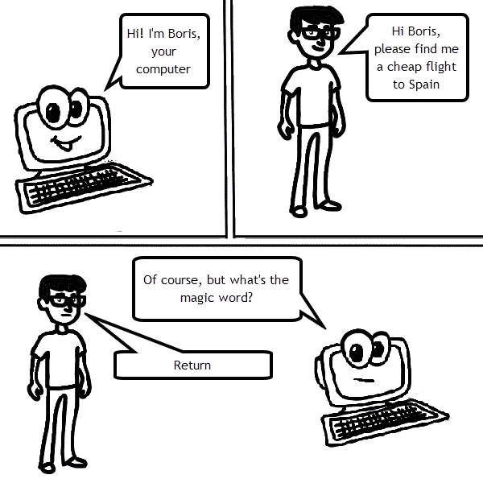

# 技术要求

在本章中，我们将使用默认模板来使用机器人框架创建微软机器人。在撰写本文时，尽管发布了。NET Core 3，Bot 框架项目仍在创建中。NET 2.2。在后面的部分中，我们将看到如何将其升级到。NET 核心 3；然而，当这本书出版时，这种情况可能已经改变了。

在本章中，您将需要一个 Azure 订阅(我们在[第 2 章](02.html)、*使用 Cosmos DB* 任务 Bug 日志记录 ASP.NET 核心 MVC 应用程序中简要介绍了如何创建一个)。

本章的代码可以在 https://github.com/PacktPublishing/C-8-and-.的 GitHub 上找到 NET-Core-3-项目-使用-Azure-第二版。

# 创建聊天机器人

让我们从聊天机器人开始。在写这篇文章的时候，聊天机器人无处不在，从你在网站上寻求帮助到你给呼叫中心打电话。本质上，聊天机器人只是一个复杂的状态机，框架，如微软的 Azure 机器人框架，只是向你隐藏了这种复杂性。想象一下人类和机器之间的对话( **H** 和 **M** ):

```cs
M: Hello, how can I help?
H: Hello, I'd like to check my balance, please.
M: I can help you with that. Which account is this for?
H: Current.
M: I'm sorry, I didn't get that. Which account is this for?
H: Current account.
M: What is the number of your current account?
```

好的，如果我们看一下这个交换，我们可以看到它是由机器人发起的。客户回答说，他们想检查他们的余额——所以在这里，机器人正在监听关键词，很明显`balance`就是一个。现在机器需要知道客户想知道哪个账户的余额。在幕后，它可能已经检查了向客户注册的账户是否不止一个。此时，客户说`current`，机器人需要澄清，所以它循环回来，再次询问。当它最终明白了答案，它就继续前进。

我们将使用一个模板创建我们的机器人，你需要从 https://marketplace.visualstudio.com/items?安装这个模板 item name = BotBuilder . BotBuilder 4 .

当你选择创建一个新的机器人时，你有三个选项:空机器人、回声机器人和核心机器人，如下图所示。对于这个项目，我们将选择回声机器人:


These are prebuilt templates with varying degrees of existing functionality. Obviously, the empty template has no functionality and only boilerplate code. The Core Bot gives you a fully functioning bot that is linked to LUIS.

我们现在将选择项目的文件位置:


By default, the bot name will be set to the project name.

一旦你创建了你的机器人，运行它，你会看到下面的屏幕:

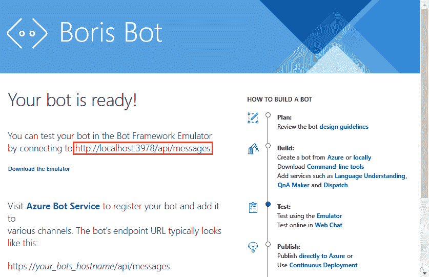

这可能不完全是你所期望的，因为我们现在还有几个步骤要走，才能看到我们的机器人在行动(剧透:在这个阶段，实际上没有太多可看的！).记下截图中的网址，因为我们很快就会需要它。

# Bot 仿真器

下一步是运行模拟器。事实上，我们刚刚创建的机器人只是一项服务。模拟器为我们提供了一个与之交互的用户界面。

在撰写本文时，模拟器的最新版本位于[https://github . com/Microsoft/botformal-Emulator/releases/tag/v 4 . 2 . 1](https://github.com/Microsoft/BotFramework-Emulator/releases/tag/v4.2.1)。

要安装它，有一个自解压可执行文件:

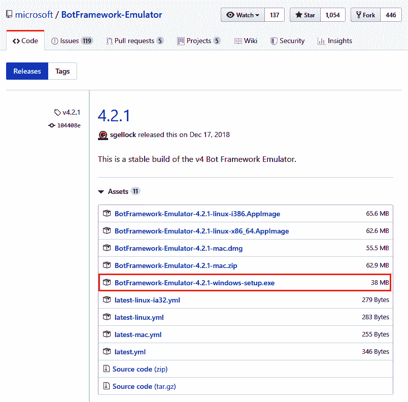

下载并安装模拟器，然后运行它。

You'll need to run the emulator as an administrator.

当你运行模拟器时，你需要给它一个名字和一个网址(你刚才记下了网址，名字可以是任何东西):


一旦你连接了，你就能和你的机器人交谈了。让我们快速看一下模拟器屏幕:

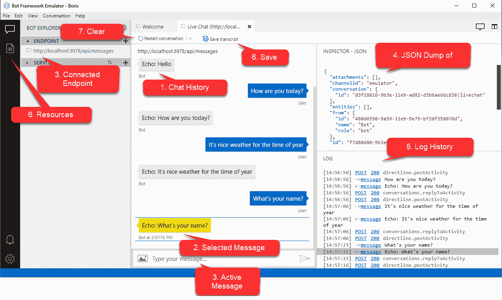

让我们看看它到底在告诉我们什么:

1.  这个部分列出了你(人类)或机器人写的所有消息。
2.  您可以选择聊天记录中的任何消息(见 4)。
3.  这是你给机器人输入信息的地方。
4.  这显示了原始 JSON 形式的消息。请记住，您的机器人只是一个应用编程接口，因此进出通信是 JSON 格式的。
5.  这给出了对话的网络历史。如果您遇到身份验证或网络问题，这尤其有用。
6.  整个聊天记录可以保存到`.transcript`文件中。本质上，这是会话历史的 JSON 表示。左侧的资源图标允许您打开这些文件并检查旧的成绩单。这在支持场景中非常有用，在这种场景中，出现了一些问题，您希望看到聊天过程中发生了什么。
7.  任何时候，你都可以简单地从头开始聊天。

8.  这将显示或隐藏*资源*部分。这允许您查看成绩单或聊天文件。
9.  这显示了您当前正在与之通信的端点。
10.  存储连接端点的历史；您可以通过简单地点击历史记录在这些之间切换。

你可能会注意到这个机器人的对话框很大程度上是受你自己的启发。让我们看看我们是否能确定为什么会这样，并稍微纠正一下。

# 回声机器人——除了你好

目前，回声机器人名副其实——它只是简单地回应你所说的一切。让我们开始把它做得更鲍里斯一点，在这个基础上增加一点变化。我们先把`EchoBot`改名为`BorisBot`:

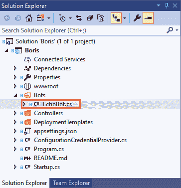

我们将通过以下步骤稍微修改机器人的代码:

1.  首先，让我们重命名该类:

```cs
public class BorisBot : ActivityHandler
{
   . . .
}
```

2.  接下来，我们将对`OnMessageActivityAsync`进行一个小的更改，以捕获用户键入`Hello`，并以一个更合理的消息进行响应:

```cs
protected override async Task OnMessageActivityAsync(ITurnContext<IMessageActivity> turnContext, CancellationToken cancellationToken)
{
    if (turnContext.Activity.Text == "Hello")
    {
        await turnContext.SendActivityAsync(MessageFactory.Text($"Hello, my name is Boris"), cancellationToken);
    }
    else
    {
        await turnContext.SendActivityAsync(MessageFactory.Text($"Echo: {turnContext.Activity.Text}"), cancellationToken);
    }
}
```

3.  在`Startup.cs`中，您还需要更改依赖注入来注册新的机器人:

```cs
services.AddTransient<IBot, BorisBot>();
```

现在，如果我们运行机器人，我们会得到不同的响应:

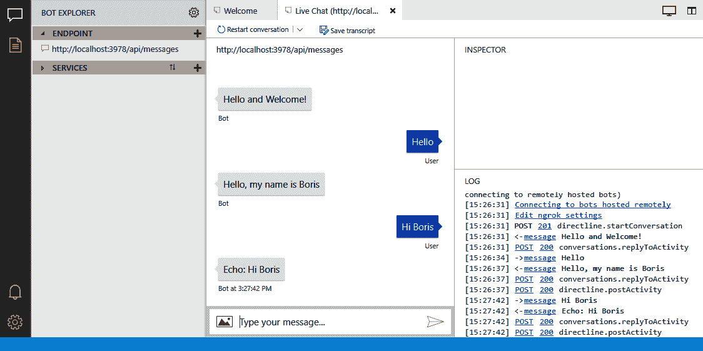

好了，现在当我们输入`Hello`时，我们得到了一个合理的响应，但是任何其他的，我们回到了回声。为了通过图灵测试，我们需要在这方面进行改进。请记住，这都是关于感知的，所以我们首先需要涵盖说类似事情的各种方式，其次，我们需要改变我们的反应。我们可以在`OnMessageActivityAsync`里面写一个大量的 switch 语句，并尝试尽可能多地想出表达`Hello`的方式。然而，我们也可以使用微软为我们创建的一个名为 LUIS 的工具，它为我们做了一些事情。

# 介绍 LUIS

LUIS 代表语言理解智能服务。它允许你利用机器学习算法来训练预先构建的语言模型。事实上，这个服务(和 Bot 框架一样)比我们在这里看到的要强大得多。出于我们的目的，我们只需要训练一个简单的模型，它只有很少的关键词和短语。如果您还没有这样做，您需要首先在 [https://www.luis.ai](https://www.luis.ai) 注册。

注册后，您可以开始构建新模型:

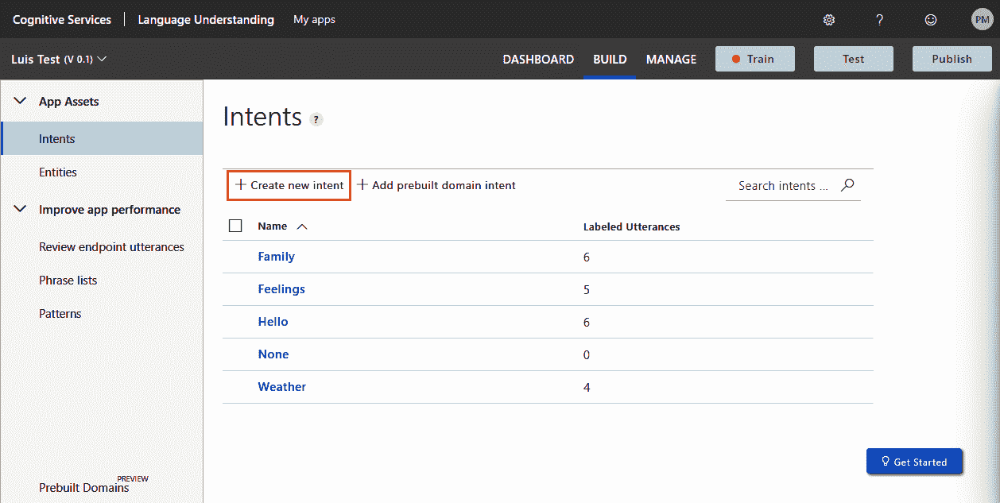

在这里，如果我们选择意图，我们可以确定对话的关键领域；如您所见，我在这里确定了一些领域。您选择“创建新意图”选项，然后给该意图命名(事实上，给该意图命名并不重要)。一旦你这样做了，你将被要求给出一些可能被输入的例子——例如，对于感觉，你可能有这样的东西:

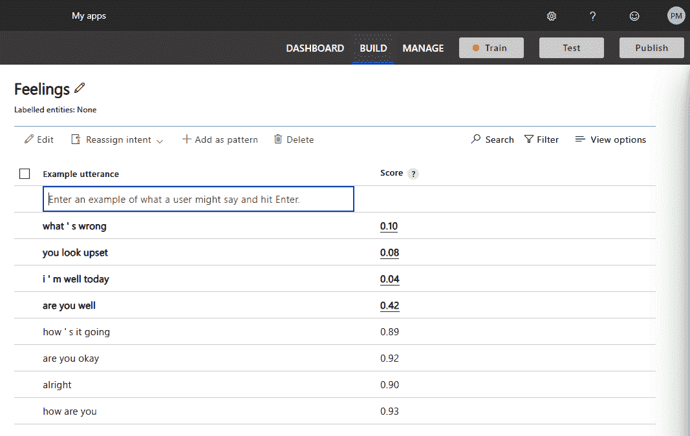

You should ensure that you add at least five phrases for each intent, but the more phrases you have, the better the model.

一旦你做到了这一点，你就可以训练和测试你的模型。

You can add these examples all day, but unless you train the model, it will not change.

让我们试着训练和测试我们的模型。一旦您添加了多个意图(不一定是全部，也不一定与这里列出的相同)，请选择 Train。正如您在前面的截图中看到的，您将知道您的模型何时需要训练，因为 Train 按钮旁边会出现一个红色的小红绿灯。训练好模型后，选择测试进行测试:

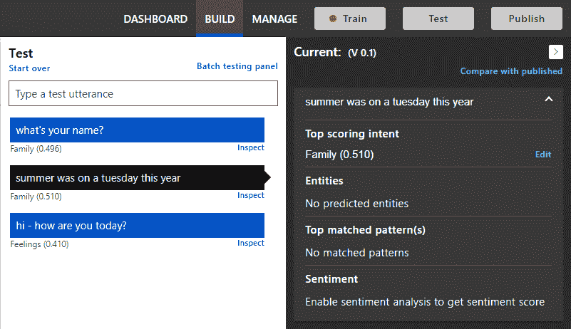

在这里，我已经尝试了三个短语。你可以看到，在每个短语下面，它返回一个意图。好像输入其中一个没错，但是另外两个有点偏。这里最棒的是，在我测试的时候，如果它出错了，我可以简单地告诉 LUIS 它是错的，方法是点击 Edit，然后告诉它正确的意图:

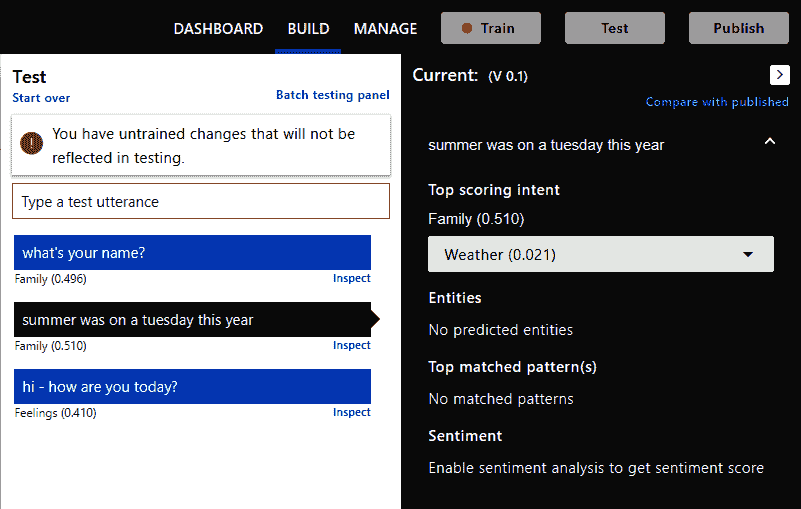

显然，你的意图越细，你的机器人听起来就越真实。一旦你对你训练的机器人感到满意，我们就可以进入下一部分，我们将把 LUIS 集成到我们的机器人中。

We can always come back and retrain the model, but make sure that you're happy with the intents, as we'll be coding against them.

# 将 LUIS 集成到 Bot 框架中

值得注意的是，这个过程被微软很好地记录了下来；请随时关注本部分或查看在[https://docs . Microsoft . com/en-us/azure/bot-service/bot-builder-how to-v4-Luis 找到的文档。视图=azure-bot-service-4.0 &选项卡=csharp](https://docs.microsoft.com/en-us/azure/bot-service/bot-builder-howto-v4-luis?view=azure-bot-service-4.0&tabs=csharp) 。

让我们完成以下步骤:

1.  为了集成 LUIS，我们首先需要添加连接细节。在 LUIS 门户中，选择管理，并从应用程序信息中复制应用程序标识:

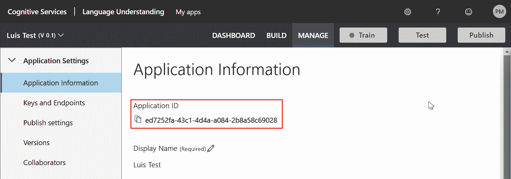

2.  将此添加到您的`appsettings.json`文件中:

```cs
{
  "MicrosoftAppId": "",
  "MicrosoftAppPassword": "",
  "LuisAppId": "ed7252fa-43c1-4d4a-a084-2b8a58c69028",
  "LuisAPIKey": "",
  "LuisAPIHostName": ""
}
```

3.  现在，选择密钥和端点并复制创作密钥:

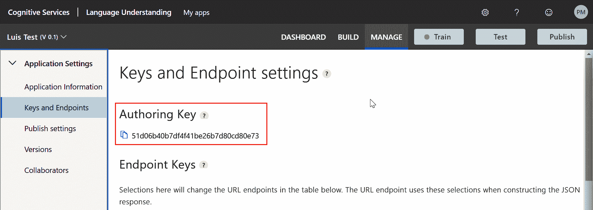

4.  在同一页面的底部，如果向下滚动，您将找到端点:

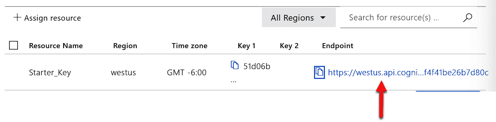

这些值也需要复制到`appsettings.json`中:

```cs
{
  "MicrosoftAppId": "",
  "MicrosoftAppPassword": "",
  "LuisAppId": "ed7252fa-43c1-4d4a-a084-2b8a58c69028",
  "LuisAPIKey": "51d06b40b7df4f41be26b7d80cd80e73",
  "LuisAPIHostName": "https://westus.api.cognitive.microsoft.com"
}
```

Note that the hostname is trimmed after `.microsoft.com`.

5.  完成后，您需要发布您的模型:

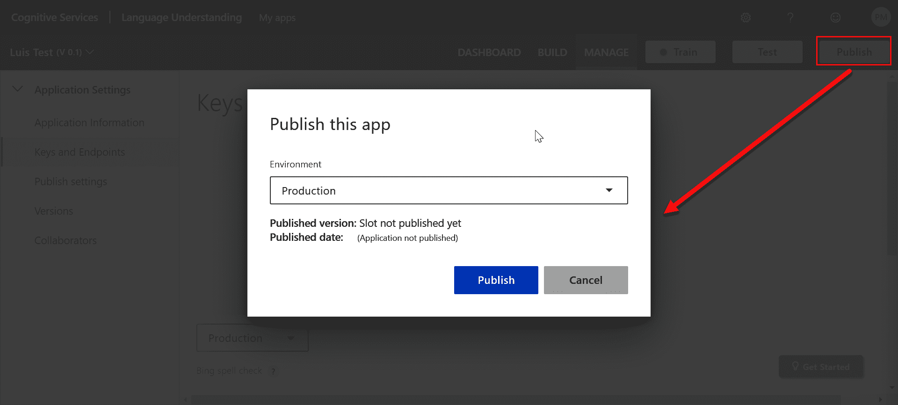

6.  下一步是安装 LUIS NuGet 包:

```cs
Install-Package Microsoft.Bot.Builder.AI.Luis
```

7.  最后，我们需要探究代码；让我们打电话给 LUIS 来代替我们的支票`Hello`:

```cs
protected override async Task OnMessageActivityAsync(ITurnContext<IMessageActivity> turnContext, CancellationToken cancellationToken)
{
    var luisApplication = new LuisApplication(
                    _configuration["LuisAppId"],
                    _configuration["LuisAPIKey"],
                    _configuration["LuisAPIHostName"]
                );

    var recognizer = new LuisRecognizer(luisApplication);

    var recognizerResult = await recognizer.RecognizeAsync(turnContext, cancellationToken);

    var (intent, score) = recognizerResult.GetTopScoringIntent();
    if (intent == "Hello")
    {
        await turnContext.SendActivityAsync(MessageFactory.Text($"Hello, my name is Boris"), cancellationToken);
    }
    else
    {
        await turnContext.SendActivityAsync(MessageFactory.Text($"Echo: {turnContext.Activity.Text}"), cancellationToken);
    }
}
```

让我们快速回顾一下我们在这里改变了什么。首先，我们实例化一个新的`LuisApplication`，并提供我们在`appsettings.json`中收集的凭证。为了做到这一点，我们还将`IConfiguration`注入到类中，稍后我们将回到这个类。

然后我们调用`RecognizeAsync`，它执行短语的实际分析，最后，我们要求它告诉我们它认为意图是什么。让我们看看这对机器人意味着什么:


如你所见，鲍里斯现在明白了一点；然而，我们的反应仍然相当木讷，它只对`Hello`意图起作用。接下来让我们解决其他意图，但是首先，我们将`IConfiguration`注入到类中。让我们来看看这个变化:

```cs
private readonly IConfiguration _configuration;

public BorisBot(IConfiguration configuration)
{
    _configuration = configuration;
}
```

下一阶段是升级我们的项目使用。NET 核心 3。

在编写时，模板使用。NET 核心 2.1；但是，如果在您阅读本文时情况并非如此，请随意跳过下一部分。

# 从升级模板。NET Core 2.1 到 3.0

在这个阶段，我们需要升级。NET 核心 2.1 到。NET 核心 3.0。这可能会导致我们需要做一些小调整。

第一个调整是将`IHostingEnvironment`替换为`IHostEnvironment`(关于这个方法的完整抄本，见下文):

```cs
public void Configure(IApplicationBuilder app, IHostEnvironment env)
```

这是为了避免 2.1 中引入的名称空间冲突。

下一个变化是兼容性版本:当您得知应用程序现在需要设置为与版本 3 兼容时，应该不会感到惊讶；

```cs
services.AddMvc()
    .SetCompatibilityVersion(CompatibilityVersion.Version_3_0);                
```

现在我们已经向依赖注入系统添加了 MVC，我们需要在应用程序中将它注册为中间件。

# UseMvc

最后，端点路由发生了一些变化。这样做的净效果是`UseMvc`现在似乎一次性配置了太多设置；因此，`Configure`方法应该更像这样:

```cs
public void Configure(IApplicationBuilder app, IHostEnvironment env)
{
    if (env.IsDevelopment())
    {   
        app.UseDeveloperExceptionPage();
    }
    else
    {
        app.UseHsts();
    }

    app.UseDefaultFiles();
    app.UseStaticFiles();

    //app.UseHttpsRedirection();
    //app.UseMvc();
    app.UseRouting();
    app.UseCors();
    app.UseEndpoints(e =>
        e.MapControllerRoute("default", "{controller=Home}/{action=Index}/{id?}")
    );
}
```

我们不再调用`UseMvc`，而是调用我们需要的中间件的具体方面。

# allowsynchroniousio

英寸 NET Core 3.0 引入了一个突破性的变化，允许同步调用的缺省值被更改为不允许。在撰写本文时，`BotFrameworkAdaptor`打破了这一规则(可能是因为它正在使用 Newtonsoft JSON 序列化——在这种情况下，到本书出版时，这可能还不是问题)。运行项目时，可能会出现以下错误:

```cs
System.InvalidOperationException: Synchronous operations are disallowed. Call ReadAsync or set AllowSynchronousIO to true instead.'
```

只有在运行项目时出现上述错误，才应实施以下更改:

1.  在`BotController`中，更改`AllowSynchronousIO`标志:

```cs
[HttpPost]
public async Task PostAsync()
{    
    var syncIOFeature = _httpContextAccessor.HttpContext.Features.Get<IHttpBodyControlFeature>();
    if (syncIOFeature != null)
    {
        syncIOFeature.AllowSynchronousIO = true;
    }

    // Delegate the processing of the HTTP POST to the adapter.
    // The adapter will invoke the bot.
    await _adapter.ProcessAsync(Request, Response, _bot);
}
```

2.  我们需要将`IHttpContextAccessor`注入`BotController`；这就是构造函数现在的样子:

```cs
private readonly IHttpContextAccessor _httpContextAccessor;

public BotController(IBotFrameworkHttpAdapter adapter, 
    IBot bot, IHttpContextAccessor httpContextAccessor)
{
    _adapter = adapter;
    _bot = bot;
    _httpContextAccessor = httpContextAccessor;
}
```

3.  最后，在`Startup.ConfigureServices`中，添加上下文访问器:

```cs
services.AddHttpContextAccessor();
```

您的项目现在应该使用编译。NET 核心 3.0。现在让我们研究一下如何扩展我们的代码来处理其他意图。

# 意图/响应矩阵

本节基本上涵盖了该应用编程接口的最后两个要求。我们将创建一个 JSON 文件，将一个意图映射到一个可能的回复(或多个回复)。事实上，我们将每个意图链接到多个回复，然后随机使用一个；这样，机器人会给人一种对每条信息做出独特响应的印象。

让我们从 JSON 文档开始。可能是这样的:

```cs
{
  "Hello": [
    "Hi there!",
    "Hello, My name is Boris",
    "Nice to meet you",
    "Hello"
  ],
  "Family": [
    "Tell me more about your family",
    "Do you have any siblings?",
    "Let's talk about your family some more"
  ],
  "Feelings": [
    "It's important to talk about your feelings",
    "It's healthy to talk about how you feel",
    "Please tell me: how are you feeling"
  ],
  "Weather": [
    "How's the weather where you are",
    "In 1987, the BBC weatherman Michael Fish failed to predict a Hurricane",
    "The weather is very unpredictable",
    "What's the forecast for tomorrow?"
  ],
  "None": [
    "I'm afraid I'm not sure what you mean",
    "That sounds interesting, please tell me more",
    "Wow - really?"
  ]
}
```

将其保存在名为`Data`的文件夹中，并更改属性使其成为嵌入资源:

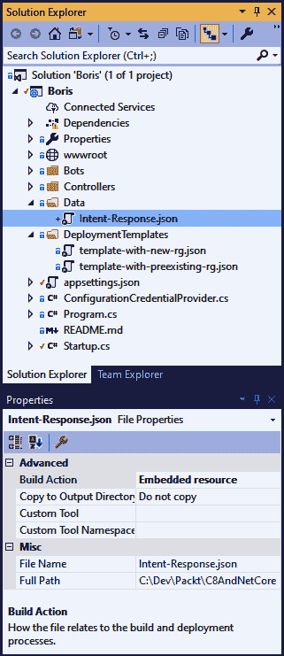

让我们深入了解一下。我们需要的改变在机器人文件`BorisBot.cs`中。我们要改变`OnMessageActivityAsync`方法。在此过程中，我们将在中遇到另外几个新功能。NET Core 3 和 C# 8:

1.  让我们从这里删除不再需要的代码开始:

```cs
if (intent == "Hello")
{
    await turnContext.SendActivityAsync(MessageFactory.Text($"Hello, my name is Boris"), cancellationToken);
}
else
{
    await turnContext.SendActivityAsync(MessageFactory.Text($"Echo: {turnContext.Activity.Text}"), cancellationToken);
}
```

我们将用一些生成更真实响应的代码来替换这个占位符代码。

2.  我们下一步是将 JSON 文件读入文本，得到`result`:

```cs
var assembly = Assembly.GetExecutingAssembly();
var resourceName = "Boris.Data.Intent-Response.json";

using Stream stream = assembly.GetManifestResourceStream(resourceName);
using StreamReader reader = new StreamReader(stream);

string result = reader.ReadToEnd();
```

Note that we're using the new `using` syntax in C# 8\. This is especially nice in methods such as this because without the new syntax, the method would be longer, and in the following code the `using` statements would need to be nested. The new `using` statement has an implicit scope from the declaration point to the end of the function; in all other respects, it behaves exactly like a standard `using` statement.

3.  然后，我们将 JSON 文件的文本内容和意图传递给一个新方法，然后该方法返回一个回复数组。然后，我们从该数组中选择一个随机回复，并发送:

```cs
var response = ReadResponse(result, intent);

string selectedResponse = response[_rnd.Next(response.Length)]; await turnContext.SendActivityAsync(MessageFactory.Text(selectedResponse), cancellationToken);
```

在我们谈论新方法`ReadResponse()`之前，让我们看看`_rnd`是如何声明的，在哪里声明的。它实际上是在类的顶部声明的:

```cs
private Random _rnd = new Random();
```

A discussion about how to reliably generate random numbers in C# is probably outside the scope of this chapter (and book); however, it's worth bearing in mind that the random number algorithm uses a seed based on the time of day, meaning that if you instantiate the class twice in rapid succession and call `_rnd.Next(number)`, you will very likely get the same number back twice.

4.  最后，让我们看看我们的新方法:

```cs
public static string[] ReadResponse(string jsonString, string key)
{
    using var document = JsonDocument.Parse(jsonString);

    var root = document.RootElement;            
    var possibleResponses = root.GetProperty(key);

    return possibleResponses.EnumerateArray().Select(a => a.GetString()).ToArray();
}
```

我们再次使用新的`using`语法。我们还利用了新的 JSON 库，它们是。NET 核心 3。期间所做的一些更改。NET Core 2.1 和 2.2 为新的、更快的。NET Core JSON 解析库。

The decision to bring this in-house wasn't entirely because Microsoft thought they could make a better JSON parsing library than JSON.NET (in fact, at the time of writing, the author of that library was working at Microsoft.) The decision may have been driven more by the fact that some of the lowest-level libraries within the framework had a dependency on JSON.NET.

让我们简单谈谈这个新的 JSON 解析代码在做什么:一旦我们实例化了一个新的`JsonDocument`，我们就找到了`root`元素，然后通过在`root`上调用`GetProperty`返回我们正在寻找的特定文本。最后，我们调用`EnumerateArray`并将它放入`Linq Select`语句中以提取字符串。

这里的最后一步是发布机器人。

# 发布机器人

要开始发布过程，只需右键单击项目文件并选择“发布”。您将看到以下屏幕:


保持默认设置不变，并选择“发布”。现在，您将被问及一系列关于如何以及在哪里部署您的应用程序的问题:

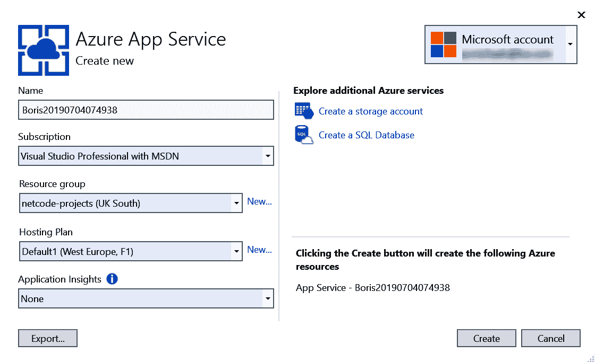

同样，您可以将这些保留为默认值，然后单击创建。

At the time of writing, this prompted an error from Visual Studio, informing you that .NET Core 3.0 is not supported. While that is technically true, following the steps outlined in this chapter should result in a working bot. The team are hoping to get full .NET Core 3 support very soon.

您应该会看到一个网页，表明您的机器人已成功部署。记下这个页面的网址，因为我们很快就会需要它。就我而言，是这样的:

```cs
https://boris20190704074938.azurewebsites.net/
```

下一步是创建频道注册。

Note that an alternative to creating the App Service and Channel Registration separately is to create a bot in the portal. This will create both for you, and you can then publish your bot into that service.

# 创建频道注册

通道注册允许其他应用程序与我们的机器人通信。让我们创建一个。从 Azure 门户中选择创建资源:

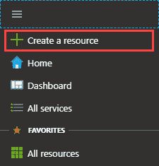

在下一个屏幕中，选择机器人频道注册:


一旦您选择了创建机器人的选项，您将看到一个类似于下面的屏幕。屏幕截图后面的列表中描述了页面的标记部分:


1.  Bot 句柄是一个全球唯一的引用。
2.  消息传递端点是您之前提到的网址。您应该将`/api/messages`附加到网址的末尾；就我而言，这就是`https://boris20190704074938.azurewebsites.net/api/messages`。
3.  完成设置后，选择“创建资源”选项。

我们现在有了一个与 LUIS 集成的工作的、公开的机器人。下一步是创建我们的 UWP 应用程序。

# 微软应用程序标识和微软应用程序密码

在这一章的前面，你可能还记得我们在`appsettings.json`内部创造了一些价值；上次我们见到它们时，它们大致如下:

```cs
{
  "MicrosoftAppId": "",
  "MicrosoftAppPassword": "",
  "LuisAppId": "ed7252fa-43c1-4d4a-a084-2b8a58c69028",
  "LuisAPIKey": "51d06b40b7df4f41be26b7d80cd80e73",
  "LuisAPIHostName": "https://westus.api.cognitive.microsoft.com"
}
```

现在我们已经发布了我们的机器人，我们需要填充这些值。如果您在门户中导航到您的新频道注册并选择设置屏幕，您应该会看到类似于以下内容的内容:

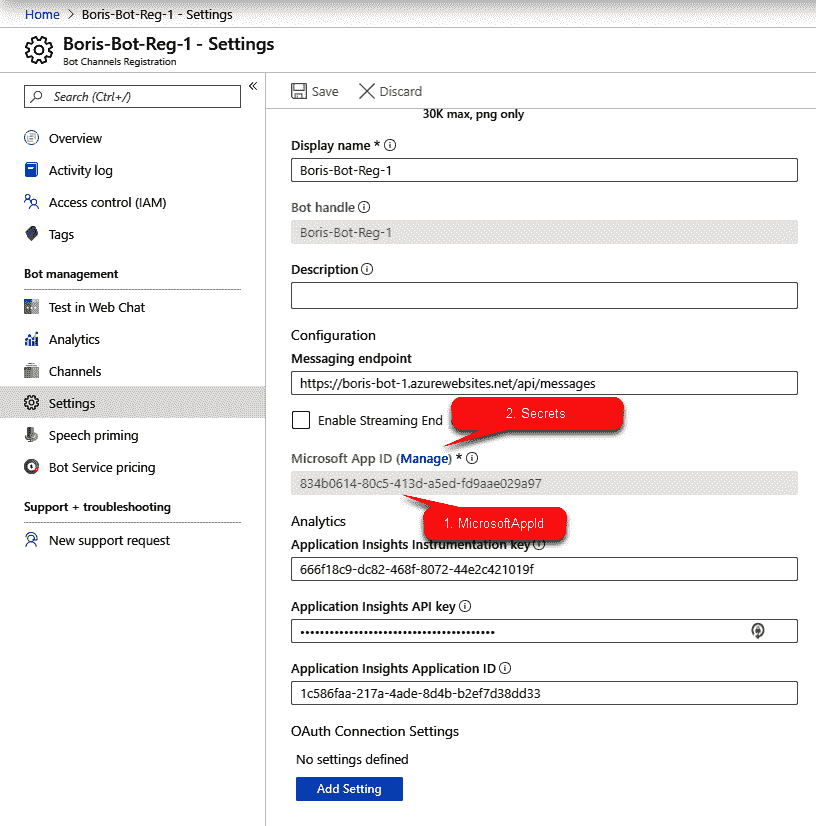

记下`MicrosoftAppId`。选择管理以显示证书&秘密刀片:

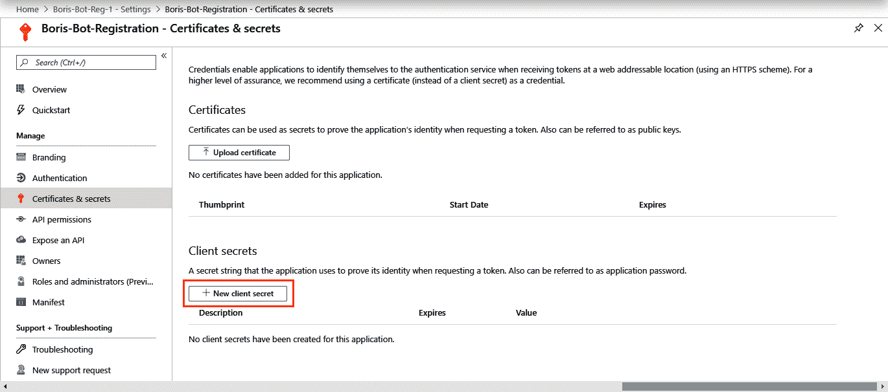

在这里，我们可以创造一个新的秘密:


只需提供描述，然后单击添加。一旦你创造了秘密，你就只有一次机会记录下来；你再也看不到它了，所以如果你丢失了它，你需要移除并重新创建它。

一旦您记下了应用程序标识和密码，有两个选项可以激活它们。第一种方法(也可能是最简单的调试方法)是将它们粘贴到`appsettings.json`中，然后再次发布应用程序。但是，您不需要*来完成此操作—您可以简单地导航到应用服务的配置刀片，并在那里添加一个`AppSetting`:*


This is a very useful trick: any app settings that are added here will override anything in the `appsettings.json`. This means that you don't need to keep sensitive data in your source code.

现在我们已经正确设置了注册，我们可以继续创建客户端应用程序了。

# 创建 UWP 应用程序

我们的 UWP 应用程序将非常简单。我们将创建一个单一的屏幕，允许我们输入一条消息，然后一个日志，用户可以看到机器人的反应，以及他们自己的聊天记录。首先，让我们创建一个新的 UWP 应用程序:


初始应用程序由两个 XAML 文件创建:`App.xaml`和`MainPage.xaml`:


程序的主要结构其实是在`App.xaml` : `App.xaml.cs`的代码隐藏中。如果你看一下那个文件，你会看到当应用程序被启动和挂起时，以及当应用程序中的导航失败时处理的代码。

# 主页

我们的第一个任务是改变`MainPage.xaml`来构建我们的屏幕。让我们看看新 XAML 的样子，然后看看我们的变化:

```cs
<Page
    x:Class="Boris_Client.MainView"

    xmlns:x="http://schemas.microsoft.com/winfx/2006/xaml"
    xmlns:local="using:Boris_Client"
    xmlns:d="http://schemas.microsoft.com/expression/blend/2008"
    xmlns:mc="http://schemas.openxmlformats.org/markup-compatibility/2006"
    mc:Ignorable="d"
    Background="{ThemeResource ApplicationPageBackgroundThemeBrush}"
    xmlns:models="using:Boris_Client.Models"
    Loaded="Page_Loaded">

    <Grid>
        <Grid.RowDefinitions>
            <RowDefinition Height="*" />
            <RowDefinition Height="Auto" />
        </Grid.RowDefinitions>

        <ListView Grid.Row="0" ItemsSource="{Binding ChatHistory}">
            <ListView.ItemTemplate>
                <DataTemplate x:DataType="models:ChatMessage">
                    <StackPanel Orientation="Horizontal">
                        <TextBlock Text="{Binding Sender}"/>
                        <TextBlock Text=":"/>
                        <TextBlock Text="{Binding Message}"/>
                    </StackPanel>
                </DataTemplate>
            </ListView.ItemTemplate>
        </ListView>

        <Grid Grid.Row="1">
            <Grid.ColumnDefinitions>
                <ColumnDefinition Width="*"/>
                <ColumnDefinition Width="Auto"/>
            </Grid.ColumnDefinitions>
            <TextBox Grid.Column="0" Grid.Row="0" x:Name="SendMsg" Text="{Binding MessageText}"/>
            <Button Grid.Row="0" Grid.Column="1" 
                    Command="{Binding SendMessageCommand}" 
                    CommandParameter="{Binding ElementName=SendMsg, Path=Text, Mode=OneWay}"
                    Content="Send" />
        </Grid>

    </Grid>
</Page>
```

我们将在接下来的章节中详细讨论这个模块。让我们从查看网格布局开始。

# 行定义

在 XAML，我们有一个网格的概念:本质上，每个 XAML 页面都被细分为一个网格，你可以告诉系统你想要在你的网格中有多少行和列。在我们的示例中，网格有两行。第二行需要多大就有多大(`Auto`)才能容纳其内容，第一行占用剩余空间(`*`)。

Should you wish, you can have grids nested inside grids. There is no limit (except the available memory) as to how far you can nest controls. Obviously, the deeper you nest your controls, the more work there is for the UI renderer, which can have a performance impact.

网格中的每个后续控件都指定它希望占据的行，甚至是子网格。指定行和列始终适用于直接父网格。

# 列表视图

接下来，我们来到`ListView`。理解 XAML 的关键是构图:你几乎可以达到任何效果，因为你可以把一个控件放在另一个控件里面。在`ListView`控件的情况下，控件本质上有两个元素:它显示的数据和它如何显示数据。

```cs
<ListView Grid.Row="0" ItemsSource="{Binding ChatHistory}">
```

我们稍后会回到`ChatHistory`到底是什么，但现在，就当它是一个集合。我们将`ItemSource`(即控件的数据源)绑定到*事物的集合*，称为`ChatHistory`。那就是*什么*；下一部分是*怎么*:

```cs
<ListView.ItemTemplate>
    <DataTemplate x:DataType="models:ChatMessage">
        <StackPanel Orientation="Horizontal">
            <TextBlock Text="{Binding Sender}"/>
            <TextBlock Text=":"/>
            <TextBlock Text="{Binding Message}"/>
        </StackPanel>
    </DataTemplate>
</ListView.ItemTemplate>
```

这里，我们用`DataTemplate`告诉`ListView`每个元素都是`ChatMessage`类型；再次，我们将回到那是什么——重要的是它至少有两个属性:`Sender`和`Message`。在`DataTemplate`内部，我们声明了一个`StackPanel`，在这个内部，我们声明了一些`TextBlock`元素。这就是我所说的组合——如果你想在一个列表中显示一个元素列表，那么你需要定义数据在哪里以及如何显示它。

While this process is more verbose than other technologies, it affords a much greater degree of flexibility—for example, you could have an image control, another `StackPanel`, or even another `ListView` inside the `DataTemplate`. Additionally, the `DataTemplate` can be reused across files or even applications.

# 消息和命令绑定

最后，我们有第二行，它只是第一行中的另一个网格。有趣的部分显示在下面的代码中:

```cs
<TextBox Grid.Column="0" Grid.Row="0" x:Name="SendMsg" Text="{Binding MessageText}"/>
<Button Grid.Row="0" Grid.Column="1"  Command="{Binding SendMessageCommand}"  CommandParameter="{Binding ElementName=SendMsg, Path=Text, Mode=OneWay}"
        Content="Send" />
```

在`TextBox`中，我们将内容绑定到一个叫做`MessageText` *的东西上。*还是那句话，不要担心`MessageText`是什么，尽管，考虑到它与`Text`属性绑定，我们可以有把握地假设它是(或者必须是)一个字符串。

最后，我们有一个按钮和一个叫做**命令绑定**的东西。与其他绑定不同，命令绑定本质上只是获取数据并显示它，它绑定到一个方法。还是那句话，我们不要太担心`SendMessageCommand`到底是什么；现在，让我们接受它*做了一些事情*。

# 数据绑定和视图模型

现在我们已经创建了前端 XAML 文件，让我们来看看代码隐藏(`MainPage.xaml.cs`):

```cs
public sealed partial class MainPage : Page
{
    public MainPage()
    {
        this.InitializeComponent();

        DataContext = new MainViewModel();    

    } 
}
```

如你所见，这里没什么可讨论的。事实上，我们实际上只有一行额外的代码，它将`DataContext`设置为`MainViewModel`的一个实例。

本质上，我们在这里做的是获取一个类，并将该类分配给 XAML 代码文件的`DataContext`。这意味着该文件中的任何内容现在都可以绑定到前端 XAML。

It is entirely your choice, but at this stage, I renamed the `MainPage` file to `MainView`. The reason that I did this is that it binds to `MainViewModel`, and I find it much easier to read it if the names are aligned by convention. But don't worry: the code will still work if you don't do this.

现在我们已经绑定了视图模型，我们可以在`ViewModel`上调用方法。加载页面后，我们将调用一个方法来初始化所有内容:

```cs
private async void Page_Loaded(object sender, RoutedEventArgs e)
{
    await ((MainViewModel)DataContext).Initialise();
}
```

我们可以先看一下`ViewModel`文件；然而，首先，让我们花一分钟时间来谈谈视图模型作为一个概念。想象一下，你不是在编写应用程序，而是在安装水槽。如果你去当地的 DIY 商店，你可能会看到几十种类型的水槽，但是你可以挑选任何一个水龙头配件数量正确的水槽，并把它带回家，相信你可以把它放在旧水槽的地方，连接几根管道，并有自来水。

这与视图和视图模型有什么关系？想象一下，进入你家的管道是景观模型。它们以原始形式携带必要的信息——也就是水。如果你没有把水槽垂直放进去，只是打开了总水管，你会看到信息从管道中涌出。水槽就像视图一样，以你想看到的任何形式排列信息或水。

Please don't take any aspect of this analogy as reliable information on plumbing—it's for illustrative purposes only. I am not a qualified plumber!

When designing your view and view model, you should bear this in mind. If you start to see local relating to the arrangement of the data creeping into your view model, that should be a red flag that you're crossing a line and tightly coupling the two. One question to ask yourself is, if I wanted to display this differently, could I do so without changing the view model? If the answer is no, then consider a different approach.

让我们首先声明我们的`ViewModel`:

```cs
public class MainViewModel : INotifyPropertyChanged
{
    public event PropertyChangedEventHandler PropertyChanged;

    protected void RaisePropertyChanged([CallerMemberName]string name = null)
    {
        if (PropertyChanged != null)
        {
            PropertyChanged(this, new PropertyChangedEventArgs(name));
        }
    } 
}
```

这是一个正常运行的 UWP 所需要的绝对最低代码。`INotifyPropertyChanged`界面是一个只有一个事件的界面:`PropertyChanged`。本质上，这里的目的是，当您更改属性时，您需要告诉绑定系统您已经这样做了，然后可以更新用户界面。我们在*我们的* `ViewModel`中首先需要的是一种叫做`Initialise`的方法——如果你还记得的话，我们实际上更进一步地称之为:

```cs
internal async Task Initialise()
{
    await _wrapper.StartConversation(); 
}
```

让我们添加我们在应用程序中显示的数据:

```cs
public ObservableCollection<ChatMessage> ChatHistory { get; set; } = new ObservableCollection<ChatMessage>();

private string _messageText;
public string MessageText
{
    get { return _messageText; }
    set
    {
        _messageText = value;
        RaisePropertyChanged();
    }
}
```

`MessageText`短语只是一个字符串(正如我们之前猜测的那样)。如您所见，我们称之为`RaisePropertyChanged`事件，它是我们在设置属性时创建的。

You can choose to enhance this by only raising the event when the value changes.

第二条数据保存在一个特殊的集合中，称为`ObservableCollection`。

# ObservableCollection

当用户界面的内容改变时，一个`ObservableCollection`通知用户界面。也就是说，每次添加或删除一个项目，UI 都会自动更新。一个`ObservableCollection`在其他方面的表现就像任何其他集合一样(比如一个`List`)。

It's worth bearing in mind that, while an `ObservableCollection` will update the UI when you add or remove an item, it will not update the UI if you change the collection itself. For example, look at the following:

`MyCollection = new ObservableCollection<MyObject>()`

This would not update the UI. Furthermore, changing the contents of `MyObject` (in this case) would not update the UI.

目前，我们不会担心`ChatHistory`，尽管到目前为止你可能已经知道它会是什么样子。接下来，我们来看看命令。

# 命令绑定

在用户界面中，我们有一个设置了`Command`属性的按钮。在本节中，我们将不会看到`Command`实际上是什么样子的。在这段代码中，我们将使用名为`RelayCommand`的`wrapper`类。我们将很快回到`RelayCommand`，但是命令只是实现`ICommand`接口的任何类。我们在这里使用的`helper`类仅仅意味着我们可以在`ViewModel`中声明命令功能。

最初，我们只是宣布`RelayCommand`:

```cs
public RelayCommandAsync<string> SendMessageCommand { get; set; }
```

然后，我们在构造函数中实例化它:

```cs
public MainViewModel()
{
    SendMessageCommand = new RelayCommandAsync<string>(SendMessage);
}
```

如您所见，我们将一个方法作为参数传递给命令。在我们看方法本身之前，我们需要走一点弯路；否则，这个方法就没有多大意义了。

# DirectLineWrapper

最终，整个应用程序的目的是向我们的机器人发送一条消息，并将回复打印在屏幕上。我们接下来要介绍的是一个包装类来实现这一点。我们将在本章后面填充实际的类代码，但是在这里，我们将使用这个类，就好像它做了我们需要的一切一样。让我们从将它声明为类级变量开始:

```cs
BotClientSdk.DirectLineWrapper _wrapper = null;
```

现在，我们将在构造函数中实例化它，现在应该如下所示:

```cs
public MainViewModel()
{
    SendMessageCommand = new RelayCommandAsync<string>(SendMessage); 
    _wrapper = new BotClientSdk.DirectLineWrapper(PopulateHistory);
}
```

你会注意到我们正在传递一个变量到`DirectLineWrapper`类；我们将很快回到这个方法。

Broadly speaking, instantiating a dependency inside a constructor is bad practice. It makes testing the class very difficult; should you wish to extend this project, moving this into an injected dependency would be a good start.

`SendMessage`法体应做如下更改:

```cs
private async Task SendMessage(string message)
{            
    await _wrapper.SendMessage(message);
    MessageText = string.Empty;
}
```

`_wrapper`有一个叫`SendMessage`的方法。这将在我们稍后创建的类中调用一个方法。最后，我们清除文本框，以便用户可以输入另一条消息。

我们还需要一种方法来填充历史:

```cs
private void PopulateHistory(List<KeyValuePair<string, string>> response)
{ 
    var ignored = Dispatcher.RunAsync(CoreDispatcherPriority.Normal, () =>
    {
        foreach (var historyItem in response)
        {
            ChatHistory.Add(new ChatMessage(historyItem.Key, historyItem.Value));
        }
    });
}
```

这被传递到我们新的`wrapper`类的构造函数中——也就是说，整个函数都被传入。这里的想法是我们可以从我们的`wrapper`类内部更新用户界面，但是`wrapper`类仍然不知道它的调用上下文。我们需要在这里补充最后一点:

```cs
private CoreDispatcher Dispatcher =>
     (Window.Current == null) ?
     CoreApplication.MainView.CoreWindow.Dispatcher :
     CoreApplication.GetCurrentView().CoreWindow.Dispatcher;
```

这才允许我们使用`Dispatcher`；因为我们本质上是在一个后台线程上工作，没有这个，我们将无法更新 UI，这必然是一个前台线程。

当我们迭代这个的时候，我们把它添加到`ObservableCollection`；我们之前说过，以这种方式向集合中添加数据将为我们更新 UI。

在我们介绍包装器内部外观的细节之前，我们有一些已经使用过的`helper`类和模型。让我们从模型开始。

# 模型

我们使用了一个模型来存储聊天消息(单数)，因此我们需要看看这个类是什么样子的。正如我之前所说的，如果你已经读完了这一章，它的形状应该不会令人惊讶:

```cs
public class ChatMessage
{
    public ChatMessage(string sender, string message)
    {
        Sender = sender;
        Message = message;
    }

    public string Message { get; set; }
    public string Sender { get; set; }
}
```

在我们继续之前，我们需要看`RelayCommandAsync`课。

# RelayCommandAsync

`RelayCommandAsync`的代码不太繁琐。我们实现了一个名为`ICommand`的接口，它只有两种方法。`ICommand`的基本实现如下:

```cs
public class RelayCommandAsync<T> : ICommand
{ 
    public bool CanExecute(object parameter)
    {
    }

    public void Execute(object parameter)
    {
    } 
}
```

显然，这没有任何作用，所以让我们填写那些方法。我们先从`Execute`开始；我们需要将一个动作传递给`Execute`方法，我们可以通过构造函数来实现:

```cs
public class RelayCommandAsync<T> : ICommand
{
    readonly Func<T, Task> _execute = null;

    public RelayCommandAsync(Func<T, Task> execute)
    {
        if (execute == null)
            throw new ArgumentNullException("execute");

        _execute = execute;
    }

    public void Execute(object parameter)
    {
        _execute.Invoke((T)parameter);
    } 

    . . .
}
```

所以在这里，我们只是将一个函数委托作为构造函数传递到类中，然后在调用`Execute`时调用它。

The reason that we're using `Func` and not `Action` here is that we are, in fact, returning something—namely, a `Task`. If the command were synchronous, we could return an `Action`.

最后，我们将添加`CanExecute`代码:

```cs
public class RelayCommandAsync<T> : ICommand
{
    readonly Func<T, Task> _execute = null;
    readonly Func<T, bool> _canExecute = null;

    public RelayCommandAsync(Func<T, Task> execute)
        : this(execute, null)
    {
    }

    public RelayCommandAsync(Func<T, Task> execute, Func<T, bool> canExecute)
    {
        if (execute == null)
            throw new ArgumentNullException("execute");

        _execute = execute;
        _canExecute = canExecute;
    }

    public bool CanExecute(object parameter)
    {
        return _canExecute == null ? true : _canExecute.Invoke((T)parameter);
    }

    public event EventHandler CanExecuteChanged;

    public void RaiseCanExecuteChanged()
    {
        CanExecuteChanged?.Invoke(this, EventArgs.Empty);
    }

    public void Execute(object parameter)
    {
        _execute.Invoke((T)parameter);
    } 
}
```

`CanExecute`短语本质上返回一个布尔值，表示所讨论的命令是否可以有效执行。通过将用户界面绑定到此，如果返回`False`，您可以禁用用户界面上的按钮。我们实际上并没有在这里使用这个功能；然而，如果我们这样做了，这段代码将会起作用。

One of the advantages of `CommandBinding` is that you can unit test the command itself without touching the UI—that is, your unit test covers the code immediately after pressing the button.

现在，我们已经填补了剩余的空白，我们需要谈谈直接线，以及如何与我们的机器人沟通。

# 通道

在我们谈论直线和它是什么之前，我们应该讨论什么是关于机器人的通道。让我们看看下面的图片:

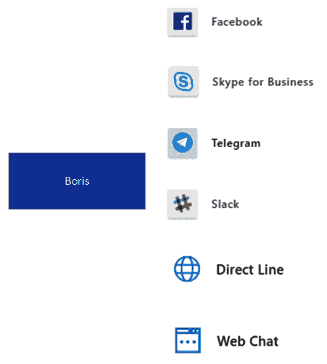

这并不是一个详尽的通道列表，而是试图说明一个通道只是一个应用程序和机器人之间的接口——例如，如果你愿意，你可以将你的机器人链接到 Slack。

这里有两个突出的渠道:直线和网络聊天。让我们简单地看一下它们。

# 直拨电话和网络聊天

我们已经看到了网络聊天:本质上，这是一种测试你的机器人的方法，当你注册一个频道时，它是免费的，这就是为什么你可以在本章的前面使用它来测试你的机器人。

直接线允许你直接与你的机器人互动。现在让我们配置一个直通通道。在 Azure 门户中，导航到您的机器人并选择频道:

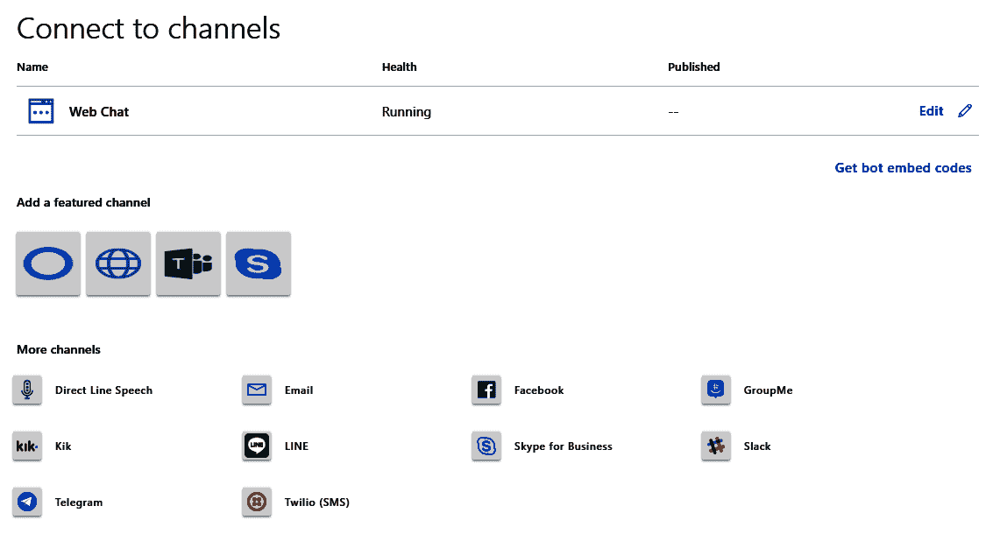

抛开奇怪扭曲的图形不谈，直达线频道就是地球仪；如果你点击它，你应该被要求命名网站:


在下一个屏幕中，您将获得两个密钥。单击第一页上的“显示”，并保留一份副本，因为我们很快就会需要它。完成后，点按“完成”，您应该会看到现在有两个频道。

# Bot 客户端

最后一步是创建我们在 UWP 应用程序中引用的客户端。让我们从创建一个新项目开始，并立即从 UWP 应用程序中引用它。. NET 标准 2.0 类库足以满足我们的需求:

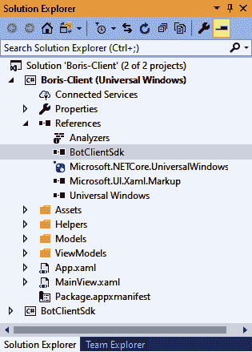

我们需要做的第一件事是导入两个 NuGet 包:直接行包本身和 Rest 客户端运行时:

```cs
Install-Package Microsoft.Bot.Connector.DirectLine
Install-Package Microsoft.Rest.ClientRuntime
```

在这个项目中，我们只需要一个类——让我们称之为`DirectLineWrapper`。

As a general principle, I always like to try to wrap external dependencies in a Wrapper Project to protect the main project from having too many direct external dependencies: this allows you to swap out the wrapper much easier if, for example, you wished to use a different bot service.

我们需要一些类级别的变量，包括`DirectLineClient`本身；我们还需要实例化它，如下所示:

```cs
public class DirectLineWrapper
{
    private string? _conversationId = null;
    private readonly DirectLineClient _client;
    Action<List<KeyValuePair<string, string>>> _updateMessages;

    public DirectLineWrapper(Action<List<KeyValuePair<string, string>>> updateMessages)
    {
        _client = new DirectLineClient("A33UCbCQoP1.QNPYS_u2Z7LhobFce9mA2ZWt47n7VzEuTjTGWHO-aL0");
        _updateMessages = updateMessages;
    }
}
```

传递到`DirectLineClient`构造函数中的字符串参数是您之前记录的秘密。我们将很快回到对话标识。如你所见，我们正在给班级注入一个*动作*；这将允许我们在消息进来时更新屏幕。

在这个类中，我们只需要三个方法，其中只有两个是公共的。让我们看看第一个:

```cs
public async Task SendMessage(string message)
{ 
    if (string.IsNullOrWhiteSpace(_conversationId))
    {
        throw new Exception("No active conversation");
    }

    Activity userMessage = new Activity
    {
        From = new ChannelAccount("User"),
        Text = message,
        Type = ActivityTypes.Message
    };

    var resourceResponse = await _client.Conversations.PostActivityAsync(_conversationId, userMessage); 
}
```

在这里，我们创建一个新的`Activity`实例。本质上，这是我们的信息；然而，它不一定是一条消息——它可能只是一个通知，表明您仍在键入或 ping。有很多选择，但我们对这里的`Message`感兴趣。

每次你和机器人开始对话，它都会给你一个对话标识。如果你每次都要开始一个新的对话，你就要清除聊天的上下文，所以你需要维护一个对 ID 的引用，如果 ID 不存在，就调用`StartConversationAsync()`，就能做到这一点。这就带来了我们的第二个公开方法`usd`:

```cs
public async Task StartConversation()
{
    if (string.IsNullOrWhiteSpace(_conversationId))
    {
        var conversation = await _client.Conversations.StartConversationAsync();
        _conversationId = conversation.ConversationId;

        new System.Threading.Thread(async () => await ReadBotMessagesAsync(_client, conversation.ConversationId)).Start();
    }
}
```

一旦我们开始对话，我们就开始一个新的线程来读取消息。我们的第三种方法是循环读取消息:

```cs
private async Task ReadBotMessagesAsync(DirectLineClient client, string conversationId)
{
    string watermark = string.Empty;
    var messages = new List<KeyValuePair<string, string>>();

    while (true)
    {
        var activitySet = await client.Conversations.GetActivitiesAsync(conversationId, watermark);

        lock (_lock)
        {
            watermark = activitySet.Watermark;

            var activities = from x in activitySet.Activities
                             select x;

            messages.Clear();
            foreach (Activity activity in activities)
            {
                messages.Add(new KeyValuePair<string, string>(activity.From.Id, activity.Text));
            }

            _updateMessages(messages);
       }

       await Task.Delay(TimeSpan.FromSeconds(1)).ConfigureAwait(false); 
    }
}
```

这本质上只是读回活动；然而，这里需要注意的重要一点是水印。尽管这个名字不好，但水印是一个指针，指向我们当前在活动集中的位置。如果您没有存储水印，那么每次您都可以简单地恢复整个对话。一旦我们得到一个活动列表，我们只需调用委托`_updateMessages`，它会更新用户界面。

我们的项目差不多到此结束。我们现在有了一个聊天客户端，它可以与用户通信，并有希望欺骗他们相信他们正在与另一个人交谈:


正如你所看到的，机器人正在对用户做出反应，并且，不可否认地，模糊地，正在进行对话。为了提高这种交流的质量，我们只需要回到 LUIS 部署，并使用具体的响应对其进行进一步的培训。

# 摘要

在这一章中，我们创建了一个聊天机器人，并使用 LUIS 对语言进行了基本的理解。我们采用了默认模板，并从。NET 核心 2.2 到。NET Core 3.0，并创建了一个 UWP 客户端应用程序，使用直接线应用编程接口与机器人通信。

我们版本的伊莱扎(鲍里斯)比原版更有可能通过图灵测试吗？也许吧。如果你想改进 LUIS 中的模型，那么你可能会给它更多的战斗机会，但是聊天机器人和语言识别的现实应用远远超出了愚弄某人以为他们在和人类说话的能力。您可以很容易地将它与语音合成器和电话集成软件(如 Twilio)联系起来，您将拥有一个自动呼叫中心。

通用视窗平台，至少目前是微软吹捧的首选桌面平台。这种情况是否会持续，我们是否会走向单一。NET 平台，我不能说。

在本书中，我们介绍了 C#语言的许多新特性。我们利用它们来使我们的代码更加易读和简洁，并且，在可空引用类型的情况下，我们实际上减少了代码中潜在错误的数量。

我们也看了一些好处。NET Core 3 提供了，允许我们将现有的桌面应用程序迁移到新的。NET Core 3 框架，并且使用 XAML 群岛，甚至在遗留软件中使用来自较新应用程序的控件。

我们广泛研究了可供使用的 Azure 服务，发现将这些服务集成到我们的代码库中是多么容易。