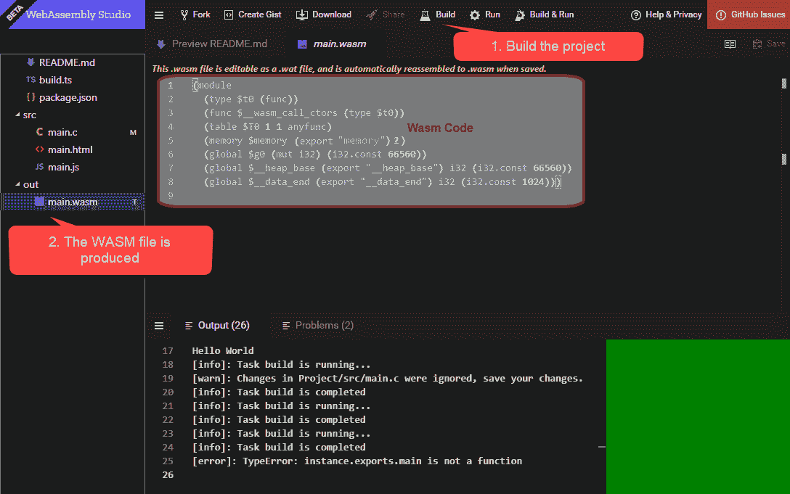
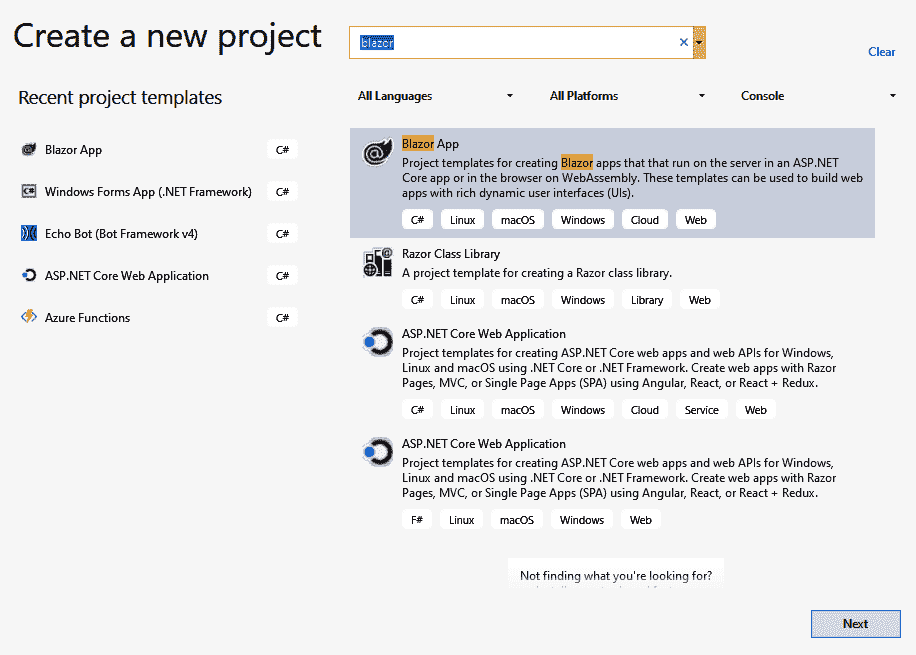
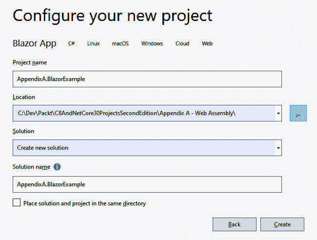
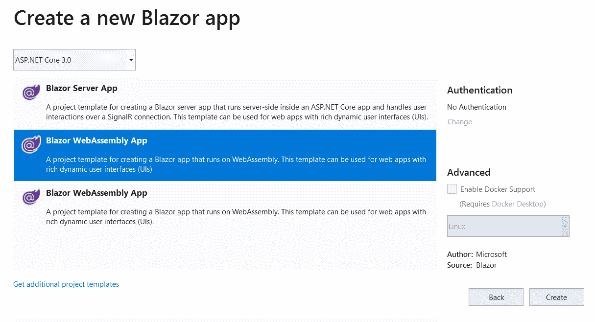
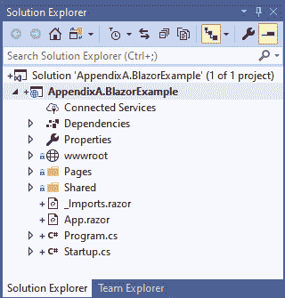

# WebAssembly

在撰写本文时，每个人都在谈论 WebAssembly。2015 年首次推出。本质上，原则是您的浏览器(所有主要浏览器都支持 WebAssembly)可以运行一种类型的编译代码(以前，您仅限于 JavaScript)。

以下链接显示了浏览器对网络组装的支持:[https://caniuse.com/#feat=wasm](https://caniuse.com/#feat=wasm)。

火狐、Chrome、Edge、Safari 都支持。值得注意的是，一些较旧的浏览器(例如 IE)不支持它，所以如果您正在编写一些需要与这些较旧浏览器兼容的东西，您可能不得不求助于更传统的 JavaScript。

你最初可能会问自己的问题是:我为什么要在乎？希望本附录将涵盖为什么 WebAssembly 准备在未来几年接管 web 的原因。

然后，我们将运行两个示例，一个使用原生的 WebAssembly 编译，第二个使用 Blazor，这是微软的一项技术，允许您编写 C#并让它在浏览器中运行。

本章将涵盖以下主题:

*   为什么是网络组装？
*   编写网络程序集
*   理解布拉佐

# 为什么是网络组装

就目前的情况而言，您可以编写 JavaScript，并且它在任何浏览器中都可以非常愉快地运行。假设你正在读一本关于 C#的书，你会(至少是模糊地)熟悉 JavaScript 语法。在本节中，我将尝试概述为什么您可能选择使用网络组装而不是可能的替代方法。

Due to the nature of this comparison, it inevitably contains some opinion. For example, I'm about to extol the virtues of statically typed languages over dynamic ones. If you know and are happy with using JavaScript, you may wish to skip the sections that don't interest you.

# 原因一——静态类型

我个人对 JavaScript 的不满之一是它是动态键入的。这意味着您可以使用尚未显式声明的变量。这里的连锁反应是，您可能会得到以下代码:

```cs
var myInt = 2;
myNum++;
```

假设您希望这两个数字是相同的，那么您会希望在编译时对此进行陷印；然而，有了 JavaScript，这将运行——尽管它显然不会像您期望的那样。

There are many tools available to help to alleviate this problem, from ESLint to TypeScript. However, this involves you including a step in your build chain to capture what, in a statically-typed language, would simply be a compilation error.

# 原因二-已编译

这是一个微妙的问题:虽然 JavaScript 肯定不是编译的，而是解释的，但是 WebAssemby 是 JIT 编译的。话虽如此，C 或 C#的编译过程将捕捉到前一节中提到的大多数问题。此外，与 JavaScript 相比，代码的执行速度显著提高(因为 JavaScript 是解释的)。有人声称速度提高了 20 倍；然而，正如您将在下一节中看到的，这并不像最初看起来那样清晰。

# 原因三——速度

和原因二一样，原因三也是脆弱的。笼统地说网络组装比 JavaScript 快是错误的。如前所述，执行相同的代码比 JavaScript 更快——事实上，处理器密集型代码的速度是 WebAssembly 存在的原因之一。

但是，请记住，您仍然在浏览器的上下文中运行，因此您可能希望使用的任何外部库都需要下载。虽然这对于运行编译成 WASM 的 C 程序来说不是什么问题，但对于像 Blazor 这样的东西来说可能是个问题。必须下载. NET 运行时。

In a later section, we will look into this in more detail. As it currently stands, the version of client-side Blazor uses the Mono runtime.

# 原因四–您知道的语言/前端和后端的相同语言

如果你知道 JavaScript，那么你可以选择使用 Node.js 作为你的后端。选择这样做可能有很多原因，其中一个原因可能是您可以为团队雇佣 JavaScript 开发人员。我们先深究一分钟:在写这篇文章的时候，IT 行业(至少在英国)存在技能短缺；如果你能分离出你需要招聘的一项技能，那肯定会让你的工作变得更容易，因为除了编写 C#和 JavaScript 程序的开发人员之外，你还可以雇佣只使用 JavaScript 的开发人员，或者使用 Python、Ruby、VB.NET 或任何后端语言并在前端使用 JavaScript 的开发人员——事实上，任何在 2019 年为 web 编写程序的人都需要至少了解 JavaScript 的基本水平。

直到现在，如果你是一名 C#开发人员(或任何其他前述语言)，你将不得不学习 JavaScript 来编写应用的前端:现在你可以用 C#编写前端和后端。

At the time of writing, client-side Blazor was not officially part of the .NET Core ecosystem. We'll cover this in more detail later in this chapter.

还值得记住的是，随着 Xamarin 的出现，这实质上意味着你可以在任何平台上用 C#编程。

There is, in fact, an open source project that translates `Xamarin.Forms` code into WASM; it can be found here: [https://github.com/praeclarum/Ooui](https://github.com/praeclarum/Ooui).

Uno is another project that allows you to write XAML and translates it into platform-specific code (including WASM): [https://platform.uno/](https://platform.uno/).

# 原因五-现有代码

由于许多语言已经被各种工具支持编译到 WASM，您可能已经有一些代码可以简单地编译到网络汇编中。有几个例子可以说明这种成功是如何发生的。

想象你有一个完全用 C 写的游戏；您可以将它移植到浏览器上运行。就我个人而言，我正在焦急地等待一个工具的创建，它将把 Spectrum ZX80 汇编语言翻译成 WASM 语，然后我就可以在网上玩所有的老 Spectrum 游戏了！

# 原因六–部署

web 开发比桌面开发更受欢迎的一个主要原因是，web 浏览器解决了一个困扰我们程序员多年的问题:部署。编写一个桌面应用，并部署它——当您不能完全控制目标机器时，您会惊讶于部署它变得多么困难。

在我看来，这个原因可能是所有原因中最令人信服的:网络组装提供了桌面和网络开发环境之间的混合解决方案。

# 原因七——安全性

需要明确的是，WebAssembly 与 JavaScript 在相同的上下文中运行，所以它并不比用 JavaScript 编写 web 应用安全多少。然而，当你考虑你在做什么时，它实际上是相当安全的。这比给人们发送可执行文件并要求他们在自己的机器上运行要安全得多。

我已经列出了您可能希望使用网络组装的一些原因。对于某些应用，它显然比传统的 web 模型有一些优势。然而，和技术一样，这是一个权衡问题。

在下一节中，我们将看看您实际上是如何编写一些网络程序集的。

# 编写网络程序集

为了尝试编写一些网络组装，我们将使用网络组装工作室工具:[https://webassembly.studio/](https://webassembly.studio/)。

这是一个在线工具，允许你用各种语言编写代码，并把它们编译成 WASM。在 WebAssembly Studio web 应用中，如果您创建了一个新的`C Hello World`应用，您可以通过构建项目非常快速地看到一些 WASM 代码:



如你所见，WASM 并不完全是直觉。但是，您可以自己编写(或制作)并让网络浏览器运行它。

这个工具肯定会让你对这项技术的可能性有所了解；但是，如果您不太熟悉 C 或 Rust，那么除了在浏览器中显示 42 之外，您可能很难使用它。

幸运的是，微软正在研究一项名为 Blazor 的实验技术，该技术在一个看起来很熟悉的项目结构背后抽象出了大量这项工作。

# 理解布拉佐

在撰写本文时，Blazor 大约两岁(2017 年首次演示)。这个想法是采用 WebAssembly 的概念，并将其与 web 开发人员熟悉的现有概念(如 Razor)混合在一起。

Part of the reason that this section is an appendix is that only server-side Blazor was released with .NET Core 3\. While the client side is in a workable state, it is not in the official release at the time of writing.

Blazor 有两种风格:客户端和服务器。服务器端 Blazor 与一起发布。NET Core 3。它的工作原理是在服务器上运行 C#代码，然后使用 SignalR 向客户端发送屏幕更新。虽然这是一个有趣的方法，因为它不使用网络组装，我们不会在本章中进一步讨论它。

要创建一个布拉佐项目，你需要 Visual Studio 插件:[https://marketplace.visualstudio.com/items?itemName=aspnet.blazor](https://marketplace.visualstudio.com/items?itemName=aspnet.blazor) 。

您还需要为 Blazor 安装 Visual Studio 模板；在命令行中，键入以下内容:

```cs
dotnet new -i Microsoft.AspNetCore.Blazor.Templates
```

By the time this book is published, this step may no longer be necessary.

我们现在可以创建一个新的 Blazor 项目:

1.  从 Visual Studio 2019 创建新的 Blazor 应用项目:



2.  在下一个屏幕中，选择您的项目名称和位置，就像您通常会做的那样:



3.  在下一个屏幕中，您应该会看到几个选项。在本例中，我们将创建一个客户端 Blazor 应用:



4.  如果您现在选择创建，您将看到一个完整的 Blazor 工作示例。尝试运行这个:您应该会看到一个功能齐全的单页应用。如果你看过 React 模板，你应该对这个结构非常熟悉。

While this is true at the time of writing, the template may have changed by the time you read this.

如果您在应用周围单击，它应该感觉很像现代的单页应用。让我们看得更深一点。我们将从项目结构开始:



这个结构你应该很熟悉。值得注意的是`.razor`的扩展:事实上，名称 **Blazor** 来自单词 **B** rowser 和 R **azor** 的融合。

对于这个快速的概述，我们不会过多地讨论细节，但是让我们看看计数器页面；运行应用时，您应该会看到一个允许您单击按钮并增加值的页面:


这一页给人一种极好的感觉，确切地说，这种语言是如何工作的；让我们看看驱动这个的代码。`Counter.razor`文件是这样的:

```cs
@page "/counter"

<h1>Counter</h1>

<p>Current count: @currentCount</p>

<button class="btn btn-primary" @onclick="@IncrementCount">Click me</button>

@code {
    int currentCount = 0;

    void IncrementCount()
    {
        currentCount++;
    }
}
```

我们有一些 HTML:页面标题、当前计数等等。然后，我们有了 Razor 语法——几乎在任何地方你都能在符号(`@`)上看到*。注意，该按钮将*点击*事件处理程序映射到`@code`块内的方法。Blazor 跟踪 DOM，当某些东西发生变化时，例如`currentCount`，页面就会被刷新。*

让我们再次运行该应用，但这一次，在浏览器中打开开发人员工具:


For most browsers, this can be achieved by pressing *F12*.

这告诉我们，在与 Blazor 打交道时，两件事非常重要。首先，看看运行应用所需的所有 dll。本质上，这是下载单声道运行时。如您所见，文件并不是特别大，但是在选择 Blazor 技术时需要记住这一点。

要注意的第二件事是，单击按钮不会进行服务器调用。所有代码都在客户端上执行。这就是 Blazor 的真正吸引人之处:你可以编写 C#代码，它在你的浏览器中运行。

我们已经快速浏览了原始形式的 WebAssembly。我们已经讨论了为什么网络组装是如此吸引人的新兴网络技术。然后我们看了一下 Blazor 项目，看它如何简化创建 web 应用的过程。