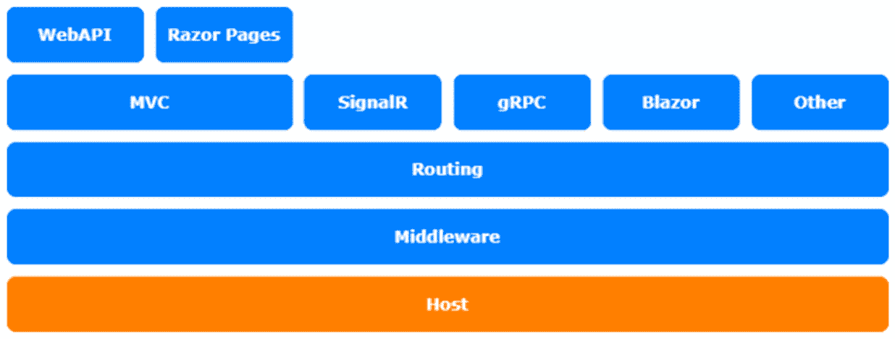

# 三、自定义依赖注入

在第三章中，我们将了解 ASP.NET Core**依赖项注入**以及如何定制它以使用不同的依赖项注入容器（如果需要）。

在本章中，我们将介绍以下主题：

*   使用不同的依赖项注入容器
*   看看`ConfigureServices`方法
*   使用不同的`ServiceProvider`类型
*   介绍 Scrutor

本章中的主题涉及 ASP.NET Core体系结构的托管层：



图 3.1–ASP.NET Core体系结构

# 技术要求

要遵循本章中的描述，您需要创建一个 ASP.NET Core MVC 应用。打开控制台、shell 或 bash 终端，并切换到工作目录。使用以下命令创建新的 MVC 应用：

```cs
dotnet new mvc -n DiSample -o DiSample
```

现在，在 Visual Studio 中双击项目文件或在 VS 代码中，在已打开的控制台中键入以下命令来打开项目：

```cs
cd DiSample
code .
```

本章中的所有代码示例都可以在本书的 GitHub 存储库中的[中找到 https://github.com/PacktPublishing/Customizing-ASP.NET-Core-5.0/tree/main/Chapter03](https://github.com/PacktPublishing/Customizing-ASP.NET-Core-5.0/tree/main/Chapter03) 。

# U使用不同的依赖注入容器

在大多数项目中，您实际上不需要使用不同的**依赖注入**（**DI**容器。ASP.NET Core中现有的 DI 实现支持主要的基本功能，并且能够高效快速地工作。但是，其他一些 DI 容器支持一些您可能希望在应用中使用的有趣功能：

*   **Ninject**允许您创建一个支持模块作为轻量级依赖项的应用；例如，您可能希望将模块放入特定目录，并在应用中自动注册它们。
*   您可能希望在应用外部的配置文件中，在 XML 或 JSON 文件中，而不是仅在 C#中配置服务。这是各种 DI 容器中的一个常见功能，但 ASP.NET Core尚不支持。
*   也许您不想拥有一个不可变的 DI 容器，因为您想在运行时添加服务。这也是一些 DI 容器中的一个常见特性。

现在让我们看看`ConfigureServices`方法如何让您能够使用替代 DI 容器。

# 查看 ConfigureServices 方法

让我们将当前的方法与以前的长期支持版本进行比较，看看有什么变化。如果要使用版本 3.1 创建新的 ASP.NET Core项目并打开`Startup.cs`，您将找到配置服务的方法，如下所示：

```cs
public void ConfigureServices(IServiceCollection services)
{
    services.Configure<CookiePolicyOptions>(options =>
    {
        // This lambda determines whether user
        // consent for non-essential cookies is
        // needed for a given request.
         options.CheckConsentNeeded = context => true;
    });
    services.AddControllersWithViews();
    services.AddRazorPages();
}
```

相比之下，在ASP.NET Core 5.0 中，它看起来是这样的：

```cs
public void ConfigureServices(IServiceCollection services)
{
    services.AddControllersWithViews();
}
```

在这两种情况下，该方法都会得到`IServiceCollection`，其中已经填充了 ASP.NET Core所需的一系列服务。此服务是由托管服务和 ASP.NET Core 中在调用`ConfigureServices`方法之前执行的部分添加的。

在方法内部，添加了更多的服务。首先，将包含 cookie 策略选项的配置类添加到`ServiceCollection`。在下面的示例中，您还可以看到一个名为`MyService`的定制服务，它实现了`IService`接口。之后，`AddMvc()`方法添加了 MVC 框架所需的另一组服务。到目前为止，我们在`IServiceCollection`注册了大约 140 项服务。但是，服务集合不是实际的 DI 容器。

实际的 DI 容器被包装在所谓的**服务提供者**中，该服务提供者将在服务集合的中创建。`IServiceCollection`注册了一个扩展方法来创建`IServiceProvider`出服务集合，您可以在下面的代码片段中看到：

```cs
IServiceProvider provider = services.BuildServiceProvider()
```

`ServiceProvider`包含运行时无法更改的不可变容器。使用默认的`ConfigureServices`方法，`IServiceProvider`在调用此方法后在后台创建。

接下来，我们将了解更多关于在 DI 定制过程ess 中应用替代`ServiceProvider`类型的信息。

# 使用不同的服务提供商类型

如果另一个容器已经支持 ASP.NET Core，则更改为其他容器或自定义 DI 容器相对容易。通常情况下，另一个容器将使用`IServiceCollection`来喂入自己的容器。第三方 DI 容器通过在集合上循环，将已注册的服务移动到另一个容器：

1.  Let's start by using `Autofac` as a third-party container. Type the following command into your command line to load the NuGet package:

    ```cs
    dotnet add package Autofac.Extensions.DependencyInjection
    ```

    `Autofac`对这有好处，因为你很容易就能看到这里发生了什么。

2.  To register a custom IoC container, you need to register a different `IServiceProviderFactory` interface. In that case, you'll want to use `AutofacServiceProviderFactory` if you use `Autofac`. `IserviceProviderFactory` will create a `ServiceProvider` instance. The third-party container should provide one, if it supports ASP.NET Core.

    您应该将此小扩展方法放置在`Program.cs`中，以便向`IHostBuilder`注册`AutofacServiceProviderFactory`：

    ```cs
    public static class IHostBuilderExtension
    {
        public static IHostBuilder 
          UseAutofacServiceProviderFactory(
            this IHostBuilder hostbuilder)
        {
            hostbuilder.UseServiceProviderFactory
              <ContainerBuilder>(
            new AutofacServiceProviderFactory());
            return hostbuilder;
        }
    }
    ```

3.  要使用此扩展方法，您可以稍微更改`CreateHostBuilder`方法：

    ```cs
    public static IHostBuilder CreateHostBuilder(string[] 
      args) =>
        Host.CreateDefaultBuilder(args)
            .UseAutofacServiceProviderFactory()
            .ConfigureWebHostDefaults(webBuilder =>
            {
                webBuilder.UseStartup<Startup>();
            });
    ```

这会将`AutofacServiceProviderFactory`功能添加到`IHostBuilder`并启用`Autofac`IoC 容器。如果你有这个，你可以随意使用`Autofac`。在`Startup.cs`中，您可以使用`IServiceCollection`注册依赖项，或者添加一个名为`ConfigureContainer`的附加方法，以 Autofac 方式进行注册。

## 向 ConfigureContainer 注册依赖项

`ConfigureContainer`是您可以直接向`Autofac`注册物品的地方。这是在`ConfigureServices`方法之后运行的，因此这里的内容将覆盖`ConfigureServices`中的注册：

```cs
public void ConfigureContainer(ContainerBuilder builder)
{
    builder.RegisterType<MyService>().As<IService>();
      // custom service
}
```

自定义`MyService`服务现在使用 Autofac 方式注册。在下一节中，我们将介绍一个名为Scrutor 的有用包。

# 介绍 Scrutor

您并不总是需要替换现有的.NET Core DI 容器来获得和使用一些很酷的功能。在本章的开头，我提到了服务的自动注册，这可以通过其他 DI 容器完成。这也可以通过一个名为**Scrutor**（[的漂亮 NuGet 包来实现 https://github.com/khellang/Scrutor](https://github.com/khellang/Scrutor) 由*克里斯蒂安·赫朗*（[撰写 https://kristian.hellang.com](https://kristian.hellang.com) 。Scrutor 扩展了`IServiceCollection`以自动向.NET Core DI 容器注册服务。

笔记

安德鲁·洛克发表了一篇关于 Scrutor 的非常详细的博客文章。与其重复他说的话，我建议你继续阅读这篇文章，了解更多信息：*使用 Scrutor 自动向 ASP.NET Core DI 容器*注册你的服务，该容器位于[上 https://andrewlock.net/using-scrutor-to-automatically-register-your-services-with-the-asp-net-core-di-container/](https://andrewlock.net/using-scrutor-to-automatically-register-your-services-with-the-asp-net-core-di-container/) 。

# 总结

使用我们在本章中演示的方法，您将能够使用任何与.NET 标准兼容的 DI 容器来替换现有容器。如果您选择的容器不包含`ServiceProvider`，请创建自己的实现`IServiceProvider`并在其中使用 DI 容器的容器。如果您选择的容器没有提供填充容器中已注册服务的方法，请创建您自己的方法。循环已注册的服务并将它们添加到另一个容器中。

实际上，最后一步听起来很简单，但可能是一项艰巨的任务，因为您需要将所有可能的`IServiceCollection`注册转换为不同容器的注册。该任务的复杂性取决于另一个 DI 容器的实现细节。

无论如何，您可以选择使用任何与.NET 标准兼容的 DI 容器。您可以更改 ASP.NET Core中的许多默认实现。

这也是您可以在 Windows 上使用默认 HTTPS 行为所做的事情，我们将在下一章中了解更多。