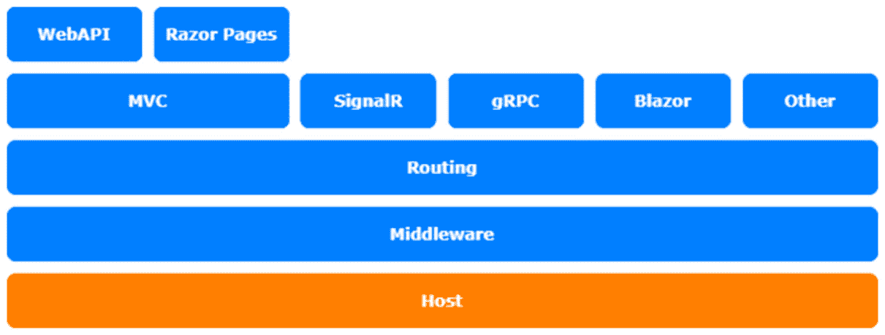
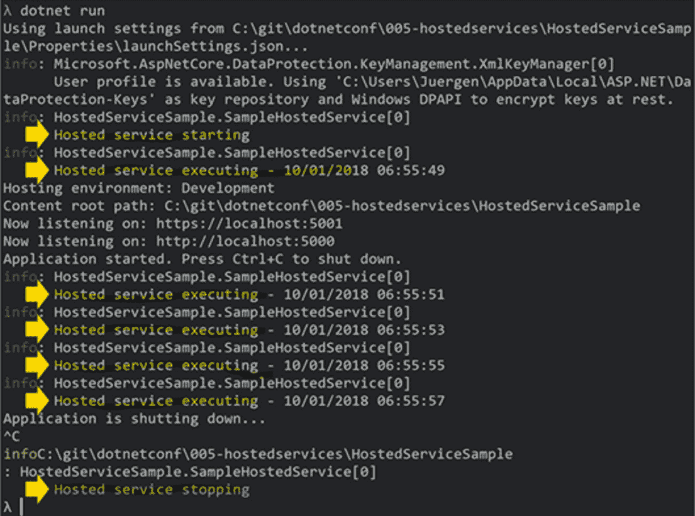

# *第五章*：使用 IHostedService 和 BackgroundService

第五章不是关于定制的；它更多的是关于一个特性，您可以使用它来创建后台服务，以便在应用程序内异步运行任务。我使用此功能定期从小型 ASP.NET 核心应用程序中的远程服务获取数据。

我们将研究以下主题：

*   介绍`IHostedService`
*   介绍`BackgroundService`
*   实施新的工人服务项目

本章的主题涉及 ASP.NET 核心体系结构的主机层：



图 5.1–ASP.NET 核心体系结构

# 技术要求

T要按照本章中的说明进行操作，您需要创建一个 ASP.NET 核心应用程序。打开控制台、shell 或 bash 终端，并切换到工作目录。使用以下命令创建新的 MVC 应用程序：

```cs
dotnet new mvc -n HostedServiceSample -o HostedServiceSample
```

现在，通过双击项目文件或在 VS 代码中将文件夹更改为项目并在已打开的控制台中键入以下命令，在 Visual Studio 中打开项目：

```cs
cd HostedServiceSample
code .
```

本章的所有代码示例都可以在本书的 GitHub repo 中找到：[https://github.com/PacktPublishing/Customizing-ASP.NET-Core-5.0/tree/main/Chapter05](https://github.com/PacktPublishing/Customizing-ASP.NET-Core-5.0/tree/main/Chapter05) 。

# I生成 IHostedService

自 ASP.NET Core 2.0 以来，托管服务一直是一个事物，可用于在应用程序后台异步运行任务。它们可以用于定期获取数据、在后台进行一些计算或进行一些清理。您还可以使用它们发送预配置的电子邮件，或者您需要在后台执行的任何操作。

托管服务基本上是实现`IHostedService`接口的简单类。您可以使用以下代码调用它们：

```cs
public class SampleHostedService : IHostedService
{
    public Task StartAsync(CancellationToken 
      cancellationToken)
    {
    }
    public Task StopAsync(CancellationToken 
     cancellationToken)
    {
    }
}
```

`IHostedService`需要实现`StartAsync()`方法和`StopAsync()`方法。`StartAsync()`方法是实现要执行的逻辑的地方。此方法在应用程序启动后立即执行一次。另一方面，`StopAsync()`方法在应用程序停止之前执行。这也意味着要启动定时服务，您需要自己在上实现它。您需要实现一个定期执行代码的循环。

要执行`IHostedService`，您需要在 ASP.NET Core dependency injection 容器中将其注册为 singleton 实例：

```cs
services.AddSingleton<IHostedService,   
    SampleHostedService>();
```

下一个示例将向您展示托管服务的工作方式。它会在启动、停止和每 2 秒向控制台写入一条日志消息：

1.  首先，编写通过`DependencyInjection`

    ```cs
    public class SampleHostedService : IHostedService
    {
        private readonly ILogger<SampleHostedService> 
          logger;
        // inject a logger
        public 
          SampleHostedService(ILogger<SampleHostedService> 
            logger)
        {
            this.logger = logger;
        }
        public Task StartAsync(CancellationToken 
          cancellationToken)
        {
        }
        public Task StopAsync(CancellationToken 
          cancellationToken)
        {
        }
    }
    ```

    检索`ILogger`的类骨架
2.  下一步是实现`StopAsync`方法。此方法用于在需要关闭连接、流等时进行清理：

    ```cs
    public Task StopAsync(CancellationToken 
      cancellationToken)
    {
        logger.LogInformation("Hosted service stopping");
        return Task.CompletedTask;
    }
    ```

3.  实际工作将在`StartAsync`

    ```cs
    public Task StartAsync(CancellationToken 
      cancellationToken)
    {
        logger.LogInformation("Hosted service starting");
        return Task.Factory.StartNew(async () =>
        {
            // loop until a cancelation is requested
            while 
             (!cancellationToken.IsCancellationRequested)
            {
                logger.LogInformation($"Hosted service 
                  executing - {DateTime.Now}");
                try
                {
                    // wait for 2 seconds
                    await 
                     Task.Delay(TimeSpan.FromSeconds(2), 
                       cancellationToken);
                }
                catch (OperationCanceledException) { }
            }
        }, cancellationToken);
    }
    ```

    中完成
4.  To test this, start the application by calling the next command in the console:

    ```cs
    dotnet run
    ```

    或在 Visual Studio 或 VS 代码中按*F5*。此导致以下控制台输出：



图 5.2–dotnet 运行输出的屏幕截图

如您所见，日志输出每隔 2 秒写入控制台。

在下一节中，我们将了解`BackgroundService`。

# 介绍后台服务

`BackgroundService`类是 ASP.NET Core 3.0 中的新类，基本上是一个已经实现了`IHostedService`接口的抽象类。它还提供了一个抽象的方法`ExecuteAsync()`，返回一个`Task`类型。

如果要重用上一节中的托管服务，则需要重写代码。按照以下步骤学习如何：

1.  First, write the class skeleton that retrieves `ILogger` via `DependencyInjection`:

    ```cs
    public class SampleBackgroundService : 
      BackgroundService
    {
        private readonly ILogger<SampleHostedService> 
          logger;
        // inject a logger
        public SampleBackgroundService(
            ILogger<SampleHostedService> logger)
        {
            this.logger = logger;
        }
    }
    ```

    您可能希望在文件开头添加以下`using`语句：

    ```cs
    using Microsoft.Extensions.Hosting;
    using Microsoft.Extensions.Logging;
    using System.Threading;
    ```

2.  下一步是覆盖`StopAsync`方法：

    ```cs
    public override async Task StopAsync(CancellationToken 
      cancellationToken)
    {
        logger.LogInformation("Background service 
          stopping");
        await Task.CompletedTask;
    }
    ```

3.  In the last step, we will override the `ExecuteAsync` method that does all the work:

    ```cs
    protected override async Task 
      ExecuteAsync(CancellationToken cancellationToken)
    {
        logger.LogInformation("Background service 
          starting");
        await Task.Factory.StartNew(async () =>
        {
            while 
              (!cancellationToken.IsCancellationRequested)
            {
                logger.LogInformation($"Background service 
                  executing - {DateTime.Now}");
                try
                {
                    await 
                      Task.Delay(TimeSpan.FromSeconds(2), 
                        cancellationToken);
                }
                catch (OperationCanceledException) {}
            }
        }, cancellationToken);
    }
    ```

    甚至注册也是新的。

此外，在 ASP.NET Core 3.0 中，`ServiceCollection`有一个新的扩展方法来注册托管服务或后台工作程序：

```cs
services.AddHostedService<SampleBackgroundService>();
```

接下来，让我们看一看 WorkService Pro PosialT0.

# 实施新员工服务项目

新的**工作者服务**和 ASP.NET Core 3.0 及更高版本中的通用宿主使得创建简单的类似服务的应用程序变得非常容易，这些应用程序可以在没有完整的 ASP.NET 堆栈和 web 服务器的情况下完成一些工作。

可以使用以下命令创建此项目：

```cs
dotnet new worker -n BackgroundServiceSample -o BackgroundServiceSample
```

基本上，这将创建一个控制台应用程序，其中包含`Program.cs`和`Worker.cs`。`Worker.cs`文件包含`BackgroundService`类。`Program.cs`文件看起来很熟悉，但没有`WebHostBuilder`：

```cs
public class Program
{
    public static void Main(string[] args)
    {
        CreateHostBuilder(args).Build().Run();
    }
    public static IHostBuilder CreateHostBuilder(string[] 
      args) =>
        Host.CreateDefaultBuilder(args)
            .ConfigureServices((hostContext, services) =>
            {
                services.AddHostedService<Worker>();
            });
}
```

这将创建一个启用依赖项注入的`IHostBuilder`类型。这意味着我们能够在任何类型的应用程序中使用依赖项注入，而不仅仅是在 ASP.NET 核心应用程序中。

然后工人被添加到服务集合中。

这在哪里有用？您可以将此应用程序作为 Windows 服务或 Docker 容器中的后台应用程序运行，而不需要 HTTP endpoint。

# 总结

您现在可以开始使用`IHostedService`和`BackgroundService`来做一些更复杂的事情。小心后台服务，因为它们都在同一个应用程序中运行；如果您使用太多的 CPU 或内存，这可能会降低应用程序的速度。

对于更大的应用程序，我建议在专门用于执行后台任务的单独应用程序中运行此类任务：一个单独的 Docker 容器、Azure 上的`BackgroundWorker`类型、Azure 函数或类似的东西。但是，在这种情况下，它应该与主应用程序分开。

在下一章中，我们将学习中间件，以及如何使用中间件在请求管道上实现特殊逻辑，或在不同路径上提供特定逻辑。