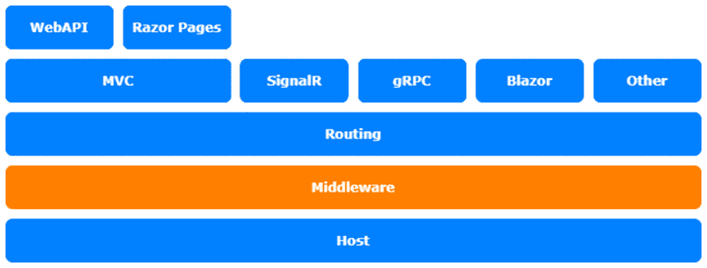
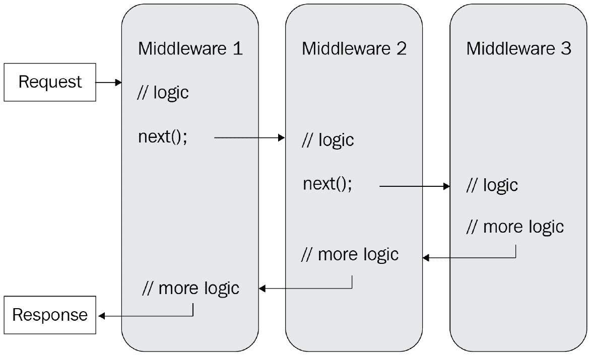

# 六、编写自定义中间件

哇，我们已经到了这本书的第六章了！在本章中，我们将进一步了解**中间件**以及如何使用它来定制应用。我们将快速浏览中间件的基础知识，然后我们将探索使用中间件可以做的一些特殊事情。

我们将介绍以下主题：

*   引入中间件
*   编写自定义中间件
*   探索中间件的潜力
*   在 ASP.NET Core 3.0 及更高版本上使用中间件

本章的主题涉及 ASP.NET Core架构的**中间件**层：



图 6.1–ASP.NET Core体系结构

# 技术要求

要遵循本章中的描述，您需要创建一个 ASP.NET Core MVC 应用。打开控制台、shell 或 bash 终端，并切换到工作目录。使用以下命令创建新的 MVC 应用：

```cs
dotnet new web -n MiddlewaresSample -o MiddlewaresSample
```

现在，通过双击项目文件在 Visual Studio 中打开项目，或者通过在已打开的控制台中键入以下命令在 VS 代码中打开项目：

```cs
cd MiddlewaresSample
code .
```

本章的所有代码示例都可以在本书的 GitHub repo 中找到：[https://github.com/PacktPublishing/Customizing-ASP.NET-Core-5.0/tree/main/Chapter06](https://github.com/PacktPublishing/Customizing-ASP.NET-Core-5.0/tree/main/Chapter06) 。

# I生成中间件

大多数读者可能已经知道什么是中间件，但你们中的一些人可能不知道。即使您已经使用 ASP.NET Core 一段时间了，您也不需要了解中间件的详细信息，因为它们大多隐藏在命名良好的扩展方法后面，例如`UseMvc()`、`UseAuthentication()`、`UseDeveloperExceptionPage()`等等。每次在`Startup.cs`文件中调用`Use`方法时，在`Configure`方法中，您都会隐式使用至少一个，甚至更多的中间件。

**中间件**是一段处理请求管道的代码。将请求管道想象成一个巨大的管道，你可以调用一些东西，然后返回一个回音。中间件负责创建该回声、操纵声音以丰富信息、处理源声音或处理回声。

中间件按照其配置的顺序执行。配置的第一个中间件是第一个执行的中间件。

在 ASP.NET Core web 中，如果客户端请求图像或任何其他静态文件，`StaticFileMiddleware`类型将搜索该资源，如果找到，则返回该资源。如果没有，这个中间件除了调用下一个之外什么也不做。如果没有处理请求管道的最终中间件，则请求不返回任何内容。`MvcMiddleware`类型还检查请求的资源，尝试将其映射到配置的路由，执行控制器，创建视图，并返回 HTML 或 Web API 结果。如果`MvcMiddleware`类型找不到匹配的控制器，则返回结果；在这种情况下，它是一个*404 状态*结果。它在任何情况下都会返回回声。这就是为什么类型是最后配置的中间件：



图 6.2——中间件工作流程图

**异常处理**中间件通常是最先配置的中间件之一，不是因为它是第一个执行的，而是因为它是最后一个。配置的第一个中间件也是最后一个要执行的中间件，如果回声从管道返回。异常处理中间件验证结果，并以友好的方式在浏览器和客户端中显示可能的异常。这是运行时错误获取*500 状态*的地方：

1.  如果按照*技术要求*一节中的描述创建一个空的 ASP.NET Core应用，您可以看到管道是如何执行的。
2.  Open `Startup.cs` with your favorite editor. It should be pretty empty compared to a regular ASP.NET Core application. Rewrite the `Configure()` method like this:

    ```cs
    public class Startup
    {
        public void ConfigureServices(IServiceCollection 
          services)
        {
        }
        public void Configure(IApplicationBuilder app, 
          IWebHostEnvironment env)
        {
            if (env.IsDevelopment())
            {
                app.UseDeveloperExceptionPage();
            }
            app.Run(async context =>
            {
                await context.Response.WriteAsync("Hello 
                   World!");
            });
        }
    }
    ```

    这里使用的是`DeveloperExceptionPageMiddleware`类型，带有一个特殊的lambda 中间件，它只向响应流写入`"Hello World!"`。响应流是我们之前了解到的回声。这个特殊的中间件停止管道并返回类似于回声的内容。因此，它是最后一个运行的中间件。

3.  Leave this middleware and add the following lines right before the `app.Run()`function:

    ```cs
    app.Use(async (context, next) =>{
        await context.Response.WriteAsync("===");
        await next();
        await context.Response.WriteAsync("===");
    });
    app.Use(async (context, next) =>
    {
        await context.Response.WriteAsync(">>>>>> ");
        await next();
        await context.Response.WriteAsync(" <<<<<<");
    });
    ```

    `app.Use()`的这两个调用也创建了两个 lambda 中间件，但这一次，除了处理特定的请求外，中间件还调用了它们的继承者：每个中间件都知道应该遵循哪个中间件，并调用它。在调用下一个中间件之前和之后，这两个中间件都会写入响应流。在调用下一个中间件之前，处理实际请求，在调用下一个中间件之后，处理响应（echo）。这应该说明管道是如何工作的。

4.  如果您现在运行应用（使用`dotnet run`并在浏览器中打开显示的 URL，您应该会看到如下明文结果：

    ```cs
    ===>>>>>> Hello World! <<<<<<===
    ```

这对你有意义吗？如果是，那么让我们继续，看看如何使用这个概念向请求管道ne 添加一些额外的功能。

# 编写自定义中间件

ASP.NET Core是基于中间件的。请求期间执行的所有逻辑都基于中间件。因此，我们可以使用它向 web 添加自定义功能。我们想知道通过请求管道的每个请求的执行时间：

1.  We can do this by creating and starting a stopwatch before the next middleware is called, and by stopping measuring the execution time after the next middleware is called, like so:

    ```cs
    app.Use(async (context, next) =>
    {
        var s = new Stopwatch();
        s.Start();
        // execute the rest of the pipeline
        await next();
        s.Stop(); //stop measuring
        var result = s.ElapsedMilliseconds;
        // write out the milliseconds needed
        await context.Response.WriteAsync($"Time needed: 
          {result}");
    });
    ```

    之后，我们将经过的毫秒数返回到响应流。

2.  If you write some more middleware, the `Configure` method in `Startup.cs` gets pretty messy. This is why most middleware is written as separate classes. This could look like this:

    ```cs
    public class StopwatchMiddleWare
    {
        private readonly RequestDelegate _next;
        public StopwatchMiddleWare(RequestDelegate next)
        {
            _next = next;
        }
        public async Task Invoke(HttpContext context)
        {
            var s = new Stopwatch();
            s.Start();
            // execute the rest of the pipeline
            await _next(context);
            s.Stop(); //stop measuring
            var result = s.ElapsedMilliseconds;
            // write out the milliseconds needed
            await context.Response.WriteAsync($"Time 
              needed: {result}");
        }
    }
    ```

    这样，我们通过构造函数和`Invoke()`方法中的当前上下文获得下一个中间件。

    笔记

    中间件在应用启动时初始化，构造函数在应用生命周期内只运行一次。另一方面，每个请求调用一次`Invoke()`方法。

3.  要使用这个中间件，您可以在`configure`方法中使用一个通用的`UseMiddleware()`方法：

    ```cs
    app.UseMiddleware<StopwatchMiddleware>();
    ```

4.  更优雅的方法是创建一个封装此调用的`extension`方法：

    ```cs
    public static class StopwatchMiddlewareExtension
    {
        public static IApplicationBuilder 
          UseStopwatch(this IApplicationBuilder app)
        {
            app.UseMiddleware<StopwatchMiddleware>();
            return app;
        }
    }
    ```

5.  现在你可以简单地这样称呼它：

    ```cs
    app.UseStopwatch();
    ```

这是通过请求管道向 ASP.NET Core应用提供附加功能的方法。您的中间件中提供了整个`HttpContext`。有了它，您可以使用中间件操纵请求甚至响应。

例如，`AuthenticationMiddleware`类型试图从请求中收集用户信息。如果找不到，它将通过向客户端发送特定的响应来请求信息。如果它找到一些信息，它会将其添加到请求上下文中，并使整个应用可以使用它的方式。

# 挖掘中间件的潜力

你可以用中间件做很多其他的事情。例如，您知道可以将请求管道拆分为两个或多个管道吗？在本节中，我们将介绍如何做到这一点以及其他一些事情。

## 使用/map 对管道进行分支

下一个片段展示了如何基于特定路径创建分支：

```cs
app.Map("/map1", app1 =>
{
    // some more Middleware
    app1.Run(async context =>
    {
        await context.Response.WriteAsync("Map Test 1");
    });
});
app.Map("/map2", app2 =>
{
    // some more Middleware
    app2.Run(async context =>
    {
        await context.Response.WriteAsync("Map Test 2");
    });
});
    // some more Middleware
app.Run(async (context) =>
{
    await context.Response.WriteAsync("Hello World!");
});
```

路径`"/map1"`是一个特定的分支，它继续内部的请求管道–与`"/map2"`相同。这两个映射内部都有自己的中间件配置。所有其他未指定的路径将跟随主分支。

## 使用 MapWhen（）对管道进行分支

还有一种`MapWhen()`方法可以基于条件而不是基于路径的分支来分支管道：

```cs
public void Configure(IApplicationBuilder app)
{
    app.MapWhen(
        context => 
          context.Request.Query.ContainsKey("branch"),
        app1 =>
        {
            // some more Middleware
            app1.Run(async context =>
            {
                await context.Response.WriteAsync(
                    "MapBranch Test");
            });
    });
    // some more Middleware
    app.Run(async context =>
    {
        await context.Response.WriteAsync(
            "Hello from non-Map delegate.");
    });
}
```

接下来，我们将看看如何使用中间件来创造条件。

## 用中间件创造条件

您可以根据配置值创建条件，或者如图所示，根据请求上下文的属性创建条件。在上一个示例中，使用了查询字符串属性。您可以使用 HTTP 头、表单属性或请求上下文的任何其他属性。

如果需要，还可以嵌套贴图以创建子分支和孙分支。

`Map()`或`MapWhen()`可用于根据特定路径或特定条件提供特定 API 或资源。ASP.NET Core`HealthCheck`API 是这样做的：首先使用`MapWhen()`指定要使用的端口，然后使用`Map()`设置`HealthCheck`API 的路径（如果没有指定端口，则使用`Map()`。最后使用了`HealthCheckMiddleware`型。下面的代码只是一个示例，展示了它的外观：

```cs
private static void UseHealthChecksCore(IApplicationBuilder 
  app, PathString path, int? port, object[] args)
{
    if (port == null)
    {
        app.Map(path, 
            b => 
             b.UseMiddleware<HealthCheckMiddleware>(args));
    }
    else
    {
        app.MapWhen(
            c => c.Connection.LocalPort == port,
            b0 => b0.Map(path, 
            b1 => 
              b1.UseMiddleware<HealthCheckMiddleware> (args)
            )
        );
    }
}
```

接下来，让我们看看您应该如何在更新版本的 ASP.NET Core 中使用终止中间件。

# 在 ASP.NET Core 3.0 及更高版本上使用中间件

在 ASP.NETCore 3.0 及更高版本中，`Configure()`方法看起来有所不同。有两种新的中间件元素，称为`UseRouting`和`UseEndpoints`：

```cs
public void Configure(IApplicationBuilder app, 
  IWebHostEnvironment env)
{
    if (env.IsDevelopment())
    {
        app.UseDeveloperExceptionPage();
    }
    app.UseRouting();
    app.UseEndpoints(endpoints =>
    {
        endpoints.MapGet("/", async context =>
        {
           await context.Response.WriteAsync("Hell World!");
        });
    });
}
```

第一个是使用路由的中间件，另一个使用端点。我们到底在看什么？

这是新的**端点路由**。以前，路由是 MVC 的一部分，只适用于 MVC、Web API 和基于 MVC 框架的框架。然而，在 ASP.NET Core 3.0 及更高版本中，路由不再在 MVC 框架中。现在，MVC 和其他框架被映射到特定的路由或端点。有不同类型的端点定义可用。

在前面的代码片段中，`GET`请求被映射到页面根 URL。在下一个片段中，MVC 被映射到一个路由模式，**剃须刀页面**被映射到*剃须刀页面*特定的基于文件结构的路由：

```cs
app.UseEndpoints(endpoints =>
{
    endpoints.MapControllerRoute(
        name: "default",
        pattern: "{controller=Home}/{action=Index}/{id?}");
    endpoints.MapRazorPages();
});
```

不再有`UseMvc()`，即使它仍然存在并且仍然在`IApplicationBiulder`级别工作，以防止现有代码被破坏。现在，有一些新方法可以更精确地激活 ASP.NET Core功能。

以下是 ASP.NET Core 5.0 最常用的新`Map`方法：

*   **MVC 和 WebAPI 区域**：`endpoints.MapAreaControllerRoute(...);`
*   **MVC 和 WebAPI**：`endpoints.MapControllerRoute(...);`
*   **Blazor 服务器端**：`endpoints.MapBlazorHub(...);`
*   **信号机**：`endpoints.MapHub(...);`
*   **剃须刀页面**：`endpoints.MapRazorPages(...);`
*   **健康检查**：`endpoints.MapHealthChecks(...);`

有很多方法可以定义回退端点，并将路由和 HTTP 方法映射到委托和中间件。

如果您想要创建在所有请求上都能工作的中间件，比如`StopWatchMiddleware`类型，那么这将像以前在`IApplicationBuilder`类型上一样工作。如果您想编写一个中间件来处理特定的路径或路由，则需要创建一个`Map`方法，使其映射到该路由。

重要提示

不再建议在中间件内部处理路由。通过这种方法，中间件更加通用，可以使用单个配置在多个路由上工作。

我最近编写了一个中间件，在 ASP.NET Core应用中提供 GraphQL 端点；我不得不重写它以遵循新的 ASP.NET Core路由。旧方法仍然可以工作，但是可以将路径和路由与新的 ASP.NET Core路由分开处理。让我们看看如何处理这些情况。

## 将终止中间件重写为当前标准

如果您有提供不同端点的现有中间件，则应将其更改为使用新端点路由：

1.  As an example, let's create a small dummy middleware that writes an application status to a specific route. In this demo, there is no custom route handling:

    ```cs
    public class AppStatusMiddleware
    {
        private readonly RequestDelegate _next;
        private readonly string _status;
        public AppStatusMiddleware(
            RequestDelegate next, string status)
        {
            _next = next;
            _status = status;
        }
        public async Task Invoke(HttpContext context)
        {
            await context.Response.WriteAsync(
                $"Hello {_status}!");
        }
    }
    ```

    我们需要做的第一件事是在`IEndpointRouteBuilder`类型上编写一个`extension`方法。此方法有一个路由模式作为可选参数，并返回一个`IEndpointConventionBuilder`类型以启用路由的 CORS、身份验证或其他条件。

2.  现在我们应该添加一个扩展方法，以便更容易地使用中间件：

    ```cs
    public static class MapAppStatusMiddlewareExtension
    {
        public static IEndpointConventionBuilder 
          MapAppStatus(
            this IEndpointRouteBuilder routes,
            string pattern = "/", 
            string name = "World")
        {
            var pipeline = routes
                .CreateApplicationBuilder()
                .UseMiddleware<AppStatusMiddleware>(name)
                .Build();
            return routes.Map(pattern, pipeline)
                .WithDisplayName("AppStatusMiddleware");
        }
    }
    ```

3.  一旦完成，我们就可以使用`MapAppStatus`方法将其映射到特定的路径：

    ```cs
    app.UseEndpoints(endpoints =>
    {
        endpoints.MapGet("/", async context =>
        {
            await context.Response.WriteAsync(
                "Hello World!");
        });
        endpoints.MapAppStatus("/status", "Status");
    });
    ```

4.  我们现在可以在浏览器中调用路由：`http://localhost:5000/status`。

我们将在[*第 13 章*](13.html#_idTextAnchor212)*使用端点路由*中学习关于端点路由的更多信息以及如何对其进行定制。现在，让我们回顾一下我们对中间件的了解。

# 总结

大多数 ASP.NET Core功能都基于中间件，我们可以通过创建自己的中间件来扩展 ASP.NET Core。

在接下来的两章中，我们将研究不同的数据类型，以及如何使用内容协商来处理它们。我们将学习如何创建任何格式和数据类型的 API 输出。