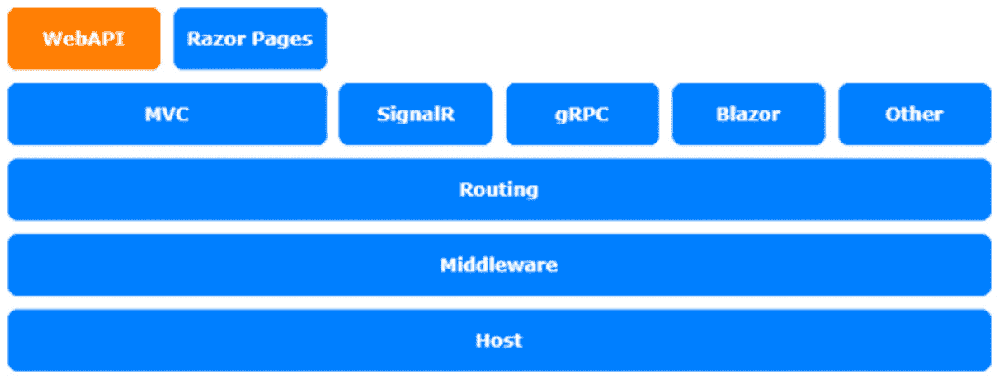
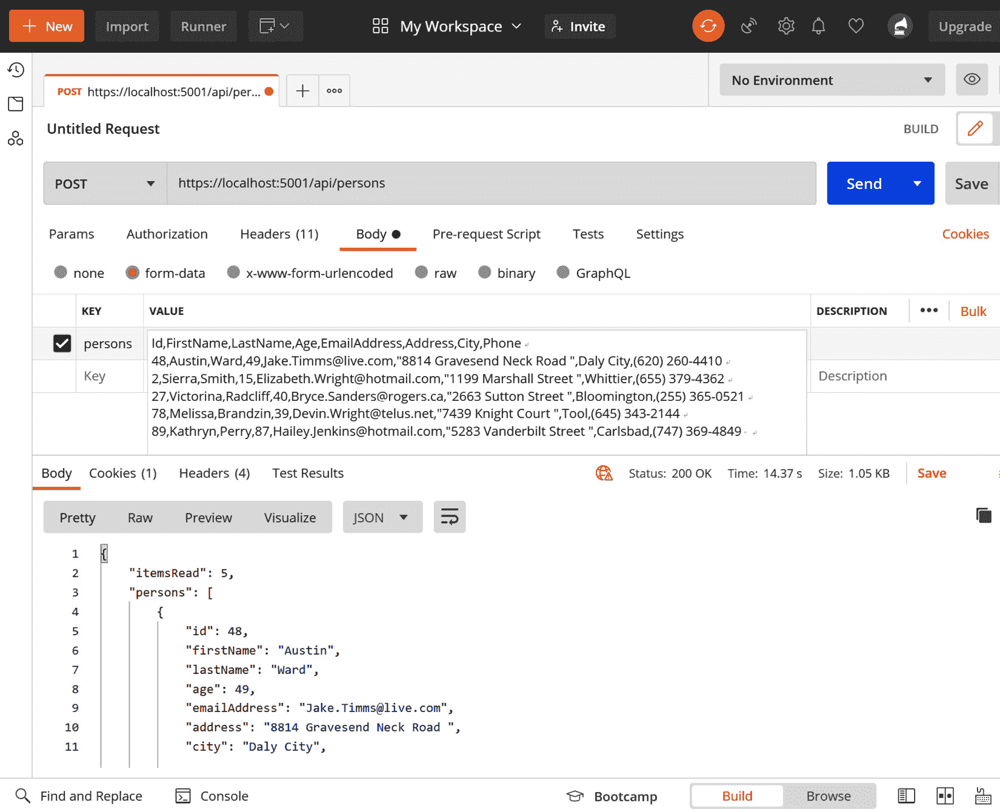

# 八、使用自定义`ModelBinder`管理输入

在关于`OutputFormatters`的最后一章中，我们学习了如何以不同的格式向客户发送数据。在本章中，我们将以另一种方式进行。本章是关于您从外部在 Web API 中获取的数据；例如，如果您以特殊格式获取数据，或者如果您以特殊方式获取需要验证的数据，该怎么办。**模型绑定器**将帮助您处理此问题。

在本章中，我们将介绍以下主题：

*   介绍`ModelBinders`
*   创建自定义`ModelBinder`类型

本章中的主题涉及 ASP.NET Core架构的**WebAPI**层：



图 8.1–ASP.NET Core体系结构

# 技术要求

要遵循本章中的描述，您需要创建一个 ASP.NET Core MVC 应用。打开控制台、shell 或 bash 终端，并切换到工作目录。使用以下命令创建新的 MVC 应用：

```cs
dotnet new webapi -n ModelBinderSample -o ModelBinderSample
```

现在，在 Visual Studio 中双击项目文件或在 VS 代码中，在已打开的控制台中键入以下命令来打开项目：

```cs
cd ModelBinderSample
code .
```

本章中的所有代码示例都可以在本书的 GitHub 存储库中的[中找到 https://github.com/PacktPublishing/Customizing-ASP.NET-Core-5.0/tree/main/Chapter08](https://github.com/PacktPublishing/Customizing-ASP.NET-Core-5.0/tree/main/Chapter08) 。

# I生成模型绑定器

`ModelBinders`负责将传入数据绑定到具体的动作方法参数。它们将随请求发送的数据绑定到参数。默认绑定器能够绑定通过`QueryString`发送的数据，或在请求正文中发送的数据。在主体内，数据可以 URL 格式或 JSON 格式发送。

模型绑定尝试通过参数名查找请求中的值。表单值、路由数据和查询字符串值存储为键值对集合，绑定尝试在集合的键中查找参数名称。

让我们用一个测试项目来演示它是如何工作的。

# 准备测试数据

在部分中，我们将了解如何将 CSV 数据发送到 Web API 方法。我们将使用自定义 OutputFormatter 重用我们在[*第 7 章*](07.html#_idTextAnchor114)*内容协商中创建的 CSV 数据：*

这是我们要使用的测试数据片段：

```cs
Id,FirstName,LastName,Age,EmailAddress,Address,City,Phone
48,Austin,Ward,49,Jake.Timms@live.com,"8814 Gravesend Neck Road   ",Daly City,(620) 260-4410
2,Sierra,Smith,15,Elizabeth.Wright@hotmail.com,"1199 Marshall   Street ",Whittier,(655) 379-4362
27,Victorina,Radcliff,40,Bryce.Sanders@rogers.ca,"2663 Sutton   Street ",Bloomington,(255) 365-0521
78,Melissa,Brandzin,39,Devin.Wright@telus.net,"7439 Knight   Court ",Tool,(645) 343-2144
89,Kathryn,Perry,87,Hailey.Jenkins@hotmail.com,"5283 Vanderbilt   Street ",Carlsbad,(747) 369-4849
```

您可以在 GitHub 的[上找到完整的 CSV 测试数据 https://github.com/PacktPublishing/Customizing-ASP.NET-Core-5.0/blob/main/Chapter08/testdata.csv](https://github.com/PacktPublishing/Customizing-ASP.NET-Core-5.0/blob/main/Chapter08/testdata.csv) 。

# 准备测试项目

让我们按照以下步骤准备项目：

1.  In the already created project (refer to the *Technical requirements* section), we will now create a new empty API controller with a small action inside:

    ```cs
    namespace ModelBinderSample.Controllers
    {
        [Route("api/[controller]")]
        [ApiController]
        public class PersonsController : ControllerBase
        {
            public ActionResult<object> Post(
                IEnumerable<Person> persons)
            {
                return new
                {
                    ItemsRead = persons.Count(),
                    Persons = persons
                };
            }
        }
    }
    ```

    这看起来基本上和其他任何动作一样。它接受一个人员列表并返回一个匿名对象，该对象包含人员数量和人员列表。此操作非常无用，但有助于我们使用 Postman 调试`ModelBinders`。

2.  We also need the `Person` class:

    ```cs
    [ModelBinder(BinderType = typeof(PersonsCsvBinder))]
    public class Person
    {
        public int Id { get; set; }
        public string FirstName { get; set; }
        public string LastName { get; set; }
        public int Age { get; set; }
        public string EmailAddress { get; set; }
        public string Address { get; set; }
        public string City { get; set; }
        public string Phone { get; set; }
    } 
    ```

    如果我们希望将基于 JSON 的数据发送到该操作，那么这实际上可以很好地工作。

3.  As a last preparation step, we need to add the `CsvHelper` NuGet package to parse the CSV data more easily. The .NET CLI is also useful here:

    ```cs
    dotnet add package CsvHelper
    dotnet add package System.Linq.Async
    ```

    笔记

    需要`System.Linq.Async`包来处理`GetRecordsAsync()`方法返回的`IAsyncEnumerable`。

现在都设置好了，我们可以在下一个门派中尝试并创建`PersonsCsvBinder`。

# 创建人员 CSVBinder

让我们做一个活页夹。

要创建`ModelBinder`，请添加一个名为`PersonsCsvBinder`的新类，该类实现了`IModelBinder`。在`BindModelAsync`方法中，我们得到`ModelBindingContext`，其中包含获取数据和反序列化所需的所有信息。下面的代码片段显示了一个通用绑定器，它可以与任何模型列表一起使用。我们将其分为几个部分，以便您可以清楚地看到活页夹的每个部分是如何工作的：

```cs
public class PersonsCsvBinder : IModelBinder
{
    public async Task BindModelAsync(
        ModelBindingContext bindingContext)
    {
        if (bindingContext == null)
        {
            return;
        }
        var modelName = bindingContext.ModelName;
        if (String.IsNullOrEmpty(modelName))
        {
            modelName = bindingContext.OriginalModelName;
        }
        if (String.IsNullOrEmpty(modelName))
        {
            return;
        }
```

正如您从前面的代码块中所看到的，首先，上下文被检查为 null。之后，如果没有指定参数名称，我们将为模型设置一个默认参数名称。如果完成此操作，我们可以按照前面设置的名称获取值：

```cs
        var valueProviderResult = 
          bindingContext.ValueProvider.GetValue(modelName);
        if (valueProviderResult == ValueProviderResult.None)
        {
            return;
        }
```

在下一部分中，如果没有值，我们不应该在这种情况下抛出异常。原因是下一个配置的`ModelBinder`可能负责。如果抛出异常，当前请求的执行被取消，下一个配置的`ModelBinder`没有执行的机会：

```cs
        bindingContext.ModelState.SetModelValue(
            modelName, valueProviderResult);
        var value = valueProviderResult.FirstValue;
        // Check if the argument value is null or empty
        if (String.IsNullOrEmpty(value))
        {
            return;
        }
```

如果我们有值，我们可以实例化一个需要传递给`CsvReader`的新`StringReader`类型：

```cs
        var stringReader = new StringReader(value);
        var reader = new CsvReader(
            stringReader, CultureInfo.InvariantCulture);
```

使用`CsvReader`，我们可以将 CSV 字符串值反序列化为`Persons`列表。如果我们有该列表，我们需要创建一个新的成功的`ModelBindingResult`类型，该类型需要分配给`ModelBindingContext`的`Result`属性：

```cs
        var asyncModel = reader.GetRecordsAsync<Person>();
        var model = await asyncModel.ToListAsync();
        bindingContext.Result = 
           ModelBindingResult.Success(model);
    }
}
```

您可能需要在文件开头添加以下`using`语句：

```cs
using Microsoft.AspNetCore.Mvc.ModelBinding;
using System.IO;
using CsvHelper
using System.Globalization;
```

接下来，我们将使`ModelBinder`t工作。

# 使用 ModelBinder

绑定器没有自动使用，因为它没有在依赖项注入容器中注册，也没有配置为在 MVC 框架中使用。

使用此模型绑定器的最简单方法是在应绑定模型的操作参数上使用`ModelBinderAttribute`：

```cs
[HttpPost]
public ActionResult<object> Post(
    [ModelBinder(binderType: typeof(PersonsCsvBinder))]
    IEnumerable<Person> persons)
{
    return new
    {
        ItemsRead = persons.Count(),
        Persons = persons
    };
} 
```

在这里，`PersonsCsvBinder`的类型被设置为该属性的`binderType`。

笔记

**Steve Gordon**在他的博客文章中写到了第二个选项，*ASP.NET MVC 核心中的自定义模型绑定。*他使用`ModelBinderProvider`将`ModelBinder`添加到现有的列表中。

我个人更喜欢显式声明，因为大多数自定义`ModelBinders`将特定于动作或特定类型，并且它可以防止隐藏在背景中的魔法。

现在，让我们测试一下我们已经构建了什么。

# 测试模型粘合剂

为了测试它，我们需要在 Postman 中创建一个新请求：

1.  通过在控制台中运行`dotnet run`或在 Visual Studio 或 VS 代码中按*F5*启动应用。
2.  首先，我们将请求类型设置为**POST**，并在地址栏中插入 URL`https://localhost:5001/api/persons`。
3.  接下来，我们需要将 CSV 数据添加到请求主体中。选择`form-data`作为`body`类型，添加`persons`键，并在**值**字段中粘贴以下行：

    ```cs
    Id,FirstName,LastName,Age,EmailAddress,Address,City,Phone
    48,Austin,Ward,49,Jake.Timms@live.com,"8814 Gravesend   Neck Road ",Daly City,(620) 260-4410
    2,Sierra,Smith,15,Elizabeth.Wright@hotmail.com,"1199   Marshall Street ",Whittier,(655) 379-4362
    27,Victorina,Radcliff,40,Bryce.Sanders@rogers.ca,"2663   Sutton Street ",Bloomington,(255) 365-0521
    ```

4.  按**发送**后，我们得到的结果如*Fi图 8.2*所示：



图 8.2-Postman 中 CSV 数据的屏幕截图

现在，客户端将能够向服务器发送基于 CSV 的数据。

# 总结

这是以操作真正需要的方式转换输入的好方法。您还可以使用`ModelBinders`对数据库进行一些自定义验证，或者在模型传递到操作之前需要执行的任何操作。

在下一章中，我们将看到您可以使用`ActionFilters`做些什么。

# 进一步阅读

要了解有关`ModelBinders`的更多信息，您应该查看以下合理详细的文档：

*   Steve Gordon，*ASP.NET MVC 核心中的自定义模型绑定*：[https://www.stevejgordon.co.uk/html-encode-string-aspnet-core-model-binding/](https://www.stevejgordon.co.uk/html-encode-string-aspnet-core-model-binding/)
*   *ASP.NET Core中的模型绑定*：[https://docs.microsoft.com/en-us/aspnet/core/mvc/models/model-binding](https://docs.microsoft.com/en-us/aspnet/core/mvc/models/model-binding)
*   *ASP.NET Core中的自定义模型绑定*：[https://docs.microsoft.com/en-us/aspnet/core/mvc/advanced/custom-model-binding](https://docs.microsoft.com/en-us/aspnet/core/mvc/advanced/custom-model-binding)