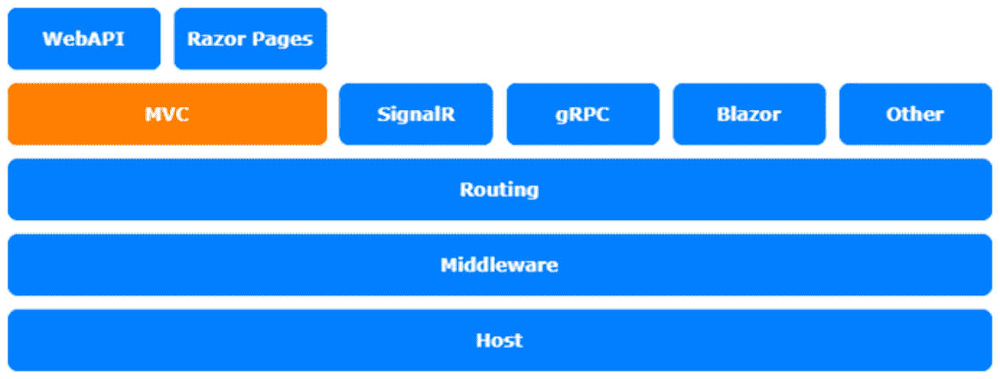

# 九、创建自定义`ActionFilter`

在本章中，我们将继续在控制器级别进行定制。我们将研究**动作过滤器**以及如何创建自己的`ActionFilters`以保持动作的小型化和可读性。

在本章中，我们将介绍以下主题：

*   介绍`ActionFilters`
*   使用`ActionFilters`

本章中的主题涉及 ASP.NET Core架构的**MVC**层：



图 9.1–ASP.NET Core体系结构

# 技术要求

要遵循本章中的描述，您需要创建一个 ASP.NET Core MVC 应用。打开控制台、shell 或 bash 终端，并切换到工作目录。使用以下命令创建新的 MVC 应用：

```cs
dotnet new mvc -n ActionFilterSample -o ActionFilterSample
```

现在，在 Visual Studio 中双击项目文件或在 VS 代码中，在已打开的控制台中键入以下命令来打开项目：

```cs
cd ActionFilterSample
code .
```

本章中的所有代码示例都可以在本书的 GitHub 存储库中的[中找到 https://github.com/PacktPublishing/Customizing-ASP.NET-Core-5.0/tree/main/Chapter09](https://github.com/PacktPublishing/Customizing-ASP.NET-Core-5.0/tree/main/Chapter09) 。

# I产生动作滤波器

`ActionFilters`是一个有点像中间件，因为它们可以操作输入和输出，但在 MVC 层的特定操作或特定控制器的所有操作上立即执行，而中间件直接在宿主层的请求对象上工作。创建`ActionFilters`是为了在执行操作之前或之后执行代码。它们用于执行不属于实际操作逻辑的方面：**授权**是这些方面的一个示例。`AuthorizeAttribute`用于允许用户或组访问特定操作或控制器。`AuthorizeAttribute`是一个`ActionFilter`。它检查登录的用户是否被授权。如果没有，它会将它们重定向到登录页面。

笔记

如果全局应用`ActionFilter`，则它将在应用中的所有操作上执行。

下面的代码示例显示了正常`ActionFilter`和异步`ActionFilter`的框架：

```cs
using Microsoft.AspNetCore.Mvc.Filters;
public class SampleActionFilter : IActionFilter
{
    public void OnActionExecuting(
        ActionExecutingContext context)
    {
        // do something before the action executes
    }
    public void OnActionExecuted(
        ActionExecutedContext context)
    {
        // do something after the action executes
    }
}
public class SampleAsyncActionFilter : IAsyncActionFilter
{
    public async Task OnActionExecutionAsync(
        ActionExecutingContext context,
        ActionExecutionDelegate next)
    {
        // do something before the action executes
        var resultContext = await next();
        // do something after the action executes
        // resultContext.Result will be set
    }
}
```

正如您在这里看到的，在执行目标操作之前和之后放置要执行的代码方面，总是有两种方法。这些`ActionFilters`不能用作属性。如果您想在控制器中使用`ActionFilters`作为属性，则需要从`Attribute`或`ActionFilterAttribute`派生，如下面的代码所示：

```cs
public class ValidateModelAttribute : ActionFilterAttribute
{
    public override void OnActionExecuting(
        ActionExecutingContext context)
    {
        if (!context.ModelState.IsValid)
        {
            context.Result = new BadRequestObjectResult(
                context.ModelState);
        }
    }
}
```

前面的代码显示了一个简单的`ActionFilter`，如果`ModelState`无效，它总是返回一个`BadRequestObjectResult`。这在 Web API 中可能有用，作为对`POST`、`PUT`和`PATCH`请求的默认检查。这可以用更多的验证逻辑来扩展。稍后我们将了解如何使用它。

`ActionFilter`的另一个可能用例是日志记录。您不需要直接登录`Actions`控制器。您可以在操作筛选器中执行此操作，以使操作具有相关代码的可读性：

```cs
using Microsoft.Extensions.Logging;
public class LoggingActionFilter : IActionFilter
{
    ILogger _logger;
    public LoggingActionFilter(ILoggerFactory loggerFactory)
    {
        _logger = 
          loggerFactory.CreateLogger<LoggingActionFilter>();
    }
    public void OnActionExecuting(
        ActionExecutingContext context)
    {
        _logger.LogInformation($"Action 
          '{context.ActionDescriptor.DisplayName}' 
             executing");
    }
    public void OnActionExecuted(
        ActionExecutedContext context)
    {
        _logger.LogInformation($"Action 
          '{context.ActionDescriptor.DisplayName}' 
            executed");
    }
}
```

这将向控制台记录一条信息性消息。您可以从`ActionExecutingContext`或`ActionExecutedContext`获取有关当前操作的更多信息，例如，参数或参数值。这使得和`ActionFilters`非常有用。

让我们看看`ActionFilters`在实践中是如何工作的。

# 使用 ActionFilter

`ActionFilters`可以将实际上是`Attributes`注册为`Action`或`Controller`的属性，从下面的演示代码中可以看到：

```cs
[HttpPost]
[ValidateModel] // ActionFilter as attribute
public ActionResult<Person> Post([FromBody] Person model)
{
    // save the person
    return model; //just to test the action
} 
```

这里我们使用`ValidateModelAttribute`，检查`ModelState`，如果`ModelState`无效，返回`BadRequestObjectResult`；我们不需要在实际操作中检查`ModelState`。

要在全球注册`ActionFilters`，您需要在`Startup.cs`的`ConfigureServices`方法中扩展 MVC 注册：

```cs
services.AddControllersWithViews()
    .AddMvcOptions(options =>
    {
        options.Filters.Add(new SampleActionFilter());
        options.Filters.Add(new SampleAsyncActionFilter());
    });
```

以这种方式注册的`ActionFilters`将在每个操作上执行。这样，您就可以使用不是从`Attribute`派生的`ActionFilters`。

我们之前创建的`LoggingActionFilter`类型更为特殊。它依赖于`ILoggerFactory`的一个实例，需要传递给构造函数。这不能作为属性很好地工作，因为`Attributes`不支持通过依赖项注入进行构造函数注入。`ILoggerFactory`在 ASP.NET Core依赖项注入容器中注册，需要注入`LoggingActionFilter`。

因此，有更多的方式注册`ActionFilters`。在全局范围内，我们可以将它们注册为依赖项注入容器实例化的类型，并且依赖项可以通过容器解决：

```cs
services.AddControllersWithViews()
    .AddMvcOptions(options =>
    {
        options.Filters.Add<LoggingActionFilter>();
    })
```

这很有效。我们现在在过滤器中有了`ILoggerFactory`。

要在`Attributes`中支持自动解析，您需要在控制器或动作级别上使用`ServiceFilterAttribute`：

```cs
[ServiceFilter(typeof(LoggingActionFilter))]
public class HomeController : Controller
{
```

除了全局过滤器注册外，`ActionFilter`还需要在`ServiceCollection`中注册才能与`ServiceFilterAttribute`一起使用：

```cs
services.AddSingleton<LoggingActionFilter>();
```

完整地说，还有另一种使用`ActionFilters`的方法，需要将参数传递给构造函数。您可以使用`TypeFilterAttribute`自动实例化过滤器。但是，在使用该属性时，依赖项注入容器没有实例化过滤器*；参数需要指定为`TypeFilterAttribute`的参数。*

请参阅官方文档中的以下代码片段：

```cs
[TypeFilter(typeof(AddHeaderAttribute),
    Arguments = new object[] { "Author", "Juergen Gutsch        (@sharpcms)" })]
public IActionResult Hi(string name)
{
    return Content($"Hi {name}");
}
```

过滤器类型和参数用`TypeFilterAttribute`指定。`AddHeaderAttribute`是 ASP.NET Core框架提供的`ActionFilter`属性之一。

# 总结

`ActionFilters`给我们一个简单的方法来保持动作干净。如果我们在行动中发现重复的任务与行动的实际责任并不相关，我们可以将这些任务转移到`ActionFilter`，或者`ModelBinder`或者`MiddleWare`，这取决于它在全球范围内的工作需要。与某项行动越相关，使用`ActionFilter`就越合适。

还有其他类型的过滤器，它们都以类似的方式工作。要了解更多关于不同类型过滤器的信息，请阅读推荐的文档。

在下一章中，我们将继续讨论实际的视图逻辑，并使用定制`TagHelpers`扩展 Razor 视图。

# 进一步阅读

**微软 ASP.NET Core控制器**：[https://docs.microsoft.com/en-us/aspnet/core/mvc/controllers/filters](https://docs.microsoft.com/en-us/aspnet/core/mvc/controllers/filters)