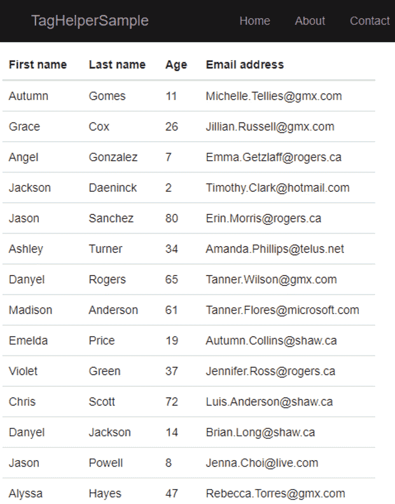

# *第 10 章*：创建自定义标记助手

在第十章中，我们将讨论**TagHelpers**。内置的`TagHelpers`非常有用，使 Razor 代码更加美观，可读性更强。创建自定义`TagHelpers`将使您的生活更加轻松。

在本章中，我们将介绍以下主题：

*   介绍`TagHelpers`
*   创建自定义`TagHelpers`

本章中的主题涉及 ASP.NET 核心架构的**MVC**层：


图 10.1–ASP.NET 核心体系结构

# 技术要求

要遵循本章中的描述，您需要创建一个 ASP.NET 核心 MVC 应用程序。打开控制台、shell 或 bash 终端，并切换到工作目录。使用以下命令创建新的 MVC 应用程序：

```cs
dotnet new mvc -n TagHelperSample -o TagHelperSample
```

现在，通过双击项目文件或在 VS 代码中，通过在已打开的控制台中键入以下命令，在 Visual Studio 中打开项目：

```cs
cd TagHelperSample
code .
```

本章中的所有代码示例都可以在本书的 GitHub 存储库中的[中找到 https://github.com/PacktPublishing/Customizing-ASP.NET-Core-5.0/tree/main/Chapter10](https://github.com/PacktPublishing/Customizing-ASP.NET-Core-5.0/tree/main/Chapter10) 。

# I生成 TagHelper

使用**TagHelpers**，您可以扩展现有的 HTML 标记或创建新的标记，这些标记将在服务器端呈现。扩展和新标记在浏览器中都不可见。`TagHelpers`是一种在服务器端编写更简单（更少）HTML 或 Razor 代码的快捷方式。`TagHelpers`将在服务器上解释，并为浏览器生成“真实”的 HTML 代码。

`TagHelpers`在 ASP.NET 内核中并不是什么新鲜事。自 ASP.NET Core 的第一个版本以来，它们就一直存在。大多数现有的和内置的`TagHelpers`都是老式 HTML 助手的替代品，它们仍然存在并在 ASP.NET Core 中工作，以保持 Razor 视图与 ASP.NET Core 兼容。

扩展 HTML 标记的一个非常基本的例子是内置的`AnchorTagHelper`：

```cs
<!-- old fashioned HtmlHelper -->
@Html.ActionLink("Home", "Index", "Home")
<!-- new TagHelper -->
<a asp-controller="Home" asp-action="Index">Home</a>
```

许多 HTML 开发人员发现在 HTML 标记之间有`HtmlHelper`有点奇怪。它很难阅读，而且在阅读代码时有点破坏性。对于习惯于阅读此类代码的 ASP.NET 核心开发人员来说，可能不是这样，但与`TagHelpers`相比，它真的很难看。`TagHelpers`感觉更自然，更像 HTML，即使它们不是，即使它们在服务器上呈现。

很多`HtmlHelper`实例可以替换为`TagHelper`。

还有一些新标签是用`TagHelpers`构建的，这些标签不是 HTML 格式的，但看起来像 HTML。一个例子是`EnvironmentTagHelper`：

```cs
<environment include="Development">
    <link rel="stylesheet" 
        href="~/lib/bootstrap/dist/css/bootstrap.css" />
    <link rel="stylesheet" href="~/css/site.css" />
</environment>
<environment exclude="Development">
    <link rel="stylesheet" 
        href="https://ajax.aspnetcdn.com/ajax/bootstrap/3.3.7/           css/bootstrap.min.css"
            asp-fallback-href="~/lib/bootstrap/dist/css/               bootstrap.min.css"
            asp-fallback-test-class="sr-only" 
            asp-fallback-test-property="position" 
            asp-fallback-test-value="absolute" />
    <link rel="stylesheet" 
        href="~/css/site.min.css" 
        asp-append-version="true" />
</environment>
```

此`TagHelper`根据当前运行时环境呈现（或不呈现）内容。在这种情况下，目标环境就是开发模式。如果当前运行时环境设置为`Development`，则第一个**环境**标签呈现内容，如果*未设置为`Development`，则第二个*标签呈现内容。这使它成为在`Development`模式下呈现可调试脚本或样式以及在任何其他运行时环境中缩小和优化代码的有用助手。

现在让我们看看如何创建我们自己的定制`TagHelpers`。

# 创建自定义标记帮助程序

要使用我们将在本章中创建的所有自定义`TagHelpers`，您需要参考当前程序集来告诉框架在哪里可以找到`TagHelpers`。打开`View/Shared/`文件夹中的`_ViewImports.cshtml`文件，并在文件末尾添加以下行：

```cs
@addTagHelper *, TagHelperSample
```

下面是一个快速示例，演示如何使用`TagHelper`扩展现有标记：

1.  Let's assume we need to have a tag configured as bold and colored in a specific color:

    ```cs
    <p strong color="red">Use this area to provide 
      additional information.</p>
    ```

    这看起来像是九十年代非常老式的 HTML，但这只是为了演示一个简单的`TagHelper`。

2.  The current method to do this task is to use a `TagHelper` to extend any tag that has an attribute called `strong`, as shown in the following code snippet:

    ```cs
    [HtmlTargetElement(Attributes = "strong")]
    public class StrongTagHelper : TagHelper
    {
        public string Color { get; set; }
        public override void Process(
            TagHelperContext context, 
            TagHelperOutput output)
        {
            output.Attributes.RemoveAll("strong");
            output.Attributes.Add("style", 
                "font-weight:bold;");
            if (!String.IsNullOrWhiteSpace(Color))
            {
                output.Attributes.RemoveAll("style");
                output.Attributes.Add("style", 
                    $"font-weight:bold;color:{Color};");
            }
        }
    }
    ```

    第一行告诉标记助手处理目标属性为`strong`的标记。这个`TagHelper`没有定义自己的标签，但它提供了一个额外的属性来指定颜色。

    `Process`方法定义了如何将 HTML 呈现给输出流。在本例中，它将一些 CSS 内联样式添加到当前标记中。它还将从当前标记中删除目标属性。`color`属性不会显示。

    这将显示如下：

    ```cs
    <p style="font-weight:bold;color:red;">Use this area 
      to provide additional information.</p>
    ```

下一个示例显示如何使用`TagHelper`定义自定义标记：

1.  让我们创建一个名为`GreeterTagHelper`：

    ```cs
    public class GreeterTagHelper : TagHelper
    {
        [HtmlAttributeName("name")]
        public string Name { get; set; }
        public override void Process(
            TagHelperContext context, 
            TagHelperOutput output)
        {
            output.TagName = "p";
            output.Content.SetContent($"Hello {Name}");
        }
    }
    ```

    的类
2.  This `TagHelper` handles a `greeter` tag that has a property name. In the `Process` method, the current tag will be changed to a `p` tag and the new content is set as the current output:

    ```cs
    <greeter name="Readers"></greeter>
    ```

    结果如下所示：

    ```cs
    <p>Hello Readers</p>
    ```

但是如果你需要做一些更复杂的事情呢？让我们进一步探索呃。

## 检查更复杂的场景

最后一节中的`TagHelpers`非常基本，只是为了展示`TagHelpers`是如何工作的。下一个示例稍微复杂一点，显示了一个真实的场景。此`TagHelper`呈现一个包含项目列表的表。这是一个通用的`TagHelper`，显示了创建自己的自定义`TagHelpers`的真正原因。这样，您就可以重用一段独立的视图代码。例如，您可以包装**引导**组件，使其更易于使用一个标记，而不是嵌套五个级别的`div`标记。或者，您可以简化 Razor 视图：

1.  Let's start by creating the `DataGridTagHelper` class. This next code snippet isn't complete, but we will complete the `DataGridTagHelper` class in the following steps:

    ```cs
    public class DataGridTagHelper : TagHelper
    {
        [HtmlAttributeName("Items")]
        public IEnumerable<object> Items { get; set; }
        public override void Process(
            TagHelperContext context, 
            TagHelperOutput output)
        {
            output.TagName = "table";
            output.Attributes.Add("class", "table");
            var props = GetItemProperties();
            TableHeader(output, props);
            TableBody(output, props);
        }
    }
    ```

    在`Process`方法中，我们调用私有子方法来执行实际工作，以使类更具可读性。

    您可能需要在文件开头添加以下`using`语句：

    ```cs
    using System.Reflection;
    using System.ComponentModel;
    using System.ComponentModel;
    ```

2.  因为这是一个通用的`TagHelper`，所以需要分析传入的对象。`GetItemProperties`方法获取属性项的类型，并从该类型加载`PropertyInfos`。`PropertyInfos`将用于获取表头和值：

    ```cs
    private PropertyInfo[] GetItemProperties()
    {
        var listType = Items.GetType();
        Type itemType;
        if (listType.IsGenericType)
        {
            itemType = listType.GetGenericArguments()
                .First();
            return itemType.GetProperties(
                BindingFlags.Public | 
                BindingFlags.Instance);
        }
        return new PropertyInfo[] { };
    }
    ```

3.  下面的代码片段显示了表头的生成。`TableHeader`方法将所需的 HTML 标记直接写入`TagHelperOutput`。它还使用`PropertyInfos`列表获取将用作表头名称的属性名称：

    ```cs
    private void TableHeader(
        TagHelperOutput output, 
        PropertyInfo[] props)
    {
        output.Content.AppendHtml("<thead>");
        output.Content.AppendHtml("<tr>");
        foreach (var prop in props)
        {
            var name = GetPropertyName(prop);
            output.Content.AppendHtml($"<th>{name}</th>");
        }
        output.Content.AppendHtml("</tr>");
        output.Content.AppendHtml("</thead>");
    }
    ```

4.  将属性名称用作表标题名称并不总是有用的。这就是为什么`GetPropertyName`方法也尝试从`DisplayNameAttribute`读取值，这是`DataAnnotation`的一部分，在 MVC 用户界面中显示的数据模型中大量使用。因此，支持此属性是有意义的：

    ```cs
    private string GetPropertyName(
        PropertyInfo property)
    {
        var attribute = property
            .GetCustomAttribute<DisplayNameAttribute>();
        if (attribute != null)
        {
            return attribute.DisplayName;
        }
        return property.Name;
    }
    ```

5.  此外，还需要显示值。`TableBody`方法完成该任务：

    ```cs
    private void TableBody(
        TagHelperOutput output, 
        PropertyInfo[] props)
    {
        output.Content.AppendHtml("<tbody>");
        foreach (var item in Items)
        {
            output.Content.AppendHtml("<tr>");
            foreach (var prop in props)
            {
                var value = GetPropertyValue(prop, item);
                output.Content.AppendHtml(
                    $"<td>{value}</td>");
            }
            output.Content.AppendHtml("</tr>");
        }
        output.Content.AppendHtml("</tbody>");
    }
    ```

6.  要从实际对象获取值，使用`GetPropertyValue`方法：

    ```cs
    private object GetPropertyValue(
        PropertyInfo property, 
        object instance)
    {
        return property.GetValue(instance);
    }
    ```

7.  To use this `TagHelper`, you just need to assign a list of items to this tag:

    ```cs
    <data-grid items="Model.Persons"></data-grid>
    ```

    在本例中，它是一个人员列表，我们在当前模型的`Persons`属性中获得该列表。

8.  The `Person` class we are using here looks like this:

    ```cs
    public class Person
    {
        [DisplayName("First name")]
        public string FirstName { get; set; }
        [DisplayName("Last name")]
        public string LastName { get; set; }
        public int Age { get; set; }
        [DisplayName("Email address")]
        public string EmailAddress { get; set; }
    }
    ```

    因此，并非所有属性都有`DisplayNameAttribute`，因此需要`GetPropertyName`方法中的回退来获取实际的属性名称，而不是`DisplayName`值。

9.  这个`TagHelper`需要更多的检查和验证，然后才能在生产中使用，但它是有效的。显示使用 GenFu 生成的虚假数据列表（参见[*第 7 章*](07.html#_idTextAnchor114)、*使用自定义 OutputFormatter*进行内容协商，了解 GenFu）：



图 10.2–TagHelper 示例正在运行

现在，您可以用更多的特性来扩展这个`TagHelper`，包括排序、过滤和分页。您可以在各种环境中自由尝试。

# 总结

`TagHelpers`在重用部分视图以及简化和清理视图时非常有用，如关于`DataGridTagHelper`的示例中所示。还可以为库提供有用的视图元素。在*进一步阅读*一节中，您可以尝试更多已有的`TabHelper`库和示例。

在下一章中，我们将讨论如何定制 ASP.NET 核心 web 应用程序的宿主。

# 进一步阅读

*   Damian Edwards，*TagHelperPack*：[https://github.com/DamianEdwards/TagHelperPack](https://github.com/DamianEdwards/TagHelperPack)
*   David Paquette，*TagHelperSamples*：[https://github.com/dpaquette/TagHelperSamples](https://github.com/dpaquette/TagHelperSamples)
*   *Teleric 引导的 TagHelpers*：[https://www.red-gate.com/simple-talk/dotnet/asp-net/asp-net-core-tag-helpers-bootstrap/](https://www.red-gate.com/simple-talk/dotnet/asp-net/asp-net-core-tag-helpers-bootstrap/)
*   *jQuery 的标记帮助程序*：[https://www.jqwidgets.com/asp.net-core-mvc-tag-helpers/](https://www.jqwidgets.com/asp.net-core-mvc-tag-helpers/)