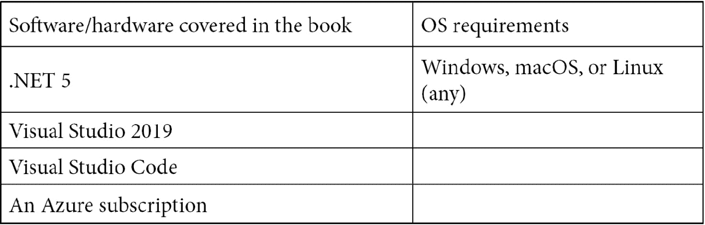

# 前言

。NET 5 是一个开源的免费平台，可以编写针对任何平台的应用程序。该平台还为您提供了轻松编写应用程序的机会，面向任何平台，包括云。作为软件开发人员，我们被赋予构建复杂企业应用程序的责任。在本书中，我们将学习使用 C# 9 和构建企业应用程序的各种高级架构和概念。NET 5。这本书将作为使用构建企业应用程序所需的所有功能的圣经。NET 5。

通过对基本概念、实例和自我评估问题的逐步解释，您将深入了解和接触到的每个重要组成部分。NET 5 需要构建一个专业的企业应用程序。

# 这本书是给谁的

这本书是为已经熟悉的中级到专家级开发人员准备的。. NET 框架或。NET Core 和 C#。

# 这本书涵盖了什么

[*第 1 章*](01.html#_idTextAnchor014)*设计和架构企业应用*，首先讨论了常用的企业架构和设计模式，然后介绍了将企业应用设计和架构为由 UI 层、服务层和数据库组成的三层应用。

[*第二章*](02.html#_idTextAnchor036)*介绍。NET 5 Core 和 Standard* ，从我们意识到运行时是代码运行的地方开始。在本章中，您将了解的核心和高级概念。NET 5 核心运行时组件。

[*第三章*](03.html#_idTextAnchor052)*介绍 C# 9* ，谈 C# 9 中的新功能，随发布。NET 5。

[*第四章*](04.html#_idTextAnchor073)*线程和异步操作*，帮助你详细了解线程、线程池、任务和`async await`以及如何。NET Core 允许您构建异步应用程序。

[*第五章*](05.html#_idTextAnchor110)*依存注入。NET* ，帮助我们理解什么是依赖注入，以及为什么每个开发人员都涌向依赖注入。我们将学习依赖注入是如何在中工作的。NET 5 并列出其他可用的选项。

[*第六章*](06.html#_idTextAnchor125)*配置中。NET Core* ，教你如何配置。NET 5，并在应用程序中使用配置和设置。您还将了解如何扩展？NET 5 配置来定义您自己的部分、处理程序、提供程序等等。

[*第七章*](07.html#_idTextAnchor141)*登陆。NET 5* ，讨论事件和日志 API。NET 5。我们还将深入研究使用 Azure 和 Azure 组件进行日志记录，并学习如何进行结构化日志记录。

[*第 8 章*](08.html#_idTextAnchor156)*了解缓存*，讨论中可用的缓存组件。NET 5 和最佳行业模式和实践。

[*第九章*](09.html#_idTextAnchor177)*处理数据。NET 5* ，讨论了两种可能的数据提供者:SQL 和像 RDMS 这样的数据。我们还将在高级别讨论如何使用 NoSQL 数据库进行存储和数据处理。NET 5。本章将讨论。NET Core 与文件、文件夹、驱动器、数据库和内存的接口。

[*第十章*](10.html#_idTextAnchor202)*创建 ASP.NET Core 5 Web API*，使用 ASP.NET Core 5 Web API 模板开发我们企业应用的服务层。

[*第十一章*](11.html#_idTextAnchor228)*创建 ASP.NET Core 5 Web 应用*，使用 ASP.NET Core 5 MVC Web 应用模板和 Blazor 开发我们企业应用的 Web 层。

[*第 12 章*](12.html#_idTextAnchor244)*了解身份验证*，讨论了行业中最常见的身份验证模式，以及如何使用实现它们。NET 5。我们还将介绍如何实现自定义身份验证。

[*第十三章*](13.html#_idTextAnchor268)*了解授权*，讨论了不同的授权方式，以及 ASP.NET 酷睿 5 让你如何处理。

[*第 14 章*](14.html#_idTextAnchor303)*健康与诊断*讨论了监控应用程序健康的重要性，为其构建了健康检查 API。NET Core应用程序和 Azure 应用程序，用于捕获遥测数据和诊断问题。

[*第十五章*](15.html#_idTextAnchor323)*测试*，论述了测试的重要性。测试是开发中必不可少的一部分，没有适当的测试，任何应用程序都无法交付，因此我们也将讨论如何对代码进行单元测试。我们还将学习如何衡量应用程序的性能。

[*第 16 章*](16.html#_idTextAnchor338)*在 Azure* 中部署应用，讨论了应用在 Azure 中的部署。我们将把我们的代码签入到我们选择的源代码控制中，然后 CI/CD 管道将启动并在 Azure 中部署应用程序。

# 为了充分利用这本书

你需要。NET 5 SDK 安装在您的系统上；所有代码示例都是在 Windows 操作系统上使用 Visual Studio 2019/Visual Studio Code 进行测试的。建议使用活动的 Azure 订阅来进一步部署企业应用程序。可以从[https://azure.microsoft.com/en-in/free/](https://azure.microsoft.com/en-in/free/)创建一个免费账户:



# 下载示例代码文件

可以从[https://GitHub . com/PacktPublishing/Enterprise-Application-Development-with-C-Sharp-9-and-下载本书的示例代码文件。NET-5](https://github.com/PacktPublishing/Enterprise-Application-Development-with-C-Sharp-9-and-.NET-5) 。如果代码有更新，它将在现有的 GitHub 存储库中更新。

我们还有来自 https://github.com/PacktPublishing/丰富的书籍和视频目录的其他代码包。看看他们！

# 下载彩色图片

我们还提供了一个 PDF 文件，其中包含本书中使用的截图/图表的彩色图像。可以在这里下载:[https://static . packt-cdn . com/downloads/9781800209442 _ color images . pdf](_ColorImages.pdf)

# 使用的约定

本书通篇使用了许多文本约定。

`Code in text`:表示文本中的码字、数据库表名、文件夹名、文件名、文件扩展名、路径名、虚拟网址、用户输入和推特句柄。这里有一个例子:“这里，如果你在`ImageFile`类的构造函数中放一个断点，只有当`System.Lazy`类的`Value`方法被调用时，它才会被命中。”

代码块设置如下:

```cs
Lazy<ImageFile> imageFile = new 
 Lazy<ImageFile>(() => new ImageFile("test"));
var image = imageFile.Value.LoadImage;
```

当我们希望将您的注意力吸引到代码块的特定部分时，相关的行或项目以粗体显示:

```cs
Host.CreateDefaultBuilder(args)
    .ConfigureAppConfiguration((context, 
 config) =>
 {
 config.AddSql("Connection 
 string","Query"); 
 })
    .ConfigureWebHostDefaults(webBuilder =>
    {
        webBuilder.UseStartup<Startup>();
    });
```

任何命令行输入或输出都编写如下:

```cs
dotnet new classlib -o MyLibrary
```

**粗体**:表示一个新的术语、一个重要的单词或者你在屏幕上看到的单词。例如，菜单或对话框中的单词像这样出现在文本中。下面是一个例子:“在安装选项中，从**工作负载**中，选择**。NET Core 跨平台开发**为。NET Core应用程序，如下图所示。”

提示或重要注意事项

像这样出现。

# 取得联系

我们随时欢迎读者的反馈。

**一般反馈**:如果你对这本书的任何方面有疑问，在你的信息主题中提到书名，发邮件给我们`customercare@packtpub.com`。

**勘误表**:虽然我们已经尽了最大的努力来保证内容的准确性，但是错误还是会发生。如果你在这本书里发现了一个错误，如果你能向我们报告，我们将不胜感激。请访问[www.packtpub.com/support/errata](http://www.packtpub.com/support/errata)，选择您的图书，点击勘误表提交链接，并输入详细信息。

**盗版**:如果您在互联网上遇到任何形式的我们作品的非法拷贝，如果您能提供我们的位置地址或网站名称，我们将不胜感激。请通过`copyright@packt.com`联系我们，并提供材料链接。

**如果你有兴趣成为一名作者**:如果有一个你有专长的话题，你有兴趣写或者投稿一本书，请访问[authors.packtpub.com](http://authors.packtpub.com)。

# 评论

请留下评论。一旦你阅读并使用了这本书，为什么不在你购买它的网站上留下评论呢？然后，潜在的读者可以看到并使用您不带偏见的意见来做出购买决定，我们在 Packt 可以了解您对我们产品的看法，我们的作者可以看到您对他们的书的反馈。谢谢大家！

更多关于 Packt 的信息，请访问[packt.com](http://packt.com)。