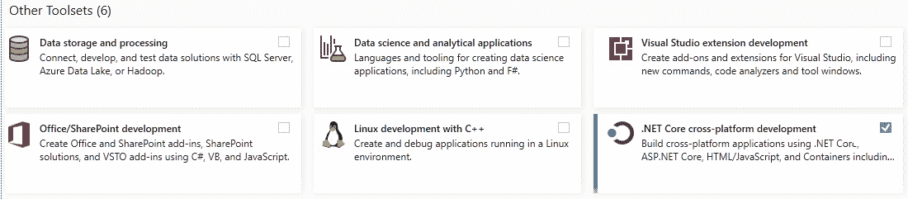
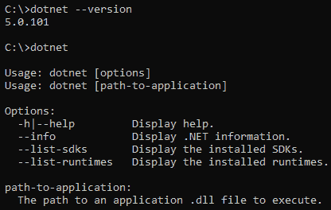
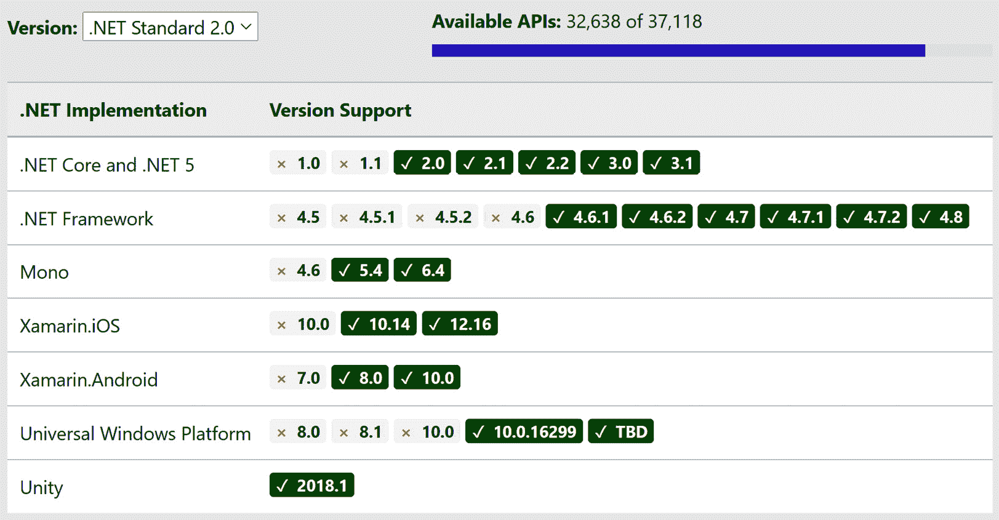

# 二、.NET 5 核心和标准简介

.NET 是一个开发人员平台，提供构建许多不同类型应用的库和工具，如 web、桌面、移动、游戏、**物联网** ( **物联网**)和云应用。使用.NET，我们可以开发针对很多操作系统的应用，包括 Windows、macOS、Linux、Android、iOS 等等，它支持 x86、x64、ARM32、ARM64 等处理器架构。

.NET 还支持使用多种编程语言进行应用开发，如 C#、Visual Basic 和 F#，使用流行的**集成开发环境** ( **IDEs** )如 Visual Studio、Visual Studio Code 和 Visual Studio for Mac。

之后.NET Core 3.1，.NET 5 现在是一个主要版本，包括 C# 9 和 F# 5，具有许多新特性和性能改进。

本章涵盖以下主题:

*   介绍.NET 5
*   了解的核心组成部分.NET 5
*   了解命令行界面
*   什么是？NET 标准？
*   理解.NET 5 跨平台和云应用支持

本章将帮助我们了解中包含的一些核心组件、库和工具.NET 开发应用。

# 技术要求

需要一台 Windows、Linux 或 Mac 机器。

# 介绍.NET 5

2002 年，微软发布了第一个版本的.NET 框架，一个开发 web 和桌面应用的开发平台。.NET Framework 提供了很多服务，包括托管代码执行、通过基类库的大量 API、内存管理、通用类型系统、语言互操作性，以及开发框架，如 ADO.NET、ASP.NET、WCF、WinForms、**Windows Presentation Framework**(**【WPF】**等。最初，它是作为一个单独的安装程序发布的，但后来它被集成并与 Windows 操作系统一起提供。。. NET Framework 4.8 是的最新版本.NET 框架。

2014 年，微软宣布开放源代码，跨平台实现.NET 调用.NET Core。.NET Core 是从零开始构建的，以使其跨平台，目前在 Linux、macOS 和 Windows 上都有。.NET Core 是快速和模块化的，并提供并行支持，因此我们可以运行不同版本的.NET Core 在同一台机器上运行而不影响其他应用。

.NET 5 是一个开源的、跨平台的实现.NET，您可以用它构建可以在 Windows、macOS 和 Linux 操作系统上运行的控制台、网络、桌面和云应用。.NET 5 是.NET 统一之旅，包括许多库、工具/SDK 以及运行时和性能改进。

接下来，让我们了解. NET 的核心特性

## **了解核心特性**

以下是的几个核心特性.NET，我们将更深入地了解:

*   **开源**:.NET 是一个免费的(没有许可费用，包括商业用途)开源的开发者平台，为 Linux、macOS 和 Windows 提供了许多开发工具。其源代码由微软和.NET 社区。您可以访问.NET 资源库，网址为[。](https://github.com/dotnet/core/blob/master/Documentation/core-repos.md)
*   **跨平台**:.NET 应用运行在许多操作系统上，包括 Linux、macOS、Android、iOS、tvOS、watchOS 和 Windows。它们还可以跨 x86、x64、ARM32 和 ARM64 等处理器架构一致运行。

和.NET，我们可以构建以下类型的应用:


表 2.1

*   **编程语言**:.NET 支持多种编程语言。用一种语言编写的代码可以被其他语言访问。下表显示了支持的语言:


表 2.2

*   **IDEs**: .NET supports multiple IDEs. Let's understand each one:

    a. **Visual Studio** 是一个功能丰富的 IDE，可在 Windows 平台上构建、调试和发布.NET 应用。它有三个版本:社区版、专业版和企业版。Visual Studio 2019 社区版对学生、个人开发人员和致力于开源项目的组织是免费的。

    b.**用于 Mac 的 Visual Studio**是免费的，可用于 macOS。可以使用. NET 为 iOS、安卓和网络开发跨平台应用和游戏

    c. **Visual Studio Code** 是一个免费、开源、轻量级但功能强大的代码编辑器，可在 Windows、macOS 和 Linux 上使用。它内置了对 JavaScript、TypeScript 和 Node.js 的支持，通过扩展，您可以添加对许多流行编程语言的支持。

    d. **Codespaces** 目前处于预览阶段，是一个由 Visual Studio Code 提供动力的云开发环境，由 GitHub 托管开发.NET 应用。

*   **Deployment models**: .NET supports two modes of deployment:

    a.**自包含**:当. NET 应用以自包含模式发布时，发布的工件包含.NET 运行时、库和应用及其依赖项。独立的应用是特定于平台的，目标机器不需要.NET 运行时已安装。机器使用.NET 运行时与运行应用的应用一起提供。

    b.**依赖框架的**:当一个. NET 应用以依赖框架的模式发布时，发布的工件只包含应用及其依赖项。那个.NET 运行时必须安装在目标计算机上才能运行应用。

接下来，让我们了解. NET 提供的应用框架

## 理解应用框架

.NET 通过提供许多应用框架简化了应用开发。每个应用框架都包含一组库来开发目标应用。让我们详细了解每一个:

*   **ASP.NET 芯**:这是一个开源跨平台应用开发框架，让你构建现代的、基于云的、互联网连接的应用，比如 web、IoT、API 应用。ASP.NET Core是建立在.NET Core，因此您可以跨平台构建和运行，如 Linux、macOS 和 Windows。
*   **WPF** :这是一个 UI 框架，让你为 Windows 创建桌面应用。WPF 使用**可扩展应用标记语言** ( **XAML** )，一种用于应用开发的声明性模型。
*   **实体框架** ( **EF** )核心:这个是一个开源的、跨平台的、轻量级的、**对象关系映射** ( **ORM** )框架来与数据库配合使用.NET 对象。它支持 LINQ 查询、变更跟踪和模式迁移。它适用于流行的数据库，如 SQL Server、SQL Azure、SQLite、Azure Cosmos DB、MySQL 等。
*   **语言-集成查询** ( **LINQ** ):这增加了查询功能.NET 编程语言。LINQ 允许您使用相同的 API 从数据库、XML、内存数组和集合中查询数据。

在下一节中，让我们了解. NET 的核心组件

# 了解的核心成分。网

.NET 有两个主要组件:运行时和基类库。运行时包括一个**垃圾收集器** ( **GC** )和**准时制** ( **JIT** )编译器，负责管理的执行.NET 应用和**基类库** ( **BCLs** )，也称为*运行时库*或*框架库*，它们包含了的基本构造块.NET 应用。

那个.NET SDK 可在[https://dotnet.microsoft.com/download/dotnet/5.0](https://dotnet.microsoft.com/download/dotnet/5.0)下载。它包含一组开发和运行的库和工具.NET 应用。您可以选择安装软件开发工具包或.NET 运行时。去发展.NET 应用，您应该在开发机器上安装 SDK.NET 运行时.NET 应用。那个。. NET 运行时包含在。因此你不必安装。如果您已经安装了.NET 软件开发工具包:


图 2.1–的可视化.NET 软件开发工具包

那个.NET 软件开发工具包包含以下组件:

*   **公共语言运行时** ( **CLR** ): CLR 执行代码并管理内存分配。.NET 应用，在编译时，产生一个**中间语言** ( **IL** )。CLR 使用 JIT 编译器将编译后的代码转换为机器代码。它是一个跨平台运行时，可用于 Windows、Linux 和 macOS。
*   **内存管理**:垃圾收集器管理的内存分配和释放.NET 应用。对于每一个新创建的对象，内存在托管堆中被分配，当没有足够的可用空间时，垃圾收集会检查托管堆中的对象，如果它们不再被应用使用，就将其删除。更多信息可以参考[https://docs . Microsoft . com/en-us/dotnet/standard/垃圾收集](https://docs.microsoft.com/en-us/dotnet/standard/garbage-collection)。
*   **JIT** :时.NET 代码被编译，它被转换成 IL。IL 与平台和语言无关，因此当运行时运行应用时，JIT 会将 IL 转换为处理器能够理解的机器代码。
*   **通用类型系统**:这定义了在 CLR 中如何定义、使用和管理类型。它支持跨语言集成并确保类型安全。
*   **基类库**:这个包含了像`System.String``System.Boolean`这样的原语类型的实现，像`List<T>``Dictionary<TKey, TValue>`这样的集合，以及执行 I/O 操作、HTTP、序列化等等的实用函数。它简化了.NET 应用开发。
*   **罗斯林编译器**:罗斯林是一个开源的 C#和 Visual Basic 编译器，拥有丰富的代码分析 API。它支持使用与 Visual Studio 相同的应用编程接口构建代码分析工具。
*   **MSBuild** :这是一个建造的工具.NET 应用。Visual Studio 使用 MSBuild 来生成.NET 应用。
*   **NuGet** :这是一个开源的包管理器工具，你可以用它来创建、发布和重用代码。NuGet 包包含编译后的代码、其依赖文件和包含包版本号信息的清单。

在下一节中，让我们了解如何设置开发环境来创建和运行.NET 应用。

# 设置开发环境

建立一个开发环境非常容易。你需要.NET 软件开发工具包来构建和运行.NET 应用；或者，您可以选择安装支持.NET 应用开发。您需要执行以下步骤来设置。. NET 软件开发工具包:

注意

Visual Studio Community Edition 对个人开发者、课堂学习以及为研究或开源项目做出贡献的组织中的无限用户免费。它提供了与专业版相同的功能，但是对于高级功能，如高级调试和诊断工具、测试工具等，您需要有企业版。要比较功能，您可以访问[https://visualstudio.microsoft.com/vs/compare](https://visualstudio.microsoft.com/vs/compare)。

1.  在 Windows 机器上，从[https://visualstudio.microsoft.com](https://visualstudio.microsoft.com)下载并安装 Visual Studio 16.8 或更高版本。
2.  In the installation options, from **Workloads**, select **.NET Core cross-platform development** for .NET Core applications, as shown in the following screenshot:

    

    图 2.2–Visual Studio 安装、工作负载选择

3.  确认选择并继续完成安装。这将安装 Visual Studio 和.NET 5 软件开发工具包。

或者，您也可以执行以下步骤进行设置:

1.  下载并安装.NET 5 SDK，适用于 Windows、macOS 和 Linux，来自[https://dotnet.microsoft.com/download/dotnet/5.0](https://dotnet.microsoft.com/download/dotnet/5.0)。.NET Core 支持并行执行，因此我们可以安装多个版本的。在开发机器上。
2.  From Command Prompt, run the `dotnet --version` command to verify the installed version, as shown in the following screenshot:

    

    图 2.3–dotnet 命令的命令行输出

3.  Optionally, you can download and install Visual Studio Code from [https://code.visualstudio.com](https://code.visualstudio.com) to use it to develop the .NET application.

    既然我们了解了如何为？NET，在下一节中，让我们了解.NET CLI 是什么，以及它如何帮助创建、构建和运行.NET 应用从命令行。

    要设置电子商务应用，可以参考[https://github . com/packt publishing/Enterprise-Application-Development-with-C-Sharp-9-and-.NET-5/blob/master/Enterprise % 20 application/readme . MD](https://github.com/PacktPublishing/Enterprise-Application-Development-with-C-Sharp-9-and-.NET-5/blob/master/Enterprise%20Application/Readme.md)。

    # 了解命令行界面

    那个.NET CLI 是一个跨平台的*命令行界面*工具，可用于开发、构建、运行和发布.NET 应用。它包含在.NET SDK。

    CLI 命令结构包含`command driver` ( `dotnet`)、`command`、`command-arguments`和`options`，这是大多数 CLI 操作的常见模式。请参考以下命令模式:

    ```cs
    driver command <command-arguments> <options>
    ```

    例如，以下命令创建了一个新的控制台应用。`dotnet`是司机，`new`是命令，`console`是模板名作为参数:

    ```cs
    dotnet new console
    ```

    下表说明了命令行界面支持的一些命令和命令的简短描述:

    

    表 2.3

    让我们创建一个简单的控制台应用，并使用.NET 命令行界面:

    注意

    要执行以下步骤，作为先决条件，您应该具有.NET 软件开发工具包安装在您的机器上。可以从[https://dotnet.microsoft.com/download/dotnet/5.0](https://dotnet.microsoft.com/download/dotnet/5.0)下载安装。

4.  在命令提示符下，运行以下命令创建一个名为`HelloWorld`的控制台应用:

    ```cs
    dotnet new console --name HelloWorld
    ```

5.  This command will create a new project called `HelloWorld` based on the `console` application template. Refer to the following screenshot:

    

    图 2.4–新控制台应用的命令行输出

6.  运行以下命令来构建和运行应用:

    ```cs
    dotnet run --project ./HelloWorld/HelloWorld.csproj
    ```

7.  前面的命令将构建并运行应用，并将输出打印到命令窗口，如下所示:


图 2.5–运行时控制台应用的命令行输出

在前面的步骤中，我们创建了一个新的控制台应用，并使用.NET 命令行界面。让我们理解`global.json`的意义。

## global . JSON 概述

在开发者机器上，如果有多个.NET SDKs 已安装，在`global.json`文件中可以定义。用于运行.NET 命令行界面命令。一般来说，当没有定义`global.json`文件时，会使用最新的版本的 SDK，但是您可以通过定义`global.json`来覆盖此行为。

运行以下命令将在当前目录中创建一个`global.json`文件。根据您的要求，您可以选择要配置的版本:

```cs
dotnet new globaljson --sdk-version 2.1.811
```

以下是通过运行前面的命令创建的示例`global.json`文件:

```cs
{
  "sdk": {
    "version": "2.1.811"
  }
}
```

这里，`global.json`被配置为使用。. NET SDK 版 2.1.8.11。那个.NET CLI 使用这个 SDK 版本来构建和运行应用。

有关的更多信息.NET CLI，可以参考[https://docs.microsoft.com/en-us/dotnet/core/tools](https://docs.microsoft.com/en-us/dotnet/core/tools)。

在下一节中，让我们了解一下.NET 标准是。

# 是什么.NET 标准？

.NET 标准是一组可用于多种应用的 API 规范.NET 实现。每个新版本的都会添加新的 API.NET 标准。每一个.NET 实现的目标是特定版本的.NET 标准，并且可以访问该标准支持的所有 API.NET 标准版。

针对版本构建的库.NET 标准可用于使用。支持该版本的.NET 标准。因此，当构建库时，目标是.NET Standard 允许使用更多的 API，但只能在使用的版本构建的应用中使用.NET 实现来支持它。

下面的屏幕截图列出了的各种版本.NET 实现，这些实现支持.NET 标准 2.0:



图 2.6–.NET 标准 2.0 支持.NET 实现

例如，如果您开发了一个目标库.NET 标准 2.0，它可以访问超过 32，000 个 API，但是支持它的版本较少.NET 实现。如果您希望您的库能够以最大数量的.NET 实现，然后选择尽可能低的.NET 标准版，但是您需要在可用的 API 上妥协。

让我们了解何时使用.NET 5 和.NET 标准。

## 了解使用.NET 5 和。网络标准

.NET 标准使得在不同的.NET 实现，但是.NET 5 提供了一种更好的方式来共享代码并在多个平台上运行。.NET 5 统一了API 来支持桌面、web、云和跨平台控制台应用。

.NET 5 实现.NET 标准 2.1，所以你现有的代码.NET 标准与.NET 5；你不需要改变**目标框架的名字** ( **TFM** )除非你想要访问新的运行时特性、语言特性或者 API。您可以多目标到.NET 标准和.NET 5，这样您就可以访问新功能，并使您的代码对其他人可用.NET 实现。

如果您正在构建需要使用的新的可重用库.NET 框架，然后将它们定位到.NET 标准 2.0。如果你不需要支持.NET 框架，那么你可以选择.NET 标准 2.1 或.NET 5。建议瞄准.NET 5 来访问新的 API、运行时和语言特性。

使用.NET 命令行界面，运行以下命令创建一个新的类库:

```cs
dotnet new classlib -o MyLibrary
```

它创建一个类库项目，目标框架为`.net5.0`或开发人员机器上最新可用的 SDK。

如果您检查`MyLibrary\MyLibrary.csproj`文件，它应该看起来像下面的片段。您会注意到目标框架设置为`net5.0`:

```cs
<Project Sdk="Microsoft.NET.Sdk">
  <PropertyGroup>
    <TargetFramework>net5.0</TargetFramework>
  </PropertyGroup>
</Project>
```

在使用创建类库时，您可以强制它使用目标框架的特定版本.NET 命令行界面。以下命令创建一个目标类库.NET 标准 2.0:

```cs
dotnet new classlib -o MyLibrary -f netstandard2.0
```

如果您检查`MyLibrary\MyLibrary.csproj`文件，它看起来像下面的片段，其中目标框架是`netstandard2.0`:

```cs
<Project Sdk="Microsoft.NET.Sdk">
  <PropertyGroup>
    <TargetFramework>netstandard2.0</TargetFramework>
  </PropertyGroup>
</Project>
```

如果你创建了一个目标库.NET 标准 2.0，它可以在一个应用中访问.NET Core以及.NET 框架。

可选地，您可以瞄准多个框架；例如，在下面的代码片段中，库项目被配置为以.NET 5.0 和.NET 标准 2.0:

```cs
<Project Sdk="Microsoft.NET.Sdk">
  <PropertyGroup>
    <TargetFrameworks>net5.0;netstandard2.0</TargetFrameworks>
  </PropertyGroup>
</Project>
```

当您配置应用以支持多个框架并构建项目时，您会注意到它为每个目标框架版本创建工件。参考以下截图:


图 2.7–构建面向多个框架的工件

我们来总结一下这里的信息:

*   使用.NET 标准 2.0 到之间共享代码.NET 框架和所有其他平台。
*   使用.NET 标准 2.1 在 Mono、Xamarin 和之间共享代码.NET Core 3.x。
*   使用.NET 5 进行代码共享。

在下一节中，让我们了解一下.NET 5 的跨平台能力和云应用支持。

# 理解.NET 5 跨平台和云应用支持

.NET 有很多实现。每个实现都包含运行时、库、应用框架(可选)和开发工具。有四个.NET 实现:。. NET 框架.NET 5、**通用 Windows 平台** ( **UWP** )、Mono 以及所有这些实现共有的套 API 规范.NET 标准。

多个.NET 实现使您能够创建.NET 应用，目标是许多操作系统。你可以建造.NET 应用，用于以下目的:


表 2.4

让我们了解更多关于.NET 实现:

*   **.NET Framework** is the initial implementation of .NET. Using .NET Framework, you can develop Windows, WPF, web applications, and web and WCF services targeting the Windows operating system. .NET Framework 4.5 and above implement .NET Standard, so libraries that are built targeting .NET Standard can be used in .NET Framework applications.

    注意

    。. NET Framework 4.8 是的最后一个版本.NET 框架，未来不会发布新版本。微软将继续在 Windows 中包含它，并通过安全和错误修复来支持它。对于新开发，建议使用.NET 5 或更高版本。

*   **UWP** 是一个的实现.NET，您可以用它构建可在个人电脑、平板电脑、Xbox 等上运行的支持触摸的窗口应用。
*   **Mono** 是. NET 的一个实现。它是一个小的运行时，支持 Xamarin 开发原生的 Android、macOS、iOS、tvOS 和 watchOS 应用。它实现了.NET 标准和目标库.NET 标准可以用于使用 Mono 构建的应用。
*   **.NET 5** is an open source, cross-platform implementation of .NET with which you can build console, web, desktop, and cloud applications that can run on Windows, macOS, and Linux operating systems. .NET 5 is now the primary implementation of .NET, which is built on a single code base with a uniform set of capabilities and APIs that can be used by .NET applications.

    那个.NET 5 SDK，连同库和工具，也包含多个运行时，包括.NET 运行时、ASP.NET Core运行时和.NET 桌面运行时。跑步.NET 5 应用，您可以选择安装.NET 5 SDK 或相应的平台和工作负载特定的运行时:

*   **The.NET 运行时**只包含运行控制台应用所需的组件。要运行网络或桌面应用，您需要安装 ASP.NET Core运行时和.NET 桌面运行时。那个.NET 运行时在 Linux、macOS 和 Windows 上可用，支持 x86、x64、ARM32 和 ARM64 处理器架构。
*   **ASP.NET Core运行时**使您能够运行网络/服务器应用，并且在 x86、x64、ARM32 和 ARM64 处理器架构的 Linux、macOS 和 Windows 上可用。
*   **.NET 桌面运行时**使您能够在 Windows 上运行基于 Windows/WPF 的桌面应用。它适用于 x86 和 x64 处理器体系结构。

的可用性.NET 多平台运行时使得.NET 5 跨平台；在目标机器上，您只需要安装您的工作负载所需的运行时并运行应用。

现在，让我们来探索 Azure 提供的服务.NET 5。

## 云支持

.NET 5 得到了包括 Azure、谷歌云和 AWS 在内的热门云服务提供商的支持。让我们了解一些可以运行的服务。Azure 中的. NET 5 应用:

*   **Azure 应用服务**支持轻松部署和运行 ASP.NET Core 5 应用。Azure 应用服务为您提供了托管的机会。使用 x86 或 x64 处理器架构的 Linux 或 Windows 平台上的 NET 5 应用。更多信息可以参考[https://docs.microsoft.com/en-in/azure/app-service/overview](https://docs.microsoft.com/en-in/azure/app-service/overview)。
*   **Azure 功能**支持部署和运行构建在之上的无服务器功能.NET 5。您可以在 Linux 或 Windows 上托管函数应用。更多信息可参考[https://docs . Microsoft . com/en-us/azure/azure-functions/functions-overview](https://docs.microsoft.com/en-us/azure/azure-functions/functions-overview)。
*   **码头工人**.NET 5 应用运行在 Docker 容器上。您可以独立构建在 Docker 容器上运行的可部署、高度可扩展的微服务。官方.NET Core Docker 图像可在[https://hub.docker.com/_/microsoft-dotnet](https://hub.docker.com/_/microsoft-dotnet)获得，用于不同的.NET (SDK 或运行时)和操作系统。许多 Azure 服务支持 Docker 容器，包括 Azure 应用服务、Azure 服务结构、Azure 批处理、Azure 容器实例和 **Azure Kubernetes 服务** ( **AKS** )。更多信息可参考[https://docs . Microsoft . com/en-us/dotnet/core/docker/introduction](https://docs.microsoft.com/en-us/dotnet/core/docker/introduction)。

和.NET 5，我们可以开发可以在云中运行的企业服务器应用或高度可扩展的微服务。我们可以为 iOS、安卓和 Windows 操作系统开发移动应用。.NET 代码和项目文件看起来很相似，开发人员可以重用技能或代码来开发针对不同平台的不同类型的应用。

# 总结

在这一章，我们学到了什么.NET 是及其核心特性。我们了解了.NET 及其支持的不同部署模型。接下来，我们了解了提供的核心组件、工具和库.NET，并学习了如何在机器上设置开发环境。

我们还看了。并使用创建了一个示例应用.NET 命令行界面。接下来，我们学到了什么.NET 标准是什么以及什么时候使用.NET 5 和.NET 标准，然后通过讨论各种。. NET 实现.NET 5 跨平台支持，以及云支持。

在下一章中，我们将学习 C# 9.0 的新特性。

# 问题

1.  .NET Core is which of the following?

    a.开放源码

    b.跨平台

    c.自由的

    d.上述全部

2.  The .NET Standard 2.0 library is supported by which of the following?

    a.。. NET Framework 4.6.1 或更高版本

    b..NET Core 2.0 或更高版本

    c..NET 5

    d.Mono 5.4+或更高版本

    e.上述全部

3.  The .NET CLI driver that is mandatory to run CLI commands is which of the following?

    a.`net`

    b.`core`

    c.`dotnet`

    d.`none`

4.  The .NET SDK contains which of the following?

    a.那个.NET 命令行界面

    b.基类库

    c.运行时

    d.上述全部

# 进一步阅读

了解更多.NET 5，可以参考[https://docs.microsoft.com/en-us/dotnet/core/introduction](https://docs.microsoft.com/en-us/dotnet/core/introduction)。