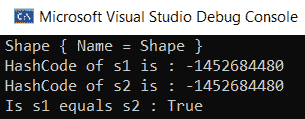
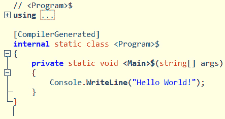

# *第三章*:介绍 C# 9

C#是一种优雅且类型安全的面向对象编程语言，它使开发人员能够构建许多类型的安全且健壮的应用程序，这些应用程序运行在。NET 生态系统，并且在 GitHub 发布的流行编程语言列表中排名前 5。

C#最初是由安德斯·海尔斯伯格在微软开发的，作为。NET 倡议。自 2002 年 1 月第一次发布以来，该语言不断增加新功能，以提高性能和生产力。

撰写本文时的最新版本 C# 9.0 于 2020 年 11 月发布，目标是。NET 5。虽然就新特性而言，C# 9.0 并不是一个主要版本，但是有很多有趣的增加和增强，我们将在本章中了解:

*   理解仅初始化设置器
*   使用记录类型
*   理解顶层语句
*   使用模式匹配检查对象
*   用目标类型表达式理解类型推断
*   理解静态匿名函数
*   使用模块初始化器进行紧急初始化

到本章结束时，您将熟悉 C# 9.0 的新增功能。此外，本章将帮助我们提升自我，以 C#构建我们的下一个企业应用程序。

# 技术要求

您将需要以下内容来理解本章的概念:

*   带有的 Visual Studio 2019 版。NET 5.0 运行时
*   对微软的基本了解。网

本章使用的代码可以在[https://github . com/PacktPublishing/Enterprise-Application-Development-with-C-Sharp-9-and-找到。NET-5/树/主/第 03 章](https://github.com/PacktPublishing/Enterprise-Application-Development-with-C-Sharp-9-and-.NET-5/tree/master/Chapter03)。

# 了解仅初始化设置器

在 C#中，我们使用在 C# 7.0 中引入的对象初始值设定项，通过使其可设置来设置属性值。但是如果我们希望只在对象初始化期间设置它们，我们需要编写大量的样板代码。在 C# 9.0 中，使用只初始化的设置器，可以让属性在对象创建期间初始化。只能为任何类或结构声明 only setters。

下面的代码片段定义了`Order`类，其中`OrderId`是一个只初始化的设置器。这强制`OrderId`仅在对象创建期间初始化:

```cs
public class Order
{
        public int OrderId { get; init; }
        public decimal TotalPrice { get; set; }
}
```

我们可以在创建对象时实例化`Order`类并初始化`OrderId`，如下面的代码片段所示:

```cs
class Program
{
    static void Main(string[] args)
    {
 Order orderObject = new Order
 {
 OrderId = 1,
 TotalPrice = 10.0M
 };
// orderObject.OrderId = 2 // This will result in 
 compilation error
        Console.WriteLine($”Order: Id: 
         {orderObject.OrderId}, Total price: 
         {orderObject.TotalPrice}”);
    }
}
```

我们可以在前面的代码中看到，如果我们试图更改`OrderId`的值，我们会得到一个编译时错误。

仅初始化属性应用于强制可选属性的不变性，构造函数初始化应用于强制必需值。

在下一节中，我们将探索 C# 9.0 引入的新类型定义。

# 使用记录类型

作为一名开发人员，您希望引用类型具有不变性，尤其是在使用共享数据进行并发编程时。为了实现引用类型的不变性，我们必须编写相当多的代码。C# 9.0 中引入的记录类型提供类型声明来创建不可变的引用类型。与引用类型不同，他们通过比较属性的相等性来合成相等性的方法，而不是比较对象的哈希代码。下面显示了保存形状名称的`Shape`记录类型的声明:

```cs
public record Shape(string Name);
```

构建项目，并在诸如 ILSpy 或 Reflector 之类的反汇编工具中打开库。你可以从[https://marketplace.visualstudio.com/items?安装 ILSpyitemName =夏普发展团队。](https://marketplace.visualstudio.com/items?itemName=SharpDevelopTeam.ILSpy)。在 ILSpy 中，我们看到`Shape`记录类型的定义如下图所示:


图 3.1–形状记录类型的分解

如果我们仔细观察`Shape`类型定义，我们可以看到由 C#编译器为记录类型合成的所有管道。由此我们可以理解，记录类型基本上是一个类，用`Equality`和`GetHashCode`合成来模仿值类型的行为。它还提供了`Deconstruct`方法，可用于将记录类型解构为其组件属性。`ToString`方法也被覆盖以打印记录类型的属性。

为了理解所有这些特性，让我们继续创建一个`Shape`记录类型的实例，如下面的代码所示:

```cs
public record Shape(string Name);
class Program
{
    static void Main(string[] args)
    {
        Shape s1 = new Shape(“Shape”);
        Shape s2 = new Shape(“Shape”);
        // ToString of record is overwritten to print the 
            properties of the type
        Console.WriteLine(s1.ToString());
        // GetHashCode of record is overwritten to generate 
           the hash code based on values
        Console.WriteLine($”HashCode of s1 is : 
         {s1.GetHashCode()}”);
        Console.WriteLine($”HashCode of s2 is : 
          {s2.GetHashCode()}”);
        // Equality operator of record type is overwritten 
             to check equality based on the values
        Console.WriteLine($”Is s1 equals s2 : {s1 == s2}”);
    }
}
```

如果我们运行前面的代码，我们会得到以下输出:



图 3.2–程序控制台输出

从前面的截图中，我们可以看到，正如我们在前面的代码中了解到的，`ToString`获得了对象的详细信息。我们收到的`s1`和`s2`对象的哈希代码与根据对象的详细信息计算的相同。`s1`和`s2`之间的相等检查返回`True`，因为`==`操作符被覆盖以比较对象的数据。

我们已经看到了基本上是什么记录类型。在下一节中，我们将了解`with`表达式，它可以与记录类型一起使用，通过细化零个或多个属性，从现有对象创建新对象。

## 带表情的

我们可以使用`with`表达式来指示编译器从另一个实例创建一个记录类型的实例:

```cs
Person person = new(“Suneel”, “Kunani”);
Person person2 = person with { FirstName = “Mahanya” };
```

在前面的代码片段中，`Person`对象的新实例`person2`是通过复制字段的值并仅修改在`with`表达式中指定的属性，从现有的`person`实例创建的。

我们现在已经了解了记录类型。在下一节中，我们将了解 C# 9.0 中添加的另一个特性，即顶级语句。

# 理解顶级语句

在 C# 9.0 中，语言团队专注于移除开发人员要编写的冗余代码。这样做的一个特征是顶级语句。这个特性使开发人员能够在应用程序的主入口点移除仪式代码。

如果我们在 Visual Studio 中创建一个控制台应用程序，我们在`Program.cs`中看到的内容如下面的代码片段所示:

```cs
using System;
namespace TopLevelStatements
{
    class Program
    {
        static void Main(string[] args)
        {
            Console.WriteLine(“Hello World!”);
        }
    }
}
```

在这段代码中，唯一起作用的语句是`Console.WriteLine(“Hello World!”);`。所有剩下的台词都是不必要的仪式声明。使用 C# 9.0，我们可以在不必要的地方去掉这些语句。现在我们可以用一行代码替换所有这些语句，如下面的代码片段所示:

```cs
System.Console.WriteLine(“Hello World!”);
```

这只是 C#编译器提供的语法糖。当它看到任何顶级语句时，它会添加所有必需的管道。让我们看看反射的代码，如下面的截图所示，带有顶级语句:



图 3.3–顶层语句的分解

应用程序中只有一个文件可以有顶级参数，因为该应用程序只能有一个入口点。如果多个文件包含顶级语句，它将显示编译错误。我们可以访问用`args`变量名传递的命令行参数，如下面的代码所示:

```cs
foreach (var v in args)
{
    System.Console.WriteLine(v);
}
```

在下一节中，我们将了解模式匹配，这是 C# 7.0 中引入并在后续版本中增强的 C#令人兴奋的特性之一。

# 用模式匹配检查对象

模式匹配是一种方法，用于检查对象的值或与序列完全或部分匹配的属性的值。这在 C#中以`if…else`和`switch…case`语句的形式得到支持。在现代语言中，特别是在函数式编程语言(如 F#)中，有对模式匹配的高级支持。在 C# 7.0 中，引入了新的模式匹配概念。它们在 C#的更高版本(即 8.0 和 9.0)中得到进一步增强。

模式匹配提供了一种不同的方式来表达条件，以获得更易于人类阅读的代码。为了理解模式匹配，我们还将介绍 7.0 和 8.0 版本中的概念。让我们在接下来的章节中更深入地探讨模式匹配。

## 不变的模式

常量模式匹配根据常量检查对象的值。通过常量模式匹配，我们将针对常量断言一个对象的值。

下面的代码片段是一个示例，应用常量模式检查`Width`是否为`0`。我们用恒定模式实现的结果也可以用平等操作符`==`来实现。唯一的区别是常量模式不能被覆盖:

```cs
var rectangle = new Rectangle { Height = 10, Width = 0 };
      if (rectangle.Width is 0)
      {
       Console.WriteLine(“The rectangle]s width is 0, it 
         will look like a standing line”);
      }
```

常量模式也可以应用于空值检查，如以下代码所示:

```cs
if (rectangle is not null)
{
       Console.WriteLine(“The rectangle is defined”);
}
```

## 类型模式

顾名思义，类型模式用于检查对象的类型，如下面的代码片段所示:

```cs
if (rectangle is Rectangle rect)
{
    Console.WriteLine($”The area of rectangle is 
     {rect.Width * rect.Height}”);
}
```

如果没有模式匹配，我们将不得不使用一个运算符来检查类型，并使用一个运算符来转换为特定的类型。

## 属性模式

属性模式用于检查和探索对象属性和嵌套属性。下面的代码片段将`rectangle`对象的`Height`属性声明为`0`:

```cs
if (rectangle is { Height: 0 })
{
    Console.WriteLine(“The rectangle’s height is 0, it will 
      look like a sleeping line”);
}
```

属性模式可以用来创建强大的表达式。

## 连接和分离模式

合取和析取模式很像 的逻辑`&&`和`||`运算符来配对表达式。

以下代码片段加入了使用`and`连接模式检查矩形的`Height`属性是否大于`0`且小于或等于`100`的条件:

```cs
if (newRectangle is Rectangle { Height: > 0 and <= 100 })
{
    Console.WriteLine(“This is a rectangle with maximum height of 100”);
}
```

析取模式为`or`检查`or`条件。在下面的代码片段中，分离模式验证高度小于`5`或大于或等于`10000`:

```cs
if (newRectangle is Rectangle { Height: < 5 or >= 10000 })
{
    Console.WriteLine(“This is a rectangle is either too 
      small or too big”);
}
```

在下一节中，我们将学习如何使用模式匹配`switch`表达式。

## 与开关表达式的模式匹配

在早期版本的 C#中，`switch`表达式只支持常量值的`int`、`char`、`bool`、`string`、`case`等整型。C#中新的模式匹配特性支持用代码表达控制流的新方法。我们用下面的例子来理解这个。

为了计算给定形状的面积，在旧版本中，我们将检查形状的类型并相应地计算面积。利用 C#中的模式匹配特性，我们可以编写`GetShapeArea`如下代码所示:

```cs
static double GetShapeArea(object o)
{
      var result = o switch
      {
           Circle c => (22.0/7.0)* c.Radius * c.Radius,
           Rectangle r => r.Width * r.Height,
           _ => throw new ArgumentException(“Not recognized 
           shape”)
       };
       return result;
}
```

在前面的代码中，`switch`表达式验证形状对象的类型，并利用相应的公式计算形状的面积。

在下一个例子中，让我们看看`switch`表达式中的关系模式:

```cs
static float GetProductDiscount(Product product)
{
    float discount = product switch
    {
        Product p when p.Quantity is >= 10 and < 20 => 
         0.05F,
        Product p when p.Quantity is >= 20 and < 50 => 
         0.10F,
        Product p when p.Quantity is >= 50          => 
         0.10F,
        _ => throw new ArgumentException(nameof(product))
    };
    return discount * product.UnitPrice * product.Quantity;
}
```

在上例中，`switch`表达式用于根据产品数量识别折扣。每个案例检查产品数量的上限和下限，并确定要应用的折扣。

## 元组模式

元组模式允许我们基于多个值构建一个表达式。下面的代码利用元组模式来获得`AND`门的结果。我们知道，如果所有值都为真，那么`AND`门返回`true`，否则返回`false`:

```cs
static bool AndGate(bool x, bool y) =>
            (x, y) switch
            {
                (false, false) => false,
                (false, true) => false,
                (true, false) => false,
                (true, true) => true
            };
```

随着 C#中模式匹配的新增加，我们可以编写更复杂的表达式，并提高代码的可读性。

在下一节中，我们将了解目标类型表达式，其中 C#编译器将帮助根据上下文找到类型。

# 用目标类型表达式理解类型推理

目标类型表达式删除了创建对象时对类型的多余提及。对于目标类型表达式，类型是从其使用的上下文中推断出来的。在 C#中，我们使用`new`关键字通过指定类型来实例化一个对象。要创建`StringBuilder`的对象，以下是示例代码片段:

```cs
StringBuilder sb = new StringBuilder();
```

在这个代码片段中，`StringBuilder`类型可以从上下文中推断出来。使用 C# 9.0，使用目标类型表达式，我们可以编写与下面示例中所示相同的代码片段。这里`StringBuilder`类型是推断出来的:

```cs
StringBuilder sb = new ();
```

在下一节中，我们将学习静态匿名函数如何帮助我们识别和解决程序执行的非预期行为。

# 理解静态匿名函数

匿名函数是一组语句或表达式，可以在期望委托类型时使用或执行。使用匿名函数时，如果我们不小心引用了匿名函数中的局部变量，我们可能会得到意想不到的行为。通过使用静态匿名函数，我们可以避免无意中使用状态或局部变量。

考虑下面的代码片段来理解静态匿名函数:

```cs
string formatString = “Format String”;
void GenerateSummary(string[] args)
{
    GenerateOrderReport(() =>
    {
        return formatString;
    });
}
static string GenerateOrderReport(Func<string> getFormatString)
{
    var order = new
    {
        Orderid = 1,
        OrderDate = DateTime.Now
    };
    return string.Format(getFormatString(), order.Orderid);
}
```

从前面的代码中，我们看到`GenerateOrderReport`函数接受了一个接受格式字符串的函数参数。传递到`GenerateOrderReport`的匿名函数返回`formatString`实例格式字符串值。

如果这里的意图是让成为生成订单报告的格式字符串，我们将得到意想不到的结果。我们不会得到任何编译错误，因为代码是合法的。

为了解决这些错误，我们可以利用静态匿名函数，如下所示:

```cs
void GenerateSummary(string[] args)
{
    GenerateOrderReport(static () =>
 {
 // return formatString; // Will get error
 return $”Order Id:{1}, Order Date:{1}”;
 });
}
```

如前面的代码片段所示，将匿名函数更改为静态匿名函数将导致编译错误，因为静态函数中使用了非静态变量。这将迫使开发人员修复正确的格式字符串。

在下一节中，让我们了解一下模块初始化器，这将有助于在加载程序集时执行急切的初始化代码。

# 用模块初始化器进行急切初始化

可能会有这样一种情况，当模块初始化时，必须急切地执行某些代码。虽然这是一个利基场景，但如果我们有这样的要求，它将变得相当难以实现。随着 C# 9.0 中模块初始化器的引入，这很容易实现。

要在模块初始化时运行任何代码，我们只需用`ModuleInitializer`属性标记该方法，如下代码所示:

```cs
[ModuleInitializer]
internal static void Initialize()
{
     Console.WriteLine(“Module Initialization”);
}
```

那个。NET 运行时将在首次加载程序集时执行标记有`ModuleInitializer`属性的方法。

下面是模块初始化器方法的要求:

*   一定是`static`法。
*   返回类型必须是`void`。
*   它不能是泛型方法。
*   它必须是无参数方法。
*   该方法必须可从包含模块中访问。

如果我们不遵守这些，我们将会得到一个编译错误。

# 总结

在本章中，我们已经了解了 C#语言特性的主要新增功能。我们已经了解了记录类型，它可以帮助我们用最少的管道代码构建不可变的引用类型。我们还学习了模式匹配，通过利用这一点，我们可以编写具有增强的代码可读性的复杂表达式。我们还看到了 C# 9.0 如何通过移除冗余的仪式代码来帮助开发人员处理顶级语句和目标类型表达式。

通过这一章，我们已经掌握了在企业电子商务应用程序中利用这些新的 C# 9.0 特性的技能，我们将在接下来的章节中构建这些特性。我们将重点介绍 C# 9.0 和的新特性。NET 5，同时实现我们的电子商务应用程序的不同特性。

在下一节中，我们将了解构成电子商务应用程序构建模块的交叉问题。

# 问题

阅读本章后，您应该能够回答以下问题:

1.  True or False: We can only set the value to init-only setters during object initialization?

    a.真实的

    b.错误的

2.  True or False: Record types are basically class types?

    a.真实的

    b.错误的

3.  True or False: Top-level statements can be present in more than one file of an application?

    a.真实的

    b.错误的

4.  In which version of C# was pattern matching first introduced?

    a.C# 9

    b.C# 8

    c.C# 1

    d.C# 7