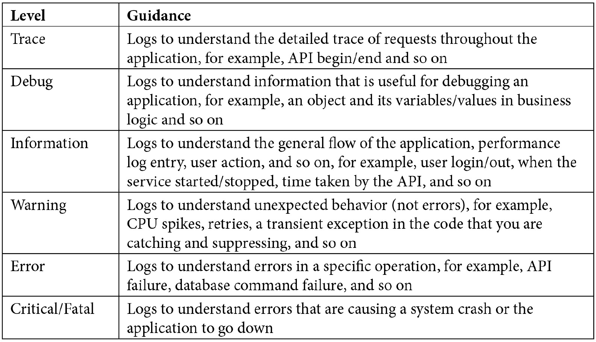
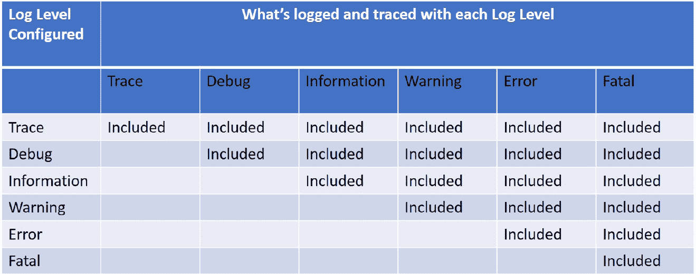
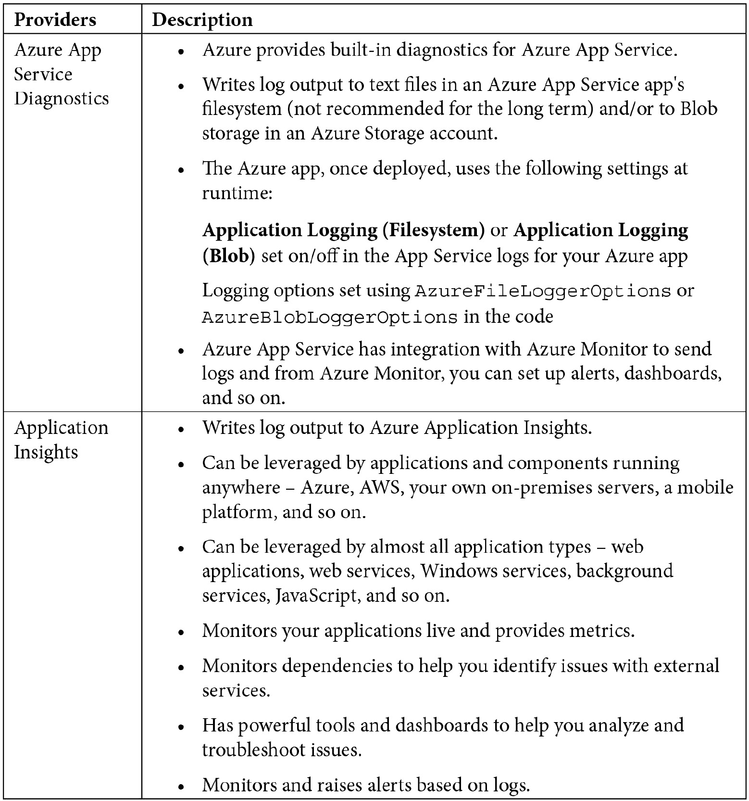
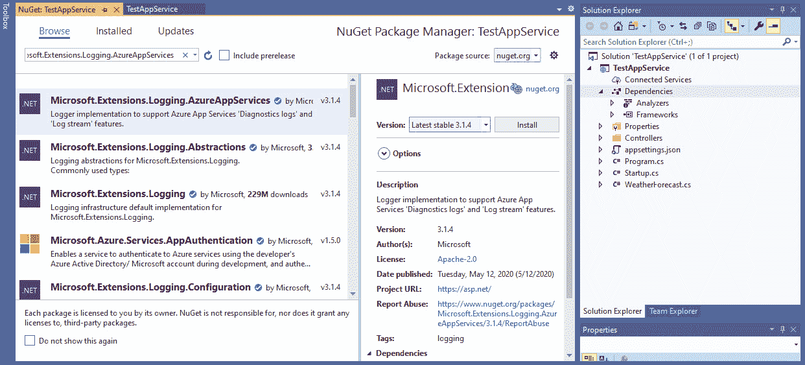
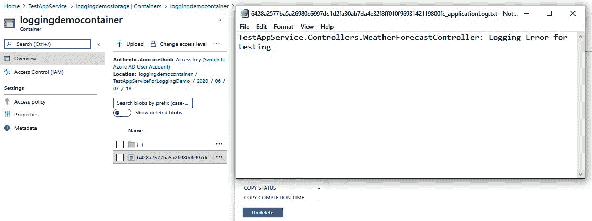
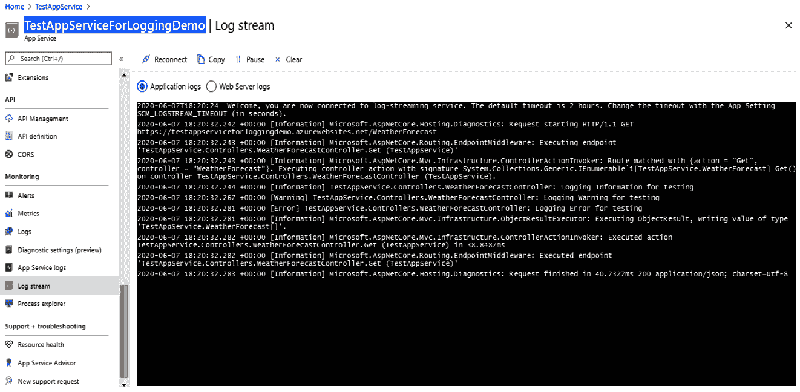
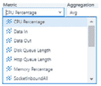
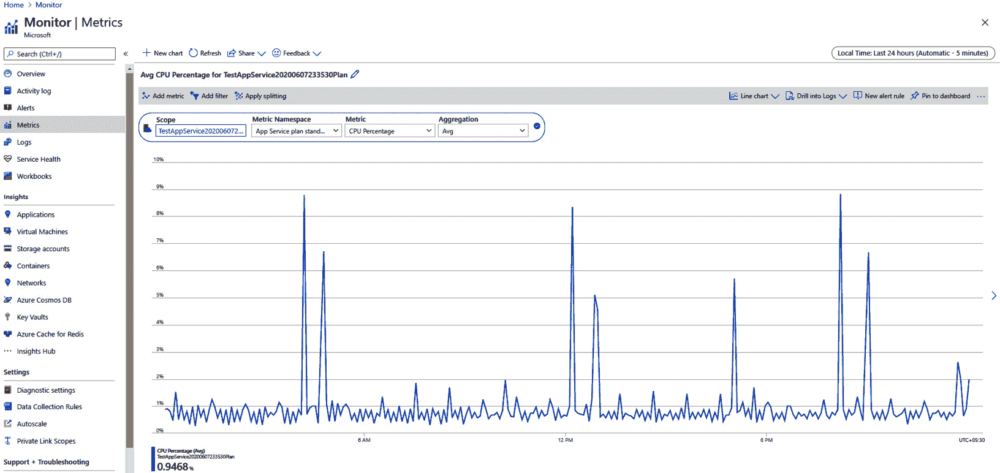
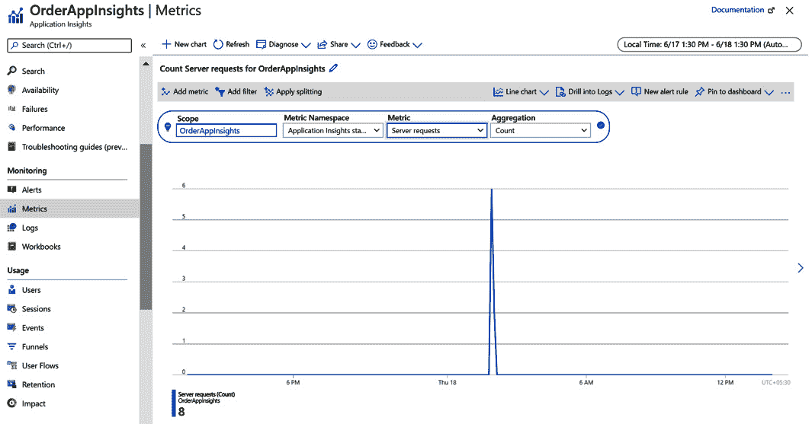
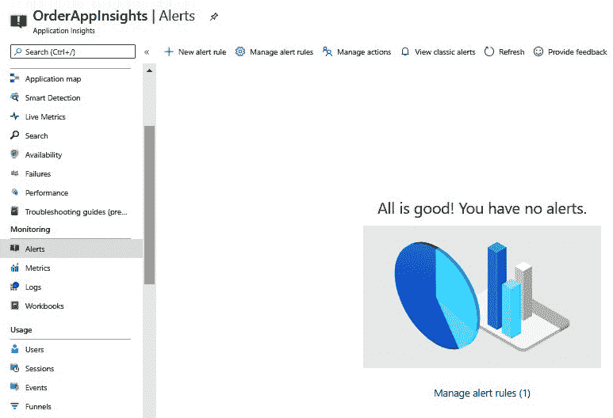

# *第七章*:登录。NET 5

日志记录有助于您在运行时记录应用程序对不同数据的行为，并且您可以控制想要记录的内容和位置。一旦您的功能开发完成，您将在开发 PC 上对其进行彻底的单元测试，将其部署到测试环境中进行彻底的集成测试，然后将其部署到生产环境中，最后，为大量用户开放它。当您将应用程序与开发环境进行比较时，您的应用程序运行的环境(如服务器、数据、负载等)在测试环境和生产环境中是不同的，并且在最初几天，您可能会在测试和生产环境中遇到意想不到的问题。

这就是日志记录在记录运行时端到端流中的不同组件执行它们的功能并相互交互时所发生的事情方面发挥着非常重要的作用。有了可用的日志信息，我们可以调试生产问题，构建非常有用的见解，等等。我们将了解日志记录最佳实践、可用的不同日志记录提供程序，如 Azure App Service 日志记录和 Application Insights 日志记录，并将构建一个可在不同项目中使用的可重用日志记录库。

在本章中，我们将涵盖以下主题:

*   良好测井的特征
*   了解可用的日志记录提供程序
*   使用 Azure 应用服务
*   应用洞察中的实时遥测
*   创建. NET 5 日志类库

在这一章结束时，您将对日志记录有一个很好的了解，并了解一些在进行部署时要应用的 Azure 应用服务和应用洞察的平台级概念。

# 技术要求

对微软的基本了解。NET 和 Azure 是必需的。

章节的代码可以在这里找到:[https://github . com/PacktPublishing/Enterprise-Application-Development-with-C-Sharp-9-and-。NET-5/树/主/第 07 章](https://github.com/PacktPublishing/Enterprise-Application-Development-with-C-Sharp-9-and-.NET-5/tree/master/Chapter07)

以下链接有示例说明:[https://github . com/PacktPublishing/Enterprise-Application-Development-with-C-Sharp-9-and-。NET-5/树/主/企业% 20 应用程序](https://github.com/PacktPublishing/Enterprise-Application-Development-with-C-Sharp-9-and-.NET-5/tree/master/Enterprise%20Application)

# 良好测井的特征

这个问题你看过多少次了？虽然实现了日志记录，但是日志中的信息对于构建见解或调试生产问题并不有用。这就是最佳实践的来源，以便在应用程序中实现良好的日志记录。良好测井的一些特征如下:

*   它不应该影响实际的应用程序性能。
*   应该准确完整。
*   应该利用它进行数据分析和了解应用程序使用情况，例如并发用户、峰值负载时间、使用最多/最少的功能等。
*   它应该有助于我们重现报告的问题以进行根本原因分析，并最大限度地减少“无法重现”的情况。
*   它应该是分布式的，每个人都可以轻松访问，包括开发人员、产品所有者和支持人员。
*   它不应包含受保护或敏感信息、**个人身份信息** ( **PII** )或重复或不必要的日志。

除此之外，它还应该捕获以下一些关键信息:

*   **关联标识**:可用于在日志存储中搜索的问题的唯一标识符。
*   **日志级别**:信息、警告、错误等。
*   **时间戳**:日志条目的时间(始终使用一种约定的标准格式，如 UTC 或服务器时间，不要两者兼而有之)
*   **用户信息**:用户 ID、角色等。
*   **消息**:要记录的消息。这可能是信息或自定义错误消息、实际异常消息或自定义和实际错误消息的组合。
*   **机器/服务器/实例名称**:负载均衡器中可能有多台服务器。这将有助于我们找到日志发生的服务器。
*   **组件**:日志发生的组件名称。

你想录什么？这是图中出现对数级引导的地方:



表 7.1

日志级别是可配置的，基于指定的级别；它将从该指定级别启用到所有更高的级别。例如，如果您在配置中将日志级别指定为**信息**，则来自**信息**、**警告**、**错误**、**致命**的所有日志消息都将被记录，而**调试**和**跟踪**消息将不会被记录，如下表所示。如果没有指定日志级别，日志默认为**信息**级别:



表 7.2

你想在哪里录音？这就是日志提供者进入画面的地方。让我们在下一节看看它们。

# 了解可用的日志记录提供程序

。NET 5 支持多个内置日志提供者以及多个第三方日志提供者。这些提供程序公开的 API 有助于将日志输出写入不同的源，例如提供程序支持的文件或事件日志。您的代码还可以启用多个提供程序，这在您从一个提供程序转移到另一个提供程序时是非常常见的情况，在这种情况下，您可以保留旧的提供程序，监视新的提供程序，一旦您做好了，就可以停用旧的提供程序。让我们详细讨论这两种类型的提供者。

## 内置日志记录提供程序

所有内置日志提供程序都在`Microsoft.Extensions.Logging`命名空间中支持。让我们看看其中的一些:




表 7.3

## 第三方日志记录提供商

而。NET 5 提供了多个强大的内置日志提供者，它还支持第三方日志提供者。我们来看看他们:


表 7.4

在简单了解了多个内置和第三方提供商之后，让我们在下一部分深入了解一下 Azure 应用服务和应用洞察。

# 使用 Azure 应用服务

在**基础设施即服务** ( **IaaS** )托管模型中，您可以完全控制安装在机器上的操作系统和软件。这与我们许多人习惯的内部部署非常相似。您可以通过远程桌面访问服务器，浏览 IIS 日志、窗口事件查看器或文件等。当您转移到**平台即服务** ( **PaaS** )托管模型时，Azure 完全负责管理实例。这有助于节省大量时间，因为您的工程师不必花费时间来管理服务器以保持操作系统、基础架构和安全更新的最新状态。

在本节中，我们将了解在 Azure 应用服务计划(微软的 PaaS 产品之一)中部署应用时，如何进行大量的日志记录和监控。

## 在 Azure 应用服务中启用应用日志

要启用应用程序日志记录，您需要执行以下步骤:

1.  Install the `AzureAppServices` package in any of your existing .NET 5 projects using the `dotnet add <.csproj> package <Nuget package> -v <Version number>` command, as shown:

    

    图 7.1–从命令行界面安装软件包

    您可以获得更多关于的详细信息。来自[https://docs.microsoft.com/en-us/dotnet/core/tools/dotnet](https://docs.microsoft.com/en-us/dotnet/core/tools/dotnet)的命令行界面命令。

    您也可以右键单击项目中的**依赖项**，并选择**管理 NuGet 包**。搜索找到`Microsoft.Extensions.Logging.AzureAppServices`包并安装，如下图截图所示:

    

    图 7.2–从集成开发环境安装软件包

2.  **配置记录器**:在你的`Program.cs`文件中。NET 5 app，在`CreateHostBuilder`方法中添加以下高亮显示的代码。`CreateHostBuilder`为我们正在开发的应用程序进行默认配置。让我们在这里添加日志配置，其中还将动态注入`_logger`(使用**依赖注入** ( **DI** )发生对象创建，如中 [*第 5 章*](05.html#_idTextAnchor110) 、*依赖注入所述。NET* ):

    ```cs
    public static IHostBuilder CreateHostBuilder(string[] args) =>
                Host.CreateDefaultBuilder(args)
                    .ConfigureLogging(logging => 
     logging.AddAzureWebAppDiagnostics())
                    .ConfigureWebHostDefaults(webBuilder 
                     =>
                    {
                        webBuilder.UseStartup<Startup>();
                    });
    ```

3.  **添加日志**:在核心逻辑所在的任何控制器中，将以下日志代码添加到您的方法中，以测试日志是否工作:

    ```cs
    {
    //Removed code for brevity
                _logger.LogInformation("Logging 
                 Information for testing");
                _logger.LogWarning("Logging Warning for 
                 testing");
                _logger.LogError("Logging Error for 
                 testing");
    //Removed code for brevity
    }
    ```

4.  **发布你的应用**:将你的应用服务发布到名为`TestAppServiceForLoggingDemo`的 Azure 资源组。关于如何发布的更多信息，请参考[https://docs . Microsoft . com/en-us/visualstudio/deployment/quick start-deploy-to azure？view=vs-2019](https://docs.microsoft.com/en-us/visualstudio/deployment/quickstart-deploy-to-azure?view=vs-2019) 。
5.  **Enable logging**: Go to the Azure portal | **Your subscription** | **Resource Group** | **App service** where it is deployed, and select **App Service logs** under **Monitoring**. You can see different logging options, as shown:

    

    图 7.3–应用服务日志默认状态

    所有日志选项默认关闭，如上一张截图所示。让我们看看这些选项是什么:

    *   **应用程序日志记录(文件系统)**:将日志消息从应用程序写入网络服务器上的本地文件系统。一旦您打开它，它将被启用 12 小时，之后将被自动禁用。因此，此选项用于临时调试目的。
    *   **应用程序日志记录(Blob)** :将日志消息从应用程序写入 Blob 存储，以便在配置的保留期内保留日志。登录 blobs 是为了长期调试。您需要一个 Blob 存储容器来写入日志。您可以在这里阅读更多关于 Blob 存储容器的信息:[https://docs . Microsoft . com/en-us/azure/storage/Blobs/storage-Blobs-简介](https://docs.microsoft.com/en-us/azure/storage/blobs/storage-blobs-introduction)。一旦您在上选择**，您将获得创建新存储帐户或搜索现有存储帐户的选项，您可以在其中写入日志。点击 **+存储账号**，指定名称新建账号，如下图截图所示:**


图 7.4–存储帐户配置

*   **网络服务器日志记录** : IIS 登录提供诊断信息的服务器，如 HTTP 方法、资源 URI、客户端 IP、客户端端口、用户代理和响应代码。您可以将日志存储在 Blob 存储区或文件系统中。在**保留期(天数)**中，您可以配置日志应该保留的天数。
*   **详细错误消息**:服务器传来的 HTTP 400 响应的详细错误消息，可以帮助你判断服务器为什么会返回这个错误。*出于安全原因，我们不会在生产中向客户端发送详细的错误页面，但是应用服务可以在每次出现 HTTP 代码为 400 或更高的应用错误时将此错误保存在文件系统中*。
*   **失败请求跟踪**:失败请求的详细信息，包括 IIS 跟踪等。对于每个失败的请求，都会生成一个包含 XML 日志文件和 XSL 样式表的文件夹来查看日志文件。

以下屏幕截图显示了当您打开并启用所有日志选项时的外观:


图 7.5–应用服务日志已启用

1.  您可以通过浏览应用程序服务上托管的网站并导航到登录控制器的页面，从我们启用的任何日志选项中验证日志。例如，让我们通过访问 Blob 存储来检查**应用程序日志记录(Blob)** ，在该存储中我们配置了一个日志记录选项，如下图所示:



图 7.6–Blob 存储中的应用服务日志

您还可以从我们添加测试日志的控制器中实时查看日志流中的日志，方法是导航至**监控**下的**日志流**:



图 7.7–日志流中的应用服务日志

我们看到了如何在 Azure 应用服务中启用不同的日志，并在**应用日志记录(Blob)** 和日志流中验证了日志。在下一节中，我们将了解如何监控和发出警报。

## 使用指标进行监控

您可以使用 Azure Monitor 中的指标来监控您的应用服务计划和应用服务。

导航到您的应用服务计划并查看概述，如下图所示。您可以看到 CPU、内存、数据输入、数据输出等的标准图表:


图 7.8–应用服务计划概述

现在，点击任一图表，例如**中央处理器百分比**图表。您将获得如下截图所示的视图(默认持续时间为 1 小时):


图 7.9–应用服务指标概述

我在上一张截图所示的图表中强调了三个重要部分。让我们讨论一下:

*   **当地时间**:点击**当地时间**，会出现如下截图所示的选项。您可以更改此图表应该代表的时间范围的值:


图 7.10–应用服务指标时间范围

*   **添加度量**:点击**添加度量**，会得到如下截图所示的选项。您可以选择希望图表显示的指标:



图 7.11–应用服务–添加指标

*   **锁定仪表盘**:可以点击**锁定仪表盘**将图表添加到仪表盘，这样在登录 Azure 门户时就可以看到更新。

当您点击左侧门户菜单时，您可以看到**仪表盘**，您可以点击该菜单查看所有固定仪表盘:


图 7.12–仪表板的左侧门户菜单选项

您也可以在门户菜单| **所有服务**中搜索或前往**搜索资源、服务和文档**并导航至**监视器**，您将进入以下屏幕:


图 7.13–Azure 显示器概述

从门户菜单中选择**指标**刀片，它将显示以下选项，您可以在其中为订阅下的任何资源确定指标范围:


图 7.14–Azure 监控指标

我们可以在**中选择 Azure 服务计划选择一个我们一直用于日志演示的范围**，选择您想要监控的任何指标(如下图所示):



图 7.15–选择了范围的 Azure 监视器指标

基本上，这与我们在*图 7.8* 中看到的应用服务计划概述指标中 Monitor 提供的指标数据相同。在下一节中，我们将添加警报。

## 使用指标发出警报

要添加警报，单击左侧菜单中的**警报**刀片，您将看到以下屏幕:


图 7.16–Azure 监视器警报

点击 **+新的提醒规则**，您需要完成以下四个步骤来创建提醒:

1.  **范围**:选择您想要监控的目标资源。
2.  **条件**:通过选择一个信号并定义其逻辑，配置警报规则何时触发。
3.  **动作组**:动作组是通知或动作的集合。每个操作都由以下属性组成:
    *   **名称**:动作组内的唯一标识符
    *   **动作类型**:执行的动作–示例包括发送语音呼叫、短信或电子邮件，或者触发各种类型的自动动作
    *   **细节**:对应的细节，因*动作类型*而异
4.  **预警规则详细信息**:提供您的预警规则的详细信息，以便您以后识别和管理。

我已经选择了应用服务，并完成了前面的步骤，如下图所示。您可以对您的应用服务计划以及任何 Azure 资源进行同样的操作:


图 7.17–配置的 Azure 监视器警报

当平均响应时间超过 5 秒时，您将收到电子邮件警报。这只是一个示例警报。您可以查看所有指标和警报，并根据应用程序和客户端的需求进行配置。

当您考虑 Azure 应用程序服务时，Azure 应用程序服务日志以及 Azure 监视器指标和警报是一个很好的选择。在下一节中，我们将看看 Azure Application Insights 提供商，这是我最喜欢的遥测技术之一，现在每个人都大量使用。

# Azure 应用洞察中的实时遥测

Application Insights 是微软 Azure 为开发人员和 DevOps 专业人员提供的最佳遥测产品之一，作为可扩展的“T2”应用程序性能管理“T3”(“T4”APM“T5”)服务，可实现以下功能:

*   监控您的实时应用程序。
*   自动检测性能异常。
*   包括强大的分析工具来帮助您诊断问题。
*   了解用户如何使用您的应用程序。
*   帮助您不断提高性能和可用性。

有了 Application Insights，我觉得不需要任何其他日志记录提供程序，因为它非常强大，可以满足所有目的。我们将在企业应用程序代码以及遥测中大量使用这一点。

`Microsoft.Extensions.Logging.ApplicationInsights`作为`Microsoft.ApplicationInsights.AspNetCore`的从属关系包含在内。`Microsoft.ApplicationInsights.AspNetCore`包用于 ASP.NET 芯遥测应用，使用时不需要安装`Microsoft.Extensions.Logging.ApplicationInsights`。

如下图所示，您可以在应用程序中安装此软件包，以启用和写入遥测:


图 7.18–遥测应用洞察仪器

注意

对你的 app 性能没有影响。对 Application Insights 的调用是非阻塞的，分批在不同的线程中发送。

## 在应用洞察中启用应用日志记录

使用应用程序洞察时，启用应用程序日志的步骤如下:

1.  **Installing the** `ApplicationInsights` **package**: Install the `Microsoft.ApplicationInsights.AspNetCore` package from **Tools** | **NuGet Package Manager** | **Package Manager Console** as shown, using this command: `Install-Package <Package name> -version <Version number>`:

    

    图 7.19 -从软件包管理器控制台安装软件包

2.  **应用程序设置配置**:安装软件包后，您需要添加一个遥测部分，在`appsettings.json`中更新您的 Azure 应用洞察资源的**仪器键** ( **GUID** )，以便所有遥测数据都写入到您的 Azure 应用洞察资源的中。如果您没有 Azure 应用洞察资源，请创建一个，然后将其添加到`appsettings.json` :

    ```cs
    {
      "Logging": {
        "LogLevel": {
          "Default": "Information",
          "Microsoft": "Warning",
          "Microsoft.Hosting.Lifetime": "Information"
        }
      },
      "Telemetry": {
        "InstrumentationKey": "Your AppInsights Instrumentation Key "
      }
    ```

3.  **启用** `ApplicationInsights` **遥测**:在您的`Startup`类的`ConfigureServices()`方法中，添加高亮显示的代码:

    ```cs
    // This method gets called by the runtime. Use this //method to add services to the container.
            public void 
            ConfigureServices(IServiceCollection services)
            {
               // The following line enables Application //Insights telemetry collection.
               services.AddApplicationInsightsTelemetry();
               services.AddControllers();
            }
    ```

现在，您可以构建和运行应用程序了。开箱后，你会得到很多遥测数据。

导航到**应用洞察** | **概述**，您可以看到任何失败的请求、服务器响应时间和服务器请求，如下图所示:


图 7.20–应用洞察概述

您可以导航至**应用洞察** | **实时指标**获取实时性能计数器，如下图所示:


图 7.21 -应用洞察实时指标

您可以导航至**应用洞察** | **指标**获取不同的指标和图表，如下图中的:



图 7.22–应用洞察指标

可以导航到**应用洞察** | **性能**分析操作时长、依赖响应时间等，如下图所示:


图 7.23–应用洞察性能

您可以导航至**应用洞察** | **失败**并分析操作、失败的请求、失败的依赖项、前三个响应代码、异常类型和依赖项失败，如下图所示:


图 7.24–应用洞察失败

添加监控和警报的步骤与我们在*使用 Azure 应用服务*部分所做的相同。您可以导航至**应用洞察** | **提醒**并开始添加提醒，如下图所示:



图 7.25–应用洞察警报

我们已经看到了开箱即用的遥测和警报。我们如何为信息、错误或警告添加日志？您可以使用记录器(对象创建使用 DI 进行，这在第 5 章*依赖注入中有介绍。NET* )。DI 由第二个(*应用程序设置配置*)和第三个(*启用应用程序洞察遥测*)步骤启用，我们在前面的一组步骤中看到了这些步骤来启用应用程序洞察的登录。出于测试目的，为了查看它是否工作，您可以将以下代码添加到控制器中并运行应用程序:

```cs
[HttpGet]
        public IEnumerable<WeatherForecast> Get()
        { 
    //Removed code for brevity

            _logger.LogWarning("Logging Warning for 
               testing");
            _logger.LogError("Logging Error for testing");
            //Removed code for brevity
```

您可以导航到**应用洞察** | **日志**并检查跟踪，在这里您可以看到已记录的警告和错误，如下图所示:


图 7.26–应用洞察日志

Application Insights 使用起来非常简单，是一个非常强大的日志提供程序。我们看到了它开箱即用的丰富遥测技术，并添加了我们自己的日志。在下一节中，我们将开发一个自定义日志类库。中提供的默认记录器。NET 5 对于您的应用程序遥测来说已经足够了。如果您需要在中默认提供的基础上记录自定义指标和事件。NET 5，您可以利用下面的自定义记录器库。

# 创建. NET 5 日志类库

我们将创建一个类库(DLL)，它将支持 Application Insights 日志记录，如果需要，可以扩展到支持其他来源的日志记录。为此，请执行以下步骤:

1.  创建新的。名为`Logger`的. NET 5 类库。
2.  安装`Microsoft.ApplicationInsights`包。
3.  创建一个名为`ICustomLogger.cs`的新类，并添加以下代码:

    ```cs
    using System;
    using System.Collections.Generic;
    namespace Logger
    {
        public interface ICustomLogger
        {
            void Dependency(string dependencyTypeName, 
             string dependencyName, string data, 
             DateTimeOffset startTime, TimeSpan duration, 
             bool success);
            void Error(string message, IDictionary<string,
              string> properties = null);
            void Event(string eventName, 
            IDictionary<string, string> properties = null,
            IDictionary<string, double> metrics = null);
            void Metric(string name, long value, 
             IDictionary<string, string> properties = 
             null);
            void Exception(Exception exception, 
             IDictionary<string, string> properties = 
             null);
            void Information(string message, 
             IDictionary<string, string> properties = 
             null);
            void Request(string name, DateTimeOffset 
             startTime, TimeSpan duration, string 
             responseCode, bool success);
            void Verbose(string message, 
             IDictionary<string, string> properties = 
             null);
            void Warning(string message, 
             IDictionary<string, string> properties = 
             null);
        }
    }
    ```

4.  Create a new class called `AiLogger.cs` and add the following code:

    ```cs
    using Microsoft.ApplicationInsights;
    using Microsoft.ApplicationInsights.DataContracts;
    using System;
    using System.Collections.Generic;
    namespace Logger
    {
        public class AiLogger : ICustomLogger
        {
            private TelemetryClient client;

            public AiLogger(TelemetryClient client)
            {
                if (client is null)
                {
                    throw new 
                    ArgumentNullException(nameof(client));
                }
                this.client = client;
            }
            public void Dependency(string 
             dependencyTypeName, string dependencyName, 
             string data, DateTimeOffset startTime, 
             TimeSpan duration, bool success)
            {
                this.client.TrackDependency
                 (dependencyTypeName, dependencyName, 
                  data, startTime, duration, success);
            }
            public void Warning(string message, 
             IDictionary<string, string> properties = 
             null)
            {
                this.client.TrackTrace(message, 
                 SeverityLevel.Warning, properties);
            }
            public void Error(string message, 
             IDictionary<string, string> properties = 
             null)
            {
                this.client.TrackTrace(message, 
                 SeverityLevel.Error, properties);
            }
            public void Event(string eventName, 
             IDictionary<string, string> properties = 
             null, IDictionary<string, double> metrics = 
             null)
            {
                this.client.TrackEvent(eventName, 
                 properties, metrics);
            }
            public void Metric(string name, long value, 
            IDictionary<string, string> properties = null)
            {
                this.client.TrackMetric(name, value, 
                 properties);
            }
            public void Exception(Exception exception, 
            IDictionary<string, string> properties = null)
            {
                this.client.TrackException(exception, 
                 properties);
            }
            public void Information(string message, 
            IDictionary<string, string> properties = null)
            {
                this.client.TrackTrace(message, 
                 SeverityLevel.Information, properties);
            }
            public void Request(string name, 
             DateTimeOffset startTime, TimeSpan duration, 
             string responseCode, bool success)
            {
                this.client.TrackRequest(name, startTime, 
                 duration, responseCode, success);
            }
            public void Verbose(string message, 
            IDictionary<string, string> properties = null)
            {
                this.client.TrackTrace(message, 
                 SeverityLevel.Verbose, properties);
            }
        }
    }
    ```

    `AiLogger`使用`TelemetryClient`类，该类向 Azure 应用洞察发送遥测数据。

5.  Build the library, and our custom .NET 5 logger is ready to consume events in your project.

    在接下来的章节中，我们将使用日志库作为我们企业应用程序开发的一部分。在本章提供的示例中，您可以看到我们是如何在`LoggerDemoService`项目中动态注入这个自定义记录器的。

# 总结

在本章中，我们了解了良好日志记录的特征、可用的不同日志记录提供程序(如 Azure App Service 日志记录提供程序和 Azure Application Insights 日志记录提供程序)，以及如何创建可重用的日志记录库。

现在，您已经掌握了有关日志记录的必要知识，这将有助于您在项目中实现可重用的日志记录程序或扩展当前日志记录程序，使其具有正确的日志记录级别和关键信息，以调试问题并对生产数据进行分析。

在下一章中，我们将学习各种缓存数据的技术。NET 5 应用程序，以及各种缓存组件和可与. NET 应用程序集成的可用平台。

# 问题

1.  Which logs highlight when the current flow of execution has stopped due to a failure? These should indicate a failure in the current activity, not an application-wide failure.

    a.警告

    b.错误

    c.批评的

    d.信息

2.  What can be leveraged by applications and components running anywhere, on Azure, AWS, your own on-premises servers, a mobile platform, and so on, for logging?

    a.应用洞察

    b.蔚蓝应用服务

    c .事件日志

    d.serial log(串行日志)

3.  What are the logging options available in Azure App Service?

    a.**应用程序日志(文件系统)**和**应用程序日志(Blob)**

    b.**网络服务器记录**和**详细错误信息**

    c.**请求跟踪失败**

    d.上述全部

4.  Application Insights is an extensible APM service to do which of the following?

    a.监控您的实时应用程序。

    b.自动检测性能异常。

    c.包括强大的分析工具来帮助您诊断问题。

    d.以上所有。