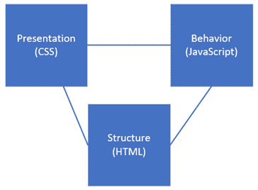
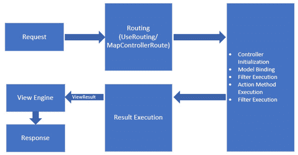
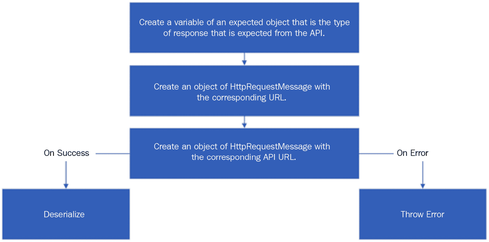
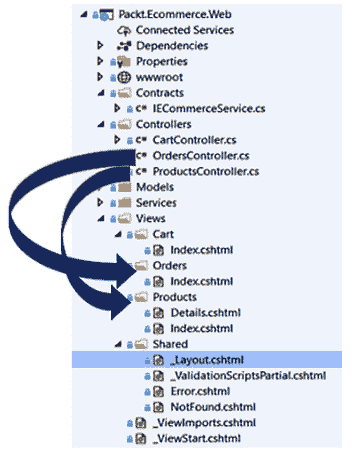
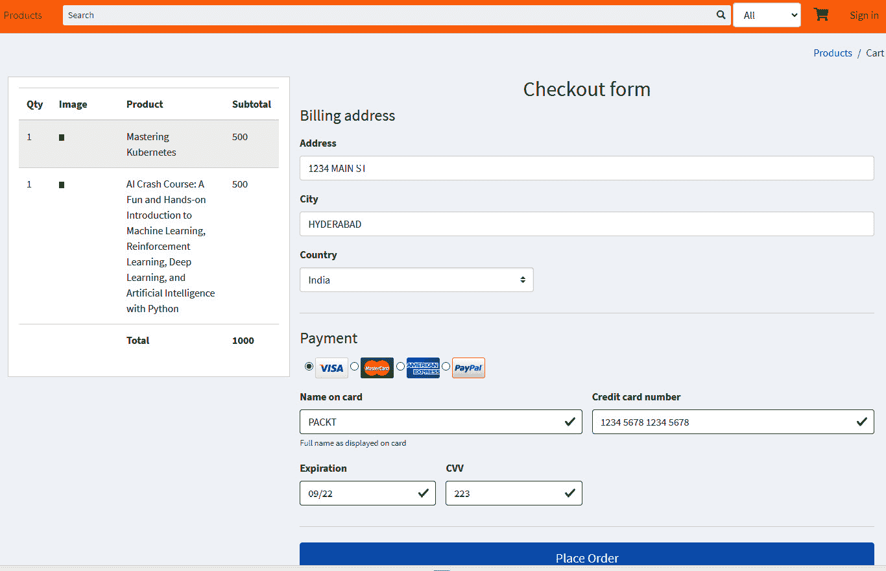
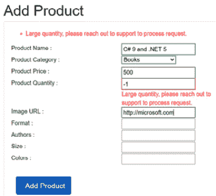

# *第 11 章*:创建 ASP.NET 酷睿 5 网络应用

到目前为止，我们已经构建了应用程序的所有核心组件，如数据访问层和服务层，所有这些组件主要是服务器端组件，也称为后端组件。在这一章中，我们将为我们的电子商务应用程序构建表示层/ **用户界面** ( **UI** )，它也被称为客户端组件。UI 是应用程序的外观；拥有一个好的表示层不仅有助于让用户参与到应用程序中，还能鼓励用户回到应用程序中来。企业应用程序尤其如此，在企业应用程序中，良好的表示层有助于用户轻松浏览应用程序，并帮助他们轻松执行依赖于应用程序的各种日常活动。

在本章中，我们将主要关注理解 ASP.NET 核心 MVC 和使用 ASP.NET 核心 MVC 开发一个网络应用程序。首先，我们将讨论以下主题:

*   前端 web 开发简介
*   将应用编程接口与服务层集成
*   创建控制器和操作
*   使用 ASP.NET 核心 MVC 创建用户界面
*   理解布拉佐

# 技术要求

对于这一章，你需要一个 C#的基础知识。NET 核心、HTML 和 CSS。本章的代码示例可以在这里找到:[https://github . com/PacktPublishing/Enterprise-Application-Development-with-C-Sharp-9-and-and。NET-5/树/主/第 11 章/剃刀样本](https://github.com/PacktPublishing/Enterprise-Application-Development-with-C-Sharp-9-and-.NET-5/tree/master/Chapter11/RazorSample)。

您可以在这里找到更多代码示例:

[https://github . com/PacktPublishing/Enterprise-Application-Development-with-C-Sharp-9-and-。NET-5/树/主/企业% 20 应用程序](https://github.com/PacktPublishing/Enterprise-Application-Development-with-C-Sharp-9-and-.NET-5/tree/master/Enterprise%20Application)

# 前端 web 开发简介

表示层是关于浏览器可以呈现并显示给用户的代码。每当一个页面被加载到浏览器中时，它会创建一个各种元素的层次结构，如文本框和标签，这些元素出现在页面上。这个层次结构被称为**文档对象模型** ( **DOM** )。一个好的前端就是能够根据需要操纵 DOM，并且有许多技术/库支持操纵 DOM 和使用事实上的网络语言 JavaScript 动态加载数据。不管是 jQuery，它简化了 JavaScript 的使用；成熟的客户端框架，如 Angular、React 或 Vue，支持完整的客户端渲染；或者 ASP.NET 核心框架，如 ASP.NET 核心 MVC、Razor Pages 或 Blazor，都归结为处理网络的三大构建块:HTML、CSS 和 JavaScript。让我们看看这三个组成部分:

*   **超文本标记语言** ( **HTML** ): HTML，如完整形式所述，是浏览器可以理解和显示内容的标记语言。它主要由一系列标签组成，这些标签是被称为 **HTML** **元素**，允许开发人员定义页面的结构。例如，如果您想要创建一个需要允许用户输入他们的名字和姓氏的表单，可以通过使用输入的 HTML 元素来定义它。
*   **Cascading Style Sheets** (**CSS**): The presentation layer is all about presenting data in a way that makes a web application more appealing to users and ensures that the application is usable irrespective of the device/resolution that a user tries to load the application in. This is where CSS plays a critical role in defining how the content is displayed on the browser. It controls various things such as the styling of the pages, the theme of the application, and the color palette, and, more importantly, makes it responsive so that users have the same experience using the application, be it loaded on a mobile or a desktop.

    现代网络开发的好处是我们不需要从头开始写所有的东西，并且有很多可用的库可以在应用程序中按原样选择和使用。我们将为电子商务应用程序使用这样一个库，这将在*使用 ASP.NET 核心 MVC* 创建用户界面一节中解释。

*   **JavaScript** : JavaScript 是一种脚本语言，有助于执行各种高级动态操作，例如，验证在表单或事物中输入的输入文本如有条件地启用/禁用 HTML 元素或从 API 中检索数据。JavaScript 为网页提供了更多的功能，并增加了许多编程功能，开发人员可以使用这些功能在客户端执行高级操作。就像 HTML 和 CSS 一样，所有浏览器都可以理解 JavaScript，它构成了表示层的重要组成部分。所有这些组件都可以相互链接，如下图所示:



图 11.1–HTML、CSS 和 JavaScript

注意

HTML、CSS 和 JavaScript 都是齐头并进的，在开发客户端/前端应用程序中发挥着重要作用，需要专门的书籍来全面解释。一些相关链接可以在*进一步阅读*部分找到。

现在我们已经理解了 HTML、CSS 和 JavaScript 的重要性，我们需要知道如何使用它们来构建 web 应用程序的表示层，以便它能够支持多种不同分辨率的浏览器和设备，并且能够管理状态(HTTP 是无状态的)。一种技术是创建所有的网页，并把它们放在网络服务器上；然而，虽然这在静态网站上运行良好，并且还涉及从头开始构建所有内容，但是如果我们希望内容更加动态并且想要丰富的 UI，我们需要使用能够动态生成 HTML 页面并提供无缝支持以与后端交互的技术。在下一节中，让我们来看看可以用来生成动态 HTML 的各种技术。

## Razor 语法

在我们开始理解 ASP.NET 核心提供的各种可能的框架之前，让我们先了解什么是 Razor 语法。将服务器端组件嵌入到 HTML 中是一种标记语法。我们可以使用 Razor 语法绑定任何动态数据进行显示，或者从视图/页面将其发送回服务器进行进一步处理。Razor 语法主要写在 Razor 文件/Razor 视图页面中，这些页面只不过是 C#用来生成动态 HTML 的文件。它们使用`.cshtml`扩展并支持 Razor 语法。Razor 语法由名为**视图引擎**的引擎处理，默认的视图引擎被称为 **Razor 引擎**。

为了嵌入 Razor 语法，我们通常使用`@`，它告诉 Razor 引擎从引擎中解析和生成 HTML。`@`后面可以跟任意 C#内置方法生成 HTML。例如，`<b>@DateTime.Now</b>`可用于在 Razor 视图/页面中显示当前日期和时间。除此之外，就像 C#一样，Razor 语法也支持代码块和控制结构和变量等。下图显示了 Razor 引擎中的一些示例 Razor 语法:


图 11.2–Razor 语法

Razor 语法也支持定义 HTML 控件；例如，要定义文本框，我们可以使用以下 Razor 语法:

```cs
<input asp-for=' FirstName ' />
```

前面的代码被称为`input`标签帮助器，Razor 语法负责处理所谓的**指令**标签帮助器，以将数据绑定到一个 HTML 控件并生成丰富的动态 HTML。让我们简单讨论一下:

*   **Directives**: Under the hood, each Razor view/page is parsed by the Razor engine and a C# class is used to generate dynamic HTML and then sends it back to the browser. Directives can be used to control the behavior of this class, which further controls the dynamic HTML that is generated.

    例如，`@using`指令可用于在 Razor 视图/页面中包含任何名称空间，或者`@code`指令可用于包含任何 C#成员。

    最常用的指令之一是`@model`，它允许您将模型绑定到视图，这有助于验证视图的类型，也有助于智能感知。将视图绑定到特定类/模型的过程被称为**强类型化**视图。我们将在我们的电子商务应用程序中强烈地输入我们所有的视图，我们将在*使用 ASP.NET 核心 MVC* 创建用户界面部分看到。

*   **Tag helpers**: If you used ASP.NET MVC before ASP.NET Core, you would have come across HTML helpers, which are classes that help to bind data and generate HTML controls.

    然而，对于 ASP.NET 核心，我们有标签助手，帮助我们将数据绑定到一个 HTML 控件。标签助手相对于 HTML 助手的好处在于，标签助手使用与 HTML 相同的语法，并为可以从动态数据生成的标准 HTML 控件分配附加属性。例如，为了生成一个 HTML 文本框控件，我们通常编写以下代码:

    ```cs
    <input type='text' id='Name' name='Name' value=' Mastering enterprise application development Book'>
    ```

    使用标记助手，这将被重写，如下面的代码所示，其中`@Name`是视图被强类型化到的模型的属性:

    ```cs
    <input type='text' asp-for='@Name'>
    ```

所以，如你所见，这一切都是为了编写 HTML，但利用 Razor 标记来生成动态 HTML。ASP.NETCore 自带很多内置的标签助手，关于它们的更多细节可以在这里找到:

[https://docs . Microsoft . com/en-us/aspnet/core/MVC/view/tag-helper/内置/？view=aspnetcore-5.0](https://docs.microsoft.com/en-us/aspnet/core/mvc/views/tag-helpers/built-in/?view=aspnetcore-5.0)

不要求了解/记住每个标签助手，我们将在开发应用程序 UI 时使用该参考文档。

注意

因为 Razor 语法是标记，所以没有必要知道所有的语法。以下链接可以作为 Razor 语法的参考:

[https://docs . Microsoft . com/en-us/aspnet/core/MVC/view/razor？view=aspnetcore-5.0](https://docs.microsoft.com/en-us/aspnet/core/mvc/views/razor?view=aspnetcore-5.0)

有了这些，让我们看看 ASP.NET 核心中的各种选项，以及开发表示层的其他常见框架。

## 探索剃刀页面

Razor Pages 是使用 ASP.NET 核心实现网络应用的默认方式。Razor Pages 依赖于一个 Razor 文件的概念，该文件可以直接为请求提供服务，并且有一个可选的 C#文件与该 Razor 文件相关联，用于任何额外的处理。可以使用`dotnet new webapp`命令创建一个典型的 Razor 应用程序，生成的项目看起来像下面截图中所示的项目:


图 11.3–剃刀样本页面

如您所见，该项目有 Razor 页面及其相应的 C#文件。在打开任何 Razor 视图时，我们都会看到一个名为`@page`的指令，它有助于浏览页面。所以，比如说`/index`会被路由到`index.cshtml`。重要的是，所有 Razor 页面的顶部都有`@page`指令，并放在`Pages`文件夹中，因为 ASP.NET 核心运行时会在该文件夹中查找所有 Razor 页面。

通过使用另一个名为`@model`的指令，Razor 页面可以进一步与 C#类(也称为`PageModel`类)相关联。以下是`index.cshtml`页面的代码:

```cs
@page
@model  RazorSample.Pages.IndexModel
@{
    ViewData['Title'] = 'Home page';
}
<div class='text-center'>    
    <select name='day' asp-items='Model.WeekDay'></select>
</div>
```

`PageModel`类只不过是一个 C#类，它可以为`GET`和`POST`调用提供特定的方法，这样 Razor 页面上的数据就可以动态获取，比如说，从一个 API 中获取。这个类需要`Microsoft.AspNetCore.Mvc.RazorPages.PageModel`继承，是标准的 C#类，`index.cshtml`的`PageModel`是`index.cshtml.cs`的一部分，如下代码所示:

```cs
public class IndexModel : PageModel
{
    public IndexModel(ILogger<IndexModel> logger)
    {
    }
    public List<SelectListItem> WeekDay { get; set; }
    public void OnGet()
    {
        this.WeekDay = new List<SelectListItem>();
        this.WeekDay.Add(new SelectListItem 
                              {
                                  Value = 'Monday',Text =  'Monday'
                              });
        this.WeekDay.Add(new SelectListItem 
                              {
                                  Value = 'Tuesday',Text =  'Tuesday'
                              });                                  

    }
}    
```

在这里，您可以看到我们正在通过`OnGet`方法填充剃刀页面上使用的附加数据，该方法也称为`PageModel`处理程序，可用于剃刀页面的初始化。像`OnGet`一样，我们可以添加一个`OnPost`处理程序，用于将数据从 Razor 页面提交回`PageModel`并推进该过程。

如果满足以下两个条件，`OnPost`方法将自动绑定`PageModel`类中的所有属性:

*   属性用`BindProperty`属性进行注释。
*   剃刀页面有一个与属性同名的 HTML 控件。

因此，例如，如果我们想在前面的代码中绑定`select`控件的值，我们需要首先向`PageModel`类添加一个属性，如下面的代码所示:

```cs
[BindProperty]
 public string WeekDaySelected { get; set; }
```

然后，使用如下所示的`select`控件的属性名，Razor Pages 会自动将所选值绑定到该属性:

```cs
<select asp-for='WeekDaySelected' asp-items='Model.WeekDay'></select>
```

我们可以为`OnGet`和`OnPost`方法使用异步命名约定，这样如果我们使用异步编程，它们就可以被命名为`OnGetAsync/OnPostAsync`。

Razor Pages 还支持基于动词的调用方法。方法名的模式应遵循`OnPost[handler]/OnPost[handler]Async`惯例，其中`[handler]`是在任何标签助手的`asp-page-handler`属性上设置的值。

例如，以下代码将从相应的`PageModel`类调用`OnPostDelete/OnPostDeleteAsync`方法:

```cs
<input type='submit' asp-page-handler='Delete' value='Delete' />
```

对于服务配置部分，通过将`AddRazorPages`服务添加到 ASP.NET 核心**依赖注入** ( **DI** )容器中，可以使用`Startup`类的`ConfigureServices`方法配置 Razor Pages。此外，在`Configure`方法中，将`MapRazorPages`添加到`endpoints`，如下面的代码所示，这样就可以使用页面的名称请求所有的 Razor 页面:

```cs
app.UseEndpoints(endpoints =>
{
   endpoints.MapRazorPages();
});
```

这就完成了一个简单的 Razor 页面应用程序设置；我们在 [*第 9 章*](09.html#_idTextAnchor177)*中看到了另一个使用数据的示例。NET 5* ，使用 Razor Pages 从数据库中检索数据，使用**实体框架核心**。

Razor Pages 是 ASP.NET Core 开发网络应用程序最简单的形式；然而，对于开发能够处理复杂特性的 web 应用程序的更结构化的形式，我们可以使用 ASP.NET Core MVC。让我们在下一节探索使用 ASP.NET 核心 MVC 开发网络应用。

## 探索 ASP.NET 核心 MVC 网站

顾名思义，ASP.NET Core MVC 是基于 [*第 10 章*](10.html#_idTextAnchor202)*中讨论的 MVC 模式，创建一个 ASP.NET Core 5 Web API*，是 ASP.NET Core 中的一个框架来构建 Web 应用。我们在 [*第 10 章*](10.html#_idTextAnchor202)*创建 ASP.NET 核心 5 Web API* 中看到，ASP.NET 核心 Web API 也使用了 MVC 模式；不过，ASP.NET Core MVC 也支持视图显示数据。底层的设计模式是相同的，我们有一个保存数据的模型，一个传输数据的控制器，以及呈现和显示数据的视图。

ASP.NET 核心 MVC 支持在第 10 章[](10.html#_idTextAnchor202)**中讨论的创建 ASP.NET 核心 5 网络应用编程接口*的所有功能，如路由、DI、模型绑定和模型验证，并使用与使用`Program`和`Startup`类相同的自举技术。像网络应用编程接口，。NET 5/应用服务在`Startup`类的`ConfigureServices`方法中配置，中间件在`Configure`方法中注入。*

 *与 MVC 的一个关键区别是视图的额外加载，为此我们需要在`Startup`类的`ConfigureServices`方法中使用`AddControllersWithViews`而不是`AddControllers`。下图显示了一个示例:



图 11.4–MVC 请求生命周期

`AddControllersWithViews`主要负责加载视图和处理控制器发送的数据，但最重要的是，它负责配置 Razor 引擎服务，该服务用于处理视图中的 Razor 语法并生成动态 HTML。

ASP.NET 核心 MVC 中的控制器动作需要根据 URL 中传递的动作名称进行路由，因此在路由部分，我们配置`MapControllerRoute`并传递一个模式给它，而不是调用`MapController`。因此，`UseEndpoints`中间件中的默认路由配置如下代码片段所示:

```cs
app.UseEndpoints(endpoints =>
{
endpoints.MapControllerRoute(
name: 'default',
pattern: '{controller=Products}/{action=Index}/{id?}');
});
```

这里，在模式中，我们告诉中间件，URL 的第一部分应该是一个`controller`名称，后面是动作名称和一个可选的`id`参数。如果 URL 中没有传递任何内容，则默认路由为`ProductsController`的`Index`动作方法。因此，首先，这是我们在 [*第 10 章*](10.html#_idTextAnchor202)*中讨论的基于约定的路由，创建 ASP.NET 核心 5 网络应用编程接口*。

就像 Razor Pages 一样，ASP.NET Core MVC 应用中的视图支持 Razor 语法，允许强类型视图；也就是说，视图可以绑定到模型进行类型检查，模型属性可以与支持编译时 IntelliSense 的 HTML 控件相关联。

由于 ASP.NET 核心 MVC 为应用程序提供了更多的结构，我们将使用 ASP.NET 核心 MVC 进行我们的表示层开发，并在后续章节中实现表示层时详细讨论。

## 了解单页应用

**单页应用**，俗称 **SPAs** ，是可以在客户端生成动态 HTML 的应用，大多使用 JavaScript。在 SPAs 中，应用程序通常在浏览器内部工作，支持从服务器加载数据并导航到应用程序中的各个页面，而无需重新加载页面，这主要是它们被称为*单页*应用程序的原因。

通常，这类应用程序会将所有必需的 HTML、CSS 和 JavaScript 下载到浏览器中，然后加载页面。服务器所需的任何动态内容都是根据需要请求的，动态 HTML 是在客户端使用预加载的 JavaScript 生成的，并在同一页面中呈现，而无需完全刷新浏览器。React、Vue.js、Angular 和 Ember 是我们可以用来开发 SPa 的几个这样的框架。SPAs 发展很快，如果开发团队在这些框架中的任何一个都有技能，那么 SPAs 应该是开发表示层的首选。然而，由于我们将使用 ASP.NET 核心 MVC 开发表示层，我们将不讨论 spa 的细节，它们本身需要一本专门的书。不过，一些相关的链接可以在*进一步阅读*部分进行探索。

注意

选择哪种技术进行前端开发一直是一个常见的问题。以下链接有一些关于这个主题的建议:[https://docs . Microsoft . com/en-us/dotnet/architecture/modern-web-apps-azure/在传统 web 和单页应用之间进行选择](https://docs.microsoft.com/en-us/dotnet/architecture/modern-web-apps-azure/choose-between-traditional-web-and-single-page-apps)。在选择前端技术之前，应评估所有利弊，因为没有一刀切的要求。

有了这个基础，让我们进入下一部分，我们将开始将到目前为止开发的后端 API 与我们的表示层进行集成。

# 将 API 与服务层集成

在这一部分，我们将开发`Packt.Ecommerce.Web`ASP.NET 核心 MVC 应用程序，这是通过添加`ASP.NET Core web application(Model-View-Controller)`模板创建的。由于我们已经开发了表示层所需的各种应用编程接口，我们将首先构建一个包装类，用于与这些应用编程接口进行通信。

这是一个单独的包装类，将用于与各种 API 通信，所以让我们为这个类创建契约。

为了简单起见，我们将把需求限制在电子商务应用程序中最重要的工作流，如下所示:

*   登录页面，检索系统中的所有产品，并允许用户搜索/过滤产品。
*   查看产品的详细信息，添加到购物车，以及向购物车添加更多产品的能力。
*   完成订单并查看发票。

为了遵循更结构化的方法，我们将把不同的类和接口分离到不同的文件夹中。让我们看看如何:

1.  首先，让我们在`Packt.Ecommerce.Web`项目中添加一个`Contracts`文件夹，并添加一个名为`IECommerceService`的界面。该界面将有以下方法:

    ```cs
    // Method to retrieve all products and filter.
    Task<IEnumerable<ProductListViewModel>> GetProductsAsync(string filterCriteria = null);
    // Method to get details of specific product.
    Task<ProductDetailsViewModel> GetProductByIdAsync(string productId, string productName);
    // Method to create and order, this method is primarily used to create a cart which is nothing but an order with order status as 'Cart'.
    Task<OrderDetailsViewModel> CreateOrUpdateOrder(OrderDetailsViewModel order);
    // Method to retrieve order by ID, also used to retrieve cart/order before checkout.
    Task<OrderDetailsViewModel> GetOrderByIdAsync(string orderId);
            Task<InvoiceDetailsViewModel> GetInvoiceByIdAsync(string invoiceId);
    // Method to submit cart and create invoice.
    Task<InvoiceDetailsViewModel> SubmitOrder(OrderDetailsViewModel order); 
    // Method to retrieve invoice details by Id.
    Task<InvoiceDetailsViewModel> GetInvoiceByIdAsync(string invoiceId);
    ```

2.  现在，让我们添加一个名为`Services`的文件夹，并添加一个名为`EcommerceService`的类。这个类将继承`IECommerceService`并实现所有的方法。
3.  As we need to call various APIs, we need to make use of the **HttpClient factory** as mentioned in [*Chapter 10*](10.html#_idTextAnchor202), *Creating an ASP.NET Core 5 Web API*. All the API URLs are maintained in the application settings, hence we will also populate `Packt.Ecommerce.Common.Options.ApplicationSettings` using the `options` pattern.

    `Startup`类的`ConfigureServices`方法将为我们的 MVC 应用程序配置以下服务:

    *   `AddControllersWithViews`:为 ASP.NET Core MVC 注入必要的服务，使用控制器和视图。
    *   `ApplicationSettings`:使用`IOptions`模式配置`ApplicationSettings`类，代码如下:

        ```cs
        services.Configure<ApplicationSettings>(this.Configuration.GetSection('ApplicationSettings'));
        ```

    *   `AddHttpClient`:这将注入`System.Net.Http.IHttpClientFactory`和相关类，允许我们创建一个`HttpClient`对象。此外，我们将配置重试策略和断路策略，如 [*第 10 章*](10.html#_idTextAnchor202)*创建 ASP.NET 核心 5 网络应用编程接口*中所述。
    *   使用将`EcommerceService`映射到`IECommerceService`。NET 核心 DI 容器。
4.  使用以下代码配置应用洞察:

    ```cs
    string appinsightsInstrumentationKey = this.Configuration.GetValue<string>('AppSettings:InstrumentationKey');
    if (!string.IsNullOrWhiteSpace(appinsightsInstrumentationKey))
                {
                    services.AddLogging(logging =>
                    {                                       logging.AddApplicationInsights(appinsightsInstrumentationKey);
                    });                services.AddApplicationInsightsTelemetry (appinsightsInstrumentationKey);
                }
    ```

继续到中间件，除了默认路由中间件之外，我们将使用`Startup`类的`Configure`方法注入以下中间件:

*   `UseStatusCodePagesWithReExecute`:该中间件用于重定向到自定义页面，而不是`500`错误代码。我们将在下一节的`ProductController`中添加一个方法，该方法将被执行并基于错误代码加载相关视图。这个中间件以一个字符串作为输入参数，无非是出错时应该执行的路由，为了传递错误代码，它允许一个`{0}`的占位符。因此，中间件配置如下所示:

    ```cs
    app.UseStatusCodePagesWithReExecute('/Products/Error/{0}');
    ```

*   **Error handling**: As for the presentation layer, unlike with the API, we need to redirect users to a custom page that in the case of runtime failures has relevant information, such as a user-friendly failure message and a relevant logging ID that can be used to retrieve the actual failure at a later stage. However, in the case of a development environment, we can show the complete error along with the stack. So, we will configure two middlewares as shown in the following code:

    ```cs
    {
    if (env.IsDevelopment())
        app.UseDeveloperExceptionPage();
    }
    else
    {
        app.UseExceptionHandler('/Products/Error/500');
    }
    ```

    在这里，我们可以看到，对于开发环境，我们使用的是`UseDeveloperExceptionPage`中间件，它将加载完整的异常堆栈跟踪，而对于非开发环境，我们使用的是`UseExceptionHandler`中间件，它走的是需要执行的错误动作方法的路径。此外，这里我们不需要定制的错误处理中间件，因为 ASP.NET 核心中间件负责将详细的错误记录到日志提供者，在我们的例子中是 Application Insights。

*   **使用 StaticFiles** :为了允许各种静态文件，比如 CSS、JavaScript、图像和任何其他静态文件，我们不需要经过整个请求管道，这就是这个中间件发挥作用的地方，它允许服务静态文件，并支持短路静态文件管道的其余部分。

回到`EcommerceService`类，我们首先定义这个类的局部变量和构造函数，它将使用以下代码注入`HTTPClient`工厂和`ApplicationSettings`:

```cs
private readonly HttpClient httpClient;
private readonly ApplicationSettings applicationSettings;
public ECommerceService(IHttpClientFactory httpClientFactory, IOptions<ApplicationSettings> applicationSettings)
{
 NotNullValidator.ThrowIfNull(applicationSettings, nameof(applicationSettings));
 IHttpClientFactory httpclientFactory = httpClientFactory;
 this.httpClient = httpclientFactory.CreateClient();
 this.applicationSettings = applicationSettings.Value;
}
```

现在，为了按照我们的`IECommerceService`接口实现方法，我们将对获取 API 使用以下步骤:



图 11.5–获取对应用编程接口的调用

基于上图中的步骤，`GetProductsAsync`的实现主要用于为登录页面检索产品，并在进行产品搜索时应用任何过滤器，如下代码所示:

```cs
public async Task<IEnumerable<ProductListViewModel>> GetProductsAsync(string filterCriteria = null)
{
    IEnumerable<ProductListViewModel> products = new List<ProductListViewModel>();
    using var productRequest = new HttpRequestMessage(HttpMethod.Get, $'{this.applicationSettings.ProductsApiEndpoint}?filterCriteria={filterCriteria}');
    var productResponse = await this.httpClient.SendAsync(productRequest).ConfigureAwait(false);
    if (!productResponse.IsSuccessStatusCode)
    {        await this.ThrowServiceToServiceErrors(productResponse).ConfigureAwait(false);
    }
    if (productResponse.StatusCode != System.Net.HttpStatusCode.NoContent)
    {
        products = await productResponse.Content.ReadFromJsonAsync<IEnumerable<ProductListViewModel>>().ConfigureAwait(false);
    }
    return products;
}
```

对于的`POST`/`PUT`API，我们会有类似的步骤稍加修改，如下图所示:


图 11.6–调用应用编程接口后

基于这一点，主要用来创建购物车的`CreateOrUpdateOrder`的策略实现如下代码所示:

```cs
public async Task<OrderDetailsViewModel> CreateOrUpdateOrder(OrderDetailsViewModel order)
{
    NotNullValidator.ThrowIfNull(order, nameof(order));
    using var orderRequest = new StringContent(JsonSerializer.Serialize(order), Encoding.UTF8, ContentType);
    var orderResponse = await this.httpClient.PostAsync(new Uri($'{this.applicationSettings.OrdersApiEndpoint}'), orderRequest).ConfigureAwait(false);
    if (!orderResponse.IsSuccessStatusCode)
    {
        await this.ThrowServiceToServiceErrors(orderResponse).ConfigureAwait(false);
    }
    var createdOrder = await orderResponse.Content.ReadFromJsonAsync<OrderDetailsViewModel>().ConfigureAwait(false);
    return createdOrder;
}
```

同样，我们将使用上述策略之一并使用相关的 API 端点来实现`GetProductByIdAsync`、`GetOrderByIdAsync`、`GetInvoiceByIdAsync`和`SubmitOrder`。

现在，让我们创建将与`EcommerceService`对话并加载相关视图的控制器和动作方法。

# 创建控制器和动作

我们已经看到路由负责将请求 URI 映射到一个控制器中的一个动作方法，所以让我们进一步了解动作方法是如何加载各自的视图的。正如您已经注意到的，ASP.NET 核心 MVC 项目中的所有视图都是`Views`文件夹的一部分，当动作方法执行完成时，它只是寻找`Views/<ControllerName>/<Action>.cshtml`。

例如，映射到`Products/Index`路线的动作方法将加载`Views/Products/Index.cshtml`视图。这是通过在每个动作方法的末尾调用`Microsoft.AspNetCore.Mvc.Controller.View`方法来处理的。

下面的截图显示了我们的 MVC 应用程序中的一个图片表示:



图 11.7–控制器-视图映射

有额外的重载和辅助方法可以覆盖这种行为，并根据需要路由到不同的视图。在我们谈论这些助手方法之前，就像 Web API 一样，MVC 控制器中的每个动作方法也可以返回`IActionResult`，这意味着我们可以利用助手方法重定向到一个视图。在 ASP.NET 核心 MVC 中，每个控制器都由一个基类`Microsoft.AspNetCore.Mvc.Controller`继承，这个基类带有一些助手方法，通过一个动作方法加载视图由`Microsoft.AspNetCore.Mvc.Controller`类中的以下助手方法处理:

*   `View`:该方法有多个重载，主要是根据控制器名称从`Views`下的文件夹加载视图。例如，在`ProductsController`中调用此方法可以从`Views/Products`文件夹加载任何`.cshtml`文件。此外，它可以采用视图的名称，如果需要可以加载该名称，并支持传递一个对象，该对象可以通过在视图中强有力地键入视图来检索。
*   `RedirectToAction`:虽然`View`方法处理大部分场景，但是也会有需要在同一个控制器或者另一个控制器内调用另一个动作方法的场景，这也是`RedirectToAction`帮忙的地方。此方法附带各种重载，允许我们指定操作方法、控制器方法和对象的名称，操作方法可以接收这些名称作为路由值。

简而言之，为了加载视图并从控制器传递数据，我们将把各自的模型传递给`View`方法，并且根据需要，每当需要调用另一个动作方法时，我们将使用`RedirectToAction`。

现在的问题是如何处理数据检索(`GET`调用)和数据提交(调用)，在 ASP.NET 核心 MVC 中，所有的动作方法都支持使用`HttpGet`和`HttpPost`属性用 HTTP 动词进行标注。以下是一些可用于注释方法的规则:

*   如果我们想要检索数据，那么使用`HttpGet`对动作方法进行注释。
*   如果我们想向一个动作方法提交数据，应该使用`HttpPost`进行注释，相关对象作为该动作方法的输入参数。

通常，需要从控制器向视图发送数据的方法应使用`[HttpGet]`进行注释，需要从视图接收数据以进一步提交到数据库的方法应使用`[HttpPost]`进行注释。

现在，让我们继续添加所需的控制器并实现它们。当我们添加`Packt.Ecommerce.Web`时，它会用默认创建的`HomeController`创建一个`Controllers`文件夹，我们需要删除它。然后我们需要通过右击**控制器**文件夹| **添加** | **控制器** | **MVC 控制器** | **清空**，命名为`ProductsController`、`CartController`和`OrdersController`。

所有这些控制器将具有以下两个共同的属性，一个用于日志记录，一个用于调用`EcommerceService`的方法。它们使用构造函数注入进一步初始化，如下所示:

```cs
private readonly ILogger<ProductsController> logger;
private readonly IECommerceService eCommerceService;
```

现在让我们讨论一下在这些控制器中定义了什么:

*   `ProductsController`:该控制器将包含`public async Task<IActionResult> Index(string searchString, string category)`动作方式，加载默认视图，列出所有产品，进一步支持过滤。还有一种方法`public async Task<IActionResult> Details(string productId, string productName)`，取产品的 ID 和名称，加载指定产品的详细信息。由于这两种方法都用于检索，因此将使用`[HttpGet]`对它们进行注释。此外，该控制器将具有前面讨论的`Error`方法。因为它可以从`UseStatusCodePagesWithReExecute`中间件接收一个错误代码作为输入参数，所以我们将有简单的逻辑来相应地加载视图:

    ```cs
    [Route('/Products/Error/{code:int}')]
    public IActionResult Error(int code)
    {
        if (code == 404)
        {
            return this.View('~/Views/Shared/NotFound.cshtml');
        }
        else
        {
            return this.View('~/Views/Shared/Error.cshtml', new ErrorViewModel { CorrelationId = Activity.Current?.RootId ?? this.HttpContext.TraceIdentifier });
        }
    }
    ```

*   `CartController`:该控制器包含`public async Task<IActionResult> Index(ProductListViewModel product)`动作方法，将产品添加到购物车中，我们将创建一个订单，订单状态设置为`'Cart'`，因为这需要接收数据，并进一步传递给 API，API 将使用`[HttpPost]`进行注释。为了简单起见，这个左边是匿名的，但是可以对登录的用户进行限制。一旦创建了订单，该方法将使用`RedirectToAction`助手方法和重定向到该控制器内的`public async Task<IActionResult> Index(string orderId)`动作方法，该方法进一步将所有产品和结账表单加载到购物车中。这个方法也可以用来直接导航到购物车。
*   `OrdersController`:这是流程中最后一个控制器，包含填写付款明细后提交订单的`public async Task<IActionResult> Create(OrderDetailsViewModel order)`动作方式。该方法将订单状态更新为`Submitted`，然后为订单创建发票，最后重定向到另一个动作方法`public async Task<IActionResult> Index(string invoiceId)`，该动作方法加载订单的最终发票并完成交易。

下图显示了控制器中各种方法之间的流程，以完成购物工作流:


图 11.8–控制器动作方法之间的流程

有了这些知识，让我们设计下一节的视图。

# 使用 ASP.NET 核心 MVC 创建用户界面

到目前为止，我们已经定义了一个与后端 API 通信的服务，并进一步定义了控制器，该控制器将使用模型将数据传递给视图。现在，让我们构建各种视图来呈现数据并呈现给用户。

首先，让我们看看呈现视图所涉及的各种组件:

*   The `Views` folder: All views are part of this folder with each controller-specific view segregated by a subfolder, and finally, each action method is represented by a `.cshtml` file.

    要添加视图，我们可以右键点击动作方法，点击**添加视图**，系统会自动创建一个文件夹(如果还没有的话)，里面有控制器的名字，然后添加视图。此外，在这样做的同时，我们可以指定视图将绑定到的模型。

*   The `Layout` page: This is a common requirement in a web application where we have a common section across the application, such as a header with a menu or left navigation. To have a modular structure for our pages and to avoid any repetition, ASP.Net Core MVC comes with a layout page that is typically named `_Layout.cshtml` and is part of the `Views/Shared` folder. This page can be used as a parent page for all the views in our MVC project. A typical layout page looks like the one shown in the following code:

    ```cs
    <!DOCTYPE html>
    <html lang='en'>
    <head>
        <meta charset='utf-8'>
        <meta name='viewport' content='width=device-width, initial-scale=1'>
        <meta http-equiv='x-ua-compatible' content='ie=edge'>
        <title>Ecommerce Packt</title>
    </head>
    <body class='hold-transition sidebar-mini layout-top-nav'>    
            <!-- Navbar -->        
            <!-- Main content -->        
             @RenderBody()
    </body>
    </html>
    ```

    这里可以看到，它允许我们定义应用程序的骨架布局，然后最后还有一个名为`@RenderBody()`的 Razor 方法，它实际上加载了子视图。要在任何视图中指定布局页面，我们可以使用以下语法，它将`_Layout.cshtml`作为父页面添加到视图中:

    ```cs
    @{
        Layout = '~/Views/Shared/__Layout.cshtml';
    }
    ```

    但是不需要在所有视图中重复这个代码，这就是`_ViewStart.cshtml`派上用场的地方。让我们看看它如何帮助跨视图重用一些代码:

*   `_ViewStart.cshtml`:这是一个通用视图，直接位于`Views`文件夹下，被 Razor 引擎用来执行任何需要在视图中的代码之前执行的代码。因此，通常情况下，这用于定义布局页面，因此，可以将前面的代码添加到该文件中，以便在整个应用程序中应用。
*   `_ViewImports.cshtml`:这是另一个页面，可以用来跨应用程序导入任何通用指令或命名空间。就像`_ViewStart`一样，这个也是直接位于根文件夹下；然而，`_ViewStart`和`_ViewImport`都可以在一个或多个文件夹中，并且它们从根视图文件夹中的文件夹到任何子文件夹中的较低级别的文件夹分层执行。为了使用 Application Insights 启用客户端遥测，我们注入了`JavaScriptSnippet`，如下面的代码所示。我们在中的 [*第 5 章*](05.html#_idTextAnchor110)*中了解了将依赖服务注入视图。NET* 。在下面的代码中，`JavaScriptSnippet`被注入到视图中:

    ```cs
        @inject Microsoft.ApplicationInsights.AspNetCore.JavaScriptSnippet JavaScriptSnippet
    ```

*   `wwwroot`: This is the root folder of the application and all the static resources, such as JavaScript, CSS, and any image files, are placed here. This can further hold any HTML plugins that we want to use in our application. As we have already configured the `UseStaticFiles` middleware in our application, content from the folder can be directly served without any processing. The default template of ASP.NET Core MVC comes with segregation of folders based on their type; for example, all JavaScript files are placed inside a `js` folder, CSS files are placed in a `css` folder, and so on. We will stick to that folder structure for our application.

    注意

    通过右键单击动作方法并使用内置模板自动生成视图的过程被称为**脚手架**，如果您不熟悉 Razor 语法，可以使用该过程。但是，使用支架创建视图或手动将其放置在相应的文件夹中并强有力地键入视图会导致相同的行为。

## 设置管理、布局页面和视图

在整个应用程序中获得相同外观和感觉的一个重要事项是选择正确的造型框架。这样做不仅提供了一致的布局，还简化了响应设计，这有助于以各种分辨率正确呈现页面。我们用于`Packt.Ecommerce.Web`的 ASP.NET 核心 MVC 项目模板开箱即用，Bootstrap 作为其样式框架。我们将进一步扩展到一个名为`AdminLTE`的主题，它带有一些有趣的布局和仪表板，可以插入到我们的表示层中。

让我们执行以下步骤将`AdminLTE`集成到我们的应用程序中:

1.  从这里下载`AdminLTE`的最新版本:[https://github.com/ColorlibHQ/AdminLTE/releases](https://github.com/ColorlibHQ/AdminLTE/releases)。
2.  提取上一步下载的 ZIP 文件，导航至`AdminLTE-3.0.5\dist\css`。复制`adminlte.min.css`并粘贴到`Packt.Ecommerce.Web`的`wwwroot/css`文件夹中。
3.  导航至`AdminLTE-3.0.5\dist\js`。复制`adminlte.min.js`并粘贴到`Packt.Ecommerce.Web`的`wwwroot/js`文件夹中。
4.  导航至`AdminLTE-3.0.5\dist\img`。复制需要的图片，粘贴到`Packt.Ecommerce.Web`的`wwwroot/img`文件夹中。
5.  复制`AdminLTE-3.0.5\plugins`文件夹，粘贴到`Packt.Ecommerce.Web`的`wwwroot`文件夹中。

这样，我们的项目在解决方案探索者中应该如下所示。更多关于`AdminLTE`的信息可以在[https://adminlte.io/docs/2.4/installation](https://adminlte.io/docs/2.4/installation)找到:


图 11.9–管理主题设置

现在，导航到`Views/_Layout.cshtml`页面，删除所有的现有代码，并替换为`Packt.Ecommerce.Web\Views\Shared\_Layout.cshtml`的代码。在高层次上，布局分为以下几个部分:

*   左侧带有主页导航的标题
*   标题中有一个搜索框，中间有一个带有搜索类别的下拉列表
*   右边头部的购物车
*   显示导航的面包屑轨迹
*   使用`@RenderBody()`渲染子视图的部分

完成`AdminLTE`模板集成所需的其他几个关键事项如下:

*   添加在`<head>`标签中定义的以下样式:

    ```cs
    <link rel='stylesheet' href='~/plugins/fontawesome-free/css/all.min.css'>
    <link rel='stylesheet' href='~/css/adminlte.min.css'>
    ```

*   在`<body>`标记的末尾添加以下 JavaScript 文件:

    ```cs
    <!-- REQUIRED SCRIPTS (Order shouldn't matter)-->
    <!-- jQuery -->
    <script src='~/plugins/jquery/jquery.min.js'></script>
    <!-- Bootstrap 4 -->
    <script src='~/plugins/bootstrap/js/bootstrap.bundle.min.js'></script>
    <!-- AdminLTE App -->
    <script src='~/js/adminlte.min.js'></script>
    ```

有了这个，我们将`AdminLTE`主题集成到我们的应用程序中。要使用应用程序 Insights 呈现启用客户端遥测所需的 JavaScript ，请在`_Layout.cshtml`的头标签中添加以下代码:

```cs
    @Html.Raw(JavaScriptSnippet.FullScript)
```

前面的代码注入了从视图中发送遥测数据所需的 JavaScript 以及工具键。与服务器端不同，在客户端，检测密钥是公开的。任何人都可以从浏览器开发工具中看到检测密钥。但这就是客户端遥测的设置方式。此时，风险在于恶意用户或攻击者可能会推送不需要的数据，因为检测密钥具有只写访问权限。如果您希望使客户端遥测更加安全，您可以从服务中公开一个安全的 REST API，并从那里记录遥测事件。您将在 [*第 14 章*](14.html#_idTextAnchor303)*健康与诊断*中了解更多应用洞察功能。

现在，应用程序布局已经准备好了。现在让我们继续定义应用程序中的各种视图。

### 创建产品/索引视图

该视图将用于列出我们的电子商务应用程序上可用的所有产品，并使用`IEnumerable<Packt.Ecommerce.DTO.Models.ProductListViewModel>`模型进行强类型化。它使用`ProductsController`的`Index`动作方法来检索数据。

在这个视图中，我们将使用一个简单的 Razor `@foreach (var item in Model)`循环，对于每个产品，我们将显示产品的图像、名称和价格。该视图的示例如下图所示:


图 11.10–产品视图

在这里，您可以看到布局页面中有一个搜索栏和一个类别下拉列表。点击产品图像将导航至`Products/Details`视图。为了支持该导航，我们将利用`AnchorTagHelper`并将产品标识和名称传递给`ProductsController`的`Details`动作方法，以进一步在`Products/Details`视图中加载产品的详细信息。

### 创建产品/详细信息视图

该视图将根据从`Products/Index`视图传递的产品标识和名称加载产品的详细信息。我们将使用来自`AdminLTE`的示例页面，如下所示:[https://AdminLTE . io/themes/dev/AdminLTE/pages/examples/e _ commerce . html](https://adminlte.io/themes/dev/AdminLTE/pages/examples/e_commerce.html)。

该页面将使用`Packt.Ecommerce.DTO.Models.ProductDetailsViewModel`进行强类型输入，并将显示产品的所有详细信息。下面的截图显示了该页面的示例:


图 11.11–产品详细信息视图

如您所见，这里有一个**添加到购物车**按钮；点击它将为用户创建购物车并将项目添加到该购物车。由于我们案例中的购物车只不过是订单状态设置为`'Cart'`的订单，因此这将调用`CartController`的`Index`动作方法来创建购物车。

为了将数据传递回动作方法，我们将借助`FormTagHelper`，它允许我们将页面包装成 HTML 形式，并使用以下代码指定页面可以提交到的动作和控制器:

```cs
<form asp-action='Index' asp-controller='Cart'>
```

有了这个代码，一旦点击`Submit`类型的**添加到购物车**按钮，页面就会被提交到`CartController`的`Index`动作方法，进一步保存到数据库中。但是，我们仍然需要将产品细节传递回`Index`动作方法，为此，我们将借助`InputTagHelper`为所有需要传递回动作方法的值创建隐藏字段。

这里最重要的是，隐藏变量的名称应该与模型中属性的名称相匹配，因此我们将在表单中添加以下代码，将产品值传递回控制器:

```cs
<input asp-for='Id' type='hidden'>
<input asp-for='Name' type='hidden'>
<input asp-for='Price' type='hidden'>
<input asp-for='ImageUrls[0]' type='hidden'>
```

ASP.NETCore MVC 的模型绑定系统读取这些值，并创建`CartController`的`Index`方法所需的产品对象，该方法进一步调用后端系统来创建订单。

注意

由于 [*第 12 章*](12.html#_idTextAnchor244)*理解认证*将涉及认证，因此对于本章，**添加到购物车**将直接向购物车添加产品。

### 创建购物车/索引视图

该视图将加载购物车详细信息，并将有一个结账表单来填写所有详细信息并完成订单。在这里，我们可以导航回主页添加更多产品或完成订单。

该视图使用`Packt.Ecommerce.DTO.Models.OrderDetailsViewModel`进行强类型化，并使用`OrdersController`的`Index`动作方法加载数据。这里，我们使用的自助结账表单示例来自于[https://getbootstrap.com/docs/4.5/examples/checkout/](https://getbootstrap.com/docs/4.5/examples/checkout/)。

这个表单利用模型验证和 HTML 属性对必需的字段进行验证，我们在 ASP.NET 核心 MVC 标签助手和一些 HTML 助手的帮助下呈现表单。具有模型验证的示例属性如以下代码所示:

```cs
public class AddressViewModel
{
        [Required(ErrorMessage = 'Address is required')]
        public string Address1 { get; set; }       
        [Required(ErrorMessage = 'City is required')]
        public string City { get; set; }
        [Required(ErrorMessage = 'Country is required')]
        public string Country { get; set; }
}
```

由于此表单也需要提交，所以整个表单被包裹在`FormTagHelper`中，如下代码所示:

```cs
<form asp-action='Create' asp-controller='Orders'>
```

要在用户界面上显示这些验证，在我们之前添加的所有其他脚本之后，将以下脚本添加到`_layout.cshtml`中:

```cs
<script src='~/lib/jquery-validation/dist/jquery.validate.min.js'></script>
<script src='~/lib/jquery-validation-unobtrusive/jquery.validate.unobtrusive.min.js'></script>
```

为了显示错误消息，我们可以使用验证消息标记帮助器，如下面的代码片段所示。在服务器端，这可以使用`ModelState.IsValid`进一步评估:

```cs
<input asp-for='ShippingAddress.Address1' class='form-control' placeholder='1234 Main St'/>
<span asp-validation-for='ShippingAddress.Address1' class='text-danger'></span>
```

该页面的示例如下图所示:



图 11.12–购物车和结账页面

我们将使用`InputTagHelper`作为隐藏字段和文本框，将任何附加信息传递回动作方法。文本框的好处是，如果文本框的的`id`属性与属性名匹配，数据将自动传递回动作方法，ASP.NET 核心 MVC 的模型绑定系统将负责将其映射到所需的对象，在这种情况下，该对象是`Packt.Ecommerce.DTO.Models.OrderDetailsViewModel`类型，最终提交订单，生成发票，并重定向到`Orders/Index`动作方法。

注意

在前面的截图中，虽然我们有一个结账表单，其中包括生产应用程序中的支付信息，但我们将与第三方支付网关集成，通常，出于各种安全原因，整个表单位于应用程序的支付网关端。[https://stripe.com/docs/api](https://stripe.com/docs/api)和[https://razor pay . com/docs/支付网关/服务器集成/dot-net/](https://razorpay.com/docs/payment-gateway/server-integration/dot-net/) 就是这样一对帮助支付网关集成的第三方提供商。

### 创建订单/索引视图

最后，我们会看到订单的发票视图，这是一个简单的只读视图，显示从`OrdersController`的`Index`动作方式发送的发票信息。下面的截图显示了该页面的示例:


图 11.13–最终发票

这就完成了各种视图的集成，正如您所看到的，我们将视图限制在电子商务应用程序中最重要的流程中。但是，您可以使用相同的原则进一步添加更多功能。

# 理解布拉佐

Blazor 是一个新的框架，可从。NET Core 3.1 继续开发应用程序的前端层。它是 MVC 和 Razor Pages 的替代品之一，应用模型非常接近 SPA 但是，我们可以用 C#和 Razor 语法编写逻辑，而不是 JavaScript。

用 Blazor 编写的所有代码都放在一个叫做 Razor 组件的东西中，它允许您编写 HTML 以及代码的 C#部分来构建任何网页。Razor 组件带有`.Razor`的扩展，用于表示应用程序；无论是整个网页还是一个小对话框弹出，一切都是作为组件在 Blazor 应用程序中创建的。典型的 Razor 组件看起来像下面代码片段中的组件:

```cs
@page '/counter'
<h1>Counter</h1>
<p>Current count: @currentCount</p>
<button class='btn btn-primary' @onclick='IncrementCount'>Click me</button>
@code {
    private int currentCount = 0;
    private void IncrementCount()
    {        currentCount++;    }
}
```

在这段代码中，我们创建了一个在点击按钮时递增计数器的页面，点击事件的逻辑在 C#代码中处理，它更新了 HTML 中的值。本页面可使用`/counter`相对网址访问。

Blazor 与其他 MVC/Razor Pages 的主要区别在于，与请求-响应模型不同，在请求-响应模型中，每个请求都被发送到服务器，HTML 被发送回浏览器，Blazor 将所有组件打包(就像 SPA 一样)并加载到客户端。当第一次请求应用程序时，对服务器的任何后续调用都是为了检索/提交任何应用编程接口数据或更新 DOM。Blazor 支持以下两种托管模式:

*   **Blazor web assembly**(**WASM**):WASM 是可以在现代浏览器上运行的低级指令，这进一步有助于在没有任何额外插件的浏览器上运行用 C#等高级语言编写的代码。Blazor WASM 托管模型利用了 WASM 给出的开放网络标准，并在浏览器的沙箱环境中运行任何 Blazor WASM 应用程序的 C#代码。在高层次上，所有的 Blazor 组件都被编译成。. NET 程序集和下载到浏览器，WASM 加载。NET Core 运行时并加载所有程序集。它进一步使用 JavaScript 互操作来刷新 DOM 对服务器的唯一调用将是任何后端 API。架构如下图所示:


图 11.14–布拉佐 WASM 托管

*   **Blazor 服务器**:在 Blazor 服务器托管模型中，Blazor 应用程序托管在一个 web 服务器上，在那里进行编译，然后客户端利用 SignalR 从服务器接收更新。为了保持连接的活跃性，Blazor 创建了一个名为`blazor.server.js`的 JavaScript 文件，并使用 SignalR 接收所有的 DOM 更新，这进一步意味着每个用户交互都将有一个服务器调用(尽管很轻)。架构如下图所示:


图 11.15–Blazor 服务器托管

。NET 5 对这两种托管模型都提供了完整的工具支持，都有自己的项目模板，各有利弊，这里进一步说明:[https://docs . Microsoft . com/en-us/aspnet/core/blazor/hosting-models？view=aspnetcore-5.0](https://docs.microsoft.com/en-us/aspnet/core/blazor/hosting-models?view=aspnetcore-5.0) 。

现在让我们使用 Blazor Server 应用程序按照以下步骤创建一个前端应用程序，它允许我们为我们的电子商务应用程序添加/修改产品详细信息:

1.  Add a new Blazor Server application called `Packt.Ecommerce.Blazorweb` to the enterprise solution and add the `Products.razor`, `AddProduct.Razor`, and `EditProduct.razor` Razor components to the `Pages` folder, as shown in the following screenshot:

    

    图 11.16–Blazor 服务器项目

2.  这个项目包含`Program`和`Startup`类，它们与任何其他 ASP.NET 核心应用程序完全一样，只是有一些额外的 Blazor 服务。`_Host.cshtml`是应用程序的根，这个页面接收到对应用程序的初始调用，并用 HTML 进行响应。本页进一步引用了信号连接的`blazor.server.js`脚本文件。另一个重要的组件是`App.Razor`组件，它负责基于网址的路由。在 Blazor 中，任何需要映射到特定 URL 的组件都会在组件的开头有`@page`指令，指定应用程序的相对 URL。`App.Razor`拦截网址并将其路由到指定的组件。所有 Razor 组件都是`Pages`文件夹的一部分，`Data`文件夹附带了一个示例模型和一个在`FetchData.razor`组件中使用的服务。
3.  让我们将以下代码添加到`NavMenu.razor`以将`Products`导航添加到左侧菜单。在这个阶段，如果你运行应用程序，你应该可以看到左侧菜单的`Products`导航；但是，它不会导航到任何页面:

    ```cs
    <li class='nav-item px-3'>
     <NavLink class='nav-link' href='products'>
      <span class='oi oi-list-rich' aria-hidden='true'></span> Products
     </NavLink>
    </li>
    ```

4.  当我们要从 API 中检索数据时，我们需要将`HTTPClient`注入到我们的`Startup`类中，就像在 ASP.NET 核心应用程序中一样。因此，将以下代码添加到`ConfigureServices`方法中，并将`ApplicationSettings:ProductsApiEndpoint`添加到`appsettings.json` :

    ```cs
    services.AddHttpClient('Products', client => {
                    client.BaseAddress = new Uri(Configuration ['ApplicationSettings:ProductsApiEndpoint']);
                });
      'ApplicationSettings': {
        'ProductsApiEndpoint': 'https://localhost:44346/api/products/'
      },
    ```

5.  既然我们要绑定`products`数据，那么就添加`Packt.Ecommerce.DTO.Models`作为`Packt.Ecommerce.Blazorweb`的项目引用。在`Pages`文件夹中，将以下代码添加到`@code`块内的`Products.razor`页面，在该页面中，我们正在使用`IHttpClientFactory`创建一个`HttpClient`对象，该对象将在下一步注入，并使用`OnInitializedAsync`方法检索`products`数据:

    ```cs
    private List<ProductListViewModel> products;
    protected override async Task OnInitializedAsync()
        {
            var client = Factory.CreateClient('Products');
            var result = await client.GetAsync('').ConfigureAwait(false);
            result.EnsureSuccessStatusCode();
            products = new List<ProductListViewModel>();
            products = await result.Content.ReadFromJsonAsync<List<ProductListViewModel>>().ConfigureAwait(false);
        }
    ```

6.  接下来，在`Products.Razor`页面的开始处(在`@code`块之外)添加以下代码。在这里，我们通过`@page`指令到`/products`为该组件设置相对路线。接下来，我们注入`IHttpClientFactory`和其他需要的名称空间，然后添加呈现产品列表的 HTML 部分。如您所见，它是 HTML 和 Razor 语法的混合:

    ```cs
    @page '/products'
    @inject IHttpClientFactory Factory
    @using System.Net.Http.Json;@using Packt.Ecommerce.DTO.Models;
    <h1>Products</h1>
    <div>    <a class='btn btn-info' href='addproduct'><i class='oi oi-plus'></i> Add Product</a> </div>
    @if (products == null)
    { <p><em>Loading...</em></p> }
    else { <table class='table'><thead><tr>
                    <th>Id</th><th>Name</th>
                    <th>Price</th><th>Quantity</th>
                    <th>ImageUrls</th><th></th>
                </tr></thead><tbody>
                @foreach (var product in products)
                {<tr>
                       <td>@product.Id</td>
                        <td>@product.Name</td>
                        <td>@product.Price</td>
                        <td>@product.Quantity</td>
                        <td></td>
                        <td><a class='btn btn-info' href='editproduct/@product.Id/@product.Name'><i class='oi oi-pencil'></i></a></td></tr>
                }
            </tbody></table> }
    ```

此时，如果您运行应用程序，您应该会看到如下截图所示的输出:


图 11.17–产品列表 Blazor 用户界面

接下来，让我们创建`Add/Edit`页面，在其中我们将使用 Blazor 表单。表单可用的一些重要工具/组件如下:

1.  Blazor 表单是使用 Blazor 中称为`EditForm`的现成模板创建的，它可以使用模型属性直接绑定到任何 C#对象。典型的`EditForm`如下代码片段所示。这里，我们定义在表单提交时调用`OnSubmit`方法。让我们把这个加到`AddProduct.razor` :

    ```cs
    <EditForm Model='@product' OnSubmit='@OnSubmit'>
    </EditForm>
    ```

2.  这里，`product`是我们想要使用的模型的对象，在我们的例子中是`Packt.Ecommerce.DTO.Models.ProductDetailsViewModel`。为了将数据绑定到任何控件，我们可以混合使用 HTML 和 Razor 语法，如下面的代码所示。这里，我们将产品对象的`Name`属性绑定到一个文本框，类似地，将`Category`属性绑定到下拉列表。一旦您在文本框中输入任何值或在下拉列表中选择一个值，这些属性中的将自动将其传递回任何后端应用编程接口或数据库。让我们以类似的方式将所有必需的属性添加到 HTML 元素中:

    ```cs
    <InputText id='category' @bind-Value='product.Name'></InputText>
    <InputSelect @bind-Value='product.Category'>
     <option selected disabled value='-1'> Choose Category</option>
     <option value='Clothing'>Clothing</option>
     <option value='Books'>Books</option>
    </InputSelect>
    ```

3.  Blazor 表单支持使用数据注释进行数据验证，因此我们想要绑定到 UI 的任何模型都可以有数据注释，Blazor 会将这些验证应用于属性绑定到的控件。为了应用验证，我们添加了`DataAnnotationsValidator`组件，并且可以使用`ValidationSummary`组件来显示所有验证失败的摘要。我们可以在控制级别进一步使用`ValidationMessage`组件，如下面的代码片段所示:

    ```cs
    <DataAnnotationsValidator />
    <ValidationSummary />
    <InputNumber id='quantity' @bind-Value='product.Quantity'></InputNumber>
    <ValidationMessage For='@(() => product.Quantity)' />
    ```

4.  在`code`组件中，添加一个`ProductDetailsViewModel`的对象，并将其命名为产品，即`EditForm`的`Model`属性中定义的，进一步执行`OnSubmit`方法。

`AddProduct.Razor`和`EditProduct.Razor`的完整代码可以在 GitHub repo 中找到，一旦我们运行应用程序，我们可以看到以下页面:



图 11.18–添加产品浏览器用户界面

这是一个使用 Blazor 构建前端的基本示例，它执行列表、创建和更新操作。然而，《布拉佐尔》中有很多概念可以在[https://docs.microsoft.com/en-us/aspnet/core/blazor/?进一步探索 view=aspnetcore-5.0](https://docs.microsoft.com/en-us/aspnet/core/blazor/?view=aspnetcore-5.0) 。

# 总结

在本章中，我们了解了表示层和用户界面设计的各个方面。与此同时，我们还学习了使用 ASP.NET 核心 MVC 和 Razor Pages 开发表示层的各种技巧，最后，我们使用 ASP.NET 核心 MVC 和 Blazor 为我们的企业应用程序实现了表示层。

有了这些技能，您应该能够使用 ASP.NET 核心 MVC、Razor Pages 和 Blazor 构建表示层，并将其与后端 API 集成。

在下一章中，我们将看到如何跨应用程序的各个层在我们的系统中集成身份验证。

# 问题

1.  Which one of the following is a recommended page to define the left-side navigation that needs to appear throughout the web application?

    a.`_ViewStart.cshtml`

    b.`_ViewImports.cshtml`

    c.`_Layout.cshtml`

    d.`Error.cshtml`

2.  Which of the following pages can be used to configure the `Layout` page for the entire application?

    a.`_ViewStart.cshtml`

    b.`_ViewImports.cshtml`

    c.`_Layout.cshtml`

    d.`Error.cshtml`

3.  Which of the following special characters is used to write Razor syntax in a `.cshtml` page?

    a.`@`

    b.`#`

    c.`<% %>`

    d.以上都不是

4.  Which method will be called on a button click in the following tag helper code in a Razor page application?

    ```cs
    <input type='submit' asp-page-handler='Delete' value='Delete' />
    ```

    a.`OnGet()`

    b.`onDelete()`

    c.`OnPostDelete()`

    d.`OnDeleteAsync()`

# 进一步阅读

*   [https://www . packtpub . com/web-development/html 5-and-css3-building-responsive-网站](https://www.packtpub.com/web-development/html5-and-css3-building-responsive-websites)
*   [https://www . packtpub . com/product/bootstrap-for-ASP-net-MVC-第二版/9781785889479](https://www.packtpub.com/product/bootstrap-for-asp-net-mvc-second-edition/9781785889479)
*   [https://developer.mozilla.org/en-US/docs/WebAssembly](https://developer.mozilla.org/en-US/docs/WebAssembly)
*   [https://docs.microsoft.com/en-us/aspnet/core/razor-pages/?view=aspnetcore-5.0](https://docs.microsoft.com/en-us/aspnet/core/razor-pages/?view=aspnetcore-5.0)
*   [https://docs . Microsoft . com/en-us/aspnet/core/MVC/view/partial？view=aspnetcore-5.0](https://docs.microsoft.com/en-us/aspnet/core/mvc/views/partial?view=aspnetcore-5.0)
*   [https://developer . Mozilla . org/en-US/docs/Learn/Accessibility](https://developer.mozilla.org/en-US/docs/Learn/Accessibility)*