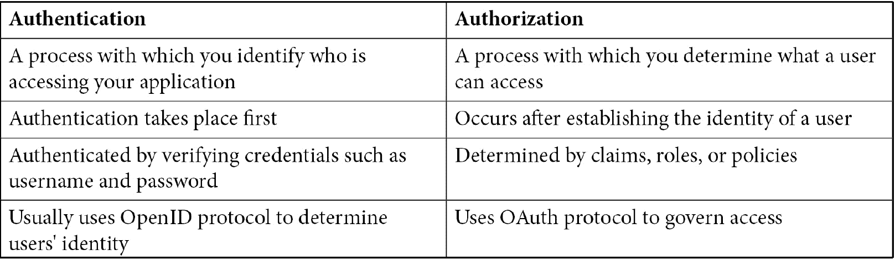

# [*第十三章*](#_idTextAnchor268) :理解授权

构建安全应用程序的一个重要方面是确保用户只能访问他们需要的资源。在现实世界中，当您入住酒店时，前台员工会验证您的身份证和信用卡，并分配一张钥匙卡来进入您的房间。根据您选择的房间类型，您可能会有进入休息室、游泳池或健身房等特权。在这里，你的身份证和信用卡的验证和分配密钥卡是**认证**，允许你访问各种资源是**授权**。因此，为了进一步解释，使用钥匙卡，我们不能识别你是谁，但可以确定你能做什么。

授权是一种机制，通过它您可以确定用户可以做什么，以及授予或拒绝对应用程序资源的访问权限。例如，我们的电子商务应用程序的用户应该能够浏览产品，将它们添加到购物车，并结账购买，只有管理员或后台用户应该能够添加或更新产品信息，更新产品价格，批准或拒绝订单，等等。

在本章中，我们将学习什么是授权，以及使用 ASP.NET 核心框架实现授权的各种方法。本章涵盖以下主题:

*   在中理解授权。NET 5
*   简单授权
*   基于角色的授权
*   基于索赔的授权
*   基于策略的授权
*   自定义授权
*   客户端和服务器应用程序中的授权

# 技术要求

这一章，你需要 Azure 的基础知识，Azure AD B2C，C#。NET Core，和 Visual Studio 2019。

# 回到几个基础

在深入了解更多细节之前，让我们先了解一下身份验证和授权之间的区别。

认证和授权看似相似，可以互换使用，但本质上是不同的。下表说明了的区别:



表 13.1

注意

更多关于认证在 ASP.NET 5 如何工作的详细信息，请参考 [*第 12 章*](12.html#_idTextAnchor244)*了解认证*。

总而言之，身份验证和授权是相辅相成的。授权仅在用户身份建立后起作用，当用户试图访问安全资源时，授权会触发身份验证质询。在本章接下来的章节中，我们将了解如何在 ASP.NET 5 应用程序中实现授权。

# 理解授权

ASP.NET 核心中的授权由中间件处理。当您的应用程序收到未经身份验证的用户对安全资源的第一个请求时，中间件会调用身份验证质询，根据身份验证方案，用户要么被重定向以登录，要么被禁止访问。一旦用户的身份在认证后被建立，授权中间件检查用户是否可以访问资源。在随后的请求中，授权中间件使用用户的身份来确定是允许还是禁止访问。

要在您的项目中配置授权中间件，您需要在`Startup.cs`的`Configure`方法中调用`UseAuthorization()`。必须在认证中间件后注册授权中间件，因为授权只能在建立用户身份后执行。参考以下代码:

```cs
app.UseAuthentication();
app.UseAuthorization();
app.UseEndpoints(endpoints =>
{
endpoints.MapControllerRoute(
    name: "default",
    pattern: "{controller=Home}/{action=Index}/{id?}");
    endpoints.MapRazorPages();
});
```

在前面的代码块中，您会注意到在`app.UseAuthentication()`之后和`app.UseEndpoints()`之前调用了`app.UseAuthorization()`。

ASP.NET 5 提供了简单的、声明性的基于角色和声明的授权模型以及丰富的基于策略的模型。在接下来的章节中，我们将了解更多关于这些的细节。

## 简单授权

在 ASP.NET 芯，授权使用`AuthorizationAttribute`配置。您可以在控制器、动作或剃刀页面上应用属性。当您添加此属性 e 时，对该组件的访问仅限于经过身份验证的用户。请参考以下代码块:

```cs
public class HomeController : Controller
{
[Authorize]
      public IActionResult Index()
{
    return View();
}
public IActionResult Privacy()
{
    return View();
}
}
```

在前面的代码中，您会注意到`[Authorize]`属性被添加到`Index`动作中。当用户试图从浏览器访问`/Home/Index`时，中间件会检查用户是否通过身份验证。如果没有，用户将被重定向到登录页面。

如果我们将`[Authorize]`属性添加到一个控制器，那么对该控制器下任何操作的访问仅限于经过身份验证的用户。在下面的代码中，您会注意到`HomeController`添加了`[Authorize]`属性，使其下的所有操作都是安全的:

```cs
[Authorize]
public class HomeController : Controller
{
      public IActionResult Index()
{
    return View();
}
[AllowAnonymous]
public IActionResult Privacy()
{
    return View();
}
}
```

有时，您可能希望让任何用户都可以访问您的应用程序的一些区域，例如，登录或重置密码页面应该对所有人开放，无论用户是否经过身份验证。为了满足这些要求，您可以将`[AllowAnonymous]`属性添加到控制器或动作中，并使它们对未经身份验证的用户可用。

在前面的代码中，您会注意到`[AllowAnonymous]`属性被添加到了`Privacy`动作中，尽管我们在控制器上有`[Authorize]`属性。该要求被动作方法上的`[AllowAnonymous]`属性覆盖，因此所有用户都可以访问`Privacy`动作。

注意

`[AllowAnonymous]`属性覆盖所有授权配置。如果在控制器上设置`[AllowAnonymous]`，在控制器下的任何动作方法上设置`[Authorize]`属性都不会有影响。在这种情况下，动作方法上的`Authorize`属性被完全忽略。

到目前为止，我们已经看到了如何保护控制器或动作方法。在下一节中，我们将看到如何在 ASP.NET 核心应用程序中启用全局授权。

## 全局启用授权

到目前为止，我们已经看到了如何使用`[Authorize]`属性来保护控制器或动作方法。在大型项目中，在每个控制器或动作上设置`authorize`属性是不可持续的；您可能会错过配置新添加的控制器或操作方法，这可能会导致安全漏洞。

ASP.NET 核心允许您通过在应用程序中添加回退策略来启用全局授权。您可以在`Startup.cs`的`ConfigureServices()`方法中定义回退策略。回退策略将应用于未定义明确授权要求的所有请求:

```cs
services.AddAuthorization(options =>
{
options.FallbackPolicy = new AuthorizationPolicyBuilder()
        .RequireAuthenticatedUser()
        .Build();
});
```

全局添加策略会强制用户通过身份验证以访问应用程序中的任何操作方法。该选项是有益的，因为您不必为应用程序中的每个控制器/动作指定`[Authorize]`属性。

您仍然可以在控制器或动作方法上设置`[AllowAnonymous]`属性，以覆盖回退行为，并使其可匿名访问。

既然我们已经理解了如何实现简单授权，在下一节中，让我们了解什么是基于角色的授权，以及它如何简化实现。

# 基于角色的授权

应用程序的某些区域只对某些用户可用是很常见的。通常的做法不是在用户级别授予访问权限，而是将用户分组到角色中，并授予对角色的访问权限。让我们考虑一个典型的电子商务应用程序，其中*用户*可以下订单，*支持*员工可以查看、更新或取消订单并解决用户查询，*管理员*角色批准或拒绝订单，管理库存等等。

基于角色的授权可以解决这些需求。当您创建一个用户时，您可以将其分配给一个或多个角色，当我们配置`[Authorize]`属性时，我们可以将一个或多个角色名称传递给`Authorize`属性的`Roles`属性。

以下代码限制属于`Admin`角色的用户访问`Admin`控制器下的所有操作方法:

```cs
[Authorize(Roles ="Admin")]
public class AdminController : Controller
{
public IActionResult Index()
{
    return View();
}
}
```

同样，您可以在`Authorize`属性的`Roles`属性中指定逗号分隔的角色名称，这样属于任一已配置角色的用户都可以访问该控制器下的操作方法。

在下面的代码中，您会注意到`User,Support`是作为`[Authorize]`属性的`Roles`属性的值提供的；属于`User`或`Support`角色的用户可以访问`Orders` 控制器的动作方法:

```cs
[Authorize(Roles ="User,Support")]
public class OrdersController : Controller
{
public IActionResult Index()
      {
        return View();
}
}
```

您还可以指定多个授权属性。如果这样做，用户必须是所有指定角色的成员才能访问它。

在下面的代码中，`InventoryManager`和`Admin`角色在`InventoryController`上配置了多个`[Authorize]`属性。要访问`Inventory`控制器，用户必须具有`InventoryManager`和`Admin`角色:

```cs
[Authorize(Roles ="InventoryManager")]
[Authorize(Roles ="Admin")]
public class InventoryController : Controller
{
public IActionResult Index()
      {
        return View();
}
[Authorize(Roles ="Admin")]
public IActionResult Approve()
      {
        return View();
}
}
```

您可以通过指定授权属性进一步限制对`Inventory`控制器下的动作方法的访问。在前面的代码中，用户必须具有`InventoryManager`和`Admin`角色才能访问`Approve`动作。

编程上，如果要检查用户是否属于某个角色，可以使用`ClaimsPrinciple`的`IsInRole`方法。在下面的例子中，您会注意到`User.IsInRole`接受`roleName`，并且根据用户的角色，它返回真或假:

```cs
public ActionResult Index()
{
if (User.IsInRole("Admin"))
{
    // Handle your logic
}
return View();
}
```

到目前为止，我们已经看到了如何通过在授权属性中指定角色名称来保护控制器或操作。在下一节中，我们将看到如何使用基于策略的角色授权将这些配置集中在一个地方。

## 基于策略的角色授权

我们也可以在`Startup.cs`中将角色需求定义为策略。这种方法非常有用，因为您可以在一个地方创建和管理基于角色的访问需求，并使用策略名称而不是角色名称来控制访问。要定义基于策略的角色授权，我们需要在`Startup.cs`的`ConfigureServices`方法中注册一个具有一个或多个角色要求的授权策略，并为`Authorize`属性的`Policy`属性提供一个策略名称。

在下面的代码中，通过添加角色为`Admin`的需求来创建`AdminAccessPolicy`:

```cs
services.AddAuthorization(options =>
{
    options.AddPolicy("AdminAccessPolicy",
        policy => policy.RequireRole("Admin"));
});
```

在您的控制器中，您可以按如下方式指定要应用的策略，并且对`Admin`控制器的访问仅限于具有`Admin`角色的用户:

```cs
[Authorize(Policy ="AdminAccessPolicy")]
public class AdminController : Controller
{
public IActionResult Index()
{
    return View();
}
}
```

定义策略时，您可以指定多个角色。当该策略用于授权用户时，属于任何一个角色的用户都可以访问资源。例如，以下代码将允许具有`User`或`Support`角色的用户访问资源:

```cs
options.AddPolicy("OrderAccessPolicy",
        policy => policy.RequireRole("User","Support"));
```

您可以在控制器或操作方法上使用带有`Authorize`属性的`OrderAccessPolicy`策略来控制访问。

现在我们已经了解了如何使用基于角色的授权，在下一节中，我们将创建一个简单的应用程序，并将其配置为使用基于角色的授权。

## 实现基于角色的授权

让我们创建一个 s 充足的应用程序，使用 ample 核心身份实现基于角色的授权:

1.  创建一个新的 ASP.NET 核心项目。可以使用以下`dotnet` CLI 命令创建。这将创建一个新的 ASP.NET 核心 MVC 应用程序，使用`Individual`帐户作为`Authentication`模式，`SQLite`作为数据库存储

    ```cs
    dotnet new mvc --auth Individual -o AuthSample
    ```

2.  您需要通过调用`Startup.cs`的`ConfigureServices`方法中的`AddRoles<IdentityRole>()`来启用角色服务。您可以参考以下代码来启用它。您还会注意到`RequireConfirmedAccount`设置为`false`。这是本示例所必需的，因为我们以编程方式创建用户:

    ```cs
    public void ConfigureServices(IServiceCollection services)
    {
    services.AddDbContext<ApplicationDbContext>(options =>
        options.UseSqlite(
        Configuration.GetConnectionString("DefaultConnection")));
    services.AddDatabaseDeveloperPageExceptionFilter();
    services.AddDefaultIdentity<IdentityUser>(options =>
        options.SignIn.RequireConfirmedAccount = false)
     .AddRoles<IdentityRole>()
        .AddEntityFrameworkStores<ApplicationDbContext>();
    services.AddControllersWithViews();
    }    
    ```

3.  接下来，我们需要创建角色和用户。为此，我们将在`Startup.cs`中添加两种方法`SetupRoles`和`SetupUsers`。我们可以利用`RoleManager`和`UserManager`服务来创建角色和用户。在下面的代码中，我们创建了三个角色。使用`IServiceProvider`，我们得到一个`roleManager`服务的实例，然后我们使用`RoleExisysAsync`和`CreateAsync`方法创建它:

    ```cs
    //Add this method to Startup.cs
    private async Task SetupRoles(IServiceProvider serviceProvider)
    {
    var rolemanager = serviceProvider
        .GetRequiredService<RoleManager<IdentityRole>>();
    string[] roles = { "Admin", "Support", "User" };
    foreach (var role in roles)
    {
        var roleExist = await rolemanager.RoleExistsAsync(role);
        if (!roleExist)
        {
            await rolemanager.CreateAsync(new IdentityRole(role));
        }
       }
    }
    ```

4.  同样，我们使用`userManager`服务创建用户并分配其中一个角色。在下面的代码中，我们创建了两个用户-`admin@abc.com`，分配了`admin`角色，`support@abc.com`，分配了`support`角色:

    ```cs
    //Add this method to Startup.cs
    private async Task SetupUsers(IServiceProvider serviceProvider)
    {
    var userManager = serviceProvider
        .GetRequiredService<UserManager<IdentityUser>>();
    var adminUser = await userManager.FindByEmailAsync("admin@abc.com");
    if (adminUser == null)
    {
        var newAdminUser = new IdentityUser
        {
            UserName = "admin@abc.com",
            Email = "admin@abc.com",
        };
    var result = await userManager
        .CreateAsync(newAdminUser, "Password@123");
    if (result.Succeeded)
        await userManager.AddToRoleAsync(newAdminUser, "Admin");
    }
    var supportUser = await userManager
        .FindByEmailAsync("support@abc.com");
    if (supportUser == null)
    {
        var newSupportUser = new IdentityUser
        {
            UserName = "support@abc.com",
            Email = "support@abc.com",
        };
    var result = await userManager
        .CreateAsync(newSupportUser, "Password@123");
    if (result.Succeeded)
        await userManager.AddToRoleAsync(newSupportUser, "Support");
    }
    }
    ```

5.  要调用这两个方法，我们需要将注入到`Configure`方法中。`IServiceProvider`作为注入参数增加:

    ```cs
    public void Configure(IApplicationBuilder app, 
            IWebHostEnvironment env, 
            IServiceProvider serviceProvider)
    {
        //
    //
    SetupRoles(serviceProvider).Wait();
    SetupUsers(serviceProvider).Wait();
    }
    ```

6.  在`Home`控制器内部，添加以下代码。为了简化实现，我们使用`Index`视图。在现实场景中，您需要返回为各个动作方法创建的视图:

    ```cs
    [Authorize(Roles = "Admin")]
    public IActionResult Admin()
    {
    return View("Index");
    }
    [Authorize(Roles = "Support")]
    public IActionResult Support()
    {
    return View("Index");
    }
    ```

7.  或者，我们可以向`Layout.cshtml`添加逻辑，根据登录用户的角色显示导航链接。以下示例使用`IsInRole`检查用户角色并显示链接:

    ```cs
    <li class="nav-item">
    <a class="nav-link text-dark" asp-area="" asp-controller="Home" asp-action="Index">Home</a>
    </li>
    @if (User.IsInRole("Admin"))
    {
    <li class="nav-item">
        <a class="nav-link text-dark" asp-area="" asp-controller="Home" asp-action="Admin">Admin</a>
    </li>
    }
    @if (User.IsInRole("Support"))
    {
    <li class="nav-item">
        <a class="nav-link text-dark" asp-area="" asp-controller="Home" asp-action="Support">Support</a>
    </li>
    }
    ```

有了前面的步骤，示例实现就完成了，您可以运行应用程序来看看它是如何工作的。运行应用，用`admin@abc.com`登录，会注意到菜单项**管理**可见，**支持**隐藏。当您使用`support@abc.com`登录时，您会注意到**支持**可见，**管理**菜单项隐藏。

在下一节中，我们将看到如何使用声明进行授权。

# 基于声明的授权

声明是成功认证后与身份相关联的键值对。索赔可以是出生日期、性别、邮政编码等。一个或多个声明可以分配给用户。基于声明的授权使用声明的值，并确定是否可以授予对资源的访问权限。您可以使用两种方法来验证索赔，一种方法是检查索赔是否存在，另一种方法是检查索赔是否以特定的值存在。

要使用基于声明的授权，我们需要在`Startup.cs`的`ConfigureServices`方法中注册一个策略。您需要将索赔名称和可选值传递给`RequireClaim`方法进行注册。例如，以下代码将`PremiumContentPolicy`注册到`PremiumUser`权利要求的要求中:

```cs
services.AddAuthorization(options =>
{
    options.AddPolicy("PremiumContentPolicy",
        policy => policy.RequireClaim("PremiumUser"));
});
```

在下面的代码中，`PremiumContentController`上使用了`PremiumContentPolicy`授权策略。检查`PremiumUser`声明是否存在于授权用户请求的用户声明中；它不在乎索赔中有什么价值:

```cs
[Authorize(Policy ="PremiumContentPolicy")]
public class PremiumContentController : Controller
{
public IActionResult Index()
{
        return View();
}
}
```

您也可以在定义索赔时指定值列表。它们将被验证以授予对资源的访问权限。例如，根据下面的代码，如果用户拥有值为`US`、`UK`或`IN`的`Country`索赔，则用户请求被授权:

```cs
services.AddAuthorization(options =>
{
    options.AddPolicy("ExpressShippingPolicy",
        policy => policy.RequireClaim(ClaimTypes.Country, "US", "UK", "IN"));
});
```

以编程方式，如果您想检查用户是否有索赔，您可以通过指定匹配条件来使用`ClaimsPrinciple`的`HasClaim`方法，要获取索赔值，您可以使用`FindFirst`方法。下面的代码说明了一个示例:

```cs
@if (User.HasClaim(x => x.Type == "PremiumUser"))
{
    <h1>Yay, you are Premium User!!!, @User.FindFirst(x => x.Type == ClaimTypes.Country)?.Value</h1>
}
```

如*实现基于角色的授权部分*中的所示，在向应用程序添加用户时，您也可以使用`UserManager`服务向用户添加声明。在下面的代码中，您会注意到`IdentityUser`和`Claim`调用了`AddClaimAsync`方法:

```cs
var user = await userManager.FindByEmailAsync("user@abc.com");
if (user == null)
{
var newUser = new IdentityUser
{
    UserName = "user@abc.com",
    Email = "user@abc.com",
};
var result = await userManager.CreateAsync(newUser, "Password@123");
if (result.Succeeded)
{
await userManager
    .AddToRoleAsync(newUser, "User");
await userManager
    .AddClaimAsync(newUser, new Claim("PremiumUser", "true"));
await userManager
    .AddClaimAsync(newUser, new Claim(ClaimTypes.Country, "US"));
}
}
```

在前面的代码中，您将注意到使用`AddClaimAsync`方法创建了两个声明并与用户相关联。在下一节中，我们将看到如何使用基于策略的授权。

# 基于策略的授权

基于策略的授权允许编写自己的逻辑来处理适合自己需求的授权需求。例如，您需要验证用户的年龄，并且仅当用户超过 14 岁时才授权下订单。您可以使用基于策略的授权模型来处理这一需求。

为了配置基于策略的授权，我们需要定义一个需求和一个处理程序，然后用需求注册策略。让我们了解这些组件:

*   策略由一个或多个需求定义。
*   需求是策略用来评估用户身份的数据参数的集合。
*   处理程序负责根据上下文评估需求中的数据，并确定是否可以授予访问权限。

在下一节中，我们将看到如何创建需求和处理程序，以及注册授权策略。

## 要求

要创建需求，需要实现`IAuthorizationRequirement`接口。这是一个标记接口；因此，您没有任何要实现的成员。例如，以下代码使用`MinimumAge`作为数据参数来创建`MinimumAgeRequirement`:

```cs
public class MinimumAgeRequirement: IAuthorizationRequirement
{
public int MinimumAge { get; set; }
public MinimumAgeRequirement(int minimumAge)
{
    this.MinimumAge = minimumAge;
}
}
```

## 需求处理程序

需求处理程序封装允许或拒绝请求的逻辑。他们使用需求属性来确定访问。处理者可以继承`TRequirement`属于`IAuthorizationRequirement`类型的`Authorizationhandler<TRequirement>`，或者实现`IAuthorizationHandler`。

在下面的例子中，`MinimumAgeAuthorizationHandler`是通过继承`AuthorizationHandler`而创建的，其中`MinimumAgeRequirement`为`TRequirement`。我们需要覆盖`HandleRequirementAsync`来编写自定义授权逻辑，其中用户的年龄是从`DateOfBirth`声明中计算出来的。如果用户年龄大于或等于`MinimumAge`，我们调用`context.Succeed`授予访问权限。如果索赔不存在或不符合年龄标准，则禁止访问:

```cs
public class MinimumAgeAuthorizationHandler
: AuthorizationHandler<MinimumAgeRequirement>
{
protected override Task HandleRequirementAsync(
AuthorizationHandlerContext context,
MinimumAgeRequirement requirement)
{
    if (context.User.HasClaim(
        c => c.Type == ClaimTypes.DateOfBirth))
    {
        var dateOfBirth = Convert.ToDateTime(
            context.User.FindFirst(x =>
            x.Type == ClaimTypes.DateOfBirth).Value);

        var age = DateTime.Today.Year - dateOfBirth.Year;

        if (dateOfBirth > DateTime.Today.AddYears(-age)) age--;

        if (age >= requirement.MinimumAge)
        {
            context.Succeed(requirement);
        }
    }
            return Task.CompletedTask;
}
}
```

要将需求标记为成功，您需要通过将需求作为参数传递来调用`context.Succeed`。您不必处理失败，因为相同需求的另一个处理程序可能会成功。如果要禁止请求，可以调用`context.Fail`。

注意

必须通过`Startup.cs`的`ConfigureServices`方法注册处理程序进行服务收集。

## 注册策略

政策是在`Startup.cs`的`ConfigureServices`方法中注册一个名称和一个要求。您可以在定义策略时注册一个或多个要求。

在下面的示例中，通过调用`policy.Requirements.Add()`并传递`MinimumAgeRequirement`的新实例来创建带有需求的策略。您还会注意到`MinimumAgeAuthorizationHandler`被添加到具有单例范围的服务集合中:

```cs
services.AddAuthorization(options =>
{
options.AddPolicy("Over14", policy =>
    policy.Requirements.Add(new MinimumAgeRequirement(14)));
});
services.AddSingleton<IAuthorizationHandler, 
    MinimumAgeAuthorizationHandler>();
```

然后，我们可以在控制器或操作上配置授权策略，根据用户的年龄限制访问:

```cs
[Authorize(Policy ="Over14")]
public class OrdersController : Controller
{
public IActionResult Index()
{
        return View();
}
}
```

如果我们注册了一个具有多个需求的策略，那么成功授权必须满足所有需求。

在下一节中，我们将学习如何进一步定制授权。

# 自定义授权

在上一节中，我们学习了如何使用基于策略的授权并实现自定义逻辑来处理授权需求。但是并不总是可以像这样在`Startup.cs`中注册授权策略。在本节中，我们将看到如何使用`IAuthorizationPolicyProvider`在您的应用程序中动态构建策略配置。

`IAuthorizationPolicyProvider`界面有三种方法需要实现:

*   `GetDefaultPolicyAsync`:此方法返回要使用的默认授权策略。
*   `GetFallbackPolicyAsync`:此方法返回回退授权策略。当没有定义明确的授权要求时使用。
*   `GetPolicyAsync`:此方法用于为提供的策略名称构建并返回授权策略。

让我们看一个例子，其中您想要基于不同的年龄标准将请求授权给几个控制器/动作，比如`Over14`、`Over18`、`Over21`、`Over60`等等。实现它的一种方法是将所有这些需求注册为策略，并在您的控制器或操作上使用它们。但是使用这种方法，代码的可维护性会降低，并且在具有许多策略的大型应用程序中不可持续。让我们看看如何利用授权策略提供程序。

我们需要创建一个实现`IAuthorizationPolicyProvider`的类，还需要实现`GetPolicy`等方法。

在下面的例子中，`MinimumAgePolicyProvider`类实现了`GetPolicyAsync`。此方法的输入是策略名称。由于我们的策略名称类似于`Over14`或`Over18`，我们可以使用字符串函数并从中提取年龄，并且一个要求用所需的年龄初始化，并且注册为一个 ne w 策略:

```cs
public class MinimumAgePolicyProvider : IAuthorizationPolicyProvider
{
        const string POLICY_PREFIX = "Over";
        public Task<AuthorizationPolicy> GetPolicyAsync(string policyName)
        {
            if (policyName.StartsWith(POLICY_PREFIX, StringComparison.OrdinalIgnoreCase) &&
            int.TryParse(policyName.Substring(POLICY_PREFIX.Length), out var age))
            {
                var policy = new AuthorizationPolicyBuilder();
                policy.AddRequirements(new MinimumAgeRequirement(age));
                return Task.FromResult(policy.Build());
            }
            return Task.FromResult<AuthorizationPolicy>(null);
        }
}
```

注意

`MinimumAgeRequirement`的实现请参考*政策授权*部分。

ASP.NET 核心只使用了`IAuthorizationPolicyProvider`的一个实例。因此，您应该定制一个`Default`和`Fallback`授权策略或者使用一个备份提供商。

在下面的代码中，您将看到一个在`MinimumAgePolicyProvider`类中的`GetDefaultPolicyAsync`和`GetFallbackPolicyAsync`方法的示例实现。

`AuthorizationOptions`被注入到构造函数中，用于初始化`DefaultAuthorizationPolicyProvider`。`BackupPolicyProvider`对象用于实现`GetDefaultPolicyAsync`和`GetFallbackPolicyAsync`方法:

```cs
public MinimumAgePolicyProvider(IOptions<AuthorizationOptions> options)
{
this.BackupPolicyProvider = 
    new DefaultAuthorizationPolicyProvider(options);
}
Private DefaultAuthorizationPolicyProvider BackupPolicyProvider { get; }
public Task<AuthorizationPolicy> GetDefaultPolicyAsync() 
=> this.BackupPolicyProvider.GetDefaultPolicyAsync();
public Task<AuthorizationPolicy> GetFallbackPolicyAsync() 
=> this.BackupPolicyProvider.GetFallbackPolicyAsync();
```

`MinimumAgePolicyProvider`的实现到此结束。现在，您可以在控制器或操作方法上使用授权策略。在下面的代码中，您会注意到使用了两种策略，一种是在控制器上使用`Over14`，另一种是在`Index`动作方法上使用`Over18`:

```cs
[Authorize(Policy ="Over14")]
public class OrdersController : Controller
{
    [Authorize(Policy ="Over18")]
public IActionResult Index()
{
        return View();
}
}
```

年龄在 14 岁以上的用户可以使用`OrdersController`以下的任何动作方法，18 岁以上的用户只能使用`Index`动作。

在下一节中，我们将学习如何创建和使用自定义授权属性。

## 自定义授权属性

在前面的示例中，带有年龄的策略名称作为字符串传递，但是代码并不干净。如果能把`age`作为参数传递给授权属性就好了。为此，您需要创建一个继承`AuthorizeAttribute`类的自定义授权属性。

在下面的示例代码中，`AuthorizeAgeOverAttribute`类继承自`AuthorizeAttribute`类。该类的构造函数接受`age`作为输入。在设置器中，我们通过连接`Policy_Prefix`和`age`来构造和设置策略名称:

```cs
public class AuthorizeAgeOverAttribute : AuthorizeAttribute
{
const string POLICY_PREFIX = "Over";
public AuthorizeAgeOverAttribute(int age) => Age = age;
public int Age
{
    get
            {
                if (int.TryParse(Policy.Substring(POLICY_PREFIX.Length), out var age))
                {
                    return age;
                }
                return default(int);
            }
            set
            {
                Policy = $"{POLICY_PREFIX}{value.ToString()}";
            }
        }
}
```

既然自定义属性实现已经完成，我们可以在控制器或动作方法上使用它。在下面的示例中，您可以看到一个示例实现，其中年龄作为参数传递给我们的自定义授权属性`AuthorizeAgeOver`:

```cs
[AuthorizeAgeOver(14)]
public class OrdersController : Controller
{
[AuthorizeAgeOver(18)]
public IActionResult Index()
{
        return View();
}
}
```

在下一节中，我们将学习如何在 Azure AD 应用程序中配置角色并使用基于角色的身份验证。

# 客户端和服务器应用程序中的授权

在前面的章节中，我们学习了如何使用**Azure Active Directory**(**AAD**)作为身份服务来认证用户，但是要使用基于角色的授权，我们需要在 Azure AD 中做一些配置上的更改。在本节中，我们将看到如何在 Azure 广告应用程序中启用和创建自定义角色，并在我们的电子商务应用程序中这样做来授权用户。

当用户登录到应用程序时，Azure AD 会将分配的角色和声明添加到用户的身份中。

先决条件

您应该已经安装了 Azure 广告和广告应用程序。如果没有，可以参考 [*第 12 章*](12.html#_idTextAnchor244)*了解认证*的*Azure Active Directory 简介*部分进行设置。

让我们来看看在 Azure AD 应用程序上启用角色需要执行的步骤:

1.  在 Azure 门户中，导航至您的**活动** **目录**租户。
2.  In the left menu, under **Manage**, select **App registrations**:

    

    图 13.1–Azure AD 应用程序

    从**应用注册**页面搜索并选择您的广告应用。参考以下截图:

    

    图 13.2–Azure AD 应用程序

3.  Click on **Manifest** from the left menu to edit it, shown in previous screenshot.

    

    图 13.3–编辑清单

4.  Locate `appRoles` to configure multiple roles. Refer to the following code to add a role:

    ```cs
    {
    "allowedMemberTypes": [
            "User"
        ],
        "description": "Admin Users",
        "displayName": "Admin",
        "id": "6ef9b400-0219-463c-a542-5f4693c4e286",
        "isEnabled": true,
        "lang": null,
        "origin": "Application",
        "value": "Admin"
    }
    ```

    您需要提供`displayName`、`value`、`description`和`id`的值。`id`的值是`Guid`，对于你添加的每个角色它必须是唯一的。同样，对于`value`，您需要提供您在代码中引用的角色名称，并且它应该是唯一的。

5.  保存清单以完成它。

保存带有所需细节的清单将在 Azure AD 应用程序的中启用自定义角色。在下一节中，我们将学习如何将用户分配给这些自定义角色。

## 为用户分配角色

下一步是给用户分配角色。可以使用 Azure 门户或使用图形应用编程接口以编程方式将角色分配给用户。在本节中，我们将使用 Azure 门户来分配角色，同样也可以使用 Graph API 来实现。更多信息可参考[https://docs . Microsoft . com/en-us/graph/azure ad-identity-access-management-concept-overview](https://docs.microsoft.com/en-us/graph/azuread-identity-access-management-concept-overview):

1.  在 Azure 门户中，导航至 **Azure 活动** **目录**租户。
2.  点击左侧菜单中的**企业应用程序**，搜索并选择您的广告应用程序。
3.  转到**管理** | **用户和组** | **添加用户**。
4.  搜索并选择用户，点击**确定**。
5.  点击**选择角色**选择想要分配的角色。
6.  点击**分配**保存选择。

您可以继续这些步骤，将角色分配给多个用户。

为了保护控制器或动作，您可以添加一个`Authorize`属性以及角色。在下面的代码中，`Admin`控制器只能由具有`Admin`角色的用户访问:

```cs
[Authorize(Roles ="Admin")]
public class AdminController : Controller
{
public IActionResult Index()
{
    return View();
}
}
```

到目前为止，我们已经学习了如何在 Azure AD 中启用角色，并使用基于角色的模型进行授权。在下一节中，我们将看到如何在视图中使用用户的身份来访问角色和声明。

## 视图中的用户身份

用户声明原则可用于视图中，根据需要有条件地显示或隐藏数据。例如，下面的代码检查用户身份的`IsAuthenticated`属性，以确定用户是否通过身份验证。如果用户未通过认证，将显示到`Sign in`的链接，否则，将显示带有`Sign out`链接的用户名:

```cs
<ul class="navbar-nav">
    @if (User.Identity.IsAuthenticated)
    {
        //// HTML code goes here
    }
    else
    {
        ////
    }
</ul>
```

同样，我们可以使用`IsInRole`或`HasClaim`并编写我们的逻辑向用户显示内容或隐藏内容:

```cs
@if (User.HasClaim(x => x.Type == "PremiumUser"))
{
    <h1>Yay, you are Premium User!!!, @User.FindFirst(x => x.Type == ClaimTypes.Country)?.Value</h1>
}
```

更多详情可参考[https://docs . Microsoft . com/en-us/azure/active-directory/develop/how-add-app-roles-in-azure-ad-apps](https://docs.microsoft.com/en-us/azure/active-directory/develop/howto-add-app-roles-in-azure-ad-apps)。

# 总结

在本章中，我们了解了什么是授权，以及使用 ASP.NET 核心框架实现授权的不同方式。我们学习了如何使用简单的、声明性的基于角色和声明的模型来限制或匿名允许用户访问资源，并学习了如何使用丰富的基于策略的授权模型来实现自定义逻辑来授权用户请求。

我们学习了如何使用授权策略提供程序动态添加授权策略，并构建自定义授权属性。我们还学习了如何在 Azure AD 中配置自定义角色，并在 ASP.NET Core 应用程序中使用它们。根据您的授权要求，您可以使用一个或多个授权模型来保护您的应用程序。

在下一章中，我们将学习如何监控 ASP.NET 核心应用程序的运行状况和性能。

# 问题

阅读本章后，您应该能够回答以下问题:

1.  Which of the following is the primary service that determines whether authorization is successful or not?

    a.`IAuthorizationHandler`

    b.`IAuthorizationRequirement`

    c.`IAuthorizationService`

    d.`IAuthorizationPolicyProvider`

2.  In the following code, access to the `Support` action is restricted to only the `Support` role:

    ```cs
    [AllowAnonymous]
    public class HomeController : Controller
    {
          public IactionResult Index()
    {
        return View();
    }
    [Authorize(Roles ="Support")]
    public IactionResult Support()
    {
            return View();
    }
    }
    ```

    a.真实的

    b.错误的

# 进一步阅读

想了解更多授权信息，可以参考[https://docs . Microsoft . com/en-us/aspnet/core/security/authorization/introduction？view=aspnetcore-5.0](https://docs.microsoft.com/en-us/aspnet/core/security/authorization/introduction?view=aspnetcore-5.0) 。