# 十四、健康与诊断

现代软件应用已经发展成为复杂和动态的，并且本质上是分布式的。对这些应用的高要求是能够在任何地方、任何设备上全天候工作。为了实现这一点，知道我们的应用随时可用并响应请求是很重要的。客户体验将在服务的未来和组织的收入中发挥重要作用。

应用运行后，监控应用的运行状况至关重要。定期的应用运行状况监控将有助于我们主动检测任何故障，并在它们造成更大损害之前解决它们。应用监控现在已经成为日常操作的一部分。为了诊断实时应用的任何故障，我们需要正确的遥测和诊断工具。我们捕获的遥测数据也将帮助我们识别那些用户没有直接看到或报告的问题。

让我们了解一下应用运行状况监控以及中提供的内容.NET 5。

在本章中，我们将了解以下主题:

*   引入健康检查
*   ASP.NET Core 5 的健康检查空气污染指数
*   利用应用洞察监控应用
*   执行远程调试

到本章结束时，您将很好地掌握为构建运行状况检查应用编程接口.NET 5 应用和 Azure 应用，用于捕获遥测数据和诊断问题。

# 技术要求

我们需要以下软件来完成本章中的任务:

*   安装了 Azure 开发工作负载的 Visual Studio 2019 企业版
*   蓝色订阅

对微软的基本了解.NET 以及如何在 Azure 中创建资源。

本章使用的代码可以在[https://github . com/PacktPublishing/Enterprise-Application-Development-with-C-Sharp-9-and-找到.NET-5/树/主/第 14 章](https://github.com/PacktPublishing/Enterprise-Application-Development-with-C-Sharp-9-and-.NET-5/tree/master/Chapter14)。

# 引入健康检查

健康检查是对应用的全面审查，有助于我们了解应用的当前状态，并使用可见的指标来采取纠正措施。运行状况检查被应用公开为 HTTP 端点。健康检查端点用作某些协调器和负载平衡器的健康探测器，以将流量从故障节点路由出去。运行状况检查用于监控应用依赖关系，如数据库、外部服务和缓存服务。

在下一节中，我们将了解对在 ASP.NET Core 5 中构建运行状况检查 API 的支持。

# ASP.NET Core 5 健康检查 API

ASP.NETCore 5 有一个内置的中间件(可通过`Microsoft.Extensions.Diagnostics.HealthChecks` NuGet 包获得)报告作为 HTTP 端点公开的应用组件的健康状态。这个中间件使得集成数据库、外部系统和其他依赖项的健康检查变得非常容易。它也是可扩展的，因此我们可以创建自己的自定义健康检查。

在下一部分，我们将向我们的*电子商务*门户添加一个健康检查端点。

## 添加健康检查端点

在本节中，我们将向我们的`Packt.Ecommerce.Web`应用添加一个健康检查端点:

1.  In order to add a health check endpoint, we need to first add the `Microsoft.Extensions.Diagnostics.HealthChecks` NuGet package reference to the `Packt.Ecommerce.Web` project, as shown in the following screenshot:

    

    图 14.1–NuGet 参考微软。扩展、诊断、健康检查

2.  现在我们需要向依赖容器注册`HealthCheckService`。我们只需在`Startup`类的`ConfigureServices`方法中调用`IServiceCollection`上的扩展方法就可以做到这一点，如下面的代码片段所示。`AddHealthChecks`方法增加了`DefaultHealthCheckService`模块:

    ```cs
    public void ConfigureServices(IServiceCollection services)
    {
    // Removed code for brevity. 
    // Add health check services to the container.
    services.AddHealthChecks();
    }
    ```

3.  现在让我们继续并在`Startup`类的`Configure`方法中配置健康检查端点。使用`MapHealthChecks`方法映射健康端点，如下代码所示。这将向应用添加运行状况检查端点路由。这将在内部配置`HealthCheckResponseWriters.WriteMinimalPlainText`框架方法以发出响应。`WriteMinimalPlainText`将刚刚发布健康检查服务的整体状态:

    ```cs
    public void Configure(IApplicationBuilder app, IWebHostEnvironment env)
    {
    // Removed code for brevity. 
    app.UseEndpoints(endpoints =>
    {
        endpoints.MapControllerRoute(
             name: "default",
             pattern: "{controller=Products}/{action=Index}/{id?}");
        endpoints.MapHealthChecks("/health");
    });
    }
    ```

4.  运行应用，浏览至`<<Application URL>>/health`网址。您将看到以下输出:

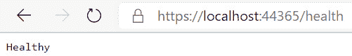

图 14.2–健康检查终点响应

我们添加的健康端点提供了关于服务可用性的基本信息。在下一节中，我们将看到如何监控从属服务的状态。

## 监控从属 URIs

一个企业应用依赖于多个其他组件，如数据库和 Azure 组件，包括`KeyVault`，其他微服务，如我们的*电子商务*网站依赖于订单服务、产品服务等。这些服务可以由同一组织内的其他团队拥有，或者在某些情况下，它们可能是外部服务。监控依赖服务通常是一个好主意。我们可以利用`AspNetCore.HealthChecks.Uris` NuGet 包来监控相关服务的可用性。

让我们继续增强我们的健康端点，以监控产品和订单服务:

1.  Add the NuGet package reference to `AspNetCore.HealthChecks.Uris`. Now modify the health check registration to register the Product and Order services as shown in the following code snippet:

    ```cs
    public void ConfigureServices(IServiceCollection services)
    {
    // Add health check services to the container.
    services.AddHealthChecks()
    .AddUrlGroup(new Uri(this.Configuration.GetValue<string>("ApplicationSettings:ProductsApiEndpoint")), name: "Product Service")
    .AddUrlGroup(new Uri(this.Configuration.GetValue<string>("ApplicationSettings:OrdersApiEndpoint")), name: "Order Service");
    }
    ```

    健康检查中间件还提供关于个人健康检查状态的详细信息。

2.  Let's now modify our health check middleware to emit the details as shown in the following code:

    ```cs
    public void Configure(IApplicationBuilder app, IWebHostEnvironment env)
    {
    // Removed code for brevity. 
         app.UseEndpoints(endpoints =>
         {
             endpoints.MapControllerRoute(
                 name: "default",
                 pattern: "{controller=Products}/{action=Index}/{id?}");
     endpoints.MapHealthChecks("/health", new HealthCheckOptions
     {
     ResponseWriter = async (context, report) =>
     {
     context.Response.ContentType = "application/json";
     var response = new
     {
     Status = report.Status.ToString(),
     HealthChecks = report.Entries.Select(x => new
     {
     Component = x.Key,
     Status = x.Value.Status.ToString(),
     Description = x.Value.Description,
     }),
     HealthCheckDuration = report.TotalDuration,
     };
     await context.Response.WriteAsync(JsonConvert.SerializeObject(response)).ConfigureAwait(false);
     },
     });
          });
    }
    ```

    在这段代码中，健康检查中间件被覆盖，通过向`HealthCheckOptions`提供`ResponseWriter`来写入状态、健康检查持续时间、组件名称和描述的细节作为其响应。

3.  现在，如果我们运行项目并导航到运行状况检查应用编程接口，我们应该会看到以下输出:


图 14.3–带有状态的健康检查端点响应

我们已经学习了如何定制健康检查端点的响应，以及如何利用第三方库来监控依赖 URIs 的状态。如果您希望集成对通过实体框架核心使用的数据库的检查，您可以利用`Microsoft.Extensions.Diagnostics.HealthChecks.EntityFrameworkCore`库。更多关于使用这个库的信息可以在[上找到？view = aspnet core-5.0 # entity-framework-core-db context-probe](https://docs.microsoft.com/en-us/aspnet/core/host-and-deploy/health-checks?view=aspnetcore-5.0#entity-framework-core-dbcontext-probe)。在 https://github.com/Xabaril/AspNetCore.[可以找到更多不同服务的健康检查套餐诊断。健康检查](https://github.com/Xabaril/AspNetCore.Diagnostics.HealthChecks)。在下一节中，我们将学习如何构建自定义运行状况检查。

## 建立自定义健康检查

ASP.NET Core 5 中的健康检查中间件是可扩展的，这意味着它允许我们扩展和创建定制的健康检查。我们将通过构建过程监视器来学习如何构建和使用自定义运行状况检查。在某些情况下，可能需要监控机器上运行的特定进程。如果进程(例如，反恶意软件服务)没有运行，或者如果第三方 SaaS 产品的许可证即将到期，我们可能会将其标记为健康问题。

让我们开始在`Packt.Ecommerce.Common`项目中创建`ProcessMonitor`健康检查:

1.  Add a project folder named `HealthCheck` to `Packt.Ecommerce.Common` and add two classes, `ProcessMonitor` and `ProcessMonitorHealthCheckBuilderExtensions`, as shown in the following screenshot:

    

    图 14.4–添加自定义运行状况检查后的项目结构

    自定义`HealthCheck`中间件要求 NuGet 引用为`microsoft.extensions.diagnostics.healthchecks`。

2.  ASP.NET Core 5 中的自定义健康检查应实现`IHealthCheck`界面。这个接口定义了当请求到达`healthcheck`应用编程接口时将被调用的`CheckHealthAsync`方法。
3.  Implement the `ProcessMonitorHealthCheck` class as shown in the following code:

    ```cs
    public class ProcessMonitorHealthCheck : IHealthCheck
    {
       private readonly string processName;
       public ProcessMonitorHealthCheck(string processName) => this.processName = processName;
       public Task<HealthCheckResult> CheckHealthAsync(HealthCheckContext context, CancellationToken cancellationToken = default)
        {
            Process[] pname = Process.GetProcessesByName(this.processName);
            if (pname.Length == 0)
            {
                return Task.FromResult(new HealthCheckResult(context.Registration.FailureStatus, description: $"Process with the name {this.processName} is not running."));
            }
            else
            {
                return Task.FromResult(HealthCheckResult.Healthy());
            }
        }
    }
    ```

    在`CheckHealthAsync`方法中，获取`processName`中指定名称的进程列表。如果没有这样的过程，则返回健康检查失败，否则，返回失败状态。

4.  Now that we have the custom health check middleware, let's add an extension method to register. Modify the `ProcessMonitorHealthCheckBuilderExtensions` class as shown in the following code snippet:

    ```cs
    public static class ProcessMonitorHealthCheckBuilderExtensions
        {
            public static IHealthChecksBuilder AddProcessMonitorHealthCheck(
                this IHealthChecksBuilder builder,
                string processName = default,
                string name = default,
                HealthStatus? failureStatus = default,
                IEnumerable<string> tags = default)
            {
                return builder.Add(new HealthCheckRegistration(
                   name ?? "ProcessMonitor",
                   sp => new ProcessMonitorHealthCheck(processName),
                   failureStatus,
                   tags));
            }
        }
    ```

    这是`IHealthCheckBuilder`的扩展方法。我们可以看到在代码片段中添加`ProcessMonitorHealthCheck`向容器注册了`ProcessMonitorHealthCheck`。

5.  现在让我们利用我们已经构建的自定义运行状况检查。在下面的代码中，我们注册了`notepad`的`ProcessMonitorHealthCheck`健康检查:

    ```cs
    public void ConfigureServices(IServiceCollection services)
    {
                // Add health check services to the container.
                services.AddHealthChecks()
                    .AddUrlGroup(new Uri(this.Configuration.GetValue<string>("ApplicationSettings :ProductsApiEndpoint")), name: "Product Service")
           .AddUrlGroup(new Uri(this.Configuration.GetValue<string>("ApplicationSettings :OrdersApiEndpoint")), name: "Order Service")
           .AddProcessMonitorHealthCheck("notepad", name: "Notepad monitor");
    }
    ```

6.  现在，当您运行应用并导航到运行状况检查应用编程接口时，如果`notepad.exe`正在您的机器上运行，我们将看到如图 14.5 所示的输出:


图 14.5–来自健康检查端点的响应

我们可以在我们的健康检查端点上启用**跨来源资源共享** ( **CORS** )、授权和主机限制。详见[https://docs . Microsoft . com/en-us/aspnet/core/host-and-deploy/health-checks？view=aspnetcore-5.0](https://docs.microsoft.com/en-us/aspnet/core/host-and-deploy/health-checks?view=aspnetcore-5.0) 。

在某些场景中，运行状况检查 API 根据它们探测的应用的状态分为两种类型。它们是:

*   **就绪探测**:这些指示应用正在正常运行，但是还没有准备好接受请求。
*   **活动性探测**:这些指示应用是否已经崩溃，必须重新启动。

就绪性和活动性探测器都用于控制应用的运行状况。失败的就绪探测将停止应用服务流量，而失败的活动性探测将重新启动节点。我们在像 Kubernetes 这样的托管环境中使用就绪性和生动性探测器。

我们已经学习了如何将健康检查应用编程接口添加到 ASP.NET Core 5 应用中。在下一节中，我们将了解 Azure Application Insights 以及它如何帮助监控应用。

# 用应用洞察监控应用

监控应用是为最终用户提供一流体验的关键。在当前超快速数字市场时代，应用监控是推动业务投资回报和保持竞争优势所必需的。我们应该关注的参数是页面/应用编程接口性能、最常用的页面/应用编程接口、应用错误和系统健康等。当系统出现异常时，应该设置警报，以便我们可以纠正它，并将对用户的影响降至最低。

在 [*第 7 章*](07.html#_idTextAnchor141)*登录中，已经向您介绍了将应用洞察集成到应用及其关键特性.NET 5* 。让我们在 Azure 门户中打开应用洞察，了解它的不同产品。在概览控制面板上，除了 Azure 订阅、位置和工具键之外，我们还看到如下关键指标:

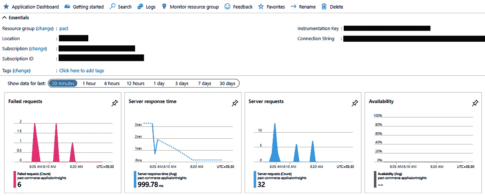

图 14.6–应用洞察仪表板

**失败请求**图表显示了在所选持续时间内失败的请求数量。这是我们应该关注的关键指标；许多故障代表系统的不稳定性。**服务器响应时间**代表服务器对呼叫的平均响应时间。如果响应时间过长，更多的用户将会看到应用响应的滞后，这可能会导致沮丧，结果我们可能会失去用户。

**服务器请求**图表示对应用的调用总数；这将为我们提供系统中使用的模式。**可用性**图表示应用的正常运行时间。我们将在本章后面配置的可用性测试将显示**可用性**图。通过点击每个图表，我们可以获得更多关于相应度量的细节，包括请求和异常细节。我们可以更改持续时间来查看所选时间间隔的图表。

概览仪表板上的图表显示了最近的指标。在我们希望了解系统在过去特定时间的工作情况时，这可能很有用。

在下一节中，我们将了解应用洞察的一些最重要的产品，查看实时指标、遥测事件和远程调试功能。

## 实时指标

默认情况下启用实时指标。实时指标的捕获延迟为一秒钟，这与分析指标不同，后者是随着时间的推移而聚合的。仅当“实时指标”窗格打开时，实时指标的数据才会进行流式传输。收集的数据只有在图表上时才会保留。在实时指标监控期间，所有事件都从服务器传输，不会被采样。如果应用部署在 web 服务器场中，我们还可以按服务器过滤事件。

实时指标显示各种图表，如传入和传出请求，以及内存和 CPU 利用率的总体健康状况。在右侧窗格中，我们可以看到捕获的遥测数据，它将列出请求、依赖调用和异常。在我们希望通过观察故障率和性能来评估发布到生产环境中的修复时，使用了实时度量。我们还将在运行负载测试时监控这些，以查看负载对系统的影响。

对于像我们的*电商*应用这样的应用，了解用户如何使用应用、最常用的功能以及用户如何遍历应用非常重要。在下一节中，我们将了解应用洞察中的使用分析。

## 应用洞察的使用分析

在 [*第 11 章*](11.html#_idTextAnchor228)*创建 ASP.NET Core 5 Web 应用*中，您学习了如何将应用洞察与视图相集成。当应用洞察与视图集成时,应用洞察可以帮助我们深入了解人们如何使用应用。应用洞察的**使用**部分下的**用户**刀片提供了使用该应用的用户数量的详细信息。通过使用存储在浏览器 cookies 中的匿名 id 来识别用户。请注意，使用不同浏览器和机器的一个人被视为多个用户。**会话**和**事件**刀片分别代表用户活动的会话和特定页面或功能的使用频率。您也可以基于自定义事件生成关于用户、会话和事件的报告，这是您在 [*第 7 章*](07.html#_idTextAnchor141)*登录中了解到的.NET 5* 。

使用分析下另一个有趣的工具是**用户流**。**用户流**工具可视化了用户如何浏览应用的不同页面和功能。用户流提供在用户会话期间给定事件之前和之后发生的事件。*图 14.7* 显示给定时间的用户流量。这告诉我们，从主页，用户主要导航到产品详细信息页面或帐户登录页面:

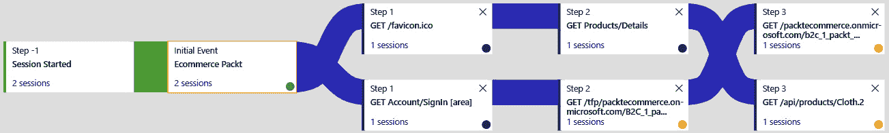

图 14.7–电子商务应用中的用户流

让我们添加几个自定义事件，看看这些自定义事件的用户流是什么样的。在`Packt.Ecommerce.Web`应用的`OrderController`的`Create`动作方法中添加一个自定义事件，如下面的代码片段所示。当用户点击**购物车**页面上的**下单**按钮时，这将跟踪一个自定义事件:

```cs
this.telemetry.TrackEvent("Create Order");
```

同样，让我们在用户点击**产品详情**页面上的**添加至购物车**按钮时添加自定义事件跟踪。为此，添加以下代码片段:

```cs
this.telemetry.TrackEvent("Add Item To Cart");
```

添加自定义事件后，用户流将显示与这些事件相关的应用的不同活动。用户流是一个方便的工具，可以知道有多少用户正在离开页面，以及他们在页面上点击了什么。请参考本章末尾的*进一步阅读*部分中提供的 Azure 应用洞察文档，了解更多关于其他有趣的使用分析产品的信息，包括队列、漏斗、保留等。

当有足够多的遥测事件时，您可以使用名为智能检测的应用洞察功能，该功能会自动检测系统中的异常并向我们发出警报。在下一节中，我们将了解智能检测。

## 智能检测

智能检测不需要任何配置或代码更改。它对从系统获取的遥测数据起作用。系统中的**智能检测**刀片下将显示警报，这些警报将发送给具有**监控阅读器**和**监控贡献者**角色的用户。我们可以在**设置**选项下为这些警报配置其他收件人。一些智能检测规则包括**页面加载时间慢**、**服务器响应时间慢**、**每日数据量异常增加**、**依赖量下降**。

我们需要监控应用的一个重要方面是可用性。在下一节中，我们将学习如何利用应用洞察来监控应用可用性。

## 应用可用性

在应用洞察中，我们可以为任何可从互联网访问的`http`或`https`端点设置可用性测试。这不需要对我们的应用代码进行任何更改。我们可以在`(<App Root URL>/health)`为可用性测试配置健康检查端点。

要配置可用性测试，请转到 Azure 门户中的应用洞察资源，并执行以下步骤:

1.  Select **Availability** under the **Investigate** menu, as shown here:

    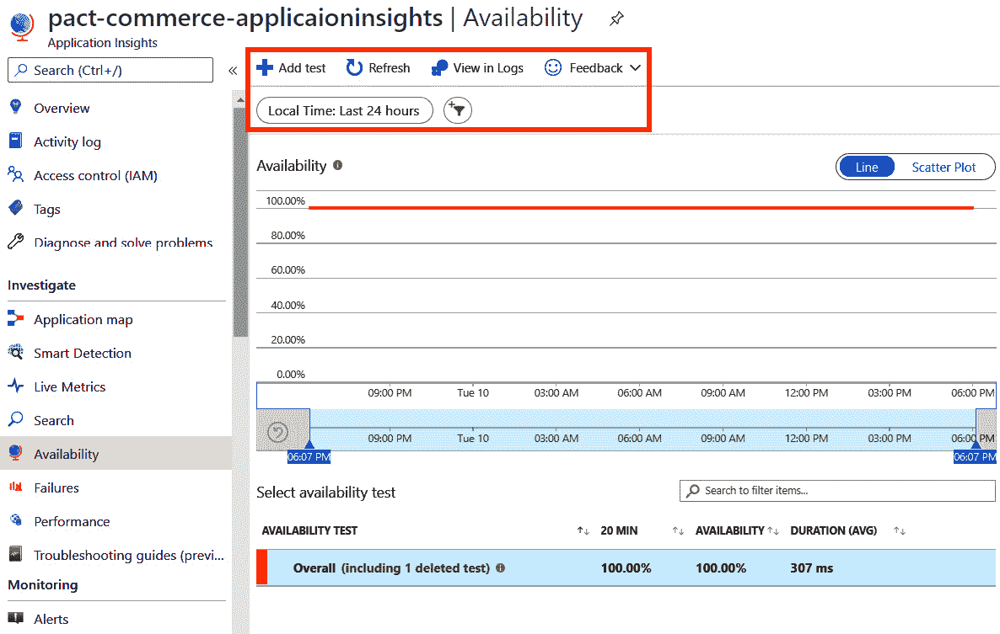

    图 14.8–应用洞察的可用性部分

2.  点击**上的添加测试**添加可用性测试，如前一个截图中突出显示的。
3.  在**创建测试**对话框中，指定测试名称(比如`Commerce availability test`)，选择**测试类型**的**网址 Ping 测试**，在**网址**字段中，输入健康检查网址为`<<App root url>>/health`。将其他选项保留为默认值，点击**创建**。
4.  Once the test is configured, Application Insights will call the configured URL every 5 minutes from all the configured regions. We can see the availability test results as follows:

    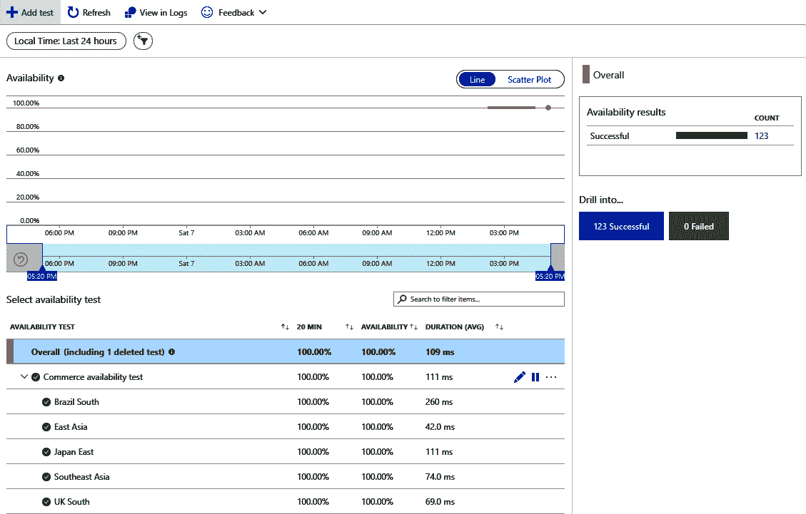

    图 14.9–可用性测试结果

5.  创建测试时选择的默认地区为**巴西南部**、**东亚**、**日本东部**、**东南亚**和**英国南部**。我们可以添加或删除将运行可用性测试的任何区域。建议至少配置五个区域。
6.  如果我们想在稍后的时间点添加一个新的区域，我们可以编辑可用性测试并选择新的区域(例如**西欧**)，如下图所示，然后点击**保存**:

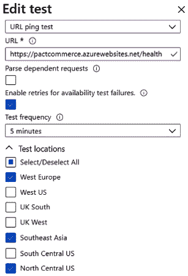

图 14.10–编辑可用性测试区域

我们还可以在应用洞察中将配置为多步骤网络测试，作为可用性测试。

注意

您可以使用以下文档来帮助您配置多步骤 web 测试:[https://docs . Microsoft . com/en-us/azure/azure-monitor/app/availability-multi step](https://docs.microsoft.com/en-us/azure/azure-monitor/app/availability-multistep)。

Application Insights 为查询捕获的遥测事件提供了一个非常好的工具。在下一节中，我们将了解应用洞察中的**搜索**功能。

## 搜索

应用洞察中的**搜索**功能有助于探索遥测事件，如请求、页面视图和异常。我们还可以查询我们在应用中编码的跟踪。**搜索**可从**概述**选项卡或从**调查**选项卡的**搜索**选项打开:

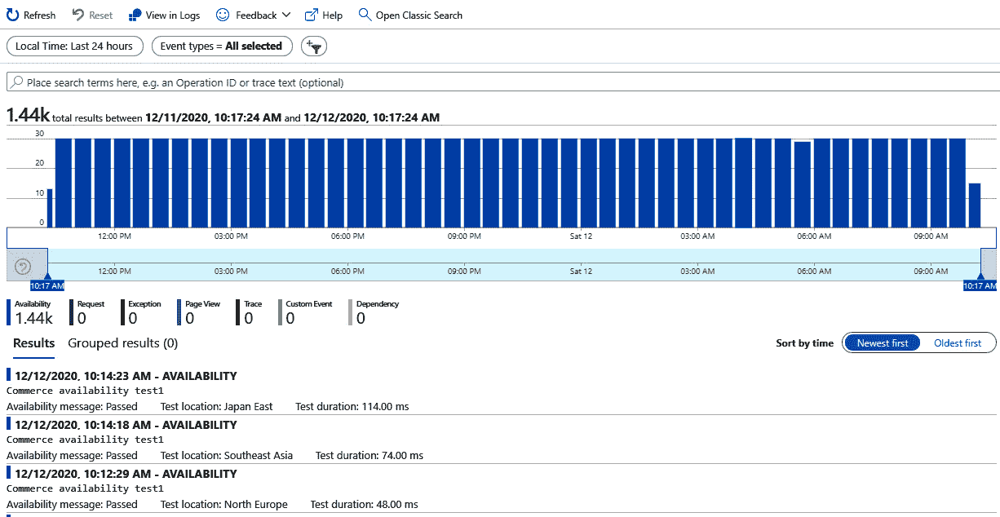

图 14.11–搜索结果

通过**事务搜索**功能，我们可以根据时间和**事件类型**过滤显示的遥测事件。

我们也可以过滤它们的属性。通过点击特定事件，我们可以查看该事件的所有属性以及该事件的遥测数据。要查看状态代码为 **500** 的请求，请根据响应代码过滤事件，如下所示:

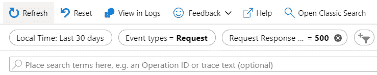

图 14.12–过滤搜索结果

一旦我们应用了过滤器，在搜索结果中我们将只看到响应代码为 500 的请求，如下图所示的:


图 14.13–过滤后的搜索结果

要了解导致失败的更多原因，请单击事件。点击该事件将显示相关遥测的详细信息，如下图所示:


图 14.14–端到端交易详情

我们甚至可以通过点击异常来深入更多。这将显示详细信息，如方法名和堆栈跟踪，这将帮助我们确定失败的原因。

借助应用洞察，我们可以对捕获的遥测数据编写自定义查询，以获得更有意义的洞察。在下一节中，我们将学习如何编写查询。

## 日志

要对捕获的遥测数据进行查询，让我们按如下方式导航:

1.  转到**应用洞察** | **监控** | **日志**。这将显示带有示例查询的**日志**页面，我们可以运行:


图 14.15–应用洞察日志

在建议的样本查询中选择**请求计数趋势**。这将为我们生成一个查询并运行它。一旦运行完成，我们将看到结果和图表，如下图所示:

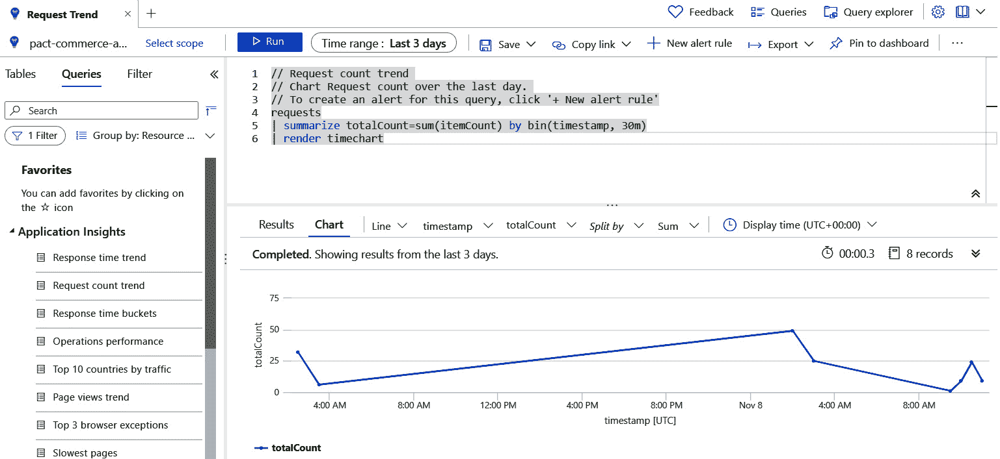

图 14.16–记录搜索结果

在应用洞察中捕获的遥测数据进入不同的表，包括请求、异常、依赖、跟踪和页面视图。这里生成的查询总结了请求表中的遥测数据，并呈现了一个时间轴被 30 分钟分割的时间图。

我们根据自己的要求选择时间范围。我们甚至可以在查询中指定时间范围，而不是从菜单选项中选择。在此创建的这些查询可以保存并在以后重新运行。这里还有一个配置提醒的选项，我们在 [*第 7 章*](07.html#_idTextAnchor141)*登录中了解到.NET 5* 。这里用来编写查询的语言是 Kusto。

注意

参考以下文档了解 Kusto 查询语言:[https://docs . Microsoft . com/en-us/azure/data-explorer/Kusto/concepts/](https://docs.microsoft.com/en-us/azure/data-explorer/kusto/concepts/)

Kusto 基于关系数据库结构。使用库斯托查询语言，我们可以编写复杂的分析查询。Kusto 支持分组聚合、计算列和连接函数。

让我们再举一个例子，我们希望确定每个客户城市的第 95 个百分点的服务响应时间。对此的查询将编写如下:

```cs
requests
| summarize 95percentile=percentile(duration, 0.95) by client_City
| render barchart 
```

在前面的查询中，我们使用`percentile`函数来识别第 95 个百分位，对每个区域进行汇总。结果呈现为条形图。

对于前面的查询，我们看到了下图:


图 14.17–库斯托百分位汇总结果

从渲染图中，我们可以推断来自钦奈的请求的响应时间比来自 T2 的请求要快。

现在，让我们找到导致请求失败的任何异常，并按请求和异常类型对它们进行总结。为了得到这个结果，我们将把`requests`表与`exceptions`连接起来，并根据请求名称和异常类型对它们进行汇总，如下查询所示:

```cs
requests
| join kind= inner (
exceptions
) on operation_Id
| project requestName = name, exceptionType = type
| summarize count=sum(1)  by requestName, exceptionType
```

如果我们运行查询，我们会得到按请求名称和异常类型汇总的结果，如下图所示:

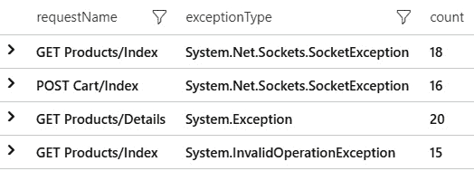

图 14.18–库斯托请求失败异常

**搜索**是 Application Insights 的一个强大功能，用于诊断和修复生产现场的故障。建议点击应用洞察的不同功能并进行探索。

为了更好地分析和排除生产故障，我们可能想知道发生特定错误时应用的状态。在下一节中，我们将了解应用洞察的快照调试器功能如何帮助我们实现这一点。

## 快照调试器

快照调试器监控我们应用的异常遥测。它使用源代码和变量的当前状态自动收集应用中发生的顶级异常的快照。

注意

快照调试器功能仅在 Visual Studio 的企业版中可用。

现在让我们继续为我们的*电子商务*应用配置快照调试器:

1.  将`Microsoft.ApplicationInsights.SnapshotCollector` NuGet 包添加到`Packt.Ecommerce.Web`项目中。
2.  在`Startup.cs`中增加以下`using`语句:

    ```cs
    using Microsoft.ApplicationInsights.SnapshotCollector;
    ```

3.  通过在`ConfigureServices`方法中添加以下行，将快照收集器添加到您的服务中:

    ```cs
    public void ConfigureServices(IServiceCollection services)
    {
    services.AddApplicationInsightsTelemetry(this.Configuration["ApplicationInsights:InstrumentationKey"]);
    services.AddSnapshotCollector((configuration) => this.Configuration.Bind(nameof(SnapshotCollectorConfiguration), configuration));
    }
    ```

4.  要模拟故障，请将以下代码添加到`EcommerceService`类的`GetProductsAsync`方法中。如果有任何产品可用，该代码将抛出一个错误:

    ```cs
    public async Task<IEnumerable<ProductListViewModel>> GetProductsAsync(string filterCriteria = null)
    {        
                // Code removed for brevity
     if (products.Any())
     {
     throw new InvalidOperationException();
     }
     return products;
    }
    ```

5.  现在让我们继续运行应用。我们在主页上看到一个错误。再次刷新页面，因为调试快照针对的是至少出现两次的错误。
6.  Now open the **Search** tab in Application Insights. Filter by the **Exception** Event types:

    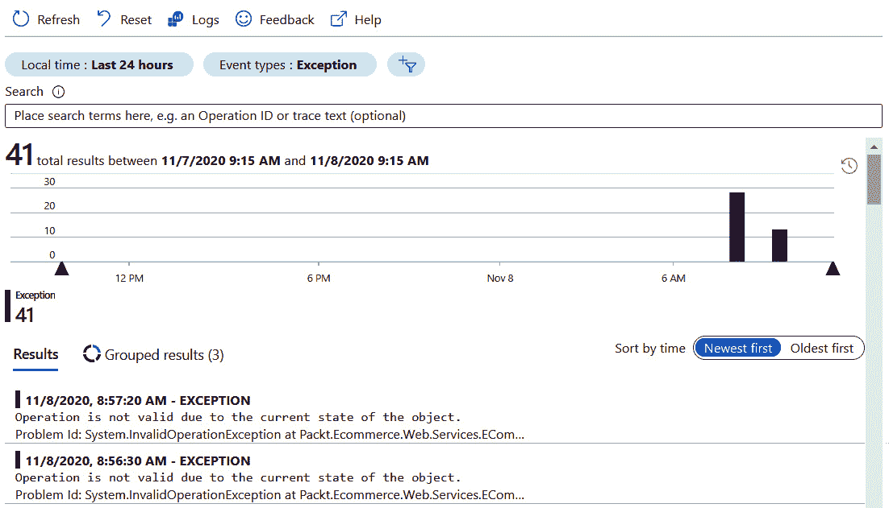

    图 14.19–异常遥测

7.  Click on the exception to go to the details page. On the details page, we see that the debug snapshot has been created for the EXCEPTION, as highlighted in the following screenshot:

    

    图 14.20–调试快照

8.  Click on the **Debug Snapshot** icon. This will take us to the **Debug Snapshot** page :

    

    图 14.21–调试快照窗口

9.  要查看调试快照，需要**应用洞察快照调试器角色**。由于调试状态可能包含敏感信息，因此默认情况下不会添加此角色。点击**添加应用洞察快照调试器角色**按钮。这将向当前登录的用户添加角色。
10.  Once the role addition is complete, we can then see the debug snapshot details populated on the page, along with a button to download the snapshot:

    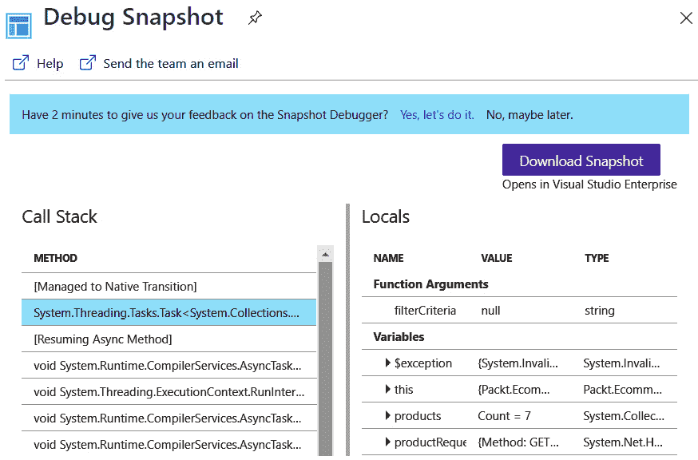

    图 14.22–下载调试快照

11.  Click on the **Download Snapshot** button. The extension of the downloaded debug snapshot file is `diagsession`. Open the downloaded `diagsession` file in Visual Studio:

    

    图 14.23–Visual Studio 中的调试快照视图

12.  Now click on **Debug with Managed Only** to start the debug session. Once the debug session is open, we see the exception is broken at the line where we throw `InvalidOperationException`:

    

图 14.24–在 Visual Studio 中调试快照

在这个会话中，我们可以添加一个观察器，并查看局部变量和类变量的状态。

注意

有关快照调试器配置的更多信息，请参考以下文档:[https://docs . Microsoft . com/en-us/azure/azure-monitor/app/Snapshot-Debugger-VM](https://docs.microsoft.com/en-us/azure/azure-monitor/app/snapshot-debugger-vm)。

随着应用的增长和与其他多种服务的集成，对生产环境中出现的问题进行故障排除和调试将是一项挑战。在某些情况下，不可能在生产前环境中复制它们。借助我们捕获的遥测数据和应用洞察工具，我们将能够分析问题并解决问题。快照调试器是解决关键问题的强大工具。Application Insights 收集遥测数据，并通过后台进程分批发送。使用 Application Insights 对我们的应用的影响很小。

可能有些情况下，我们希望调试一个实时应用。使用 Visual Studio，我们能够将调试器附加到远程运行的应用上来调试它。在下一节中，我们将学习如何实现这一点。

# 执行远程调试

在本节中，我们将学习如何在 Azure App Service 中将调试器附加到我们部署的应用。使用 Visual Studio 提供的工具调试远程应用很容易。在 Azure 应用服务中部署应用在 [*第 16 章*](16.html#_idTextAnchor338)*中介绍了在 Azure* 中部署应用。我们可以通过执行以下操作将调试器附加到已经部署的服务:

1.  从 **Visual Studio** | **中打开**云资源管理器**查看** | **云资源管理器**。
2.  In **Cloud Explorer**, locate the deployed Azure App Service instance:

    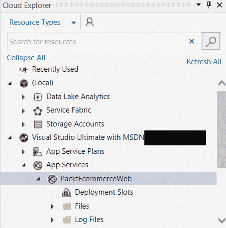

    图 14.25–Visual Studio 的云资源管理器

3.  要将调试器附加到应用服务，请在**操作**窗格中选择**附加调试器**。
4.  附加调试器后，应用将从 Azure 应用服务在浏览器中打开。我们可以像在本地开发环境中一样，在 Visual Studio 中添加断点并调试应用。

虽然这是调试远程部署的应用的一个强大功能，但是当将调试器附加到生产实例时，我们应该格外小心，因为我们将看到实时的客户数据。我们可以将调试器附加到 Azure 应用服务的暂存槽来调试和修复该问题，然后从那里交换暂存槽来将修复升级到生产。应用洞察和 Azure Monitor 中还有许多本章没有涉及的重要功能。强烈建议在 Azure 文档中进一步探讨它们。

# 总结

本章向您介绍了使用 Application Insights 进行运行状况检查和诊断应用问题的概念。我们已经学习了如何构建健康检查应用编程接口，并向我们的*电子商务*应用添加健康检查模块，这将帮助我们监控应用的健康状况。本章还介绍了 Azure Application Insights 的一些关键特性，这是一个捕获遥测和诊断问题的强大工具。

我们已经了解了 Application Insights 如何使用智能检测功能检测异常和警报。我们还了解了快照和远程调试，它们有助于解决在生产环境中运行的实时应用中的问题。

在下一章中，我们将学习不同的测试方法，以确保应用在部署到生产之前的质量。

# 问题

读完本章，我们应该能够回答以下问题:

1.  Periodic monitoring of the application is not that important for an application once it is deployed to production.

    a.真实的

    b.错误的

2.  What is the interface that a custom health check module should implement?

    a.`IHealth`

    b.`IApplicationBuilder`

    c.`IHealthCheck`

    d.`IWebHostEnvironment`

3.  What is the latency in displaying Live Metrics data in Application Insights?

    a.一分钟

    b.一秒钟

    c.10 秒

    d.5 秒钟

4.  What is the query language used to write queries in Application Insights logs?

    a.结构化查询语言

    b.C#

    c.Java Script 语言

    d .库索

# 进一步阅读

*   Azure 应用洞察文档:[https://docs . Microsoft . com/en-us/azure/azure-monitor/app/app-Insights-概述](https://docs.microsoft.com/en-us/azure/azure-monitor/app/app-insights-overview)