# *第 16 章*:在 Azure 中部署应用

部署是我们为使软件应用可供使用而执行的一组活动。一般的方法是获取代码，然后构建、测试并将其部署到目标系统。根据应用的类型和业务需求，部署代码的方法可能会有所不同。这可能很简单，只需关闭目标系统，用新版本替换现有代码，然后重新启动系统，也可能涉及其他复杂的方法，如蓝绿色部署，将代码部署到与生产环境相同的临时环境中，运行测试，然后将流量重定向到临时环境，使其成为生产环境。

现代软件开发采用敏捷和 DevOps 来缩短开发周期，频繁可靠地交付新功能、更新和 bug，为客户提供更多价值。要实现这一点，您需要一套工具来规划、协作、开发、测试、部署和监控。

在本章中，我们将了解什么是 Azure DevOps，以及它为快速可靠的交付提供的工具。

本章涵盖以下主题:

*   介绍 Azure DevOps
*   了解配置项管道
*   了解光盘管道
*   部署 ASP.NET 5 应用

# 技术要求

对于本章，您需要 Azure、Visual Studio 2019 和 Git 的基本知识，以及一个具有贡献者角色的活动 Azure 订阅。如果你没有，你可以在[https://azure.microsoft.com/en-in/free](https://azure.microsoft.com/en-in/free)注册一个免费账户。

章节的代码可以在这里找到:[https://github . com/PacktPublishing/Enterprise-Application-Development-with-C-Sharp-9-and-。NET-5/树/主/第 16 章](https://github.com/PacktPublishing/Enterprise-Application-Development-with-C-Sharp-9-and-.NET-5/tree/master/Chapter16)

# 介绍天青 DevOps

为了将一个产品的想法变为现实，不管你的团队规模有多大，你都需要一种有效的方法来规划你的工作，在你的团队中进行协作，以及构建、测试和部署。Azure DevOps 帮助您应对这些挑战，并为您的成功提供各种服务和工具。Azure DevOps 服务可以通过网络访问，也可以从流行的开发 ide 中访问，如 Visual Studio、Visual Studio Code、Eclipse 等。使用 Azure DevOps 服务器，Azure DevOps 服务既可以在云中使用，也可以在内部使用。

Azure DevOps 提供以下服务:

*   **Boards** :提供了一套工具来使用 Scrum 和看板方法来计划和跟踪你的工作、缺陷和问题
*   **回购**:提供源代码控制，使用 Git 或 **Team Foundation 版本控制** ( **TFVC** )管理您的代码
*   **管道**:提供一套服务支持**持续集成** ( **CI** )和**持续交付** ( **CD** )
*   **测试计划**:提供一套测试管理工具，通过端到端的可追溯性来提高应用的质量
*   **工件**:允许您共享来自公共和私有来源的包，以及与 CI 和 CD 管道集成

除了这些服务，Azure DevOps 还可以帮助您为团队管理维基、管理仪表板、使用小部件共享进度和趋势以及配置通知。它还允许您添加或开发自定义扩展，并与流行的第三方服务集成，如营火、Slack、Trello 等。

Azure DevOps 服务提供免费和付费订阅。要注册免费账户，请按照[https://docs . Microsoft . com/en-us/azure/devo PS/用户指南/注册-邀请-队友？view=azure-devops](https://docs.microsoft.com/en-us/azure/devops/user-guide/sign-up-invite-teammates?view=azure-devops) 。

以下是一个示例项目的主屏幕截图:


图 16.1–Azure DevOps 主页

让我们详细了解一下 Azure DevOps 和这些服务。

## 板子

**板**帮助您定义项目的流程，并跟踪您的工作。当您在 Azure DevOps 中创建新项目时，您可以选择一个流程模板，如敏捷、基本、Scrum 或 CMMI 流程。流程模板决定了您可以在项目中使用的工作项类型和工作流。工作项帮助您跟踪工作，工作流帮助您跟踪工作项的进度。下图显示了工作项的层次结构和 Scrum 流程模板的工作流:

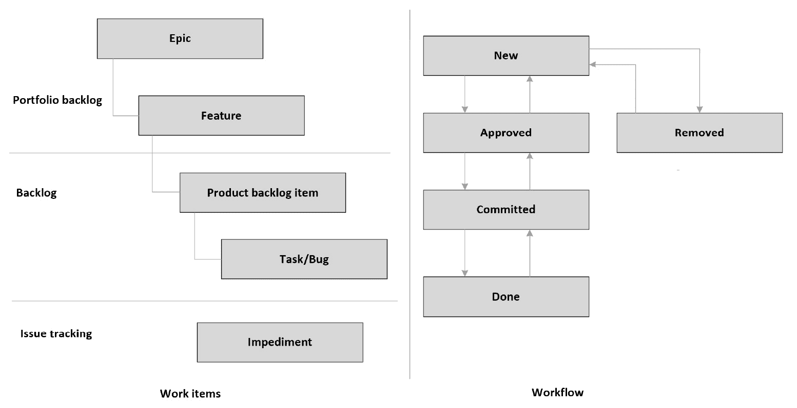

图 16.2–Scrum 流程中工作项和工作流的层次结构

要进一步定制或定义您的工作流和工作项类型，您可以选择基于前面提到的流程模板创建您自己的流程模板。

让我们更多地了解工作项和工作流。

### **工作项目**

工作项帮助您跟踪项目中的特性、需求和缺陷。您可以在层次结构中对需求进行分组。通常，我们从一个被称为**史诗**的高级需求开始，它可以进一步细分为**功能**和**产品积压项目**。产品积压项目是划分优先级、分配给团队成员并在冲刺阶段交付的交付件。**任务**是为积压项目和缺陷创建的，用于根据产品积压项目跟踪缺陷。

协作功能通过对工作项目的讨论或提问，实现团队内部的沟通。您可以提及某个团队成员或链接另一个工作项，并随时查看所有操作或讨论的历史记录。您也可以选择跟踪工作项，以便在更新时获得通知。

### **工作流程**

工作流帮助您项目的进度和健康状况。例如，使用**新的**状态创建产品积压项目。产品负责人审核通过后，转到**批准的**，然后在冲刺中优先分配给团队成员，转到**承诺的**，完成后转到**完成的**。工作流帮助您跟踪项目的运行状况。

您可以使用看板来查看所有工作项的状态，并使用拖放功能轻松地将工作项移动到不同的状态。下面的截图展示了由不同状态的工作项目组成的看板板:


图 16.3–看板仪表板

注意

如果您创建自己的流程模板，则可以自定义工作项或创建新的工作项，并自定义或定义工作流以满足您的业务需求。

要了解更多关于流程模板及其不同之处，您可以参考[https://docs . Microsoft . com/en-us/azure/devo PS/boards/入门/什么是 azure-boards？view=azure-devops &选项卡= scrum-process # work-item-type。](https://docs.microsoft.com/en-us/azure/devops/boards/get-started/what-is-azure-boards?view=azure-devops&tabs=scrum-process#work-item-types.)

接下来，让我们了解更多关于回购。

## 休息

**回购**提供版本控制工具，你可以用它来管理你的代码。版本控制系统允许您跟踪团队对代码所做的更改。它为每个更改创建一个快照，您可以随时查看该快照，并在需要时恢复到该快照。Azure DevOps 提供 **Git** 和 **TFVC** 作为你的版本控制系统。

Git 是目前最广泛使用的版本控制系统，并日益成为版本控制系统的标准。Git 是一个分布式版本控制系统，有一个版本控制系统的本地副本，使用它你可以在本地查看历史或提交更改即使你离线了，一旦连接到网络，它就会同步到服务器。然而，TFVC 是一个集中的版本控制系统，开发机器上每个文件只有一个版本，历史记录保存在服务器上。关于 Git 的更多信息，可以参考[https://docs.microsoft.com/en-in/azure/devops/repos/git/?对于 TFVC，你可以参考 https://docs.microsoft.com/en-in/azure/devops/repos/tfvc/?view=azure-devops](https://docs.microsoft.com/en-in/azure/devops/repos/git/?view=azure-devops) 。

以下是**回购**的关键服务:

*   **分支**是代码与您的承诺历史的引用。一个版本控制系统至少有一个分支，通常命名为`main`或`master`，你可以从中创建另一个分支。通过这种方式，您可以隔离您的更改，以便进行功能开发或错误修复。您可以创建任意数量的分支，在团队成员之间共享它们，提交您的更改，并安全地合并回`master`。
*   **Branch policies** help you to protect your branches during development. When you enable a branch policy on a branch, any change must be made via pull requests only, so that you can review, give feedback, and approve changes. As a branch policy, you can configure a minimum number of required approvers, check for linked work items and comment resolution, and enforce the build to be successful to complete pull requests.

    以下屏幕截图说明了在分支上定义的策略:


图 16.4–分支机构策略

这里，创建了一个策略来在代码合并到分支之前验证构建。

*   **拉取请求**允许您查看代码、添加注释，并确保在代码合并到您的分支之前解决这些请求。根据配置的分支策略，您可以添加强制审阅者来审阅和批准更改。您可以将工作项与拉取请求相关联，以实现变更的可追溯性。下面的截图说明了一个示例拉取请求:


图 16.5–拉取请求

拉取请求有标题和描述，用户可以查看文件并将其与以前的版本进行比较，检查构建和链接工作项的状态，并进行批准。

接下来，让我们了解管道。

## 管道

**管道**允许你配置、构建、测试和部署你的代码到任何目标系统。使用管道，您可以启用 CI 和 CD 来实现代码的一致和高质量交付。您可以使用针对使用流行语言构建的许多应用类型的管道，例如。NET、Java、JavaScript、Node.js、PHP、C++等等，并把它们部署到云或内部服务器上。您可以使用 YAML 文件或基于用户界面的经典编辑器来定义管道。

CI 为您的项目自动化构建和测试，以确保质量和一致性。配置项可以配置为在新代码合并到分支时或两者都合并时按计划运行。配置项生成由光盘管道用来部署到目标系统的工件。

光盘使您能够自动将代码部署到目标系统并运行测试。光盘可以配置为按计划运行。

接下来，让我们更多地了解测试计划。

## 测试计划

Azure DevOps 提供了一套工具来提高项目的质量。它为基于浏览器的测试管理解决方案提供了手动和探索性测试所需的所有功能。它提供了在**测试套件**或**测试计划**下组织**测试用例**的能力，通过这些测试用例，您可以跟踪特性或版本的质量。这些解释如下:

*   **测试用例**用于验证应用的各个部分。它们包含测试步骤，您可以使用这些步骤来断言需求。您可以通过将测试用例导入测试套件或测试计划来重用它。
*   **测试套件**是一组测试用例，被执行来验证一个特性或者一个组件。您可以创建静态测试套件、基于需求的套件和基于查询的套件。
*   **测试计划**是一组测试套件或测试用例，用于跟踪发布的每次迭代的质量。

接下来，让我们了解更多关于工件的知识。

## 器物

**工件**使得团队之间共享代码变得容易。您可以轻松创建和共享来自公共和私有来源的 Maven、npm 或 NuGet 包提要，它们在 CI 和 CD 管道中很容易使用。工件基于标准的打包格式，可以很容易地与开发 ide(如 Visual Studio)集成为一个包源。

Azure DevOps 支持团队内部的协调和协作，并帮助您以高质量一致地交付项目。使用配置项和光盘，您可以自动构建和部署代码。

在下一节中，让我们了解 CI 管道。

# 了解 CI 管道

配置项是一种实践，在这种实践中，您可以自动构建和测试代码。在 Azure DevOps 中，您可以创建管道，并将其配置为当代码合并到您的目标(主/主)分支时自动触发，或者按计划运行，或者两者都有。您可以选择使用 YAML 文件或基于用户界面的经典编辑器创建管道。

下图说明了从开发人员的机器到云的典型代码流:


图 16.6–典型的代码流程

从前面的截图中，我们看到了以下内容:

1.  开发人员使用诸如 Visual Studio、Visual Studio Code 或 Visual Studio for Mac 等开发工具来开发代码。
2.  代码更改被移动到存储库中。
3.  触发配置项管道，验证构建，运行测试，并发布工件。光盘管道被触发，它将代码部署到目标系统。
4.  The developer uses Application Insights to continuously monitor and improve the application.

    注意

    **YAML** (简称 **YAML 不是标记语言**)是定义管道的首选方式。它提供了与经典编辑器相同的功能。您可以将这些文件签入存储库，并像管理任何其他源文件一样管理它们。更多详情可以参考[https://docs . Microsoft . com/en-us/azure/devo PS/pipelines/YAML-schema？view=azure-devops &选项卡= schema % 2 parameter-schema](https://docs.microsoft.com/en-us/azure/devops/pipelines/yaml-schema?view=azure-devops&tabs=schema%2Cparameter-schema)。

让我们了解一个管道的核心组件和流程。

## 了解管道的流量和部件

一个**管道**是一组动作的定义，这些动作将被执行来构建和测试你的代码。管道定义包含一个**触发器**、**变量**、**阶段**、**作业**、**步骤**和**任务**。当我们运行一个管道时，它执行管道定义中定义的**任务**。让我们在接下来的章节中了解这些组件。

### 引发

一个**触发器**是一个配置，它定义了管道应该何时运行。您可以将管道配置为在新代码合并到您的 repo 时、以预定的时间间隔或在另一个构建完成后自动运行。所有这些配置都是在管道的触发器部分定义的。

在下面的代码片段中，管道被配置为当代码被推送到`master`分支或`releases`文件夹下的任何分支时触发。或者，我们也可以在管道中指定路径过滤器，以便仅当满足路径条件的代码发生更改时才触发:

```cs
trigger:
  branches:
    include:
 - master
 - releases/*
  paths:
    include:
    - web
    exclude:
    - docs/README.md
```

您还可以将管道配置为根据计划自动运行。在下面的代码片段中，管道被配置为每天上午 9:30 运行。计划是使用`cron`表达式指定的，您可以指定多个计划。如果将`always`设置为`true`，即使代码没有变化，也会触发构建:

```cs
schedules:
- cron: "30 9 * * *"
  displayName: Daily build
  branches:
    include:
    - master
  always: false
```

### **变量**

**变量**可以用一个值定义，并在管道的多个地方重用。您可以在根、阶段或工作中定义变量。管道中可以使用三种不同类型的变量——用户定义变量、系统变量和环境变量:

```cs
variables:
 buildConfiguration: 'Release'
. . . .
. . . .
- task: DotNetCoreCLI@2
  displayName: Publish
  inputs:
   command: 'publish'
   publishWebProjects: false
   projects: '**/*HelloWorld.csproj'
 arguments: '--configuration $(BuildConfiguration) --output $(build.artifactstagingdirectory)/web'
```

在前面的代码片段中，`buildConfiguration`变量是用`Release`值定义的，并在任务的`arguments`部分使用。`build.artifactstagingdirectory`是一个包含工件目录位置的系统变量。

### 阶段

**阶段**是默认情况下顺序运行的作业的集合。您还可以指定前一阶段执行状态的条件，或者添加批准检查来控制阶段应该何时运行。

以下是具有多个阶段的管道定义示例:

```cs
stages:
- stage: Build
  jobs:
  - job: build
    steps:
    - script: echo building code
- stage: Test
  jobs:
  - job: windows
    steps:
    - script: echo running tests on windows
  - job: linux
    steps:
    - script: echo running tests on Linux
- stage: Deploy
  dependsOn: Test
  jobs:
  - job: deploy
    steps:
    - script: echo deploying code
```

在前面的示例中，配置了三个阶段，每个阶段按顺序运行。`Test`阶段包含两个可以并行运行的作业，`Deploy`阶段依赖于`Test`阶段。

下面是前面示例的执行摘要的屏幕截图，您可以单击每个阶段来查看日志:


图 16.7–管道运行总结

### **作业**

**作业**是在代理池上运行的步骤的集合。此外，您可以配置为有条件地运行作业或添加对先前作业的依赖。在下面的代码片段中，作业是用`testNull`变量上的一个步骤和一个条件定义的:

```cs
variables:
- name: testNull
  value: ''
jobs:
  - job: BuildJob
    steps:
    - script: echo Building!
 condition: eq('${{ variables.testNull }}', '')
```

在前面的代码中，作业被配置为只有当`testNull`为空时才运行。

#### 步骤和任务

**步骤**是你的管道的一组任务。这些可以是构建你的代码，运行测试，或者发布工件。每个步骤都在代理上执行，并且可以访问管道工作区。

**任务**是管道自动化的构建模块。您可以使用许多内置任务，也可以创建自己的自定义任务并在管道中使用。例如，下面的代码片段使用`DotNetCoreCLI@2`任务构建`csproj`:

```cs
- task: DotNetCoreCLI@2
  displayName: build
  inputs:
   command: 'build'
   projects: '**/*.csproj'
   arguments: '--configuration $(BuildConfiguration)'
```

想了解更多关于管道的信息，可以参考[https://docs . Microsoft . com/en-in/azure/devo PS/pipelines/create-first-pipeline？view=azure-devops &选项卡= Java % 2 ctfs-2018-2% 2 browser](https://docs.microsoft.com/en-in/azure/devops/pipelines/create-first-pipeline?view=azure-devops&tabs=java%2Ctfs-2018-2%2Cbrowser)。

在下一节中，让我们了解更多关于光盘管道的信息。

# 了解光盘管道

CD 是一个将代码自动部署到目标环境的过程。CD 管道使用 CI 管道产生的工件，并部署到一个或多个环境中。像配置项管道一样，我们可以使用 YAML 文件或经典编辑器来定义光盘管道。您可以指定前一阶段执行状态的条件，或者添加要部署的批准检查，这是生产部署中非常常见的场景。

您还可以配置为运行自动化用户界面测试，以便在部署后执行健全性检查。根据健全性检查结果，您可以配置为自动将代码提升到更高的环境。

在任何时候，如果阶段部署失败，我们可以重新部署以前版本的代码。根据项目设置下配置的保留策略，Azure DevOps 会保留构建工件，以便随时轻松部署任何版本的代码。如果您发现应用部署后有任何问题，您可以很容易地找到最后一个已知的好版本，并部署代码以最大限度地减少业务影响。

让我们在下一节中了解更多这方面的内容。

## 持续部署与持续交付

连续部署是自动化的部署到目标系统，每当新代码合并到您的 repo，而连续交付使应用可以随时部署到目标系统。Azure DevOps 提供多级管道；您可以配置带有阶段的管道来实现这一点。

连续部署通常配置在较低的环境中，例如开发或测试，而对于较高的环境，例如试运行或生产，您应该考虑连续交付，以便您可以在较低的环境中验证更改，并批准将代码部署到较高的环境中。

下面的截图展示了一个多阶段管道，自动构建并发布到 dev，并在测试阶段等待批准。在这种情况下，要发布代码进行测试，需要批准:


图 16.8–等待批准的多级管道

要了解更多关于如何在 Azure 管道上配置审批和检查的信息，可以参考[https://docs . Microsoft . com/en-in/Azure/devo PS/pipelines/process/approvals？视图=天蓝色-devops &选项卡=检查-通过](https://docs.microsoft.com/en-in/azure/devops/pipelines/process/approvals?view=azure-devops&tabs=check-pass)。

要查看管道运行的详细信息，您可以单击任何阶段来查看该运行的日志。日志帮助我们排除部署故障。以下屏幕截图说明了管道运行的日志:


图 16.9–管道执行细节

在前面的截图中，您会注意到您可以查看管道中配置的阶段、作业和任务，并且您可以单击任务查看日志。

在下一节中，我们将学习如何创建管道来构建和部署应用。

# 部署 ASP.NET 5 应用

到目前为止，在本章中，我们已经探索了 Azure DevOps，了解了它提供的工具和服务，然后了解了 CI 和 CD 管道。在本节中，我们将学习如何创建 Azure DevOps 项目、克隆存储库、将代码推送到存储库，以及创建 CI 和 CD 管道来将代码部署到 Azure App Service。

注意

请务必查看*技术要求*部分，以确保在部署示例应用之前已经设置好了一切。

您可以按照以下步骤将 ASP.NET 5 应用部署到 Azure:

1.  登录您的 Azure DevOps 帐户。如果您没有 Azure DevOps 帐户，请创建一个；可以按照[https://docs . Microsoft . com/en-us/azure/devo PS/用户指南/注册-邀请-队友给出的步骤操作？view=azure-devops](https://docs.microsoft.com/en-us/azure/devops/user-guide/sign-up-invite-teammates?view=azure-devops) 。
2.  On the home page of Azure DevOps, provide a name for your project, say, `HelloWorld`, for **Version control**, choose **Git**, and for **Work item process**, you can choose **Agile**. This is shown in the following screenshot:

    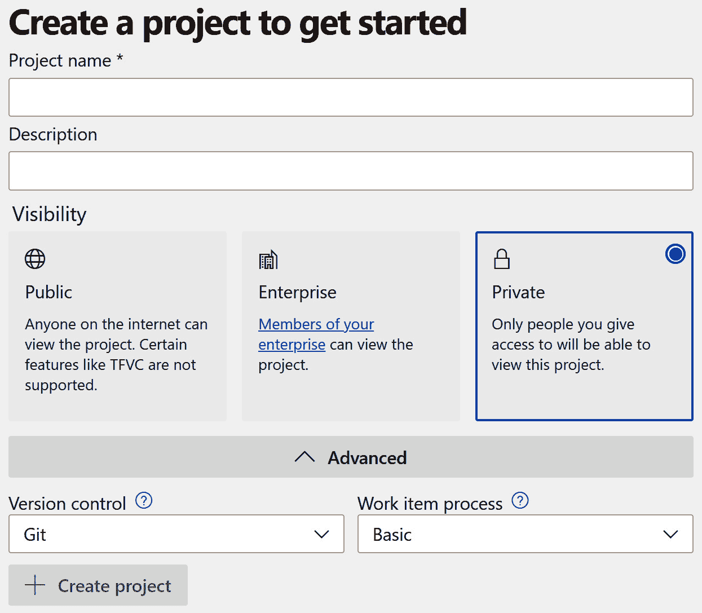

    图 16.10–新的 Azure DevOps 项目

3.  Now, let's create a service connection, which we will use in the pipeline to connect and deploy code to Azure App Service.

    从左侧菜单，导航至**项目设置** | **服务连接** | **创建服务连接** | **Azure 资源管理器** | **服务主体(自动)**:

    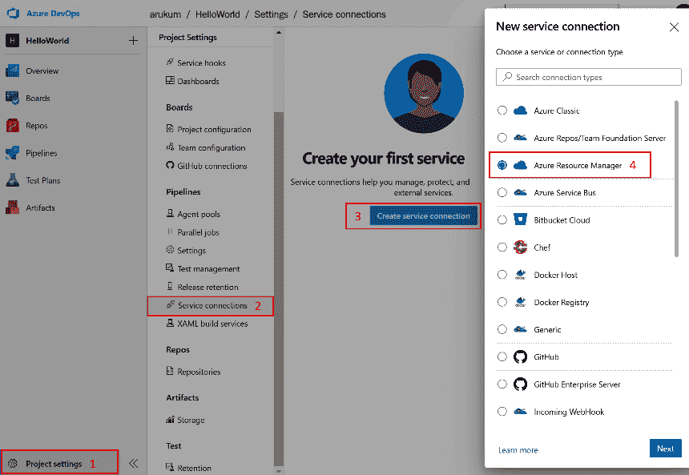

    图 16.11–新服务主体

    服务主体允许管道连接到您的 Azure 订阅，以管理资源或将您的代码部署到 Azure 服务。

4.  Select a subscription and provide a name for the connection to create a service connection. Azure DevOps uses this service connection to connect Azure resources and deploy code:

    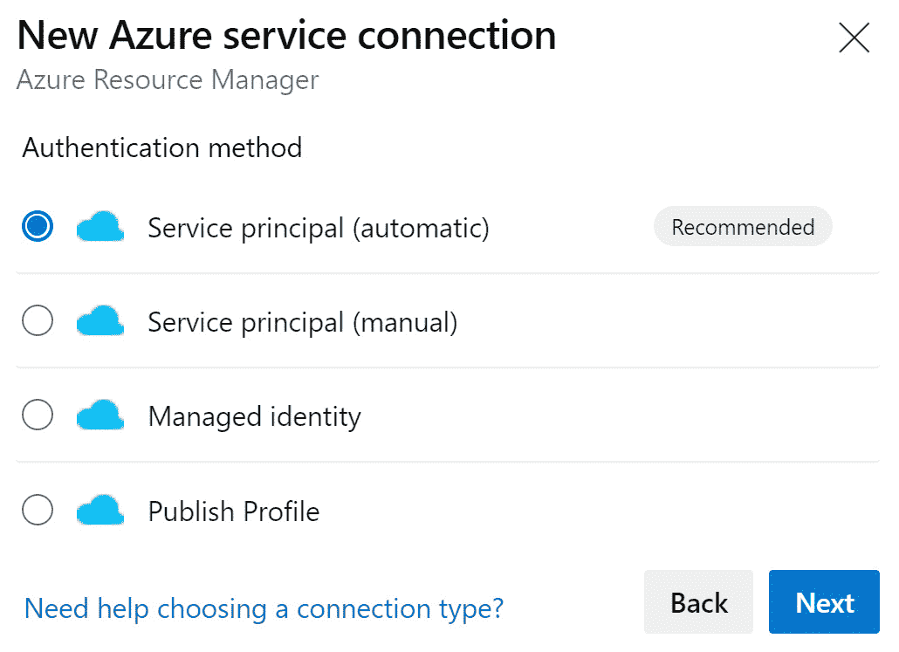

    图 16.12–新服务主体

5.  Once the project is created, you should see a page similar to the following. From the left menu, under **Repos**, select **Branches**:

    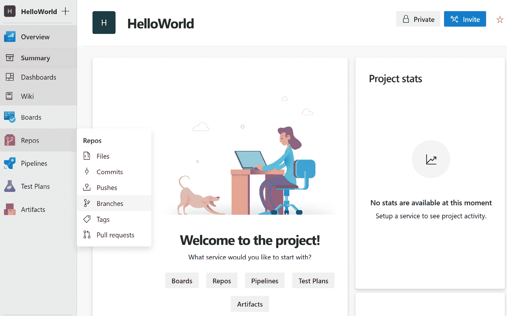

    图 16.13–Azure DevOps 主屏幕

6.  Copy the link, which we will use to clone the repository to our local machine:

    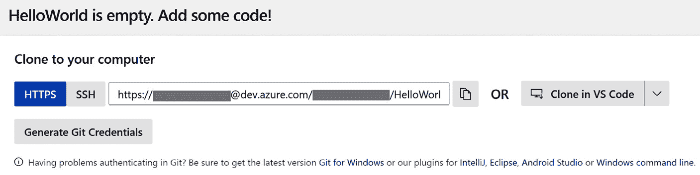

    图 16.14–克隆存储库

7.  To clone the repository to your system, open Command Prompt and navigate to a folder to which you want to clone the code, then run the following command.

    将`<organization>`替换为您的 Azure DevOps 组织:

    ```cs
    git clone https://<organization>@dev.azure.com/<organization>/HelloWorld/_git/HelloWorld
    ```

8.  由于我们的存储库是新的空的，我们需要向它添加代码。以下命令创建一个 ASP.NET 5 应用和一个 xUnit 项目，创建一个解决方案文件，并向其中添加一个 web 和测试项目。Ru n 每个命令依次继续:

    ```cs
    dotnet new mvc --auth Individual -o HelloWorld
    dotnet new xunit -o HelloWorld.Tests
    dotnet new sln
    dotnet sln add HelloWorld/HelloWorld.csproj
    dotnet sln add HelloWorld.Tests/HelloWorld.Tests.csproj
    ```

9.  运行以下命令来构建代码并运行测试来验证是否一切正常:

```cs
dotnet build
dotnet test
```

现在我们已经测试了代码，接下来让我们看看如何为使用代码的 CI 和 CD 创建管道。

## 为配置项和光盘创建管道

在运行测试之后，我们需要看看配置项和光盘管道是如何创建的。请执行以下步骤:

1.  Next, we need to create a pipeline for CI and CD. You can use the code available at [https://github.com/PacktPublishing/Enterprise-Application-Development-with-C-Sharp-9-and-.NET-5/blob/master/Chapter16/Pipelines/HelloWorld/azure-ci-pipeline.yml](https://github.com/PacktPublishing/Enterprise-Application-Development-with-C-Sharp-9-and-.NET-5/blob/master/Chapter16/Pipelines/HelloWorld/azure-ci-pipeline.yml) and save it in the root directory of the repository. Let's name it `azure-ci-pipeline.yml`.

    该管道被配置为当新代码合并到`main`分支时触发。

2.  它被配置为具有三个阶段——构建、开发和测试——其中构建阶段被配置为构建代码、运行单元测试和发布工件。开发和测试阶段被配置为将代码部署到 Azure 应用服务。
3.  Dependencies are configured at the dev and test stages, where the dev stage depends on build and test depends on the dev stage.

    让我们检查一下这个 YAML 文件的几个重要部分。

    下面的代码片段包含一个定义变量的部分:

    ```cs
    trigger:
    - main
    variables:
      BuildConfiguration: 'Release'
      buildPlatform: 'Any CPU'
      solution: '**/*.sln'
      azureSubscription: 'HelloWorld-Con' # replace this with your service connection name to connect Azure subscription
      devAppServiceName: 'webSitejtrb7psidvozs' # replace this with your app service name
      testAppServiceName: 'webSitejtrb8psidvozs' # replace this with your app service name
    ```

    您会注意到在 YAML 文件中声明了三个变量。保存文件之前，请提供适当的值:

    *   `azureSubscription`:提供服务连接的名称。
    *   `devAppServiceName`:为开发部署提供应用服务的名称。
    *   `testAppServiceName`: Provide the name of the app service for test deployment.

        为了构建代码，我们使用`DotNetCoreCLI@2`任务并配置`command`、`projects`，以及可选的`arguments`:

        ```cs
        - task: DotNetCoreCLI@2
          displayName: Build
          inputs:
            command: 'build'
            projects: '**/*.csproj'
        ```

        `command`配置为`build`，对于要构建代码的项目，路径设置为`csproj`。此任务运行。NET CLI 命令，因此我们也可以用其他命令来配置这个任务。NET CLI 命令，如`run`、`test`、`publish`、`restore`等。

4.  To publish code, the `PublishBuildArtifacts@1` task is used. It is configured with `PathToPublish`, `ArtifactName`, and `publishLocation`:

    ```cs
    - task: PublishBuildArtifacts@1
      inputs:
        PathtoPublish: '$(Build.ArtifactStagingDirectory)/web'
        ArtifactName: 'drop'
        publishLocation: 'Container'
    ```

    `PathToPublish`配置有构建工件可用的工件目录的位置，`ArtifactName`为`drop`，而`publishLocation`为`Container`将工件发布到 Azure Pipelines。或者，我们也可以将`publishLocation`配置为`FileShare`。

    以下代码片段执行部署代码所需的操作:

    ```cs
    - download: current
      artifact: drop
    - task: AzureWebApp@1
      displayName: 'Azure App Service Deploy: website'
      inputs:
        azureSubscription: '$(azureSubscription)'
        appType: 'webApp'
        appName: '$(devAppServiceName)'
        package: '$(Pipeline.Workspace)/drop/*.zip'
        deploymentMethod: 'auto'
    ```

    在部署作业中，第一步是下载工件，工件的名称应该与`PublishBuildArtifacts@1`任务中配置的名称相同，在本例中为`drop`。

    `AzureWebApp@1`任务用于将工件部署到 Azure 应用服务。所需参数为`azureSubscription`、`appType`、`appName`、`package`、`deploymentMethod`(作为`auto`)。

既然工件已经准备好了，我们就可以看到代码是如何提交的，以及代码更改是如何推送的。

### 推送代码

现在代码和管道已经准备好了，下一步是提交这些更改并将其推送到 Azure DevOps 存储库。

1.  在命令提示符下，运行以下命令在本地提交更改并将其推送到 Azure DevOps:

    ```cs
    git add .
    git commit -m "Initial Commit"
    git push
    ```

2.  In Azure DevOps, navigate to **Pipelines** and click **Create Pipeline** to create a new pipeline:

    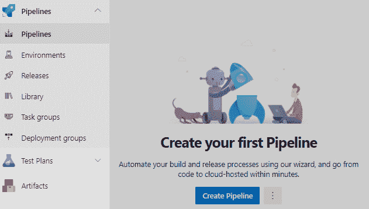

    图 16.15–新管道

3.  To configure the pipeline, we need to perform four steps. Select the service in which your repo resides, select the repo, configure the pipeline, and save. For this implementation, select **Azure Repos Git** to continue, and then select your repo:

    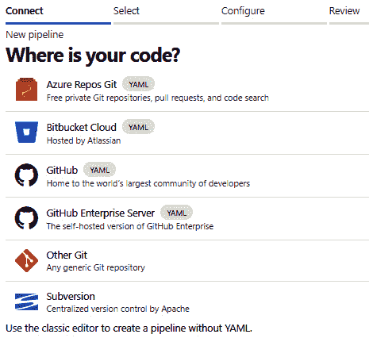

    图 16.16–源代码管理选择

4.  In the **Configure** tab, choose **Existing Azure Pipelines YAML file** to continue:

    

    图 16.17–配置管道

5.  Select the pipeline file we saved earlier in the repo and click **Continue**, and then click **Run** to trigger the pipeline:

    

    图 16.18–YAML 文件选择

6.  This will open a page in which we can see the state of the pipeline. The following screenshot is taken from the pipeline run. You will notice three stages have been created:

    

    图 16.19–管道运行总结

    在构建阶段，您会注意到两个作业正在进行中。

    开发阶段和测试阶段正在等待构建完成。

    或者，您可以在 Azure 应用服务上启用部署槽，并配置管道将代码部署到非生产部署槽，例如*预生产*。一旦您检查了部署代码的健全性，您就可以将*生产*槽与*预生产*交换。交换是即时的，没有任何停机时间，您可以让用户获得最新的变化。如果您注意到任何问题，您可以切换回上一个插槽，返回到上一个已知良好的版本。更多信息可参考[https://docs . Microsoft . com/en-us/azure/app-service/deploy-staging-slots](https://docs.microsoft.com/en-us/azure/app-service/deploy-staging-slots)。

7.  After the pipeline execution is complete, navigate to **Environments** under **Pipelines** from the left menu. You will notice the dev and test environments are created:

    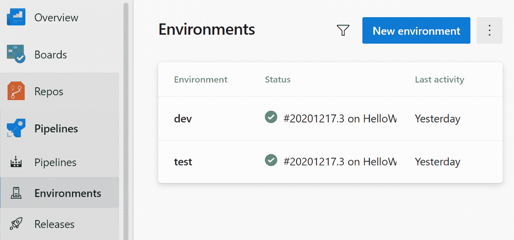

    图 16.20–环境

8.  Click on the **test** stage and in the more actions selection, select **Approvals and checks** to continue:

    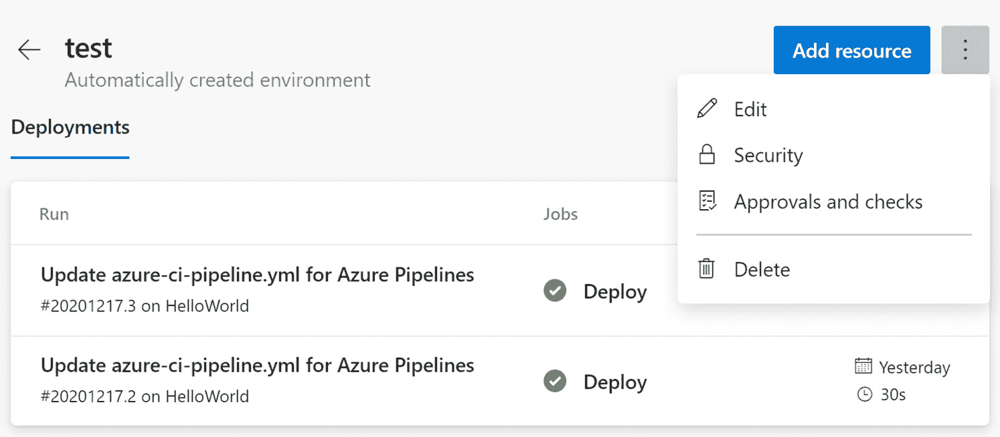

    图 16.21–批准和检查

9.  You will find many options to choose from, such as **Approvals**, **Branch control**, **Business Hours**, and so on:

    

    图 16.22–添加支票

10.  Select **Approvals** to continue and it will open a dialog where we can select users/groups as approvers. Provide the necessary details and click **Create**:

    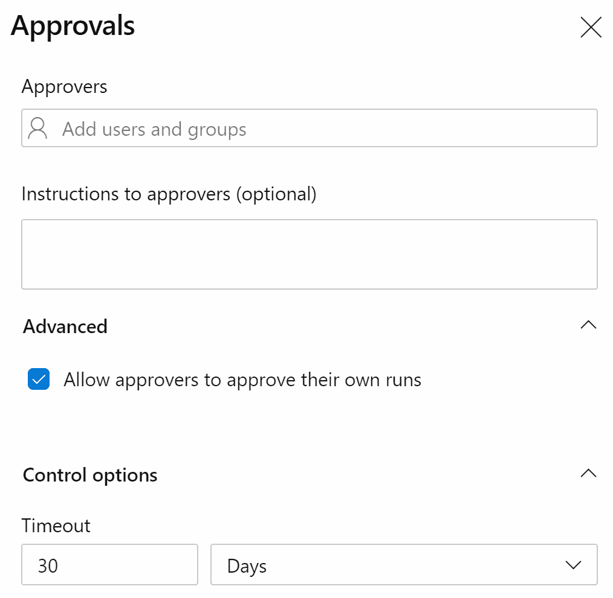

    图 16.23–添加批准

11.  Re-run the pipeline to test the changes. You will notice the pipeline is waiting to execute at the test stage:

    

    图 16.24–等待批准的多级管道

12.  点击**审核**，系统将打开一个对话框，进行批准或拒绝。点击**批准**完成部署:


图 16.25–批准或拒绝

总之，在本节中，我们首先在 Azure DevOps 中创建了一个新项目，然后将 repo 克隆到一个本地系统，使用创建了一个简单的 ASP.NET Core 应用。NET CLI，在 YAML 创建了一个管道来构建、测试和发布工件，并将它们部署到 Azure App Service，并将代码提交并推回到 repo。接下来，我们通过在报告中选择一个 YAML 文件来创建一个新的配置项/光盘管道，并触发了该管道。在**环境**中，我们配置了批准检查，并触发了管道来查看其工作方式。

# 总结

在本章中，我们了解了什么是 Azure DevOps，以及它提供的工具和服务。我们理解了诸如板、回购、管道、测试计划和工件等服务如何帮助我们高效地执行项目。

接下来，我们看了 CI 和 CD 管道及其核心组件。我们还了解了它们如何帮助我们自动化代码的构建和部署。我们通过学习创建 ASP.NET 5 应用以及使用配置项和光盘管道构建和部署到 Azure 应用服务的管道来结束本章。

我希望这本书能帮助你提高你的英语水平。NET 的技能，并激励您尝试和构建更多的应用。通过参考笔记和章节的“进一步阅读”部分，您可以探索更多的主题。

对于企业应用，我们还介绍了典型电子商务应用的快乐之路场景，它可以基于第 1 章“设计和构建企业应用”中定义的需求进行进一步扩展。有一些例子可以扩展端到端流的身份验证/授权，使用应用编程接口网关进行服务到服务的通信和身份验证，实现通知服务等，供您了解更多信息。

我们祝愿您在 C#和中一切顺利。NET 项目，快乐学习！

# 问题

1.  How does continuous deployment differ from continuous delivery?

    a.连续交付与数据库协同工作，连续部署支持 web 应用。

    b.连续部署在每个时间发布到一个环境*，而连续交付在任何*时间发布到一个环境*。*

    c.持续部署需要云，而持续交付需要内部服务器。

    d.连续部署在任何一次*发布到环境中，而连续交付在每一次*发布到环境中*。*

2.  What are the characteristics of the CD approach? (Choose two.)

    a.专注于缩短周期时间

    b.少量复杂的释放

    c.基于资源的流程管理

    d.自我管理和响应迅速的团队

3.  Which component provides the first feedback on the quality of committed application code changes?

    a.自动化部署

    b.自动供应

    c.自动化构建

    d.自动化测试

# 进一步阅读

想了解更多关于 Azure DevOps 的信息，可以参考[https://docs . Microsoft . com/en-in/Azure/devo PS/用户指南/服务？view=azure-devops](https://docs.microsoft.com/en-in/azure/devops/user-guide/services?view=azure-devops) ，对于 Pipelines，可以参考[https://docs . Microsoft . com/en-in/azure/devo PS/Pipelines/入门/Pipelines-入门？view=azure-devops](https://docs.microsoft.com/en-in/azure/devops/pipelines/get-started/pipelines-get-started?view=azure-devops) 。