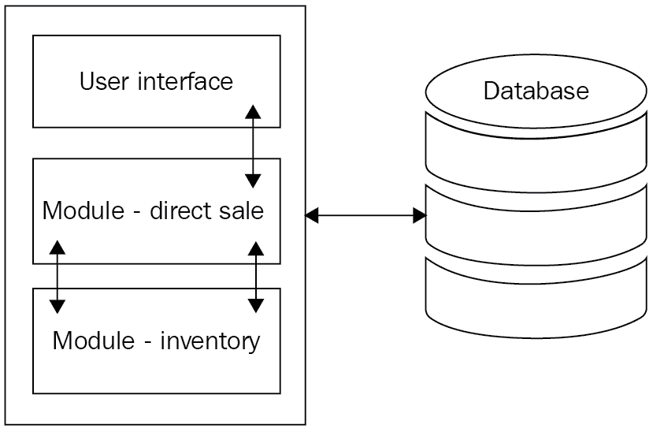
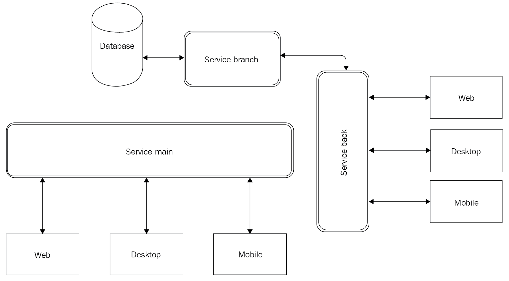
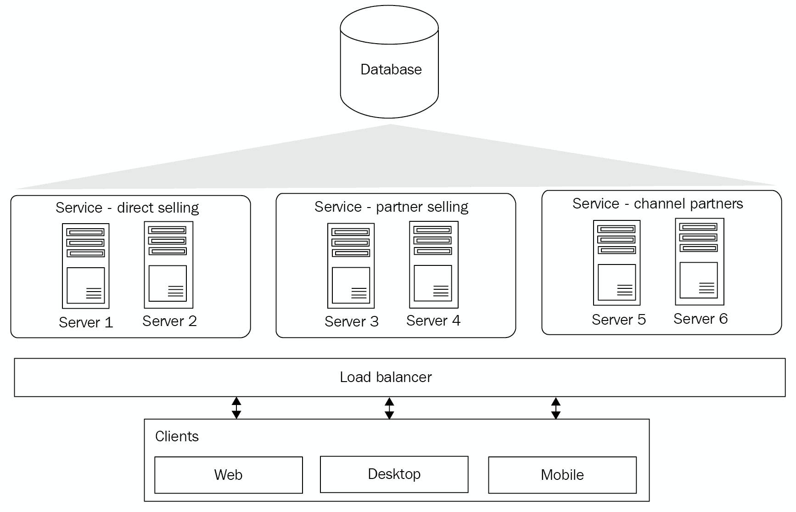
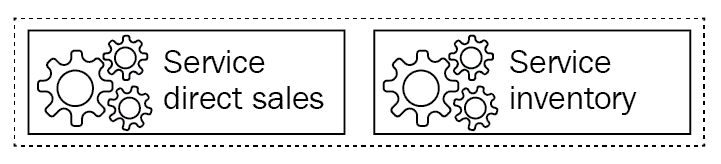
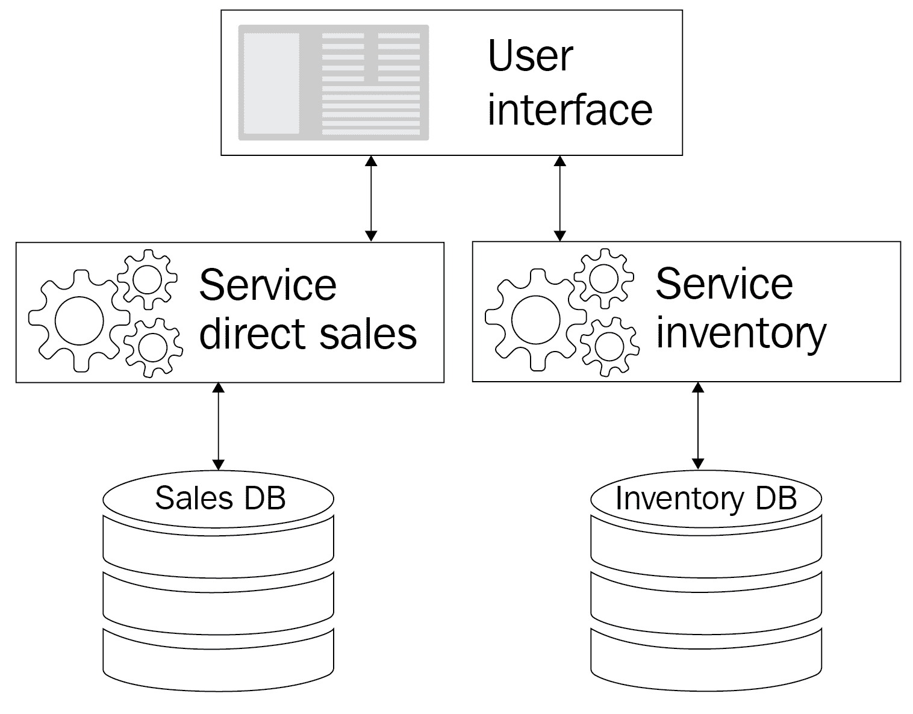
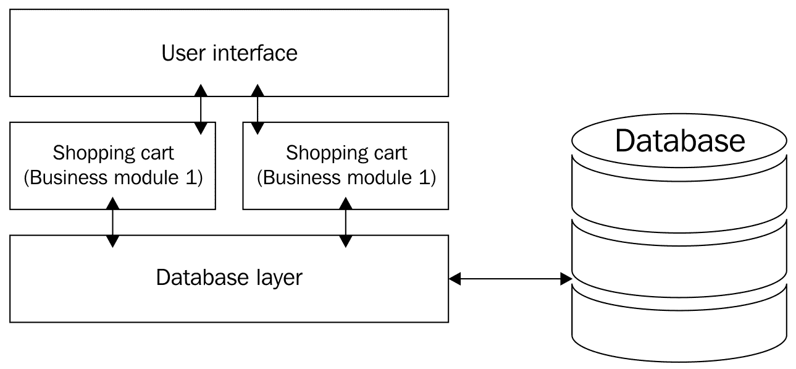
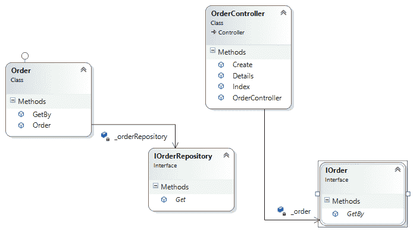
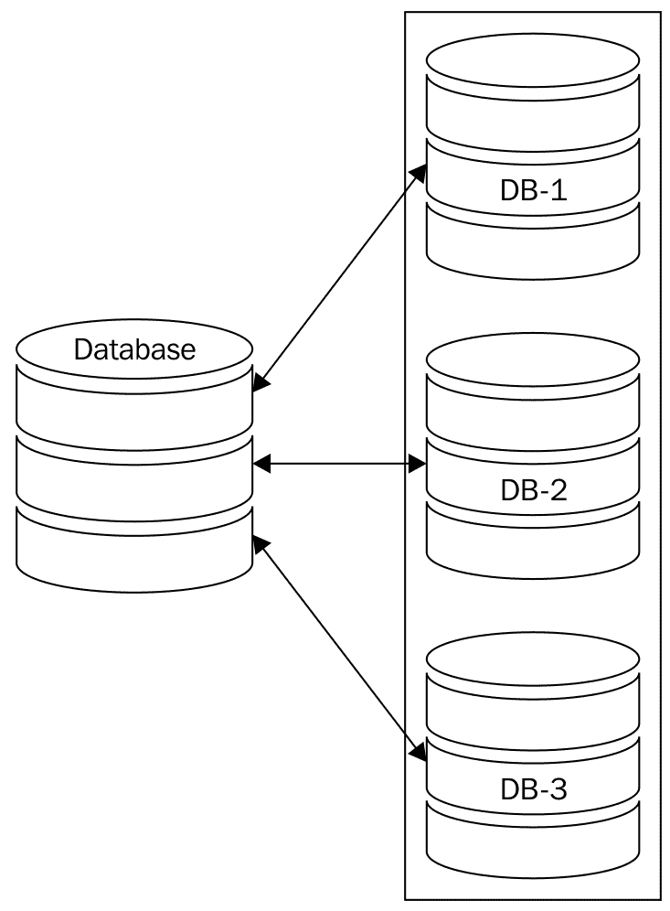
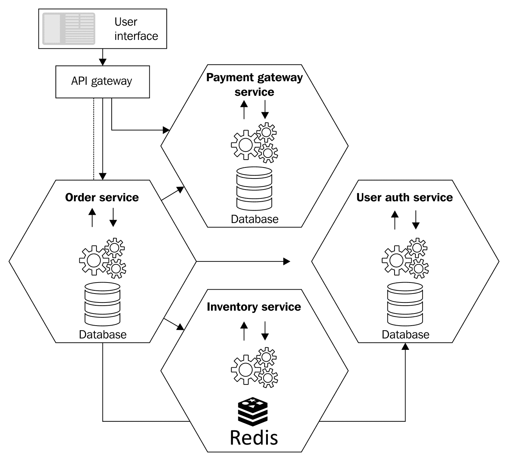

# 微服务简介

本章的重点是让您熟悉微服务。将您的应用分割成许多服务既不是面向服务架构的特征，也不是微服务的特征。然而，微服务结合了服务设计和来自 SOA 世界的最佳实践，以及一些新兴的实践，例如隔离部署、语义版本控制、提供轻量级服务以及多语种编程中的服务发现。我们实施微服务来满足业务功能，从而缩短上市时间并提高灵活性。

我们将在本章中讨论以下主题:

*   微服务的起源
*   讨论微服务
*   了解微服务架构
*   微服务的优势
*   SOA 与微服务
*   理解整体建筑风格的问题
*   . NET 堆栈标准化的挑战
*   Azure 服务结构概述

在这一章中，我们将熟悉分层单片体系结构带来的问题。我们还将讨论在整体世界中这些问题的解决方案。在这一章的最后，我们将能够把一个单一的应用分解成一个微服务架构。

# 技术要求

本章包含各种代码示例来解释这些概念。代码保持简单，仅用于演示目的。

要运行和执行代码，您需要以下先决条件:

*   Visual Studio 2019
*   。网络核心 3.1

要安装和运行这些代码示例，您需要安装 Visual Studio 2019(首选 IDE)。为此，请从安装说明中提到的下载链接下载 Visual Studio 2019(社区版，免费):[https://docs . Microsoft . com/en-us/visualstudio/install/install-Visual Studio](https://docs.microsoft.com/en-us/visualstudio/install/install-visual-studio)。Visual Studio 安装有多个版本。我们使用的是视窗操作系统。

如果你没有.NET Core 3.1 安装完毕，可以从以下链接下载:[https://www.microsoft.com/net/download/windows](https://www.microsoft.com/net/download/windows)。

The complete source code is available here: [https://github.com/PacktPublishing/Hands-On-Microservices-with-CSharp-8-and-.NET-Core-3-Third-Edition/tree/master/Chapter%2001](https://github.com/PacktPublishing/Hands-On-Microservices-with-CSharp-8-and-.NET-Core-3-Third-Edition/tree/master/Chapter%2001)

# 微服务的起源

在讨论细节之前，我们应该探索微服务的起源或者任何新的框架、语言等等。微服务是一个流行词，我们应该意识到这种架构风格是如何发展到现在这个趋势的。有几个原因让你熟悉任何语言或框架的起源。要知道的最重要的事情如下:

*   特定的语言或框架是如何进入语境的。
*   谁是微服务新趋势架构风格的幕后推手？
*   它是在什么地方建立的。

现在我们来讨论一下微服务的起源。术语**微服务**在 2011 年年中的一次软件架构师研讨会上首次被使用。2012 年 3 月，詹姆斯·刘易斯提出了他关于微服务的一些想法。到 2013 年底，来自 IT 行业的各种团体开始讨论微服务，到 2014 年，这个概念变得足够流行，被认为是大型企业的有力竞争者。

微服务没有官方定义。对这个术语的理解纯粹是基于用例和过去的讨论。

2014 年，詹姆斯·刘易斯和马丁·福勒走到一起，提供了一些真实世界的例子，并展示了微服务(参考[http://martinfowler.com/microservices/](http://martinfowler.com/microservices/))。

The development of a single application by combining small services (running on their processes) is called a microservice architectural style. Each service carries business capabilities and is independently deployed. Moreover, these services can be written in different languages and have different database storage.

微服务的微软官方文档页面(参考[https://docs . Microsoft . com/en-us/azure/architecture/guide/architecture-style/微服务](https://docs.microsoft.com/en-us/azure/architecture/guide/architecture-styles/microservices))对微服务架构风格的定义如下:

"Microservices architecture is a bunch of services, where each service is independently deployed and should implement a single business capability."

看到刘易斯和福勒在这里定义的所有属性是非常重要的。他们将微服务定义为一种架构风格，开发人员可以利用这种风格来开发单个应用，业务逻辑分布在一堆小服务中，每个服务都有自己的持久存储功能。此外，请注意它的属性:它可以独立部署，可以在自己的进程中运行，是一种轻量级的通信机制，并且可以用不同的编程语言编写。

我们想强调这个具体的定义，因为它是整个概念的关键。随着我们的前进，当我们读完这本书时，所有的部分都会合在一起。目前，我们将详细研究微服务。

# 讨论微服务

我们已经讨论了微服务的一些定义；现在让我们详细讨论一下。

简而言之，微服务架构消除了 SOA 的大部分缺点。它也比 SOA 服务更面向代码(我们将在接下来的章节中详细讨论这一点)。

在我们继续理解架构之前，让我们讨论导致其存在的两个重要架构:

*   整体建筑风格
*   前进速度

我们大多数人都知道，当我们开发一个企业应用时，我们必须选择一种合适的架构风格。然后，在不同的阶段，初始模式被进一步改进和调整，以适应各种挑战，例如部署复杂性、庞大的代码库和可伸缩性问题。这正是单体架构风格如何演变成 SOA，然后导致微服务的原因。

# 探索整体架构

单体建筑风格是一种传统的建筑类型，在信息技术行业得到了广泛的应用。monolithic 一词并不新鲜，它是从 Unix 世界借用来的。在 Unix 中，大多数命令作为独立程序存在，其功能不依赖于任何其他程序。如下图所示，应用中可以有不同的组件，包括:

*   **用户界面**:这处理所有的用户交互，同时用 HTML、JSON 或任何其他首选的数据交换格式(在网络服务的情况下)进行响应。
*   **业务逻辑**:这包括应用于以用户输入、事件和数据库形式接收的输入的所有业务规则。
*   **数据库访问**:这包含了为了查询和持久化对象而访问数据库的完整功能。一个被广泛接受的规则是，它是通过业务模块使用的，而不是直接通过面向用户的组件。

使用这种架构构建的软件是独立的。我们可以想象一个。包含各种组件的. NET 程序集，如下图所示:



因为软件在这里是独立的，所以它的组件是相互关联和相互依赖的。即使其中一个模块中的简单代码更改也可能会破坏其他模块中的主要功能。这将导致我们需要测试整个应用的场景。由于业务严重依赖其企业应用框架，这一时间可能非常关键。

让所有组件紧密耦合会带来另一个挑战:每当我们执行或编译这样的软件时，所有组件都应该可用，否则构建将会失败。参考上图，该图代表单片架构，是独立的或单一的.NET 程序集项目。然而，单体架构也可能有多个程序集。这意味着，即使一个业务层(程序集、数据访问层程序集等)是分离的，但它们都将聚集在一起，在运行时作为一个进程运行。

用户界面依赖于其他组件的直接销售和库存，其方式类似于所有其他相互依赖的组件。在这种情况下，如果没有这些组件中的任何一个，我们将无法执行这个项目。升级它们的过程将会更加复杂，因为我们将不得不考虑其他需要修改代码的组件。这将导致比实际变更所需的更多的开发时间。

部署这样的应用将成为另一个挑战。在部署过程中，我们必须确保每个组件都被正确部署。如果我们不这样做，我们可能会在生产环境中面临许多问题。

如前所述，如果我们使用单体架构风格开发应用，我们可能会面临以下挑战:

*   **大代码库**:这是一个代码行比注释多很多的场景。由于组件是互连的，我们将不得不处理重复的代码库。
*   **业务模块太多**:这是针对同一系统内的模块。
*   **代码库复杂性**:由于其他模块或服务需要修复，这导致代码被破坏的几率更高。
*   **复杂的代码部署**:您可能会遇到需要整个系统部署的微小变化。
*   **影响整个系统的一个模块故障**:这是针对相互依赖的模块。
*   **可扩展性**:这是整个系统需要的，而不仅仅是其中的模块。
*   **模块间依赖**:这是由于紧耦合。如果任何模块的操作需要，这将导致重大变化。

Tight coupling is a scenario in which one class is intended for many responsibilities, or in other words, when classes (mostly a group of classes) are dependent on each other.

*   **螺旋式上升的开发时间**:这是由于代码的复杂性和相互依赖性。
*   **无法轻松适应新技术**:在这种情况下，整个系统都需要升级。

如前所述，如果我们想要减少开发时间，简化部署，并提高企业应用软件的可维护性，我们应该避免传统或单片架构。因此，我们将着眼于 SOA。

# 面向服务的架构

在前一节中，我们讨论了单片架构及其局限性。我们还讨论了为什么它不适合我们的企业应用需求。为了克服这些问题，我们应该采取模块化的方法，将组件分开，使它们独立出来.NET 程序集。以上图中描述的方式使用一个服务或多个服务的系统被称为**面向服务的体系结构** **e** ( **SOA** )。

The main difference between SOA and monolithic architecture is not one or multiple assemblies. As the service in SOA runs as a separate process, SOA scales better in comparison.

我们来讨论一下模块化架构，也就是 SOA。这是一种著名的架构风格，其中企业应用被设计为服务的集合。这些服务可能是 RESTful 或 ASMX 网络服务。为了更详细地理解 SOA，让我们首先讨论服务。

# 了解服务

在这种情况下，服务是 SOA 的一个基本概念。它们可以是一段代码、一个程序或向其他系统组件提供功能的软件。这段代码可以直接与数据库交互，也可以通过另一个服务间接交互。此外，它可以被客户端直接消费，其中客户端可以是网站、桌面应用、移动应用或任何其他设备应用。下图显示了各种客户端可以通过网络、桌面、移动或任何其他设备使用服务。服务可以在后端有或没有数据库支持:



服务是指由其他系统(通常称为**客户端** / **客户端应用**)公开使用的一种功能。如前所述，这可以用一段代码、一个程序或软件来表示。这种服务通常通过 HTTP 传输协议公开。然而，HTTP 协议不是一个限制因素，可以选择一个被认为适合该场景的协议。

下图中，**服务-直销**直接与**数据库**交互，三个不同的客户端，即 **Web** 、**桌面**、**移动**正在消费服务。另一方面，我们有客户消费**服务合作伙伴销售**，这与**服务渠道合作伙伴**进行数据库访问。

产品销售服务是一组与客户端应用交互并直接或通过另一项服务提供数据库访问的服务，在本例中为**服务–渠道合作伙伴**。在**服务-直销**的案例中，如下图所示，它为网络商店、桌面应用和移动应用提供功能。该服务还与数据库进行交互，执行各种任务，即获取和保存数据。

通常，服务通过通信通道(通常是 HTTP 协议)与其他系统交互。这些服务可能部署在同一台服务器上，也可能不部署在单台服务器上:



在上图中，我们已经计划了一个 SOA 示例场景。这里有很多细节需要注意，让我们开始吧。首先，我们的服务可以分布在不同的物理机器上。这里，**服务直销**托管在两台独立的机器上。可能不是整个业务功能，而是只有一部分驻留在**服务器 1** 上，其余部分驻留在**服务器 2** 上。类似地，**服务合作伙伴销售**似乎在**服务器 3** 和**服务器 4** 上有相同的安排。然而，这并没有阻止**服务渠道合作伙伴**在**服务器 5** 和**服务器 6** 上作为一个完整的集合进行托管。

我们将在以下几节中详细讨论 SOA。

让我们回忆一下单片架构。在这种情况下，我们没有使用它，因为它限制了代码的可重用性；它是一个独立的组件，所有组件都是相互连接和相互依赖的。对于部署，在这种情况下，在我们选择了 SOA 之后，我们将不得不部署我们的完整项目(参考前面的图表和后续的讨论)。现在，由于使用了这种架构风格，我们拥有代码可重用性和易于部署的优势。让我们根据前面的图表来检查这一点:

*   **复用性**:多个客户端可以消费该服务。这也可以由其他服务同时消费。例如`OrderService`被 web 和移动客户端消费。`OrderService`现在也可以被报告仪表板用户界面使用。
*   **无状态**:服务不会在客户端请求之间保持任何状态。这意味着服务不知道或不关心后续的请求来自已经/还没有发出前一个请求的客户端。
*   **基于契约:**接口使得任何服务在实现和消费两方面都是技术不可知的。它们还使它不受底层功能中代码更新的影响。
*   **可扩展性**:一个系统可以向上扩展，SOA 可以通过适当的负载平衡单独集群。
*   **可升级性**:推出新功能或引入现有功能的新版本非常容易。系统不会阻止您保留同一业务功能的多个版本。

本节讲述了 SOA，我们还讨论了服务的概念以及它们如何影响架构。接下来，我们将继续学习微服务架构的所有知识。

# 理解微服务架构

微服务架构是一种开发包含一组较小服务的单个应用的方法。这些服务相互独立，并在各自的流程中运行。这些服务的一个重要优势是它们可以独立开发和部署。换句话说，我们可以说微服务是隔离我们的服务的一种方式，这样它们就可以在设计、开发、部署和升级的环境中彼此完全独立地处理。

在单个应用中，我们有一个由用户界面、直销和库存组成的独立组件。在微服务体系结构中，应用的服务部分更改为以下描述:



在这里，业务组件被分离成单独的服务。这些独立的服务现在是更小的单元，早些时候存在于单体架构中的自包含组件中。直销和库存服务都是相互独立的，虚线描绘了它们在同一个生态系统中的存在，还没有被限制在一个范围内。

参考下图，描述用户与不同 API 的交互:


从前面的图中，很明显我们的用户界面可以与任何服务交互。当用户界面调用任何服务时，不需要干预它。两个服务相互独立，不知道用户界面何时会调用另一个服务。这两个服务对自己的操作负责，而不对整个系统的任何其他部分负责。尽管我们更接近我们预期的微服务架构的布局。请注意，布局的先前表示并不完全是预期微服务架构的完整可视化。

In microservice architecture, services are small, independent units with their own persistent stores.

现在让我们应用这个最后的更改，这样每个服务都有自己的数据库来保存必要的数据。参考下图:



在这里，**用户界面**正在与服务交互，这些服务有自己独立的存储。在这种情况下，当用户界面调用直接销售服务时，直接销售的业务流程独立于库存服务中包含的任何数据或逻辑来执行。

使用微服务提供的解决方案有很多好处，包括:

*   **更小的代码库**:每个服务都很小，因此作为一个单元更容易开发和部署。
*   **独立环境的易用性**:随着服务的分离，所有开发人员独立工作，独立部署，没有人关心模块依赖。

随着微服务架构的采用，单片应用现在可以利用相关的优势，因为它们现在可以轻松扩展，并使用服务独立部署。

# 微服务中的消息传递

在处理微服务架构时，仔细考虑消息机制的选择是非常重要的。如果忽略这一方面，它可能会损害设计微服务架构的整个目的。在单片应用中，这不是问题，因为组件的业务功能是通过函数调用来调用的。另一方面，这是通过松散耦合的 web 服务级消息传递特性来实现的，其中服务主要基于 SOAP。在微服务消息机制的情况下，这应该是简单和轻量级的。

在微服务架构的各种框架或协议之间做出选择没有固定的规则。不过，这里有几点值得考虑。首先，它应该实现起来足够简单，不会给系统增加任何复杂性。其次，它应该非常轻量级，记住微服务架构可能严重依赖服务间消息传递这一事实。让我们继续考虑同步和异步消息传递的选择，以及不同的消息传递格式。

# 同步消息

同步消息传递是指系统期望从服务中得到及时的响应，系统等待直到从服务中收到响应。剩下的就是微服务最受欢迎的选择。这很简单，支持 HTTP 请求-响应，因此几乎没有空间去寻找替代方案。这也是大多数微服务实现使用 HTTP(基于 API 的样式)的原因之一。

# 异步消息传递

异步消息传递是指系统没有立即从服务中得到及时的响应，并且系统可以继续处理而不阻塞该调用。

让我们将这个消息传递概念融入到我们的应用中，看看它将如何改变我们的应用的工作和外观:


在上图中，当系统与**销售数据库**和/或**库存数据库**服务交互时，用户会得到响应，并将数据提取或推送到各自的数据库。用户(通过**用户界面**)对相应服务的呼叫不会阻止来自相同或不同用户的新呼叫。

# 消息格式

在过去的几年里，使用 MVC 之类的东西让我迷上了 JSON 格式。您也可以考虑 XML。使用应用编程接口风格的资源，这两种格式在 HTTP 上都可以。如果您需要使用二进制消息格式，也可以使用。我们不推荐任何特定的格式；您可以继续使用您喜欢的消息格式。

# 使用微服务

社区已经探索了大量的模式和架构，其中一些越来越受欢迎。每种解决方案都有各自的优缺点，因此对于公司来说，快速响应基本需求变得越来越重要，例如可扩展性、高性能和易于部署。任何一个方面如果不能以成本效益的方式实现，都很容易对大型企业产生负面影响，从而在盈利和非盈利企业之间产生巨大差异。

We will discuss scalability in detail in [Chapter 8](08.html), *Scaling Microservices with Azure.*

在这种架构风格的帮助下，涉众可以确保他们的设计免受前面提到的问题的影响。同样重要的是要考虑这样一个事实，即在尊重所涉时间的同时，以具有成本效益的方式实现这一目标。

让我们看看微服务架构是如何工作的。

# 微服务架构的工作原理

微服务架构是一种架构风格，它将应用构建为松散耦合服务的集合。这些服务可以相互通信，也可以相互独立。基于微服务的应用的整体工作架构取决于用于开发应用的各种模式。例如，微服务可以基于后端或前端模式。我们将在第 10 章、*设计模式和最佳实践*中讨论各种模式。

到目前为止，我们已经讨论了微服务架构的各个方面，现在我们可以描述它是如何工作的；我们可以根据我们的设计方法使用任何组合，或者预测适合的模式。以下是使用微服务架构的一些好处:

*   在当前的编程时代，每个人都应该遵循所有的 SOLID 原则。几乎所有的语言都是**面向对象编程** ( **OOP** )。
*   最好的方法是向其他或外部组件公开功能，允许任何其他编程语言使用该功能，而不遵守任何特定的用户界面(即，诸如 web 服务、API、REST 服务等服务)。
*   整个系统按照一种不相互关联或不相互依赖的协作方式工作。
*   每个组件都有自己的责任。换句话说，组件只负责一个功能。
*   它用分离概念分离代码，分离的代码是可重用的。

# 微服务的优势

现在，让我们探索和讨论作为微服务相对于 SOA 和单体架构的优势的各种因素:

*   **扩展的性价比**:你不需要投入很多就可以让整个应用可扩展。就购物车而言，我们可以简单地对产品搜索模块和订单处理模块进行负载平衡，同时省去不太常用的操作服务，如库存管理、订单取消和交货确认。
*   **清晰的代码边界**:代码应该与组织的部门层级相匹配。在大型企业中，不同的部门赞助产品开发，这可能是一个巨大的优势。
*   **更容易的代码更改**:代码的完成方式不依赖于其他模块的代码，只实现孤立的功能。如果做得好，那么一个微服务中的变化影响另一个微服务的机会是最小的。
*   **轻松部署**:由于整个应用更像是一组相互隔离的生态系统，如果需要，可以一次部署一个微服务。其中任何一个的失败都不会使整个系统瘫痪。
*   **技术适配**:你可以一夜之间将单个微服务或者一大堆微服务移植到不同的技术上，而你的用户甚至不知道。记得维护那些服务合同。
*   **分布式系统**:这里隐含的意思，但需要提醒一句。确保异步调用使用良好，同步调用不会真正阻塞整个信息流。很好地使用数据分区。我们稍后会在本章的*数据分区*部分谈到这一点，所以现在不要担心。
*   **快速市场反应**:世界竞争是一个确定的优势。如果您对新功能请求或系统内新技术的采用反应迟缓，用户往往会很快失去兴趣。

到目前为止，我们已经介绍了 SOA 和微服务架构。我们已经详细讨论了每一个。我们也看到了各自是如何独立的。在下一节中，我们将了解微服务和 SOA 之间的区别。

# SOA 与微服务

如果你对微服务和 SOA 都没有完整的理解，你会混淆两者。从表面上看，微服务的特性和优势听起来几乎像是 SOA 的细长版本，许多专家认为，事实上，不需要像**微服务**这样的附加术语，SOA 可以实现微服务布局的所有属性。然而，事实并非如此。存在足够的差异，可以在技术上隔离它们。

SOA 的底层通信系统固有地存在以下问题:

*   事实上，在 SOA 中开发的系统依赖于它的组件，组件之间是相互作用的。所以，不管你怎么努力，它最终都会在消息队列中面临瓶颈。
*   SOA 的另一个焦点是命令式组合。这样，我们就失去了使一个代码单元相对于面向对象程序可重用的途径。

我们都知道组织在基础设施上的支出越来越多。企业越大，开发的应用的所有权问题就越复杂。随着利益相关方数量的增加，满足他们所有不断变化的业务需求变得不可能。

In SOA, the development of services can be managed and organized within multiple teams. On the other hand, services can be developed, operated, and deployed independently when working with microservices. This helps to deploy new versions of services easily.

SOA uses an **enterprise service bu**s (**ESB**) for communication; an ESB can be the reason for communication failures and can impact the entire application. This could happen in a scenario where one service is slowing down and communication is delayed, hampering the workings of the entire application. On the other hand, it would not be a problem in microservices; in the case of independent services, if one service is down, then only that microservice will be affected. In the case of interdependent services, if one of the services is down, then only a particular service(s) will be affected. The other microservices will continue to handle requests.

Data storage is common/sharable in the case of SOA. On the other hand, each service can have independent data storage in microservices.

这是微服务明显与众不同的地方。虽然云开发不在我们目前的讨论范围内，但说微服务架构的可扩展性、模块化和适应性可以通过使用云平台轻松扩展，这并不会损害我们。是时候改变了。

让我们看看微服务架构的先决条件。

# 微服务架构的先决条件

了解微服务架构实现所产生的生态系统非常重要。微服务的影响不仅仅是运营前的。任何选择微服务架构的组织的变化都是如此深刻，以至于如果他们没有做好准备来处理它们，用不了多久优势就会变成劣势。

在同意采用微服务架构后，明智的做法是具备以下先决条件:

*   **部署和 QA** :需求会变得更加苛刻，从开发需求的转变会更快。这将要求您尽快部署和测试。如果只是少量的服务，那么这就不成问题了。然而，如果服务的数量不断增加，它可能会很快挑战现有的基础设施和实践。例如，您的质量保证和试运行环境可能不再足以测试开发团队返回的构建数量。
*   **开发运营团队的一个协作平台**:随着应用走向公共领域，用不了多久，开发对抗 QA 的老套剧本又要上演了。这一次的不同之处在于，业务将处于危险之中。因此，您需要准备好以自动化方式快速响应，以便在需要时识别根本原因。
*   **监控框架**:随着微服务数量的不断增加，您将很快需要一种方法来监控整个系统的功能和运行状况，以发现任何可能的瓶颈或问题。如果没有任何方法来监控已部署的微服务的状态以及由此产生的业务功能，任何团队都不可能采取主动部署方法。

本节解释了基于微服务架构的应用的先决条件。有了它们，下一节将帮助我们理解单片的问题.NET 基于堆栈的应用。

# 理解整体建筑风格的问题

在这一节中，我们将讨论单片集成电路的所有问题.NET 基于堆栈的应用。在单芯片应用中，核心问题是:扩展单芯片应用很困难。最终得到的应用拥有非常大的代码库，并在可维护性、部署和修改方面带来了挑战。在接下来的几节中，我们将了解扩展，然后我们将通过遵循扩展属性来应对部署挑战。

# . NET 堆栈标准化的挑战

在单片应用技术中，堆栈依赖阻止了外部世界最新技术的引入。当前的堆栈带来了挑战，因为 web 服务本身也会受到这些挑战的困扰:

*   **安全性**:由于对强认证方案没有明确共识，无法通过 web 服务识别用户。想象一下，一个银行应用发送包含用户凭据的未加密数据。所有提供免费无线网络的机场、咖啡馆和公共场所都很容易成为身份盗窃和其他网络犯罪的受害者。
*   **响应时间**:虽然 web 服务本身在整体架构上提供了一定的灵活性，但是由于服务本身需要很长的处理时间，这种灵活性很快就会减少。因此，在这种情况下，web 服务没有任何问题。事实上，一个单一的应用需要大量的代码；复杂的逻辑使得 web 服务的响应时间很长，因此是不可接受的。
*   **吞吐率**:这个偏高，结果阻碍了后续的操作。对于结帐操作来说，依靠调用库存 web 服务来搜索几百万条记录并不是一个坏主意。但是，当相同的库存服务为搜索整个门户的主要产品提供服务时，可能会导致业务损失。10 次呼叫中有一次服务呼叫失败将意味着业务的转化率降低 10%。
*   **频繁宕机**:由于 web 服务是整个整体生态系统的一部分，因此每次升级或应用出现故障时，它们必然会停机且不可用。这意味着外部世界对应用 web 服务的任何 B2B 依赖的存在将进一步使决策复杂化，从而导致停机。这使得系统的较小升级看起来很昂贵；因此，这进一步增加了待定系统升级的积压。
*   **技术采用**:为了采用或升级技术栈，需要对整个应用进行升级、测试和部署，因为模块是相互依赖的，项目的整个代码库都会受到影响。考虑支付网关模块使用需要合规性相关框架升级的组件。开发团队别无选择，只能升级框架本身，并仔细检查整个代码库，以抢先识别任何代码中断。当然，这仍然不排除生产崩溃，但这很容易让即使是最好的架构师和经理失眠。
*   **可用性**:服务运行的时间百分比。
*   **响应时间**:服务响应所花费的时间。
*   **吞吐量**:处理请求的速率。

# 容错

单片应用具有很高的模块依赖性，因为它们紧密耦合。不同的模块以模块内的方式利用功能，由于其级联效应，即使单个模块故障也会导致系统停机。我们都知道，一个用户得不到产品搜索的结果，远没有整个系统崩溃那么严重。

使用 web 服务的解耦传统上是在架构级别尝试的。对于数据库级策略，ACID 已经被依赖了很长时间。让我们进一步研究这两点:

*   **Web 服务**:在目前的单体应用中，由于使用 Web 服务导致客户体验下降。即使客户尝试下订单，由于 web 服务响应时间长，甚至服务本身完全失败等原因，也可能导致无法成功下订单。甚至没有一次失败是可以接受的，因为用户倾向于记住他们最后的经历，并假设可能会重复。这不仅会导致可能的销售损失，还会失去未来的商业前景。Web 服务故障会导致依赖它们的系统出现级联故障。
*   **ACID** : **ACID** 是**原子性、一致性、隔离性和持久性**的缩写；这是数据库中的一个重要概念。它是存在的，但它是好事还是坏事要根据综合表现的总和来判断。它处理数据库级别的故障，毫无疑问，它确实提供了一些防止数据库错误蔓延的保障。同时，每个 ACID 操作都会妨碍/延迟其他组件/模块的操作。需要非常仔细地判断它造成的伤害大于益处的程度。

将要过渡到微服务的单一应用面临着与安全性、响应时间、可伸缩性相关的各种挑战，此外，它的模块高度依赖于彼此。当试图处理一个标准应用时，这些都是很大的挑战，尤其是一个单一的应用，它应该用于大量的用户。对于我们的单片应用来说，这里的主要和重要的一点是可伸缩性，这将在下一节中讨论。

# 系统的缩放特性

各种因素，如不同通信手段的可获得性、信息的便捷获取和开放的世界市场，正在导致企业快速增长，同时实现多样化。随着这种快速增长，越来越需要适应不断增长的客户群。扩展是任何企业在努力迎合不断增长的用户群时面临的最大挑战之一。

**可扩展性**描述系统/程序处理不断增加的工作负载的能力。换句话说，可伸缩性是指系统/程序的伸缩能力。

在开始下一部分之前，让我们详细讨论扩展，因为这将是我们练习的一个组成部分，因为我们正在努力从单块架构过渡到微服务。

有两种主要的可伸缩性策略或类型:

1.  垂直缩放或放大
2.  水平扩展或横向扩展

我们可以通过采用其中一种策略来扩展我们的应用。让我们进一步讨论这两种类型的扩展，看看如何扩展我们的应用。

# 垂直缩放或放大

在纵向扩展中，我们分析现有的应用，找出模块中由于执行时间较长而导致应用变慢的部分。提高代码的效率可能是一种策略，这样可以减少内存消耗。这个减少内存消耗的练习可以针对特定的模块或整个应用。另一方面，由于该策略涉及明显的挑战，我们可以向现有的信息技术基础架构添加更多资源，例如升级内存或添加更多磁盘驱动器，而不是更改应用。垂直缩放中的这两种路径都有其有益程度的限制。在一个特定的时间点之后，最终的收益将趋于平稳。请务必记住，这种扩展需要停机。

# 水平扩展或横向扩展

在水平扩展中，我们深入挖掘对整体性能有较大影响的模块，例如高并发性；这将使我们的应用能够为我们不断增长的用户群提供服务，用户群现在已经达到百万大关。我们还实现了负载平衡来处理更多的工作。向集群添加更多服务器的选项不需要停机，这是一个明显的优势。每个案例都有所不同，因此电力、许可证和冷却的额外成本是否值得，以及达到什么程度，将根据具体情况进行评估。

扩展将在[第 8 章](01.html)*中详细介绍。*

# 部署挑战

当前的应用也面临部署挑战。它被设计为一个整体应用，订单模块中的任何更改都需要重新部署整个应用。这很耗时，而且每次变更都必须重复整个周期，这意味着这可能是一个频繁的周期。在这种情况下，缩放只能是一个遥远的梦想。

正如关于扩展当前存在部署挑战的应用所讨论的那样，这些应用需要我们部署整个程序集，模块是相互依赖的，这是. NET 的单个程序集应用。一次性部署整个应用也使测试我们应用的整个功能成为强制性的。这种做法的影响将是巨大的:

*   **高风险部署**:一次性部署整个解决方案或应用会带来高风险，因为所有模块都将被部署，即使其中一个模块发生了单次更改。
*   **更长的测试时间**:由于我们必须部署完整的应用，我们将不得不测试整个应用的功能。没有测试我们不能直播。由于更高的相互依赖性，更改可能会导致其他模块出现问题。
*   **计划外停机**:完整的生产部署需要代码进行全面测试，因此我们需要安排生产部署。这是一项耗时的任务，会导致长时间停机。虽然是计划停机，但在此期间，由于系统不可用，业务和客户都会受到影响；这可能会给企业造成收入损失。
*   **生产 bug**:无 bug 部署将是任何项目经理的梦想。然而，这远非现实，每个团队都害怕这种错误部署的可能性。单片应用与这个场景没有什么不同，解决生产缺陷说起来容易做起来难。如果之前的错误没有解决，情况只会变得更加复杂。

# 组织一致性

在单片应用中，拥有庞大的代码库并不是您将面临的唯一挑战。拥有一个庞大的团队来处理这样的代码库是影响业务和应用增长的另一个问题。

要调整一个组织，最关心的因素是团队的目标。对于所有团队成员来说，团队目标应该相同，这一点非常重要:

*   **同一个目标**:在一个团队中，所有的团队成员都有同一个目标，那就是每天结束时及时无 bug 的交付。然而，在当前的应用中有一个大的代码库意味着单一的架构风格对于团队成员来说不是一个舒适的领域。由于相互依赖的代码和相关的可交付成果，团队成员是相互依赖的，在代码中体验到的同样的效果也存在于开发团队中。在这里，每个人都在争先恐后地努力完成工作。互相帮助或尝试新事物的问题不会出现。简而言之，团队不是自组织的。

Roy Osherove defined three stages of a team as: **survival phase**—no time to learn, **l****earning phase**—learning to solve your own problems, and **s****elf-organizing phase**—facilitate, and experiment.

*   **不同的视角**:开发团队由于功能增强、bug 修复或模块相互依赖等原因，在交付件上花费了太多的时间，阻碍了开发的简易性。质量保证团队依赖于开发团队，开发团队有自己的问题。一旦开发人员开始处理 bug、修复或特性增强，质量保证团队就会陷入困境。没有单独的环境或构建可供质量保证团队进行测试。这种延迟会阻碍整体交付，客户或最终用户将无法按时获得新功能或修复。

# 模块性

在我们的单片应用中，我们可能有一个`Order`模块，`Order`模块的变化会影响`Stock`模块，以此类推。正是模块化的缺失导致了这种情况。

这也意味着我们不能在另一个模块中重用一个模块的功能。代码没有被分解成可重用的结构化片段，以节省时间和精力。代码模块内没有隔离，因此没有通用代码可用。

业务在增长，客户在突飞猛进。来自不同地区的新客户或现有客户在使用该应用时有不同的偏好。有些人喜欢访问网站，但其他人更喜欢使用移动应用。该系统的结构意味着我们不能在一个网站和一个移动应用之间共享组件。这使得为企业推出移动/设备应用成为一项具有挑战性的任务。因此，由于客户更喜欢移动应用，企业损失惨重，业务受到影响。

困难在于替换使用第三方库的应用组件、支付网关等外部系统以及外部订单跟踪系统。在当前风格的整体架构应用中替换旧组件是一项乏味的工作。例如，如果我们考虑升级消耗外部订单跟踪系统的模块库，那么整个更改将会非常困难。此外，用另一个支付网关取代我们的支付网关将是一项复杂的任务。

在前面的任何场景中，每当我们升级组件时，我们都会升级应用中的所有内容，这需要对系统进行完整的测试，并且需要大量的停机时间。除此之外，升级可能会导致生产错误，这需要重复整个开发、测试和部署周期。

# 大数据库

我们当前的应用有一个庞大的数据库，包含一个带有大量索引的模式。就微调性能而言，这种结构是一项具有挑战性的工作:

*   **单一模式**:数据库中的所有实体都集中在一个名为`dbo`的单一模式下。这再次阻碍了业务，因为对于属于不同模块的各种表的单一模式存在混淆。例如，客户表和供应商表属于同一个模式，即`dbo`。
*   **众多的存储过程**:目前数据库中有大量的存储过程，其中也包含了相当大一部分的业务逻辑。有些计算是在存储过程中执行的。因此，当涉及到优化这些存储过程或将它们分解成更小的单元时，这些存储过程被证明是一项令人困惑的任务。

无论何时计划部署，团队都必须密切关注每个数据库更改。同样，这是一项耗时的工作，往往比构建和部署工作本身更加复杂。

大型数据库有其自身的局限性。在我们的整体应用中，我们有一个单一的模式数据库。这有很多存储过程和函数；所有这些都会影响数据库的性能。

在接下来的部分中，我们将讨论各种解决方案和其他方法来克服这些问题。但在此之前，我们需要先了解微服务的前提条件，然后再去挖掘这种架构风格。

# 微服务的先决条件

为了更好地理解微服务，让我们来看看 FlixOne Inc .的一个假想例子，以这个例子为基础，我们可以详细讨论所有的概念，看看准备好微服务是什么样子的。

FlixOne 是一家遍布印度的电子商务玩家。他们正以非常快的速度增长，同时实现业务多元化。他们已经建立了他们现有的系统.NET 框架，这是一个传统的三层架构。他们有一个庞大的数据库，是这个系统的核心，在他们的生态系统中还有外围应用。其中一个这样的应用是为他们的销售和物流团队准备的，它恰好是一个安卓应用。这些应用连接到其集中式数据中心，并面临性能问题。FlixOne 有一个由外部顾问支持的内部开发团队。参考下图:


上图描述了我们当前应用的广义，它是一个单一的.NET 程序集应用。在这里，我们有用于搜索和订购产品、跟踪订单和结账的用户界面。现在看下图:


上图仅描述了我们的**购物** **购物车**模块。该应用是用 C#、MVC5 和实体框架构建的，它有一个单一的项目应用。这个图只是我们应用架构的图示概述。这个应用是基于网络的，可以从任何浏览器访问。最初，任何使用 HTTP 协议的请求都会到达使用 MVC5 和 jQuery 开发的用户界面。对于购物车活动，UI 与**购物车**模块交互，该模块是与数据库层交互的业务逻辑层(用 C#编写)。我们将数据存储在数据库中。

# 应用的功能概述

在这里，我们将了解 FlixOne 书店应用的功能概述。这只是为了可视化我们的应用。以下是应用的简化功能概述，显示了从**主页**到**结账**的过程:


在当前应用中，客户登录到主页，在那里他们可以看到特色/突出显示的书籍。他们还可以选择搜索书籍项目。在获得期望的结果后，顾客可以选择书籍项目并将其添加到他们的购物车中。顾客可以在最后结账前核实图书项目。一旦客户决定结账，现有的购物车系统会将他们重定向到外部支付网关，支付您需要为购物车中的图书支付的指定金额。

如前所述，我们的应用是一个整体应用；它的结构是作为一个单元来开发和部署的。这个应用有一个仍在增长的庞大代码库。小更新需要一次部署整个应用。

在本节中，我们讨论了应用的功能概述。我们仍然需要分析和应对挑战，并为当前的挑战找到最佳解决方案。那么，接下来让我们讨论这些事情。

# 应对当前挑战的解决方案

业务增长迅速，因此我们决定在另外 20 个城市开设我们的电子商务网站。然而，我们仍然面临着现有应用的挑战，并努力为现有用户群提供适当的服务。在这种情况下，在我们开始过渡之前，我们应该让我们的单片应用为过渡到微服务做好准备。

在第一种方法中，**购物车**模块将被分离成更小的模块，然后您将能够使这些模块以及外部或第三方软件相互作用:



这个提议的解决方案对于我们现有的应用来说是不够的，尽管开发人员能够划分代码并重用它。然而，业务逻辑的内部处理将保持与用户界面或数据库交互的方式相同。新代码将与用户界面和数据库层交互，而数据库仍然保持为同一个旧的单一数据库。随着我们的数据库保持不可分割和紧密耦合的层，必须更新和部署整个代码库的问题仍然存在。所以，这个方案不适合解决我们的问题。

# 处理部署问题

在上一节中，我们讨论了当前面临的部署挑战.NET 单片应用。在本节中，让我们来看看如何通过在相同的环境中进行一些实践来克服这些挑战.NET 堆栈。

用我们的.NET 单片应用，我们的部署由 XCOPY 部署组成。在将我们的模块划分为不同的子模块后，我们可以借助这些子模块来适应部署策略。我们可以简单地部署我们的业务逻辑层或一些常见的功能。我们可以适应持续的集成和部署。XCOPY 部署是一个将所有文件复制到服务器的过程；它主要用于 web 项目。

# 制造更好的单片应用

现在，我们已经了解了现有单片应用的所有挑战，新的应用应该能够更好地应对新的变化。随着我们的扩张，我们不能错过获得新客户的机会。如果我们不能克服挑战，那么我们也会失去商业机会。让我们讨论几个点来解决这些问题。

# 引入依赖注入

我们的模块是相互依赖的，因此我们面临着一些问题，例如代码的可重用性和由于一个模块中的变化而导致的未解决的 bug。这些是部署挑战。为了解决这些问题，让我们分离我们的应用，这样我们就能够将模块分成子模块。我们可以划分我们的`Order`模块，让它实现接口，这可以从构造函数开始。

**Dependency injection** (**DI**) is a design pattern and provides a technique so that you can make a class independent of its dependencies. It can be achieved by decoupling an object from its creation.

下面是一个简短的代码片段，展示了我们如何将它应用到现有的整体应用中。下面的代码示例显示了我们的`Order`类，其中我们使用构造函数注入:

```cs
using System;
using System.Collections.Generic;
using FlixOne.BookStore.Models;

namespace FlixOne.BookStore.Common
{
    public class Order : IOrder
    {
        private readonly IOrderRepository _orderRepository;
        public Order() => _orderRepository = new OrderRepository();
        public Order(IOrderRepository orderRepository) => _orderRepository = orderRepository;
        public IEnumerable<OrderModel> Get() => _orderRepository.GetList();
        public OrderModel GetBy(Guid orderId) => _orderRepository.Get(orderId);
    }
}
```

**Inversion of control**, or **IoC**, is the way in which objects do not create other objects on whom they rely to do their work.

在前面的代码片段中，我们抽象了我们的`Order`模块，使得它可以使用`IOrder`接口。之后，我们的`Order`类实现了`IOrder`接口，通过使用控制反转，我们创建了一个对象，因为这是在控制反转的帮助下自动解决的。

此外，`IOrderRepository`的代码片段如下:

```cs
using FlixOne.BookStore.Models;
using System;
using System.Collections.Generic;

namespace FlixOne.BookStore.Common
{
    public interface IOrderRepository
    {
        IEnumerable<OrderModel> GetList();
        OrderModel Get(Guid orderId);
    }
}
```

我们有以下`OrderRepository`的代码片段，它实现了`IOrderRepository`接口:

```cs
using System;
using System.Collections.Generic;
using System.Linq;
using FlixOne.BookStore.Models;

namespace FlixOne.BookStore.Common
{
    public class OrderRepository : IOrderRepository
    {
        public IEnumerable<OrderModel> GetList() => DummyData();
        public OrderModel Get(Guid orderId) => DummyData().FirstOrDefault(x => x.OrderId == orderId);
        }
}
```

在前面的代码片段中，我们有一个名为`DummyData()`的方法，用于为我们的示例代码创建`Order`数据。

以下是显示`DummyData()`方法的代码片段:

```cs
private IEnumerable<OrderModel> DummyData()
        {
            return new List<OrderModel>
            {
                new OrderModel
                {
                    OrderId = new Guid("61d529f5-a9fd-420f-84a9-
                                        ab86f3eaf8ad"),
                    OrderDate = DateTime.Now,
                    OrderStatus = "In Transit"
                },
                ...
            };
        }
```

在这里，我们试图展示我们的`Order`模块是如何抽象的。在前面的代码片段中，我们为订单返回了默认值(使用示例数据)，只是为了演示实际问题的解决方案。

最后，我们的表示层(MVC 控制器)将使用可用的方法，如下面的代码片段所示:

```cs
using FlixOne.BookStore.Common;
using System;
using System.Web.Mvc;

namespace FlixOne.BookStore.Controllers
{
    public class OrderController : Controller
    {
        private readonly IOrder _order;
        public OrderController() => _order = new Order();
        public OrderController(IOrder order) => _order = order;
        // GET: Order
        public ActionResult Index() => View(_order.Get());
        // GET: Order/Details/5
        public ActionResult Details(string id)
        {
            var orderId = Guid.Parse(id);
            var orderModel = _order.GetBy(orderId);
            return View(orderModel);
        }
    }
}
```

下图是一个类图，描述了我们的接口和类如何相互关联，以及它们如何公开它们的方法、属性等:



在这里，我们再次使用构造函数注入，其中`IOrder`被传递并初始化了`Order`类。因此，所有的方法在我们的控制器中都是可用的。

走到这一步意味着我们已经克服了一些问题，包括:

*   **减少模块依赖**:随着`IOrder`在我们应用中的引入，我们已经减少了`Order`模块的相互依赖。这样，如果我们需要在该模块中添加或移除任何东西，那么其他模块将不会受到影响，因为`IOrder`仅由`Order`模块实现。假设我们想对我们的`Order`模块进行增强；这不会影响我们的`Stock`模块。这样，我们减少了模块的相互依赖性。
*   **引入代码可重用性**:如果需要获取任何应用模块的订单详细信息，可以使用`IOrder`类型轻松实现。
*   **代码可维护性的提升**:我们现在已经把我们的模块划分成子模块或者类和接口。我们现在可以以这样一种方式来构造我们的代码，即所有的类型(也就是说，所有的接口)都放在一个文件夹下，并遵循存储库的结构。有了这种结构，我们将更容易安排和维护代码。
*   **单元测试**:我们目前的单片应用没有任何一种单元测试。随着接口的引入，我们现在可以轻松地执行单元测试，并轻松地采用测试驱动开发的系统。

# 数据库重构

正如上一节所讨论的，我们的应用数据库非常庞大，并且依赖于单个模式。重构时应该考虑这个庞大的数据库。为了重构我们的应用数据库，我们遵循以下几点:

*   **模式修正**:一般情况下(不需要)，我们的模式描述了我们的模块。如前几节所述，我们庞大的数据库只有一个模式(现在是`dbo` *)，*，代码或表的每个部分都不应该与`dbo`相关。可能有几个模块会与特定的表交互。例如，我们的`Order`模块应该包含一些相关的模式名，比如`Order`。所以，每当我们需要使用这些表时，我们可以用它们自己的模式来使用它们，而不是一般的`dbo`模式。这不会影响与如何从数据库中检索数据相关的任何功能，但它会以这样一种方式来构造或排列我们的表，即我们能够识别每个表并将其与其特定模块相关联。当我们处于将单一应用转换为微服务的阶段时，这个练习将非常有帮助。参考下图描述数据库的**订单模式**和**库存模式**:


在上图中，我们看到了数据库模式是如何逻辑分离的。由于我们的**订单模式**和**库存模式**属于同一个数据库，因此在物理上没有分离。因此，在这里，我们将在逻辑上而不是物理上分离数据库模式。

我们也可以以我们的用户为例；并非所有用户都是管理员或属于特定的区域、地区或地区。然而，我们的用户表应该以这样一种方式来构造，即我们应该能够通过表名或它们的构造方式来识别用户。在这里，我们可以根据区域来构建我们的用户表。我们应该将用户表映射到一个区域表，这样它就不会影响或改变现有的代码库。

*   **将业务逻辑从存储过程转移到代码中**:在当前的数据库中，我们有数千行存储过程，其中包含大量的业务逻辑。我们应该将业务逻辑转移到我们的代码库中。在我们的整体应用中，我们使用实体框架；在这里，我们可以避免创建存储过程，并且我们可以将所有的业务逻辑写成代码。

# 数据库分片和分区

说到数据库分片和分区，我们选择数据库分片。在这里，我们将把它分成更小的数据库。这些较小的数据库将部署在单独的服务器上:



通常，数据库分片被简单地定义为大型数据库的无共享分区方案。这样，我们可以实现更高水平的高性能和可扩展性。分片这个词来自分片和传播，这意味着将一个数据库分成块(分片)，并将其传播到不同的服务器。

Sharding can come in different forms. One would be splitting customers and orders into different databases, but one could also split customers into multiple databases for optimization. For instance, customers A-G, customers H-P, and customers Q-Z (based on surname).

上图是如何将我们的数据库划分成更小的数据库的示意图。请看下图:


上图说明我们的应用现在有了一个更小的数据库，或者每个服务都有自己的数据库。

# 德沃普斯文化

在前几节中，我们讨论了团队面临的挑战和问题。在这里，我们将为 DevOps 团队提出一个解决方案:应该强调开发团队与另一个运营团队的协作。我们还应该建立一个开发、质量保证和基础设施团队合作的系统。

# 自动化

基础架构设置可能是一项非常耗时的工作，当基础架构准备就绪时，开发人员仍然处于空闲状态。他们需要一些时间才能加入团队并做出贡献。基础架构设置的过程不应该阻止开发人员提高工作效率，因为这会降低整体工作效率。这应该是一个自动化的过程。使用 Chef 或 PowerShell，我们可以轻松创建虚拟机，并在需要时快速增加开发人员数量。这样，我们的开发人员就可以在加入团队的第一天开始工作。

Chef 是一个 DevOps 工具，它提供了一个自动化和管理基础设施的框架。PowerShell 可以用来创建我们的 Azure 机器和设置 Azure DevOps(以前的 TFS)。

# 测试

我们将引入自动化测试，作为我们在部署期间进行测试时所面临问题的解决方案。在解决方案的这一部分，我们必须将我们的测试方法划分如下:

*   采用**测试驱动开发** ( **TDD** )。使用 TDD，开发人员在编写实际代码之前编写测试。这样，他们将测试自己的代码。测试是另一段代码，可以验证功能是否按预期工作。如果发现任何功能不满足测试代码，则相应的单元测试失败。这个功能很容易修复，因为你知道这就是问题所在。为了实现这一点，我们可以利用框架，如微软测试或单元测试。
*   质量保证团队可以使用脚本来自动化他们的任务。他们可以利用 QTP 或硒框架创建脚本。

# 版本控制

当前的系统没有任何类型的版本控制系统，所以如果在变更期间发生了什么，就没有办法恢复。为了解决这个问题，我们需要引入一个版本控制机制。在我们的例子中，这应该是 Azure DevOps 或者 Git。通过使用版本控制，如果发现我们的更改破坏了某些功能或者在应用中引入了任何意外行为，我们现在可以恢复它。我们现在能够在个人层面上跟踪在这个应用上工作的团队成员所做的更改。然而，在我们的单片应用中，我们没有能力做到这一点。

# 部署

在我们的应用中，部署是一个巨大的挑战。为了解决这个问题，我们将引入**持续集成** ( **CI** )。在这个过程中，我们需要设置一个 CI 服务器。随着 CI 的引入，整个过程实现了自动化。一旦代码被任何团队成员使用版本控制 Azure DevOps 或 Git 签入，在我们的例子中，CI 过程就开始起作用了。这确保了新代码被构建，单元测试与集成测试一起运行。在成功构建或其他情况下，团队会被告知结果。这使团队能够快速响应问题。

接下来，我们继续进行连续部署。这里，我们介绍各种环境，即开发环境、试运行环境、质量保证环境等等。现在，只要代码被任何团队成员签入，CI 就会开始工作。这将调用单元/集成测试套件，构建系统，并将其推到我们设置的各种环境中。这样，开发团队为质量保证提供合适构建的周转时间被减少到了最低限度。

作为一个整体应用，我们面临着与部署相关的各种挑战，这些挑战也会影响开发团队。我们已经讨论了配置项/光盘，并了解了部署是如何工作的。

下一节将介绍如何识别单块架构中可能导致问题的分解候选对象。

# 确定单片中的分解候选项

我们现在已经清楚地确定了当前 FlixOne 应用架构及其生成的代码给开发团队带来的各种问题。我们也理解开发团队不能接受哪些业务挑战，以及为什么。

这并不是团队能力不够——这只是代码。让我们继续前进，看看专注于 FlixOne 应用各个部分的最佳策略，我们需要将这些部分转移到微服务风格的架构中。我们需要知道，我们有一个具有整体架构的候选人，这在以下某个方面会带来问题:

*   **集中部署**:虽然这是在整个过程的最后阶段，但它需要更多的尊重，这是理所当然的。这里需要理解的是，这个因素从识别和设计的初始阶段就塑造和定义了整个开发策略。这里有一个例子:企业要求你解决两个同等重要的问题。其中一个问题可能需要您对更多的相关模块进行测试，而另一个问题的解决方案可能允许您通过有限的测试逃脱惩罚。不得不做出这样的选择是错误的，企业不应该有这样做的选择。
*   **代码复杂度**:拥有更小的团队是这里的关键。您应该能够为与单一功能相关的变更分配小型开发团队。小团队由一两个成员组成。除此之外，还需要一个项目经理。这意味着一些东西在模块之间比它应该的更加相互依赖。
*   **技术采用**:你应该可以在不破坏任何东西的情况下，将组件升级到更新的版本或者不同的技术。如果你必须考虑依赖技术的组件，你有不止一个候选。即使您不得不担心这个组件所依赖的模块，您仍然会有多个候选模块。我记得我的一个客户有一个专门的团队来测试正在发布的技术是否适合他们的需求。我后来了解到，他们实际上会移植其中一个模块，并测量整个系统的性能影响、工作量要求和周转时间。不过，我不同意这一点。
*   **高资源**:在我看来，一个系统中的所有东西，从内存、CPU 时间、I/O 需求，都应该被认为是一个模块。如果任何一个模块花费的时间更长，和/或出现的频率更高，就应该挑出它。在任何涉及高于正常内存的操作中，处理时间会阻塞延迟，输入/输出会让系统等待；这对我们来说是件好事。
*   **人类依赖**:如果跨模块移动团队成员看起来工作量太大，那么你就有更多的候选人。开发人员很聪明，但如果他们在大型系统上挣扎，那不是他们的错。将系统分解成更小的单元，开发人员将会更加舒适和高效。

这一部分帮助我们理解了单体架构面临的问题。接下来，我们将继续讨论这种架构的一些优势。

# 重要的微服务优势

我们已经完成了确定迁移到微服务的候选人的第一步。仔细研究微服务提供的相应优势是值得的。让我们在以下几节中了解它们。

# 技术独立性

随着每个微服务相互独立，我们现在有能力为每个微服务使用不同的技术。支付网关可能使用最新的.NET 框架，而产品搜索可以转移到任何其他编程语言。

整个应用可以基于用于数据存储的 SQL Server，而库存可以基于 NoSQL。灵活性是无限的。

# 相互依赖消除

由于我们试图在每个微服务中实现独立的功能，因此很容易在每个微服务中添加新功能、修复 bug 或升级技术。这对其他微服务没有影响。现在，您有了垂直代码隔离，这使您能够执行所有这些操作，并且部署速度仍然一样快。

这还没有结束。FlixOne 团队现在有能力在现有支付网关的基础上发布一个新的支付网关选项。两个支付网关可以共存，直到团队和企业所有者都对报告感到满意。这就是这个建筑的巨大力量发挥作用的地方。

# 与业务目标保持一致

了解某些功能更难处理或更耗时并不一定是企业所有者的顾虑。他们的责任是继续推动和发展业务。开发团队应该成为实现业务目标的支持网络，而不是路障。

理解快速响应业务需求和适应营销趋势不是微服务的副产品，而是目标，这一点非常重要。

用更小的团队实现这些目标的能力只会让微服务更适合企业所有者。

# 成本效益

每个微服务都成为企业的投资，因为它可以很容易地被其他微服务消费，而不必一次又一次地重做相同的代码。每次重用一个微服务，都可以通过避免测试和部署该部分来节省时间。

用户体验得到增强，因为停机时间要么被消除，要么被减少到最小。

# 易于扩展

有了垂直隔离，每个微服务都向整个系统提供特定的服务，就很容易扩展。不仅对缩放候选对象的识别更容易，而且成本更低。这是因为我们只扩展了整个微服务生态系统的一部分。

这项工作对企业来说可能是成本密集型的。因此，业务团队现在可以选择先扩展哪个微服务的优先级；这个决定不再是开发团队的选择。

# 安全

安全性类似于传统分层架构提供的安全性；微服务可以同样容易地得到保护。不同的配置可以用来保护不同的微服务。您可以将微服务生态系统的一部分放在防火墙后面，另一部分用于用户加密。面向 Web 的微服务的安全性可以不同于其他微服务。您可以根据选择、技术或预算来满足您的需求。

# 数据管理

在大多数单一应用中，拥有一个数据库是很常见的。几乎总是有一个数据库架构师或指定的所有者负责其完整性和维护。任何需要更改数据库的应用增强都必须通过这条路径。对我来说，这从来都不是一件容易的事情。这进一步减缓了应用增强、可伸缩性和技术采用的过程。

因为每个微服务都有自己的*独立的*数据库，所以与数据库中所需更改相关的决策可以很容易地委托给各自的团队。我们不必担心对系统其他部分的影响，因为不会有任何影响。

同时，数据库的这种分离带来了团队变得自组织的可能性。他们现在可以开始实验了。

例如，团队现在可以考虑使用 Azure Table 存储或 Redis 的 Azure Cache 来存储大量的产品目录，而不是数据库，就像目前正在做的那样。团队现在不仅可以进行实验，而且他们的经验也可以很容易地在整个系统中复制，就像其他团队以他们方便的时间表的形式所要求的那样。

事实上，没有什么能阻止 FlixOne 团队现在的创新和同时使用多种可用技术，然后比较现实世界中的性能并做出最终决定。一旦每个微服务都有了自己的数据库，FlixOne 就会变成这样:



在上图中，每个服务都有自己的数据库，并且具有可伸缩性；清单服务有缓存(Redis 服务器)。

# 将单片应用与微服务集成

无论何时选择从单一架构转向微服务风格的架构，该计划的时间和成本轴都会带来一些阻力。业务评估可能会禁止移动整体应用中没有为过渡提供业务案例的部分。

如果我们从一开始就开发应用，情况会有所不同。然而，在我看来，这也是微服务的力量。对整个单芯片架构的正确评估可以安全地识别随后要移植的单芯片器件。

我们必须防范集成的风险，以确保这些孤立的部分不会在未来给其他微服务带来问题。

虽然我们讨论了单块应用的各个部分，但我们的目标是协作创建它们，以便它们可以在基于微服务架构风格的应用遵循的模式上相互通信。为了实现这一点，需要开发原始单片应用的各种模式和技术堆栈。例如，如果我们已经使用了事件驱动的模式，我们的整体应用应该遵循这种模式，这样它就可以消费和发布事件。为了实现或遵守这种模式，我们应该管理我们的单片应用的代码，这基本上包括对现有代码进行更改的开发工作。

同样，如果需要使用应用编程接口网关模式，那么我们应该确保我们的网关应该足够了，这样它就可以与整体应用进行通信。要实现这一点可能有点复杂或棘手，因为现有的单一应用不具备公开网络服务(RESTful)的功能。这也会给开发团队带来压力，要求他们对现有代码进行修改，使应用符合网关的标准。将有很大的机会进行代码更改来添加或更新 RESTful 服务，因为这些服务很容易被网关使用。为了克服这种负担，我们可以创建一个单独的微服务，这样我们就可以避免源代码中的重大变化。

在这一节中，我们借助各种方法讨论了单片应用的集成，例如领域驱动模式、API Gateway 模式等。下一节讨论 Azure 服务结构。

# Azure 服务结构概述

当我们谈论微服务时.NET Core世界，Azure 服务结构是一个广泛用于微服务的名称。在本节中，我们将讨论结构服务。

这是一个帮助我们轻松打包、部署和管理可扩展且可靠的微服务的平台(容器也类似于 Docker)。由于复杂的基础设施问题，有时很难专注于作为开发人员的主要职责。在 Azure 服务结构的帮助下，开发人员无需担心基础设施问题。Azure 服务结构提供了各种技术，并作为一个捆绑包提供，具有 Azure SQL 数据库、宇宙数据库、微软 Power BI、Azure 事件中心、Azure 物联网中心和许多其他核心服务的功能。

根据官方文档([https://docs . Microsoft . com/en-us/Azure/Service-Fabric/Service-Fabric-overview](https://docs.microsoft.com/en-us/azure/service-fabric/service-fabric-overview))，我们可以对 Azure Service Fabric 进行如下定义:

*   **服务结构—任何操作系统、任何云**:您只需要创建一个服务结构集群，它将在 Azure(云)或内部、Linux 或 Windows 服务器上运行。此外，您还可以在其他公共云上创建集群。
*   **服务结构**:无状态和有状态微服务。在服务结构的帮助下，您可以将应用构建为无状态或有状态的。

根据其官方文档([https://docs.microsoft.com/en-us/azure/service-fabric/](https://docs.microsoft.com/en-us/azure/service-fabric/))，我们可以如下定义无状态微服务:

"Stateless microservices are not in the mutable state outside a request and its response from the service, for example Azure Cloud Services worker roles (Cloud Services should be avoided during development of new services). Stateful microservices are in a mutable state beyond the request and its response."

对应用生命周期管理的全面支持:在服务结构的帮助下，获得完整应用生命周期的支持，包括开发、部署等。

您可以开发一个可扩展的应用。更多信息请参考:[https://docs . Microsoft . com/en-us/azure/service-fabric/service-fabric-application-life cycle](https://docs.microsoft.com/en-us/azure/service-fabric/service-fabric-application-lifecycle)。

您可以开发高度可靠、无状态和有状态的微服务。

Cloud Services should be avoided during the development of new services.

有不同的服务结构编程模型，超出了本章的范围。更多信息请参考:[https://docs . Microsoft . com/en-us/azure/service-fabric/service-fabric-choose-framework](https://docs.microsoft.com/en-us/azure/service-fabric/service-fabric-choose-framework)。

本节的目的是概述 Azure 服务结构，然后介绍无状态微服务。我们已经看到 Azure 服务结构支持开发可扩展的应用。

# 摘要

在这一章中，我们详细讨论了微服务架构风格、它的历史，以及它与它的前辈、单体架构和 SOA 的不同之处。我们进一步定义了单块架构在处理大型系统时面临的各种挑战。可伸缩性和可重用性是 SOA 相对于单一架构的一些明显优势。

我们还讨论了单片架构的局限性，包括通过实现真实的单片应用来扩展问题。微服务架构风格通过减少代码相关性和隔离任何一个微服务处理的数据集大小来解决所有这些问题。为此，我们利用了依赖注入和数据库重构。我们还进一步探索了自动化、配置项和部署。这些很容易让开发团队让业务发起人选择首先响应哪个行业趋势。这将带来成本效益、更好的业务响应、及时的技术采用、有效的扩展以及消除人员依赖。最后，我们讨论了 Azure 服务结构，并了解了服务结构及其不同的编程模型。

在下一章中，我们将继续将我们现有的应用转换为微服务风格的架构，并对我们的知识进行测试。我们将通过讨论新的技术堆栈(C#、EF 等)将我们的单片应用转换为微服务。我们还将介绍 seam 的概念，并讨论微服务通信。

# 问题

1.  什么是微服务？
2.  您能定义 Azure 服务结构吗？
3.  什么是数据库分片？
4.  什么是 TDD，开发者为什么要采用这个？
5.  你能详细说明依赖注入(DI)吗？