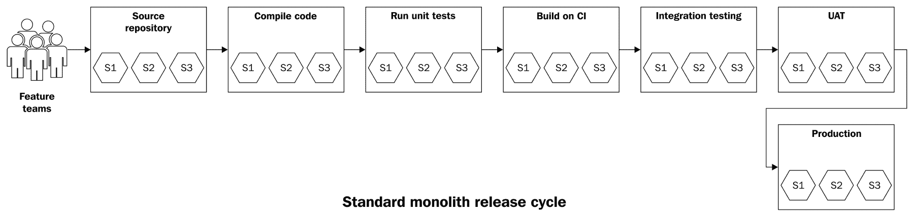
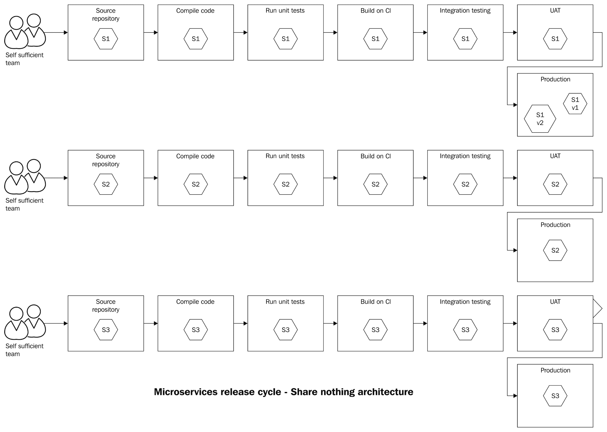
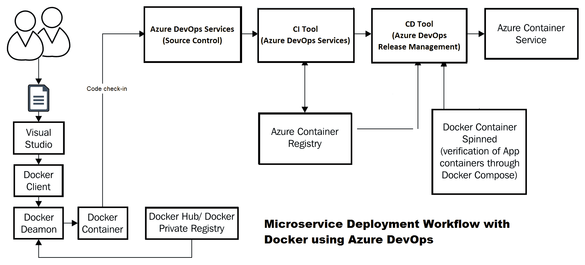
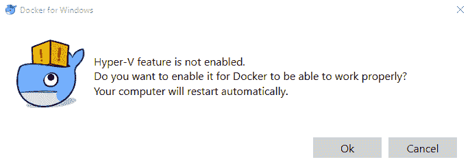
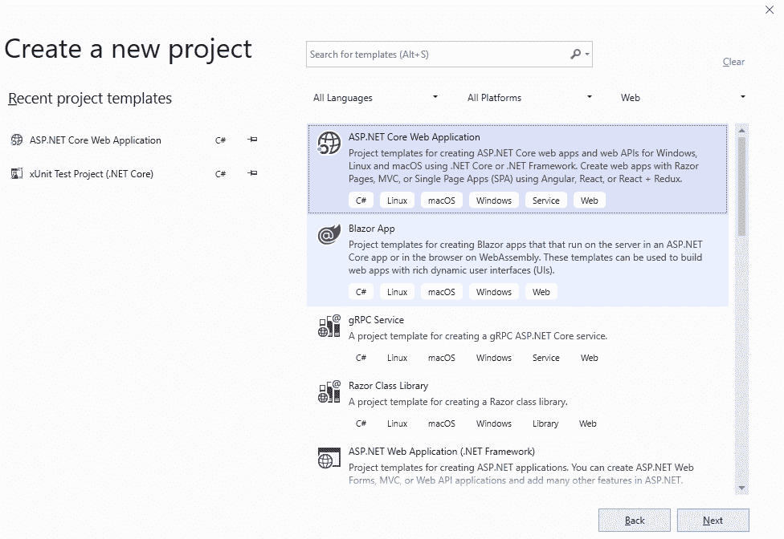
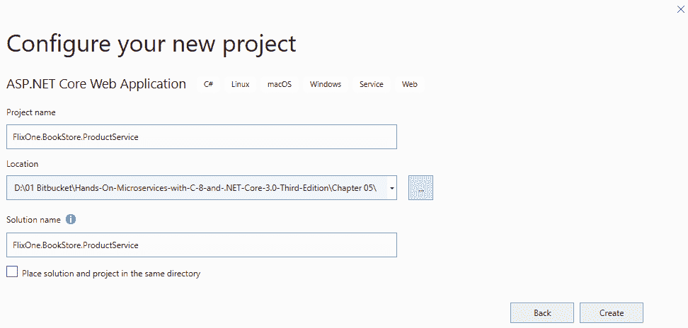
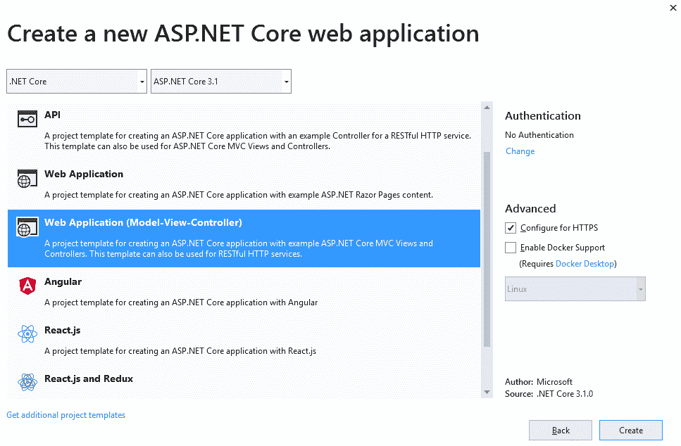

# 五、使用 Docker 部署微服务

整体和微服务架构风格都有不同的部署挑战。就……而言.NET 单片应用，部署经常使用 Xcopy。Xcopy 部署是将所需的文件和文件夹部署(粘贴)到服务器中。单词 *Xcopy* 来源于微软磁盘操作系统(MS-DOS)的 Xcopy 命令。微服务部署带来了一系列不同的挑战。在交付微服务应用时，持续集成和持续部署是关键实践。此外，承诺更大隔离边界的容器和工具链技术对于微服务部署和扩展至关重要。

在本章中，我们将讨论微服务部署的基本原理，以及新兴实践(如 CI/CD 工具和容器)对微服务部署的影响。我们还将通过简单的部署。Docker 容器中的核心服务。

本章结束时，您将了解以下主题:

*   单一应用部署挑战
*   理解部署术语
*   微服务部署成功的先决条件
*   微服务部署的隔离要求
*   对新部署模式的需求
*   出路——集装箱
*   介绍 Docker
*   使用 Docker 的微服务部署示例

# 技术要求

本章包含各种代码示例，以便更详细地解释手头的概念。代码很简单，只是为了演示。

要运行和执行此代码，您需要以下先决条件:

*   Visual Studio 2019
*   。网络核心设置和运行

要安装和运行这些代码示例，您需要安装 Visual Studio 2019(我们首选的 IDE)。为此，请遵循以下步骤:

1.  从[https://docs . Microsoft . com/en-us/Visual Studio/install/install-Visual Studio](https://docs.microsoft.com/en-us/visualstudio/install/install-visual-studio)下载 Visual Studio 2019(社区免费)。
2.  遵循适用于您的操作系统的安装说明。Visual Studio 安装有多个版本。我们使用的是视窗操作系统。

**设置.NET Core 3.1:**

如果你没有.NET Core 3.1 安装完毕，可以从[https://www.microsoft.com/net/download/windows](https://www.microsoft.com/net/download/windows)下载。

The source code is available at [https://github.com/PacktPublishing/Hands-On-Microservices-with-CSharp-8-and-.NET-Core-3-Third-Edition/tree/master/Chapter%2005](https://github.com/PacktPublishing/Hands-On-Microservices-with-CSharp-8-and-.NET-Core-3-Third-Edition/tree/master/Chapter%2005).

部署是应用/软件开发生命周期中最重要和最关键的步骤之一。部署基于单片和微服务的应用都有其挑战。在本章中，我们将讨论与应用部署相关的挑战。

# 单一应用部署挑战

单片应用是指所有的数据库和业务逻辑都绑定在一起并打包成一个系统的应用。一般来说，由于单个应用是作为一个包来部署的，因此部署有些简单，但很痛苦，原因如下:

*   **部署和发布作为一个单一的概念**:部署构建工件和实际制作最终用户可用的特性之间没有区别。更常见的情况是，版本与其环境相结合。这增加了部署新功能的风险。
*   **全有或全无部署** : 全有或全无部署会增加应用宕机和故障的风险。在回滚的情况下，团队无法交付预期的新特性和修补程序，或者必须发布服务包来交付正确的功能。

A **Hotfix**, also known as a **Quickfix**, is a single or cumulative package (generally called a **patch**). It contains fixes for issues/bugs that are found in production and that must be fixed before the next major release. 

*   **中央数据库作为单点故障** : 在单体应用中，大型集中式数据库是单点故障。这个数据库通常很大，很难分解。这导致**平均恢复时间** ( **MTTR** )和**平均故障间隔时间** ( **平均故障间隔时间**)增加。
*   **部署和发布是大事件** : 由于应用中的小变化，整个应用可能会被部署。这给开发人员和运营团队带来了巨大的时间和精力投入。参与其中的团队需要协作才能成功发布。当许多团队分布在全球各地，并且他们在开发和发布阶段工作时，这就变得更加困难。这些类型的部署/发布需要大量的手动步骤。这对最终用户产生了影响，他们不得不面对应用宕机。如果你熟悉这些类型的部署，那么你也会熟悉所谓的作战室中的马拉松会议，以及会议桥中无休止的缺陷分类会议。
*   **上市时间** : 对系统进行任何更改都变得更加困难。在这样的环境中，执行任何业务变更都需要时间。这使得应对市场力量变得困难——企业也可能失去市场份额。

借助微服务架构，我们可以解决其中一些挑战。这种体系结构为服务部署提供了更大的灵活性和隔离性。事实证明，它提供了更快的周转时间和急需的业务敏捷性。

当我们使用单片应用时，尤其是在部署方面，我们将面临新的挑战。本节详细描述了我们可能面临的各种挑战。在下一节中，我们将了解微服务使用的部署术语。

# 理解部署术语

微服务部署术语是指我们在应用发布之前进行代码更改的地方。在本节中，我们将讨论部署术语的所有这些步骤，如下所示:

*   **构建**:在构建阶段，服务源编译没有任何错误，并且通过了所有相应的单元测试。这个阶段产生构建工件。
*   **持续集成** ( **CI** ):每次开发人员提交任何变更时，CI 都会强制重新构建整个应用。编译应用代码，并对其运行一套全面的自动化测试。这种做法源于大型团队中频繁集成代码的问题。基本的想法是保持增量，或者对软件的改变很小。这提供了软件处于工作状态的信心。即使开发人员的签入破坏了系统，也很容易修复它。
*   **部署**:部署的前提条件包括硬件配置和安装基本操作系统以及的正确版本.NET 框架。下一步是在生产中，通过不同的阶段来促进这些构建工件。这两部分的结合称为部署阶段。在大多数单一应用中，部署阶段和发布阶段没有区别。
*   **持续部署** ( **CD** ):在 CD 中，每个成功的构建都部署到生产中。从技术团队的角度来看，光盘更重要。在光盘下，还有一些其他的实践，例如自动化单元测试、标记、版本号的版本化以及变更的可追溯性。通过持续交付，技术团队确保通过各种较低的环境推向生产的变更在生产中按预期工作。通常，这些都很小，部署非常快。

*   **连续发货:**连续发货不同于 CD。CD 通常由技术团队使用，而持续交付更侧重于尽早向客户提供部署的代码。为了确保客户获得正确的产品，在连续交付中，每一个构建都必须通过所有的质量保证检查。一旦产品通过这些检查，就由业务涉众来选择何时发布它。
*   **构建和部署管道**:构建和部署管道是通过自动化实现持续交付的一部分。这是一个由步骤组成的工作流，通过它代码被提交给源存储库。在部署管道的另一端，产生了用于发布的工件。可能组成构建和部署管道的一些步骤如下:
    *   单元测试
    *   集成测试
    *   代码覆盖和静态分析
    *   回归测试
    *   部署到临时环境
    *   负载/压力测试
    *   部署到发布存储库

*   **发布**:面向最终用户的业务特性被称为特性的发布。为了发布一个特性或服务，相关的构建工件应该提前部署。通常，功能切换管理功能的发布。如果在生产中未打开功能标志(也称为功能切换)，则称为指定功能的暗发布。

在本节中，我们讨论了部署术语，并了解了部署的各个阶段，例如 CI/CD。为了进行完美的部署，我们需要一些基本的东西，所有这些都将在下一节中讨论。

# 微服务部署成功的先决条件

任何建筑风格都有一套相关的模式和实践可以遵循。微服务架构风格也没什么不同。通过采用以下实践，微服务实现更有可能成功:

*   **自给自足的团队**:亚马逊是 SOA 和微服务架构的先驱，遵循*两个披萨法则*。这意味着一个微服务团队的成员不会超过 7-10 人(*两个披萨可以养活的人数*)。这些团队成员将具备所有必要的技能和角色；例如，开发、运营和业务分析师。这样的服务团队处理微服务的开发、运营和管理。
*   **CI 和 CD** :较小的自给自足的团队，他们可以频繁地整合他们的工作，是微服务成功的前兆。这个建筑不像一块巨石那么简单。然而，自动化和定期推动代码升级的能力允许团队处理复杂性。工具，如 **Azure** **DevOps** (原**Team Foundation Online Services**(**TFS**)**Visual Studio Team Services**(**VSTS**)**Team city**)和 Jenkins 等，都是这个空间中相当受欢迎的工具链。
*   **作为代码的基础设施**:用代码表示硬件和基础设施组件(比如网络)的想法是新的。它帮助我们使部署环境(如集成、测试和生产)看起来完全相同。这意味着开发人员和测试工程师将能够在较低的环境中轻松重现生产缺陷。使用 CFEngine、Chef、Puppet、Ansible 和 PowerShell DSC 等工具，您可以将整个基础架构编写为代码。通过这种范式转换，您还可以将您的基础架构置于版本控制系统之下，并将其作为部署中的工件进行交付。
*   **云计算的利用**:云计算是采用微服务的一大催化剂。不过，微服务部署并不是强制性的。云计算具有近乎无限的规模、弹性和快速配置能力。显而易见，云是微服务的天然盟友。因此，掌握 Azure 云的知识和经验将有助于您采用微服务。

为了进行完美无瑕的部署，我们需要一些基本组件。在本节中，我们讨论了部署的所有先决条件。在下一节中，我们将讨论微服务部署的隔离要求。

# 微服务部署的隔离要求

2012 年，Heroku 云平台的联合创始人 Adam Wiggins 提出了 12 条基本原则。这些原则讨论了从想法到部署定义新的现代 web 应用。这套原则现在被称为 *12 因素 app* 。这些原则为发展成微服务架构的新架构风格铺平了道路。12 因素应用的原则之一如下:

"Execute the app as one or more stateless processes" 
                                                                                                                                                                                    – Adam Wiggins

在这里，服务基本上是无状态的(除了数据库，它充当状态存储)。**无共享**原则也适用于所有模式和实践。为了实现规模和敏捷性，我们不需要任何东西，除了组件的隔离。

在微服务领域，这种隔离原则以下列方式应用:

*   **服务团队**:围绕服务打造自给自足的团队。实际上，团队将能够做出所有必要的决策来开发和支持他们所负责的微服务。
*   **源码控制隔离**:每个微服务的源码库都会是独立的。它不会共享任何源代码、文件等。在微服务领域跨服务复制一些代码是可以的。
*   **构建阶段隔离**:每个微服务的构建和部署管道应该保持隔离。构建和部署管道甚至可以在并行、隔离和部署的服务中运行。因此，应该扩展 CI-CD 工具，以更快的速度支持不同的服务和管道。
*   **释放阶段隔离**:每个微服务都要和其他服务隔离释放。生产环境中也可能存在具有不同版本的相同服务。
*   **部署阶段隔离**:这是隔离最重要的部分。传统的整体部署是通过裸机服务器完成的。随着虚拟化技术的进步，虚拟服务器已经取代了裸机服务器。

一般来说，单块的标准发布过程如下所示:



考虑到这些隔离级别，微服务构建和部署管道可能如下所示:



在这一节中，我们讨论并理解了隔离的原理。对于许多微服务来说，纯粹的 Xcopy 部署是行不通的。在下一节中，我们将讨论对新部署范例的需求。

# 对新部署模式的需求

应用的最高隔离级别可以通过添加新的物理机或裸机服务器来实现，这样就有了一个拥有自己操作系统的服务器来管理所有系统资源。这在遗留应用中是经常发生的事情，但对于现代应用来说并不实用。现代应用是庞大的系统。这些系统的一些例子包括亚马逊、网飞和耐克，甚至是传统的金融银行，如荷兰国际集团。这些系统托管在数万台服务器上。这些类型的现代应用需要超可扩展性，以便它们能够为其数百万用户服务。对于微服务架构来说，建立一个新的服务器没有任何意义，只是在其上运行一个小服务。

随着新的 CPU 架构突破，出现的选项之一是虚拟机。虚拟机通过虚拟机管理程序技术抽象出操作系统的所有硬件交互。虚拟机管理程序允许我们在一台物理机上运行多台机器或服务器。需要注意的一个重要点是，所有虚拟机都从物理主机资源中获得自己的一部分隔离系统资源。

这仍然是运行应用的良好隔离环境。虚拟化带来了为整个应用提升服务器的基本原理。在这样做的同时，它保持了组件的隔离；这有助于我们利用数据中心的备用计算机资源。它提高了我们数据中心的效率，同时满足了应用的公平隔离需求。

然而，虚拟化本身无法支持微服务的某些需求。在 12 因素原则下，亚当·维金斯也谈到了这一点:

"The twelve-factor app's processes are disposable, meaning they can be started or stopped at a moment's notice. This facilitates fast elastic scaling, rapid deployment of code or config changes, and robustness of production deploys." 
                                                                                                                                                                               - Adam Wiggins

这个原则对于微服务架构风格很重要。因此，对于微服务，我们必须确保服务启动得更快。在这种情况下，让我们假设每个虚拟机有一个服务。如果我们想旋转这个服务，它需要旋转虚拟机；但是，虚拟机的启动时间很长。还会有很多集群部署。这意味着我们的服务肯定会以集群的形式分布。

这也意味着虚拟机可能需要在集群中的一个节点上启动并引导。这也是虚拟机启动时间的问题。这并没有带来我们所期望的微服务的效率。

现在，剩下的唯一选择是使用操作系统进程模型，它具有更快的启动时间。过程编程模型早已为人所知，但即使是过程也是有代价的。他们没有被很好地隔离；它们共享系统资源，以及操作系统的内核。

对于微服务，我们需要更好的隔离部署模型和新的部署范式。答案是用容器技术创新。一个很好的考虑因素是容器技术位于虚拟化和操作系统的流程模型之间。我们将在下一节中了解这一点。

# 出路——集装箱

容器技术对 Linux 世界来说并不陌生。容器基于 Linux 的 LXC 技术。在这一节中，我们将学习容器在微服务中是多么重要。

# 什么是容器？

容器是完整文件系统中的一个软件。它包含运行代码、运行时、系统工具和系统库所需的一切——任何可以安装在服务器上的东西。这保证了软件将始终以相同的方式运行，而不管其环境如何。容器与同一主机上的其他容器共享其主机操作系统和内核。围绕容器的技术并不新鲜；长期以来，它一直是 Linux 生态系统的一部分。

# 容器对虚拟机的适用性

让我们理解容器和虚拟机之间的区别。从表面上看，两者都是可以用来实现隔离和虚拟化的工具。

虚拟机和容器之间的架构差异可以在下图中看到:


我们可以看到，就虚拟机而言，有一个主机操作系统，以及一个内核和一个虚拟机管理程序层。托管应用必须引入自己的操作系统和环境。然而，在容器中，容器化技术层作为一个单独的层，它在不同的应用之间共享。

Containers don't provide the same level of isolation as VMs. For containers, if you run services for multiple customers, you shouldn't run `customer_1` and `customer_2` on the same Docker host. With VMs, this isn't an issue. Also, remember performance issues—if you don't configure resource limits on your containers, it's possible for one *bad* container to bring down the others.

这消除了对客户操作系统的需求。因此，容器中的应用占用空间更小，隔离级别更高。鼓励您使用容器进行微服务部署的另一个方面是，与部署在虚拟机上的相同应用相比，我们可以在同一台物理机上打包更多的应用。这有助于我们实现更大的规模经济优势，并提供了虚拟机优势的比较。

容器还有一点需要注意，它们也可以在虚拟机上运行。这意味着在物理服务器上安装虚拟机是可以的。该虚拟机充当许多容器的主机。这取决于主机的 CPU 及其对嵌套虚拟化的支持。

# 运营团队心态的转变

微软的比尔·贝克提出了一个宠物和牛的类比，他将其应用于数据中心的服务器。好吧。老实说，我们关心我们的宠物。我们爱他们，向他们表达爱意，我们也给他们取名。我们想到他们的卫生；如果它们生病了，我们会带它们去看兽医。我们这样照顾我们的牛吗？我们没有；这是因为我们不太关心牛。

同样的类比也适用于服务器和容器。在 DevOps 之前，服务器管理员关心服务器。他们曾经命名那些服务器机器，并且也有专门的维护停机时间等等。有了 DevOps 实践，比如代码和容器化这样的基础设施，容器就像牛一样被对待。作为运营团队，我们不需要关心它们，因为容器的寿命很短。它们可以在集群中快速启动，也可以快速拆除。当您处理容器时，请始终记住这个类比。就日常操作而言，期望容器的旋转和拆卸是正常的做法。

这个类比改变了我们对微服务部署以及它如何支持容器化的看法。

# 容器是新的二进制文件

作为一名使用微服务的. NET 开发人员，您将面临一个新的现实:容器是新的二进制文件。使用 Visual Studio，我们可以编译.NET 程序，编译后，Visual Studio 生成.NET 程序集，即 dll 或 exe。我们将编译器发出的这一组相关联的 dll 和 exe 部署到服务器上。

It was Steve Lasker, a Principal Program Manager at Microsoft, who first called containers the new binaries of deployment.

简而言之，我们的部署单元是以集合的形式。不再是了！我们还有.NET 程序生成 exe 和 dll，但是我们的部署单元在微服务世界中已经改变了。现在，它是一个容器。我们仍然会将程序编译成程序集。这些组件将被推到集装箱，并确保它们已准备好运输。

当我们浏览这些代码时，您会理解这个概念。我们作为.NET 开发人员，有能力(我可以说*必要性*)装运集装箱。除此之外，容器部署的另一个优点是它消除了不同操作系统甚至不同语言和运行时之间的障碍。

# 它在你的机器上工作吗？让我们运送你的机器！

通常，我们从开发者那里听到很多这样的话:*嗯，它在我的机器上工作！*这通常发生在生产中存在不可重现的缺陷时。由于容器是不可变和可组合的，因此有可能消除开发和生产环境之间的配置阻抗。

# 介绍 Docker

码头工人([https://www.docker.com/](https://www.docker.com/))一直是推广应用容器化的主要力量。Docker 之于容器就像谷歌之于搜索引擎。有时，人们甚至使用容器和 Docker 作为同义词。微软已经与 Docker 建立了合作伙伴关系，并且正在通过开源为 Docker 平台和工具做出积极贡献。这使得 Docker 对我们来说非常重要.NET 开发人员。

Docker 是一个非常重要的话题，意义重大，任何严肃的.NET 开发人员应该了解一下。然而，由于时间和范围的限制，我们将在这里仅仅触及 Docker 生态系统的表面。我们强烈建议您通读帕克特出版公司提供的 Docker 书籍。

If you want to safely try and learn about Docker without installing it on your machine, you can do so by going to [https://KataCoda.com](https://www.katacoda.com/).

现在，让我们专注于 Docker 平台的一些术语和工具。这对于下一部分至关重要:

*   **Docker 图像**:这是一个模板，包含创建 Docker 容器的说明。只能看说明书；您不能向该模板添加自己的说明，因为它是只读的。它由一个单独的文件系统、相关的库等组成。在这里，映像始终是只读的，并且可以运行完全相同的抽象和底层主机差异。可以合成一个 Docker 图像，这样一层在另一层之上。Docker 图像的这种可组合性可以与分层蛋糕的类比进行比较。跨不同容器使用的 Docker 映像可以重用。这也有助于减少使用相同基础映像的应用的部署占用空间。
*   **Docker 注册表**:你可以把这个和 Windows 注册表(作为一个层次数据库)或者一个软件产品(作为一个众多程序的库)关联起来。类似地，Docker 注册表包含各种图像，如果可以检索或使用一组图像信息，则称之为图像库。您可以在同一个服务器上拥有一个公共或私有注册表，其中 Docker 守护程序或 Docker 客户端位于完全独立的服务器上。

The Windows Registry is a database that stores information about the internal or low-level settings of the Microsoft Windows operating system.

*   **Docker hub** :这是一个存储图像的公共注册表。位于[http://hub.docker.com](http://hub.docker.com/)。
*   **Dockerfile** : Dockerfile 是一个构建或脚本文件，包含我们可以用来构建 Docker 映像的指令。可以在 Dockerfile 中记录多个步骤，从获取基础映像开始。
*   **Docker 容器**:Docker 映像的一个实例称为 Docker 容器。
*   **Docker compose**:Docker compose 允许您在单个文件中定义应用的组件——它们的容器、配置、链接和卷。一个命令就可以设置一切并启动应用。它是应用的架构/依赖关系图。
*   **Docker swarm** : Swarm 是容器节点协同工作的 Docker 服务。它运行定义数量的副本任务实例，副本任务本身就是 Docker 映像。

现在，让我们看看 Docker 生态系统的各个组件，并了解 Docker 工作流在软件开发生命周期中的意义。

# 部署示例应用

为了支持这个工作流，我们需要一个配置项工具和一个配置管理工具。为了便于说明，我们采用了 **Azure DevOps** (以前的**Visual Studio Team Services**(**VSTS**)构建服务进行持续集成，采用 Azure DevOps 发布管理进行持续交付。对于任何其他工具或部署模式，工作流将保持不变。

下图描述了这一点:



以下是 Docker 微服务部署的要求:

1.  代码被签入 Azure DevOps 存储库。如果这是项目的第一次签入，它将与项目的 Dockerfile 一起完成。
2.  前面的签入触发了 Azure DevOps，因此它可以从源代码构建服务并运行单元/集成测试。
3.  如果测试成功，Azure DevOps 将构建一个 Docker 映像，并将其推送到 *Docker 注册表*。Azure DevOps 发布服务将映像部署到 Azure 容器服务中。
4.  如果质量保证测试也通过了，Azure DevOps 被用来升级容器，这样它就可以在生产中部署和启动。

The usual .NET CI-CD tools, such as TeamCity and Octopus Deploy (their capabilities are in the alpha stage), have features that can produce a Docker container as a build artifact and then deploy it to production.

在下一节中，我们将学习微服务部署如何在 Docker 中工作。

# 使用 Docker 的微服务部署示例

现在我们已经掌握了所有的要点，我们可以开始编码，看看事情是如何运作的。我们在这里以产品目录服务为例，我们将把它部署为一个 Docker 容器。运行附带的源代码后，您应该能够在 Docker 容器中成功运行产品目录服务。

# 在您的机器上设置 Docker

如果你从来没有在你的机器上使用过 Docker，或者如果你之前没有任何使用 Docker 的经验，那么不要担心！在本节中，我们将介绍这些步骤，以便您可以在 20 或 30 分钟内使用 Docker。

# 先决条件

要在您的机器上设置 Docker，您需要执行以下操作:

1.  安装微软 Visual Studio 2019([https://www . visualstudio . com/downloads/downloads-Visual-Studio-vs](https://www.visualstudio.com/downloads/download-visual-studio-vs))。
2.  安装.NET Core 3.1([https://www.microsoft.com/net/download/core](https://www.microsoft.com/net/download/core))。
3.  为 Windows 安装 Docker，以便您可以在本地运行 Docker 容器([https://www.docker.com/products/docker#/windows](https://www.docker.com/products/docker#/windows))。

We are using Docker Community Edition for Windows to demonstrate this example.

4.  安装后，您的系统需要重新启动。

5.  重新启动系统后，如果系统上未启用 Hyper-V 功能，Windows Docker 将提示您启用该功能。单击“确定”在您的系统上启用 Hyper-V 功能(需要重新启动系统):



6.  安装 Windows Docker 后，右键单击系统托盘中的 Docker 图标，然后单击设置。然后，选择共享驱动器:


现在，我们可以创建一个应用。

# 创建 ASP.NET Core网络应用

在前几节中，我们讨论了容器、在机器上设置 Docker 以及使用 Docker 进行部署。现在，是时候看一个例子了，这样我们就可以实现到目前为止所学的一切。为此，请遵循以下步骤:

1.  通过导航到文件|新项目|创建新项目.NET Core 并选择 ASP.NET Core Web 应用，如下图截图所示:



2.  在新 ASP.NET Core网络应用窗口中，选择。网络核心和 ASP.NET Core 3.1:



3.  从创建新的 ASP.NET Core网络应用窗口中，选择.NET Core和 ASP.NET Core 3.1。从可用模板中选择网络应用(模型-视图-控制器):



4.  选中启用 Docker 支持(在右侧)。
5.  因为我们使用的是 Windows，所以选择它作为操作系统(如果你还没有安装 Docker，你需要为 Windows 安装 Docker)。
6.  单击创建继续。

前面的步骤将在 Docker 的支持下创建`FlixOne.BookStore.ProductService`项目。下面的截图显示了我们项目的结构:


以下文件将被添加到项目中:

*   Dockerfile:ASP.NET Core应用的 docker file 基于`microsoft` / `aspnetcore`图像([https://hub.docker.com/r/microsoft/aspnetcore/](https://hub.docker.com/_/microsoft-dotnet-core-aspnet/))。这张图片包括 ASP.NET Core数字获取软件包，这些软件包已经预先安装，以提高启动性能。构建 ASP.NET Core应用时，Dockerfile `FROM`指令(命令)指向 Docker 集线器上最近的`microsoft` / `dotnet`映像([https://hub.docker.com/r/microsoft/dotnet/](https://hub.docker.com/r/microsoft/dotnet/))。以下是模板提供的默认代码片段:

```cs
FROM mcr.microsoft.com/dotnet/core/aspnet:3.0-nanoserver-1903 
AS base WORKDIR /app 
EXPOSE 80 EXPOSE 443 
FROM mcr.microsoft.com/dotnet/core/aspnet:3.0 AS runtime
WORKDIR /app
COPY ${source:-obj/Docker/publish} .
ENTRYPOINT ["dotnet", "FlixOne.BookStore.ProductService.dll"]
```

前面的代码基本上是一组指令。让我们看一下这些说明中包含的一些属性:

为了在容器的端口`80`上公开我们的`Product`服务，我们可以使用`EXPOSE ENTRYPOINT`，它指定了当容器启动时我们用来执行的命令。在我们的例子中，我们有`ProductService`，我们的切入点是`["dotnet", "FlixOne.BookStore.ProductService.dll"]`。

让我们看看 Docker 所需的各种组件/配置文件:

*   `Docker-compose.yml`:这是基本的合成文件，用于定义可以用`Docker-compose`构建/运行构建和运行的图像集合。
*   `Docker-compose.dev.debug.yml`:当您的配置设置为调试模式时，这是一个用于迭代更改的附加合成文件。Visual Studio 将调用`-f docker-compose.yml`和`-f docker-compose.dev.debug.yml`将其合并。Visual Studio 开发工具使用此编写文件。
*   `Docker-compose.dev.release.yml`:这是一个附加的合成文件，我们可以用它来调试我们的发布定义。它将独立加载调试器，这样就不会改变产品映像的内容。
*   `docker-compose.yml`文件包含项目运行时创建的图像的名称。

现在，我们在 Docker 容器中拥有了运行/启动服务所需的一切。在我们继续之前，请参考[第 2 章](02.html)、*重构整体*，并添加完整的代码(即控制器、存储库等)，这样项目的结构看起来如下:


现在，您所要做的就是按下 *F5* 并在容器中启动您的服务。这是将您的服务放入容器中最简单易行的方法。一旦您的微服务被容器化，您就可以使用 Azure DevOps(以前是 Visual Studio Team Services)和 Azure 容器服务将您的容器部署到 Azure 云中。

在本节中，我们已经部署了一个示例应用，并讨论了使用 Docker 作为容器的部署。我们还学习了如何在本地机器上启用 Docker。

# 摘要

微服务部署对我们来说是一次激动人心的旅程。为了成功交付微服务，我们应该遵循部署最佳实践。在讨论使用自动化工具进行部署之前，我们需要重点关注实现微服务的隔离要求。通过成功的微服务部署实践，我们可以快速交付业务变化。从自给自足的团队到持续交付，不同的隔离需求为我们提供了敏捷性和可扩展性，这是实现微服务的基础。

容器化是迄今为止我们拥有的最重要的创新技术之一，我们必须利用它来部署微服务。将 Azure 云与 Docker 相结合将有助于我们提供微服务所期望的规模和隔离。借助 Docker，我们可以轻松实现更高的应用密度，这意味着降低我们的云基础架构成本。我们还看到了用 Visual Studio 和 Docker 启动这些部署是多么容易。

在下一章中，我们将研究微服务安全性。我们将讨论用于身份验证的 Azure 活动目录，如何利用 OAuth 2.0，以及如何使用 Azure API 管理来保护 API 网关。

# 问题

1.  什么是 Docker 图像，为什么它如此重要？
2.  什么是 Docker 存储库？
3.  什么是 Docker 容器？
4.  什么是码头工人中心？
5.  我可以在 Docker 文件中使用 JSON 代替 YAML 吗？如果是，如何做到？

6.  你能解释一下下面的词吗，都和集装箱有关:`FROM`、`COPY`、`WORKDIR`、`EXPOSE`、`ENTRYPOINT`？
7.  你能编写一个简单的 ASP.NET web 应用，在`Product Services`的帮助下，以表格形式显示`Add`、`Delete`和`Update`产品吗？

# 进一步阅读

*   *使用构建 RESTful 网络服务.NET Core*([https://www . packtpub . com/in/application-development/building-restful-web-services-NET Core](https://www.packtpub.com/in/application-development/building-restful-web-services-net-core))
*   *Mastering Docker-第三版*([https://www . packtpub . com/虚拟化与云/Mastering-Docker-第三版](https://www.packtpub.com/virtualization-and-cloud/mastering-docker-third-edition))
*   *Docker Cookbook–第二版*([https://www . packtpub . com/虚拟化与云/Docker-Cookbook–第二版](https://www.packtpub.com/virtualization-and-cloud/docker-cookbook-second-edition))