# 监控微服务

当一个系统出现问题时，利益相关者会想知道发生了什么，为什么会发生，你能给出的关于如何解决的任何提示或线索，以及如何防止同样的问题在未来再次发生。这是监控的主要用途之一；然而，监控还可以做得更多。

英寸 NET 单片，有多种监控解决方案可供选择。监控目标始终是集中的，监控当然很容易设置和配置。如果有什么东西坏了，我们知道该找什么，去哪里找，因为一个系统中只有有限数量的组件，它们的寿命相当长。

然而，微服务是分布式系统，从本质上来说，它们比单片更复杂，因此在微服务生产环境中，资源利用率以及运行状况和性能监控非常重要。我们可以使用这些诊断信息来检测和纠正问题，并发现潜在的问题，然后防止它们发生。监控微服务带来了不同的挑战。

在本章中，我们将讨论以下主题:

*   监测的必要性
*   微服务中的监控和日志挑战
*   监测战略
*   中微服务的可用工具和策略。NET 监控空间
*   Azure 诊断和应用洞察的使用
*   ELK 堆栈和 Splunk 的简要概述

监控到底是什么意思？监测没有正式的定义；但是，以下内容是合适的:

"Monitoring provides information around the behavior of an entire system, or different parts of a system in their operational environment. This information can be used for diagnosing and gaining insight into the different characteristics of a system."

# 技术要求

本章包含各种代码示例来解释它所描述的概念。代码保持简单，只是为了演示。

要运行和执行代码，您需要以下先决条件:

*   Visual Studio 2019
*   。网络核心 3.1
*   有效的 Azure 帐户

要安装和运行这些代码示例，您需要安装 Visual Studio 2019(首选的集成开发环境)。为此，请遵循以下步骤:

1.  从[https://docs . Microsoft . com/en-us/Visual Studio/install/install-Visual Studio](https://docs.microsoft.com/en-us/visualstudio/install/install-visual-studio)下载 Visual Studio 2019(社区免费)。
2.  Visual Studio 有多个版本。按照操作系统的安装说明进行操作。我们使用的是视窗操作系统。
3.  不要忘记安装 Azure SDK(从“工作负载”选项卡中选择 Azure 开发):


# 正在设置。网络核心 3.1

如果你没有。NET Core 3.1 安装完毕，可以从[https://dotnet.microsoft.com/download/dotnet-core/3.1](https://dotnet.microsoft.com/download/dotnet-core/3.1)下载。

# 有效的 Azure 帐户

您将需要 Azure 门户的登录凭据。如果你没有 Azure 账号，可以在[https://azure.microsoft.com/free/](https://azure.microsoft.com/free/)免费创建一个。

The complete source code is available at [https://github.com/PacktPublishing/Hands-On-Microservices-with-CSharp-8-and-.NET-Core-3-Third-Edition/tree/master/Chapter%2007](https://github.com/PacktPublishing/Hands-On-Microservices-with-CSharp-8-and-.NET-Core-3-Third-Edition/tree/master/Chapter%2007).

# 从仪器和遥测技术开始

监控解决方案依赖于仪器和遥测技术。因此，当我们谈论监控微服务时，我们也自然会讨论仪器和遥测数据。应用程序日志只不过是一种检测机制。

There are two things related to monitoring that we may need to consider, while implementing this in a production-based application:

**Information overload**: It is easy to go all-out and collect a lot of information, but you should make sure that the most important information is the most accessible information. One example is a Grafana-type ([https://grafana.com/docs/features/panels/graph/](https://grafana.com/docs/features/panels/graph/)) dashboard to verify things. It provides a value for operations, whereas detailed logging may help with forensics and advanced troubleshooting.

**Alerting fatigue**: Don't set up alerts for everything—this just means that people will start ignoring the alerts. This is why, sometimes, too much information would be overkill.

这些日志只能帮助我们看到手头任务的步骤，但我们只能通过完整的监控系统捕获应用程序中发生的每个资源和操作的细节。

在接下来的章节中，我们将更详细地了解仪器和遥测技术。

# 使用仪器

现在，让我们看看什么是仪器仪表。仪器是我们向应用程序添加诊断功能的方法之一。它可以正式定义如下:

"Most applications will include diagnostic features that generate custom monitoring and debugging information, especially when an error occurs. This is referred to as instrumentation and is usually implemented by adding event and error handling code to the application."  
                                                                                                                                                                                                                  – MSDN

在正常情况下，可能不需要来自信息事件的数据，从而降低存储成本和收集数据所需的事务。但是，当应用程序出现问题时，您必须更新应用程序配置，以便诊断和检测系统可以收集事件数据。该事件数据可能是信息性的、错误消息和/或警告消息，有助于修复系统故障。

# 遥感勘测

最基本的遥测技术是收集仪器和测井系统产生的信息的过程。通常，它使用支持大规模扩展和应用服务广泛分布的异步机制来执行。它可以定义如下:

"The process of gathering remote information that is collected by instrumentation is usually referred to as telemetry."
                                                                                                                                                                                        – MSDN

通常，高度复杂系统的信息是以这样一种方式存储的，即当需要对其进行分析时，这些信息很容易获得。使用这些信息可以了解系统的性能、变化检测或任何故障检测。

Azure 云中没有可以提供遥测和报告系统的内置支持/系统。然而，我们可以在 Azure 诊断和应用洞察的帮助下获得这样的系统。Azure 应用洞察允许我们收集遥测数据和监控机制。

遥测技术提供数据，以便我们能够分析手头的信息，并纠正系统中的故障或分析变化。

这部分是关于遥测技术的。我们还可以使用监控来检测系统中的变化。我们将在下一节讨论这个问题。

# 监测的必要性

微服务是复杂的分布式系统。微服务实施是任何现代信息技术业务的支柱。理解服务的内部，以及它们的交互和行为，将帮助您使整个业务更加灵活和敏捷。微服务的性能、可用性、规模和安全性会直接影响企业及其收入，因此监控微服务至关重要。它帮助我们观察和管理服务属性的质量。

让我们讨论需要它的场景。

# 健康监测

通过运行状况监控，我们以一定的频率监控系统及其各种组件的运行状况，通常是几秒钟。这确保了系统及其组件按预期运行。借助详尽的运行状况监控系统，我们可以监控整个系统的运行状况，包括中央处理器、内存利用率等。这可以是 pings 或广泛的健康监控端点的形式，这些端点发出服务的健康状态，以及来自特定时间点的一些有用的元数据。

健康监测的指标基于成功率或失败率的阈值。如果参数值超出配置的阈值，则会触发警报。很有可能会因为这个故障而触发一些维护系统健康的预防措施。例如，此操作可能是在故障状态下重新启动服务，或者调配服务器资源。

# 可用性监控

可用性监控与健康状态监控非常相似。然而，微妙的区别在于，在可用性监控中，重点是系统的可用性，而不是当时的运行状况快照。

系统的可用性取决于各种因素，例如应用程序、服务和服务依赖关系的整体性质和领域，以及基础架构或环境。可用性监控系统捕获与这些因素相关的低级数据点，并由系统表示它们，从而使业务级功能可用。可用性监控参数通常用于跟踪业务指标和**服务级别协议** ( **服务级别协议**)。

# 服务水平协议监控

具有服务级别协议的系统基本上保证了某些特性，例如性能和可用性。对于基于云的服务，这是一个非常常见的场景。本质上，服务级别协议监控就是监控系统的那些有保证的服务级别协议。服务水平协议监控是作为服务提供商和消费者之间的合同义务来实施的。

它通常基于可用性、响应时间和吞吐量来定义。SLA 监控所需的数据点可以来自性能端点监控或日志记录，以及监控参数的可用性。对于内部应用程序，许多组织跟踪因服务器停机而引发的事件数量。基于这些事件的**根本原因分析** ( **RCA** )采取的措施降低了重复这些问题的风险，并且有助于满足服务级别协议。

出于内部目的，组织还可以跟踪导致服务失败的事件的数量和性质。了解如何快速解决这些问题，或者如何完全消除这些问题，有助于减少停机时间并满足服务级别协议。

# 性能监控

系统的性能通常由关键的性能指标来衡量。大型网络系统的一些关键性能指标如下:

*   每小时服务的请求数
*   每小时服务的并发用户数
*   用户执行业务事务(例如下订单)所需的平均处理时间

此外，性能还通过系统级参数来衡量，例如:

*   中央处理器利用率
*   内存利用率
*   输入输出速率
*   排队的消息数

如果系统不满足这些关键性能指标中的任何一个，就会发出警报。

在分析性能问题时，通常会使用监控系统以前捕获的基准测试的历史数据来解决问题。

# 安全监控

监控系统可以检测异常的数据模式请求、异常的资源消耗模式以及对系统的攻击。特别是在拒绝服务的情况下，可以预先识别攻击或注入攻击，并向团队发出警报。安全监控还保留经过身份验证的用户的审计跟踪，并保留已签入和签出系统的用户的历史记录。它还可以方便地满足合规性要求。

安全性是分布式系统(包括微服务)的一个交叉问题，因此在系统中有多种方式生成这些数据。安全监控可以从不属于系统的各种工具中获取数据，但它们可能是托管系统的基础架构或环境的一部分。不同类型的日志和数据库条目可以作为数据源；然而，这确实取决于系统的性质。

# 审核敏感数据和关键业务交易

出于法律义务或合规原因，系统可能需要保留系统中用户活动的审计跟踪，并且可能需要记录他们的所有数据访问和修改。由于审计信息本质上是高度敏感的，因此可能只向系统中少数享有特权和信任的个人披露。审计跟踪可以是安全子系统的一部分，也可以单独记录。

Azure is certified for many regulatory specs. Sometimes, it still requires you to do additional work, and you should understand what you are trying to be compliant with. However, this becomes easier when Azure has something to build it on, than if you were to build your solution from scratch.

您可能需要按照法规或合规性规范的规定，以特定的格式传输和存储审计线索。

# 最终用户监控

在终端用户监控中，系统功能的使用情况和/或终端用户的总体系统使用情况被跟踪和记录。使用情况监控可以使用各种用户跟踪参数来完成，例如使用的功能、为指定用户完成关键事务所需的时间，甚至是强制的配额。强制配额是针对系统使用情况对最终用户施加的约束或限制。一般来说，各种现收现付服务使用强制配额，例如，免费试用，您可以上传大小高达 25 MB 的文件。此类监控的数据源通常是根据日志和跟踪用户行为收集的。

# 排除系统故障

系统的最终用户可能会遇到系统故障。这可能是系统故障，也可能是用户无法执行某项活动。使用系统日志监控这类问题；如果没有，最终用户将需要提供详细的信息报告。此外，有时，服务器崩溃转储或内存转储会非常有帮助。然而，在分布式系统的情况下，理解故障的确切根源会有点困难。

在许多监控场景中，仅使用一种监控技术是无效的。最好使用多种监控技术和工具进行诊断。特别是，监控分布式系统非常具有挑战性，它需要来自各种来源的数据。除了适当地分析情况和决定行动要点之外，我们还必须考虑整体的监测观点，而不是只从一种类型的系统角度来看。

既然我们对通用监控需要做些什么有了更好的了解，让我们重新审视一下微服务的视角。在下一节中，我们将讨论微服务架构风格带来的不同监控挑战。

# 了解监控挑战

微服务监控提出了不同的挑战。在某些情况下，一个服务可能依赖于另一个服务，或者客户端向一个服务发送请求，而响应来自另一个服务，这会使操作变得复杂。在这里，扩展微服务将是一项具有挑战性的任务。同样，流程实现，比如说 DevOps，将是一项具有挑战性的工作，同时实现一个巨大的企业微服务应用程序。我们将在本节中讨论这些挑战。

# 缩放问题

一种服务可能依赖于其他各种微服务提供的功能。这导致了复杂性，这在。NET 整体系统。检测所有这些依赖关系相当困难。伴随规模而来的另一个问题是变化率。随着持续部署和基于容器的微服务的发展，代码始终处于可部署状态。容器只能存活几分钟，甚至几秒钟。

It is worth noting that containers can indeed be short-lived, so this issue doesn't always apply in the case of **virtual machines** (**VMs**). Apart from the fact that it usually takes a couple of minutes just to spin up a VM, it is generally longer lived than containers.

虚拟机也是如此(但并不总是如此)。虚拟机的寿命约为几分钟到几小时。

在这种情况下，测量常规信号，如每分钟的 CPU 使用率和内存消耗使用率，是没有意义的。有时，容器实例可能一分钟都不存在；一分钟之内，容器实例可能已经被处理掉了。这是微服务监控的挑战之一。

# DevOps 心态

传统上，服务或系统一旦部署，就归运营团队所有和管理。然而，DevOps 打破了开发人员和运营团队之间的孤岛。它伴随着许多实践，例如持续集成和持续交付，以及持续监控。随着这些新的实践，出现了新的工具集。

然而，DevOps 不仅仅是一套实践或工具；更重要的是，这是一种心态。改变人们的心态总是一个艰难而缓慢的过程。微服务监控需要这样的心态转变。

随着服务自治的出现，开发团队现在不得不拥有服务。这也意味着他们必须解决开发问题，并关注服务的所有操作参数和服务级别协议。仅仅通过使用最先进的监控工具，开发团队不会在一夜之间改变。运营团队也是如此。他们不会在一夜之间突然变成*核心平台团队*(或者你喜欢的任何花哨名字)。

为了使微服务对组织、开发人员和运营部门来说成功且有意义，团队需要相互帮助，了解各自的痛点，并朝同一个方向思考——也就是说，他们如何共同为业务带来价值。没有服务的规范，监控就不可能发生，这是开发团队可以提供帮助的地方。同样，没有运营团队的帮助，警报和运营指标的设置也不会发生。这是交付微服务监控解决方案的挑战之一。

# 数据流可视化

市场上有许多用于数据流可视化的工具。其中有 AppDynamics、New Relic 等等。这些工具能够处理数十甚至数百个微服务的可视化。然而，在更大的环境中，有成千上万的微服务，这些工具无法处理可视化。这是微服务监控的挑战之一。

# 测试监控工具

我们信任监控工具，并理解它们描述了我们的微服务实现的全貌。然而，为了确保他们保持这种理解，我们将不得不测试监控工具。这在整体实现中从来不是一个挑战；但是，当涉及到微服务时，出于监控目的，需要对微服务进行可视化。这意味着我们必须花时间生成假的/合成的交易，然后我们利用整个基础设施，而不仅仅是为客户服务。

因此，测试监控工具是一件昂贵的事情，并且它在微服务监控中提出了重大挑战。在下一节中，我们将讨论监控策略。

# 致力于监测战略

在这一节中，我们将了解使微服务可见的监控策略。通常实施以下(以及其他)策略来创建定义明确的整体监控解决方案，以便我们可以监控系统、修复各种故障等。

# 应用/系统监控

应用/系统监控也称为基于**框架的策略**。在这里，应用程序，或者在我们的例子中，微服务，本身在给定的执行上下文中生成监控信息。可以基于应用程序数据中的阈值或触发点动态配置应用程序，这可以生成跟踪语句。也可以有一个基于探针的框架(例如。NET CLR，它提供了收集更多信息的钩子)来生成监控数据。因此，可以将有效的检测点嵌入到应用程序中，以便于这种监控。除此之外，承载微服务的底层基础设施也可能引发关键事件。监控代理可以监听和记录这些事件，监控代理与应用程序位于同一台主机上。

# 真实用户监控

真实用户监控基于真实终端用户在系统中的事务流。当最终用户实时使用系统时，该策略可用于捕获与响应时间和延迟相关的参数，以及用户遇到的错误数量。

这对于特定的故障排除和问题解决非常有用。通过这种策略，系统的热点和服务交互瓶颈也可以被捕获。可以记录整个端到端的用户流或事务，以便我们可以在以后重放它。这样做的好处是，这类录制的播放可以用于故障排除以及各种测试目的。

# 语义监控和合成交易

语义监控策略侧重于业务事务；但是，它是通过使用合成事务来实现的。顾名思义，在语义监控中，我们试图模拟最终用户流。然而，这是以一种受控的方式并使用虚拟数据来完成的，因此我们可以区分流的输出和实际的最终用户流数据。这种策略通常用于服务依赖、运行状况检查和诊断系统中出现的问题。为了实现合成事务，我们需要在计划流程时小心谨慎。我们还需要足够小心，不要让系统不堪重负——例如，在系统中传播的整个交易中，为假冒产品目录创建假冒订单，并观察响应时间和输出。

# 压型

概要分析方法特别侧重于解决整个系统的性能瓶颈。这种方法不同于前面的方法。真实和语义监控侧重于业务事务，或者系统的功能方面，它收集相关的数据。概要分析是关于系统级或低级信息捕获的。其中一些参数是响应时间、内存和线程。

这种方法在应用程序代码或框架中使用探测技术，并收集数据。通过利用分析过程中捕获的数据点，相关的 DevOps 团队可以确定性能问题的原因。在生产环境中应避免使用探测进行分析。然而，它非常适合生成调用时间等等，而不会在运行时使系统过载。一般来说，概要分析的一个很好的例子是一个用 ASP.NET 迷你概要分析器，甚至是用窥镜分析的 ASP.NET MVC 应用程序。

# 端点监控

通过这种方法，我们公开了服务的一个或多个端点，以发出与服务本身以及基础设施参数相关的诊断信息。通常，不同的端点专注于提供不同的信息。例如，一个端点可以给出服务的健康状态，而另一个端点可以提供该服务执行中出现的 HTTP 500 错误信息。对于微服务来说，这是一种非常有用的技术，因为它从本质上改变了从推送模型到拉取模型的监控，并且减少了服务监控的开销。我们可以在一定的时间间隔内废弃/丢弃来自这些端点的数据，然后构建一个仪表板并为运营指标收集数据。

An important point about endpoint monitoring is to test where your users are. If most of the end users are in Asia, there is less value in testing from North America than testing a bit closer to home. This, of course, brings in the fact that endpoint monitoring can be both for general "everything works" checks, and also things such as latency and response times.

使用各种监控策略可以让我们监控系统，从而修复任何故障，分析各种信息数据，等等。当我们分析系统时，日志会增加更多的价值。在下一节中，我们将解释日志的概念。

# 了解日志记录

日志是一种由系统、其各种组件或基础设施层提供的工具。日志是收集与系统相关的特定或相关数据的一种方式。这些数据也被称为日志。日志可以是任何类型，也可以根据要求而定，例如信息日志、错误日志和警告日志。有时，日志可能是自定义日志。借助这些日志，我们可以分析系统执行的任何任务的故障、崩溃或进程。这种分析有助于我们解决系统中的问题。

在本节中，我们将了解日志记录的挑战，然后讨论一些策略来解决这些挑战。

# 日志挑战

首先，我们将尝试理解微服务中日志管理的问题。其中一些如下:

*   为了记录与系统事件和参数以及基础设施状态相关的信息，我们需要保存日志文件。传统意义上。NET 单片，日志文件保存在应用程序部署的同一台机器上。在微服务的情况下，它们托管在虚拟机或容器上。然而，虚拟机和容器都是短暂的，这意味着它们不会保持状态。在这种情况下，如果我们用虚拟机或容器保存日志文件，我们将丢失它们。这是微服务中日志管理的挑战之一。
*   在微服务架构中，有许多服务构成了一个事务。假设我们有一个下单交易，其中服务 A、服务 B 和服务 C 参与交易。比如说，如果服务 B 在事务期间失败了，我们如何在日志中理解和捕获这个失败？不仅如此，更重要的是，我们如何理解服务 B 的一个特定实例已经失败，并且它正在参与事务？这种情况给微服务带来了另一个挑战。

既然我们已经知道了这些挑战，让我们继续学习一些关于日志记录的策略。

# 日志策略

到目前为止，在本节中，我们已经讨论了日志记录、它的挑战以及为什么我们应该实现日志记录。同时进行多个调用是可能的，因此当我们实现日志记录时，我们应该以这样一种方式来实现它，即我们知道所记录事务的确切来源。我们将使用关联标识进行记录。

Logging is not only used in microservices specifically; it is also important for monolithic applications.

为了在微服务中实现日志记录，我们可以使用我们将在下面几节中讨论的日志记录策略。

# 集中式日志记录

集中日志记录和集中监控是有区别的。在集中式日志记录中，我们记录系统中发生的事件的所有详细信息—它们可能是错误或警告，或者只是为了提供信息—而在集中式监视中，我们监视关键参数，即特定信息。

通过日志，我们可以了解系统中或特定事务中实际发生了什么。我们会有具体交易的所有细节，比如为什么开始，是谁触发的，记录了什么样的数据或者资源等等。在复杂的分布式系统中，例如微服务，这确实是我们可以用来解决信息流或错误的整个难题的关键信息。我们还需要将超时、异常和错误视为需要记录的事件。

我们记录的关于特定事件的信息也应该是结构化的，并且这个结构应该在我们的系统中是一致的。在这里，我们会有以下内容:

*   我们的结构化日志条目可以包含基于级别的信息，以说明该日志条目是用于信息、错误，还是作为日志条目事件记录的调试信息或统计信息。
*   结构化日志条目还必须有日期和时间，以便我们知道事件发生的时间。我们还应该在结构化日志中包含主机名，这样我们就可以确切地知道日志条目来自哪里。
*   我们还应该包括服务名称和服务实例，这样我们就可以确切地知道哪个微服务创建了日志条目。
*   最后，我们还应该在结构化日志格式中包含一条消息，这是与事件相关的关键信息。

例如，对于错误，这可能是调用堆栈或关于异常的详细信息。关键是我们保持结构化日志格式的一致性。一致的格式将允许我们查询日志信息。然后，通过使用我们的集中式日志工具，我们基本上可以搜索特定的模式和问题。在微服务架构中，集中式日志记录的另一个关键方面是使分布式事务更具可追溯性。

# 在日志记录中使用关联标识

关联标识是分配给每个事务的唯一标识。因此，当一个事务分布在多个服务中时，我们可以通过使用日志信息跨不同的服务跟踪该事务。关联 ID 基本上是从服务传递到服务的。处理该特定事务的所有服务都将接收相关标识，并将其传递给下一个服务，以此类推，这样它们就可以将与该事务相关的任何事件记录到我们的集中日志中。这极大地帮助了我们，当我们必须可视化和理解这个事务在不同的微服务中发生了什么。

# 语义日志

【Windows 的事件跟踪 ( **ETW** )是一种结构化的日志机制，可以在日志条目中存储结构化的负载。该信息由事件侦听器生成，它可能包括关于事件的类型化元数据。这只是语义日志的一个例子。语义日志传递额外的数据以及日志条目，以便处理系统可以获得围绕事件构建的上下文。这就是为什么语义日志也被称为结构化日志或类型化日志。

例如，指示已下订单的事件可以生成一个日志条目，该日志条目包含作为整数值的项目数、作为十进制数的总值、作为长数值的客户标识符以及作为字符串值的交货城市。订单监控系统可以读取有效负载，并可以轻松提取单个值。ETW 是 Windows 附带的标准功能。

在 Azure 云中，可以从 ETW 获得日志数据源。语义日志应用程序块是最好的框架之一，使全面的日志记录更加容易。它允许您将事件写入您选择的目的地，如磁盘文件、数据库、电子邮件等。语义日志应用程序块也可以在 Azure 应用程序中使用。

本节重点介绍如何理解日志记录，以及日志记录和日志记录策略面临的挑战。我们还强调了语义日志的重要性。

当涉及到日志记录时，监控很重要。在下一节中，我们将讨论 Azure 云中的监控。

# Azure 上的监控

Azure 中没有单一的现成解决方案或产品，也没有任何云提供商来应对微服务带来的监控挑战。有趣的是，没有太多的开源工具可以使用。基于. NET 的微服务。

我们正在利用微软 Azure 云和云服务来构建我们的微服务，因此寻找它附带的监控功能非常有用。如果您希望管理大约几百个微服务，您可以利用基于微软 Azure 解决方案的定制监控解决方案(主要是交织 PowerShell 脚本)。

我们将主要关注以下日志记录和监控解决方案:

*   **微软 Azure 诊断**:这有助于通过资源和活动日志收集和分析资源。
*   **应用洞察**:这有助于收集我们微服务的所有遥测数据，并且有助于分析数据。这是一种基于框架的监控方法。
*   **日志分析**:日志分析分析和显示数据，并对收集的日志提供可扩展的查询能力。

让我们从不同的角度来看这些解决方案。这个视角将帮助我们可视化我们基于 Azure 的微服务监控解决方案。微服务由以下内容组成:

*   **基础设施层**:虚拟机或应用程序容器(例如 Docker 容器)
*   **应用堆栈层**:由操作系统、。和微服务应用程序代码

这些层组件中的每一个都可以按如下方式进行监控:

*   **虚拟机**:使用 Azure 诊断日志
*   **Docker 容器**:使用容器日志和应用洞察，或第三方容器监控解决方案，如 cAdvisor、Prometheus 或 Sensu
*   **Windows 操作系统**:使用 Azure 诊断日志和活动日志
*   **微服务应用程序**:使用应用洞察
*   **数据可视化和度量监控**:使用日志分析或第三方解决方案，如 Splunk 或 ELK 堆栈

各种 Azure 服务的日志条目中都有一个活动标识。此活动标识是为每个请求分配的唯一 GUID，可以在日志分析期间用作关联标识。

让我们继续学习 Azure 诊断。

# 微软 Azure 诊断

Azure 诊断日志使我们能够为已部署的微服务收集诊断数据。我们还可以使用诊断扩展从各种来源收集数据。网络和工作者角色、Azure 虚拟机和 Azure 应用服务支持 Azure 诊断。其他 Azure 服务有自己独立的诊断工具。

启用 Azure 诊断日志和探索各种设置很容易，并且可以作为切换开关使用。

Azure 诊断程序可以从以下来源收集数据:

*   性能计数器
*   应用程序日志
*   Windows 事件日志
*   。NET 事件源
*   IIS 日志
*   基于清单的 ETWs
*   崩溃转储
*   自定义错误日志
*   Azure 诊断基础架构日志

让我们继续，看看 Azure 存储。

# 使用 Azure 存储存储诊断数据

Azure 诊断日志不会永久存储。它们是滚动日志，也就是说，它们会被更新的日志覆盖。所以，如果我们想在任何分析工作中使用它们，我们必须存储它们。Azure 诊断日志可以存储在文件系统中，也可以通过文件传输协议传输；更好的是，它们可以存储在 Azure 存储容器中。

有不同的方法可以为指定的 Azure 资源(在我们的例子中，是 Azure 应用服务上托管的微服务)指定用于诊断数据的 Azure 存储容器。这些措施如下:

*   命令行界面工具
*   管理员
*   Azure 资源管理器
*   Visual Studio 2019
*   Azure 门户–我们可以从 Azure 门户直接创建 Azure 存储容器

在下一节中，我们将学习如何从 Azure 门户使用和创建 Azure 存储容器。

# 使用 Azure 门户

下面的截图描述了我们通过 Azure 门户调配的 Azure 存储容器:

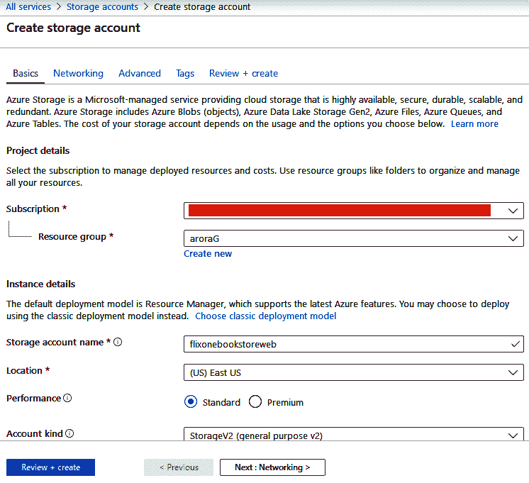

# 定义 Azure 存储帐户

我们还可以使用 Azure 存储帐户存储诊断数据。为此，我们需要定义一个存储帐户，通过使用 Azure 门户([http://portal.azure.com/](http://portal.azure.com/)，我们还可以在`ServiceConfiguration.cscfg`文件中定义存储帐户。这很方便，因为在开发期间，您可以指定存储帐户。还可以在开发和生产过程中指定不同的存储帐户。

The Azure storage account can also be configured as one of the dynamic environment variables during the deployment process.

Azure 存储帐户中的信息可以作为配置设置添加，可以通过从配置设置中获取信息来使用。例如，我们使用的是 Visual Studio。以下代码显示了新微服务项目的默认连接字符串:

```cs
<ConfigurationSettings>
  <Setting name="Microsoft.WindowsAzure.Plugins.
  Diagnostics.ConnectionString" value="UseDevelopmentStorage=true" />
</span></ConfigurationSettings>
```

前面的连接字符串可能对您有所不同，或者可能需要更改以匹配您的 Azure 存储帐户的信息。

现在，让我们了解一下 Azure 存储是如何存储诊断数据的。所有日志条目都存储在 blob 或表存储容器中。可以在创建和关联 Azure 存储容器时指定要使用的存储。

# 诊断数据的 Azure 存储模式

对于存储在表中的数据，用于存储诊断数据的 Azure 表存储的结构如下:

*   `WadLogsTable`:该表通过使用跟踪侦听器存储代码执行期间编写的日志语句。
*   `WADDiagnosticInfrastructureLogsTable`:该表指定了诊断监视器和配置更改。
*   `WADDirectoriesTable`:这个表包含了正在被监控的文件夹，它包含了各种相关的信息——例如，IIS 日志，IIS 失败的请求日志，等等。

To get the location of this blob log file, you need to check the container field, the `RelativePath` field, or the `AbsolutePath` field, where the `RelativePath` field contains the name of the blob, and the `AbsolutePath` field contains both the location and the name.

*   `WADPerformanceCountersTable`:此表包含与配置的性能计数器相关的数据。
*   `WADWindowsEventLogsTable`:此表包含 Windows 事件跟踪日志条目。

对于 blob 存储容器，诊断存储模式如下:

*   `wad-control-container`:如果你还在用遗留代码或者以前的版本，比如 SDK 2.4 和以前的版本，那么这个就是给你的。它通过使用 XML 配置文件来控制诊断。
*   `wad-iis-failedreqlogfiles`:这包含来自 IIS 失败请求日志的信息。
*   `wad-iis-logfiles`:包含 IIS 日志的信息。
*   `custom`:有时候，我们需要一个定制的 Azure 存储容器。这些容器是为被监视的目录配置的。`WADDirectoriesTable`包含该自定义容器的名称。

这里需要注意的一个有趣的事实是，可以在这些容器表或 blobs 上看到的 WAD 后缀来自微软 Azure Diagnostics 以前的产品名称，即 Windows Azure Diagnostics。

A quick way to view the diagnostic data is with the help of Cloud Explorer. Cloud Explorer is available from Visual Studio (if you have installed the SDK).

本节描述了如何在创建和关联 Azure 存储容器时指定存储选择。我们学习了如何创建存储帐户，以及如何捕获数据。在下一节中，我们将讨论应用洞察。

# 应用洞察简介

Application Insights 是微软提供的一款**应用性能管理** ( **APM** )产品。它是 Azure 监视器服务的一个功能集。这是一项用于监控性能的有用服务。基于. NET 的微服务。这有助于理解单个微服务的内部操作行为。它将调整服务性能并了解微服务的性能特征，而不是仅仅关注于检测和诊断问题。

这是基于框架的监测方法的一个例子。这意味着，在微服务的开发过程中，我们将把 Application Insights 包添加到我们微服务的 Visual Studio 解决方案中。这就是 Application Insights 如何为遥测数据测量您的微服务。这可能并不总是每个微服务的理想方法。然而，如果您没有仔细考虑监控您的微服务，它就派上了用场。这样，您的服务就可以开箱即用地进行监控。

借助应用洞察，您可以收集和分析以下类型的遥测数据:

*   HTTP 请求率、响应时间和成功率
*   依赖(HTTP 和 SQL)调用率、响应时间和成功率
*   来自服务器和客户端的异常跟踪
*   诊断日志跟踪
*   页面视图计数、用户和会话计数、浏览器加载时间和异常
*   AJAX 调用率、响应时间和成功率
*   服务器性能计数器
*   自定义客户端和服务器遥测
*   按客户端位置、浏览器版本、操作系统版本、服务器实例、自定义维度等进行细分
*   可用性测试

除了上述类型之外，还有相关的诊断和分析工具，可用于使用各种不同的可定制指标进行警报和监控。借助自己的查询语言和可定制的仪表盘，Application Insights 为微服务提供了一个很好的监控解决方案。

接下来，我们将在现有的 FlixOne 应用程序中实现 Application Insights。

# 监控我们的 FlixOne 应用程序

在前一节中，我们讨论了监控遥测技术，它为我们提供了可以分析的数据。它帮助我们监控解决方案的运行状况。在本节中，我们将向 FlixOne 应用程序中添加应用洞察。

For this code example, you'll need to have a valid Azure account. Refer to the previous *Technical requirements* section for a list of prerequisites.

要为我们的应用程序实现 Application Insights，我们需要一个有效的插装密钥。要获得这个密钥，我们需要设置应用洞察资源。按照以下步骤创建资源:

1.  使用您的凭据登录 Azure 门户。
2.  搜索应用洞察，然后从搜索结果列表中单击应用洞察:

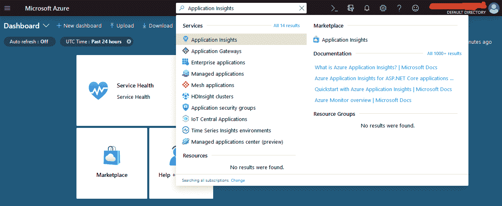

3.  在应用洞察屏幕中，单击创建应用洞察应用，如下图所示:

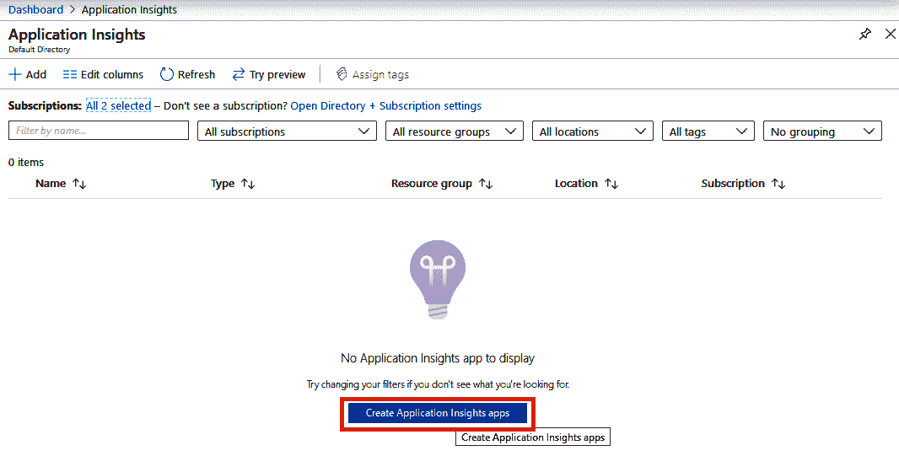

4.  现在，提供所有必需的值，然后单击“查看+创建”，如下所示:


在这里，我们创建了一个名为 FlixOne 的新资源组，并为(美国)东部美国地区提供了一个实例名，即 FlixOneWeb。

5.  在下一个屏幕上，查看您的输入，然后单击创建，如下图所示:


For automation purposes, you can also download a template of your Application Insights. We've created a template already (`template.zip`). It can be found in the `Chapter07` folder of this book's code repository.

6.  成功创建应用洞察实例后，您需要单击转到资源。之后，您应该会看到以下屏幕:

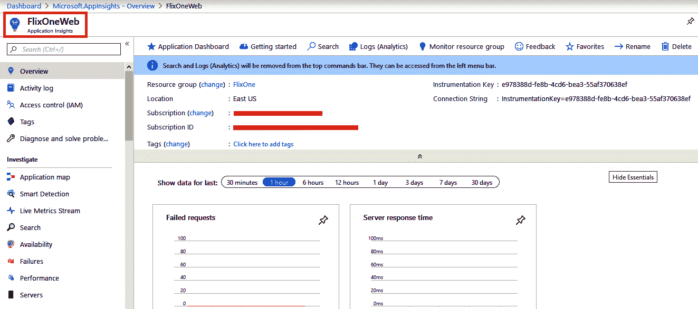

7.  为了开始我们的代码示例，我们使用 Visual Studio 2019 创建了一个 ASP.NET 核心 web 应用程序。我们将跳过创建应用程序的步骤，因为我们在上一章中讨论了这些步骤。
8.  从项目|添加应用洞察遥测将应用洞察软件开发工具包添加到您的项目，然后将遥测添加到 FlixOne。书店。网络项目:


9.  现在，您将看到“入门”页面；单击开始:

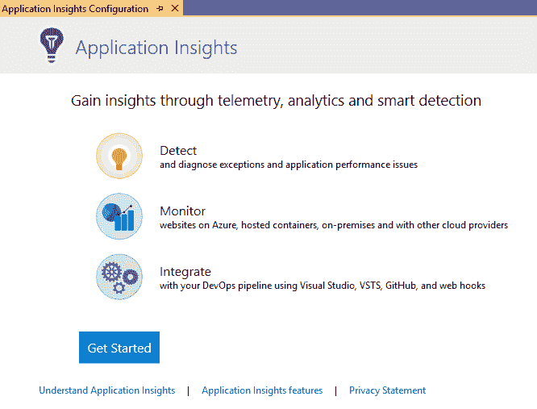

10.  通过提供正确的值并单击注册，向应用洞察注册您的应用:

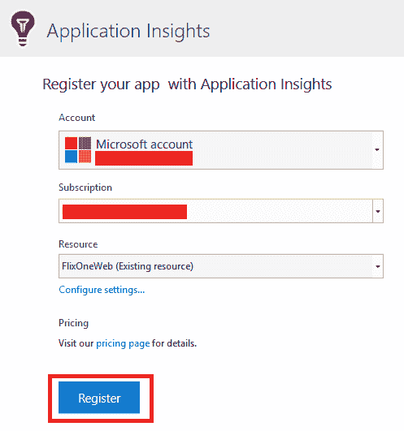

11.  您应该会看到以下进度屏幕:


12.  以下是完成配置过程后的最终屏幕:

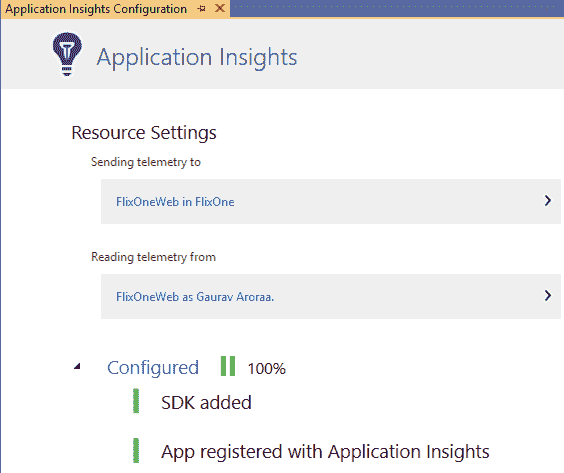

13.  现在，从 Visual Studio 打开解决方案资源管理器。您会注意到一个新的包和一些连接的服务已经添加到项目中:


14.  现在，运行应用程序，然后单击默认页面(请注意，ASP.NET 核心网络应用程序模板中的所有页面都是默认页面)。这是 Visual Studio 中的“诊断工具”窗口:


在这里，当我们与应用程序交互时，您将从网络应用程序中看到事件触发器。要从 Visual Studio 中查看遥测数据，请打开解决方案资源管理器，右键单击连接的服务下的应用程序洞察，然后单击搜索实时遥测，如下图所示:


从这里，您可以查看遥测数据并对其执行分析任务:

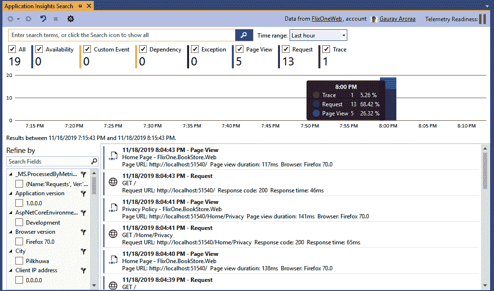

要查看 Azure 门户中的遥测数据，请单击“连接的服务”下的“从解决方案资源管理器打开应用洞察门户”(与我们在上一步中所做的相同)。这将为我们的`FlixOneWeb`打开 Azure 门户和应用洞察。您将看到过去一小时的图形数据，如下图所示:

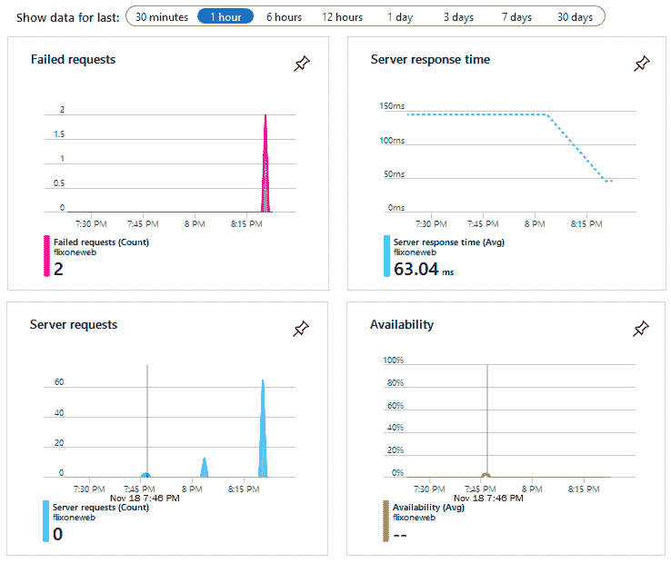

需要注意的是，Visual Studio 向您的 web 应用程序添加了一些东西(例如包和连接的服务)。仪器键也被添加到`appsettings.json`文件中。如果打开此文件，您将在应用洞察中看到一个新条目:

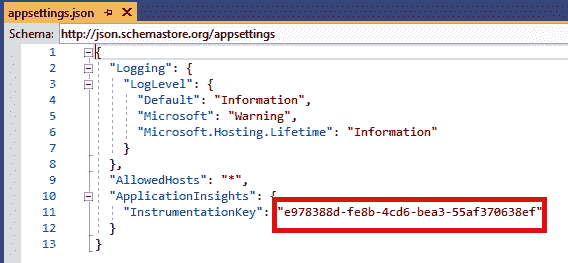

您还将在`Startup.cs`文件中看到一个新条目，如下图所示:

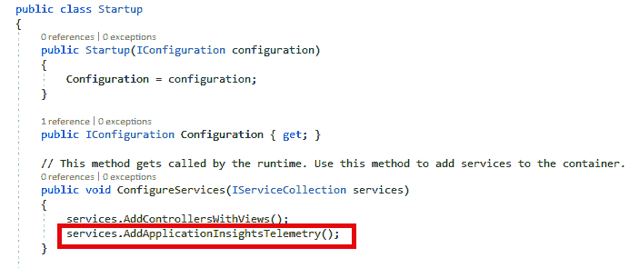

It is recommended that you should store a production-based application instrumentation key in an environment variable.

您还可以在 Azure 门户上创建自定义仪表板。这是我们创建的:

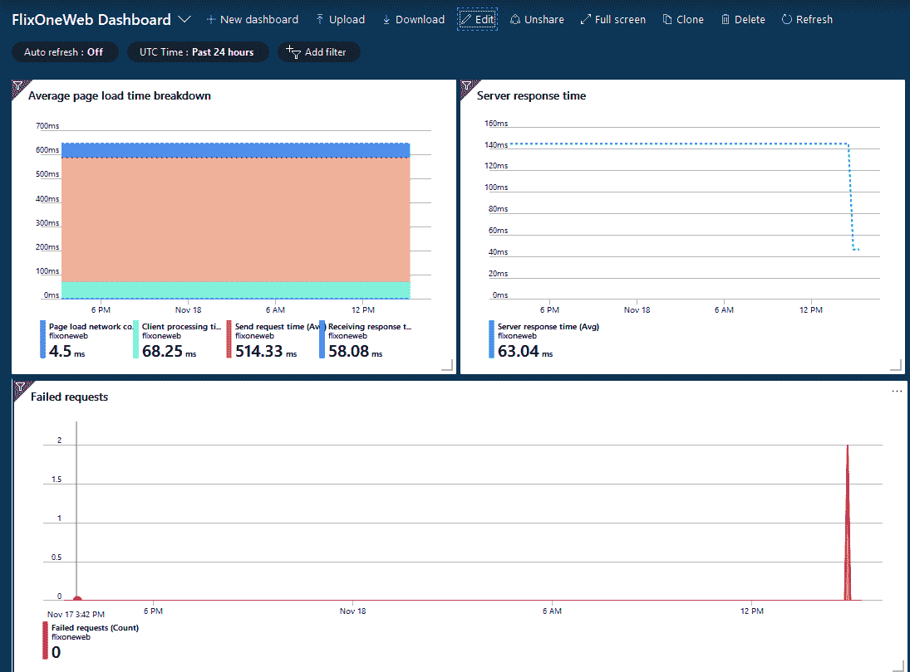

从 Azure 门户(使用查询资源管理器)，我们可以查询我们的洞察数据，以便获得用于分析目的的数据。

Query Explorer uses the Kusto query language to retrieve the log data. A Kusto query is a read-only request that's used to process data and return results. You can find out more by reading the official documentation at: [https://docs.microsoft.com/en-us/azure/kusto/query/](https://docs.microsoft.com/en-us/azure/kusto/query/).

通过使用以下查询，我们可以检查我们的`FlixOne.BookStore.Web`应用程序上的请求:

```cs
requests
| limit 5
```

前面的查询提供了以下输出:


此外，我们可以通过使用各种图表来可视化数据结果。在这里，我们根据前面的数据创建了一个饼图:

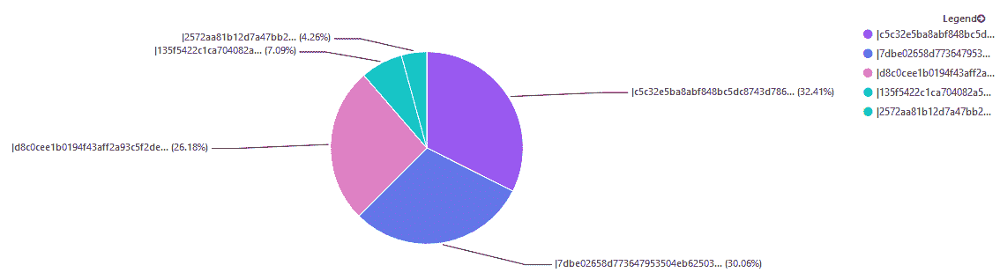

我们可以做进一步的分析，并根据数据创建报告。为了使这个例子更简单，我们可以进行一些小的查询来获取数据。Application Insights 帮助我们收集遥测数据，并将其用于分析和报告。

本节重点介绍了应用洞察的特性。除了监控应用程序的解决方案，我们还看到了更多的监控解决方案，我们将在下一节中讨论。请写下检测密钥，因为我们将在应用程序中使用它。

# 其他微服务监控解决方案

现在，让我们看看一些流行的监控解决方案，我们可以使用它们来构建定制的微服务监控解决方案，以监控应用程序。显然，这些解决方案不是开箱即用的；然而，它们肯定是经过开源社区时间考验的，并且可以很容易地与。基于. NET 的环境。

在接下来的章节中，我们将详细讨论这些监控工具。

# ELK 堆栈概述

ELK 堆栈(也称为弹性堆栈)是最流行的日志管理平台。我们已经知道，监视的基本工具之一是日志记录。对于微服务，会生成数量惊人的日志，这些日志有时甚至是人类无法理解的。ELK 堆栈也是微服务监控的一个很好的候选对象，因为它具有聚合、分析、可视化和监控的能力。ELK 堆栈是一个工具链，包括三个不同的工具，即 Elasticsearch、Logstash 和 Kibana。让我们一个接一个地看它们，以了解它们在 ELK 堆栈中的作用。

# 弹性搜索

Elasticsearch 是一个全文搜索引擎，基于 Apache Lucene 库。该项目是开源的，用 Java 开发。Elasticsearch 支持水平缩放、多租户和聚类方法。弹性搜索的基本要素是它的搜索索引。该索引存储在内部的 JSON 表单中。单个 Elasticsearch 服务器存储多个索引(每个索引代表一个数据库)，单个查询可以搜索具有多个索引的数据。

Elasticsearch 确实可以提供接近实时的搜索，并且可以以非常低的延迟进行扩展。编程模型的搜索和结果通过弹性搜索应用编程接口公开，并可通过 HTTP 访问。

# logstash(日志记录)

Logstash 在 ELK 堆栈中扮演日志聚合器的角色。它是一个日志聚合引擎，收集、分析、处理日志条目并将其保存在其持久存储中。由于其基于数据管道的架构模式，Logstash 非常广泛。它被部署为代理，并将输出发送到 Elasticsearch。

# 姆纳人

Kibana 是一个开源的数据可视化解决方案。它是为弹性搜索而设计的。您可以使用 Kibana 来搜索、查看和交互弹性搜索索引中存储的数据。

它是一个基于浏览器的 web 应用程序，允许您执行高级数据分析，并在各种图表、表格和地图中可视化您的数据。此外，它是一个零配置应用程序。因此，在安装之后，它既不需要任何编码，也不需要额外的基础设施。

本节概述了数据可视化解决方案 Kibana。我们可以使用网页分析通过基巴纳捕获的数据，这样我们就可以用各种图表可视化数据。除了这个用于监控和报告的工具，我们还需要一个日志管理解决方案。Splunk 是目前最有利的工具之一。在下一节中，我们将讨论 Splunk。

# 软体

Splunk 是最好的商业日志管理解决方案之一。它可以非常容易地处理万亿字节的日志数据。随着时间的推移，它增加了许多额外的功能，现在被认为是成熟的运营智能领先平台。Splunk 用于监控大量应用程序和环境。

它在实时监控任何基础架构和应用程序方面发挥着至关重要的作用，对于在问题、问题和攻击影响客户、服务和盈利能力之前识别它们至关重要。Splunk 的监控能力、具体模式、趋势和阈值等等，都可以建立为 Splunk 需要关注的事件。这是为了让特定的个人不必手动完成这项工作。

Splunk 在其平台中包含了警报功能。它可以实时触发警报通知，以便采取适当的措施，从而避免应用程序或基础架构停机。

触发警报和配置操作时，Splunk 可以执行以下操作:

*   发送电子邮件
*   执行脚本或触发运行手册
*   创建组织支持或行动单

通常，Splunk 监控标记可能包括以下内容:

*   应用程序日志
*   活动目录对事件数据的更改
*   Windows 事件日志
*   Windows 性能日志
*   基于 WMI 的数据
*   Windows 注册表信息
*   来自特定文件和目录的数据
*   性能监控数据
*   从 API 和其他远程数据接口和消息队列获取数据的脚本输入

本节的目的是概述 Splunk，一个日志管理工具。对于监控解决方案，我们需要警报/通知。在下一节中，我们将讨论 Splunk 的警报功能。

# 发信号

Splunk 不仅是一个监控解决方案；它还具有报警功能。它可以配置为根据任何实时或历史搜索模式设置警报。这些警报查询可以定期自动运行，警报可以由这些实时或历史查询的结果触发。

您可以将 Splunk 警报基于各种阈值和基于趋势的情况，例如条件、关键服务器或应用程序错误以及资源利用率阈值。

# 报告

如果满足某些条件，Splunk 还可以报告已经触发和执行的警报。Splunk 的警报管理器可用于根据前面的警报数据创建报告。

报告和监控非常有用，尤其是当我们使用企业级应用程序时。如果我们希望生成各种报告来监控这些应用程序，我们在本节中讨论的报告和监控解决方案/工具非常有用。

本节还讨论了一些用于监控和报告的定制解决方案，这些解决方案使用了微软 Azure Cloud 提供的工具之外的工具。在这里，我们讨论了日志管理工具 Splunk 和 **Elastic Stack** ( **ELK** )，其中包含了不同的工具，例如 Elasticsearch、Logtash 和 Kibana。最后，我们学习了如何通过使用数据分析来监控和获取各种报告。

# 摘要

调试和监控微服务并不简单；这是一个具有挑战性的问题。我们故意在这里用*这个词来挑战*:这个没有银弹。没有一个你可以安装的工具可以像魔法一样工作。但是，借助 Azure 诊断和应用洞察，或者 ELK 堆栈或 Splunk，您可以提出解决方案，帮助您解决微服务监控挑战。

实现微服务监控策略是监控微服务实现的一种有用的方法。监控策略包括应用程序/系统监控、实时用户监控、合成事务、集中日志记录、语义日志块，以及在整个事务性 HTTP 请求中实现相关标识。我们看到了如何在各种工具的帮助下创建报告来监控应用程序。借助 ELK 堆栈，我们可以创建一个完整的报告和监控系统。

在下一章中，我们将了解如何扩展微服务，并了解扩展微服务解决方案的解决方案和策略。

# 问题

1.  什么是监控？
2.  监控的必要性是什么？
3.  什么是健康监测？
4.  监控的挑战是什么？
5.  微软 Azure 有哪些主要的日志记录和监控解决方案？

# 进一步阅读

*   *elastic search 7.0 Cookbook–第四版*([https://www . packtpub . com/大数据与商业智能/elastic search-70-Cookbook–第四版](https://www.packtpub.com/big-data-and-business-intelligence/elasticsearch-70-cookbook-fourth-edition))
*   *动手微服务-监控和测试*([https://www . packtpub . com/application-development/动手微服务-监控和测试](https://www.packtpub.com/application-development/hands-on-microservices-monitoring-and-testing))