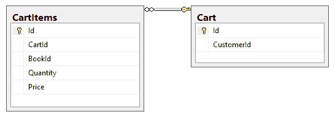
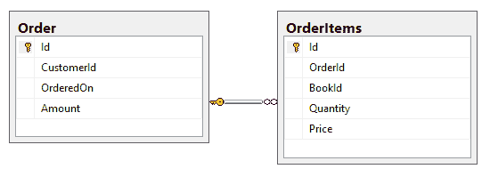

# 微服务架构总结

在理解微服务及其发展的道路上，我们经历了不同的阶段。我们探讨了是什么导致了微服务的出现以及利用它们的各种优势。我们还讨论了各种集成技术和测试策略。

在这一章中，我们将重新审视和讨论我们应用的每一个方面，从整体到过渡到微服务应用，然后讨论监控和策略。

让我们回顾一下到目前为止我们讨论的所有内容，包括本章中的以下主题列表:

*   在微服务之前了解架构
*   整体转变
*   云原生微服务概述
*   监视
*   监测战略
*   反应性微服务

# 技术要求

本章不包含代码示例，因此没有技术先决条件。

# 在微服务之前了解架构

微服务从来不是从一开始就设计成现在的形式。相反，已经从其他形式的流行架构风格逐渐过渡到微服务。在微服务出现之前，我们有整体架构和面向服务的架构，它们统治着企业开发的世界。

在快速回顾微服务体系结构及其各种属性和优势之前，让我们回顾一下这两种体系结构。

# 整体建筑

单片架构已经存在了相当长的一段时间，它产生了具有单个。NET 程序集。如果一个整体生产多个组件也没问题，只要它服务于一个孤立的任务。单片架构由以下组件组成:

*   用户界面
*   业务逻辑
*   数据库访问

自给自足的代价是所有组件都是相互关联和相互依赖的。任何模块的微小变化都会影响整个软件。由于所有组件都以这种方式紧密耦合，因此有必要对整个应用进行测试。此外，如此紧密耦合的另一个后果是必须部署整个应用，而不是只部署其中的一部分。让我们总结一下由于采用这种架构风格而面临的所有挑战:

*   大型相互依赖代码
*   代码复杂性
*   可量测性
*   系统部署
*   采用新技术

我们的整体应用是一个具有大量相互依赖代码的单一应用。用户界面、业务逻辑和数据库访问层紧密耦合。这个应用有前面讨论过的挑战。当我们想要按照目标框架/语言编写标准化代码时，这种应用也创造了一个复杂的条件。接下来，我们将讨论与相关的挑战。NET 堆栈。

# 标准化的挑战。NET 堆栈

当涉及到单片架构时，采用技术并不容易。这带来了一定的挑战。其中一些挑战包括安全性、响应时间、吞吐率和技术采用。这并不是说这种建筑风格不会用解决方案反击。挑战在于，在单片架构中，代码的可重用性非常低或根本不存在，这使得技术采用变得困难。

整体应用存在安全和技术采用方面的挑战，但它们也在扩展方面受到影响，我们将在下一期看到这一点。

# 缩放比例

我们还讨论了如何扩展是一个可行的选择，但随着回报的减少和费用的增加。垂直和水平缩放各有利弊。纵向扩展似乎更容易开始:投资于信息技术基础设施，如内存升级和磁盘驱动器。然而，回归很快就停滞了。垂直扩展所需的停机时间的缺点在水平扩展中不存在。然而，超过一个点，水平回报的成本就变得太高了。

让我们继续讨论行业中另一个广泛使用的架构，那就是面向服务的架构。

# 面向服务的架构

行业中另一个广泛使用的架构是**面向服务架构** ( **SOA** )。这种架构摆脱了单一架构，并参与解决了前面部分提到的一些挑战。首先，它基于服务的集合。提供服务是 SOA 的核心概念。

服务是向其他系统组件提供某些功能的一段代码、程序或软件。这段代码能够直接与数据库交互，或者通过其他服务间接与数据库交互。它是独立的，可以让桌面和移动应用轻松使用服务。

SOA 相对于单一架构提供的一些明确优势如下:

*   可重复使用的
*   无国籍的
*   可攀登的
*   基于合同
*   升级能力

SOA 是应用最广泛的架构之一，因为它有很多好处；本节讨论 SOA 及其相对于单一架构的优势。接下来，我们将讨论微服务风格的架构。

# 微服务式架构

除了 SOA 的一些明确优势之外，微服务还提供了一些额外的差异化因素，使该架构成为明显的赢家。微服务的核心是被设计成完全独立于系统中的其他服务，并在其流程中运行。独立的属性要求在应用设计中有一定的原则和策略。它们提供的一些好处如下:

*   **清晰的代码边界**:这导致更容易的代码更改。它们独立的模块提供了独立的功能，这导致一个微服务的变化对其他微服务的影响很小。
*   **轻松部署**:如果需要，可以一次部署一个微服务。
*   **技术适配**:前面的属性带来了这个非常抢手的好处。这允许我们在不同的模块中采用不同的技术。
*   **可承受的可扩展性**:这让我们可以只扩展选择的组件/模块，而不是整个应用。
*   **分布式系统**:这是含蓄的，但这里需要提醒一句。确保您的异步调用被很好地使用，并确保同步调用不会阻塞整个信息流。很好地使用数据分区。我们稍后再谈这个，所以现在不要担心。
*   **快速的市场响应**:在竞争激烈的世界中，这是一个确定的优势，因为如果你对新功能请求的响应速度较慢，或者在你的系统中采用新技术的速度较慢，用户往往会很快失去兴趣。

在讨论微服务时，消息传递是重要的方面之一。本节向我们介绍了微服务的优势。接下来，我们将讨论微服务中的消息传递。

# 微服务中的消息传递

这是另一个需要讨论的重要领域。微服务中主要使用两种主要的消息传递类型:

*   同步的
*   异步的

在微服务中，通过消息传递进行通信非常重要。服务可能相互依赖，也可能不相互依赖。

微服务风格的架构比整体应用有很多优势。这一节旨在总结所有的好处和优势。这些优势在我们将整体服务转变为微服务时非常有用，这将在下一节中介绍。

# 理解整体转换是如何工作的

作为练习的一部分，我们决定将现有的单片应用 FlixOne 转换为微服务风格的架构。我们看到了如何根据以下参数识别整料中的分解候选物:

*   代码复杂性
*   技术采用
*   所需资源
*   人类依赖性

除了技术独立性之外，它在成本、安全性和可扩展性方面也有明显的优势。这也使应用更加符合我们的业务目标。

转换的整个过程需要您识别类似于微服务边界的接缝，沿着这些接缝您可以开始分离。你必须小心选择合适的参数。我们已经讨论了模块的相互依赖性、团队结构、数据库和技术是几个可能的候选者。处理主数据需要特别小心。它更多的是一种选择，即您是否希望通过单独的服务或配置来处理主数据。你将是你的剧本的最佳评判者。微服务拥有自己的数据库的基本要求是删除许多现有的外键关系。这就需要智能地选择事务处理策略，以保持数据的完整性。

让我们继续讨论集成技术。

# 集成技术

我们已经探索了微服务之间的同步和异步通信方式，并讨论了服务的协作风格。这些风格是基于请求/响应和事件的。虽然请求/响应在本质上似乎是同步的，但事实是，正是实现决定了集成风格的结果。另一方面，基于事件的风格是纯异步的。

当处理大量微服务时，我们必须利用集成模式，以促进微服务之间的复杂交互。在[第 3 章](03.html)、*服务之间的有效通信*中，我们探索了 API 网关，以及事件驱动模式。

API 网关为您提供了大量服务，其中一些如下:

*   路由应用编程接口调用
*   验证应用编程接口密钥、JWT 和证书
*   强制实施使用配额和费率限制
*   在不修改代码的情况下动态转换应用编程接口
*   设置缓存后端响应
*   出于分析目的记录调用元数据

事件驱动模式通过一些服务发布它们的事件，以及一些服务订阅那些可用的事件来工作。订阅服务只是根据事件及其元数据独立于事件发布服务进行反应。发布者不知道订阅者将要执行的业务逻辑。

集成确保我们应用的每个部分都是集成的；本节总结了我们在前几章中讨论过的各种观点。任何应用的一个重要方面是平滑部署，接下来我们将讨论这一点。

# 部署

对于企业应用而言，整体部署具有挑战性的原因不止一个。拥有一个难以分解的中央数据库，只会增加整体挑战，以及上市时间。

对于微服务，情况非常不同。好处不仅仅是因为架构是微服务。相反，这是从最初阶段开始的规划。没有**持续交付** ( **光盘**)和**持续集成** ( **CI** )你不能指望一个企业级的微服务被管理。从早期阶段开始，对 CI 和 CD 的需求就非常强烈，如果没有它们，生产阶段可能永远看不到曙光。

CFEngine、Chef、Puppet、Ansible 和 PowerShell DSC 等工具可以帮助您用代码来表示基础架构，它们可以让您轻松地使不同的环境(例如，UAT、预生产、生产等)完全相同。Azure 在这方面可能是一个盟友:所需的快速和重复供应很容易得到满足。

与最接近的竞争对手虚拟机相比，容器可以更有效地满足隔离要求。我们已经探索了 Docker 作为容器化的热门候选之一，并向您展示了如何部署它。

完成代码后，应用必须在相关环境中进行测试，这在部署时是可能的；CI/CD 在这里工作。在本节中，我们总结了应用的部署，接下来，我们将总结测试微服务。

# 测试微服务

我们都知道单元测试的重要性，以及为什么每个开发人员都应该编写单元测试。单元测试是验证有助于构建更大系统的最小功能的好方法。

然而，测试微服务并不是一件常规的事情，就像测试一个整体一样，因为一个微服务可能会与其他几个微服务交互。在这种情况下，我们应该利用对实际微服务的调用来确保整个工作流正常工作吗？答案是否定的，因为这将使开发一个微服务依赖于另一个部分。如果我们这样做，那么拥有基于微服务的架构的整个目的就失去了。为了解决这个问题，我们将使用模拟和存根方法。这种方法不仅使测试独立于其他微服务，而且使数据库测试更加容易，因为我们也可以模拟数据库交互。

用单元测试来测试一个小的、孤立的功能，或者通过模仿外部微服务的响应来测试一个组件，都有它的范围，并且在这个范围内运行良好。然而，如果你已经在问自己关于测试大环境的问题，那么你并不孤单。集成测试和合同测试是测试微服务的下一步。

在集成测试中，我们关心外部微服务，并且作为过程的一部分，我们与它们进行通信。为此，我们模拟外部服务。我们在合同测试中更进一步，我们独立测试每个服务调用，然后验证响应。值得花时间研究的一个重要概念是消费者驱动的合同。详见[第四章](12.html)、*测试微服务*、T4 对此进行详细研究。

本节总结了各种测试，我们讨论了消费者驱动的契约。安全性是任何应用中最重要的部分，在下一节中，我们将对其进行总结。

# 安全

具有单点身份验证和授权的传统方法在单体架构中运行良好。但是，在微服务的情况下，您需要为每个服务都这样做。这不仅在实现服务方面，而且在保持服务同步方面都会带来挑战。

OAuth 2.0 授权框架，结合 OpenID Connect 1.0 规范，可以为我们解决这个问题。OAuth 2.0 描述了授权过程中涉及的所有角色，这些角色很好地满足了我们的需求。我们只需要确保选择了正确的资助类型；否则，安全性会受到损害。OpenID Connect 身份验证建立在 OAuth 2.0 协议之上。

**Azure 活动目录** ( **Azure AD** )是 OAuth 2.0 和 OpenID Connect 规范的提供者之一。这里的理解是，Azure AD 可以很好地与应用进行扩展，并且它可以与任何组织的 Windows Server Active Directory 很好地集成。

正如我们已经讨论过的容器，理解容器非常接近主机操作系统的内核是非常重要和有趣的。保护他们是另一个不能被高估的方面。Docker 是我们考虑的工具，它使用最小特权原则提供必要的安全性。

Azure 活动目录(AAD)非常适合验证用户和验证应用，这样我们就不用担心验证请求了。但是为了完成验证，我们需要在使用 AAD 的同时采取一些额外的步骤。除了安全性，监控和日志记录也是应用的重要方面。让我们继续并总结监控我们的应用。

# 监控应用

铁板一块的世界有它自己的一些优势。与微服务相比，监控和日志记录是更容易的领域。企业系统可能分布的微服务数量之多令人难以置信。

正如[第 1 章](12.html)、*微服务简介*中所讨论的，在*微服务架构的先决条件*一节中，组织应该为深刻的变革做好准备。监测框架是这方面的关键要求之一。

与单一架构不同，在基于微服务的架构中，从一开始就非常需要监控。监控有多种分类方式:

*   **健康**:我们需要先发制人地知道什么时候服务故障即将发生。关键参数，如 CPU 和内存利用率，以及其他元数据，可能是我们服务即将失败的前兆，或者只是服务中需要修复的缺陷。试想一下，当数百名现场高管试图与潜在客户分担成本时，保险公司的费率引擎会过载并停止服务，甚至表现缓慢。如今，没人没人能等得起数据。
*   **可用性**:可能会有服务不执行大量计算的情况，但是服务本身的最低可用性可能对整个系统至关重要。在这种情况下，当系统停机(称为停机)时，我们必须使用一些工具来检查系统是否恢复(启动)。一个常用的命令是`ping`，我们必须依靠它。它可能会等待几分钟，然后向系统管理员发送电子邮件。这种解决方案适用于单片，需要监控一两个服务。然而，有了微服务，就有了更多的元数据。
*   **性能**:对于获得高流量的平台，例如银行和电子商务，仅仅可用性并不能提供所需的服务。考虑到在很短的时间内，从几分钟到几十秒钟，有多少人在他们的平台上汇合，性能不再是奢侈品。您需要知道系统是如何响应的，通过使用它的数据，例如正在服务的并发用户的数量，并将其与后台的健康参数进行比较。这可能会为电子商务平台提供在即将到来的假期之前决定是否需要升级的能力。为了更多的销售，你需要服务更多的人。
*   **安全性**:在任何系统中，你只能规划到特定级别的恢复能力。不管一个系统设计得多好，总会有一些阈值，超过这个阈值，系统就会摇摇欲坠，从而导致多米诺骨牌效应。然而，有一个精心设计的安全系统可以很容易地避免拒绝服务和 SQL 注入攻击。在处理微服务时，这在系统与系统之间非常重要。因此，在设置微服务之间的信任级别时，要三思而后行。我看到人们使用的默认策略是用微服务保护端点。覆盖这一方面可以提高系统的安全性，值得花些时间。
*   **审计**:医疗保健、金融和银行是在相关服务方面具有最严格合规标准的几个领域，在全球范围内也是如此。根据您所处理的法规遵从性的类型，您可能需要将数据作为记录保留一段特定的时间，以特定的格式保存数据以便与管理机构共享，甚至与管理机构提供的系统同步。税收制度可能是另一个例子。对于分布式体系结构，您不想冒丢失与单个事务相关的数据记录集的风险，因为这将导致法规遵从性失败。
*   **排除系统故障**:我敢打赌，在未来很长一段时间内，这将是任何开始使用微服务的人的最爱。我记得早期，我曾尝试对涉及两个 Windows 服务的场景进行故障排除。我再也没有想过推荐类似的设计。但是时代变了，科技也变了。

当向其他客户提供服务时，监控变得更加重要。在当今竞争激烈的世界中，服务级别协议(SLA)将是任何交易的一部分，并且在成功和失败的情况下都有与之相关的成本。你有没有想过，不管发生什么，我们多么容易就认为微软 Azure 服务级别协议会成立？我已经习惯了，担心云资源可用性的客户的查询得到了 99.9%正常运行时间的回复，甚至客户都没有眨眼。请记住，并非 Azure 中的所有组件都具有相同的 SLA。然而，通过对 Azure 服务的适当设计，它将击败大多数内部部署。

因此，除非您有信心与您的客户就服务级别协议达成一致，否则在提供服务时，他们不能指望它承诺相同的服务级别协议。事实上，没有 SLA 可能意味着您的服务可能不够稳定，无法提供服务。接下来，我们将总结监控的各种挑战。

# 监测挑战

在建立成功的监控系统之前，可能有多个关键点需要解决。这些需要被识别，并且需要被分配一个解决方案。接下来将讨论其中的一些要点。

# 规模

如果你有一个成功运行的系统，几十个微服务完美协调地组织成功的事务，那么你就赢得了第一场战斗。恭喜你！但是，您必须插入必要的监控部分，如果您还没有这样做。理想情况下，这应该是第一步本身的一部分。

# 组件寿命

随着虚拟机和容器的使用，我们需要弄清楚哪些部分值得监控。当您查看通过监视这些组件生成的数据时，其中一些组件可能已经不存在了。因此，明智地选择要监控的信息变得极其重要。

# 信息可视化

有一些可用的工具，比如 AppDynamics 和 New Relic，可以让你可视化多达 100 个微服务的数据。然而，在现实应用中，这只是这个数字的一小部分。必须清楚这些信息的目的，我们需要一个设计良好的可视化。这是我们可以选择反向设计的一个领域。首先，考虑您想要的报告/可视化，然后看看如何对其进行监控。

我们在本节中总结了监控和日志记录。我们还讨论了监控系统的各种挑战。现在，让我们继续并总结监控系统的各种策略。

# 了解监控策略

从监控开始，您可以考虑不同的常用策略，作为您的问题的解决方案。一些常见的实施策略如下:

*   应用/系统监控
*   实时用户监控
*   语义监控和合成交易
*   压型
*   端点监控

请记住，这些策略中的每一个都专注于解决特定的目的。虽然一个可以帮助分析事务传播，但另一个可能适用于测试目的。因此，在设计整个系统时，您需要选择这些策略的组合，因为仅仅使用单一策略无法满足您的需求。

监控策略确保并专注于服务于特定目的，如本节所述。出于不同的目的，我们需要更多的策略。所以，让我们继续下一步，讨论可伸缩性。

# 理解可伸缩性

我们已经详细讨论了可伸缩性的 scale-cube 模型，并且我们已经发现了每个轴上的伸缩意味着什么。请注意， *x-* 轴缩放是通过在多个实例和微服务用户之间使用负载平衡器来实现的。我们还看到了基于交易发起的 *z* 轴缩放存在一些缺陷。

总的来说，微服务领域的扩展可以分为两个独立的领域:

*   基础设施
*   服务设计

让我们在以下几节中研究它们。

# 基础设施扩展

虚拟机是微服务世界不可或缺的组成部分。作为微软 Azure 平台的一部分，可用的功能使您能够毫不费力地执行这个看似复杂的任务。

通过与 Azure 自动缩放集成的缩放集功能，我们可以轻松管理一组相同的虚拟机。

自动缩放允许您为各种受支持的参数定义阈值，例如 CPU 使用率。一旦超过阈值，缩放设置就会生效，具体取决于参数是放大还是缩小。

这意味着，如果扩展集预测它需要添加更多虚拟机来应对增加的负载，它将继续这样做，直到阈值恢复正常。同样，如果对被管理资源的需求下降，它将决定从扩展集中删除虚拟机。对我来说，这听起来像是网络团队的和平。围绕自动扩展的选项可以进一步探索，因为它能够处理复杂的扩展需求，例如在扩展或向外扩展时运行数百台虚拟机。

# 服务设计

在我们的微服务中，我们已经实现了每个微服务的数据隔离。然而，读写数据库的模式仍然是一样的。由于底层关系数据库实施 ACID 模型，这可能是一件代价高昂的事情。或者我们可以说，这种方法可以稍加修改，以不同的方式实现数据库读/写操作。

我们可以使用公共查询责任分离，也称为 CQRS，在我们的微服务中进行有效的设计更改。一旦完成了模型级分离，我们就可以使用不同的策略来优化读写数据模型。

基础架构和服务设计是扩展的两个部分，在本节中，我们将两者都进行了总结。下一节将帮助我们了解和了解反应式微服务。

# 反应式微服务综述

我们进展顺利，同时将我们的整体应用转变为微服务风格的架构。我们还简要地讨论了在我们的服务中引入反应特性的可能性。我们现在知道了反应式微服务的关键属性，即:

*   响应性
*   弹性
*   自治
*   消息驱动

在管理微服务之间的通信时，我们也看到了反应式微服务的好处，也就是减少了我们的工作量。

这种优势不仅转化为工作量的减少，还转化为专注于执行业务逻辑的核心工作的能力，而不是试图应对服务间通信的复杂性。因此，下一节将重点介绍一个绿地应用。

# 构建绿地应用

前面的章节已经讨论了整体应用(棕色地带)，然后我们将一个整体过渡到一个新的微服务应用(绿色地带)。在这一部分，我们将从头开始创建一个 FlixOne 书店。

A brownfield application is already developed (like a monolith application), whereas a greenfield application is one created from scratch.

首先，我们将确定我们的微服务及其功能，我们还将确定服务间的交互。

我们的 FlixOne 书店将提供以下功能:

*   在现有书籍中搜索
*   根据类别过滤书籍
*   向购物车添加书籍
*   对购物车进行更改
*   从购物车下订单
*   用户认证

为了满足应用的业务需求，创建一个绿地应用需要大量的工作。在下一节中，我们将讨论创建应用的各个步骤。

# 确定我们的服务范围

为了理解这些功能将如何映射为不同的微服务，我们需要首先理解支持它需要什么，以及什么可以作为微服务组合在一起。我们将从微服务本身的角度来看看数据存储会是什么样子。

定义应用的范围非常重要，所以接下来，当我们显示我们的 FlixOne 书籍列表时，我们将看到范围是什么。

# 图书列表微服务

让我们试着把搜索书籍的第一个功能分解开来。为了让我们的用户在商店中浏览图书，我们需要维护我们提供的图书列表。在这里，我们的第一个候选人被雕刻成一个微服务。图书目录服务不仅负责搜索可用的图书，还负责维护存放所有图书相关信息的数据存储。微服务应该能够处理系统中可用书籍所需的各种更新。我们称之为图书目录微服务，它将有自己的图书数据存储。

# 图书搜索微服务

检查过滤书籍的下一个功能似乎属于图书目录微服务本身的范围。然而，说到这里，让我们通过质疑我们自己对业务领域的理解来证实这一点。我想到的问题与我们的用户将执行的所有搜索的影响有关，这会使服务瘫痪。那么，图书搜索功能应该是一种不同的服务吗？这里，答案在于微服务应该有自己的数据存储。通过让图书目录和图书目录搜索功能作为不同的服务，这将需要我们在两个不同的位置维护一个图书列表，这带来了额外的挑战，例如必须同步它们。解决方案很简单:我们需要单个微服务，如果需要，我们应该扩展和负载平衡图书目录微服务。

# 购物车微服务

下一个候选人因在线购物革命而出名，这场革命是由亚马逊这样的公司带来的，并由智能手机进一步推动:购物车微服务。在我们最终决定结账并付款之前，它应该让我们在购物车中添加或删除书籍。毫无疑问，这是否应该是一个单独的微服务。然而，这带来了一个有趣的问题，即它是否处理产品的数据存储；它需要这样做来接收一些基本的细节，比如可用性(有什么存货)。跨服务访问数据存储是不可能的，因为这是微服务最基本的先决条件之一。我们问题的答案是服务间的沟通。微服务使用另一个微服务提供的服务是可以的。我们称之为我们的购物车微服务。

# 订单微服务

接下来是下订单的业务功能。当用户决定他们的购物车里有合适的书时，他们决定下单。此时，与订单相关的一些信息必须被确认/传达给其他各种微服务。例如，在确认订单之前，我们需要从图书目录中确认有足够的库存数量来完成订单。确认后，应该从图书目录中扣除正确数量的项目。成功确认订单后，购物车也必须清空。

我们的订单微服务听起来更普遍，它似乎与不在微服务之间共享数据的规则相矛盾，但事实并非如此，我们很快就会看到这一点。所有操作都将完成，同时保持清晰的边界，每个微服务管理自己的数据存储。

# 用户认证

我们的最后一个候选是用户认证微服务，它将验证登录我们书店的客户的用户凭证。这个微服务的唯一目的是确认提供的凭证是否正确，以限制未经授权的访问。这对于微服务来说似乎很简单；但是，我们必须记住这样一个事实，如果您决定更改您的身份验证机制，通过使该功能成为任何其他微服务的一部分，它将影响不止一个业务功能。这种变化的形式可能是基于 OAuth 2.0 授权框架和 OpenID Connect 1.0 身份验证，使用正在生成和验证的 JWT。

以下是微服务的最终候选列表:

*   图书目录微服务
*   购物车微服务
*   订单微服务
*   用户身份验证微服务

在下图中，我们可视化了四种服务，它们是目录(书店)、购物车(购物车商店)、订单(订单商店)和身份验证(用户商店):

上图可视化了用户如何通过应用编程接口网关与四个服务交互:图书目录、用户授权、订单和购物车。

# 同步还是异步

在我们开始简单介绍微服务之前，这里有一个要点需要考虑。我们的微服务将相互通信，并且有可能它们将依靠响应来进一步发展。这给我们带来了一个困境，我们经历了抛弃心爱的整块石头的所有痛苦，然后陷入了同样的情况，一个故障点可能导致系统的级联崩溃。

服务之间的沟通非常重要；让我们继续，并在下面几节中用几个示例服务来讨论它们。

# 图书目录微服务

目录服务将被设计为从目录中列出、添加和删除项目。这项服务还将告诉我们特定产品(书籍)的库存。

这个微服务有六个主要功能，通过一个 HTTP API 组件公开。这个 HTTP API 组件负责处理这些函数的所有 HTTP 请求。

这些功能如下:

| **API 资源描述** | **API 资源描述** |
| `GET /api/book` | 获取可用书籍的列表 |
| `GET /api/book/{category}` | 获取某个类别的图书列表 |
| `GET /api/book/{name}` | 按名称获取图书列表 |
| `GET /api/book/{isbn}` | 根据国际标准书号获得一本书 |
| `GET /api/bookquantity/{id}` | 获取预定图书的可用库存 |
| `PUT /api/bookquantity/{id}/ {changecount}` | 增加或减少一本书的可用库存数量 |

下图可视化了目录服务的表:

在上图中，我们已经可视化了**作者**、**股票**、**图书**、**T7】和**类别**的表格。它还描述了表之间的关系。简而言之，图表代表了以下内容:一本书属于一个特定的类别，显示了它的库存，并有一个作者。**

# 购物车微服务

该微服务将具有以下作为 HTTP 端点公开供使用的功能:

| **API 资源描述** | **API 资源描述** |
| `POST` / `api` / `book` / `{customerid }` | 将特定的书籍添加到客户的购物车中 |
| `DELETE` / `api` / `book` / `{customerid }` | 从顾客的购物车中取出书 |
| `GET` / `api` / `book` / `{customerid}` | 获取客户购物车中的图书列表 |
| `PUT` / `api` / `empty` | 移除购物车中当前包含的所有书籍 |

下图可视化了购物车服务的两个支持表:

上图可视化了两个表之间的关系，即购物车和购物车。该关系表示 Cart 和 CartItems 之间的一对多关系，其中 CartId 是 Cart 表的主键，CartItems 表的外键。

# 订单微服务

该微服务将具有以下作为 HTTP 端点公开供使用的功能:

| **API 资源描述** | **API 资源描述** |
| `POST` / `api` / `order` / `{customerid }` | 获取客户购物车中的所有书籍，并为它们创建订单 |
| `DELETE` / `api` / `order` / `{customerid }` | 从顾客的购物车中取出书 |
| `GET` / `api` / `order` / `{orderid}` | 获取所有书籍作为特定订单的一部分 |

下图描述了订单服务的两个表:

上图描述了两个表之间的关系，即 Order 和 OrderItems。该关系表示 Order 和 OrderItems 之间的一对多关系，其中 OrderId 是 Order 表中的主键和 OrderItems 表中的外键。这意味着一个订单可能有多个项目。

# 用户身份验证微服务

该微服务将具有以下作为 HTTP 端点公开供使用的功能:

| **API 资源描述** | **API 资源描述** |
| `GET` / `api` / `verifyuser` / `{customerid, password}` | 验证用户 |

下面的屏幕截图显示了身份验证服务的用户表:

您可以根据需要查看应用源代码并进行分析。

这整个部分向我们介绍了创建绿地应用的各个步骤，我们在其中讨论了目录和购物车服务。

接下来，让我们进入一个不同的主题:云原生微服务，以及它们如何在我们的微服务容器上下文中使用。

# 云原生微服务概述

术语*云优先*，或者*云原生*，指的是容器的环境，或者我们可以说是基于容器的环境。在[第 3 章](03.html)、*服务之间的有效通信*中，我们讨论了 Azure Kubernetes 服务，在[第 5 章](05.html)、*使用 Docker 部署微服务*中，我们讨论了 Docker。每当我们讨论容器时，我们都会提到术语*云原生*。

The term *cloud-first* or *cloud-native* initiated a new approach to achieving complex, scalable systems.

Kubernetes 作为云原生平台，在现有网络拓扑和云提供商原语的基础上提供网络。例如，在我们的案例中，我们有微软 Azure 作为我们的云提供商。这类似于我们处理存储，存储是一个逻辑抽象层，是开发人员和资源管理员最近正在使用的本地存储层。这是部署发生的地方。无论使用何种基础架构，这都可能基于物理服务器或虚拟机和/或私有/公共云。

此外，当我们开发微服务应用时，云原生技术是有帮助的。这些应用是用容器化的服务构建的(这意味着服务封装在容器中)。

从我们的系统架构来看，我们可以说云原生微服务基于以下原则:

*   **自动化**:对于任何一个软件系统，最好是我们把它做成自动化系统。因为有了自动化系统，我们最初需要投资，然后，我们使用该系统几乎没有或很少投资。自动化系统将有助于建立基础设施；CI/CD 对于自动化系统来说也是非常流行的做法。一些示例包括缩放系统和监控系统。
*   **智能状态**:这是任何系统最难的部分，而架构它。主要是，为此，我们应该注意我们的数据状态将如何存储用户数据。
*   **托管服务** : Azure 提供了很多托管服务，所以不仅仅是基础设施提供商。
*   **一个不断进化的系统**:任何系统的改进和细化都有助于将其发展成为最好的系统。这些系统总是在不断发展，并且在这些系统的整个生命周期中都在进行改进。同样，我们的云原生系统也应该发展。

在本节中，我们看到了云优先或云原生系统是如何不断发展的，因此，这对于其整体发展非常重要。

# 摘要

在本章中，我们回顾了从单一应用到基于微服务的应用的整个过程。我们重新讨论了与遗留应用相关的问题。(我们的单片应用现在是一个遗留应用，因为在本章之前，我们已经将单片应用转换为基于微服务的应用。)然后我们讨论了业务案例、服务之间的通信、服务的测试、服务的监控等等。我们还讨论了反应式微服务。最后，我们讨论了`Order`微服务和`Shopping-Cart`微服务。

我们希望这本书能够向您介绍微服务风格架构的基本概念，我们希望它能帮助您深入了解微服务的优秀方面，并提供概念的清晰示例。最终的应用可供您仔细查看，以便按照您自己的速度分析到目前为止所学的内容。我们祝你在运用本书所学的技能并将其应用到现实挑战中时好运。