# 三、Azure DevOps 中的持续集成管道

构建优秀的应用不是一项简单的任务。相反，这是一项困难而复杂的工作，许多专业人员需要高效地合作，以创建符合高端用户期望的应用。

如今，一切都进展得很快，上市时间对成功非常重要。本章将介绍一些方法、过程和工具，以帮助您优化开发过程，从而构建具有短发布周期的高质量软件。

传统上，构建软件涉及从头到尾规划整个项目、编写详细的规范、开发和测试（通常是匆忙进行的），同时希望一切都能按预期工作（如 V-model 方法所示）。

这种方法有时有效，有时无效。当它不起作用时，开发人员只在手动测试时实现特性，目的是在以后添加单元测试。然后，在项目结束时，他们必须加快速度以确保按时交付，因此经常会出现时间不足的情况。

这导致项目存在重大的技术、功能和质量缺陷，存在大量的 bug 和巨大的维护工作量，导致发布周期过长。在最坏的情况下，最终用户不会喜欢交付的功能；因此，最终产品可视为完全失效。有一种更好的方法做事情，这是人们已经谈论了一段时间的事情，你肯定已经听说过敏捷方法了！

敏捷方法与**持续集成**（**CI**）和**持续部署**（**CD**相结合，为构建更好的软件提供了解决方案，具有更快的上市时间、更低的维护成本、更好的整体质量和更高的客户满意度。

虽然这本书并不是关于敏捷方法论，但我们建议您熟悉这个主题，并且我们将解释所有与之相关的工具和过程。

在本章中，我们将介绍以下主题：

*   CI、CD 以及构建和发布管道
*   将 Azure DevOps 用于 CI 和 CD
*   创建免费的 Azure DevOps 订阅和您的第一个 Azure DevOps 项目
*   通过工作项组织您的工作
*   使用 Git 作为**版本控制系统**（**VCS**）
*   创建 Azure DevOps 构建管道
*   创建 Azure DevOps 发布管道

# 技术要求

为了阅读本章，需要以下内容：

*   Microsoft 帐户
*   Azure DevOps 订阅
*   GitHub 帐户

# CI、CD 以及构建和发布管道

使用 CI 时，开发团队编写代码。在代码审查之后，它被集成到 VCS 中，并从那里自动构建和测试。这种情况通常一天发生多次。因此，开发团队可以快速发现问题和 bug，并尽早修复它们，从而实现通常所说的**快速失效**。

CD 是 CI 的自然扩展，因为它确保在构建和测试之后，每次应用修改都是可发布的。开发、测试、暂存和生产系统通过 CD 自动升级。

管道定义了完整的开发和发布工作流。它包含概念、开发、质量保证和测试所需的所有步骤，直到最终产品交付。它包括以工业化方式构建高质量应用的 CI 和 CD 过程。

Note that you can separate your development process into two different pipelines—a build pipeline and a release pipeline—or have only one single pipeline that does it all, depending on your specific needs.

有各种技术和工具可以帮助您实现基于 CI 和 CD 的高效、高效、全自动化和工业化的软件开发过程。我们将在以下示例中使用 Microsoft Azure DevOps：

# 将 Azure DevOps 用于 CI 和 CD

如果您需要在敏捷环境中协同工作、共享代码、规划和管理您的用户故事和开发任务、跟踪功能和 bug 的进度，那么 Azure DevOps 可能是您在云中可以找到的最佳解决方案之一。

它支持多种不同的编程语言（C#、Java、JavaScript 等）、各种开发工具（VisualStudio、Eclipse 等），并可扩展到任何团队规模。

此外，它对私人团队项目中最多五个用户是免费的，这对于尝试本书中所示的示例非常有帮助。

Azure DevOps 提供以下主要功能：

*   **工作项目和看板**：计划和分配工作和任务。
*   **源代码管理**：在 VCS 中共享代码。
*   **测试**：创建并执行包含测试用例的测试计划。
*   **Azure 工件**：共享您自己的 NuGet 软件包或任何其他软件包。
*   **构建管道**：用于创建应用包的构建代码。
*   **发布管道**：将应用包部署到不同的发布目标。

For further information on Azure DevOps and all of its features, please go to [https://azure.microsoft.com/en-us/services/devops/](https://azure.microsoft.com/en-us/services/devops/).

# 创建免费的 Azure DevOps 订阅和您的第一个 Azure DevOps 项目

我们现在将解释如何创建您自己的免费 Azure DevOps 订阅和您的第一个 Azure DevOps 项目。稍后，您将使用这些信息来尝试和理解本书中的示例：

1.  转到[https://azure.microsoft.com/en-us/services/devops/](https://azure.microsoft.com/en-us/services/devops/) 点击自由启动按钮：

2.  使用您的工作、学校或个人 Microsoft 帐户登录：

3.  如果您是第一次连接，请输入其他信息，如您的姓名、国家/地区和电子邮件地址，然后单击“继续”。

4.  现在您的帐户已创建，让我们创建一个新项目。对于我们的示例，选择 Git 作为版本控制，单击 Change Details，然后选择 Work item process as Scrum:

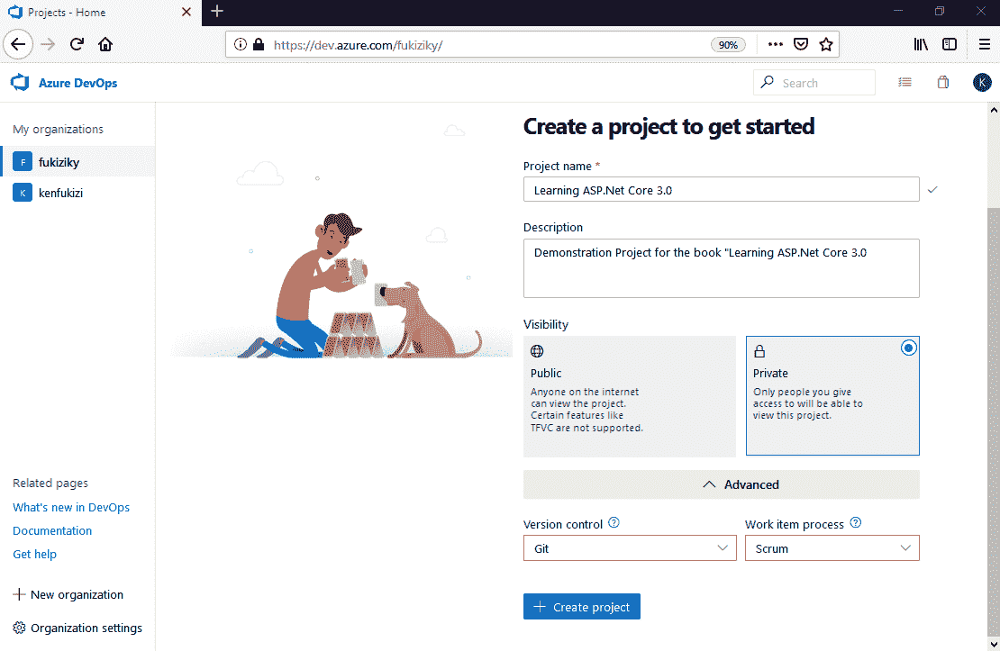

5.  您的新项目已经生成，现在您已经准备好创建第一个工作项和 Git 存储库，如本章所示。

在您执行任何应用之前，建议您为其制定计划。Azure DevOps 允许您创建和管理工作项，从而在这方面为您提供帮助，我们将在下一节中介绍此功能。

# 通过工作项组织您的工作

工作项用于在软件开发项目期间计划、分配、跟踪和组织您的工作。它们有助于更好地理解需要做什么，并提供关于项目状态的见解。

一些常见的工作项用法如下所示：

*   为应用功能创建、优先排序和跟踪用户情景。
*   创建和跟踪实现用户情景所需的开发任务。
*   创建、优先排序和跟踪应用错误。
*   确定应用质量和应用发布日期。
*   在单个看板中显示用户故事、任务和 bug 的进度。

如前所述，您可以在 Azure DevOps 项目创建期间选择工作项过程。此选项定义了可用的标准**工作项类型**（**WITs**）（敏捷、基本、CMMI 和 scrum 工作项流程）。

默认情况下，WIT 超过 14 个，您可以为高级场景创建自己的自定义 WIT。大多数情况下，您不需要创建自己的自定义智慧。

可能的工作项过程选择如下：

*   Scrum，如果您的团队使用 Scrum 方法，如果您想在看板上跟踪您的**产品积压项目**（**PBI**）。
*   敏捷，如果您的团队实践敏捷方法，但不想遵守特定的 scrum 约束和术语。
*   CMMI，如果您的团队需要更正式的开发任务跟进。有了它，您可以跟踪请求、更改、风险和审查。

以下是 WIT 列表，具体取决于工作项流程：

| **域** | **Scrum** | **敏捷** | **CMMI** |
| 产品规划 | PBI缺陷 | 用户故事缺陷 | 要求改变缺陷 |
| 文件夹 | 叙事诗特色 | 叙事诗特色 | 叙事诗特色 |
| 任务和冲刺计划 | 任务 | 任务 | 任务 |
| Bug 积压管理 | 缺陷 | 缺陷 | 缺陷 |
| 问题和风险管理 | 阻碍 | 问题 | 问题危险回顾 |

在我们的示例中，我们选择使用 scrum 过程。这种方法是世界上最常用的管理和跟踪工作项的方法之一，如果我们了解 scrum，将更容易将知识应用到其他场景中。因此，我们将在下一节中介绍 scrum 的实际过程。

# 理解 scrum 过程

在 scrum 过程中，产品所有者创建史诗、特性和产品待办事项（相当于用户故事）。在 sprint 计划开发过程中，任务被定义并链接到产品待办事项。通过云中的看板，整个团队都可以看到：

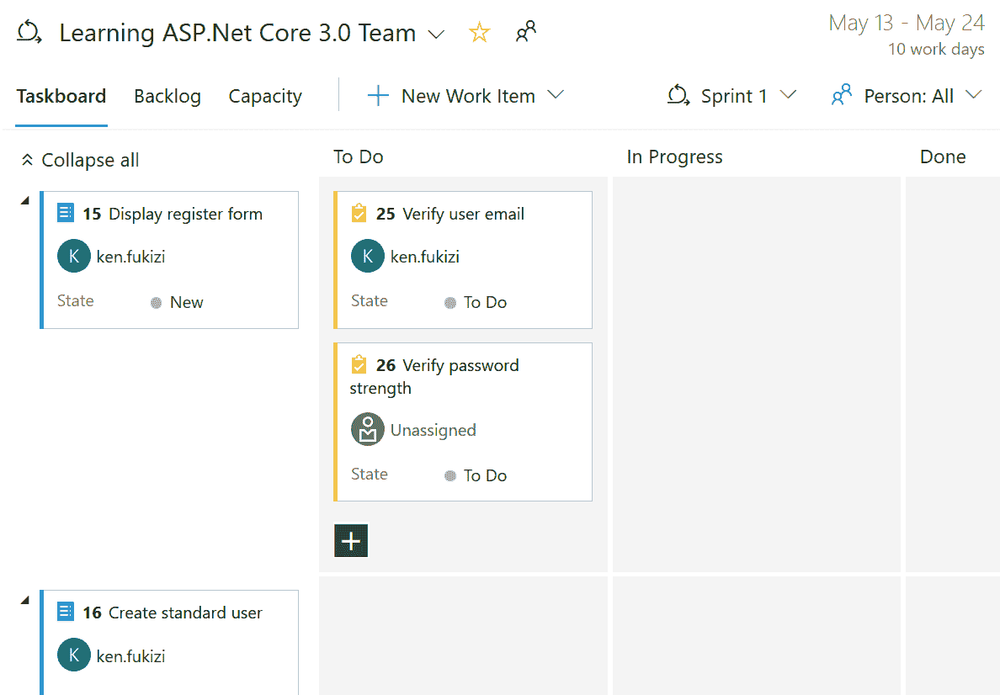

测试人员使用 Azure DevOps web 门户或 Microsoft 测试管理器创建和执行测试用例。它们创建并分配 bug，可以跟踪代码缺陷和阻塞问题，如以下屏幕截图所示：

Azure DevOps 允许您按层次结构组织工作。您可以向上钻取、向下钻取、重新排序和修改父项，以及在层次视图中使用过滤器。

For even more information, go to [https://www.visualstudio.com/en-us/docs/work/backlogs/create-your-backlog](https://www.visualstudio.com/en-us/docs/work/backlogs/create-your-backlog).

现在让我们更详细地了解不同的元素。史诗可以描述为一个有大量工作的大型用户故事。必须将其分解为功能和较小的产品待办事项，以便能够完全理解其需求，然后在多个 sprint 期间高效地实施：

特征将史诗分解成更小的可理解部分。它们由一组产品待办事项组成，对应于详细的预期功能：

产品待办事项是一个具有业务价值的工作单元，它足够小，可以在一次冲刺中完成。如果您不能在一个 sprint 中完成它，那么它必须被视为一个特性，并且必须进一步分解：

任务描述了在 sprint 期间实现预期产品积压项功能所需的开发或测试工作。它们链接到产品待办事项以实现可跟踪性，并且能够自动计算项目进度。

在冲刺过程中，有时完成的任务没有以正确的方式完全完成它应该做的事情，或者可能导致系统的其他部分行为不正确。这些被称为**bug**，包含测试人员和/或系统用户在 sprint 期间提出的问题，sprint 通常以两周为一个周期进行组织。Bug 可能会被分配到 sprint 期间解决，并链接到相应的产品待办事项：

在定义了 EPIC、特性和产品待办事项之后，您可以进行 sprint 规划，并决定在哪个迭代中需要做什么。此外，看板提供了良好的视觉表现，以便更好地理解：

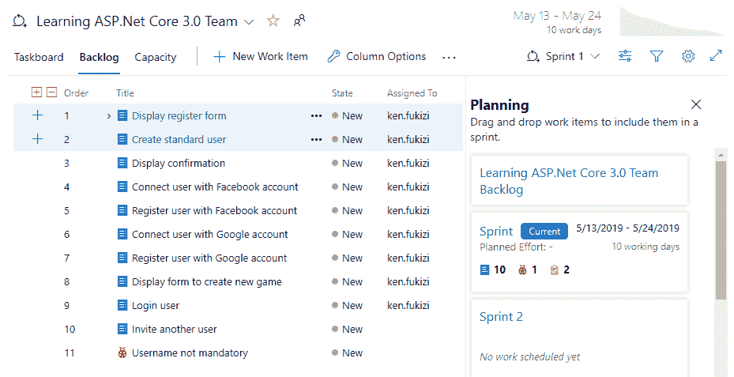

可以为每个 sprint 定义每个团队成员的工作能力，工作详细信息报告允许您实时跟踪他们的工作成果：

此外，每个工作项都有一个随时间变化的状态。状态允许您跟踪工作成果并过滤工作项，以便更好地理解和检测问题。

下表显示了各种默认工作项状态，具体取决于工作项流程：

|  | **Scrum** | **敏捷** | **CMMI** |
| **工作项状态** | 刚出现的经核准的坚信的多恩远离的 | 刚出现的忙碌的断然的关闭远离的 | 提出忙碌的断然的关闭 |

Please note that you do not have to follow each status, as defined for scrum, agile, or CMMI. You can customize and add in different statuses as you see fit in your specific organization. For example, there are other enterprises that decide to add in custom statuses to complement the existing steps, as follows:

*   **承诺开发**（开发完成，准备 QA）
*   **承诺测试**（QA 已完成，准备好供产品所有者演示和签字）。

您可以查询工作项、创建图表并将其发布到 Azure DevOps 项目主页。如果您需要检索特定的工作项或需要获得项目的整体视图，这是一个非常有用的特性。

现在，让我们看一下以下屏幕截图：

前面的屏幕截图显示了对其标题包含单词游戏的工作项的查询，相应的结果显示在下方窗格的同一窗口中。

# 使用 Git 作为 VCS

在过去几年中，Git 取得了相当大的成功，现在是开发人员社区中首选的分布式 VCS。

Azure DevOps 和 Git 之间有很好的集成，您可以使用一些强大且高效的功能（[https://www.visualstudio.com/en-us/docs/work/backlogs/connect-work-items-to-git-dev-ops](https://www.visualstudio.com/en-us/docs/work/backlogs/connect-work-items-to-git-dev-ops) ），包括以下内容：

*   Git 分支可以从 backlog 或看板中创建。
*   可以直接从 Azure DevOps 网站为多个工作项轻松创建 Git 功能分支。
*   拉取请求和提交自动链接到相应的工作项。
*   生成摘要页面将链接到提交的工作项显示为关联的工作项。

让我们看看如何创建新的 Git 存储库，在本地克隆它，在 Visual Studio 2019 中使用它，以及如何创建第一次提交：

1.  在 Azure DevOps 项目中，单击 Repos 左侧菜单中的，然后单击 Visual Studio 中的克隆按钮：

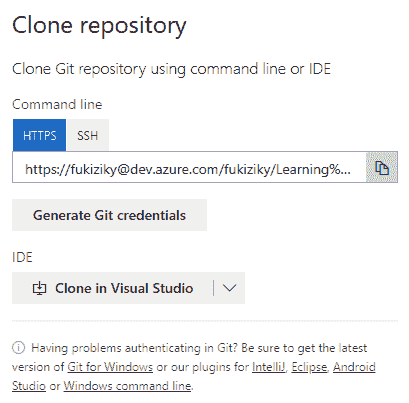

2.  将显示一个新窗口；选择 Microsoft Visual Studio Web 协议处理程序选择器：

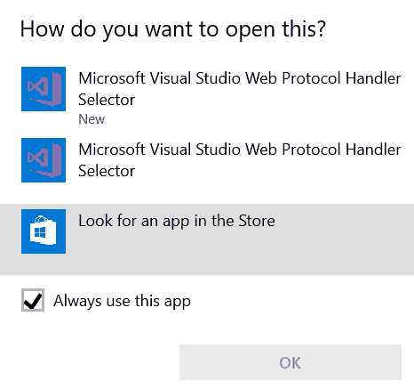

3.  Visual Studio 2019 将自动启动，您可以使用您的工作、学校或个人 Microsoft 帐户进行身份验证：

4.  选择本地 Git 存储库的目标文件夹，然后单击克隆按钮开始下载：

5.  转到团队资源管理器-主页并单击设置：

6.  在团队资源管理器-设置中，单击存储库设置：

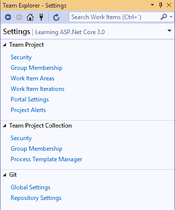

7.  在“忽略和属性文件”部分中，单击忽略文件和属性文件的“添加”：

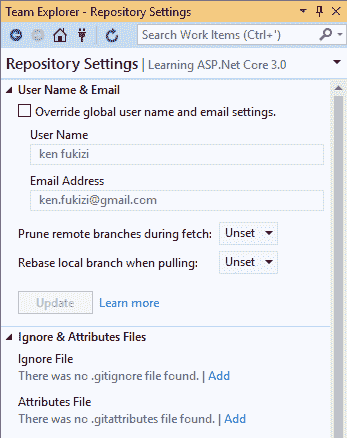

8.  返回 Team Explorer-Home，这次单击更改，为第一次提交输入注释，然后单击提交阶段按钮：

9.  第一次提交是在单击提交阶段按钮时在本地创建的；单击同步链接将其推送到服务器：

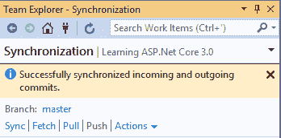

10.  转到 Azure DevOps 网站并单击上方菜单中的代码；您可以看到您创建的文件已上载：

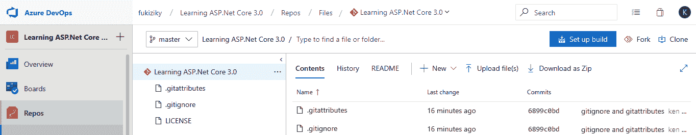

就这样！您已经创建并初始化了 Git 存储库。就这么简单！从这里开始，您可以选择多条路径。例如，将所有内容保留在同一分支中并不是一个好主意，尤其是当您必须维护应用的多个版本时。

For guidance on different branching strategies, see [https://docs.microsoft.com/en-us/azure/devops/repos/git/git-branching-guidance?view=azure-devops](https://docs.microsoft.com/en-us/azure/devops/repos/git/git-branching-guidance?view=azure-devops).

# 使用特征分支

功能分支背后的理念是，每次开始使用新的 Azure DevOps 功能（甚至 Azure DevOps 产品积压项目）时，您必须做的第一件事就是创建一个新的所谓功能分支。

然后，您将完全独立地处理这个分支，直到您准备将经过测试和验证的修改推送到主分支（或者，在更复杂的环境中，推送到开发分支）。在推送之前，它不会干扰您的其他功能，也不会导致错误或降低总体质量。

如果项目截止日期临近，而您还没有及时完成所有计划的功能，您就不需要再强调了！为什么？因为您只能集成准备发布的功能。您将拥有一个功能较少的产品，但您可以确信这些功能将按预期工作，不会有任何风险。

让我们看看如何使用 Visual Studio 2019 和 Git 创建功能分支：

1.  打开 Visual Studio 2019，转到团队资源管理器-主页选项卡，然后单击分支按钮：

2.  在团队资源管理器-分支中，单击“新建分支”链接：

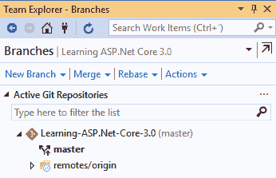

3.  输入新的要素分支名称（使用`FEA-`前缀），然后单击“创建分支”按钮：

必须注意的是，我们正在使用`FEA-`前缀作为良好实践，以使团队的其他成员能够识别这是一个特性分支。不强制输入`FEA-`前缀。不同的团队对分支的命名约定不同。

# 合并更改和解决冲突

有时，团队成员同时处理相同的文件，导致冲突。让我们看看在这种情况下如何合并更改和解决冲突：

1.  创建一个名为`HelloWorld.txt`的文本文件，并将其添加到本地存储库中。将文件推送到服务器，并在服务器和本地存储库中更新文件。
2.  如果您尝试推送在本地和远程存储库中都已修改的`HelloWorld.txt`文件，则会收到错误消息，推送失败：

3.  在输出窗口中查看时，您将获得有关推送失败的可能原因的其他信息，如下所示：*错误：提示：更新被拒绝，因为远程包含本地没有的工作*。这通常是由另一个存储库推送到同一个引用引起的。在再次按下之前，您可能希望首先集成远程更改（例如，`git pull`）。

4.  单击拉链接，您将获得远程更改，这将导致本地副本和远程副本之间发生冲突。单击“解决冲突”或“冲突”链接：

5.  您现在将看到冲突文件的列表。单击要解决的冲突，然后单击“合并”按钮：

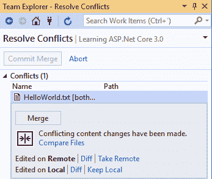

6.  您将看到相互冲突的修改。选择要保留的内容（左侧、右侧或两者），然后单击“接受合并”按钮：

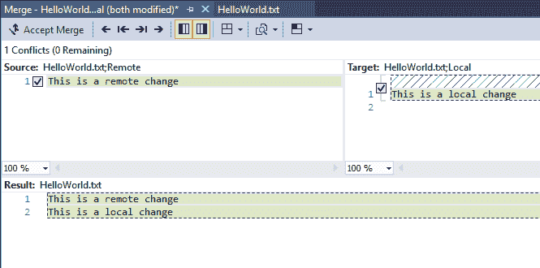

7.  返回“团队资源管理器-解决冲突”窗口，单击“提交合并”按钮：

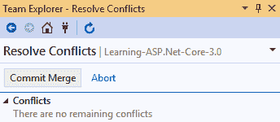

8.  输入注释，然后单击“全部提交”按钮以在本地完成并提交合并：

9.  本地创建提交后，单击同步链接，然后单击推送链接：

10.  您现在应该看到更改已上载到远程存储库：

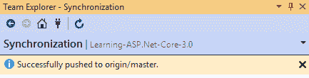

在本节中，我们已经了解了 Git 的基本用法，主要使用 visualstudio 开发环境，但还必须注意，您也可以使用命令行执行相同的命令。还有其他一些软件应用，如 GitHub Desktop、Git Extensions 等，它们被设计为帮助您与存储库进行交互，作为一种抽象，但它们都使用相同的`git`命令作为 VCS 的底层指令，并且它们对大多数命令都使用类似的术语。

# 创建 Azure DevOps 构建管道

在规划和组织您的工作并创建 Git 存储库之后，您现在应该配置 Azure DevOps 构建管道，它将允许您为您的应用执行 CI：

1.  打开 Visual Studio 2019，转到团队资源管理器-主页选项卡，然后单击构建按钮：

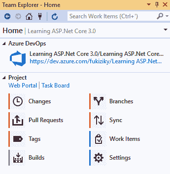

2.  接下来，单击新建生成定义链接：

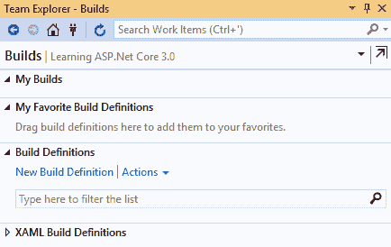

3.  Azure DevOps 网站将打开，当您单击“新建管道”按钮，然后选择源作为 Azure Repos 时，您将看到一个构建定义模板的选择。选择 ASP.NET Core模板：

4.  在新生成定义中，输入名称，然后选择默认代理池。我们建议在 VS2019 中使用托管 Windows 2019 选项：

5.  要选择源存储库，请单击“获取源”。对于我们的示例，我们使用默认值（此项目，分支：master）：

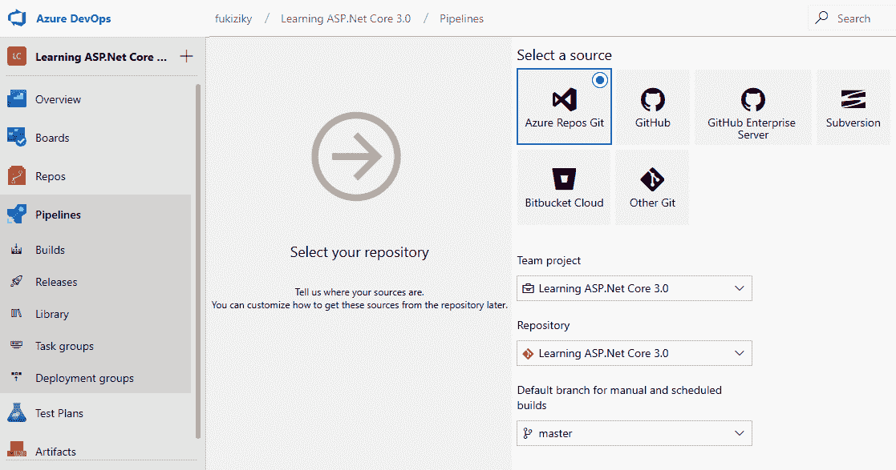

6.  要启用 CI，请单击生成定义菜单中的触发器，然后勾选启用持续集成复选框：

7.  在验证是否正确选择了 Git 存储库和主分支后，单击 Save 或 Save&queue 按钮。配置已完成，每次代码提交到存储库时都会自动触发生成：

创建构建管道就这么简单。在构建之后，我们很自然地想要发布代码，因此我们将在下一节中研究如何创建发布管道。

# 创建 Azure DevOps 发布管道

随着应用的不断集成，您也看到了一些巨大的好处，例如更快地检测和修复 bug 以及其他问题。我们不要到此为止；进一步改进您的开发过程比您想象的要容易得多！

现在，我们将了解如何通过创建 Azure DevOps 发布管道来采用应用的 CD：

1.  打开 Azure DevOps 网站，单击菜单中的管道，单击发布，然后单击新建定义按钮，然后选择空作业定义模板：

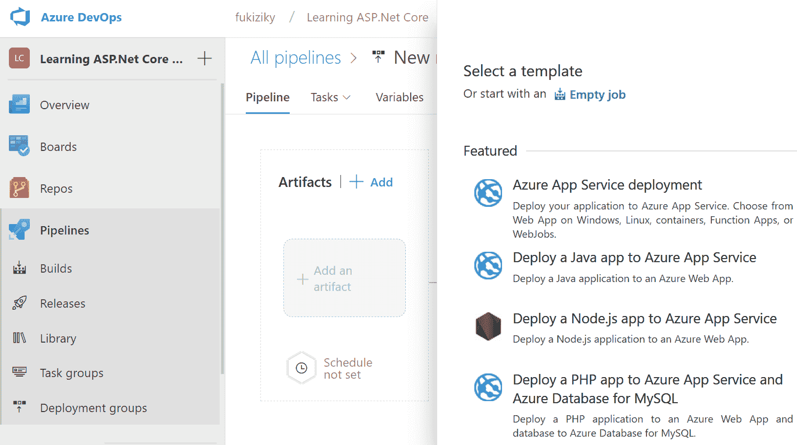

2.  现在，您可以选择项目和源（生成管道），启用 CD，然后单击“创建”按钮：

3.  将创建发布定义，您可以在列表中看到它。

所示的示例发布定义目前实际上没有太多用处。我们将在相应的 Azure 章节中看到部署到 Azure 的更高级版本。

# 总结

在本章中，我们了解了 CI、CD 以及构建和发布管道，包括它们的好处以及如何使用 Azure DevOps 实现它们。

我们已经创建了一个新的 Azure DevOps 订阅并初始化了一个新项目。然后，我们探讨了一些基本概念，例如用于源代码控制的工作项和 Git。最后，我们通过一个实际示例演示了如何配置 Azure DevOps 构建管道以及 Azure DevOps 发布管道。

在接下来的两章中，我们将解释 ASP.NET Core 3 的基本概念，包括启动类、使用中间件、路由、错误处理等。