# 通过自定义应用实现 ASP.NET Core 3 的基本概念：第 1 部分

在最后三章中，您已经从全局角度了解了 ASP.NET Core 3 的内容，以及如何设置开发环境，包括 Visual Studio 2019（或 Visual Studio 代码）。我们还看到了如何使用 Git 存储库在 Azure DevOps 中设置**CI**（简称**持续集成**）和**CD**（简称**持续交付**）管道。

这真的很有趣，但非常理论化。现在是时候做一些实际的事情了，是时候做正确的事情了，是时候自己动手做了！

在本章中，我们将构建一个应用来展示 ASP.NET Core 3 框架的基本概念。在接下来的章节中，我们将不断改进此应用，同时使用并演示 ASP.NET Core 3 的各种功能及其相关技术。

读完本章内容后，您将掌握使用 ASP.NET Core 3 启动类、针对不同的.NET 框架、使用中间件以及在 ASP.NET Core 3 中执行错误处理的技能。

在本章中，我们将介绍以下主题：

*   `Startup`和`Program`类
*   创建页面和服务
*   使用**节点包管理器**（**NPM**和布局页面
*   应用依赖注入
*   使用内置中间件
*   创建自己的中间件
*   使用静态文件
*   使用路由、URL 重定向和 URL 重写
*   错误处理和模型验证

# Tic Tac Toe 演示应用预览

让我们做点有趣的事吧！我们将构建一个 Tic-Tac-Toe 游戏，也称为**零和叉**，或 Xs 和 Os。

在我们将构建的这个游戏中，玩家将选择谁使用 Xs，谁使用 Os。然后，他们将轮流在 3×3 的网格中标记空间，每圈一个标记。在水平、垂直或对角行中成功放置三个标记的玩家将赢得游戏，如图所示：

| **x** |  | 0 |
| 0 | **x** | 0 |
| **x** | 0 | **x** |

在上图中，使用 Xs 的玩家将赢得比赛，因为从左上角到右下角，对角线行中有三个十字架。

玩家必须输入他们的电子邮件和姓名进行注册，以创建一个帐户，然后才能开始游戏。他们将在每场比赛后获得一个比赛分数，该分数将被加到他们的总分中。

我们将有一个排行榜，旨在提供一系列游戏的玩家排名和最高分信息。

创建游戏时，一名玩家必须向另一名玩家发送邀请，然后会为他们显示一个特定的等待页面，直到另一名玩家做出响应。

收到邀请电子邮件后，其他玩家可以确认请求并加入游戏。当两名玩家在线时，游戏开始。

这是我们将要构建的演示应用的预览，但是 talk 很便宜。让我们从下一节开始构建它。

# 构建 Tic-Tac-Toe 游戏

正如在上一章中所解释的，我们可以使用 Azure DevOps 及其工作项来组织和安排 Tic-Tac-Toe 游戏应用的实现。为此，我们必须创建 epics、features 和 ProductBacklog 项，然后进行 sprint 规划，以确定优先顺序并决定首先要实现的内容。

正如您在下面的屏幕截图中所看到的，我们决定在第一个 sprint 中处理五个产品待办事项，并将它们添加到 sprint 待办事项中：


在实现任何新功能之前，您还记得接下来需要做什么吗？你不记得了？也许是树枝敲响了警钟？

在上一章中，我们展示了创建开发分支的最佳实践，这些分支是独立的，并且更易于维护和发布。它们包括在 Git 存储库中为要添加到应用中的每个新功能创建一个功能分支。

因此，每个开发人员都可以在其特定的特性分支中处理其特定的特性，直到他们决定该特性可以发布为止。

最后，所有准备发布的特性都合并到一个开发（发布或主）分支中。然后，进行集成测试，如果一切正常，则交付新的应用版本。

我们选择首先处理的功能是用户注册，因此我们要做的第一件事是创建一个名为`FEA-UserRegistration`的功能分支。如果您不知道如何做到这一点，您可以转到[第 3 章](03.html)、*Azure DevOps*中的持续集成管道，并获得一个完整的分步过程和详细的解释。

在 Azure DevOps 中为用户注册创建功能分支后，它将如以下屏幕截图所示：

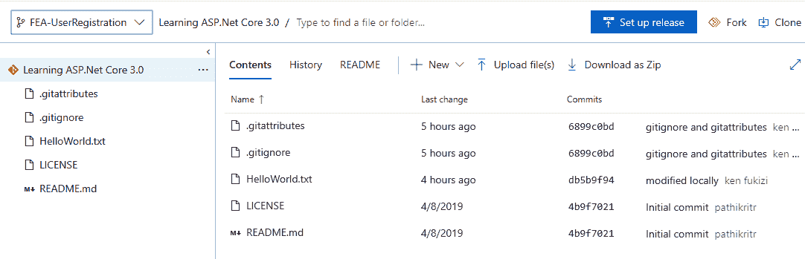

此时，这仍然是一个空项目，只有以前提交的历史记录，以及我们用来演示如何解决冲突的`HelloWorld`文本文件。

我们将从以下几节开始，逐步共同创建和构建 ASP.NET Core 3 解决方案。

# 构思并实现您的第一个 Tic-Tac-Toe 功能

在实现用户注册功能之前，我们必须了解它，并决定一切应该如何工作。我们必须定义**用户故事**和**工作流**。为此，我们需要在预览部分更详细地分析前面提到的 Tic-Tac-Toe 游戏描述。

如前所述，只有拥有用户帐户的用户才能创建和加入游戏。要创建此帐户，用户必须输入其名字、姓氏、电子邮件地址和新密码。然后，系统将验证输入的电子邮件地址是否已注册。给定的电子邮件地址只能注册一次。如果电子邮件地址是新的，将生成用户帐户；如果已知电子邮件地址，将显示错误。

让我们看一下用户注册过程以及为了实现它而必须交互的不同组件：

1.  将有一个主页，其中有一个用户注册链接，新用户必须点击注册才能创建其玩家帐户。单击用户注册链接可将用户重定向到专用注册页面。
2.  注册页面将包含一份注册表格，用户必须在其中输入个人信息，然后进行确认。
3.  JavaScript 客户端将验证表单，提交数据并将其发送到通信中间件，然后等待结果。
4.  通信中间件将接收请求并将其路由到注册服务。
5.  注册服务将接收请求，验证数据的完整性，检查电子邮件是否已用于注册，并注册用户或返回错误消息。
6.  通信中间件将接收结果并将其路由到等待的 JavaScript 客户端。
7.  如果结果成功，JavaScript 客户端将重定向用户开始玩游戏，如果结果失败，它将显示错误消息。

下面的**序列图**显示了用户注册过程。通常更容易、更快速地理解具有更直观表示的流程：


为了开始，我们需要创建一个新的空 ASP.NET Core 3 web 应用，该应用将用于在本章和本书其余部分中添加各种组件和包。然后，我们将逐步添加新的概念和功能，这将使您真正了解正在发生的事情以及一切是如何工作的：

1.  启动 Visual Studio 2019 并单击文件|新建|项目。
2.  在.NET Core 部分中，选择 ASP.NET Core Web 应用，输入应用名称、存储库位置、解决方案名称，然后单击创建：


Note that if you have not created a Git repository for your application code yet, you can do it here by ticking the Create new Git repository checkbox.

3.  选择空模板：


4.  将生成一个新的空 ASP.NET Core 3 web 应用项目，其中仅包含`Program.cs`和`Startup.cs`文件：


伟大的我们已经创建了我们的项目，现在准备实施我们的第一个功能！但是，在这样做之前，让我们花点时间看看 VisualStudio2019 在幕后为我们做了些什么。

# 在项目的.csproj 文件中针对不同的.NET 核心版本

对于 Visual Studio 2019 生成的每个项目，它都会创建一个相应的`.csproj`文件，其中包括多个项目范围的设置，例如引用的程序集、.NET Framework 目标版本、包含的文件和文件夹，以及多个其他设置。

例如，打开先前创建的 ASP.NET Core 3 项目时，可以看到以下结构：

```cs

<Project Sdk="Microsoft.NET.Sdk.Web">

  <PropertyGroup>
    <TargetFramework>netcoreapp3.0</TargetFramework>
  </PropertyGroup>

</Project>
```

您可以看到`TargetFramework`设置，该设置允许您定义应包含哪些.NET Framework 版本，并用于构建和执行源代码。

在我们的示例中，它被设置为`netcoreapp3.0`，即使用.NET Core 3 Framework 的具体值：

```cs
    <TargetFramework>netcoreapp3.0</TargetFramework>
```

Note that you can refer to multiple .NET Framework versions within your library projects. In this case, you have to replace the `TargetFramework` element with the `TargetFrameworks` element.

例如，如果要跨越目标.NET Core 3 和.NET Core 2，则必须使用以下设置：`<TargetFrameworks>netcoreapp3.0;netcoreapp2.0</TargetFrameworks>`

在调试模式下点击*F5*键执行应用时，您可以看到应用的`Debug`文件夹（`/bin/Debug`中创建了多个文件夹和文件）：

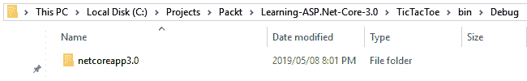

如果您更改`.csproj`文件并添加其他目标框架，您将看到将生成其他文件夹。然后将每个特定.NET Framework 版本的 DLL 放入相应的文件夹中：

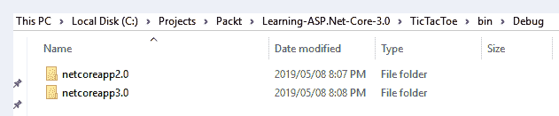

前面的示例使用.NET Core 2 和.NET Core 3 的`TargetFrameworks`设置。

# 使用 Microsoft.AspNetCore.App 元包

在“依赖项 SDK”部分中查看解决方案资源管理器时，您可以看到一些非常有趣的内容，特别是 ASP.NET 核心 3 项目：`Microsoft.AspNetCore.App`元包：

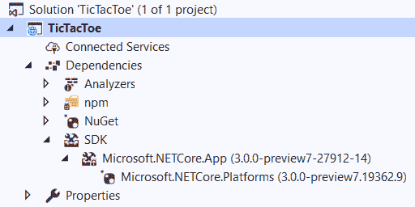

当您创建 ASP.NET Core 3 web 应用时，`Microsoft.AspNetCore.App`项目依赖项自动添加。对于这种类型的项目，默认情况下会执行此操作。

但是，`Microsoft.AspNetCore.App`不是标准的 NuGet 包，因为它不包含任何代码或 DLL。相反，它充当元包，引用它所依赖的其他包。更具体地说，它包括 ASP.NET Core 和 Entity Framework Core 的大多数重要包，以及它们的内部和外部依赖项，并利用了.NET Core 运行时存储。

针对.NET Core 3 SDK 或更高版本的新`Microsoft.AspNetCore.App`元包与针对.NET Core 早期版本的旧`Microsoft.AspNetCore.All`元包之间的主要区别在于`App`元包不再包含微软主要不支持的第三方依赖项。

如果您的项目以`Microsoft.NET.Sdk.Web`为目标，那么您可以自动访问共享框架，其中包括应用洞察、身份验证、授权、Azure 应用服务和许多其他的包。在旧版本的.NETCore（版本 1.0 和 1.1）中，您必须自己添加大量 NuGet 软件包。

现在，Microsoft 已经创建了 ASP.NET 核心元包的概念，您可以在一个地方找到所有内容。此外，包修剪排除了未使用的二进制文件，因此在部署应用时不会发布它们。

除了共享框架已经提供给您的功能外，当您使用 ASP.NET Core 3 框架时，还有几个类已经安装，我们将在下一节中介绍它们。

# 默认 ASP.NET 核心 3 类简介

当您从任何模板创建 ASP.NET Core 3 应用时，无论是 MVC 应用还是空模板，默认情况下，它将始终具有`Program`类和`Startup`类。现在我们来看一下这些默认类中最重要的特性。

# ASP.NET 核心 3 启动类

对于您将要构建的每个 ASP.NET Core 3 应用，无论模板是 MVC 还是空模板，都会有最小的类管道，用于确保您有一个正常工作的应用。要启动 ASP.NET Core 3 应用，有两个非常重要的主要类：`Program`类和`Startup`类；以下部分将对这两个方面进行解释。

# 使用程序类

`Program`类是 ASP.NET 核心 3 应用的主要入口点。事实上，ASP.NET Core 3 应用在这方面与标准的.NET Framework 控制台应用非常相似。两者都有一个在运行应用时执行的`Main`方法。

即使是接受字符串数组作为参数的`Main`方法的基本签名也是一样的，正如您在下面的代码中所看到的。毫不奇怪，这是因为 ASP.NET 核心应用实际上是托管 web 应用的控制台应用：

```cs

    namespace TicTacToe 
    { 
      public class Program 
      { 
        public static void Main(string[] args) 
        { 
            CreateHostBuilder(args).Build().Run(); 
        }  
        public static IHostBuilder CreateHostBuilder(string[] args) =>
            Host.CreateDefaultBuilder(args)
                .ConfigureWebHostDefaults(webBuilder =>
                {
                    webBuilder.UseStartup<Startup>();
                });
      } 
    } 
```

通常，您不需要以任何方式触摸`Program`类。默认情况下，运行应用所需的一切都已存在并已预先配置。

但是，您可能需要激活一些更高级的功能。

例如，您可以启用在服务器启动期间捕获错误并显示错误页面。在这种情况下，您只需使用以下说明：

```cs
    webBuilder.CaptureStartupErrors(true); 
```

默认情况下，此设置未启用，这意味着如果出现错误，主机将退出。这可能不是所需的行为，我们建议相应地更改此参数。

另外两个共同工作的有用参数是`PreferHostingUrls`和`UseUrls`。您可以指示主机是否应侦听由您提供的特定于`Microsoft.AspNetCore.Hosting.Server.IServeror`的 URL 定义的标准 URL。根据您的需要，URL 可以有不同的格式，例如：

*   带有主机和端口的 IPv4 地址（例如，`https://192.168.57.12:5000`
*   带有端口的 IPv6 地址（例如，`https://[0:0:0:0:0:ffff:4137:270a]:5500`
*   主机名（例如，`https://mycomputer:90`）
*   本地主机（例如，`https://localhost:443`）
*   Unix 套接字（例如，`http://unix:/run/dan-live.sock`）

以下是如何设置这些参数的示例：

```cs
    webBuilder.PreferHostingUrls(true);         
    webBuilder.UseUrls("http://localhost:5000"); 
```

下面是一个`Program`类的示例，它包括前面显示的所有概念：

```cs
    public class Program 
    { 
      public static void Main(string[] args)
        {
            CreateHostBuilder(args).Build().Run();
        }

      public static IHostBuilder CreateHostBuilder(string[] args) =>
            Host.CreateDefaultBuilder(args)
                .ConfigureWebHostDefaults(webBuilder =>
                {
                    webBuilder.UseStartup<Startup>();
                    webBuilder.CaptureStartupErrors(true);
                    webBuilder.PreferHostingUrls(true);
                    webBuilder.UseUrls("http://localhost:5000");
                }); 
    } 

```

`Program`类中的默认代码来自 ASP.NET 核心版本 2.1，包括版本 3。以前的版本使用了`WebHostBuilder`，而不是我们将在下一节介绍的通用 web 主机。

# 使用.NET 通用主机而不是 WebHostBuilder

在 ASP.NET Core 2.1 之前，`Main`方法将主机定义为`WebHostBuilder`，如下所示：

```cs
public static void Main(string[] args)
        {
            var host = new WebHostBuilder()
                .UseKestrel()
                .UseStartup<Startup>()
                .Build();
            host.Run();
        }
```

这意味着每个应用都被绑定为 web 应用。ASP.NET Core 2.1 引入了通用主机，它允许应用不必处理基于 web 的 HTTP 请求。

还有其他一些应用，如消息传递和后台应用，在这些应用中，像以前一样与`WebHostBuilder`抽象绑定是没有意义的，因此，引入了一种更通用的`HostBuilder`程序初始化抽象。其原始形式的示例如下所示：

```cs
public static Task Main(string[] args) 
{     
    var host = new HostBuilder()         
        .Build();     
        host.Run(); 
}
```

以前版本的 ASP.NET 在`Main`方法中有一个`CreateWebHostBuilder()`方法，该方法正在被 ASP.NET Core 3 中的`CreateHostBuilder()`方法所取代，我们现在没有使用`WebHost.CreateDefaultBuilder(args)`方法，而是使用`Host.CreateDefaultBuilder(args)`。

# 使用 Startup 类

另一个自动生成的元素是`Startup`类，它存在于所有类型的 ASP.NET 核心 3 项目中。如前所述，`Program`类主要处理与托管环境相关的所有内容。`Startup`类是关于服务和中间件的预加载和配置。这两个类是所有 ASP.NET Core 3 应用的基础。

现在让我们看一下`Startup`类的基本结构，以便更好地了解所提供的内容以及如何充分利用其功能：

```cs

      public class Startup 
      { 
        public void ConfigureServices(IServiceCollection services)  {   } 

        public void Configure(IApplicationBuilder app,   
         IHostingEnvironment env) 
        { 
          if (env.IsDevelopment()) 
          {   app.UseDeveloperExceptionPage();    } 

          app.UseEndpoints(endpoints =>
            {
                endpoints.MapGet("/", async context =>
                {
                    await context.Response.WriteAsync("Hello World!");
                });
            });
        } 

```

有两种方法需要您注意，因为您将定期使用它们：

*   `ConfigureServices`方法，由运行时调用，用于向容器添加服务
*   用于配置 HTTP 管道的`Configure`方法

我们在本章开始时说过，我们需要更多的实际工作，所以让我们回到我们的 Tic-Tac-Toe 游戏，看看如何在一个真实的例子中使用`Startup`类！

我们将使用 MVC 实现该应用，但是，由于您使用了空的 ASP.NET Core 3.0 Web 应用模板，因此 Visual Studio 2019 在项目生成期间未添加任何内容。你必须自己添加所有内容；这是一个很好的机会，可以更好地了解一切是如何运作的！

首先要做的是将 MVC 添加到服务配置中。通过使用`ConfigureServices`方法，只需添加 MVC 中间件即可：

```cs
    public void ConfigureServices(IServiceCollection services) 
    { 
      services.AddControllersWithViews();
    } 
```

你可能会说这太容易了；那么，有什么问题吗？没有陷阱！ASP.NET Core 3 中的所有内容都是围绕着简单性、清晰性和开发人员生产力而开发的。

在配置 MVC 中间件和设置路由路径时，您可以再次看到这一点（稍后我们将更详细地解释路由）：

```cs
             app.UseEndpoints(endpoints =>
            {
                endpoints.MapControllerRoute(
                    name: "default",
                    pattern: "{controller=Home}/{action=Index}/{id?}");
            });
```

同样，我们这里有非常清晰和简短的说明，使我们作为开发人员的生活更加轻松和高效。现在是做开发人员的好时机！

在下一步中，您需要在 ASP.NET Core 3 应用中启用静态内容的使用，以便使用 HTML、CSS、JavaScript 和图像。

你知道怎么做吗？是的，你是对的；您需要添加另一个中间件。您可以像以前一样通过调用相应的`app`方法：

```cs
    app.UseStaticFiles(); 
```

下面是一个`Startup.cs`类的示例，在配置了前面看到的各种服务设置后，您可以将其用于 Tic Tac Toe 游戏：

```cs
    public class Startup                                       { 
      public void ConfigureServices(IServiceCollection services) 
      { services.AddControllersWithViews();  } 

      public void Configure(IApplicationBuilder app, 
       IHostingEnvironment env){ 
        if (env.IsDevelopment())          
          app.UseDeveloperExceptionPage();   
        else          
          app.UseExceptionHandler("/Home/Error");   
        app.UseStaticFiles();         
        app.UseRouting();         
        app.UseEndpoints(endpoints =>
        {
            endpoints.MapControllerRoute(
               name: "default",
               pattern: "{controller=Home}/{action=Index}/{id?}");
       });
    } 
```

请注意，有许多其他服务可以添加到`ConfigureServices`方法中，例如 ASP.NET 核心框架已经提供的`services.AddAuthorization()`或`services.AddAspnetCoreIdentity()`，这些服务确实可以由您自己创建。这里配置的任何内容都可以通过**依赖注入**（**DI**）在您的整个应用中访问，我们在[第 5 章](05.html)、*ASP.NET Core 3 的基本概念中通过自定义应用专门介绍了这一部分：第 2 部分*。

现在我们已经了解了默认情况下作为 ASP.NET 核心应用启动类存在的类，现在是了解基本项目结构的好时机，如下一节所述。

# 准备基本项目结构

在构建了 Tic-Tac-Toe 游戏应用之后，您肯定希望看到一些东西在运行。现在，我们已经从功能的角度定义了一切应该如何工作，我们需要从创建应用的基本项目结构开始。

对于 ASP.NET Core 3 web 应用，最佳做法是为项目提供以下结构：

*   一个`Controllers`文件夹，包含应用的所有控制器。
*   一个`Services`文件夹，包含应用的所有服务（例如，外部通信服务）。
*   一个`Views`文件夹，包含应用的所有视图。此文件夹应包含单个`Shared`子文件夹以及每个控制器一个文件夹。
*   一个`_ViewImports.cshtml`文件，用于定义在所有视图中可用的某些名称空间。
*   一个`_ViewStart.cshtml`文件，用于定义在每次视图渲染开始时要执行的一些代码（例如，为所有视图设置布局页面）。
*   一个`_Layout.cshtml`文件，用于为所有视图定义通用布局。

让我们创建项目结构：

1.  启动 Visual Studio 2019，打开您创建的 Tic Tac Toe ASP.NET Core 3 项目，创建三个名为`Controllers`、`Services`和`Views`的新文件夹，然后在`Views`文件夹中创建一个名为`Shared`的子文件夹：


2.  在`Views`文件夹中创建名为`_ViewImports.cshtml`的新视图页面：

```cs
        @using TicTacToe 
        @addTagHelper*, Microsoft.AspNetCore.Mvc.TagHelpers 
```

3.  在`Views`文件夹中创建名为`_ViewStart.cshtml`的新视图页面：

```cs
        @{ Layout = "~/Views/Shared/_Layout.cshtml"; }
```

4.  右键点击`Views/Shared`文件夹，选择添加新项目，在搜索框中输入`Layout`，选择 MVC 视图布局页面，然后点击添加：


Note that the layout page concept will be detailed a little bit later in this chapter, but don't worry too much; it is not a very complicated concept.

# 创建 Tic-Tac-Toe 主页

由于基本的项目结构已经到位，我们需要实现需要协同工作的不同组件，以提供 Tic Tac Toe 游戏 web 应用：

1.  如前所述，更新`Program.cs`和`Startup.cs`文件。

2.  添加新控制器，在`Controllers`文件夹的解决方案资源管理器中单击鼠标右键，然后选择“添加|控制器…”：


3.  在添加脚手架弹出窗口中，选择 MVC 控制器-空，并将新控制器命名为`HomeController`：


4.  MVC 主控制器自动生成，包含一个方法。您现在需要通过右键单击`Index`方法名称并选择添加视图来添加相应的视图。。。从菜单中：


5.  “添加视图”窗口有助于定义需要生成的内容。保留默认的空模板，并启用我们将在本章下一节中修改的布局页面：


6.  祝贺您的视图将自动生成，您可以通过按*F**5*或单击 Visual Studio 2019 菜单上的调试来测试您的应用，然后开始调试。我们将在本章后面通过添加更多相关内容来最终确定该视图。

前面生成的视图看起来很简单，可能无法在 web 应用上提供最佳的用户体验。为了帮助确保我们创建更有意义的内容，并且系统性地创建内容，我们将使用布局页面和 NPM 来引入包，这些包将有助于提升使用 ASP.NET Core 3 构建的应用的外观和感觉。让我们在下一节中看看如何做到这一点。

# 通过使用 NPM 和布局页面，为您的网页提供更现代的外观

我们刚刚了解了如何创建基本网页。知道如何在技术上做到这一点是一回事，但创建成功的 web 应用则完全是另一回事。它不仅涉及技术实现，还涉及如何使应用在视觉上具有吸引力和用户友好性。虽然这本书不是关于网页设计和用户体验的，但我们想为您提供一些快速简便的方法，以便在这方面构建更好的 web 应用。

为此，我们建议使用 NPM（[https://www.npmjs.com/](https://www.npmjs.com/) ），web 上最常用的包管理器，与 ASP.NET 核心布局页面结合使用。

在过去几年中，NPM 在 web 开发社区取得了一些显著的成功。它有助于安装包含静态内容（如 HTML、CSS、JavaScript、字体和图像，包括它们的依赖项）的客户端软件包。

Visual Studio 2019 中的 NPM 提供了一些强大的集成和支持；为了有效地使用它，您只需正确地配置它。让我们看看如何做到这一点：

1.  右键点击 Tic Tac Toe 项目，选择添加新项目，在搜索框中输入`NPM`，选择 npm 配置文件，点击添加：

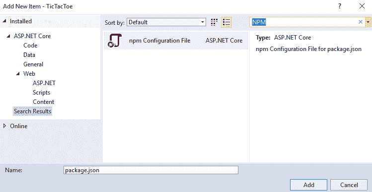

2.  添加 npm 配置文件时应添加一个`package.json`文件。使用以下内容更新此文件：

```cs
        { 
          "version": "1.0.0",
          "name": "asp.net", 
          "private": true, 
          "devDependencies": { 
            "bootstrap": "4.3.1",
            "jquery": "3.3.1",
            "jquery-validation": "1.17.0",
            "jquery-validation-unobtrusive": "3.2.11",
            "popper.js": "1.14.7" 
          } 
        }
```

3.  构建项目，成功构建后，将有一个名为`npm`的文件夹，该文件夹将在依赖项下创建。右键单击依赖项，然后单击还原包：

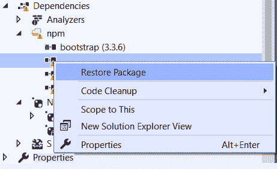

4.  然后将客户端软件包（`bootstrap`、`jquery`等）下载到您定义的文件夹中，默认情况下，该文件夹将为（`wwwroot/lib`。现在可以在应用中使用静态内容：

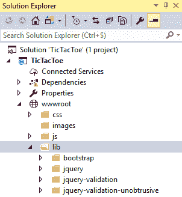

5.  在`wwwroot`文件夹中，创建一个名为`css`的文件夹。在此文件夹中添加名为`site.css`的新样式表：

```cs
        body { 
          padding-top: 50px; 
          padding-bottom: 20px; 
        } 

        .body-content { 
          padding-left: 15px; 
          padding-right: 15px; 
        } 

        /* Set width on the form input elements since they're
         100% wide by default */ 
        input, 
        select, 
        textarea { 
          max-width: 280px; 
        } 

```

前面的 CSS 样式代码通过设置填充以防止内容触及边缘，并设置我们将用于输入区域的自定义宽度（例如，用户将在其中键入他们的姓名和其他详细信息以进行注册），使我们的视图更具表现力。

对于验证样式，将以下代码添加到相同的`site.css`文件中：

```cs
        .field-validation-error { 
          color: #b94a48; 
        } 

        .field-validation-valid { 
          display: none; 
        } 

        input.input-validation-error { 
          border: 1px solid #b94a48; } 

        input[type="checkbox"].input-validation-error { 
          border: 0 none;         } 

        .validation-summary-errors { 
          color: #b94a48;         } 

        .validation-summary-valid { 
          display: none; 
        } 
```

这将有助于我们获得具有正确外观和感觉的验证消息，并使用自定义颜色，使用户将自动识别出发生了错误。您可能听说过术语*UX 设计*，这是**UX**（简称**用户体验**）的一个简单示例，您将不得不为您将要构建的大多数应用考虑这些因素。

一个成功的 web 应用在从一页导航到另一页时应该有一个具有一致用户体验的通用布局。这是用户采用和用户满意度的关键。ASP.NET 核心布局页是解决这一问题的正确解决方案。

它们可用于为 web 应用中的视图定义模板。所有视图都可以使用相同的模板，也可以使用不同的模板，具体取决于您的具体需要。

# 更新布局页面

转到`_Layout.cshtml`中的`head`部分，添加以下代码段：

```cs
<meta name="viewport" content="width=device-width,
     initial-scale=1.0" />
<title>@ViewData["Title"] - TicTacToe</title>      
<environment include="Development">
        <link rel="stylesheet" 
         href="~/lib/bootstrap/dist/css/bootstrap.css" />
</environment>
<environment exclude="Development">
        <link rel="stylesheet" href="https://stackpath.bootstrapcdn
        .com/bootstrap/4.3.1/css/bootstrap.min.css"
              asp-fallback-href="~/lib/bootstrap/dist/css
                /bootstrap.min.css"
              asp-fallback-test-class="sr-only" asp-fallback-test-
              property="position" asp-fallback-test-value="absolute"
              crossorigin="anonymous"
              integrity="sha384-ggOyR0iXCbMQv3Xipma34MD+dH/1fQ784
              /j6cY/iJTQUOhcWr7x9JvoRxT2MZw1T"/></environment>
            <link rel="stylesheet" href="~/css/site.css" />
```

创建一个带有以下标记的`body`部分`<body></body>`，并在主体内创建一个带有以下代码段的`header`导航栏：

```cs
<header><nav class="navbar navbar-expand-sm navbar-toggleable-sm 
    navbar-light bg-white border-bottom 
    box-shadow mb-3">
  <div class="container">
    <a class="navbar-brand" asp-area="" asp-controller="Home" asp-
     action="Index">TicTacToe</a>
    <button class="navbar-toggler" type="button" data-toggle=
    "collapse" data-target=".navbar-collapse" aria-controls=
     "navbarSupportedContent" aria-expanded="false" aria-label=
     "Toggle navigation"> <span class="navbar-toggler-icon"></span>  
    </button>
    <div class="navbar-collapse collapse d-sm-inline-flex flex-sm-row-
     reverse">
       <ul class="navbar-nav flex-grow-1">
          <li class="nav-item">
            <a class="nav-link text-dark" asp-area="" asp-
            controller="Home" asp-    action="Index">Home</a> </li>
          <li class="nav-item">
             <a class="nav-link text-dark" asp-area="" asp-
             controller="Home" asp-action="Privacy">
             Privacy</a></li></ul></div></div></nav></header>
```

在同一`body`区段内，在导航区段外，在关闭`</header>`标签后，添加集装箱主体内容，如下所示：

```cs
 <div class="container body-content"> 
    <main role="main" class="pb-3">
        @RenderBody()
    </main>

    <footer class="border-top footer text-muted">
     <div class="container">
            &copy; 2019 - TicTacToe - <a asp-area="" asp-
            controller="Home" asp-action="Privacy">Privacy</a>
     </div>
    </footer>
 </div> 
```

然后，在`body`内容之后，在底部添加以下将在开发环境中使用的引用：

```cs
     <environment include="Development"> 
       <script src="~/lib/jquery/dist/jquery.js"></script> 
       <script src="~/lib/bootstrap/dist/js/bootstrap.js"></script> 
       <script src="~/js/site.js" asp-append-version="true"></script> 
      </environment>
      <script src="~/js/site.js" asp-append-version="true"></script>
      @RenderSection("Scripts", required: false)
```

此外，对于生产环境，我们将不在本书的范围内使用，我们将有类似于以下代码段的内容：

```cs
    <environment exclude="Development">
        <script src="https://cdnjs.cloudflare.com/ajax/libs/jquery
                 /3.3.1/jquery.min.js"
                asp-fallback-src="~/lib/jquery/dist/jquery.min.js"
                asp-fallback-test="window.jQuery"
                crossorigin="anonymous"
                integrity="sha256-FgpCb/KJQlLNfOu91ta32o
                /NMZxltwRo8QtmkMRdAu8=">
        </script>
        <script src="https://stackpath.bootstrapcdn.com
        /bootstrap/4.3.1/js/bootstrap.bundle.min.js"
                asp-fallback-src="~/lib/bootstrap/dist/js
                /bootstrap.bundle.min.js"
                asp-fallback-test="window.jQuery && 
                window.jQuery.fn && window.jQuery.fn.modal"
                crossorigin="anonymous"
                integrity="sha384-xrRywqdh3PHs8keKZN+8zzc5TX0GRT
                LCcmivcbNJWm2rs5C8PRhcEn3czEjhAO9o">
        </script>
    </environment>
```

对于我们的示例应用，我们将使用前面一系列代码片段更新的布局页面。

在下一节中创建用户注册页面之前，让我们先更新之前创建的主页，以显示有关 Tic Tac Toe 游戏的一些基本信息，同时使用前面显示的布局页面：

```cs
@{ ViewData["Title"] = "Home Page"; 
   Layout = "~/Views/Shared/_Layout.cshtml";     } 
<div class="row"> 
 <div class="col-lg-12"> 
   <h2>Tic-Tac-Toe</h2> 
   <div class="alert alert-info"> 
     <p>Tic-Tac-Toe is a two-player turn-based game.</p> 
     <p>Two players will choose who takes the Xs and who takes the Os. 
         They will then be taking turns and  mark spaces in a 
        3×3 grid by putting their marks, one mark per turn.</p> 
     <p>A player who succeeds in placing three of his arks in a 
        horizontal, vertical, or diagonal row wins the 
        game.</p> 
    </div> 
   <p><h3>Register by clicking <a asp-controller="User
    Registration"asp-view="Index">here</a></h3</p> 
  </div> 
</div> 
```

启动应用时，您将看到一个新的主页设计，其中包含先前添加的文本，如下所示：

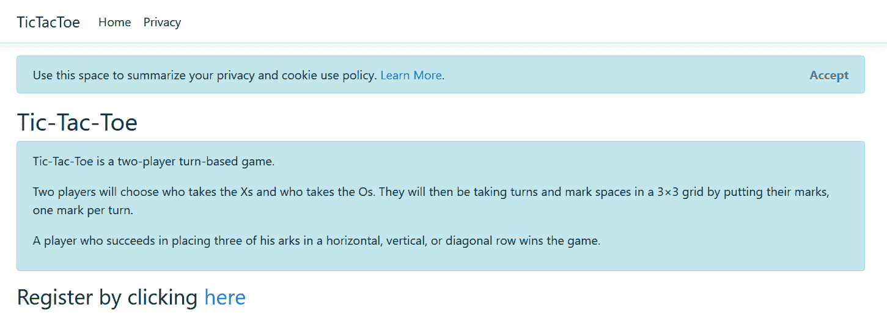

您可以在屏幕截图中看到，我们有一个链接，允许我们的应用用户注册，以便他们可以玩我们的游戏。因此，就如何创建注册页面而言，我们现在正处于一个良好的阶段。我们将在下一节中这样做。

# 创建 Tic Tac Toe 用户注册页面

现在，您将集成第二个组件，即用户注册页面及其表单，这将允许新用户注册以玩 Tic Tac Toe 游戏：

1.  将名为`Models`的新文件夹添加到项目中。
2.  通过右键单击项目中的`Models`文件夹并选择 Add | Class 并将其命名为`UserModel`来添加新模型：

```cs
        public class UserModel 
        { 
          public Guid Id { get; set; } 
          public string FirstName { get; set; } 
          public string LastName { get; set; } 
          public string Email { get; set; } 
          public string Password { get; set; } 
          public bool IsEmailConfirmed { get; set; } 
          public System.DateTime? EmailConfirmationDate { get;
           set; } 
          public int Score { get; set; } 
        } 
```

3.  添加一个新控制器并将其命名为`UserRegistrationController`（如果您不知道如何操作，请参阅*创建 Tic Tac Toe 主页*部分）。
4.  右键单击名为`Index`的方法并选择添加视图。这一次，选择创建模板，选择 UserModel 作为模型类，如前一点所述，并启用布局页面的使用：

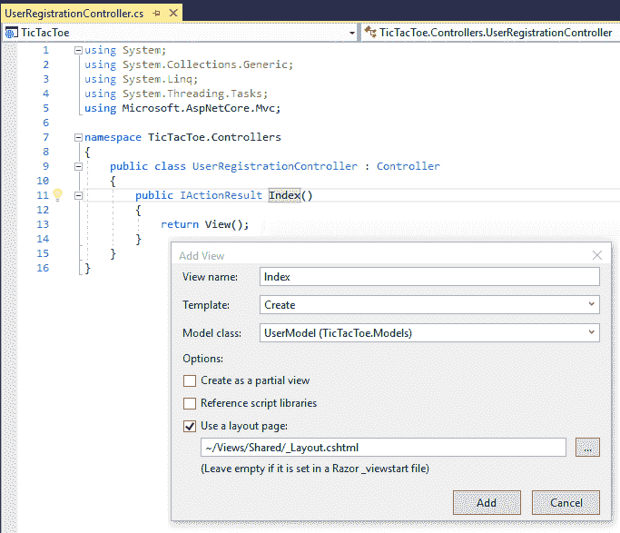

Note that you can leave the layout page empty if you want to use the `_ViewStart.cshtml` file in the `Shared` folder to define a unified common layout for all your views.

`_ViewStart.cshtml`文件用于在视图之间共享设置，`_ViewImports`文件用于共享`using`名称空间和注入 DI 实例。Visual Studio 2019 为这些文件提供了两个模板。

5.  从视图中删除自动生成的`Id`、`IsEmailConfirmed`、`EmailConfirmationDate`和`Score`元素；我们不需要他们的用户注册表。
6.  视图现在已准备就绪；按*F5*键，点击首页注册链接显示：

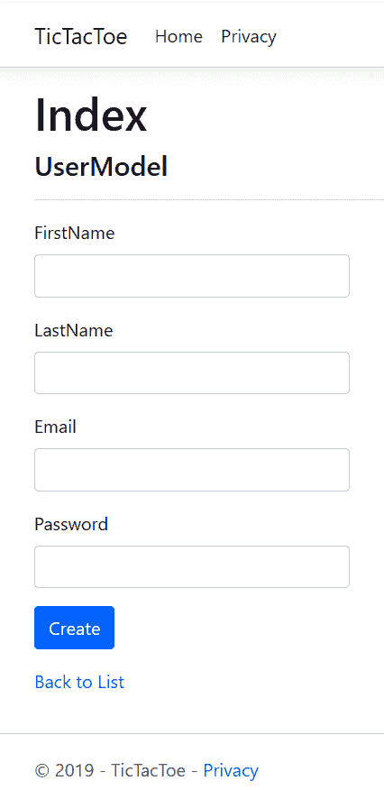

您将看到一个表单，该表单可用于填写用户详细信息，如姓名、姓氏、电子邮件和密码。请注意，输入字段较短；准确地说，它们有 280 像素长，这是因为我们在上一节中使用了 CSS 样式；否则，它们将跨越屏幕的整个长度。

我们已经完成了用户注册页面，但是您会很快注意到用户是应用的核心部分。用户将必须登录和注销，以不同的方式进行验证，并且除了注册之外，还将具有其他功能。毫不奇怪，我们将需要一个用户服务来协调用户正在发生的一切与应用的其余部分。我们将在下一节中创建一个用户服务。

# 创建 Tic-Tac-Toe 用户服务

开发人员在开发应用时面临的最大问题之一是组件间的依赖关系。这些依赖关系使得单独维护和发展组件变得困难，因为修改可能会对其他依赖组件产生不利影响。对于我们的演示应用，我们希望确保能够更新和修改单个组件或服务，而不需要去更改其他依赖组件。

但是，请放心，有一些机制允许分解这些依赖关系，其中之一就是 DI。

在提供松耦合的同时，DI 允许组件一起工作。一个组件只需要知道由另一个组件实现的契约就可以使用它。对于 DI 容器，组件不会直接实例化，静态引用也不会用于查找另一个组件的实例。相反，DI 容器负责在运行时检索正确的实例。

当一个组件的设计考虑到 DI 时，默认情况下它是非常进化的，并且不依赖于任何其他组件或行为。例如，身份验证服务可以使用提供程序进行使用 DI 的身份验证，如果添加了新的提供程序，现有的提供程序将不会受到影响。

# 使用 DI 鼓励松耦合

ASP.NET Core 3 包含一个非常简单的内置 DI 容器，它支持构造函数注入。要使服务可用于容器，必须将其添加到`Startup`类的`ConfigureService`方法中。在不知情的情况下，您以前已经为 MVC 做过：

```cs
    public void ConfigureServices(IServiceCollection services) 
    { 
      services.AddControllersWithViews();
    } 
```

事实上，您必须为自己的定制服务做同样的事情；您必须在此方法中声明它们。当你知道自己在做什么时，这真的很容易做到！

但是，有多种注入服务的方法，您需要选择最适合您需要的方法：

*   **瞬时注入**：每次调用该方法时创建一个实例（例如，无状态服务）：

```cs
        services.AddTransient<IExampleService, ExampleService>();
```

*   **作用域注入**：每个请求管道创建一个实例（例如，有状态服务）：

```cs
        services.AddScoped<IExampleService, ExampleService>(); 
```

*   **单例注入**：为整个应用创建一个实例：

```cs
        services.AddSingleton<IExampleService, ExampleService>(); 
```

Note that you should add the instances for your services by yourself if you do not want the container to automatically dispose of them. The container will call the `Dispose` method of each service instance it creates by itself.

下面是一个如何自己实例化服务的示例：
`services.AddSingleton(new ExampleService());`

现在您已经了解了如何使用 DI，让我们应用您的知识，为示例应用创建下一个组件。

# 创建用户服务

我们已经创建了一个主页以及一个用户注册页面。用户可以点击注册链接填写注册表格，但表格数据尚未以任何方式处理。我们将添加一个用户服务，该服务将负责处理与用户相关的任务，例如用户注册请求。此外，您还将应用刚才学习的一些 ASP.NET Core 3 DI 机制：

1.  将名为`UserService.cs`的新类添加到`Services`文件夹中。

2.  添加新的用户注册方法，并检查用户是否在线，将上一节中创建的模型作为参数：

```cs
        using TicTacToe.Models;

        public class UserService 
        { 
          public Task<bool>RegisterUser(UserModel userModel) 
          { 
            return Task.FromResult(true); 
          } 
           public Task<bool> IsOnline(string name)
            {
            return Task.FromResult(true);
            }
        }
```

3.  右键单击该类并选择快速操作和重构，然后单击提取接口…：

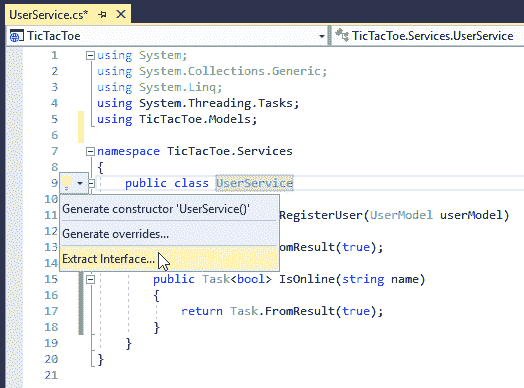

4.  将所有默认值保留在弹出窗口中，然后单击“确定”：


5.  Visual Studio 2019 将生成一个名为`IUserService.cs`的新文件，其中包含提取的接口定义，如下所示：

```cs
        public interface IUserService 
        { 
          Task<bool>RegisterUser(UserModeluserModel);
          Task<bool> IsOnline(string name); 
        } 
```

6.  更新之前创建的`UserRegistrationController`并应用构造函数注入机制：

```cs
        using TicTacToe.Services;        

        public class UserRegistrationController : Controller 
        { 
          private IUserService _userService; 
          public UserRegistrationController(IUserService 
            userService) 
          { 
            _userService = userService; 
          } 

          public IActionResult Index() 
          { 
            return View(); 
          } 
        } 
```

7.  在`UserRegistrationController`中添加一些处理用户注册的简单代码（我们将在本章后面添加验证）：

```cs
        [HttpPost] 
        public async Task<IActionResult> Index(UserModel
         userModel) 
        { 
          await _userService.RegisterUser(userModel); 
          return Content
              ($"User {userModel.FirstName} {userModel.LastName}
               has been registered successfully"); 
        } 
```

8.  转到`Startup`类并在`ConfigureServices`方法中声明`UserService`以使其可供应用使用：

```cs
        using TicTacToe.Services;     

        public void ConfigureServices(IServiceCollection services) 
        {             
          services.AddControllersWithViews();
          services.AddSingleton<IUserService, UserService>(); 
        } 
```

9.  按*F5*，填写注册页面，然后单击“确定”，测试您的应用。你应该得到一个`User has been registered successfully`输出。

至此，您已经创建了 Tic Tac Toe 应用的多个组件，这是一个非常好的进展！请保持关注，因为下一节非常重要，因为它详细解释了中间件。

# 为 Tic-Tac-Toe 应用创建基本通信中间件

如前所述，`Startup`类负责在 ASP.NET Core 3 应用中添加和配置中间件。但什么是中间件？何时、如何使用它，以及如何创建自己的中间件？这些都是我们现在要讨论的问题。

实际上，多个中间件构成了 ASP.NET 核心应用的功能。正如您可能已经注意到的，即使是最基本的功能，例如提供静态内容，也由它们执行。

# 使用中间件

中间件是 ASP.NET Core 3 请求管道的一部分，用于处理请求和响应。当它们链接在一起时，它们可以将传入的请求从一个传递到另一个，并在管道中调用下一个中间件之前和之后执行操作：

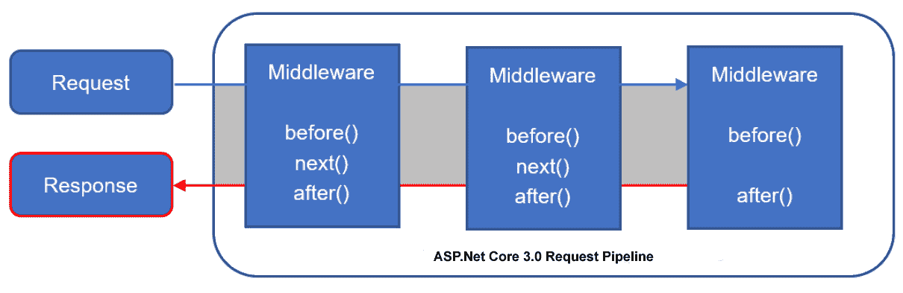

使用中间件可以使您的应用更加灵活和进化，因为您可以在`Startup`类的`Configure`方法中轻松添加和删除中间件。

此外，您在`Configure`方法中调用中间件的顺序就是调用它们的顺序。建议按以下顺序调用中间件，以确保更好的性能、功能和安全性：

1.  异常处理中间件
2.  静态文件中间件
3.  认证中间件
4.  MVC 中间件

如果不按此顺序调用它们，可能会出现一些意外行为甚至错误，因为中间件操作可能在请求管道中应用得太迟或太早。

例如，如果不首先调用**异常处理中间件**，则可能无法捕获其调用之前发生的所有异常。另一个例子是在**静态文件中间件**之后调用**响应压缩中间件**。在这种情况下，静态文件将不会被压缩，这可能不是期望的行为。因此，注意中间件调用的顺序；它可以带来巨大的不同。

以下是一些可以在应用中使用的内置中间件（列表并不详尽；还有更多）：

| 认证 | OAuth 2 和 OpenID 身份验证，基于最新版本的 IdentityModel |
| 科尔斯 | 基于 HTTP 头的跨源资源共享保护 |
| 响应缓存 | HTTP 响应缓存 |
| 响应压缩 | HTTP 响应 gzip 压缩 |
| 路由 | HTTP 请求路由框架 |
| 一场 | 基本本地和分布式会话对象管理 |
| 静态文件 | HTML、CSS、JavaScript 和图像支持，包括目录浏览 |
| URL 重写 | URL SEO 优化和重写 |

内置中间件将足以满足最基本的需求和标准用例，但您肯定需要创建自己的中间件。有两种方法可以做到这一点：在`Startup`类中内联创建它们，或者在自包含类中创建它们。

让我们先看看如何定义内联中间件。以下是可用的方法：

*   `Run`
*   `Map`
*   `MapWhen`
*   `Use`

`Run`方法用于添加中间件并立即返回响应，从而使请求管道短路。它不调用以下任何中间件，并结束请求管道。因此，建议将其放在中间件调用的末尾（参考前面讨论的中间件排序）。

`Map`方法允许在请求路径以特定路径开始时执行某个分支并添加相应的中间件，这意味着您可以有效地对请求管道进行分支。

`MapWhen`方法提供的分支请求管道和添加特定中间件的概念基本相同，但可以控制分支条件，因为它基于`Func<HttpContext, bool>`谓词的结果。

`Use`方法添加了中间件，并允许在线调用下一个中间件或短接请求管道。但是，如果您希望在执行特定操作后传递请求，则必须使用`next.Invoke`和当前上下文作为参数手动调用下一个中间件。

下面是一些如何使用这些扩展方法的示例，首先是使用`ApiPipeline`和`WebPipeline`：

```cs
     private static void ApiPipeline(IApplicationBuilder app)  { 
      app.Run(async context => 
      { 
        await context.Response.WriteAsync("Branched to Api 
        Pipeline."); 
      });   } 

    private static void WebPipeline(IApplicationBuilder app)   { 
      app.MapWhen(context => 
      { 
        return context.Request.Query.ContainsKey("usr"); 
      }, UserPipeline); 

      app.Run(async context => 
      { 
        await context.Response.WriteAsync("Branched to Web 
        Pipeline."); 
      });     } 
```

然后，有`UserPipeline`和`Configure`方法，它们利用创建的管道：

```cs

     private static void UserPipeline(IApplicationBuilder app)     { 
      app.Run(async context => 
      { 
        await context.Response.WriteAsync("Branched to User 
         Pipeline."); 
      });    } 

    public void Configure(IApplicationBuilder app, 
     IHostingEnvironmentenv)     { 
      app.Map("/api", ApiPipeline);  app.Map("/web", WebPipeline); 

      app.Use(next =>async context => 
      { 
        await context.Response.WriteAsync("Called Use."); 
        await next.Invoke(context);       }); 

      app.Run(async context => 
      { 
        await context.Response.WriteAsync("Finished with Run."); 
      });    } 
```

如前所示，您可以内联创建中间件，但对于更高级的场景，不建议这样做。在这种情况下，我们建议您将中间件放在自包含类中，这样做的过程非常简单。中间件只是通过扩展方法公开的具有特定结构的类。

# 创建通信中间件

让我们执行以下步骤：

1.  在项目中创建一个名为`Middleware`的新文件夹，然后添加一个名为`CommunicationMiddleware.cs`的新类，代码如下：

```cs
        using Microsoft.AspNetCore.Http;
        using TicTacToe.Services;
        public class CommunicationMiddleware 
        { 
          private readonly RequestDelegate _next; 
          private readonly IUserService _userService; 

          public CommunicationMiddleware(RequestDelegate next,
           IUserService userService) 
          { 
            _next = next; 
            _userService = userService; 
          }  
          public async Task Invoke(HttpContext context) 
          { 
            await _next.Invoke(context); 
          } 
        }
```

2.  在项目中创建一个名为`Extensions`的新文件夹，然后添加一个名为`CommunicationMiddlewareExtension.cs`的新类，代码如下：

```cs
       using Microsoft.AspNetCore.Builder;
       using TicTacToe.Middleware;        

        public static class CommunicationMiddlewareExtension 
        { 
          public static IApplicationBuilder
           UseCommunicationMiddleware(this IApplicationBuilder app) 
          { 
            return app.UseMiddleware<CommunicationMiddleware>(); 
          } 
        } 
```

3.  在`Startup`类中为`TicTacToe.Extensions`添加`using`指令，然后将通信中间件添加到`Configure`方法中：

```cs
        using TicTacToe.Extensions; 
        ... 
        public void Configure(IApplicationBuilder app,
         IHostingEnvironment env) 
        { 
          ... 
          app.UseCommunicationMiddleware();
          app.UseRouting();            
          app.UseEndpoints(endpoints =>
          {
              endpoints.MapControllerRoute(
                  name: "default",
                  pattern: "{controller=Home}/{action=Index}
                  /{id?}");
              endpoints.MapRazorPages();
            });          
        } 
```

4.  在通信中间件实现中设置一些断点，按*F5*启动应用。您将看到，如果一切正常，断点将被命中：

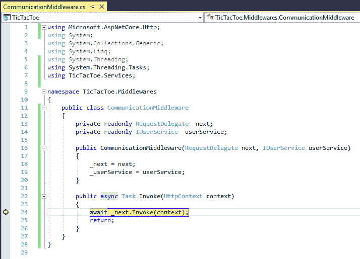

这只是如何创建自己的中间件的一个基本示例；此部分与其他部分之间没有可见的功能更改。在接下来的章节中，您将进一步实现各种功能，以完成 Tic-Tac-Toe 应用，本章中介绍的通信中间件不久将做一些实际工作。

# 使用静态文件

在使用 web 应用时，大多数情况下，您必须使用 HTML、CSS、JavaScript 和图像，ASP.NET Core 3 将这些文件视为静态文件。

默认情况下，无法访问这些文件，但在本章开头，您看到了允许在应用中使用静态文件需要做些什么。事实上，您必须将相应的中间件添加并配置到`Startup`类中，才能为静态文件提供服务：

```cs
    app.UseStaticFiles();
```

Note that, by default, all static files served by this middleware are public and anyone can access them. If you need to protect some of your files, you need to either store them outside the `wwwroot` folder or you need to use the `FileResult` controller action, which supports the authorization middleware.

此外，出于安全原因，默认情况下禁用目录浏览。但是，如果需要允许用户查看文件夹和文件，则可以轻松激活它：

1.  调用`AddControllersWithViews()`方法后，立即将`DirectoryBrowsingMiddleware`添加到`Startup`类的`ConfigureService`方法中：

```cs
        services.AddDirectoryBrowser(); 
```

2.  在`Startup`类的`Configure`方法中，调用`UseDirectoryBrowser`方法（调用`UseCommunicationMiddleware`方法后）激活目录浏览：

```cs
        app.UseDirectoryBrowser(); 
```

前面的代码允许我们从浏览器查看以下根文件夹：


3.  从`Startup`类中删除对`UseDirectoryBrowser`方法的调用；对于示例应用，我们不需要它。

# 使用路由、URL 重定向和 URL 重写

在构建应用时，路由用于将传入请求映射到路由处理程序（URL 匹配）并为响应生成 URL（URL 生成）。

ASP.NET Core 3 的路由功能结合并统一了以前存在的 MVC 和 web API 的路由功能。它们已经从头开始重建，以创建一个通用的路由框架，在一个地方具有所有不同的功能，可用于所有类型的 ASP.NET Core 3 项目。

现在，让我们看看路由在内部是如何工作的，以便更好地理解它在您的应用中是如何有用的，以及如何将它应用到我们的 Tic-Tac-Toe 应用示例中。

对于收到的每个请求，将根据请求 URL 检索匹配的路由。管线将按照它们在管线集合中出现的顺序进行处理。

更具体地说，传入的请求被分派到相应的处理程序。大多数情况下，这是基于 URL 中的数据完成的，但是您也可以使用请求中的任何数据来实现更高级的场景。

如果您使用的是 MVC 中间件，您可以在`Startup`类中定义和创建路由，如本章开头所示。这是开始 URL 匹配和 URL 生成的最简单方法：

```cs
            app.UseRouting();            
            app.UseEndpoints(endpoints =>
            {
                endpoints.MapControllerRoute(
                    name: "default",
                    pattern: "{controller=Home}/{action=Index}/{id?}");

            });
```

还有一个专用的路由中间件，您可以使用它在应用中处理路由，这在前面关于中间件的部分中已经看到。您只需将其添加到`Startup`类：

```cs
    public void ConfigureServices(IServiceCollection services) 
    { 
      services.AddRouting(); 
    }
```

下面是一个如何使用它调用`Startup`类中的`UserRegistration`服务的示例。

首先，我们将`UserService`和路由添加到`ServiceCollection`：

```cs
    public void ConfigureServices(IServiceCollection services)
    {
      services.AddControllersWithViews();
      services.AddSingleton<IUserService, UserService>();
      services.AddRouting();
    }
```

然后我们在`Configure`方法中使用它们如下：

```cs
public void Configure(IApplicationBuilder app, IHostingEnvironment env)
{  app.UseStaticFiles();
  var routeBuilder = new RouteBuilder(app);
  routeBuilder.MapGet("CreateUser", context =>
  { var firstName = context.Request.Query["firstName"];
    var lastName = context.Request.Query["lastName"];
    var email = context.Request.Query["email"];
    var password = context.Request.Query["password"];
    var userService =  context.RequestServices.
        GetService<IUserService>();
    userService.RegisterUser(new UserModel { FirstName = 
    firstName, LastName = lastName, Email = email, 
    Password = password });
    return context.Response.WriteAsync($"User {firstName} {lastName} 
     has been successfully created.");    
   });
      var newUserRoutes = routeBuilder.Build();
      app.UseRouter(newUserRoutes);
      app.UseCommunicationMiddleware();
      app.UseStatusCodePages("text/plain", "HTTP Error - Status Code: 
       {0}");     }
```

如果使用一些查询字符串参数调用它，将得到以下结果：

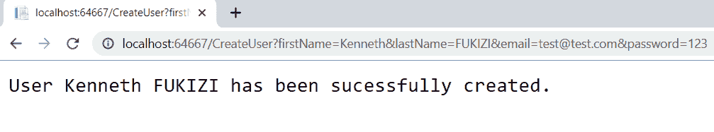

另一个重要的中间件是**URL 重写中间件**。它提供 URL 重定向和 URL 重写功能。然而，这两者之间有一个关键的区别，你需要理解。

URL 重定向需要往返到服务器，并在客户端完成。客户端首先收到一个永久移动的`301`或临时移动的`302`HTTP 状态码，表示要使用的新重定向 URL。然后，客户机调用新的 URL 来检索请求的资源，因此它将对客户机可见。

另一方面，URL 重写纯粹是服务器端的。服务器将从不同的资源地址内部检索请求的资源。客户端将不知道该资源是从另一个 URL 提供的，因为它对客户端不可见。

回到 Tic Tac Toe 应用，我们可以使用 URL 重写为注册新用户提供更有意义的 URL。我们可以使用更短的 URL，而不是使用`UserRegistration/Index`，例如`/NewUser`：

```cs
    var options = new RewriteOptions() 
      .AddRewrite("NewUser", "/UserRegistration/Index", false); 
    app.UseRewriter(options);
```

这里，用户认为该页面是从`/NewUser`开始服务的，而实际上是从`/UserRegistration/Index`开始服务的，用户没有注意到：


当您希望 URL 有意义时，这对于应用上的用户体验非常有用，并且可以在搜索引擎优化中发挥作用，在搜索引擎优化中，web 爬虫匹配 URL 和页面内容非常重要。

# ASP.NET Core 3 的终结点路由

端点路由，在其早期概念中也称为调度程序，在 ASP.NET Core 的 2.2 版中引入，默认情况下，推荐用于 ASP.NET Core 3。

如果您使用过 ASP.NET Core 2.0 及更早版本，您会发现大多数应用要么使用`RouteBuilder`，如前面的示例所示，要么使用路由属性（如果您正在开发 API），我们将在后面的一章中讨论。您将熟悉`UseMVC()`和/或`UseRouter()`方法，这些方法在 ASP.NET Core 3 中仍然有效，但端点路由的设计允许开发人员使用不打算使用 MVC 的应用，并且仍然使用路由来处理请求。

以下是在 ASP.NET Core 之前的应用中的`Startup`类`Configure`方法中通常可以找到的示例：

```cs
            app.UseMvc(routes =>
            {
                routes.MapRoute(
                    name: "default",
                    template: "
                     {controller=Home}/{action=Index}/{id?}");
            });
```

我们必须注意，在使用`app.UseMvc`或`Configure`方法中的`app.UseRouting`之前，我们必须在`ConfigureServices`方法中定义`services.AddMvc()`。

将其与 ASP.NET Core 3 应用中的默认实现进行比较，如下所示：

```cs
            app.UseRouting();

            app.UseAuthorization();

            app.UseEndpoints(endpoints =>
            {
                endpoints.MapControllerRoute(
                    name: "default",
                    pattern: "{controller=Home}/{action=Index}/{id?}");
                endpoints.MapRazorPages();
                endpoints.MapControllers();
            });
```

在这个实现中，我们使用端点而不是 MVC，因此我们不需要专门将 MVC 添加到`ConfigureServices`方法中，这本身就使得这个实现更轻量级，减少了 MVC 带来的开销，当我们构建不一定需要遵循 MVC 架构的应用时，这一点非常重要。

我们的应用开始增长，遇到错误的机会也在增加。在下一节中，让我们看看如何将错误处理添加到应用中。

# 向 Tic-Tac-Toe 应用添加错误处理

在开发应用时，问题不是*是否会发生*错误和 bug，而是*何时会发生*。构建应用是一项非常复杂的任务，几乎不可能考虑运行时可能发生的所有情况。即使你认为你已经考虑了所有的事情，那么环境并没有按照预期的那样运行；例如，服务不可用，或者处理请求的时间比预期的要长得多。

这个问题有两种解决方案，需要同时应用单元测试和错误处理。从应用的角度来看，单元测试将确保开发期间的正确行为，而错误处理将帮助您在运行时为环境问题做好准备。在本节中，我们将研究如何向 ASP.NET Core 3 应用添加有效的错误处理。

默认情况下，如果根本没有错误处理，并且发生异常，则应用将停止，用户将无法再使用它，并且在最坏的情况下，服务将中断。

开发期间要做的第一件事是激活默认的开发异常页面；它显示发生的异常的详细信息。您已经在本章开头了解了如何执行此操作：

```cs
    if (env.IsDevelopment()) 
    { 
      app.UseDeveloperExceptionPage(); 
    } 
```

在默认开发异常页面上，您可以深入了解原始异常详细信息以分析堆栈跟踪。您有多个选项卡，可以查看查询字符串参数、客户端 cookie 和请求头。

这些都是一些强有力的指标，可以让你更好地理解发生了什么以及为什么会发生。它们应该可以帮助您在开发期间更快速地发现问题并解决问题。

以下是发生异常时发生的情况的示例：


但是，不建议在生产环境中使用默认的“开发异常”页面，因为它包含了太多有关系统的信息，这些信息可能会危害系统。

对于生产环境，建议配置带有静态内容的专用错误页。在以下示例中，您可以看到默认的开发异常页面在开发期间使用，如果应用配置为在非开发环境中运行，则会显示特定的错误页面：

```cs
    if (env.IsDevelopment()) 
    { 
      app.UseDeveloperExceptionPage();  
    } 
    else 
    { 
      app.UseExceptionHandler("/Home/Error"); 
    } 
```

默认情况下，`400`和`599`之间的 HTTP 错误代码不显示信息。例如，这包括`404`（未找到）和`500`（内部服务器错误）。用户只会看到一个空白页面，这不是很友好。

您应该激活`Startup`类中特定的`UseStatusCodePages`中间件。这将帮助您自定义在这种情况下需要显示的内容。有意义的信息将帮助用户更好地理解应用中发生的事情，并将带来更好的客户满意度。

最基本的配置可能是只显示一条文本消息：

```cs
    app.UseStatusCodePages("text/plain", "HTTP Error - Status Code: 
     {0}"); 
```

前面的代码生成以下内容：


但是，你可以走得更远。例如，您可以重定向到特定 HTTP 错误状态代码的特定错误页。

以下示例显示如何将移动的临时`302`（已找到）HTTP 状态代码发送到客户端，然后将其重定向到特定的错误页面：

```cs
    app.UseStatusCodePagesWithRedirects("/error/{0}"); 
```

此示例显示如何将原始 HTTP 状态代码返回到客户端，然后将其重定向到特定的错误页：

```cs
    app.UseStatusCodePagesWithReExecute("/error/{0}"); 
```

You can disable HTTP status code pages for specific requests as shown here:

```cs
var statusCodePagesFeature =
   context.Features.Get<IStatusCodePagesFeature>();
   if (statusCodePagesFeature != null)
   {
     statusCodePagesFeature.Enabled = false;
   }
```

现在我们已经了解了如何在外部处理错误，让我们看看如何在应用内部处理错误。

如果我们回到`UserRegisterController`实现，我们可以看到它有多个缺陷。如果字段填写不正确或根本不正确怎么办？如果模型定义未得到遵守怎么办？目前，我们不需要任何东西，也不验证任何东西。

让我们解决这个问题，看看如何构建更健壮的应用：

1.  更新`UserModel`，并使用修饰符（也称为属性）来设置一些属性，如`Required`和`DataType`。`Required`属性表示以下字段必须有一个值，如果没有提供值，则会导致错误。`DataType`属性指定字段需要特定的数据类型：

```cs
        public class UserModel 
        { 
          public Guid Id { get; set; } 
          [Required()] 
          public string FirstName { get; set; } 
          [Required()] 
          public string LastName { get; set; } 
          [Required(), DataType(DataType.EmailAddress)] 
          public string Email { get; set; } 
          [Required(), DataType(DataType.Password)] 
          public string Password { get; set; } 
          public bool IsEmailConfirmed { get; set; } 
          public System.DateTime? EmailConfirmationDate { get;
            set; } 
          public int Score { get; set; } 
        } 
```

2.  更新`UserRegistrationController`中的具体`Index`方法，然后添加`ModelState`验证码：

```cs
        [HttpPost] 
        public async Task<IActionResult> Index(UserModel userModel) 
        { 
          if (ModelState.IsValid) 
          { 
            await _userService.RegisterUser(userModel); 
            return Content($"User {userModel.FirstName}  
             {userModel.LastName} has been registered
               successfully"); 
          } 
          return View(userModel); 
        }  
```

3.  如果您没有填写必填字段，或者您提供了无效的电子邮件地址，然后单击“确定”，您现在将收到相应的错误消息：


为了达到这个阶段，我们已经经历了创建一个**M**模型（如`UserModel`）的过程，一个**V**视图（如前一个）和一个**C**控制器（如`UserRegistrationController`）的过程。换句话说，简而言之，我们已经成功创建了一个功能正常的**MVC**应用！赞扬自己走到了这一步，并期待更多令人兴奋的东西，因为我们将在后面的章节中详细阐述 ASP.NET 核心 MVC 应用。

# 总结

在本章中，您已经了解了 ASP.NET 3 的一些基本概念。有很多东西需要理解，也有很多东西需要看，我们希望你自己尝试每一件事时都会感到有趣。你确实取得了巨大的进步！

一开始，您创建了 Tic-Tac-Toe 项目，然后开始实现它的不同组件。我们探索了`Program`和`Startup`类，了解了如何使用 NPM 和布局页面，学习了如何应用 DI，并使用了静态文件。

此外，我们还为更高级的场景引入了中间件和路由。最后，我们通过一个实例说明了如何为应用添加有效的错误处理。

在下一章中，我们将继续介绍其他概念，如`WebSockets`、全球化、本地化和配置。我们还将学习如何一次构建应用，并使用相同的构建在多个环境中运行。