# 通过自定义应用程序实现 ASP.NET Core 3 的基本概念：第 2 部分

上一章让您深入了解了在使用 ASP.NET Core 3 构建高效且更易于维护的 web 应用程序时可以使用的各种功能和特性。我们已经解释了一些基本概念，您已经看到了如何将它们应用于名为**Tic Tac Toe**的实际应用程序的多个示例。

自从您了解了 ASP.NET Core 3 应用程序的内部结构、如何正确配置它们以及如何使用自定义行为对它们进行扩展（这是将来构建自己的应用程序的关键）以来，您已经取得了相当好的进展。

但我们不要就此止步！在本章中，您将发现如何最好地实现缺失的组件，进一步改进现有组件，并添加客户端代码，以便在本章末尾拥有一个完全运行的端到端 Tic-Tac-Toe 应用程序。

在本章中，我们将介绍以下主题：

*   使用 JavaScript、捆绑和缩小优化客户端开发
*   使用 WebSocket 实现实时通信场景
*   利用会话和用户缓存管理
*   为多语言用户界面应用全球化和本地化
*   配置应用程序和服务
*   实现高级依赖注入概念
*   一次构建并在多个环境中运行

# 使用 JavaScript 进行客户端开发

在上一章中，您使用 MVC 模式创建了主页和用户注册页。您实现了一个控制器（`UserRegistrationController`）以及一个用于处理用户注册请求的相应视图。然后，您添加了一个服务（`UserService`）和中间件（`CommunicationMiddleware`），但是我们才刚刚开始，所以还没有完成：


与 Tic-Tac-Toe 应用程序的初始工作流相比，我们可以看到仍然缺少很多东西，例如使用整个客户端部分，实际使用通信中间件，以及我们仍然需要实现的多个其他功能。

让我们从客户端部分开始，学习如何应用更先进的技术。然后，我们将学习如何尽可能地优化一切。

您可能还记得，上一次，我们在用户将其数据提交到注册表后停止了，注册表已发送到`UserService`。在这里，我们刚刚显示了一条纯文本消息，如下所示：

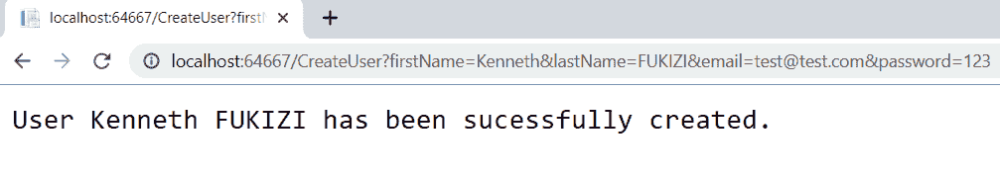

然而，处理并不是到此为止。我们需要使用客户端开发和 JavaScript 添加整个电子邮件确认过程，这就是我们下一步要做的。

# 初步电子邮件确认功能

在本节中，我们将构建一个暂定的电子邮件确认功能，以演示客户端开发。这一功能将随着本书的发展而发展，并将在后面的章节中完善。但现在，让我们创建电子邮件确认功能，如下所示：

1.  启动 Visual Studio 2019 并打开 Tic-Tac-Toe 项目。将名为`EmailConfirmation`的新方法添加到`UserRegistrationController`：

```cs
        [HttpGet] 
        public IActionResult EmailConfirmation (string email) 
        { 
          ViewBag.Email = email; 
          return View(); 
        } 
```

2.  右键点击`EmailConfirmation`方法，生成相应的视图，并用一些有意义的信息进行更新：

```cs
        @{ 
            ViewData["Title"] = "EmailConfirmation"; 
            Layout = "~/Views/Shared/_Layout.cshtml"; 
        } 
        <h2>EmailConfirmation</h2> 
        An email has been sent to @ViewBag.Email, please 
         confirm your email address by clicking on the
         provided link. 
```

3.  转到`UserRegistrationController`并修改`Index`方法，从上一步重定向到`EmailConfirmation`方法，而不是返回文本消息：

```cs
        [HttpPost] 
        public async Task<IActionResult> Index(UserModel userModel) 
        { 
          if (ModelState.IsValid) 
          { 
            await _userService.RegisterUser(userModel); 
            return RedirectToAction(nameof(EmailConfirmation),
            new { userModel.Email }); 
          } 
          else 
          { 
            return View(userModel); 
          } 
        } 
```

4.  按*F5*启动应用程序，注册新用户，并验证新电子邮件确认页面是否正确显示：


这里，您已经实现了第一组修改，以完成用户注册过程。在下一节中，我们需要检查用户是否已确认其电子邮件地址。

# 我们用户的电子邮件确认

以下步骤将帮助我们检查电子邮件确认：

1.  在`IUserService`界面增加两个新方法`GetUserByEmail`和`UpdateUser`。这些将用于处理电子邮件确认更新：

```cs
        public interface IUserService 
        { 
          Task<bool> RegisterUser(UserModel userModel); 
          Task<UserModel> GetUserByEmail(string email); 
          Task UpdateUser(UserModel user); 
        } 
```

2.  实现这些新方法，使用静态的`ConcurrentBag`来持久化`UserModel`，并修改`UserService`中的`RegisterUser`方法，如下所示：

```cs
public class UserService : IUserService 
{ 
  private static  ConcurrentBag<UserModel> _userStore;  
  static UserService() { _userStore = new ConcurrentBag
   <UserModel>();      } 

  public Task<bool> RegisterUser(UserModel userModel) { 
            _userStore.Add(userModel); 
            return Task.FromResult(true);     } 

  public Task<UserModel> GetUserByEmail(string email) { 
            return Task.FromResult(_userStore.FirstOrDefault
             (u => u.Email == email));   } 

  public  Task UpdateUser(UserModel userModel)  { 
    _userStore = new ConcurrentBag<UserModel>(_userStore.Where
     (u => u.Email != userModel.Email)) 
            {    userModel      }; 
            return Task.CompletedTask; 
     } 
   } 
```

3.  将名为`GameInvitationModel`的新模型添加到`Models`文件夹中。用户注册成功后，将用于游戏邀请：

```cs
        public class GameInvitationModel 
        { 
          public Guid Id { get; set; } 
          public string EmailTo { get; set; } 
          public string InvitedBy { get; set; } 
          public bool IsConfirmed { get; set; } 
          public DateTime ConfirmationDate { get; set; } 
        } 
```

4.  添加一个名为`GameInvitationController`的新控制器，并更新其`Index`方法以自动设置`InvitedBy`属性：

```cs
using TicTacToe.Services;        
public class GameInvitationController : Controller 
{ 
  private IUserService _userService; 
  public GameInvitationController(IUserService userService) 
  { 
     _userService = userService; 
  } 

  [HttpGet] 
  public async Task<IActionResult> Index(string email) 
  { 
    var gameInvitationModel = new GameInvitationModel
     {InvitedBy = email }; 
    return View(gameInvitationModel); 
    } 
  } 
```

5.  右键点击`Index`方法，选择创建模板，选择`GameInvitationModel(TicTacToe.Models)`作为模型类，生成相应的视图，如下图所示：


6.  修改自动生成的视图，删除除`EmailTo`输入控件以外的所有不必要的输入控件：

```cs
@model TicTacToe.Models.GameInvitationModel 

<h4>GameInvitationModel</h4>
<div class="row">
  <div class="col-md-4">
    <form asp-action="Index">
       <div asp-validation-summary="ModelOnly" class="text
        -danger"></div>            
         <div class="form-group">
            <label asp-for="EmailTo" class="control-label"></label>
            <input asp-for="EmailTo" class="form-control" />
            <span asp-validation-for="EmailTo" class="text
             -danger"></span>
         </div>            
         <div class="form-group">
            <input type="submit" value="Create" class="btn btn-
             primary" />
         </div>
        </form>
    </div>
</div> 
```

7.  现在更新`UserRegistrationController`中的`EmailConfirmation`方法。在确认用户的电子邮件后，必须将其重定向到`GameInvitationController`。如您所见，我们现在将在代码中模拟此确认：

```cs
      [HttpGet] 
      public async Task<IActionResult> EmailConfirmation(
        string email) 
      { 
        var user = await _userService.GetUserByEmail(email); 
        if (user?.IsEmailConfirmed == true) 
          return RedirectToAction("Index", "GameInvitation",
           new { email = email }); 

        ViewBag.Email = email; 
        user.IsEmailConfirmed = true; 
        user.EmailConfirmationDate = DateTime.Now; 
        await _userService.UpdateUser(user); 
        return View(); 
      }
```

8.  按*F5*启动应用程序，注册新用户，并验证是否显示 EmailConfirmation 页面。在 Microsoft Edge 中，按*F5*重新加载页面，如果一切正常，应重定向到游戏邀请页面，如下图所示：


很好，还有一些进步！在游戏邀请之前，一切都在进行中，但不幸的是，用户干预仍然是必要的。用户必须手动刷新邮件确认页面，按*F5*键，直到其邮件被确认；只有这样，他们才会被重定向到游戏邀请页面。

整个刷新过程必须在下一步实现自动化和优化。你的选择如下：

*   在页面的`head`部分放置一个 HTML`meta`刷新标记。
*   使用简单的 JavaScript，它以编程方式进行刷新。
*   使用 jQuery 实现**XMLHttpRequest**（**XHR**）。

HTML5 引入了 meta refresh 标签，用于在一定时间后自动刷新页面。但是，不建议使用此方法，因为它会造成较高的服务器负载。此外，Microsoft Edge 中的安全设置可能会完全停用它，一些广告拦截器会阻止它工作。因此，如果您使用它，您无法确定它是否能够正常工作。

使用简单的 JavaScript 可以很好地以编程方式自动化页面刷新，但它主要有相同的缺陷，因此也不推荐使用。

# 使用 XMLHttpRequest

我们刚刚提到，不建议在刷新过程中使用简单的 JavaScript 和`meta`刷新标记，所以让我们介绍一下 XHR，这正是我们真正想要的。它提供了我们的 Tic Tac Toe 应用程序所需的功能，因为它允许以下功能：

*   在不重新加载网页的情况下更新网页
*   从服务器请求和接收数据，即使在页面加载之后也是如此
*   在后台向服务器发送数据

这可以在下图中看到：


现在，您将使用 XHR 来自动化和优化用户注册电子邮件确认过程的客户端实现。操作步骤如下所示：

1.  在`wwwroot`文件夹中创建一个名为`app`的新文件夹（该文件夹将包含以下步骤中显示的所有客户端代码），并在该文件夹中创建一个名为`js`的子文件夹。
2.  将名为`scripts1.js`的新 JavaScript 文件添加到包含以下内容的`wwwroot/app/js`文件夹中：

```cs
        var interval; 
        function EmailConfirmation(email) { 
          interval = setInterval(() => { 
            CheckEmailConfirmationStatus(email); 
          }, 5000); 
        } 
```

3.  将名为`scripts2.js`的新 JavaScript 文件添加到包含以下内容的`wwwroot/app/js`文件夹中：

```cs
        function CheckEmailConfirmationStatus(email) { 
          $.get("/CheckEmailConfirmationStatus?email=" + email,
            function (data) { 
              if (data === "OK") { 
                if (interval !== null) 
                clearInterval(interval); 
                alert("ok"); 
              } 
          }); 
        } 
```

4.  打开`Views\Shared\_Layout.cshtml`文件中的布局页面，在关闭`body`标签之前添加一个新的开发环境元素（最好放在这里）：

```cs
        <environment include="Development"> 
          <script src="~/app/js/scripts1.js"></script> 
          <script src="~/app/js/scripts2.js"></script> 
        </environment> 
```

5.  更新通信中间件中的`Invoke`方法，并添加一个新的等待来访问一个名为`ProcessEmailConfirmation`的`ProcessEmailConfirmation`方法：

```cs
 public async Task Invoke(HttpContext context) 
        { 
          if (context.Request.Path.Equals(
            "/CheckEmailConfirmationStatus")) 
          { 
            await ProcessEmailConfirmation(context); 
          } 
          else 
          { 
            await _next?.Invoke(context); 
          } 
        } 

```

`ProcessEmailConfirmation`方法将模拟电子邮件确认功能。我们对该方法的定义如下：

```cs

        private async Task ProcessEmailConfirmation(  HttpContext 
         context) 
        { 
          var email = context.Request.Query["email"]; 
          var user = await _userService.GetUserByEmail(email); 

          if (string.IsNullOrEmpty(email)) 
          {  await context.Response.WriteAsync("BadRequest:Email is 
            required"); }

          else if ((await _userService.GetUserByEmail
            (email)).IsEmailConfirmed) 
          {  await context.Response.WriteAsync("OK");  } 
          else 
          { 
            await context.Response.WriteAsync( 
             "WaitingForEmailConfirmation"); 
            user.IsEmailConfirmed = true; 
            user.EmailConfirmationDate = DateTime.Now; 
            _userService.UpdateUser(user).Wait();  
          } 
        } 
```

6.  通过在页面底部添加对 JavaScript`EmailConfirmation`函数的调用（来自上一步），更新`UserRegistration`文件夹下的`EmailConfirmation`视图，如下所示：

```cs
        @section Scripts 
        { 
          <script> 
             $(document).ready(function () { 
               EmailConfirmation('@ViewBag.Email'); 
             }); 
          </script> 
        } 
```

7.  更新`UserRegistrationController`中的`EmailConfirmation`方法。由于通信中间件将模拟有效的电子邮件确认，请删除以下行：

```cs
        user.IsEmailConfirmed = true; 
        user.EmailConfirmationDate = DateTime.Now; 
        await _userService.UpdateUser(user); 
```

8.  按*F5*启动应用程序并注册新用户。您将看到一个 JavaScript 警报框返回`WaitingForEmailConfirmation`，一段时间后，另一个框返回 ok：

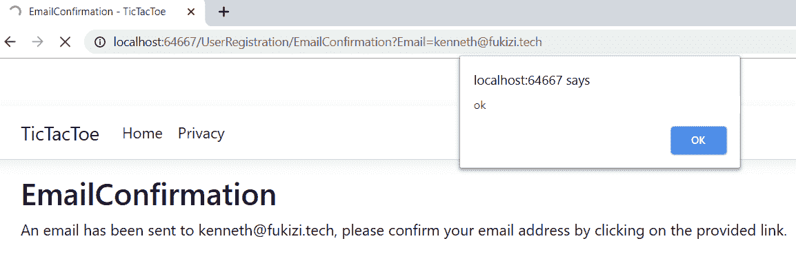

9.  现在，您必须更新`scripts2.js`文件中的`CheckEmailConfirmationStatus`方法，以将我们的用户重定向到游戏邀请页面，以防收到确认的电子邮件。为此，请删除`alert("OK");`指令并在其位置添加以下指令：

```cs
        window.location.href = "/GameInvitation?email=" + email;
```

10.  按*F5*启动应用程序并注册新用户。所有内容都应该是自动的，并且您应该在最后自动重定向到游戏邀请页面：

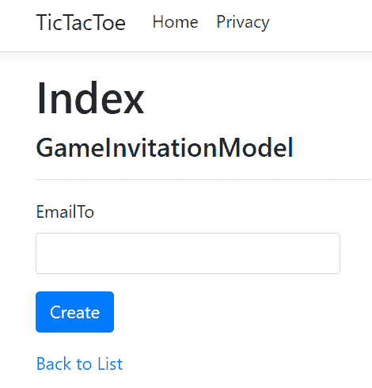

Note that, if you still see the alert box, even though you have updated the project in Visual Studio, you might have to delete the cached data in your browser to have the JavaScript refreshed correctly in your browser and see the new behavior.

# 优化 web 应用程序并使用捆绑和缩小

正如您在[第 4 章](04.html)*中通过自定义应用程序了解到的 ASP.NET Core 3 的基本概念：第 1 部分*，我们选择了经过社区验证的**节点包管理器**（**NPM**作为客户端包管理器。我们没有触及`appsettings.json`文件，这意味着我们已经恢复了四个默认包，并在 ASP.NET Core 3 布局页面中添加了一些引用以使用它们：


在当今的现代 web 应用程序开发世界中，在开发过程中将客户端 JavaScript 代码和 CSS 样式表分离到多个文件中是一种很好的做法。但是，在生产环境中运行时，拥有如此多的文件可能会导致性能和带宽问题。

这就是为什么在构建过程中，在生成最终发布包之前必须对所有内容进行优化，这意味着 JavaScript 和 CSS 文件必须捆绑并缩小。TypeScript 和 CoffeeScript 文件必须转换成 JavaScript。

捆绑和缩小是两种可以用来提高 web 应用程序整体页面加载性能的技术。捆绑允许您将多个文件合并到一个文件中，而缩小优化了 JavaScript 和 CSS 文件的代码以获得更小的有效负载。它们一起工作以减少服务器请求的数量以及总体请求大小。

ASP.NET Core 3 支持不同的捆绑和缩小解决方案：

*   Visual Studio Bundler 和 Minifier 扩展
*   吞咽
*   咕哝

# 捆绑和缩小

让我们学习如何通过使用 Visual Studio Bundler&Minifier 扩展名和`bundleconfig.json`文件来捆绑和缩小 Tic Tac Toe 项目中的多个 JavaScript 文件：

1.  在顶部菜单中，选择扩展，点击在线，在搜索框中输入`Bundler`，选择 Bundler&Minifier，点击下载：

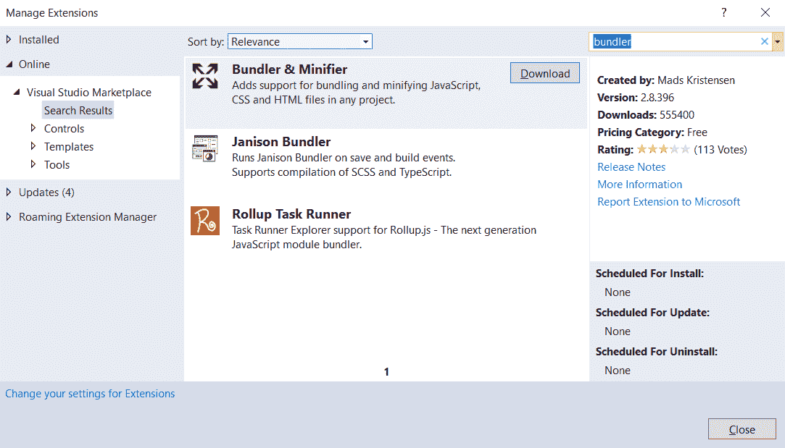

2.  关闭 Visual Studio；安装将继续进行。接下来，单击修改：


3.  重新启动 VisualStudio。现在，您将通过捆绑和缩小来优化打开连接的数量以及带宽使用。为此，向项目中添加一个名为`bundleconfig.json`的新 JSON 文件。
4.  更新`bundleconfig.json`文件，以便将两个 JavaScript 文件捆绑成一个名为`site.js`的文件，并缩小`site.css`和`site.js`文件：

```cs
        [ 
          {"outputFileName": "wwwroot/css/site.min.css", 
            "inputFiles": [ 
              "wwwroot/css/site.css"  ]}, 
          {"outputFileName": "wwwroot/js/site.js", 
            "inputFiles": [ 
              "wwwroot/app/js/scripts1.js", 
              "wwwroot/app/js/scripts2.js"  ], 
            "sourceMap": true, 
            "includeInProject": true   }, 
          {"outputFileName": "wwwroot/js/site.min.js", 
            "inputFiles": ["wwwroot/js/site.js"], 
            "minify": { 
              "enabled": true, 
              "renameLocals": true }, 
            "sourceMap": false    }   
        ] 
```

5.  右键单击项目并选择 Bundler&Minifier |更新捆绑包：


6.  在解决方案资源管理器中查看时，您将看到已生成两个名为`site.min.css`和`site.min.js`的新文件：


7.  在 Task Runner Explorer 中查看时，您将看到为项目配置的绑定和缩小过程：


8.  右键单击“更新所有文件”，然后选择“运行”。现在，您可以更详细地查看和理解流程所做的工作：


9.  通过右键单击 Update all files 并选择 Bindings | after build，在每次生成后安排流程执行。将生成一个名为`bundleconfig.json.bindings`的新文件，如果您删除`wwwroot/js`文件夹并重建项目，这些文件将自动生成。
10.  要查看新生成的文件，请转到项目设置中的 Debug*选项卡，并将`ASPNETCORE_ENVIRONMENT`变量设置为`Staging`。然后，单击保存：


11.  按*F5*启动应用程序，在 Microsoft Edge 中按*F12*打开开发者工具，重新进行注册过程。您将看到，仅加载了捆绑和缩小的`site.min.css`和`site.min.js`文件，并且加载时间更快：

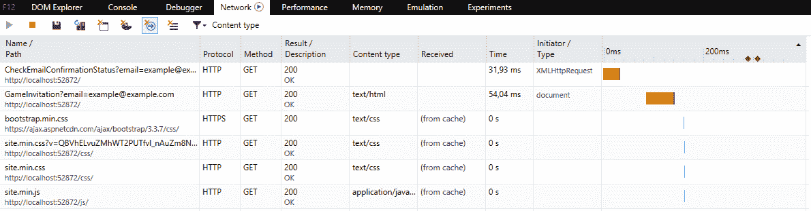

好了，现在我们知道了如何实现客户端并从现代 web 应用程序开发中的捆绑和缩小中获益，让我们回到 Tic-Tac-Toe 游戏，进一步优化它，并添加缺少的组件。

首先，我们将研究如何使用 Web 套接字进行实时通信。

# 使用 WebSocket 实现实时通信场景

在上一节结束时，一切都是完全自动化的，正如预期的那样。然而，仍有一些改进的余地。

实际上，客户端定期向服务器端发送请求，以查看电子邮件确认状态是否已更改。这可能会导致大量请求，以查看是否有状态更改。

此外，服务器端无法在确认电子邮件后立即通知客户端，因为它必须等待客户端请求响应。

在本节中，您将了解 WebSocket（[的概念 https://docs.microsoft.com/en-us/aspnet/core/fundamentals/websockets](https://docs.microsoft.com/en-us/aspnet/core/fundamentals/websockets) ）以及它们将如何让您进一步优化客户端实现。

WebSocket 通过 TCP 实现持久的双向通信通道，这对于需要运行实时通信场景（聊天、股票行情、游戏等）的应用程序来说尤其有趣。碰巧我们的示例应用程序是一个游戏，它是一种主要的应用程序类型，主要得益于直接使用套接字连接。

Note that you could also consider SignalR as an alternative. SignalR provides a better solution for real-time communication scenarios and encapsulates some of the functionalities that are missing from WebSockets that we may have implemented manually.

我们将在下一章介绍信号机，即[第 6 章](06.html)*介绍剃须刀组件和信号机*。

# 正在运行的 WebSockets

让我们通过使用 WebSocket 进行实时通信来优化 Tic Tac Toe 应用程序的客户端实现：

1.  转到`Configure`方法中的 Tic Tac Toe`Startup`类，在通信中间件和 MVC 中间件之前添加 WebSockets 中间件（请记住，中间件调用顺序对于确保正确的行为非常重要）：

```cs
        app.UseWebSockets(); 
        app.UseCommunicationMiddleware(); 
        ... 
```

2.  更新通信中间件，新增两种方式，第一种为`SendStringAsync`，如下：

```cs
   private static Task SendStringAsync(WebSocket socket,
        string data, CancellationToken ct = 
         default(CancellationToken)) 
       { 
         var buffer = Encoding.UTF8.GetBytes(data); 
         var segment = new ArraySegment<byte>(buffer); 
         return socket.SendAsync(segment, WebSocketMessageType.Text,
          true, ct); 
       } 

```

第二个为`ReceiveStringAsync`，用于 WebSocket 通信：

```cs
private static async Task<string> ReceiveStringAsync(
  WebSocket socket, CancellationToken ct = 
    default(CancellationToken)) 
       { 
         var buffer = new ArraySegment<byte>(new byte[8192]); 
         using (var ms = new MemoryStream())   { 
           WebSocketReceiveResult result; 
           do 
           { ct.ThrowIfCancellationRequested(); 
             result = await socket.ReceiveAsync(buffer, ct); 
             ms.Write(buffer.Array, buffer.Offset, result.Count);  }

           while (!result.EndOfMessage);  
           ms.Seek(0, SeekOrigin.Begin); 
           if (result.MessageType != WebSocketMessageType.Text) 
             throw new Exception("Unexpected message"); 

           using (var reader = new StreamReader(ms, Encoding.UTF8)) 
           {  return await reader.ReadToEndAsync();   } 
         } 
       } 
```

3.  更新通信中间件，增加一个新的方法`ProcessEmailConfirmation`用于通过 WebSocket 进行电子邮件确认处理：

```cs
public async Task ProcessEmailConfirmation(HttpContext context, WebSocket currentSocket, CancellationToken ct, string email)

   { 
   UserModel user = await _userService.GetUserByEmail(email); 
   while (!ct.IsCancellationRequested && 
    !currentSocket.CloseStatus.HasValue &&
           user?.IsEmailConfirmed == false)    { 
            if (user.IsEmailConfirmed)  
              await SendStringAsync(currentSocket, "OK", ct);  
            else 
            { user.IsEmailConfirmed = true; 
              user.EmailConfirmationDate = DateTime.Now;  
              await _userService.UpdateUser(user); 
              await SendStringAsync(currentSocket, "OK", ct);   } 

            Task.Delay(500).Wait(); 
            user = await _userService.GetUserByEmail(email); 
          } 
        } 
```

4.  更新通信中间件中的`Invoke`方法，并从上一步添加对 WebSocket 特定方法的调用，同时仍保留不支持 WebSocket 的浏览器的标准实现：

```cs
public async Task Invoke(HttpContext context) { 
  if (context.WebSockets.IsWebSocketRequest) 
    { 
      var webSocket = await context.WebSockets.
        AcceptWebSocketAsync(); 
      var ct = context.RequestAborted; 
      var json = await ReceiveStringAsync(webSocket, ct); 
      var command = JsonConvert.DeserializeObject<dynamic>(json); 

      switch (command.Operation.ToString()) { 
         case "CheckEmailConfirmationStatus": 
          {await ProcessEmailConfirmation(context, webSocket,
             ct, command.Parameters.ToString()); 
                break;     } 
       } 
          } 
   else if (context.Request.Path.Equals("/CheckEmailConfirmationStatus")) 
          //... keep the rest of the method as it was
}  
```

5.  修改`scripts1.js`文件并添加一些特定于 WebSocket 的代码，用于打开和使用套接字：

```cs
        var interval; 
        function EmailConfirmation(email) { 
          if (window.WebSocket) { 
            alert("Websockets are enabled"); 
            openSocket(email, "Email"); 
          } 
          else { 
            alert("Websockets are not enabled"); 
            interval = setInterval(() => { 
              CheckEmailConfirmationStatus(email); 
            }, 5000); 
          } 
        } 
```

6.  修改`scripts2.js`文件，但保持`CheckEmailConfirmationStatus`功能不变。添加一些特定于 WebSocket 的代码，用于打开和使用套接字，如果用户的电子邮件已被确认，还可以将用户重定向到游戏邀请页面：

```cs

 var openSocket = function (parameter, strAction) { 
   if (interval !== null) clearInterval(interval); 

   var protocol = location.protocol === "https:" ?  "wss:" : "ws:"; 
   var operation = "";    var wsUri = ""; 

   if (strAction == "Email") { 
      wsUri = protocol + "//" + window.location.host
       + "/CheckEmailConfirmationStatus"; 
      operation = "CheckEmailConfirmationStatus";         } 

   var socket = new WebSocket(wsUri); 
      socket.onmessage = function (response) { 
        console.log(response); 
      if (strAction == "Email" && response.data == "OK") { 
             window.location.href = "/GameInvitation?email=" +   
              parameter;     }  }; 

   socket.onopen = function () { 
           var json = JSON.stringify({  "Operation": operation, 
            "Parameters": parameter   });  
           socket.send(json);        }; 

  socket.onclose = function (event) {   }; 
};
```

7.  当您启动应用程序并继续进行用户注册时，如果支持 WebSocket，您将获得必要的信息。如果是，您将像以前一样被重定向到游戏邀请页面，但处理时间要快得多：

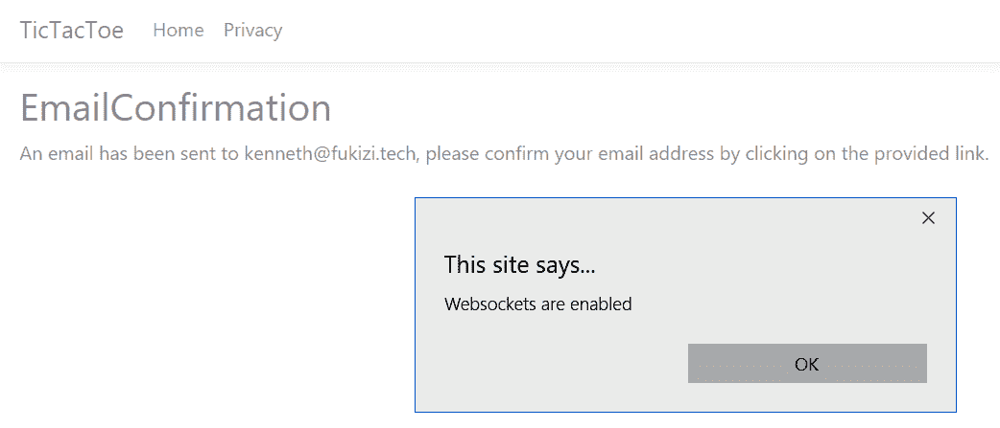

现在，我们在 ASP.NET Core 3 下对客户端开发和优化的研究到此结束。现在，您将学习如何使用其他 ASP.NET 核心概念进一步扩展和完成 Tic Tac Toe 应用程序，这些概念将帮助您在日常工作中构建多语言、支持生产的 web 应用程序。

随着 web 应用程序变得越来越繁忙，我们可能希望尽量减少不必要的往返，这些往返请求的数据可以保留一段时间用于检索和使用。让我们通过介绍会话和用户缓存管理来了解如何做到这一点。

# 利用会话和用户缓存管理

作为一名 web 开发人员，您可能知道 HTTP 是一种无状态协议，这意味着，默认情况下，不存在会话的概念。每个请求都是独立处理的，不同的请求之间不保留任何值。

尽管如此，处理数据有不同的方法。您可以使用查询字符串、提交表单数据，也可以使用 cookie 在客户端上存储数据。然而，所有这些机制或多或少都是手动的，需要自己管理。

如果您是经验丰富的 ASP.NET 开发人员，您将熟悉会话状态和会话变量的概念。这些变量存储在 web 服务器上，您可以在不同的用户请求期间访问它们，以便有一个中心位置来存储和接收数据。会话状态非常适合于存储特定于会话的用户数据，而不需要永久持久性。

Note that it is good practice to not store any sensitive data in session variables due to security reasons. Users might not close their browsers; thus, session cookies might not be cleared (also, some browsers keep session cookies alive).

Also, a session might not be restricted to a single user, so other users might continue with the same session, which could cause security risks.

ASP.NET Core 3 通过使用专用的会话中间件提供会话状态和会话变量。基本上，有两种不同类型的会话提供程序：

*   内存中会话提供程序（本地到单个服务器）
*   分布式会话提供程序（在多台服务器之间共享）

# 内存会话提供程序

让我们了解如何在 Tic Tac Toe 应用程序中激活内存会话提供程序，以存储用户界面的区域性和语言：

1.  打开`Views\Shared\_Layout.cshtml`文件中的布局页面，并在主导航菜单中添加新的用户界面语言下拉列表。这将放置在其他菜单项之后。这将允许用户在英语和法语之间进行选择：

```cs
        <li class="dropdown">
          <a class="dropdown-toggle" data-toggle="dropdown" 
            href="#">Settings<span class="caret"></span></a>
          <ul class="dropdown-menu multi-level">
            <li class="dropdown-submenu">
              <a class="dropdown-toggle" data-toggle="dropdown"
               href="#">Select your language (@ViewBag.Language)
               <span class="caret"></span></a>
              <ul class="dropdown-menu">
                <li @(ViewBag.Language == "EN" ? "active" : "")>
                  <a asp-controller="Home" asp-action="SetCulture"
                   asp-route-culture="EN">English</a></li>
                <li @(ViewBag.Language == "FR" ? "active" : "")>
                  <a asp-controller="Home" asp-action="SetCulture"
                   asp-route-culture="FR">French</a></li>
              </ul>
            </li>
          </ul>
        </li>
```

2.  打开`HomeController`并添加一个名为`SetCulture`的新方法。这将包含用于在会话变量中存储用户区域性设置的代码：

```cs
using Microsoft.AspNetCore.Http;        
public IActionResult SetCulture(string culture) 
{ 
  Request.HttpContext.Session.SetString("culture", culture); 
  return RedirectToAction("Index"); 
} 
```

3.  更新`HomeController`的`Index`方法，以便从文化会话变量中检索文化：

```cs
        public IActionResult Index() 
        { 
          var culture =
            Request.HttpContext.Session.GetString("culture"); 
          ViewBag.Language = culture; 
          return View(); 
        } 
```

4.  转到`wwwroot/css/site.css`文件，添加一些新的 CSS 类，以更现代的方式查看用户界面语言下拉列表，首先查看相对位置，然后查看不同的浏览器和鼠标悬停：

```cs
.dropdown-submenu { 
          position: relative; 
        } 

        .dropdown-submenu > .dropdown-menu { 
          top: 0; 
          left: 100%; 
          margin-top: -6px; 
          margin-left: -1px; 
          -webkit-border-radius: 0 6px 6px 6px; 
          -moz-border-radius: 0 6px 6px; 
          border-radius: 0 6px 6px 6px; 
        } 

        .dropdown-submenu:hover > .dropdown-menu { 
          display: block; 
        } 
```

在`site.css`中通过添加以下样式执行相同操作：

```cs
        .dropdown-submenu > a:after { 
          display: block; 
          content: " "; 
          float: right; 
          width: 0; 
          height: 0; 
          border-color: transparent; 
          border-style: solid; 
          border-width: 5px 0 5px 5px; 
          border-left-color: #ccc; 
          margin-top: 5px; 
          margin-right: -10px; 
        } 

        .dropdown-submenu:hover > a:after { 
          border-left-color: #fff; 
        } 
```

最后，添加以下代码段：

```cs

        .dropdown-submenu.pull-left { 
          float: none; 
        } 

        .dropdown-submenu.pull-left > .dropdown-menu { 
          left: -100%; 
          margin-left: 10px; 
          -webkit-border-radius: 6px 0 6px 6px; 
          -moz-border-radius: 6px 0 6px 6px; 
          border-radius: 6px 0 6px 6px; 
        } 
```

5.  将 ASP.NET Core 3 内置的会话中间件添加到`Startup`类的`ConfigureServices`方法中：

```cs
        services.AddSession(o => 
        { 
          o.IdleTimeout = TimeSpan.FromMinutes(30); 
        });
```

6.  在`Startup`类的`Configure`方法中激活会话中间件，将其添加到静态文件中间件之后：

```cs
        app.UseStaticFiles(); 
        app.UseSession(); 
```

7.  通过设置 email session 变量更新`GameInvitationController`中的`Index`方法，如下所示：

```cs
        [HttpGet] 
        public async Task<IActionResult> Index(string email) 
        { 
            var gameInvitationModel = new GameInvitationModel {
              InvitedBy = email }; 
            HttpContext.Session.SetString("email", email); 
            return View(gameInvitationModel); 
        }
```

8.  按*F5 启动应用程序。*您应该看到新的用户界面语言下拉列表，其中包含英语和法语选项：


在这里，我们使用了内存中的会话提供程序，但有一种不同类型的会话提供程序在其他场景中工作良好，称为分布式会话提供程序。我们将在下一节中介绍这一点。

# 分布式会话提供程序

到目前为止，您已经了解了如何激活和使用会话状态。然而，在大多数情况下，您将拥有多个 web 服务器，而不仅仅是一个，特别是在今天的云环境中。那么，如何将会话状态从内存中存储到分布式缓存中呢？

好吧，这很简单——你只需要在`Startup`类中注册额外的服务。这些附加服务将提供此功能。以下是一些例子：

*   **分布式内存缓存**：

```cs
        services.AddDistributedMemoryCache(); 
```

*   **分布式 SQL Server 缓存**：

```cs
        services.AddDistributedSqlServerCache(o => 
        { 
          o.ConnectionString = _configuration["DatabaseConnection"]; 
          o.SchemaName = "dbo"; 
          o.TableName = "sessions"; 
        }); 
```

*   **分布式 Redis 缓存**：

```cs
        services.AddDistributedRedisCache(o => 
        { 
          o.Configuration = _configuration["CacheRedis:Connection"]; 
          o.InstanceName = _configuration
            ["CacheRedis:InstanceName"]; 
        }); 
```

我们在本节中添加了一个新的用户界面语言下拉列表，但您还没有学会如何在应用程序中处理多种语言。没有时间可以浪费；让我们学习如何执行此操作，并使用下拉列表和会话变量动态更改用户界面语言。

# 在多语言用户界面中应用全球化和本地化

有时，您的应用程序取得了成功，有时甚至取得了相当大的成功，因此您希望在国际上向更广泛的受众提供这些应用程序，并在更大范围内部署它们。但是，您不可能轻松做到这一点，因为您从一开始就没有考虑过本地化应用程序，现在您必须修改已经运行的应用程序，这可能会带来回归和不稳定的风险。

不要落入这个陷阱！从一开始就考虑您的目标受众和未来的部署策略！

本地化应用程序应该从项目一开始就考虑，特别是因为使用 ASP.NET Core 3 框架时，本地化非常容易和直接。它为此提供了现有的服务和中间件。

构建支持不同语言和文化的应用程序以进行显示、输入和输出称为**全球化**，而将全球化应用程序适应特定文化则称为本地化。

有三种不同的方法可以本地化 ASP.NET Core 3 web 应用程序：

*   字符串定位器
*   视图定位器
*   本地化数据注释

让我们更详细地看一下这些概念。

# 全球化和本地化概念

在本节中，您将了解全球化和本地化的概念，以及它们如何让您进一步优化网站以实现国际化。

For additional information on globalization and localization, please visit [https://docs.microsoft.com/en-us/aspnet/core/fundamentals/localization](https://docs.microsoft.com/en-us/aspnet/core/fundamentals/localization).

那么，你是如何开始的呢？首先，让我们看看如何使用字符串定位器使 Tic-Tac-Toe 应用程序可本地化：

1.  转到`Services`文件夹并添加名为`CultureProviderResolverService`的新服务。这将通过查看`Culture`查询字符串、`Culture`cookie 和`Culture`会话变量（在本章上一节中创建）来检索区域性集。
2.  通过继承`RequestCultureProvider`并覆盖其具体方法来实现`CultureProviderResolverService`：

```cs
        public class CultureProviderResolverService :  
            RequestCultureProvider 
        { 
          private static readonly char[] _cookieSeparator = 
            new[] {'|' }; 
          private static readonly string _culturePrefix = "c="; 
          private static readonly string _uiCulturePrefix = "uic="; 
           //...          
        } 
```

3.  将`DetermineProviderCultureResult`方法添加到`CultureProviderResolverService`类中：

```cs
public override async Task<ProviderCultureResult> 
           DetermineProviderCultureResult(HttpContext httpContext) 
          { 
            if (GetCultureFromQueryString(httpContext,
             out string culture)) 
            return new ProviderCultureResult(culture, culture); 

            else if (GetCultureFromCookie(httpContext, out culture)) 
            return new ProviderCultureResult(culture, culture); 

            else if (GetCultureFromSession(httpContext, out 
            culture)) 
            return new ProviderCultureResult(culture, culture); 

            return await NullProviderCultureResult; 
          } 
```

4.  添加以下方法，可以从查询字符串中获取`Culture`：

```cs
private bool GetCultureFromQueryString(   HttpContext httpContext, out string culture) 
          { 
            if (httpContext == null) 
            { 
              throw new ArgumentNullException(nameof(httpContext)); 
            } 

            var request = httpContext.Request; 
            if (!request.QueryString.HasValue) 
            { 
              culture = null; 
              return false; 
            } 

            culture = request.Query["culture"]; 
            return true; 
          } 
```

5.  添加以下方法，允许我们从 Cookie 中获取`Culture`：

```cs
private bool GetCultureFromCookie(HttpContext httpContext, out 
    string culture) 
          { 
            if (httpContext == null) 
            { 
              throw new ArgumentNullException(nameof(httpContext)); 
            } 

            var cookie = httpContext.Request.Cookies["culture"]; 
            if (string.IsNullOrEmpty(cookie)) 
            { 
              culture = null; 
              return false; 
            } 

            culture = ParseCookieValue(cookie); 
            return !string.IsNullOrEmpty(culture); 
          } 
```

6.  下面是我们将用来解析 cookie 值的方法：

```cs
public static string ParseCookieValue(string value) 
{ 
  if (string.IsNullOrWhiteSpace(value))   return null;             
  var parts = value.Split(_cookieSeparator, 
    StringSplitOptions.RemoveEmptyEntries); 
  if (parts.Length != 2)  return null; 

  var potentialCultureName = parts[0]; 
  var potentialUICultureName = parts[1]; 

  if (!potentialCultureName.StartsWith(_culturePrefix) ||
             !potentialUICultureName.StartsWith(_uiCulturePrefix)) return null; 

  var cultureName = potentialCultureName.
    Substring(_culturePrefix.Length); 
  var uiCultureName = potentialUICultureName.Substring
    (_uiCulturePrefix.Length); 
  if (cultureName == null && uiCultureName == null) return null; 
  if (cultureName != null && uiCultureName == null) uiCultureName = 
    cultureName; 

  if (cultureName == null && uiCultureName != null)  cultureName = uiCultureName; 
 return cultureName; 
} 
```

7.  现在，添加以下方法，允许我们从会话中获取`Culture`：

```cs
private bool GetCultureFromSession(HttpContext httpContext,
      out string culture) 
{ 
  culture = httpContext.Session.GetString("culture");
  return !string.IsNullOrEmpty(culture); 
} 
```

8.  在`Startup`类中`ConfigureServices`方法顶部增加本地化服务：

```cs
        public void ConfigureServices(IServiceCollection services) 
        { 
          services.AddLocalization(options => options.
            ResourcesPath = "Localization"); 
          //... 
        } 
```

9.  将本地化中间件添加到`Startup`类中的`Configure`方法中，并定义支持的区域性。

请注意，正如您已经看到的，添加中间件的顺序很重要。您必须在 MVC 中间件之前添加本地化中间件：

```cs
        ... 
        var supportedCultures =
          CultureInfo.GetCultures(CultureTypes.AllCultures); 
        var localizationOptions = new RequestLocalizationOptions 
        { 
          DefaultRequestCulture = new RequestCulture("en-US"), 
          SupportedCultures = supportedCultures, 
          SupportedUICultures = supportedCultures 
        }; 

        localizationOptions.RequestCultureProviders.Clear(); 
        localizationOptions.RequestCultureProviders.Add(new 
         CultureProviderResolverService()); 

        app.UseRequestLocalization(localizationOptions); 

        app.UseMvc(...);
```

请注意，您可以使用不同的方法更改应用程序的区域性：

*   **查询字符串**：**在 URI 中提供区域性**
***   **曲奇**：将培养物储存在曲奇中*   **浏览器**：浏览器页面语言设置*   **定制**：实现您自己的提供者（如本例所示）**

 **10.  在解决方案资源管理器中，添加名为`Localization`的新文件夹（将用于存储资源文件）并创建名为`Controllers`的子文件夹。然后，在此文件夹中添加一个名为`GameInvitationController.resx`的新资源文件：

Note that you can put your resource files either into subfolders (for example, `Controllers`, `Views`, and so on) or directly name your files accordingly (for example, `Controllers.GameInvitationController.resx`, `Views.Home.Index.resx`, and so on). However, we advise that you use the folder approach for clarity, readability, and better organization of your files.


If you see errors while using your resource files with .NET Core, right-click on each file and select Properties. Then, check each file to ensure that the Build Action is set to Content instead of Embedded Resource. These are bugs that should have been fixed by the final release, but if they haven't you can use this handy workaround to make everything work as expected.

11.  打开`GameInvitationController.resx`资源文件，新增英文`GameInvitationConfirmationMessage`：


12.  在同一个`Controllers`文件夹中，为法语翻译添加一个名为`GameInvitationController.fr.resx`的新资源文件：


13.  转至`GameInvitationController`，添加`stringLocalizer`，并更新构造函数实现：

```cs
        private IStringLocalizer<GameInvitationController>
         _stringLocalizer; 
        private IUserService _userService; 
        public GameInvitationController(IUserService userService,
         IStringLocalizer<GameInvitationController> stringLocalizer) 
        { 
          _userService = userService; 
          _stringLocalizer = stringLocalizer; 
        } 
```

14.  在`GameInvitationController`中增加一个新的`Index`方法。这将返回本地化消息，具体取决于应用程序区域设置：

```cs
        [HttpPost] 
        public IActionResult Index(
         GameInvitationModel gameInvitationModel) 
        {   
          return Content(_stringLocalizer[
          "GameInvitationConfirmationMessage",
           gameInvitationModel.EmailTo]); 
        } 
```

15.  以英语（默认区域性）启动应用程序并注册新用户，直到您收到以下文本消息，该文本消息应为英语：


16.  使用“用户界面语言”下拉列表将应用程序语言更改为法语。然后，注册一个新用户，直到您收到以下文本消息（现在应该是法语），如以下屏幕截图所示：


在本节中，您学习了如何在应用程序中本地化任何类型的字符串，这对于某些特定的应用程序用例都很有用。但是，在使用视图时，这不是推荐的方法。

# 使用视图定位器

ASP.NET Core 3 框架提供了一些用于本地化视图的强大功能。您将在以下示例中使用视图定位器方法：

1.  更新`Startup`类中的`ConfigureServices`方法，将视图本地化服务添加到 MVC 服务声明中：

```cs
        services.AddMvc().AddViewLocalization(
          LanguageViewLocationExpanderFormat.Suffix,
          options => options.ResourcesPath = "Localization"); 
```

2.  修改`Views/ViewImports.cshtml`文件并添加视图定位器功能，使其可用于所有视图：

```cs
        @using Microsoft.AspNetCore.Mvc.Localization 
        @inject IViewLocalizer Localizer 
```

3.  打开主页视图并添加新标题，该标题将进一步本地化，如下所示：

```cs
        <h2>@Localizer["Title"]</h2> 
```

4.  在解决方案资源管理器中，转到`Localization`文件夹并创建名为`Views`的子文件夹。然后，将两个名为`Home.Index.resx`和`Home.Index.fr.resx`的新资源文件添加到此文件夹：


5.  打开`Home.Index.resx`文件，为英文标题添加条目：

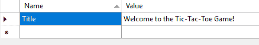

6.  打开`Home.Index.fr.resx`文件，为法文标题添加条目：

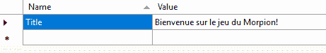

7.  启动应用程序并将用户界面语言下拉列表设置为英语：


8.  使用用户界面**e La**语言下拉列表将应用程序语言更改为法语。标题现在应以法语显示：

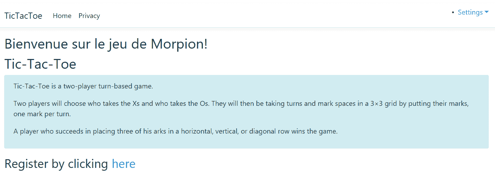

在本节中，您已经了解了如何轻松地本地化视图，但是如何本地化视图中使用数据注释的表单？让我们更详细地看一下这一点；您会惊讶于 ASP.NET Core 3 框架所提供的功能！

# 本地化数据注释

我们将在以下示例中完全本地化用户注册表单：

1.  在解决方案资源管理器中，转到`Localization/Views`文件夹，添加两个名为`UserRegistration.Index.resx`和`UserRegistration.Index.fr.resx`的新资源文件。
2.  打开`UserRegistration.Index.resx`文件，添加一个`Title`和一个`SubTitle`元素，并提供英文翻译：


3.  打开`UserRegistration.Index.fr.resx`文件，添加一个具有法语翻译的`Title`和`SubTitle`元素：

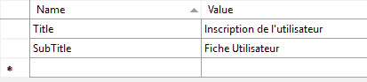

4.  更新用户注册索引视图，使其使用视图定位器：

```cs
        @model TicTacToe.Models.UserModel 
        @{ 
           ViewData["Title"] = Localizer["Title"]; 
        } 
        <h2>@ViewData["Title"]</h2> 
        <h4>@Localizer["SubTitle"]</h4> 
        <hr /> 
        <div class="row"> 
        ... 
```

5.  启动应用程序，使用“用户界面语言”下拉列表将语言设置为法语，然后转到“用户注册”页面。标题应以法语显示。单击“创建”，而不在输入字段中输入任何内容，然后查看发生了什么：


这里少了一些东西。您已经为页面标题以及用户注册页面的副标题添加了本地化，但是我们仍然缺少表单的一些本地化。但我们错过了什么？

您应该亲眼看到错误消息尚未本地化和翻译。我们使用数据注释框架进行错误处理和表单验证，那么如何本地化数据注释验证错误消息呢？这就是我们现在要看的：

1.  将数据注释本地化服务添加到`Startup`类的`ConfigureServices`方法中的 MVC 服务声明中：

```cs
        services.AddMvc().AddViewLocalization(
          LanguageViewLocationExpanderFormat.Suffix, options =>
          options.ResourcesPath = "Localization") 
          .AddDataAnnotationsLocalization();
```

2.  转到`Localization`文件夹并创建名为`Models`的子文件夹。然后，添加两个名为`UserModel.resx`和`UserModel.fr.resx`的新资源文件。
3.  用英文翻译更新`UserModel.resx`文件：


4.  接下来，用法语翻译更新`UserModel.fr.resx`文件：

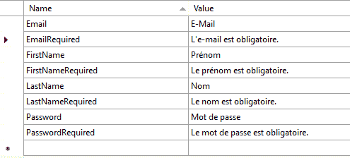

5.  转到 Models 文件夹并更新`FirstName`、`LastName`、`Email`和`Password`字段的`UserModel`实现，以便您可以使用前面的资源文件：

```cs
         ...
          [Display(Name = "FirstName")] 
          [Required(ErrorMessage = "FirstNameRequired")] 
          public string FirstName { get; set; } 

          [Display(Name = "LastName")] 
          [Required(ErrorMessage = "LastNameRequired")] 
          public string LastName { get; set; } 

          [Display(Name = "Email")] 
          [Required(ErrorMessage = "EmailRequired"),   
            DataType(DataType.EmailAddress)]         
          [EmailAddress] 
          public string Email { get; set; } 

          [Display(Name = "Password")] 
          [Required(ErrorMessage = "PasswordRequired"),  
            DataType(DataType.Password)]         
          public string Password { get; set; } 
        ...
```

6.  重新生成解决方案并启动应用程序。当我们将用户界面语言更改为法语时，您将看到整个用户注册页面（包括错误消息）被完全翻译：


在本节中，您学习了如何使用数据注释本地化字符串、视图甚至错误消息。为此，您使用了 ASP.NET Core 3 的内置功能，因为它们包含用于开发多语言本地化 web 应用程序的所有内容。下一节将向您介绍如何配置应用程序和服务。

# 配置应用程序和服务

在前面的部分中，您已经通过向用户注册过程中添加缺少的组件，甚至对 Tic-Tac-Toe 应用程序的某些部分进行了本地化而取得了进展。但是，您总是通过在代码中以编程方式设置用户确认来模拟确认电子邮件。在本节中，我们将修改此部分，以便真正向新注册的用户发送电子邮件，并使所有内容完全可配置。

# 添加电子邮件服务

首先，您将添加一个新的电子邮件服务，用于向刚在网站上注册的用户发送电子邮件。让我们开始：

1.  在`Services`文件夹中，添加一个名为`EmailService`的新服务，并实现一个默认的`SendEmail`方法，我们稍后会更新：

```cs
        public class EmailService 
        { 
          public Task SendEmail(string emailTo, string subject,
           string message) 
          { 
            return Task.CompletedTask; 
          } 
        } 
```

2.  提取`IEmailService`接口：


3.  将新的电子邮件服务添加到`Startup`类的`ConfigureServices`方法中（我们需要一个应用程序实例，所以将其添加为一个单实例）：

```cs
        services.AddSingleton<IEmailService, EmailService>(); 
```

4.  更新`UserRegistrationController`使其能够访问我们在上一步中创建的`EmailService`：

```cs
        readonly IUserService _userService; 
        readonly IEmailService _emailService; 
        public UserRegistrationController(IUserService userService,
         IEmailService emailService) 
        { 
          _userService = userService; 
          _emailService = emailService; 
        } 
```

5.  更新`UserRegistrationController`中的`EmailConfirmation`方法，在`var user=await _userService.GetUserByEmail(email);`和`user?.IsEmailConfirmed`条件语句检查之间插入以下代码，调用`EmailService`的`SendEmail`方法：

```cs
          var user = await _userService.GetUserByEmail(email); 
          var urlAction = new UrlActionContext 
          { 
            Action = "ConfirmEmail", 
            Controller = "UserRegistration", 
            Values = new { email }, 
            Protocol = Request.Scheme, 
            Host = Request.Host.ToString() 
          }; 

          var message = $"Thank you for your registration on
             our website, please click here to confirm your
             email " +   $"
            {Url.Action(urlAction)}";

          try 
          { 
            _emailService.SendEmail(email,
             "Tic-Tac-Toe Email Confirmation", message).Wait(); 
          } 
          catch (Exception e)    {    } 
```

很好–您现在有一个电子邮件服务，但您还没有完成。您需要能够配置服务，以便可以设置特定于环境的参数（SMTP 服务器名称、端口、SSL 等），然后发送电子邮件。

# 配置电子邮件服务

您将来创建的几乎所有服务都将具有某种配置，应该可以从代码外部进行配置。

为此，ASP.NET Core 3 有一个内置的配置 API。它提供了在应用程序运行时从多个源读取配置数据的各种功能。*名称-值*对用于配置数据持久化，可分为多级层次结构。此外，配置数据可以自动反序列化为包含私有成员和属性的**普通旧 CLR 对象**（**POCO**。

ASP.NET Core 3 支持以下配置源：

*   配置文件（JSON、XML 甚至经典 INI 文件）
*   环境变量
*   命令行参数
*   内存中的.NET 对象
*   加密用户存储
*   Azure 密钥保险库
*   自定义提供者

For more information about the Configuration API, please visit [https://docs.microsoft.com/en-us/aspnet/core/fundamentals/configuration?tabs=basicconfiguration](https://docs.microsoft.com/en-us/aspnet/core/fundamentals/configuration?tabs=basicconfiguration).

让我们了解如何通过使用带有 JSON 配置文件的 ASP.NET Core 3 配置 API 快速配置电子邮件服务：

1.  将新的`appsettings.json`配置文件添加到项目中，并添加以下自定义部分。这将用于配置电子邮件服务：

```cs
        "Email": { 
          "MailType": "SMTP", 
          "MailServer": "localhost", 
          "MailPort": 25, 
          "UseSSL": false, 
          "UserId": "", 
          "Password": "", 
          "RemoteServerAPI": "", 
          "RemoteServerKey": "" 
        } 
```

2.  在解决方案资源管理器中，在项目根目录下创建一个名为`Options`的新文件夹。在此文件夹中添加一个名为`EmailServiceOptions`的新 POCO 类，并为我们之前看到的选项实现一些私有成员和公共属性：

```cs
public class EmailServiceOptions 
{ 
  private string MailType { get; set; } 
  private string MailServer { get; set; } 
  private string MailPort { get; set; } 
  private string UseSSL { get; set; } 
  private string UserId { get; set; } 
  private string Password { get; set; } 
  private string RemoteServerAPI { get; set; } 
  private string RemoteServerKey { get; set; } 

  public EmailServiceOptions()  {  } 

  public EmailServiceOptions(string mailType, string mailServer, 
    string mailPort, string useSSL,
           string userId, string password, string 
            remoteServerAPI,string remoteServerKey)  { 
            MailType = mailType; 
            MailServer = mailServer; 
            MailPort = mailPort; 
            UseSSL = useSSL; 
            UserId = userId; 
            Password = password; 
            RemoteServerAPI = remoteServerAPI; 
            RemoteServerKey = remoteServerKey;        } 
}  
```

3.  更新`EmailService`实现，添加`EmailServiceOptions`，并在类中添加参数化构造函数：

```cs
        private EmailServiceOptions _emailServiceOptions; 
        public EmailService(IOptions<EmailServiceOptions> 
         emailServiceOptions) 
        { 
          _emailServiceOptions = emailServiceOptions.Value; 
        } 
```

4.  将新构造函数添加到`Startup`类中，以便您可以配置电子邮件服务：

```cs
        public IConfiguration _configuration { get; } 
        public Startup(IConfiguration configuration) 
        { 
          _configuration = configuration; 
        } 
```

5.  更新`Startup`类的`ConfigureServices`方法：

```cs
        services.Configure<EmailServiceOptions>
            (_configuration.GetSection("Email")); 
        services.AddSingleton<IEmailService, EmailService>(); 
```

6.  更新`EmailService`中的`SendEmail`方法。使用电子邮件服务选项从配置文件中检索设置，如下所示：

```cs
        public Task SendEmail(string emailTo, string
         subject, string message) 
        { 
          using (var client =
            new SmtpClient(_emailServiceOptions.MailServer,
            int.Parse(_emailServiceOptions.MailPort))) 
          { 
            if (bool.Parse(_emailServiceOptions.UseSSL) == 
             true)client.EnableSsl = true; 

            if (!string.IsNullOrEmpty(_emailServiceOptions.UserId)) 
              client.Credentials =
                new NetworkCredential(_emailServiceOptions.UserId,
                 _emailServiceOptions.Password); 

              client.Send(new MailMessage("example@example.com",
                emailTo, subject, message)); 
          } 
          return Task.CompletedTask; 
        } 
```

7.  将断点放入`EmailService`构造函数，按*F5*以调试模式启动应用程序。现在，验证是否已从配置文件中正确检索电子邮件服务选项值。如果您有 SMTP 服务器，还可以验证电子邮件是否确实已发送：

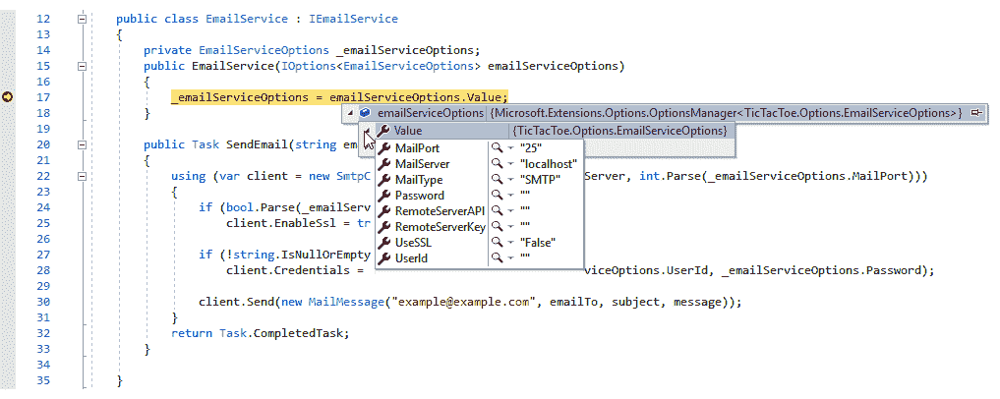

在本节中，您学习了如何通过使用 ASP.NET Core 3 的内置配置 API 来配置应用程序和服务，该 API 允许您编写更少的代码并提高生产效率，同时提供了一个更优雅、更易于维护的解决方案。

ASP.NET Core 3 帮助我们拥有可维护代码的另一个特性是其固有的**依赖注入**（**DI**功能。在其他优点中，DI 确保类之间没有太多耦合。在下一节中，我们将在 ASP.NETCore3 的上下文中研究 DI。

# 实现高级依赖注入概念

在上一章中，您了解了 DI 是如何工作的，以及如何使用构造函数注入方法。然而，如果您需要在运行时注入许多实例，此方法可能会非常麻烦，并且会使理解和维护代码变得复杂。

因此，您可以使用一种更先进的 DI 技术，称为**方法注入**。这允许您直接从代码中访问实例。

# 方法注入

在下面的示例中，您将添加一个新的服务，用于处理游戏邀请和更新 Tic-Tac-Toe 应用程序。这有助于电子邮件通信，用于联系其他用户加入游戏，同时使用方法注入：

1.  在`Services`文件夹中添加名为`GameInvitationService`的新服务，用于管理游戏邀请（添加、更新、删除等）：

```cs
public class GameInvitationService 
{ 
  private static ConcurrentBag<GameInvitationModel>  
    _gameInvitations; 
  public GameInvitationService(){ _gameInvitations = new ConcurrentBag<GameInvitationModel>();} 

  public Task<GameInvitationModel> Add(GameInvitationModel  
    gameInvitationModel) 
  {  gameInvitationModel.Id = Guid.NewGuid(); 
    _gameInvitations.Add(gameInvitationModel); 
    return Task.FromResult(gameInvitationModel); } 
  public Task Update(GameInvitationModel gameInvitationModel) 
  { _gameInvitations = new ConcurrentBag<GameInvitationModel>
       (_gameInvitations.Where(x => x.Id != gameInvitationModel.Id)) 
           {  gameInvitationModel  }; 
    return Task.CompletedTask;  } 

  public Task<GameInvitationModel> Get(Guid id) 
  {  return Task.FromResult(_gameInvitations.FirstOrDefault(x => 
    x.Id == id)); } 
}
```

2.  提取`IGameInvitationService`接口：


3.  将新的游戏邀请服务添加到`Startup`类的`ConfigureServices`方法中（我们需要一个应用实例，所以将其添加为一个单实例）：

```cs
        services.AddSingleton<IGameInvitationService, 
         GameInvitationService>(); 
```

4.  更新`GameInvitationController`中的`Index`方法，并使用`RequestServices`提供者通过方法注入注入游戏邀请服务实例：

```cs

public IActionResult Index(GameInvitationModel gameInvitationModel, [FromServices]IEmailService emailService)
{
 var gameInvitationService = Request.HttpContext.RequestServices.GetService             <IGameInvitationService>();
  if (ModelState.IsValid) {
     emailService.SendEmail(gameInvitationModel.EmailTo,
     _stringLocalizer["Invitation for playing a Tic-Tac-Toe game"],
     _stringLocalizer[$"Hello, you have been invited to play the 
    Tic-Tac-Toe game by {0}. For joining the game, please 
    click here {1}", gameInvitationModel.InvitedBy,           
    Url.Action("GameInvitationConfirmation", GameInvitation",
     new { gameInvitationModel.InvitedBy, 
          gameInvitationModel.EmailTo }, Request.Scheme,  
            Request.Host.ToString())]);

  var invitation =  gameInvitationService.Add
    (gameInvitationModel).Result;
  return RedirectToAction("GameInvitationConfirmation",
     new { id = invitation.Id });   }
  return View(gameInvitationModel);
}
```

Don't forget to add the following using statement at the beginning of the class: `using Microsoft.Extensions.DependencyInjection;`, If you don't, the `.GetService<IGameInvitationService>();` method can't be used and you will get build errors.

5.  将名为`GameInvitationConfirmation`的新方法添加到`GameInvitationController`：

```cs
        [HttpGet] 
        public IActionResult GameInvitationConfirmation(Guid id,
         [FromServices]IGameInvitationService gameInvitationService) 
        { 
          var gameInvitation = gameInvitationService.Get(id).Result; 
          return View(gameInvitation); 
        } 
```

6.  为之前添加的`GameInvitationConfirmation`方法创建一个新视图。这将向用户显示一条等待消息：

```cs
        @model TicTacToe.Models.GameInvitationModel 
        @{ 
           ViewData["Title"] = "GameInvitationConfirmation"; 
           Layout = "~/Views/Shared/_Layout.cshtml"; 
        } 
        <h1>@Localizer["You have invited {0} to play
         a Tic-Tac-Toe game 
         with you, please wait until the user is connected",
         Model.EmailTo]</h1> 
        @section Scripts{ 
          <script> 
            $(document).ready(function () { 
              GameInvitationConfirmation('@Model.Id'); 
            }); 
          </script> 
        } 
```

7.  在`scripts1.js`文件中添加一个名为`GameInvitationConfirmation`的新方法。您可以使用与我们用于现有`EmailConfirmation`方法相同的基本结构：

```cs
        function GameInvitationConfirmation(id) { 
          if (window.WebSocket) { 
            alert("Websockets are enabled"); 
            openSocket(id, "GameInvitation"); 
          } 
          else { 
            alert("Websockets are not enabled"); 
            interval = setInterval(() => { 
              CheckGameInvitationConfirmationStatus(id); 
            }, 5000); 
          } 
        }
```

8.  将名为`CheckGameInvitationConfirmationStatus`的方法添加到`scripts2.js`文件中。您可以使用与我们用于现有`CheckEmailConfirmationStatus`方法相同的基本结构：

```cs
        function CheckGameInvitationConfirmationStatus(id) { 
          $.get("/GameInvitationConfirmation?id=" + id,
          function (data) { 
            if (data.result === "OK") { 
              if (interval !== null) 
                clearInterval(interval); 
              window.location.href = "/GameSession/Index/" + id; 
            } 
          }); 
        } 
```

9.  更新`scripts2.js`文件中的`openSocket`方法，增加具体的游戏邀请案例：

```cs
...
if (strAction == "Email") { 
  wsUri = protocol + "//" + window.location.host + "/CheckEmailConfirmationStatus"; 
  operation = "CheckEmailConfirmationStatus"; 
} 
else if (strAction == "GameInvitation") { 
  wsUri = protocol + "//" + window.location.host + "/GameInvitationConfirmation"; 
  operation = "CheckGameInvitationConfirmationStatus"; 
} 

var socket = new WebSocket(wsUri); 
socket.onmessage = function (response) { console.log(response); 
  if (strAction == "Email" && response.data == "OK") { 
    window.location.href = "/GameInvitation?email=" + parameter; 
  }else if (strAction == "GameInvitation") { 
    var data = $.parseJSON(response.data); 

  if (data.Result == "OK") window.location.href = "/GameSession/Index/" + data.Id; }  }; 
 ...

```

10.  在通信中间件中增加一个名为`ProcessGameInvitationConfirmation`的新方法。对于不支持此功能的浏览器，这将在不使用 WebSocket 的情况下处理游戏邀请请求：

```cs
private async Task ProcessGameInvitationConfirmation(HttpContext context) 
{ 
  var id = context.Request.Query["id"]; 
  if (string.IsNullOrEmpty(id))await context.
   Response.WriteAsync("BadRequest:Id is required"); 

  var gameInvitationService =  context.RequestServices.GetService
    <IGameInvitationService>(); 
  var gameInvitationModel =  await 
    gameInvitationService.Get(Guid.Parse(id)); 

  if (gameInvitationModel.IsConfirmed) await 
    context.Response.WriteAsync(
             JsonConvert.SerializeObject(new 
    { 
      Result = "OK", 
      Email = gameInvitationModel.InvitedBy, 
       gameInvitationModel.EmailTo 
    })); 
  else { 
         await context.Response.WriteAsync( 
          "WaitGameInvitationConfirmation"); 
       } 
 }
```

Don't forget to add the following using statement at the beginning of the class:
`using Microsoft.Extensions.DependencyInjection;`.

11.  向通信中间件添加一个名为`ProcessGameInvitationConfirmation`的新方法，该方法带有附加参数。这将处理游戏邀请请求，同时将 WebSocket 用于支持以下内容的浏览器：

```cs
private async Task ProcessGameInvitationConfirmation(HttpContext context,
       WebSocket webSocket, CancellationToken ct,
       string parameters) 
{ 
  var gameInvitationService = context.RequestServices.GetService
    <IGameInvitationService>(); 
  var id = Guid.Parse(parameters); 
  var gameInvitationModel = await gameInvitationService.Get(id); 
  while (!ct.IsCancellationRequested && !webSocket.
    CloseStatus.HasValue &&
                  gameInvitationModel?.IsConfirmed == false)  { 
               await SendStringAsync(webSocket,   JsonConvert.

    SerializeObject(new 
     { Result = "OK", 
       Email = gameInvitationModel.InvitedBy, 
        gameInvitationModel.EmailTo, 
              gameInvitationModel.Id  }), ct); 

       Task.Delay(500).Wait();  
       gameInvitationModel = await gameInvitationService.Get(id); 
      } 
} 
```

12.  更新通信中间件中的`Invoke`方法。从现在起，无论是否使用 WebSocket，这将适用于电子邮件确认和游戏邀请确认：

```cs
public async Task Invoke(HttpContext context) 
{ 
  if (context.WebSockets.IsWebSocketRequest) 
  { 
    ... 
    switch (command.Operation.ToString()) 
    { 
      ... 
      case "CheckGameInvitationConfirmationStatus": 
      { await 
          ProcessGameInvitationConfirmation(context,webSocket, ct,   
            command.Parameters.ToString()); 
                break; } 
     } 
  } 
  else if (context.Request.Path.Equals
    ("/CheckEmailConfirmationStatus")) 
  {  await ProcessEmailConfirmation(context);   } 
  else if (context.Request.Path.Equals
    ("/CheckGameInvitationConfirmationStatus")) 
  {  await ProcessGameInvitationConfirmation(context);  } 
  else   {  await _next?.Invoke(context);  } 
} 
```

在本节中，您学习了如何在 ASP.NET Core 3 web 应用程序中使用方法注入。这是注入服务的首选方法，您应该在适当的时候使用它。

您在 Tic-Tac-Toe 游戏的实现方面取得了很好的进展。几乎所有关于用户注册、电子邮件确认、游戏邀请和游戏邀请确认的内容都已经实现。

# 总结

在本章中，您了解了 ASP.NET Core 3 的一些更高级的概念，并实现了 Tic-Tac-Toe 应用程序中缺少的一些组件。

首先，您使用 JavaScript 创建了 Tic-Tac-Toe web 应用程序的客户端部分。我们探讨了如何通过使用捆绑和缩小以及用于实时通信场景的 WebSocket 来优化我们的 web 应用程序。

此外，您已经了解了如何从集成的用户和会话处理中获益，这在一个易于理解的示例中得到了展示。

然后，我们介绍了多语言用户界面、应用程序和服务配置的全球化和本地化，以及日志记录，以更好地了解运行时应用程序中发生的事情。

最后，通过一个实际示例，我们说明了如何一次性构建应用程序，然后根据部署目标，使用多个`ConfigureServices`和`Configure`方法以及多个`Startup`类的概念使其适应不同的环境。

在下一章中，我们将介绍使用 Razor 组件或 Blazor 的客户端开发，并将处理演示应用程序的日志记录。**