# 七、创建 ASP.NET Core MVC 应用

当今大多数现代 web 应用都基于**模型-视图-控制器**模式，也称为**MVC**。您可能已经注意到，我们在前面的章节中也使用了它来构建 Tic-Tac-Toe 演示应用的基础。因此，您已经在多个地方使用了 MVC 体系结构，甚至不知道背景中发生了什么，也不知道应用此特定模式的重要性。

自 2007 年第一次发布以来，ASP.NET MVC 框架多年来一直在证明自己，直到有效地成为市场标准。微软已经成功地将它发展成为一个工业化的、高效的、具有高开发效率的框架。有许多 web 应用的例子充分利用了 MVC 提供的多种功能。一个很好的例子是堆栈溢出。它为开发人员提供信息，拥有非常高的用户基础，需要同时扩展到数千甚至数百万用户。

在本章中，您将获得创建 MVC 应用的技能，并确定什么样的设备正在访问您的应用。您还将学习如何使用标记帮助器、创建视图组件和局部视图，并将掌握创建单元测试和集成测试所需的技能。

首先，我们将从一个高级视图开始剖析 MVC 应用由什么组成，然后进一步深入到更精细的细节，例如视图页面和组件。然后，我们将研究视图引擎、如何构建项目以及如何分层项目。

在本章中，我们将介绍以下主题：

*   理解模型-视图-控制器模式
*   为多个设备创建专用布局
*   了解 ASP.NET Core状态管理
*   使用视图页面、局部视图、视图组件和标记帮助器
*   将 web 应用划分为多个区域
*   应用视图引擎、单元测试和集成测试等高级概念
*   分层 ASP.NET Core 3 应用

# 理解模型-视图-控制器模式

**MVC**模式将应用分为三个主要层：模型、视图和控制器。这种模式的好处之一是**关注点分离**（**SoC**），也可以被描述为**单一责任原则**（**SRP**），这使得我们能够独立开发、调试和测试应用特性。

In software engineering, it is considered good practice to keep similar functionality as a unit. Mixing different responsibilities in a unit is considered an anti-pattern. There are other terms, such as **heavy coupling**, that describe a similar scenario where, for example, changing one aspect of a class requires changes in others to create a ripple effect. To avoid this effect, concepts of SoC and SRP were coined and are encouraged as they greatly help in unit testing as well, making sure the required functionality does what it purports to do.

当使用**MVC**模式时，用户请求被路由到**控制器**，该控制器将使用**模型**检索数据并执行操作。**控制器**为用户选择相应的**视图**，同时提供**模型**中的必要数据。如果某个层（例如，**视图**层）发生更改，则影响较小，因为它现在与应用的其他层（例如，控制器和模型）松散耦合。测试应用的不同层也容易得多。最终，通过使用此模式，您将获得更好的可维护性和更健壮的代码：


必须提到的是，这是一个简单的图表，显示了单元测试和集成测试的主要集中区域。以下章节将提供对每个组件及其与其他组件的关系的更好理解。

# 模型

模型包含逻辑数据结构以及应用的数据，与它们的视觉表示无关。在 ASP.NET Core 3 的上下文中，它还支持本地化和验证，如前几章所述。

可以使用视图和控制器在同一项目中创建模型，也可以在专用项目中创建模型，以便更好地组织我们的解决方案项目。

在 ASP.NET Core 3 中，脚手架使用模型自动生成视图。此外，可以使用模型将表单自动绑定到实体对象。在数据持久性方面，可以使用各种数据存储目标。对于数据库，您应该使用实体框架核心的**对象关系映射器**（**ORM**），这将在[第 9 章](09.html)、*中介绍，使用实体框架核心 3*访问数据。当我们使用 web API 时，模型是序列化的。

# 意见

视图提供应用的可视表示和用户界面元素。使用 ASP.NET Core 3 时，视图是使用 HTML、Razor 标记和 Razor 组件编写的。视图通常具有`.cshtml`文件扩展名，在使用[第 6 章](06.html)中介绍的*Blazor 模板*的情况下，*引入 Razor 组件和SignalR*时，它们具有`.razor`文件扩展名。

视图包含完整的网页、网页部分（称为局部视图）或布局。在 ASP.NET Core 3 中，一个视图可以被划分为具有自己行为的逻辑子部分，称为**视图组件**。

此外，**标记助手**允许您将 HTML 代码集中并封装在一个标记中，并在所有应用中使用它。

ASP.NET Core 3 已经包含许多现有的标记帮助程序，可以提高开发人员的工作效率。

# 控制器

控制器管理模型和视图之间的交互。它提供应用的逻辑行为和业务逻辑。它为特定的用户请求选择必须呈现的视图。

一般来说，由于控制器提供主应用入口点，这意味着它们控制应用应如何响应用户请求。

# 单元测试

单元测试的主要目标是验证业务逻辑。通常情况下，单元测试被放入它们自己的外部单元测试项目中。有多种测试框架可供您使用，主要有 xUnit、NUnit 和 MSTest。

正如我们前面提到的，由于在使用 MVC 模式时，一切都是完全解耦的，因此您可以通过使用单元测试在任何时候独立于应用的其他部分测试控制器。

# 集成测试

应用功能的端到端验证通过集成测试完成。

集成测试检查从应用用户的角度来看，一切都按预期工作。因此，控制器及其相应视图将一起测试。
与单元测试一样，集成测试通常被放在自己的测试项目中，您可以使用各种测试框架（xUnit、NUnit 或 MSTest）。但是，对于这种类型的测试，您可能还需要使用 web 服务器自动化工具包，例如 Selenium。必须注意的是，在集成测试和功能测试之间有一条细线，这是其他开发人员可以互换使用的术语，但是，它们是不同的。功能测试比集成测试更复杂，因为它们用于端到端测试，涵盖了应用中的功能。集成测试主要是为了查看某些组件如何与不同的组件一起实际工作。换句话说，它们如何整合？

现在，我们已经了解了 MVC 应用的一般和高级组成，让我们获得一些使用 MVC 的实际经验。最好从风景开始。这是我们的用户将看到的；毕竟，我们都知道“顾客至上”这个词，对吗？我们的用户实际上可能更喜欢通过手机浏览我们的应用，而不是使用台式 PC。我们如何知道哪个设备正在访问我们的应用？我们如何使视图具有响应性，以便能够适应不同大小的浏览器屏幕？我们将在下一节中回答这些问题。

# 为多个设备创建专用布局

现代 web 应用使用 web 页面布局来提供一致和连贯的样式。将 HTML 与 CSS 结合使用来定义此布局是一种很好的做法。在 ASP.NET Core 3 中，通用网页布局定义集中在布局页面上。

布局页面通常称为`_Layout.cshtml`，包括所有常见的用户界面元素，如页眉、菜单、侧边栏和页脚。此外，常见的 CSS 和 JavaScript 文件在布局页面中被引用，以便它们可以在整个应用中使用。这允许您减少视图中的代码，从而帮助您应用**不要重复自己**（**干燥**原则。

从 Tic Tac Toe 演示应用的早期版本开始，我们就一直在使用布局页面，也就是说，当我们第一次在[第 4 章](04.html)中添加布局页面时，我们通过自定义应用添加了 ASP.NET Core 3 的*基本概念：第 1 部分*，以使我们的应用具有现代感，如您所见：


到目前为止，我们的应用或多或少都是为默认浏览器（即 PC）设置的。我们有没有办法根据各自的设备来区分代码？我们将在下一节中介绍实现这一点的步骤。

# 更详细地查看布局页面

在本节中，我们将更详细地查看布局页面，了解它是什么，以及如何利用其功能，以便我们可以为具有不同外形因素的多个设备（PC、手机、平板电脑等）创建专用布局。

在[第 4 章](04.html)、*ASP.NET Core 3 的基本概念中，通过自定义应用：第 1 部分*，我们在`Views/Shared`文件夹中添加了一个名为`_Layout.cshtml`的布局页面。打开此页面并分析其内容时，您可以看到它包含适用于应用中所有页面的通用元素（页眉、菜单、页脚、CSS、JavaScript 等）：

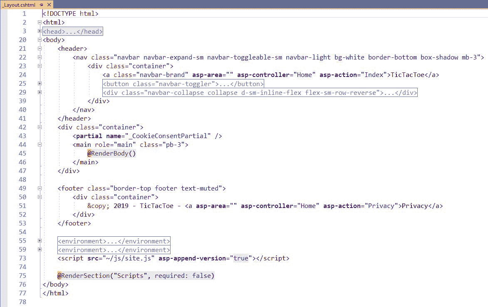

版面页面中的公共标题部分包含 CSS 链接，但也包含**s****搜索引擎优化**（**SEO**）标签，如标题、描述和关键字。正如您已经看到的，ASP.NET Core 3 提供了一个简洁的功能，允许您通过环境标记（开发、登台、生产等）自动包含特定于环境的内容。

**Bootstrap**已经成为呈现菜单和导航栏组件的准标准，这就是为什么我们也将其用于 Tic-Tac-Toe 应用。

将公共 JavaScript 文件放在布局页面的底部是一种很好的做法；根据 ASP.NET Core`environment`标记，它们也可以包含在内。

我们将使用`Views/_ViewStart.cshtml`文件在中心位置为所有页面定义布局页面。或者，如果要手动设置特定布局页面，可以在页面顶部进行设置：

```cs
@{
    Layout = "_Layout";
}
```

要构造布局页面，可以定义节，以便组织某些页面元素（包括公共脚本节）的放置位置。一个例子是可以在布局页面中看到的脚本部分，我们在 Tic-Tac-Toe 应用的第一个示例中添加了该部分。默认情况下，它被放在页面底部，这是通过添加一个专用的元标记完成的：

```cs
@RenderSection("Scripts", required: false)
```

您还可以在视图中定义节，以便添加文件或客户端脚本。我们已经在 email confirmation 视图中这样做了，我们在其中添加了一个用于调用客户端 JavaScript`EmailConfirmation`方法的部分：

```cs
@section Scripts{
    <script>
        $(document).ready(function () {
        EmailConfirmation('@ViewBag.Email');
        });
    </script>
}
```

我们也可以使用**NuGet 软件包**。有一个名为`DeviceDetector.NET.NetCore`的软件包，它不仅能够检测到移动设备，而且能够检测到其他设备，包括台式机、电视机，甚至汽车。

我们可以使用以下命令通过 package Manager 控制台安装和使用前面的软件包：

```cs
Install-Package DeviceDetector.NET.NetCore
```

现在，让我们自己动手做移动检测功能吧！让我们学习如何优化移动设备的 Tic-Tac-Toe 应用。

# 移动设备的优化

遵循以下步骤，使我们的 Tic-Tac-Toe 演示应用对移动设备的响应能力越来越强，最终目标是拥有更方便的界面：

1.  我们希望更改显示器，使其专门用于移动设备。为此，启动 Visual Studio 2019，转到解决方案资源管理器，创建一个名为`Filters`的新文件夹，并添加一个名为`DetectMobileFilter`的新类，该类继承自`IActionFilter`接口。然后我们将创建`MobileCheck`和`MobileVersionCheck`**正则表达式**（**正则表达式**），如下所示：

```cs
static Regex MobileCheck = new Regex(@"android|(android|bb\d+|meego).+mobile|avantgo|bada\/|blackberry|blazer
|compal|elaine|fennec|hiptop|iemobile|ip(hone|od)|iris|kindle
|lge |maemo|midp|mmp|mobile.+firefox|netfront|opera m(ob|in)i|palm( os)?|phone|p(ixi|re)\/|plucker|pocket|psp|series(4|6)0|symbian
|treo|up\.
(browser|link)|vodafone|wap|windows (ce|phone)|xda|xiino", RegexOptions.IgnoreCase | RegexOptions.Multiline | RegexOptions.Compiled);

static Regex MobileVersionCheck = new Regex(@"1207|6310|6590|3gso|4thp|50[1-6]i|770s|802s|a wa|abac|ac(er|oo|s\-)|ai(ko|rn)|al(av|ca|co)|amoi|an(ex|ny|yw)
|aptu|ar(ch|go)|as(te|us)|attw|au(di|\-m|r |s )|avan|be(ck|ll|nq)|bi(lb|rd)|bl(ac|az)|br(e|v)w|bumb|bw\-(n|u)|c55\/|capi|ccwa|cdm\-|cell|chtm|cldc|cmd\-|co(mp|nd)|craw|da(it|ll|ng)|dbte|dc\-s|devi|dica|dmob|do(c|p)o|ds(12|\-d)|el(49|ai)|em(l2|ul)|er(ic|k0)|esl8|ez([4-7]0|os|wa|ze)|fetc|fly(\-|_)|g1 u|g560|gene|gf\-5|g\-mo|go(\.w|od)|gr(ad|un)|haie|hcit|hd\-(m|p|t)|hei\-|hi(pt|ta)|hp( i|ip)|hs\-c|ht(c(\-| |_|a|g|p|s|t)|tp)|hu(aw|tc)|i\-(20|go|ma)|i230|iac( |\-|\/)|ibro|idea|ig01|ikom|im1k|inno|ipaq|iris|ja(t|v)a|jbro|jemu|jigs|kddi|keji|kgt( |\/)|klon|kpt |kwc\-|kyo(c|k)|le(no|xi)|lg( g|\/(k|l|u)|50|54|\-[a-w])|libw|lynx|m1\-w|m3ga|m50\/|ma(te|ui|xo)|mc(01|21|ca)|m\-cr|me(rc|ri)|mi(o8|oa|ts)|mmef|mo(01|02|bi|de|do|t(\-| |o|v)|zz)|mt(50|p1|v )|mwbp|mywa|n10[0-2]|n20[2-3]|n30(0|2)|n50(0|2|5)|n7(0(0|1)|10)|ne((c|m)\-|on|tf|wf|wg|wt)|nok(6|i)|nzph|o2im|op(ti|wv)|oran|owg1|p800|pan(a|d|t)|pdxg|pg(13|\-([1-8]|c))|phil|pire|pl(ay|uc)|pn\-2|po(ck|rt|se)|prox|psio|pt\-g|qa\-a|qc(07|12|21|32|60|\-[2-7]|i\-)|qtek|r380|r600|raks|rim9|ro(ve|zo)|s55\/|sa(ge|ma|mm|ms|ny|va)|sc(01|h\-|oo|p\-)|sdk\/|se(c(\-|0|1)|47|mc|nd|ri)|sgh\-|shar|sie(\-|m)|sk\-0|sl(45|id)|sm(al|ar|b3|it|t5)|so(ft|ny)|sp(01|h\-|v\-|v )|sy(01|mb)|t2(18|50)|t6(00|10|18)|ta(gt|lk)|tcl\-|tdg\-|tel(i|m)|tim\-|t\-mo|to(pl|sh)|ts(70|m\-|m3|m5)|tx\-9|up(\.b|g1|si)|utst|v400|v750|veri|vi(rg|te)|vk(40|5[0-3]|\-v)|vm40|voda|vulc|vx(52|53|60|61|70|80|81|83|85|98)|w3c(\-| )|webc|whit|wi(g |nc|nw)|wmlb|wonu|x700|yas\-|your|zeto|zte\-", RegexOptions.IgnoreCase | RegexOptions.Multiline | RegexOptions.Compiled);

```

2.  现在，让我们创建一个方法来检查用户代理是否是移动的：

```cs
        public static bool IsMobileUserAgent( ActionExecuted
         Context context)
        {

            var userAgent = context.HttpContext.
            Request.Headers["User-Agent"].ToString(); 

            if (context.HttpContext != null && userAgent != null)
            {
                if (userAgent.Length < 4)
                    return false;
                if (MobileCheck.IsMatch(userAgent) ||
                MobileVersionCheck.IsMatch(userAgent.
                Substring(0, 4)))
                    return true;
            }
            return false;
        }
```

3.  我们从`IActionFilter`开始执行`OnActionExecuted`方法，如下所示：

```cs
        public void OnActionExecuted(ActionExecutedContext context)
        {
            var viewResult = (context.Result as ViewResult);
            if (viewResult == null)
                return;
            if (IsMobileUserAgent(context))
            {
                viewResult.ViewData["Layout"] =
                "~/Views/Shared/_LayoutMobile.cshtml";
            }
            else
            {
                viewResult.ViewData["Layout"] =
                "~/Views/Shared/_Layout.cshtml";
            }
        }
```

4.  复制现有的`Views/Shared/_Layout.cshtml`文件，并将结果副本重命名为`_LayoutMobile.cshtml`。
5.  通过添加两个名为`Desktop`和`Mobile`的专用部分，更新主页索引视图，删除现有布局定义，并根据设备显示不同的标题：

```cs
@{
ViewData["Title"] = "Home Page";
}
<div class="row">
<div class="col-lg-12">
@section Desktop {<h2>@Localizer["DesktopTitle"]</h2>}
@section Mobile {<h2>@Localizer["MobileTitle"]</h2>}
<div class="alert alert-info">
```

6.  当使用相应的设备时，将专门使用这些部分。这意味着，如果用户正在使用手机进行浏览，那么屏幕上将只显示`Mobile`部分。

Note that you must also update all the other views of the application (`GameInvitation`/`GameInvitationConfirmation`, `GameInvitation`/`Index`, `Home`/`Index`, `UserRegistration`/`EmailConfirmation`, `UserRegistration`/`Index`) with the `section` tags from the preceding code for now:
`@section Desktop{<h2>@Localizer["DesktopTitle"]</h2>}`
`@section Mobile {<h2>@Localizer["MobileTitle"]</h2>}`
If you do not add them to your other views, you will get errors when you complete the steps that follow. However, this is only a temporary solution; later in this chapter, you will learn how to address this problem more effectively by using conditional statements.

6.  更新资源文件。下面是英文主页索引资源文件的示例；您还应添加法语翻译：


7.  修改`Views/Shared/_LayoutMobile.cshtml`文件，用以下说明替换`@RenderBody()`元素；应显示`Desktop`部分，忽略`Mobile`部分：

```cs
@RenderSection("Desktop", required: false)
@{IgnoreSection("Mobile");}
@RenderBody()
```

8.  修改`Views/Shared/_Layout.cshtml`文件，用以下说明替换`@RenderBody()`元素；应显示`Mobile`部分，忽略`Desktop`部分：

```cs
@RenderSection("Mobile", required: false)
@{IgnoreSection("Desktop");}
@RenderBody()
```

9.  转到`Views/_ViewStart.cshtml`文件并更改所有网页的布局分配，以便能够使用前面代码中的布局定义：

```cs
@{Layout = Convert.ToString(ViewData["Layout"]);}
```

10.  更新`Startup`类，并将`DetectMobileFilter`作为参数添加到 MVC 服务注册中：

```cs
services.AddControllersWithViews(o => 
  o.Filters.Add(typeof(DetectMobileFilter)))
```

11.  在 Microsoft Edge 浏览器中正常启动 Tic Tac Toe 应用。请注意，本地化标题已将桌面显示为检测到的浏览器：


按*F12*打开 Microsoft Edge 中的开发者工具，进入仿真选项卡，选择移动设备：


现在，重新加载 Tic Tac Toe 应用；它将显示为您已在模拟设备上打开：

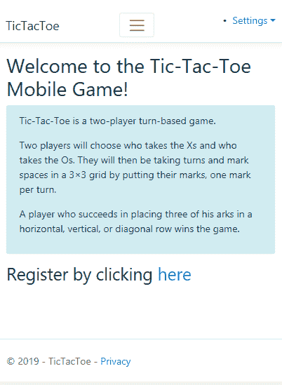

在本节中，您学习了如何为特定设备提供特定布局。现在，您将学习如何应用其他高级 ASP.NET Core 3 MVC 功能，以获得更好的生产效率和应用。但首先，让我们看看在**状态管理**中，在不同的请求、控制器和视图之间，我们可以使用什么。我们将不得不在某个时候处理所有这些问题，即使是在最基本的应用中。

# 了解 ASP.NET Core状态管理

ASP.NET Core 3 web 应用通常是无状态的。每当服务器请求页面时，就会实例化一个全新的 Razor web 页面。因此，每次来回请求时，Razor 页面中的任何数据都会丢失。

为了更好地理解问题，我们已经查看了`UserRegistration`页面，如果我们使用开发工具检查浏览器，我们会注意到，当我们填写表单并提交时，我们的数据会发送到服务器，但数据不会在响应标题中返回到浏览器。

这是为 web 生成有意义的交互式应用的自然障碍，我们很幸运，ASP.NET Core 3 通过内置功能为我们解决了这一障碍。

我们可以通过提出以下一些问题来决定使用什么功能：

*   我们是否需要在请求之间保留大量数据？
*   用户客户端接受不同类型 cookie 的可能性有多大？
*   我们希望数据由服务器或客户端存储吗？
*   我们需要确保数据的安全性，因此所涉及的数据是否微妙？
*   我们是否在为无法承受高带宽使用的用户或客户端浏览器编写应用？
*   究竟什么样的设备将访问我们的应用？它们有限制吗？
*   每个应用用户都需要个性化数据吗？
*   我们需要应用数据保持多长时间？
*   我们是要在具有多个实例的分布式环境中托管应用，还是在具有单个实例的普通环境中托管应用？

让我们来看看我们管理国家的各种选择，以及它们的优势。

# 客户端状态管理选项

对于客户端状态管理，服务器根本不需要为应用中的任何来回请求存储任何数据。让我们更详细地看一下这些选项。

Please note that we're referring to either the Razor pages or the user's device when we talk about the client.

# 隐藏字段

隐藏字段是一种标准的 HTML 功能，不需要复杂的编程逻辑。隐藏字段广泛支持大多数 internet 浏览器。由于一个隐藏字段被持久化并从 Razor 视图页面读取，因此不需要服务器资源。

ASP.NET Core 3 允许我们使用隐藏字段。在隐藏字段中放置的任何内容都将始终以提交的形式与来自其他 HTML 元素的输入数据一起发送。这将从定义它们的位置发送。

您可以使用`Hidden Field`将数据保存在`.cshtml`页面上，并检测在回发之间存储在隐藏字段中的数据何时发生了更改。

It is recommended that you don't use a hidden field to keep sensitive data since the data can easily be revealed by right-clicking a web page and selecting View Page Source.

# 曲奇饼

Cookie 是应用通过各自的 web 浏览器存储在用户计算机上的微小数据。它们可用于保存自定义的客户端数据、用户在应用上的会话或应用数据。我们可以在 Cookie 上设置一个经过深思熟虑的持续时间，从毫秒到分钟、小时、天，甚至更长，这取决于您希望保留数据的时间。

在[第 10 章](10.html)*保护 ASP.NET Core 3 应用*中稍后讨论身份验证时，我们将了解 Cookie 与 ASP.NET Core Identity 协作的最重要用途之一。

We will deal with issues of security from [Chapter 10](10.html), *Securing ASP.NET Core 3 Applications*, onward, but it is worth noting that cookies can present a vulnerability point to your application as they are often the targets of hackers. The best advice is to never store valuable information in your cookies but in tokens, which you use to locate your valuable data.

# 查询字符串

有时，我们可能会注意到在问号标记`: ?`之后的`url`中嵌入了一个键/值对。这表示正在使用的查询字符串。在网页之间导航时，查询字符串非常方便，您需要将一些数据传递到下一页。例如，可以传递游戏会话`id`或游戏的其他参数，我们可以为演示应用这样做：

```cs
https://example.net/gamesessions?id=002e6431-3eb5-4d98-b3d9-3263490ce7c0
```

我们必须记住始终保持`url`长度相对较短，即使现代浏览器最多有 2048 个字符。

查询字符串是一个很好的工具，但有些情况下我们不应该使用它们。我们将在下面的小节中更详细地讨论这一点。

# 查询字符串用法

当我们需要使用`GET`方法从 web 服务器请求数据时，应该使用查询字符串。请注意，它们不能用于使用`POST`方法向 web 服务器发送数据。

我们将在下一章学习更多关于`GET`和`POST`**超文本传输协议**（**HTTP**的方法，即[第 8 章](08.html)、*创建 Web API 应用*的方法。

Information that is passed in a query string is susceptible and can be tampered with by hackers. Please make sure you're not using query strings to pass important data. It must also be noted that an unsuspecting user can bookmark the URL or send the URL to other users, thereby passing that sensitive data in the URL along with it.

查询字符串、cookie 和隐藏字段是客户端状态管理选项的示例，但大多数 web 应用需要从服务器端管理状态。下一节将介绍用于从服务器管理应用状态的选项。

# 基于服务器的状态管理选项

ASP.NET Core 3 提供了多种方法来维护服务器上的状态信息，而不是在客户端保存数据。从服务器端管理状态时，服务器客户端调用会减少。这在资源方面也可能是昂贵的。以下部分将描述两个基于服务器的状态管理功能：应用状态和会话状态。

# 应用状态

应用状态在 ASP.NET Core之前的早期框架中使用，例如在 ASP.NET MVC 4 中。它现在已经转变为 ASP.NET Core 3 中的应用状态。最简单的说，它只是应用在快照中的状态在时间上的表示。当我们引用应用状态时，在指定的时间，所有应用用户的状态都是相同的。这允许我们在所有客户机用户之间保持数据不变。

如果系统中的此类数据需要跨会话访问，并且每隔一段时间才更改一次，建议使用缓存。ASP.NET Core 3 更倾向于使用缓存而不是应用状态。

Caching in ASP.NET Core 3 is achieved by using `IMemoryCache` and adding `services.AddMemoryCache()` to the `ConfigureServices` method, but it's out of the scope of this book. You can find more information at the following link: [https://docs.microsoft.com/en-us/aspnet/core/performance/caching/memory?view=aspnetcore-3.0](https://docs.microsoft.com/en-us/aspnet/core/performance/caching/memory?view=aspnetcore-3.0).

# 会话状态

与应用状态相反，会话状态在用户使用应用期间保留特定于用户的数据。ASP.NET Core 3 使用会话中间件，在`Startup`类的`ConfigureServices`方法中通过添加`services.AddSession()`进行配置。

在应用中使用会话对象之前，您需要将`app.UseSession()`添加到`Startup`类中的`Configure`方法中。

通过这样做，您可以通过`HttpContext.Session`访问会话对象，您可以利用其方法获取或设置会话变量或属性。

我们已经提到，会话状态是一个基于服务器的状态管理选项，这意味着您设置的所有内容都将由服务器处理。请注意，您实际上可以将会话数据存储在 cookie 中，作为`AddSession(option)`方法中的一个选项，如下所示：

```cs
services.AddSession(options => {options.Cookie.Name = "yourCustomSessionName";});

```

在本书后面部分，我们将使用以下代码在游戏会话中使用会话状态：

```cs
            services.AddSession(o =>
            {
                o.IdleTimeout = TimeSpan.FromMinutes(30); 

            });
```

前面的代码片段在`ConfigureServices`方法中向服务集合添加了一个 30 分钟超时的会话。为了能够使用这个会话，我们需要配置`app.UseSession()`，可以在`Startup`类的`Configure`方法中找到。当我们在[第 8 章](08.html)、*创建 Web API 应用*中配置游戏会话时，将介绍更多关于会话的内容，特别是在*构建 RPC 风格的 Web API*部分。

现在我们已经了解了状态管理的概念，让我们看看可以使用哪些不同类型的视图来为应用用户提供适当的**用户界面**（**UI**）和良好的**用户体验**（**UX**）。

# 使用视图页面、局部视图、视图组件和标记帮助器

ASP.NET Core 3 和 Razor 与 Visual Studio 2019 结合使用时，提供了一些可用于创建 MVC 视图的功能。在本节中，您将了解这些功能如何帮助您提高工作效率。例如，您可以使用 VisualStudio2019 的集成支架功能创建视图，您在前面的章节中已经多次使用了该功能。这允许您自动生成以下类型的视图：

*   查看页面
*   局部视图

除了查看页面和局部视图之外，有时还需要更高级的功能，这可以通过使用视图组件和标记帮助器来实现。

您想了解它们是什么，以及如何使用 Visual Studio 2019 高效地与它们协作吗？保持专注–我们将在本节中详细解释所有内容。

# 使用查看页面

视图页面用于根据操作呈现结果，并对 HTTP 请求做出响应。在 MVC 方法中，它们定义并封装应用的可见部分—表示层。此外，它们使用`.cshtml`文件扩展名，默认情况下存储在应用的`Views`文件夹中。

Visual Studio 2019 的脚手架功能提供了不同的查看页面模板，如您所见：

*   **创建**：生成插入数据的表单
*   **编辑**：生成数据更新表单
*   **删除**：生成一张显示记录的表单，表单上有一个确认删除记录数据的按钮
*   **详细信息**：生成一个表格，用于显示一条记录，有两个按钮，一个用于编辑表格，另一个用于删除显示的记录页面
*   **列表**：生成一个显示对象列表的 HTML 表
*   **空**：不使用任何模型生成空页面

如果您不想使用 Visual Studio 2019 生成页面视图，您可以通过自己将其添加到`Views`文件夹来手动实现。在这种情况下，建议您遵守 MVC 约定。因此，在匹配操作名称的同时，将它们添加到相应的子文件夹中。这有助于 ASP.NET 引擎查找手动创建的视图。

让我们为 Tic-Tac-Toe 游戏创建排行榜，看看所有这些都在起作用：

1.  打开解决方案资源管理器，转到“视图”文件夹，并创建一个名为`Leaderboard`的新子文件夹。然后，右键单击文件夹，从向导中选择添加|新建项目| Razor 视图页面，然后单击添加按钮：


2.  打开创建的文件并清除其内容，通过在页面顶部添加以下说明将排行榜视图与用户模型关联：`@model IEnumerable<UserModel>`。
3.  很好的做法是设置其标题变量，使其显示在 SEO 标签中：`@{ViewData["Title"] = "Index";}`。
4.  使用`@section`元标记添加新的两个部分`Desktop`和`Mobile`。然后，使用`@()`元标记添加上次更新的时间：

```cs
<div class="row">
        <div class="col-lg-12">
            @section Desktop {<h2>
                    @Localizer["DesktopTitle"] (
            Last updated @(System.DateTime.Now))
        </h2>}
            @section Mobile {<h2>
                    @Localizer["MobileTitle"] (
            Last updated @(System.DateTime.Now))
        </h2>}
        </div>
    </div>
```

5.  为排行榜视图添加英文和法文资源文件，并为`DesktopTitle`和`MobileTitle`定义本地化。
6.  右键点击`Controllers`文件夹，选择添加|控制器，选择 MVC 控制器-空，点击添加按钮。命名为`LeaderboardController`：

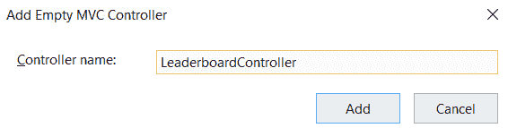

7.  将自动生成以下代码段：

```cs
    public class LeaderboardController : Controller
    {
        public IActionResult Index()
        {
            return View();
        }
    }    
```

Note that Razor matches views with actions with `<actionname>.cshtml` or `<actionname>.<culture>.cshtml` in the `Views/<controllername>` folder.

8.  更新`Views/Shared`文件夹中的`_Layout.cshtml`和`_LayoutMobile.cshtml`文件，并在`Home`元素之后添加一个 ASP.NET 标记帮助程序，用于调用`navbar`菜单中的新排行榜视图：

```cs
 <li class="nav-item">
     <a class="nav-link text-dark" asp-area="" asp-
     controller="Leaderboard" asp-action="Index">Leaderboard</a>
 </li>
```

9.  启动应用并显示新的排行榜视图：

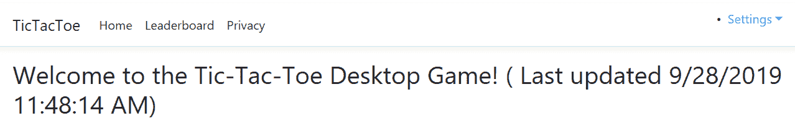

现在我们已经了解了基础知识，让我们看看使用 Razor 时的一些更高级的技术，例如代码块、控制结构和条件语句。
代码块`@{}`用于设置或计算变量和格式化数据。您已经在`_ViewStart.cshtml`文件中使用了它们来定义应该使用哪个特定布局页面：

```cs

@{
Layout = Convert.ToString(ViewData["Layout"]);
}
```

控制结构提供处理循环所需的一切。例如，您可以使用`@for`、`@foreach`、`@while`或`@do`来重复元素。它们的行为与 C#等价物完全相同。让我们使用它们来实现排行榜视图：

1.  使用上述控制结构时，向排行榜视图添加新的 HTML 表：

```cs
        <table class="table table-striped">
            <thead> <tr>
                    <th>Name</th>
                    <th>Email</th>
                    <th>Score</th> </tr>
            </thead>
            <tbody>
                @foreach (var user in Model)
                { <tr>
                        <td>@user.FirstName @user.LastName</td>
                        <td>@user.Email</td>
                        <td>@user.Score.ToString()</td>  </tr>
                }
            </tbody>
        </table>
```

2.  在`IUserService`界面添加一个新的`GetTopUsers`方法，用于检索将在排行榜视图中显示的顶级用户：

```cs
Task<IEnumerable<UserModel>> GetTopUsers(int numberOfUsers);
```

3.  在`UserService`内实施新的`GetTopUsers`方法：

```cs
        public Task<IEnumerable<UserModel>> GetTopUsers(int 
         numberOfUsers)
        {
            return Task.Run(() =>
            (IEnumerable<UserModel>)_userStore.OrderBy(x =>
            x.Score).Take(numberOfUsers).ToList());
        }
```

4.  更新排行榜控制器，以便您可以调用新方法：

```cs
        private IUserService _userService;
        public LeaderboardController(IUserService userService)
        {
            _userService = userService;
        }
        public async Task<IActionResult> Index()
        {
            var users = await _userService.GetTopUsers(10);
            return View(users);
        }
```

5.  按*F5*启动应用，注册多个用户，显示排行榜：

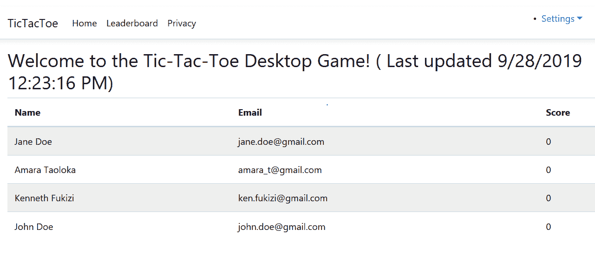

`@if`、`@else if`、`@else`和`@switch`等条件语句允许您有条件地呈现元素。它们的工作原理也与 C#同行完全相同。

As we mentioned previously, you need to define the `Desktop` and `Mobile` sections in all of your views, that is, `@section Desktop { }` and `@section Mobile { }`.

例如，如果您从排行榜索引视图中临时删除它们，并尝试在`ASPNETCORE_ENVIRONMENT`变量设置为`'Development'`时显示它们，以便激活开发者异常页面，您将收到以下错误消息：


这是因为我们更改了应用的`Layout`和`Mobile`布局页面，并使用了`IgnoreSection`指令。不幸的是，在使用`IgnoreSection`指令时，必须始终声明节。

但是现在您知道了条件语句的存在，您已经可以看到更好的解决方案了，对吗？是的，没错；我们必须在两个布局页面中用条件语句`if`包装`IgnoreSection`指令。

以下是您需要如何使用`IsSectionDefined`方法更新布局页面：

```cs
 @RenderSection("Desktop", required: false)
 @if(IsSectionDefined("Mobile")){IgnoreSection("Mobile");}
 @RenderBody()
```

以下是您需要如何更新`Mobile`布局页面：

```cs
 @RenderSection("Mobile", required: false)
 @if(IsSectionDefined("Desktop")){IgnoreSection("Desktop");}
 @RenderBody()
```

如果启动该应用，您将看到现在一切都按预期工作，但这次使用的是更干净、更优雅、更易于理解的解决方案。这是因为我们正在使用 ASP.NET Core 3 和 Razor 的内置功能。

# 使用局部视图

到目前为止，我们已经学习了如何使用 Razor 创建视图页面，但有时，我们必须在所有或部分视图页面中重复元素。如果我们可以在视图中创建可重用的组件，这不是很有帮助吗？毫不奇怪，ASP.NET Core 3 默认通过提供所谓的局部视图来实现此功能。

部分视图在调用视图页中呈现。与标准视图页面一样，它们也具有`.cshtml`文件扩展名。我们可以定义它们一次，然后在所有视图页面中使用它们。这是一个通过减少代码重复来优化代码的好方法，可以提高质量，减少维护！

现在让我们看看如何从中获益。为此，我们将优化布局和移动布局页面，使其仅使用一个菜单：

1.  转到视图/共享文件夹并添加一个名为`_Menu.cshtml`的新 MVC 视图页面。它将用作菜单“局部视图”：


2.  从其中一个布局页面复制`nav bar`并粘贴到菜单部分视图：

```cs
<div class="navbar-collapse collapse d-sm-inline-flex flex-sm-row-reverse">
    <ul class="navbar-nav flex-grow-1">
        <li class="nav-item">
            <a class="nav-link text-dark" asp-area="" asp-
                controller="Home" asp-action="Index">Home</a>
        </li>

        <li class="nav-item">
            <a class="nav-link text-dark" asp-area="" asp-
             controller="Leaderboard" asp-
             action="Index">Leaderboard</a>
        </li>

        <li class="nav-item">
            <a class="nav-link text-dark" asp-area="" asp-
              controller="Home" asp-action="Privacy">Privacy</a>
        </li>
    </ul>
</div>
```

3.  将两个版面中的`nav bar`替换为`<partial name="_Menu" />`。
4.  启动应用并验证一切是否仍在工作。你不应该看到任何差异，但这是一件好事；现在，您已将菜单封装并集中在局部视图中。

# 使用视图组件

到目前为止，您已经学习了如何通过使用局部视图来创建可重用组件，可以从应用中的任何视图页面调用局部视图，并将此概念应用于 Tic-Tac-Toe 应用的顶部菜单。但有时，即使是这个功能也不够。
有时，您需要一些更强大、更灵活的功能，可以在整个 web 应用中使用，甚至可以在多个 web 应用中使用。这就是视图组件发挥作用的地方。

视图组件用于复杂的用例，这些用例需要在服务器上运行一些代码（例如，登录面板、标记云和购物车），其中部分视图太有限，无法使用，并且您需要能够广泛测试功能。
在下面的示例中，我们将添加一个用于管理游戏会话的视图组件。您将看到它与标准控制器实现非常相似：

1.  将名为`TurnModel`的新模型添加到`Models`文件夹：

```cs
public class TurnModel
    {
        public Guid Id { get; set; }
        public Guid UserId { get; set; }
        public UserModel User { get; set; }
        public int X { get; set; }
        public int Y { get; set; }
    }
```

2.  将名为`GameSessionModel`的新模型添加到`Models`文件夹：

```cs
public class GameSessionModel
    {
        public Guid Id { get; set; }
        public Guid UserId1 { get; set; }
        public Guid UserId2 { get; set; }
        public UserModel User1 { get; set; }
        public UserModel User2 { get; set; }
        public IEnumerable<TurnModel> Turns { get; set; }
        public UserModel Winner { get; set; }
        public UserModel ActiveUser { get; set; }
        public Guid WinnerId { get; set; }
        public Guid ActiveUserId { get; set; }
        public bool TurnFinished { get; set; }
    }
```

3.  在`Services`文件夹中添加一个名为`GameSessionService`的新服务，并实现，提取`IGameSessionService`接口：

```cs
public class GameSessionService : IGameSessionService
    {
        private static ConcurrentBag<GameSessionModel> _sessions;
        static GameSessionService()
        {
            _sessions = new ConcurrentBag<GameSessionModel>();
        }
        public Task<GameSessionModel> GetGameSession(Guid 
         gameSessionId)
        {
            return Task.Run(() => _sessions.FirstOrDefault(
            x => x.Id == gameSessionId));
        }
    }
```

4.  在`Startup`类中注册`GameSessionService`，就像您在所有其他服务中一样：

```cs
services.AddSingleton<IGameSessionService, GameSessionService>();
```

5.  转到解决方案资源管理器，创建一个名为`Components`的新文件夹，并向其中添加一个名为`GameSessionViewComponent.cs`的新类：

```cs
[ViewComponent(Name = "GameSession")]
    public class GameSessionViewComponent : ViewComponent
    {
        IGameSessionService _gameSessionService;
        public GameSessionViewComponent(IGameSessionService 
         gameSessionService)
        {
            _gameSessionService = gameSessionService;
        }
        public async Task<IViewComponentResult> InvokeAsync(Guid 
         gameSessionId)
        {
            var session = await _gameSessionService.
             GetGameSession(gameSessionId);
            return View(session);
        }
    }
```

6.  转到解决方案资源管理器，在`Views/Shared`文件夹中创建一个名为`Components`的新文件夹。在此文件夹中，为`GameSessionViewComponent`创建一个名为`GameSession`的新文件夹。然后，手动添加一个名为`default.cshtml`的新视图：

```cs
@model TicTacToe.Models.GameSessionModel
@{     var email = Context.Session.GetString("email"); }
@if (Model.ActiveUser?.Email == email)
{<table>
 @for (int rows = 0; rows < 3; rows++)  {<tr style="height:150px;">
   @for (int columns = 0; columns < 3; columns++)
   {<td style="width:150px; border:1px solid #808080">
   @{var position = Model.Turns?.FirstOrDefault(turn => turn.X == 
     columns && turn.Y == rows);
    if (position != null) { if (position.User?.Email == "Player1")
     {<i class="glyphicon glyphicon-unchecked" 
      style="width:100%;height:100%"></i> }
     else{<i class="glyphicon glyphicon-remove-circle" 
       style="width:100%;height:100%"></i> }
    } else{ <a asp-action="SetPosition"
       asp-controller="GameSession" 
     asp-route-id="@Model.Id" asp-route-email="@email" 
     class="btn btn-default" style="width:150px; 
      min-height:150px;">   
        &nbsp; </a> } } </td> } </tr> }
    </table>
}else{
 <div class="alert">
   <i class="glyphicon glyphicon-alert">Please wait until the other user has finished his turn.</i> </div> }
```

如果你不是活跃用户，这个视图会告诉你等待轮到你；否则，它会给你一张桌子，你可以在那里玩`TicTacToe`游戏。

We advise using the following syntax to put all partial views for your View Components in their corresponding folders:
`Views\Shared\Components\<ViewComponentName>\<ViewName>`.

7.  使用`@addTagHelper *, TicTacToe`命令更新`_ViewImports.cshtml`文件以使用视图组件。
8.  在`Views`文件夹中创建一个名为`GameSession`的新文件夹。然后，为`Desktop`部分添加一个名为`Index`的新视图，如下所示：

```cs
@model TicTacToe.Models.GameSessionModel
@section Desktop
{<h1>Game Session @Model.Id</h1>
    <h2>Started at @(DateTime.Now.ToShortTimeString())</h2>
    <div class="alert alert-info">
        <table class="table">
         <tr>
           <td>User 1:</td>
           <td>@Model.User1?.Email (<i class="glyphicon
             glyphicon-unchecked"></i>) </td>
          </tr>
          <tr>
            <td>User 2:</td>
            <td>@Model.User2?.Email (<i class=" glyphicon
             glyphicon-remove-circle"></i></td>
        </tr>
    </table>
</div>}
```

现在，对`Mobile`部分执行同样的操作，如下所示：

```cs
@section Mobile{
    <h1>Game Session @Model.Id</h1>
    <h2>Started at @(DateTime.Now.ToShortTimeString())</h2>
    User 1: @Model.User1?.Email <i class="glyphicon glyphicon-
        unchecked"></i><br />
    User 2: @Model.User2?.Email (<i class="glyphicon glyphicon-
        remove-circle"></i>)
}
<vc:game-session game-session-id="@Model.Id"></vc:game-session>
```

9.  在`GameSessionService`中添加一个公共构造函数，以便获得用户服务的实例：

```cs
        private IUserService _UserService;
        public GameSessionService(IUserService userService)
        {
            _UserService = userService;
        }
```

10.  在`GameSessionService`中增加创建游戏会话的方法，更新游戏会话服务界面：

```cs
public async Task<GameSessionModel> CreateGameSession( Guid invitationId, string invitedByEmail, string invitedPlayerEmail)
        {
            var invitedBy =
            await _UserService.GetUserByEmail(invitedByEmail);
            var invitedPlayer =
            await _UserService.GetUserByEmail(invitedPlayerEmail);
            GameSessionModel session = new GameSessionModel
            {
                User1 = invitedBy,
                User2 = invitedPlayer,
                Id = invitationId,
                ActiveUser = invitedBy
            };
            _sessions.Add(session);
            return session;
        }
```

11.  在`Controllers`文件夹中添加一个名为`GameSessionController`的新控制器，并实现一个新的`Index`方法：

```cs
        private IGameSessionService _gameSessionService;
        public GameSessionController(IGameSessionService 
        gameSessionService)
        {  _gameSessionService = gameSessionService;  }
        public async Task<IActionResult> Index(Guid id)
        {
            var session = await _gameSessionService.
                GetGameSession(id);
            if (session == null)
            {
                var gameInvitationService =
                Request.HttpContext.
                RequestServices.GetService
                <IGameInvitationService>();
                var invitation = await gameInvitationService.
                  Get(id);
                session = await _gameSessionService.
                CreateGameSession(
                            invitation.Id, invitation.InvitedBy, 
                             invitation.EmailTo);
            }
            return View(session);
        }
```

12.  启动应用，注册新用户，并邀请其他用户玩游戏。等待新游戏会话页面显示，如下所示：

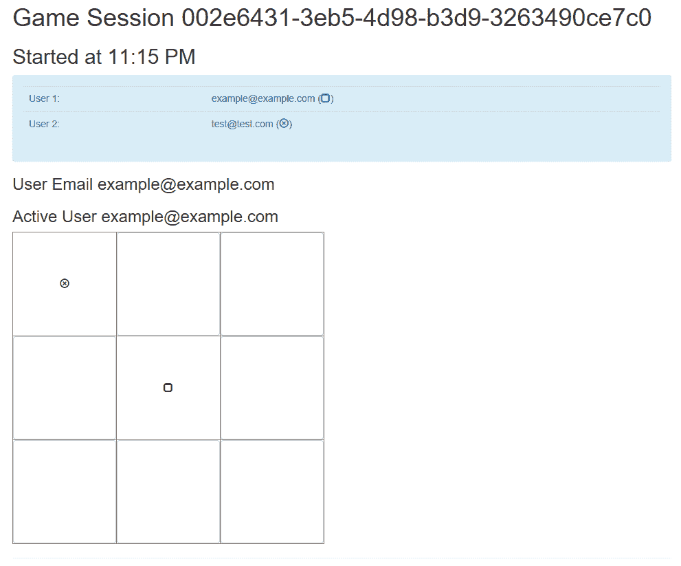

在本节中，我们学习了如何实现名为 View Components 的高级功能。在下一节中，我们将看一看另一个高级且令人兴奋的特性，称为标记帮助器。保持专注。

# 使用标记助手

自 ASP.NET Core 2+以来，标记帮助器是一项相对较新的功能，允许在创建和呈现 HTML 元素时使用服务器端代码。可以将它们与用于呈现 HTML 内容的著名 HTML 帮助程序进行比较。

ASP.NET Core 3 提供了许多内置的标记帮助程序，如`ImageTagHelper`和`LabelTagHelper`，您可以在应用中使用它们。创建自己的标记帮助程序时，可以基于元素名称、属性名称或父标记将 HTML 元素作为目标。然后，您可以在视图中使用标准 HTML 标记，同时在 web 服务器上应用用 C#编写的表示逻辑。

此外，您甚至可以创建自定义标记。您可以在 Tic-Tac-Toe 演示应用中使用这些工具。让我们了解如何创建自定义标记：

1.  打开解决方案资源管理器并创建一个名为`TagHelpers`的新文件夹。然后，添加一个名为`GravatarTagHelper.cs`的新类，该类实现`TagHelper`基类。
2.  实现`GravatarTagHelper.cs`类；它将用于连接到 Gravatar 在线服务，以便为用户检索帐户照片。让我们从课程的管道开始：

```cs
[HtmlTargetElement("Gravatar")]
    public class GravatarTagHelper : TagHelper
    {
        private ILogger<GravatarTagHelper> _logger;
        public GravatarTagHelper(ILogger<GravatarTagHelper> logger)
        {
            _logger = logger;
        }
        public string Email { get; set; }
...
}
```

现在我们可以实现`Process`方法，如下所示：

```cs
public override void Process(TagHelperContext context, TagHelperOutput output)
        {
            byte[] photo = null;
            if (CheckIsConnected())
            {
                photo = GetPhoto(Email);
            }
            else
            {
                photo = File.ReadAllBytes(Path.Combine(
                Directory.GetCurrentDirectory(),
                "wwwroot", "images", "no-photo.jpg"));
            }
            string base64String = Convert.ToBase64String(photo);
            output.TagName = "img";
            output.Attributes.SetAttribute("src",
            $"data:img/jpeg;base64,{base64String}");
        }
```

`Process`方法需要一个名为`CheckIsConnected`的方法来检查连接，该方法可以实现如下：

```cs
        private bool CheckIsConnected()
        {
            try
            {
                using (var httpClient = new HttpClient())
                {
                    var gravatarResponse = httpClient.GetAsync(
                    "http://www.gravatar.com/avatar/").Result;
                    return (gravatarResponse.IsSuccessStatusCode);
                }
            }
            catch (Exception ex)
            {
                _logger?.LogError($"Cannot check the gravatar 
                  service status: { ex} ");
                return false;
            }
        }
```

我们还需要一个`GetPhoto`方法，如下所示：

```cs
private byte[] GetPhoto(string email)
        {
            var httpClient = new HttpClient();
            return httpClient.GetByteArrayAsync(
            new Uri($"http://www.gravatar.com/avatar/ { 
              HashEmailForGravatar(email) }")).Result;
        }
```

最后，我们需要一个`HashEmailForGravatar`方法，如下所示：

```cs
 private static string HashEmailForGravatar(string email)
        {
            var md5Hasher = MD5.Create();
            byte[] data = md5Hasher.ComputeHash(
            Encoding.ASCII.GetBytes(email.ToLower()));
            var stringBuilder = new StringBuilder();
            for (int i = 0; i < data.Length; i++)
            {
                stringBuilder.Append(data[i].ToString("x2"));
            }
            return stringBuilder.ToString();
        }
```

3.  打开`Views/_ViewImports.cshtml`文件，确认`addTagHelper`指令存在。如果没有使用`@addTagHelper *, TicTacToe`命令将其添加到文件中。
4.  更新`GameInvitationController`中的`Index`方法，存储用户的电子邮件，并在会话变量中显示其姓名（名字和姓氏）：

```cs
        [HttpGet]
        public async Task<IActionResult> Index(string email)
        {
            var gameInvitationModel = new GameInvitationModel
            {
                InvitedBy = email,
                Id = Guid.NewGuid()
            };
            Request.HttpContext.Session.SetString("email", email);
            var user = await _userService.GetUserByEmail(email);
            Request.HttpContext.Session.SetString("displayName",
            $"{user.FirstName} {user.LastName}");
            return View(gameInvitationModel);
        }
```

5.  将名为`AccountModel`的新模型添加到`Models`文件夹：

```cs
   public class AccountModel
    {
        public string Email { get; set; }
        public string DisplayName { get; set; }
    }
```

6.  将名为`_Account.cshtml`的新局部视图添加到`Views/Shared`文件夹：

```cs
@model TicTacToe.Models.AccountModel
<li class="dropdown">
    <a href="#" class="dropdown-toggle" data-toggle="dropdown">
        <span class="glyphicon glyphicon-user"></span>
        <strong>@Model.DisplayName</strong>
        <span class="glyphicon glyphicon-chevron-down"></span>
    </a>
    <ul class="dropdown-menu" id="connected-dp">
        <li>
            <div class="navbar-login">
                <div class="row">
                    <div class="col-lg-4">
                        <p class="text-center">
                            <Gravatar email="@Model.Email">
                            </Gravatar>
                        </p>
                    </div>
                    <div class="col-lg-8">
                        <p class="text-left"><strong>@Model.
                         DisplayName</strong></p>
                        <p class="text-left small">
                            <a asp-action="Index" asp-
                            controller="Account">
                            @Model.Email</a>
                        </p>
                    </div>
                </div>
            </div>
        </li>
        <li class="divider"></li>
        <li>
            <div class="navbar-login navbar-login-session">
                <div class="row">
                    <div class="col-lg-12">
                        <p>
                            <a href="#" class="btn btn-danger btn-
                              block">Log off</a>
                        </p>
                    </div>
                </div>
            </div>
        </li>
    </ul>
</li>
```

7.  在`wwwroot/css/site.css`文件中添加一个新的 CSS 类：

```cs
#connected-dp { 
             min-width: 350px;
             }
```

Note that you might need to empty your browser cache or force a refresh for the application so that you can update the `site.css` file within your browser.

8.  更新菜单部分视图，并在页面顶部检索用户显示名称和电子邮件：

```cs
@using Microsoft.AspNetCore.Http;
@{
    var email = Context.Session.GetString("email");
    var displayName = Context.Session.GetString("displayName");
}
```

9.  更新菜单部分视图并添加我们先前创建的新帐户部分视图。可在菜单中的隐私元素后找到：

```cs
        <li>
            @if (!string.IsNullOrEmpty(email))
            {
                Html.RenderPartial("_Account",
                new TicTacToe.Models.AccountModel
                {
                    Email = email,
                    DisplayName = displayName
                });
            }
        </li>
```

10.  使用电子邮件在 Gravatar 上创建帐户并上传照片。启动 Tic Tac Toe 应用并使用相同的电子邮件注册。现在，您将在顶部菜单中看到一个新的下拉列表，其中包含照片和显示名称：


请注意，您必须联机才能使用此功能。如果你想离线测试你的代码，你应该在名为`no-photo.jpg`的`wwwroot/images`文件夹中放一张照片；否则，将出现错误，因为找不到脱机照片。

这应该易于理解和使用，但是什么时候应该使用视图组件，什么时候应该使用标记帮助器？以下简单规则应帮助您决定何时使用其中一种：

*   每当我们需要视图模板、需要呈现一组元素以及需要将服务器代码与之关联时，都会使用视图组件。
*   标记帮助器用于将行为附加到单个 HTML 元素，而不是一组元素。

我们的应用正在增长。对于较大的应用，从逻辑上遵循应用可能会成为一场噩梦，特别是如果您是一名新开发人员，并且被安排在现有项目上，那么您可能需要一些时间来适应代码库。幸运的是，ASP.NETCore3 允许我们划分类似的功能。我们将在下一节中了解如何做到这一点。

# 将 web 应用划分为多个区域

有时，在处理较大的 web 应用时，在逻辑上将它们划分为较小的功能单元可能会很有趣。然后，每个单元都可以拥有自己的控制器、视图和模型，这使得随着时间的推移更容易理解、管理、发展和维护它们。

ASP.NET Core 3 提供了一些基于文件夹结构的简单机制，用于将 web 应用划分为多个功能单元，也称为`Areas`；例如，将标准`Area`与应用中更高级的管理`Area`分开。标准`Area`甚至可以在某些页面上启用匿名访问，同时在其他页面上请求身份验证和授权，而管理`Area`将始终要求在所有页面上进行身份验证和授权。

以下公约和限制适用于`Areas`：

*   `Area`是`Areas`文件夹中的一个子目录。
*   `Area`至少包含两个子文件夹：`Controllers`和`Views`。
*   `Area`可以包含特定的布局页面，以及专用的`_ViewImport.cshtml`和`_ViewStart.cshtml`文件。

*   您必须注册一个特定的路由，该路由在其路由定义中启用`Areas`，以便能够在您的应用中使用`Areas`。
*   建议对`Area`URL 使用以下格式：
    `http://<Host>/<AreaName>/<ControllerName>/<ActionName>`。
*   `asp-area`标记帮助器可用于将`Area`附加到 URL。

让我们看看如何为帐户管理创建一个特定的管理`Area`：

1.  打开解决方案资源管理器并创建一个名为 Areas 的新文件夹。右键点击文件夹，选择添加|区域…，输入`Account`作为`Area`名称，点击添加按钮：

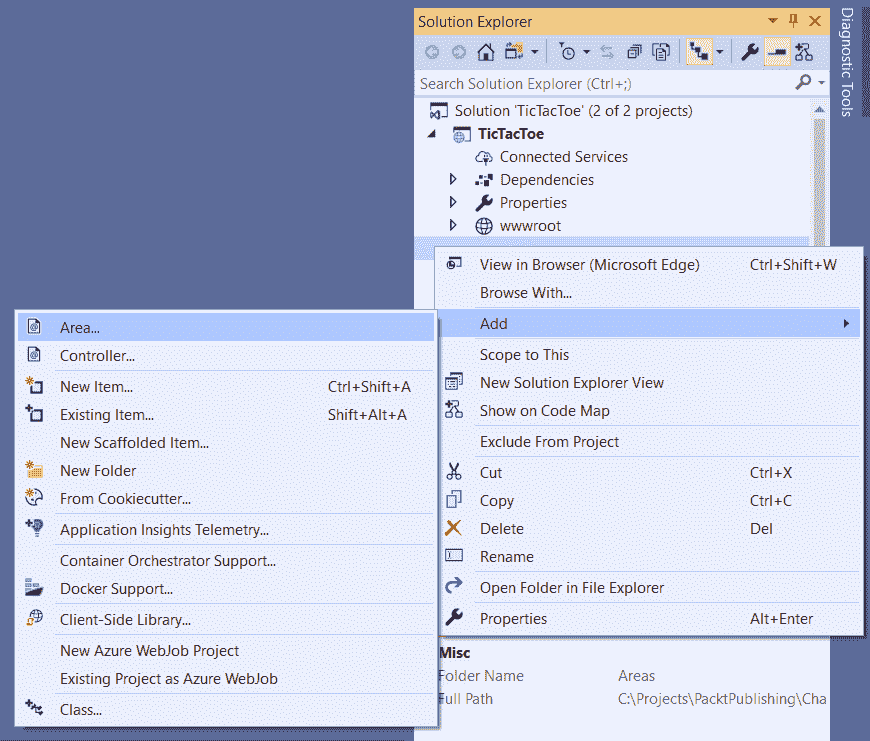

2.  脚手架将为`Account Area`创建一个专用文件夹结构，如下所示：

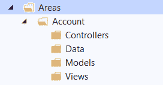

3.  在`Startup`类的`Configure`方法中的`UseEndpoints`声明中增加`Areas`的新路由：

```cs
            app.UseEndpoints(endpoints =>
            {
                endpoints.MapControllerRoute(
                    name: "default",
                    pattern: "
                    {controller=Home}/{action=Index}/{id?}");
                endpoints.MapRazorPages();
                endpoints.MapAreaControllerRoute(
                    name: "areas",
                    areaName: "Account",
                    pattern : "
                    {area:exists}/{controller=Home}
                    /{action=Index}/{id?}"
                    ); 
            });
```

4.  右键点击`Account Area`中的`Controllers`文件夹，添加一个名为`HomeController`的新控制器：

```cs
[Area("Account")]
    public class HomeController : Controller
    {
        private IUserService _userService;
        public HomeController(IUserService userService)
        {
            _userService = userService;
        }
        public async Task<IActionResult> Index()
        {
            var email = HttpContext.Session.GetString("email");
            var user = await _userService.GetUserByEmail(email);
            return View(user);
        }
    }
```

5.  在`Account/Views`文件夹中添加一个名为`Home`的新文件夹。然后，在此新文件夹中添加名为`Index`的视图：

```cs
@model TicTacToe.Models.UserModel
<h3>Account Details</h3>
<div class="container">
    <div class="row">
        <div class="col-xs-12 col-sm-6 col-md-6">
            <div class="well well-sm">
                <div class="row">
                    <div class="col-sm-6 col-md-4">
                        <Gravatar email="@Model.Email"></Gravatar>
                    </div>
                    <div class="col-sm-6 col-md-8">
                        <h4>@($"{Model.FirstName}
                         {Model.LastName}")</h4>
                        <p>
                            <i class="glyphicon glyphicon
                            -envelope"></i>&nbsp;
                            <a href="mailto:@Model.Email">@Model.
                             Email</a>
                        </p>
                        <p>
                            <i class="glyphicon glyphicon
                             -calendar">
                            </i>&nbsp;@Model.EmailConfirmationDate
                        </p>
                    </div>
                </div>
            </div>
        </div>
    </div>
</div>
```

6.  更新帐户部分视图并添加链接以显示前面的视图（就在现有注销链接之后）：

```cs
<a class="btn btn-default btn-block" asp-action="Index"
asp-controller="Account">View Details</a>
```

7.  启动应用，注册用户，点击下拉菜单上的查看详情链接，调用新的`Area`：

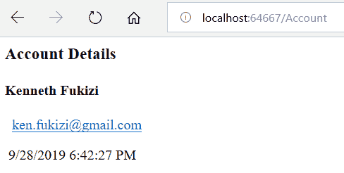

我们将在此处停止管理区域的实施，并在[第 10 章](10.html)*保护 ASP.NET Core 3 应用*中回到它，在这里您将学习如何保护对它的访问。现在，让我们通过查看一个名为视图引擎的激动人心的功能来进一步了解它。我们得到的越高级，我们的代码库就会变得越复杂，确保我们始终获得预期功能的最佳方法之一就是编写单元测试和集成测试。我们也将在下一节中介绍这些。

# 应用视图引擎、单元测试和集成测试等高级概念

现在，我们已经了解了 ASP.NET Core 3 MVC 的所有基本功能，让我们来看看一些更高级的功能，这些功能可以在您作为开发人员的日常工作中帮助您。
您还将学习如何使用 Visual Studio 2019 测试您的应用，从而为您的用户提供更好的质量。

# 使用视图引擎

当 ASP.NET Core 3 使用服务器端代码呈现 HTML 时，它使用视图引擎。默认情况下，当使用相关的`.cshtml`文件构建标准视图时，我们使用 Razor 视图引擎和 Razor 语法。

按照惯例，此引擎能够处理位于`Views`文件夹中的视图。由于它是内置的，并且是默认引擎，因此它会自动绑定到 HTTP 请求管道，而无需我们为它的工作做任何事情。

如果我们需要使用 Razor 来呈现位于`Views`文件夹之外并且不是直接来自 HTTP 请求管道的文件，例如电子邮件模板，我们不能使用默认的 Razor 视图引擎。相反，我们需要定义自己的视图引擎，并让它负责生成 HTML 代码。

在以下示例中，我们将解释如何使用 Razor 根据非来自 HTTP 请求管道的电子邮件模板呈现电子邮件：

1.  打开解决方案资源管理器并创建一个名为`ViewEngines`的新文件夹。然后，添加一个名为`EmailViewEngine.cs`的新类，该类具有以下构造函数：

```cs
public class EmailViewEngine
    {
        private readonly IRazorViewEngine _viewEngine;
        private readonly ITempDataProvider _tempDataProvider;
        private readonly IServiceProvider _serviceProvider;
        public EmailViewEngine( IRazorViewEngine viewEngine, 
         ITempDataProvider tempDataProvider, IServiceProvider 
         serviceProvider)
        {
            _viewEngine = viewEngine;
            _tempDataProvider = tempDataProvider;
            _serviceProvider = serviceProvider;
        }
        ...
    }
```

在同一个`EmailViewEngine`中，我们创建一个`FindView`方法，如下所示：

```cs
 private IView FindView(ActionContext actionContext, string viewName)
 {
   var getViewResult = _viewEngine.GetView(executingFilePath:
     null, viewPath: viewName, isMainPage: true);
   if (getViewResult.Success) 
       return getViewResult.View;            
   var findViewResult = _viewEngine.FindView(actionContext, 
    viewName, isMainPage: true);
   if (findViewResult.Success)
       return findViewResult.View;
   var searchedLocations = getViewResult.
    SearchedLocations.Concat(findViewResult.SearchedLocations);
   var errorMessage = string.Join
                ( Environment.NewLine, new[] { $"Unable to
                  find view '{viewName}'. The following locations
                   were searched:" }.Concat(searchedLocations));
                throw new InvalidOperationException(errorMessage);
 }
```

让我们在同一个`EmailViewEngine`类中创建一个`GetActionContext`方法：

```cs
private ActionContext GetActionContext()
        {
            var httpContext = new DefaultHttpContext
            {
                RequestServices = _serviceProvider
            };
            return new ActionContext(httpContext, new RouteData(),
            new ActionDescriptor());
        }
```

我们将在以下`RenderEmailToString`方法中使用上述方法，如下所示：

```cs
public async Task<string> RenderEmailToString<TModel>(string viewName, TModel model)
        {
            var actionContext = GetActionContext();
            var view = FindView(actionContext, viewName);
            if (view == null)
                throw new InvalidOperationException(string.Format
                 ("Couldn't find view '{0}'", viewName));
            using var output = new StringWriter();
            var viewContext = new ViewContext(actionContext,
                view, 
                new ViewDataDictionary<TModel>(metadataProvider:
                 new 
                EmptyModelMetadataProvider(), modelState: new 
                ModelStateDictionary())
            {
                Model = model
            },
new TempDataDictionary(actionContext.HttpContext,  
 _tempDataProvider), output, new HtmlHelperOptions());
            await view.RenderAsync(viewContext);
            return output.ToString();
        }
```

创建`EmailViewEngine`类后，提取其接口`IEmailViewEngine`，如下所示：

```cs
public interface IEmailViewEngine
    {
        Task<string> RenderEmailToString<TModel>(string
          viewName, TModel model);
    }
```

2.  创建一个名为`Helpers`的新文件夹，并向其中添加一个名为`EmailViewRenderHelper.cs`的新类：

```cs
public class EmailViewRenderHelper
    {
        IWebHostEnvironment _hostingEnvironment;
        IConfiguration _configurationRoot;
        IHttpContextAccessor _httpContextAccessor;
        public async Task<string> RenderTemplate<T>(string
         template, IWebHostEnvironment hostingEnvironment, 
        IConfiguration      configurationRoot,
         IHttpContextAccessor httpContextAccessor, T model
        ) where T : class
        {
            _hostingEnvironment = hostingEnvironment;
            _configurationRoot = configurationRoot;
            _httpContextAccessor = httpContextAccessor;
            var renderer = httpContextAccessor.HttpContext.
            RequestServices
            .GetRequiredService<IEmailViewEngine>();
            return await renderer.RenderEmailToString<T>(template, 
             model);
        }
    }
```

3.  在`Services`文件夹中添加名为`EmailTemplateRenderService`的新服务。它将具有以下构造函数：

```cs
public class EmailTemplateRenderService
    {
        private IWebHostEnvironment _hostingEnvironment;
        private IConfiguration _configuration;
        private IHttpContextAccessor _httpContextAccessor;
        public EmailTemplateRenderService(IWebHostEnvironment 
         hostingEnvironment, IConfiguration configuration,
        IHttpContextAccessor httpContextAccessor)
        {
            _hostingEnvironment = hostingEnvironment;
            _configuration = configuration;
            _httpContextAccessor = httpContextAccessor;
        }
    }
```

现在，创建一个`RenderTemplate`方法，如下所示：

```cs
public async Task<string> RenderTemplate<T>(string templateName, T model, string host) where T : class
        {
            var html = await new EmailViewRenderHelper().
            RenderTemplate(templateName, _hostingEnvironment, 
            _configuration, _httpContextAccessor, model);
            var targetDir = Path.Combine(Directory.
             GetCurrentDirectory(), "wwwroot", "Emails");
            if (!Directory.Exists(targetDir)) 
             Directory.CreateDirectory(targetDir);
            string dateTime = DateTime.Now.
             ToString("ddMMHHyyHHmmss");
            var targetFileName = Path.Combine(targetDir,
            templateName.Replace("/", "_").Replace("\\", "_")
              + "." + dateTime + ".html");
            html = html.Replace("{ViewOnLine}", $"
             {host.TrimEnd('/')}/Emails/{Path.GetFileName
             (targetFileName)}");
            html = html.Replace("{ServerUrl}", host);
            File.WriteAllText(targetFileName, html);
            return html;
        }
```

提取其接口并将其命名为`IEmailTemplateRenderService`。

4.  在`Startup`类中注册`EmailViewEngine`和`EmailTemplateRenderService`：

```cs
services.AddTransient<IEmailTemplateRenderService,  
 EmailTemplateRenderService>();
            services.AddTransient<IEmailViewEngine,
             EmailViewEngine>
             ();
```

Note that you need to register `EmailViewEngine` and `EmailTemplateRenderService` as transient because of `HTTPContextAccessor` injection.

5.  在名为`_LayoutEmail.cshtml`的`Views/Shared`文件夹中添加一个新的布局页面。首先，我们将创建`head`部分，如下所示：

```cs
<!DOCTYPE html>
<html>
<head>
    <meta charset="utf-8" />
    <meta name="viewport" content="width=device-width, initial-
     scale=1.0" />
    <title>@ViewData["Title"] - TicTacToe</title>
    <environment include="Development">
        <link rel="stylesheet"
              href="~/lib/bootstrap/dist/css/bootstrap.css" />
        <link rel="stylesheet" href="~/css/site.css" />
    </environment>
    <environment exclude="Development">
        <link rel="stylesheet"
              href="https://ajax.aspnetcdn.com/ajax/bootstrap/3.3.7
              /css/bootstrap.min.css"
              asp-fallback-href="~/lib/bootstrap/dist/css
               /bootstrap.min.css"
              asp-fallback-test-class="sr-only"
              asp-fallback-test-property="position"
              asp-fallback-test-value="absolute" />
        <link rel="stylesheet" href="~/css/site.min.css"
          asp-append-version="true" />
    </environment>
</head>
```

现在，我们将创建`body`部分，如下所示：

```cs
<body>
    <div class="container body-content">
        @RenderBody()
        <hr />
        <footer> <p>&copy; 2019 - TicTacToe</p> </footer>
    </div>
    <environment include="Development">
        <script src="~/lib/jquery/dist/jquery.js"></script>
        <script src="~/lib/bootstrap/dist/js/bootstrap.js">
        </script>
        <script src="~/js/site.js" asp-append-version="true"></script>
    </environment>

    @RenderSection("Scripts", required: false)
</body>
```

6.  将名为`UserRegistrationEmailModel`的新模型添加到`Models`文件夹：

```cs
public class UserRegistrationEmailModel
    {
        public string Email { get; set; }
        public string DisplayName { get; set; }
        public string ActionUrl { get; set; }
    }
```

7.  在`Views`文件夹中新建名为`EmailTemplates`的子文件夹，并添加名为`UserRegistrationEmail`的新视图：

```cs
@model TicTacToe.Models.UserRegistrationEmailModel
@{
    ViewData["Title"] = "View";
    Layout = "_LayoutEmail";
}
<h1>Welcome @Model.DisplayName</h1>
Thank you for registering on our website. Please click <a href="@Model.ActionUrl">here</a> to confirm your email.
```

8.  更新`UserRegistrationController`中的`EmailConfirmation`方法，以便我们可以在发送任何电子邮件之前使用新的电子邮件查看引擎：

```cs
var userRegistrationEmail = new UserRegistrationEmailModel
            {
                DisplayName = $"{user.FirstName} {user.LastName}",
                Email = email,
                ActionUrl = Url.Action(urlAction)
            };

            var emailRenderService = HttpContext.RequestServices.
              GetService<IEmailTemplateRenderService>();
            var message = await emailRenderService.RenderTemplate
             ("EmailTemplates/UserRegistrationEmail", 
             userRegistrationEmail, Request.Host.ToString());
```

9.  启动应用并注册新用户。打开`UserRegistrationEmail`并分析其内容（查看`wwwroot/Emails`文件夹）：

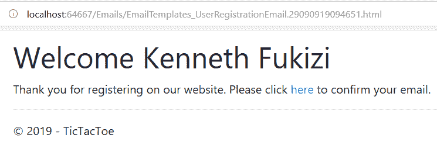

If you see the `InvalidOperationException: Unable to resolve service for type 'Microsoft.AspNetCore.Http.IHttpContextAccessor` error, you will need to register `IHttpContextAccessor` manually in the `Startup` class by adding `services.AddSingleton<IHttpContextAccessor, HttpContextAccessor>();` in the `ConfigureServices` method or by adding the built-in `services.AddHttpContextAccessor();` method.

在本书中，您已经了解了各种概念和代码示例，但我们仍然没有讨论如何确保我们的应用具有优异的质量和可维护性。下一节将介绍这个主题，它致力于应用测试。

# 通过创建单元测试和集成测试提供更好的质量

构建高质量的应用并满足应用用户是一项艰巨的任务。装运有技术和功能缺陷的产品可能会在应用的维护阶段导致巨大的问题。

最坏的情况是，由于维护对时间和资源的要求很高，您将无法尽快开发应用以缩短上市时间，并且无法提供令人兴奋的新功能。不要以为你的竞争对手没有等待！他们将超越你，你将失去市场份额和市场领导地位。

但是你怎么能成功呢？如何减少检测 bug 和功能问题的时间？您必须测试您的代码和应用，而且您必须尽可能多地、尽快地这样做。众所周知，在开发过程中修复 bug 更便宜、更快，而在生产过程中修复 bug 则需要更多的时间和金钱。

对于 bug，拥有一个较低的**平均修复时间**（**是平均修复时间**的缩写）对于成为特定市场中的未来市场领导者会产生很大的影响。

让我们稍微转移一下注意力，做一些最佳实践内务管理，这将需要在应用中使用。在 C#中，我们可以使用`String.IsNullOrEmpty()`方法检查字符串是否为 null 或空。我们需要这样做，因为有一个空字符串和一个空字符串是两种完全不同的情况。空字符串不一定为 null。

在处理集合时，也有一些情况，我们需要检查集合是否为 null 或空。不幸的是，我们没有像用于字符串的那种现成的实现，这意味着我们将自己创建它。

让我们转到 extensions 文件夹，创建一个名为`CollectionsEtensionMethods`的静态类，它包含两个方法，如下所示：

```cs
 public static class CollectionsExtensionMethods
    {
        public static bool IsNullOrEmpty<T>(this IEnumerable<T> 
         genericEnumerable)
        {
            return (genericEnumerable == null) || 
             (!genericEnumerable.Any());
        }

        public static bool IsNullOrEmpty<T>(this ICollection<T> 
         genericCollection)
        {
            if (genericCollection == null)
            {
                return true;
            }
            return genericCollection.Count < 1;
        }
    }
```

现在，只要我们从应用中的任何位置引用`TicTacToe.Extensions`名称空间，我们就可以对任何集合实现`IsNullOrEmpty()`检查。我们将在下面的代码片段中看到这一点，在这里我们将查看游戏会话结果，并找出它们是空的还是空的。

让我们继续开发 Tic-Tac-Toe 应用，并学习如何更详细地仔细测试它：

1.  在`GameSessionService`中新增`AddTurn`方法，更新游戏会话服务界面：

```cs
public async Task<GameSessionModel> AddTurn(Guid id, string email, int x, int y)
{
  var gameSession = _sessions.FirstOrDefault(session => session.Id 
    == id);
  List<TurnModel> turns;
  if (!gameSession.Turns.IsNullOrEmpty())
      turns = new List<TurnModel>(gameSession.Turns);
  else   turns = new List<TurnModel>();
  turns.Add(new TurnModel {User = await _UserService.GetUserByEmail
    (email), X = x, Y = y });
  if (gameSession.User1?.Email == email) gameSession.ActiveUser = 
    gameSession.User2;
  else  gameSession.ActiveUser = gameSession.User1;
  gameSession.TurnFinished = true;
  _sessions = new ConcurrentBag<GameSessionModel>(_sessions.Where(u 
    => u.Id != id))
      { gameSession };
  return gameSession;
}
```

2.  将名为`SetPosition`的新方法添加到`GameSessionController`：

```cs
        public async Task<IActionResult> SetPosition(Guid id,
         string email, int x, int y)
        {
            var gameSession =
            await _gameSessionService.GetGameSession(id);
            await _gameSessionService.AddTurn(gameSession.Id,
             email, x, y);
            return View("Index", gameSession);
        }
```

3.  将名为`InvitationEmailModel`的新模型添加到`Models`文件夹：

```cs
public class InvitationEmailModel
    {
        public string DisplayName { get; set; }
        public UserModel InvitedBy { get; set; }
        public DateTime InvitedDate { get; set; }
        public string ConfirmationUrl { get; set; }
    }
```

4.  将名为`InvitationEmail`的新视图添加到`Views/EmailTemplates`文件夹：

```cs
@model TicTacToe.Models.InvitationEmailModel
@{
    ViewData["Title"] = "View";
    Layout = "_LayoutEmail";
}
<h1>Welcome @Model.DisplayName</h1>
You have been invited by @($"{Model.InvitedBy.FirstName} { Model.InvitedBy.LastName} ") to play the Tic-Tac-Toe game.
Please click <a href="@Model.ConfirmationUrl">here</a> to join the game.
```

5.  更新`GameInvitationController`中的`Index`方法，以便能够使用我们前面提到的邀请电子邮件模板：

```cs
[HttpPost]
        public async Task<IActionResult> Index( GameInvitationModel 
          gameInvitationModel, [FromServices]IEmailService
          emailService)
        {
            var gameInvitationService = Request.HttpContext.
             RequestServices.GetService<IGameInvitationService>();
            if (ModelState.IsValid)
            {
                try
                {
                    var invitationModel = new InvitationEmailModel
                    {
                        DisplayName = $"{gameInvitationModel.
                        EmailTo}",
                        InvitedBy = await 
                         _userService.GetUserByEmail
                        ( gameInvitationModel.InvitedBy),
                        ConfirmationUrl = 
                        Url.Action("ConfirmGameInvitation", 
                         "GameInvitation",
                         new { id = gameInvitationModel.Id }, 
                         Request.Scheme, Request.Host.ToString()),
                         InvitedDate = gameInvitationModel.
                         ConfirmationDate
                    };
                    var emailRenderService = HttpContext.
                    RequestServices.GetService
                    <IEmailTemplateRenderService>();
                    var message = await emailRenderService.
                    RenderTemplate<InvitationEmailModel>
                    ("EmailTemplates/InvitationEmail",
                    invitationModel, Request.Host.ToString());
                    await emailService.SendEmail(
                        gameInvitationModel.EmailTo, 
                        _stringLocalizer

                      ["Invitation for playing a Tic-Tac-Toe
                      game"], message);
                }
                catch
                {
                }
                var invitation = gameInvitationService.Add
                (gameInvitationModel).Result;
                return RedirectToAction
                ("GameInvitationConfirmation", new { id = 
                 gameInvitationModel.Id });
            }
            return View(gameInvitationModel);
        }
```

6.  将名为`ConfirmGameInvitation`的新方法添加到`GameInvitationController`：

```cs
   [HttpGet]
        public IActionResult ConfirmGameInvitation(Guid id, 
         [FromServices]IGameInvitationService
         gameInvitationService)
        {
            var gameInvitation = gameInvitationService.
            Get(id).Result;
            gameInvitation.IsConfirmed = true;
            gameInvitation.ConfirmationDate = DateTime.Now;
            gameInvitationService.Update(gameInvitation);
            return RedirectToAction("Index", "GameSession", new
             { id 
             = id });
        }
```

7.  启动应用并验证所有内容是否按预期工作，包括启动新游戏的各种电子邮件和步骤。

既然我们已经实现了所有这些新代码，我们如何测试它呢？我们如何确保它按预期工作？我们可以在调试模式下启动应用，并验证所有变量设置是否正确以及应用流是否正确，但这将非常繁琐，效率也不高。

有什么比这样做更好？使用单元测试和集成测试。我们将在接下来的部分中介绍这些测试。

# 添加单元测试

单元测试允许您单独验证各种技术组件的行为，并确保它们按预期工作。它们还可以帮助您快速识别回归并分析新发展的总体影响。Visual Studio 2019 包含用于单元测试的强大功能。

测试资源管理器帮助您运行单元测试以及查看和分析测试结果。为此，您可以使用内置的 Microsoft 测试框架或其他框架，如 NUnit 或 xUnit。

此外，您可以在每次构建之后自动执行单元测试，以便开发人员可以在某些东西不能按预期工作时快速做出反应。

重构代码可以不用担心回归，因为单元测试确保一切都像以前一样工作。没有更多的借口，没有最好的代码质量可能！

您甚至可以更进一步，应用**测试驱动开发**（**TDD**），也就是在编写实现之前编写单元测试的地方。此外，单元测试成为某种设计文档和功能规范。进一步的步骤是应用**行为驱动开发**（**BDD**）并根据规范创建测试。

This book is about ASP.NET Core 3, so we won't go into too much detail about unit tests. It is, however, advised to dig deeper and familiarize yourself with all the different unit test concepts so that you can build better applications.

让我们了解使用 xUnit 是多么容易，它是 ASP.NET Core 3 的首选单元测试框架：

1.  将名为`TicTacToe.UnitTests`的 xUnit 测试项目（.NET Core）类型的新项目添加到 Tictaoe 解决方案中：


2.  使用 NuGet 软件包管理器将 xunit 和 Microsoft.NET.Test.SDK NuGet 软件包更新至其最新版本：


3.  添加对 TictaToe 和 TictaToe 的引用。日志记录项目：


4.  删除自动生成的类，添加一个名为`FileLoggerTests.cs`的新类来测试一个常规类，并实现一个名为`ShouldCreateALogFileAndAddEntry`的新方法：

```cs
public class FileLoggerTests
    {
        [Fact]
        public void ShouldCreateALogFileAndAddEntry()
        {
            var fileLogger = new FileLogger(
            "Test", (category, level) => true,
            Path.Combine(Directory.GetCurrentDirectory(), 
             "testlog.log"));
            var isEnabled = fileLogger.IsEnabled
             (LogLevel.Information);
            Assert.True(isEnabled);
        }
    }
```

5.  为测试服务添加另一个名为`UserServiceTests.cs`的新类，并实现一个名为`ShouldAddUser`的新方法：

```cs
public class UserServiceTests
{
 [Theory]
 [InlineData("test@test.com", "test", "test", "test123!")]
 [InlineData("test1@test.com", "test1", "test1", "test123!")]
 [InlineData("test2@test.com", "test2", "test2", "test123!")]
 public async Task ShouldAddUser(string email, string firstName, 
 string lastName, string password)
        { var userModel = new UserModel
            {   Email = email,
                FirstName = firstName,
                LastName = lastName,
                Password = password    };
            var userService = new UserService();
            var userAdded = await userService.RegisterUser
             (userModel);
            Assert.True(userAdded); }
    }
```

6.  通过测试| Windows |测试资源管理器打开测试资源管理器，并选择“全部运行”，以确保所有测试都成功执行：


单元测试非常重要，但也有一定的局限性。他们只单独测试每个技术组件，这是此类测试的主要目标。

单元测试背后的思想是在不减慢持续集成过程的情况下，一个接一个地快速了解所有技术组件的当前状态。他们不会在实际生产条件下测试应用，因为外部依赖关系是模拟的。相反，它们旨在快速运行，并确保被测试的每个方法不会在其他方法或类中产生意外的副作用。
如果您停在这里，您将无法像通常在开发阶段那样找到很多 bug。您必须更进一步，在真实环境中一起测试所有组件；这就是集成测试发挥作用的地方。

# 添加集成测试

集成测试是单元测试的逻辑扩展。它们在真实环境中测试应用中多个技术组件之间的集成，以访问外部数据源（如数据库、web 服务和缓存）。
这类测试的目标是确保在组合各种技术组件以创建应用行为时，一切都能正常工作，并提供预期的功能。

此外，集成测试应该始终具有清理步骤，以便它们可以重复运行而不会出错，并且不会在数据库或文件系统中留下任何工件。

在下面的示例中，您将了解如何将集成测试应用于 Tic Tac Toe 演示应用：

1.  将名为`TicTacToe.IntegrationTests`的 xUnit 测试项目（.NET Core）类型的新项目添加到 TictaToe 解决方案中，更新 NuGet 包，并添加对 TictaToe 和 TictaToe.Logging 项目的引用，如前面的单元测试项目所示。
2.  将`Microsoft.AspNetCore.TestHost`NuGet 包添加到`IntegrationTests`项目中，如下图所示。这允许我们使用 xUnit 创建全自动集成测试：


3.  删除自动生成的类，添加一个名为`IntegrationTests.cs`的新类，实现一个名为`ShouldGetHomePageAsync`的新方法：

```cs
        [Fact]
        public async Task ShouldGetHomePageAsync()
        {
            var response = await _httpClient.GetAsync("/");
            response.EnsureSuccessStatusCode();
            var responseString = await response.Content.
                ReadAsStringAsync();
            Assert.Contains("Welcome to the Tic-Tac-Toe Desktop 
             Game!", responseString);
        }
```

4.  在测试资源管理器中运行测试并确保它们成功执行。

现在您已经了解了如何测试应用，可以继续添加其他单元和集成测试，以充分理解这些概念，并构建测试覆盖率，从而提供高质量的应用。

# 分层 ASP.NET Core 3 应用

你们中的一些人可能已经注意到，将许多功能塞进一个项目并不总是一个好主意。我们的项目结构目前如下所示：


我们一直在添加一个又一个文件夹和文件夹内的文件夹，对于大型项目，它可能很快失控，并成为维护方面的噩梦。本节只为让您意识到在使用分层架构设计我们的解决方案时要考虑的最佳实践，其目的是实现以下几点：

*   定义的 SoC。
*   由于各层之间的耦合度较低，且各层之间的内聚力较高，因此维护的难度较小。
*   能够交换和切换层接口的不同实现的能力。
*   其他解决方案应该能够重用各个层公开的功能。

# 确定所需的图层

对于您将要编写的大多数应用，它们都具有通用功能。建议将此通用功能按层分组到不同的项目中。

在我们的`TicTacToe`演示应用中，我们将所有视图分组到一个项目中作为表示层，将`UserService`、`EmailService`等服务分组到服务层，将`UserModel`等所有模型分组到一个项目中作为域层，以及包含数据库上下文的数据访问层。这将在[第 9 章](09.html)*中解释，使用实体框架核心 3*访问数据。

我们的演示应用的假设分层应用如下所示：

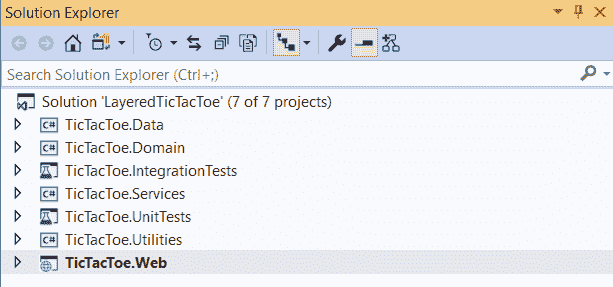

It's nice to have a layered application, but don't go on a wanton spree of randomly creating layers. The key is to look for functionality that makes sense for it to be grouped together so that you can make your application more maintainable and more scalable.

在本书中，我们将不使用这种分层体系结构。我们提到它只是为了让您了解，我们可以在许多方面改进`TicTacToe`应用的当前设计。

# 决定图层和组件的分布

层和组件应分布在单独的物理层上，但仅限于必要时。实现分布式部署有几个原因，包括安全策略、物理约束、共享业务逻辑和可伸缩性。

为了简化本书的内容，为了满足`TicTacToe`应用的需要，我们只将应用部署为单个实例，而不是分布式的（我们将在[第 12 章](10.html)、*托管 ASP.NET Core 3 应用*中介绍）。因此，只需说，还有其他方式和方法可以将具有多个实例的应用作为分布式应用托管。

In web applications, you should deploy the business layer and presentation layer components on the same physical tier to maximize performance and ease operational management, unless security restrictions need a trust boundary between them.

# 确定层间交互的规则

当涉及到分层策略时，必须为各层如何相互交互定义规则。指定交互规则的主要原因是最小化依赖关系和消除循环引用。例如，如果两个层都依赖于另一层中的组件，那么将引入循环依赖。

Only implement top-down interaction. Higher-level layers can interact with the layers below them, but a lower level layer should never interact with the layers above.

实施一条规则，帮助您避免层之间的循环依赖关系。事件可用于使较高层中的组件了解较低层中的更改，而无需引入依赖项。

# 确定交叉关注点

当您将项目分为多个层时，您会注意到在每个层中重复执行的一些功能。例如，您会发现必须在每个层中执行验证功能。另一个例子是，您每次都必须在不同的层中进行身份验证。最好的选择是识别这些类型的功能，并将它们作为交叉关注点分组到一个项目中。

横切关注点项目（层）的名称不必与此完全相同。您可以根据自己的意愿选择将项目命名为自己的名字。可以放在横切层中的其他候选功能包括如何管理应用的异常、如何缓存常用对象以及记录器功能。

将这些横切功能放在一个层中的好处是，您可以促进重用，并使我们的应用更易于维护。

Avoid mixing the cross-cutting code with code in the components of each layer so that the layers and their components only make calls to the cross-cutting components when they must carry out an action such as logging, caching, or authentication.

# 总结

在本章中，您了解了 MVC 模式、它的不同组件和层，以及它对于构建优秀的 ASP.NET Core 3 web 应用的重要性。

您学习了如何使用布局页面及其周围的功能来创建特定于设备的布局，从而使您的用户界面适应它们将运行的设备。此外，在了解了 ASP.NET Core 3 中不同类型的状态管理之后，我们使用查看页面构建 web 应用的可见部分，即表示层。

然后，我们讨论了部分视图、视图组件和标记帮助器，以便在应用的不同视图中封装和重用表示逻辑。最后，我们介绍了视图引擎等高级概念，以及用于创建高质量应用的单元测试和集成测试，这些应用的 bug MTTR 较低。

最后，我们了解了使用分层架构和我们需要考虑的基础结构来构造更复杂的应用是多么重要。

通过阅读本章，您现在可以创建视图、模型和控制器；检测移动设备；使用视图组件；将应用划分为多个区域；并决定为应用创建哪些层。

在下一章中，我们将讨论 ASP.NET Core 3 web API 框架以及如何构建、测试和部署 web API 应用。