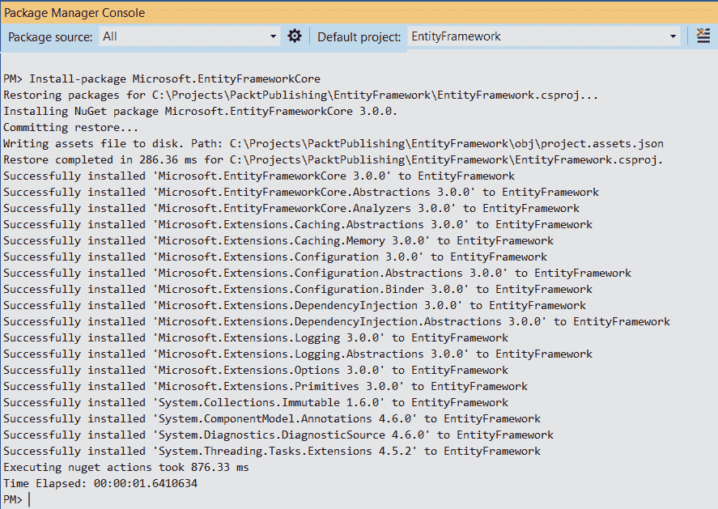
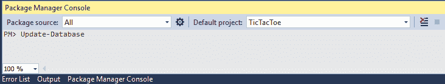
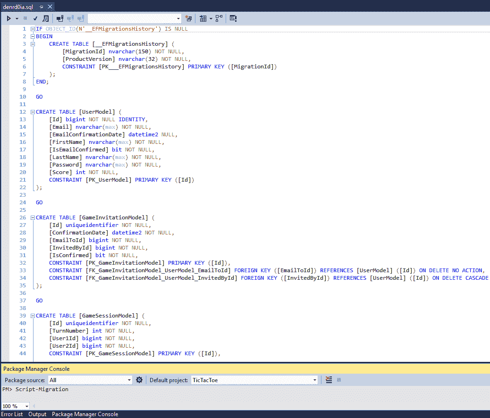

# 使用实体框架核心 3 访问数据

我们在 Tic-Tac-Toe 演示 web 应用程序的实现方面取得了长足的进步，但是当我们重新启动应用程序时，我们的用户注册和应用程序数据都不会被记住。这是因为我们**尚未保存或保留任何数据**。

要持久化数据并在应用程序启动时重新加载数据，我们必须将其放入某种持久性存储中，例如文件（XML、JSON、CSV）或数据库。

数据库将是最佳选择，因为与简单的文件存储相比，它提供了更好的性能和更高的安全性，这就是为什么我们将在本章的示例中使用这种方法。

从旧的 ASP.NET 3 天开始，我们已经能够使用名为**实体框架**的**对象关系映射**（**ORM**框架）以更高效、更简单的方式访问数据库中的数据。ASP.NET Core 3 可与此框架的专用版本**实体框架 Core 3**（实体框架 6.3 的一部分）无缝配合，也可与以前的版本配合使用。

我们将在本章开始介绍 Entity Framework Core 3.0 以及如何安装它。然后，我们将了解使用代码优先方法创建数据库所需的所有类，然后我们将向您展示如何执行迁移。接下来，我们将探讨正常的 CRUD 操作，并解释最常见和最重要的数据关系。最后，我们将更深入地解释查询并介绍事务。

本章结束时，您将能够使用 Entity Framework Core 连接到数据库，使用带更新的迁移，执行基本 CRUD 操作，使用 Fluent API，对数据库执行复杂查询，以及使用事务。

在本章中，我们将介绍以下主题：

*   实体框架核心 3 入门
*   使用实体框架核心 3 数据注释
*   使用实体框架核心 3 迁移
*   创建、读取、更新和删除数据
*   理解数据关系
*   处理查询
*   使用事务

# 实体框架核心 3 入门

`Microsoft.AspNetCore.App`元包包含 Entity Framework Core 3，包括您需要使用**Microsoft SQL Server**和**SQLite**的所有包。

Note that, if you need to work with other databases such as MySQL, you have to download additional packages from NuGet.

You can find a list of all the currently available Entity Framework Core 3 NuGet packages here: [https://www.nuget.org/packages?page=2&q=Tags%3A%22entity-framework-core%22](https://www.nuget.org/packages?page=2&q=Tags%3A%22entity-framework-core%22).

Entity Framework 是 Microsoft 版本的 ORM，并不是唯一可以在 ASP.NET Core 上使用的 ORM。其他与.NETCore 无缝协作的 ORM 包括 NHibernate、LINQtoSQL 和 Dapper。

ORM 是访问数据库的推荐方式，尤其是**关系数据库管理系统**（**关系数据库管理系统**），以抵消记录充分的阻抗失配。作为一名开发人员，ORMs 将您从 SQL 操作和实现的本质中抽象出来。

Entity Framework Core 3.0 是 Entity Framework Core 1.0 的更高版本，以及自 Entity Framework 版本专门为.NET Framework 设计以来一直在发展的后续版本。

通过在 Package Manager 控制台上运行以下命令，可以安装 Entity Framework Core 3.0：

```cs
Install-package Microsoft.EntityFrameworkCore
```

通过运行上述命令，您将收到以下输出：



您还需要在 Package Manager 控制台上使用以下命令安装 SQL Server 提供程序，因为它们可以协同工作：

```cs
Install-package Microsoft.EntityFrameworkCore.SqlServer
```

在实际开始使用 EF Core 3.0 之前，首先尝试建立到数据库的连接是很自然的，我们将在下一节中介绍。

# 建立联系

要打开数据库会话并查询和更新实体实例，您需要使用`DbContext`，它基于工作单元和存储库模式的组合。

让我们学习如何准备 Tic-Tac-Toe 应用程序，以便从头开始使用 Entity Framework Core 3 通过`DbContext`和连接字符串连接到 SQL 数据库：

1.  转到解决方案资源管理器，添加一个名为`Data`的新文件夹，添加一个名为`GameDbContext`的新类，并为每个模型实现一个`DbSet`属性（`UserModel`、`TurnModel`等等）：

```cs
        public class GameDbContext : DbContext
        {
           public DbSet<GameInvitationModel> GameInvitationModels 
            {get; set; }
           public DbSet<GameSessionModel> GameSessionModels { get; 
            set; }
           public DbSet<TurnModel> TurnModels { get; set; }
           public DbSet<UserModel> UserModels { get; set; }
           public GameDbContext(DbContextOptions<GameDbContext> 
            dbContextOptions) :      base(dbContextOptions)  { }
        }
```

2.  在`Startup`类中注册`GameDbContext`。然后，将连接字符串和数据库提供程序作为参数传递给构造函数。目前我们只需要一个实例，所以我们将使用`AddSingleton`：

```cs
        var connectionString = 
          _configuration.GetConnectionString("DefaultConnection"); 
        services.AddEntityFrameworkSqlServer() 
          .AddDbContext<GameDbContext>((serviceProvider,
           options) => options.UseSqlServer(connectionString).
            UseInternalServiceProvider(serviceProvider) 
        ); 

        var dbContextOptionsbuilder =
          new DbContextOptionsBuilder<GameDbContext>() 
          .UseSqlServer(connectionString); 
        services.AddSingleton(dbContextOptionsbuilder.Options); 
```

Please note that you will need to add the following `using` statements for the code to compile: `using TicTacToe.Data;` and
`using Microsoft.EntityFrameworkCore;`.

3.  更新名为`UserService.cs`的用户服务类，以便您可以使用游戏数据库上下文：`GameDbContext.cs`。为游戏数据库上下文添加新的公共构造函数和私有成员：

```cs
        private DbContextOptions<GameDbContext> _dbContextOptions; 
        public UserService(DbContextOptions<GameDbContext> 
         dbContextOptions) 
        { 
          _dbContextOptions = dbContextOptions; 
        } 
```

4.  更新`UserService`中的`RegisterUser`方法，以便您可以使用游戏数据库上下文：`GameDbContext`：

```cs
        public async Task<bool> RegisterUser(UserModel userModel) 
        { 
          using(var Database = new GameDbContext
            (_dbContextOptions)) 
          { 
            Database.UserModels.Add(userModel); 
            await Database.SaveChangesAsync(); 
            return true; 
          } 
        }  
```

5.  将名为`ModelBuilderExtensions`的新扩展添加到`Extensions`文件夹。这将用于定义表名约定：

```cs
        public static class ModelBuilderExtensions 
        { 
          public static void RemovePluralizingTableNameConvention(
           this ModelBuilder modelBuilder) 
          { 
            foreach (IMutableEntityType entity in 
             modelBuilder.Model.GetEntityTypes()) 
            { 
              entity.SetTableName(entity.DisplayName()); 
            } 
          } 
        } 
```

6.  更新游戏数据库上下文`GameDbContext`中的`OnModelCreating`方法，将模型配置为配置从`DbSet`属性中公开的实体类型中发现的模型，例如：`public DbSet<UserModel> UserModels { get; set; }`。然后，我们调用`ModelBuilderExtensions`扩展类来应用表名约定：

```cs
        protected override void OnModelCreating(ModelBuilder   
         modelBuilder) 
        { 
          modelBuilder.RemovePluralizingTableNameConvention(); 
        } 
```

Note that we could also use another method called `OnConfiguring` in the database context in order to configure the database context without using `DbContextOptions`.

7.  将名为`GameDbContextFactory`的新类添加到`Data`文件夹中。这将用于实例化游戏数据库上下文`GameDbContext`，具体选项如下：

```cs
        public class GameDbContextFactory : 
         IDesignTimeDbContextFactory<GameDbContext> 
        { 
          public GameDbContext CreateDbContext(string[] args) 
          { 
            var optionsBuilder =  new 
                DbContextOptionsBuilder<GameDbContext>(); 
            optionsBuilder.UseSqlServer(@"Server=
             (localdb)\MSSQLLocalDB;Database=TicTacToe;
             Trusted_Connection=True;
               MultipleActiveResultSets=true"); 
            return new GameDbContext(optionsBuilder.Options); 
          } 
        }
```

Note that you will have to add the following `using` statements so that the code compiles: `using Microsoft.EntityFrameworkCore;` and `using Microsoft.EntityFrameworkCore.Design;`.

如果您以前使用过数据库，那么应该熟悉连接字符串的概念。它们包含连接数据库所需的配置（地址、用户名、密码等）和设置（加密、协议等）。

在 ASP.NET Core 3 中，您还可以使用`appSettings.<env>.json`文件来配置连接字符串。当我们使用此文件中的`ConnectionStrings`部分时，会自动加载连接字符串：

```cs
    "ConnectionStrings": {
      "DefaultConnection":
      "Server=(localdb)\\MSSQLLocalDB;Database=TicTacToe;
        Trusted_Connection=True;MultipleActiveResultSets=true"
    }, 
```

如您所见，您可以使用`GetConnectionString`方法在运行时检索连接字符串：

```cs
    var databaseConnectionString =
      _configuration.GetConnectionString("DefaultConnection"); 
```

这是使用游戏数据库上下文`GameDbContext`以及存储在 Tic-Tac-Toe 应用程序的`appsettings.json`配置文件中的相应默认连接字符串所需知道的一切。

在我们开始在我们的模型上使用游戏数据库上下文之前，重要的是确保我们已经掌握了所有必需的基础知识，以便我们可以使用游戏数据库上下文来创建和访问数据库表。建议每个数据库表都有一个主键，如果它是一个关系表的话；如果它与另一个表相关，则需要有外键。在下一节中，我们将了解如何通过数据注释在代码中定义主键和外键。

# 通过数据注释定义主键和外键

现在，我们需要修改现有的模型，以便能够在 SQL 数据库中持久化它们。为了允许 EntityFrameworkCore3.0 创建、读取、更新和删除记录，我们需要为每个模型指定一个主键。我们可以通过使用数据注释来实现这一点，数据注释允许我们使用`[Key]`装饰器装饰属性。

以下是如何使用`UserModel`的数据注释的示例：

```cs
    public class UserModel 
    { 
      [Key] 
      public long Id { get; set; } 
      ... 
    }
```

您应该将此应用于 Tic Tac Toe 应用程序中的`UserModel`、`GameInvitationModel`、`GameSessionModel`和`TurnModel`。您可以重用现有的`Id`属性，并使用`[Key]`装饰器对其进行装饰，或者在模型尚未包含`Id`属性的情况下添加新属性。

Note that it is sometimes required to use composite keys as the identity for your rows in a table. In this case, decorate each property with the `[Key]` decorator. Furthermore, you can use `Column[Order=]` to define the position of the property if you need to order a composite key.

在使用**SQL Server**（或任何其他 SQL 92 DBMS）时，首先要考虑的是表之间的关系。在 Entity Framework Core 3 中，您可以使用`[ForeignKey]`装饰器在模型中指定外键。

关于 Tic Tac Toe 应用程序，这意味着您必须更新`GameInvitationModel`并向用户模型 ID 添加外键关系。执行以下步骤：

1.  更新`GameInvitationModel`并向`InvitedByUser`属性添加外键属性：

```cs
        public class GameInvitationModel 
        { 
          [Key] 
          public Guid Id { get; set; } 
          public string EmailTo { get; set; } 

          public string InvitedBy { get; set; } 
          public UserModel InvitedByUser {get; set;}
          [ForeignKey(nameof(InvitedByUserId))]           
          public Guid InvitedByUserId { get; set; } 

          public bool IsConfirmed { get; set; } 
          public DateTime ConfirmationDate { get; set; } 
        } 
```

这是一个已经存在的`GameInvitationalModel`类，我们只是用`[Key]`属性装饰属性`Id`，以便 Entity Framework Core 3.0 能够将其识别为主键。外键属性`[ForeignKey(nameof(InvitedByUserId)]`修饰名为`InvitedUserId`的 GUID，以便 EF Core 3.0 能够将此属性视为另一个表的外键。

2.  更新`GameSessionModel`并在`UserId1`中添加外键：

```cs
        public class GameSessionModel
        {
          [Key]
          public Guid Id { get; set; }
          ...

          [ForeignKey(nameof(UserId1))]
          public UserModel User1 { get; set; }
          ...
        }  
```

这里，我们有一个`GameSessionModel`POCO 类，它在`Id`属性上有一个主键属性，在名为`User 1`的用户模型上有一个辅助键属性。这将允许 EF Core 3.0 创建一个`GameSessionModel`表，分别使用名为`Id`的主键和名为`User1`的外键。

3.  更新`TurnModel`并在`UserId`中添加外键：

```cs
        public class TurnModel
        {
          [Key]
          public Guid Id { get; set; }

          [ForeignKey(nameof(UserId))]
          public Guid UserId { get; set; }
          public UserModel User { get; set; }
          public int X { get; set; }
          public int Y { get; set; }
          public string Email { get; set; }
          public string IconNumber { get; set; }
        } 
```

默认情况下，EntityFrameworkCore3 使用模式表示映射模型中的所有属性。但是一些更复杂的属性类型不兼容，这就是为什么我们应该将它们从自动映射中排除。但我们如何做到这一点？嗯，通过使用`[NotMapped]`装饰器。这有多简单和直接？

4.  对于 Tic-Tac-Toe 应用程序，将活动用户保留一段时间是没有意义的，因此您应该使用`GameSessionModel`中的`[NotMapped]`装饰器将其从自动映射过程中排除：

```cs
    public class GameSessionModel 
    { 
      [Key] 
      public Guid Id { get; set; } 
      ...

      [NotMapped] 
      public UserModel Winner { get; set; } 

      [NotMapped] 
      public UserModel ActiveUser { get; set; } 
      public Guid WinnerId { get; set; } 
      public Guid ActiveUserId { get; set; } 
      public bool TurnFinished { get; set; } 
      public int TurnNumber { get; set; } 
    } 
```

现在您已经使用 Entity Framework Core 3 数据注释装饰了所有模型，您将注意到在`GameSessionModel`中有两个属性`User1`和`User2`，它们指向相同的`UserModel`实体。这会导致循环关系，这会给我们（在处理关系数据库时）执行诸如级联更新或级联删除之类的操作带来问题。

For more information on Entity Framework Data Annotations, please visit [https://msdn.microsoft.com/en-us/library/jj591583(v=vs.113).aspx](https://msdn.microsoft.com/en-us/library/jj591583(v=vs.113).aspx).

5.  为了避免循环关系，您需要使用`[ForeignKey]`装饰器装饰`User1`，并更新游戏数据库上下文`GameDbContext`中的`OnModelCreating`方法，为`User2`定义外键。这两个修改将允许您定义两个外键，同时避免自动级联操作，这将导致问题：

```cs
    protected override void OnModelCreating(ModelBuilder 
     modelBuilder) 
    { 
      modelBuilder.RemovePluralizingTableNameConvention(); 
      modelBuilder.Entity(typeof(GameSessionModel)) 
      .HasOne(typeof(UserModel), "User2") 
      .WithMany() 
      .HasForeignKey("User2Id").OnDelete(DeleteBehavior.Restrict); 
    }
```

6.  现在，您需要修复单元测试。您可能已经注意到，如果您尝试编译解决方案，单元测试项目将不再构建。在这里，您需要更新单元测试，因为`UserService`现在需要`DbContextOptions`的实例，如下所示：

```cs
    var dbContextOptionsBuilder =
      new DbContextOptionsBuilder<GameDbContext>()
      .UseSqlServer(@"Server=
        (localdb)\MSSQLLocalDB;Database=TicTacToe;
       Trusted_Connection=True;MultipleActiveResultSets=true");

    var userService = new 
      UserService(dbContextOptionsBuilder.Options); 
```

Please note that, while the preceding code snippet fixes the tests, it is not good practice to work with real database connections inside unit tests. Ideally, the data connection should be mocked or abstracted in some way. If you need to use real data for integration tests, the connection information should come from a config file instead of being hardcoded.

现在，单元测试为`UserService`的构造函数提供了选项生成器的新重载。现在我们已经在模型中定义了主键和外键，我们可以创建初始数据库模式，并为迁移准备应用程序。在下一节中，我们将介绍 EF Core 3 迁移。

# 使用实体框架核心 3 迁移

正如您已经看到的，在开发应用程序时，当您重构和完成项目时，您的模型可能会频繁更改。这可能导致数据库架构不同步，需要手动更新。您可以通过创建升级的脚本来实现这一点，但这不是一个理想的解决方案。

幸运的是，EntityFrameworkCore3 包含了一个名为**迁移**的特性来帮助您完成这项繁琐的任务。它会自动使您的模型及其相应的数据库模式保持同步。

在您更新了模型、服务和控制器，使其符合前面的约束条件并修改了游戏数据库上下文`GameDbContext`之后，相应地，您就可以使用 Entity Framework Core 3 迁移了。以下步骤将向您展示如何使用 Entity Framework Core 3 迁移：

1.  添加名为`InitialDbSchema`的数据库模式的第一个版本。要执行此操作，请通过单击工具| NuGet Package Manager | Package Manager 控制台打开 NuGet Package Manager，并执行`Add-Migration InitialDbSchema`命令：


2.  Visual Studio 将自动添加名为`Migrations`的新文件夹。它将包含两个自动生成的文件，这些文件将帮助您在将来管理和升级数据库架构：


如果可以从开发环境访问数据库，则可以直接从 Visual Studio 2019 中更新数据库。以下步骤将引导您完成更新过程：

1.  进入 Package Manager 控制台，执行`Update-Database`命令。这将在首次使用数据库时创建数据库，或在更改模型时自动更新数据库：



2.  然后，转到 SQL Server 对象资源管理器，分析 Entity Framework 3 迁移在 SQL Server 中自动生成的数据库架构：


3.  之后，右键单击`__EFMigrationsHistory`表并选择查看数据，查看实体框架迁移如何跟踪数据库架构版本：


如果无法从开发环境（例如，在暂存或生产环境中）访问数据库，则必须生成 SQL 脚本文件。

4.  转到 Package Manager 控制台，执行`Script-Migration`命令自动生成 SQL 脚本文件，该文件可用于创建 Tic Tac Toe 应用程序的数据库：



5.  然后，在特定的环境中执行生成的 SQL 脚本文件，如使用首选的数据库工具（例如，SQL Server Management Studio 等）进行登台和生产，以创建 Tic Tac Toe 应用程序的数据库。

您还可以直接从代码中使用 Entity Framework Core 3 迁移，以确保数据库始终与模型同步。为此，需要在`Startup`类的`Configure`方法中调用`GameDbContext`实例的`Migrate`方法。执行以下步骤以执行此操作：

1.  更新`Startup`类中的`Configure`方法，并在方法底部添加以下说明：

```cs
        using (var scope =
         app.ApplicationServices.GetService<IServiceScopeFactory>()
          .CreateScope()) 
        { 
          scope.ServiceProvider.GetRequiredService<GameDbContext>()
           .Database.Migrate(); 
        } 
```

这将游戏数据库上下文的`Migrate`方法作为一个作用域服务，可以在应用程序运行时解析。

2.  按*F5*启动 Tic Tac Toe 应用程序

Note that if a table or property doesn't exist in the database and if the connection string provides enough access rights, Entity Framework Core 3 will automatically create the missing table or the property/column that does not exist.

现在我们已经更新了模型和相应的应用程序数据库，所有模型数据都将被持久化，应用程序状态将可用，即使在应用程序重新启动之后也是如此。这意味着你不能注册已经存在的电子邮件，你必须手动添加新的电子邮件，所以现在就截断数据库并删除它们。

在下一节中，我们将重点介绍创建、读取、更新和删除数据。

# 创建、读取、更新和删除数据

到目前为止，我们已经定义了我们的模型，并以一致和连贯的方式启动和运行了数据库。在本节中，我们将学习如何处理数据并执行创建、读取、更新和删除操作。

让我们学习如何使用`GameDbContext`处理数据：

1.  首先更新`UserService`，删除`ConcurrencyBag`和静态构造函数，更新`GetUserByEmail`方法：

```cs
        public async Task<UserModel> GetUserByEmail(string email) 
        { 
          using (var Database = new 
            GameDbContext(_dbContextOptions)) 
          { 
            return await Database.UserModels.FirstOrDefaultAsync(
             x => x.Email == email); 
          } 
        } 
```

2.  更新`UserService`中的`UpdateUser`方法，学习如何使用数据库上下文更新数据：

```cs
        public async Task UpdateUser(UserModel userModel) 
        { 
          using (var gameDbContext =
            new GameDbContext(_dbContextOptions)) 
          { 
            gameDbContext.Update(userModel); 
            await gameDbContext.SaveChangesAsync(); 
          } 
        } 
```

3.  更新`UserService`中的`GetTopUsers`方法，学习如何使用数据库上下文通过排序和过滤数据构建高级查询：

```cs
        public async Task<IEnumerable<UserModel>> GetTopUsers(
         int numberOfUsers) 
        { 
          using (var gameDbContext =
           new GameDbContext(_dbContextOptions)) 
          {  
            return await gameDbContext.UserModels.OrderByDescending(
             x => x.Score).ToListAsync(); 
          } 
        } 
```

4.  在`UserService`中添加一个名为`IsUserExisting`的新方法。这将用于检查用户是否存在。更新`IUserService`界面：

```cs
        public async Task<bool> IsUserExisting(string email) 
        { 
          using (var gameDbContext =
           new GameDbContext(_dbContextOptions)) 
          {  
            return await gameDbContext.UserModels.AnyAsync(
             user => user.Email == email); 
          } 
        } 
```

在本节中，您学习了如何配置应用程序，以便它们可以使用 EntityFrameworkCore3 及其所有有用和有趣的功能。这是一种从开发人员的日常生活中抽象复杂性和消除耗时任务的好方法。

您不需要学习任何其他语言（如 SQL），也不需要更改环境来创建、读取、更新和删除数据库中的记录。一切都可以在您的代码和 VisualStudio 中完成，以确保开发人员的高生产率和效率。

# 理解数据关系

让我们从我们的正常演示 Tic Tac Toe 游戏应用休息一下，看看一些实体框架核心 3 概念更详细。

在理解和进行任何高级查询之前，了解两个或多个实体之间可能存在的数据关系是很重要的。

我们已经从主键和外键的角度看了基础知识，但是让我们看一下它们的定义，这将帮助您更好地理解这些术语。

# 主键

主键用于唯一标识表中的每条记录。例如，在学生表中，它将是学生 ID 列。我们需要注意的是，主键可以是复合键，其中两个不同的列可以组合成表中记录的唯一标识符。

在任何表中，每个记录的主键列中都必须有一个非空值，并且它应该始终是唯一的，并且从不重复。

对于关系表，必须定义主键。定义主键后，不能在同一个表中定义另一个主键。

索引用于存储主键，使其保持唯一，并确保外键可以引用它。

我们在本章前面的示例中使用了`[Key]`属性来定义模型上的主键。

# 外键

表中的外键是用来引用其他表中主键的列。与主键一样，外键也可以是多个列的组合。

当您有两个不同的表或实体相互关联时，有几种方法可以将它们关联起来。例如，您可以有一对一、一对多和多对多的关系。

在本章的示例中，我们主要使用一个`[ForeignKey]`属性来修饰我们想要用作外键的字段，但我们也可以使用 Fluent API 来定义外键。我们可以将`.HasForeignKey()`属性用于此：

```cs
protected override void OnModelCreating(ModelBuilder modelBuilder) 
    {       
      modelBuilder.Entity(typeof(GameSessionModel)) 
      .HasOne(typeof(UserModel), "User2") 
      .WithMany() 
      .HasForeignKey("User2Id")
      .OnDelete(DeleteBehavior.Restrict); 
    }
```

前面的代码片段还有几个其他属性，我们可以使用这些属性定义表之间的关系，示例包括`.HasOne()`和`.WithMany()`。我们将在本章后面解释这些。

# 一对一关系

当我们有一对一的关系时，我们可以说一个表中的一条记录只能与另一个表中的一条记录有关系。

例如，如果我们有一个`User`类和一个`UserAvatar`类，并且一个用户有一个且只有一个化身，那么我们可以使用 Fluent API 表示这一点，如下所示：

```cs
    protected override void OnModelCreating(ModelBuilder modelBuilder)
    {
        modelBuilder.Entity<User>()
            .HasOne(u => u.UserAvatar)
 .WithOne(a => a.User)
            .HasForeignKey<UserAvatar>(u => u.UserForeignKey);
    }
```

在前面的代码片段中，我们在用户和他们的化身之间有一对一的关系。这由粗体代码表示，即`.HasOne(u => u.UserAvatar).WithOne(a => a.User)`。这两方面都适用。

# 一对多关系

当我们有一对多关系时，我们可以说一个表中的一条记录与另一个表中的多条记录相关。

一对多关系的一个例子是用户和游戏会话之间的关系。假设我们有一个`User`类和一个`GameSession`类，一对多关系可以用 Fluent API 表示，如下所示：

```cs
protected override void OnModelCreating(ModelBuilder modelBuilder)
    {
        modelBuilder.Entity<User>()
            .HasOne(u => u.GameSession)
 .WithMany(g => g.User)
            .HasForeignKey<GameSession>(u => u.UserForeignKey);
    }
```

前面的代码片段仍然使用`.HasOne()`属性，但区别在于它链接到`.HasMany()`属性，使其成为一对多关系。

# 多对多关系

当我们有多对多关系时，我们可以说一个表中的一条记录与另一个表中指定关系中的多条记录相关，反之亦然。

学生与课程之间的关系就是一个例子。

使用 Entity Framework Core 3.0，您不能让 Fluent API 直接创建多对多关系，但您可以使用一种变通方法。为此，我们可以构造一个联接表并映射这两个类。让我们来看看如何做到这一点。

假设我们有一个名为`Student`的类和一个名为`Course`的类。通过这些类，我们可以创建一个`StudentCourse`表，如下所示：

```cs
public class Student
{    
   public long Id { get; set; }     
   public string Name { get; set; }     
   public StudentDetails StudentDetails { get; set; }

   public ICollection<StudentSubject> StudentSubjects { get; set; }
     // Added after constructed table
}
```

然后，我们可以有一个`Course`表和一个`StudentCourse`连接表，如下所示：

```cs
public class Course
{    
    public long Id { get; set; }
    public string CourseName { get; set; }

    public ICollection<StudentCourse> StudentCourses { get; set; }
    // Added after constructed table
}

public class StudentCourse
{
    public long StudentId { get; set; }
    public Student Student { get; set; }

    public long CourseId { get; set; }
    public Course Course { get; set; }
}
```

现在，我们可以使用 Fluent API 来表示我们的多对多关系，如下所示：

```cs
protected override void OnModelCreating(ModelBuilder modelBuilder)
    {
        modelBuilder.HasKey(s => new { s.StudentId, s.SubjectId });

        modelBuilder.HasOne(ss => ss.Student)
            .WithMany(s => s.StudentSubjects)
            .HasForeignKey(ss => ss.StudentId);

        modelBuilder.HasOne(ss => ss.Subject)
            .WithMany(s => s.StudentSubjects)
            .HasForeignKey(ss => ss.SubjectId);
    }
```

在这里，我们做了一个变通方法，这样我们可以在学生和课程实体之间建立多对多关系。

有了这些关系，Entity Framework 将在执行迁移和更新数据库时创建必要的表，但数据库中的数据有什么好处呢？我们需要能够查询和利用它。在下一节中，我们将讨论如何处理查询。

# 处理查询

有几种方法可以检索保存在数据库中的数据，包括原始 SQL 语句，但到目前为止，最方便、最安全的选择是使用 LINQ。

在本节中，我们将介绍两个使用 LINQ 查询数据库的最典型示例。

# 查询一个项目

如果我们必须获得游戏会话，我们将使用以下代码：

```cs
using (var context = new GameDbContext())
{
    var gameSession = context.GameSessions
        .SingleOrDefault
            (g => g.GameSessionId == Guid.Parse("002e6431-3eb5-
             4d98-b3d9-3263490ce7c0"));
}
```

# 查询所有项目

如果我们必须返回到目前为止玩过的所有游戏会话，我们将使用以下代码：

```cs
using (var context = new GameDbContext()) 
{     
    var gameSessions = context.GameSessions.ToList(); 
}
```

# 查询筛选的项目

假设我们有以下代码：

```cs
using System.Linq;

using (var db = new GameDbContext()) 
{     
   var users = db.Users
         .Where(u => u.GamesPlayed > 5)
         .OrderBy(u => u.FirstName)
         .ToList(); 
}
```

在前面的代码中，我们试图假设返回所有使用 LINQ 玩了超过`5`个游戏的用户。您还可以使用 LINQ 中可用的任何其他方法和属性，包括`GroupBy`、`OrderByDescending`等。LINQ 本身就是一个非常强大的库，建议您熟悉它。如果您完全是 LINQ 的初学者，它可能会帮助您完成这里的基础知识：[https://docs.microsoft.com/en-us/dotnet/csharp/programming-guide/concepts/linq/basic-linq-query-operations](https://docs.microsoft.com/en-us/dotnet/csharp/programming-guide/concepts/linq/basic-linq-query-operations) 。

You will find that a tool called LINQPad, especially version 6, which can be found at [https://www.linqpad.net/LINQPad6.aspx](https://www.linqpad.net/LINQPad6.aspx), is a great resource for working with LINQ in .NET Core 3.

在更复杂的场景中，可能会有多个查询为了一个目的一起运行，在这些情况下，如果组中的一个查询失败，则可能需要回滚所有其他查询。这是交易开始发挥作用的时候。我们将在下一节中查看事务。

# 使用事务

一个好的数据库实现将具有**原子性、一致性、隔离性和耐久性**（**ACID**属性。

事务对于维护数据库中的数据完整性至关重要。它们有助于确保逻辑分组在一起的数据被视为操作单元中的一项。这对确保酸的性质得到保留有很大的帮助。

当触发一个操作单元并将其保存到数据库时，所有组成逻辑分组的操作都会成功保存。这就是所谓的**交易**。如果部分事务失败，则所有事务都将回滚。事务在全有或全无的场景中运行。

Microsoft SQL Server 数据库是许多实际支持事务的数据库之一。这意味着，如果我们使用 Entity Framework Core 调用`SaveChanges()`方法，那么每个更改都会被视为事务的一部分，因此所有更改都会被保存，或者在出现错误时不会保存任何更改。

您不一定需要以自己的自定义方式实现事务，尤其是在可能需要开发的最基本的应用程序中。

对于大多数应用程序，此默认行为已足够。只有当应用程序需求认为有必要时，才应该手动控制事务。但如果需要，您可以将流程放入事务中，如下所示：

```cs
using (var gameContext = new GameDbContext())
{
    using (var gameTransaction = 
        gameContext.Database.BeginTransaction())
    {
        try
        {
            gameContext.GameInvitation.Add(new GameInvitation { ... });
            gameContext.SaveChanges();

            gameContext.GameSession.Add(new GameSession { ... });
            gameContext.SaveChanges();

            gameTransaction.Commit(); // Both the above
             operations will be in this transaction
        }
        catch (Exception Ex)
        {
            Console.WriteLine(Ex.Message)
        }
    }
}
```

在前面的代码片段中，我们实例化了一个新的游戏数据库上下文，并通过添加游戏邀请和游戏会话的两个进程在其上启动了一个事务。这些都是一次性完成的，如果其中任何一个单独失败，那么它们都不会被保存——要么全有，要么什么都没有。

为了本书的目的，这是结束我们对 EntityFrameworkCore3.0 的讨论的一个很好的地方，本书主要关注 ASP.NETCore3。

# 总结

在本章中，我们学习了如何将 Entity Framework Core 3 与 ASP.NET Core 3 结合使用，以便使用 SQL Server 数据库。

我们已经了解了如何使用数据库上下文和连接字符串连接到 SQLServer 数据库。然后，我们使用 Entity Framework Core 3 数据注释，并在数据库上下文中重写`OnModelCreating`方法，用主键和外键定义更新了 Tic Tac Toe 应用程序中的模型。

我们使用 Entity Framework Core 3 迁移，以使代码中的模型与其相应的数据库表示保持一致。

此外，我们还学习了如何以简单、高效的方式插入、更新和查询数据。我们还学习了如何使用 Fluent API 查询数据库以及如何使用事务。

在下一章中，我们将讨论如何使用 ASP.NET Core 3 的集成授权功能保护对 ASP.NET Core 3 应用程序的访问。