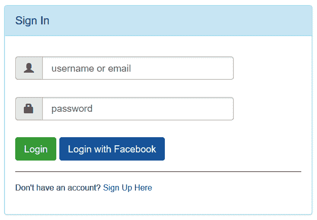
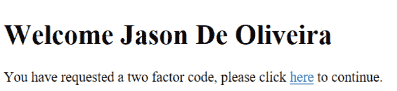
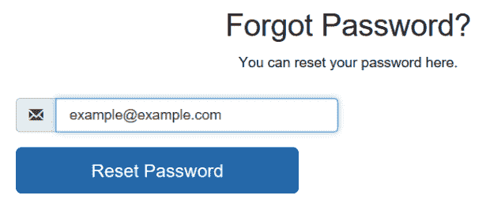
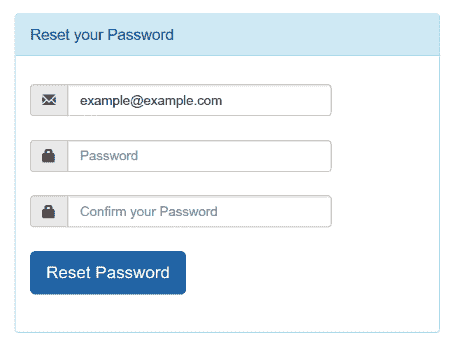
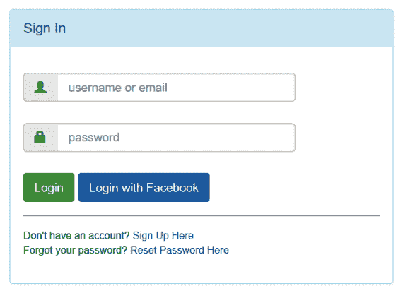
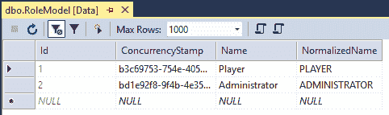
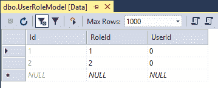
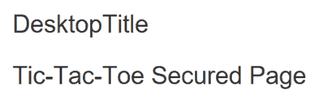
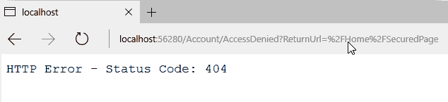

# 十、保护 ASP.NET Core 3 应用的安全

在数字犯罪和互联网欺诈日益增多的今天，所有现代网络应用都需要实施强大的安全机制，以防止攻击和用户身份盗用。

到目前为止，我们主要集中在了解如何构建高效的 ASP.NET Core 3 web 应用，而根本不考虑用户身份验证、授权或任何数据保护，但由于 Tic Tac Toe 应用越来越复杂，在最终向公众部署之前，我们必须解决安全问题。

构建一个 web 应用而不考虑安全性将是一个巨大的失败，甚至可能会毁掉最伟大和最著名的网站。在安全漏洞和个人数据被盗的情况下，负面声誉和用户信心的影响可能是巨大的，没有人愿意再与这些应用和更麻烦的公司合作。

这是一个需要认真对待的话题。您应该与安全公司合作执行代码验证和入侵测试，以确保您遵守最佳实践和高安全标准（例如，OWASP 前 10 名可在此处找到：[https://www.owasp.org/index.php/Category:OWASP_Top_Ten_Project](https://www.owasp.org/index.php/Category:OWASP_Top_Ten_Project) ）。

幸运的是，ASP.NET Core 3 包含了帮助您解决这个复杂但重要的主题所需的一切。大多数内置功能甚至不需要高级编程或安全技能。您将看到，使用 ASP.NET Core 3 Identity framework 很容易理解和实现安全应用。

本章将学习的主要技能包括如何验证应用的用户身份，以及如何授权用户在应用中执行不同的任务。您将学习如何使用不同类型的身份验证，包括如何实现双因素身份验证。

我们自然会从实现身份验证开始，然后实现授权。在身份验证中，我们将首先查看基本形式的身份验证，然后再查看添加外部身份验证、使用双因素身份验证，最后添加忘记密码的机制和重置机制，然后再整体处理授权。

在本章中，我们将介绍以下主题：

*   实施身份验证：
    *   添加基本用户表单身份验证
    *   添加外部提供程序身份验证
    *   添加忘记密码和密码重置机制
    *   使用双因素身份验证
*   实施授权

# 实现身份验证

身份验证允许应用*识别*特定用户。它不用于管理用户访问权限（授权角色），也不用于保护数据（数据保护角色）。

有几种用于验证应用用户的方法，例如：

*   基本用户表单身份验证，使用带有登录和密码框的登录表单
*   **单点登录**（**SSO**）身份验证，用户在其公司上下文中对其所有应用只进行一次身份验证
*   社交网络外部提供商身份验证（如 Facebook 和 LinkedIn）
*   证书或**公钥基础设施**（**PKI**认证

ASP.NET Core 3 支持所有这些方法，但在本章中，我们将重点介绍使用用户登录名和密码的表单身份验证，以及通过 Facebook 的外部提供商身份验证。

在以下示例中，您将看到如何使用这些方法对应用用户进行身份验证，以及一些更高级的功能，如电子邮件确认和密码重置机制。

最后，您将看到如何使用内置的 ASP.NET Core 3 身份验证功能为最关键的应用实现双因素身份验证。

让我们为 Tic-Tac-Toe 应用准备不同身份验证机制的实现：

1.  更新`Startup`类中`UserService`、`GameInvitationService`和`GameSessionService`的生存期：

```cs
        services.AddTransient<IUserService, UserService>(); 
        services.AddScoped<IGameInvitationService,
         GameInvitationService>(); 
        services.AddScoped<IGameSessionService, GameSessionService>
    (); 
```

2.  更新`Startup`类中的`Configure`方法，在静态文件中间件之后直接调用认证中间件：

```cs
        app.UseStaticFiles(); 
        app.UseAuthentication(); 
```

3.  更新`UserModel`使用内置 ASP.NET Core 身份认证功能，删除`IdentityUser`类已经提供的`Id`和`Email`属性：

```cs
        public class UserModel : IdentityUser<Guid> 
        { 
          [Display(Name = "FirstName")] 
          [Required(ErrorMessage = "FirstNameRequired")] 
          public string FirstName { get; set; } 
          [Display(Name = "LastName")] 
          [Required(ErrorMessage = "LastNameRequired")] 
          public string LastName { get; set; }     
          [Display(Name = "Password")] 
          [Required(ErrorMessage = "PasswordRequired"), 
            DataType(DataType.Password)] 
          public string Password { get; set; } 
          [NotMapped] 
          public bool IsEmailConfirmed{ get {
             return EmailConfirmed; }  } 
          public System.DateTime? EmailConfirmationDate { get; set; 
        } 
          public int Score { get; set; } 
        }
```

Note that in the real world, we would advise also removing the `Password` property. However, we will keep it in the example for clarity and learning purposes.

4.  添加一个名为`Managers`的新文件夹，在名为`ApplicationUserManager`的文件夹中添加一个新的管理器，然后添加以下构造函数：

```cs
public class ApplicationUserManager : UserManager<UserModel> 
{ 
private IUserStore<UserModel> _store;
DbContextOptions<GameDbContext> _dbContextOptions;
public ApplicationUserManager(DbContextOptions<GameDbContext> dbContextOptions,
IUserStore<UserModel> store, IOptions<IdentityOptions> optionsAccessor, IPasswordHasher<UserModel> passwordHasher, IEnumerable<IUserValidator<UserModel>> userValidators,IEnumerable<IPasswordValidator<UserModel>> passwordValidators, ILookupNormalizer Normalizer,IdentityErrorDescriber errors, IServiceProvider services,
ILogger<UserManager<UserModel>> logger) :
      base(store, optionsAccessor, passwordHasher, userValidators, 
       passwordValidators, keyNormalizer, errors, services, logger)
        {
            _store = store;
            _dbContextOptions = dbContextOptions;
        }
          ...
 }
```

*   让我们看一下创建一个功能全面的`ApplicationUserManager`类的步骤：

    1.  增加`FindByEmailAsync`方法如下：

```cs
          public override async Task<UserModel> FindByEmailAsync
            (string email) 
          { 
            using (var dbContext = new GameDbContext
              (_dbContextOptions)) 
            { 
              return await dbContext.Set<UserModel>
               ().FirstOrDefaultAsync(
               x => x.Email == email); 
            } 
          }
```

```cs
public override async Task<UserModel> FindByIdAsync(string 
  userId) 
          { 
            using (var dbContext = new GameDbContext
             (_dbContextOptions)) 
            { 
              Guid id = Guid.Parse(userId); 
              return await dbContext.Set<UserModel>
               ().FirstOrDefaultAsync(
               x => x.Id == id); 
            } 
          } 
```

```cs
public override async Task<IdentityResult> UpdateAsync
    (UserModel user) 
{ 
  using (var dbContext = new GameDbContext(_dbContextOptions)) 
  { 
   var current = await dbContext.Set<UserModel>
    ().FirstOrDefaultAsync(x => x.Id == user.Id); 
   current.AccessFailedCount = user.AccessFailedCount; 
   current.ConcurrencyStamp = user.ConcurrencyStamp; 
   current.Email = user.Email; 
   current.EmailConfirmationDate = user.EmailConfirmationDate; 
   current.EmailConfirmed = user.EmailConfirmed; 
   current.FirstName = user.FirstName; 
   current.LastName = user.LastName; 
   current.LockoutEnabled = user.LockoutEnabled; 
   current.NormalizedEmail = user.NormalizedEmail; 
   current.NormalizedUserName = user.NormalizedUserName; 
   current.PhoneNumber = user.PhoneNumber; 
   current.PhoneNumberConfirmed = user.PhoneNumberConfirmed; 
   current.Score = user.Score; 
   current.SecurityStamp = user.SecurityStamp; 
   current.TwoFactorEnabled = user.TwoFactorEnabled; 
   current.UserName = user.UserName; 
   await dbContext.SaveChangesAsync(); 
   return IdentityResult.Success; 
   } 
  }
```

```cs
public override async Task<IdentityResult> ConfirmEmailAsync(UserModel user, string token) 
  { 
    var isValid = await base.VerifyUserTokenAsync(user,
     Options.Tokens.EmailConfirmationTokenProvider,
     ConfirmEmailToken
     Purpose, token); 
    if (isValid) 
    { 
      using (var dbContext =  new GameDbContext
        (_dbContextOptions)) 
      { 
        var current =  await dbContext.UserModels.
         FindAsync(user.Id); 
        current.EmailConfirmationDate = DateTime.Now; 
        current.EmailConfirmed = true; 
        await dbContext.SaveChangesAsync(); 
        return IdentityResult.Success; 
       } 
     } 
     return IdentityResult.Failed(); 
     } 
   }                             
```

5.  更新`Startup`类，注册`ApplicationUserManager`类：

```cs
        services.AddTransient<ApplicationUserManager>(); 
```

6.  更新`UserService`以使用`ApplicationUserManager`类，构造函数如下：

```cs
public class UserService : IUserService
{ 
  private ILogger<UserService> _logger; 
  private ApplicationUserManager _userManager; 
  public UserService(ApplicationUserManager userManager, 
   ILogger<UserService> logger) 
  { 
    _userManager = userManager; 
    _logger = logger; 

    var emailTokenProvider = new EmailTokenProvider<UserModel>(); 
    _userManager.RegisterTokenProvider("Default", 
      emailTokenProvider); 
  } 
  ...
}
```

*   为了利用`ApplicationUserManager`类，注册认证中间件，然后准备数据库，我们做了如下添加：

    1.  添加两个新方法，第一个称为`GetEmailConfirmationCode`，如下所示：

```cs
          public async Task<string> GetEmailConfirmationCode
            (UserModel user) 
          { 
            return await _userManager.
             GenerateEmailConfirmationTokenAsync(user); 
          } 
```

```cs
public async Task<bool> ConfirmEmail(string email, string code) 
{ 
  var start = DateTime.Now; 
  _logger.LogTrace($"Confirm email for user {email}"); 

  var stopwatch = new Stopwatch(); stopwatch.Start(); 

   try 
   { 
      var user = await _userManager.FindByEmailAsync(email); 
      if (user == null) return false;  
      var result = await _userManager.ConfirmEmailAsync(user, 
        code); 
      return result.Succeeded; 
    } 
    catch (Exception ex) 
    { 
       _logger.LogError($"Cannot confirm email for user
         {email} - {ex}"); 
       return false; 
    } 
    finally 
    { 
       stopwatch.Stop(); 
       _logger.LogTrace($"Confirm email for user finished in 
        {stopwatch.Elapsed}"); 
    } 
 }
```

```cs
public async Task<bool> RegisterUser(UserModel userModel) 
{ 
    var start = DateTime.Now; 
    _logger.LogTrace($"Start register user {userModel.Email} - 
     {start}"); 

    var stopwatch = new Stopwatch();  stopwatch.Start(); 

    try 
    { 
      userModel.UserName = userModel.Email; 
      var result = await _userManager.CreateAsync
        (userModel,userModel.Password); 
      return result == IdentityResult.Success; 
     } 
     catch (Exception ex) 
     { 
       _logger.LogError($"Cannot register user
        {userModel.Email} - 
        {ex}"); 
       return false; 
     } 
     finally 
     { 
       stopwatch.Stop(); 
       _logger.LogTrace($"Start register user {userModel.Email} 
         finished at {DateTime.Now} - elapsed
         {stopwatch.Elapsed.
         TotalSeconds} second(s)"); 
      } 
   } 
```

```cs
           public async Task<UserModel> GetUserByEmail(string
             email) 
          { 
            return await _userManager.FindByEmailAsync(email); 
          } 

          public async Task<bool> IsUserExisting(string email) 
          { 
            return (await _userManager.FindByEmailAsync(email)) != 
             null; 
          } 

          public async Task<IEnumerable<UserModel>> GetTopUsers(
            int numberOfUsers) 
          { 
            return await _userManager.Users.OrderByDescending( x => 
             x.Score).ToListAsync(); 
          } 

          public async Task UpdateUser(UserModel userModel) 
          { 
            await _userManager.UpdateAsync(userModel); 
          } 

```

Note that you should also update the `UserServiceTest` class to work with the new constructor. For that, you will also have to create a mock for the `UserManager` class and pass it to the constructor. For the moment, you can just disable the unit test by commenting it out and updating it later. But don't forget to do it!

7.  更新`UserRegistrationController`中的`EmailConfirmation`方法，并使用您之前添加的`GetEmailConfirmationCode`方法检索邮件代码：

```cs
        var urlAction = new UrlActionContext 
        { 
          Action = "ConfirmEmail", 
          Controller = "UserRegistration", 
          Values = new { email, code =
           await _userService.GetEmailConfirmationCode(user) }, 
          Protocol = Request.Scheme, 
          Host = Request.Host.ToString() 
        };
```

8.  更新`UserRegistrationController`中的`ConfirmEmail`方法；必须调用`UserService`中的`ConfirmEmail`方法完成邮件确认：

```cs
        [HttpGet] 
        public async Task<IActionResult> ConfirmEmail(string email, 
         string code) 
        { 
          var confirmed = await _userService.ConfirmEmail(email, 
            code); 

          if (!confirmed) 
            return BadRequest(); 

          return RedirectToAction("Index", "Home"); 
        } 
```

9.  在`Models`文件夹中添加一个名为`RoleModel`的新类，并使其从`IdentityRole<long>`继承，因为内置 ASP.NET Core 身份验证功能将使用该类：

```cs
        public class RoleModel : IdentityRole<Guid> 
        { 
          public RoleModel() 
          { 
          } 

          public RoleModel(string roleName) : base(roleName) 
          { 
          } 
        } 
```

10.  更新`GameDbContext`，并为榜样添加新的`DbSet`：

```cs
        public DbSet<RoleModel> RoleModels { get; set; } 
```

11.  在`Startup`类中注册认证服务和身份服务，然后使用之前添加的新角色模型：

```cs
        services.AddIdentity<UserModel, RoleModel>(options => 
        { 
          options.Password.RequiredLength = 1; 
          options.Password.RequiredUniqueChars = 0; 
          options.Password.RequireNonAlphanumeric = false; 
          options.Password.RequireUppercase = false; 
          options.SignIn.RequireConfirmedEmail = false; 
        }).AddEntityFrameworkStores<GameDbContext>
          ().AddDefaultTokenProviders(); 

        services.AddAuthentication(options => { 
          options.DefaultScheme = CookieAuthenticationDefaults.
            AuthenticationScheme; 
          options.DefaultSignInScheme =             
            CookieAuthenticationDefaults.AuthenticationScheme; 
          options.DefaultAuthenticateScheme = 
            CookieAuthenticationDefaults.AuthenticationScheme; 
        }).AddCookie();
```

12.  更新通信中间件，从类中删除`_userService`私有成员，并相应更新构造函数：

```cs
        public CommunicationMiddleware(RequestDelegate next) 
        { 
          _next = next; 
        } 
```

13.  更新通信中间件中的两个`ProcessEmailConfirmation`方法，因为它们必须是异步的，才能使用 ASP.NET Core 标识。停止使用私人定义的`private readonly IUserService _userService;`用户服务，在以下两种方法中，优先使用本地定义的用户服务：

```cs
        private async Task ProcessEmailConfirmation(HttpContext 
        context, 
            WebSocket currentSocket, CancellationToken ct, string 
            email) 
        { 
          var userService = context.RequestServices.
            GetRequiredService<IUserService>(); 
          ...
        } 

        private async Task ProcessEmailConfirmation(HttpContext 
         context) 
        { 
          var userService =  context.RequestServices.
            GetRequiredService<IUserService>(); 
          ...
        } 
```

14.  更新`GameInvitationService`，将公共构造函数设置为`static`。
15.  从`Startup`类中删除以下`DbContextOptions`注册；这将在下一步中被另一个替换：

```cs
        var dbContextOptionsbuilder = 
          new DbContextOptionsBuilder<GameDbContext>() 
           .UseSqlServer(connectionString); 
        services.AddSingleton(dbContextOptionsbuilder.Options); 
```

16.  更新`Startup`类，并添加新的`DbContextOptions`注册：

```cs
var connectionString = Configuration.
GetConnectionString("DefaultConnection");        
services.AddScoped(typeof(DbContextOptions<GameDbContext>),
        (serviceProvider) => 
        { 
          return new DbContextOptionsBuilder<GameDbContext>() 
           .UseSqlServer(connectionString).Options; 
        }); 
```

17.  更新`Startup`类中的`Configure`方法，然后替换方法末尾执行数据库迁移的代码：

```cs
        var provider = app.ApplicationServices; 
        var scopeFactory = provider.
         GetRequiredService<IServiceScopeFactory>(); 
        using (var scope = scopeFactory.CreateScope()) 
        using (var context = scope.ServiceProvider.
         GetRequiredService<GameDbContext>()) 
        { 
          context.Database.Migrate(); 
        }
```

18.  更新`GameInvitationController`中的`Index`方法：

```cs
        ... 
        var invitation =
          gameInvitationService.Add(gameInvitationModel).Result; 
        return RedirectToAction("GameInvitationConfirmation",
         new { id = invitation.Id }); 
        ... 
```

19.  更新`GameInvitationController`中的`ConfirmGameInvitation`方法，并在现有用户注册中添加额外字段：

```cs
        await _userService.RegisterUser(new UserModel 
        { 
          Email = gameInvitation.EmailTo, 
          EmailConfirmationDate = DateTime.Now, 
          EmailConfirmed = true, 
          FirstName = "", 
          LastName = "", 
          Password = "Qwerty123!", 
          UserName = gameInvitation.EmailTo 
        }); 
```

Note that the automatic creation and registration of the invited user is only a temporary workaround that we have added to simplify the example application. In the real world, you will need to handle this case differently and replace the temporary workaround with a real solution.

20.  更新`GameSessionService`中的`CreateGameSession`方法，传入`invitedBy`和`invitedPlayer`用户模型，而不是像以前那样在内部定义它们：

```cs
public async Task<GameSessionModel> CreateGameSession(
         Guid invitationId, UserModel invitedBy, UserModel 
           invitedPlayer) 
        { 
          var session = new GameSessionModel 
          { 
            User1 = invitedBy, 
            User2 = invitedPlayer, 
            Id = invitationId, 
            ActiveUser = invitedBy 
          }; 
          _sessions.Add(session); 
          return session; 
        } 
```

更新`GameSessionService`中的`AddTurn`方法，通过传入用户而不是像以前那样通过电子邮件获取用户，然后重新提取`GameSessionService`界面：

```cs
    public async Task<GameSessionModel> AddTurn(Guid id, UserModel 
        user, int x, int y) 
        { 
          ...
          turns.Add(new TurnModel
            {
                User = user,
                X = x,
                Y = y,
                IconNumber = user.Email == gameSession.User1?
                .Email ? "1" : "2"
            });

            gameSession.Turns = turns;
            gameSession.TurnNumber = gameSession.TurnNumber + 1;

            if (gameSession.User1?.Email == user.Email)
                gameSession.ActiveUser = gameSession.User2;            
          ...
        }
```

21.  更新`GameSessionController`中的`Index`方法：

```cs
public async Task<IActionResult> Index(Guid id)
{
  var session = await _gameSessionService.GetGameSession(id);
  var userService = HttpContext.RequestServices.
    GetService<IUserService>();
  if (session == null)
  {
 var gameInvitationService = quest.HttpContext.RequestServices.
    GetService<IGameInvitationService>();
    var invitation = await gameInvitationService.Get(id);
    var invitedPlayer = await userService.GetUserByEmail
     (invitation.EmailTo);
    var invitedBy = await userService.GetUserByEmail
     (invitation.InvitedBy);                
    session = await _gameSessionService.CreateGameSession( 
     invitation.Id, invitedBy, invitedPlayer);
    }
    return View(session);
}
```

22.  更新`GameSessionController`中的`SetPosition`方法，并通过`turn.User`而不是`turn.User.Email`（确保`IGameSessionService`具有以下定义：`Task<GameSessionModel> AddTurn(Guid id, UserModel user, int x, int y);`：

```cs
        gameSession = await _gameSessionService.AddTurn(gameSession.Id,
         turn.User, turn.X, turn.Y); 
```

23.  更新`GameDbContext`中的`OnModelCreating`方法，增加`WinnerId`外键：

```cs
        ... 
        modelBuilder.Entity(typeof(GameSessionModel)) 
         .HasOne(typeof(UserModel), "Winner") 
         .WithMany() 
         .HasForeignKey("WinnerId")
         .OnDelete(DeleteBehavior.Restrict); 
        ...
```

24.  更新`GameInvitationController`中的`GameInvitationConfirmation`方法，使其异步。要使用 ASP.NET Core 标识，控制器操作必须是异步的：

```cs
        [HttpGet] 
        public async Task<IActionResult>
        GameInvitationConfirmation(
         Guid id, [FromServices]IGameInvitationService
         gameInvitationService) 
        { 
          return await Task.Run(() => 
          { 
            var gameInvitation = gameInvitationService.Get(id).
             Result; 
            return View(gameInvitation); 
          }); 
        }
```

25.  更新`HomeController`中的`Index`和`SetCulture`方法，使其异步，以便使用 ASP.NET Core 标识：

```cs
        public async Task<IActionResult> Index() 
        { 
          return await Task.Run(() => 
          { 
            var culture = Request.HttpContext.Session.
            GetString("culture"); 
            ViewBag.Language = culture; return View(); 
          }); 
        } 

        public async Task<IActionResult> SetCulture(string culture) 
        { 
          return await Task.Run(() => 
          { 
            Request.HttpContext.Session.SetString("culture", 
             culture); 
            return RedirectToAction("Index"); 
          }); 
        } 
```

26.  更新`UserRegistrationController`中的`Index`方法，使其与 ASP.NET Core 标识异步工作：

```cs
        public async Task<IActionResult> Index() 
        { 
          return await Task.Run(() => 
          { 
            return View(); 
          }); 
        } 
```

27.  打开 Package Manager 控制台，执行`Add-Migration IdentityDb`命令。
28.  通过在 Package Manager 控制台中执行`Update-Database`命令来更新数据库。
29.  启动应用并注册一个新用户，然后验证一切是否仍按预期工作。

Note that you have to use a complex password, such as `Azerty123!`, to be able to finish the user registration successfully now, since you have implemented the integrated features of ASP.NET Core Identity in this section, which requires complex passwords.

到目前为止做得很好，因为我们的应用现在已经可以使用 ASP.NET Core 标识，并且在完成了前面部分中的所有准备工作之后，一般来说，它现在可以处理不同类型的身份验证。现在，我们可以开始学习如何添加不同类型的身份验证，我们将在下一节中开始学习基本的用户表单身份验证。

# 添加基本用户表单身份验证

伟大的您已经注册了身份验证中间件并准备好了数据库。在下一步中，您将为 Tic-Tac-Toe 应用实现基本的用户身份验证。

下面的示例演示如何修改用户注册并添加一个简单的登录表单，其中包含用于验证用户的用户登录和密码文本框：

1.  将名为`LoginModel`的新模型添加到`Models`文件夹：

```cs
        public class LoginModel 
        { 
          [Required] 
          public string UserName { get; set; } 
          [Required] 
          public string Password { get; set; } 
          public string ReturnUrl { get; set; } 
        }
```

2.  将名为`Account`的新文件夹添加到`Views`文件夹中，然后在此新文件夹中添加名为`Login.cshtml`的新文件。它将包含登录视图：

```cs
        @model TicTacToe.Models.LoginModel 
        <div class="container"> 
          <div id="loginbox" style="margin-top:50px;"
           class="mainbox 
           col-md-6 col-md-offset-3 col-sm-8 col-sm-offset-2"> 
            <div class="panel panel-info"> 
              <div class="panel-heading"> 
                <div class="panel-title">Sign In</div> 
              </div> 
              <div style="padding-top:30px" class="panel-body"> 
                <div style="display:none" id="login-alert" 
                 class="alert alert-danger col-sm-12"></div> 
                <form id="loginform" class="form-horizontal"
                 role="form" asp-action="Login" asp-
                  controller="Account"> 
                  <input type="hidden" asp-for="ReturnUrl" /> 
                  <div asp-validation-summary="ModelOnly"
                   class="text-danger"></div> 
                  <div style="margin-bottom: 25px" class="input-
                    group"> 
                    <span class="input-group-addon"><i 
                     class="glyphicon
                     glyphicon-user"></i></span> 
                    <input type="text" class="form-control" 
                     asp-for="UserName" value="" 
                      placeholder="username 
                     or email"> 
                  </div> 
                  <div style="margin-bottom: 25px" class="input-
                    group"> 
                    <span class="input-group-addon"><i 
                      class="glyphicon
                     glyphicon-lock"></i></span> 
                    <input type="password" class="form-control" 
                     asp-for="Password" placeholder="password"> 
                  </div> 
                  <div style="margin-top:10px" class="form-group"> 
                    <div class="col-sm-12 controls"> 
                      <button type="submit" id="btn-login" href="#" 
                       class="btn btn-success">Login</button> 
                    </div> 
                  </div> 
                  <div class="form-group"> 
                    <div class="col-md-12 control"> 
                      <div style="border-top: 1px solid#888; 
                       padding-top:15px; font-size:85%"> 
                        Don't have an account? 
                        <a asp-action="Index" 
                         asp-controller="UserRegistration">Sign Up 
                          Here
                        </a> 
                      </div> 
                    </div> 
                  </div> 
                </form> 
              </div> 
            </div> 
          </div> 
        </div> 
```

3.  更新`UserService`，增加`SignInManager`私有字段，然后更新构造函数：

```cs
        ... 
        private SignInManager<UserModel> _signInManager; 
        public UserService(ApplicationUserManager userManager,
         ILogger<UserService> logger, SignInManager<UserModel>
         signInManager) 
        { 
          ... 
          _signInManager = signInManager; 
          ... 
        } 
        ...
```

4.  将名为`SignInUser`的新方法添加到`UserService`：

```cs
public async Task<SignInResult> SignInUser( LoginModel loginModel, HttpContext httpContext)
{            
    _logger.LogTrace($"signin user {loginModel.UserName}");

    var stopwatch = new Stopwatch(); stopwatch.Start();
    try
     {
       var user = await _userManager.FindByNameAsync
            (loginModel.UserName);
       var isValid = await _signInManager.CheckPasswordSignInAsync
        (user, loginModel.Password, true);
       if (!isValid.Succeeded)  return SignInResult.Failed;

       if (!await _userManager.IsEmailConfirmedAsync(user))                
           return SignInResult.NotAllowed;                

       var identity = new ClaimsIdentity
        (CookieAuthenticationDefaults.AuthenticationScheme);
                identity.AddClaim(new Claim(ClaimTypes.Name, 
                 loginModel.UserName));
                identity.AddClaim(new Claim(ClaimTypes.GivenName, 
                 user.FirstName));
                identity.AddClaim(new Claim(ClaimTypes.Surname, 
                 user.LastName));
                identity.AddClaim(new Claim("displayName", $"
                 {user.FirstName} {user.LastName}"));

       if (!string.IsNullOrEmpty(user.PhoneNumber)) 
           identity.AddClaim(new Claim(ClaimTypes.HomePhone, 
            user.PhoneNumber));

       identity.AddClaim(new Claim("Score", user.Score.
        ToString()));

       await httpContext.SignInAsync(CookieAuthenticationDefaults.
        AuthenticationScheme,
      new ClaimsPrincipal(identity), new AuthenticationProperties { 
        IsPersistent = false });

      return isValid;
    }
    catch (Exception ex)
    {
     _logger.LogError($"cannot sign in user{ loginModel.UserName} - { 
       ex} "); 
     throw ex;
    }
    finally
    {
      stopwatch.Stop();
    _logger.LogTrace($"sign in user {loginModel.UserName} finished 
      in 
      { stopwatch.Elapsed} "); 
    }
  }

```

在`UserService`中增加另一种方式`SignOutUser`并更新用户服务界面：

```cs
public async Task SignOutUser(HttpContext httpContext) 
        { 
          await _signInManager.SignOutAsync(); 
          await httpContext.SignOutAsync(new 
           AuthenticationProperties {
           IsPersistent = false }); 
          return; 
        }               
```

5.  将名为`AccountController`的新控制器添加到`Controllers`文件夹：

```cs
public class AccountController : Controller 
        { 
          private IUserService _userService; 
          public AccountController(IUserService userService) 
          { 
            _userService = userService; 
          } 
         }
```

让我们执行以下步骤：

```cs

         public async Task<IActionResult> Login(string returnUrl) 
          { 
            return await Task.Run(() => 
            { 
              var loginModel = new LoginModel { ReturnUrl = 
               returnUrl }; 
              return View(loginModel); 
            }); 
          } 
         ...
```

```cs
[HttpPost] 
public async Task<IActionResult> Login(LoginModel loginModel) 
{ 
  if (ModelState.IsValid) 
   { 
    var result = await _userService.SignInUser(loginModel, 
     HttpContext); 

    if (result.Succeeded) 
    { 
      if (!string.IsNullOrEmpty(loginModel.ReturnUrl)) 
          return Redirect(loginModel.ReturnUrl); 
      else  return RedirectToAction("Index", "Home"); 
    } 
    else     ModelState.AddModelError("", result.IsLockedOut ?"User 
      is locked" : "User is not allowed"); 
  } 
  return View(); 
} 
```

```cs
          public IActionResult Logout() 
          { 
            _userService.SignOutUser(HttpContext).Wait(); 
            HttpContext.Session.Clear(); 
            return RedirectToAction("Index", "Home"); 
          } 
```

6.  更新`Views/Shared/_Menu.cshtml`文件，替换方法顶部已有的代码块：

```cs
        @using Microsoft.AspNetCore.Http; 
        @{ 
          var email = User?.Identity?.Name ??  
            Context.Session.GetString("email"); 
          var displayName = User.Claims.FirstOrDefault(
            x => x.Type == "displayName")?.Value ?? 
            Context.Session.GetString("displayName"); 
        }
```

7.  更新`Views/Shared/_Menu.cshtml`文件，以显示已认证用户的显示名称元素或已认证用户的登录元素；为此，请更换最后的`<li>`元素：

```cs
        <li> 
          @if (!string.IsNullOrEmpty(email)) 
          { 
            Html.RenderPartial("_Account",
             new TicTacToe.Models.AccountModel { Email = email,
             DisplayName = displayName }); 
          } 
          else 
          { 
            <a asp-area="" asp-controller="Account" 
             asp-action="Login">Login</a> 
          } 
        </li>
```

8.  更新`Views/Shared/_Account.cshtml`文件，并替换注销和查看详细信息链接：

```cs
        <a class="btn btn-danger btn-block" asp-controller="Account"
         asp-action="Logout" asp-area="">Log Off</a> 
        <a class="btn btn-default btn-block" asp-action="Index"
         asp-controller="Home" asp-area="Account">View Details</a> 
```

9.  进入`Views\Shared\Components\GameSession`文件夹，更新`default.cshtml`文件，通过如下表格改善视觉表现：

```cs
... 
<table> 
  @for (int rows = 0; rows < 3; rows++) 
  { 
    <tr style="height:150px;"> 
      @for (int columns = 0; columns < 3; columns++) 
      { 
        <td style="width:150px; border:1px solid #808080;text-
         align:center; vertical-align:middle"
          id="@($"c_{rows}_{columns}")"> 
          @{ 
            var position = Model.Turns?.FirstOrDefault(turn => 
             turn.X == columns && turn.Y == rows); 
            if (position != null) 
            { 
              if (position.User == Model.User1)                          
                <i class="glyphicon glyphicon-unchecked"></i>                       
              else                        
                <i class="glyphicon glyphicon-remove-circle"></i>                         
            } 
            else 
            { 
              <a class="btn btn-default btn-SetPosition"style=
               "width:150px; min-height:150px;"
                 data-X="@columns" data-Y="@rows"> &nbsp; </a> 
            } 
          } 
        </td> 
      } 
    </tr> 
  } 
</table> 
 ...
```

10.  启动应用，单击顶部菜单中的 Login 元素，并以现有用户身份登录（如果以前未注册用户，则注册为用户）：


11.  单击注销按钮。您应该注销并重定向回主页：


这基本上构成了我们的表单身份验证，我们可以使用登录表单登录和注销用户。在下一节中，我们将研究如何将外部提供者添加到应用中作为身份验证的手段。

# 添加外部提供程序身份验证

在下一节中，我们将通过使用 Facebook 作为身份验证提供商来展示外部提供商身份验证。

以下是本例中控制流的概述：

1.  用户单击专用的外部提供者登录按钮。
2.  相应的控制器接收指示需要哪个提供者的请求，然后向外部提供者发起质询。
3.  外部提供者发送一个 HTTP 回调（`POST`或`GET`），其中包含提供者名称、密钥和应用的一些用户声明。
4.  声明与内部应用用户匹配。
5.  如果没有内部用户可以与声明匹配，则该用户将被重定向到特定的注册表或被拒绝。

Note that the implementation steps are the same for all external providers if they support OWIN and ASP.NET Core Identity, and that you may even create your own providers and integrate them in the same way.

我们现在将通过 Facebook 实施外部提供商身份验证：

1.  更新登录表单，并在标准登录按钮后直接添加一个名为“使用 Facebook 登录”的按钮：

```cs
        <a id="btn-fblogin" asp-action="ExternalLogin"
         asp-controller="Account" asp-route-Provider="Facebook" 
         class="btn btn-primary">Login with Facebook</a>
```

2.  更新`UserService`类和用户服务界面，增加`GetExternalAuthenticationProperties`和`GetExternalLoginInfoAsync`两个新方法：

```cs
        public async Task<AuthenticationProperties>
         GetExternalAuthenticationProperties(string provider,
         string redirectUrl) 
        { 
          return await Task.FromResult(
           _signInManager.ConfigureExternalAuthentication
            Properties(
           provider, redirectUrl)); 
        } 

        public async Task<ExternalLoginInfo> 
         GetExternalLoginInfoAsync() 
        { 
          return await _signInManager.GetExternalLoginInfoAsync(); 
        } 
```

添加另一个名为`ExternalLoginSignInAsync`的新方法：

```cs
public async Task<SignInResult> ExternalLoginSignInAsync(
         string loginProvider, string providerKey, bool 
          isPersistent) 
        { 
          _logger.LogInformation($"Sign in user with external login
           {loginProvider} - {providerKey}"); 
          return await _signInManager.ExternalLoginSignInAsync(
           loginProvider, providerKey, isPersistent); 
        }          
```

3.  更新`AccountController`，增加`ExternalLogin`方法：

```cs
[AllowAnonymous] 
public async Task<ActionResult> ExternalLogin(string provider, string ReturnUrl) 
{ 
  var redirectUrl = Url.Action(nameof(ExternalLoginCallBack),
   "Account", new { ReturnUrl = ReturnUrl }, Request.Scheme,
    Request.Host.ToString()); 
  var properties = await _userService.
    GetExternalAuthenticationProperties(provider, redirectUrl); 
  ViewBag.ReturnUrl = redirectUrl; 
  return Challenge(properties, provider); 
}  

```

在同一`AccountController`类中，添加另一个名为`ExternalLoginCallBack`的方法：

```cs
[AllowAnonymous] 
public async Task<IActionResult> ExternalLoginCallBack(string returnUrl, string remoteError = null) 
{ 
  if (remoteError != null) 
  { 
    ModelState.AddModelError(string.Empty, $"Error from external 
     provider: {remoteError}"); 
    ViewBag.ReturnUrl = returnUrl; 
    return View("Login"); 
  } 
  var info = await _userService.GetExternalLoginInfoAsync(); 
  if (info == null)            
     return RedirectToAction("Login", new { ReturnUrl = returnUrl }); 

  var result = await _userService.ExternalLoginSignInAsync(
        info.LoginProvider, info.ProviderKey, isPersistent: false); 
  if (result.Succeeded) 
  { 
    if (!string.IsNullOrEmpty(returnUrl)) return 
     Redirect(returnUrl); 
    else  return RedirectToAction("Index", "Home"); 
  } 
  if (result.IsLockedOut)  return View("Lockout");            
  else  return View("NotFound"); 
  } 
}         
```

4.  在`Startup`类中注册 Facebook 中间件：

```cs
        services.AddAuthentication(options => { 
          options.DefaultScheme =
           CookieAuthenticationDefaults.AuthenticationScheme; 
          options.DefaultSignInScheme =
           CookieAuthenticationDefaults.AuthenticationScheme; 
          options.DefaultAuthenticateScheme =
           CookieAuthenticationDefaults.AuthenticationScheme; 
        }).AddCookie().AddFacebook(facebook => 
        { 
          facebook.AppId = "123"; 
          facebook.AppSecret = "123"; 
          facebook.ClientId = "123"; 
          facebook.ClientSecret = "123"; 
        }); 
```

Note that you must update the Facebook middleware configuration and register your application with the Facebook developer portal before being able perform authenticated logins with a Facebook account.

请转到[https://developer.facebook.com](http://developer.facebook.com) 了解更多信息。

5.  启动应用，单击“使用 Facebook 登录”按钮，使用您的 Facebook 凭据登录，并验证一切是否正常工作：



祝贺你达到了这一步，通过与以前类似的步骤，你将能够使用其他外部提供商，如谷歌，或者微软，进行身份验证。现在，让我们看看如何在下一节中实现双因素身份验证。

# 使用双因素身份验证

您以前见过的标准安全机制只需要简单的用户名和密码，这使得网络罪犯越来越容易通过破解密码或拦截用户凭据（电子邮件、网络嗅探等）来访问机密数据，如个人和财务详细信息。然后，这些数据可用于实施金融欺诈和身份盗窃。

双因素身份验证增加了一层额外的安全性，因为它不仅需要用户名和密码，还需要只有用户才能提供的双因素代码（物理设备、生成的软件等）。这使得潜在入侵者更难获得访问权限，从而有助于防止身份和数据被盗。

所有主要网站都提供双因素身份验证作为一个选项，所以让我们将其添加到 Tic-Tac-Toe 应用中。

# 双因素身份验证-逐步

以下步骤将使您的应用具有完整的双因素身份验证：

1.  将名为`TwoFactorCodeModel`的新模型添加到`Models`文件夹：

```cs
        public class TwoFactorCodeModel 
        { 
          [Key] 
          public long Id { get; set; } 
          public Guid UserId { get; set; } 
          [ForeignKey("UserId")] 
          public UserModel User { get; set; } 
          public string TokenProvider { get; set; } 
          public string TokenCode { get; set; } 
        } 
```

2.  将名为`TwoFactorEmailModel`的新模型添加到`Models`文件夹：

```cs
        public class TwoFactorEmailModel 
        { 
          public string DisplayName { get; set; } 
          public string Email { get; set; } 
          public string ActionUrl { get; set; } 
        } 
```

3.  在`GameDbContext`内注册`TwoFactorCodeModel`，增加相应的`DbSet`：

```cs
        public DbSet<TwoFactorCodeModel> TwoFactorCodeModels { get; 
         set; } 
```

4.  打开 NuGet Package Manager 控制台，执行`Add-Migration AddTwoFactorCode`命令。然后，通过执行`Update-Database`命令更新数据库。
5.  更新`ApplicationUserManager`，然后添加一个名为`SetTwoFactorEnabledAsync`的新方法：

```cs
public override async Task<IdentityResult> SetTwoFactorEnabledAsync(UserModel user, bool enabled) 
{ 
  try 
  { 
    using (var db = new GameDbContext(_dbContextOptions)) 
    { 
      var current = await db.UserModels.FindAsync(user.Id); 
      current.TwoFactorEnabled = enabled; await 
       db.SaveChangesAsync(); 
      return IdentityResult.Success; 
    } 
  } 
  catch (Exception ex) 
  { return IdentityResult.Failed(new IdentityError {Description = ex.ToString() });} 
} 
```

然后，我们执行以下步骤：

```cs
public override async Task<string>GenerateTwoFactorTokenAsync
 (UserModel user, string tokenProvider) 
{ 
  using (var dbContext = new GameDbContext(_dbContextOptions)) 
  { 
    var emailTokenProvider = new EmailTokenProvider
     <UserModel>(); 
    var token = await emailTokenProvider.GenerateAsync
     ("TwoFactor", this, user); 
    dbContext.TwoFactorCodeModels.Add(new TwoFactorCodeModel 
     { TokenCode = token,TokenProvider = tokenProvider,UserId = 
      user.Id }); 
    if (dbContext.ChangeTracker.HasChanges()) 
              await dbContext.SaveChangesAsync(); 

    return token; 
  } 
} 
```

```cs
        public override async Task<bool>
         VerifyTwoFactorTokenAsync(UserModel user, string 
          tokenProvider, string token) 
        { 
          using (var dbContext = new 
           GameDbContext(_dbContextOptions)) 
          { 
            return await dbContext.TwoFactorCodeModels.AnyAsync(
             x => x.TokenProvider == tokenProvider &&
             x.TokenCode == token && x.UserId == user.Id); 
          } 
        }        
```

6.  进入`Areas/Account/Views/Home`文件夹，更新索引视图：

```cs

@inject UserManager<TicTacToe.Models.UserModel> UserManager 
@{ var isTwoFactor =UserManager.GetTwoFactorEnabledAsync(Model).Result;  ...   } 
<h3>Account Details</h3> 
<div class="container"> 
  <div class="row"> 
    <div class="col-xs-12 col-sm-6 col-md-6"> 
      <div class="well well-sm"> 
        <div class="row"> 
          ...
           <i class="glyphicon glyphicon-check"></i><text>Two
             Factor Authentication </text> 
              @if (Model.TwoFactorEnabled)<a asp-
                action="DisableTwoFactor">Disable</a>                       
              else  <a asp-action="EnableTwoFactor">Enable</a>                                            
         </div> 
       ...
```

7.  将名为`_ViewImports.cshtml`的新文件添加到`Areas/Account/Views`文件夹：

```cs
        @using TicTacToe 
        @using Microsoft.AspNetCore.Mvc.Localization 
        @inject IViewLocalizer Localizer 
        @addTagHelper *, TicTacToe 
        @addTagHelper *, Microsoft.AspNetCore.Mvc.TagHelpers 
```

8.  更新`UserService`类和用户服务界面，然后添加一个名为`EnableTwoFactor`的新方法：

```cs
public async Task<IdentityResult> EnableTwoFactor(string name, bool enabled) 
{ 
  try 
  { 
    var user = await _userManager.FindByEmailAsync(name); 
    user.TwoFactorEnabled = true; 
    await _userManager.SetTwoFactorEnabledAsync(user, enabled); 
    return IdentityResult.Success; 
  } 
  catch (Exception ex) 
  { 
    throw; 
  } 
} 
```

增加另一种方法`GetTwoFactorCode`：

```cs
public async Task<string> GetTwoFactorCode(string userName, string tokenProvider) 
{ 
  var user = await GetUserByEmail(userName); 
  return await _userManager.GenerateTwoFactorTokenAsync(user,tokenProvider); 
}                
```

9.  更新`UserService`中支持双因素认证的`SignInUser`方法，如果启用：

```cs
        public async Task<SignInResult> SignInUser(LoginModel 
         loginModel, HttpContext httpContext) 
        { 
          ... 
            if (await _userManager.GetTwoFactorEnabledAsync(user))              
              return SignInResult.TwoFactorRequired;            
            ...
          } 
          ...
        } 
```

10.  进入`Areas/Account/Controllers`文件夹，更新`HomeController`。更新`Index`方法，增加`EnableTwoFactor`和`DisableTwoFactor`两种新方法：

```cs
[Authorize] 
public async Task<IActionResult> Index() 
{ var user = await _userService.GetUserByEmail(User.Identity.Name); 
  return View(user); } 

[Authorize] 
public IActionResult EnableTwoFactor() 
{ 
  _userService.EnableTwoFactor(User.Identity.Name, true); 
  return RedirectToAction("Index"); 
} 

[Authorize] 
public IActionResult DisableTwoFactor() 
{ 
  _userService.EnableTwoFactor(User.Identity.Name, false); 
  return RedirectToAction("Index"); 
} 
```

Note that we will explain the `[Authorize]` decorator/attribute later in this chapter. It is used to add access restrictions to resources.

11.  将名为`ValidateTwoFactorModel`的新模型添加到`Models`文件夹：

```cs
        public class ValidateTwoFactorModel 
        { 
          public string UserName { get; set; } 
          public string Code { get; set; } 
        } 
```

12.  更新`AccountController`，新增`SendEmailTwoFactor`方法：

```cs
private async Task SendEmailTwoFactor(string UserName) 
{ 
  var user = await _userService.GetUserByEmail(UserName); 
  var urlAction = new UrlActionContext 
  { Action = "ValidateTwoFactor", Controller = "Account",Values = 
    new { email = UserName,
    code = await _userService.GetTwoFactorCode(user.UserName, 
    "Email") }, 
    Protocol = Request.Scheme, Host = Request.Host.ToString() }; 

  var TwoFactorEmailModel = new TwoFactorEmailModel 
  {  DisplayName = $"{user.FirstName} {user.LastName}", Email = 
    UserName, ActionUrl = Url.Action(urlAction) }; 
  var emailRenderService = HttpContext.RequestServices.
    GetService<IEmailTemplateRenderService>(); 
  var emailService = HttpContext.RequestServices.
    GetService<IEmailService>(); 
  var message = await emailRenderService.RenderTemplate(
     "EmailTemplates/TwoFactorEmail", TwoFactorEmailModel, 
       Request.Host.ToString()); 
  try{ emailService.SendEmail(UserName, "Tic-Tac-Toe Two Factor 
   Code", message).Wait();  } 
  catch { } 
}
```

Note that in order to call `RequestServices.GetService<T>();`, you must also add `using Microsoft.Extensions.DependencyInjection;` as you have done previously in other examples.

13.  更新`AccountController`中的`Login`方法：

```cs
[HttpPost] 
public async Task<IActionResult> Login(LoginModel loginModel) 
{ 
  if (ModelState.IsValid) 
  { 
    var result = await _userService.SignInUser(loginModel, 
     HttpContext); 
    if (result.Succeeded) 
    { 
      if (!string.IsNullOrEmpty(loginModel.ReturnUrl)) return 
        Redirect(loginModel.ReturnUrl); 
      else  return RedirectToAction("Index", "Home"); 
    } 
    else if (result.RequiresTwoFactor) await SendEmailTwoFactor
     (loginModel.UserName); 
       return RedirectToAction("ValidateTwoFactor");             
    else 
      ModelState.AddModelError("", result.IsLockedOut ? "User is 
       locked" : "User is not allowed"); 
    }  
  return View(); 
}
```

14.  将名为`ValidateTwoFactor`的新视图添加到`Views/Account`文件夹：

```cs
@model TicTacToe.Models.ValidateTwoFactorModel 
@{ ViewData["Title"] = "Validate Two Factor";Layout = "~/Views/Shared/_Layout.cshtml"; } 
<div class="container"> 
  <div id="loginbox" style="margin-top:50px;" class="mainbox
   col-md-6 col-md-offset-3 col-sm-8 col-sm-offset-2"> 
    <div class="panel panel-info"> 
      <div class="panel-heading"> 
        <div class="panel-title">Validate Two Factor Code</div> 
      </div> 
      <div style="padding-top:30px" class="panel-body"> 
        <div class="text-center"> 
          <form asp-controller="Account"asp-
            action="ValidateTwoFactor" method="post"> 
            <div asp-validation-summary="All"></div> 
            <div style="margin-bottom: 25px" class="input-group"> 
              <span class="input-group-addon"><i class="glyphicon 
               glyphicon-envelope
                   color-blue"></i></span> 
              <input id="email" asp-for="UserName" 
                placeholder="email address" 
                       class="form-control" type="email">      
            </div> 
              <div style="margin-bottom: 25px" class="input-group"> 
              <span class="input-group-addon"><i class="glyphicon 
                glyphicon-lock
                       color-blue"></i></span> 
              <input id="Code" asp-for="Code" 
                  placeholder="Enter your code" class="form-
                   control">   </div> 
              <div style="margin-bottom: 25px" class="input-group"> 
               <input name="submit"class="btn btn-lg btn-primary 
                 btn-block" 
                       value="Validate your code" type="submit">  
               </div> 
           </form> 
          </div> 
         </div> 
        </div> 
      </div> 
    </div>
```

15.  将名为`TwoFactorEmail`的新视图添加到`Views/EmailTemplates`文件夹：

```cs
        @model TicTacToe.Models.TwoFactorEmailModel 
        @{ 
          ViewData["Title"] = "View"; 
          Layout = "_LayoutEmail"; 
        } 
        <h1>Welcome @Model.DisplayName</h1> 
        You have requested a two factor code, please click <a
         href="@Model.ActionUrl">here</a> to continue. 
```

16.  更新`UserService`类和用户服务界面，然后添加一个名为`ValidateTwoFactor`的新方法：

```cs
public async Task<bool> ValidateTwoFactor(string userName,
         string tokenProvider, string token, HttpContext 
           httpContext) 
{ 
  var user = await GetUserByEmail(userName); 
  if (await _userManager.VerifyTwoFactorTokenAsync
    (user,tokenProvider, token)) 
  { 
    ...
  } 
  return false; 
} 

```

17.  在`ValidateTwoFactor`方法中，添加以下通过身份声明执行验证的实际代码：

```cs
if (await _userManager.VerifyTwoFactorTokenAsync(user, 
    tokenProvider, token))
            {
                var identity = new ClaimsIdentity
               (CookieAuthenticationDefaults.Authentication
                Scheme);
                identity.AddClaim(new Claim(ClaimTypes.Name, 
                 user.UserName));
                identity.AddClaim(new Claim(ClaimTypes.GivenName, 
                 user.FirstName));
                identity.AddClaim(new Claim(ClaimTypes.Surname, 
                 user.LastName));
                identity.AddClaim(new Claim("displayName", $"
                 {user.FirstName} {user.LastName}"));

                if (!string.IsNullOrEmpty(user.PhoneNumber))
                    identity.AddClaim(new Claim
                     (ClaimTypes.HomePhone, user.PhoneNumber));

                identity.AddClaim(new Claim("Score", 
                 user.Score.ToString()));
                await httpContext.SignInAsync
                (CookieAuthenticationDefaults.
                 AuthenticationScheme,
                  new ClaimsPrincipal(identity), new             
                  AuthenticationProperties
                 { IsPersistent = false });
                return true;
            } 
```

18.  更新`AccountController`，增加两种新的双因素认证验证方法：

```cs
public async Task<IActionResult> ValidateTwoFactor(string email, string code) 
{ 
  return await Task.Run(() => 
  { return View(new ValidateTwoFactorModel { Code = code, UserName = 
   email }); }); 
} 

[HttpPost] 
public async Task<IActionResult> ValidateTwoFactor(ValidateTwoFactorModel validateTwoFactorModel) 
{ 
  if (ModelState.IsValid) 
  { 
    await _userService.ValidateTwoFactor(validateTwoFactorModel
     .UserName, "Email",
      validateTwoFactorModel.Code, HttpContext); 
    return RedirectToAction("Index", "Home"); 
  }  
  return View(); 
}
```

19.  启动应用，以现有用户身份登录，然后转到帐户详细信息页面。启用双因素身份验证（在此步骤之前，您可能需要重新创建数据库并注册新用户）：


20.  以用户身份注销，转到登录页面，然后再次登录。这一次，您将被要求输入双因素身份验证代码：


21.  您将收到一封带有双因素身份验证代码的电子邮件：



22.  点击电子邮件中的链接，所有内容都会自动填写。登录并验证一切正常工作：


您可以看到实现双因素身份验证是多么容易，正如我们在上一节中所做的那样。经过不同形式的身份验证后，您可能会忘记密码，因此我们需要能够安全地重置密码，以便在重新验证凭据后允许我们返回应用。我们将在下一节介绍这一点。

# 添加忘记密码和密码重置机制

现在您已经了解了如何向应用添加身份验证，您必须考虑如何帮助用户重置忘记的密码。用户总是会忘记他们的密码，所以你需要有一些机制。

处理此类请求的标准方法是向用户发送电子邮件重置链接。然后，用户可以更新其密码，而无需通过电子邮件以明文形式发送密码的风险。直接向用户电子邮件发送用户密码是不安全的，应该不惜一切代价避免。

现在，您将看到如何向 Tic Tac Toe 应用添加重置密码功能：

1.  更新登录表单，并在此处注册链接后直接添加名为`Reset Password Here`的新链接：

```cs
        <div class="col-md-12 control"> 
          <div style="border-top: 1px solid#888; padding-top:15px;
           font-size:85%"> 
           Don't have an account? 
           <a asp-action="Index"
            asp-controller="UserRegistration">Sign Up Here</a> 
        </div> 
        <div style="font-size: 85%;"> 
          Forgot your password? 
          <a asp-action="ForgotPassword">Reset Password Here</a>
        </div> 
        </div> 
```

2.  将名为`ResetPasswordEmailModel`的新模型添加到`Models`文件夹：

```cs
        public class ResetPasswordEmailModel 
        { 
          public string DisplayName { get; set; } 
          public string Email { get; set; } 
          public string ActionUrl { get; set; } 
        }
```

3.  更新`AccountController`，然后添加一个名为`ForgotPassword`的新方法：

```cs
        [HttpGet] 
        public async Task<IActionResult> ForgotPassword() 
        { 
          return await Task.Run(() => 
          { 
            return View(); 
          }); 
        }
```

4.  将名为`ResetPasswordModel`的新模型添加到`Models`文件夹：

```cs
        public class ResetPasswordModel 
        { 
          public string Token { get; set; } 
          public string UserName { get; set; } 
          public string Password { get; set; } 
          public string ConfirmPassword { get; set; } 
        } 
```

5.  将名为`ForgotPassword`的新视图添加到`Views/Account`文件夹：

```cs
        @model TicTacToe.Models.ResetPasswordModel 
        @{ 
          ViewData["Title"] = "GameInvitationConfirmation"; 
          Layout = "~/Views/Shared/_Layout.cshtml"; 
        } 
        <div class="form-gap"></div> 
        <div class="container"> 
          <div class="row"> 
            <div class="col-md-4 col-md-offset-4"> 
              <div class="panel panel-default"> 
                <div class="panel-body"> 
                  <div class="text-center"> 
                    <h3><i class="fa fa-lock fa-4x"></i></h3> 
                    <h2 class="text-center">Forgot Password?</h2> 
                    <p>You can reset your password here.</p> 
                    <div class="panel-body"> 
                      <form id="register-form" role="form"
                       autocomplete="off" class="form"
                       method="post" asp-controller="Account"
                       asp-action="SendResetPassword"> 
                        <div class="form-group"> 
                          <div class="input-group"> 
                            <span class="input-group-addon"><i
                             class="glyphicon glyphicon-envelope
                             color-blue"></i></span> 
                            <input id="email" name="UserName" 
                             placeholder="email address" 
                             class="form-control" type="email"> 
                          </div> 
                        </div> 
                        <div class="form-group"> 
                          <input name="recover-submit"
                           class="btn btn-lg btn-primary btn-block" 
                           value="Reset Password" type="submit"> 
                        </div> 
                        <input type="hidden" class="hide" 
                         name="token" id="token" value=""> 
                      </form> 

                    </div> 
                  </div> 
                </div> 
              </div> 
            </div> 
          </div> 
        </div> 
```

6.  更新`UserService`类和用户服务界面，然后添加一个名为`GetResetPasswordCode`的新方法：

```cs
        public async Task<string> GetResetPasswordCode(UserModel 
            user) 
        { 
          return await _userManager.
            GeneratePasswordResetTokenAsync(user); 
        } 
```

7.  在名为`ResetPasswordEmail`的`View/EmailTemplates`文件夹中添加新视图：

```cs
        @model TicTacToe.Models.ResetPasswordEmailModel 
        @{ 
          ViewData["Title"] = "View"; 
          Layout = "_LayoutEmail"; 
        } 
        <h1>Welcome @Model.DisplayName</h1> 
        You have requested a password reset, please click <a 
         href="@Model.ActionUrl">here</a> to continue. 
```

8.  更新`AccountController`，然后添加一个名为`SendResetPassword`的新方法：

```cs
[HttpPost] 
public async Task<IActionResult> SendResetPassword(string UserName) 
{ 
  var user = await _userService.GetUserByEmail(UserName); 
  var urlAction = new UrlActionContext 
  { 
    Action = "ResetPassword", Controller = "Account", 
    Values = new { email = UserName, code = await 
     _userService.GetResetPasswordCode(user) }, 
    Protocol = Request.Scheme, Host = Request.Host.ToString() 
  }; 

  var resetPasswordEmailModel = new ResetPasswordEmailModel 
  { 
    DisplayName = $"{user.FirstName} {user.LastName}", Email = 
     UserName, ActionUrl = Url.Action(urlAction) 
  }; 

  var emailRenderService = HttpContext.RequestServices.
    GetService<IEmailTemplateRenderService>(); 
  var emailService = HttpContext.RequestServices.
    GetService<IEmailService>(); 
  var message = await emailRenderService.RenderTemplate(
     "EmailTemplates/ResetPasswordEmail",
      resetPasswordEmailModel,Request.Host.ToString());  
  try 
  { emailService.SendEmail(UserName,"Tic-Tac-Toe Reset Password", 
    message).Wait(); } 
  catch { } 

  return View("ConfirmResetPasswordRequest",
    resetPasswordEmailModel); 
}
```

9.  将名为`ConfirmResetPasswordRequest`的新视图添加到`Views/Account`文件夹：

```cs
        @model TicTacToe.Models.ResetPasswordEmailModel 
        @{ 
          ViewData["Title"] = "ConfirmResetPasswordRequest"; 
          Layout = "~/Views/Shared/_Layout.cshtml"; 
        } 
        @section Desktop{<h2>@Localizer["DesktopTitle"]</h2>} 
        @section Mobile {<h2>@Localizer["MobileTitle"]</h2>} 
        <h1>@Localizer["You have requested to reset your password,
         an email has been sent to {0}, please click on the provided 
         link to continue.", Model.Email]</h1> 
```

10.  更新`AccountController`，然后添加一个名为`ResetPassword`的新方法：

```cs
public async Task<IActionResult> ResetPassword(string email, string code) 
{ 
  var user = await _userService.GetUserByEmail(email); 
  ViewBag.Code = code; 
  return View(new ResetPasswordModel { Token = code, UserName = email }); 
}
```

11.  在名为`SendResetPassword`的`Views/Account`文件夹中添加新视图：

```cs
        @model TicTacToe.Models.ResetPasswordEmailModel 
        @{ 
          ViewData["Title"] = "SendResetPassword"; 
          Layout = "~/Views/Shared/_Layout.cshtml"; 
        } 
        @section Desktop{<h2>@Localizer["DesktopTitle"]</h2>} 
        @section Mobile {<h2>@Localizer["MobileTitle"]</h2>} 
        <h1>@Localizer["You have requested a password reset, an 
        email has been sent to {0}, please click on the link to 
        continue.", Model.Email]</h1> 
```

12.  将名为`ResetPassword`的新视图添加到`Views/Account`文件夹：

```cs
        @model TicTacToe.Models.ResetPasswordModel 
        @{ 
          ViewData["Title"] = "ResetPassword"; 
          Layout = "~/Views/Shared/_Layout.cshtml"; 
        } 
        <div class="container"> 
          <div id="loginbox" style="margin-top:50px;"
            class="mainbox 
           col-md-6 col-md-offset-3 col-sm-8 col-sm-offset-2"> 
            <div class="panel panel-info"> 
              <div class="panel-heading"> 
                <div class="panel-title">Reset your Password</div> 
              </div> 
              <div style="padding-top:30px" class="panel-body"> 
                <div class="text-center"> 
                  <form asp-controller="Account" 
                   asp-action="ResetPassword" method="post"> 
                    <input type="hidden" asp-for="Token" /> 
                    <div asp-validation-summary="All"></div> 
                    <div style="margin-bottom: 25px" class="input-
                    group"> 
                      <span class="input-group-addon"><i 
                       class="glyphicon glyphicon-envelope 
                       color-blue"></i></span> 
                      <input id="email" asp-for="UserName" 
                       placeholder="email address" 
                       class="form-control" type="email"> 
                    </div> 
                    <div style="margin-bottom: 25px" class="input-
                    group"> 
                      <span class="input-group-addon"><i 
                       class="glyphicon glyphicon-lock 
                       color-blue"></i></span> 
                      <input id="password" asp-for="Password" 
                       placeholder="Password" 
                       class="form-control" type="password"> 
                    </div> 
                    <div style="margin-bottom: 25px" class="input-
                     group"> 
                      <span class="input-group-addon"><i 
                       class="glyphicon glyphicon-lock 
                       color-blue"></i></span> 
                      <input id="confirmpassword" 
                       asp-for="ConfirmPassword" 
                       placeholder="Confirm your Password" 
                       class="form-control" type="password"> 
                    </div> 
                    <div style="margin-bottom: 25px" class="input-
                     group"> 
                      <input name="submit" 
                       class="btn btn-lg btn-primary btn-block" 
                       value="Reset Password" type="submit"> 
                    </div> 
                  </form> 
                </div> 
              </div> 
            </div> 
          </div> 
        </div>
```

13.  更新`UserService`类和用户服务界面，然后添加一个名为`ResetPassword`的新方法：

```cs
public async Task<IdentityResult> ResetPassword(string userName, string password, string token) 
{   
  _logger.LogTrace($"Reset user password {userName}");    
  try 
  { 
    var user = await _userManager.FindByNameAsync(userName); 
    var result = await _userManager.ResetPasswordAsync(user, token, 
     password); 
    return result; 
  } 
  catch (Exception ex) 
  { 
    _logger.LogError($"Cannot reset user password {userName} - 
     {ex}"); 
    throw ex; 
  }           
}
```

14.  更新`AccountController`，然后添加一个名为`ResetPassword`的新方法：

```cs
[HttpPost] 
public async Task<IActionResult> ResetPassword(ResetPasswordModel reset) 
{ 
  if (ModelState.IsValid) 
  { 
    var result = await _userService.ResetPassword(reset.UserName,
               reset.Password, reset.Token);  
    if (result.Succeeded) 
      return RedirectToAction("Login"); 
    else 
      ModelState.AddModelError("", "Cannot reset your password"); 
  } 
  return View(); 
} 
```

15.  启动应用并转到登录页面。到达后，单击重置密码此处链接：


16.  在忘记的密码上输入现有用户电子邮件？页这将向用户发送一封电子邮件：



17.  打开密码重置电子邮件并单击提供的链接：


18.  在密码重置页面上，为用户输入新密码，然后单击重置密码。您应自动重定向到登录页面，因此请使用新密码登录：



您将非常高兴地了解到，我们现在已经完成了所有的身份验证过程，凭借所掌握的技能，您现在能够为您可能拥有的任何应用提供合理的身份验证。现在一个用户能够被认证，换句话说，我们知道我们的用户是谁，我们不会就此止步。

进入应用并不一定意味着你可以做应用提供的任何事情。我们现在需要知道用户是否有权执行此操作或该操作。这就是我们将在下一节中看到的。

# 实施授权

在本章的第一部分中，您了解了如何处理用户身份验证以及如何使用用户登录。在下一部分中，您将看到如何管理用户访问，这将允许您微调谁有权访问什么。

最简单的授权方法是使用`[Authorize]`元装饰器，它完全禁用匿名访问。在这种情况下，用户需要登录才能访问受限资源。

现在，让我们来看看如何在 Tic-Tac-Toe 应用中实现它：

1.  在`HomeController`中添加一个名为`SecuredPage`的新方法，并通过添加`[Authorize]`装饰符来删除对该方法的匿名访问：

```cs
        [Authorize] 
        public async Task<IActionResult> SecuredPage() 
        { 
          return await Task.Run(() => 
          { 
            ViewBag.SecureWord = "Secured Page"; 
            return View("SecuredPage"); 
          }); 
        }  
```

2.  将名为`SecuredPage`的新视图添加到`Views/Home`文件夹：

```cs
        @{ 
          ViewData["Title"] = "Secured Page"; 
        } 
        @section Desktop {<h2>@Localizer["DesktopTitle"]</h2>} 
        @section Mobile {<h2>@Localizer["MobileTitle"]</h2>} 
        <div class="row"> 
          <div class="col-lg-12"> 
            <h2>Tic-Tac-Toe @ViewBag.SecureWord</h2> 
          </div> 
        </div> 
```

3.  尝试在未登录时手动输入其 URL`http://<host>/Home/SecuredPage`来访问受保护的页面。您将自动重定向到登录页面：



4.  输入有效的用户凭据并登录。您应该自动重定向到安全页面，现在可以查看该页面：


另一种比较流行的方法是使用基于角色的安全性，它提供了一些更高级的功能。这是保护 ASP.NET Core 3 web 应用安全的推荐方法之一。

以下示例说明了如何使用它：

1.  在`Models`文件夹中添加一个名为`UserRoleModel`的新类，并将其从`IdentityUserRole<long>`继承。这将由内置 ASP.NET Core 3 身份验证功能使用：

```cs
        public class UserRoleModel : IdentityUserRole<Guid> 
        { 
          [Key] 
          public long Id { get; set; } 
        } 
```

2.  更新`GameDbContext`内的`OnModelCreating`方法：

```cs
        protected override void OnModelCreating(ModelBuilder 
         modelBuilder) 
        { 
          ... 
          modelBuilder.Entity<IdentityUserRole<Guid>>() 
           .ToTable("UserRoleModel") 
           .HasKey(x => new { x.UserId, x.RoleId }); 
        } 
```

3.  打开 NuGet Package Manager 控制台，执行`Add-Migration IdentityDb2`命令。然后，执行`Update-Database`命令。
4.  更新`UserService`，修改构造函数，创建两个角色`Player`和`Administrator`，如果它们还不存在：

```cs
        public UserService(RoleManager<RoleModel> roleManager,
         ApplicationUserManager userManager, ILogger<UserService> 
         logger, SignInManager<UserModel> signInManager) 
        { 
          ... 
          if (!roleManager.RoleExistsAsync("Player").Result) 
            roleManager.CreateAsync(new RoleModel {
            Name = "Player" }).Wait(); 

          if (!roleManager.RoleExistsAsync("Administrator").Result)
            roleManager.CreateAsync(new RoleModel { 
            Name = "Administrator" }).Wait(); 
        }
```

5.  更新`UserService`中的`RegisterUser`方法，然后在用户注册时将用户添加到`Player`角色或`Administrator`角色：

```cs
... 
try 
{ 
  userModel.UserName = userModel.Email; 
  var result = await _userManager.CreateAsync
    (userModel,userModel.Password); 
  if (result == IdentityResult.Success) 
  { 
    if(userModel.FirstName == "Jason") 
      await _userManager.AddToRoleAsync(userModel,"Administrator"); 
    else 
      await _userManager.AddToRoleAsync(userModel, "Player"); 
  }  
  return result == IdentityResult.Success; 
} 
... 
```

Note that in the example, the code to identify whether a user has the administrator role is intentionally very basic. You should implement something more sophisticated in your applications.

6.  启动应用并注册新用户，然后在 SQL Server Object Explorer 中打开`RoleModel`表并分析其内容：



7.  在 SQL Server 对象资源管理器中打开`UserRoleModel`表并分析其内容：



8.  更新`UserService`中的`SignInUser`方法，将角色与声明进行映射：

```cs
        ... 
        identity.AddClaim(new Claim("Score", 
         user.Score.ToString())); 
        var roles = await _userManager.GetRolesAsync(user); 
        identity.AddClaims(roles?.Select(r => new 
         Claim(ClaimTypes.Role, r))); 

        await httpContext.SignInAsync(
         CookieAuthenticationDefaults.AuthenticationScheme, 
          new ClaimsPrincipal(identity),
          new AuthenticationProperties { IsPersistent = false }); 
        ... 
```

9.  更新`HomeController`中的`SecuredPage`方法，使用管理员角色确保访问安全，然后将最初存在的`Authorize`装饰器替换为以下内容：

```cs
        [Authorize(Roles = "Administrator")] 
```

10.  启动应用。如果您尝试在未登录的情况下访问`http://<host>/Home/SecuredPage`，您将被重定向到登录页面。以具有播放机角色的用户身份登录，您将被重定向到拒绝访问页面（该页面不存在，因此出现 404 错误），因为该用户没有管理员角色：


11.  注销，然后以具有管理员角色的用户身份登录。您现在应该看到安全页面，因为用户具有必要的角色：



在以下示例中，您将看到如何以注册用户身份自动登录，以及如何激活基于声明和基于策略的身份验证：

1.  更新`SignInUser`方法，然后在`UserService`中添加一个名为`SignIn`的新方法：

```cs
public async Task<SignInResult> SignInUser(LoginModel loginModel, HttpContext httpContext) 
{ 
  ...

    await SignIn(httpContext, user); 

    return isValid; 
  } 
  catch (Exception ex) 
  { 
    ...
  } 
  finally 
  { 
    ...
  } 
} 
```

执行`SignIn`方法如下：

```cs
private async Task SignIn(HttpContext httpContext, UserModel user) 
{ 
  var identity = new ClaimsIdentity(CookieAuthenticationDefaults.
    AuthenticationScheme); 
  identity.AddClaim(new Claim(ClaimTypes.Name, user.UserName)); 
  identity.AddClaim(new Claim(ClaimTypes.GivenName, 
    user.FirstName)); 
  identity.AddClaim(new Claim(ClaimTypes.Surname, user.LastName)); 
  identity.AddClaim(new Claim("displayName", $"{user.FirstName} 
    {user.LastName}")); 

  if (!string.IsNullOrEmpty(user.PhoneNumber))          
    identity.AddClaim(new Claim(ClaimTypes.HomePhone, 
      user.PhoneNumber));           
  identity.AddClaim(new Claim("Score", user.Score.ToString())); 

  var roles = await _userManager.GetRolesAsync(user); 
  identity.AddClaims(roles?.Select(r => new Claim(ClaimTypes.
    Role, r))); 

  if (user.FirstName == "Jason") 
    identity.AddClaim(new Claim("AccessLevel", "Administrator")); 

  await httpContext.SignInAsync(CookieAuthenticationDefaults.
    AuthenticationScheme,
     new ClaimsPrincipal(identity),new AuthenticationProperties { 
        IsPersistent = false }); 
} 
```

Note that, in the example, the code to identify whether a user has administrator privileges is intentionally very basic. You should implement something more sophisticated in your applications.

2.  更新`UserService`中的`RegisterUser`方法，新增参数，用户注册后自动登录，然后重新提取用户服务界面：

```cs
        public async Task<bool> RegisterUser(UserModel userModel,
         bool isOnline = false) 
        { 
          ... 
          if (result == IdentityResult.Success) 
          { 
            ... 
            if (isOnline) 
            { 
              HttpContext httpContext =
                new HttpContextAccessor().HttpContext; 
              await Signin(httpContext, userModel); 
            }     
          } 
          ... 
        }
```

3.  更新`UserRegistrationController`中的`Index`方法，自动登录新注册用户：

```cs
        ... 
        await _userService.RegisterUser(userModel, true); 
        ... 
```

4.  更新`GameInvitationController`中的`ConfirmGameInvitation`方法，自动登录邀请用户：

```cs
        ... 
        await _userService.RegisterUser(new UserModel 
        { 
          Email = gameInvitation.EmailTo, 
          EmailConfirmationDate = DateTime.Now, 
          EmailConfirmed = true, 
          FirstName = "", 
          LastName = "", 
          Password = "Azerty123!", 
          UserName = gameInvitation.EmailTo 
        }, true); 
        ... 
```

5.  在 MVC 中间件配置之后，向`Startup`类添加一个名为`AdministratorAccessLevelPolicy`的新策略：

```cs
        services.AddAuthorization(options => 
        { 
          options.AddPolicy("AdministratorAccessLevelPolicy",
           policy => policy.RequireClaim("AccessLevel",
           "Administrator")); 
        }); 
```

6.  更新`HomeController`中的`SecuredPage`方法，使用`Policy`代替`Role`来确保访问安全，然后更换`Authorize`装饰器：

```cs
        [Authorize(Policy = "AdministratorAccessLevelPolicy")]
```

Note that it can be required to limit access to only one specific middleware since several kinds of authentication middleware can be used with ASP.NET Core 3 (cookie, bearer, and more) at the same time.

对于这种情况，您以前看到的`Authorize`装饰器允许您定义哪些中间件可以对用户进行身份验证。

下面是一个允许 cookie 和承载令牌的示例：

```cs
        [Authorize(AuthenticationSchemes = "Cookie,Bearer",
         Policy = "AdministratorAccessLevelPolicy")] 
```

7.  启动应用，以`Administrator`访问级别注册新用户，登录，然后访问`http://<host>/Home/SecuredPage`。一切都应该像以前一样工作。

Note that you might need to clear your cookies and log in again to create a new authentication token with the required claims.

8.  尝试以没有所需访问级别的用户身份访问安全页面；如前所述，您应该被重定向到`http://<host>/Account/AccessDenied?ReturnUrl=%2FHome%2FSecuredPage`：



9.  注销，然后以具有`Administrator`角色的用户身份登录。您现在应该看到安全页面，因为用户具有必要的角色。

# 总结

在本章中，您学习了如何保护 ASP.NET Core 3 应用的安全，包括管理应用用户的身份验证和授权。

您已经在示例应用中添加了基本形式的身份验证，以及通过 Facebook 进行的更高级的外部提供商身份验证。这将为您提供一些关于如何在自己的应用中处理这些重要主题的好主意。

此外，您还了解了如何添加标准重置密码机制，因为用户总是忘记密码，您需要尽可能安全地响应此类请求。

我们甚至讨论了双因素身份验证，它可以为关键应用提供更高的安全级别。

在本章末尾，您还了解了如何以多种方式（基本、角色、策略）处理授权，以便您可以决定哪种方法最适合您的特定用例。

一般来说，您已经掌握了对应用的用户进行身份验证以及授权他们在应用中执行指定功能的重要技能。

在下一章中，我们将讨论在开发 ASP.NET Core 3 web 应用时可能存在的其他不同漏洞。