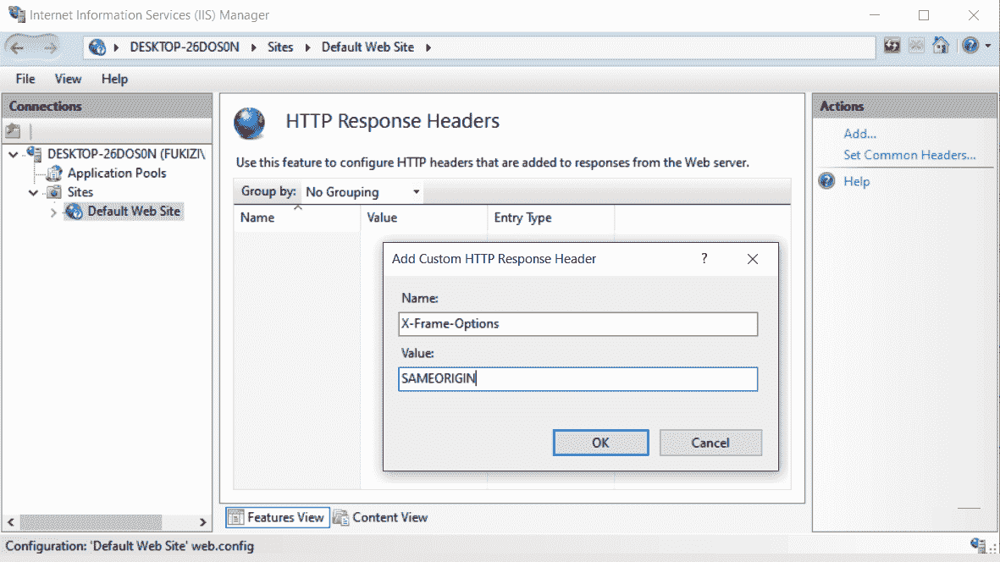
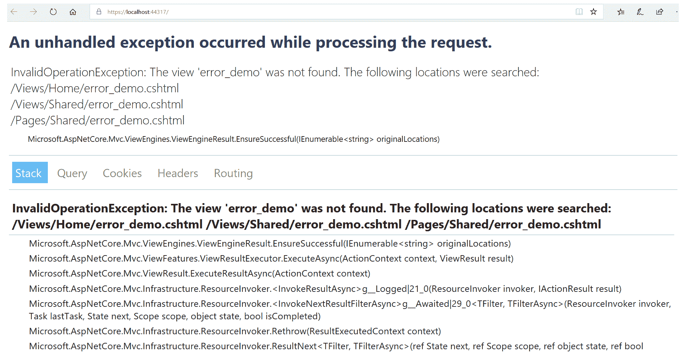

# 保护 ASP.NET 应用-漏洞

在最后一章中，我们主要从身份验证和授权的角度讨论了安全性。我们了解了如何确保我们知道谁在访问我们的应用，以及他们在应用中可以做什么。

不幸的是，未经验证的登录和未经授权的访问并不是我们需要防范的唯一方面。在您作为应用开发人员的任务中，您将负责处理具有不同安全重要性的不同应用。对于那些能够激励人们积极寻找利用应用的方法的应用，作为开发人员，您需要确保能够抵御潜在的黑客。

本章让您了解使用 ASP.NET Core 3 构建的 web 应用可能受到攻击的最常见方式。

对于您构建的每个应用，建议您从一开始就考虑其安全性，而不仅仅是在部署时考虑。

对于一些严肃的应用，如企业应用，甚至有一个威胁建模会话，在该会话中，您尝试并分析您将要构建的应用所面临的任何威胁，然后在整个开发阶段将这些威胁考虑在内。

在本章中，您将学习恶意用户通常用来利用 web 应用进行攻击的不同方法，并且，除了了解这些方法外，您还将学习确保应用免受任何潜在黑客攻击的基本方法。

本章将介绍以下主题：

*   **跨站点脚本**（**XSS**）
*   偷饼干
*   窃听、邮件篡改和邮件重播
*   打开重定向/XSR
*   SQL 注入
*   **跨站点请求伪造**（**XSRF**/**CSRF**）
*   JSON 劫持
*   超额投递
*   点击劫持
*   正确的错误报告和堆栈跟踪

# 跨站点脚本（XSS）

您经常会发现，**跨站点脚本**以其最简单的形式被称为**XSS**，可以将其描述为 HTML 注入攻击的一种形式。

如果没有适当的措施允许用户的浏览器拥有可以执行的脚本，网站将很容易受到 XSS 攻击。在这种情况下，大多数情况下，攻击者假定网站上的用户身份，并使用此类脚本劫持真实用户的会话。

一旦会话掌握在攻击者手中，您的应用将在会话期间任由他们摆布。他们可以做任何事情，包括让你的网页看起来像他们想要的任何方式，他们甚至可以通过你的网页对其他网站发起攻击。这可能发生在真实用户仍然能够做其他事情的时候，但是 XSS 攻击可以让黑客完全控制浏览器。

如果一个网站允许用户上传链接，那么它也容易受到 XSS 攻击，在这种攻击中，用户可以获取通过表单上传的数据，还可以提取网站的安全信息。

XSS 攻击也可能以黑客试图劫持 cookie 的形式出现。这些 cookie 可以具有登录标识和/或会话标识。一旦 cookie 被劫持，黑客就有可能获得有关用户的大部分信息。通过相同的 cookie 劫持，黑客可能会在用户执行正常功能提交恶意内容（如脚本）时攻击用户，而用户不会意识到此类活动。

# 防止 XSS

考虑一个常见的、真实的场景，其中用户被重定向到一个被黑客精心设计的页面，以与真实的应用完全相同。这种情况可以通过多种方式发生，包括通过电子邮件内容将您重定向到受损的 URL。允许 XSS 攻击盛行的一个关键因素是输入数据未得到充分验证。

为了确保您的输入被彻底验证，您必须确保任何类型的输入都有一个最大长度。必须确保输入字段的输入类型是有限的。

始终确保过滤掉标记中任何可能的 Unicode 字符，例如小于和大于符号：`<`和`>`。

Razor 中带有`@`属性的自动 HTML 编码是防止 XSS 攻击的有效方法，但您仍然需要采取额外的步骤来保护您的站点。

还有一个 JavaScript 编码器，您可以将其注入到视图中，如下所示：`@inject``JavaScriptEncoder jEncoder;`然后直接调用编码器以供使用，如`@jEncoder.encode(...);`中所示。

收到请求后，ASP.NET Core 3 作为一个框架始终保持警惕，以评估请求。它检查请求中的脚本和/或任何标记，如果遇到根据预定义参数感到可疑的内容，则抛出异常。

**Microsoft SDL**（简称**安全开发生命周期**）在整个应用开发生命周期中指导您解决安全问题。在这个链接中有更详细的解释：[https://www.microsoft.com/en-us/securityengineering/sdl](https://www.microsoft.com/en-us/securityengineering/sdl) 并有几条建议供您参考。

Here's an example tip from the SDL: make sure to avoid using the `eval()` function in JavaScript, or indeed any similar functions that are meant to evaluate and subsequently execute a string input as a script, for example, `eval('2019+ 5')`.

# 偷饼干

用户体验是任何 web 应用的一个非常重要的方面。**Cookies**可以在创建一个能够提供良好用户体验的网站方面发挥作用。有许多网站在用户登录后实际使用 cookies 来识别他们的用户。在这样的网站上，如果你拿出 cookies，你将不得不在导航到不同页面时一次又一次地登录。

如果一个黑客可以偷你的饼干，他们可以很容易地伪装成你。在这方面，您可能只想从浏览器中禁用 cookie 的使用，但同时，有许多应用迫使您启用 cookie。

Cookie 可用于存储浏览历史记录或网站首选项，这些信息并不都是敏感的，但它们也可以包含网站可用于在请求之间识别您的数据。

如果用于身份验证的 cookie 可能被窃取，那么也可以假定用户的身份，因此被劫持用户的所有功能都被授予访问权限。然而，要做到这一点，该网站还必须易受 XSS 攻击，这在前面已经描述过。黑客只有在能够向目标网站注入脚本的情况下才能窃取 cookie。

# 防止偷饼干

您可以使用`HttpOnly`属性标记 cookie。这将确保只有服务器才能访问具有此标记的 cookie。这意味着 cookie 不会被来自客户端的任何脚本访问。

`HttpOnly` tagged cookies make it harder for a bulk of XSS attacks to succeed.

`HttpOnly`属性可以在`web.config`中设置，如下代码片段所示：

```cs
<httpCookies domain=”String” httpOnlyCookies=”true” requireSSL=”true”>
```

还可以为每个 cookie 单独设置属性，如下所示：

```cs
Response.Cookies[“CookieExample”].Value= "Value to be remembered";
Response.Cookies[“CookieExample].HttpOnly=true;
```

`"CookieExample"`字符串意味着包含您选择的名称，您可以将该名称分配给作为开发人员的 cookie。`Value`和`HttpOnly`都是命名 cookie 的属性或属性，您可以为其赋值，如前一示例所示。

# 窃听、邮件篡改和邮件重播

正如标题中所暗示的，**窃听**、**消息篡改**和**消息重播**的漏洞通常被解释为**组**。这是因为它们的行为方式非常相似，因此以相同的方式识别。它们也可以通过类似的方式预防。

黑客可能利用网络数据捕获工具记录客户对网站的请求和响应。这是窃听的一个例子。

如果你没有采取反窃听的措施，黑客可能会捕获 HTTP 请求，对其进行修改，然后再次提交到网站。这就是现在所谓的消息重播。这对于黑客来说是聪明的，因为网站将能够处理请求，就像在普通请求中一样，而不会引起任何怀疑。这是因为，对于需要身份验证的网站，它通常具有所需的安全令牌。

当我们谈到消息篡改时，我们的意思是 HTTP 请求可能被恶意修改，包括执行事务和修改甚至删除数据。

# 防止窃听和消息重播

在使用 HTTP 的 web 应用中，防止消息重播的一种普遍接受的方法是要求通过**安全套接字层**（**SSL**进行通信。

通过在非匿名模式下使用 SSL，您可以保护应用不被指示将消息重播回应用服务器。如果这样做，还可以防止 HTTP 请求和响应内容暴露给任何作为窃听者进行侦听的人。关于 SSL 是否也能防止消息篡改，您的猜测和我的一样好。

It is recommended that web applications use SSL in non-anonymous mode.

当通过 SSL 连接到服务器时，SSL 基本上就是这样工作的。客户端通过验证服务器 URI 是否与 SSL 证书中的主机名相同来检查其连接到的服务器的标识是否正确。

有时，客户端可能没有可用于验证服务器的证书。有时，服务器也会使用不必具有服务器标识的 SSL 协议。在这两种情况下，SSL 都以匿名模式使用。

您可以选择在某些 web 服务器上配置匿名 SSL，但不能在其他 web 服务器上配置匿名 SSL。

It must be noted that when one party poses as another during a client-server connection, then anonymous SSL cannot protect your application from spoofing threats or message replay. However, anonymous SSL can protect you from eavesdropping and tampering.

# 打开重定向/XSR

**开放重定向**，顾名思义，本质上是将用户重定向到随机网站。这些也通常被称为**跨站点重定向**（**XSR**），它们通过 web 应用的 URL 发生。

一旦黑客成功重定向，他们就可以利用重定向进行一系列攻击，包括垃圾邮件和网络钓鱼。黑客还可以利用您的 web 应用向他人提供恶意软件。

XSR 威胁与通过查询字符串和/或 HTTP 请求形式的数据使用 URL 重定向的 web 应用更为相似。

# 打开重定向示例

下面是一个简单的、真实的开放重定向示例。您可以作为真正的真实用户登录网站，但如果黑客泄露了返回 URL，在您登录后更改字符串的部分内容将导致您被带出应用。作为用户，您可能不会注意到这一点，因为您被重定向到的站点可能会故意创建为与原始站点完全相同。

URL 中的折衷方法很难在较长的 URL 中发现，在这种情况下，仅仅更改一个字母就可以欺骗您，使您认为自己在同一个站点上。有意图的黑客几乎拥有真实站点的精确副本，当你在他们的受损站点上时，他们可能会出于虚构的原因要求你再次登录，然后你的用户名和密码就消失了！

# 防止打开重定向

为了安全起见，建议避免应用中的任何重定向。当你只需要重定向时，有一个助手方法`UrlHelper.IsLocalUrl()`，你可以使用它来确保你只被重定向到站点内。

With the `UrlHelper.IsLocalUrl()` method, you can make certain that a redirection goes to the same web server as the originating call, and never taken outside of your web application.

# SQL 注入

关于**SQL 注入**，几乎任何应用都会使用对数据库存储的查询。显然，对于任何黑客来说，这都提供了一个机会，可以利用查询来完成他们不打算做的事情。他们可以通过修改查询来达到预期目的。

如果您连接字符串以生成 SQL 语句和/或以其他方式使用动态 SQL，则这会带来一个特别危险的环境，可通过 SQL 注入加以利用。

# 防止 SQL 注入

开发应用所使用的技术并不重要：它们都容易受到 SQL 注入的影响。因此，您需要采取措施确保您的应用免受此类攻击。建议：在构造动态 SQL 语句时，始终使用类型安全的参数编码。

在几乎所有的数据 API 中，都允许您精确地指定要传递的参数类型。这甚至包括 ADO.NET 作为一种技术，这种技术已经存在了一段时间。这些参数可以是整数、布尔值或其他基本类型。大多数数据 API 都提供编码或转义，以防止黑客攻击。

Before you deploy your application into production, do a security audit on both your code and the application in general. Make sure that your database is locked down, with only the minimally required permissions for your application.

# 保护 SQL 连接字符串

保护连接字符串始终是至关重要的。建议您在配置或应用设置中仅将其作为纯文本。将其作为纯文本存储在代码中的任何其他地方都会带来麻烦。通过**微软中间语言**（**MSIL****反汇编程序，如果您将连接字符串放入代码中，实际上任何人都很容易看到它。黑客可以使用`Ildasm.exe`命令查看代码各自的 MSIL，通过 MSIL 可以暴露字符串。**

 **另一个需要考虑的事实是连接字符串的不同形式确实起作用。某些形式的连接字符串可以有用户名和密码；其他人只是使用可信连接或集成安全性。如果可以这样做，建议使用不明确指定用户名和密码的选项。

Desist from using a username and password for Windows authentication; rather, go for `Trusted_Connection = true` or `Integrated Security = SSPI`.

# 在连接字符串中使用 Persist Security Info 默认值

持久化安全信息的默认值为`False`。将其设置为`True`允许在打开连接后从连接中获取安全敏感信息，包括用户 ID 和密码。当设置为`False`时，安全信息将被处理（在它被用于打开连接之后），以确保任何不受信任的源都无法访问它。

# 使用对象关系映射器（ORMs）

[第 9 章](09.html)中介绍的**对象关系映射器**（**ORMs**的用户，如[第 9 章](09.html)中介绍的*实体框架核心 3*访问数据的用户，通常与对象打交道，大多数 ORMs 提供强大的，面向对象的查询功能，因此 SQL 注入不是常见的威胁。

Note that you could also use stored procedures along with Entity Framework Core. Usage of stored procedures further reduces the risk of SQL injection either when used alongside Entity Framework Core or on their own, mainly because of their parameterized features.

即使使用字符串查询，ORM 通常也会使使用参数比使用 ADO.NET 参数容易得多，因为大多数 ORM 都没有使用字符串连接的驱动程序。

但是，如果您碰巧使用 NHibernate，**HQL**（简称**Hibernate 查询语言**）与 SQL 非常相似，其行为方式与执行原始 SQL 语句类似。

If you are an NHibernate ORM user, desist from using HQL in your **Data Access Layer** (**DAL**) as it makes your application susceptible to SQL injection.

# 跨站点请求伪造（XSRF/CSRF）

在书籍和博客中都多次提到 SQL 注入和 XSS，但很少有人提到鲜为人知的**跨站点请求伪造**威胁，这同样具有毁灭性。简称为**XSRF**或**CSRF**。

简言之，当您以合法用户身份登录应用时，您的身份可能会被利用，用于向受损的 web 应用发送请求，该应用将使用您的身份执行请求。

Hackers can easily take advantage of XSRF/CSRF because of the concept of how the web itself is supposed to work in a stateless manner.

XSRF/CSRF 以**混乱代理**攻击的形式进行。这意味着一项行动可能会被其他实体毫无防备地愚弄，但滥用其合法权威会带来毁灭性的后果。

# XSRF/CSRF 示例

让我们看一个简单控制器的示例，它可能容易受到 XSRF/CSRF 攻击。

乍一看，一切都是安全的，但在下文中，我们将看到一个拥有这样代码的控制器如何让 XSRF/CSRF 黑客垂涎三尺：

```cs
public class ContactController : Controller
{
   public ViewResult ContactDetails()
   { return View(); }
   public ViewResult Update()
   {
      Contact contact = DbContext.GetContact();
      contact.ContactId = Request.Form["ContactId"];
      contact.Name = Request.Form["Name"];
      SaveContact(contact);
      return View();
   }
}
```

考虑一个黑客设置一个故意针对这种控制器的页面的场景。然后，黑客可以说服用户访问他们的页面，然后该页面将尝试发布到该控制器。当用户已经通过基于表单的身份验证或 Windows 身份验证进行身份验证时，此控制器将无法检测到预期的 XSRF/CSRF 攻击。请参阅以下代码：

```cs
<body onload="document.getElementById('contactForm').submit()">
  <form id="contactForm" action="http://.../Contact/Update" 
    method="post">
   <input name="ContactId" value="123456" />
   <input name="Name" value="My Hack Example" />
  </form>
 </body>
```

如下一节所述，这类攻击以不同的方式减轻。

# 防止 XSRF/CSRF

以下是阻止 XSRF/CSRF 攻击的最常见方法。

# 域引用程序

建议检查并查看传入的 HTTP 请求头引用域是否确实是您的。当您这样做时，您可以防止来自您的域之外的潜在危害源的任何请求。

然而，这种预防方法并非万无一失。如果用户安装了 AdobeFlash，黑客实际上可能会利用并伪造标题。一些用户也可能出于隐私考虑，决定不发送推荐人标题。

# 用户生成的令牌

建议使用隐藏的 HTML 字段为特定用户保留令牌（通常从源服务器生成），然后验证提交的令牌是否有效。您可以使用用户的会话或 HTTP cookie 来保留生成的令牌，以供以后检索。

在 ASP.NET Core MVC（Model View Controller 的简称）中，您可以通过为特定用户创建在视图和控制器之间传递的令牌来验证请求。如果令牌不相同，则这可能是 XSRF/CSRF 攻击，您可以做出不允许请求继续的规定。如上所述，所有这些都可以通过使用 ASP.NET Core MVC 中提供的 HTML 帮助程序来实现，该帮助程序是`@Html.AntiForgeryToken()`，用于需要提交的表单中，该帮助程序位于视图部分。对于每个请求，该助手将添加一个名为`RequestVerificationToken`的隐藏字段，其中包含来自视图的令牌，该令牌需要控制器进行验证。

You can use the `AntiForgeryToken` functionality that is available with ASP.NET Core MVC to prevent XSRF/CSRF attacks.

这种方法要求相应的控制器同步工作，以确保它理解它正在接收的表单数据包含防伪令牌。这是通过使用`ValidateAntiForgeryToken`属性装饰控制器中的特定操作来完成的。如前所述，此属性确认 HTTP 请求同时包含 cookie 值和隐藏表单字段，并验证这些值是否相同。

It is advisable to decorate every form with an anti-forgery token. This includes login forms.

# 局限性

正如您所看到的，如前所述，反 XSRF 帮助程序非常有用，但它们有几个限制。如果用户不接受其浏览器上的 Cookie，则控制器操作将拒绝其请求，并饰以`ValidateAntiForgeryToken`。您还需要确保您的应用不会受到 XSS 威胁；否则，可以读取防伪令牌。您还必须注意，防伪令牌不适用于 HTTP`GET`请求，而仅适用于 HTTP`POST`请求。

# JSON 劫持

大多数现代 web 应用都使用 JSON 来传递数据。**JSON 劫持**顾名思义，就是黑客从另一个站点访问 JSON 响应。

黑客尝试阅读不适合他们的 JSON 响应的动机是，网站通常会包含用户信息，这些信息可以在 JSON 响应中识别个人。这是一个潜在恶意用户的金矿。

# 防止 JSON 劫持

防止任何人劫持您的 JSON 非常简单，主要是确保您从未将 API 设计为将 JSON 数组作为 HTTP 响应返回。

您还可以使用`HttpPost`属性来修饰各自控制器中的特定操作，以便它只响应使用 HTTP`POST`操作的 HTTP 请求。

Make sure that JSON services always return responses as non-array JSON objects.

# 超额投递

ASP.NET Core MVC 有一个名为**模型绑定**的功能，这使您作为开发人员能够轻松地将用户输入自动映射到特定模型。

您可以看到黑客利用此功能向您的模型中插入用户未在相应表单中实际填写的内容的动机。

# 漏洞示例

让我们使用一个假设的博客帖子页面，用户可以在其中发表评论：

```cs
public class BlogComment 
{
   public int CommentID { get; set; } // Primary key
   public int BlogPostID { get; set; } // Foreign key
   public BlogPost BlogPost { get; set; } // Foreign entity
   public string UserName { get; set; }
   public string Comment { get; set; }
   public bool IsApproved { get; set; }
}
```

然后，我们可以有一个需要对博客读者可见的表单：

```cs
Name: @Html.TextBox(“UserName”) 
Comment: @Html.TextBox(“Comment”)
```

现在，在这种情况下，我们的期望是让博客用户只向`UserName`和`Comment`字段提供输入。有目的的黑客可以使用高级浏览器工具查找`IsApproved`布尔字段，并将其作为待发布数据的一部分或作为`IsApproved=true`添加到查询字符串中。

我们正在探索的特性，称为模型绑定，通常不知道哪些字段是合法填写的，并且会适当地强制将`IsApproved`设置为等于`true`。

对于这个例子来说，这很简单，但是你能想象如果模型是，例如，`'student'`，黑客能够简单地设置`student.Grade = 99`吗？是的，这给了我们大多数人很大的希望，但你需要注意的是，这可能会产生严重的后果。想象一下一个银行账户，它有一个`AvailableBalance`字段，可以很容易地通过这种方式进行操作。在下一节中，我们将重点探讨进行反检查的重要性。

# 防止过度投递

我们可以使用`BindProperty`属性来修饰模型或特定的控制器动作。

在使用`BindProperty`属性时，您可以使用黑名单或白名单方法。事实证明，白名单方法更安全、更简单，因为您只需将需要绑定的属性作为目标。

作为另一种缓解方式，我们可以创建一个视图模型，其中只包含用户需要填写的属性，这样可以防止任何直接针对完整模型的绑定。

使用`BlogCommentViewModel`将能够防止过度张贴：

```cs
public class BlogCommentViewModel {
    public string UserName { get; set; }
   public string Comment { get; set; }
} 
```

# 点击劫持

与**点击劫持**相关的同义词有几个，包括**UI 补救**攻击和**UI 补救**。在这些实例中，UI 意味着用户界面。

当黑客破坏应用的链接和按钮时，就会出现此漏洞，用户认为他们正在点击链接/按钮来执行功能`A`，而实际上他们正在执行功能`B`。这个被破坏的功能是由黑客决定的。

当黑客设法将脚本嵌入易受攻击的链接和/或按钮时，这种攻击主要发生在浏览器中。用户出于无辜的意图点击这些链接，但这样做，他们很容易泄露敏感信息，或者黑客完全控制了他们的计算机。

# 单击劫持示例

你可以有一个场景，其中有一个按钮旨在执行功能`A`，但黑客会放置一个 z 索引较低的复制按钮，当用户点击他们能够看到的正常按钮时，该按钮会被触发执行功能`B`。

# 防止点击劫持

我们可以使用一个名为`x-frame-options`的 HTTP 响应头来对抗 web 应用上的点击劫持。我们可以在以下两种实现中的任何一种实现中实现这一点。

1.  当您的应用启动时，您可以将以下代码放入实现`IHttpModule`的模块中。

当 web 应用启动时，将**`x-frame-options`**头设置为`"DENY"`：

```cs
public void Init(HttpApplication application)         
{             
  application.BeginRequest += (new 
   EventHandler(this.Application_BeginRequest));                    
}
private void Application_BeginRequest(object sender, EventArgs e)
{
    HttpContext context = ((HttpApplication)source).Context;
    context.Current.Response.AddHeader("x-frame-options", "DENY");
}
```

我们在这里做的主要事情是将`x-frame-options`HTTP 头设置为`DENY`，但如果这是您的托管选项，建议您在您的**互联网信息服务**（**IIS**）中实际执行此操作。

2.  您可以进入 IIS 管理器，然后在选择网站的情况下执行以下操作：
    1.  从功能列表中选择或双击以编辑 HTTP 响应头。
    2.  然后单击添加。。。从右侧的“操作”部分。请参见以下屏幕截图：



前面提到的大多数潜在攻击都源于积极的黑客意图，设计各种方法和途径来发现漏洞，从而进入易受攻击的 web 应用。但是，作为一名使用 ASP.NET Core 3 的 web 应用开发人员，以下漏洞源于您应始终避免的一点粗心。

# 正确的错误报告和堆栈跟踪

当 ASP.NET Core 3 web 应用中出现未经处理的异常或错误时，可能会出现**死亡屏幕**，有时简称为**SOD**。此处显示了一个示例：



这有时被称为死亡的黄色屏幕，因为当你使用谷歌 Chrome 或 Firefox 作为浏览器时，与这些异常消息相关的黄色。

# 错误报告漏洞示例

简单地说，对于 web 应用开发人员来说，允许实际应用用户看到这些类型的错误有点粗心。死亡屏幕上包含的信息只属于应用开发人员，而不是应用的访问者。对于一个有决心的黑客来说，这些信息将给他们提供一个开始的地方，因为它提供了应用的内部信息，这可能会给你的应用如何实际工作的线索和洞察。

错误处理需要遵循正确的思维过程。这甚至适用于应用开发人员需要使用安全强制转换和适当类型转换（如`TryParse`）的看似微不足道的情况，因为这在防止可能导致死亡屏幕的特殊错误方面有很大的帮助。

# 防止死亡屏幕

有一个简单的解决方案可以防止应用生成死亡屏幕，那就是确保配置并指定自定义错误页面。幸运的是，ASP.NET Core 3 通过`Startup`类中的中间件为您提供了现成的管道。

It's not a nice experience on the part of the user to see a screen of death. It is better to think of your user and give them a friendly error page when something goes wrong.

您可以在`Configure`方法的`Startup`类中指定自定义错误页：

```cs
if (env.IsDevelopment())
{
    app.UseDeveloperExceptionPage();
}
else
{
    app.UseExceptionHandler("/Error");
    app.UseHsts();
}
```

这决定了将根据环境向用户显示何种类型的错误页面，无论是开发环境还是其他类型的环境，包括生产环境。

# 总结

在本章中，我们介绍了使用 ASP.NET Core 3 开发软件应用时需要注意的常见漏洞。如果我们要有效地构建一个安全的解决方案，那么了解恶意攻击将从哪个角度出发是非常重要的。

我们研究了 XSS 攻击，恶意用户利用真实用户的身份向 HTML 中注入脚本。我们发现黑客获取用户身份的方法之一是通过 cookie 窃取，我们可以通过在 cookie 上加上`HttpOnly`属性来防止这种行为。

我们研究了使用网络小工具的窃听、消息篡改和消息重播，还研究了开放重定向/XSR 攻击，它将用户重定向到外部恶意网站。我们研究了 SQL 注入、XSRF/CSRF、JSON/JSON 劫持、过度发布和点击劫持。我们还看到了正确的错误报告是多么重要。

在了解了可能的攻击并了解了如何确保我们为这些类型的攻击做好准备之后，我们现在可以将我们的应用投入生产，并向公众用户公开。现在是进入下一章的好时机，在下一章中，我们将部署和托管我们的安全 ASP.NET Core 3 应用。保持专注。**