# 十三、管理 ASP.NET Core 3 应用

在完成了开发生命周期之后，我们本可以就此停止。然而，增加了最后一章，以强调彻底的**DevOps**方法的重要性。

现在，我们只讨论了 DevOps 中的**开发**（**开发**）端，但是您还应该接受**操作**（**操作**）端，它包括在运行时管理和监督您的应用。

这个非常重要的主题经常被低估，甚至更糟糕的是，有时被完全抛在一边。开发人员倾向于认为这不是他们工作的一部分。他们经常说这样的话：*但它在我的机器上工作*，*这是你的问题，不是我的*。这也通常被称为**混乱之墙**。敏捷方法和 DevOps 旨在避免这种想法，本章将为您提供一些建议和示例，说明如何在 ASP.NET Core 3 应用中更好地解决这些问题。

应用的成功将取决于您如何帮助 IT 运营部门了解运行时发生的情况。这意味着为他们提供了快速有效地管理和监督应用的方法。

只有这样，您才能以较低的**平均修复**（**平均修复时间**）提供高质量的应用，从而在您特定的市场中成为未来的市场领导者。

此外，在使用 ASP.NET Core 3 时，您很容易解决这些问题，因为大多数情况下，您可以利用集成的或提供的功能，而无需进行任何较大的代码更改。

我们将首先了解如何为 Azure 和**Amazon Web 服务**（**AWS**）添加日志记录，然后了解如何在本地和 Docker 中监控应用，然后再了解如何在 Azure 和 AWS 中进行监控。

在本章中，我们将介绍以下主题：

*   登录 ASP.NET Core 3 应用
*   监视 ASP.NET Core 3 应用

# 登录 ASP.NET Core 3 应用

在[第 12 章](12.html)*托管 ASP.NET Core 3 应用*中，我们解释了如何将您的 ASP.NET Core 3 应用部署到 Microsoft Azure、AWS 和 Docker。让我们进一步了解如何将日志记录和监视添加到这些环境中，这对于诊断意外行为和错误非常重要。

首先是一些理论背景，然后是一些实例。您准备好学习如何帮助 it 运营了吗？来吧这是最后一章。走吧！

应用内的日志记录包括创建数据，以帮助了解运行时发生的情况。可以记录多种类型的消息，例如信息、警告和错误。

然后，应将这些数据持久化到日志文件、数据库、SaaS 解决方案或其他目的地。为了提高应用性能，建议允许 it 操作在应用运行时更改收集的日志数据的详细程度。例如，在生产环境中，只应记录警告和错误，而在开发期间更有效地记录所有内容并更好地了解幕后发生的事情是非常有意义的。

建议使用标准框架，如**Windows 事件跟踪（ETW）**来构造和格式化日志数据，以便 It 运营部门可以使用其首选的监控工具快速、轻松地读取和诊断错误原因。著名的日志框架，如**Serilog**或**Log4net**也支持标准输出格式，因此如果您愿意，也可以使用它们。

因此，让我们看一些具体的例子，介绍如何在不同的环境（如内部部署、公共云和 Docker）中处理 ASP.NET Core 3 应用的日志记录。

在内部部署环境中，日志数据大部分时间存储在日志文件中。在这种情况下，应用需要具有写入权限才能写入日志文件，建议将所有日志文件存储在应用路径下名为`logs`的中心文件夹中。

在 Microsoft Azure 中，您基本上有三种不同的解决方案来处理应用中的日志记录，如下所示：

*   **标准文件记录**：这是最简单的方法，没有任何代码修改，但也是功能最差的方法。您需要下载文件以检索应用的日志数据。
*   **Azure 应用服务诊断**：如果您的应用服务只有一个实例，那么这是推荐的解决方案，因为没有提供日志集中功能。
*   **Azure Application Insights**：这是最集成、最强大的解决方案，可跨所有应用层工作。

AWS 提供用于日志记录和监视的 CloudWatch。提供的日志机制与 Microsoft Azure 的日志机制非常相似。当您了解了这些在 Microsoft Azure 中的工作方式后，您将能够轻松、快速地将您的知识应用到 AWS，正如您将在提供的示例中看到的那样。

For more information, you can visit the AWS CloudWatch website at [https://aws.amazon.com/en/cloudwatch](https://aws.amazon.com/en/cloudwatch).

Docker 不提供任何针对 Microsoft Azure 或 AWS 的集成监控或日志记录服务。这意味着要在 Docker 中向 ASP.NET Core 3 应用添加、记录和监视功能，必须使用日志文件。此外，您必须提供自己的集中式日志恢复和分析机制，以获得一致的日志记录和监视数据。

但是，由于应用可以多次实例化，因此这可能不是最好的方法。相反，您还可以直接登录到集中式控制台，这应该是 Docker 环境中最有效、最合适的解决方案。

# 登录 Microsoft Azure

好啊现在您已经看到了几种用于在不同环境中登录的解决方案，我们将重点介绍 Microsoft Azure。如果您担任 IT 运营部门的角色，需要诊断应用在 Microsoft Azure 中无法按预期工作的原因，会发生什么情况？你的选择是什么？最好的解决方案是什么？这正是您将在本节中学习的内容。

如果您还记得的话，我们已经在本书的[第 4 章](04.html)、*通过自定义应用登录 ASP.NET Core 3 的基本概念：第 1 部分*中讨论了应用级别。在那里，我们将记录应用事件添加到应用文件夹的`logs`子文件夹中的日志文件中。此文件夹需要同步并监控磁盘空间使用情况，因为当它变得太大时，它本身很可能成为故障的原因。

此外，由于应用日志和环境日志（**互联网信息服务**（**IIS**））、Windows、SQL Server 等都是分开处理的，因此日志的来源是多个的。你必须综合所有信息，才能全面了解幕后发生的事情。这是非常复杂和耗时的。

如您所见，在这种情况下，阅读和分析应用日志需要大量的手工工作。如果您需要同时监视和管理大量应用，那么这将成为一个更大的问题。手动操作并不是一种真正的选择。我们需要找到更好的解决办法。

此外，Microsoft Azure 中还有更好、更集成的解决方案！例如，如果您在 Azure 应用服务中部署应用，则可以使用 Azure 应用服务诊断。可以直接从门户启用此功能。此外，应用日志和环境日志自动集中在一个地方，这有助于以更快、更直接的方式发现问题。

# 启用 Microsoft Azure 应用服务

启用 Microsoft Azure 应用服务诊断非常简单，现在让我们看看如何做到这一点：

1.  在 Visual Studio 2019 中打开 Tic Tac Toe web 项目，并将名为`AzureAppServiceDiagnosticExtension`的新扩展添加到`Extensions`文件夹中，如下所示：

```cs
        public class AzureAppServiceDiagnosticExtension 
        { 
          public static void AddAzureWebAppDiagnostics
         (IConfiguration configuration, ILoggingBuilder 
            loggingBuilder) 
          { 
            loggingBuilder.AddAzureWebAppDiagnostics(); 
          } 
        }
```

2.  更新`ConfigureLoggingExtension`类中的`AddLoggingConfiguration`方法，并为之前新增的 Azure`ApplicationServiceDiagnosticExtension`添加一个案例，如下所示：

```cs

    foreach (var provider in loggingOptions.Providers) 
    { 
      switch (provider.Name.ToLower()) 
      { 
        case "console":  {  loggingBuilder.AddConsole();  break; } 
        case "file":   {  ...  } 
        case "azureappservices": 
        { 
          AzureAppServiceDiagnosticExtension
           .AddAzureWebAppDiagnostics(configuration,loggingBuilder); 
          break; 
        } 
        default:  {  break;  } 
      } 
    } 

```

3.  更新`appsettings.json`配置文件，并为 Azure App Service 添加新的提供商，如下所示：

```cs
        "Logging": { 
          "Providers": [ 
            { 
              "Name": "Console", 
              "LogLevel": "1" 
            }, 
            { 
              "Name": "File", 
              "LogLevel": "2" 
            }, 
            { 
              "Name": "azureappservices" 
            } 
          ], 
          "MinimumLevel": 1 
        } 
```

4.  更新`Program.cs`文件，更改 WebHost builder 配置以启用 IIS 集成，并添加日志记录配置，如下所示：

```cs
public static IHostBuilder CreateHostBuilder(string[] args) => Host.CreateDefaultBuilder(args)
      .ConfigureWebHostDefaults(webBuilder =>
      {
         webBuilder.UseStartup<Startup>();
         webBuilder.CaptureStartupErrors(true);
         webBuilder.PreferHostingUrls(true);        
         webBuilder.ConfigureLogging((hostingcontext, logging) =>
         {
             logging.AddLoggingConfiguration(hostingcontext.
             Configuration); });
         webBuilder.UseIISIntegration();
      });
```

5.  将 Tic Tac Toe web 应用发布到 Azure 应用服务。如果你不知道怎么做，你可以在[第 12 章](12.html)、*托管 ASP.NET Core 3 应用*中查找。
6.  转到 Microsoft Azure 门户网站，单击菜单中的应用服务，选择已部署的 Tic Tac Toe 应用服务，然后向下滚动，直到看到监控部分，如以下屏幕截图所示：

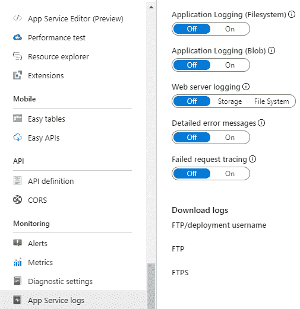

7.  在监控部分，单击应用服务日志，然后设置应用日志（文件系统）打开按钮。选择“级别为详细”，启用详细的错误消息和失败的请求跟踪，然后单击“保存”按钮，如下所示：

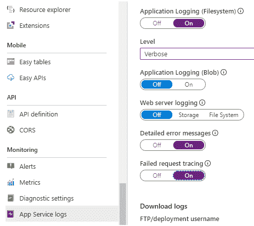

Tic Tac Toe 应用现在将开始在 Azure 应用服务文件系统中记录数据。然而，这只是第一步。您需要检索日志才能对其进行分析。

根据您的具体需要，有多种访问日志的方法。其中一些在此处指定，如下所示：

*   使用 FTP 或 FTPS 浏览`logs`文件夹
*   配置 Azure Blob 存储，然后下载 Blob 内容，这还具有将多个服务的日志集中在一个位置的好处
*   使用专用应用自动检索日志

幸运的是，社区已经在 GitHub 上开发了一个开源解决方案，称为 Azure 网站日志浏览器扩展，您可以使用它。此解决方案包括向 Azure 门户添加扩展。

现在，您将看到如何通过以下步骤将 Azure 网站日志浏览器扩展添加到 Microsoft Azure 门户以分析日志：

1.  转到 Microsoft Azure 门户网站，单击菜单中的应用服务，选择您在上一示例中部署的 Tic Tac Toe 应用服务，向下滚动直到看到“开发工具”部分，单击扩展，然后单击**添加**按钮，如下图所示：

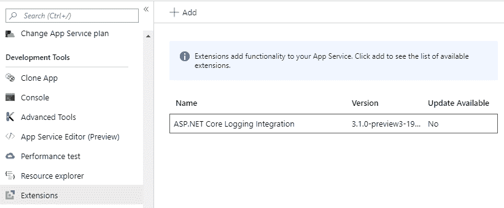

2.  选择并安装 Amit Apple 发布的 Azure 网站日志浏览器扩展，如下所示：


3.  安装完成后，该扩展将添加到 Tic Tac Toe 应用服务的活动扩展中，如下所示：

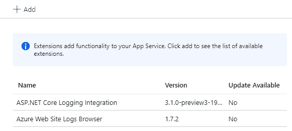

4.  单击 Azure 网站日志浏览器扩展，您将看到扩展名、作者、版本号以及其他附加信息的概述。单击浏览按钮，如以下屏幕截图所示：


5.  新的浏览器窗口将自动打开，您可以在其中看到不同的日志文件源。单击文件系统-应用日志，如以下屏幕截图所示：


6.  选择包含需要分析的诊断数据的日志文件，如下所示：


7.  读取并滚动浏览彩色编码的日志文件内容。您将自动看到生成的日志条目，以及您在前面章节中添加的日志条目，如下所示：


为了拥有有意义的日志并能够查看它们，您只需要知道这些。日志对于每个应用都非常重要，如果设计得当，它们可以为您节省大量时间和精力，进而节省金钱，例如，如果由于日志记录不足而花费很长时间才发现异常，您可能会因此而蒙受损失。在下一节中，让我们看看如何在 AWS 中实现同样的功能。

# 登录 AWS

如果您使用的是 AWS，那么将日志添加到 ASP.NET Core 3 应用将非常简单。您只需将应用日志写入控制台，部署在 AWS Elastic Beanstalk 中的应用将自动将其日志存储在 AWS CloudWatch 中。然后，您将能够使用 CloudWatch 仪表板分析正在发生的事情。这与您在前面的示例中看到的 Application Insights 及其仪表板相当。

现在，您将了解如何访问部署到 AWS Elastic Beanstalk 的应用的日志，如下所示：

1.  将 Tic Tac Toe Web 应用发布到 AWS Elastic Beanstalk。如果您不知道怎么做，可以在[第 12 章](12.html)、*托管 ASP.NET Core 3 应用*中查找。
2.  启动应用，转到 AWS 管理控制台，在 AWS 服务查找服务文本框中输入`Beanstalk`，然后单击显示的链接。您将被重定向到 Elastic Beanstalk 欢迎页面，如下所示：


3.  在 Elastic Beanstalk 欢迎页面上，选择上一步部署的`TicTacToe`应用，如下所示：


4.  单击左侧菜单中的日志，然后单击请求日志|最后 100 行。您现在可以下载需要分析的日志文件，如以下屏幕截图所示：


5.  下载日志文件并检查其内容，如下所示：


您已经了解了如何在各种环境、本地和云中处理日志记录。下一节将向您介绍监视，以及它如何帮助您实时分析问题。

# 监视 ASP.NET Core 3 应用

在上一节中，您了解了如何为 ASP.NET Core 3 web 应用生成和分析应用日志，这将帮助您更好地了解意外行为和应用错误。这将帮助 IT 运营部门在事件发生后跟踪不同的步骤，直到找到问题的根本原因。

但是，这无助于他们不断地监视和监督应用，因为在这种情况下，使用日志机制将导致性能不佳，并对应用产生负面的整体影响。日志记录不是连续监视的正确解决方案！

监控的目标是实时分析和监控大量应用指标，并自动检测应用异常。这些指标需要具有非常低的消息占用空间，才能有效地工作。

下面列出了 ASP.NET Core 3 最常见的监控框架：

*   `EventSource`使用 ETW，速度非常快，类型强。这是在.NET4 中引入的，仅适用于 Windows
*   `DiagnosticSource`与`EventSource`非常相似，可以跨平台工作，比如`EventSource`与 Windows 的 ETW，以及 Linux 的 LTTng

For more information on ETW, go to the following website:
[https://docs.microsoft.com/en-us/windows/win32/etw/about-event-tracing](https://docs.microsoft.com/en-us/windows/win32/etw/about-event-tracing).

有关 LTTng 的更多信息，请访问以下网站：
[http://lttng.org](http://lttng.org) 。

在这些框架之上，大多数公共云提供商都提供自己的监控解决方案。例如，对于 Microsoft Azure，建议使用 Azure Application Insights，而您应该使用针对 AWS 的 CloudWatch。这两个监控解决方案完全是 SaaS，并且与各自的公共云提供商门户集成得更多。

# 现场和码头内的监控

内部部署和 Docker 环境本身没有标准的监控解决方案，但有一些社区认可的监控框架，如`EventSource`或`DiagnosticSource`，您可以使用它们来实现自己的解决方案。

由于这些框架遵守 ETW 等市场标准，IT 运营部门将能够使用其标准监控工具连接您的 ASP.NET Core 3 web 应用，他们会非常喜欢的！

例如 Windows 上的 PerfMon，它可以接收 ETW 事件并生成用于监视目的的图表。

在使用`DiagnosticSource`时，首先创建一个侦听器。此侦听器接收应用事件并提供事件名称和参数。创建监听器最简单的方法是创建一个**普通的旧 CLR 对象**（**POCO**）类，该类包含需要使用`[DiagnosticName]`修饰符修饰的方法，并设计为接受适当类型的参数。

以下示例说明如何使用`DiagnosticSource`在内部部署和 Docker 环境中向 ASP.NET Core 3 应用添加监控：

1.  在 Visual Studio 2019 中打开 Tic Tac Toe web 项目，并添加一个名为`Monitoring`的新文件夹；在此文件夹中，添加一个名为`ApplicationDiagnosticListener`的新类，如下所示：

```cs
        public class ApplicationDiagnosticListener 
        { 
          [DiagnosticName("TicTacToe.MiddlewareStarting")] 
          public virtual void OnMiddlewareStarting(HttpContext 
            httpContext) 
          { 
            Console.WriteLine
                ($"TicTacToe Middleware Starting, path: 
                 {httpContext.Request.Path}"); 
          } 

          [DiagnosticName("TicTacToe.NewUserRegistration")] 
          public virtual void NewUserRegistration(string name) 
          { 
            Console.WriteLine($"New User Registration {name}"); 
          } 
        } 
```

2.  更新`Startup`类中的`Configure`方法，添加`DiagnosticListener`，订阅`ApplicationDiagnosticListener`，如下图：

```cs
        public void Configure(IApplicationBuilder app,
         IHostingEnvironment env, DiagnosticListener 
            diagnosticListener) 
        { 
          var listener = new ApplicationDiagnosticListener(); 
          diagnosticListener.SubscribeWithAdapter(listener); 
          ... 
        }
```

3.  更新`CommunicationMiddleware`，添加一个名为`_diagnosticSource`的新私有成员，并更新构造函数，如下所示：

```cs
        private readonly RequestDelegate _next; 
        private DiagnosticSource _diagnosticSource; 
        public CommunicationMiddleware(RequestDelegate next,
         DiagnosticSource diagnosticSource) 
        { 
          _next = next; 
          _diagnosticSource = diagnosticSource; 
        } 
```

4.  更新`CommunicationMiddleware`中的`Invoke`方法，如果诊断源启用，则写入事件，如下所示：

```cs
        public async Task Invoke(HttpContext context) 
        { 
          if (context.WebSockets.IsWebSocketRequest) 
          { 
            if (_diagnosticSource.IsEnabled
               ("TicTacToe.MiddlewareStarting")) 
            { 
              _diagnosticSource.Write("TicTacToe.
                MiddlewareStarting", 
              new 
              { 
                httpContext = context 
              }); 
            } 
            ...
```

5.  在 Visual Studio 2019 中更改调试设置，并将项目和 emulator 设置为 TictaToe，如下所示：

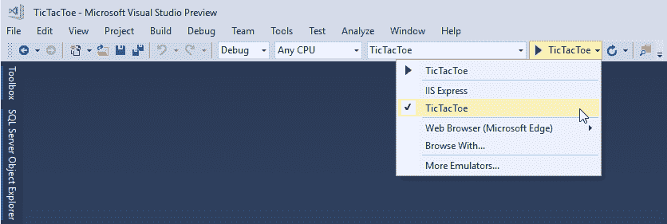

6.  按*F5*以调试模式启动应用。控制台将自动打开。注册新用户并检查控制台输出；您将看到 TictaToe 中间件启动消息，如下所示：


如前所述，向控制台发送日志记录和监视数据是本地环境的一种可能解决方案，也是 Docker 环境的推荐解决方案。

# Microsoft Azure 中的监控

Microsoft Azure 提供了一个名为 Azure Application Insights 的集成解决方案，它允许 IT 运营部门实时监控应用、资源和服务。它适用于整个 Azure 订阅，包括用于快速访问分析数据的仪表盘和图表。

下图说明了 Azure Application Insights 的一些功能：


让我们在一个易于理解的示例中使用应用洞察力；为此，您将首先在 Microsoft Azure 中创建一个新的 Azure Application Insights 资源及其相应的 API 密钥，如下所示：

1.  转到 Microsoft Azure 门户网站，单击菜单中的应用服务，选择您在上一示例中部署和配置的 Tic Tac Toe 应用服务，向下滚动直到看到监控部分，单击应用洞察，填写所有字段，然后单击确定按钮。将为您创建一个新的 Application Insights 资源，如下所示：


2.  单击菜单中的监视器。将显示一个新选项卡。转到解决方案部分，选择应用洞察，然后选择创建的应用洞察资源，如下所示：

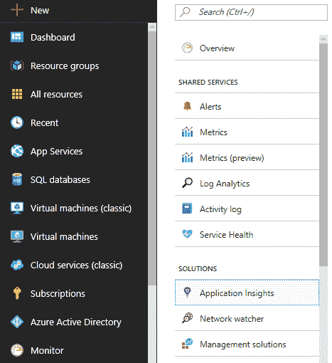

3.  将显示应用洞察资源选项卡；向下滚动直到看到配置部分，然后单击 API 访问，如以下屏幕截图所示：


4.  单击 Create API key 以生成密钥，该密钥将用于 Tic Tac Toe 示例应用，如以下屏幕截图所示：


5.  配置 API 密钥访问权限（读取遥测、写入注释、验证 SDK 控制通道），并为其指定一个有意义的名称，如以下屏幕截图所示：

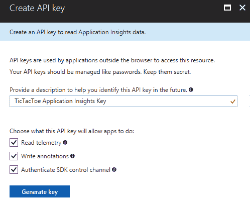

您现在已经完成了 Microsoft Azure 中 Application Insights 资源的创建和配置。Visual Studio 2019 包含一些高级内置功能，允许您直接从**集成开发环境**（**IDE**中连接 ASP.NET Core 3 应用。

在接下来的步骤中，您将为 Azure application Insights 配置 ASP.NET Core 3 web 应用，如下所示：

1.  打开 Tic Tac Toe web 项目，单击顶部菜单中的 project，然后选择 Add Application Insights Telemetry…，如以下屏幕截图所示：


2.  将显示 Application Insights 配置页面。单击开始自由按钮，如以下屏幕截图所示：

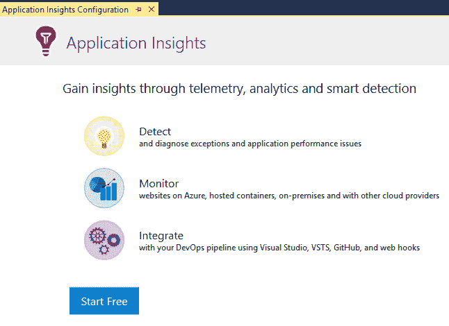

3.  输入您的帐户和订阅详细信息，选择资源，然后单击注册按钮，如以下屏幕截图所示：


4.  将 Tic Tac Toe web 应用重新发布到 Microsoft Azure 应用服务，以便应用 application Insights 配置。
5.  转到 Microsoft Azure 门户网站，单击菜单中的 Monitor，向下滚动到解决方案部分，单击 Application Insights，然后选择新创建的 Application Insights 资源。

6.  将显示 Application Insights 仪表板。它用于获得全球概览，以及深入了解不同的监控区域，如以下屏幕截图所示：


7.  点击搜索查看申请流程；在这里，您可以看到在用户注册过程中发生了一个错误，如下所示：

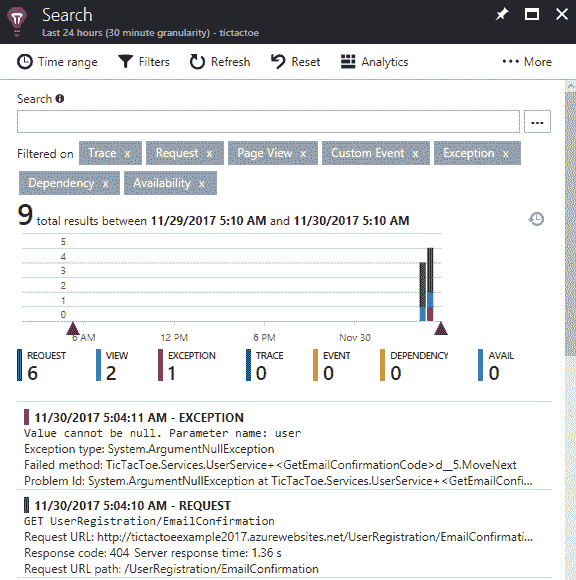

在将 Tic-Tac-Toe 应用部署到 Microsoft Azure 或 AWS 之后，您可能已经在托管 ASP.NET Core 3 应用的[第 12 章](12.html)*以及本章前面的日志部分中看到了这些错误。一切都在本地和 Docker 中工作，但当您将其部署到公共云时，它就不再工作了。很奇怪！我们不能再等了；它真的需要修复！*

我们现在将更详细地分析问题，并尝试了解解决问题需要做什么，如下所示：

1.  在 Azure Application Insights 中，您可以清楚地看到用户注册存在一个问题：更具体地说，是 404 Not Found HTTP 响应。

2.  查看日志文件时，如前一节所述，您可以看到无法找到`EmailTemplates`文件夹中的`UserRegistrationEmail`视图，这会导致其他错误，如以下屏幕截图所示：

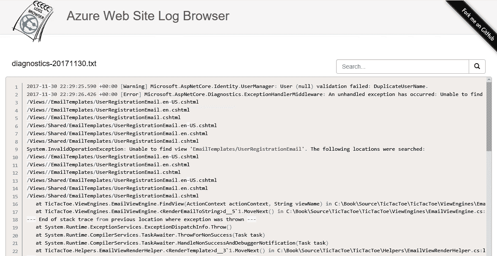

3.  转到 Microsoft Azure 门户网站，单击菜单中的应用服务，选择您在上一示例中部署和配置的 Tic Tac Toe 应用服务，向下滚动直到看到开发工具部分，单击应用服务编辑器（预览），然后单击**Go**链接，如以下屏幕截图所示：


4.  将自动打开带有应用服务编辑器页面的新窗口；点击搜索按钮，搜索`EmailTemplates`文件夹。无法找到，因为在发布过程中，所有视图都被预编译到一个名为`TicTacToe.PrecompiledViews.dll`的**动态链接库**（**DLL**）中，如下所示：

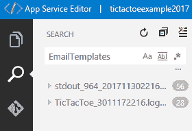

5.  通过在发布过程中停用预编译，对此问题应用临时修复程序。打开 Tic Tac Toe web 项目的`.csproj`文件，然后将以下配置元素添加到`PropertyGroup`部分：

```cs
        <PropertyGroup> 
          ...
          <PreserveCompilationContext>true
           </PreserveCompilationContext> 
          <MvcRazorCompileOnPublish>false</MvcRazorCompileOnPublish> 
        </PropertyGroup>
```

Note that this is only a temporary fix, for example purposes. You should reactivate precompilation, and target the precompiled views in your code for a more industrialized and production-ready solution.

6.  将 Tic Tac Toe web 应用重新发布到 Microsoft Azure 应用服务。现在一切都正常了，包括用户注册。

Note that you have to register a completely new user with a strong password such as `Azerty1234!`, for example, otherwise you might get additional errors if you don't. The application is missing some more advanced error handling due to a lack of space within the book. Keep in mind that it was only given to better understand all the ASP.NET Core 3 concepts. You can, however, use the sample application as a base and then refine it as you like, and add the missing error handling.

您已经了解了如何配置 ASP.NET Core 3 web 应用，并能够使用 Azure Application Insights 对其进行监视。您甚至在应用的用户注册过程中发现了一个问题。您已经分析了日志记录和监控数据，并且能够解决问题。

这对于.NET Core 代码非常有效，但是目前，您无法看到应用的 JavaScript 部分中是否出现任何错误。由于现代应用包含大量 JavaScript 代码，如果您也能够监控这些部分，那就太好了；正当好吧，你可以做到；你只需要稍微修改一下代码。

让我们看看如何调整代码并能够监控 JavaScript 应用流，如下所示：

1.  启动 Visual Studio 2019 并打开 Tic Tac Toe web 项目，更新`Views`文件夹中的`_ViewImports.cshtml`文件，并将 Application Insights JavaScript 片段添加到文件底部，如下所示：

```cs
        @inject Microsoft.ApplicationInsights.AspNetCore
         .JavaScriptSnippet JavaScriptSnippet 
```

2.  更新布局页面和移动布局页面，然后在两个页面的`head`部分添加以下行：

```cs
        @Html.Raw(JavaScriptSnippet.FullScript)
```

3.  更新`Startup`类，并注册 Application Insights 服务，如下所示：

```cs
        services.AddApplicationInsightsTelemetry(_configuration); 
```

4.  将 Tic Tac Toe web 应用重新发布到 Microsoft Azure 应用服务，以便应用新的 application Insights 配置。
5.  启动应用并打开 Microsoft Azure 门户网站中的 application Insights 仪表板，单击**搜索**，然后单击过滤器并选择仅请求，取消选择所有其他事件类型，如以下屏幕截图所示：


伟大的您可以不断监视整个应用，无论是在 JavaScript 端还是在.NET Core 端，这在出现错误行为时都非常有用。

在最后一步中，您将学习如何添加和监视自定义度量，这将允许您跟踪应用中的业务度量，如下所示：

1.  打开 Tic Tac Toe web 项目，将名为`AzureApplicationInsightsMonitoringService`的新服务添加到`Services`文件夹中，如下所示：

```cs
        public class AzureApplicationInsightMonitoringService 
        { 
          readonly TelemetryClient _telemetryClient =  new 
            TelemetryClient(); 

          public void TrackEvent(string eventName, TimeSpan
          elapsed,
           IDictionary<string, string> properties = null) 
          { 
            var telemetry = new EventTelemetry(eventName);  
            telemetry.Metrics.Add("Elapsed", 
             elapsed.TotalMilliseconds); 

            if (properties != null)  
              foreach (var property in properties) 
              { 
                telemetry.Properties.Add(property.Key, 
                 property.Value); 
              }               
            _telemetryClient.TrackEvent(telemetry); 
          } 
        } 
```

2.  从 Azure`ApplicationInsightsMonitoringService`类中提取接口并调用它`IMonitoringService`。
3.  在`Options`文件夹中添加一个名为`MonitoringOptions`的新选项，如下所示：

```cs
        public class MonitoringOptions 
        { 
          public string MonitoringType { get; set; } 
          public string MonitoringSetting { get; set; } 
        }
```

4.  更新`Startup`类中的`Configure`方法，如果在`appsettings.json`配置文件中配置了 Azure`ApplicationInsightsMonitoringService`类，则注册 Azure`ApplicationInsightsMonitoringService`类，如下所示：

```cs
        ... 
        services.AddApplicationInsightsTelemetry(_configuration); 
        var section = _configuration.GetSection("Monitoring"); 
        var monitoringOptions = new MonitoringOptions(); 
        section.Bind(monitoringOptions); 
        services.AddSingleton(monitoringOptions); 

        if (monitoringOptions.MonitoringType == 
          "azureapplicationinsights") 
        { 
          services.AddSingleton<IMonitoringService, 
            AzureApplicationInsightsMonitoringService>(); 
        }
```

5.  更新`UserService`并添加一个名为`_telemetryClient`的新私有成员，然后更新构造函数以初始化私有成员，如下所示：

```cs
        ... 
        private readonly IMonitoringService _telemetryClient; 
        public UserService(RoleManager<RoleModel> roleManager,
         ApplicationUserManager userManager, ILogger<UserService>
         logger, SignInManager<UserModel> 
           signInManager,IMonitoringService telemetryClient) 
        { 
          ... 
          _telemetryClient = telemetryClient; 
          ... 
        } 
```

6.  更新`UserService`中的`RegisterUser`方法，使用`TrackEvent`方法，然后添加一个名为`RegisterUser`的自定义度量，如下所示：

```cs
        ... 
        finally 
        { 
          stopwatch.Stop(); 
          _telemetryClient.TrackEvent("RegisterUser", 
            stopwatch.Elapsed); 
          _logger.LogTrace($"Start register user {userModel.Email}
           finished at {DateTime.Now} - elapsed 
           {stopwatch.Elapsed.TotalSeconds} second(s)"); 
        } 
        ...
```

7.  更新`appsettings.json`配置文件，添加新的`Monitoring`部分，然后将其配置为 Azure Application Insights，如下所示：

```cs
        "Monitoring": { 
          "MonitoringType": "azureapplicationinsights", 
          "MonitoringSettings": "" 
        } 
```

8.  将 Tic Tac Toe web 应用重新发布到 Microsoft Azure 应用服务，以便应用新的 application Insights 配置。

9.  启动应用并打开 Microsoft Azure 门户网站上的 application Insights 仪表板，单击搜索，然后输入`RegisterUser`作为搜索词；您现在只会看到定制的`RegisterUser`业务指标，如下所示：


这就是我们在 Azure 上监控甚至相当复杂的应用所需要的一切，如果您更喜欢使用 AWS 托管应用，下一节将向您展示我们如何在 AWS 平台上实现类似的功能。

# 自动气象站的监测

与 Microsoft Azure 一样，AWS 提供了一个集成的解决方案，允许 IT 运营部门实时监控应用、资源和服务。在 AWS 中，此解决方案称为 CloudWatch。它提供了与 Application Insights 几乎相同的功能，这意味着它适用于整个 AWS 订阅，并包括仪表板和图表，用于快速访问分析数据。

以下示例说明了如何使用 AWS CloudWatch 监控通用指标和自定义指标，以便您了解如何根据自己的需要部署它：

1.  打开 Tic Tac Toe web 项目，下载并安装名为`AWSSDK.Core`的.NET Core 运行时 NuGet 软件包 Amazon web Services SDK，以及名为`AWSSDK.CloudWatch`的 Amazon web Services CloudWatch NuGet 软件包。
2.  将名为`AmazonWebServicesMonitoringService`的新服务添加到`Services`文件夹中，使其继承`IMonitoringService`接口，并使用 AWS 特定代码实现`TrackEvent`方法，如下代码块所示：

```cs
        public class AmazonWebServicesMonitoringService : 
         IMonitoringService 
        { 
          readonly AmazonCloudWatchClient _telemetryClient = new 
            AmazonCloudWatchClient();  
          public void TrackEvent(string eventName, TimeSpan
           elapsed,
           IDictionary<string, string> properties = null) 
          {             
            ... 
          } 
        } 

```

3.  以下是`TrackEvent`方法中的实际代码：

```cs
var dimension = new Dimension { Name = eventName, Value = eventName };  
var metric1 = new MetricDatum 
{ 
  Dimensions = new List<Dimension> { dimension }, 
  MetricName = eventName, StatisticValues = new StatisticSet(), 
  Timestamp = DateTime.Today, Unit = StandardUnit.Count 
}; 

if (properties?.ContainsKey("value") == true) 
  metric1.Value = long.Parse(properties["value"]); 
else   metric1.Value = 1; 

var request = new PutMetricDataRequest 
{ MetricData = new List<MetricDatum>() { metric1 }, Namespace = eventName  }; 
 _telemetryClient.PutMetricDataAsync(request).Wait();
```

4.  更新`Startup`类中的`Configure`方法，如果`appsettings.json`配置文件中已经配置，则注册 Amazon Web Services 云监控服务，如下所示：

```cs
        ... 
        if (monitoringOptions.MonitoringType ==
         "azureapplicationinsights") 
        { 
          services.AddSingleton<IMonitoringService,
           AzureApplicationInsightsMonitoringService>(); 
        } 
        else if (monitoringOptions.MonitoringType ==
         "amazonwebservicescloudwatch") 
        { 
          services.AddSingleton<IMonitoringService,
           AmazonWebServicesMonitoringService>(); 
        } 
```

5.  更新`appsettings.json`配置文件中的`Monitoring`部分，并将其配置为 AWS CloudWatch，如下所示：

```cs
        "Monitoring": { 
          "MonitoringType": "amazonwebservicescloudwatch", 
          "MonitoringSettings": "" 
        } 
```

6.  将 Tic Tac Toe web 应用发布到 AWS Elastic Beanstalk，以便应用新的 AWS CloudWatch 配置。如果您不知道怎么做，可以在[第 12 章](12.html)、*托管 ASP.NET Core 3 应用*中查找。
7.  启动应用。转到 AWS 管理控制台，在 AWS 服务文本框中输入`CloudWatch`，然后单击显示的链接。您将被重定向到 AWS CloudWatch 欢迎页面，如下所示：


8.  在 CloudWatch 欢迎页面上，单击`TicTacToe`应用，如下所示：


9.  单击报警以获取有关报警的更多详细信息，如下所示：

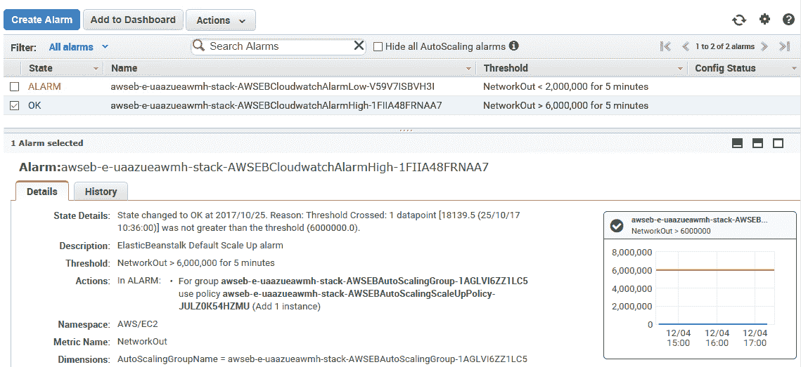

10.  返回 CloudWatch 欢迎页面，在文本框中输入`RegisterUser`作为搜索词，然后单击浏览指标，如下所示：


11.  您将看到一个带有自定义`RegisterUser`业务度量的图，如图所示：

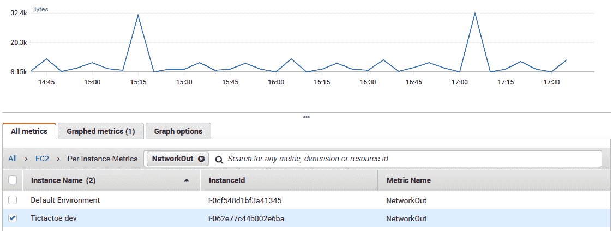

这应该足以让您了解如何监控您的平台，但建议您四处看看所有额外的功能。我很肯定，无论您负责什么应用，您都会从检测和预防异常中获得乐趣。

# 总结

在本章中，我们讨论了如何管理和监督 ASP.NET Core web 应用，以帮助 IT 运营部门更好地了解运行时、错误发生之前和之后发生的情况。

我们讨论了日志的概念，以及它如何帮助减少理解和修复 bug 的时间。我们演示了不同的日志记录解决方案：内部部署、Microsoft Azure、AWS 和 Docker。

在一个详细的示例中，您体验了如何使用 Azure 应用服务和 Azure 应用服务诊断以及用于日志文件分析的 Azure 网站日志浏览器扩展在 Microsoft Azure 环境中配置日志记录。

然后，您看到了如何在 AWS 中通过使用 AWS CloudWatch 访问和下载应用日志来执行相同的操作。

然后，我们介绍了监视的概念，并解释了如何将监视添加到内部部署和 Docker 环境中。

您已配置 Azure Application Insights 以实时监视 ASP.NET Core web 应用。你甚至能够理解并解决`404 Not Found`问题背后的奥秘。

在最后一步中，我们向您展示了如何使用 AWS CloudWatch 在 AWS 环境中进行监控。

在下一章中，我们将……嗯，没有下一章。你已经看到了这本书所提供的一切。我们希望你们喜欢它，希望你们在理解和吸收我们给出的众多例子中发现了一些价值。

现在由您来创造您自己的体验，并进一步提高您的 ASP.NET Core 技能。

正如 Nicolas Clerc（微软法国云架构师）在本书开头的前言中所说，现在你可以作为一名老兵开始你的旅程。

祝你好运，谢谢你花时间阅读不同的章节，也谢谢你和我们在一起这么久！