# 九、ASP.NET Core 应用的部署

一旦我们完成了开发我们的 ASP.NET Core 应用，我们需要部署应用，以便我们的用户可以访问它。

在任何应用中，无论是 web、桌面还是移动应用，并不是所有的功能都是通过代码实现的。 事实上，您不应该试图通过代码实现所有事情。

在本章中，你将学习以下主题:

*   配置在 ASP.NET Core 应用
*   注册微软 Azure 平台
*   部署的 ASP.NET Core 应用到 Azure 云平台

如果你已经用以前的 ASP 版本构建了一个 web 应用.NET MVC 中，将有一个名为`Web.config`的文件(一个 XML 文件)，您可以在其中配置应用的所有依赖项。 但在 ASP。 在你的解决方案中没有`Web.config`文件:

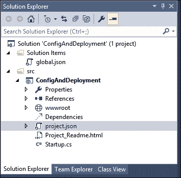

相反，我们有`project.json`(一个 JSON 文件)，我们将在其中配置应用的依赖项。 在讨论`project.json`内容之前，让我们先讨论一下 JSON。

JSON 是**JavaScript 对象标记**的首字母缩写。 它是开放标准的数据交换格式。 它将是人类可读的文本，并由属性/值对组成。 考虑以下 JSON，让我们仔细分析它，看看它代表什么:

```
{ 
  "addressess": [ 
    { 
      "DoorNo": 16, 
      "Street": "King Street", 
      "areaname": "Mascot" 
    }, 
    { 
      "DoorNo": 12, 
      "Street": "High Street", 
      "areaname": "North Sydney" 
    } 
  ] 
} 

```

每个数据块都是一个属性值对，用冒号分隔。 例如，`"DoorNo": 16`表示第一个记录中`DoorNo`变量的值为 16。 每个属性值对(有时称为属性)用逗号分隔。 例如，考虑以下三个属性:

```
"DoorNo": 16, 
"Street": "King Street", 
"areaname": "Mascot" 

```

每个记录或对象都包含在一对花括号中。 例如，下面的 JSON 数据表示一条记录或一个对象:

```
{ 
    "DoorNo": 16, 
    "Street": "King Street", 
    "areaname": "Mascot" 
} 

```

类似的记录可以分组在一起，并可以形成一个(对象的)数组。 方括号用于表示 JSON 格式的数组，如下例所示:

```
"addressess": [ 
  { 
    "DoorNo": 16, 
    "Street": "King Street", 
    "areaname": "Mascot" 
  }, 
  { 
    "DoorNo": 12, 
    "Street": "High Street", 
        "areaname": "North Sydney" 
  } 
] 

```

如果我们必须用 XML 格式表示相同的数据，可以这样做。 请注意，对于每条信息，我们应该有一个开始标签和一个结束标签(以“`/`”结尾):

```
<addresses> 
  <address> 
    <DoorNo>16</DoorNo> 
    <Street>King Street</Street> 
    <areaname>Mascot</areaname> 
  </address> 

  <address> 
    <DoorNo>12</DoorNo> 
    <Street>High Street</Street> 
    <areaname>North Sydney</areaname> 
  </address> 
</addresses> 

```

# 项目。 json 文件

所有的项目配置都应该放到 ASP 的`project.json`文件中.NET Core 应用。 下面是在使用预定义的 ASP. php 时创建的`project.json`文件.NET Core web 应用模板:


这个 JSON 文件中有不同的预定义节点，用于不同的功能。 让我们从这个文件中选取一些重要的节点进行讨论。

## 依赖节点

节点列出了您的 ASP 的所有依赖项.NET Core 应用。

下面是 ASP 中`dependencies`节点的片段.NET Core 应用。 每个依赖项都是一个属性值对，其中属性表示依赖项，值表示依赖项的版本。 如果你需要提供更多的依赖信息，你可以有一个嵌套 JSON 配置，就像它在`Microsoft.NETCore.App`:

```
"dependencies":{ 
  "Microsoft.NETCore.App":{ 
    "version": "1.0.0-rc2-3002702", 
    "type": "platform" 
    }, 
    "Microsoft.ApplicationInsights.AspNetCore": "1.0.0-rc2-final", 
    "Microsoft.AspNetCore.Authentication.Cookies": "1.0.0-rc2- final",
```

## 框架节点

在这个节点中，我们提到了 ASP 所依赖的框架.NET Core 应用。 `dotnet5.6`代表成熟的。net 框架，`dnxcore50`代表包含完整。net 框架功能子集的。NET Core 框架:

```
"frameworks":{ 
  "netcoreapp1.0":{ 
    "imports":[ 
      "dotnet5.6", 
      "dnxcore50", 
      "portable-net45+win8" 
      ] 
    } 
  }, 

```

# 微软 Azure

Microsoft Azure 是微软提供的用于构建、部署和管理应用和服务的云计算平台和基础设施。 它支持不同的编程语言和服务数组。

您可以将应用部署到网络中具有**Internet Information Service**(**IIS**)的任何服务器上。 但是这限制了只能从网络内访问您的应用，假设只能从网络内访问您的服务器(在大多数网络设置中)。 在本节中，我们将部署 ASP.NET Core 应用在 Microsoft Azure 中，以便全球各地的用户可以访问您的应用。

## 注册微软 Azure

为了将您的应用部署到 Azure，您需要拥有一个 Azure 帐户。 你可以免费创建一个 Azure 帐户，在头 30 天内你就有足够的积分来免费部署你的应用([https://azure.microsoft.com/en-in/](https://azure.microsoft.com/en-in/)):


点击右上角的**免费试用**按钮或**免费账户**链接，您将被转到以下页面:


点击**立即开始**按钮，您将被重定向到以下页面。 输入您的 Microsoft 帐户凭证，然后单击**Sign In**按钮。 如果你没有微软帐户，你可以通过点击页面底部的**立即注册**链接来创建一个:

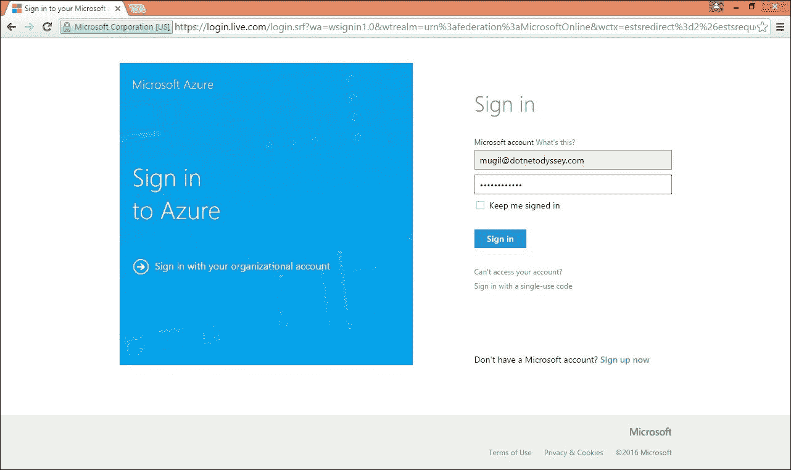

由于我已经有一个微软帐户，我已经用我的凭证登录了。 一旦您登录，您将被问及您的国家、姓名、姓名和工作电话的详细信息，如下:

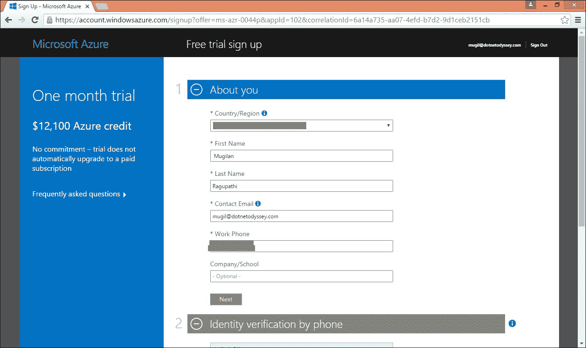

一旦你输入了所有必要的细节，系统会要求你输入国家代码和电话号码，这样 Azure 就可以给你发短信或打电话，以验证你是真人，而不是机器人。 如果您选择**发短信给我**选项，您将得到一个号码到您的手机; 您需要在最后一个字段中输入，然后点击**验证码**:


一旦您通过电话验证，您需要在以下表格中输入您的信用卡信息。 您将被收取大约 1 美元的费用，并将在 5 到 6 个工作日内退回到您的账户。 收集这些信息是为了识别用户的身份，除非用户明确选择了付费服务，否则用户不会被收费:


一旦您输入您的信用卡信息并点击**下一步**，您将不得不同意认购协议作为注册过程的最后一步:


点击**注册**按钮后，还需要 5 分钟才能完成注册过程。 你会看到下面的屏幕，直到这个过程完成:


注册过程完成后，您将看到以下屏幕。 您还将收到一封包含订阅细节的确认电子邮件(到您在第一步中给出的电子邮件 ID):

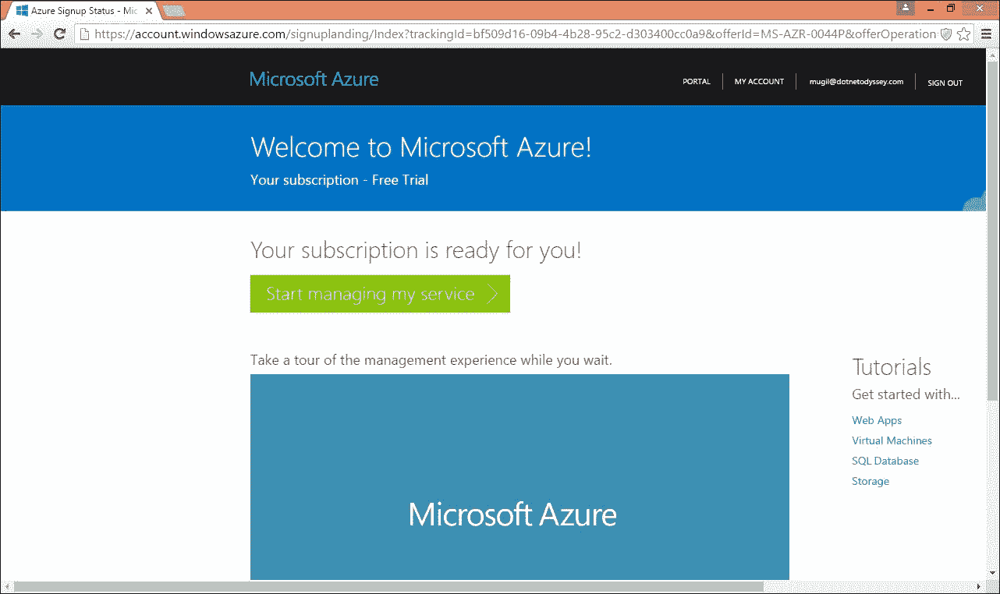

## Azure 部署的先决条件

为了发布 ASP。 从 Visual Studio 2015 社区版到 Azure 的 NET Core 应用，你应该安装 Visual Studio 2015 更新 2(至少)，你应该安装/启用 SQL Server 数据工具。

### 注意事项

如果你有 vs2015 的最新版本，没有必要安装更新 2。

您可以从 URL[https://www.visualstudio.com/en-us/news/vs2015-update2-vs.aspx](https://www.visualstudio.com/en-us/news/vs2015-update2-vs.aspx)下载 Visual Studio 2015 Update 2 并安装它。

SQL Server 数据工具的安装路径为:**控制面板**|**程序和功能** 右键单击**Microsoft Visual Studio Community 2015**，选择**Change**选项，如下图所示:

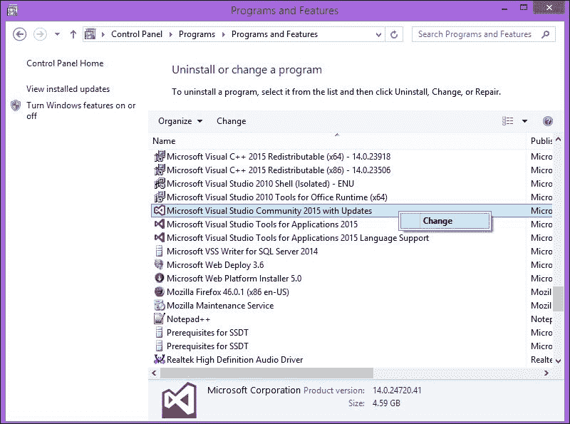

一旦你点击**改变**选项，你会看到下面的窗口-你必须选择**修改**按钮。 单击**Modify**按钮后，将提供一个选项，可以在其中修改 Visual Studio 安装选项。 我选择了**Microsoft SQL Server Data Tools**，如下图所示:

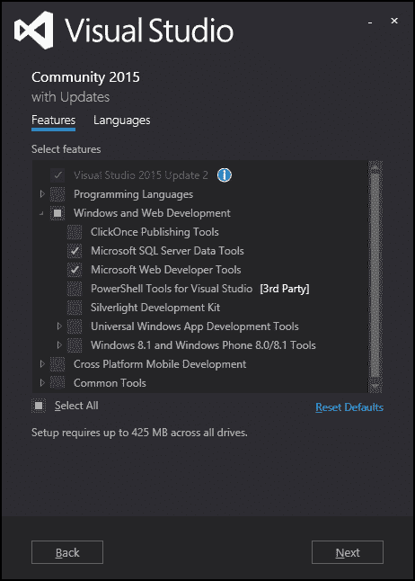

一旦你点击**Next**，Visual Studio 将安装 SQL Server 数据工具，一旦安装完成，你将看到如下屏幕，显示安装完成状态:


# 部署 ASP。 Azure 中的 NET Core 应用

让我们创建一个 ASP.NET Core 应用，我们可以部署在微软 Azure:

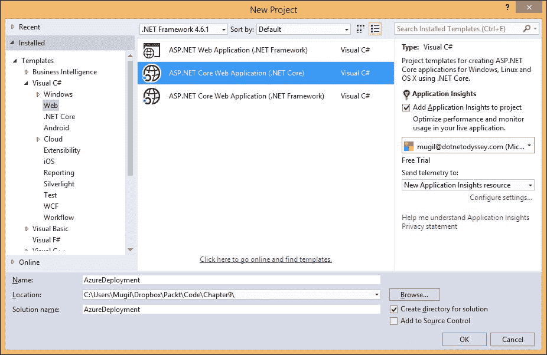

ASP.NET Core 应用将被创建，一旦你点击**OK**按钮:

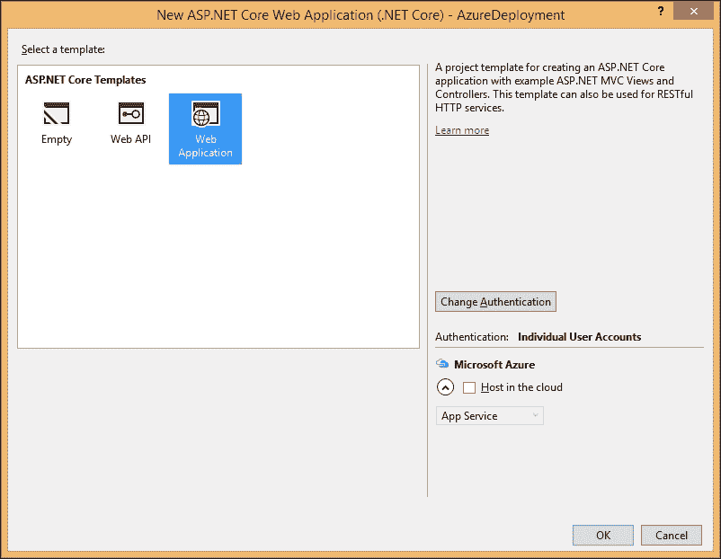

作为默认的 ASP.NET Core Web Application 模板使用了 Entity Framework，我们需要执行以下命令来创建数据库迁移:

```
dotnet ef database update

```

一旦您在**命令提示符**(在项目的路径中)中输入命令，迁移文件将被创建。 这个迁移文件将包含对数据库的所有更改。 该迁移将在部署 Azure 时应用，以便 Azure 可以为部署 Azure 创建必要的数据库脚本:

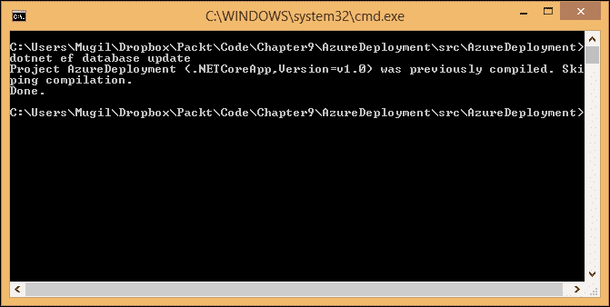

一旦数据库迁移完成，右键单击创建的 Core 应用，选择**Publish**选项，如下图所示:

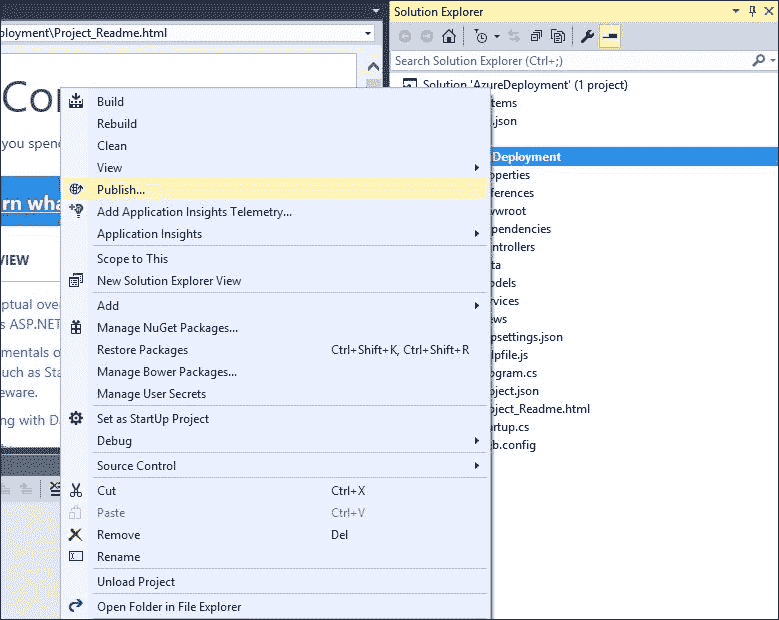

当您点击**发布**选项时，您将看到以下屏幕，描述您可以使用的各种发布选项:


请选择**Microsoft Azure App Service**选项在 Microsoft Azure 平台上发布 web 应用:

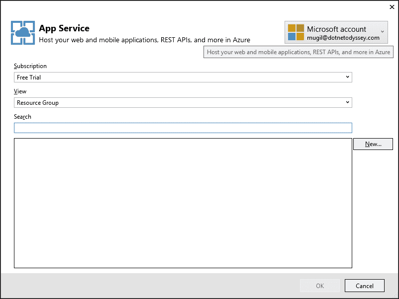

点击**New**按钮，会看到如下画面:


您可以将 web 应用的名称更改为您想要的任何名称。 我已经将 web app 的名称更改为**learningmvc6**。

点击**资源组**旁边的**新建**按钮，输入资源组名称。 资源组只是一个标记，您可以在其中对所有计算资源进行分组，这样如果您想删除所有资源，您可以直接删除资源组。 例如，一个资源组可以由一个 web 服务器和一个数据库服务器组成——你可以把它想象成一个资源的集合。

现在，点击**App 服务计划**旁边的**新增**按钮。 您将看到以下窗口，您可以在其中选择 web 应用容器的位置和大小。 你的位置可以是任何地方，从美国中南部到欧洲，从日本到加拿大。 您的应用容器可以是任何东西，从免费到具有 7 GB RAM 的机器。 我选择了免费选项，因为我们的目标是部署 ASP.NET Core 应用在云环境中，而不是部署一个被数百万用户访问的应用。 当然，你也可以用 ASP 实现同样的功能.NET Core 和 Microsoft Azure:

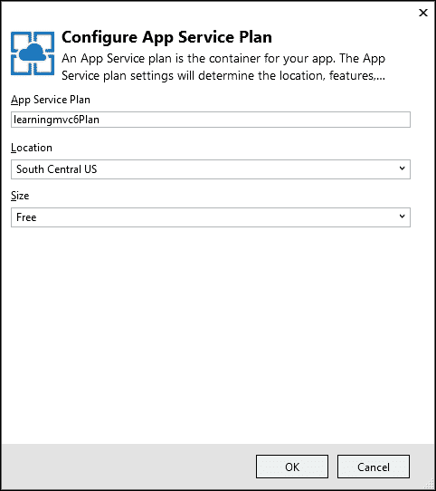

现在，我们可以配置 SQL 数据库，它可以作为额外的 Azure 服务使用。


单击顶部部分的+按钮，这将引导我们配置 SQL 数据库。


如果您在 Azure 环境中有任何现有的 SQL 服务器，您可以使用它。 因为我没有任何这样的服务器，我将通过点击 SQL server 旁边的**新**按钮来创建一个 SQL 服务器:


请输入 SQL Server 的管理员用户名和密码，单击**OK**。 你会看到以下画面:

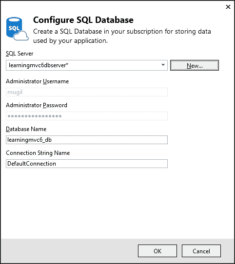

点击**OK**，会看到如下画面:

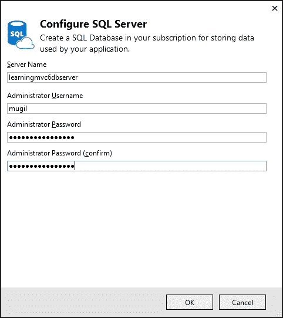

在前面的屏幕上点击**OK**，我们会看到**Create App Service**屏幕:


一旦我们配置了所有所需的 Azure 服务，点击**创建**:

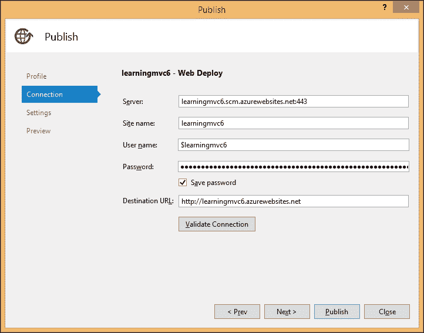

前面的屏幕显示了部署配置选项，例如应用的**站点名称**和**目的地 URL**。 点击上一个屏幕上的**Next**:


需要注意的是，您需要展开**Databases**选项和**Entity Framework Migrations**选项，并选择这两个复选框。 第一个复选框表示应在运行时使用的连接字符串，第二个复选框表示应在发布时应用的数据库迁移。

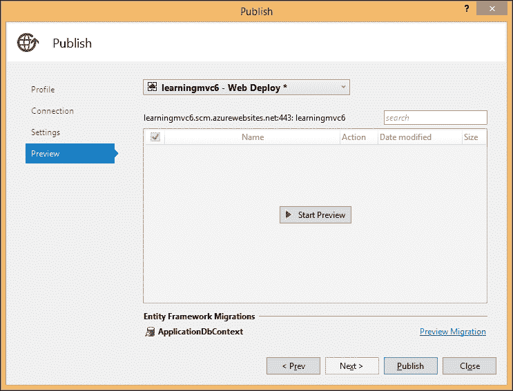

前面的屏幕是预览屏幕，您可以在其中看到发布时将要部署的文件。 这是一个可选的步骤，如果你想查看文件，你可以点击**开始预览**按钮。 或者，您可以点击**Publish**按钮在 Azure 平台上发布 web 应用。

一旦你点击**发布**按钮，我们的 ASP.NET Core 应用将部署在 Azure 中，您的应用 URL 将在成功发布时打开。 你会看到以下画面:


# 部署 ASP。 Linux 环境下的核心 web 应用

在本章的这一部分，我们将学习如何创建和部署 ASP.NET Core web 应用在 Linux 平台。 我将使用**Amazon Web Services**(**AWS**)将应用部署到云中。 显然，您不需要 AWS 来部署 ASP.NET 内核应用在 Linux 上。 我使用它只是为了不需要在我的本地机器上安装 Linux。 使用 AWS(或任何其他公共云服务提供商或任何托管提供商)托管的另一个好处是，我可以从任何地方访问 web 应用，因为它将是公共可用的。

在 Linux 环境下，我们有以下先决条件来创建和部署:

*   Linux 机器
*   Putty 客户端(如果您使用的是远程 Linux 机器)

## 创建 Linux 机器

我们将使用 AWS 来创建一台 Linux 机器。 使用 AWS 或其他云服务提供商的优势在于，我们只有在需要的时候才可以使用它们的服务，当你用完它时，我们可以关闭机器。 你只需要在使用它的时候支付时间。 第一年，AWS 有一个免费层，您可以在其中托管机器(如果它符合免费层的条件)，而无需支付任何费用。 我已经使用 AWS 好几年了，尝试了云中的许多东西，因此我没有资格进入免费层。

然而，您可以使用任何虚拟化软件在 Windows PC 上安装 Linux。 Ubuntu Linux 有从 u 盘启动的选项，这样你就不需要干扰本地 PC 上的任何东西。

注册 AWS 帐户后，您可以进入**EC2 仪表板**，在那里您可以创建**EC2 实例**:

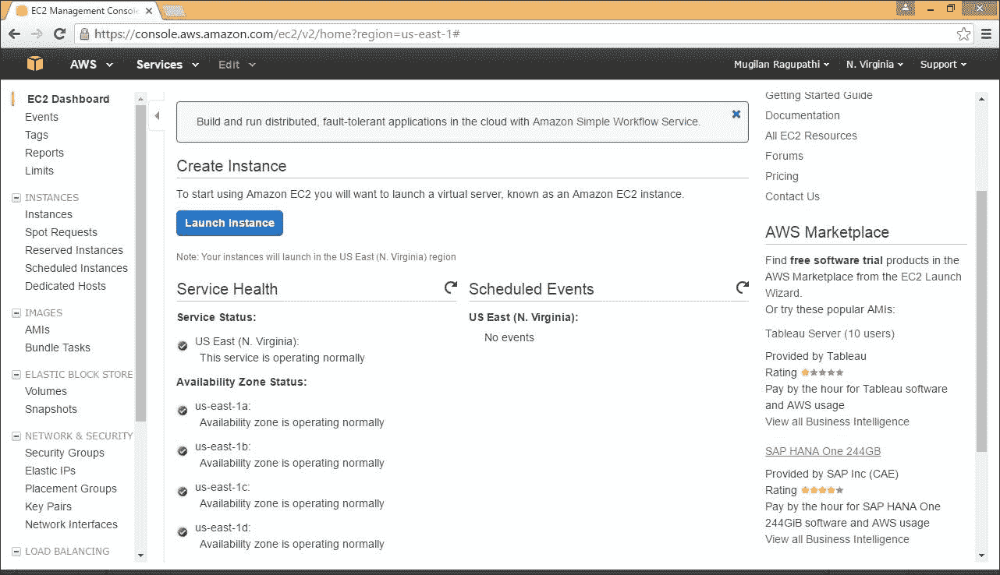

点击上一个屏幕中的**Launch Instance**。 将启动一个向导，它将帮助您选择和配置实例。 在这一步中，我们选择 Ubuntu Linux 服务器是因为它的易用性。

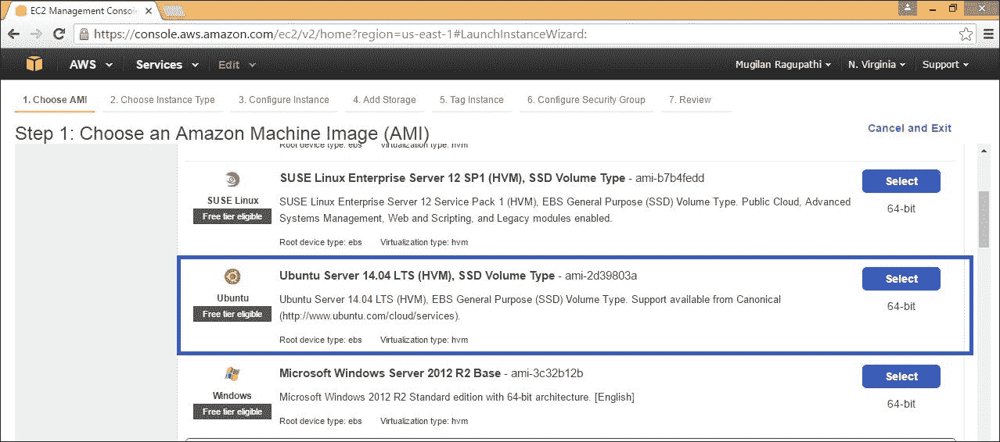

AWS 中有各种各样的实例，从**nano**(使用 0.5 GB RAM)到大型机器(使用 1952 GB RAM)。 我们将选择**微**实例，因为它符合免费层:

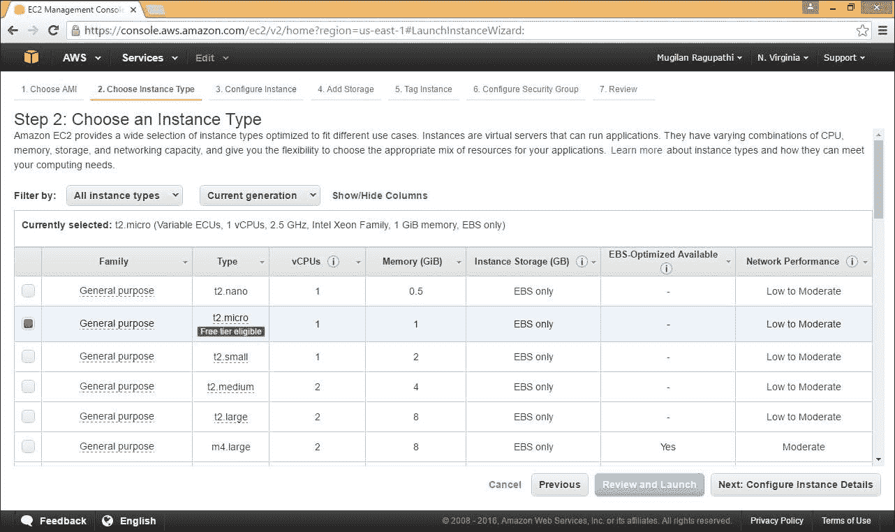

在前面的步骤中，我们可以为云配置实例。 我们可以创建一个自动伸缩组，其中 AWS 云将在负载高时自动启动实例。 因为我们的目标是创建和部署 ASP.NET Core web 应用，我们将保留默认值，因为他们是，然后点击**下一步:添加存储**移动到下一个屏幕:

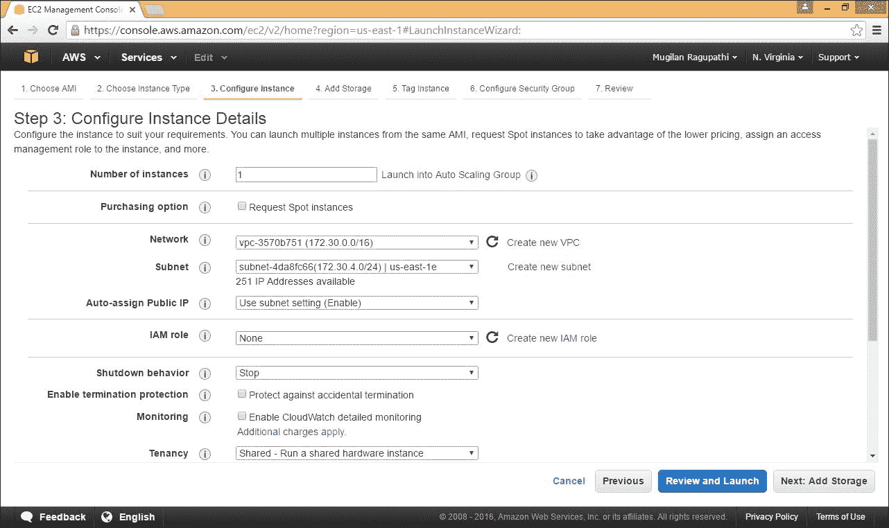

**micro**实例没有任何外部存储。 因此，我们需要添加存储才能使用它。 我们有三种存储方式可供选择:**通用 SSD**、**预留 SSD**和**磁性 SSD**。 在这三种存储中，**通用 SSD**是通常使用的存储。

当应用进行高输入输出操作时，吞吐量可能会下降。 但是在 provisioning SSD 中，您可以从存储设备维护所需的吞吐量。 磁存储器只是一种老式的存储器。 我们将使用通用 8gb**固态硬盘**(**SSD**)，因为它能很好地满足我们的要求。


如果使用多个实例，可以对它们进行标记，以便通过使用标记名称来控制实例。 因为我们只会启动一个实例，所以我将把它留空，然后进入下一个步骤:


在这一步中，我们可以为实例配置安全组—应该为传入的流量打开哪些端口。 任何配置中的一般规则都是只打开您需要的端口，而不打开其他任何端口。 您还需要告诉 IP(或其范围)可以从哪里访问计算机。 由于它是一个演示应用，我们将为**Secure Shell**(**SSH**)开放端口`22`; 使用 PuTTY 和`80`访问 Core web 应用。

配置好安全组后，单击**审查和启动**。

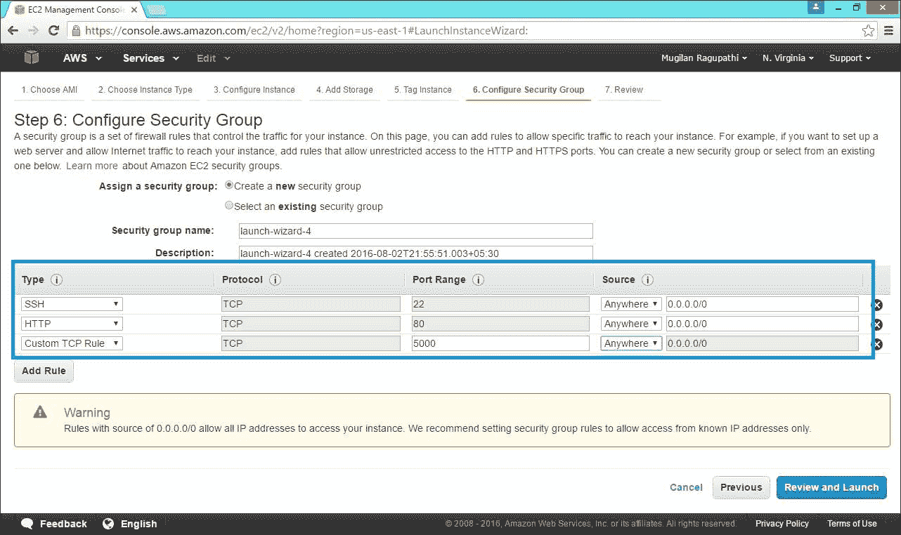

在以下屏幕上，您可以查看所选选项:

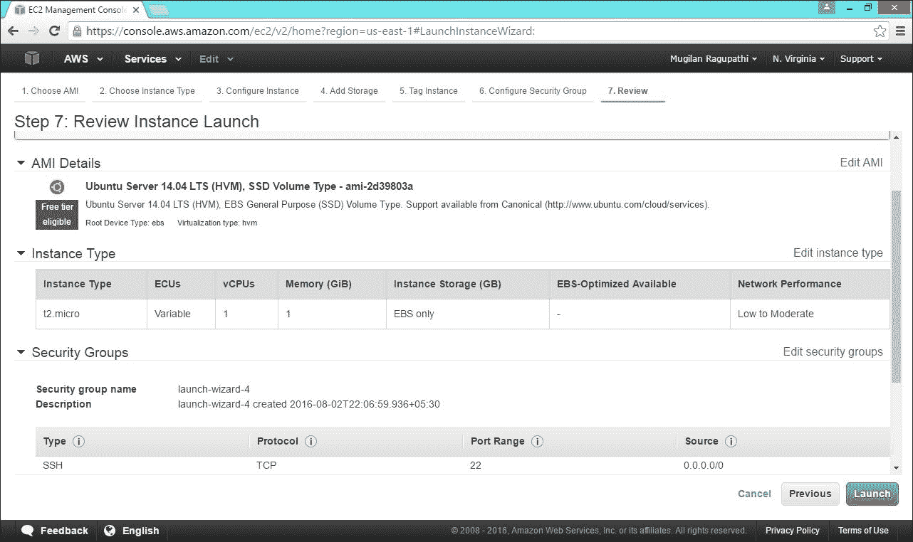

一旦您对所选选项满意，就可以单击**启动**。 否则，您可以回到上一步，使用正确的值重新配置它们。

当您点击**Launch**时，它会要求您选择一个密钥对，您将使用该密钥对登录到任何 AWS 服务器。 如果你没有，你可以创建一个。 因为我已经创建了一个，我将使用现有的一个，如下截图所示:

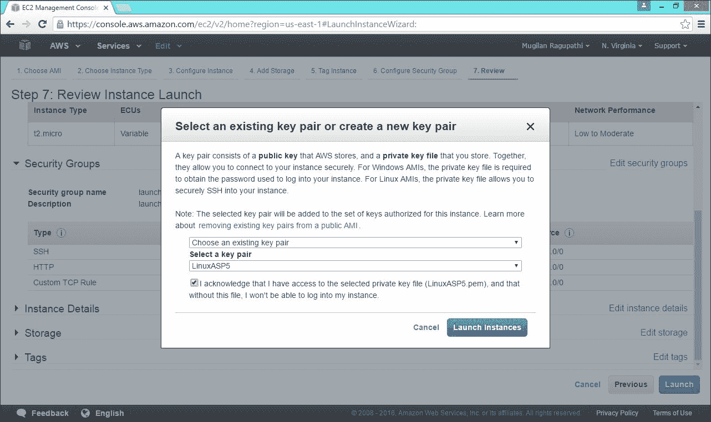

选择密钥对并单击**Launch Instances**。 AWS 将为我们启动新的实例，状态将显示出来(如下面的截图所示)。 实例 ID 也将可用(屏幕截图中的框):


点击蓝色的链接会获取状态(如下截图所示)。 **公共 DNS**和**公共 IP**是您将用来连接到该服务器的重要值。 因此，我在截图中把它们框起来:


## 安装 PuTTY 客户端

在创建了一个新的 Linux 服务器之后，我们可以在那里创建一个 ASP.NET 5 web 应用和主机，我们需要安装 PuTTY 客户端，一个可以向 Linux 服务器发送命令和接收响应的小应用。 因为我们将在 Linux 服务器上安装应用，所以我们需要一种从 Windows PC 连接到 Linux 服务器的方法。 PuTTY 客户端应用就是这样做的。

PuTTY 客户端可通过“[http://www.chiark.greenend.org.uk/~sgtatham/putty/](http://www.chiark.greenend.org.uk/~sgtatham/putty/)”下载。


点击**下载**链接，在下面的屏幕中选择链接(屏幕截图中的框):


它将下载 MSI 文件。 下载完成后，启动安装程序，你会看到如下欢迎屏幕:


点击**Next**，你会看到以下画面:


选择安装文件夹-你可以让它保持原样，然后点击**Next**:


选择要安装的产品特性。 您可以保持默认选择，单击**Install**。 安装完成后，你会看到如下画面:


单击**完成**并启动 PuTTY 应用。 它将打开 PuTTY 配置窗口，我们将在这里输入主机名和身份验证细节。 主机名为`<username>@<public DNS>`。 在我们的例子中，它是**ubuntu@ec2-107-22-121-81.compute-1.amazonaws.com**。 Ubuntu 是我们所选择的 Ubuntu AMI 的默认用户。 我们可以在状态窗口中获得公共 DNS 值，如下所示:


对于身份验证，在左侧窗格中选择**Connection**|**SSH**|**Auth**并选择我们之前创建的`PPK`文件(私钥文件):

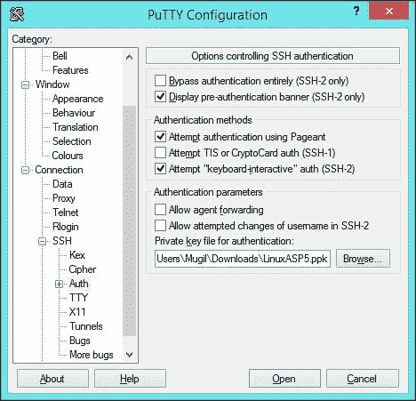

点击**打开**。 你会收到一个警告，问你是否信任这个主机。 单击**yes**，您将看到 Linux 屏幕上的命令提示符。

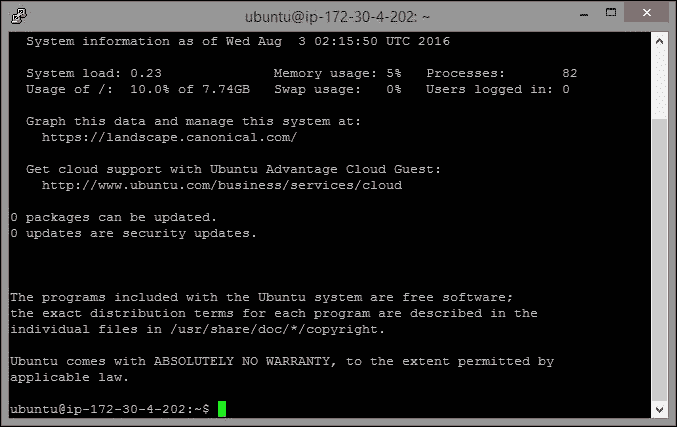

接下来，我们需要在创建 asp.net 之前安装。net Core.NET 5 应用并最终托管它们。

## 在 Linux 机器上安装。net Core

为了在 Ubuntu 上安装。net Core，我们需要首先设置 apt 并获取包含我们需要的包的 feed。 输入以下命令:

```
sudo sh -c 'echo "deb [arch=amd64] https://apt-mo.trafficmanager.net/repos/dotnet-release/ trusty main" > /etc/apt/sources.list.d/dotnetdev.list'sudo apt-key adv --keyserver apt-mo.trafficmanager.net --recv-keys 417A0893

```

你会看到以下画面:

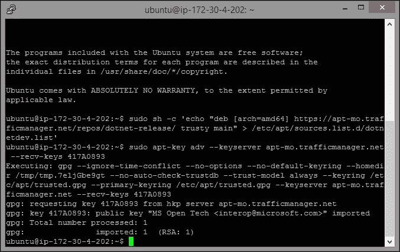

然后通过发出以下命令来更新它，这将下载所需的包并安装它们:

```
sudo apt-get update

```

你会看到下面这个命令的屏幕:

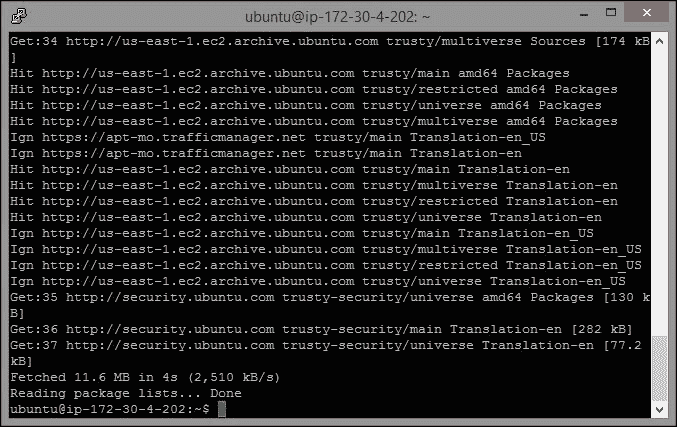

使用如下命令安装。net Core:

```
sudo apt-get install dotnet-dev-1.0.0-preview2-003121 

```

系统显示如下界面:


# 创建一个新的 ASP。 净 5 项目

发出以下命令来创建一个新目录，我们将在其中创建 ASP。 净 5 应用。 第一个命令( `**mkdir**` - make directory)用于在 Linux 中创建一个目录，第二个命令( `**cd**` - change directory)用于进入文件夹内部。 最后一个命令是创建。net Core 应用的命令行:

```
mkdir aspnetcoreapp
cd aspnetcoreapp
dotnet new

```

系统显示如下界面:


这将创建。net Core 应用，它有两个文件——`Program.cs`和`project.json`。 它是一个甚至没有`Startup`文件的最小应用。

我们需要在`project.json`中添加`Kestrel HTTP Server`包作为一个依赖项。 您可以通过发出命令 `**vi project.json**` 来编辑该文件。 默认情况下，vi 编辑器将以只读模式打开文件。 你需要按*Esc*+*I*才能进入编辑模式。 添加一行**“Microsoft.AspNetCore.Server.” Kestrel": "1.0.0"**如下截图:


按 Escape 键和“*:”*，输入`wq`，写入并退出`vi`编辑器。

由于我们已经添加了依赖关系，我们需要通过执行以下命令来恢复这些包:

```
dotnet restore

```

一旦你输入这个命令，所有的包将被恢复如下截图所示:


创建一个包含以下内容的新文件`Startup.cs`。 可以通过发出命令 `**vi Startup.cs**` 来创建一个新文件。 像往常一样，我们需要按*Esc*+*I*使文件处于读写模式。 粘贴以下内容(从这里复制后，点击鼠标右键即可粘贴):

```
using System;
using Microsoft.AspNetCore.Builder;
using Microsoft.AspNetCore.Hosting;
using Microsoft.AspNetCore.Http;
namespace aspnetcoreapp
{
  public class Startup
  {
    public void Configure(IApplicationBuilder app)
    {
      app.Run(context =>
        {
          return context.Response.WriteAsync("This is ASP.NET Core application running in Linux!");
         });
    }
  }
}
```

按*Esc*+*:**，输入`wq`，保存文件。 将`Program.cs`文件更新为以下内容:*

 *```
namespace aspnetcoreapp
{
  public class Program
  {
    public static void Main(string[] args)
    {
      var host = new WebHostBuilder()
      .UseKestrel()
      .UseStartup<Startup>()
      .Build();
       host.Run();
     }
   }
}
```

您将看到以下屏幕:


我们已经创建了 ASP.NET Core web 应用。 现在我们需要安装**Nginx**，这是一个反向代理服务器，它可以帮助您减轻诸如提供静态内容、缓存和压缩请求等工作。 你可以配置 Nginx 监听一个特定的端口(我们将在本章的后面讨论细节)。 你可以通过以下命令安装 Nginx:

```
sudo apt-get install nginx

```

安装完成后，您可以发出以下命令来启动服务:

```
sudo service nginx start

```

当你运行这个命令时，你会看到下面的屏幕:

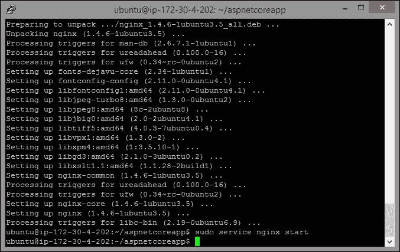

# 配置 Nginx 服务器

通过修改文件(`/etc/nginx/sites-available/default`)来配置 Nginx 服务器，使其包含以下内容——这样 Nginx 就可以将请求转发给 ASP.NET。 为了修改这个文件，您需要有足够的权限—尝试切换到超级用户。 `**Sudo su**` 是将其切换为超级用户的命令。 参见以下代码:

```
server {
  listen 80;
  location / {
    proxy_pass http://localhost:5000;
    proxy_http_version 1.1;
    proxy_set_header Upgrade $http_upgrade;
    proxy_set_header Connection keep-alive;
    proxy_set_header Host $host;
    proxy_cache_bypass $http_upgrade;
  }
}
```

代码如下所示:

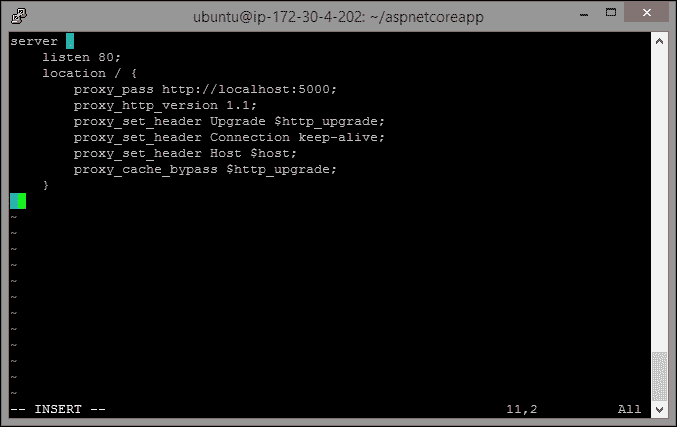

运行应用，执行如下命令:

```
dotnet run

```

你会看到以下画面:

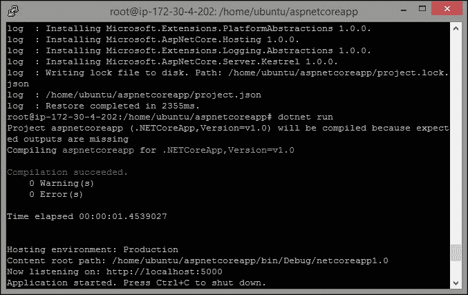

现在使用公共 DNS 从浏览器访问应用(AWS 在实例启动时创建了公共 DNS):

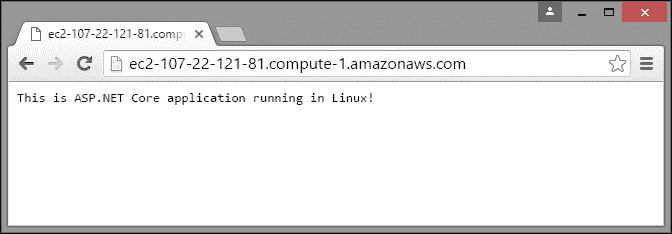

瞧! 我们已经创建了 ASP.NET Core web 应用，并在 Linux 盒子中启动它。 我们甚至通过**Amazon Web Services**(**AWS**)使用云。

# 总结

在本章中，您已经了解了`project.json`文件中可用的不同组件，其中包含了您的 ASP. conf 的所有配置.NET Core。 我们讨论了如何注册微软 Azure 云平台并部署 ASP。 Azure 平台中的 NET Core 应用。 我们还学习了如何创建和部署 ASP.NET Core web 应用在 Linux 中使用 Amazon web Services 在云。*