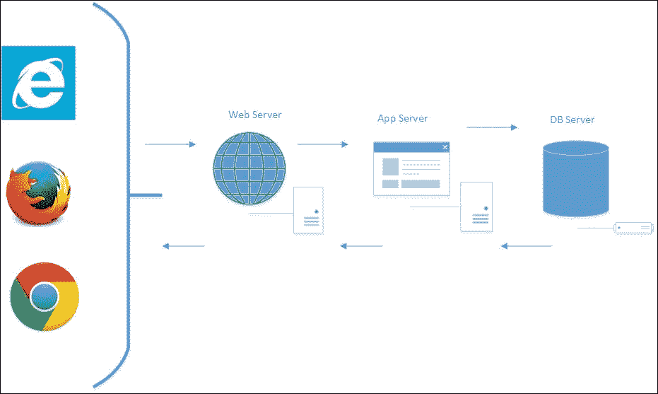
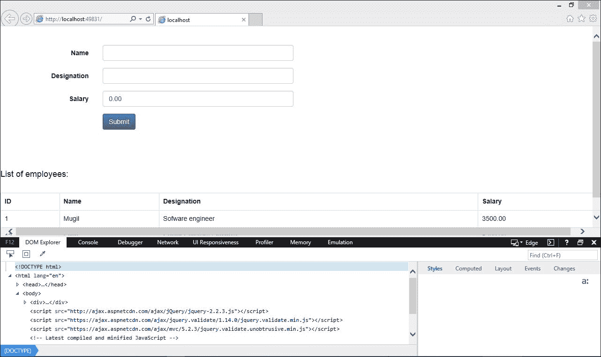
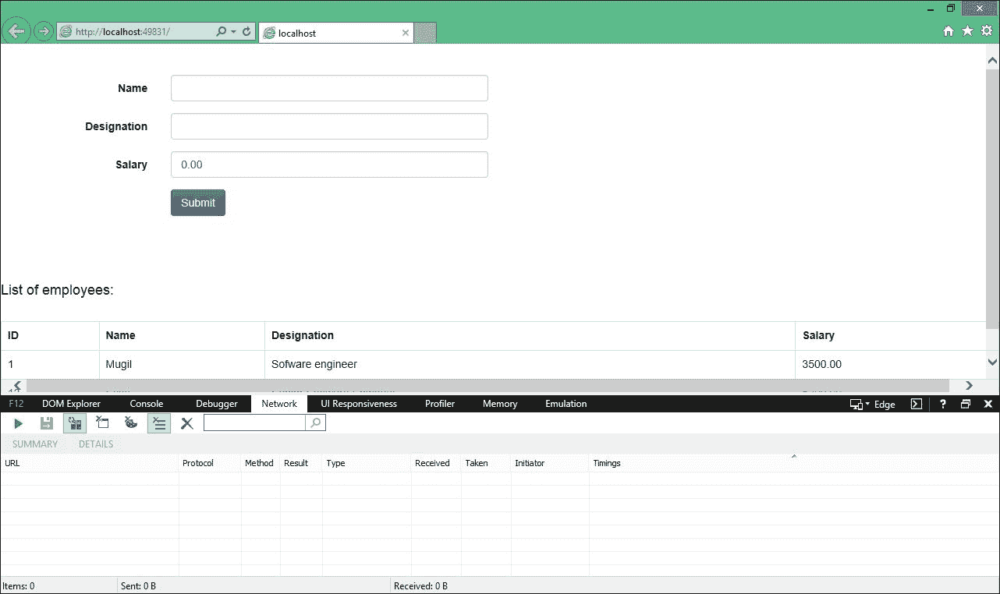
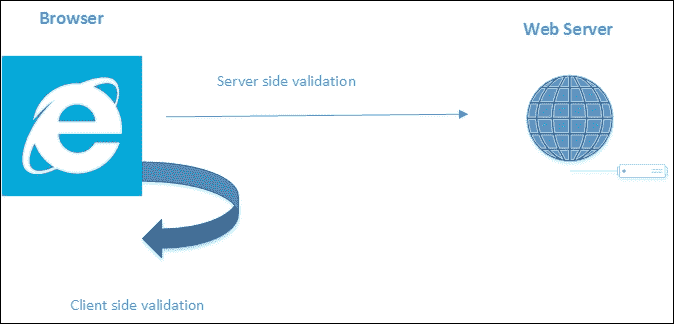
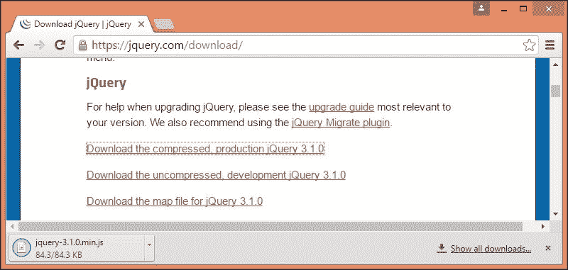
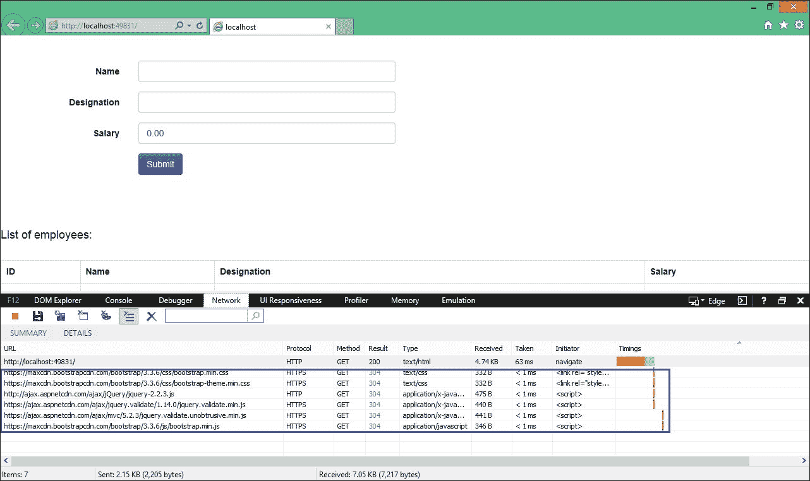
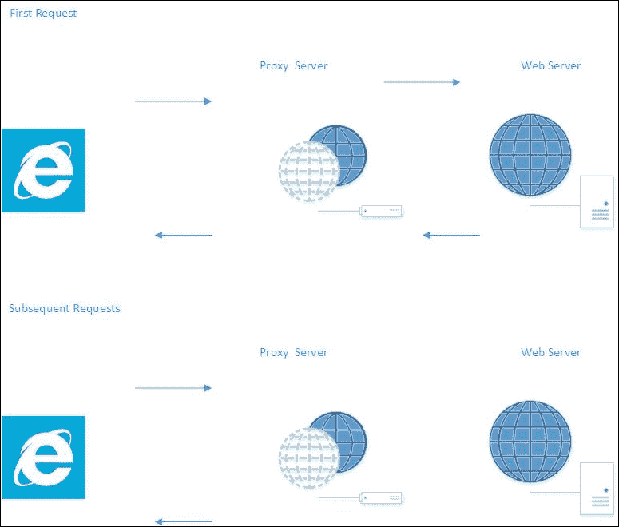

# 十一、提高 ASP.NET Core 应用的性能

当您考虑频繁访问的应用(我们每天使用的那些应用)时，例如谷歌、YouTube 和 Facebook，这些应用的性能将它们与类似应用区分开来。 想一下。 如果谷歌需要超过 10 秒的时间来提供搜索结果，大多数人会切换到必应或其他搜索引擎。 因此，性能是应用成功的主要因素之一。

在本章中，我们将学习以下内容:

*   分析应用性能问题的方法
*   如何利用浏览器开发工具来分析应用的性能
*   UI 层的性能改进
*   web/应用层的性能改进
*   数据库层的性能改进

通常，当人们谈论应用的性能时，他们考虑的是应用的速度。 虽然速度对应用的性能有很大的贡献，但是我们还需要考虑应用的可维护性、可伸缩性和可重用性。

一个维护良好的代码将是清晰的，并且具有较少的技术债务，这反过来又将提高开发人员的生产力。 当我们编写基于面向服务的体系结构或微服务的代码时，我们的代码将更便于他人使用。 这也将使我们的代码具有可伸缩性。

通常，人们在几乎完成应用的开发时才考虑应用的性能，试点用户还在抱怨应用的速度。 讨论性能的最佳时机是在应用开发之前; 我们需要与产品所有者、业务分析师和实际用户合作，以达到应用可接受的性能水平的标准。 然后，我们以这个预期的性能水平作为目标来设计和编码。

这也取决于应用的领域。 例如，任务关键型医疗保健应用将要求很高的性能(它们可能期望在不到一秒的时间内得到响应)，而后台应用的性能要求可能没有那么高。 因此，了解我们工作的领域是至关重要的。

如果要求您调优现有应用的性能，那么了解应用的现有体系结构也很重要。 ASP.NET Core，您可以将一个简单的 CRUD 应用构建为一个服务于世界各地数百万用户的关键任务应用。 一个大型应用可能有许多其他组件，例如负载平衡器、独立的缓存服务器、**内容分发网络**(**CDN**)、一组从数据库服务器，等等。 因此，在分析应用的性能时，首先需要研究体系结构，分析涉及的每个组件，度量每个组件的性能，并在应用不能满足您的可接受性能时尝试优化它们。 最重要的是不要在不研究和分析应用的架构的情况下就急于研究性能改进技术。 如果您正在创建一个新的应用，那么您可以从创建应用的一开始就考虑性能问题。

我们将研究一个典型的 web 应用设置，如下面的截图所示。 然后我们将分析它并考虑如何改进它:



以下步骤展示了使用 web 应用的过程:

1.  用户访问 ASP.NET 来自浏览器的核心 web 应用，如 Internet Explorer、Firefox 或 Chrome。 当用户在浏览器中输入 URL 并按下*Enter*键时，浏览器将创建一个会话并触发 HTTP 请求。 这不是 ASP 特有的.NET Core 应用。 这种行为对于所有 web 应用都是相同的，不管它们是基于何种技术构建的。
2.  请求到达 web 服务器。 如果是一个简单的请求，web 服务器本身将服务该请求。 提供静态 HTML 文件就是一个典型的例子。 如果请求有点复杂，例如根据业务逻辑返回一些数据，则请求将被转发到应用服务器。
3.  应用服务器将查询数据库以获取数据。 然后，在将数据返回给 web 服务器之前，它可能会对接收到的数据进行一些业务处理。 有时，web 服务器可能充当较小的 web 应用的应用服务器。
4.  然后，web 服务器将响应(通常是 HTML)返回给请求的客户端。

因此，我们可以将这些组件分为三层——UI 层、web/应用层和 DB 层。 关于提高 ASP 的整体性能.NET Core 应用，我们需要彻底了解如何提高每个层的性能。

在实现任何性能改进技术之前，我们需要首先分析应用中每个层的性能。 只有这样，我们才能提出改进应用整体性能的方法。

# UI 层

UI 层表示浏览器和服务器之间发生的所有事件(以及相关内容)。 有很多活动，包括但不限于以下:

*   触发 HTTP 请求
*   得到的响应
*   下载的资源
*   在浏览器中呈现它们
*   任何 JavaScript 代码执行

# 减少 HTTP 请求数量

一个典型的网页可能不只有 HTML 内容。 它可能引用 CSS 文件、JS 文件、图像或其他源。 因此，当您试图访问一个网页时，客户端将为每个引用触发 HTTP 请求，并将这些引用从服务器下载到客户端。

当您想要分析从客户机发出的 HTTP 请求时，浏览器开发工具就派上用场了。 大多数浏览器都有可以使用的开发工具。

在 ie 浏览器中按*F12*，ie 浏览器窗口下方会弹出**开发人员工具**窗口，如下图所示:



点击**网络**选项卡。 在浏览器中输入 URL 前，点击*Start*按钮(绿色播放按钮)，或者点击绿色播放按钮刷新页面:



一旦你按下**网络**选项卡的开始按钮，Internet Explorer 的**网络**选项卡将侦听当前选项卡发出的每个请求。 每个请求将包含信息，例如 URL、协议、方法、结果(HTTP 状态代码)和其他信息。

我再次运行应用(**跟踪网络请求**选项 ON)，我可以看到正在跟踪的请求，如下截图所示:


在 Network 选项卡中有许多有用的数据。 首先，URL 列显示正在访问的资源。 协议列，顾名思义，显示了访问资源所使用的协议。

首先，URL 列显示正在访问的资源。 协议列，顾名思义，显示了访问资源所使用的协议。 Method 列显示了请求的类型，在 Result 列中，我们可以看到请求的 HTTP 状态码(HTTP 200 响应意味着 GET 请求成功)。

Type 列显示正在访问的资源类型，Taken 列显示从服务器接收文件所花费的时间。 Received 列显示作为请求的一部分下载的文件的大小。

## 使用 GZip 压缩

在提供内容时，可以使用 GZip 压缩内容，以便通过网络发送更少的数据。 您需要添加适当的 HTTP 头，以便浏览器能够理解所传递的内容的模式。 在 IIS 中，默认情况下为静态资源启用此选项。 您可以通过访问路径`C:\Windows\System32\inetsrv\config`上的`applicationHost.config`文件来验证这一点:

```
<httpCompression directory="%SystemDrive%\inetpub\temp\IIS Temporary Compressed Files">
  <scheme name="gzip" dll="%Windir%\system32\inetsrv\gzip.dll" />
  <staticTypes>
    <add mimeType="text/*" enabled="true" />
    <add mimeType="message/*" enabled="true" />
    <add mimeType="application/x-javascript" enabled="true" />
    <add mimeType="application/atom+xml" enabled="true" />
    <add mimeType="application/xaml+xml" enabled="true" />
    <add mimeType="*/*" enabled="false" />
  </staticTypes>
</httpCompression>
```

如果它在您的`applicationHost.config`文件中不可用，您必须进行必要的更改。

## 使用内容分发网络(CDN)

内容交付网络是一个分布在全球各地的分布式服务器系统，根据访问内容的地理位置为内容提供服务。 亚马逊的**CloudFront**就是 CDN 的一个例子。 亚马逊在世界各地都有边缘位置(服务器所在的位置)，因此可以从最近的位置向用户提供内容。

在接下来的一行中，我们从 jQuery 官方网站提供的 CDN 中访问 jQuery:

```
<script src="https://code.jquery.com/jquery-3.1.1.min.js" ></script>
```

## 尽可能使用 JavaScript

如果可以使用 JavaScript 实现某个功能，那么就使用它。 例如，在服务器上验证表单数据之前，总是尝试先进行客户端验证。 这种方法有两个优点—站点将非常快，因为所有事情都是在客户端本身完成的;服务器将处理大量的请求，因为有些请求是在客户端处理的。



## 使用 CSS 样式表

随着浏览器逐渐呈现网页(浏览器将显示它所拥有的任何内容，一旦它收到它)，最好把样式表放在顶部而不是在网页的末尾。 如果我们将样式表放在底部，它将禁止渐进式呈现，因为浏览器必须使用样式重新绘制内容。

当下载 JavaScript 文件时，大多数浏览器都会阻止并行下载，所以最好将脚本放在底部。 这意味着您的内容在浏览器下载脚本时显示给用户。 下面是在 ASP 中创建的示例布局文件.NET Core 应用，CSS 文件被引用在顶部，JavaScript 文件被引用在底部:

```
<!DOCTYPE html>
<html lang="en">
  <head>
    <meta name="viewport" content="width=device-width" />
    <title>@ViewBag.Title</title>

    <!-- Latest compiled and minified CSS -->

    <link rel="stylesheet"  href="https://maxcdn.bootstrapcdn.com/bootstrap/3.3.6/css/bootstrap.min.css" integrity="sha384-1q8mTJOASx8j1Au+a5WDVnPi2lkFfwwEAa8hDDdjZlpLegxhjVME1fgjWPGmkzs7" crossorigin="anonymous">

    <!-- Optional theme -->

    <link rel="stylesheet" href="https://maxcdn.bootstrapcdn.com/bootstrap/3.3.6/css/bootstrap-theme.min.css" integrity="sha384-fLW2N01lMqjakBkx3l/M9EahuwpSfeNvV63J5ezn3uZzapT0u7EYsXMjQV+0En5r" crossorigin="anonymous">

  </head>
  <body>
    <div>
      @RenderBody()
    </div>
    <script src="http://ajax.aspnetcdn.com/ajax/jQuery/jquery-2.2.3.js"></script>

    <script src="https://ajax.aspnetcdn.com/ajax/jquery.validate/1.14.0/jquery.validate.min.js"></script>

    <script src="https://ajax.aspnetcdn.com/ajax/mvc/5.2.3/jquery.validate.unobtrusive.min.js"></script>

    <!-- Latest compiled and minified JavaScript -->
    <script src="https://maxcdn.bootstrapcdn.com/bootstrap/3.3.6/js/bootstrap.min.js" integrity="sha384-0mSbJDEHialfmuBBQP6A4Qrprq5OVfW37PRR3j5ELqxss1yVqOtnepnHVP9aJ7xS" crossorigin="anonymous"></script>

  </body>
</html>
```

# 最小化 JavaScript 和 CSS 文件及其组合

下载网页相关资源所花费的时间与所下载文件的大小成正比。 如果我们减少文件的大小而不改变实际的内容，它将大大提高性能。 缩小是为了减少文件的大小而改变文件内容的过程。 删除多余的空格和将变量名更改为更短的名称都是最小化过程中使用的常见技术。

流行的 JavaScript 库，如 jQuery 和前端框架，默认情况下提供了最小化的文件。 你可以直接使用它们。 在下面的截图中，我下载了 jQuery 的压缩版本。 你可以减少你为你的应用编写的自定义 JavaScript 和 CSS 文件:



**捆绑**是将两个或多个文件合并为一个的过程。 捆绑和缩小，当一起使用时，将减少有效载荷的大小，从而提高应用的性能。

你可以通过以下网址安装**Bundler&Minifier**Visual Studio 扩展:

[https://visualstudiogallery.msdn.microsoft.com/9ec27da7-e24b-4d56-8064-fd7e88ac1c40](https://visualstudiogallery.msdn.microsoft.com/9ec27da7-e24b-4d56-8064-fd7e88ac1c40)

一旦你安装这个 Visual Studio 扩展,你可以选择你想要的文件包和贬低通过选择文件并选择**&打包机缩小镜**从**上下文选项**菜单,单击右键。 如下截图所示:


一旦你选择**捆绑和最小化文件**选项，它会要求你保存捆绑的文件，如下截图所示:


你可以命名你希望的文件和保存文件。 一旦您保存了该文件，另一个文件将在您的解决方案中创建—在我们的例子中，它是`bundleconfig.json`文件:


该文件将包含关于输入文件和绑定的输出文件的信息。 下面就是这样一个例子:

```
[
  {
    "outputFileName": "wwwroot/css/site.min.css",
    "inputFiles": [
    "wwwroot/css/site.css"
    ]
  },

{
  "outputFileName": "wwwroot/js/site.min.js",
  "inputFiles": [
  "wwwroot/js/site.js"
  ],
  "minify": {
  "enabled": true,
  "renameLocals": true
  }
},

{
  "outputFileName": "wwwroot/css/bundle.css",
  "inputFiles": [
  "wwwroot/css/site.css",
  "wwwroot/css/StyleSheet1.css"
    ]
  }
]
```

您可以在应用中使用这个绑定文件，从而提高性能。

# 缓存过程

缓存是复制数据并将其保存在内存中的过程，而不是通过外部资源(如网络、文件或数据库)再次获取数据。 缓存中使用的数据是临时的，可以随时删除。 由于我们直接访问数据，缓存可以极大地提高应用的性能。

缓存可以在任何一层中完成——在浏览器的客户端，在代理服务器(或某些中间件)，或在 web/应用服务器上。 对于数据库层缓存，我们可能不需要进行任何自定义编码。 根据所使用的数据库服务器的类型，您可能需要进行一些配置更改。 然而，现在的大多数数据库都足够强大，可以在需要时缓存数据。

## 客户端缓存

如果添加适当的 HTTP 响应头，就可以在客户端进行缓存。 例如，如果我们想缓存所有的静态资源，如 CSS、图像和 JavaScript 文件，我们可以在**cache - control**头中添加**max-age**响应头:



前截图**开发工具窗口**的**网络**选项卡中,当请求被解雇,我们得到 HTTP**304 响应*(不修改)作为响应。 这意味着相同的文件不会通过网络传输两次，因为它们可以在浏览器中使用。*

为静态文件实现浏览器缓存非常简单，只需要几个步骤—添加依赖项和配置应用。

在`project.json`文件的依赖项列表中添加以下`NuGet`包:

```
"Microsoft.AspNet.StaticFiles": "1.0.0-rc1-final" 

```

在`Startup.cs`文件中添加以下命名空间，并配置应用使用这些静态文件:

```
using Microsoft.AspNet.StaticFiles;
using Microsoft.Net.Http.Headers;

public void Configure(IApplicationBuilder app)
{
  app.UseIISPlatformHandler();
  app.UseMvc();
  app.UseMvc(routes =>
  {
    routes.MapRoute(name:"default", template:"{controller=Employee}/{action=Index}/{id?}");});

 app.UseStaticFiles(new StaticFileOptions

() 

 { 

      OnPrepareResponse = (context) => 

 { 

 var headers = context.Context.Response.GetTypedHeaders(); 

 headers.CacheControl = new CacheControlHeaderValue() 

 { 

 MaxAge = TimeSpan.FromSeconds(60), 

 }; 

} 

 }); 

}
```

## 响应缓存

在响应缓存中，当 MVC 操作返回时，与缓存相关的 HTTP 头被添加到 HTTP 响应中。 Cache-Control 报头是添加到响应中的主 HTTP 报头。



上图显示了响应缓存的实际情况。 在第一个请求中，我们调用了 Controller 的 action 方法; 请求来自客户端，并通过代理服务器，实际上击中 web 服务器。 由于我们已经添加了响应缓存，任何后续的请求将不会被转发到 web 服务器，而响应将从代理服务器本身返回。 这将减少对 web 服务器的请求数量，从而减少 web 服务器的负载。

缓存控制器的动作方法的响应非常简单。 只需添加带有 duration 参数的`ResponseCache`属性。 在下面的 action 方法中，我们添加了一个持续时间为 60 秒的响应缓存，这样，在接下来的 60 秒内，如果有任何请求再次出现，响应将从代理服务器本身返回，而不是前往 web 服务器:

```
[ResponseCache(Duration = 60)]
public IActionResult Index()
{
  EmployeeAddViewModel employeeAddViewModel = new   EmployeeAddViewModel();
  using (var db = new EmployeeDbContext())
  {
    employeeAddViewModel.EmployeesList = db.Employees.ToList();
  }
  return View(employeeAddViewModel);
}
```

# web/应用层

web/application 层由从客户端接收请求到返回响应(或查询 DB 层以获得所需数据)之间发生的任何事情组成。 大多数 web/application 层将使用服务器端语言，比如 c#，所以当你试图优化 web/application 层时，你需要结合 ASP 的最佳实践.NET MVC 和 c#。

## 视图中没有业务逻辑

视图是呈现给浏览器的内容，它可以包含表示逻辑。 表示逻辑表示数据显示的位置和方式。 ViewModels(实际上，特定于视图的模型)是保存特定视图数据的模型。

视图和 ViewModels 都不应该包含任何业务逻辑，因为这违反了关注点分离原则。

看看下面的 Razor View 代码。 我们只是循环遍历模型中的列表，并以表格格式显示数据——仅此而已:

```
<h4> List of employees:</h4> <br />
  <table class="table table-bordered">
  <tr>
    <th> ID </th>
    <th> Name </th>
    <th> Designation </th>
    <th> Salary </th>
  </tr>
  @foreach (var employee in Model.EmployeesList)
  {
  <tr>
    <td>@employee.EmployeeId</td>
    <td>@employee.Name</td>
    <td>@employee.Designation</td>
    <td>@employee.Salary</td>
  </tr>
  }
  </table>
```

在某些代码中，ViewModel 中可能有一个存储库层，这是不应该发生的。 请格外小心查看/ViewModel 代码中的内容。

## 使用异步日志记录

尽可能使用异步日志记录来提高性能。 大多数日志框架，如**Log4Net**，都提供了异步日志记录的选项。 关于 ASP.NET Core，你可以通过依赖注入来实现日志记录。

下面是一个在 MVC 控制器中实现日志框架的典型例子:

```
public class EmployeeController : Controller
{
  private readonly IEmployeeRepository _employeeRepo;
  private readonly ILogger<EmployeeController> _logger;
  public EmployeeController(IEmployeeRepository employeeRepository,
  ILogger<EmployeeController> logger)
  {
    _employeeRepo = employeeRepository;
    _logger = logger;
  }
  [HttpGet]
  public IEnumerable<Employee> GetAll()
  {
    _logger.LogInformation(LoggingEvents.LIST_ITEMS, "Listing all employees");
    return _employeeRepo.GetAll();
  }
}
```

## DB 层

虽然 DB 层与 ASP 没有直接关系.NET Core 应用，开发人员有责任完全拥有应用的性能，这也包括关注数据库的性能。 现在我们来看看 DB 层中我们在提高 ASP 性能时需要考虑的几个方面.NET Core 应用。

### 了解 ORM 生成的查询

在目前的大多数应用中，我们使用**对象关系映射**(**ORM**)，如实体框架(Entity Framework)或**NHibernate**。 您可能知道，ORM 的主要目标是使您能够使用基于域的类和对象编写数据访问层，而不是直接编写查询。 然而，这并不意味着您永远不需要了解生成的 SQL 查询的基础知识，或者这些查询的优化。 有时，实体框架生成的查询可能没有得到优化，因此更好的做法是运行分析器，分析生成的查询，并根据您的需要对它们进行调优。 您可以使用实体框架中的拦截器来记录 SQL 查询。

### 使用经典 ADO.NET，如果你真的想

ASP.NET Core 只是一个 web 开发框架，它与任何数据访问框架或技术无关。 如果您在应用中使用的 ORM 不支持您期望的性能，您可以使用经典的 ADO.NET 并手动编写查询/存储过程。

### 只返回所需的数据

总是只返回您需要的数据，一点也不多，一点也不少。 这种方法减少了我们通过网络(从数据库服务器到 web/应用服务器)发送的数据。

例如，我们不会使用以下语句:

```
Select * from employees
```

相反，我们应该这样使用:

```
Select FirstName,LastName from employees
```

后一个查询将只从表中获得必需的字段，因此，只有必需的数据被传递给调用客户机。

### 微调指标

初学者在遇到数据库问题时倾向于添加索引。 为表中的每一列添加索引是一种糟糕的做法，而且会降低性能。 正确的方法是获取最频繁执行的查询的列表。 有了这个列表后，尝试对它们进行微调——删除不必要的连接、避免相关的子查询等等。 只有在尝试并用尽了所有查询调优选项之后，才应该开始添加索引。 这里需要注意的重要一点是，您应该只在所需的列数量上添加索引。

### 为数据库列使用正确的列类型和大小

当您想使用 int 作为列的数据类型时，请使用整数。 不要使用双。 如果表中有很多行，这将节省大量空间。

### 避免相关子查询

关联子查询使用来自父查询的值，从而使其逐行运行。 这将显著影响查询性能。

下面是一个相关子查询的例子:

```
SELECT e.Name, 
e.City, 
(SELECT DepartmentName FROM EmployeeDepartment WHERE ID = e.DepartmentId) 
AS DepartmentName 
FROM Employee e
```

# 一般的性能改进技巧

下面是一些在 ASP 中提高应用整体性能的指针.NET Core Web 应用。

## 回避回应。 重定向的方法

当我们想要进行客户端重定向时，开发人员可以使用 URL 作为参数传递来调用`Response.Redirect`方法。 但这种方法存在一个小问题。 如果我们使用`Response.Redirect`，浏览器将再次向服务器发送请求，这需要再次往返于服务器。 因此，如果可能，最好避免使用`Response.Redirect`方法，尽可能使用`RedirectToAction`方法。

## 使用字符串生成器

如果您的应用涉及很多字符串操作，最好使用字符串生成器而不是通常的字符串连接。 字符串拼接导致为每个操作创建一个新的字符串对象，而字符串生成器只处理单个对象本身。 当我们在大型字符串操作操作中使用字符串生成器时，我们可以获得更好的性能。

# 总结

在本章中，我们学习了如何分析 web 应用的性能，以及在提高性能时应以哪些层为目标。 然后我们讨论了如何提高每个层的性能——UI 层、web/应用层和 DB 层。