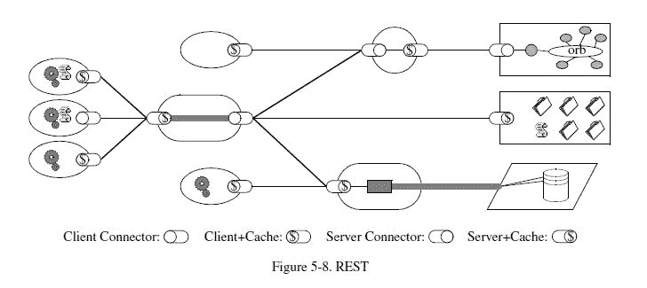
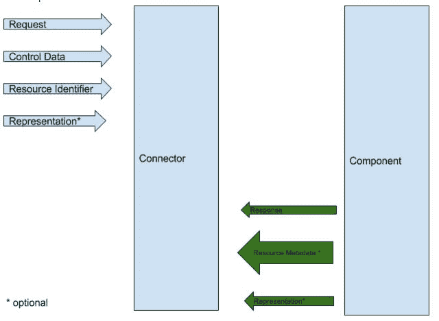
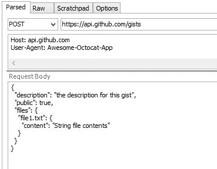
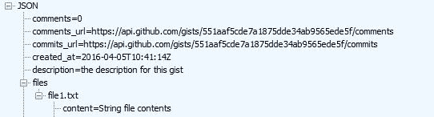
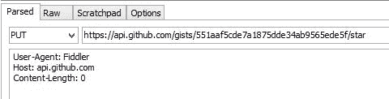

# 二、理解 HTTP 和 REST

REST 表示代表性状态转移。REST 架构风格是 Roy T.Fielding 的一篇博士论文，题为*架构风格和基于网络的软件设计*。这篇论文在经过 6 年的研究后于 2000 年首次发表。我们可以感谢菲尔丁先生的研究工作和发现。

现代的 API 是以 REST 为模型的，你会听到人们提到，*它不是 RESTful 或被质疑的，你的 API 是 RESTful 吗？*

要创建定义良好的 API 并对其建模，您需要对 REST 有充分的了解。出于这个原因，我们将深入研究 Roy T.Fielding 的研究。

罗伊·T·菲尔丁着手解决 1993 年出现的几个问题。许多作者在网络上发表他们的作品，他们希望合作。网络成为了一个分享和讨论研究工作的好地方。然而，它一流行就变得麻烦了。

就文件的发布方式和编辑方式而言，似乎缺少标准。还有一些与基础设施和速度有关的问题，编辑和访问文档的速度很慢。

在本章中，我们将探讨以下主题：

*   软件架构
*   休息原则
*   REST 建筑元素
*   超文本传输协议
*   HTTP/2
*   理查森成熟度模型

# 软件架构

软件架构（architecture）是软件系统在运行阶段的运行时元素的抽象。一个系统可能由多个抽象层次和多个操作阶段组成，每个阶段都有自己的软件架构。

软件架构由架构元素、组件、连接器和数据的配置定义，这些元素、组件、连接器和数据在它们的关系中受到约束，以实现所需的架构属性集：

*   **组件**：是软件指令和内部状态的抽象单元，通过接口提供数据转换
*   **连接器**：这是一种抽象机制，用于调解组件之间的通信、协调或协作
*   **数据**：这是一个信息元素，通过其连接器从组件传输或由组件接收

REST 架构样式是几种网络架构的组合：

*   数据流样式：
    *   管道和过滤器
    *   均匀管和过滤器
*   复制样式：
    *   复制存储库
    *   隐藏物

*   分层样式：
    *   客户端服务器
    *   分层系统和分层客户机服务器
    *   客户端无状态服务器
    *   客户端缓存无状态服务器
    *   分层客户端缓存无状态服务器
    *   远程会话
    *   远程数据访问
*   移动代码样式：
    *   虚拟机
    *   远程评估
    *   按需编码
    *   分层按需代码客户端缓存无状态服务器
    *   移动代理
*   点对点样式：
    *   基于事件的集成
    *   C2
    *   分布式对象
    *   代理分布式对象

# 休息原则

REST 的建模方法是从零开始，然后添加约束。我们将对软件架构应用约束，您的架构将变得 RESTful。

# 客户机-服务器

注意，在 Roy T.Fielding 的整个工作中，他没有提到 REST 必须应用于 HTTP 协议。在我们的例子中，客户端服务器将作为浏览器作为客户端，IIS 作为服务器。

注意，客户机和服务器的分离允许抽象。这两个组件可以独立构建，也可以独立部署。

# 无国籍

下一个要添加的约束是无状态的。服务器不应包含任何工作流状态。这样，客户机就是其所需信息的驱动程序。当客户端向服务器请求数据时，客户端需要将所有相关信息传递给服务器。这种设计软件的方法创建了一个抽象，其中服务器不知道客户机；它创造了一个松散的耦合设计，这有利于改变。在本章后面，我们将通过扩展幂等概念来进一步研究无状态。

客户端必须跟踪其状态。缺点是客户机必须在每次请求时向服务器发送更多数据。

拥有无状态服务器允许扩展，因为服务器不存储任何特定于客户端的数据。

# 隐藏物

缓存是下一个约束。每当服务器传输不会更改的数据时，我们将这些数据称为静态数据。服务器可以缓存数据。

当发出第一个请求时，服务器将访问数据库以获取数据。然后，应将该数据缓存为应用层。对该数据的每个后续请求都将从缓存中提取，从而将服务器的请求保存到数据库中，从而更快地将响应返回到客户端。

# 统一界面

这是使 REST 不同于其他网络架构模式的约束。组件公开的接口是通用的。服务器不了解其消费者。它以相同的方式处理来自客户端的所有请求。您得到的是粗粒度的数据，因为并非所有的消费者都需要这样数量的数据。

要获得统一的界面，必须应用四个约束：

*   确定资源
*   操纵资源
*   自描述性消息
*   作为应用状态引擎的超媒体

我们稍后将研究这些问题。

# 分层系统

通过对组件进行分层，我们确保每个组件不知道其邻居连接到的层。这促进了良好的安全性，以便有良好的边界墙。它还允许在您的架构中使用旧系统时对其进行保护，并允许您保护新系统：



With the layered approach, it leads to many hops between systems, but you have the security boundaries, and components can be updated individually.

# 按需编码

这可能是 REST 最不受欢迎的特性。它允许服务器通过客户端可以执行的小程序或脚本向客户端提供代码。这允许服务器在部署后向客户端提供更多功能。约束是可选的，我们将不详细探讨它。

# REST 建筑元素

如前所述，REST 不是一个协议，可以在没有实现的情况下讨论它。REST 的关键元素是向组件、连接器和数据添加约束的能力。

# 数据元素

选择需要将数据从服务器传输到客户端的超链接时，客户端需要解释数据并将其呈现为用户所需的格式。REST 原则是如何做到这一点的？REST 组件将数据和元数据传输到客户机，并提供帮助客户机组合其请求的资源的说明：

| **数据元** | **现代网络示例** |
| 资源 | 超文本引用的预期概念目标 |
| 资源标识符 | URL，URN |
| 代表 | HTML 文档，JPEG 图像 |
| 表示元数据 | 媒体类型，上次修改时间 |
| 资源元数据 | 源链接、替换、更改 |
| 控制数据 | 如果自之后进行了修改，则缓存控制 |

# 资源和资源标识符

资源是对您希望共享的任何信息的引用。它可以是您希望与朋友共享的图片或文档。罗伊·T·菲尔丁非常准确地总结了一个资源。资源是到一组实体的概念映射，而不是在任何特定时间点对应于映射的实体。更准确地说，资源 R 是一个随时间变化的隶属函数`Mr(r)`，对于时间 t，它映射到一组等价的实体或值。集合中的值可以是资源表示和/或资源标识符。

当在组件之间使用资源时，REST 使用资源标识符来知道它是哪个资源。

在组件之间使用资源时，您的资源应该有一个资源标识符，REST 使用该标识符来标识您的资源。

# 陈述

表示是要共享的数据和与其关联的元数据的组合。表示的格式称为媒体类型。本章后面将用一些具体的例子更详细地讨论媒体。当服务器发送一些数据供客户端渲染时，媒体类型很重要；理想情况下，服务器将首先发送媒体类型，该类型将向客户端描述应如何呈现数据。当客户机接收到数据时，它可以开始呈现表示，从而获得更好的用户体验。这与客户端接收所有数据，然后接收有关如何呈现表示的指示进行比较。

# 连接器

连接器的类型有客户端、服务器、缓存、解析器和隧道。您可以将连接器视为接口。它们抽象了组件的通信方式。在 REST 架构中，连接器的工作是支持检索资源表示以及公开资源。其余的是无国籍的；每个请求都必须包含服务器处理来自客户端的请求所需的所有信息。

让我们看看 REST 用来处理请求的模型。该请求可以与存储过程进行比较：



Control Data defines the purpose of a message between components, such as the action being requested or the meaning of a response.

-Roy T.Fielding 的《架构风格和基于网络的软件架构设计》，第 5.2.1.2 节，第 109 页

# 组件

REST 架构中的一个组件是客户端上的 web 浏览器和服务器上的 IIS。

# 超文本传输协议

HTTP 代表超文本传输协议。第一个版本是 0.9；然后是 1.0 版。

1.0 和 1.1 之间的关键区别在于客户端与服务器建立连接，并且该连接被重用，而在 HTTP 1.0 中，该连接被丢弃，对于每个请求，都会创建一个新的连接。HTTP 1.1 也是通过将 REST 约束应用于 1.0 而派生的。

基本 HTTP 消息由头和正文组成。

当客户端与服务器通信时，它通过 HTTP 进行通信。服务器用消息和代码响应客户机。

# HTTP/1.1 状态代码

有一系列广泛的状态代码，向客户端指示服务器处理的请求发生了什么：

*   `2xx`：成功
*   `200`：好的
*   `201`：已创建
*   `3xx`：重定向
*   `4xx`：客户端错误

*   `400`：请求错误
*   `401`：未经授权
*   `403`：禁止
*   `404`：未找到
*   `409`：冲突
*   `5xx`：服务器错误
*   `500`：内部服务器错误

我们将集中讨论最常见的代码，以及在本书后面实现 API 时将使用的代码。

# API 示例

我已经使用 GithubAPI 来显示基本的 HTTP 方法。如果您希望探索 API，可以注册到 GitHub 并获得身份验证令牌。在下一章中，我们将创建自己的 API。在这些示例中，我们充当 API 的使用者。在这些示例中，我使用 Fiddler 发出请求。你可以使用任何你喜欢的工具；其他常用的工具是 Postman，它内置在 Chrome 浏览器或高级 Rest 客户端中。幂等元是 RESTAPI 使用的术语；简单地说，当您调用一个方法时，无论您调用它多少次，它都将返回相同的数据。在下面的示例中，我将列出哪些方法是幂等的。

# HTTP POST 示例

我们的 HTTP 方法是 POST 和[https://api.github.com/gists](https://api.github.com/gists) 是我们的资源。我们在请求中也有一个头值。`User-Agent`为表头键，取值为`Awesome-Octocat-App`。这是文档中指定的内容。

您可以在以下屏幕截图中记录请求正文：



这是我们对`POST`方法的要求。

我们对这一请求的回应如下所示。服务器已响应`201`，表示我们的请求有效，服务器已成功执行操作：


服务器还向我们发回一个资源。一个新的资源已经诞生，我们可以从中获取数据。

`POST`不是幂等的。REST 世界中的幂等式意味着，作为客户机，当我多次调用端点时，我希望收到相同的行为，或者希望返回相同的数据。考虑一个示例，您必须创建一个与唯一电子邮件地址的联系人。当您第一次使用此电子邮件地址和其他联系方式呼叫`POST`时，服务器将以`201`进行响应，这意味着已经创建了联系人并发布了唯一的资源，您可以在其中获取该数据。

如果您使用相同的电子邮件地址调用`POST`方法，会发生什么？服务器应返回冲突，`409`。该电子邮件存在于数据存储中。所以`POST`不是幂等的：


# HTTP 获取示例

使用来自服务器的资源，我们对资源执行`GET`：


服务器以`200`状态响应，状态为 OK：


服务器返回我们请求的数据：



`GET`是幂等的，当我们发出第一次请求时，我们得到一个响应。发出相同的请求将返回相同的响应。这也与无国籍的 REST 原则有关。为了让这个`GET`请求返回相同的数据，服务器应该是无状态的。

# HTTP PUT 示例

我们可以使用以下 URL 对我们的表示进行更新。注意 HTTP 动词`PUT`。

文档中说，我们可以在下面的资源中调用`PUT`方法，并将`/star`作为 URI 的一部分。`PUT`用于修改我们的表述。通常，`PUT`会有一个主体。在 GitHub 的 GistAPI 中，他们简化了它。一般来说，`PUT`的概念与`POST`相似，只是 URI 包含调用`POST`方法时收到的标识符：



当资源不存在时，`PUT`的行为类似于`POST`。在我们来自`POST`的示例中，如果您必须在第一次呼叫`PUT`时使用`POST`请求来创建联系人，那么您将收到`201`，通知您资源已创建。然后，如果您必须再次在`PUT`上调用请求，您将返回`200`并获得相同的数据。这样，`PUT`就是幂等的。

# HTTP 删除示例

`DELETE`与`GET`非常相似。我们的 HTTP 方法是`DELETE`，我们想撤销我们用`PUT`创建的星 put。`DELETE`通常没有主体：


`DELETE`是幂等的；当您呼叫`DELETE`时，您将返回`200`，表示该资源已被删除。再次发出此请求将导致`404`，未找到资源，因为数据已被删除。再次拨打此电话将导致`404`。虽然响应已从`200`更改为`404`，但您仍然可以恢复相同的行为，服务器也没有做任何不同的事情。

# HTTP 的第 2 版

HTTP/2 是对 HTTP 1.1 的优化。许多浏览器已经支持 HTTP/2；你的 Chrome 浏览器已经做到了。

HTTP/2 是两个规范的组合：超文本传输协议版本 2（RFC7540）和 HTTP2 的 HPACK-Header 压缩（RFC7541）。

在**传输层安全**（**TLS**上使用 HTTP/2 时，使用“h2”表示协议。

当通过明文 TCP 使用 HTTP/2 或 HTTP.1.1 升级时，使用“h2c”字符串。

`GET`请求的示例如下：

GET / HTTP/1.1
Host: server.example.com
Connection: Upgrade, HTTP2-Settings
Upgrade: h2c
HTTP2-Settings: <base64url encoding of HTTP/2 SETTINGS payload>

-RCF 7540 第 3.2 节

此请求来自不知道是否支持 HTTP/2 的客户端。它发出 HTTP 1.1 请求，但在标头“h2c”中包含一个升级字段，以及至少一个 HTTP2 设置标头字段：

A server that does not support HTTP/2 will respond as follows:

HTTP/1.1 200 OK
Content-Length: 243
Content-Type: text/html

-RCF 7540 第 3.2 节

这看起来像一个常规的 HTTP/1.1 响应：

A server that does support HTTP/2 will respond as follows:

HTTP/1.1 101 Switching Protocols
Connection: Upgrade
Upgrade: h2c
[ HTTP/2 connection ...

-RCF 7540 第 3.2 节

在 HTTP2 中引入了一个框架作为基本单元。您可以将帧视为通过导线传输的数据包。对于请求和响应，使用`HEADER`和`DATA`帧作为构建块，对于 HTTP/2 特性，使用`SETTINGS`、`WINDOWS_UPDATE`和`PUSH_PROMISE`帧。

# 单连接

服务器和客户端都可以使用服务器和客户端之间的单个连接来传输多个请求。假设您有一个包含多个组件的页面，所有这些组件都向服务器发出独立请求，比如说，一个将获得今天的天气，一个将获得最新的股票价格，还有一个将获得最新的标题。它们都可以通过一个连接而不是三个单独的连接来实现。这也适用于服务器。你最终得到的是更少的连接被创建。

# 服务器推送

服务器可以将数据推送到客户端。当客户机从服务器请求数据时，服务器可以确定客户机还需要一些其他数据。服务器可以将此数据推送到客户端。客户端总是可以通过向服务器发送应禁用推送数据的信号来拒绝数据。服务器发送给客户端的数据称为`PUSH_PROMISE`帧。如果客户端实现了 HTTP 缓存，则数据存储在客户端缓存中。

# 多路复用和流

流就像一个隧道，有许多汽车在两个方向上通过，汽车被帧取代，流在客户端和服务器之间是独立的。在 HTTP/2 中，一个连接可以有多个流，来自一个请求的帧分布在多个流上，尽管帧的顺序很重要。

这是对 HTTP 1.1 的重大改进，HTTP 1.1 使用多个连接来呈现单个页面。

# 流优先级

拥有多个流是很好的，但是有时候，您希望一个流在另一个流之前被寻址。在 HTPP/2 中，客户端可以在`HEADERS`帧中指定流的优先级。客户端可以使用`Priority`帧更改流的优先级。通过这种方式，客户机可以向其对等方指示它希望如何处理其请求。

# 二进制消息

与文本相比，采用二进制格式的消息处理速度更快。由于它们是有线传输的本机二进制格式，因此不需要通过 TCP 协议将文本转换为二进制。

# 头压缩

随着 web 的发展，更多的数据从服务器发送到客户端，从客户端发送到服务器。HTTP 1.1 不压缩头字段。HTTP 在 TCP 上工作，并通过此连接发送请求，其中头文件较大且包含冗余数据。TCP 采用网络拥塞避免算法实现的慢启动，该算法将数据包放置在网络上。如果报头被压缩，更多的数据包可以通过网络发送。HTTP/2 通过报头压缩修复了这个问题，报头压缩利用了 TCP，从而提高了数据传输速度。

# 媒体类型

通常称为**MIME**（**多用途互联网邮件扩展**类型），媒体类型用于标识 HTTP 消息体的格式。媒体类型为`{type/subtype}`格式；举例如下：

*   文本/html
*   图像/png
*   音频/mpeg
*   视频/视频

请求可以如下所示：

```cs
    GET: 
    Host: 
    Accept:application/json, text/javascript 

```

客户端正在指定它可以接收数据的格式。

# 理查森成熟度模型

**理查森成熟度模型**（**RMM**由 Leonard Richardson 开发。通常称为 RMM，用于升级 API 的标准。

# 0 级

这是传统的基于 soap 的 web 服务或 XML-RPC 服务。它使用 HTTP，但有一个方法和一个 URI。此方法通常为`POST`，将返回大量数据集。我相信我们所有人都曾经使用过这种类型的 web 服务，或者在某个时候可能会遇到它。整个数据库作为数据集包装在此输出中。

# 一级

资源是公开的，但您仍然有一个 HTTP 方法。如果您处于级别 0，那么更改 web 服务以返回资源将使您从级别 0 转到级别 1。您仍然有一个 HTTP 方法，但当调用您的方法时，您的服务将传回一个资源：

```cs
    Request: 
    POST 
    diet/ate 
    Response 
    diet/ate/12789 
    Request: 
    POST 
    diet/ate 
    Response: 
    diet/ate/99000 

```

仍然有一个端点`diet/ate`，它返回许多资源。

# 二级

级别 2 用于使用 HTTP 谓词。因此，在级别 1 中，我们介绍了资源，级别 2 介绍了动词。

使用前面的例子，当你在上午 10 点发布你吃的东西时，服务器会给你一个资源。使用此资源，您可以在该资源上执行`GET`，并查看您在上午 10 点吃了什么的详细信息：

```cs
    GET: diet/ate/12789 
    Response  
    { 
      'time':'10:00', 
      'apple':'1', 
      'water':'2' 
    } 

```

然后您可以使用`PUT`更新这些详细信息；请注意，我们使用的是同一资源。

请求如下：

```cs
    PUT: diet/ate/12789 
    { 
      'time':'10:00', 
      'tea':'1', 
      'muffin':'3' 
    } 

```

如果您稍后意识到您在上午 10 点没有吃饭，您也可以删除此资源：

```cs
    DEL : diet/ate/12789 

```

我们使用相同的资源，但使用了不同的动词。

当我们在 1 级创建资源时，我们将`POST`更改为在创建资源时返回 201，如果资源存在，则返回`409`冲突。

第 2 级部分使用响应代码，不会在每次操作中返回`200`。

# 三级

在第三级，超媒体被引入我们的响应中，通常称为**HATEOAS**（**超文本作为应用状态**的引擎）。

让我们回到`POST`示例：

```cs
    POST : diet/ate  
    Response: 
    { 
      "id":"12789", 
      "links":[{ 
        "rel":"self", 
        "href":"http://yoursitename/diet/12789 
      }, 
      { 
        "Rel":"self", 
        "href":"http://yoursitename/diet/12789" 
      }, 
      "rel":"rating", 
      "href":"http://yoursitename/diet/12789/rating/" 
      ] 
    } 

```

链接的要点是，它让消费者知道它可以执行哪些操作。

虽然两个端点看起来相同，但消费者会发现一个是`DELETE`，另一个是`PUT`。

最后一个链接是对您添加的膳食进行评分的资源。

# 总结

我们研究了 REST 的定义以及 REST 是如何派生出来的。当您查看 REST 架构时，您应该能够将其分为三类，正如 Roy T.Fielding 所解释的那样。一个是流程视图，它描述了数据如何从客户机流向多个组件。第二，连接器视图专门用于在特定于资源和资源标识的组件之间交换消息。第三，我们称之为表示的数据如何从服务器传输到客户端的数据视图。对 REST 原则有一个很好的理解是非常重要的，REST 被应用于 HTTP1.0，以便派生 HTTP1.1。

HTTP 是 REST 原则的一个活生生的例子。像`GET`和`POST`这样的动作是无状态的，这是休息的原则。这些示例展示了如何构造 HTTP 请求以及服务器作为响应返回的内容。有了 HTTP/2，我们就有了新的特性，这使得我们的传输速度更快，应用响应更快。

Richardson 成熟度模型解释了 API 是如何分类的；作为一名开发人员，您应该以 3 级模型为目标。如果您是 API 的消费者，可能需要在几个选项中进行选择。RMM 将帮助您做出明智的决定。

在本章中，我们没有关注具体的技术；在下一章中，我们将深入研究 ASP.NET Core 及其作为框架提供的内容，以构建 web API。